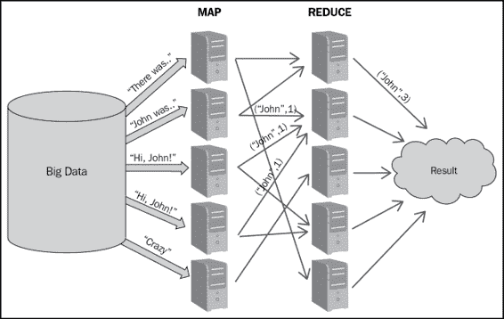
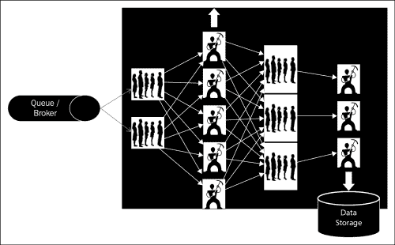
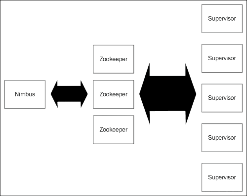
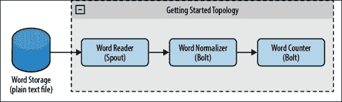
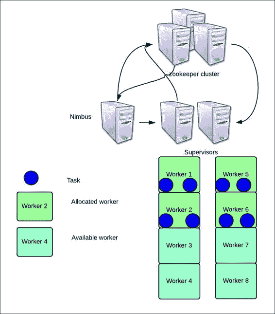

# 第一章：让我们了解风暴

在本章中，您将熟悉需要分布式计算解决方案的问题，并了解创建和管理此类解决方案可能变得多么复杂。我们将研究解决分布式计算的可用选项。

本章将涵盖以下主题：

+   熟悉需要分布式计算解决方案的一些问题

+   现有解决方案的复杂性

+   提供实时分布式计算的技术

+   对 Storm 各个组件的高层次视图

+   飞机通信寻址和报告系统的内部快速查看

在本章结束时，您将能够了解 Apache Storm 的实时场景和应用。您应该了解市场上提供的解决方案以及 Storm 仍然是最佳开源选择的原因。

# 分布式计算问题

让我们深入了解一些需要分布式解决方案的问题。在我们今天生活的世界中，我们对现在的力量如此敏感，这就产生了分布式实时计算的需求。银行、医疗保健、汽车制造等领域是实时计算可以优化或增强解决方案的中心。

## 实时商业解决方案，用于信用卡或借记卡欺诈检测

让我们熟悉以下图中描述的问题；当我们使用塑料货币进行任何交易并刷卡进行付款时，银行必须在五秒内验证或拒绝交易。在不到五秒的时间内，数据或交易细节必须加密，通过安全网络从服务银行到发卡银行，然后在发卡银行计算交易的接受或拒绝的整个模糊逻辑，并且结果必须通过安全网络返回。

实时商业解决方案，用于信用卡或借记卡欺诈检测

实时信用卡欺诈检测

挑战，如网络延迟和延迟，可以在一定程度上进行优化，但要在 5 秒内实现前述特性交易，必须设计一个能够处理大量数据并在 1 到 2 秒内生成结果的应用程序。

## 飞机通信寻址和报告系统

飞机通信寻址和报告系统（ACAR）展示了另一个典型的用例，如果没有可靠的实时处理系统，就无法实现。这些飞机通信系统使用卫星通信（SATCOM），根据以下图，它们实时收集来自飞行各个阶段的语音和数据包数据，并能够实时生成分析和警报。

飞机通信寻址和报告系统

让我们以前述案例中的图为例。飞行遭遇一些真正危险的天气，比如航线上的电暴，然后通过卫星链路和语音或数据网关将该信息发送给空中管制员，后者实时检测并发出警报，以便所有通过该区域的其他航班改变航线。

## 医疗保健

在这里，让我们向您介绍医疗保健的另一个问题。

这是另一个非常重要的领域，实时分析高容量和速度数据，为医疗保健专业人员提供准确和精确的实时信息，以采取知情的挽救生命行动。

医疗保健

前面的图表描述了医生可以采取明智行动来处理患者的医疗情况的用例。数据来自历史患者数据库、药物数据库和患者记录。一旦数据被收集，它就被处理，患者的实时统计数据和关键参数被绘制到相同的汇总数据上。这些数据可以用来进一步生成报告和警报，以帮助医护人员。

## 其他应用

还有各种其他应用，实时计算的力量可以优化或帮助人们做出明智的决定。它已成为以下行业的重要工具和辅助：

+   **制造业**：实时的缺陷检测机制可以帮助优化生产成本。通常，在制造业领域，质量控制是在生产后进行的，由于货物中存在类似的缺陷，整批货物就会被拒绝。

+   **交通运输行业**：基于实时交通和天气数据，运输公司可以优化其贸易路线，节省时间和金钱。

+   **网络优化**：基于实时网络使用警报，公司可以设计自动扩展和自动缩减系统，以适应高峰和低谷时段。

# 复杂分布式用例的解决方案

现在我们了解了实时解决方案可以在各个行业垂直领域发挥的作用，让我们探索并找出我们在处理大量数据时产生的各种选择。

## Hadoop 解决方案

Hadoop 解决方案是解决需要处理海量数据问题的解决方案之一。它通过在集群设置中执行作业来工作。

MapReduce 是一种编程范例，我们通过使用一个处理键和值对的 mapper 函数来处理大数据集，从而生成中间输出，再次以键值对的形式。然后，减速函数对 mapper 输出进行操作，并合并与相同中间键相关联的值，并生成结果。

在前面的图中，我们演示了简单的单词计数 MapReduce 作业，其中使用 MapReduce 演示了简单的单词计数作业，其中：

+   有一个巨大的大数据存储，可以达到赫兹或皮字节。

+   输入数据集或文件被分割成配置大小的块，并根据复制因子在 Hadoop 集群中的多个节点上复制每个块。

+   每个 mapper 作业计算分配给它的数据块上的单词数。

+   一旦 mapper 完成，单词（实际上是键）及其计数存储在 mapper 节点上的本地文件中。然后，减速器启动减速功能，从而生成结果。

+   Reducer 将 mapper 输出合并，生成最终结果。

大数据，正如我们所知，确实提供了一种处理和生成结果的解决方案，但这主要是一个批处理系统，在实时使用情况下几乎没有用处。

## 一个定制的解决方案

在这里，我们谈论的是在我们拥有可扩展框架（如 Storm）之前在社交媒体世界中使用的解决方案。问题的一个简化版本可能是，您需要实时统计每个用户的推文数量；Twitter 通过遵循图中显示的机制解决了这个问题：

以下是前述机制的详细信息：

+   一个定制的解决方案创建了一个消防软管或队列，所有推文都被推送到这个队列上。

+   一组工作节点从队列中读取数据，解析消息，并维护每个用户的推文计数。该解决方案是可扩展的，因为我们可以增加工作人员的数量来处理系统中的更多负载。但是，用于将数据随机分布在这些工作节点中的分片算法应该确保数据均匀分布给所有工作节点。

+   这些工作人员将第一级计数合并到下一组队列中。

+   从这些队列（在第 1 级提到的队列）中，第二级工作人员从这些队列中挑选。在这里，这些工作人员之间的数据分布既不均匀，也不随机。负载平衡或分片逻辑必须确保来自同一用户的推文始终应该发送到同一个工作人员，以获得正确的计数。例如，假设我们有不同的用户——"A、K、M、P、R 和 L"，我们有两个工作人员"工作人员 A"和"工作人员 B"。来自用户"A、K 和 M"的推文总是发送到"工作人员 A"，而来自"P、R 和 L 用户"的推文发送到"工作人员 B"；因此"A、K 和 M"的推文计数始终由"工作人员 A"维护。最后，这些计数被转储到数据存储中。

在前面的点中描述的队列工作解决方案对我们的特定用例效果很好，但它有以下严重的限制：

+   这是非常复杂的，具体到使用情况

+   重新部署和重新配置是一项巨大的任务

+   扩展非常繁琐

+   系统不具备容错性

## 有许可的专有解决方案

在开源 Hadoop 和自定义队列工作解决方案之后，让我们讨论市场上的有许可选项的专有解决方案，以满足分布式实时处理的需求。

大公司的**阿拉巴马州职业治疗协会**（**ALOTA**）已经投资于这类产品，因为他们清楚地看到计算的未来发展方向。他们可以预见到这类解决方案的需求，并在几乎每个垂直领域支持它们。他们已经开发了这样的解决方案和产品，让我们进行复杂的批处理和实时计算，但这需要付出沉重的许可成本。一些公司的解决方案包括：

+   **IBM**：IBM 开发了 InfoSphere Streams，用于实时摄入、分析和数据相关性。

+   **Oracle**：Oracle 有一个名为**实时决策**（**RTD**）的产品，提供实时环境下的分析、机器学习和预测

+   **GigaSpaces**：GigaSpaces 推出了一个名为**XAP**的产品，提供内存计算以提供实时结果

## 其他实时处理工具

还有一些其他技术具有一些类似的特征和功能，如雅虎的 Apache Storm 和 S4，但它缺乏保证处理。Spark 本质上是一个批处理系统，具有一些微批处理的功能，可以用作实时处理。

# Storm 各个组件的高级视图

在本节中，我们将让您了解 Storm 的各个组件，它们的作用以及它们在 Storm 集群中的分布。

Storm 集群有三组节点（可以共同定位，但通常分布在集群中），分别是：

+   Nimbus

+   Zookeeper

+   监督者

以下图显示了这些节点的集成层次结构：

集成层次结构的详细解释如下：

+   **Nimbus 节点**（类似于 Hadoop-JobTracker 的主节点）：这是 Storm 集群的核心。你可以说这是负责以下工作的主要守护进程：

+   上传和分发各种任务到集群中

+   上传和分发拓扑 JAR 作业到各个监督者

+   根据分配给监督者节点的端口启动工作人员

+   监视拓扑执行并在必要时重新分配工作人员

+   Storm UI 也在同一节点上执行

+   **Zookeeper 节点**：Zookeeper 可以被指定为 Storm 集群中的簿记员。一旦拓扑作业从 Nimbus 节点提交并分发，即使 Nimbus 死亡，拓扑也会继续执行，因为只要 Zookeeper 还活着，可工作状态就会被它们维护和记录。这个组件的主要责任是维护集群的运行状态，并在需要从某些故障中恢复时恢复运行状态。它是 Storm 集群的协调者。

+   **监督者节点**：这些是 Storm 拓扑中的主要处理室；所有操作都在这里进行。这些是守护进程，通过 Zookeeper 与 Nimbus 通信，并根据 Nimbus 的信号启动和停止工作进程。

# 深入了解 Storm 的内部

现在我们知道了 Storm 集群中存在哪些物理组件，让我们了解拓扑提交时各种 Storm 组件内部发生了什么。当我们说拓扑提交时，意味着我们已经向 Storm Nimbus 提交了一个分布式作业，以在监督者集群上执行。在本节中，我们将解释 Storm 拓扑在各种 Storm 组件中执行时所执行的各种步骤：

+   拓扑被提交到 Nimbus 节点。

+   Nimbus 在所有监督者上上传代码 jar，并指示监督者根据 Storm 中定义的`NumWorker`配置或`TOPOLOGY_WORKERS`配置启动工作进程。

+   在同一时间段内，所有 Storm 节点（Nimbus 和监督者）不断与 Zookeeper 集群协调，以维护工作进程及其活动的日志。

根据以下图，我们已经描述了拓扑结构和拓扑组件的分布，这在所有集群中都是相同的：

在我们的情况下，假设我们的集群由一个 Nimbus 节点、一个 Zookeeper 集群中的三个 Zookeeper 和一个监督者节点组成。

默认情况下，每个监督者分配了四个插槽，因此每个 Storm 监督者节点将启动四个工作进程，除非进行了配置调整。

假设所描述的拓扑分配了四个工作进程，并且每个工作进程都有两个并行度的螺栓和一个并行度为四的喷口。因此，总共有八个任务要分配到四个工作进程中。

因此，拓扑将被执行为：每个监督者上有两个工作进程，每个工作进程内有两个执行器，如下图所示：

# 测验时间

Q.1 尝试围绕以下领域的实时分析提出一个问题陈述：

+   网络优化

+   流量管理

+   远程感知

# 总结

在本章中，您已经通过探索不同垂直领域和领域中的各种用例，了解了分布式计算的需求。我们还向您介绍了处理这些问题的各种解决方案，以及为什么 Storm 是开源世界中的最佳选择。您还了解了 Storm 组件以及这些组件在工作时的内部操作。

在下一章中，我们将介绍设置方面，并通过简单的拓扑使您熟悉 Storm 中的编程结构。
