# 第二章：开始您的第一个拓扑

本章致力于指导您完成为执行 Storm 拓扑设置环境的步骤。目的是准备用户沙盒，并引导您执行一些示例代码，并了解各个组件的工作原理。所有概念都将附有代码片段和“自己动手试一试”部分，以便您能够以实际方式理解组件，并准备好探索和利用这一美妙技术的力量。

本章将涵盖的主题如下：

+   Storm 拓扑和组件

+   执行示例 Storm 拓扑

+   在分布式模式下执行拓扑

在本章结束时，您将能够理解拓扑中的组件和数据流，理解简单的单词计数拓扑，并在本地和分布式模式下执行它。您还将能够调整启动器项目拓扑，以添加自己的风格。

# 设置 Storm 的先决条件

列出了执行设置和执行步骤的先决条件：

+   对于本地模式设置，您需要 Maven、Git、Eclipse 和 Java

+   对于分布式设置，您需要以下内容：

+   Linux 或 Ubuntu 设置或分布式设置可以在 Windows 系统上使用 PowerShell 或 Cygwin

+   使用 VMware player 的多个系统或虚拟机会有所帮助

您可以参考以下链接，并按照书中所述的过程设置所需的各种开源组件，以设置 Storm 并部署本书段中解释的组件： 

+   对于 Java，[`java.com/en/download/index.jsp`](https://java.com/en/download/index.jsp)

+   对于 Eclipse，[`www.eclipse.org/downloads/`](https://www.eclipse.org/downloads/)

+   对于 Cygwin，[`cygwin.com/install.html`](http://cygwin.com/install.html)

+   对于 Git，[`help.github.com/articles/set-up-git`](https://help.github.com/articles/set-up-git)

# Storm 拓扑的组件

Storm 拓扑由两个基本组件组成：一个喷口和一个或多个螺栓。这些构件使用流连接在一起；正是通过这些流，无尽的元组流动。

让我们用一个简单的类比来讨论拓扑，如图所示，并在此后进行解释：

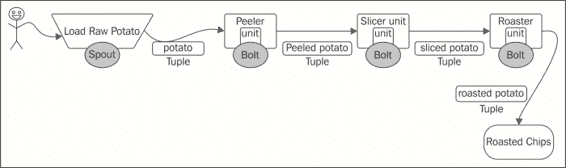

在我们的示例拓扑中，我们有一个用于烤薯片的大型处理单元，其中输入的*生土豆*由喷口消耗，还有各种螺栓，如去皮螺栓、切片螺栓和烘烤螺栓，执行其名称所示的任务。有各种装配线或工人将薯片从去皮单元移动到切片机等等；在我们的情况下，我们有流来连接和连接喷口和螺栓。现在，去皮机和切片机之间的交换基本单元是去皮的土豆，切片机和烘烤机之间的交换基本单元是切片的土豆。这类似于元组，是喷口和螺栓之间信息交换的数据。

让我们更仔细地看看 Storm 拓扑的构件。

### 注意

Storm 中数据交换的基本单元称为*元组*；有时也称为*事件*。

## 喷口

喷口是拓扑的收集漏斗；它将事件或元组馈送到拓扑中。它可以被视为 Storm 处理单元——拓扑的输入源。

spout 从外部源（如队列、文件、端口等）读取消息。同时，spout 将它们发射到流中，然后将它们传递给螺栓。Storm spout 的任务是跟踪每个事件或元组在其处理过程中通过**有向无环图**（**DAG**）的整个过程。然后，Storm 框架根据拓扑中元组的执行结果发送和生成确认或失败通知。这种机制为 Storm 提供了保证处理的特性。根据所需的功能，spouts 可以被编程或配置为可靠或不可靠。可靠的 spout 将失败的事件重新播放到拓扑中。

下面的图表以图形方式描述了相同的流程：

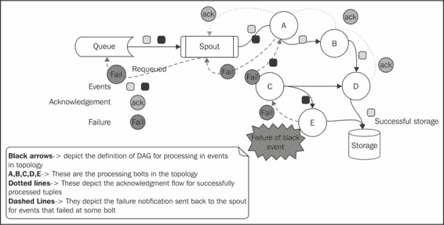

所有的 Storm spouts 都被实现为能够在一个或多个流螺栓上发射元组。就像前面的图表中，一个 spout 可以发射元组到螺栓**A**和**C**。

每个 spout 都应该实现**IRichSpout**接口。以下是与 spout 相关的重要方法：

+   `nextTuple()`: 这是一个不断轮询外部源以获取新事件的方法；例如，前面示例中的队列。在每次轮询时，如果方法发现一个事件，它会通过流发射到拓扑结构中，如果没有新事件，方法会简单地返回。

+   `ack()`: 当 spout 发射的元组被拓扑成功处理时调用这个方法。

+   `fail()`: 当 spout 发射的元组在指定的超时内没有成功处理时，调用这个方法。在这种情况下，对于可靠的 spouts，spout 使用`messageIds`事件跟踪和追踪每个元组，然后重新发射到拓扑中进行重新处理。例如，在前面的图表中，失败的元组被再次发射。

对于不可靠的 spouts，元组不使用`messageIds`进行跟踪，而`ack()`和`fail()`等方法对于 spout 没有任何价值，因为 spout 不跟踪成功处理的元组。这些拓扑被标识为不可靠的。

### 注意

IRichSpout 是 Storm 提供的一个接口，提供了拓扑 spout 需要实现的合同或方法的详细信息。

## 螺栓

螺栓是拓扑的处理单元。它们是拓扑的组件，执行以下一个或多个任务：

+   解析

+   转换

+   聚合

+   连接

+   数据库交互

拓扑执行的整个过程通常被分解为更小的任务和子任务，最好由不同的螺栓执行，以利用 Storm 的并行分布式处理的能力。

让我们看一下下面的图表，捕捉一个实时用例，其中来自各种飞机的位置坐标被跟踪和处理，以确定它们是否在正确的轨迹上移动：

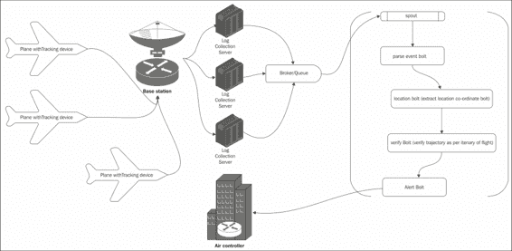

在这里，飞行位置坐标由飞机上的传感器发送，这些传感器被整理到日志服务器并输入到 Storm 拓扑中。Storm 拓扑被分解成以下螺栓，可以对 spout 发射的元组进行操作：

+   解析事件螺栓：这个螺栓过滤和转换 spout 发射的事件。它将信息转换为可解密的格式。

+   位置螺栓：这是从解析螺栓接收的元组中提取位置坐标然后将它们发送到下一个螺栓的螺栓。

+   验证螺栓：这是验证飞机预定义轨迹与位置螺栓发送的位置坐标是否一致的螺栓，如果检测到偏差，它会向警报螺栓发送一个元组。

+   警报螺栓：这个螺栓是通知外部系统（例如我们的情况下的空中交通管制）有关飞行路径中检测到的异常或偏差的行为者。

由于实时使用案例的性质，比如前面图中所示的案例，计算的速度和准确性至关重要，这也是使 Storm 成为实现这类解决方案的强大技术选择的原因。

总体处理逻辑被分解为在 bolt 中执行的较小任务；在 bolt 中配置任务和并行性让工程师们获得解决方案的正确性能。

一个 bolt 可以监听多个流，也可以在不同的流上向多个其他 bolt 发射。如*Sprouts*部分的图所示：

+   Bolt-A 向 Bolt-B 和 Bolt-C 发射

+   Bolt-D 订阅来自 Bolt-C 和 Bolt-B 的流

Storm 提供的用户定义的 bolt 要实现的常见接口如下：

+   IRichBolt

+   IBasicBolt

这两个接口的区别取决于是否需要可靠的消息传递和事务支持。

bolt 使用的主要方法如下：

+   `prepare()`: 这是在 bolt 初始化时调用的方法。基本上，Storm 拓扑会一直运行，一旦初始化，bolt 就不会在拓扑被终止之前终止。这个方法通常用于初始化连接和读取其他在整个 bolt 生命周期中需要的静态信息。

+   `execute()`: 这是在 bolt 上执行定义的功能和处理逻辑的方法。它为每个元组执行一次。

## 流

流可以被定义为无界的元组或事件序列。这些流通常以并行和分布的方式在拓扑中创建。流可以被称为从喷口到 bolt 之间的布线或信息流通道。它们是未处理、半处理和已处理信息的载体，用于各种执行任务的组件，如 bolt 和喷口之间的信息传递。在对拓扑进行编码时，流是使用模式配置的，该模式为流的元组命名字段。

## 元组-Storm 中的数据模型

元组是 Storm 中的基本和组成数据结构。它是从喷口开始旅程的命名值列表。然后从流到 bolt 发射，然后从 bolt 到其他 bolt，执行各种处理阶段。在成功完成所有预期的处理后，根据拓扑定义，元组被确认发送回喷口。

# 执行一个样本 Storm 拓扑-本地模式

在我们开始本节之前，假设您已经完成了先决条件并安装了预期的组件。

## 来自 Storm-starter 项目的 WordCount 拓扑结构

为了理解前一节中描述的组件，让我们下载 Storm-starter 项目并执行一个样本拓扑：

1.  可以使用以下 Git 命令下载 Storm-starter 项目：

```scala
Linux-command-Prompt $ sudo git clone git://github.com/apache/incubator-storm.git && cd incubator-storm/examples/storm-starter

```

1.  接下来，您需要将项目导入到 Eclipse 工作区中：

1.  启动 Eclipse。

1.  单击**文件**菜单，然后选择**导入**向导。

1.  从**导入**向导中，选择**现有 Maven 项目**。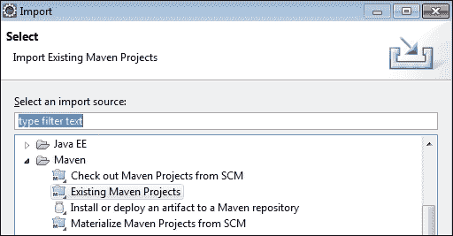

1.  在 Storm-starter 项目中选择**pom.xml**，并将其指定为`<download-folder>/starter/incubator-storm/examples/storm-starter`。

1.  一旦项目成功导入，Eclipse 文件夹结构将如下屏幕截图所示：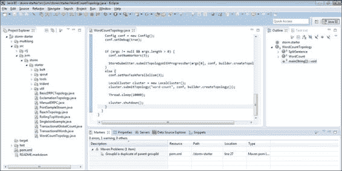

1.  使用 run 命令执行拓扑，您应该能够看到如下屏幕截图中显示的输出：

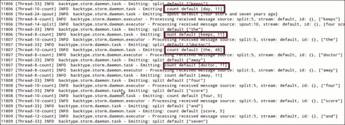

为了理解拓扑的功能，让我们看一下代码，并了解拓扑中每个组件的流程和功能：

```scala
// instantiates the new builder object
TopologyBuilder builder = new TopologyBuilder();
// Adds a new spout of type "RandomSentenceSpout" with a  parallelism hint of 5
builder.setSpout("spout", new RandomSentenceSpout(), 5);
```

```scala
TopologyBuilder object and used the template to perform the following:
```

+   `setSpout –RandomSentenceSpout`：这会生成随机句子。请注意，我们使用了一个称为并行性提示的属性，在这里设置为`5`。这是标识在提交拓扑时将生成多少个此组件实例的属性。在我们的示例中，将有五个 spout 实例。

+   `setBolt`：我们使用这个方法向拓扑中添加两个 bolt：`SplitSentenceBolt`，将句子拆分为单词，和`WordCountBolt`，对单词进行计数。

+   在前面的代码片段中，其他值得注意的项目是`suffleGrouping`和`fieldsGrouping`；我们将在下一章详细讨论这些；现在，了解这些是控制元组路由到拓扑中各个 bolt 的组件。

# 在分布式模式下执行拓扑

要在分布式模式下设置 Storm，需要执行以下步骤。

## 为 Storm 设置 Zookeeper（V 3.3.5）

Storm 拓扑的协调由 Zookeeper 集群维护。Zookeeper 的利用率并不是很高，因为它只是维护 Storm 集群的可运行状态。在大多数情况下，单个 Zookeeper 节点应该足够了，但在生产场景中，建议至少使用一个由三个节点组成的 Zookeeper 集群，以防止单个节点成为单点故障。

为了可靠的 Zookeeper 服务，将 Zookeeper 部署在一个称为**集合**的集群中。只要集合中的大多数机器正常运行，服务就会可用。集合中的一个节点会自动被选为领导者，其他节点会成为跟随者。如果领导者宕机，其中一个跟随者节点会成为领导者。

在所有将成为 Zookeeper 集合一部分的机器上执行以下步骤，以设置 Zookeeper 集群：

1.  从 Apache Zookeeper 网站下载最新的稳定版本（版本 3.3.5）。

1.  在`/usr/local`下创建一个`zookeeper`目录：

```scala
sudo mkdir /usr/local/zookeeper

```

1.  将下载的 TAR 文件提取到`/usr/local`位置。使用以下命令：

```scala
sudo tar -xvf zookeeper-3.3.5.tar.gz -C /usr/local/zookeeper

```

1.  Zookeeper 需要一个目录来存储其数据。创建`/usr/local/zookeeper/tmp`来存储这些数据：

```scala
sudo mkdir –p /usr/local/zookeeper/tmp

```

1.  在`/usr/local/zookeeper/zookeeper-3.3.5/conf`下创建一个名为`zoo.cfg`的配置文件。以下属性将放入其中：

+   `tickTime`：这是每个滴答的毫秒数（例如，2000）。

+   `initLimit`：这是初始同步阶段可以花费的滴答数（例如，5）。

+   `syncLimit`：这是在发送请求和获得确认之间可以经过的滴答数（例如，2）。

+   `dataDir`：这是快照存储的目录（例如，`/usr/local/zookeeper/tmp`）。

+   `clientPort`：这是 Zookeeper 客户端将连接到的端口（例如，2182）。

+   `server.id=host:port:port`：Zookeeper 集合中的每台机器都应该知道集合中的其他每台机器。这是通过`server.id=host:port:port`形式的一系列行来实现的（例如，`server.1:<ZOOKEEPER_NODE_1 的 IP 地址>:2888:3888`）。

1.  重复前面的步骤或将分发复制到将成为 Zookeeper 集群一部分的其他机器上。

1.  在由`datadir`属性指定的目录中创建名为`myid`的文件。`myid`文件包含一行文本，只包含该机器的 ID 的文本（服务器上的 1 和`zoo.cfg`中的 1）。因此，服务器 1 的`myid`将包含文本`1`，没有其他内容。ID 必须在集合中是唯一的，并且应该在 1 到 255 之间。在这种情况下，`myid`文件的路径是`vi /usr/local/zookeeper/tmp/myid`。

1.  编辑`~/.bashrc`文件，并添加一个 Zookeeper 主目录的环境变量，并将其 bin 目录添加到`PATH`环境变量中：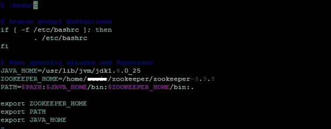

1.  在进行更改后，对`~/`.`bashrc`文件进行源操作。这一步是为了确保对`bashrc`所做的更改应用到当前的终端会话中：

```scala
source ~/.bashrc

```

1.  通过从`$ZOOKEEPER_HOME`执行以下命令在每个节点上启动 Zookeeper 守护进程：

```scala
sudo –E bin/zkServer.sh start

```

1.  通过从`$ZOOKEEPER_HOME`执行以下命令在每个节点上停止 Zookeeper 守护进程：

```scala
sudo –E bin/zkServer.sh stop

```

1.  可以通过从`$ZOOKEEPER_HOME`运行以下命令来检查 Zookeeper 状态：

```scala
sudo –E bin/zkServer.sh status

```

不同模式的输出如下：

+   如果在独立模式下运行（Zookeeper 集群中只有一台机器），将在控制台上看到以下输出：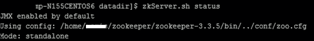

+   如果在集群模式下运行，将在领导节点上看到以下输出：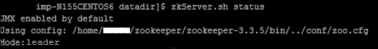

+   如果在集群模式下运行，将在 follower 节点上看到以下输出：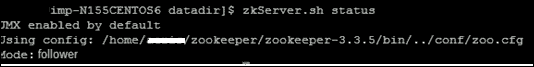

默认情况下，Zookeeper 日志（`zookeeper.out`）将在启动其实例的相同位置创建。这完成了 Zookeeper 集群的设置。

## 在分布式模式下设置 Storm

执行以下步骤设置分布式模式下的 Storm：

1.  从 GitHub Storm 网站下载`Storm-0.9.2-incubating.zip`包。

1.  在`/usr/local`下创建`storm`和`storm/tmp`目录：

```scala
sudo mkdir –p /usr/local/storm/tmp

```

1.  为日志创建以下目录：

```scala
sudo mkdir –p /mnt/abc_logs/storm/storm_logs

```

1.  在 Nimbus 和工作机器上的`/usr/local`目录中解压 ZIP 文件：

```scala
sudo unzip -d /usr/local/storm/ storm-0.9.2 -incubating.zip

```

1.  在`/usr/local/storm/storm-0.9.2-incubating/conf/storm.yaml`中进行以下更改：

+   `storm.zookeeper.servers`：这是 Storm 集群中 Zookeeper 集群中主机的列表：

```scala
storm.zookeeper.servers:
 "<IP_ADDRESS_OF_ZOOKEEPER_ENSEMBLE_NODE_1>"
 "<IP_ADDRESS_OF_ZOOKEEPER_ENSEMBLE_NODE_2>"
```

+   `storm.zookeeper.port`：这是 Zookeeper 集群运行的端口：

```scala
storm.zookeeper.port: 2182
```

+   `storm.local.dir`：Nimbus 和 Supervisor 需要本地磁盘上的位置来存储与拓扑的配置和执行细节相关的少量数据。请确保在所有 Storm 节点上创建该目录并分配读/写权限。对于我们的安装，我们将在`/usr/local/storm/tmp`位置创建此目录：

```scala
storm.local.dir: "/usr/local/storm/tmp"
```

+   `nimbus.host`：节点需要知道哪台机器是主节点，以便下载拓扑 jar 包和配置文件。此属性用于此目的：

```scala
nimbus.host: "<IP_ADDRESS_OF_NIMBUS_HOST>"
```

+   `java.library.path`：这是 Storm 使用的本地库（ZeroMQ 和 JZMQ）的加载路径。对于大多数安装来说，默认值`/usr/local/lib:/opt/local/lib:/usr/lib`应该是可以的，所以在继续之前验证前面提到的位置中的库。

+   `storm.messaging.netty`：Storm 的基于 Netty 的传输已经进行了大幅改进，通过更好地利用线程、CPU 和网络资源，特别是在消息大小较小的情况下，显着提高了性能。为了提供 Netty 支持，需要添加以下配置：

```scala
storm.messaging.transport:"backtype.storm.messaging.netty.Context"
           storm.messaging.netty.server_worker_threads:1
           storm.messaging.netty.client_worker_threads:1
           storm.messaging.netty.buffer_size:5242880
           storm.messaging.netty.max_retries:100
           storm.messaging.netty.max_wait_ms:1000
           storm.messaging.netty.min_wait_ms:100
```

+   我们的 Storm 集群安装中的`storm.yaml`片段如下：

```scala
#To be filled in for a storm configuration
storm.zookeeper.servers:
     - "nim-zkp-flm-3.abc.net"
storm.zookeeper.port: 2182
storm.local.dir: "/usr/local/storm/tmp"
nimbus.host: "nim-zkp-flm-3.abc.net"
topology.message.timeout.secs: 60
topology.debug: false
topology.optimize: true
topology.ackers: 4

storm.messaging.transport: "backtype.storm.messaging.netty.Context"
storm.messaging.netty.server_worker_threads: 1
storm.messaging.netty.client_worker_threads: 1
storm.messaging.netty.buffer_size: 5242880
storm.messaging.netty.max_retries: 100
storm.messaging.netty.max_wait_ms: 1000
storm.messaging.netty.min_wait_ms: 100
```

1.  在`~/.bashrc`文件中设置`STORM_HOME`环境，并将 Storm 的`bin`目录添加到`PATH`环境变量中。这样可以在任何位置执行 Storm 二进制文件。

1.  使用以下命令将`Storm.yaml`文件复制到 Nimbus 机器上 Storm 安装的`bin`文件夹中：

```scala
sudo cp /usr/local/storm/storm-0.9.2- incubating/conf/storm.yaml /usr/local/storm/storm-0.8.2/bin/

```

## 启动 Storm 守护进程

现在 Storm 集群已经设置好，我们需要在各自的 Storm 节点上启动三个进程。它们如下：

+   **Nimbus:** 通过从`$STORM_HOME`运行以下命令在被识别为主节点的机器上作为后台进程启动 Nimbus：

```scala
sudo –bE bin/storm nimbus

```

+   **Supervisor:** 可以像启动 Nimbus 一样启动 Supervisors。从`$STORM_HOME`运行以下命令：

```scala
sudo –bE bin/storm supervisor

```

+   **UI:** Storm UI 是一个 Web 应用程序，用于检查 Storm 集群，其中包含 Nimbus/Supervisor 状态。它还列出了所有运行中的拓扑及其详细信息。可以通过以下命令从`$STORM_HOME`启用 UI：

```scala
sudo –bE bin/storm ui

```

可以通过`http://<IP_ADDRESS_OF_NIMBUS>:8080`访问 UI。

# 从命令提示符执行拓扑

一旦 UI 可见并且所有守护程序都已启动，就可以使用以下命令在 Nimbus 上提交拓扑：

```scala
storm jar storm-starter-0.0.1-SNAPSHOT-jar-with-dependencies.jar  storm.starter.WordCountTopology WordCount -c nimbus.host=localhost

```

在这里显示了以分布式模式运行的带有`WordCount`拓扑的 Storm UI。它显示了拓扑状态、正常运行时间和其他详细信息（我们将在后面的章节中详细讨论 UI 的特性）。我们可以从 UI 中终止拓扑。

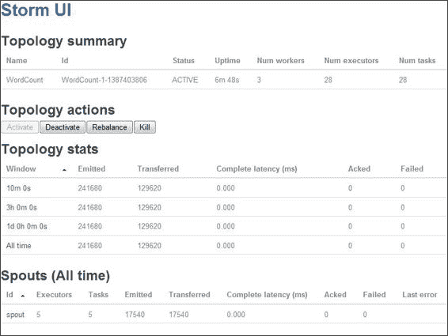

## 调整 WordCount 拓扑以自定义它

现在我们已经以分布式模式部署了`WordCount`拓扑，让我们稍微调整螺栓中的代码，以将`WordCount`写入文件。为了实现这一点，我们将按照以下步骤进行：

1.  我们打算创建一个新的螺栓`FileWriterBolt`，以实现这一目标。打开`WordCountTopology.java`并将以下片段添加到`WordCountTopology.java`中：

```scala
public static class FileWriterBolt extends BaseBasicBolt {
    Map<String, Integer> counts = new HashMap<String,  Integer>();
    @Override
    public void execute(Tuple tuple, BasicOutputCollector  collector) {
        String word = tuple.getString(0);
        Integer count = counts.get(word);
        if(count==null) {count = 0;
        count = 0;
    }
        count++;
        counts.put(word, count);
        OutputStream ostream;
        try {
            ostream = new  FileOutputStream("~/wordCount.txt", true);
            ostream.write(word.getBytes());
            ostream.close();
        } catch (IOException e) {
            // TODO Auto-generated catch block
            e.printStackTrace();
        }
        collector.emit(new Values(word, count));
    }

    @Override
    public void declareOutputFields(OutputFieldsDeclarer  declarer) {
        declarer.declare(new Fields("word", "count"));
    }
```

1.  接下来，我们必须更改`main()`方法，以使用这个新的螺栓，而不是`WordCount Bolt()`；以下是片段：

```scala
// instantiates the new builder object 
TopologyBuilder builder = new TopologyBuilder();
// Adds a new spout of type "RandomSentenceSpout" with a  parallelism hint of 5 
builder.setSpout("spout", new RandomSentenceSpout(), 5);
//Adds a new bolt to the  topology of type "SplitSentence"  with parallelism of 8
builder.setBolt("split", new SplitSentence(),  8).shuffleGrouping("spout");
//Adds a new bolt to the  topology of type "SplitSentence"  with parallelism of 8
//builder.setBolt("count", new FileWriterBolt()(),  12).fieldsGrouping("split", new Fields("word"));
```

1.  接下来，您可以使用 Eclipse 执行拓扑，将其作为 Java 运行，输出将保存到名为`wordCount.txt`的文件中，保存在您的主目录中。

1.  要以分布式模式运行，请使用以下步骤：

1.  编译拓扑更改以生成新的 Storm-starter 项目，使用以下命令行：

```scala
mvn clean install

```

1.  从 starter 项目的目标文件夹中复制`storm-starter-0.0.1-SNAPSHOT-jar-with-dependencies.jar`到 Nimbus，比如在`/home/admin/topology/`。

1.  使用以下命令提交拓扑：

```scala
storm jar /home/admin/topology/storm-starter-0.0.1-SNAPSHOT- jar-with-dependencies.jar storm.starter.WordCountTopology  WordCount -c nimbus.host=localhost

```

1.  输出将与前一节中图中执行的`WordCount`拓扑相同。

# 测验时间

Q.1\. 判断以下陈述是真还是假：

1.  所有 Storm 拓扑都是可靠的。

1.  一个拓扑通常有多个喷口。

1.  一个拓扑通常有多个螺栓。

1.  一个螺栓只能在一个流上发射。

Q.2\. 填空：

1.  _______________ 是创建拓扑的模板。

1.  _______________ 指定了特定螺栓或喷嘴的实例数量。

1.  Storm 的 _______________ 守护程序类似于 Hadoop 的作业跟踪器。

Q.3\. 执行以下任务：

1.  对 Storm-starter 项目的`WordCount`拓扑进行更改，以便它能够从指定位置的文件中读取句子。

# 摘要

在本章中，我们已经设置了 Storm 集群。您已经了解了 Storm 拓扑的各种构建模块，如螺栓、喷口和布线模板-拓扑构建器。我们执行并了解了`WordCount`拓扑，并对其进行了一些修正。

在下一章中，您将阅读并了解有关流分组、锚定和确认的内容。这也将引导我们了解 Storm 框架下拓扑中的可靠和非可靠机制。
