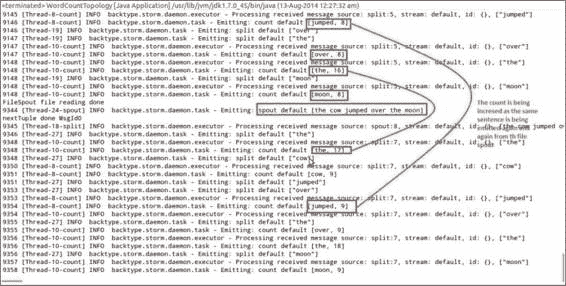
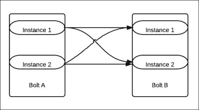
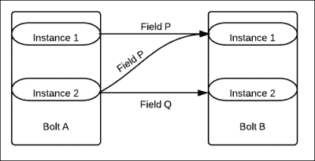
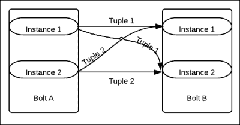
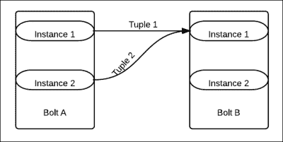

# 第三章：通过示例了解 Storm 内部

本书的这一章节致力于让您了解 Storm 的内部工作原理，并通过实际示例来说明它的工作方式。目的是让您习惯于编写自己的喷口，了解可靠和不可靠的拓扑，并熟悉 Storm 提供的各种分组。

本章将涵盖以下主题：

+   Storm 喷口和自定义喷口

+   锚定和确认

+   不同的流分组

在本章结束时，您应该能够通过使用锚定来理解各种分组和可靠性的概念，并能够创建自己的喷口。

# 自定义 Storm 喷口

您已经在之前的章节中探索和了解了 Storm-starter 项目提供的`WordCount`拓扑。现在是时候我们继续下一步，使用 Storm 进行自己的实践；让我们迈出下一步，用我们自己的喷口从各种来源读取。

## 创建 FileSpout

在这里，我们将创建自己的喷口，从文件源读取事件或元组并将它们发射到拓扑中；我们将在上一章的`WordCount`拓扑中使用`RandomSentenceSpout`的位置替换为喷口。

首先，将我们在第二章中创建的项目复制到一个新项目中，并对`RandomSentenceSpout`进行以下更改，以在 Storm-starter 项目中创建一个名为`FileSpout`的新类。

现在我们将更改`FileSpout`，使其从文件中读取句子，如下面的代码所示：

```scala
public class FileSpout extends BaseRichSpout {
  //declaration section
  SpoutOutputCollector _collector;
  DataInputStream in ;
  BufferedReader br;
  Queue qe;

  //constructor
    public FileSpout() {
        qe = new LinkedList();
    }

  // the messageId builder method
  private String getMsgId(int i) {
    return (new StringBuilder("#@#MsgId")).append(i).toString();
    }

  //The function that is called at every line being read by  readFile
  //method and adds messageId at the end of each line and then add
  // the line to the linked list
    private void queueIt() {
      int msgId = 0;
      String strLine;
      try {
          while ((strLine = br.readLine()) != null) {
              qe.add((new  StringBuilder(String.valueOf(strLine))).append("#@#"  + getMsgId(msgId)).toString());
              msgId++;
          }
      } catch (IOException e) {
          e.printStackTrace();
      } catch (Exception e) {
          e.printStackTrace();
      }
    }

  //function to read line from file at specified location 
  private void readFile() {
        try {
          FileInputStream fstream = new  FileInputStream("/home/mylog"); in =  new DataInputStream(fstream);
          br = new BufferedReader(new InputStreamReader( in ));
          queueIt();
          System.out.println("FileSpout file reading done");
        } catch (FileNotFoundException e) {
            e.printStackTrace();
        }
    }

  //open function that is called at the time of spout  initialization
  // it calls the readFile method that reads the file , adds  events 
  // to the linked list to be fed to the spout as tuples
  @
    Override
    public void open(Map conf, TopologyContext context,  SpoutOutputCollector  collector) {
      _collector = collector;
      readFile();
    }

  //this method is called every 100 ms and it polls the list
  //for message which is read off as next tuple and emit the spout  to
  //the topology. When queue doesn't have any events, it reads the
  //file again calling the readFile method
    @
    Override
    public void nextTuple() {
      Utils.sleep(100);
      String fullMsg = (String) qe.poll();
      String msg[] = (String[]) null;
      if (fullMsg != null) {
          msg = (new String(fullMsg)).split("#@#");
          _collector.emit(new Values(msg[0]));
          System.out.println((new StringBuilder("nextTuple done  ")).append(msg[1]).toString());
      } else {
          readFile();
      }
    }

  @
  Override
  public void ack(Object id) {}

  @
  Override
  public void fail(Object id) {}

  @
  Override
  public void declareOutputFields(OutputFieldsDeclarer declarer) {
      declarer.declare(new Fields("word"));
  }
}
```

### 提示

**下载示例代码**

您可以从[`www.packtpub.com`](http://www.packtpub.com)的帐户中下载您购买的所有 Packt 图书的示例代码文件。如果您在其他地方购买了这本书，您可以访问[`www.packtpub.com/support`](http://www.packtpub.com/support)并注册，以便直接将文件发送到您的电子邮件。

### 调整 WordCount 拓扑以使用 FileSpout

现在我们需要将`FileSpout`适应到我们的`WordCount`拓扑中并执行它。为此，您需要在`WordCount`拓扑中更改一行代码，并在`TopologyBuilder`中实例化`FileSpout`而不是`RandomSentenceSpout`，如下所示：

```scala
public static void main(String[] args) throws Exception {
  TopologyBuilder builder = new TopologyBuilder();
//builder.setSpout("spout", new RandomSentenceSpout(), 5);
  builder.setSpout("spout", new FileSpout(), 1);
```

这一行更改将处理从指定文件`/home/mylog`中读取的新喷口的实例化（请在执行程序之前创建此文件）。以下是您参考的输出的屏幕截图：



### SocketSpout 类

为了更好地理解喷口，让我们创建一个`SocketSpout`类。假设您擅长编写 Socket 服务器或生产者，我将带您了解创建自定义`SocketSpout`类以在 Storm 拓扑中消耗套接字输出的过程：

```scala
public class SocketSpout extends BaseRichSpout{
  static SpoutOutputCollector collector;
  //The socket
    static Socket myclientSocket;
    static ServerSocket myserverSocket;
    static int myport;

  public SocketSpout(int port){
    myport=port;
  }

  public void open(Map conf,TopologyContext context,  SpoutOutputCollector collector){
    _collector=collector;
    myserverSocket=new ServerSocket(myport);
  }

  public void nextTuple(){
    myclientSocket=myserverSocket.accept();
    InputStream incomingIS=myclientSocket.getInputStream();
    byte[] b=new byte[8196];
    int len=b.incomingIS.read(b);
    _collector.emit(new Values(b));
  }
}
```

# 锚定和确认

我们已经谈到了为执行 Storm 拓扑创建的 DAG。现在，当您设计拓扑以满足可靠性时，有两个需要添加到 Storm 的项目：

+   每当 DAG 添加新的链接，即新的流时，它被称为锚定

+   当元组完全处理时，称为确认

当 Storm 知道这些先前的事实时，它可以在元组处理过程中对它们进行评估，并根据它们是否完全处理而失败或确认元组。

让我们看一下以下`WordCount`拓扑螺栓，以更好地理解 Storm API 的锚定和确认：

+   `SplitSentenceBolt`：这个螺栓的目的是将句子分割成不同的单词并发射它。现在让我们详细检查这个螺栓的输出声明者和执行方法（特别是高亮显示的部分），如下面的代码所示：

```scala
  public void execute(Tuple tuple) {
      String sentence = tuple.getString(0);
      for(String word: sentence.split(" ")) {
          _collector.emit(tuple, new Values(word)); //1
      }
      _collector.ack(tuple); //2
  }
  public void declareOutputFields(OutputFieldsDeclarer  declarer) {
      declarer.declare(new Fields("word")); //3
  }
}
```

上述代码的输出声明功能如下所述：

+   `_collector.emit`: 这里，由 bolt 在名为`word`的流上发射的每个元组（第二个参数）都使用方法的第一个参数（元组）进行了定位。在这种安排下，如果发生故障，树的根部定位的元组将由 spout 重新播放。

+   `collector.ack`: 这里我们通知 Storm 该元组已被这个 bolt 成功处理。在发生故障时，程序员可以显式调用`fail`方法，或者 Storm 在超时事件的情况下会内部调用它，以便可以重放。

+   `declarer.declare`: 这是用来指定成功处理的元组将被发射的流的方法。请注意，我们在`_collector.emit`方法中使用了相同的`word`流。同样，如果你查看`WordCount`拓扑的`Builder`方法，你会发现另一个关于`word`流整体集成的部分，如下所示：

```scala
  builder.setBolt("count", new WordCount(), 12).fieldsGrouping("split", new Fields("word"));
```

## 不可靠的拓扑

现在让我们看看相同拓扑的不可靠版本。在这里，如果元组未能被 Storm 完全处理，框架不会重放。我们之前在这个拓扑中使用的代码会像这样：

```scala
java _collector.emit(new Values(word));
```

因此，未定位的元组由 bolt 发射。有时，由于编程需要处理各种问题，开发人员会故意创建不可靠的拓扑。

# 流分组

接下来，我们需要熟悉 Storm 提供的各种流分组（流分组基本上是定义 Storm 如何在 bolt 任务之间分区和分发元组流的机制），这为开发人员处理程序中的各种问题提供了很大的灵活性。

## 本地或 shuffle 分组

```scala
WordCount topology (which we reated earlier), which demonstrates the usage of shuffle grouping:
```

```scala
TopologyBuilder myBuilder = new TopologyBuilder();
builder.setSpout("spout", new RandomSentenceSpout(), 5);
builder.setBolt("split", new SplitSentence(),  8).shuffleGrouping("spout");
builder.setBolt("count", new WordCount(),  12).fieldsGrouping("split", new Fields("word"));
```

在下图中，显示了 shuffle 分组：



在这里，**Bolt A**和**Bolt B**都有两个并行度，因此 Storm 框架会生成每个这些 bolt 的两个实例。这些 bolt 通过*shuffle grouping*连接在一起。我们现在将讨论事件的分发。

来自**Bolt A**的**Instance 1**的 50%事件将发送到**Bolt B**的**Instance 1**，剩下的 50%将发送到**Bolt B**的**Instance 2**。同样，**Bolt B**的**Instance 2**发射的 50%事件将发送到**Bolt B**的**Instance 1**，剩下的 50%将发送到**Bolt B**的**Instance 2**。

## 字段分组

在这种分组中，我们指定了两个参数——流的来源和字段。字段的值实际上用于控制元组路由到各种 bolt 的过程。这种分组保证了对于相同字段的值，元组将始终路由到同一个 bolt 的实例。

在下图中，**Bolt A**和**Bolt B**之间显示了字段分组，并且每个 bolt 都有两个实例。根据字段分组参数的值，注意事件的流动。



来自**Bolt A**的**Instance 1**和**Instance 2**的所有事件，其中**Field**的值为**P**，都发送到**Bolt B**的**Instance 1**。

来自**Bolt A**的**Instance 1**和**Instance 2**的所有事件，其中**Field**的值为**Q**，都发送到**Bolt B**的**Instance 2**。

## 所有分组

所有分组是一种广播分组，可用于需要将相同消息发送到目标 bolt 的所有实例的情况。在这里，每个元组都发送到所有 bolt 的实例。

这种分组应该在非常特定的情况下使用，针对特定的流，我们希望相同的信息被复制到所有下游的 bolt 实例中。让我们来看一个使用情况，其中包含与国家及其货币价值相关的一些信息，而后续的 bolts 需要这些信息进行货币转换。现在每当*currency* bolt 有任何更改时，它使用*all*分组将其发布到所有后续 bolts 的实例中：



这里我们有一个图解表示*所有*分组，其中来自**Bolt A**的所有元组都被发送到**Bolt B**的所有实例。

## 全局分组

全局分组确保来自源组件（spout 或 bolt）的整个流都发送到目标 bolt 的单个实例，更准确地说是发送到具有最低 ID 的目标 bolt 实例。让我们通过一个例子来理解这个概念，假设我的拓扑如下：


我将为组件分配以下并行性：


另外，我将使用以下流分组：


然后，框架将所有来自*myboltA*流实例的数据，都发送到*myboltB*流的一个实例，这个实例是 Storm 在实例化时分配了较低 ID 的实例：



如前图所示，在全局分组的情况下，来自**Bolt A**的两个实例的所有元组都会发送到**Bolt B**的**Instance 1**，假设它的 ID 比**Bolt B**的**Instance 2**的 ID 更低。

### 注意

Storm 基本上为拓扑中创建的每个 bolt 或 spout 实例分配 ID。在全局分组中，分配是指向从 Storm 分配的 ID 较低的实例。

## 自定义分组

Storm 作为一个可扩展的框架，为开发人员提供了创建自己的流分组的功能。这可以通过为`backtype.storm.grouping.CustomStreamGroupinginterface`类提供实现来实现。

## 直接分组

在这种分组中，Storm 框架提供了发送者的能力

组件（spout 或 bolt）来决定消费者 bolt 的哪个任务会接收元组，而发送组件正在向流中发射元组。

必须使用特殊的`emitDirect`方法将元组发送到流中，并且必须指定消费组件的任务（注意可以使用`TopologyContext`方法获取任务）。

# 测验时间

Q.1 判断以下陈述是真是假：

1.  可靠拓扑的所有组件都使用锚定。

1.  在发生故障时，所有元组都会被重新播放。

1.  Shuffle 分组进行负载均衡。

1.  全局分组就像广播一样。

Q.2 填空：

1.  _______________ 是告诉框架元组已成功处理的方法。

1.  _______________ 方法指定流的名称。

1.  ___________ 方法用于将元组推送到 DAG 中的下游。

对 Storm-starter 项目的`WordCount`拓扑进行更改，以创建自定义分组，使得以特定字母开头的所有单词始终发送到`WordCount` bolt 的同一个实例。

# 总结

在本章中，我们已经了解了 Storm spout 的复杂性。我们还创建了一个自定义文件 spout，并将其与`WordCount`拓扑集成。我们还向您介绍了可靠性、确认和锚定的概念。当前版本的 Storm 提供的各种分组知识进一步增强了用户探索和实验的能力。

在下一章中，我们将让您熟悉 Storm 的集群设置，并为您提供有关集群模式的各种监控工具的见解。
