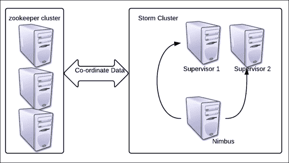
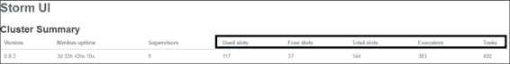
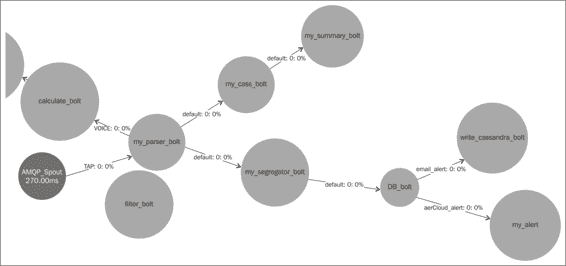
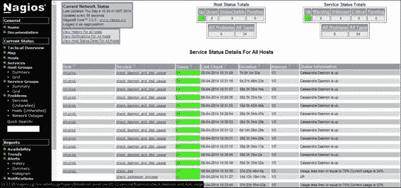
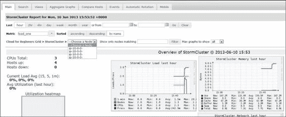
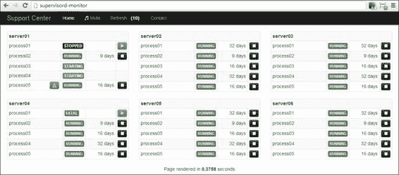
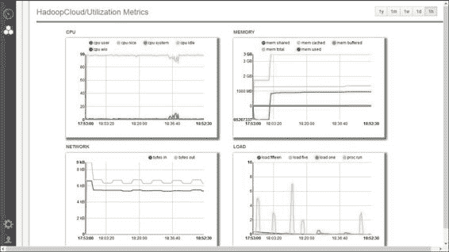

# 第四章：集群模式下的风暴

我们现在已经到达了我们与风暴的旅程的下一步，也就是理解风暴及其相关组件的集群模式设置。我们将浏览风暴和 Zookeeper 中的各种配置，并理解它们背后的概念。

本章将涵盖的主题如下：

+   设置风暴集群

+   了解集群的配置及其对系统功能的影响

+   风暴 UI 和理解 UI 参数

+   为生产设置提供和监视应用程序

到本章结束时，您应该能够理解风暴和 Zookeeper 节点的配置。此外，您应该能够理解风暴 UI，并设置风暴集群，并使用各种工具监视它们。

# 风暴集群设置

在第二章中，我们设置了风暴和 Zookeeper 参考集群，如下图所示，*开始使用您的第一个拓扑*。

我们为一个三节点风暴集群（其中有一个 Nimbus 和两个监督者）设置了三节点 Zookeeper 集群。

我们正在使用推荐的三节点 Zookeeper 集群，以避免风暴设置中的单点故障。

Zookeeper 集群应该有奇数个节点。这个要求的原因是 Zookeeper 选举逻辑要求领导者拥有奇数个选票，只有在奇数节点在法定人数中时才可能出现这种组合，如下图所示：



# Zookeeper 配置

假设您已在所有三个 Zookeeper 节点上安装了 Zookeeper；现在我们将带您浏览配置，以便更好地理解它们。

在我们的情况下，`zoo.cfg`的摘录位于`<zookeeper_installation_dir>/ zookeeper-3.4.5/conf/`。Zookeeper 的配置如下：

+   `dataDir=/usr/local/zookeeper/tmp`：这是 Zookeeper 存储其快照的路径；这些快照实际上是状态日志，用于维护当前集群状态以进行协调。在发生故障时，这些快照用于将集群恢复到最后稳定状态。这个目录还包含一个包含单个条目`myID`的文件。这个值从`1`开始，对于每个 Zookeeper 节点都是不同的，所以我们将保持如下：

```scala
zkp-1.mydomain.net – value of myId =1
zkp-2.mydomain.net – value of myId =2
zkp-3.mydomain.net – value of myId =3
```

每当您想要从头开始，或者当您升级或降级风暴或 Zookeeper 集群时，建议您清理这个`local.dir`文件，以便清除陈旧的数据。

+   `clientPort=2182`：这个配置指定了客户端与 Zookeeper 建立连接的端口：

```scala
server.1=zkp-1.mydomain.net:2888:3888
server.2=zkp-2\. mydomain.net:2888:3888
server.3=zkp-3\. mydomain.net:2888:3888
```

在前面的代码中，这三行实际上指定了组成 Zookeeper 集群一部分的服务器的 IP 或名称。在这个配置中，我们创建了一个三节点 Zookeeper 集群。

+   `maxClientCnxns=30l`：这个数字指定了单个客户端可以与这个 Zookeeper 节点建立的最大连接数。在我们的情况下，计算将如下进行：

一个监督者可以建立的最大连接数是 30 个，与一个 Zookeeper 节点。因此，一个监督者可以与三个 Zookeeper 节点创建的最大连接数是 90（即 30*3）。

以下截图显示了从风暴 UI 中捕获的已使用、可用和空闲插槽：



### 注意

风暴集群中的工作人员数量与 Zookeeper 集群中可用的连接数量有关。如果 Zookeeper 集群连接不足，风暴监督者将无法启动。

## 清理 Zookeeper

我们已经看到 Zookeeper 如何以快照的形式将其所有协调数据存储在`dataDir`配置中指定的路径中。这需要定期清理或归档以删除旧的快照，以免消耗整个磁盘空间。这是一个需要在所有 Zookeeper 节点上配置的小型清理脚本：

```scala
numBackUps=3
dataDir=/usr/local/zookeeper/tmp
logDir=/mnt/my_logs/
echo `date`' Time to clean up StormZkTxn logs' >>  $logDir/cleanStormZk.out
java -cp /usr/local/zookeeper/zookeeper-3.4.5/zookeeper- 3.4.5.jar:/usr/local/zookeeper/zookeeper-3.4.5/lib/log4j- 1.2.15.jar:/usr/local/zookeeper/zookeeper-3.4.5/lib/slf4j-api- 1.6.1.jar org.apache.zookeeper.server.PurgeTxnLog $dataDir -n  $numBackUps >> $logDir/cleanStormZk.out
```

这里有以下清理脚本：

+   `numBackUps`：在这里，我们指定了清理后要保留多少个快照；最少为三个，最多可以根据需求变化。

+   `dataDir`：在这里，我们指定了需要清理快照的数据目录的路径。

+   `logDir`：这是清理脚本将存储其日志的路径。

+   `org.apache.zookeeper.server.PurgeTxnLog`：这是一个实用类，清除除了最后三个快照之外的所有快照，如`numBackups`中所述。

# Storm 配置

我们将查看 Storm 守护进程和守护进程周围的配置。对于 Nimbus 节点，在`storm.yaml`中有以下配置设置。让我们根据以下代码中给出的配置来理解这些配置：

```scala
storm.zookeeper.servers:
- "zkp-1.mydomain.net "
- "zkp-2.mydomain.net "
- "zkp-3.mydomain.net "

storm.zookeeper.port: 2182
storm.local.dir: "/usr/local/storm/tmp"
nimbus.host: "nim-zkp-flm-3.mydomain.net"
topology.message.timeout.secs: 60
topology.debug: false

supervisor.slots.ports:
    - 6700
    - 6701
    - 6702
    - 6703
```

在前面的代码中使用的配置的功能如下：

+   `storm.zookeeper.servers`：在这里，我们指定了 Zookeeper 集群中 Zookeeper 服务器的名称或 IP 地址；请注意，我们在前一节的`zoo.cfg`配置中使用了与之前相同的主机名。

+   `storm.zookeeper.port`：在这里，我们指定了 Storm 节点连接的 Zookeeper 节点上的端口。同样，我们在前一节中在`zoo.cfg`中指定了相同的端口。

+   `storm.local.dir`：Storm 有自己的临时数据存储在本地目录中。这些数据会自动清理，但每当您想要从头开始，或者当您扩展或缩小 Storm 或 Zookeeper 集群时，建议您清理此`local.dir`配置，以清除陈旧数据。

+   `nimbus.host`：这指定了要设置为 Nimbus 的主机名或 IP 地址。

+   `topology.message.timeout.secs`：此值指定拓扑处理的元组在经过一定秒数后被声明为超时并丢弃的持续时间。此后，根据拓扑是可靠还是不可靠，它会被重放或不会。应谨慎设置此值；如果设置得太低，所有消息最终都会超时。如果设置得太高，可能永远不会知道拓扑中的性能瓶颈。

+   `topology.debug`：此参数表示是否要在调试模式或节点中运行拓扑。调试模式是指打印所有调试日志，建议在开发和暂存模式下使用，但在生产模式下不建议使用，因为此模式下 I/O 非常高，从而影响整体性能。

+   `supervisor.slots.ports`：此参数指定了主管工作进程的端口。这个数字直接关联到主管上可以生成的工作进程的数量。当拓扑被生成时，必须指定要分配的工作进程的数量，这又与分配给拓扑的实际资源相关联。工作进程的数量非常重要，因为它们实际上确定了集群上可以运行多少个拓扑，从而确定了可以实现多少并行性。例如，默认情况下，每个主管有四个插槽，所以在我们的集群中，我们将有*总插槽数/工作进程= 4*2 = 8*。每个工作进程从系统中获取一定数量的 CPU 和 RAM 资源，因此在主管上生成多少个工作进程取决于系统配置。

## Storm 日志配置

现在我们将查看 Storm 的日志配置。它们使用 Log4J 的`logback`实现，其配置可以在`<storm-installation-dir>/apache-storm-0.9.2-incubating/logback`中的`cluster.xml`中找到并进行调整，使用以下代码：

```scala
<appender name="A1"  class="ch.qos.logback.core.rolling.RollingFileAppender">
    <file>${storm.log.dir}/${logfile.name}</file>
    <rollingPolicy  class="ch.qos.logback.core.rolling.FixedWindowRollingPolicy">
      <fileNamePattern>${storm.log.dir}/${logfile.name}.%i</fileNamePattern >
      <minIndex>1</minIndex>
 <maxIndex>9</maxIndex>
    </rollingPolicy>

    <triggeringPolicy  class="ch.qos.logback.core.rolling.SizeBasedTriggeringPolicy">
      <maxFileSize>100MB</maxFileSize>
    </triggeringPolicy>

    <encoder>
      <pattern>%d{yyyy-MM-dd HH:mm:ss} %c{1} [%p] %m%n</pattern>
    </encoder>
 </appender>

  <root level="INFO">
    <appender-ref ref="A1"/>
  </root>
```

在上面的片段中，有几个部分被突出显示，我们将逐一进行更详细的讨论。它们如下：

+   `<file>`：这个标签保存了 Storm 框架生成的日志的日志目录路径和文件名。

+   `<filenamepattern>`：这是文件形成和滚动的模式；例如，使用前面的代码模式，我们有 worker 日志文件`worker-6700.log`和`worker-6700.1.log`。

+   `<minIndex>和<maxIndex>`：这些非常重要，用于指定我们想要保留多少个文件在这个滚动 appender 中；在这种情况下，我们将有九个备份文件，编号从一到九，还有一个运行日志文件。

+   `maxFileSize`：这个参数指定文件应该在什么大小时滚动，例如，在我们的情况下，它是 100MB；这意味着当工作日志文件达到这个大小时，它将滚动到下一个索引。

+   `根级别`：这指定了日志级别；在我们的情况下，我们已将其指定为*Info*，这意味着`Info`和以上的日志将被打印到日志文件中，但是低于`Info`级别的日志将不会被写入日志。以下是供参考的日志级别层次结构：

+   `关闭`

+   `致命`

+   `错误`

+   `警告`

+   `信息`

+   `调试`

+   `TRACE`

+   `全部`

## Storm UI

```scala
word-count, is the name of that topology:

```

cluster.submitTopology("word-count", conf, builder.createTopology());

```scala

In our preceding sample screenshot, **AAA-topology-1407803669812** is the name of the topology.**ID**: This is the Storm-generated unique ID that is a combination of the topology name, timestamp, and ID, which is used by Storm to identify and differentiate the topology.**Status**: This denotes the state of the topology, which could be *active* for a live topology, *killed* when a topology is killed using the UI or CLI, *inactive* for a deactivated topology, and *rebalancing* for a topology where the rebalance command is executed wherein the number of workers allocated to the topology is increased or decreased.**Uptime**: As the name suggests, this mentions the duration for which the topology has been running. For example, our sample topology has been running for 8 days 15 hours 6 months 16 seconds.**Num workers**: This specifies how many workers are allocated to the topology. Again, if we refer to `WordCountTopology.java`, we will see this snippet where it is declared as `3`:

```

conf.setNumWorkers(3);

```scala

**Num executors**: This specifies the sum total of the number of executors in the topology. This is connected to the parallelism hint that is specified during the overall integration of the topology in the topology builder as follows:

```

builder.setSpout("spout", new RandomSentenceSpout(), 5);

```scala

Here, in our `WordCount` topology, we have specified the parallelism of the spout as `5`, so five instances of the spout will be spawned in the topology.

**Num tasks**: This gains the sum total of another parameter that is specified at the time of overall integration in the topology, as shown:

```

builder.setSpout("spout", new RandomSentenceSpout(), 5).setNumTasks(10);

```scala

Here, we are specifying that for `5` executors dedicated to the spout, the total value of `numtasks` is `10`, so two tasks each will be spawned on each of the executors.

What we see on the UI is a total of all `numtasks`  values across all topology components.

```

### 第二部分

这一部分包含了可以在拓扑上执行的各种操作：

+   **激活**：UI 提供了一个功能，可以重新激活之前被暂停的拓扑。一旦激活，它可以再次开始从 spout 消费消息并处理它们。

+   **停用**：当执行此操作时，拓扑立即关闭 spout，也就是说，不会从 spout 读取新消息并将其推送到 DAG 下游。已经在各种 bolt 中处理的现有消息将被完全处理。

+   **重新平衡**：当对活动拓扑的 worker 分配发生变化时执行此操作。

+   **终止**：顾名思义，用于向 Storm 框架发送拓扑的终止信号。建议提供合理的终止时间，以便拓扑完全排空并能够在终止之前清理流水线事件。

### 第三部分

这一部分显示了时间轴上处理的消息数量的截图。它有以下关键部分：

+   **窗口**：这个字段指定了以下时间段的时间段：最近 10 分钟，最近 3 小时，过去一天，或者一直。拓扑的进展是根据这些时间段来捕获的。 

+   **发射**：这捕获了 spout 在各个时间段发射的元组数量。

+   **传输**：这指定了发送到拓扑中其他组件的元组数量。请注意，发射的元组数量可能与传输的元组数量相等，也可能不相等，因为前者是 spout 的 emit 方法执行的确切次数，而后者是基于使用的分组而传输的数量；例如，如果我们将一个 spout 绑定到一个具有两个元组并行度的 bolt，使用 all 分组，那么对于 spout 发射的每个`x`个元组，将传输`2x`个元组。 

+   **完整延迟**（**ms**）：这是元组在整个拓扑中执行所花费的平均总时间。

+   **已确认**：这个字段保存了成功处理的已确认事件的数量。

+   **失败**：这是处理失败的事件数量。

### 第四部分

这一部分与*第三部分*相同，唯一的区别是这里的术语显示在组件级别，即 spouts 和 bolts，而在*第三部分*中是在拓扑级别。UI 上还有一些术语需要介绍给你。它们如下：

+   **容量**：这是微调拓扑时要查看的最重要的指标之一。它指示螺栓在最后十分钟内执行元组所花费的时间的百分比。任何接近或超过一的值都表明需要增加此螺栓的并行性。它使用以下公式计算：

```scala
Capacity = (Number of tuples Executed*Average execute  latency)/Window_Size*1000)
```

+   **执行延迟**：这是元组在处理过程中在螺栓的执行方法中花费的平均时间。

+   **处理延迟**：处理延迟是元组从螺栓接收到到被确认（表示成功处理）的平均时间。

### 可视化部分

Storm 0.9.2 中的一个改进是拓扑的可视化描述。以下图是 Storm UI 中样本拓扑的描述：



在前面的截图中，您可以看到拓扑上由各种螺栓和喷口可视标记的所有流，以及延迟和其他关键属性。

Storm UI 提供了一个非常丰富的界面，用户可以从非常高的级别开始，并深入到特定领域，就像在*Storm 集群设置*部分的截图中所看到的那样，我们讨论了 Storm 集群级属性；在第二级中，我们移动到特定的拓扑。接下来，在拓扑内，您可以单击任何螺栓或工作程序，组件级别的详细信息将呈现给您。在集群设置中，以下截图中突出显示的一个项目对于调试和日志解密非常重要——工作程序 ID。如果某个组件的喷口或螺栓给我们带来问题，并且我们想要了解其工作原理，首先要查看的地方是日志。要能够查看日志，需要知道有问题的螺栓在哪个监督者上执行以及哪个工作程序；这可以通过钻取该组件并查看执行器部分来推断：


Storm UI 捕获监督者端口

在这里，主机告诉您此组件正在哪个监督者上运行，端口告诉您有关工作程序，因此，如果我想查找此组件的日志，我将在`logdir`中查找`sup-flm-dev-1.mydomain.net`下的`worker-6711.log`日志目录。

# Storm 监控工具

像 Storm 这样的集群设置需要不断监控，因为它们通常是为支持实时系统而开发的，其中停机可能会对**服务级别协议**（**SLA**）构成问题。市场上有很多工具可用于监控 Storm 集群并发出警报。一些 Storm 监控工具如下：

+   **Nagios**：这是一个非常强大的监控系统，可以扩展以生成电子邮件警报。它可以监控各种进程和系统 KPI，并可以通过编写自定义脚本和插件来在发生故障时重新启动某些组件。

Nagios 服务控制台

在前面的 Storm 集群与 Nagios 监控的截图中，您可以看到各种可以监控的进程和其他系统级 KPI，如 CPU、内存、延迟、硬盘使用率等。

+   **Ganglia**：这是另一个广泛使用的开源工具，可以为 Storm 集群设置监控框架。

如前面的截图所示，我们有很多钻取选项；我们可以看到负载和 CPU 级别的详细信息，以及其他系统和集群级 KPI 来捕获和绘制集群的健康状态。

+   **SupervisorD**：这是另一个广泛使用的开源监控系统，通常与 Storm 一起使用以捕获和保持集群的健康状态。SupervisorD 还有助于配置和启动 Storm 服务，并且可以在发生故障时配置以重新启动它们。

+   **Ankush**：这是另一个可以用于 Storm 和其他大数据集群设置和管理的供应和监控系统。它有付费和开源版本（[`github.com/impetus-opensource/ankush`](https://github.com/impetus-opensource/ankush)）。它具有以下显著特点：

| **供应** | **此应用程序支持的环境****物理节点****云上的虚拟节点（AWS 或本地）** |
| --- | --- |
| 单一技术集群 |
| 多技术集群 |
| 基于模板的集群创建 |
| 重新部署出错的集群 |
| 机架支持 |
| 在部署前增强节点验证 |
| **监控** | 热图 |
| 服务监控 |
| 基于技术的监控 |
| 丰富的图表 |
| 关键事件的警报和通知 |
| 集中式日志视图 |
| 审计追踪 |
| 仪表板和电子邮件上的警报 |

以下截图是 Ankush 的仪表板截图。所有系统级 KPI（如 CPU、负载、网络、内存等）都被很好地捕获。



# 测验时间

Q.1\. 判断以下陈述是真还是假：

1.  Storm 配置存储在`cluster.xml`中。

1.  每个监督者只能分配四个工作节点。

1.  Zookeeper 集群始终有奇数个节点。

1.  Zookeeper 需要至少三个快照才能从故障中恢复其状态。

1.  如果 Nimbus 和监督者死亡，拓扑可以继续执行。

Q.2\. 填空：

1.  _______________ 是元组被处理和确认所花费的平均时间。

1.  _______________ 是元组在执行方法中花费的平均时间。

1.  在故障发生时，__________ 组件负责恢复 Storm 集群。

Q.3\. 在一个三节点的 Storm 集群（一个 Nimbus 和两个监督者）上执行`WordCount`拓扑，然后执行以下任务：

+   在拓扑运行时终止 Nimbus 节点—观察拓扑不会失败，它将继续不受影响。

+   在拓扑运行时终止监督者—观察拓扑不会失败，它将继续不受影响。工作节点将继续执行，并与 Zookeeper 协调。

+   尝试从 Storm UI 进行重新平衡和停用等各种操作。

# 摘要

在本章中，您详细了解了 Storm 和 Zookeeper 的配置。我们探索并向您介绍了 Storm UI 及其属性。完成了集群设置后，我们简要介绍了 Storm 中可用于运营生产支持的各种监控工具。

在下一章中，我们将介绍 RabbitMQ 及其与 Storm 的集成。
