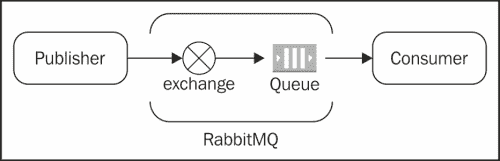
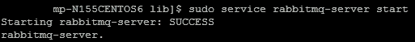
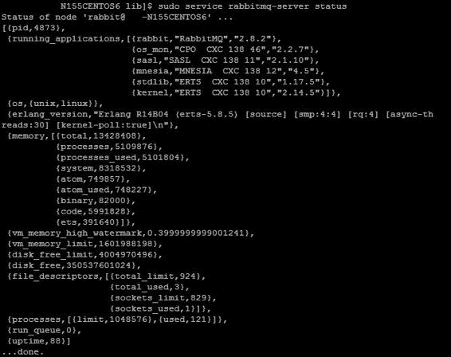
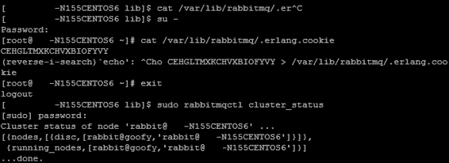
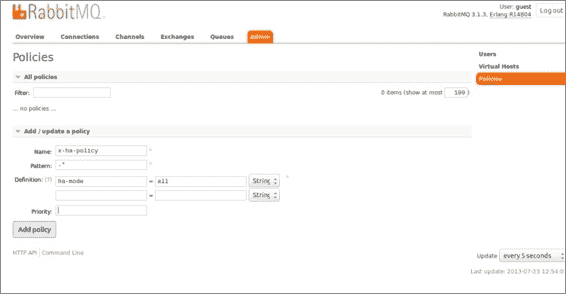
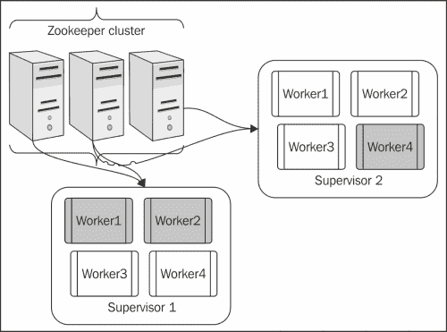
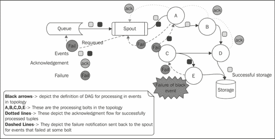

# 第五章：Storm 高可用性和故障转移

本章将带您进入 Storm 的旅程的下一个级别，在这里我们将让您熟悉 Storm 与生态系统中其他必要组件的集成。我们将实际涵盖高可用性和可靠性的概念。

本章是理解 Storm 及其相关组件的集群模式设置的下一步。我们将了解 Storm 和 Zookeeper 中的各种配置以及它们背后的概念。

本章将涵盖以下主题：

+   设置 RabbitMQ（单实例和集群模式）

+   开发 AMQP 喷流以集成 Storm 和 RabbitMQ

+   创建 RabbitMQ 饲料器组件

+   为 RabbitMQ 和 Storm 集群构建高可用性

+   Storm 调度程序

通过本章结束时，您将能够设置和理解 RabbitMQ，并将 Storm 与 RabbitMQ 集成。此外，您将能够测试 Storm 集群的高可用性和可靠处理。

# RabbitMQ 概述

RabbitMQ 的要点是*消息传递只是起作用*。

RabbitMQ 是 AMQP 消息协议最广泛使用的实现之一，它提供了一个用于接收和传递消息的平台。这个内存队列还有能力保存和保留消息，直到它们被消费者消耗。这种灵活的代理系统非常易于使用，并且适用于大多数操作系统，如 Windows、UNIX 等。

RabbitMQ 是**高级消息队列协议**（**AMQP**）的实现。如下图所示，RabbitMQ 的关键组件是**交换**和**队列**：



发布者和消费者是两个重要的角色；前者生成消息并将其发布到交换，后者根据其类型将消息从发布者发布到队列，然后从队列发布到消费者，消费者接收消息。

需要注意的是，这里的发布者与交换进行交互，而不是队列。RabbitMQ 支持各种类型的交换，如直接、扇出、主题等。交换的任务是根据交换的类型和与消息关联的路由键，将消息路由到一个或多个队列。因此，如果是直接交换，消息将被传递到与交换绑定的一个队列，其路由键与消息中的路由键匹配。如果是扇出交换，那么消息将被传递到与交换绑定的所有队列，路由完全被忽略。

# 安装 RabbitMQ 集群

RabbitMQ 是一个消息代理-消息的中间人。它为您的应用程序提供了一个发送和接收消息的共同平台，并为您的消息提供了一个安全的存放处，直到它们被接收。

## 设置 RabbitMQ 的先决条件

确保您已经注意到短名称也包括在`/etc/hosts`文件中，如下面的代码所示：

```scala
<ip address1>     <hostname1> <shortname1> 
<ip address2>     <hostname2> <shortname2> 
```

### 注意

在 RabbitMQ 集群中，`/etc/hosts`中的短名称是强制性的，因为节点间的通信是使用这些短名称进行的。

例如，我们的集群中有两台机器，具有以下提到的 IP 和主机名；RabbitMQ 守护程序在启动集群时使用这些信息：

```scala
10.191.206.83     rmq-flc-1.mydomain.net rmq-flc-1 
10.73.10.63       rmq-flc-2.mydomain.net rmq-flc-2
```

如果未设置短名称，您将看到此错误：**系统未运行以使用完全限定的主机名**。

## 设置 RabbitMQ 服务器

Ubuntu 附带了 RabbitMQ，但通常不是最新版本。最新版本可以从 RabbitMQ 的 Debian 存储库中检索。应在 Ubuntu 上运行以下 shell 脚本以安装 RabbitMQ：

```scala
#!/bin/sh
sudo cat <<EOF > /etc/apt/sources.list.d/rabbitmq.list
sudo deb http://www.rabbitmq.com/debian/ testing main
EOF

sudo curl http://www.rabbitmq.com/rabbitmq-signing-key-public.asc -o  /tmp/rabbitmq-signing-key-public.asc
sudo apt-key add /tmp/rabbitmq-signing-key-public.asc
sudo rm /tmp/rabbitmq-signing-key-public.asc

sudo apt-get -qy update
sudo apt-get -qy install rabbitmq-server

```

## 测试 RabbitMQ 服务器

以下步骤将为您提供在 Ubuntu 终端上执行的命令，以启动 RabbitMQ 服务器并对其进行测试。它们如下：

1.  通过在 shell 上运行以下命令启动 RabbitMQ 服务器：

```scala
sudo service rabbitmq-server start

```



1.  通过运行以下命令检查服务器状态：

```scala
sudo service rabbitmq-server status

```



1.  在每个 RabbitMQ 实例上，要启用 RabbitMQ 管理控制台，请执行以下命令，并使用以下命令重新启动该实例上运行的 RabbitMQ 服务器：

```scala
sudo rabbitmq-plugins enable rabbitmq_management

```

1.  要启用 RabbitMQ 插件，请转到`/usr/lib/rabbitmq/bin`并在两个节点上执行以下命令，然后重新启动它们：

```scala
sudo rabbitmq-plugins enable rabbitmq_management

```

1.  启动、关闭和错误日志将在`/var/log/rabbitmq`目录下创建。

### 创建 RabbitMQ 集群

以下是设置两个（或更多）节点 RabbitMQ 集群所需执行的步骤：

1.  考虑到`rmq-flc-1`和`rmq-flc-2`是两个实例的短主机名，我们将使用以下命令在两个实例上启动独立的 RabbitMQ 服务器：

```scala
sudo service rabbitmq-server start

```

1.  在`rmq-flc-2`上，我们将停止 RabbitMQ 应用程序，重置节点，加入集群，并使用以下命令重新启动 RabbitMQ 应用程序（所有这些都是在`rmq-flc-1`上的 RabbitMQ 服务器正在运行时完成的）：

```scala
sudo rabbitmqctl stop_app
sudo rabbitmqctl join_cluster rabbit@rmq-flc-1
sudo rabbitmqctl start_app

```

1.  通过在任何一台机器上运行以下命令来检查集群状态：

```scala
sudo service rabbitmq-server status

```

1.  应该看到以下输出：

1.  集群已成功设置。

如果启用了 UI，可以在`http:/` `/<hostip>:15672`（用户名：`guest`，密码：`guest`）访问集群。

### 启用 RabbitMQ UI

执行以下步骤以启用 RabbitMQ UI：

1.  执行以下命令：

```scala
sudo /usr/lib/rabbitmq/bin/rabbitmq-plugins enable  rabbitmq_management

```

1.  上述命令将产生以下输出：

```scala
The following plugins have been enabled:
mochiweb
webmachine
rabbitmq_mochiweb
amqp_client
rabbitmq_management_agent
rabbitmq_management
Plugin configuration has changed. Restart RabbitMQ for changes to take effect.

```

1.  在集群的所有节点上重复前面的步骤。

1.  使用以下命令重新启动每个节点：

```scala
sudo service rabbitmq-server restart 

```

1.  使用`http:``//<hostip>:15672`链接访问 UI。默认用户名和密码是`guest`。

### 为高可用性创建镜像队列

在本节中，我们将讨论一种特殊类型的队列，它保证了 RabbitMQ 默认队列的高可用性。默认情况下，我们创建的队列位于单个节点上，根据它们声明的顺序，这可能成为单点故障。让我们看一个例子。我有一个由两个 RabbitMQ 节点`rabbit1`和`rabbit2`组成的集群，并在我的集群上声明了一个交换机，比如`myrabbitxchange`。假设按照执行顺序，在`rabbit1`上创建了队列。现在，如果`rabbit1`宕机，那么队列就消失了，客户端将无法发布到它。

因此，为了避免情况，我们需要高可用性队列；它们被称为镜像队列，在集群中的所有节点上都有副本。镜像队列有一个主节点和多个从节点，最老的节点是主节点，如果它不可用，则可用节点中最老的节点成为主节点。消息被发布到所有从节点。这增强了可用性，但不会分配负载。要创建镜像队列，请使用以下步骤：

1.  可以通过使用 Web UI 添加策略来启用镜像。转到**管理**选项卡，选择**策略**，然后单击**添加策略**。

1.  指定策略**名称**、**模式**、**定义**，然后单击**添加策略**，如下面的截图所示：

# 将 Storm 与 RabbitMQ 集成

现在我们已经安装了 Storm，下一步将是将 RabbitMQ 与 Storm 集成，为此我们将不得不创建一个名为 RabbitMQ spout 的自定义 spout。这个 spout 将从指定队列中读取消息；因此，它将提供一个消费者的角色，然后将这些消息推送到下游拓扑。

以下是 spout 代码的样子：

```scala
public class AMQPRecvSpout implements IRichSpout{

//The constructor where we set initialize all properties
  public AMQPRecvSpout(String host, int port, String username,  String password, String vhost, boolean requeueOnFail, boolean  autoAck) {
    this.amqpHost = host;
    this.amqpPort = port;
    this.amqpUsername = username;
    this.amqpPasswd = password;
    this.amqpVhost = vhost;
    this.requeueOnFail = requeueOnFail;
    this.autoAck = autoAck;
  }
/*
Open method of the spout , here we initialize the prefetch count ,  this parameter specified how many messages would be prefetched  from the queue by the spout – to increase the efficiency of the  solution */
  public void open(@SuppressWarnings("rawtypes") Map conf,  TopologyContext context, SpoutOutputCollector collector) {
    Long prefetchCount = (Long) conf.get(CONFIG_PREFETCH_COUNT);
    if (prefetchCount == null) {
      log.info("Using default prefetch-count");
      prefetchCount = DEFAULT_PREFETCH_COUNT;
    } else if (prefetchCount < 1) {
      throw new IllegalArgumentException(CONFIG_PREFETCH_COUNT + "  must be at least 1");
    }
    this.prefetchCount = prefetchCount.intValue();

    try {
      this.collector = collector;
      setupAMQP();
    } catch (IOException e) {
      log.error("AMQP setup failed", e);
      log.warn("AMQP setup failed, will attempt to reconnect...");
      Utils.sleep(WAIT_AFTER_SHUTDOWN_SIGNAL);
      reconnect();
    }
  }

  /**
   * Reconnect to an AMQP broker.in case the connection breaks at  some point
   */
  private void reconnect() {
    log.info("Reconnecting to AMQP broker...");
    try {
      setupAMQP();
    } catch (IOException e) {
      log.warn("Failed to reconnect to AMQP broker", e);
    }
  }
  /**
   * Set up a connection with an AMQP broker.
   * @throws IOException
   *This is the method where we actually connect to the queue  using AMQP client APIs
   */
  private void setupAMQP() throws IOException{
    final int prefetchCount = this.prefetchCount;
    final ConnectionFactory connectionFactory = new  ConnectionFactory() {
      public void configureSocket(Socket socket)
          throws IOException {
        socket.setTcpNoDelay(false);
        socket.setReceiveBufferSize(20*1024);
        socket.setSendBufferSize(20*1024);
      }
    };

    connectionFactory.setHost(amqpHost);
    connectionFactory.setPort(amqpPort);
    connectionFactory.setUsername(amqpUsername);
    connectionFactory.setPassword(amqpPasswd);
    connectionFactory.setVirtualHost(amqpVhost);

    this.amqpConnection = connectionFactory.newConnection();
    this.amqpChannel = amqpConnection.createChannel();
    log.info("Setting basic.qos prefetch-count to " +  prefetchCount);
    amqpChannel.basicQos(prefetchCount);
    amqpChannel.exchangeDeclare(Constants.EXCHANGE_NAME,  "direct");
    amqpChannel.queueDeclare(Constants.QUEUE_NAME, true, false,  false, null);
    amqpChannel.queueBind(Constants.QUEUE_NAME,  Constants.EXCHANGE_NAME, "");
    this.amqpConsumer = new QueueingConsumer(amqpChannel);
    assert this.amqpConsumer != null;
    this.amqpConsumerTag =  amqpChannel.basicConsume(Constants.QUEUE_NAME, this.autoAck,  amqpConsumer);
  }

  /* 
   * Cancels the queue subscription, and disconnects from the AMQP  broker.
   */
  public void close() {
    try {
      if (amqpChannel != null) {
        if (amqpConsumerTag != null) {
          amqpChannel.basicCancel(amqpConsumerTag);
        }
        amqpChannel.close();
      }
    } catch (IOException e) {
      log.warn("Error closing AMQP channel", e);
    }

    try {
      if (amqpConnection != null) {
        amqpConnection.close();
      }
    } catch (IOException e) {
      log.warn("Error closing AMQP connection", e);
    }
  }
  /* 
   * Emit message received from queue into collector
   */
  public void nextTuple() {
    if (spoutActive && amqpConsumer != null) {
      try {
        final QueueingConsumer.Delivery delivery =  amqpConsumer.nextDelivery(WAIT_FOR_NEXT_MESSAGE);
        if (delivery == null) return;
        final long deliveryTag =  delivery.getEnvelope().getDeliveryTag();
        String message = new String(delivery.getBody());

        if (message != null && message.length() > 0) {
          collector.emit(new Values(message), deliveryTag);
        } else {
          log.debug("Malformed deserialized message, null or zero- length. " + deliveryTag);
          if (!this.autoAck) {
            ack(deliveryTag);
          }
        }
      } catch (ShutdownSignalException e) {
        log.warn("AMQP connection dropped, will attempt to  reconnect...");
        Utils.sleep(WAIT_AFTER_SHUTDOWN_SIGNAL);
        reconnect();
      } catch (ConsumerCancelledException e) {
        log.warn("AMQP consumer cancelled, will attempt to  reconnect...");
        Utils.sleep(WAIT_AFTER_SHUTDOWN_SIGNAL);
        reconnect();
      } catch (InterruptedException e) {
        log.error("Interrupted while reading a message, with  Exception : " +e);
      }
    }
  }
  /* 
   * ack method to acknowledge the message that is successfully  processed 
*/

  public void ack(Object msgId) {
    if (msgId instanceof Long) {
      final long deliveryTag = (Long) msgId;
      if (amqpChannel != null) {
        try {
          amqpChannel.basicAck(deliveryTag, false);
        } catch (IOException e) {
          log.warn("Failed to ack delivery-tag " + deliveryTag,  e);
        } catch (ShutdownSignalException e) {
          log.warn("AMQP connection failed. Failed to ack  delivery-tag " + deliveryTag, e);
        }
      }
    } else {
      log.warn(String.format("don't know how to ack(%s: %s)",  msgId.getClass().getName(), msgId));
    }
  }

  public void fail(Object msgId) {
    if (msgId instanceof Long) {
      final long deliveryTag = (Long) msgId;
      if (amqpChannel != null) {
        try {
          if (amqpChannel.isOpen()) {
            if (!this.autoAck) {
              amqpChannel.basicReject(deliveryTag, requeueOnFail);
            }
          } else {
            reconnect();
          }
        } catch (IOException e) {
          log.warn("Failed to reject delivery-tag " + deliveryTag,  e);
        }
      }
    } else {
      log.warn(String.format("don't know how to reject(%s: %s)",  msgId.getClass().getName(), msgId));
    }
  }

public void declareOutputFields(OutputFieldsDeclarer declarer) {
    declarer.declare(new Fields("messages"));
  }
}
```

需要在项目`pom.xml`中引入 AMQP Maven 依赖项，如下所示：

```scala
    <dependency>
      <groupId>com.rabbitmq</groupId>
      <artifactId>amqp-client</artifactId>
      <version>3.2.1</version>
    </dependency>
```

## 创建 RabbitMQ 饲料器组件

现在我们已经安装了 RabbitMQ 集群，我们所需要做的就是开发一个发布者组件，它将把消息发布到 RabbitMQ。这将是一个简单的 Java 组件，模拟向 RabbitMQ 发布实时数据。这个组件的基本代码片段如下：

```scala
public class FixedEmitter {
  private static final String EXCHANGE_NAME = "MYExchange";
  public static void main(String[] argv) throws Exception {
    /*we are creating a new connection factory for builing  connections with exchange*/
    ConnectionFactory factory = new ConnectionFactory();
    /* we are specifying the RabbitMQ host address and port here  in */

    Address[] addressArr = {
      new Address("localhost", 5672)
    }; //specify the IP if the queue is not on local node where  this program would execute 
    Connection connection = factory.newConnection(addressArr);
    //creating a channel for rabbitMQ
    Channel channel = connection.createChannel();
    //Declaring the queue and routing key
    String queueName = "MYQueue";
    String routingKey = "MYQueue";
    //Declaring the Exchange
    channel.exchangeDeclare(EXCHANGE_NAME, "direct", false);
    Map < String, Object > args = new HashMap < String, Object >  ();
    //defining the queue policy
    args.put("x-ha-policy", "all");
    //declaring and binding the queue to the exchange
    channel.queueDeclare(queueName, true, false, false, args);
    channel.queueBind(queueName, EXCHANGE_NAME, routingKey);
    String stoppedRecord;
    int i = 0;
    //emitting sample records
    while (i < 1) {
      try {
        myRecord = "MY Sample record";
        channel.basicPublish(EXCHANGE_NAME, routingKey,
          MessageProperties.PERSISTENT_TEXT_PLAIN,
          myRecord.getBytes());
        System.out.println(" [x] Sent '" + myRecord + "' sent at "  + new Date());
        i++;
        Thread.sleep(2);
      } catch (Exception e) {
        e.printStackTrace();
      }
    }
    channel.close();
    connection.close();
  }
}
```

## 为 AMQP spout 连接拓扑

现在我们已经准备好了集群队列设置，放置了 AMQP spout 和 feeder 组件；让我们放置最后一个部分，即 Storm 拓扑的整体集成。

让我们再次使用我们的`WordCount`拓扑，而不是`RandomSentenceSpout`，我们将使用在上一节中设计的`AMQPRecvSpout`，*将 Storm 与 RabbitMQ 集成*。

需要修改以下代码块：

```scala
builder.setSpout("spout", new RandomSentenceSpout(), 5);
builder.setBolt("split", new SplitSentence(),  8).shuffleGrouping("spout");
We will use the new spout instead, as follows:

builder.setSpout("queue_reader", new  AMQPRecvSpout(Constants.RMQ_ADDRESS, 5672, "guest", "guest",  "/"));
```

# 构建组件的高可用性

现在我们正处于寻找集群中各个组件的高可用性的合适时机。我们将通过一系列练习来完成这一点，假设每个组件都以集群模式安装，并且在生态系统中存在多个实例。

只有在设置了镜像队列之后，才能检查 RabbitMQ 的高可用性。假设：

+   我们在 RabbitMQ 集群中有两个节点：node1 和 node2

+   `MyExchange`是为此练习创建的交换的名称

+   `MyQueue`是为此练习创建的镜像队列

接下来，我们将运行我们在*创建 RabbitMQ feeder 组件*部分创建的`fixedEmitter`代码。现在进行 Litmus 测试：

+   假设队列`MyQueue`有 100 条消息

+   现在关闭 node2（这意味着集群中的一个节点宕机）

+   所有 100 条消息将被保留，并且在控制台上可见；当 node2 缺席时，node1 填充。

这种行为确保即使集群中的一个节点宕机，服务也不会中断。

## Storm 集群的高可用性

现在让我们看一下 Storm 中故障转移或高可用性的演示。Storm 框架的构建方式使其可以继续执行，只要：

+   它具有所需数量的 Zookeeper 连接

+   它具有所需数量的工作进程在一个或多个监督者上

那么前面的陈述实际上是什么意思呢？好吧，让我们通过一个例子来理解。假设我在 Storm 集群上执行`WordCount`拓扑。这个集群的配置如下：

+   有两个 Storm 监督者，每个 Storm 监督者有四个工作进程，所以集群中总共有八个工作进程

+   有三个 Zookeeper 节点（最大连接数 30），所以总共有 30*2*3=180 个连接

+   一个拓扑分配了三个工作进程

假设当我们将这个拓扑提交到集群时，任务和进程会像下面的截图所示一样生成：



上图以图表方式描述了集群，灰色的工作进程是分配给拓扑的。现在我们已经准备好尝试 Storm 和 Zookeeper 的高可用性测试。Storm 和 Zookeeper 的测试如下：

+   **测试 1**（所有组件都正常运行）：在提交拓扑后关闭 Nimbus 节点；您会注意到拓扑将继续正常执行。

+   **测试 2**（所有组件都正常运行）：关闭一个 Zookeeper 节点，您会注意到拓扑将继续正常执行，因为其他两个可用的 Zookeeper 有足够的资源来保持 Storm 集群正常运行。

+   **测试 3**（所有组件都正常运行）：关闭两个 Zookeeper 节点，您会注意到拓扑将继续正常执行，因为其他两个可用的 Zookeeper 有足够的资源来保持 Storm 集群正常运行。

+   **测试 4**（所有组件都正常运行，拓扑正在运行）：杀死监督者 2；现在这个节点上有一个灰色的工作节点。因此当这个节点宕机时，灰色的工作节点会死掉，然后因为第二个监督者不可用，它会再次生成，这次在监督者 1 上。因此，拓扑的所有工作节点现在将在一个单独的监督者上执行，但系统将继续以有限的资源执行，但不会失败。

## Storm 集群的保证处理

本节讨论的下一个主题是看*Storm 的保证消息处理如何运作*。我们在之前的章节中讨论过这个概念，但为了实际理解它，我没有深入讨论，因为我想先向大家介绍 AMQP spout。现在让我们回到我们在第二章中讨论的例子，*开始你的第一个拓扑*。

现在如下图所示，虚线箭头流显示未能处理的事件被重新排队到队列中：



现在让我们稍微调整一下我们的`wordCount`拓扑，我们在其中添加了`AMQPRecvSpout`来使事件失败，并看看它们实际上出现在哪里。假设我使用`FixedEmitter`向队列中发出 10 个事件。现在我调整我的`wordCount` bolt，并在执行方法中引入人为的休眠，使每个事件在那里停留五分钟（使用`Thread.sleep(300)`）。这将导致它的超时，因为默认事件超时时间为 60 秒。

现在当你运行拓扑时，你将能够看到事件通过 UI 重新排队回 RabbitMQ。

# Storm 隔离调度程序

Storm 隔离调度程序是在 Storm 版本 0.8.2 中发布的。自从发布以来，这是一个非常方便的功能，非常积极地被使用，特别是在共享 Storm 集群的情况下。让我们通过一个例子来了解它的工作和能力；假设我们有一个由四个监督者节点组成的 Storm 集群，每个节点有四个插槽，所以总共有 16 个插槽。现在我想在这里使用三个 Storm 拓扑，比如 Topo1、Topo2 和 Topo3；每个拓扑都分配了四个工作节点。

因此，按照可能的默认设置，Storm 分发的调度行为将如下所示：

|   | 监督者 1 | 监督者 2 | 监督者 3 | 监督者 4 |
| --- | --- | --- | --- | --- |
| **Topo1** | Worker 1 | Worker 2 | Worker 3 | Worker 4 |
| **Topo2** | Worker 2 | Worker 1 | Worker 1 | Worker 1 |
| **Topo3** | Worker 3 | Worker 3 | Worker 2 | Worker 2 |

Storm 将尊重负载分配，并在每个节点上生成每个拓扑的一个工作节点。

现在让我们稍微调整一下情景，并引入一个要求，即 Topo1 是一个非常资源密集型的拓扑结构。（我想要将一个监督者完全专门用于这个，这样我就可以节省网络跳数。）这可以通过使用隔离调度程序来实现。

我们需要在集群中每个 Storm 节点（Nimbus 和监督者）的`storm.yaml`文件中进行以下条目的设置：

```scala
isolation.scheduler.machines: 
    "Topol": 2
```

需要重新启动集群才能使此设置生效。这个设置意味着我们已经将两个监督者节点专门用于 Topo1，并且它将不再与提交到集群的其他拓扑共享。这也将确保在生产中遇到的多租户问题有一个可行的解决方案。

其他两个监督者将被 Topo2 和 Topo3 共享。可能的分配将如下所示：

|   | 监督者 1 | 监督者 2 | 监督者 3 | 监督者 4 |
| --- | --- | --- | --- | --- |
| **Topo1** | Worker 1Worker 2 | Worker 1Worker 2 |   |   |
| **Topo2** |   |   | Worker 1Worker 2 | Worker 1Worker 2 |
| **Topo3** |   |   | Worker 3Worker 4 | Worker 3Worker 4 |

因此，从上表可以明显看出，Topo1 将被隔离到监督者 1 和 2，而 Top2 和 Topo3 将共享监督者 3 和 4 上的其余八个插槽。

# 测验时间

Q.1 判断以下句子是真是假：

1.  AMQP 是 STOMP 协议。

1.  RabbitMQ 不是故障安全的。

1.  需要 AMQP 客户端来发布到 RabbitMQ。

1.  镜像队列可以从集群中节点的故障中恢复。

Q.2 填空：

1.  _______________ 是根据路由键传递消息的交换机。

1.  _______________ 是消息被广播的交换机。

1.  _______________ 是 AMQP 消费者协议上 Storm spout 的实现。

Q.3 在一个三节点的 Storm 集群（一个 nimbus 和两个 supervisor 节点）上执行`WordCount`拓扑，与一个两节点的 RabbitMQ 集群结合在一起：

+   尝试各种在*构建组件的高可用性*部分提到的故障场景

+   在消息处理中引入人工延迟，以校准 Storm 拓扑的保证处理

# 总结

在本章中，您已经了解了 AMQP 协议的 RabbitMQ 实现。我们完成了集群设置，并将 Storm 拓扑的输出与队列集成在一起。我们还探索并实际测试了 RabbitMQ 和 Storm 的高可用性和可靠性场景。我们通过涉及 Storm 调度器来结束了本章。在下一章中，我们将了解使用 Cassandra 的 Storm 持久化。
