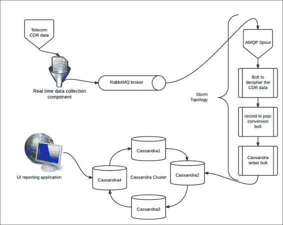

# 第六章：将 NoSQL 持久性添加到 Storm

在本章中，我们将毕业于理解 Storm 的下一步——我们将为我们的拓扑添加持久性。我们选择了 Cassandra，原因是非常明显的，这将在本章中详细阐述。我们的目的是让您了解 Cassandra 数据存储如何与 Storm 拓扑集成。

本章将涵盖以下主题：

+   Cassandra 的优势

+   列式数据库和列族设计基础知识的介绍

+   设置 Cassandra 集群

+   介绍 CQLSH、CLI 和连接器 API

+   Storm 拓扑与 Cassandra 存储相连

+   理解持久性的机制

+   Storm Cassandra 应用程序的最佳实践

# Cassandra 的优势

这是任何人都会问的第一个和最明显的问题，“为什么我们要使用 NoSQL？”嗯，对于选择 NoSQL 而不是传统数据存储的非常快速的答案与为什么世界正在转向大数据是一样的——低成本、高可扩展性和可靠的解决方案，可以存储无限量的数据。

现在，下一个问题是为什么选择 Cassandra，而不是 NoSQL 堆栈中的其他任何东西。答案在于我们正在尝试实现的问题和解决方案方法的性质。嗯，我们正在处理实时分析，我们需要的一切都应该准确、安全可靠和极快速。因此，Cassandra 是最佳选择，因为：

+   它在其同行中（如 HBase 等）拥有最快的写入速度

+   它具有点对点设计的线性可扩展性

+   没有单点故障

+   读写请求可以在不影响彼此性能的情况下处理

+   处理包含数百万交易和极快速度的搜索查询

+   具有复制因子的故障安全和高可用性

+   在 NoSQL 数据库的 CAP 定理上保证最终一致性

+   列族设计以处理各种格式

+   没有或很低的许可成本

+   较少的开发运维或运营成本

+   它可以扩展以集成各种其他大数据组件

# 列式数据库基础知识

开始使用 NoSQL 数据存储最重要的一点是了解列式数据库的基础知识；或者更确切地说，让我们使用实际术语——列族。

这是一个在不同的 NoSQL 数据库中有各种实现的概念，例如：

+   **Cassandra**：这是一个基于键值对的 NoSQL 数据库

+   **Mongo DB**：这是一个基于文档的 NoSQL 数据库

+   **Neo4J**：这是一个图形数据库

它们在以下方面与传统的面向行的关系数据库系统不同：

+   性能

+   存储可扩展性

+   容错性

+   低或没有许可成本

但是，尽管已经列举了所有 NoSQL 数据库的差异和优势，您必须清楚地理解，转向 NoSQL 是对数据存储、可用性和访问的整个范式的转变，它们并不是关系数据库的替代品。

在关系数据库管理系统的世界中，我们都习惯于创建表，但在 Cassandra 中，我们创建列族，其中定义了列的元数据，但列实际上存储为行。每行可以有不同的列集，因此整个列族相对不太结构化和可扩展。

## 列族的类型

有两种类型的列族：

+   **静态列族**：顾名思义，它具有静态的列集，并且非常接近所有众所周知的关系数据库表，除了一些由于其 NoSQL 传统而产生的差异。以下是静态列族的一个示例：

| 行键 | 列 |
| --- | --- |
| Raman | 名字 | 电子邮件 | 电话号码 | 年龄 |
| | Raman Subramanian | aa@yahoo.com | 9999999999 | 20 |
| Edison | 名字 | 电子邮件 | 电话号码 | 年龄 |
| | Edison Weasley | bb@yahoo.com | 88888888888 | 30 |
| Amey | 名字 | 电子邮件 | 电话号码 | 年龄 |
| | Amey Marriot | cc@yahoo.com | 7777777777 | 40 |
| Sriman | 名字 | 电子邮件 | | |
| | Sriman Mishra | dd@yahoo.com | | |

+   **动态列族**：这个真正体现了无结构和无模式的真正本质。在这里，我们不使用与列族关联的预定义列，而是可以由客户端应用程序在插入数据时动态生成和提供。在创建或定义动态列族时，我们可以通过定义比较器和验证器来定义有关列名和值的信息。以下是动态列族的一个示例：

| 行键 | 列 |
| --- | --- |
| Raman | 名字 | 电子邮件 | 电话号码 | 年龄 |
|   |   |   |   |
| Edison | 地址 | 州 | 领土 |   |
|   |   |   |   |
| Amey | 国家 | 性别 | 电话号码 | 年龄 |
|   |   |   |   |
| Sriman | 国籍 |   |   |   |
|   |   |   |   |

## 列的类型

Cassandra 支持各种列：

+   **标准列**：这些列包含一个名称；这是由写入应用程序静态或动态设置的。这里显示了一个值（实际上是存储数据的属性）和时间戳：

| 列名 |
| --- |
| 值 |
| 时间戳 |

Cassandra 利用与列相关联的时间戳来查找列的最后更新。当从 Cassandra 查询数据时，它按照这个时间戳排序，并始终返回最近的值。

+   **复合列**：Cassandra 利用这种存储机制来处理聚类行。这是一种处理所有逻辑行的独特方式，这些逻辑行共享相同的分区键，形成一个单个的物理宽行。这使得 Cassandra 能够完成存储每行 20 亿列的传奇壮举。例如，假设我想创建一个表，其中捕获来自一些社交网络站点的实时状态更新：

```scala
CREATE TABLE statusUpdates(
  update_id uuid PRIMARY KEY,
  username varchar,
  mesage varchar
  );

CREATE TABLE timeseriesTable (
  user_id varchar,
  udate_id uuid,
  username varchar,
  mesage varchar,
  PRIMARY KEY user_id , update_id )
);
```

实时更新记录在`StatusUpdates`表下，该表具有`username`，`message`和`update_id`（实际上是 UUID）属性。

在设计 Cassandra 列族时，应充分利用 UUID 提供的功能，这可以用于对数据进行排序。

来自`timeseriesTable`的`user_id`和`update_id`属性的组合可以唯一标识时间顺序中的一行。

Cassandra 使用主键中定义的第一列作为分区键；这也被称为行键。

+   **过期列**：这些是 Cassandra 的特殊类型列，它们与时间到期（TTL）相关联；存储在这些列中的值在 TTL 过去后会自动删除或擦除。这些列用于我们不希望保留超过规定时间间隔的数据的用例；例如，如果我们不需要 24 小时前的数据。在我们的列族中，我会将每个插入的列关联一个 24 小时的 TTL，并且这些数据将在插入后的 24 小时内被 Cassandra 自动删除。

+   **计数列**：这些又是专门的功能列，用于递增存储数字。它们有一个特殊的实现和专门的用途，用于我们使用计数器的情况；例如，如果我需要计算事件发生的次数。

# 设置 Cassandra 集群

Cassandra 是一个非常可扩展的键值存储。它承诺最终一致性，其分布式基于环形的架构消除了集群中的任何单点故障，因此使其高度可用。它被设计和开发用于支持对大量数据进行非常快速的读写。这种快速的写入和读取能力使其成为用于支持大型业务智能系统的在线事务处理（OLTP）应用的一个非常强大的竞争者。

Cassandra 提供了基于列族的数据模型，比典型的键值系统更灵活。

## 安装 Cassandra

Cassandra 需要部署的最稳定版本的 Java 1.6，最好是 Oracle 或 Sun JVM。执行以下步骤安装 Cassandra：

1.  从 Apache Cassandra 网站下载最新的稳定版本（写作时的版本为 1.1.6）。

1.  在`/usr/local`下创建一个 Cassandra 目录，如下所示：

```scala
sudo mkdir /usr/local/cassandra

```

1.  将下载的 TAR 文件提取到`/usr/local`位置。使用以下命令：

```scala
sudo tar –xvf apache-cassandra-1.1.6-bin.tar.gz -C  /usr/local/cassandra

```

1.  Cassandra 需要一个目录来存储其数据、日志文件和缓存文件。创建`/usr/local/cassandra/tmp`来存储这些数据：

```scala
sudo mkdir –p /usr/local/cassandra/tmp

```

1.  更新`/usr/local/Cassandra/apache-cassandra-1.1.6/conf`下的`Cassandra.yaml`配置文件。

以下属性将进入其中：

```scala
cluster_name: 'MyClusterName'
seeds: <IP of Node-1><IP of Node-2>(IP address of each node  go into it)
listen_address: <IP of Current Node>
```

1.  使用以下脚本为每个节点计算一个 token，并通过在`Cassandra.yaml`中添加唯一 token 值来更新每个节点的`initial_token`属性：

```scala
#! /usr/bin/python
import sys
if (len(sys.argv) > 1):
  num=int(sys.argv[1])
else:
  num=int(raw_input("How many nodes are in your cluster? "))
for i in range(0, num):
  print 'node %d: %d' % (i, (i*(2**127)/num))
```

1.  更新`conf/log4j-server.properties`文件中的以下属性。在`cassandra`下创建`temp`目录：

```scala
Log4j.appender.R.File=/usr/local/cassandra/temp/system.log

```

1.  增加`Cassandra.yaml`中的`rpc_timeout`属性（如果此超时非常小且网络延迟很高，Cassandra 可能会假定节点已死亡，而没有等待足够长的时间来传播响应）。

1.  在`/usr/local/Cassandra/apache-cassandra-1.1.6`上运行 Cassandra 服务器，使用`bin/Cassandra -f`。

1.  在`/usr/local/Cassandra/apache-cassandra-1.1.6`上使用`bin/Cassandra-cli`和主机和端口运行 Cassandra 客户端。

1.  使用`/usr/local/Cassandra/apache-cassandra-1.1.6`下的`bin/nodetool` ring 实用程序验证正确连接的集群：

```scala
bin/nodetool –host <ip-adress> -p <port number> ring 
192.168.1.30 datacenter1 rack1 Up    Normal 755.25 MB  25.00% 0
192.168.1.31 datacenter1 rack1 Up    Normal 400.62 MB  25.00% 42535295865117307932921825928970
192.168.1.51 datacenter1 rack1 Up    Normal 400.62 MB  25.00% 42535295865117307932921825928971
192.168.1.32 datacenter1 rack1 Up    Normal 793.06 MB  25.00% 85070591730234615865843651857941
```

前面的输出显示了一个连接的集群。此配置显示它已正确配置和连接。

以下是输出的屏幕截图：


# 多个数据中心

在实际场景中，我们希望将 Cassandra 集群分布在不同的数据中心，以便系统更可靠和更具抗灾性，以应对局部网络故障和物理灾难。

## 设置多个数据中心的先决条件

以下是设置多个数据中心时应使用的一组先决条件：

+   在每个节点上安装 Cassandra

+   在集群中每个节点的 IP 地址

+   确定集群名称

+   确定种子节点

+   确定要使用的 snitch

## 安装 Cassandra 数据中心

以下是设置 Cassandra 数据中心的一组步骤：

1.  让我们假设我们已经在以下节点上安装了 Cassandra：

10.188.66.41（seed1）

10.196.43.66

10.188.247.41

10.196.170.59（seed2）

10.189.61.170

10.189.30.138

1.  使用前一节中定义的 token 生成 Python 脚本为每个前面的节点分配 token。

1.  假设我们将节点及其 token 分布对齐到以下分布：

| 节点 | IP 地址 | Token | 数据中心 |
| --- | --- | --- | --- |
| node0 | 10.188.66.41 | 0 | Dc1 |
| node1 | 10.196.43.66 | 56713727820156410577229101238628035245 | Dc1 |
| node2 | 10.188.247.41 | 113427455640312821154458202477256070488 | Dc1 |
| node3 | 10.196.170.59 | 10 | Dc2 |
| node4 | 10.189.61.170 | 56713727820156410577229101238628035255 | Dc2 |
| node5 | 10.189.30.138 | 113427455640312821154458202477256070498 | Dc2 |

1.  停止节点上的 Cassandra 并清除 Cassandra 的`data_dir`中的数据：

```scala
$ ps auwx | grep cassandra 

```

此命令查找 Cassandra Java 进程 ID（PID）：

```scala
$ sudo kill <pid> 

```

这是用指定的 PID 杀死进程的命令：

```scala
$ sudo rm -rf /var/lib/cassandra/*

```

上述命令清除了 Cassandra 的默认目录中的数据。

1.  为每个节点修改`cassandra.yaml`文件中的以下属性设置：

```scala
endpoint_snitch <provide the name of snitch> 
  initial_token: <provide the value of token from previous  step>
  seeds: <provide internal IP_address of each seed node>
  listen_address: <provide localhost IP address>
```

更新后的配置如下：

```scala
node0:
end_point_snitch:  org.apache.cassandra.locator.PropertyFileSnitch
initial_token: 0
seed_provider:
  - class_name:  org.apache.cassandra.locator.SimpleSeedProvider
  parameters:
  - seeds: "10.188.66.41,10.196.170.59"
  listen_address: 10.196.43.66
  node1 to node5
```

所有这些节点的属性与前面的`node0`定义的属性相同，除了`initial_token`和`listen_address`属性。

1.  接下来，我们将不得不为每个数据中心及其机架分配名称；例如，`Dc1`，`Dc2`和`Rc1`，`Rc2`。 

1.  转到`cassandra-topology.properties`文件，并针对每个节点的 IP 地址添加数据中心和机架名称的赋值。例如：

```scala
# Cassandra Node IP=Data Center:Rack
10.188.66.41=Dc1:Rc1
10.196.43.66=Dc2:Rc1
10.188.247.41=Dc1:Rc1
10.196.170.59=Dc2:Rc1
10.189.61.170=Dc1:Rc1
10.199.30.138=Dc2:Rc1
```

1.  下一步是逐个启动种子节点，然后启动所有其他节点。

1.  检查您的环是否正常运行。

# CQLSH 介绍

既然我们已经完成了 Cassandra 的设置，让我们熟悉一下 shell 和一些基本命令：

1.  在`/usr/local/Cassandra/apache-cassandra-1.1.6`上使用`bin/cqlsh`运行 CQL，带有主机和端口：

```scala
bin/cqlsh  –host <ip-adress> -p <port number>

```

1.  在 Cassandra 客户端或 CQL 中创建一个 keyspace，如下所示：

```scala
create keyspace <keyspace_name>; 

```

1.  在 Cassandra 客户端或 CQL 中创建一个列族，如下所示：

```scala
use <keyspace_name>;
create column family <columnfamily name>;

```

例如，创建以下表：

```scala
CREATE TABLE appUSers (
 user_name varchar,
 Dept varchar,
 email varchar,
 PRIMARY KEY (user_name));

```

1.  从命令行插入一些记录到列族中：

```scala
INSERT INTO appUSers (user_name, Dept, email)
 VALUES ('shilpi', 'bigdata, 'shilpisaxena@yahoo.com');

```

1.  从列族中检索数据：

```scala
SELECT * FROM appUSers LIMIT 10;

```

# CLI 介绍

本节让您熟悉了另一个用于与 Cassandra 进程交互的工具——CLI shell。

以下步骤用于使用 CLI shell 与 Cassandra 进行交互：

1.  以下是连接到 Cassandra CLI 的命令：

```scala
Cd Cassandra-installation-dir/bin
cassandra-cli -host localhost -port 9160

```

1.  创建一个 keyspace：

```scala
[default@unknown] CREATE KEYSPACE myKeySpace
with placement_strategy = 'SimpleStrategy'
and strategy_options = {replication_factor:1};

```

1.  使用以下命令验证 keyspace 的创建：

```scala
[default@unknown] SHOW KEYSPACES;
 Durable Writes: true
 Options: [replication_factor:3]
 Column Families:
 ColumnFamily: MyEntries
 Key Validation Class:  org.apache.cassandra.db.marshal.UTF8Type
 Default column value validator:  org.apache.cassandra.db.marshal.UTF8Type
 Columns sorted by:  org.apache.cassandra.db.marshal.ReversedType (org.apache.cassandra.db.marshal.TimeUUIDType)
 GC grace seconds: 0
 Compaction min/max thresholds: 4/32
 Read repair chance: 0.1
 DC Local Read repair chance: 0.0
 Replicate on write: true
 Caching: KEYS_ONLY
 Bloom Filter FP chance: default
 Built indexes: []
 Compaction Strategy:  org.apache.cassandra.db.compaction. SizeTieredCompactionStrategy
 Compression Options:
 sstable_compression:  org.apache.cassandra.io.compress.SnappyCompressor
 ColumnFamily: MYDevicesEntries
 Key Validation Class:  org.apache.cassandra.db.marshal.UUIDType
 Default column value validator:  org.apache.cassandra.db.marshal.UTF8Type
 Columns sorted by:  org.apache.cassandra.db.marshal.UTF8Type
 GC grace seconds: 0
 Compaction min/max thresholds: 4/32
 Read repair chance: 0.1
 DC Local Read repair chance: 0.0
 Replicate on write: true
 Caching: KEYS_ONLY
 Bloom Filter FP chance: default
 Built indexes:  [sidelinedDevicesEntries. sidelinedDevicesEntries_date_created_idx,  sidelinedDevicesEntries. sidelinedDevicesEntries_event_type_idx]
 Column Metadata:
 Column Name: event_type
 Validation Class:  org.apache.cassandra.db.marshal.UTF8Type
 Index Name: sidelinedDevicesEntries_event_type_idx
 Index Type: KEYS
 Index Options: {}
 Column Name: date_created
 Validation Class:  org.apache.cassandra.db.marshal.DateType
 Index Name: sidelinedDevicesEntries_date_created_idx
 Index Type: KEYS
 Index Options: {}
 Column Name: event
 Validation Class:  org.apache.cassandra.db.marshal.UTF8Type
 Compaction Strategy:  org.apache.cassandra.db.compaction. SizeTieredCompactionStrategy
 Compression Options:
 sstable_compression:  org.apache.cassandra.io.compress.SnappyCompressor

```

1.  创建一个列族：

```scala
[default@unknown] USE myKeySpace;
 [default@demo] CREATE COLUMN FAMILY appUsers
 WITH comparator = UTF8Type
 AND key_validation_class=UTF8Type
 AND column_metadata = [
 {column_name:user_name, validation_class: UTF8Type}
 {column_name: Dept, validation_class: UTF8Type}
 {column_name: email, validation_class: UTF8Type}
];

```

1.  将数据插入到列族中：

```scala
[default@demo] SET appUsers['SS'][user_name']='shilpi';
 [default@demo] SET appUsers['ss'][Dept]='BigData';
 [default@demo] SET  appUsers['ss']['email']=shilpisaxena@yahoo.com';

```

### 注意

在这个例子中，代码`ss`是我的行键。

1.  从 Cassandra 列族中检索数据：

```scala
GET appUsers[utf8('ss')][utf8('user_name')];
List appUsers;

```

# 使用不同的客户端 API 访问 Cassandra

现在我们已经熟悉了 Cassandra，让我们继续下一步，我们将以编程方式访问（插入或更新）数据到集群中。一般来说，我们谈论的 API 是在核心 Thrift API 上编写的包装器，它提供了使用程序员友好的包进行 Cassandra 集群上的各种 CRUD 操作。

用于访问 Cassandra 的客户端 API 如下：

+   **Thrift 协议**：访问 Cassandra 的最基本的 API 是**远程过程调用**（**RPC**）协议，它提供了一个语言中立的接口，因此可以使用 Python、Java 等进行通信。请注意，我们将讨论的几乎所有其他 API 都在内部使用**Thrift**。它使用简单，并且提供了基本的功能，如环形发现和本地访问。然而，它不支持重试、连接池等复杂功能。然而，有许多库扩展了 Thrift 并添加了这些必要的功能，我们将在本章中介绍一些广泛使用的库。

+   **Hector**：这是用于 Java 客户端应用程序访问 Cassandra 的最稳定和广泛使用的 API 之一。如前所述，它在内部使用 Thrift，因此基本上不能提供 Thrift 协议不支持的任何功能或功能。它被广泛使用的原因是它具有许多基本功能，可以直接使用并且可用：

+   它具有连接池的实现

+   它具有环形发现功能，并附带自动故障转移支持

+   它在 Cassandra 环中具有对宕机主机的重试选项。

+   **Datastax Java driver**：这是最近添加到 Cassandra 客户端访问选项堆栈中的一个选项，因此与较新版本的 Cassandra 兼容。以下是它的显著特点：

+   连接池

+   重新连接策略

+   负载均衡

+   游标支持

+   **Astyanax**：这是 Cassandra 客户端 API 花束的最新添加，由 Netflix 开发，这使它比其他更加神秘。让我们看看它的凭证，看看它是否符合条件：

+   它支持 Hector 的所有功能，并且使用起来更加容易

+   它承诺比 Hector 更好地支持连接池

+   它比 Hector 更擅长处理故障转移

+   它提供了一些开箱即用的类似数据库的功能（这是个大新闻）。在 API 级别上，它提供了称为 Recipes 的功能，其中包括：

并行行查询执行

消息队列功能

对象存储

分页

+   它具有许多经常需要的实用程序，如 JSON Writer 和 CSV Importer

# Storm 拓扑连接到 Cassandra 存储

现在您已经了解并知道为什么应该使用 Cassandra。您已经学会了设置 Cassandra 和列族创建，并且甚至涵盖了可编程访问 Cassandra 数据存储的各种客户端/协议选项。正如前面提到的，Hector 目前是访问 Cassandra 最广泛使用的 API，尽管`Datastax`和`Astyanax`驱动程序正在迅速赶上。对于我们的练习，我们将使用 Hector API。

我们要实现的用例是使用 Cassandra 支持实时的电信数据的即时报告，这些数据正在使用 Storm 拓扑进行整理、解析和丰富。



如前图所示，用例需要使用数据收集组件（为了练习，我们可以使用样本记录和模拟器 shell 脚本来模拟实时 CDR 数据）进行实时电信**通话详单**（**CDR**）捕获。整理的实时数据被推送到 RabbitMQ 代理，然后被 Storm 拓扑消费。

对于拓扑，我们有一个 AMQP spout 作为消费者，它读取队列的数据并将其推送到拓扑的 bolt；在这里，我们已经连接了 bolt 来解析消息并将其转换为**普通旧 Java 对象**（**POJO**）。然后，我们在我们的拓扑中有一个新的条目，即 Cassandra bolt，它实际上将数据存储在 Cassandra 集群中。

从 Cassandra 集群中，基于用户定义的搜索查询，UI 界面的消费者检索数据，从而提供即时的、实时的报告。

为了我们的实现，我们将像这里所示从 CLI/CQLSH 查询数据：

1.  创建一个键空间：

```scala
create keyspace my_keyspace with placement_strategy = 'SimpleStrategy' and strategy_options = {replication_factor : 3} and durable_writes = true;
 use my_keyspace;

```

1.  创建列族：

```scala
create column family my_columnfamily
  with column_type = 'Standard'
  and comparator = 'UTF8Type'
  and default_validation_class = 'BytesType'
  and key_validation_class = 'TimeUUIDType'
  and read_repair_chance = 0.1
  and dclocal_read_repair_chance = 0.0
  and gc_grace = 0
  and min_compaction_threshold = 4
  and max_compaction_threshold = 32
  and replicate_on_write = true
  and compaction_strategy =  'org.apache.cassandra.db.compaction. SizeTieredCompactionStrategy'
  and caching = 'KEYS_ONLY'
  and bloom_filter_fp_chance = 0.5
  and column_metadata = [
{column_name : 'cellnumber',
  validation_class : Int32Type },
  {column_name : 'tollchrg',
  validation_class : UTF8Type},
{column_name : 'msgres',
  validation_class : UTF8Type},

{column_name : 'servicetype',
  validation_class : UTF8Type}]
  and compression_options = {'sstable_compression' :  'org.apache.cassandra.io.compress.SnappyCompressor'
};
```

1.  需要对项目中的`pom.xml`进行以下更改。应该将 Hector 依赖项添加到`pom.xml`文件中，以便在构建时获取并添加到`m2`存储库，如下所示：

```scala
  <dependency>
    <groupId>me.prettyprint</groupId>
    <artifactId>hector-core</artifactId>
    <version>0.8.0-2</version>
  </dependency>
```

如果您正在使用非 Maven 项目，请遵循通常的协议——下载 Hector 核心 JAR 文件并将其添加到项目构建路径，以满足所有所需的依赖关系。

1.  接下来，我们需要在我们的 Storm 拓扑中放置组件。我们将首先创建一个`CassandraController` Java 组件，它将保存所有与 Cassandra 相关的功能，并且将从拓扑中的`CassandraBolt`类中调用以将数据持久化到 Cassandra 中：

```scala
public class CassandraController {

  private static final Logger logger =  LogUtils.getLogger(CassandraManager.class);
  //various serializers are declared in here
  UUIDSerializer timeUUIDSerializer = UUIDSerializer.get();
  StringSerializer stringSerializer =  StringSerializer.get();
  DateSerializer dateSerializer = DateSerializer.get();
  LongSerializer longSerializer = LongSerializer.get();

  public CassandraController() {
      //list of IPs of Cassandra node in ring
      String nodes =  "10.3.1.41,10.3.1.42,10.3.1.44,10.3.1.45";
      String clusterName = "mycluster";
      //creating a new configurator
      CassandraHostConfigurator hostConfigurator = new  CassandraHostConfigurator(nodes);
      hostConfigurator.setCassandraThriftSocketTimeout(0);
      cluster = HFactory.getOrCreateCluster(clusterName,  hostConfigurator);

      String[] nodeList = nodes.split(",");
      if (nodeList != null && nodeList.length ==  cluster.getConnectionManager(). getDownedHosts().size()) {
        logger.error("All cassandra nodes are down. " +  nodes);
      }

      //setting up read and write consistencies
      ConfigurableConsistencyLevel consistency = new  ConfigurableConsistencyLevel();
      consistency.setDefaultWriteConsistencyLevel (HConsistencyLevel.ONE);
      consistency.setDefaultReadConsistencyLevel (HConsistencyLevel.ONE);
      keySpaceObj = HFactory.createKeyspace ("my_keyspace", cluster, consistency);
      stringMutator = HFactory.createMutator(keySpaceObj, stringSerializer);
      uuidMutator = HFactory.createMutator (keySpaceObj, timeUUIDSerializer);

      logger.info("Cassandra data store initialized,  Nodes=" + nodes + ", " + "cluster name=" +  clusterName + ", " + "keyspace=" + keyspace + ", " +  "consistency=" + writeConsistency);
    }
    //defining the mutator 
  public Mutator < Composite > getCompositeMutator() {
    return compositeMutator;
  }

  public void setCompositeMutator(Mutator < Composite >  compositeMutator) {
      this.compositeMutator = compositeMutator;
    }
    //getter and setters for all mutators and serializers

  public StringSerializer getStringSerializer() {
    return stringSerializer;
  }

  public Keyspace getKeyspace() {
    return keySpaceObj;
  }
}
```

1.  我们拓扑中最后一个组件实际上是将数据写入 Cassandra 的组件，这是一个 Storm bolt，它将利用之前创建的`CassandraController`来将实时数据写入 Cassandra：

```scala
public class CassandraBolt extends BaseBasicBolt {
  private static final Logger logger =  LogUtils.getLogger(CassandraBolt.class);

  public void prepare(Map stormConf, TopologyContext  context) {

    logger.debug("Cassandra bolt, prepare()");
    try {
      cassandraMngr = new CassandraController();
      myCf = "my_columnfamily";
      );

    } catch (Exception e) {
      logger.error("Error while instantiating  CassandraBolt", e);
      throw new RuntimeException(e);
    }
  }

  @Override
  public void execute(Tuple input, BasicOutputCollector  collector) {
    logger.debug("execute method :: Start ");
      Calendar tCalendar = null;
      long eventts = eventObj.getEventTimestampMillis();
      com.eaio.uuid.UUID uuid = new  com.eaio.uuid.UUID(getTimeForUUID(eventts),  clockSeqAndNode);

  java.util.UUID keyUUID =  java.util.UUID.fromString(uuid.toString());

  /*
  * Persisting to my CF
  */

  try {
    if (keyUUID != null) {
        cassandraMngrTDR.getUUIDMutator().addInsertion(
            keyUUID,
            myCf,
            HFactory.createColumn("eventts",
                new Timestamp(tCalendar.getTimeInMillis()),  -1, cassandraMngr.getStringSerializer(),
                cassandraMngr.getDateSerializer()));
     }

  cassandraMngrTDR.getUUIDMutator().addInsertion(
    keyUUID,
    myCf,
    HFactory.createColumn("cellnumber",  eventObj.getCellnumber(), -1,  cassandraMngr.getStringSerializer(),
      cassandraMngr.getLongSerializer()));
      cassandraMngr.getUUIDMutator().execute();
  logger.debug("CDR event with key = " + keyUUID + "  inserted into Cassandra cf " + myCf);

  } else {
  logger.error("Record not saved. Error while parsing date  to generate KEY for cassandra data store, column family -  " + myCf);
    }
  }

  catch (Exception excep) {
  logger.error("Record not saved. Error while saving data  to cassandra data store, column family - " + myCf,  excep);
  }

   logger.debug("execute method :: End ");
  }
}
```

所以我们完成了最后一块拼图；现在我们可以使用 Storm 实时将数据流入 Cassandra。一旦您执行了整个拓扑，您可以使用 CLI/CQLSH 上的 select 或 list 命令验证 Cassandra 中的数据。

# Storm/Cassandra 应用程序的最佳实践

在处理具有 24/7 运行 SLA、非常高速和微小平均处理时间的分布式应用程序时，某些方面变得极为重要：

+   网络延迟在实时应用程序中起着重要作用，可能会成败产品，因此在数据中心或跨数据中心中放置各种节点时，要做出非常明智和有意识的决定，通常建议将 ping 延迟保持在最低限度。

+   Cassandra 的复制因子应该在三左右。

+   压缩应该是常规 Cassandra 维护的一部分。

# 测验时间

Q.1. 判断以下陈述是真是假：

1.  Cassandra 是基于文档的 NoSQL。

1.  Cassandra 有单点故障。

1.  Cassandra 在键分发时使用一致性哈希。

1.  Cassandra 工作在主从架构上。

Q.2. 填空：

1.  Cassandra 遵循 CAP 定理的 _______________ 属性。

1.  _______________ 是使 Cassandra 成为与 Storm 一起使用的有力竞争者的显著特点。

1.  Cassandra 是使用 Java 客户端访问 Cassandra 的 API，并且是希腊神话中的角色-卡桑德拉的兄弟。

Q.3. 完成本章提到的用例，并演示将数据填充到 Cassandra 中的端到端执行。

# 总结

在本章中，您已经涵盖了 NoSQL 的基础知识，特别是 Cassandra。您已经亲身体验了设置 Cassandra 集群，并了解了各种 API、驱动程序和协议，这些提供了对 Cassandra 的编程访问。我们还将 Cassandra 集成为我们的 Storm 拓扑的数据存储，用于数据插入。

在下一章中，我们将涉及 Cassandra 的一些重要方面，特别是一致性和可用性。
