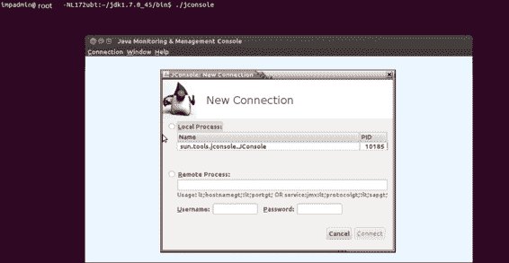
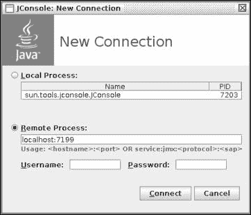
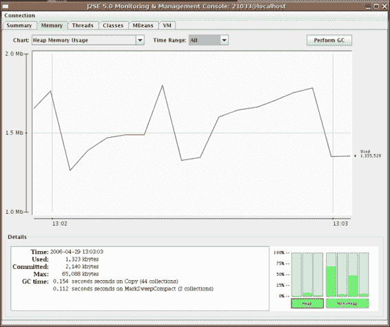
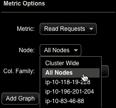
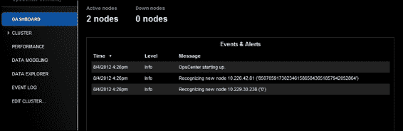
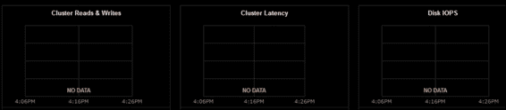

# 第八章：Cassandra 管理和维护

在本章中，我们将学习 Cassandra 的八卦协议。然后，我们将深入了解 Cassandra 管理和管理，以了解扩展和可靠性的实际情况。这将使您能够处理您不希望遇到但在生产中确实发生的情况，例如处理可恢复节点、滚动重启等。

本章将涵盖以下主题：

+   Cassandra——八卦协议

+   Cassandra 扩展——向集群添加新节点

+   替换节点

+   复制因子更改

+   节点工具命令

+   滚动重启和容错

+   Cassandra 监控工具

因此，本章将帮助您了解 Cassandra 的基础知识，以及维护和管理 Cassandra 活动所需的各种选项。

# Cassandra - 八卦协议

八卦是一种协议，其中节点定期与其他节点交换关于它们所知道的节点的信息；这样，所有节点都通过这种点对点通信机制获取关于彼此的信息。这与现实世界和社交媒体世界的八卦非常相似。

Cassandra 每秒执行一次这个机制，一个节点能够与集群中最多三个节点交换八卦信息。所有这些八卦消息都有与之关联的版本，以跟踪时间顺序，旧的八卦交互更新会被新的覆盖。

既然我们知道 Cassandra 的八卦在很高的层面上是什么样子，让我们更仔细地看看它，并了解这个多嘴的协议的目的。以下是通过实施这个协议所达到的两个广泛目的：

+   引导

+   故障场景处理——检测和恢复

让我们了解它们在实际行动中的意义以及它们对 Cassandra 集群的健康和稳定性的贡献。

## 引导

引导是在集群中触发的一个过程，当一个节点第一次加入环时。我们在`Cassandra.yaml`配置文件下定义的种子节点帮助新节点获取有关集群、环、密钥集和分区范围的信息。建议您在整个集群中保持类似的设置；否则，您可能会在集群内遇到分区。一个节点在重新启动后会记住它与哪些节点进行了八卦。关于种子节点还有一点要记住，那就是它们的目的是在引导时为节点提供服务；除此之外，它既不是单点故障，也不提供任何其他目的。

## 故障场景处理——检测和恢复

好吧，八卦协议是 Cassandra 自己有效地知道何时发生故障的方式；也就是说，整个环都通过八卦知道了一个宕机的主机。相反的情况是，当一个节点加入集群时，同样的机制被用来通知环中的所有节点。

一旦 Cassandra 检测到环中的节点故障，它就会停止将客户端请求路由到该节点——故障确实对集群的整体性能产生了一定影响。然而，除非我们有足够的副本以确保一致性提供给客户端，否则它永远不会成为阻碍。

关于八卦的另一个有趣事实是，它发生在各个层面——Cassandra 的八卦，就像现实世界的八卦一样，可能是二手或三手等等；这是间接八卦的表现。

节点的故障可能是实际的或虚拟的。这意味着节点可能由于系统硬件故障而实际失败，或者故障可能是虚拟的，即在一段时间内，网络延迟非常高，以至于似乎节点没有响应。后一种情况大多数情况下是自我恢复的；也就是说，一段时间后，网络恢复正常，节点再次在环中被检测到。活动节点会定期尝试对失败的节点进行 ping 和 gossip，以查看它们是否正常。如果要将节点声明为永久离开集群，我们需要一些管理员干预来明确地从环中删除节点。

当节点在相当长时间后重新加入集群时，可能会错过一些写入（插入/更新/删除），因此，节点上的数据远非根据最新数据状态准确。建议使用`nodetool repair`命令运行修复。

# Cassandra 集群扩展-添加新节点

Cassandra 非常容易扩展，并且无需停机。这是它被选择而不是许多其他竞争者的原因之一。步骤非常简单明了：

1.  您需要在要添加的节点上设置 Cassandra。但是先不要启动 Cassandra 进程；首先按照以下步骤操作：

1.  在`seed_provider`下的`Cassandra.yaml`中更新种子节点。

1.  确保`tmp`文件夹是干净的。

1.  在`Cassandra.yaml`中添加`auto_bootstrap`并将其设置为`true`。

1.  在`Cassandra.yaml`中更新`cluster_name`。

1.  更新`Cassandra.yaml`中的`listen_address`/`broadcast_address`。

1.  逐个启动所有新节点，每两次启动之间至少暂停 5 分钟。

1.  一旦节点启动，它将根据自己拥有的标记范围宣布其数据份额并开始流式传输。可以使用`nodetoolnetstat`命令进行验证，如下面的代码所示：

```scala
mydomain@my-cass1:/home/ubuntu$ /usr/local/cassandra/apache- cassandra-1.1.6/bin/nodetool -h 10.3.12.29 netstats | grep - v 0%
Mode: JOINING
Not sending any streams.
Streaming from: /10.3.12.179
my_keyspace:  /var/lib/cassandra/data/my_keyspace/mycf/my_keyspace-my-hf- 461279-Data.db sections=1  progress=2382265999194/3079619547748 - 77%
Pool Name                    Active   Pending      Completed
Commands                        n/a         0             33
Responses                       n/a         0       13575829
mydomain@my-cass1:/home/ubuntu$

```

1.  在所有节点加入集群后，强烈建议在所有节点上运行`nodetool cleanup`命令。这是为了让它们放弃以前由它们拥有但现在属于已加入集群的新节点的键的控制。以下是命令和执行输出：

```scala
mydomain@my-cass3:/usr/local/cassandra/apache-cassandra- 1.1.6/bin$ sudo -bE ./nodetool -h 10.3.12.178 cleanup  my_keyspacemycf_index
mydomain@my-cass3:/usr/local/cassandra/apache-cassandra- 1.1.6/bin$ du -h   /var/lib/cassandra/data/my_keyspace/mycf_index/
53G  /var/lib/cassandra/data/my_keyspace/mycf_index/
mydomain@my-cass3:/usr/local/cassandra/apache-cassandra- 1.1.6/bin$ jps
27389 Jps
26893 NodeCmd
17925 CassandraDaemon

```

1.  请注意，`NodeCmd`进程实际上是 Cassandra 守护程序的清理过程。在前一个节点上清理后回收的磁盘空间显示在这里：

```scala
Size before cleanup – 57G
Size after cleanup – 30G

```

# Cassandra 集群-替换死节点

本节涵盖了可能发生并导致 Cassandra 集群故障的各种情况和场景。我们还将为您提供处理这些情况的知识并讨论相关步骤。这些情况特定于版本 1.1.6，但也适用于其他版本。

假设问题是这样的：您正在运行一个 n 节点，例如，假设有三个节点集群，其中一个节点宕机；这将导致不可恢复的硬件故障。解决方案是：用新节点替换死节点。

以下是实现解决方案的步骤：

1.  使用`nodetool ring`命令确认节点故障：

```scala
bin/nodetool ring -h hostname

```

1.  死节点将显示为`DOWN`；假设`node3`已宕机：

```scala
192.168.1.54 datacenter1rack1 Up  Normal 755.25 MB 50.00% 0
192.168.1.55 datacenter1rack1 Down Normal 400.62 MB 25.00%  42535295865117307932921825928971026432
192.168.1.56 datacenter1rack1 Up  Normal 793.06 MB 25.00%  85070591730234615865843651857942052864

```

1.  在替换节点上安装和配置 Cassandra。确保使用以下命令从替换的 Cassandra 节点中删除旧安装（如果有）：

```scala
sudorm -rf /var/lib/cassandra/*

```

在这里，`/var/lib/cassandra`是 Cassandra 的数据目录的路径。

1.  配置`Cassandra.yaml`，使其具有与现有 Cassandra 集群相同的非默认设置。

1.  在替换节点的`cassandra.yaml`文件中，将`initial_token`范围设置为死节点的标记 1 的值，即`42535295865117307932921825928971026431`。

1.  启动新节点将在环中死节点的前一个位置加入集群：

```scala
192.168.1.54 datacenter1rack1 Up    Normal 755.25 MB 50.00% 0
192.168.1.51 datacenter1rack1 Up    Normal 400.62 MB 0.00%  42535295865117307932921825928971026431
192.168.1.55 datacenter1rack1 Down     Normal 793.06 MB 25.00%  42535295865117307932921825928971026432
192.168.1.56 datacenter1rack1 Up    Normal 793.06 MB 25.00%  85070591730234615865843651857942052864

```

1.  我们快要完成了。只需在每个 keyspace 的每个节点上运行`nodetool repair`：

```scala
nodetool repair -h 192.168.1.54 keyspace_name -pr
nodetool repair -h 192.168.1.51 keyspace_name -pr
nodetool repair -h 192.168.1.56 keyspace_name–pr

```

1.  使用以下命令从环中删除死节点的令牌：

```scala
nodetoolremovetoken 85070591730234615865843651857942052864

```

这个命令需要在所有剩余的节点上执行，以确保所有活动节点知道死节点不再可用。

1.  这将从集群中删除死节点；现在我们完成了。

# 复制因子

偶尔，我们会遇到需要改变复制因子的情况。例如，我开始时使用较小的集群，所以将复制因子保持为 2。后来，我从 4 个节点扩展到 8 个节点，为了使整个设置更加安全，我将复制因子增加到 4。在这种情况下，需要按照以下步骤进行操作：

1.  以下是用于更新复制因子和/或更改策略的命令。在 Cassandra CLI 上执行这些命令：

```scala
ALTER KEYSPACEmy_keyspace WITH REPLICATION = { 'class' :  'SimpleStrategy', 'replication_factor' : 4 };

```

1.  一旦命令已更新，您必须依次在每个节点上执行`nodetool`修复，以确保所有键根据新的复制值正确复制：

```scala
sudo -bE ./nodetool -h 10.3.12.29 repair my_keyspacemycf -pr
6
mydomain@my-cass3:/home/ubuntu$ sudo -E  /usr/local/cassandra/apache-cassandra-1.1.6/bin/nodetool -h  10.3.21.29 compactionstats
pending tasks: 1
compaction type  keyspace         column family bytes  compacted      bytes total  progress
Validation       my_keyspacemycf  1826902206  761009279707   0.24%
Active compaction remaining time :        n/a
mydomain@my-cass3:/home/ubuntu$

```

以下`compactionstats`命令用于跟踪`nodetool repair`命令的进度。

# nodetool 命令

Cassandra 中的`nodetool`命令是 Cassandra 管理员手中最方便的工具。它具有所有类型的节点各种情况处理所需的工具和命令。让我们仔细看看一些广泛使用的命令：

+   `Ring`：此命令描述节点的状态（正常、关闭、离开、加入等）。令牌范围的所有权和键的百分比所有权以及数据中心和机架详细信息如下：

```scala
bin/nodetool -host 192.168.1.54 ring

```

输出将类似于以下内容：

```scala
192.168.1.54 datacenter1rack1 Up    Normal 755.25 MB 50.00% 0
192.168.1.51 datacenter1rack1 Up    Normal 400.62 MB 0.00%  42535295865117307932921825928971026431
192.168.1.55 datacenter1rack1 Down    Normal 793.06 MB 25.00%  42535295865117307932921825928971026432
192.168.1.56 datacenter1rack1 Up    Normal 793.06 MB 25.00%  85070591730234615865843651857942052864

```

+   `Join`：这是您可以与`nodetool`一起使用的选项，需要执行以将新节点添加到集群中。当新节点加入集群时，它开始从其他节点流式传输数据，直到根据环中的令牌确定的所有键都到达其指定的所有权。可以使用`netsat`命令检查此状态：

```scala
mydomain@my-cass3:/home/ubuntu$ /usr/local/cassandra/apache- cassandra-1.1.6/bin/nodetool -h 10.3.12.29 netstats | grep - v 0%
Mode: JOINING
Not sending any streams.
Streaming from: /10.3.12.179
my_keyspace:  /var/lib/cassandra/data/my_keyspace/mycf/my_keyspace-mycf- hf-46129-Data.db sections=1  progress=238226599194/307961954748 - 77%
Pool Name                    Active   Pending      Completed
Commands                        n/a         0             33
Responses                       n/a         0       13575829

```

+   `Info`：此`nodetool`选项获取有关以下命令指定的节点的所有必需信息：

```scala
bin/nodetool -host 10.176.0.146 info
Token(137462771597874153173150284137310597304)
Load Info        : 0 bytes.
Generation No    : 1
Uptime (seconds) : 697595
Heap Memory (MB) : 28.18 / 759.81

```

+   `Cleanup`：这通常是在扩展集群时使用的选项。添加新节点，因此现有节点需要放弃现在属于集群中新成员的键的控制权：

```scala
mydomain@my-cass3:/usr/local/cassandra/apache-cassandra- 1.1.6/bin$ sudo -bE ./nodetool -h 10.3.12.178 cleanup  my_keyspacemycf_index
mydomain@my-cass3:/usr/local/cassandra/apache-cassandra- 1.1.6/bin$ du -h  /var/lib/cassandra/data/my_keyspace/mycf_index/
53G  /var/lib/cassandra/data/my_keyspace/mycf_index/
aeris@nrt-prod-cass3-C2:/usr/local/cassandra/apache-cassandra- 1.1.6/bin$ sudo `which jps
27389 Jps
26893 NodeCmd
17925 CassandraDaemon
mydomain@my-cass3:/usr/local/cassandra/apache-cassandra- 1.1.6/bin$ du -h  /var/lib/cassandra/data/my_keyspace/mycf_index/
53G  /var/lib/cassandra/data/my_keyspace/mycf_index/

```

+   `Compaction`：这是最有用的工具之一。它用于明确向 Cassandra 发出`compact`命令。这可以在整个节点、键空间或列族级别执行：

```scala
sudo -bE /usr/local/cassandra/apache-cassandra- 1.1.6/bin/nodetool -h 10.3.1.24 compact
mydomain@my-cass3:/home/ubuntu$ sudo -E  /usr/local/cassandra/apache-cassandra-1.1.6/bin/nodetool -h  10.3.1.24 compactionstats
pending tasks: 1
compaction type keyspace column family bytes compacted bytes  total progress
Compaction my_keyspacemycf 1236772 1810648499806 0.00%
Active compaction remaining time:29h58m42s
mydomain@my-cass3:/home/ubuntu$

```

Cassandra 有两种类型的压缩：小压缩和大压缩。小压缩周期在创建新的`sstable`数据时执行，以删除所有墓碑（即已删除的条目）。

主要压缩是手动触发的，使用前面的`nodetool`命令。这可以应用于节点、键空间和列族级别。

+   `Decommission`：这在某种程度上是引导的相反，当我们希望节点离开集群时触发。一旦活动节点接收到命令，它将停止接受新的权限，刷新`memtables`，并开始从自身流式传输数据到将成为当前拥有键范围的新所有者的节点：

```scala
bin/nodetool -h 192.168.1.54 decommission

```

+   `Removenode`：当节点死亡，即物理不可用时，执行此命令。这通知其他节点节点不可用。Cassandra 复制开始工作，通过根据新的环所有权创建数据的副本来恢复正确的复制：

```scala
bin/nodetoolremovenode<UUID>
bin/nodetoolremovenode force

```

+   `修复`：执行此`nodetool repair`命令以修复任何节点上的数据。这是确保数据一致性以及在一段时间后重新加入集群的节点存在的非常重要的工具。假设有一个由四个节点组成的集群，这些节点通过风暴拓扑不断进行写入。在这里，其中一个节点下线并在一两个小时后重新加入环。现在，在此期间，该节点可能错过了一些写入；为了修复这些数据，我们应该在节点上执行`repair`命令：

```scala
bin/nodetool repair

```

# Cassandra 容错

使用 Cassandra 作为数据存储的主要原因之一是其容错能力。它不是由典型的主从架构驱动的，其中主节点的故障成为系统崩溃的单一点。相反，它采用环模式的概念，因此没有单一故障点。在需要时，我们可以重新启动节点，而不必担心将整个集群带下线；在各种情况下，这种能力都非常方便。

有时需要重新启动 Cassandra，但 Cassandra 的环架构使管理员能够在不影响整个集群的情况下无缝进行此操作。这意味着在需要重新启动 Cassandra 集群的情况下，例如需要逐个重新启动节点而不是将整个集群带下线然后重新启动的情况下，Cassandra 管理员可以逐个重新启动节点：

+   使用内存配置更改启动 Cassandra 守护程序

+   在已运行的 Cassandra 集群上启用 JMX

+   有时机器需要例行维护和重新启动

# Cassandra 监控系统

现在我们已经讨论了 Cassandra 的各种管理方面，让我们探索 Cassandra 集群的各种仪表板和监控选项。现在有各种免费和许可的工具可用，我们将在下面讨论。

## JMX 监控

您可以使用基于`jconsole`的一种监控 Cassandra 的类型。以下是使用`jconsole`连接到 Cassandra 的步骤：

1.  在命令提示符中，执行`jconsole`命令：

1.  在下一步中，您必须指定 Cassandra 节点的 IP 和端口以进行连接：

1.  一旦连接，JMX 提供各种图形和监控实用程序：

开发人员可以使用 jconsole 的**内存**选项卡监视堆内存使用情况。这将帮助您了解节点资源的利用情况。

jconsole 的限制在于它执行特定于节点的监控，而不是基于 Cassandra 环的监控和仪表板。让我们在这个背景下探索其他工具。

## Datastax OpsCenter

这是一个由 Datastax 提供的实用程序，具有图形界面，可以让用户从一个中央仪表板监视和执行管理活动。请注意，免费版本仅适用于非生产用途。

Datastax Ops Center 为各种重要的系统**关键性能指标**（**KPI**）提供了许多图形表示，例如性能趋势、摘要等。其用户界面还提供了对单个数据点的历史数据分析和深入分析能力。OpsCenter 将其所有指标存储在 Cassandra 本身中。OpsCenter 实用程序的主要特点如下：

+   基于 KPI 的整个集群监控

+   警报和报警

+   配置管理

+   易于设置

您可以使用以下简单步骤安装和设置 OpsCenter：

1.  运行以下命令开始：

```scala
$ sudo service opscenterd start

```

1.  在 Web 浏览器中连接到 OpsCenter，网址为`http://localhost:8888`。

1.  您将获得一个欢迎屏幕，在那里您将有选项生成一个新集群或连接到现有集群。

1.  接下来，配置代理；一旦完成，OpsCenter 即可使用。

这是应用程序的屏幕截图：



在这里，我们选择要执行的度量标准以及操作是在特定节点上执行还是在所有节点上执行。以下截图捕捉了 OpsCenter 启动并识别集群中的各个节点的情况：



以下截图捕捉了集群读写、整体集群延迟、磁盘 I/O 等方面的各种关键绩效指标：



# 测验时间

Q.1. 判断以下陈述是真还是假。

1.  Cassandra 存在单点故障。

1.  Cassandra 环中立即检测到死节点。

1.  Gossip 是一种数据交换协议。

1.  `decommission`和`removenode`命令是相同的。

Q.2. 填空。

1.  _______________ 是运行压缩的命令。

1.  _______________ 是获取有关活动节点信息的命令。

1.  ___________ 是显示整个集群信息的命令。

Q.3. 执行以下用例以查看 Cassandra 的高可用性和复制：

1.  创建一个 4 节点的 Cassandra 集群。

1.  创建一个副本因子为 3 的键空间。

1.  关闭一个节点上的 Cassandra 守护程序。

1.  在每个节点上执行`nestat`以查看数据流。

# 总结

在本章中，您了解了疏散协议的概念和用于各种场景的适应工具，例如扩展集群、替换死节点、压缩和修复 Cassandra 上的操作。

在下一章中，我们将讨论风暴集群的维护和运营方面。
