# 第九章：风暴管理和维护

在本章中，您将了解 Storm 集群的扩展。您还将看到如何调整 Storm 拓扑的工作节点和并行性。

我们将涵盖以下主题：

+   添加新的监督员节点

+   设置工作节点和并行性以增强处理

+   故障排除

# 扩展 Storm 集群-添加新的监督员节点

在生产中，最常见的情况之一是处理需求超过了集群的大小。此时需要进行扩展；有两种选择：我们可以进行垂直扩展，在其中可以添加更多的计算能力，或者我们可以使用水平扩展，在其中添加更多的节点。后者更具成本效益，也使集群更加健壮。

以下是要执行的步骤，以将新节点添加到 Storm 集群中：

1.  下载并安装 Storm 的 0.9.2 版本，因为它是集群中其余部分使用的，通过解压下载的 ZIP 文件。

1.  创建所需的目录：

```scala
sudo mkdir –p /usr/local/storm/tmp

```

1.  所有 Storm 节点、Nimbus 节点和监督员都需要一个位置来存储与本地磁盘上的配置相关的少量数据。请确保在所有 Storm 节点上创建目录并分配读/写权限。

1.  创建日志所需的目录，如下所示：

```scala
sudo mkdir –p /mnt/app_logs/storm/storm_logs

```

1.  更新`storm.yaml`文件，对 Nimbus 和 Zookeeper 进行必要的更改：

```scala
#storm.zookeeper.servers: This is a list of the hosts in the  Zookeeper cluster for Storm cluster
storm.zookeeper.servers: 
  - "<IP_ADDRESS_OF_ZOOKEEPER_ENSEMBLE_NODE_1>"
  - "<IP_ADDRESS_OF_ZOOKEEPER_ENSEMBLE_NODE_2>"
#storm.zookeeper.port: Port on which zookeeper cluster is running.
  storm.zookeeper.port: 2182
#For our installation, we are going to create this directory in  /usr/local/storm/tmp location.
storm.local.dir: "/usr/local/storm/tmp"
#nimbus.host: The nodes need to know which machine is the #master  in order to download topology jars and confs. This #property is  used for the same purpose.
nimbus.host: "<IP_ADDRESS_OF_NIMBUS_HOST>"
#storm.messaging.netty configurations: Storm's Netty-based  #transport has been overhauled to significantly improve  #performance through better utilization of thread, CPU, and  #network resources, particularly in cases where message sizes  #are small. In order to provide netty support, following  #configurations need to be added :
storm.messaging.transport:"backtype.storm.messaging.netty.Context"
storm.messaging.netty.server_worker_threads:1
storm.messaging.netty.client_worker_threads:1
storm.messaging.netty.buffer_size:5242880
storm.messaging.netty.max_retries:100
storm.messaging.netty.max_wait_ms:1000
storm.messaging.netty.min_wait_ms:100
```

监督员端口的插槽值如下：

| `supervisor.slots.ports` |
| --- |
| - 6700 |
| - 6701 |
| - 6702 |
| - 6703 |

1.  在`~/.bashrc`文件中设置`STORM_HOME`环境，并将 Storm 的`bin`目录添加到`PATH`环境变量中。这样可以从任何位置执行 Storm 二进制文件。要添加的条目如下：

```scala
STORM_HOME=/usr/local/storm
PATH=$PATH:$STORM_HOME/bin

```

1.  在以下每台机器和节点上更新`/etc/hosts`：

+   nimbus 机器：这是为了为正在添加的新监督员添加条目

+   所有现有的监督员机器：这是为了为正在添加的新监督员添加条目

+   新的监督员节点：这是为了添加 nimbus 条目，为所有其他监督员添加条目，并为 Zookeeper 节点添加条目

```scala
sup-flm-1.mydomain.com host:
```

```scala
10.192.206.160    sup-flm-2\. mydomain.net
10.4.27.405       nim-zkp-flm-3\. mydomain.net
```

一旦监督员被添加，启动进程，它应该在 UI 上可见，如下面的截图所示：

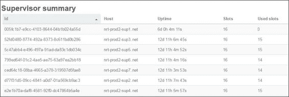

请注意，前面截图中的第一行指向新添加的监督员；它总共有 16 个插槽，目前使用`0`个插槽，因为它刚刚添加到集群中。

# 扩展 Storm 集群和重新平衡拓扑

一旦添加了新的监督员，下一个明显的步骤将是重新平衡在集群上执行的拓扑，以便负载可以在新添加的监督员之间共享。

## 使用 GUI 重新平衡

重新平衡选项在 Nimbus UI 上可用，您可以选择要重新平衡的拓扑，然后使用 GUI 中的选项。拓扑会根据指定的超时时间排空。在此期间，它停止接受来自 spout 的任何消息，并处理内部队列中的消息，一旦完全清除，工作节点和任务将重新分配。用户还可以使用重新平衡选项增加或减少各种螺栓和 spout 的并行性。以下截图描述了如何使用 Storm UI 选项重新平衡拓扑：

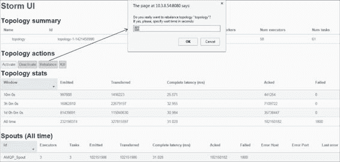

## 使用 CLI 重新平衡

重新平衡的第二个选项是使用 Storm CLI。其命令如下：

```scala
storm rebalance mystormtopology -n 5 -e my-spout=3 -e my-bolt=10

```

在这里，`-n`指定了重新平衡后分配给拓扑的工作器数量，`-e my-spout`指的是分配给 spout 的并行性，同样`-e my-bolt`指的是要分配给螺栓的并行性。在前面的命令中，我们从 Storm 安装 JAR 的`bin`目录下执行了 Storm shell，并在重新平衡 Storm 拓扑时同时改变了 spout 和螺栓的并行性。

可以从 Storm UI 验证对前面命令的执行更改。

# 设置工作器和并行性以增强处理

Storm 是一个高度可扩展、分布式和容错的实时并行处理计算框架。请注意，重点是可扩展性、分布式和并行处理——好吧，我们已经知道 Storm 以集群模式运行，因此在基本性质上是分布式的。可扩展性在前一节中已经涵盖了；现在，让我们更仔细地看看并行性。我们在早些时候的章节中向您介绍了这个概念，但现在我们将让您了解如何调整它以实现所需的性能。以下几点是实现这一目标的关键标准：

+   拓扑在启动时被分配了一定数量的工作器。

+   拓扑中的每个组件（螺栓和 spout）都有指定数量的执行者与之关联。这些执行者指定了拓扑的每个运行组件的并行性数量或程度。

+   Storm 的整体效率和速度因素都受 Storm 的并行性特性驱动，但我们需要明白一件事：所有归因于并行性的执行者都在拓扑分配的有限工作器集合内运行。因此，需要理解增加并行性只能在一定程度上提高效率，但超过这一点后，执行者将争夺资源。超过这一点增加并行性将无法提高效率，但增加分配给拓扑的工作器将使计算更加高效。

在效率方面，另一个需要理解的点是网络延迟；我们将在接下来的部分中探讨这一点。

## 场景 1

以下图示了一个简单的拓扑，有三个移动组件：一个 spout 和两个螺栓。在这里，所有组件都在集群中的不同节点上执行，因此每个元组必须经过两次网络跳转才能完成执行。

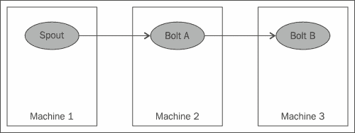

假设我们对吞吐量不满意，并决定增加并行性。一旦我们尝试采用这种技术，就会出现一个问题，即在哪里增加以及增加多少。这可以根据螺栓的容量来计算，这应该可以从 Storm UI 中看到。以下截图说明了这一点：

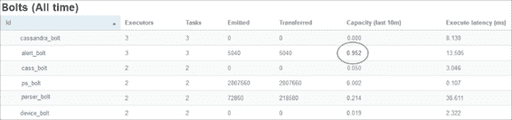

在这里，圈出的值是第二个螺栓的容量，大约为 0.9，已经是红色的，这意味着这个螺栓超负荷工作，增加并行性应该有所帮助。任何拓扑实际上都会在螺栓容量超过`1`时中断并停止确认。为了解决这个问题，让我们看看下一个场景，为这个问题提供一个解决方案。

## 场景 2

在这里，我们已经意识到**Bolt B**超负荷，并增加了并行性，如下图所示：

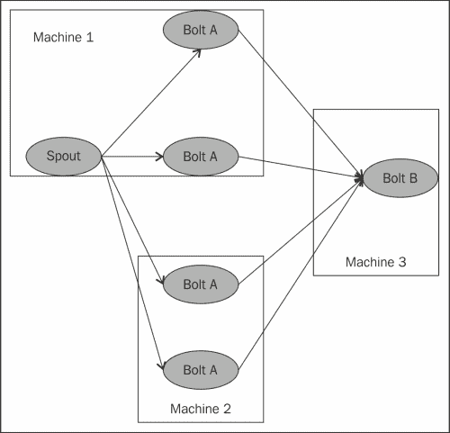

前面的图描述了一个场景，捕捉了集群中不同节点上各种螺栓和 spout 实例的分布。在这里，我们已经意识到一个螺栓超负荷，并观察了容量，通过强制手段，只增加了该螺栓的并行性。

现在，做到了这一点，我们已经实现了所需的并行性；现在让我们来看看网络延迟，即元组在节点之间移动的数量（节点间通信是分布式计算设置中的一个必要元素）：

+   50％的流量在**Machine 1**和**Machine 2**之间跳转

+   50％的流量在**Machine 1**和**Machine 3**之间跳转

+   100％的流量在**Machine 2**和**Machine 3**之间跳转

现在让我们看另一个示例，稍微改变并行性。

## 场景 3

场景 3 是在示例设置中可能出现的最佳场景，我们可以非常有效地使用网络和并行性，如下图所示：

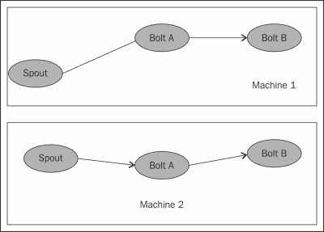

现在，上图是一个示例，展示了我们如何最大程度地利用并行性。如果您看一下上图，您会发现我们已经实现了效率，没有网络跳数；两全其美。

我试图说明的是，并行性应该在考虑网络延迟、跳数和本地处理速度的影响下进行审慎更改。

# Storm 故障排除

作为开发人员，我们需要接受现实，事情确实会出错，需要调试。本节将使您能够有效和高效地处理这种情况。首先要理解编程世界的两个根本口诀：

+   假设一切可能出问题的地方都会出问题

+   任何可能出现问题的地方都可以修复

接受现实，首先通过了解可能出现问题的地方，然后清楚地了解我们应该从哪里开始分析，以帮助我们处理 Storm 集群中的任何情况。让我们了解一下各种指针，显示出问题，并引导我们找到潜在的解决方案。

## Storm UI

首先，让我们了解 UI 本身存在哪些统计数据和指标。最新的 UI 有大量指标，让我们洞悉集群中正在发生的事情以及可能出现问题的地方（以防出现故障）。

让我们看一下 Storm UI，其中**Cluster Summary**包括，例如，`http:// nimbus 的 IP:8080`在我的情况下是`http://10.4.2.122:8080`，我的 UI 进程在具有此 IP 的 nimbus 机器上执行：10.4.2.122。


在前面的屏幕截图中，我们可以看到以下参数：

+   使用的 Storm 版本在第一列中。

+   Nimbus 的正常运行时间（第二列）告诉我们自上次重启以来 Nimbus 节点已经运行了多长时间。正如我们所知，Nimbus 只在拓扑被提交时或监督者或工作人员下线并且任务再次被委派时才需要。在拓扑重平衡期间，Nimbus 也是必需的。

+   第三列给出了集群中监督者的数量。

+   第四、五和六列显示了 Storm 监督者中已使用的工作槽的数量、空闲工作槽的数量和工作槽的总数。这是一个非常重要的统计数据。在任何生产级别的集群中，应该始终为一些工作人员下线或一两个监督者被杀死做好准备。因此，我建议您始终在集群上有足够的空闲槽，以容纳这种突发故障。

+   第七列和第八列指定了拓扑中正在移动的任务，即系统中运行的任务和执行者的数量。

让我们看一下 Storm UI 开启页面上的第二部分；这部分捕获了拓扑摘要：

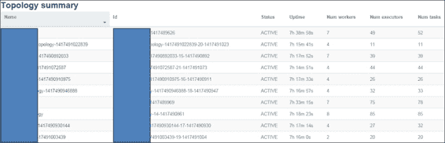

本节描述了 Storm 在拓扑级别捕获和显示的各种参数：

+   第一列和第二列分别显示了拓扑的**Name**字段和拓扑的**Id**字段。

+   第三列显示了拓扑的状态，对于正在执行和处理的拓扑来说，状态是**ACTIVE**。

+   第四列显示了自拓扑启动以来的正常运行时间。

+   接下来的三列显示**Numworkers**，**Num tasks**和**Num executors**；这些是拓扑性能的非常重要的方面。在调整性能时，人们必须意识到仅仅增加**Num tasks**和**Num executors**字段的值可能不会导致更高的效率。如果工作人员的数量很少，而我们只增加执行器和任务的数量，那么由于工作人员数量有限，资源的匮乏会导致拓扑性能下降。

同样，如果我们将太多的工作人员分配给一个拓扑结构，而没有足够的执行器和任务来利用所有这些工作人员，我们将浪费宝贵的资源，因为它们被阻塞和空闲。

另一方面，如果我们有大量的工作人员和大量的执行器和任务，那么由于网络延迟，性能可能会下降。

在陈述了这些事实之后，我想强调性能调优应该谨慎和审慎地进行，以确定适用于我们正在尝试实施的用例的数量。

以下截图捕获了有关监督者的详细信息，以及相应信息的统计数据：

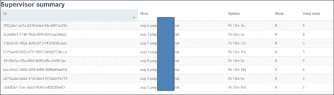

+   第一列是**Id**字段，用于监督者，第二列是运行监督者进程的**hosts**字段的名称。

+   第三列显示了监督者运行的时间。

+   第五列和第六列分别捕获了监督者上可用插槽的数量和已使用的插槽的数量。这两个数字在判断和理解监督者的运行容量以及它们处理故障情况的带宽方面提供了非常重要的指标；例如，我的所有监督者都以 100%的容量运行，所以在这种情况下，我的集群无法处理任何故障。

以下截图是从 Storm UI 中捕获的，显示了监督者及其属性：

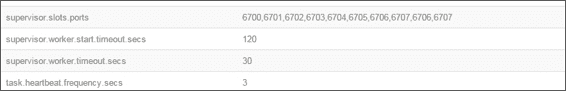

前面的部分为我们提供了有关监督者插槽、超时等的详细信息。这些值在`storm.yaml`中指定，但可以从 UI 中验证。例如，在我的情况下，`http:// nimbus 的 IP:8080`是`http://10.4.2.122:8080`，我的 UI 进程在具有此 IP 的 Nimbus 机器上执行：10.4.2.122，如下图所示：

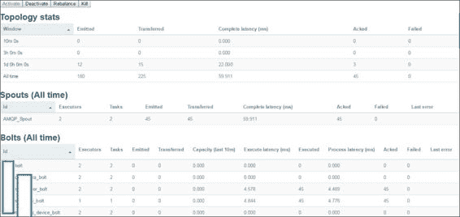

现在，在下面的截图所示的部分中，可以通过在 Storm UI 上单击任何拓扑名称来深入了解拓扑详细信息。这一部分包含了有关拓扑组件的详细信息，包括螺栓、喷口的级别以及有关它们的详细信息，如下图所示：

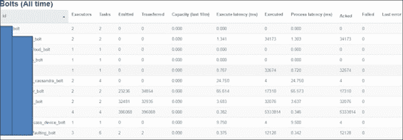

前面的截图显示了有关每个组件分配的执行器或任务数量，以及螺栓或喷口发射的元组数量以及传输到**有向无环图**（**DAG**）中下一个组件的元组数量。

拓扑详细页面上应该注意的其他重要细节如下：

+   过去 10 分钟内螺栓的**容量**：这个值应该远低于 1。

+   **执行延迟**以毫秒为单位：这决定了通过该组件执行元组所需的时间。如果这个值太高，那么我们可能希望将执行分成两个或更多的螺栓，以利用并行性并提高效率。

+   **已执行**：这个值存储了该组件成功执行的元组数量。

+   **处理延迟**：这个值显示了组件执行元组所需的平均总时间。这个值应该与执行延迟一起分析。以下是可能发生的实际情况：

+   **执行延迟**和**处理延迟**都很低（这是最理想的情况）

+   **执行延迟**很低，但**处理延迟**非常高（这意味着实际执行时间较短，与总执行时间相比较高，并且增加并行性可能有助于提高效率）

+   **执行延迟**和**处理延迟**都很高（再次增加并行性可能有所帮助）

## Storm 日志

如果事情不如预期，下一个调试的地方就是 Storm 日志。首先，需要知道 Storm 日志的位置，还需要在`cluster.xml`的`storm-0.9.2-incubating.zip\apache-storm-0.9.2-incubating\logback\cluster.xml`中更新路径：

```scala
<appender class="ch.qos.logback.core.rolling.RollingFileAppender"  name="A1">
  <!—update this as below  <file>${storm.home}/logs/${logfile.name}</file> -->
 <file>/mnt/app_logs/storm/storm_logs/${logfile.name}</file>
  <rollingPolicy  class="ch.qos.logback.core.rolling.FixedWindowRollingPolicy">
    <fileNamePattern>${storm.home}/logs/${logfile.name}.%i </fileNamePattern>
    <minIndex>1</minIndex>
    <maxIndex>9</maxIndex>
</rollingPolicy>
<triggeringPolicy  class="ch.qos.logback.core.rolling.SizeBasedTriggeringPolicy">
    <maxFileSize>100MB</maxFileSize>
</triggeringPolicy>
  <encoder>
    <pattern>%d{yyyy-MM-dd HH:mm:ss} %c{1} [%p] %m%n</pattern>
  </encoder>
</appender>
```

现在粗体字的那一行会告诉你 Storm 日志将被创建的路径/位置。让我们仔细看看不同 Storm 守护程序创建了哪些类型的日志。

可以使用以下命令在 shell 上获取 Nimbus 节点日志：

```scala
Cd /mnt/my_logs/strom/storm_logs
ls-lart

```

Nimbus 日志目录的列表如下截图所示：

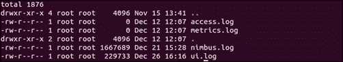

注意我们有`nimbus.log`，其中包含有关 Nimbus 启动、错误和信息日志的详细信息；`ui.log`是在启动 Storm UI 应用程序的节点上创建的。

可以使用以下命令在 shell 上获取监督者节点的日志：

```scala
Cd /mnt/my_logs/strom/storm_logs
ls-lart

```

监督者日志目录的列表如下截图所示：

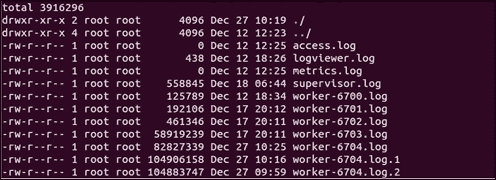

可以查看监督者日志和工作日志。监督者日志记录了监督者启动的详细信息，任何错误等。工作日志是开发人员拓扑日志和各种螺栓和喷口的 Storm 日志所在的地方。

因此，如果我们想要调试 Storm 守护进程，我们会查看`nimbus.log`和`supervisor.log`。如果你遇到问题，那么你需要使用相应的工作日志进行调试。Nimbus 和工作节点故障的情况已在第四章中进行了介绍，*集群模式下的 Storm*。

现在让我们想象一个场景。我是一个开发人员，我的拓扑结构表现不如预期，我怀疑其中一个螺栓的功能不如预期。因此，我们需要调试工作日志并找出根本原因。现在我们需要找出多个监督者和众多工作日志中要查看哪个工作日志；我们将从 Storm UI 中获取这些信息。执行以下步骤：

1.  打开**Storm UI**并点击有问题的拓扑。

1.  点击拓扑的疑似螺栓或喷口。屏幕上会出现与此截图相似的内容：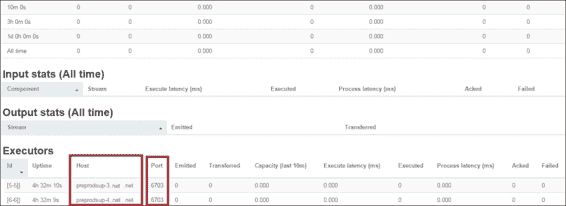

这是调试这个螺栓发生的情况的线索；我将查看`Supervisor5`和`Supervisor6`，`supervisor5`和`supervisor6`上的`worker-6705.log`。

# 测验时间

Q.1\. 判断以下陈述是真还是假：

1.  在执行拓扑的情况下，无法将 Storm 节点添加到集群中。

1.  拓扑无法在 Storm 节点故障时生存。

1.  Storm 日志在集群中的每个节点上创建。

1.  Storm 日志创建的位置是可配置的。

Q.2\. 填空：

1.  _______________ 是集群的心跳跟踪器。

1.  _______________ 是拓扑提交和重平衡所必需的守护程序。

1.  ___________ 文件保存了拓扑的工作配置。

Q.3\. 执行以下用例以查看 Storm 的内部情况：

1.  启动 Nimbus 并检查`nimbus.log`，查看成功启动的情况。

1.  启动监督者并检查`Supervisor.log`，查看成功启动的情况。

1.  提交拓扑，比如一个简单的`WordCount`拓扑，并找出`worker.log`文件的创建情况。

1.  更新`log4j.properties`以更改日志级别并验证其影响。

# 摘要

在本章中，我们已经涵盖了 Storm 的维护概念，包括添加新节点、重新平衡和终止拓扑。我们已经了解并调整了诸如`numtasks`和并行性与`numworkers`和网络延迟相结合的内部机制。您学会了定位和解读 Storm 组件的日志。您还了解了 Storm UI 的指标及其对拓扑性能的影响。

在下一章中，我们将讨论 Storm 的高级概念，包括微批处理和 Trident API。
