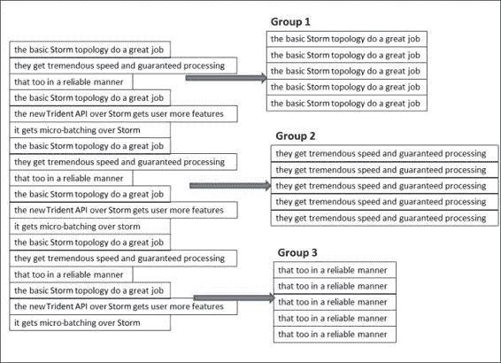

# 第十章：风暴中的高级概念

在本章中，我们将涵盖以下主题：

+   构建 Trident 拓扑

+   理解 Trident API

+   示例和插图

在本章中，我们将学习事务性拓扑和 Trident API。我们还将探讨微批处理的方面以及它在 Storm 拓扑中的实现。

# 构建 Trident 拓扑

Trident 为 Storm 计算提供了批处理边缘。它允许开发人员在 Storm 框架上使用抽象层进行计算，从而在分布式查询中获得有状态处理和高吞吐量的优势。

嗯，Trident 的架构与 Storm 相同；它是建立在 Storm 之上的，以在 Storm 之上添加微批处理功能和执行类似 SQL 的函数的抽象层。

为了类比，可以说 Trident 在概念上很像 Pig 用于批处理。它支持连接、聚合、分组、过滤、函数等。

Trident 具有基本的批处理功能，例如一致处理和对元组的执行逻辑进行一次性处理。

现在要理解 Trident 及其工作原理；让我们看一个简单的例子。

我们选择的例子将实现以下功能：

+   对句子流进行单词计数（标准的 Storm 单词计数拓扑）

+   用于获取一组列出的单词计数总和的查询实现

这是解剖的代码：

```scala
FixedBatchSpout myFixedspout = new FixedBatchSpout(new  Fields("sentence"), 3,
new Values("the basic storm topology do a great job"),
new Values("they get tremendous speed and guaranteed processing"),
new Values("that too in a reliable manner "),
new Values("the new trident api over storm gets user more features  "),
new Values("it gets micro batching over storm "));
myFixedspout.setCycle(true);
```

```scala
myFixedspout cycles over the set of sentences added as values. This snippet ensures that we have an endless flow of data streams into the topology and enough points to perform all micro-batching functions that we intend to.
```

现在我们已经确保了连续的输入流，让我们看下面的片段：

```scala
//creating a new trident topology
TridentTopology myTridentTopology = new TridentTopology();
//Adding a spout and configuring the fields and query 
TridentState myWordCounts = topology.newStream("myFixedspout",  spout)
  .each(new Fields("sentence"), new Split(), new Fields("word"))
  .groupBy(new Fields("word"))
  .persistentAggregate(new MemoryMapState.Factory(), new Count(),  new Fields("count"))
  .parallelismHint(6);
```

```scala
Now the micro-batching; who does it and how? Well the Trident framework stores the state for each source (it kind of remembers what input data it has consumed so far). This state saving is done in the Zookeeper cluster. The tagging *spout* in the preceding code is actually a znode, which is created in the Zookeeper cluster to save the state metadata information.
```

这些元数据信息存储在小批处理中，其中批处理大小是根据传入元组的速度变化的变量；它可以是几百到数百万个元组，具体取决于每秒的事件**事务数**（**tps**）。

现在我的喷口读取并将流发射到标记为`sentence`的字段中。在下一行，我们将句子分割成单词；这正是我们在前面提到的`wordCount`拓扑中部署的相同功能。

以下是捕捉`split`功能工作的代码上下文：

```scala
public class Split extends BaseFunction {
  public void execute(TridentTuple tuple, TridentCollector  collector) {
      String sentence = tuple.getString(0);
      for(String word: sentence.split(" ")) {
          collector.emit(new Values(word));
      }
  }
}
```

```scala
Trident with Storm is so popular because it guarantees the processing of all tuples in a fail-safe manner in exactly one semantic. In situations where retry is necessary because of failures, it does that exactly once and once only, so as a developer I don't end up updating the table storage multiple times on occurrence of a failure.

```

在前面的代码片段中，我们使用`myTridentTopology`创建了一个 DRPC 流，此外，我们还有一个名为`word`的函数。

+   我们将参数流分割成其组成的单词；例如，我的参数`storm trident topology`被分割成诸如`storm`、`trident`和`topology`等单词* 然后，传入的流被按`word`分组* 接下来，状态查询操作符用于查询由拓扑的第一部分生成的 Trident 状态对象：

+   状态查询接收拓扑先前部分计算的单词计数。

+   然后它执行作为 DRPC 请求的一部分指定的函数来查询数据。

+   在这种情况下，我的拓扑正在执行查询的`MapGet`函数，以获取每个单词的计数；在我们的情况下，DRPC 流以与拓扑前一部分中的`TridentState`完全相同的方式分组。这种安排确保了每个单词的所有计数查询都被定向到`TridentState`对象的相同 Trident 状态分区，该对象将管理单词的更新。

+   `FilterNull`确保没有计数的单词被过滤掉* 然后求和聚合器对所有计数求和以获得结果，结果会自动返回给等待的客户端

在理解开发人员编写的代码执行之后，让我们看看 Trident 的样板文件以及当这个框架执行时自动发生的事情。

+   在我们的 Trident 单词计数拓扑中有两个操作，它们从状态中读取或写入——`persistentAggregate`和`stateQuery`。Trident 具有自动批处理这些操作的能力，以便将它们批处理到状态。例如，当前处理需要对数据库进行 10 次读取和写入；Trident 会自动将它们一起批处理为一次读取和一次写入。这为您提供了性能和计算的便利，优化由框架处理。

+   Trident 聚合器是框架的其他高效和优化组件。它们不遵循将所有元组传输到一台机器然后进行聚合的规则，而是通过在可能的地方执行部分聚合，然后将结果传输到网络来优化计算，从而节省网络延迟。这里采用的方法类似于 MapReduce 世界中的组合器。

# 理解 Trident API

Trident API 支持五大类操作：

+   用于操作本地数据分区的操作，无需网络传输

+   与流重新分区相关的操作（涉及通过网络传输流数据）

+   流上的数据聚合（此操作作为操作的一部分进行网络传输）

+   流中字段的分组

+   合并和连接

## 本地分区操作

正如其名称所示，这些操作在每个节点上对批处理进行本地操作，不涉及网络流量。以下功能属于此类别。

### 函数

+   此操作接受单个输入值，并将零个或多个元组作为输出发射

+   这些函数操作的输出附加到原始元组的末尾，并发射到流中

+   在函数不发射输出元组的情况下，框架也会过滤输入元组，而在其他情况下，输入元组会被复制为每个输出元组

让我们通过一个示例来说明这是如何工作的：

```scala
public class MyLocalFunction extends BaseFunction {
  public void execute(TridentTuple myTuple, TridentCollector  myCollector) {
      for(int i=0; i < myTuple.getInteger(0); i++) {
          myCollector.emit(new Values(i));
      }
  }
}
```

现在假设，变量`myTridentStream`中的输入流具有以下字段`["a"，"b"，"c"]`，流中的元组如下所示：

```scala
[10, 2, 30]
[40, 1, 60]
[30, 0, 80]
```

```scala
mystream.each(new Fields("b"), new MyLocalFunction(), new  Fields("d")))
```

这里期望的输出是根据函数应该返回`["a"，"b"，"c"，"d"]`，所以对于流中的前面的元组，我将得到以下输出：

```scala
//for input tuple [10, 2, 30] loop in the function executes twice  //value of b=2
[10, 2, 30, 0]
[10, 2, 30, 1]
//for input tuple [4, 1, 6] loop in the function executes once  value //of b =1
[4, 1, 6, 0]
//for input tuple [3, 0, 8]
//no output because the value of field b is zero and the for loop  //would exit in first iteration itself value of b=0
```

### 过滤器

过滤器并非名不副实；它们的执行与其名称所示完全相同：它们帮助我们决定是否保留元组，它们确切地做到了过滤器的作用，即根据给定的条件删除不需要的内容。

让我们看下面的片段，以查看过滤函数的工作示例：

```scala
public class MyLocalFilterFunction extends BaseFunction {
    public boolean isKeep(TridentTuple tuple) {
      return tuple.getInteger(0) == 1 && tuple.getInteger(1) == 2;
    }
}
```

让我们看看输入流上的示例元组，字段为`["a"，"b"，"c"]`：

```scala
[1,2,3]
[2,1,1]
[2,3,4]
```

我们执行或调用函数如下：

```scala
mystream.each(new Fields("b", "a"), new MyLocalFilterFunction())
```

输出将如下所示：

```scala
//for tuple 1 [1,2,3]
// no output because valueof("field b") ==1 && valueof("field a")  ==2 //is not satisfied 
//for tuple 1 [2,1,1]
// no output because valueof("field b") ==1 && valueof("field a")  ==2 [2,1,1]
//for tuple 1 [2,3,4]
// no output because valueof("field b") ==1 && valueof("field a")  ==2 //is not satisfied
```

### partitionAggregate

`partitionAggregate`函数对一批元组的每个分区进行操作。与迄今为止执行的本地函数相比，此函数之间存在行为差异，它对输入元组发射单个输出元组。

以下是可以用于在此框架上执行各种聚合的其他函数。

#### Sum 聚合

以下是对 sum 聚合器函数的调用方式：

```scala
mystream.partitionAggregate(new Fields("b"), new Sum(), new Fields("sum"))
```

假设输入流具有`["a"，"b"]`字段，并且以下是元组：

```scala
Partition 0:
["a", 1]
["b", 2]
Partition 1:
["a", 3]
["c", 8]
Partition 2:
["e", 1]
["d", 9]
["d", 10]
```

输出将如下所示：

```scala
Partition 0:
[3]
Partition 1:
[11]
Partition 2:
[20]
```

#### CombinerAggregator

Trident API 提供的此接口的实现返回一个带有单个字段的单个元组作为输出；在内部，它对每个输入元组执行 init 函数，然后将值组合，直到只剩下一个值，然后将其作为输出返回。如果组合器函数遇到没有任何值的分区，则发射"0"。

以下是接口定义及其合同：

```scala
public interface CombinerAggregator<T> extends Serializable {
    T init(TridentTuple tuple);
    T combine(T val1, T val2);
    T zero();
}
```

以下是计数功能的实现：

```scala
public class myCount implements CombinerAggregator<Long> {
    public Long init(TridentTuple mytuple) {
        return 1L;
    }
public Long combine(Long val1, Long val2) {
        return val1 + val2;
    }

    public Long zero() {
        return 0L;
    }
}
```

这些`CombinerAggregators`函数相对于`partitionAggregate`函数的最大优势在于，它是一种更高效和优化的方法，因为它在通过网络传输结果之前执行部分聚合。

#### ReducerAggregator

正如其名称所示，此函数生成一个`init`值，然后迭代处理输入流中的每个元组，以生成包含单个字段和单个元组的输出。

以下是`ReducerAggregate`接口的接口契约：

```scala
public interface ReducerAggregator<T> extends Serializable {
    T init();
    T reduce(T curr, TridentTuple tuple);
}
```

以下是计数功能的接口实现：

```scala
public class myReducerCount implements ReducerAggregator<Long> {
    public Long init() {
        return 0L;
    }

    public Long reduce(Long curr, TridentTuple tuple) {
        return curr + 1;
    }
}
```

#### Aggregator

`Aggregator`函数是最常用和多功能的聚合器函数。它有能力发出一个或多个元组，每个元组可以有任意数量的字段。它们具有以下接口签名：

```scala
public interface Aggregator<T> extends Operation {
    T init(Object batchId, TridentCollector collector);
    void aggregate(T state, TridentTuple tuple, TridentCollector  collector);
    void complete(T state, TridentCollector collector);
}
```

执行模式如下：

+   `init`方法是每个批次处理之前的前导。它在处理每个批次之前被调用。完成后，它返回一个持有批次状态表示的对象，并将其传递给后续的聚合和完成方法。

+   与`init`方法不同，`aggregate`方法对批次分区中的每个元组调用一次。该方法可以存储状态，并根据功能要求发出结果。

+   complete 方法类似于后处理器；当批次分区被聚合完全处理时执行。

以下是计数作为聚合器函数的实现：

```scala
public class CountAggregate extends BaseAggregator<CountState> {
    static class CountState {
        long count = 0;
    }
    public CountState init(Object batchId, TridentCollector  collector) {
        return new CountState();
    }
    public void aggregate(CountState state, TridentTuple tuple,  TridentCollector collector) {
        state.count+=1;
    }
    public void complete(CountState state, TridentCollector  collector) {
        collector.emit(new Values(state.count));
    }
}
```

许多时候，我们遇到需要同时执行多个聚合器的实现。在这种情况下，链接的概念就派上了用场。由于 Trident API 中的这个功能，我们可以构建一个聚合器的执行链，以便在传入流元组的批次上执行。以下是这种链的一个例子：

```scala
myInputstream.chainedAgg()
        .partitionAggregate(new Count(), new Fields("count"))
        .partitionAggregate(new Fields("b"), new Sum(), new  Fields("sum"))
        .chainEnd()
```

此链的执行将在每个分区上运行指定的`sum`和`count`聚合器函数。输出将是一个单个元组，其中包含`sum`和`count`的值。

## 与流重新分区相关的操作

正如其名称所示，这些流重新分区操作与执行函数来改变任务之间的元组分区有关。这些操作涉及网络流量，结果重新分发流，并可能导致整体分区策略的变化，从而影响多个分区。

以下是 Trident API 提供的重新分区函数：

+   `Shuffle`: 这执行一种重新平衡的功能，并采用随机轮询算法，以实现元组在分区之间的均匀重新分配。

+   `Broadcast`: 这就像其名称所示的那样；它将每个元组广播和传输到每个目标分区。

+   `partitionBy`: 这个函数基于一组指定字段的哈希和模运算工作，以便相同的字段总是移动到相同的分区。类比地，可以假设这个功能的运行方式类似于最初在 Storm 分组中学到的字段分组。

+   `global`: 这与 Storm 中流的全局分组相同，在这种情况下，所有批次都选择相同的分区。

+   `batchGlobal`: 一个批次中的所有元组都被发送到同一个分区（所以它们在某种程度上是粘在一起的），但不同的批次可以被发送到不同的分区。

## 流上的数据聚合

Storm 的 Trident 框架提供了两种执行聚合的操作：

+   `aggregate`: 我们在之前的部分中已经涵盖了这个，它在隔离的分区中工作，而不涉及网络流量

+   `persistentAggregate`: 这在分区间执行聚合，但不同之处在于它将结果存储在状态源中

## 流中字段的分组

分组操作的工作方式类似于关系模型中的分组操作，唯一的区别在于 Storm 框架中的分组操作是在输入源的元组流上执行的。

让我们通过以下图更仔细地了解这一点：



Storm Trident 中的这些操作在几个不同分区的元组流上运行。

## 合并和连接

合并和连接 API 提供了合并和连接各种流的接口。可以使用以下多种方式来实现这一点：

+   `合并`: 正如其名称所示，`merge`将两个或多个流合并在一起，并将合并后的流作为第一个流的输出字段发出：

```scala
myTridentTopology.merge(stream1,stream2,stream3);

```

+   `连接`: 此操作与传统的 SQL `join`函数相同，但不同之处在于它适用于小批量而不是从喷口输出的整个无限流

例如，考虑一个连接函数，其中 Stream 1 具有诸如`["key", "val1", "val2"]`的字段，Stream 2 具有`["x", "val1"]`，并且从这些函数中我们执行以下代码：

```scala
myTridentTopology.join(stream1, new Fields("key"), stream2, new  Fields("x"), new Fields("key", "a", "b", "c"));
```

结果，Stream 1 和 Stream 2 将使用`key`和`x`进行连接，其中`key`将连接 Stream 1 的字段，`x`将连接 Stream 2 的字段。

从连接中发出的输出元组将如下所示：

+   所有连接字段的列表；在我们的情况下，它将是 Stream 1 的`key`和 Stream 2 的`x`。

+   所有参与连接操作的流中不是连接字段的字段列表，顺序与它们传递给`join`操作的顺序相同。在我们的情况下，对于 Stream 1 的`val1`和`val2`，分别是`a`和`b`，对于 Stream 2 的`val1`是`c`（请注意，此步骤还会消除流中存在的任何字段名称的歧义，我们的情况下，`val1`字段在两个流之间是模棱两可的）。

当在拓扑中从不同的喷口中提供的流上发生像连接这样的操作时，框架确保喷口在批量发射方面是同步的，以便每个连接计算可以包括来自每个喷口的批量元组。

# 示例和插图

Trident 的另一个开箱即用且流行的实现是 reach 拓扑，它是一个纯 DRPC 拓扑，可以根据需要找到 URL 的可达性。在我们深入研究之前，让我们先了解一些行话。

Reach 基本上是暴露给 URL 的 Twitter 用户数量的总和。

Reach 计算是一个多步骤的过程，可以通过以下示例实现：

+   获取曾经发推特的 URL 的所有用户

+   获取每个用户的追随者树

+   组装之前获取的大量追随者集

+   计算集合

好吧，看看之前的骨架算法，你会发现它超出了单台机器的能力，我们需要一个分布式计算引擎来实现它。这是 Storm Trident 框架的理想候选，因为您可以在整个集群中的每个步骤上执行高度并行的计算。

+   我们的 Trident reach 拓扑将从两个大型数据银行中吸取数据

+   银行 A 是 URL 到发起者银行，其中将存储所有 URL 以及曾经发推特的用户的名称。

+   银行 B 是用户追随者银行；这个数据银行将为所有 Twitter 用户提供用户追随映射

拓扑将定义如下：

```scala
TridentState urlToTweeterState =  topology.newStaticState(getUrlToTweetersState());
TridentState tweetersToFollowerState =  topology.newStaticState(getTweeterToFollowersState());

topology.newDRPCStream("reach")
       .stateQuery(urlToTweeterState, new Fields("args"), new  MapGet(), new Fields("tweeters"))
       .each(new Fields("tweeters"), new ExpandList(), new  Fields("tweeter"))
       .shuffle()
       .stateQuery(tweetersToFollowerState, new Fields("tweeter"),  new MapGet(), new Fields("followers"))
       .parallelismHint(200)
       .each(new Fields("followers"), new ExpandList(), new  Fields("follower"))
       .groupBy(new Fields("follower"))
       .aggregate(new One(), new Fields("one"))
       .parallelismHint(20)
       .aggregate(new Count(), new Fields("reach"));
```

在前述拓扑中，我们执行以下步骤：

1.  为两个数据银行（URL 到发起者银行 A 和用户到追随银行 B）创建一个`TridentState`对象。

1.  `newStaticState`方法用于实例化数据银行的状态对象；我们有能力在之前创建的源状态上运行 DRPC 查询。

1.  在执行中，当要计算 URL 的可达性时，我们使用数据银行 A 的 Trident 状态执行查询，以获取曾经发推特的所有用户的列表。

1.  `ExpandList`函数为查询 URL 的每个推特者创建并发出一个元组。

1.  接下来，我们获取先前获取的每个推特者的追随者。这一步需要最高程度的并行性，因此我们在这里使用洗牌分组，以便在所有螺栓实例之间均匀分配负载。在我们的 reach 拓扑中，这是最密集的计算步骤。

1.  一旦我们有了 URL 推特者的追随者列表，我们执行类似于筛选唯一追随者的操作。

1.  我们通过将追随者分组在一起，然后使用`one`聚合器来得到唯一的追随者。后者简单地为每个组发出`1`，然后在下一步将所有这些计数在一起以得出影响力。

1.  然后我们计算追随者（唯一），从而得出 URL 的影响力。

# 测验时间

1. 状态是否以下陈述是真是假：

1.  DRPC 是一个无状态的，Storm 处理机制。

1.  如果 Trident 拓扑中的元组执行失败，整个批次将被重放。

1.  Trident 允许用户在流数据上实现窗口函数。

1.  聚合器比分区聚合器更有效。

2. 填空：

1.  _______________ 是 RPC 的分布式版本。

1.  _______________ 是 Storm 的基本微批处理框架。

1.  ___________________ 函数用于根据特定标准或条件从流批次中删除元组。

3. 创建一个 Trident 拓扑，以查找在过去 5 分钟内发表最多推文的推特者。

# 总结

在本章中，我们几乎涵盖了关于 Storm 及其高级概念的一切，并让您有机会亲自体验 Trident 和 DRPC 拓扑。您了解了 Trident 及其需求和应用，DRPC 拓扑以及 Trident API 中提供的各种功能。

在下一章中，我们将探索与 Storm 紧密配合并且对于使用 Storm 构建端到端解决方案必不可少的其他技术组件。我们将涉及分布式缓存和与 Storm 一起使用 memcache 和 Esper 进行**复杂事件处理**（CEP）的领域。
