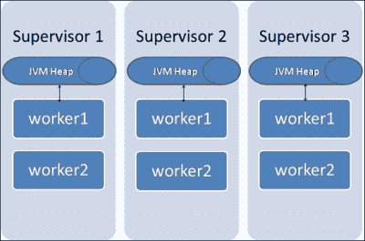
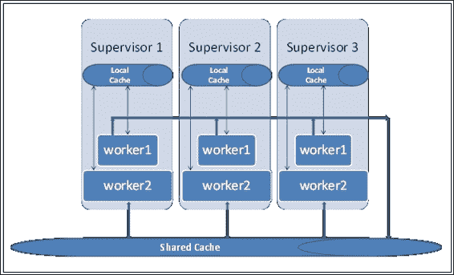
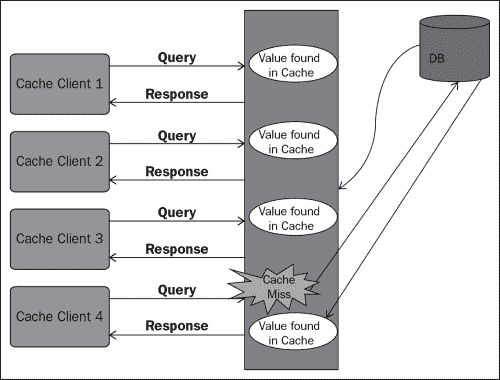
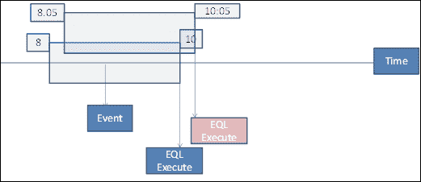
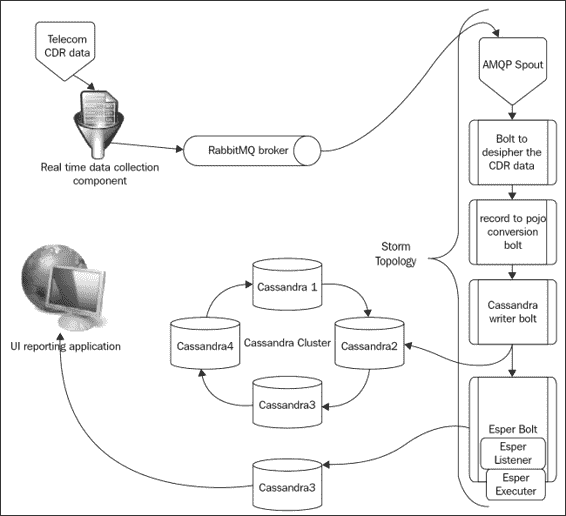
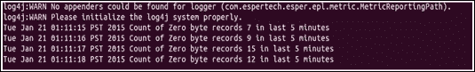

# 第十一章：分布式缓存和 CEP 与 Storm

在本章中，我们将学习与 Storm 结合使用分布式缓存的需求，以及将广泛使用的选项与 Storm 集成。我们还将涉及与 Storm 合作的**复杂事件处理**（CEP）引擎。

本章将涵盖以下主题：

+   Storm 框架中分布式缓存的需求

+   memcache 简介

+   构建具有缓存的拓扑

+   CEP 和 Esper 简介

在本章的结尾，您应该能够将 CEP 和缓存与 Storm 结合起来，以解决实时使用案例。

# Storm 中分布式缓存的需求

现在我们已经足够了解 Storm 的所有优势，让我们谈谈它最大的弱点之一：缺乏共享缓存，即所有在 Storm 集群的各个节点上运行的任务都可以访问和写入的共同内存存储。

下图说明了一个三节点的 Storm 集群，其中每个监督节点上都有两个运行的 worker：



如前图所示，每个 worker 都有自己的 JVM，数据可以存储和缓存。然而，我们缺少的是一个缓存层，它可以在监督者的 worker 之间共享组件，也可以跨监督者之间共享。下图描述了我们所指的需求：



前面的图描述了需要一个共享缓存层的情况，可以在所有节点中引用共同的数据。这些都是非常有效的使用案例，因为在生产中，我们会遇到以下情况：

+   我们有很多只读的参考维度数据，我们希望将其放在一个地方，而不是在每个监督者级别进行复制和更新

+   有时，在某些使用案例中，我们有事务性数据，需要所有 worker 读取和更新；例如，当计算某些事件时，计数必须保存在一个共同的位置

这就是共享缓存层的作用，可以在所有监督节点上访问。

# memcached 简介

Memcached 是一个非常简单的内存键值存储；我们可以将其视为哈希映射的内存存储。它可以与 Storm 监督者结合使用，作为一个共同的内存存储，可以被 Storm 集群中各个节点上的所有 Storm worker 进行读写操作。

Memcached 有以下组件：

+   memcached 服务器

+   memcache 客户端

+   哈希算法（基于客户端的实现）

+   数据保留的服务器算法

Memcached 使用**最近最少使用**（LRU）算法来丢弃缓存中的元素。这意味着自最长时间以来未被引用的项目首先从缓存中移除。这些项目被认为已从缓存中过期，如果它们在过期后被引用，它们将从稳定存储重新加载。

以下是从缓存中加载和检索条目的流程：



前面的图描述了缓存命中和未命中的情况，其中某些项目根据 LRU 算法过期。前图中的情况如下：

+   当缓存应用程序启动时，它会从稳定存储（在我们的案例中是数据库）中加载数据。

+   在请求从缓存中获取数据的情况下，可能会发生两种情况：

+   **缓存命中**：这是我们请求的数据存在于缓存服务器上的情况，在这种情况下，请求将从缓存中提供

+   **缓存未命中**：这是请求的数据在缓存服务器中不存在的情况，在这种情况下，数据从数据库中获取到缓存中，然后从缓存中提供请求

现在我们了解了缓存的功能以及在 Storm 解决方案背景下的需求。

## 设置 memcache

以下是需要执行并将需要安装 memcache 的步骤：

```scala
wget http://memcached.org/latest
tar -zxvfmemcached-1.x.x.tar.gz
cdmemcached-1.x.x
./configure && make && make test &&sudo make install

```

以下是连接到 memcache 客户端和函数的代码片段。它从缓存中检索数据：

```scala
public class MemCacheClient {
  private static MemcachedClient client = null;
  private static final Logger logger =  LogUtils.getLogger(MemCacheClient.class);

  /**
  * Constructor that accepts the cache properties as parameter  and initialises the client object accordingly.
   * @param properties
   * @throws Exception
   */

  publicMemCacheClient(Properties properties) throws Exception {
    super();
    try {
      if (null == client) {
        client = new MemcachedClient(new InetSocketAddress(
          102.23.34.22,
          5454)));
    }
  } catch (IOException e) {
    if (null != client)
      shutdown();
    throw new Exception("Error while initiating MemCacheClient",  e);
  }
}

/**
 * Shutdown the client and nullify it
 */

public void shutdown() {
    logger.info("Shutting down memcache client ");
    client.shutdown();
    client = null;
  }

  /**
    * This method sets a value in cache with a specific key and  timeout 
    * @param key the unique key to identify the value 
    * @paramtimeOut the time interval in ms after which the value  would be refreshed
    * @paramval
    * @return
    */

  public Future < Boolean > addToMemCache(String key, inttimeOut,  Object val) {
    if (null != client) {
      Future < Boolean > future = client.set(key, timeOut, val);
      return future;
    } else {
      return null;
    }
  }

  /**
    * retrives and returns the value object against the key passed  in as parameter
    * @param key
    * @return
    */

public Object getMemcachedValue(String key) {
  if (null != client) {
    try {
      returnclient.get(key);
    } catch (OperationTimeoutException e) {
      logger.error(
        "Error while fetching value from memcache server for key "  + key, e);
      return null;
    }
  } else
    return null;
  }
}
```

一旦编码了前面的代码片段，您将建立创建缓存客户端、将数据加载到缓存中并从中检索值的机制。因此，任何需要访问缓存的 Storm bolt 都可以使用通过与客户端交互创建的公共层。

## 使用缓存构建拓扑

```scala
cache:
```

```scala
public class MyCacheReaderBolt extends BaseBasicBolt {
  MyCacheReadercacheReader;
  @Override
  public void prepare(Map stormConf, TopologyContext context) {
      super.prepare(stormConf, context);
      try {
        cacheReader = new MyCacheReader();
      } catch (Exception e) {
        logger.error("Error while initializing Cache", e);
      }
    }

  /**
     * Called whenever a new tuple is received by this bolt.  Responsible for 
     * emitting cache enriched event onto output stream 
  */

  public void execute(Tuple tuple, BasicOutputCollector collector)  {
    logger.info("execute method :: Start ");
    event = tuple.getString(0);
    populateEventFromCache(event);
    collector.emit(outputStream, new Values(event));
  } else {
    logger.warn("Event not parsed :: " + tuple.getString(0));
  }
} catch (Exception e) {
  logger.error("Error in execute() ", e);
  }
}
logger.info("execute method :: End ");
}

private void populateEventFromCache(Event event) {
  HashMapfetchMap = (HashMap)  cacheReader.get(searchObj.hashCode());
  if (null != fetchMap) {
    event.setAccountID(Integer.parseInt((String)  fetchMap.get("account_id")));
    logger.debug("Populating event" + event + " using cache " +  fetchMap);
  } else {
    logger.debug("No matching event found in cache.");
  }
  logger.info("Time to fetch from cache=" +  (System.currentTimeMillis() - t1) + "msec");
  }
}

/**
 * Declares output streams and tuple fields emitted from this bolt
 */
  @Override
    public void declareOutputFields(OutputFieldsDeclarer declarer)  {
    String stormStreamName = logStream.getName() + "_" +  eventType;
    declarer.declareStream(stormStreamName, new  Fields(stormStreamName));
  logger.debug("Topology : " + topology.getTopologyName() + ",  Declared output stream : " + stormStreamName + ", Output field :  " + stormStreamName);
}
```

```scala
 dimensional data from memcache, and emits the enriched bolt to the streams to the following bolts in the DAG topology.
```

# 复杂事件处理引擎简介

通常与之一起使用的有两个术语，它们是**复杂事件处理**（**CEP**）和**事件流处理**（**ESP**）。

嗯，在理论上，这些是技术范式的一部分，使我们能够构建具有戏剧性的实时分析的应用程序。它们让我们以非常快的速度处理传入事件，并在事件流之上执行类似 SQL 的查询以生成实时直方图。我们可以假设 CEP 是传统数据库的倒置。在传统的 DBMS 和 RDBMS 的情况下，我们有存储的数据，然后我们对它们运行 SQL 查询以得出结果，而在 CEP 的情况下，我们有预定义或存储的查询，然后我们通过它们运行数据。我们可以通过一个例子来设想这一点；比方说我经营一个百货商店，我想知道过去一小时内销量最高的商品。所以如果你看这里，我们即将执行的查询在性质上是相当固定的，但输入数据并不是恒定的——它在每次销售交易时都会改变。同样，比方说我经营一个股票持有公司，想知道过去 2 分钟内每 5 秒钟的前 10 名表现者。



前面的图示了股票行情使用案例，我们有一个 2 分钟的滑动窗口，股票行情每 5 秒钟滑动一次。现在我们有许多实际的用例，比如：

+   针对**销售点**（**POS**）交易的欺诈检测模式

+   在任何段中的前 *N* 个

+   将深度学习模式应用于来自任何来源的流数据

现在，了解了 CEP 及其高层次需求后，让我们简要介绍其高层次组件：

+   在每个 CEP 中的操作数是`事件`的`数据`；它本质上是一个事件驱动的系统

+   **事件处理语言**：这是一个工具，用于便利地构建要在数据上执行的查询

+   **监听器**：这些是实际执行查询并在事件到达系统时执行操作的组件

## Esper

Esper 是领先的 CEP 引擎之一，可在开源（GPL 和企业许可证）下使用。该软件包可从[`www.espertech.com/download/`](http://www.espertech.com/download/)下载，如果您尝试执行基于 Maven 的 Esper 项目，依赖项可以构建如下：

```scala
<dependency>
<groupId>com.espertech</groupId>
<artifactId>esper</artifactId>
<version> ... </version>
</dependency>
Ref :Espertech.com
```

下一个显而易见的问题可能是为什么我们想要将 Esper-CEP 与 Storm 一起使用。嗯，Esper 具有一些独特的能力，与 Storm 配合得很好，并让 EQL 功能利用在 Storm 上得出的结果。以下是导致这种选择的互补功能：

+   **吞吐量**：作为 Storm 能力的补充，Esper 也具有非常高的吞吐量，可以处理每秒从 1K 到 100K 条消息。

+   **延迟**：Esper 有能力以非常低的延迟率执行 EQL 和基于 Esper 结果的操作；在大多数情况下，这是毫秒级的顺序。

+   **计算**：这指的是执行功能的能力，例如基于聚合的模式检测、复杂查询和随时间的相关性。这些切片窗口的流数据。

## 开始使用 Esper

```scala
CasinoWinEvent, a value object where we store the name of the game, the prize amount, and the timestamp:
```

```scala
public static class CasinoWinEvent {
  String game;
  Double prizeAmount;
  Date timeStamp;

  publicCasinoWinEvent(String s, double p, long t) {
    game = s;
    prizeAmount = p;
    timeStamp = new Date(t);
  }
  public double getPrizeAmount() {
    return prizeAmount;
  }
  public String getGame() {
    return game;
  }
  public Date getTimeStamp() {
    return timeStamp;
  }

  @
  Override
  public String toString() {
    return "Price: " + price.toString() + " time: " +  timeStamp.toString();
  }
}
```

一旦我们有了值对象，下一步就是实例化 Esper 引擎和监听器，并将所有部分连接在一起：

```scala
public class myEsperMain {
  private static Random generator = new Random();
  public static void GenerateRandomCasinoWinEvent(EPRuntimecepRT)  {
    doubleprizeAmount = (double) generator.nextInt(10);
    longtimeStamp = System.currentTimeMillis();
    String game = "Roulette";
    CasinoWinEventcasinoEvent = new CasinoWinEvent(game,  prizeAmount, timeStamp);
    System.out.println("Sending Event:" + casinoEvent);
    cepRT.sendEvent(casinoEvent);
  }
  public static class CEPListener implements UpdateListener {
    public void update(EventBean[] newData, EventBean[] oldData) {
      System.out.println("Event received: " +  newData[0].getUnderlying());
    }
  }
  public static void main(String[] args) {
    //The Configuration is meant only as an initialization-time  object.
    Configuration cepConfig = new Configuration();
    cepConfig.addEventType("CasinoEvent",  CasinoWinEvent.class.getName());
    EPServiceProvidercep =  EPServiceProviderManager.getProvider("myCEPEngine",  cepConfig);
    EPRuntimecepRT = cep.getEPRuntime();
    EPAdministratorcepAdm = cep.getEPAdministrator();
    EPStatementcepStatement = cepAdm.createEPL("select * from " +   "CasinoEvent(symbol='Roulette').win:length(2) " + "having  avg(prizeAmount) > 10000.0");

    cepStatement.addListener(new CEPListener());
    // We generate a few ticks...
    for (inti = 0; i < 5; i++) {
      GenerateRandomCasinoWinEvent(cepRT);
    }
  }
}
```

CEPListener 是`updateListener`的实现（用于监听事件的到达），`newData`具有一个或多个新到达事件的流，`oldData`具有流的先前状态，即监听器到达当前触发器之前的状态。

在主方法中，我们可以加载 Esper 配置，或者如我们前面的案例所示，创建一个默认配置。然后，我们创建一个 Esper 运行时引擎实例，并将 EQL 查询绑定到它。

如果你看前面代码中的`cepStatement.addListener(new CEPListener())`语句，你会发现我们还将监听器绑定到了语句，从而将所有部分连接在一起。

## 将 Esper 与 Storm 集成

下图显示了我们计划如何将 Esper 与我们在第六章中早期创建的拓扑之一*向 Storm 添加 NoSQL 持久性*结合使用。Storm 与 Esper 的集成使开发人员能够在 Storm 处理的事件流上执行类似 SQL 的查询。



```scala
ZeroDuration filter bolt that filters the CALL_END events that have a duration of 0 seconds to be emitted onto the stream feeding the Esper bolt:
```

```scala
  /*
  * Bolt responsible for forwarding events which satisfy following  criteria:
  * <ul>
  * <li>event should belong to 'End'  type</li>
  * <li>duration should be zero</li>
  * </ul>
  */

public class ZeroSecondsCDRBolt extends BaseRichBolt {

  /**
  * Called when {@link ZeroSecondsCDRBolt} is initialized
  */
  @Override
  public void prepare(Map conf, TopologyContext context,
    OutputCollector collector) {
    logger.info("prepare method :: Start ");
    this.collector = collector;
    logger.info("prepare() conf {},Collector {}", conf.toString(),  collector.toString());
    logger.info("prepare method :: End ");
  }

  /**
  * Called whenever a new tuple is received by this bolt. This  method 
   * filters zero duration End records 
   */

  @
  Override
  public void execute(Tuple tuple) {
    logger.info("execute method :: Start ");

    if (tuple != null && tuple.getString(0) != null) {
      eventCounter++;
      String event = tuple.getString(0);
      logger.info("execute :event recd :: {}", event);
      if (event != null && event.contains("CALL_END")) {
        emitCallEndRecords(tuple);
      }
      collector.ack(tuple);
    }
    logger.info("execute method :: End ");
  }

  private void emitCallEndRecords(Tuple tuple) {
    String event = tuple.getString(0);

      try {
        //splitting the event based on semicolon
        String[] eventTokens = event.split(",");
        duration = Long.parseLong(eventTokens[4]);
        callId = Long.parseLong(eventTokens[0]);
        logger.debug(" Event (callId = {}) is a Zero duration  Qualifier ", callId);
        collector.emit(....);

      } catch (Exception e) {
        logger.error("Corrupt Stopped record. Error occurred while  parsing the event : {}", event);
      }
    }

  /**
  * Declares output fields in tuple emitted from this bolt
  */

  @Override
  public void declareOutputFields(OutputFieldsDeclarer declarer) {
    declarer.declareStream(CALL_END, new Fields());
  }

  @
  Override
  public Map < String, Object > getComponentConfiguration() {
    return null;
  }
}
```

下一步是将 Esper bolt 结合到拓扑中。这可以从[`github.com/tomdz/storm-esper`](https://github.com/tomdz/storm-esper)轻松下载为捆绑包，并且可以使用以下代码快速捆绑到拓扑中：

```scala
EsperBoltesperBolt = newEsperBolt.Builder()
  .inputs()
  .aliasComponent("ZeroSecondCallBolt")
  .withFields("a", "b")
  .ofType(Integer.class)
  .toEventType("CALL_END")
  .outputs()
  .outputs().onDefaultStream().emit("count")
  .statements()
  .add("select callID as CALL_ID,callType as CALL_TYPE, count(*)  as OCCURRENCE_CNT from CDR.win:time_batch(5 minutes)  where  (eventType = 'CALL_END') and (duration = 0) group by  callID,eventType having count(*) > 0 order by  OCCURRENCE_CNTdesc")
  .build();
```

输出将如下所示：



前面图中的 Esper 查询在传入数据流上执行；以下是其分解和解释：

```scala
selectcallID as CALL_ID,callType as CALL_TYPE, count(*) as  OCCURRENCE_CNT
```

我们从传入的元组中选择以下字段，如`Call_Id`，`Call_type`和`count`：

```scala
fromCDR.win:time_batch(5 minutes)  where (eventType = 'CALL_END')  and (duration = 0) group by callID,eventTypehaving count(*) > 0
order by OCCURRENCE_CNTdesc
```

我们正在操作的命名窗口是`CDR.WIN`。批处理大小为 5 分钟，这意味着随着每个事件或元组的到达，我们会回顾过去 5 分钟的时间，并对过去 5 分钟内到达的数据执行查询。结果按事件类型分组，并按相反顺序排序。

# 测验时间

问题 1.判断以下陈述是真还是假：

1.  缓存是只读内存空间。

1.  一旦数据添加到缓存中，就会永远保留在那里。

1.  CEP 允许在流数据上实现类似 SQL 的查询。

1.  Esper 基于事件驱动架构。

问题 2.填空：

1.  _______________ 是 memcache 的算法。

1.  当缓存中没有数据时，称为 _______________。

1.  _______________ 是 Esper 的组件，触发**Endeca 查询语言**（**EQL**）的执行。

1.  _______________ 通常用于时间序列窗口函数数据。

问题 3.使用 Esper 创建一个端到端拓扑，以显示在某条高速公路上前 10 名超速设备的 Storm 和 Esper 的结合使用。

# 总结

在本章中，我们讨论了与 Storm 结合使用缓存的概念，以及开发人员使用缓存的实用性和应用。我们了解了 memcache 作为缓存系统。

在本章的后部分，我们探讨了 Esper 作为复杂事件处理系统，并了解了它与 Storm 拓扑的集成。
