# 第一章：Scala 简介

“我是 Scala。我是一种可扩展的、函数式的、面向对象的编程语言。我可以随着你的成长而成长，你可以通过输入一行表达式来与我互动，并立即观察结果。”

- Scala 引用

在过去的几年里，Scala 在数据科学和分析领域特别是开发人员和从业者中得到了稳步增长和广泛采用。另一方面，使用 Scala 编写的 Apache Spark 是用于大规模数据处理的快速通用引擎。Spark 的成功归功于许多因素：易于使用的 API、清晰的编程模型、性能等等。因此，自然而然地，Spark 对 Scala 的支持更多：与 Python 或 Java 相比，Scala 有更多的 API 可用；尽管如此，新的 Scala API 在 Java、Python 和 R 之前就已经可用。

在我们开始使用 Spark 和 Scala（第二部分）编写数据分析程序之前，我们将首先详细了解 Scala 的函数式编程概念、面向对象的特性和 Scala 集合 API（第一部分）。作为起点，我们将在本章节中简要介绍 Scala。我们将涵盖 Scala 的一些基本方面，包括其历史和目的。然后我们将看到如何在不同平台上安装 Scala，包括 Windows、Linux 和 Mac OS，以便您可以在您喜爱的编辑器和 IDE 上编写数据分析程序。在本章的后面，我们将对 Java 和 Scala 进行比较分析。最后，我们将通过一些示例深入学习 Scala 编程。

简而言之，以下主题将被涵盖：

+   Scala 的历史和目的

+   平台和编辑器

+   安装和设置 Scala

+   Scala：可扩展的语言

+   面向 Java 程序员的 Scala

+   Scala 初学者

+   摘要

# Scala 的历史和目的

Scala 是一种通用编程语言，支持`函数式编程`和强大的`静态类型`系统。Scala 的源代码旨在编译成`Java`字节码，以便生成的可执行代码可以在`Java 虚拟机`（JVM）上运行。

Martin Odersky 于 2001 年在**洛桑联邦理工学院**（**EPFL**）开始设计 Scala。这是他在 Funnel 上的工作的延伸，Funnel 是一种使用函数式编程和 Petri 网的编程语言。首次公开发布是在 2004 年，但只支持 Java 平台。随后，在 2004 年 6 月，.NET 框架也开始支持。

Scala 因不仅支持面向对象的编程范式，而且还包含了函数式编程概念，因此变得非常受欢迎并得到了广泛的采用。此外，尽管 Scala 的符号操作符很难阅读，与 Java 相比，大多数 Scala 代码相对简洁易读——例如，Java 太啰嗦了。

与其他编程语言一样，Scala 是为特定目的而提出和开发的。现在，问题是，为什么创建了 Scala，它解决了什么问题？为了回答这些问题，Odersky 在他的博客中说：

“Scala 的工作源于开发组件软件的更好语言支持的研究工作。我们希望通过 Scala 实验验证两个假设。首先，我们假设组件软件的编程语言需要在描述小部分和大部分时使用相同的概念。因此，我们集中于抽象、组合和分解的机制，而不是添加大量原语，这些原语在某个规模级别上可能对组件有用，但在其他级别上则不是。其次，我们假设组件的可扩展支持可以通过统一和泛化面向对象和函数式编程的编程语言来提供。对于 Scala 这样的静态类型语言，这两种范式到目前为止基本上是分开的。”

然而，Scala 也提供了模式匹配和高阶函数等功能，不是为了填补函数式编程和面向对象编程之间的差距，而是因为它们是函数式编程的典型特征。因此，它具有一些非常强大的模式匹配功能，还有一个基于 actor 的并发框架。此外，它还支持一阶和高阶函数。总之，"Scala"这个名字是可伸缩语言的混成词，意味着它被设计成能够满足用户需求的语言。

# 平台和编辑器

Scala 在**Java 虚拟机**（**JVM**）上运行，这使得 Scala 对于希望在代码中添加函数式编程风格的 Java 程序员来说是一个不错的选择。在编辑器方面有很多选择。最好花一些时间对可用的编辑器进行比较研究，因为熟悉 IDE 是成功编程经验的关键因素之一。以下是一些可供选择的选项：

+   Scala IDE

+   Eclipse 的 Scala 插件

+   IntelliJ IDEA

+   Emacs

+   VIM

Scala 在 Eclipse 上的编程支持使用了许多 beta 插件。Eclipse 提供了一些令人兴奋的功能，如本地、远程和高级调试功能，以及用于 Scala 的语义突出显示和代码补全。您可以使用 Eclipse 同样轻松地进行 Java 和 Scala 应用程序开发。但是，我还建议 Scala IDE（[`scala-ide.org/`](http://scala-ide.org/)）- 这是一个基于 Eclipse 的全功能 Scala 编辑器，并且定制了一系列有趣的功能（例如 Scala 工作表、ScalaTest 支持、Scala 重构等）；

在我看来，第二个最佳选择是 IntelliJ IDEA。第一个版本于 2001 年发布，是第一个具有高级代码导航和重构功能的 Java IDE。根据 InfoWorld 报告（请参阅[`www.infoworld.com/article/2683534/development-environments/infoworld-review--top-java-programming-tools.html`](http://www.infoworld.com/article/2683534/development-environments/infoworld-review--top-java-programming-tools.html)），在四个顶级 Java 编程 IDE（即 Eclipse、IntelliJ IDEA、NetBeans 和 JDeveloper）中，IntelliJ 获得了最高的测试中心评分 8.5 分（满分 10 分）。

相应的评分如下图所示：

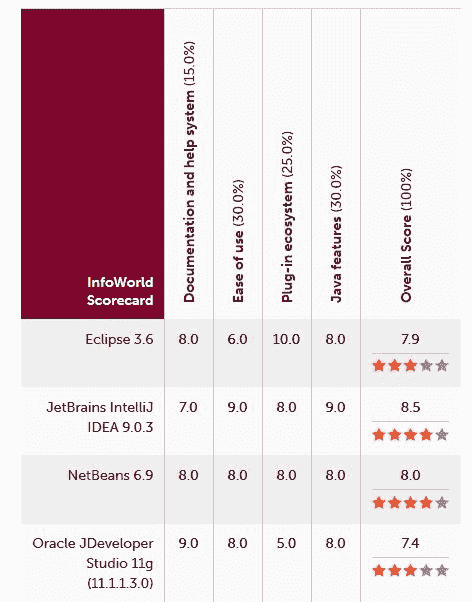**图 1：** Scala/Java 开发人员最佳 IDE

从上面的图中，您可能对使用其他 IDE，如 NetBeans 和 JDeveloper 也感兴趣。最终，选择是开发人员之间永恒的辩论，这意味着最终选择取决于您。

# 安装和设置 Scala

正如我们已经提到的，Scala 使用 JVM，因此请确保您的机器上已安装 Java。如果没有，请参考下一小节，其中介绍了如何在 Ubuntu 上安装 Java。在本节中，首先我们将向您展示如何在 Ubuntu 上安装 Java 8。然后，我们将看到如何在 Windows、Mac OS 和 Linux 上安装 Scala。

# 安装 Java

为简单起见，我们将展示如何在 Ubuntu 14.04 LTS 64 位机器上安装 Java 8。但是对于 Windows 和 Mac OS，最好花一些时间在 Google 上了解一下。对于 Windows 用户的最小线索：请参考此链接获取详细信息[`java.com/en/download/help/windows_manual_download.xml`](https://java.com/en/download/help/windows_manual_download.xml)。

现在，让我们看看如何通过逐步命令和说明在 Ubuntu 上安装 Java 8。首先，检查 Java 是否已安装：

```scala
$ java -version 

```

如果返回`程序 java 在以下包中找不到`，则说明 Java 尚未安装。然后您可以执行以下命令来摆脱这个问题：

```scala
 $ sudo apt-get install default-jre 

```

这将安装**Java Runtime Environment**（**JRE**）。但是，如果您可能需要**Java Development Kit**（**JDK**），通常需要在 Apache Ant、Apache Maven、Eclipse 和 IntelliJ IDEA 上编译 Java 应用程序。

Oracle JDK 是官方 JDK，但是 Oracle 不再将其作为 Ubuntu 的默认安装提供。您仍然可以使用 apt-get 安装它。要安装任何版本，首先执行以下命令：

```scala
$ sudo apt-get install python-software-properties
$ sudo apt-get update
$ sudo add-apt-repository ppa:webupd8team/java
$ sudo apt-get update 

```

然后，根据您要安装的版本，执行以下命令之一：

```scala
$ sudo apt-get install oracle-java8-installer

```

安装完成后，不要忘记设置 Java 主目录环境变量。只需应用以下命令（为简单起见，我们假设 Java 安装在`/usr/lib/jvm/java-8-oracle`）：

```scala
$ echo "export JAVA_HOME=/usr/lib/jvm/java-8-oracle" >> ~/.bashrc  
$ echo "export PATH=$PATH:$JAVA_HOME/bin" >> ~/.bashrc
$ source ~/.bashrc 

```

现在，让我们看一下`Java_HOME`如下：

```scala
$ echo $JAVA_HOME

```

您应该在终端上观察到以下结果：

```scala
 /usr/lib/jvm/java-8-oracle

```

现在，让我们通过输入以下命令来检查 Java 是否已成功安装（您可能会看到最新版本！）：

```scala
$ java -version

```

您将获得以下输出：

```scala
java version "1.8.0_121"
Java(TM) SE Runtime Environment (build 1.8.0_121-b13)
Java HotSpot(TM) 64-Bit Server VM (build 25.121-b13, mixed mode)

```

太棒了！现在您的机器上已经安装了 Java，因此一旦安装了 Scala，您就可以准备好编写 Scala 代码了。让我们在接下来的几个小节中做这个。

# Windows

本部分将重点介绍在 Windows 7 上安装 Scala 的 PC，但最终，您当前运行的 Windows 版本将不重要：

1.  第一步是从官方网站下载 Scala 的压缩文件。您可以在[`www.Scala-lang.org/download/all.html`](https://www.scala-lang.org/download/all.html)找到它。在此页面的其他资源部分，您将找到一个存档文件列表，您可以从中安装 Scala。我们将选择下载 Scala 2.11.8 的压缩文件，如下图所示：

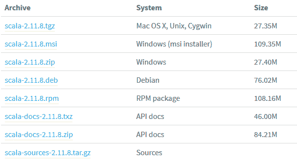**图 2：** Windows 的 Scala 安装程序

1.  下载完成后，解压文件并将其放在您喜欢的文件夹中。您还可以将文件重命名为 Scala 以提高导航灵活性。最后，需要为 Scala 创建一个`PATH`变量，以便在您的操作系统中全局看到。为此，请转到计算机 | 属性，如下图所示：

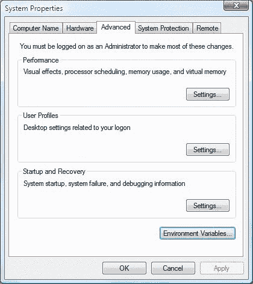**图 3：** Windows 上的环境变量选项卡

1.  从中选择环境变量，并获取 Scala 的`bin`文件夹的位置；然后，将其附加到`PATH`环境变量。应用更改，然后按 OK，如下截图所示：

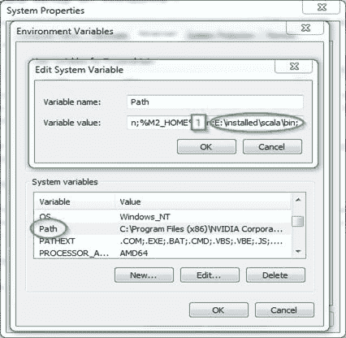**图 4：** 为 Scala 添加环境变量

1.  现在，您可以开始进行 Windows 安装。打开 CMD，只需输入`scala`。如果安装过程成功，您应该会看到类似以下截图的输出：

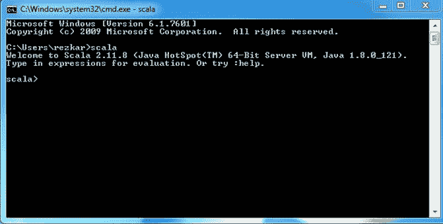**图 5：** 从“Scala shell”访问 Scala

# Mac OS

现在是时候在您的 Mac 上安装 Scala 了。有很多种方法可以在 Mac 上安装 Scala，在这里，我们将提到其中两种：

# 使用 Homebrew 安装程序

1.  首先，检查您的系统是否已安装 Xcode，因为这一步骤需要。您可以免费从 Apple App Store 安装它。

1.  接下来，您需要通过在终端中运行以下命令来安装`Homebrew`：

```scala
$ /usr/bin/ruby -e "$(curl -fsSL https://raw.githubusercontent.com/Homebrew/install/master/install)"

```

注意：Homebrew 的前面的命令会不时更改。如果命令似乎无效，请查看 Homebrew 网站获取最新的命令：[`brew.sh/`](http://brew.sh/)。

1.  现在，您已经准备好通过在终端中键入此命令`brew install scala`来安装 Scala。

1.  最后，您只需在终端中输入 Scala，就可以开始了（第二行），您将在终端上看到以下内容：

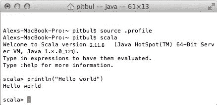**图 6：** macOS 上的 Scala shell

# 手动安装

在手动安装 Scala 之前，选择您喜欢的 Scala 版本，并从[`www.scala-lang.org/download/`](http://www.scala-lang.org/download/)下载相应版本的`.tgz`文件`Scala-verion.tgz`。下载您喜欢的 Scala 版本后，按以下步骤提取：

```scala
$ tar xvf scala-2.11.8.tgz

```

然后，将其移动到`/usr/local/share`，如下所示：

```scala
$ sudo mv scala-2.11.8 /usr/local/share

```

现在，要使安装永久生效，请执行以下命令：

```scala
$ echo "export SCALA_HOME=/usr/local/share/scala-2.11.8" >> ~/.bash_profile
$ echo "export PATH=$PATH: $SCALA_HOME/bin" >> ~/.bash_profile 

```

就是这样。现在，让我们看看在下一小节中如何在 Ubuntu 等 Linux 发行版上完成这个过程。

# Linux

在本小节中，我们将向您展示如何在 Linux 的 Ubuntu 发行版上安装 Scala。在开始之前，让我们检查一下确保 Scala 已经正确安装。使用以下命令检查这一点非常简单：

```scala
$ scala -version

```

如果 Scala 已经安装在您的系统上，您应该在终端上收到以下消息：

```scala
Scala code runner version 2.11.8 -- Copyright 2002-2016, LAMP/EPFL

```

请注意，在编写本安装过程时，我们使用了 Scala 的最新版本，即 2.11.8。如果您的系统上没有安装 Scala，请确保在进行下一步之前安装它。您可以从 Scala 网站[`www.scala-lang.org/download/`](http://www.scala-lang.org/download/)下载最新版本的 Scala（更清晰的视图，请参考*图 2*）。为了方便起见，让我们下载 Scala 2.11.8，如下所示：

```scala
$ cd Downloads/
$ wget https://downloads.lightbend.com/scala/2.11.8/scala-2.11.8.tgz

```

下载完成后，您应该在下载文件夹中找到 Scala 的 tar 文件。

用户应该首先使用以下命令进入`Download`目录：`$ cd /Downloads/`。请注意，下载文件夹的名称可能会根据系统选择的语言而变化。

要从其位置提取 Scala 的`tar`文件或更多，请输入以下命令。使用这个命令，Scala 的 tar 文件可以从终端中提取：

```scala
$ tar -xvzf scala-2.11.8.tgz

```

现在，通过以下命令或手动将 Scala 分发到用户的视角（例如，`/usr/local/scala/share`）：

```scala
 $ sudo mv scala-2.11.8 /usr/local/share/

```

进入您的主目录问题使用以下命令：

```scala
$ cd ~

```

然后，使用以下命令设置 Scala 主目录：

```scala
$ echo "export SCALA_HOME=/usr/local/share/scala-2.11.8" >> ~/.bashrc 
$ echo "export PATH=$PATH:$SCALA_HOME/bin" >> ~/.bashrc

```

然后，使用以下命令使更改在会话中永久生效：

```scala
$ source ~/.bashrc

```

安装完成后，最好使用以下命令进行验证：

```scala
$ scala -version

```

如果 Scala 已经成功配置在您的系统上，您应该在终端上收到以下消息：

```scala
Scala code runner version 2.11.8 -- Copyright 2002-2016, LAMP/EPFL

```

干得好！现在，让我们通过在终端上输入`;scala`命令来进入 Scala shell，如下图所示：

**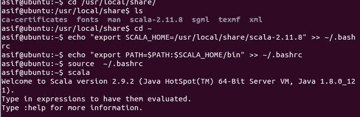****图 7：** Linux 上的 Scala shell（Ubuntu 发行版）

最后，您也可以使用 apt-get 命令安装 Scala，如下所示：

```scala
$ sudo apt-get install scala

```

这个命令将下载 Scala 的最新版本（即 2.12.x）。然而，Spark 目前还不支持 Scala 2.12（至少在我们写这一章节时是这样）。因此，我们建议使用前面描述的手动安装。

# Scala：可伸缩语言

Scala 的名称来自于可伸缩语言，因为 Scala 的概念很好地适用于大型程序。其他语言中的一些程序可能需要编写数十行代码，但在 Scala 中，您将获得以简洁而有效的方式表达编程的一般模式和概念的能力。在本节中，我们将描述 Odersky 为我们创建的 Scala 的一些令人兴奋的特性：

# Scala 是面向对象的

Scala 是面向对象语言的一个很好的例子。要为您的对象定义类型或行为，您需要使用类和特征的概念，这将在下一章节中进行解释。Scala 不支持直接的多重继承，但要实现这种结构，您需要使用 Scala 的**子类化**和**基于混合的组合**。这将在后面的章节中讨论。

# Scala 是功能性的

函数式编程将函数视为一等公民。在 Scala 中，通过语法糖和扩展特性（如*Function2*）来实现这一点，但这就是 Scala 中实现函数式编程的方式。此外，Scala 定义了一种简单易行的方法来定义**匿名** **函数**（没有名称的函数）。它还支持高阶函数，并允许嵌套函数**。**这些概念的语法将在接下来的章节中详细解释。

此外，它还可以帮助您以不可变的方式编码，通过这种方式，您可以轻松地将其应用于同步和并发的并行处理。

# Scala 是静态类型的

与 Pascal、Rust 等其他静态类型语言不同，Scala 不要求您提供冗余的类型信息。在大多数情况下，您不必指定类型。最重要的是，您甚至不需要再次重复它们。

如果在编译时知道变量的类型，则编程语言被称为静态类型：这也意味着作为程序员，您必须指定每个变量的类型。例如，Scala、Java、C、OCaml、Haskell、C++等。另一方面，Perl、Ruby、Python 等是动态类型语言，其中类型与变量或字段无关，而与运行时值有关。

Scala 的静态类型特性确保编译器完成了所有类型的检查。Scala 这一极其强大的特性帮助您在执行之前找到/捕获大多数微不足道的错误和错误。

# Scala 在 JVM 上运行

就像 Java 一样，Scala 也被编译成字节码，这可以很容易地由 JVM 执行。这意味着 Scala 和 Java 的运行时平台是相同的，因为两者都生成字节码作为编译输出。因此，您可以轻松地从 Java 切换到 Scala，您也可以轻松地集成两者，甚至在 Android 应用程序中使用 Scala 添加功能风格。

请注意，虽然在 Scala 程序中使用 Java 代码非常容易，但相反的情况非常困难，主要是因为 Scala 的语法糖。

与`javac`命令一样，它将 Java 代码编译成字节码，Scala 也有`scalas`命令，它将 Scala 代码编译成字节码。

# Scala 可以执行 Java 代码

如前所述，Scala 也可以用于执行您的 Java 代码。不仅安装您的 Java 代码；它还使您能够在 Scala 环境中使用 Java SDK 中的所有可用类，甚至您自己预定义的类、项目和包。

# Scala 可以进行并发和同步处理

其他语言中的一些程序可能需要数十行代码，但在 Scala 中，您将获得以简洁有效的方式表达编程的一般模式和概念的能力。此外，它还可以帮助您以不可变的方式编码，通过这种方式，您可以轻松地将其应用于同步和并发的并行处理。

# Java 程序员的 Scala

Scala 具有一组与 Java 完全不同的特性。在本节中，我们将讨论其中一些特性。对于那些来自 Java 背景或至少熟悉基本 Java 语法和语义的人来说，本节将是有帮助的。

# 所有类型都是对象

如前所述，Scala 中的每个值看起来都像一个对象。这意味着一切看起来都像对象，但其中一些实际上并不是对象，您将在接下来的章节中看到这一解释（例如，在 Scala 中，字符串会被隐式转换为字符集合，但在 Java 中不会！）

# 类型推断

如果您不熟悉这个术语，那就是在编译时推断类型。等等，这不就是动态类型的意思吗？嗯，不是。请注意，我说的是类型的推断；这与动态类型语言所做的事情完全不同，另一件事是，它是在编译时而不是运行时完成的。许多语言都内置了这个功能，但实现方式各不相同。这可能在开始时会让人困惑，但通过代码示例将会更加清晰。让我们进入 Scala REPL 进行一些实验。

# 在 Java 中，您只能在代码文件的顶部导入包，就在包语句之后。在 Scala 中情况不同；您几乎可以在源文件的任何地方编写导入语句（例如，甚至可以在类或方法内部编写导入语句）。您只需要注意您的导入语句的作用域，因为它继承了类的成员或方法内部局部变量的作用域。在 Scala 中，`_`（下划线）用于通配符导入，类似于 Java 中您将使用的`*`（星号）：Scala REPL

Scala REPL 是一个强大的功能，使得在 Scala shell 上编写 Scala 代码更加简单和简洁。**REPL**代表**读取-评估-打印-循环**，也称为**交互式解释器**。这意味着它是一个用于：

1.  ;读取您输入的表达式。

1.  使用 Scala 编译器评估第 1 步中的表达式。

1.  打印出第 2 步评估的结果。

1.  等待（循环）您输入更多表达式。

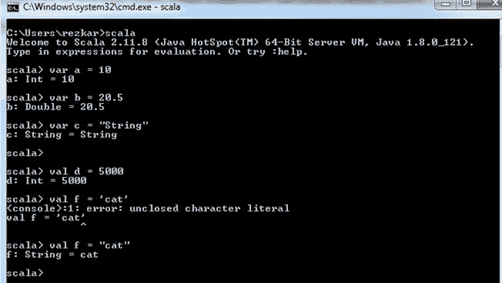**图 8：** Scala REPL 示例 1

从图中可以看出，这并没有什么神奇之处，变量在编译时会自动推断出最适合的类型。如果您仔细观察，当我尝试声明时：

```scala
 i:Int = "hello"

```

然后，Scala shell 会抛出一个错误，显示如下：

```scala
<console>:11: error: type mismatch;
  found   : String("hello")
  required: Int
        val i:Int = "hello"
                    ^

```

根据 Odersky 的说法，“将字符映射到 RichString 上的字符映射应该再次产生一个 RichString，如下与 Scala REP 的交互”。可以使用以下代码来证明前述声明：

```scala
scala> "abc" map (x => (x + 1).toChar) 
res0: String = bcd

```

然而，如果有人将`Char`的方法应用于`Int`到`String`，那会发生什么？在这种情况下，Scala 会将它们转换为整数向量，也称为 Scala 集合的不可变特性，如*图 9*所示。我们将在第四章中详细介绍 Scala 集合 API。

```scala
"abc" map (x => (x + 1)) 
res1: scala.collection.immutable.IndexedSeq[Int] = Vector(98, 99, 100)

```

对象的静态方法和实例方法也都可用。例如，如果您将`x`声明为字符串`hello`，然后尝试访问对象`x`的静态和实例方法，它们是可用的。在 Scala shell 中，键入`x`，然后键入`.`和`<tab>`，然后您将找到可用的方法：

```scala
scala> val x = "hello"
x: java.lang.String = hello
scala> x.re<tab>
reduce             reduceRight         replaceAll            reverse
reduceLeft         reduceRightOption   replaceAllLiterally   reverseIterator
reduceLeftOption   regionMatches       replaceFirst          reverseMap
reduceOption       replace             repr
scala> 

```

由于这一切都是通过反射动态完成的，即使您刚刚定义了匿名类，它们也同样可以访问：

```scala
scala> val x = new AnyRef{def helloWord = "Hello, world!"}
x: AnyRef{def helloWord: String} = $anon$1@58065f0c
 scala> x.helloWord
 def helloWord: String
 scala> x.helloWord
 warning: there was one feature warning; re-run with -feature for details
 res0: String = Hello, world!

```

前两个示例可以在 Scala shell 上显示如下：

嵌套函数

“原来 map 根据传递的函数参数的结果类型产生不同的类型！”

- Odersky

# ;

为什么您需要在编程语言中支持嵌套函数？大多数情况下，我们希望保持我们的方法只有几行，并避免过大的函数。在 Java 中，这个问题的典型解决方案是在类级别上定义所有这些小函数，但是任何其他方法都可以轻松地引用和访问它们，即使它们是辅助方法。在 Scala 中情况不同，您可以在彼此内部定义函数，从而防止任何外部访问这些函数：

```scala
def sum(vector: List[Int]): Int = {
  // Nested helper method (won't be accessed from outside this function
  def helper(acc: Int, remaining: List[Int]): Int = remaining match {
    case Nil => acc
    case _   => helper(acc + remaining.head, remaining.tail)
  }
  // Call the nested method
  helper(0, vector)
}

```

我们不希望您理解这些代码片段，它们展示了 Scala 和 Java 之间的区别。

# 导入语句

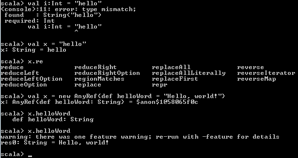**图 9：** Scala REPL 示例 2

```scala
// Import everything from the package math 
import math._

```

您还可以使用这些`{ }`来指示从同一父包中导入一组导入，只需一行代码。在 Java 中，您需要使用多行代码来实现这一点：

```scala
// Import math.sin and math.cos
import math.{sin, cos}

```

与 Java 不同，Scala 没有静态导入的概念。换句话说，静态的概念在 Scala 中不存在。然而，作为开发人员，显然，您可以使用常规导入语句导入一个对象的一个成员或多个成员。前面的例子已经展示了这一点，我们从名为 math 的包对象中导入了 sin 和 cos 方法。为了演示一个例子，前面的；代码片段可以从 Java 程序员的角度定义如下：

```scala
import static java.lang.Math.sin;
import static java.lang.Math.cos;

```

Scala 的另一个美妙之处在于，在 Scala 中，您还可以重命名导入的包。或者，您可以重命名导入的包以避免与具有相似成员的包发生类型冲突。以下语句在 Scala 中是有效的：

```scala
// Import Scala.collection.mutable.Map as MutableMap 
import Scala.collection.mutable.{Map => MutableMap}

```

最后，您可能希望排除包的成员以避免冲突或其他目的。为此，您可以使用通配符来实现：

```scala
// Import everything from math, but hide cos 
import math.{cos => _, _}

```

# 运算符作为方法

值得一提的是，Scala 不支持运算符重载。您可能会认为 Scala 根本没有运算符。

调用只有一个参数的方法的另一种语法是使用中缀语法。中缀语法为您提供了一种味道，就像您在 C++中进行运算符重载一样。例如：

```scala
val x = 45
val y = 75

```

在下面的情况中，`+`；表示类`Int`中的一个方法。以下；代码是一种非常规的方法调用语法：

```scala
val add1 = x.+(y)

```

更正式地，可以使用中缀语法来完成相同的操作，如下所示：

```scala
val add2 = x + y

```

此外，您可以利用中缀语法。但是，该方法只有一个参数，如下所示：

```scala
val my_result = List(3, 6, 15, 34, 76) contains 5

```

在使用中缀语法时有一个特殊情况。也就是说，如果方法名以`:`（冒号）结尾，那么调用将是右结合的。这意味着该方法在右参数上调用，左侧的表达式作为参数，而不是相反。例如，在 Scala 中以下是有效的：

```scala
val my_list = List(3, 6, 15, 34, 76)

```

前面的；语句表示：`my_list.+:(5)`而不是`5.+:(my_list)`，更正式地说：；

```scala
val my_result = 5 +: my_list

```

现在，让我们在 Scala REPL 上看一下前面的例子：

```scala
scala> val my_list = 5 +: List(3, 6, 15, 34, 76)
 my_list: List[Int] = List(5, 3, 6, 15, 34, 76)
scala> val my_result2 = 5+:my_list
 my_result2: List[Int] = List(5, 5, 3, 6, 15, 34, 76)
scala> println(my_result2)
 List(5, 5, 3, 6, 15, 34, 76)
scala>

```

除了上述之外，这里的运算符只是方法，因此它们可以像方法一样简单地被重写。

# 方法和参数列表

在 Scala 中，一个方法可以有多个参数列表，甚至根本没有参数列表。另一方面，在 Java 中，一个方法总是有一个参数列表，带有零个或多个参数。例如，在 Scala 中，以下是有效的方法定义（以`currie notation`编写），其中一个方法有两个参数列表：

```scala
def sum(x: Int)(y: Int) = x + y     

```

前面的；方法不能被写成：

```scala
def sum(x: Int, y: Int) = x + y

```

一个方法，比如；`sum2`，可以根本没有参数列表，如下所示：

```scala
def sum2 = sum(2) _

```

现在，您可以调用方法`add2`，它返回一个带有一个参数的函数。然后，它使用参数`5`调用该函数，如下所示：

```scala
val result = add2(5)

```

# 方法内部的方法

有时，您可能希望通过避免过长和复杂的方法使您的应用程序、代码模块化。Scala 为您提供了这种便利，以避免您的方法变得过大，以便将它们拆分成几个较小的方法。

另一方面，Java 只允许您在类级别定义方法。例如，假设您有以下方法定义：

```scala
def main_method(xs: List[Int]): Int = {
  // This is the nested helper/auxiliary method
  def auxiliary_method(accu: Int, rest: List[Int]): Int = rest match {
    case Nil => accu
    case _   => auxiliary_method(accu + rest.head, rest.tail)
  }
}

```

现在，您可以按以下方式调用嵌套的辅助/辅助方法：

```scala
auxiliary_method(0, xs)

```

考虑到上述内容，以下是有效的完整代码段：

```scala
def main_method(xs: List[Int]): Int = {
  // This is the nested helper/auxiliary method
  def auxiliary_method(accu: Int, rest: List[Int]): Int = rest match {
    case Nil => accu
    case _   => auxiliary_method(accu + rest.head, rest.tail)
  }
   auxiliary_method(0, xs)
}

```

# Scala 中的构造函数

关于 Scala 的一个令人惊讶的事情是，Scala 类的主体本身就是一个构造函数。然而，Scala 确实这样做；事实上，以一种更明确的方式。之后，该类的一个新实例被创建并执行。此外，您可以在类声明行中指定构造函数的参数。

因此，构造函数参数可以从该类中定义的所有方法中访问。例如，以下类和构造函数定义在 Scala 中是有效的：

```scala
class Hello(name: String) {
  // Statement executed as part of the constructor
  println("New instance with name: " + name)
  // Method which accesses the constructor argument
  def sayHello = println("Hello, " + name + "!")
}

```

等效的 Java 类如下所示：

```scala
public class Hello {
  private final String name;
  public Hello(String name) {
    System.out.println("New instance with name: " + name);
    this.name = name;
  }
  public void sayHello() {
    System.out.println("Hello, " + name + "!");
  }
}

```

# 对象而不是静态方法

如前所述，Scala 中不存在静态。你不能进行静态导入，也不能向类添加静态方法。在 Scala 中，当你在同一源文件中以相同的名称定义一个对象和类时，那么该对象被称为该类的伴生对象。在类的伴生对象中定义的函数就像 Java 类中的静态方法：

```scala
class HelloCity(CityName: String) {
  def sayHelloToCity = println("Hello, " + CityName + "!") 
}

```

这是你可以为类 hello 定义一个伴生对象的方法：

```scala
object HelloCity { 
  // Factory method 
  def apply(CityName: String) = new Hello(CityName) 
}

```

等效的 Java 类如下所示：

```scala
public class HelloCity { 
  private final String CityName; 
  public HelloCity(String CityName) { 
    this.CityName = CityName; 
  }
  public void sayHello() {
    System.out.println("Hello, " + CityName + "!"); 
  }
  public static HelloCity apply(String CityName) { 
    return new Hello(CityName); 
  } 
}

```

所以，这个简单的类中有很多冗长的内容，不是吗？Scala 中的 apply 方法被以一种不同的方式处理，因此你可以找到一种特殊的快捷语法来调用它。这是调用方法的熟悉方式：

```scala
val hello1 = Hello.apply("Dublin")

```

以下是等效于之前的快捷语法：

```scala
 val hello2 = Hello("Dublin")

```

请注意，这仅在你的代码中使用了 apply 方法时才有效，因为 Scala 以不同的方式处理被命名为 apply 的方法。

# 特征

Scala 为你提供了一个很好的功能，以扩展和丰富你的类的行为。这些特征类似于接口，你可以在其中定义函数原型或签名。因此，你可以从不同的特征中获得功能的混合，并丰富你的类的行为。那么，Scala 中的特征有什么好处呢？它们使得从这些特征组合类成为可能，特征是构建块。和往常一样，让我们通过一个例子来看看。这是在 Java 中设置传统日志记录例程的方法：

请注意，尽管你可以混入任意数量的特征，但是和 Java 一样，Scala 不支持多重继承。然而，在 Java 和 Scala 中，子类只能扩展一个父类。例如，在 Java 中：

```scala
class SomeClass {
  //First, to have to log for a class, you must initialize it
  final static Logger log = LoggerFactory.getLogger(this.getClass());
  ...
  //For logging to be efficient, you must always check, if logging level for current message is enabled                
  //BAD, you will waste execution time if the log level is an error, fatal, etc.
  log.debug("Some debug message");
  ...
  //GOOD, it saves execution time for something more useful
  if (log.isDebugEnabled()) { log.debug("Some debug message"); }
  //BUT looks clunky, and it's tiresome to write this construct every time you want to log something.
}

```

有关更详细的讨论，请参阅此 URL [`stackoverflow.com/questions/963492/in-log4j-does-checking-isdebugenabled-before-logging-improve-performance/963681#963681`](https://stackoverflow.com/questions/963492/in-log4j-does-checking-isdebugenabled-before-logging-improve-performance/963681#963681)。

然而，特征是不同的。总是检查日志级别是否启用非常繁琐。如果你能够编写这个例程并在任何类中立即重用它，那就太好了。Scala 中的特征使这一切成为可能。例如：

```scala
trait Logging {
  lazy val log = LoggerFactory.getLogger(this.getClass.getName)     
  //Let's start with info level...
  ...
  //Debug level here...
  def debug() {
    if (log.isDebugEnabled) log.info(s"${msg}")
  }
  def debug(msg: => Any, throwable: => Throwable) {
    if (log.isDebugEnabled) log.info(s"${msg}", throwable)
  }
  ...
  //Repeat it for all log levels you want to use
}

```

如果你看前面的代码，你会看到一个以`s`开头的字符串的使用示例。这种方式，Scala 提供了从数据创建字符串的机制，称为**字符串插值**。

字符串插值允许你直接在处理的字符串文字中嵌入变量引用。例如：

`scala> val name = "John Breslin"`

`scala> println(s"Hello, $name") ; // Hello, John Breslin`。

现在，我们可以以更传统的方式获得一个高效的日志记录例程作为可重用的代码块。要为任何类启用日志记录，我们只需混入我们的`Logging`特征！太棒了！现在，这就是为你的类添加日志记录功能所需的全部内容：

```scala
class SomeClass extends Logging {
  ...
  //With logging trait, no need for declaring a logger manually for every class
  //And now, your logging routine is either efficient and doesn't litter the code!

  log.debug("Some debug message")
  ...
}

```

甚至可以混合多个特征。例如，对于前面的特征（即`Logging`），你可以按以下顺序不断扩展：

```scala
trait Logging  {
  override def toString = "Logging "
}
class A extends Logging  {
  override def toString = "A->" + super.toString
}
trait B extends Logging  {
  override def toString = "B->" + super.toString
}
trait C extends Logging  {
  override def toString = "C->" + super.toString
}
class D extends A with B with C {
  override def toString = "D->" + super.toString
}

```

然而，需要注意的是，Scala 类可以一次扩展多个特征，但 JVM 类只能扩展一个父类。

现在，要调用上述特征和类，可以在 Scala REPL 中使用`new D()`，如下图所示：

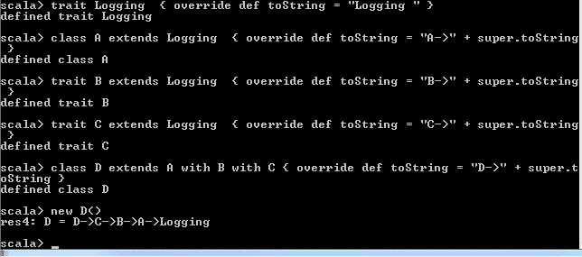**图 10**：混合多个特征

到目前为止，本章一切顺利。现在，让我们转到一个新的部分，讨论一些初学者想要进入 Scala 编程领域的主题。

# Scala 初学者

在这一部分，你会发现我们假设你对任何之前的编程语言有基本的了解。如果 Scala 是你进入编程世界的第一步，那么你会发现有很多在线材料甚至课程可以为初学者解释 Scala。正如前面提到的，有很多教程、视频和课程。

在 Coursera 上有一个包含这门课程的整个专业课程：[`www.coursera.org/specializations/scala`](https://www.coursera.org/specializations/scala)。由 Scala 的创始人 Martin Odersky 教授，这个在线课程以一种相当学术的方式教授函数式编程的基础知识。通过解决编程作业，你将学到很多关于 Scala 的知识。此外，这个专业课程还包括一个关于 Apache Spark 的课程。此外，Kojo ([`www.kogics.net/sf:kojo`](http://www.kogics.net/sf:kojo))是一个使用 Scala 编程来探索和玩耍数学、艺术、音乐、动画和游戏的交互式学习环境。

# 你的第一行代码

作为第一个例子，我们将使用非常常见的`Hello, world!`程序来向你展示如何在不太了解它的情况下使用 Scala 及其工具。让我们打开你喜欢的编辑器（这个例子在 Windows 7 上运行，但在 Ubuntu 或 macOS 上也可以类似地运行），比如 Notepad++，并输入以下代码：

```scala
object HelloWorld {
  def main(args: Array[String]){ 
    println("Hello, world!")  
  } 
}

```

现在，保存代码为一个名字，比如`HelloWorld.scala`，如下图所示：

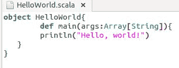**图 11：**使用 Notepad++保存你的第一个 Scala 源代码

让我们按照以下方式编译源文件：

```scala
C:\>scalac HelloWorld.scala
 C:\>scala HelloWorld
 Hello, world!
 C:\>

```

# 我是 hello world 程序，好好解释给我听！

这个程序对于有一些编程经验的人来说应该很熟悉。它有一个主方法，打印字符串`Hello, world!`到你的控制台。接下来，为了看到我们如何定义`main`函数，我们使用了`def main()`奇怪的语法来定义它。`def`是 Scala 的关键字，用来声明/定义一个方法，我们将在下一章中更多地涵盖关于方法和不同的写法。所以，我们有一个`Array[String]`作为这个方法的参数，这是一个可以用于程序的初始配置的字符串数组，也可以省略。然后，我们使用常见的`println()`方法，它接受一个字符串（或格式化的字符串）并将其打印到控制台。一个简单的 hello world 打开了许多要学习的话题；特别是三个：

● ; ; ;方法（在后面的章节中涵盖）

● ; ; ;对象和类（在后面的章节中涵盖）

● ; ; ;类型推断 - Scala 是一种静态类型语言的原因 - 之前解释过

# 交互式运行 Scala！

`scala`命令为你启动了交互式 shell，你可以在其中交互地解释 Scala 表达式：

```scala
> scala
Welcome to Scala 2.11.8 (Java HotSpot(TM) 64-Bit Server VM, Java 1.8.0_121).
Type in expressions for evaluation. Or try :help.
scala>
scala> object HelloWorld {
 |   def main(args: Array[String]){
 |     println("Hello, world!")
 |   }
 | }
defined object HelloWorld
scala> HelloWorld.main(Array())
Hello, world!
scala>

```

快捷键`:q`代表内部 shell 命令`:quit`，用于退出解释器。

# 编译它！

`scalac`命令，类似于`javac`命令，编译一个或多个 Scala 源文件，并生成一个字节码作为输出，然后可以在任何 Java 虚拟机上执行。要编译你的 hello world 对象，使用以下命令：

```scala
> scalac HelloWorld.scala

```

默认情况下，`scalac`将类文件生成到当前工作目录。你可以使用`-d`选项指定不同的输出目录：

```scala
> scalac -d classes HelloWorld.scala

```

但是，请注意，在执行这个命令之前必须创建一个名为`classes`的目录。

# 用 Scala 命令执行它

`scala`命令执行由解释器生成的字节码：

```scala
$ scala HelloWorld

```

Scala 允许我们指定命令选项，比如`-classpath`（别名`-cp`）选项：

```scala
$ scala -cp classes HelloWorld

```

在使用`scala`命令执行源文件之前，你应该有一个作为应用程序入口点的主方法。否则，你应该有一个扩展`Trait Scala.App`的`Object`，然后这个对象内的所有代码将被命令执行。以下是相同的`Hello, world!`例子，但使用了`App`特性：

```scala
#!/usr/bin/env Scala 
object HelloWorld extends App {  
  println("Hello, world!") 
}
HelloWorld.main(args)

```

上面的脚本可以直接从命令行运行：

```scala
./script.sh

```

注：我们假设文件`script.sh`具有执行权限：；

```scala
$ sudo chmod +x script.sh

```

然后，在`$PATH`环境变量中指定了`scala`命令的搜索路径。

# 总结

在本章中，您已经学习了 Scala 编程语言的基础知识、特性和可用的编辑器。我们还简要讨论了 Scala 及其语法。我们演示了安装和设置指南，供那些新手学习 Scala 编程的人参考。在本章后面，您将学习如何编写、编译和执行 Scala 代码示例。此外，我们还为那些来自 Java 背景的人提供了 Scala 和 Java 的比较讨论。下面是 Scala 和 Python 的简要比较：

Scala 是静态类型的，而 Python 是动态类型的。Scala（大多数情况下）采用函数式编程范式，而 Python 不是。Python 具有独特的语法，缺少大部分括号，而 Scala（几乎）总是需要它们。在 Scala 中，几乎所有东西都是表达式；而在 Python 中并非如此。然而，有一些看似复杂的优点。类型复杂性大多是可选的。其次，根据[`stackoverflow.com/questions/1065720/what-is-the-purpose-of-scala-programming-language/5828684#5828684`](https://stackoverflow.com/questions/1065720/what-is-the-purpose-of-scala-programming-language/5828684#5828684)提供的文档；*Scala 编译器就像自由测试和文档一样，随着圈复杂度和代码行数的增加。当 Scala 得到恰当实现时，可以在一致和连贯的 API 背后执行几乎不可能的操作。*

在下一章中，我们将讨论如何改进我们对基础知识的理解，了解 Scala 如何实现面向对象的范式，以便构建模块化软件系统。
