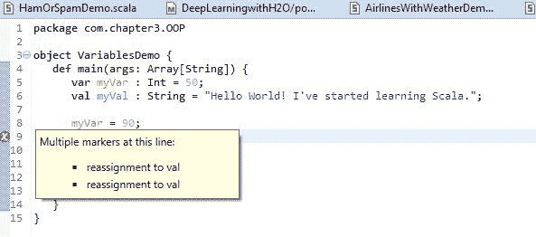
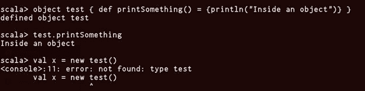
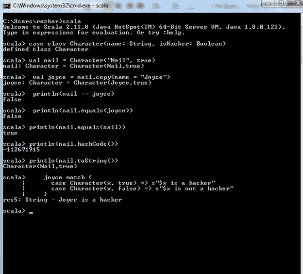
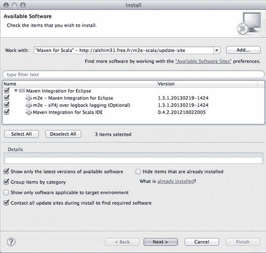
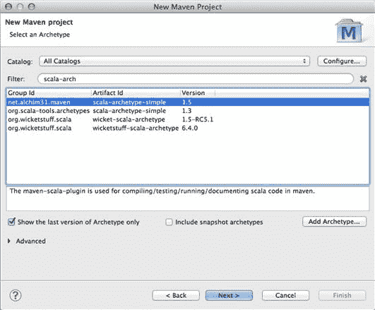
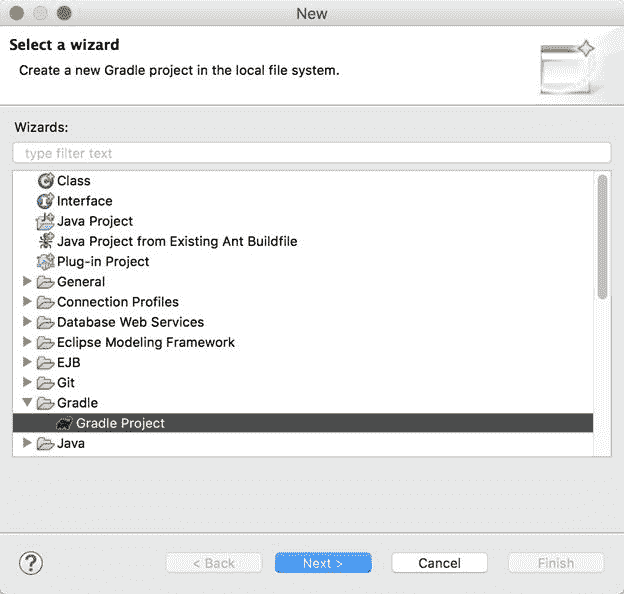
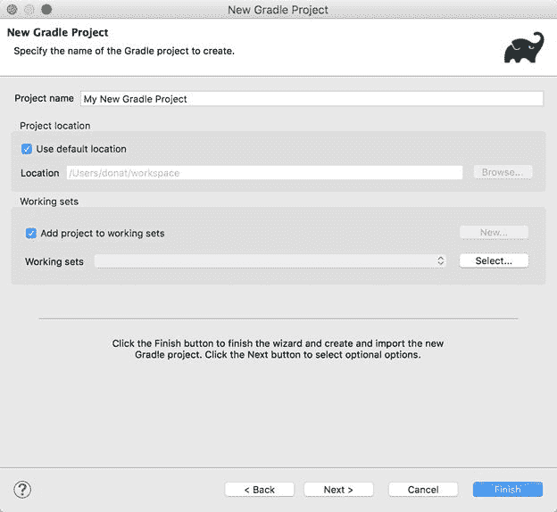
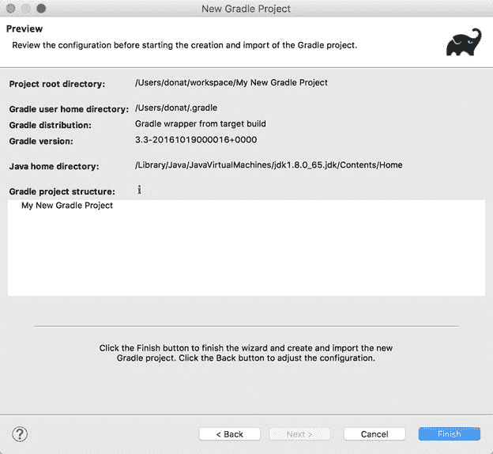
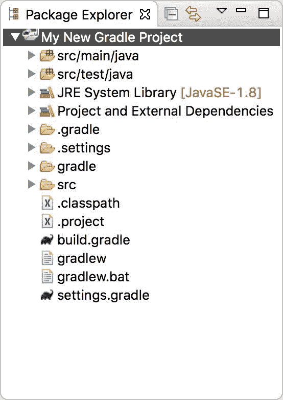

# 第二章：面向对象的 Scala

*"面向对象的模型使通过增加程序变得容易。实际上，这经常意味着它提供了一种结构化的方式来编写意大利面代码。"*

- Paul Graham

在上一章中，我们看了如何开始使用 Scala 进行编程。如果您正在编写我们在上一章中遵循的过程式程序，可以通过创建过程或函数来强制实现代码的可重用性。但是，如果您继续工作，因此，您的程序会变得更长、更大和更复杂。在某一点上，您甚至可能没有其他更简单的方法来在生产之前组织整个代码。

相反，**面向对象编程**（**OOP**）范式提供了一个全新的抽象层。您可以通过定义具有相关属性和方法的 OOP 实体（如类）来模块化代码。您甚至可以通过使用继承或接口定义这些实体之间的关系。您还可以将具有类似功能的类分组在一起，例如辅助类；因此，使您的项目突然感觉更宽敞和可扩展。简而言之，面向对象编程语言的最大优势在于可发现性、模块化和可扩展性。

考虑到前面介绍的面向对象编程语言的特性，在本章中，我们将讨论 Scala 中的基本面向对象特性。简而言之，本章将涵盖以下主题：

+   Scala 中的变量

+   Scala 中的方法、类和对象

+   包和包对象

+   特征和特征线性化

+   Java 互操作性

然后，我们将讨论模式匹配，这是来自函数式编程概念的一个特性。此外，我们将讨论 Scala 中的一些内置概念，如隐式和泛型。最后，我们将讨论一些广泛使用的构建工具，这些工具对于将我们的 Scala 应用程序构建成 jar 文件是必需的。

# Scala 中的变量

在深入了解面向对象编程特性之前，首先需要了解 Scala 中不同类型的变量和数据类型的详细信息。要在 Scala 中声明变量，您需要使用`var`或`val`关键字。在 Scala 中声明变量的正式语法如下：

```scala
val or var VariableName : DataType = Initial_Value

```

例如，让我们看看如何声明两个数据类型明确指定的变量：

```scala
var myVar : Int = 50
val myVal : String = "Hello World! I've started learning Scala."

```

您甚至可以只声明一个变量而不指定`DataType`。例如，让我们看看如何使用`val`或`var`声明变量，如下所示：

```scala
var myVar = 50
val myVal = "Hello World! I've started learning Scala."

```

Scala 中有两种类型的变量：可变和不可变，可以定义如下：

+   **可变：**其值可以在以后更改的变量

+   **不可变：**一旦设置，其值就无法更改的变量

通常，用`var`关键字声明可变变量。另一方面，为了指定不可变变量，使用`val`关键字。为了展示使用可变和不可变变量的示例，让我们考虑以下代码段：

```scala
package com.chapter3.OOP 
object VariablesDemo {
  def main(args: Array[String]) {
    var myVar : Int = 50 
    valmyVal : String = "Hello World! I've started learning Scala."  
    myVar = 90  
    myVal = "Hello world!"   
    println(myVar) 
    println(myVal) 
  } 
}

```

前面的代码在`myVar = 90`之前都可以正常工作，因为**`myVar`**是一个可变变量。但是，如果您尝试更改不可变变量（即`myVal`）的值，如前所示，您的 IDE 将显示编译错误，指出重新分配给`val`，如下所示：

**图 1：**在 Scala 变量范围内不允许重新分配不可变变量

不要担心看前面的带有对象和方法的代码！我们将在本章后面讨论类、方法和对象，然后事情会变得更清晰。

在 Scala 变量中，我们可以有三种不同的范围，取决于您声明它们的位置：

+   **字段：**这些是属于您 Scala 代码实例的变量。因此，这些字段可以从对象中的每个方法中访问。但是，根据访问修饰符的不同，字段可以被其他类的实例访问。

如前所述，对象字段可以是可变的，也可以是不可变的（根据使用`var`或`val`声明类型）。但是，它们不能同时是两者。

+   **方法参数：**这些是变量，当调用方法时，可以用它们来传递方法内部的值。方法参数只能从方法内部访问。但是，传递的对象可能可以从外部访问。

需要注意的是，方法参数/参数始终是不可变的，无论指定了什么关键字。

+   **局部变量：**这些变量在方法内部声明，并且可以从方法内部访问。但是，调用代码可以访问返回的值。

# 引用与值的不可变性

根据前面的部分，`val`用于声明不可变变量，那么我们可以更改这些变量的值吗？这是否类似于 Java 中的 final 关键字？为了帮助我们更多地了解这一点，我们将使用以下代码片段：

```scala
scala> var testVar = 10
testVar: Int = 10

scala> testVar = testVar + 10
testVar: Int = 20

scala> val testVal = 6
testVal: Int = 6

scala> testVal = testVal + 10
<console>:12: error: reassignment to val
 testVal = testVal + 10
 ^
scala>

```

如果运行上述代码，将会在编译时注意到一个错误，它会告诉您正在尝试重新分配给`val`变量。一般来说，可变变量带来了性能优势。原因是这更接近计算机的行为，因为引入不可变值会迫使计算机在需要对特定实例进行任何更改（无论多么小）时创建一个全新的对象实例

# Scala 中的数据类型

如前所述，Scala 是一种 JVM 语言，因此它与 Java 有很多共同之处。其中一个共同点就是数据类型；Scala 与 Java 共享相同的数据类型。简而言之，Scala 具有与 Java 相同的所有数据类型，具有相同的内存占用和精度。如第一章中所述，*介绍 Scala*，在 Scala 中几乎到处都是对象。所有数据类型都是对象，您可以按如下方式在其中调用方法：

| **Sr.No** | **数据类型和描述** |
| --- | --- |
| 1 | **Byte**：8 位有符号值。范围从-128 到 127 |
| 2 | **Short**：16 位有符号值。范围为-32768 至 32767 |
| 3 | **Int**：32 位有符号值。范围为-2147483648 至 2147483647 |
| 4 | **Long**：64 位有符号值。-9223372036854775808 至 9223372036854775807 |
| 5 | **Float**：32 位 IEEE 754 单精度浮点数 |
| 6 | **Double**：64 位 IEEE 754 双精度浮点数 |
| 7 | **Char**：16 位无符号 Unicode 字符。范围从 U+0000 到 U+FFFF |
| 8 | **String**：一系列字符 |
| 9 | **Boolean**：要么是文字`true`，要么是文字`false` |
| 10 | **Unit**：对应于无值 |
| 11 | **Null**：空值或空引用 |
| 12 | **Nothing**：每种其他类型的子类型；不包括任何值 |
| 13 | **Any**：任何类型的超类型；任何对象都是*Any*类型 |
| 14 | **AnyRef**：任何引用类型的超类型 |

**表 1：**Scala 数据类型、描述和范围

在前面的表中列出的所有数据类型都是对象。但是，请注意，没有原始类型，就像在 Java 中一样。这意味着您可以在`Int`、`Long`等上调用方法。

```scala
val myVal = 20
//use println method to print it to the console; you will also notice that if will be inferred as Int
println(myVal + 10)
val myVal = 40
println(myVal * "test")

```

现在，您可以开始玩弄这些变量。让我们对如何初始化变量和处理类型注释有一些想法。

# 变量初始化

在 Scala 中，初始化变量一旦声明就是一个好习惯。但是，需要注意的是，未初始化的变量不一定是空值（考虑`Int`、`Long`、`Double`、`Char`等类型），而初始化的变量也不一定是非空值（例如`val s: String = null`）。实际原因是：

+   在 Scala 中，类型是从分配的值中推断出来的。这意味着必须为编译器分配一个值才能推断出类型（编译器应该如何考虑这段代码：`val a`？由于没有给出值，编译器无法推断出类型；由于它无法推断出类型，它将不知道如何初始化它）。

+   在 Scala 中，大多数时候，你会使用`val`。由于这些是不可变的，你将无法先声明它们，然后再初始化它们。

尽管 Scala 语言要求你在使用实例变量之前初始化它，但 Scala 不为你的变量提供默认值。相反，你必须手动设置它的值，使用通配符下划线，它就像一个默认值一样，如下所示：

```scala
var name:String = _

```

你可以定义自己的名称，而不是使用`val1`、`val2`等名称：

```scala
scala> val result = 6 * 5 + 8
result: Int = 38

```

你可以在后续的表达式中使用这些名称，如下所示：

```scala
scala> 0.5 * result
res0: Double = 19.0

```

# 类型标注

如果你使用`val`或`var`关键字来声明一个变量，它的数据类型将根据你为这个变量分配的值自动推断。你还可以在声明时明确指定变量的数据类型。

```scala
val myVal : Integer = 10

```

现在，让我们看一些在使用 Scala 中的变量和数据类型时需要的其他方面。我们将看到如何使用类型标注和`lazy`变量。

# 类型标注

类型标注用于告诉编译器你期望从表达式中得到的类型，从所有可能的有效类型中。因此，如果一个类型符合现有的约束，比如变异和类型声明，并且它是表达式所适用的类型之一，或者在范围内有一个适用的转换，那么这个类型就是有效的。因此，从技术上讲，`java.lang.String`扩展了`java.lang.Object`，因此任何`String`也是`Object`。例如：

```scala
scala> val s = "Ahmed Shadman" 
s: String = Ahmed Shadman

scala> val p = s:Object 
p: Object = Ahmed Shadman 

scala>

```

# 延迟值

`lazy val`的主要特点是绑定的表达式不会立即被评估，而是在第一次访问时。这就是`val`和`lazy val`之间的主要区别所在。当初始访问发生时，表达式被评估，并且结果被绑定到标识符，即`lazy val`。在后续访问中，不会发生进一步的评估，而是立即返回存储的结果。让我们看一个有趣的例子：

```scala
scala> lazy val num = 1 / 0
num: Int = <lazy>

```

如果你在 Scala REPL 中查看前面的代码，你会注意到代码运行得很好，即使你将一个整数除以 0 也不会抛出任何错误！让我们看一个更好的例子：

```scala
scala> val x = {println("x"); 20}
x
x: Int = 20

scala> x
res1: Int = 20
scala>

```

这样做后，以后可以在需要时访问变量`x`的值。这些只是使用延迟`val`概念的一些例子。感兴趣的读者应该访问此页面以获取更多详细信息：[`blog.codecentric.de/en/2016/02/lazy-vals-scala-look-hood/.`](https://blog.codecentric.de/en/2016/02/lazy-vals-scala-look-hood/)

# Scala 中的方法、类和对象

在前一节中，我们看到了如何使用 Scala 变量、不同的数据类型以及它们的可变性和不可变性，以及它们的使用范围。然而，在本节中，为了真正理解面向对象编程的概念，我们将处理方法、对象和类。Scala 的这三个特性将帮助我们理解 Scala 的面向对象的特性和其特点。

# Scala 中的方法

在这部分中，我们将讨论 Scala 中的方法。当你深入学习 Scala 时，你会发现有很多种方法来定义 Scala 中的方法。我们将以一些方式来演示它们：

```scala
def min(x1:Int, x2:Int) : Int = {
  if (x1 < x2) x1 else x2
}

```

前面的方法声明接受两个变量并返回它们中的最小值。在 Scala 中，所有方法都必须以 def 关键字开头，然后是这个方法的名称。可选地，你可以决定不向方法传递任何参数，甚至决定不返回任何东西。你可能想知道最小值是如何返回的，但我们稍后会讨论这个问题。此外，在 Scala 中，你可以定义不带大括号的方法：

```scala
def min(x1:Int, x2:Int):Int= if (x1 < x2) x1 else x2

```

如果你的方法体很小，你可以像这样声明你的方法。否则，最好使用大括号以避免混淆。如前所述，如果需要，你可以不传递任何参数给方法：

```scala
def getPiValue(): Double = 3.14159

```

带有或不带有括号的方法表示副作用的存在或不存在。此外，它与统一访问原则有着深刻的联系。因此，您也可以避免使用大括号，如下所示：

```scala
def getValueOfPi : Double = 3.14159

```

还有一些方法通过显式指定返回类型来返回值。例如：

```scala
def sayHello(person :String) = "Hello " + person + "!"

```

应该提到的是，前面的代码之所以能够工作，是因为 Scala 编译器能够推断返回类型，就像值和变量一样。

这将返回`Hello`与传递的人名连接在一起。例如：

```scala
scala> def sayHello(person :String) = "Hello " + person + "!"
sayHello: (person: String)String

scala> sayHello("Asif")
res2: String = Hello Asif!

scala>

```

# Scala 中的返回

在学习 Scala 方法如何返回值之前，让我们回顾一下 Scala 方法的结构：

```scala
def functionName ([list of parameters]) : [return type] = {
  function body
  value_to_return
}

```

对于前面的语法，返回类型可以是任何有效的 Scala 数据类型，参数列表将是用逗号分隔的变量列表，参数列表和返回类型是可选的。现在，让我们定义一个方法，它将两个正整数相加并返回结果，这也是一个整数值：

```scala
scala> def addInt( x:Int, y:Int ) : Int = {
 |       var sum:Int = 0
 |       sum = x + y
 |       sum
 |    }
addInt: (x: Int, y: Int)Int

scala> addInt(20, 34)
res3: Int = 54

scala>

```

如果您现在从`main()`方法中使用真实值调用前面的方法，比如`addInt(10, 30)`，该方法将返回一个整数值和，等于`40`。由于使用关键字`return`是可选的，Scala 编译器设计成在没有`return`关键字的情况下，最后的赋值将被返回。在这种情况下，将返回较大的值：

```scala
scala> def max(x1 : Int , x2: Int)  = {
 |     if (x1>x2) x1 else x2
 | }
max: (x1: Int, x2: Int)Int

scala> max(12, 27)
res4: Int = 27

scala>

```

干得好！我们已经看到了如何在 Scala REPL 中使用变量以及如何声明方法。现在，是时候看看如何将它们封装在 Scala 方法和类中了。下一节将讨论 Scala 对象。

# Scala 中的类

类被认为是一个蓝图，然后你实例化这个类以创建实际上将在内存中表示的东西。它们可以包含方法、值、变量、类型、对象、特征和类，这些统称为**成员**。让我们通过以下示例来演示：

```scala
class Animal {
  var animalName = null
  var animalAge = -1
  def setAnimalName (animalName:String)  {
    this.animalName = animalName
  }
  def setAnaimalAge (animalAge:Int) {
    this.animalAge = animalAge
  }
  def getAnimalName () : String = {
    animalName
  }
  def getAnimalAge () : Int = {
    animalAge
  }
}

```

我们有两个变量`animalName`和`animalAge`以及它们的设置器和获取器。现在，我们如何使用它们来解决我们的目的呢？这就是 Scala 对象的用法。现在，我们将讨论 Scala 对象，然后我们将追溯到我们的下一个讨论。

# Scala 中的对象

Scala 中的**object**的含义与传统的 OOP 有些不同，这种差异应该得到解释。特别是在 OOP 中，对象是类的一个实例，而在 Scala 中，任何声明为对象的东西都不能被实例化！`object`是 Scala 中的一个关键字。在 Scala 中声明对象的基本语法如下：

```scala
object <identifier> [extends <identifier>] [{ fields, methods, and classes }]

```

为了理解前面的语法，让我们重新看一下 hello world 程序：

```scala
object HelloWorld {
  def main(args : Array[String]){
    println("Hello world!")
  }
}

```

这个 hello world 示例与 Java 的示例非常相似。唯一的区别是 main 方法不在一个类中，而是在一个对象中。在 Scala 中，关键字 object 可以表示两种不同的东西：

+   就像在 OOP 中，一个对象可以表示一个类的实例

+   用于描述一种非常不同的实例对象，称为**Singleton**

# 单例和伴生对象

在这一小节中，我们将看到 Scala 和 Java 中的单例对象之间的比较分析。单例模式的理念是确保一个类的实例只能存在一个。以下是 Java 中单例模式的示例：

```scala
public class DBConnection {
  private static DBConnection dbInstance;
  private DBConnection() {
  }
  public static DBConnection getInstance() {
    if (dbInstance == null) {
      dbInstance = new DBConnection();
    }
    return dbInstance;
  }
}

```

Scala 对象也做了类似的事情，并且它由编译器很好地处理。由于只会有一个实例，因此在这里没有对象创建的方式：

**图 3：**Scala 中的对象创建

# 伴生对象

当一个`singleton object`与一个类同名时，它被称为`companion object`。伴生对象必须在与类相同的源文件中定义。让我们通过这个例子来演示：

```scala
class Animal {
  var animalName:String  = "notset"
  def setAnimalName(name: String) {
    animalName = name
  }
  def getAnimalName: String = {
    animalName
  }
  def isAnimalNameSet: Boolean = {
    if (getAnimalName == "notset") false else true
  }
}

```

以下是通过伴生对象调用方法的方式（最好与相同的名称 - 也就是`Animal`）：

```scala
object Animal{
  def main(args: Array[String]): Unit= {
    val obj: Animal = new Animal
    var flag:Boolean  = false        
    obj.setAnimalName("dog")
    flag = obj.isAnimalNameSet
    println(flag)  // prints true 

    obj.setAnimalName("notset")
    flag = obj.isAnimalNameSet
    println(flag)   // prints false     
  }
}

```

Java 的等价物将非常相似，如下所示：

```scala
public class Animal {
  public String animalName = "null";
  public void setAnimalName(String animalName) {
    this.animalName = animalName;
  }
  public String getAnimalName() {
    return animalName;
  }
  public boolean isAnimalNameSet() {
    if (getAnimalName() == "notset") {
      return false;
    } else {
      return true;
    }
  }

  public static void main(String[] args) {
    Animal obj = new Animal();
    boolean flag = false;         
    obj.setAnimalName("dog");
    flag = obj.isAnimalNameSet();
    System.out.println(flag);        

    obj.setAnimalName("notset");
    flag = obj.isAnimalNameSet();
    System.out.println(flag);
  }
}

```

干得好！到目前为止，我们已经看到了如何使用 Scala 对象和类。然而，使用方法来实现和解决数据分析问题的方法更加重要。因此，我们现在将简要介绍如何使用 Scala 方法。

```scala
object RunAnimalExample {
  val animalObj = new Animal
  println(animalObj.getAnimalName) //prints the initial name
  println(animalObj.getAnimalAge) //prints the initial age
  // Now try setting the values of animal name and age as follows:   
  animalObj.setAnimalName("dog") //setting animal name
  animalObj.setAnaimalAge(10) //seting animal age
  println(animalObj.getAnimalName) //prints the new name of the animal 
  println(animalObj.getAnimalAge) //Prints the new age of the animal
}

```

输出如下：

```scala
notset 
-1 
dog 
10

```

现在，让我们在下一节中简要概述 Scala 类的可访问性和可见性。

# 比较和对比：val 和 final

与 Java 一样，Scala 中也存在 final 关键字，它的工作方式与 val 关键字类似。为了区分 Scala 中的`val`和`final`关键字，让我们声明一个简单的动物类，如下所示：

```scala
class Animal {
  val age = 2  
}

```

如第一章中所述，*Scala 简介*，在列出 Scala 特性时，Scala 可以覆盖 Java 中不存在的变量：

```scala
class Cat extends Animal{
  override val age = 3
  def printAge ={
    println(age)
  }
}

```

现在，在深入讨论之前，关键字`extends`的快速讨论是必需的。有关详细信息，请参阅以下信息框。

使用 Scala，类可以是可扩展的。使用 extends 关键字的子类机制使得可以通过继承给定*超类*的所有成员并定义额外的类成员来*专门化*类。让我们看一个例子，如下所示：

`class Coordinate(xc: Int, yc: Int) {`

`val x: Int = xc`

`val y: Int = yc`

`def move(dx: Int, dy: Int): Coordinate = new Coordinate(x + dx, y + dy)`

`}`

`class ColorCoordinate(u: Int, v: Int, c: String) extends Coordinate(u, v) {`

`val color: String = c`

`def compareWith(pt: ColorCoordinate): Boolean = (pt.x == x) && (pt.y == y) && (pt.color == color)`

`override def move(dx: Int, dy: Int): ColorCoordinate = new ColorCoordinate(x + dy, y + dy, color)`

`}`

但是，如果我们在`Animal`类中将年龄变量声明为 final，那么`Cat`类将无法覆盖它，并且将会出现以下错误。对于这个`Animal`示例，您应该学会何时使用`final`关键字。让我们看一个例子：

```scala
scala> class Animal {
 |     final val age = 3
 | }
defined class Animal
scala> class Cat extends Animal {
 |     override val age = 5
 | }
<console>:13: error: overriding value age in class Animal of type Int(3);
 value age cannot override final member
 override val age = 5
 ^
scala>

```

干得好！为了实现最佳封装-也称为信息隐藏-您应该始终使用最少可见性声明方法。在下一小节中，我们将学习类、伴生对象、包、子类和项目的访问和可见性如何工作。

# 访问和可见性

在本小节中，我们将尝试理解 OOP 范式中 Scala 变量和不同数据类型的访问和可见性。让我们看看 Scala 中的访问修饰符。Scala 的类似之一：

| **修饰符** | **类** | **伴生对象** | **包** | **子类** | **项目** |
| --- | --- | --- | --- | --- | --- |
| 默认/无修饰符 | 是 | 是 | 是 | 是 | 是 |
| 受保护 | 是 | 是 | 是 | 否 | 否 |
| 私有 | 是 | 是 | 否 | 否 | 否 |

**公共成员**：与私有和受保护成员不同，对于公共成员，不需要为公共成员指定 public 关键字。公共成员没有显式的修饰符。这些成员可以从任何地方访问。例如：

```scala
class OuterClass { //Outer class
  class InnerClass {
    def printName() { println("My name is Asif Karim!") }

    class InnerMost { //Inner class
      printName() // OK
    }
  }
  (new InnerClass).printName() // OK because now printName() is public
}

```

**私有成员**：私有成员仅在包含成员定义的类或对象内部可见。让我们看一个例子，如下所示：

```scala
package MyPackage {
  class SuperClass {
    private def printName() { println("Hello world, my name is Asif Karim!") }
  }   
  class SubClass extends SuperClass {
    printName() //ERROR
  }   
  class SubsubClass {
    (new SuperClass).printName() // Error: printName is not accessible
  }
}

```

**受保护成员**：受保护成员只能从定义成员的类的子类中访问。让我们看一个例子，如下所示：

```scala
package MyPackage {
  class SuperClass {
    protected def printName() { println("Hello world, my name is Asif
                                         Karim!") }
  }   
  class SubClass extends SuperClass {
    printName()  //OK
  }   
  class SubsubClass {
    (new SuperClass).printName() // ERROR: printName is not accessible
  }
}

```

Scala 中的访问修饰符可以通过限定符进行增强。形式为`private[X]`或`protected[X]`的修饰符意味着访问是私有的或受保护的，直到`X`，其中`X`指定封闭的包、类或单例对象。让我们看一个例子：

```scala
package Country {
  package Professional {
    class Executive {
      private[Professional] var jobTitle = "Big Data Engineer"
      private[Country] var friend = "Saroar Zahan" 
      protected[this] var secret = "Age"

      def getInfo(another : Executive) {
        println(another.jobTitle)
        println(another.friend)
        println(another.secret) //ERROR
        println(this.secret) // OK
      }
    }
  }
}

```

在前面的代码段中有一个简短的说明：

+   变量`jboTitle`将对封闭包`Professional`中的任何类可访问

+   变量`friend`将对封闭包`Country`中的任何类可访问

+   变量`secret`只能在实例方法（this）中被隐式对象访问

如果您看一下前面的例子，我们使用了关键字`package`。然而，我们到目前为止还没有讨论这个问题。但不要担心；本章后面将有一个专门的部分。构造函数是任何面向对象编程语言的一个强大特性。Scala 也不例外。现在，让我们简要概述一下构造函数。

# 构造函数

在 Scala 中，构造函数的概念和用法与 C#或 Java 中的有些不同。Scala 中有两种类型的构造函数 - 主构造函数和辅助构造函数。主构造函数是类的主体，其参数列表紧跟在类名后面。

例如，以下代码段描述了在 Scala 中使用主构造函数的方法：

```scala
class Animal (animalName:String, animalAge:Int) {
  def getAnimalName () : String = {
    animalName
  }
  def getAnimalAge () : Int = {
    animalAge
  }
}

```

现在，要使用前面的构造函数，这个实现与之前的实现类似，只是没有设置器和获取器。相反，我们可以在这里获取动物的名称和年龄：

```scala
object RunAnimalExample extends App{
  val animalObj = new animal("Cat",-1)
  println(animalObj.getAnimalName)
  println(animalObj.getAnimalAge)
}

```

在类定义时给出参数以表示构造函数。如果我们声明了一个构造函数，那么就不能在不提供构造函数中指定的参数的默认值的情况下创建类。此外，Scala 允许在不提供必要参数给其构造函数的情况下实例化对象：当所有构造函数参数都有默认值定义时会发生这种情况。

尽管使用辅助构造函数有一些限制，但我们可以自由地添加任意数量的额外辅助构造函数。辅助构造函数必须在其主体的第一行调用在其之前声明的另一个辅助构造函数或主构造函数。为了遵守这个规则，每个辅助构造函数最终都会直接或间接地调用主构造函数。

例如，以下代码段演示了在 Scala 中使用辅助构造函数：

```scala
class Hello(primaryMessage: String, secondaryMessage: String) {
  def this(primaryMessage: String) = this(primaryMessage, "")
  // auxilary constructor
  def sayHello() = println(primaryMessage + secondaryMessage)
}
object Constructors {
  def main(args: Array[String]): Unit = {
    val hello = new Hello("Hello world!", " I'm in a trouble,
                          please help me out.")
    hello.sayHello()
  }
}

```

在之前的设置中，我们在主构造函数中包含了一个次要（即第二个）消息。主构造函数将实例化一个新的`Hello`对象。方法`sayHello()`将打印连接的消息。

**辅助构造函数**：在 Scala 中，为 Scala 类定义一个或多个辅助构造函数可以让类的消费者以不同的方式创建对象实例。在类中将辅助构造函数定义为 this 的方法。您可以定义多个辅助构造函数，但它们必须具有不同的签名（参数列表）。此外，每个构造函数必须调用先前定义的构造函数之一。

现在让我们来看一下 Scala 中另一个重要但相对较新的概念，称为**特征**。我们将在下一节中讨论这个问题。

# Scala 中的特征

Scala 中的一个新特性是特征，它与 Java 中接口的概念非常相似，只是它还可以包含具体方法。尽管 Java 8 已经支持这一点。另一方面，特征是 Scala 中的一个新概念。但这个特性已经存在于面向对象编程中。因此，它们看起来像抽象类，只是它们没有构造函数。

# 特征语法

您需要使用`trait`关键字来声明一个特征，后面应该跟着特征名称和主体：

```scala
trait Animal {
  val age : Int
  val gender : String
  val origin : String
 }

```

# 扩展特征

为了扩展特征或类，您需要使用`extend`关键字。特征不能被实例化，因为它可能包含未实现的方法。因此，必须实现特征中的抽象成员：

```scala
trait Cat extends Animal{ }

```

不允许值类扩展特征。为了允许值类扩展特征，引入了通用特征，它扩展了`Any`。例如，假设我们已经定义了以下特征：

```scala
trait EqualityChecking {
  def isEqual(x: Any): Boolean
  def isNotEqual(x: Any): Boolean = !isEqual(x)
}

```

现在，要使用通用特征在 Scala 中扩展前面的特征，我们遵循以下代码段：

```scala
trait EqualityPrinter extends Any {
  def print(): Unit = println(this)
}

```

那么，在 Scala 中抽象类和特征之间有什么区别呢？正如您所见，Scala 中的抽象类可以具有构造参数、类型参数和多个参数。但是，Scala 中的特征只能具有类型参数。

如果一个特征不包含任何实现代码，那么它才是完全可互操作的。此外，Scala 特征在 Scala 2.12 中与 Java 接口完全可互操作。因为 Java 8 也允许在其接口中进行方法实现。

可能还有其他情况适用于特征，例如，抽象类可以扩展特征，或者如果需要，任何普通类（包括 case 类）都可以扩展现有的特征。例如，抽象类也可以扩展特征：

```scala
abstract class Cat extends Animal { }

```

最后，普通的 Scala 类也可以扩展 Scala 特征。由于类是具体的（即可以创建实例），特征的抽象成员应该被实现。在下一节中，我们将讨论 Scala 代码的 Java 互操作性。现在让我们来了解 OOP 中的另一个重要概念，称为**抽象类**。我们将在下一节中讨论这个问题。

# 抽象类

在 Scala 中，抽象类可以具有构造参数以及类型参数。Scala 中的抽象类与 Java 完全可互操作。换句话说，可以在 Java 代码中调用它们，而无需任何中间包装器。

那么，在 Scala 中抽象类和特征之间有什么区别呢？正如您所见，Scala 中的抽象类可以具有构造参数、类型参数和多个参数。但是，Scala 中的特征只能具有类型参数。以下是抽象类的一个简单示例：

```scala
abstract class Animal(animalName:String = "notset") {
  //Method with definition/return type
  def getAnimalAge
  //Method with no definition with String return type
  def getAnimalGender : String
  //Explicit way of saying that no implementation is present
  def getAnimalOrigin () : String {} 
  //Method with its functionality implemented
  //Need not be implemented by subclasses, can be overridden if required
  def getAnimalName : String = {
    animalName
  }
}

```

为了通过另一个类扩展这个类，我们需要实现之前未实现的方法`getAnimalAge`，`getAnimalGender`和`getAnimalOrigin`。对于`getAnimalName`，我们可以覆盖它，也可以不覆盖，因为它的实现已经存在。

# 抽象类和 override 关键字

如果要覆盖父类的具体方法，则需要 override 修饰符。但是，如果要实现抽象方法，则不一定需要添加 override 修饰符。Scala 使用`override`关键字来覆盖父类的方法。例如，假设您有以下抽象类和一个`printContents()`方法来在控制台上打印您的消息：

```scala
abstract class MyWriter {
  var message: String = "null"
  def setMessage(message: String):Unit
  def printMessage():Unit
}

```

现在，添加前面的抽象类的具体实现以在控制台上打印内容，如下所示：

```scala
class ConsolePrinter extends MyWriter {
  def setMessage(contents: String):Unit= {
    this.message = contents
  }

  def printMessage():Unit= {
    println(message)
  }
}

```

其次，如果您想创建一个特征来修改前面的具体类的行为，如下所示：

```scala
trait lowerCase extends MyWriter {
  abstract override def setMessage(contents: String) = printMessage()
}

```

如果您仔细查看前面的代码段，您会发现两个修饰符（即 abstract 和 override）。现在，在前面的设置下，您可以执行以下操作来使用前面的类：

```scala
val printer:ConsolePrinter = new ConsolePrinter()
printer.setMessage("Hello! world!")
printer.printMessage()

```

总之，我们可以在方法前面添加`override`关键字以使其按预期工作。

# Scala 中的 Case 类

**case**类是一个可实例化的类，其中包括几个自动生成的方法。它还包括一个自动生成的伴生对象，其中包括自己的自动生成的方法。Scala 中 case 类的基本语法如下：

```scala
case class <identifier> ([var] <identifier>: <type>[, ... ])[extends <identifier>(<input parameters>)] [{ fields and methods }]

```

Case 类可以进行模式匹配，并且已经实现了以下方法：`hashCode`方法（位置/范围是类），`apply`方法（位置/范围是对象），`copy`方法（位置/范围是类），`equals`方法（位置/范围是类），`toString`方法（位置/范围是类），和`unapply`方法（位置/范围是对象）。

与普通类一样，case 类自动为构造参数定义 getter 方法。为了对前面的特性或 case 类有实际的了解，让我们看下面的代码段：

```scala
package com.chapter3.OOP 
object CaseClass {
  def main(args: Array[String]) {
    case class Character(name: String, isHacker: Boolean) // defining a
                               class if a person is a computer hacker     
    //Nail is a hacker
    val nail = Character("Nail", true)     
    //Now let's return a copy of the instance with any requested changes
    val joyce = nail.copy(name = "Joyce")
    // Let's check if both Nail and Joyce are Hackers
    println(nail == joyce)    
    // Let's check if both Nail and Joyce equal
    println(nail.equals(joyce))        
    // Let's check if both Nail and Nail equal
    println(nail.equals(nail))    
    // Let's the hasing code for nail
    println(nail.hashCode())    
    // Let's the hasing code for nail
    println(nail)
    joyce match {
      case Character(x, true) => s"$x is a hacker"
      case Character(x, false) => s"$x is not a hacker"
    }
  }
}

```

前面的代码产生以下输出：

```scala
false 
false 
true 
-112671915 
Character(Nail,true) 
Joyce is a hacker

```

对于 REPL 和正则表达式匹配的输出，如果您执行前面的代码（除了`Object`和`main`方法），您应该能够看到更多的交互式输出，如下所示：

**图 2：** 用于 case 类的 Scala REPL

# 包和包对象

就像 Java 一样，包是一个特殊的容器或对象，其中包含/定义一组对象、类甚至包。每个 Scala 文件都自动导入以下内容：

+   `java.lang._`

+   `scala._`

+   `scala.Predef._`

以下是基本导入的示例：

```scala
// import only one member of a package
import java.io.File
// Import all members in a specific package
import java.io._
// Import many members in a single import statement
import java.io.{File, IOException, FileNotFoundException}
// Import many members in a multiple import statement
import java.io.File
import java.io.FileNotFoundException
import java.io.IOException

```

您甚至可以在导入时重命名成员，这是为了避免具有相同成员名称的包之间的冲突。这种方法也被称为类`别名`：

```scala
import java.util.{List => UtilList}
import java.awt.{List => AwtList}
// In the code, you can use the alias that you have created
val list = new UtilList

```

正如在第一章中所述，《Scala 简介》，您还可以导入包的所有成员，但有些成员也被称为**成员隐藏**：

```scala
import java.io.{File => _, _}

```

如果您在 REPL 中尝试了这个，它只是告诉编译器定义的类或对象的完整规范名称：

```scala
package fo.ba
class Fo {
  override def toString = "I'm fo.ba.Fo"
}

```

您甚至可以使用大括号定义包的样式。您可以有一个单一的包和嵌套包，即包中的包。例如，以下代码段定义了一个名为`singlePackage`的单一包，其中包含一个名为`Test`的单一类。另一方面，`Test`类包含一个名为`toString()`的单一方法。

```scala
package singlePack {
  class Test { override def toString = "I am SinglePack.Test" }
}

```

现在，您可以将包进行嵌套。换句话说，您可以以嵌套的方式拥有多个包。例如，对于下面的情况，我们有两个包，分别是`NestParentPack`和`NestChildPack`，每个包都包含自己的类。

```scala
package nestParentPack {
  class Test { override def toString = "I am NestParentPack.Test" }

  package nestChildPack {
    class TestChild { override def toString = "I am nestParentPack.nestChildPack.TestChild" }
  }
}

```

让我们创建一个新对象（我们将其命名为`MainProgram`），在其中我们将调用刚刚定义的方法和类：

```scala
object MainProgram {
  def main(args: Array[String]): Unit = {
    println(new nestParentPack.Test())
    println(new nestParentPack.nestChildPack.TestChild())
  }
}

```

您将在互联网上找到更多的例子，描述了包和包对象的复杂用例。在下一节中，我们将讨论 Scala 代码的 Java 互操作性。

# Java 互操作性

Java 是最流行的语言之一，许多程序员将 Java 编程作为他们进入编程世界的第一步。自 1995 年首次发布以来，Java 的受欢迎程度一直在增加。Java 之所以受欢迎有很多原因。其中之一是其平台的设计，使得任何 Java 代码都将被编译为字节码，然后在 JVM 上运行。有了这一绝妙的特性，Java 语言可以编写一次，然后在任何地方运行。因此，Java 是一种跨平台语言。

此外，Java 得到了来自其社区的大量支持和许多包的支持，这些包将帮助您借助这些包实现您的想法。然后是 Scala，它具有许多 Java 所缺乏的特性，例如类型推断和可选的分号，不可变集合直接内置到 Scala 核心中，以及更多功能（在第一章中介绍，《Scala 简介》）。Scala 也像 Java 一样在 JVM 上运行。

**Scala 中的分号：** 分号是完全可选的，当需要在一行上编写多行代码时才需要。这可能是为什么编译器不会抱怨如果在行尾放上一个分号的原因：它被认为是一个代码片段，后面跟着一个空的代码片段，巧合的是，它们都在同一行上。

正如您所看到的，Scala 和 Java 都在 JVM 上运行，因此在同一个程序中同时使用它们是有意义的，而且编译器也不会有任何投诉。让我们通过一个示例来演示这一点。考虑以下 Java 代码：

```scala
ArrayList<String> animals = new ArrayList<String>();
animals.add("cat");
animals.add("dog");
animals.add("rabbit");
for (String animal : animals) {
  System.out.println(animal);
}

```

为了在 Scala 中编写相同的代码，您可以利用 Java 包。让我们借助使用 Java 集合（如`ArrayList`）将前面的示例翻译成 Scala：

```scala
import java.util.ArrayList
val animals = new ArrayList[String]
animals.add("cat")
animals.add("dog")
animals.add("rabbit")
for (animal <- animals) {
  println(animal)
}

```

前面的混合适用于 Java 的标准包，但是如果您想使用未打包在 Java 标准库中的库，甚至想使用自己的类。那么，您需要确保它们位于类路径中。

# 模式匹配

Scala 的一个广泛使用的特性是模式匹配。每个模式匹配都有一组备选项，每个备选项都以关键字`case`开头。每个备选项都有一个模式和表达式，如果模式匹配成功，箭头符号`=>`将模式与表达式分开。以下是一个示例，演示如何匹配整数：

```scala
object PatternMatchingDemo1 {
  def main(args: Array[String]) {
    println(matchInteger(3))
  }   
  def matchInteger(x: Int): String = x match {
    case 1 => "one"
    case 2 => "two"
    case _ => "greater than two"
  }
}

```

您可以通过将此文件保存为`PatternMatchingDemo1.scala`并使用以下命令来运行前面的程序。只需使用以下命令：

```scala
>scalac Test.scala
>scala Test

```

您将获得以下输出：

```scala
Greater than two

```

case 语句用作将整数映射到字符串的函数。以下是另一个示例，用于匹配不同类型：

```scala
object PatternMatchingDemo2 {
  def main(args: Array[String]): Unit = {
    println(comparison("two"))
    println(comparison("test"))
    println(comparison(1))
  }
  def comparison(x: Any): Any = x match {
    case 1 => "one"
    case "five" => 5
    case _ => "nothing else"
  }
}

```

您可以通过对之前的示例执行相同的操作来运行此示例，并将获得以下输出：

```scala
nothing else
nothing else
one

```

模式匹配是一种检查值与模式匹配的机制。成功的匹配还可以将值解构为其组成部分。它是 Java 中 switch 语句的更强大版本，也可以用来代替一系列的`if...else`语句。您可以通过参考 Scala 的官方文档（URL：[`www.scala-lang.org/files/archive/spec/2.11/08-pattern-matching.html`](http://www.scala-lang.org/files/archive/spec/2.11/08-pattern-matching.html)）了解更多关于模式匹配的内容。

在下一节中，我们将讨论 Scala 中的一个重要特性，它使我们能够自动传递一个值，或者说自动进行一种类型到另一种类型的转换。

# Scala 中的隐式

隐式是 Scala 引入的另一个令人兴奋和强大的特性，它可以指两种不同的东西：

+   可以自动传递的值

+   从一种类型自动转换为另一种类型

+   它们可以用于扩展类的功能

实际的自动转换可以通过隐式 def 完成，如下面的示例所示（假设您正在使用 Scala REPL）：

```scala
scala> implicit def stringToInt(s: String) = s.toInt
stringToInt: (s: String)Int

```

现在，在我的范围内有了前面的代码，我可以做类似这样的事情：

```scala
scala> def add(x:Int, y:Int) = x + y
add: (x: Int, y: Int)Int

scala> add(1, "2")
res5: Int = 3
scala>

```

即使传递给`add()`的参数之一是`String`（并且`add()`需要您提供两个整数），在范围内具有隐式转换允许编译器自动从`String`转换为`Int`。显然，这个特性可能非常危险，因为它使代码变得不太可读；而且，一旦定义了隐式转换，就不容易告诉编译器何时使用它，何时避免使用它。

第一种隐式是可以自动传递隐式参数的值。这些参数在调用方法时像任何普通参数一样传递，但 Scala 的编译器会尝试自动填充它们。如果 Scala 的编译器无法自动填充这些参数，它会报错。以下是演示第一种隐式的示例：

```scala
def add(implicit num: Int) = 2 + num

```

通过这样做，您要求编译器查找`num`的隐式值，如果在调用方法时未提供。您可以像这样向编译器定义隐式值：

```scala
implicit val adder = 2

```

然后，我们可以简单地这样调用函数：

```scala
add

```

在这里，没有传递参数，因此 Scala 的编译器将寻找隐式值，即`2`，然后返回方法调用的输出`4`。然而，还有很多其他选项，引发了一些问题，比如：

+   一个方法可以同时包含显式参数和隐式参数吗？答案是可以。让我们在 Scala REPL 上看一个例子：

```scala
 scala> def helloWold(implicit a: Int, b: String) = println(a, b)
 helloWold: (implicit a: Int, implicit b: String)Unit

 scala> val i = 2
 i: Int = 2

 scala> helloWorld(i, implicitly)
 (2,)

 scala>

```

+   一个方法可以包含多个隐式参数吗？答案是可以。让我们在 Scala REPL 上看一个例子：

```scala
 scala> def helloWold(implicit a: Int, b: String) = println(a, b)
 helloWold: (implicit a: Int, implicit b: String)Unit

 scala> helloWold(i, implicitly)
 (1,)

 scala>

```

+   隐式参数可以显式提供吗？答案是可以。让我们在 Scala REPL 上看一个例子：

```scala
 scala> def helloWold(implicit a: Int, b: String) = println(a, b)
 helloWold: (implicit a: Int, implicit b: String)Unit

 scala> helloWold(20, "Hello world!")
 (20,Hello world!)
 scala>

```

如果同一作用域中包含更多的隐式参数，会发生什么，隐式参数是如何解析的？隐式参数的解析顺序是否有任何顺序？要了解这两个问题的答案，请参考此 URL：[`stackoverflow.com/questions/9530893/good-example-of-implicit-parameter-in-scala`](http://stackoverflow.com/questions/9530893/good-example-of-implicit-parameter-in-scala)。

在下一节中，我们将讨论 Scala 中的泛型，并提供一些示例。

# Scala 中的泛型

泛型类是以类型作为参数的类。它们对于集合类特别有用。泛型类可以用于日常数据结构实现，如栈、队列、链表等。我们将看到一些示例。

# 定义一个泛型类

通用类在方括号`[]`内以类型作为参数。一个惯例是使用字母`A`作为类型参数标识符，尽管可以使用任何参数名称。让我们看一个 Scala REPL 的最小示例，如下所示：

```scala
scala> class Stack[A] {
 |       private var elements: List[A] = Nil
 |       def push(x: A) { elements = x :: elements }
 |       def peek: A = elements.head
 |       def pop(): A = {
 |         val currentTop = peek
 |         elements = elements.tail
 |         currentTop
 |       }
 |     }
defined class Stack
scala>

```

前面的`Stack`类的实现将任何类型 A 作为参数。这意味着底层列表`var elements: List[A] = Nil`只能存储类型为`A`的元素。过程 def push 只接受类型为`A`的对象（注意：`elements = x :: elements`重新分配元素到一个新列表，该列表由将`x`前置到当前元素创建）。让我们看一个如何使用前面的类来实现一个栈的示例：

```scala
object ScalaGenericsForStack {
  def main(args: Array[String]) {
    val stack = new Stack[Int]
    stack.push(1)
    stack.push(2)
    stack.push(3)
    stack.push(4)
    println(stack.pop) // prints 4
    println(stack.pop) // prints 3
    println(stack.pop) // prints 2
    println(stack.pop) // prints 1
  }
}

```

输出如下：

```scala
4
3
2
1

```

第二个用例可能也是实现一个链表。例如，如果 Scala 没有一个链表类，而您想要编写自己的链表，您可以像这样编写基本功能：

```scala
class UsingGenericsForLinkedList[X] { // Create a user specific linked list to print heterogenous values
  private class NodeX {
    var next: Node[X] = _
    override def toString = elem.toString
  }

  private var head: Node[X] = _

  def add(elem: X) { //Add element in the linekd list
    val value = new Node(elem)
    value.next = head
    head = value
  }

  private def printNodes(value: Node[X]) { // prining value of the nodes
    if (value != null) {
      println(value)
      printNodes(value.next)
    }
  }
  def printAll() { printNodes(head) } //print all the node values at a time
}

```

现在，让我们看看如何使用前面的链表实现：

```scala
object UsingGenericsForLinkedList {
  def main(args: Array[String]) {
    // To create a list of integers with this class, first create an instance of it, with type Int:
    val ints = new UsingGenericsForLinkedList[Int]()
    // Then populate it with Int values:
    ints.add(1)
    ints.add(2)
    ints.add(3)
    ints.printAll()

    // Because the class uses a generic type, you can also create a LinkedList of String:
    val strings = new UsingGenericsForLinkedList[String]()
    strings.add("Salman Khan")
    strings.add("Xamir Khan")
    strings.add("Shah Rukh Khan")
    strings.printAll()

    // Or any other type such as Double to use:
    val doubles = new UsingGenericsForLinkedList[Double]()
    doubles.add(10.50)
    doubles.add(25.75)
    doubles.add(12.90)
    doubles.printAll()
  }
}

```

输出如下：

```scala
3
2
1
Shah Rukh Khan
Aamir Khan
Salman Khan
12.9
25.75
10.5

```

总之，在 Scala 的基本级别上，创建一个泛型类就像在 Java 中创建一个泛型类一样，只是方括号的例外。好了！到目前为止，我们已经了解了一些基本功能，以便开始使用面向对象的编程语言 Scala。

尽管我们还没有涵盖一些其他方面，但我们仍然认为你可以继续工作。在第一章 *Scala 简介*中，我们讨论了 Scala 的可用编辑器。在接下来的部分，我们将看到如何设置构建环境。具体来说，我们将涵盖三种构建系统，如 Maven、SBT 和 Gradle。

# SBT 和其他构建系统

对于任何企业软件项目，使用构建工具是必要的。有许多构建工具可供选择，例如 Maven、Gradle、Ant 和 SBT。一个好的构建工具选择是让您专注于编码而不是编译复杂性的工具。

# 使用 SBT 构建

在这里，我们将简要介绍 SBT。在继续之前，您需要使用官方安装方法（URL：[`www.scala-sbt.org/release/docs/Setup.html`](http://www.scala-sbt.org/release/docs/Setup.html)）安装 SBT。

因此，让我们从 SBT 开始，在终端中演示 SBT 的使用。对于这个构建工具教程，我们假设您的源代码文件在一个目录中。您需要执行以下操作：

1.  打开终端并使用`cd`命令将路径更改为该目录，

1.  创建一个名为`build.sbt`的构建文件。

1.  然后，使用以下行填充该构建文件：

```scala
           name := "projectname-sbt"
           organization :="org.example"
           scalaVersion :="2.11.8"
           version := "0.0.1-SNAPSHOT"

```

让我们看看这些行的含义：

+   `name`定义了项目的名称。这个名称将在生成的 jar 文件中使用。

+   `organization`是一个命名空间，用于防止具有相似名称的项目之间的冲突。

+   `scalaVersion`设置您要构建的 Scala 版本。

+   `Version`指定了项目的当前构建版本，您可以使用`-SNAPSHOT`来表示尚未发布的版本。

创建此构建文件后，您需要在终端中运行`sbt`命令，然后会为您打开一个以`>`开头的提示符。在此提示符中，您可以输入`compile`以编译您的 Scala 或 Java 源文件。此外，您还可以在 SBT 提示符中输入命令以运行可运行的程序。或者您可以使用 SBT 提示符中的 package 命令生成一个`.jar`文件，该文件将存在一个名为`target`的子目录中。要了解有关 SBT 和更复杂示例的更多信息，您可以参考 SBT 的官方网站。

# Eclipse 中的 Maven

在 Eclipse 中使用 Maven 作为构建工具作为 Scala IDE 非常容易和直接。在本节中，我们将通过截图演示如何在 Eclipse 和 Maven 中使用 Scala。要在 Eclipse 中使用 Maven，您需要安装其插件，这将在不同版本的 Eclipse 中有所不同。安装 Maven 插件后，您会发现它不直接支持 Scala。为了使 Maven 插件支持 Scala 项目，我们需要安装一个名为 m2eclipse-scala 的连接器。

如果您在尝试向 Eclipse 添加新软件时粘贴此 URL（[`alchim31.free.fr/m2e-scala/update-site`](http://alchim31.free.fr/m2e-scala/update-site)），您会发现 Eclipse 理解该 URL 并建议您添加一些插件：

**图 4：**在 Eclipse 上安装 Maven 插件以启用 Maven 构建

安装 Maven 和 Scala 支持连接器后，我们将创建一个新的 Scala Maven 项目。要创建一个新的 Scala Maven 项目，您需要导航到新建 | 项目 | 其他，然后选择 Maven 项目。之后，选择 net.alchim31.maven 作为 Group Id 的选项：

**图 5：**在 Eclipse 上创建一个 Scala Maven 项目

选择后，您需要按照向导输入所需的值，如 Group Id 等。然后，点击完成，这样就在工作区中创建了具有 Maven 支持的第一个 Scala 项目。在项目结构中，您会发现一个名为`pom.xml`的文件，您可以在其中添加所有依赖项和其他内容。

有关如何向项目添加依赖项的更多信息，请参考此链接：[`docs.scala-lang.org/tutorials/scala-with-maven.html`](http://docs.scala-lang.org/tutorials/scala-with-maven.html)。

作为本节的延续，我们将在接下来的章节中展示如何构建用 Scala 编写的 Spark 应用程序。

# Eclipse 中的 Gradle

Gradle Inc.为 Eclipse IDE 提供了 Gradle 工具和插件。该工具允许您在 Eclipse IDE 中创建和导入启用 Gradle 的项目。此外，它允许您运行 Gradle 任务并监视任务的执行。

Eclipse 项目本身称为**Buildship**。该项目的源代码可在 GitHub 上找到：[`github.com/eclipse/Buildship`](https://github.com/eclipse/Buildship)。

在 Eclipse 上安装 Gradle 插件有两个选项。如下所示：

+   通过 Eclipse Marketplace

+   通过 Eclipse 更新管理器

首先，让我们看看如何在 Eclipse 上使用 Marketplace 安装 Grade 构建的 Buildship 插件：Eclipse | 帮助 | Eclipse Marketplace：

**图 6：**在 Eclipse 上使用 Marketplace 安装 Grade 构建的 Buildship 插件

在 Eclipse 上安装 Gradle 插件的第二个选项是从帮助 | 安装新软件...菜单路径安装 Gradle 工具，如下图所示：

**图 7：**在 Eclipse 上使用安装新软件安装 Grade 构建的 Buildship 插件

例如，可以使用以下 URL 来下载 Eclipse 4.6（Neon）版本：[`download.eclipse.org/releases/neon`](http://download.eclipse.org/releases/neon)。

一旦您按照之前描述的任一方法安装了 Gradle 插件，Eclipse Gradle 将帮助您设置基于 Scala 的 Gradle 项目：文件|新建|项目|选择向导|Gradle|Gradle 项目。

******图 8：**在 Eclipse 上创建 Gradle 项目

现在，如果您按下 Next>，您将获得以下向导，以指定项目名称以满足您的目的：

******图 9：**在 Eclipse 上创建 Gradle 项目并指定项目名称

最后，按下 Finish 按钮创建项目。按下 Finish 按钮实质上触发了 Gradle `init --type java-library`命令并导入了项目。然而，如果您想在创建之前预览配置，请按 Next>以获得以下向导：

**图 10：**在创建之前预览配置

最后，您将在 Eclipse 上看到以下项目结构。然而，我们将在后面的章节中看到如何使用 Maven、SBT 和 Gradle 构建 Spark 应用程序。原因是，在开始项目之前，更重要的是学习 Scala 和 Spark。

**图 11：**在 Eclipse 上使用 Gradle 的项目结构

在本节中，我们已经看到了三种构建系统，包括 SBT、Maven 和 Gradle。然而，在接下来的章节中，我将尽量主要使用 Maven，因为它简单且代码兼容性更好。然而，在后面的章节中，我们将使用 SBT 来创建您的 Spark 应用程序的 JARS。

# 摘要

以合理的方式构建代码，使用类和特征增强了您的代码的可重用性，使用泛型创建了一个具有标准和广泛工具的项目。改进基础知识，了解 Scala 如何实现面向对象范式，以允许构建模块化软件系统。在本章中，我们讨论了 Scala 中的基本面向对象特性，如类和对象、包和包对象、特征和特征线性化、Java 互操作性、模式匹配、隐式和泛型。最后，我们讨论了 SBT 和其他构建系统，这些系统将需要在 Eclipse 或其他 IDE 上构建我们的 Spark 应用程序。

在下一章中，我们将讨论函数式编程是什么，以及 Scala 如何支持它。我们将了解为什么它很重要以及使用函数式概念的优势是什么。接下来，您将学习纯函数、高阶函数、Scala 集合基础（map、flatMap、filter）、for - comprehensions、单子处理，以及使用 Scala 标准库在集合之外扩展高阶函数。
