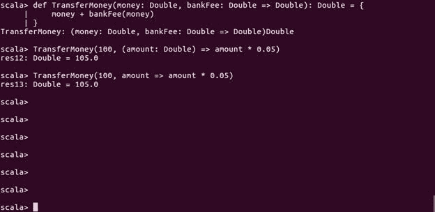
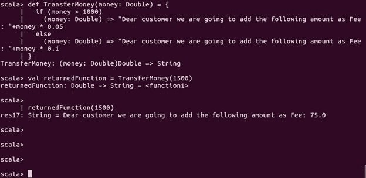

# 第三章：函数式编程概念

“面向对象编程通过封装移动部分使代码易于理解。函数式编程通过最小化移动部分使代码易于理解。”

- Michael Feathers

使用 Scala 和 Spark 是学习大数据分析的很好组合。然而，除了面向对象编程范式，我们还需要知道为什么函数式概念对编写最终分析数据的 Spark 应用程序很重要。正如前几章所述，Scala 支持两种编程范式：面向对象编程范式和函数式编程概念。在第二章中的*面向对象 Scala*中，我们探讨了面向对象编程范式，看到了如何在蓝图（类）中表示现实世界对象，然后将其实例化为具有真实内存表示的对象。

在本章中，我们将重点关注第二种范式（即函数式编程）。我们将看到函数式编程是什么，Scala 如何支持它，为什么它很重要以及使用这个概念的相关优势。具体来说，我们将学习几个主题，比如为什么 Scala 是数据科学家的武器库，为什么学习 Spark 范式很重要，纯函数和**高阶函数**（**HOFs**）的相关内容。本章还将展示使用 HOF 的真实用例。然后，我们将看到如何在 Scala 的标准库中处理集合外的高阶函数中的异常。最后，我们将学习函数式 Scala 如何影响对象的可变性。

简而言之，本章将涵盖以下主题：

+   函数式编程介绍

+   数据科学家的函数式 Scala

+   为什么函数式编程和 Scala 对学习 Spark 很重要？

+   纯函数和高阶函数

+   使用高阶函数：一个真实用例

+   在函数式 Scala 中处理错误

+   函数式编程和数据可变性

# 函数式编程介绍

在计算机科学中，`函数式编程`（FP）是一种编程范式和一种构建计算机程序结构和元素的独特风格。这种独特性有助于将计算视为数学函数的评估，并避免改变状态和可变数据。因此，通过使用 FP 概念，您可以学会以自己的方式编写代码，确保数据的不可变性。换句话说，FP 是关于编写纯函数，消除尽可能多的隐藏输入和输出，以便我们的代码尽可能地*只*描述输入和输出之间的关系。

这并不是一个新概念，但`Lambda Calculus`首次出现在上世纪 30 年代，它为 FP 提供了基础。然而，在编程语言领域，函数式编程一词指的是一种新的声明式编程范式，意味着编程可以通过控制、声明或表达式来完成，而不是传统语句，比如 C 语言中常用的语句。

# 函数式编程的优势

函数式编程范式中有一些令人兴奋和酷炫的特性，比如`组合`、`管道化`和`高阶函数`，有助于避免编写非函数式代码。或者至少在后期，这有助于将非函数式程序转换为函数式风格，朝向命令式风格。最后，现在让我们看看如何从计算机科学的角度定义函数式编程这个术语。函数式编程是计算机科学中的一个常见概念，其中计算和程序的构建结构被视为评估数学函数，支持不可变数据并避免状态改变。在函数式编程中，每个函数对于相同的输入参数值具有相同的映射或输出。

随着复杂软件的需求，需要良好结构化的程序和易于编写和调试的软件。我们还需要编写可扩展的代码，这将节省我们未来的编程成本，并有助于代码的轻松编写和调试；甚至更模块化的软件，易于扩展，需要较少的编程工作。由于函数式编程的后一种贡献，模块化，函数式编程被认为是软件开发的一大优势。

在函数式编程中，其结构中有一个基本构建块称为没有副作用的函数（或者至少在大部分代码中没有）。没有副作用，评估的顺序真的无关紧要。在编程语言的观点上，有方法可以强制执行特定的顺序。在一些 FP 语言（例如，渴望语言如 Scheme）中，对参数没有评估顺序，您可以将这些表达式嵌套在它们自己的 lambda 形式中，如下所示：

```scala
((lambda (val1) 
  ((lambda (val2) 
    ((lambda (val3) (/ (* val1 val2) val3)) 
      expression3)) ; evaluated third
      expression2))   ; evaluated second
    expression1)      ; evaluated first

```

在函数式编程中，编写数学函数，其中执行顺序并不重要，通常会使您的代码更易读。有时，有人会争论我们也需要有副作用的函数。实际上，这是大多数函数式编程语言的主要缺点之一，因为通常很难编写不需要任何 I/O 的函数；另一方面，在函数式编程中难以实现需要 I/O 的函数。从*图 1*中可以看出，Scala 也是一种混合语言，它通过从 Java 等命令式语言和 Lisp 等函数式语言中获取特性而发展而来。

但幸运的是，在这里我们正在处理一种混合语言，其中允许面向对象和函数式编程范式，因此编写需要 I/O 的函数非常容易。函数式编程还具有比基本编程更大的优势，例如理解和缓存。

函数式编程的一个主要优势是简洁，因为使用函数式编程可以编写更紧凑、简洁的代码。并发也被认为是一个主要优势，在函数式编程中更容易实现。因此，像 Scala 这样的函数式语言提供了许多其他功能和工具，鼓励编程人员对更数学化的思维方式进行整体范式转变。

**图 1：** 展示了使用函数式编程概念的概念视图

通过将焦点缩小到一小部分可组合的抽象概念，如函数、函数组合和抽象代数，函数式编程概念相对于其他范式提供了几个优势。例如：

+   **更贴近数学思维：** 你倾向于以接近数学定义而不是迭代程序的格式表达你的想法。

+   没有（或者至少更少）副作用：您的函数不会影响其他函数，这对并发和并行化非常有利，也有利于调试。

+   **更少的代码行数而不牺牲概念上的清晰度：** Lisp 比非函数式语言更强大。虽然你需要花费更多的时间思考而不是写作，但最终你可能会发现你更有生产力。

通过这些令人兴奋的特性，函数式编程实现了显著的表达力。例如，机器学习算法可能需要数百行命令式代码来实现，但在函数式编程中可以用少数方程式来定义。

# 数据科学家的函数式 Scala

对于进行交互式数据清洗、处理、整理和分析，许多数据科学家使用 R 或 Python 作为他们最喜欢的工具。然而，有许多数据科学家倾向于非常依赖他们最喜欢的工具--也就是 Python 或 R，并试图使用该工具解决所有数据分析问题或工作。因此，在大多数情况下，向他们介绍新工具可能非常具有挑战性，因为新工具有更多的语法和一套新的模式需要学习才能使用新工具来解决他们的目的。

Spark 中还有其他用 Python 和 R 编写的 API，例如 PySpark 和 SparkR，分别允许您从 Python 或 R 中使用它们。然而，大多数 Spark 书籍和在线示例都是用 Scala 编写的。我们认为，学习如何使用与 Spark 代码相同的语言来使用 Spark 将比 Java、Python 或 R 作为数据科学家带来更多优势：

+   更好的性能并消除数据处理开销

+   提供对 Spark 最新和最优秀的功能的访问

+   帮助以透明的方式理解 Spark 的哲学

分析数据意味着您正在编写 Scala 代码，使用 Spark 及其 API（即 SparkR、SparkSQL、Spark Streaming、Spark MLlib 和 Spark GraphX）从集群中检索数据。或者，您正在使用 Scala 开发一个 Spark 应用程序，在本地机器上操作数据。在这两种情况下，Scala 都是您真正的朋友，并将在时间上为您带来回报。

# 为什么要学习 Spark 的 FP 和 Scala？

在本节中，我们将讨论为什么要学习 Spark 来解决我们的数据分析问题。然后，我们将讨论为什么 Scala 中的函数式编程概念对于使数据分析对数据科学家更容易非常重要。我们还将讨论 Spark 编程模型及其生态系统，以使它们更清晰。

# 为什么 Spark？

Spark 是一个快速的集群计算框架，主要设计用于快速计算。Spark 基于 Hadoop MapReduce 模型，并在更多形式和类型的计算中使用 MapReduce，如交互式查询和流处理。Spark 的主要特点之一是内存处理，这有助于提高应用程序的性能和处理速度。Spark 支持各种应用程序和工作负载，如以下内容：

+   基于批处理的应用程序

+   以前无法快速运行的迭代算法

+   交互式查询和流处理

此外，学习 Spark 并在应用程序中实现它并不需要太多时间，而无需了解并发和分布式系统的内部细节。Spark 是在加州大学伯克利分校的 AMPLab 于 2009 年实施的。2010 年，他们决定将其开源。然后，Spark 在 2013 年成为 Apache 发布，并自那时起被认为是最著名/使用最广泛的 Apache 发布软件。Apache Spark 因其功能而变得非常出名：

+   **快速计算**：由于其黄金特性--内存处理，Spark 帮助您运行比 Hadoop 更快的应用程序。

+   **支持多种编程语言**：Apache Spark 提供了不同语言的包装器和内置 API，如 Scala、Java、Python，甚至 R。

+   **更多的分析**：如前所述，Spark 支持 MapReduce 操作，还支持更高级的分析，如**机器学习**（**MLlib**）、数据流和图处理算法。

正如前面提到的，Spark 是建立在 Hadoop 软件之上的，您可以以不同的方式部署 Spark：

+   **独立集群**：这意味着 Spark 将在**Hadoop 分布式文件系统**（**HDFS**）之上运行，并且空间实际上将分配给 HDFS。Spark 和 MapReduce 将并行运行，以服务所有 Spark 作业。

+   **Hadoop YARN 集群**：这意味着 Spark 只需在 YARN 上运行，无需任何根权限或预安装。

+   **Mesos 集群**：当驱动程序创建一个 Spark 作业并开始分配相关任务进行调度时，Mesos 确定哪些计算节点将处理哪些任务。我们假设您已经在计算机上配置并安装了 Mesos。

+   **按需部署在集群上**：您可以在 AWS EC2 上以真实集群模式部署 Spark 作业。为了使您的应用程序在 Spark 集群模式下运行并实现更好的可伸缩性，您可以考虑将**Amazon 弹性计算云**（**EC2**）服务作为**基础设施即服务**（**IaaS**）或**平台即服务**（**PaaS**）。

有关如何在真实集群上使用 Scala 和 Spark 部署数据分析应用程序，请参阅第十七章，*前往集群部署 Spark*和第十八章，*测试和调试 Spark*。

# Scala 和 Spark 编程模型

Spark 编程始于数据集，通常驻留在分布式和持久存储（如 HDFS）中。Spark 提供的典型 RDD 编程模型可以描述如下：

+   从环境变量、Spark 上下文（Spark shell 为您提供了一个 Spark 上下文，或者您可以自己创建，这将在本章后面描述）创建初始数据引用 RDD 对象。

+   按照函数式编程风格（稍后将讨论）转换初始 RDD 以创建更多 RDD 对象。

+   从驱动程序向集群管理器节点发送代码、算法或应用程序。然后，集群管理器为每个计算节点提供一个副本。

+   计算节点保存对其分区中的 RDD 的引用（同样，驱动程序也保存数据引用）。但是，计算节点也可以由集群管理器提供输入数据集。

+   在转换（通过窄转换或宽转换）之后，生成的结果将是全新的 RDD，因为原始 RDD 不会发生变异。

+   最后，通过操作将 RDD 对象或更多（具体来说，数据引用）实现为将 RDD 转储到存储中。

+   驱动程序可以向计算节点请求程序分析或可视化的结果块。

等等！到目前为止，我们一切顺利。我们假设您将把应用程序代码发送到集群中的计算节点。但是，您还需要将输入数据集上传或发送到集群，以便在计算节点之间进行分发。即使在批量上传期间，您也需要通过网络传输数据。我们还认为应用程序代码和结果的大小是可以忽略或微不足道的。另一个障碍是，如果您希望 Spark 进行规模化计算，可能需要首先从多个分区合并数据对象。这意味着我们需要在工作/计算节点之间进行数据洗牌，通常通过`partition()`、`intersection()`和`join()`转换操作来完成。

# Scala 和 Spark 生态系统

为了提供更多的增强和额外的大数据处理能力，Spark 可以配置并运行在现有基于 Hadoop 的集群之上。另一方面，Spark 中的核心 API 是用 Java、Scala、Python 和 R 编写的。与 MapReduce 相比，Spark 提供了更一般和强大的编程模型，还提供了几个库，这些库是 Spark 生态系统的一部分，用于通用数据处理和分析、图处理、大规模结构化 SQL 和**机器学习**（**ML**）领域的额外功能。

Spark 生态系统包括以下组件（有关详细信息，请参阅第十六章，*Spark 调优*）：

+   **Apache Spark 核心**：这是 Spark 平台的基础引擎，所有其他功能都是在其上构建的。此外，它提供了内存处理。

+   **Spark SQL**：如前所述，Spark 核心是底层引擎，所有其他组件或功能都是构建在其之上的。Spark SQL 是提供对不同数据结构（结构化和半结构化数据）支持的 Spark 组件。

+   **Spark streaming**：这个组件负责流式数据分析，并将其转换为可以后续用于分析的小批处理。

+   **MLlib（机器学习库）**：MLlib 是一个支持大量 ML 算法的分布式机器学习框架。

+   **GraphX**：一个建立在 Spark 之上的分布式图形框架，以并行方式表达用户定义的图形组件。

正如前面提到的，大多数函数式编程语言允许用户编写漂亮、模块化和可扩展的代码。此外，函数式编程通过编写看起来像数学函数的函数来鼓励安全的编程方式。现在，Spark 是如何使所有 API 作为一个单一单元工作的？这是可能的，因为硬件的进步，当然还有函数式编程的概念。由于添加语法糖以轻松地进行 lambda 表达式并不足以使一种语言成为函数式的，这只是一个开始。

尽管 Spark 中的 RDD 概念运行得相当不错，但在许多用例中，由于其不可变性，它有点复杂。对于下面的例子，这是计算平均值的经典例子，使源代码健壮且可读；当然，为了减少总体成本，人们不希望首先计算总数，然后计数，即使数据被缓存在主内存中。

```scala
val data: RDD[People] = ...
data.map(person => (person.name, (person.age, 1)))
.reduceByKey(_ |+| _)
.mapValues { case (total, count) =>
  total.toDouble / count
}.collect()

```

数据框架 API（这将在后面的章节中详细讨论）产生同样简洁和可读的代码，其中函数 API 非常适合大多数用例，并最小化了 MapReduce 阶段；有许多洗牌可能会造成巨大的成本，其主要原因如下：

+   大型代码库需要静态类型以消除微不足道的错误，比如*aeg*而不是*age*立即

+   复杂的代码需要透明的 API 来清晰地传达设计

+   通过封装 OOP 状态并使用 mapPartitions 和 combineByKey 同样可以实现 DataFrames API 的 2 倍速度提升

+   需要灵活性和 Scala 特性来快速构建功能

在巴克莱，将 OOP 和 FP 与 Spark 结合可以使一个相当困难的问题变得更容易。例如，在巴克莱，最近开发了一个名为 Insights Engine 的应用程序，用于执行任意数量 N 个类似 SQL 的查询。该应用程序可以以一种可以随着 N 的增加而扩展的方式执行它们。

现在让我们谈谈纯函数、高阶函数和匿名函数，这是 Scala 函数式编程中的三个重要概念。

# 纯函数和高阶函数

从计算机科学的角度来看，函数可以有许多形式，如一阶函数、高阶函数或纯函数。从数学的角度来看也是如此。使用高阶函数可以执行以下操作之一：

+   将一个或多个函数作为参数来执行一些操作

+   将一个函数作为其结果返回

除了高阶函数之外的所有其他函数都是一阶函数。然而，从数学的角度来看，高阶函数也被称为**操作符**或**函数式**。另一方面，如果一个函数的返回值仅由其输入决定，当然没有可观察的副作用，那么它被称为**纯函数**。

在本节中，我们将简要讨论为什么以及如何在 Scala 中使用不同的函数式范式。特别是，将讨论纯函数和高阶函数。在本节结束时，还将提供使用匿名函数的简要概述，因为在使用 Scala 开发 Spark 应用程序时经常使用它。

# 纯函数

函数式编程的最重要原则之一是纯函数。那么纯函数是什么，我们为什么要关心它们？在本节中，我们将讨论函数式编程的这一重要特性。函数式编程的最佳实践之一是实现程序，使得程序/应用程序的核心由纯函数构成，而所有 I/O 函数或诸如网络开销和异常之类的副作用都在一个公开的外部层中。

那么纯函数的好处是什么？纯函数通常比普通函数小（尽管这取决于其他因素，如编程语言），甚至更容易解释和理解，因为它看起来像一个数学函数。

然而，您可能会反对这一点，因为大多数开发人员仍然认为命令式编程更容易理解！纯函数要容易实现和测试得多。让我们通过一个例子来演示这一点。假设我们有以下两个单独的函数：

```scala
def pureFunc(cityName: String) = s"I live in $cityName"
def notpureFunc(cityName: String) = println(s"I live in $cityName")

```

因此，在前面的两个示例中，如果要测试`pureFunc`纯函数，我们只需断言来自纯函数的返回值与我们根据输入所期望的值相匹配即可：

```scala
assert(pureFunc("Dublin") == "I live in Dublin")

```

但另一方面，如果我们想测试我们的`notpureFunc`不纯函数，那么我们需要重定向标准输出，然后对其应用断言。下一个实用的提示是，函数式编程使程序员更加高效，因为如前所述，纯函数更小更容易编写，您可以轻松地将它们组合在一起。此外，代码的重复最小化，您可以轻松地重用您的代码。现在让我们通过一个更好的例子来演示这个优势。考虑这两个函数：

```scala
scala> def pureMul(x: Int, y: Int) = x * y
pureMul: (x: Int, y: Int)Int 
scala> def notpureMul(x: Int, y: Int) = println(x * y)
notpureMul: (x: Int, y: Int)Unit

```

然而，可变性可能会产生副作用；使用纯函数（即没有可变性）有助于我们推理和测试代码：

```scala
def pureIncrease(x: Int) = x + 1

```

这个优势是有利的，非常容易解释和使用。然而，让我们看另一个例子：

```scala
varinc = 0
def impureIncrease() = {
  inc += 1
  inc
}

```

现在，考虑一下这可能有多令人困惑：在多线程环境中会输出什么？正如您所看到的，我们可以轻松地使用我们的纯函数`pureMul`来乘以任何一系列数字，而不像我们的`notpureMul`不纯函数。让我们通过以下示例来演示这一点：

```scala
scala> Seq.range(1,10).reduce(pureMul)
res0: Int = 362880

```

前面示例的完整代码如下所示（使用一些真实值调用了方法）：

```scala
package com.chapter3.ScalaFP

object PureAndNonPureFunction {
  def pureFunc(cityName: String) = s"I live in $cityName"
  def notpureFunc(cityName: String) = println(s"I live in $cityName")
  def pureMul(x: Int, y: Int) = x * y
  def notpureMul(x: Int, y: Int) = println(x * y)  

  def main(args: Array[String]) {
    //Now call all the methods with some real values
    pureFunc("Galway") //Does not print anything
    notpureFunc("Dublin") //Prints I live in Dublin
    pureMul(10, 25) //Again does not print anything
    notpureMul(10, 25) // Prints the multiplicaiton -i.e. 250   

    //Now call pureMul method in a different way
    val data = Seq.range(1,10).reduce(pureMul)
    println(s"My sequence is: " + data)
  }
}

```

前面代码的输出如下：

```scala
I live in Dublin 250 
My sequence is: 362880

```

如前所述，您可以将纯函数视为函数式编程的最重要特性之一，并且作为最佳实践；您需要使用纯函数构建应用程序的核心。

函数与方法：

在编程领域，**函数**是通过名称调用的一段代码。数据（作为参数）可以传递以进行操作，并且可以返回数据（可选）。传递给函数的所有数据都是显式传递的。另一方面，**方法**也是通过名称调用的一段代码。然而，方法总是与对象相关联。听起来相似？在大多数情况下，方法与函数相同，除了两个关键差异：

1. 方法隐式传递了调用它的对象。

2. 方法能够操作类中包含的数据。

在前一章中已经说明，对象是类的一个实例--类是定义，对象是该数据的一个实例。

现在是学习高阶函数的时候了。然而，在此之前，我们应该学习函数式 Scala 中的另一个重要概念--**匿名函数**。通过这个，我们还将学习如何在函数式 Scala 中使用 lambda 表达式。

# 匿名函数

有时在你的代码中，你不想在使用之前定义一个函数，也许是因为你只会在一个地方使用它。在函数式编程中，有一种非常适合这种情况的函数类型。它被称为匿名函数。让我们使用转账的前面示例来演示匿名函数的使用：

```scala
def TransferMoney(money: Double, bankFee: Double => Double): Double = {
  money + bankFee(money)
}

```

现在，让我们用一些真实的值调用`TransferMoney()`方法如下：

```scala
 TransferMoney(100, (amount: Double) => amount * 0.05)

```

Lambda 表达式：

正如已经说明的，Scala 支持头等函数，这意味着函数可以用函数文字语法来表示；函数可以被称为对象，称为函数值。尝试以下表达式，它创建了一个整数的后继函数：

`scala> var apply = (x:Int) => x+1`

`apply: Int => Int = <function1>`

现在 apply 变量是一个可以像下面这样通常使用的函数：

`scala> var x = apply(7)`

`x: Int = 8`

我们在这里所做的只是使用函数的核心部分：参数列表，然后是函数箭头和函数体。这不是黑魔法，而是一个完整的函数，只是没有给定的名称--也就是匿名的。如果你以这种方式定义一个函数，将没有办法在之后引用该函数，因此你不能在之后调用该函数，因为没有名称它就是匿名的。此外，我们有一个所谓的**lambda 表达式**！它只是一个纯粹的、匿名的函数定义。

上述代码的输出如下：

```scala
105.0

```

因此，在前面的示例中，我们直接传递了一个匿名函数，而不是声明一个单独的`callback`函数，它和`bankFee`函数一样完成了相同的工作。你也可以在匿名函数中省略类型，它将根据传递的参数直接推断出类型，就像这样：

```scala
TransferMoney(100, amount => amount * 0.05)

```

上述代码的输出如下：

```scala
105.0

```

让我们在 Scala shell 中演示前面的例子，如下面的截图所示：

**图 6：**在 Scala 中使用匿名函数

一些支持函数的编程语言使用 lambda 函数的名称，而不是匿名函数。

# 高阶函数

在 Scala 的函数式编程中，你可以允许将函数作为参数传递，甚至从另一个函数中返回一个函数；这定义了所谓的高阶函数。

让我们通过一个例子来演示这个特性。考虑以下函数`testHOF`，它接受另一个函数`func`，然后将这个函数应用到它的第二个参数值上：

```scala
object Test {
  def main(args: Array[String]) {
    println( testHOF( paramFunc, 10) )
  }
  def testHOF(func: Int => String, value: Int) = func(value)
  def paramFuncA = "[" + x.toString() + "]"
}

```

在演示了 Scala 函数式编程的基础知识之后，现在我们准备转向更复杂的函数式编程案例。如前所述，我们可以将高阶函数定义为接受其他函数作为参数并将它们作为结果返回的函数。如果你来自面向对象的编程背景，你会发现这是一种非常不同的方法，但随着我们的学习，你会发现它变得更容易理解。

让我们从定义一个简单的函数开始：

```scala
def quarterMaker(value: Int): Double = value.toDouble/4

```

前面的函数非常简单。它是一个接受 Int 值然后返回这个值的四分之一的函数，返回类型是`Double`。让我们定义另一个简单的函数：

```scala
def addTwo(value: Int): Int = value + 2

```

第二个函数`addTwo`比第一个函数更简单。它接受一个`Int`值，然后将 2 加到它上。正如你所看到的，这两个函数有一些共同之处。它们都接受`Int`并返回另一个经过处理的值，我们可以称之为`AnyVal`。现在，让我们定义一个接受另一个函数作为参数的高阶函数：

```scala
def applyFuncOnRange(begin: Int, end: Int, func: Int => AnyVal): Unit = {
  for (i <- begin to end)
    println(func(i))
}

```

正如您所看到的，前面的`applyFuncOnRange`函数接受两个`Int`值，作为序列的开始和结束，并接受一个具有`Int => AnyVal`签名的函数，就像先前定义的简单函数（`quarterMakder`和`addTwo`）一样。现在让我们通过将两个简单函数中的一个作为第三个参数传递给它来演示我们之前的高阶函数（如果您想要传递自己的函数，那么请确保它具有相同的签名`Int => AnyVal`）。

**Scala 循环范围的语法：**在 Scala 中使用 for 循环与范围的最简单语法是：

`for( var x <- range ){`

`语句（s）`

`}`

这里，`range`可以是一系列数字，表示为`i`到`j`，有时像`i`直到`j`。左箭头“←”操作符被称为生成器，因为它从范围生成单个值。让我们看一个具体的例子：

`object UsingRangeWithForLoop {`

`def main(args: Array[String]):Unit= {`

`var i = 0;`

// 使用范围进行 for 循环执行

`for（i <- 1 to 10）{`

`println（"i 的值：" + i）`

`}`

`}

`}`

上述代码的输出如下：

i 的值：1

i 的值：2

i 的值：3

i 的值：4

i 的值：5

i 的值：6

i 的值：7

i 的值：8

i 的值：9

i 的值：10

在开始使用它们之前，让我们首先定义我们的函数，如下截图所示：

图 2：在 Scala 中定义高阶函数的示例

现在，让我们首先调用我们的高阶函数`applyFuncOnRange`，并将`quarterMaker`函数作为第三个参数传递：

图 3：调用高阶函数

我们甚至可以应用另一个函数`addTwo`，因为它具有与以下截图中显示的相同签名：

图 4：调用高阶函数的另一种方式

在进入更多的例子之前，让我们定义所谓的回调函数。回调函数是一个可以作为参数传递给另一个函数的函数。其他函数只是普通函数。让我们演示使用不同回调函数的更多例子。考虑以下高阶函数，负责从您的账户转移特定金额的资金：

```scala
def TransferMoney(money: Double, bankFee: Double => Double): Double = {
  money + bankFee(money)
}
def bankFee(amount: Double) = amount * 0.05

```

在 100 上调用`TransferMoney`函数后：

```scala
TransferMoney(100, bankFee)

```

上述代码的输出如下：

```scala
105.0

```

从函数式编程的角度来看，这段代码还没有准备好集成到银行系统中，因为您需要对资金参数应用不同的验证，比如它必须是正数，并且大于银行指定的特定金额。然而，在这里，我们只是演示高阶函数和回调函数的使用。

因此，这个例子的工作方式如下：您想要将特定金额的资金转移到另一个银行账户或资金代理。银行有特定的费用要根据您转移的金额来应用，这就是回调函数的作用。它接受要转移的金额，并对其应用银行手续费，以得出总金额。

`TransferMoney`函数接受两个参数：第一个是要转移的金额，第二个是一个带有`Double => Double`签名的回调函数，该函数应用于金额参数，以确定转移金额的银行手续费。

图 5：调用并赋予高阶函数额外的权力

上述示例的完整源代码如下（我们使用了一些真实值来调用这些方法）：

```scala
package com.chapter3.ScalaFP
object HigherOrderFunction {
  def quarterMaker(value: Int): Double = value.toDouble / 4
  def testHOF(func: Int => String, value: Int) = func(value)
  def paramFuncA = "[" + x.toString() + "]"
  def addTwo(value: Int): Int = value + 2
  def applyFuncOnRange(begin: Int, end: Int, func: Int => AnyVal): Unit = {
    for (i <- begin to end)
      println(func(i))
  }
  def transferMoney(money: Double, bankFee: Double => Double): Double = {
    money + bankFee(money)
  }
  def bankFee(amount: Double) = amount * 0.05
  def main(args: Array[String]) {
    //Now call all the methods with some real values
    println(testHOF(paramFunc, 10)) // Prints [10]
    println(quarterMaker(20)) // Prints 5.0
    println(paramFunc(100)) //Prints [100]
    println(addTwo(90)) // Prints 92
    println(applyFuncOnRange(1, 20, addTwo)) // Prints 3 to 22 and ()
    println(TransferMoney(105.0, bankFee)) //prints 110.25
  }
}

```

上述代码的输出如下：

```scala
[10] 
5.0 
[100] 
92 
3 4 5 6 7 8 9 10 11 12 13 14 15 16 1718 19 20 21 22 () 
110.25

```

通过使用回调函数，您为高阶函数赋予了额外的权力；因此，这是一种使您的程序更加优雅、灵活和高效的强大机制。

# 函数作为返回值

如前所述，高阶函数还支持将函数作为结果返回。让我们通过一个例子来演示这一点：

```scala
def transferMoney(money: Double) = {
  if (money > 1000)
    (money: Double) => "Dear customer we are going to add the following
                        amount as Fee: "+money * 0.05
  else
    (money: Double) => "Dear customer we are going to add the following
                        amount as Fee: "+money * 0.1
} 
val returnedFunction = TransferMoney(1500)
returnedFunction(1500)

```

前面的代码段将产生以下输出：

```scala
Dear customer, we are going to add the following amount as Fee: 75.0

```

让我们按照以下截图中显示的方式运行前面的示例；它展示了如何将函数用作返回值：

**图 7：**函数作为返回值

前面示例的完整代码如下所示：

```scala
package com.chapter3.ScalaFP
object FunctionAsReturnValue {
  def transferMoney(money: Double) = {
    if (money > 1000)
      (money: Double) => "Dear customer, we are going to add following
                          amount as Fee: " + money * 0.05
    else
      (money: Double) => "Dear customer, we are going to add following
                          amount as Fee: " + money * 0.1
  }  
  def main(args: Array[String]) {
    val returnedFunction = transferMoney(1500.0)
    println(returnedFunction(1500)) //Prints Dear customer, we are 
                         going to add following amount as Fee: 75.0
  }
}

```

前面代码的输出如下所示：

```scala
Dear customer, we are going to add following amount as Fee: 75.0

```

在结束对 HFO 的讨论之前，让我们看一个现实生活的例子，即使用 HFO 进行柯里化。

# 使用高阶函数

假设您在一家餐厅里担任厨师，您的一个同事问您一个问题：实现一个**HOF**（高阶函数），执行柯里化。寻找线索？假设您的 HOF 有以下两个签名：

```scala
def curryX,Y,Z => Z) : X => Y => Z

```

同样，实现一个执行 uncurrying 的函数，如下所示：

```scala
def uncurryX,Y,Z: (X,Y) => Z

```

现在，您如何使用 HOF 来执行柯里化操作呢？嗯，您可以创建一个封装两个 HOF 签名（即 curry 和 uncurry）的特性，如下所示：

```scala
trait Curry {
  def curryA, B, C => C): A => B => C
  def uncurryA, B, C: (A, B) => C
}

```

现在，您可以按照以下方式将此特性实现并扩展为对象：

```scala

object CurryImplement extends Curry {
  def uncurryX, Y, Z: (X, Y) => Z = { (a: X, b: Y) => f(a)(b) }
  def curryX, Y, Z => Z): X => Y => Z = { (a: X) => { (b: Y) => f(a, b) } }
}

```

这里我首先实现了 uncurry，因为它更容易。等号后面的两个大括号是一个匿名函数，用于接受两个参数（即类型为`X`和`Y`的`a`和`b`）。然后，这两个参数可以在一个还返回函数的函数中使用。然后，它将第二个参数传递给返回的函数。最后，它返回第二个函数的值。第二个函数字面量接受一个参数并返回一个新的函数，即`curry()`。最终，当调用时返回另一个函数。

现在问题来了：如何在实际实现中使用扩展基本特性的前面对象。以下是一个例子：

```scala
object CurryingHigherOrderFunction {
  def main(args: Array[String]): Unit = {
    def add(x: Int, y: Long): Double = x.toDouble + y
    val addSpicy = CurryImplement.curry(add) 
    println(addSpicy(3)(1L)) // prints "4.0"    
    val increment = addSpicy(2) 
    println(increment(1L)) // prints "3.0"    
    val unspicedAdd = CurryImplement.uncurry(addSpicy) 
    println(unspicedAdd(1, 6L)) // prints "7.0"
  }
}

```

在前面的对象和主方法中：

+   `addSpicy`保存了一个函数，它将一个 long 类型的数加 1，然后打印出 4.0。

+   `increment`保存了一个函数，它将一个 long 类型的数加 2，最后打印出 3.0。

+   `unspicedAdd`保存了一个函数，它将 1 加上并将其类型定义为 long。最后，它打印出 7.0。

前面代码的输出如下所示：

```scala
4.0
3.0
7.0

```

在数学和计算机科学中，柯里化是将接受多个参数（或参数元组）的函数的求值转换为求值一系列函数的技术，每个函数只接受一个参数。柯里化与偏函数应用相关，但并不相同：

**柯里化：**柯里化在实际和理论环境中都很有用。在函数式编程语言和许多其他语言中，它提供了一种自动管理函数和异常传递参数的方式。在理论计算机科学中，它提供了一种研究具有多个参数的函数的方式，这些函数在更简单的理论模型中只提供一个参数。

**反柯里化：**反柯里化是柯里化的对偶转换，可以看作是一种去函数化的形式。它接受一个返回值为另一个函数`g`的函数`f`，并产生一个新的函数`f′`，该函数接受`f`和`g`的参数作为参数，并作为结果返回`f`和随后`g`对这些参数的应用。这个过程可以迭代。

到目前为止，我们已经看到了如何在 Scala 中处理纯函数、高阶函数和匿名函数。现在，让我们简要概述如何在接下来的部分中使用`Throw`、`Try`、`Either`和`Future`来扩展高阶函数。

# 在函数式 Scala 中的错误处理

到目前为止，我们专注于确保 Scala 函数的主体执行其预期的操作，不做其他事情（即错误或异常）。现在，为了利用任何编程并避免产生容易出错的代码，你需要知道如何在这种语言中捕获异常和处理错误。我们将看到如何使用 Scala 的一些特殊特性，如`Try`、`Either`和`Future`，来扩展集合之外的高阶函数。

# Scala 中的故障和异常

首先，让我们定义一般情况下我们所说的故障是什么（来源：[`tersesystems.com/2012/12/27/error-handling-in-scala/`](https://tersesystems.com/2012/12/27/error-handling-in-scala/)）：

+   **意外的内部故障**：操作失败，因为未实现的期望，比如空指针引用，违反的断言，或者简单的坏状态

+   **预期的内部故障**：操作故意失败，因为内部状态，即黑名单或断路器

+   **预期的外部故障**：操作失败，因为它被告知处理一些原始输入，并且如果无法处理原始输入，就会失败

+   **意外的外部故障**：操作失败，因为系统依赖的资源不存在：有一个松散的文件句柄，数据库连接失败，或者网络中断了

不幸的是，除非故障是由一些可管理的异常引起的，否则没有具体的方法来阻止故障。另一方面，Scala 使*checked versus unchecked*非常简单：它没有检查异常。在 Scala 中，所有异常都是未经检查的，甚至`SQLException`和`IOException`等等。现在让我们看看如何至少处理这样的异常。

# 抛出异常

Scala 方法可能会因为意外的工作流程而抛出异常。你创建一个异常对象，然后用`throw`关键字抛出它，如下所示。例如：

```scala
//code something
throw new IllegalArgumentException("arg 2 was wrong...");
//nothing will be executed from here.

```

请注意，使用异常处理的主要目标不是生成友好的消息，而是退出 Scala 程序的正常流程。

# 使用 try 和 catch 捕获异常

Scala 允许你在一个单一的块中尝试/捕获任何异常，然后使用 case 块对其进行模式匹配。在 Scala 中使用`try...catch`的基本语法如下：

```scala
try
{
  // your scala code should go here
} 
catch
{
  case foo: FooException => handleFooException(foo)
  case bar: BarException => handleBarException(bar)
  case _: Throwable => println("Got some other kind of exception")
}
finally
{
  // your scala code should go here, such as to close a database connection 
}

```

因此，如果你抛出异常，那么你需要使用`try...catch`块来优雅地处理它，而不是用内部异常消息崩溃：

```scala
package com.chapter3.ScalaFP
import java.io.IOException
import java.io.FileReader
import java.io.FileNotFoundException

object TryCatch {
  def main(args: Array[String]) {
    try {
      val f = new FileReader("data/data.txt")
    } catch {
      case ex: FileNotFoundException => println("File not found exception")
      case ex: IOException => println("IO Exception") 
    } 
  }
}

```

如果在项目树下的路径/数据中没有名为`data.txt`的文件，你将会遇到`FileNotFoundException`，如下所示：

前面代码的输出如下：

```scala
File not found exception

```

现在，让我们简要介绍一下在 Scala 中使用`finally`子句使`try...catch`块完整的例子。

# 最后

假设你想执行你的代码，不管是否抛出异常，那么你应该使用`finally`子句。你可以将它放在`try block`中，如下所示。这是一个例子：

```scala
try {
    val f = new FileReader("data/data.txt")
  } catch {
    case ex: FileNotFoundException => println("File not found exception")
  } finally { println("Dude! this code always executes") }
}

```

现在，这是使用`try...catch...finally`的完整示例：

```scala
package com.chapter3.ScalaFP
import java.io.IOException
import java.io.FileReader
import java.io.FileNotFoundException

object TryCatch {
  def main(args: Array[String]) {
    try {
      val f = new FileReader("data/data.txt")
    } catch {
      case ex: FileNotFoundException => println("File not found 
                                                 exception")
      case ex: IOException => println("IO Exception") 
    } finally {
      println("Finally block always executes!")
    }
  }
}

```

前面代码的输出如下：

```scala
File not found exception 
Finally block always executes!

```

接下来，我们将讨论 Scala 中的另一个强大特性，称为`Either`。

# 创建一个 Either

`Either[X, Y]` 是一个实例，它包含了`X`的实例或`Y`的实例，但不会同时包含两者。我们称这些子类型为 Either 的左和右。创建一个 Either 是微不足道的。但有时在程序中使用它非常强大：

```scala
package com.chapter3.ScalaFP
import java.net.URL
import scala.io.Source
object Either {
  def getData(dataURL: URL): Either[String, Source] =
    if (dataURL.getHost.contains("xxx"))
      Left("Requested URL is blocked or prohibited!")
    else
      Right(Source.fromURL(dataURL))      
  def main(args: Array[String]) {
      val either1 = getData(new URL("http://www.xxx.com"))    
      println(either1)      
      val either2 = getData(new URL("http://www.google.com"))    
      println(either2)
  }
}

```

现在，如果我们传递任意不包含`xxx`的 URL，那么我们将得到一个包装在`Right`子类型中的`Scala.io.Source`。如果 URL 包含`xxx`，那么我们将得到一个包装在`Left`子类型中的`String`。为了使前面的陈述更清晰，让我们看看前面代码段的输出：

```scala
Left(Requested URL is blocked or prohibited!) Right(non-empty iterator)

```

接下来，我们将探讨 Scala 的另一个有趣特性，称为`Future`，它用于以非阻塞方式执行任务。这也是在任务完成时处理结果的更好方式。

# Future

如果你只是想以非阻塞的方式运行任务，并且需要一种在任务完成时处理结果的方法，Scala 为你提供了 Futures，例如，如果你想以并行方式进行多个 web 服务调用，并在 web 服务处理所有这些调用后处理结果。下面的部分提供了使用 Future 的例子。

# 运行一个任务，但是阻塞

下面的例子演示了如何创建一个 Future，然后阻塞执行顺序以等待其结果。创建 Futures 很简单。你只需要把它传递给你想要的代码。下面的例子在未来执行 2+2，然后返回结果：

```scala
package com.chapter3.ScalaFP
import scala.concurrent.ExecutionContext.Implicits.global
import scala.concurrent.duration._
import scala.concurrent.{Await, Future}

object RunOneTaskbutBlock {
  def main(args: Array[String]) {
    // Getting the current time in Milliseconds
    implicit val baseTime = System.currentTimeMillis    
    // Future creation
    val testFuture = Future {
      Thread.sleep(300)
      2 + 2
    }    
    // this is the blocking part
    val finalOutput = Await.result(testFuture, 2 second)
    println(finalOutput)
  }
}

```

`Await.result`方法等待最多 2 秒，直到`Future`返回结果；如果在 2 秒内没有返回结果，它会抛出下面的异常，你可能想要处理或捕获：

```scala
java.util.concurrent.TimeoutException

```

现在是时候结束这一章了。然而，我想借此机会讨论一下我对 Scala 函数式编程和对象可变性的重要观点。

# 函数式编程和数据可变性

纯函数式编程是函数式编程中的最佳实践之一，你应该坚持下去。编写纯函数将使你的编程生活更轻松，你将能够编写易于维护和扩展的代码。此外，如果你想并行化你的代码，那么如果你编写纯函数，这将更容易实现。

如果你是一个 FP 纯粹主义者，在 Scala 中使用函数式编程的一个缺点是 Scala 同时支持 OOP 和 FP（见*图 1*），因此可能会在同一个代码库中混合这两种编码风格。在本章中，我们看到了几个例子，表明编写纯函数是容易的。然而，将它们组合成一个完整的应用程序是困难的。你可能会同意，像单子这样的高级主题使 FP 变得令人生畏。

我和很多人交谈过，他们认为递归并不是很自然的。当你使用不可变对象时，你永远不能用其他东西来改变它们。没有时候你被允许这样做。这就是不可变对象的全部意义！有时我经历过的是，纯函数和数据输入或输出真的混在一起。然而，当你需要改变时，你可以创建一个包含你改变字段的对象的副本。因此，从理论上讲，没有必要*混合*。最后，只使用不可变值和递归可能会导致 CPU 使用和 RAM 方面的性能问题。

# 总结

在这一章中，我们探讨了 Scala 中的一些函数式编程概念。我们看到了函数式编程是什么，以及 Scala 如何支持它，为什么它很重要，以及使用函数式概念的优势。我们看到了为什么学习 FP 概念在学习 Spark 范式中很重要。纯函数、匿名函数和高阶函数都有适当的例子进行了讨论。在本章后期，我们看到了如何在 Scala 的标准库中处理高阶函数外的集合中的异常。最后，我们讨论了函数式 Scala 如何影响对象的可变性。

在下一章中，我们将对集合 API 进行深入分析，这是标准库中最突出的特性之一。
