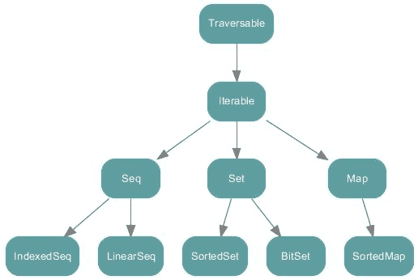
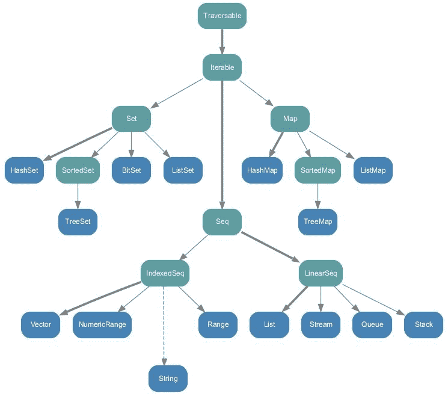
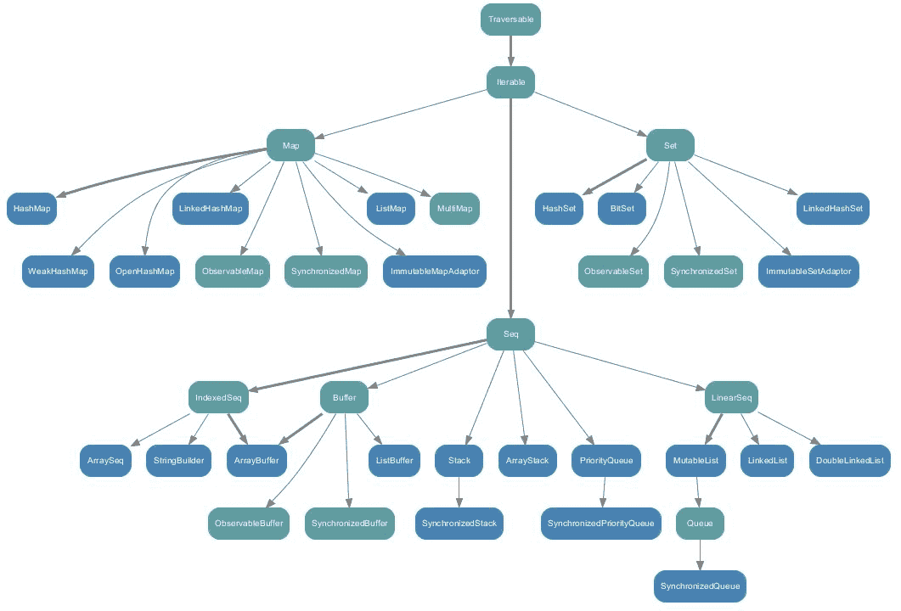

# 第四章：集合 API

“我们变成什么取决于我们在所有教授结束后读了什么。最伟大的大学是一堆书。”

- 托马斯·卡莱尔

吸引大多数 Scala 用户的功能之一是其集合 API 非常强大、灵活，并且具有许多与之相关的操作。广泛的操作范围将使您轻松处理任何类型的数据。我们将介绍 Scala 集合 API，包括它们的不同类型和层次结构，以适应不同类型的数据并解决各种不同的问题。简而言之，本章将涵盖以下主题：

+   Scala 集合 API

+   类型和层次结构

+   性能特征

+   Java 互操作性

+   使用 Scala 隐式

# Scala 集合 API

Scala 集合是一种被广泛理解和频繁使用的编程抽象，可以区分为可变和不可变集合。像可变变量一样，*可变*集合在必要时可以被更改、更新或扩展。然而，像不可变变量一样，*不可变*集合无法更改。大多数使用它们的集合类位于`scala.collection`、`scala.collection.immutable`和`scala.collection.mutable`包中。

Scala 的这一极其强大的特性为您提供了以下使用和操作数据的便利：

+   **易于使用**: 例如，它帮助您消除迭代器和集合更新之间的干扰。因此，一个由 20-50 个方法组成的小词汇表应该足以解决您数据分析解决方案中的大多数集合问题。

+   **简洁**: 您可以使用轻量级语法进行功能操作，并组合操作，最后，您会感觉自己在使用自定义代数。

+   **安全**: 帮助您在编码时处理大多数错误。

+   **快速**: 大多数集合对象都经过精心调整和优化；这使得您可以以更快的方式进行数据计算。

+   **通用**: 集合使您能够在任何地方对任何类型执行相同的操作。

在接下来的部分中，我们将探讨 Scala 集合 API 的类型和相关层次结构。我们将看到在集合 API 中使用大多数功能的几个示例。

# 类型和层次结构

Scala 集合是一种被广泛理解和频繁使用的编程抽象，可以区分为可变和不可变集合。像可变变量一样，可变集合在必要时可以被更改、更新或扩展。像不可变变量一样，不可变集合无法更改。大多数使用它们的集合类位于`scala.collection`、`scala.collection.immutable`和`scala.collection.mutable`包中。

以下分层图表（*图 1*）显示了 Scala 集合 API 的层次结构，根据 Scala 的官方文档。这些都是高级抽象类或特征。这些都有可变和不可变的实现。

**图 1:** scala.collection 包下的集合

# Traversable

**Traversable**是集合层次结构的根。在 Traversable 中，有 Scala 集合 API 提供的各种操作的定义。在 Traversable 中只有一个抽象方法，即`foreach`方法。

```scala
def foreachU: Unit

```

这个方法对 Traversable 中包含的所有操作都是必不可少的。如果您学过数据结构，您将熟悉遍历数据结构元素并在每个元素上执行函数的过程。`foreach`方法正是这样做的，它遍历集合中的元素，并在每个元素上执行函数`f`。正如我们提到的，这是一个抽象方法，它被设计为根据将使用它的底层集合的不同定义，以确保为每个集合高度优化的代码。

# Iterable

**Iterable**是 Scala 集合 API 层次结构图中的第二个根。它有一个名为 iterator 的抽象方法，必须在所有其他子集合中实现/定义。它还实现了根中的`foreach`方法，即 Traversable。但正如我们提到的，所有后代子集合将覆盖此实现，以进行与该子集合相关的特定优化。

# Seq、LinearSeq 和 IndexedSeq

序列与通常的 Iterable 有一些不同之处，它有一个定义的长度和顺序。Seq 有两个子特征，如`LinearSeq`和`IndexedSeq`。让我们快速概述一下它们。

`LinearSeq`是线性序列的基本特征。线性序列具有相当高效的 head、tail 和`isEmpty`方法。如果这些方法提供了最快的遍历集合的方式，那么扩展此特征的集合`Coll`也应该扩展`LinearSeqOptimized[A, Coll[A]]`。`LinearSeq`有三个具体方法：

+   **isEmpty:** 这检查列表是否为空

+   **head**: 这返回列表/序列中的第一个元素

+   **tail**: 这返回列表的所有元素，但不包括第一个元素。继承`LinearSeq`的每个子集合都将有自己的这些方法的实现，以确保良好的性能。继承/扩展的两个集合是 streams 和 lists。

有关此主题的更多信息，请参阅[`www.scala-lang.org/api/current/scala/collection/LinearSeq.html.`](http://www.scala-lang.org/api/current/scala/collection/LinearSeq.html)

最后，`IndexedSeq`有两个方法，它是根据它们定义的：

+   **Apply**: 这通过索引查找元素。

+   **length**: 这返回序列的长度。通过子集合的性能良好的实现来按索引查找元素。其中两个索引序列是`Vector`和`ArrayBuffer`。

# 可变和不可变

在 Scala 中，您会发现可变和不可变的集合。一个集合可以有一个可变的实现和一个不可变的实现。这就是为什么在 Java 中，`List`不能同时是`LinkedList`和`ArrayList`，但`List`有`LinkedList`实现和`ArrayList`实现的原因。以下图显示了包`scala.collection.immutable`中的所有集合：

**图 2:** scala.collection.immutable 包中的所有集合

Scala 默认导入不可变集合，如果需要使用可变集合，则需要自己导入。现在，要简要了解包`scala.collection.mutable`中的所有集合，请参考以下图表：

**图 3:** Scala.collection.mutable 包中的所有集合

在每个面向对象编程和函数式编程语言中，数组都是一个重要的集合包，它帮助我们存储数据对象，以便以后可以很容易地访问它们。在下一小节中，我们将看到关于数组的详细讨论，并附有一些示例。

# 数组

数组是一个可变集合。在数组中，元素的顺序将被保留，并且重复的元素将被保留。作为可变集合，您可以通过访问其索引号来更改数组的任何元素的值。让我们通过几个示例演示数组。使用以下代码行来声明一个简单的数组：

```scala
val numbers: Array[Int] = ArrayInt // A simple array

```

现在，打印数组的所有元素：

```scala
println("The full array is: ")
  for (i <- numbers) {
    print(" " + i)
  }

```

现在，打印特定的元素：例如，元素 3：

```scala
println(numbers(2))

```

让我们对所有元素求和并打印出来：

```scala
var total = 0;
for (i <- 0 to (numbers.length - 1)) {
  total = total + numbers(i)
}
println("Sum: = " + total)

```

查找最小的元素：

```scala
var min = numbers(0)
for (i <- 1 to (numbers.length - 1)) {
  if (numbers(i) < min) min = numbers(i)
}
println("Min is: " + min)

```

查找最大的元素：

```scala
var max = numbers(0);
for (i <- 1 to (numbers.length - 1)) {
  if (numbers(i) > max) max = numbers(i)
}
println("Max is: " + max)

```

另一种创建和定义数组的方法是使用`range()`方法，如下所示：

```scala
//Creating array using range() method
var myArray1 = range(5, 20, 2)
var myArray2 = range(5, 20)

```

上面的代码行意味着我创建了一个数组，其中的元素在 5 到 20 之间，范围差为 2。如果不指定第三个参数，Scala 将假定范围差为：

```scala
//Creating array using range() method without range difference
var myArray1 = range(5, 20, 2)

```

现在，让我们看如何访问元素：

```scala
// Print all the array elements
for (x <- myArray1) {
  print(" " + x)
}
println()
for (x <- myArray2) {
  print(" " + x)
}

```

甚至可以使用`concat()`方法连接两个数组，如下所示：

```scala
//Array concatenation
var myArray3 =  concat( myArray1, myArray2)      
// Print all the array elements
for ( x <- myArray3 ) {
  print(" "+ x)
}

```

请注意，要使用`range()`和`concat()`方法，您需要导入 Scala`Array`包，如下所示：

```scala
Import Array._

```

最后，甚至可以定义和使用多维数组如下：

```scala
var myMatrix = ofDimInt

```

现在，首先使用前面的数组创建一个矩阵如下：

```scala
var myMatrix = ofDimInt
// build a matrix
for (i <- 0 to 3) {
  for (j <- 0 to 3) {
    myMatrix(i)(j) = j
  }
}
println()

```

按照以下方式打印先前的矩阵：

```scala
// Print two dimensional array
for (i <- 0 to 3) {
  for (j <- 0 to 3) {
    print(" " + myMatrix(i)(j))
  }
  println()
}

```

前面示例的完整源代码如下所示：

```scala
package com.chapter4.CollectionAPI
import Array._                                                                                         object ArrayExample {
  def main(args: Array[String]) {
    val numbers: Array[Int] = ArrayInt
    // A simple array
    // Print all the element of the array
    println("The full array is: ")
    for (i <- numbers) {
      print(" " + i)
    }
    //Print a particular element for example element 3
    println(numbers(2))
    //Summing all the elements
    var total = 0
    for (i <- 0 to (numbers.length - 1)) {
      total = total + numbers(i)
    }
    println("Sum: = " + total)
    // Finding the smallest element
    var min = numbers(0)
    for (i <- 1 to (numbers.length - 1)) {
      if (numbers(i) < min) min = numbers(i)
    }
    println("Min is: " + min)
    // Finding the largest element
    var max = numbers(0)
    for (i <- 1 to (numbers.length - 1)) {
      if (numbers(i) > max) max = numbers(i)
    }
    println("Max is: " + max)
    //Creating array using range() method
    var myArray1 = range(5, 20, 2)
    var myArray2 = range(5, 20)
    // Print all the array elements
    for (x <- myArray1) {
      print(" " + x)
    }
    println()
    for (x <- myArray2) {
      print(" " + x)
    }
    //Array concatenation
    var myArray3 = concat(myArray1, myArray2)
    // Print all the array elements
    for (x <- myArray3) {
      print(" " + x)
    }
    //Multi-dimensional array
    var myMatrix = ofDimInt
    // build a matrix
    for (i <- 0 to 3) {
      for (j <- 0 to 3) {
        myMatrix(i)(j) = j
      }
    }
    println();
    // Print two dimensional array
    for (i <- 0 to 3) {
      for (j <- 0 to 3) {
        print(" " + myMatrix(i)(j))
      }
      println();
    }
  }
}

```

您将获得以下输出：

```scala
The full array is: 1 2 3 4 5 1 2 3 3 4 53 
Sum: = 33 
Min is: 1 
Max is: 5 
5 7 9 11 13 15 17 19 5 6 7 8 9 10 11 12 13 14 15 16 17 18 19 5 7 9 11 13 15 17 19 5 6 7 8 9 10 11 12 13 14 15 16 17 18 19 
0 1 2 3 
0 1 2 3 
0 1 2 3 
0 1 2 3

```

在 Scala 中，列表保留顺序，保留重复元素，并检查其不可变性。现在，让我们在下一小节中看一些在 Scala 中使用列表的示例。

# 名单

如前所述，Scala 提供了可变和不可变的集合。不可变集合默认导入，但如果需要使用可变集合，则需要自行导入。列表是不可变集合，如果您希望元素之间保持顺序并保留重复项，则可以使用它。让我们演示一个例子，看看列表如何保留顺序并保留重复元素，并检查其不可变性：

```scala
scala> val numbers = List(1, 2, 3, 4, 5, 1, 2, 3, 4, 5)
numbers: List[Int] = List(1, 2, 3, 4, 5, 1, 2, 3, 4, 5) 
scala> numbers(3) = 10 
<console>:12: error: value update is not a member of List[Int] 
numbers(3) = 10 ^

```

您可以使用两种不同的构建块来定义列表。`Nil`表示`List`的尾部，之后是一个空的`List`。因此，前面的例子可以重写为：

```scala
scala> val numbers = 1 :: 2 :: 3 :: 4 :: 5 :: 1 :: 2 :: 3:: 4:: 5 :: Nil
numbers: List[Int] = List(1, 2, 3, 4, 5, 1, 2, 3,4, 5

```

让我们在以下详细示例中检查列表及其方法：

```scala
package com.chapter4.CollectionAPI

object ListExample {
  def main(args: Array[String]) {
    // List of cities
    val cities = "Dublin" :: "London" :: "NY" :: Nil

    // List of Even Numbers
    val nums = 2 :: 4 :: 6 :: 8 :: Nil

    // Empty List.
    val empty = Nil

    // Two dimensional list
    val dim = 1 :: 2 :: 3 :: Nil ::
                   4 :: 5 :: 6 :: Nil ::
                   7 :: 8 :: 9 :: Nil :: Nil
    val temp = Nil

    // Getting the first element in the list
    println( "Head of cities : " + cities.head )

    // Getting all the elements but the last one
    println( "Tail of cities : " + cities.tail )

    //Checking if cities/temp list is empty
    println( "Check if cities is empty : " + cities.isEmpty )
    println( "Check if temp is empty : " + temp.isEmpty )

    val citiesEurope = "Dublin" :: "London" :: "Berlin" :: Nil
    val citiesTurkey = "Istanbul" :: "Ankara" :: Nil

    //Concatenate two or more lists with :::
    var citiesConcatenated = citiesEurope ::: citiesTurkey
    println( "citiesEurope ::: citiesTurkey : "+citiesConcatenated )

    // using the concat method
    citiesConcatenated = List.concat(citiesEurope, citiesTurkey)
    println( "List.concat(citiesEurope, citiesTurkey) : " +
             citiesConcatenated  )

  }
}

```

您将获得以下输出：

```scala
Head of cities : Dublin
Tail of cities : List(London, NY)
Check if cities is empty : false
Check if temp is empty : true
citiesEurope ::: citiesTurkey : List(Dublin, London, Berlin, Istanbul, Ankara)
List.concat(citiesEurope, citiesTurkey) : List(Dublin, London, Berlin, Istanbul, Ankara)

```

现在，让我们在下一小节中快速概述如何在 Scala 应用程序中使用集合。

# 集合

集合是最广泛使用的集合之一。在集合中，顺序不会被保留，集合不允许重复元素。你可以把它看作是集合的数学表示法。让我们通过一个例子来演示一下，我们将看到集合不保留顺序，也不允许重复：

```scala
scala> val numbers = Set( 1, 2, 3, 4, 5, 1, 2, 3, 4, 5)
numbers: scala.collection.immutable.Set[Int] = Set(5, 1, 2, 3, 4)

```

以下源代码显示了在 Scala 程序中使用集合的不同方法：

```scala
package com.chapter4.CollectionAPI
object SetExample {
  def main(args: Array[String]) {
    // Empty set of integer type
    var sInteger : Set[Int] = Set()
    // Set of even numbers
    var sEven : Set[Int] = Set(2,4,8,10)
    //Or you can use this syntax
    var sEven2 = Set(2,4,8,10)
    val cities = Set("Dublin", "London", "NY")
    val tempNums: Set[Int] = Set()
    //Finding Head, Tail, and checking if the sets are empty
    println( "Head of cities : " + cities.head )
    println( "Tail of cities : " + cities.tail )
    println( "Check if cities is empty : " + cities.isEmpty )
    println( "Check if tempNums is empty : " + tempNums.isEmpty )
    val citiesEurope = Set("Dublin", "London", "NY")
    val citiesTurkey = Set("Istanbul", "Ankara")
    // Sets Concatenation using ++ operator
    var citiesConcatenated = citiesEurope ++ citiesTurkey
    println( "citiesEurope ++ citiesTurkey : " + citiesConcatenated )
    //Also you can use ++ as a method
    citiesConcatenated = citiesEurope.++(citiesTurkey)
    println( "citiesEurope.++(citiesTurkey) : " + citiesConcatenated )
    //Finding minimum and maximum elements in the set
    val evenNumbers = Set(2,4,6,8)
    // Using the min and max methods
    println( "Minimum element in Set(2,4,6,8) : " + evenNumbers.min )
    println( "Maximum element in Set(2,4,6,8) : " + evenNumbers.max )
  }
}

```

您将获得以下输出：

```scala
Head of cities : Dublin
Tail of cities : Set(London, NY)
Check if cities is empty : false
Check if tempNums is empty : true
citiesEurope ++ citiesTurkey : Set(London, Dublin, Ankara, Istanbul, NY)
citiesEurope.++(citiesTurkey) : Set(London, Dublin, Ankara, Istanbul, NY)
Minimum element in Set(2,4,6,8) : 2
Maximum element in Set(2,4,6,8) : 8

```

根据我个人的经验，在使用 Java 或 Scala 开发 Spark 应用程序时，我发现元组的使用非常频繁，特别是用于分组元素的集合，而不使用任何显式类。在下一小节中，我们将看到如何在 Scala 中开始使用元组。

# 元组

Scala 元组用于将固定数量的项目组合在一起。这种分组的最终目标是帮助匿名函数，以便它们可以作为一个整体传递。与数组或列表的真正区别在于，元组可以容纳不同类型的对象，同时保持每个元素类型的信息，而集合不会，并且使用公共类型作为类型（例如，在前面的例子中，该集合的类型将是`Set[Any]`）。

从计算的角度来看，Scala 元组也是不可变的。换句话说，元组使用类来存储元素（例如，`Tuple2`、`Tuple3`、`Tuple22`等）。

以下是一个包含整数、字符串和控制台的元组的示例：

```scala
val tuple_1 = (20, "Hello", Console)

```

这是以下的语法糖（快捷方式）：

```scala
val t = new Tuple3(20, "Hello", Console)

```

另一个例子：

```scala
scala> val cityPop = ("Dublin", 2)
cityPop: (String, Int) = (Dublin,2)

```

您无法使用命名访问器访问元组数据，而是需要使用基于位置的访问器，其基于 1 而不是 0。例如：

```scala
scala> val cityPop = ("Dublin", 2)
cityPop: (String, Int) = (Dublin,2) 
scala> cityPop._1
res3: String = Dublin 
scala> cityPop._2
res4: Int = 2

```

此外，元组可以完美地适应模式匹配。例如：

```scala
cityPop match {
  case ("Dublin", population) => ...
  case ("NY", population) => ...
}

```

您甚至可以使用特殊运算符`->`来编写 2 值元组的紧凑语法。例如：

```scala
scala> "Dublin" -> 2
res0: (String, Int) = (Dublin,2)

```

以下是一个更详细的示例，以演示元组功能：

```scala
package com.chapter4.CollectionAPI
object TupleExample {
  def main(args: Array[String]) {
    val evenTuple = (2,4,6,8)
    val sumTupleElements =evenTuple._1 + evenTuple._2 + evenTuple._3 + evenTuple._4
    println( "Sum of Tuple Elements: "  + sumTupleElements )      
    // You can also iterate over the tuple and print it's element using the foreach method
    evenTuple.productIterator.foreach{ evenTuple =>println("Value = " + evenTuple )}
  }
}

```

您将获得以下输出：

```scala
Sum of Tuple Elements: 20 Value = 2 Value = 4 Value = 6 Value = 8

```

现在，让我们深入了解在 Scala 中使用地图，这些地图被广泛用于保存基本数据类型。

# 地图

地图是由键和值对（也称为映射或关联）组成的`Iterable`。地图也是最广泛使用的连接之一，因为它可以用于保存基本数据类型。例如：

```scala
scala> Map(1 -> 2)
res7: scala.collection.immutable.Map[Int,Int] = Map(1 -> 2)                                                scala> Map("X" -> "Y")
res8: scala.collection.immutable.Map[String,String] = Map(X -> Y)

```

Scala 的`Predef`对象提供了一个隐式转换，让您可以将`key -> value`写成`pair (key, value)`的替代语法。例如，`Map("a" -> 10, "b" -> 15, "c" -> 16)`的含义与`Map(("a", 10), ("b", 15), ("c", 16))`完全相同，但读起来更好。

此外，`Map`可以简单地被视为`Tuple2s`的集合：

```scala
Map(2 -> "two", 4 -> "four")

```

前一行将被理解为：

```scala
Map((2, "two"), (4, "four"))

```

在这个例子中，我们可以说使用`Map`可以存储一个函数，这就是函数在函数式编程语言中的全部意义：它们是头等公民，可以在任何地方使用。

假设你有一个用于查找数组中最大元素的方法如下：

```scala
var myArray = range(5, 20, 2)
  def getMax(): Int = {
    // Finding the largest element
    var max = myArray(0)
    for (i <- 1 to (myArray.length - 1)) {
      if (myArray(i) > max)
        max = myArray(i)
    }
    max
  }

```

现在，让我们映射它，以便使用`Map`存储该方法：

```scala
scala> val myMax = Map("getMax" -> getMax()) 
scala> println("My max is: " + myMax )

```

让我们看另一个使用映射的例子：

```scala
scala> Map( 2 -> "two", 4 -> "four")
res9: scala.collection.immutable.Map[Int,String] = Map(2 -> two, 4 -> four)
scala> Map( 1 -> Map("X"-> "Y"))
res10: scala.collection.immutable.Map[Int,scala.collection.immutable.Map[String,String]] = Map(1 -> Map(X -> Y))

```

以下是一个详细的示例，演示了`Map`的功能：

```scala
package com.chapter4.CollectionAPI
import Array._

object MapExample {
  var myArray = range(5, 20, 2)

  def getMax(): Int = {
    // Finding the largest element
    var max = myArray(0)
    for (i <- 1 to (myArray.length - 1)) {
      if (myArray(i) > max)
        max = myArray(i)
    }
    max
  }

  def main(args: Array[String]) {
    val capitals = Map("Ireland" -> "Dublin", "Britain" -> "London", 
    "Germany" -> "Berlin")

    val temp: Map[Int, Int] = Map()
    val myMax = Map("getMax" -> getMax())
    println("My max is: " + myMax )

    println("Keys in capitals : " + capitals.keys)
    println("Values in capitals : " + capitals.values)
    println("Check if capitals is empty : " + capitals.isEmpty)
    println("Check if temp is empty : " + temp.isEmpty)

    val capitals1 = Map("Ireland" -> "Dublin", "Turkey" -> "Ankara",
    "Egypt" -> "Cairo")
    val capitals2 = Map("Germany" -> "Berlin", "Saudi Arabia" ->
    "Riyadh")

    // Map concatenation using ++ operator
    var capitalsConcatenated = capitals1 ++ capitals2
    println("capitals1 ++ capitals2 : " + capitalsConcatenated)

    // use two maps with ++ as method
    capitalsConcatenated = capitals1.++(capitals2)
    println("capitals1.++(capitals2)) : " + capitalsConcatenated)

  }
}

```

您将得到以下输出：

```scala
My max is: Map(getMax -> 19)
Keys in capitals : Set(Ireland, Britain, Germany)
Values in capitals : MapLike(Dublin, London, Berlin)
Check if capitals is empty : false
Check if temp is empty : true
capitals1 ++ capitals2 : Map(Saudi Arabia -> Riyadh, Egypt -> Cairo, Ireland -> Dublin, Turkey -> Ankara, Germany -> Berlin)
capitals1.++(capitals2)) : Map(Saudi Arabia -> Riyadh, Egypt -> Cairo, Ireland -> Dublin, Turkey -> Ankara, Germany -> Berlin)

```

现在，让我们快速概述一下在 Scala 中使用选项；这基本上是一个可以容纳数据的数据容器。

# 选项

`Option`类型在 Scala 程序中经常使用，您可以将其与 Java 中的空值进行比较，空值表示没有值。Scala 的`Option [T]`是给定类型的零个或一个元素的容器。`Option [T]`可以是`Some [T]`或`None`对象，它表示缺少值。例如，Scala 的`Map`的 get 方法如果找到与给定键对应的值，则产生`Some`（value），如果给定键在`Map`中未定义，则产生`None`。

`Option`的基本特征如下：

```scala
trait Option[T] {
  def get: A // Returns the option's value.
  def isEmpty: Boolean // Returns true if the option is None, false
  otherwise.
  def productArity: Int // The size of this product. For a product
  A(x_1, ..., x_k), returns k
  def productElement(n: Int): Any // The nth element of this product,
  0-based
  def exists(p: (A) => Boolean): Boolean // Returns true if this option
  is nonempty 
  def filter(p: (A) => Boolean): Option[A] // Returns this Option if it
  is nonempty 
  def filterNot(p: (A) => Boolean): Option[A] // Returns this Option if
  it is nonempty or return None.
  def flatMapB => Option[B]): Option[B] // Returns result of
  applying f to this Option's 
  def foreachU => U): Unit // Apply given procedure f to the
  option's value, if it is nonempty.  
  def getOrElseB >: A: B // Returns the option's value
  if the option is nonempty, 
  def isDefined: Boolean // Returns true if the option is an instance
  of Some, false otherwise.
  def iterator: Iterator[A] // Returns a singleton iterator returning
  Option's value if it is nonempty
  def mapB => B): Option[B] // Returns a Some containing
  result of applying f to this Option's 
  def orElseB >: A: Option[B] // Returns
  this Option if it is nonempty
  def orNull // Returns the option's value if it is nonempty,
                or null if it is empty.  
}

```

例如，在下面的代码中，我们试图映射并显示一些位于一些国家的大城市，如`印度`，`孟加拉国`，`日本`和`美国`：

```scala
object ScalaOptions {
  def main(args: Array[String]) {
    val megacity = Map("Bangladesh" -> "Dhaka", "Japan" -> "Tokyo",
    "India" -> "Kolkata", "USA" -> "New York")
    println("megacity.get( \"Bangladesh\" ) : " + 
    show(megacity.get("Bangladesh")))
    println("megacity.get( \"India\" ) : " + 
    show(megacity.get("India")))
  }
}

```

现在，为了使前面的代码工作，我们需要在某个地方定义`show()`方法。在这里，我们可以使用`Option`通过 Scala 模式匹配来实现：

```scala
def show(x: Option[String]) = x match {
  case Some(s) => s
  case None => "?"
}

```

将它们组合如下应该打印出我们期望的准确结果：

```scala
package com.chapter4.CollectionAPI
object ScalaOptions {
  def show(x: Option[String]) = x match {
    case Some(s) => s
    case None => "?"
  } 
  def main(args: Array[String]) {
    val megacity = Map("Bangladesh" -> "Dhaka", "Japan" -> "Tokyo",
    "India" -> "Kolkata", "USA" -> "New York")
    println("megacity.get( \"Bangladesh\" ) : " +
    show(megacity.get("Bangladesh")))
    println("megacity.get( \"India\" ) : " +
    show(megacity.get("India")))
  }
}

```

您将得到以下输出：

```scala
megacity.get( "Bangladesh" ) : Dhaka
megacity.get( "India" ) : Kolkata

```

使用`getOrElse()`方法，可以在没有值时访问值或默认值。例如：

```scala
// Using getOrElse() method: 
val message: Option[String] = Some("Hello, world!")
val x: Option[Int] = Some(20)
val y: Option[Int] = None
println("message.getOrElse(0): " + message.getOrElse(0))
println("x.getOrElse(0): " + x.getOrElse(0))
println("y.getOrElse(10): " + y.getOrElse(10))

```

您将得到以下输出：

```scala
message.getOrElse(0): Hello, world!
x.getOrElse(0): 20
y.getOrElse(10): 10

```

此外，使用`isEmpty()`方法，您可以检查选项是否为`None`。例如：

```scala
println("message.isEmpty: " + message.isEmpty)
println("x.isEmpty: " + x.isEmpty)
println("y.isEmpty: " + y.isEmpty)

```

现在，这是完整的程序：

```scala
package com.chapter4.CollectionAPI
object ScalaOptions {
  def show(x: Option[String]) = x match {
    case Some(s) => s
    case None => "?"
  }
  def main(args: Array[String]) {
    val megacity = Map("Bangladesh" -> "Dhaka", "Japan" -> "Tokyo",
    "India" -> "Kolkata", "USA" -> "New York")
    println("megacity.get( \"Bangladesh\" ) : " +
    show(megacity.get("Bangladesh")))
    println("megacity.get( \"India\" ) : " +
    show(megacity.get("India")))

    // Using getOrElse() method: 
    val message: Option[String] = Some("Hello, world")
    val x: Option[Int] = Some(20)
    val y: Option[Int] = None

    println("message.getOrElse(0): " + message.getOrElse(0))
    println("x.getOrElse(0): " + x.getOrElse(0))
    println("y.getOrElse(10): " + y.getOrElse(10))

    // Using isEmpty()
    println("message.isEmpty: " + message.isEmpty)
    println("x.isEmpty: " + x.isEmpty)
    println("y.isEmpty: " + y.isEmpty)
  }
}

```

您将得到以下输出：

```scala
megacity.get( "Bangladesh" ) : Dhaka
megacity.get( "India" ) : Kolkata
message.getOrElse(0): Hello, world
x.getOrElse(0): 20
y.getOrElse(10): 10
message.isEmpty: false
x.isEmpty: false
y.isEmpty: true

```

让我们看看何时使用`Option`的其他示例。例如，`Map.get()`方法使用`Option`来告诉用户他尝试访问的元素是否存在。例如：

```scala
scala> val numbers = Map("two" -> 2, "four" -> 4)
numbers: scala.collection.immutable.Map[String,Int] = Map(two -> 2, four -> 4)
scala> numbers.get("four")
res12: Option[Int] = Some(4)
scala> numbers.get("five")
res13: Option[Int] = None

```

现在，我们将看到如何使用 exists，它用于检查遍历集合中一组元素的子集是否满足谓词。

# Exists

Exists 检查是否至少有一个元素在 Traversable 集合中满足谓词。例如：

```scala
def exists(p: ((A, B)) ⇒ Boolean): Boolean  

```

**使用 fat arrow：** `=>`称为*右箭头*、*粗箭头*或*火箭*，用于通过名称传递参数。这意味着当访问参数时，表达式将被评估。它实际上是一个零参数函数`call: x: () => Boolean`的语法糖。让我们看一个使用这个操作符的例子如下：

`package com.chapter4.CollectionAPI`

`object UsingFatArrow {`

`def fliesPerSecond(callback: () => Unit) {`

`while (true) { callback(); Thread sleep 1000 }`

`}`

`def main(args: Array[String]): Unit= {`

`fliesPerSecond(() => println("时间和潮汐等待着没有，但飞得像一支箭..."))`

`}`

`}`

您将得到以下输出：

`时间和潮汐等待着没有，但飞得像一支箭...`

`时间和潮汐等待着没有，但飞得像一支箭...`

`时间和潮汐等待着没有，但飞得像一支箭...`

`时间和潮汐等待着没有，但飞得像一支箭...`

`时间和潮汐等待着没有，但飞得像一支箭...`

`时间和潮汐等待着没有，但飞得像一支箭...`

可以在以下代码中看到一个详细的示例：

```scala
package com.chapter4.CollectionAPI

object ExistsExample {
  def main(args: Array[String]) {
    // Given a list of cities and now check if "Dublin" is included in
    the list     
    val cityList = List("Dublin", "NY", "Cairo")
    val ifExisitsinList = cityList exists (x => x == "Dublin")
    println(ifExisitsinList)

    // Given a map of countries and their capitals check if Dublin is
    included in the Map 
    val cityMap = Map("Ireland" -> "Dublin", "UK" -> "London")
    val ifExistsinMap =  cityMap exists (x => x._2 == "Dublin")
    println(ifExistsinMap)
  }
}

```

您将得到以下输出：

```scala
true
true

```

**注意：在 Scala 中使用中缀运算符**：

在之前的例子和后续的部分中，我们使用了 Scala 的中缀表示法。假设你想对复数执行一些操作，并且有一个带有添加两个复数的方法的案例类：

```scala
case class Complex(i: Double, j: Double) {
   def plus(other: Complex): Complex = Complex(i + other.i, j + other.j)
 }

```

现在，为了访问这个类的属性，你需要创建一个像这样的对象：

```scala
val obj = Complex(10, 20)

```

此外，假设你已经定义了以下两个复数：

```scala
val a = Complex(6, 9)
 val b = Complex(3, -6)

```

现在要从案例类中访问`plus()`方法，你需要这样做：

```scala
val z = obj.plus(a)

```

这应该给你输出：`Complex(16.0,29.0)`。然而，如果你像这样调用方法会不会更好：

```scala
val c = a plus b

```

它确实像魅力一样起作用。以下是完整的示例：

```scala
package com.chapter4.CollectionAPI
 object UsingInfix {
   case class Complex(i: Double, j: Double) {
     def plus(other: Complex): Complex = Complex(i + other.i, j + other.j)
   }  
   def main(args: Array[String]): Unit = {    
     val obj = Complex(10, 20)
     val a = Complex(6, 9)
     val b = Complex(3, -6)
     val c = a plus b
     val z = obj.plus(a)
     println(c)
     println(z)
   }
 }

```

**中缀运算符的优先级**：这由运算符的第一个字符决定。字符按优先级递增的顺序列在下面，同一行上的字符具有相同的优先级：

```scala
(all letters)
 |
 ^
 &
 = !
 < >
 :
 + -
 * / %
 (all other special characters)

```

**一般警告**：不鼓励使用中缀表示法来调用常规的非符号方法，只有在它显著提高可读性时才应该使用。中缀表示法的一个充分动机的例子是`ScalaTest`中的匹配器和测试定义的其他部分。

Scala 集合包中的另一个有趣的元素是使用`forall`。它用于检查谓词是否对`Traversable`集合中的每个元素成立。在下一小节中，我们将看到一个例子。

# Forall

Forall 检查谓词是否对`Traversable`集合中的每个元素成立。可以正式定义如下：

```scala
def forall (p: (A) ⇒ Boolean): Boolean  

```

让我们看一个例子如下：

```scala
scala> Vector(1, 2, 8, 10) forall (x => x % 2 == 0)
res2: Boolean = false

```

在编写 Scala 代码进行预处理时，我们经常需要过滤选定的数据对象。Scala 集合 API 的过滤功能用于此目的。在下一小节中，我们将看到使用过滤的例子。

# Filter

`filter`选择所有满足特定谓词的元素。可以正式定义如下：

```scala
def filter(p: (A) ⇒ Boolean): Traversable[A]  

```

让我们看一个例子如下：

```scala
scala> //Given a list of tuples (cities, Populations)
scala> // Get all cities that has population more than 5 million
scala> List(("Dublin", 2), ("NY", 8), ("London", 8)) filter (x =>x._2 >= 5)
res3: List[(String, Int)] = List((NY,8), (London,8))

```

Map 用于通过对集合的所有元素应用函数来构建新的集合或元素集。在下一小节中，我们将看到使用`Map`的例子。

# Map

Map 用于通过对集合的所有元素应用函数来构建新的集合或元素集。可以正式定义如下：

```scala
def mapB ⇒ B): Map[B]  

```

让我们看一个例子如下：

```scala
scala> // Given a list of integers
scala> // Get a list with all the elements square.
scala> List(2, 4, 5, -6) map ( x=> x * x)
res4: List[Int] = List(4, 16, 25, 36)

```

在使用 Scala 的集合 API 时，你经常需要选择列表或数组的第 n 个元素。在下一小节中，我们将探讨使用 take 的例子。

# Take

Take 用于获取集合的前 n 个元素。使用`take`的正式定义如下：

```scala
def take(n: Int): Traversable[A]

```

让我们看一个例子如下：

```scala
// Given an infinite recursive method creating a stream of odd numbers.
def odd: Stream[Int] = {
  def odd0(x: Int): Stream[Int] =
    if (x%2 != 0) x #:: odd0(x+1)
    else odd0(x+1)
      odd0(1)
}// Get a list of the 5 first odd numbers.
odd take (5) toList

```

你将得到以下输出：

```scala
res5: List[Int] = List(1, 3, 5, 7, 9)

```

在 Scala 中，如果想要根据特定的分区函数将特定的集合分成另一个`Traversable`集合的映射，可以使用`groupBy()`方法。在下一小节中，我们将展示使用`groupBy()`的一些例子。

# GroupBy

GroupBy 用于根据特定的分区函数将特定的集合分成其他`Traversable`集合的映射。可以正式定义如下：

```scala
def groupByK) ⇒ K): Map[K, Map[A, B]]  

```

让我们看一个例子如下：

```scala
scala> // Given a list of numbers
scala> // Group them as positive and negative numbers.
scala> List(1,-2,3,-4) groupBy (x => if (x >= 0) "positive" else "negative")
res6: scala.collection.immutable.Map[String,List[Int]] = Map(negative -> List(-2, -4), positive -> List(1, 3))

```

在 Scala 中，如果你想选择`Traversable`集合中除了最后一个元素之外的所有元素，可以使用`init`。在下一小节中，我们将看到它的例子。

# Init

`init`选择`Traversable`集合中除了最后一个元素之外的所有元素。可以正式定义如下：

```scala
def init: Traversable[A]  

```

让我们看一个例子如下：

```scala
scala> List(1,2,3,4) init
res7: List[Int] = List(1, 2, 3)

```

在 Scala 中，如果你想选择除了前 n 个元素之外的所有元素，你应该使用 drop。在下一小节中，我们将看到如何使用 drop。

# Drop

`drop`用于选择除了前 n 个元素之外的所有元素。可以正式定义如下：

```scala
def drop(n: Int): Traversable[A]  

```

让我们看一个例子如下：

```scala
// Drop the first three elements
scala> List(1,2,3,4) drop 3
res8: List[Int] = List(4)

```

在 Scala 中，如果你想要在满足谓词的情况下获取一组元素，你应该使用`takeWhile`。在下一小节中，我们将看到如何使用`takeWhile`。

# TakeWhile

TakeWhile 用于获取一组元素，直到满足谓词。可以正式定义如下：

```scala
def takeWhile(p: (A) ⇒ Boolean): Traversable[A]  

```

让我们看一个例子如下：

```scala
// Given an infinite recursive method creating a stream of odd numbers.
def odd: Stream[Int] = {
  def odd0(x: Int): Stream[Int] =
    if (x%2 != 0) x #:: odd0(x+1)
    else odd0(x+1)
      odd0(1)
}
// Return a list of all the odd elements until an element isn't less then 9\. 
odd takeWhile (x => x < 9) toList

```

您将得到以下输出：

```scala
res11: List[Int] = List(1, 3, 5, 7)

```

在 Scala 中，如果您想要省略一组元素，直到满足谓词，您应该使用`dropWhile`。我们将在下一小节中看到一些此类示例。

# DropWhile

`dropWhile`用于省略一组元素，直到满足谓词。可以正式定义如下：

```scala
def dropWhile(p: (A) ⇒ Boolean): Traversable[A]  

```

让我们看一个例子如下：

```scala
//Drop values till reaching the border between numbers that are greater than 5 and less than 5
scala> List(2,3,4,9,10,11) dropWhile(x => x <5)
res1: List[Int] = List(9, 10, 11)

```

在 Scala 中，如果您想要使用您的**用户定义函数**（**UDF**），使其接受嵌套列表中的函数作为参数，并将输出组合在一起，`flatMap()`是一个完美的选择。我们将在下一节中看到使用`flatMap()`的例子。

# FlatMap

FltatMap 接受一个函数作为参数。给定给`flatMap()`的函数不适用于嵌套列表，但它会产生一个新的集合。可以正式定义如下：

```scala
def flatMapB ⇒ GenTraversableOnce[B]): Traversable[B]  

```

让我们看一个例子如下：

```scala
//Applying function on nested lists and then combining output back together
scala> List(List(2,4), List(6,8)) flatMap(x => x.map(x => x * x))
res4: List[Int] = List(4, 16, 36, 64)

```

我们几乎已经完成了对 Scala 集合功能的使用。还要注意，诸如`Fold()`、`Reduce()`、`Aggregate()`、`Collect()`、`Count()`、`Find()`和`Zip()`等方法可以用于从一个集合传递到另一个集合（例如，`toVector`、`toSeq`、`toSet`、`toArray`）。但是，我们将在即将到来的章节中看到这样的例子。目前，是时候看一下不同 Scala 集合 API 的性能特征了。

# 性能特征

在 Scala 中，不同的集合具有不同的性能特征，这些性能特征是您选择一个集合而不是其他集合的原因。在本节中，我们将从操作和内存使用的角度评估 Scala 集合对象的性能特征。在本节结束时，我们将为您的代码和问题类型选择适当的集合对象提供一些指导方针。

# 序列类型（不可变）的性能特征

以下是 Scala 集合的性能特征，基于 Scala 的官方文档。

+   **常数**：该操作只需要常数时间。

+   **eConst**：该操作实际上需要常数时间，但这可能取决于一些假设，例如向量的最大长度或哈希键的分布。

+   **线性**：该操作随着集合大小线性增长。

+   **日志**：该操作随着集合大小对数增长。

+   **aConst**：该操作需要摊销常数时间。该操作的一些调用可能需要更长时间，但如果平均执行许多操作，每个操作只需要常数时间。

+   **NA**：不支持该操作。

不可变序列类型的性能特征在下表中呈现。

| **不可变 CO*** | **头** | **尾** | **应用** | **更新** | **前置** | **附加** | **插入** |
| --- | --- | --- | --- | --- | --- | --- | --- |
| 列表 | 常数 | 常数 | 线性 | 线性 | 常数 | 线性 | NA |
| 流 | 常数 | 常数 | 线性 | 线性 | 常数 | 线性 | NA |
| 向量 | eConst | eConst | eConst | eConst | eConst | eConst | NA |
| 栈 | 常数 | 常数 | 线性 | 线性 | 常数 | 线性 | 线性 |
| 队列 | aConst | aConst | 线性 | 线性 | 常数 | 常数 | NA |
| 范围 | 常数 | 常数 | 常数 | NA | NA | NA | NA |
| 字符串 | 常数 | 线性 | 常数 | 线性 | 线性 | 线性 | NA |

**表 1：**序列类型（不可变）的性能特征[*CO==集合对象]

以下表格显示了在**表 1**和**表 3**中描述的操作的含义：

| **头** | 用于选择现有序列的前几个元素。 |
| --- | --- |
| **尾** | 用于选择除第一个元素之外的所有元素，并返回一个新序列。 |
| **应用** | 用于索引目的。 |
| **更新** | 用作不可变序列的函数更新。对于可变序列，它是一个具有副作用的更新（对于可变序列的更新）。 |
| **前置** | 用于在现有序列的前面添加元素。对于不可变序列，会生成一个新序列。对于可变序列，会修改现有序列。 |
| **追加** | 用于在现有序列的末尾添加元素。对于不可变序列，会生成一个新序列。对于可变序列，会修改现有序列。 |
| **插入** | 用于在现有序列的任意位置插入元素。对于可变序列，可以直接进行操作。 |

**表 2：**表 1 中描述的操作的含义

序列类型（可变）的性能特征如**表 3**所示：

| **可变 CO*** | **头** | **尾** | **应用** | **更新** | **前置** | **追加** | **插入** |
| --- | --- | --- | --- | --- | --- | --- | --- |
| ArrayBuffer | 常数 | 线性 | 常数 | 常数 | 线性 | 常数 | 线性 |
| ListBuffer | 常数 | 线性 | 线性 | 线性 | 常数 | 常数 | 线性 |
| StringBuilder | 常数 | 线性 | 常数 | 常数 | 线性 | 常数 | 线性 |
| MutableList | 常数 | 线性 | 线性 | 线性 | 常数 | 常数 | 线性 |
| Queue | 常数 | 线性 | 线性 | 线性 | 常数 | 常数 | 线性 |
| ArraySeq | 常数 | 线性 | 常数 | 常数 | NA | NA | NA |
| 栈 | 常数 | 线性 | 线性 | 线性 | 常数 | 线性 | 线性 |
| ArrayStack | 常数 | 线性 | 常数 | 常数 | 常数 | 线性 | 线性 |
| Array | 常数 | 线性 | 常数 | 常数 | NA | NA | NA |

**表 3：**序列类型（可变）的性能特征[*CO==集合对象]

有关可变集合和其他类型的集合的更多信息，您可以参考此链接（[`docs.scala-lang.org/overviews/collections/performance-characteristics.html`](http://docs.scala-lang.org/overviews/collections/performance-characteristics.html)）。 

集合和映射类型的性能特征如下表所示：

| **集合类型** | **查找** | **添加** | **移除** | **最小** |
| --- | --- | --- | --- | --- |
| **不可变** | - | - | - | - |
| HashSet/HashMap | 常数 | 常数 | 常数 | 线性 |
| TreeSet/TreeMap | 对数 | 对数 | 对数 | 对数 |
| BitSet | 常数 | 线性 | 线性 | 常数* |
| ListMap | 线性 | 线性 | 线性 | 线性 |
| **集合类型** | **查找** | **添加** | **移除** | **最小** |
| **可变** | - | - | - | - |
| HashSet/HashMap | 常数 | 常数 | 常数 | 线性 |
| WeakHashMap | 常数 | 常数 | 常数 | 线性 |
| BitSet | 常数 | 常数 | 常数 | 线性 |
| TreeSet | 对数 | 对数 | 对数 | 对数 |

**表 4：**集合和映射类型的性能特征[*仅当位密集打包时适用]

以下表格显示了表 4 中描述的每个操作的含义：

| **操作** | **含义** |
| --- | --- |
| **查找** | 用于测试元素是否包含在集合中。其次，也用于选择与特定键关联的值。 |
| **添加** | 用于向集合添加新元素。其次，也用于向映射添加新的键/值对。 |
| **移除** | 用于从集合中移除元素或从映射中移除键。 |
| **最小** | 用于选择集合中最小的元素或映射中最小的键。 |

**表 5：**表 4 中描述的每个操作的含义

基本性能指标之一是特定集合对象的内存使用情况。在下一节中，我们将提供一些关于如何基于内存使用情况来衡量这些指标的指导方针。

# 集合对象的内存使用情况

有时，会有一些基准测试问题，例如：`List`比`Vector`更适合你正在做的事情，还是`Vector`比`List`更快？使用非包装的数组来存储原始数据可以节省多少内存？当您执行性能技巧时，例如预先分配数组或使用`while`循环而不是`foreach`调用，这到底有多重要？`var l: List`还是`val b: mutable.Buffer`？可以使用不同的 Scala 基准测试代码来估算内存使用情况，例如，请参阅[`github.com/lihaoyi/scala-bench`](https://github.com/lihaoyi/scala-bench)。

表 6 在这里显示了各种不可变集合的估计大小（字节），从 0 个元素，1 个元素，4 个元素和 4 的幂一直到 1,048,576 个元素。尽管大多数是确定性的，但这些可能会根据您的平台而改变：

| **大小** | **0** | **1** | **4** | **16** | **64** | **256** | **1,024** | **4,069** | **16,192** | **65,536** | **262,144** | **1,048,576** |
| --- | --- | --- | --- | --- | --- | --- | --- | --- | --- | --- | --- | --- |
|  |  |  |  |  |  |  |  |  |  |  |  |  |
| 向量 | 56 | 216 | 264 | 456 | 1,512 | 5,448 | 21,192 | 84,312 | 334,440 | 1,353,192 | 5,412,168 | 21,648,072 |
| 数组[对象] | 16 | 40 | 96 | 336 | 1,296 | 5,136 | 20,496 | 81,400 | 323,856 | 1,310,736 | 5,242,896 | 20,971,536 |
| 列表 | 16 | 56 | 176 | 656 | 2,576 | 10,256 | 40,976 | 162,776 | 647,696 | 2,621,456 | 10,485,776 | 41,943,056 |
| 流（未强制） | 16 | 160 | 160 | 160 | 160 | 160 | 160 | 160 | 160 | 160 | 160 | 160 |
| 流（强制） | 16 | 56 | 176 | 656 | 2,576 | 10,256 | 40,976 | 162,776 | 647,696 | 2,621,456 | 10,485,776 | 41,943,056 |
| 集合 | 16 | 32 | 96 | 880 | 3,720 | 14,248 | 59,288 | 234,648 | 895,000 | 3,904,144 | 14,361,000 | 60,858,616 |
| 地图 | 16 | 56 | 176 | 1,648 | 6,800 | 26,208 | 109,112 | 428,592 | 1,674,568 | 7,055,272 | 26,947,840 | 111,209,368 |
| 排序集 | 40 | 104 | 248 | 824 | 3,128 | 12,344 | 49,208 | 195,368 | 777,272 | 3,145,784 | 12,582,968 | 50,331,704 |
| 队列 | 40 | 80 | 200 | 680 | 2,600 | 10,280 | 41,000 | 162,800 | 647,720 | 2,621,480 | 10,485,800 | 41,943,080 |
| 字符串 | 40 | 48 | 48 | 72 | 168 | 552 | 2,088 | 8,184 | 32,424 | 131,112 | 524,328 | 2,097,192 |

**表 6：**各种集合的估计大小（字节）

下表显示了在 Scala 中使用的数组的估计大小（字节），其中包括 0 个元素，1 个元素，4 个元素和 4 的幂一直到 1,048,576 个元素。尽管大多数是确定性的，但这些可能会根据您的平台而改变：

| **大小** | **0** | **1** | **4** | **16** | **64** | **256** | **1,024** | **4,069** | **16,192** | **65,536** | **262,144** | **1,048,576** |
| --- | --- | --- | --- | --- | --- | --- | --- | --- | --- | --- | --- | --- |
|  |  |  |  |  |  |  |  |  |  |  |  |  |
| 数组[对象] | 16 | 40 | 96 | 336 | 1,296 | 5,136 | 20,496 | 81,400 | 323,856 | 1,310,736 | 5,242,896 | 20,971,536 |
|  |  |  |  |  |  |  |  |  |  |  |  |  |
| **大小** | **0** | **1** | **4** | **16** | **64** | **256** | **1,024** | **4,069** | **16,192** | **65,536** | **262,144** | **1,048,576** |
|  |  |  |  |  |  |  |  |  |  |  |  |  |
| 数组[Boolean] | 16 | 24 | 24 | 32 | 80 | 272 | 1,040 | 4,088 | 16,208 | 65,552 | 262,160 | 1,048,592 |
| 数组[字节] | 16 | 24 | 24 | 32 | 80 | 272 | 1,040 | 4,088 | 16,208 | 65,552 | 262,160 | 1,048,592 |
| 数组[短] | 16 | 24 | 24 | 48 | 144 | 528 | 2,064 | 8,160 | 32,400 | 131,088 | 524,304 | 2,097,168 |
| 数组[整数] | 16 | 24 | 32 | 80 | 272 | 1,040 | 4,112 | 16,296 | 64,784 | 262,160 | 1,048,592 | 4,194,320 |
| 数组[长] | 16 | 24 | 48 | 144 | 528 | 2,064 | 8,208 | 32,568 | 129,552 | 524,304 | 2,097,168 | 8,388,624 |
| 包装数组[Boolean] | 16 | 40 | 64 | 112 | 304 | 1,072 | 4,144 | 16,328 | 64,816 | 262,192 | 1,048,624 | 4,194,352 |
| 包装数组[字节] | 16 | 40 | 96 | 336 | 1,296 | 5,136 | 8,208 | 20,392 | 68,880 | 266,256 | 1,052,688 | 4,198,416 |
| 包装数组[短] | 16 | 40 | 96 | 336 | 1,296 | 5,136 | 20,496 | 81,400 | 323,856 | 1,310,736 | 5,230,608 | 20,910,096 |
| 包装的 Array[Int] | 16 | 40 | 96 | 336 | 1,296 | 5,136 | 20,496 | 81,400 | 323,856 | 1,310,736 | 5,242,896 | 20,971,536 |
| 包装的 Array[Long] | 16 | 48 | 128 | 464 | 1,808 | 7,184 | 28,688 | 113,952 | 453,392 | 1,835,024 | 7,340,048 | 29,360,144 |

**表 7**：Scala 数组的估计大小（字节）

然而，本书并不打算在广泛的范围内对它们进行区分，因此我们将省略对这些主题的讨论。有关这些主题的进一步指南，请参考以下信息框：

有关 Scala 集合的详细基准测试，请参阅 GitHub 上的此链接（[`github.com/lihaoyi/scala-bench/tree/master/bench/src/main/scala/bench`](https://github.com/lihaoyi/scala-bench/tree/master/bench/src/main/scala/bench)）。

正如我们在第一章中提到的，*Scala 简介*，Scala 拥有非常丰富的集合 API。Java 也是如此，但是两种集合 API 之间存在许多差异。在下一节中，我们将看到一些关于 Java 互操作性的示例。

# Java 互操作性

正如我们之前提到的，Scala 拥有非常丰富的集合 API。Java 也是如此，但是两种集合 API 之间存在许多差异。例如，两种 API 都有 iterable、iterators、maps、sets 和 sequences。但是 Scala 有优势；它更加关注不可变集合，并提供更多的操作，以便生成另一个集合。有时，您希望使用或访问 Java 集合，反之亦然。

`JavaConversions`不再是一个明智的选择。`JavaConverters`使得 Scala 和 Java 集合之间的转换变得明确，您不太可能遇到意外使用的隐式转换。

事实上，这样做相当简单，因为 Scala 以一种隐式的方式在`JavaConversion`对象中提供了在两种 API 之间进行转换的功能。因此，您可能会发现以下类型的双向转换：

```scala
Iterator               <=>     java.util.Iterator
Iterator               <=>     java.util.Enumeration
Iterable               <=>     java.lang.Iterable
Iterable               <=>     java.util.Collection
mutable.Buffer         <=>     java.util.List
mutable.Set            <=>     java.util.Set
mutable.Map            <=>     java.util.Map
mutable.ConcurrentMap  <=>     java.util.concurrent.ConcurrentMap

```

为了能够使用这种转换，您需要从`JavaConversions`对象中导入它们。例如：

```scala
scala> import collection.JavaConversions._
import collection.JavaConversions._

```

通过这种方式，您可以在 Scala 集合和其对应的 Java 集合之间进行自动转换：

```scala
scala> import collection.mutable._
import collection.mutable._
scala> val jAB: java.util.List[Int] = ArrayBuffer(3,5,7)
jAB: java.util.List[Int] = [3, 5, 7]
scala> val sAB: Seq[Int] = jAB
sAB: scala.collection.mutable.Seq[Int] = ArrayBuffer(3, 5, 7)
scala> val jM: java.util.Map[String, Int] = HashMap("Dublin" -> 2, "London" -> 8)
jM: java.util.Map[String,Int] = {Dublin=2, London=8}

```

您还可以尝试将其他 Scala 集合转换为 Java 集合。例如：

```scala
Seq           =>    java.util.List
mutable.Seq   =>    java.utl.List
Set           =>    java.util.Set
Map           =>    java.util.Map 

```

Java 不提供区分不可变和可变集合的功能。`List`将是`java.util.List`，对其元素进行任何尝试修改都会抛出异常。以下是一个示例来演示这一点：

```scala
scala> val jList: java.util.List[Int] = List(3,5,7)
jList: java.util.List[Int] = [3, 5, 7]
scala> jList.add(9)
java.lang.UnsupportedOperationException
 at java.util.AbstractList.add(AbstractList.java:148)
 at java.util.AbstractList.add(AbstractList.java:108)
 ... 33 elided

```

在第二章中，*面向对象的 Scala*，我们简要讨论了使用隐式。然而，在下一节中，我们将详细讨论使用隐式。

# 使用 Scala 隐式

我们在之前的章节中已经讨论了隐式，但在这里我们将看到更多示例。隐式参数与默认参数非常相似，但它们使用不同的机制来查找默认值。

隐式参数是传递给构造函数或方法的参数，并且被标记为 implicit，这意味着如果您没有为该参数提供值，编译器将在范围内搜索隐式值。例如：

```scala
scala> def func(implicit x:Int) = print(x) 
func: (implicit x: Int)Unit
scala> func
<console>:9: error: could not find implicit value for parameter x: Int
 func
 ^
scala> implicit val defVal = 2
defVal: Int = 2
scala> func(3)
3

```

隐式对于集合 API 非常有用。例如，集合 API 使用隐式参数为这些集合中的许多方法提供`CanBuildFrom`对象。这通常发生是因为用户不关心这些参数。

一个限制是每个方法不能有多个 implicit 关键字，并且必须位于参数列表的开头。以下是一些无效的示例：

```scala
scala> def func(implicit x:Int, y:Int)(z:Int) = println(y,x)
<console>:1: error: '=' expected but '(' found.
 def func(implicit x:Int, y:Int)(z:Int) = println(y,x)
 ^

```

**隐式参数的数量：**请注意，您可以有多个隐式参数。但是，您不能有多个隐式参数组。

对于多个隐式参数，如下所示：

```scala
scala> def func(implicit x:Int, y:Int)(implicit z:Int, f:Int) = println(x,y)
<console>:1: error: '=' expected but '(' found.
 def func(implicit x:Int, y:Int)(implicit z:Int, f:Int) = println(x,y)
 ^

```

函数的最终参数列表可以被标识或标记为隐式。这意味着值将从上下文中被调用时被取出。换句话说，如果在范围内没有确切类型的隐式值，使用隐式的源代码将不会被编译。原因很简单：由于隐式值必须解析为单一值类型，最好将类型特定于其目的，以避免隐式冲突。

此外，你不需要方法来找到一个隐式。例如：

```scala
// probably in a library
class Prefixer(val prefix: String)
def addPrefix(s: String)(implicit p: Prefixer) = p.prefix + s
// then probably in your application
implicit val myImplicitPrefixer = new Prefixer("***")
addPrefix("abc")  // returns "***abc"

```

当你的 Scala 编译器发现一个表达式的类型与上下文不符时，它会寻找一个隐式函数值来进行类型检查。因此，你的常规方法与标记为隐式的方法之间的区别在于，当发现`Double`但需要`Int`时，编译器会为你插入标记为隐式的方法。例如：

```scala
scala> implicit def doubleToInt(d: Double) = d.toInt
val x: Int = 42.0

```

之前的代码将与以下代码相同：

```scala
scala> def doubleToInt(d: Double) = d.toInt
val x: Int = doubleToInt(42.0)

```

在第二个例子中，我们手动插入了转换。起初，编译器会自动执行这个操作。之所以需要转换是因为左侧有类型注释。

在处理数据时，我们经常需要将一种类型转换为另一种类型。Scala 隐式类型转换为我们提供了这种便利。我们将在下一节中看到它的几个例子。

# Scala 中的隐式转换

从类型`S`到类型`T`的隐式转换是由具有函数类型`S => T`的隐式值定义的，或者由可转换为该类型值的隐式方法定义。隐式转换适用于两种情况（来源：[`docs.scala-lang.org/tutorials/tour/implicit-conversions`](http://docs.scala-lang.org/tutorials/tour/implicit-conversions)）：

+   如果表达式 e 的类型为`S`，并且 S 不符合表达式的预期类型`T`

+   在选择`e.m`中，`e`的类型为`S`，如果选择器`m`不表示`S`的成员。

好了，我们已经看到了如何在 Scala 中使用中缀运算符。现在，让我们看一些 Scala 隐式转换的用例。假设我们有以下代码段：

```scala
class Complex(val real: Double, val imaginary: Double) {
  def plus(that: Complex) = new Complex(this.real + that.real, this.imaginary + that.imaginary)
  def minus(that: Complex) = new Complex(this.real - that.real, this.imaginary - that.imaginary)
  def unary(): Double = {
    val value = Math.sqrt(real * real + imaginary * imaginary)
    value
  }
  override def toString = real + " + " + imaginary + "i"
}
object UsingImplicitConversion {
  def main(args: Array[String]): Unit = {
    val obj = new Complex(5.0, 6.0)
    val x = new Complex(4.0, 3.0)
    val y = new Complex(8.0, -7.0)

    println(x) // prints 4.0 + 3.0i
    println(x plus y) // prints 12.0 + -4.0i
    println(x minus y) // -4.0 + 10.0i
    println(obj.unary) // prints 7.810249675906654
  }
}

```

在前面的代码中，我们定义了一些方法来执行复数（即实部和虚部）的加法、减法和一元操作。在`main()`方法中，我们用实数调用了这些方法。输出如下：

```scala
4.0 + 3.0i
12.0 + -4.0i
-4.0 + 10.0i
7.810249675906654

```

但是，如果我们想要支持将一个普通数字添加到一个复数，我们该怎么做呢？我们当然可以重载我们的`plus`方法以接受一个`Double`参数，这样它就可以支持以下表达式。

```scala
val sum = myComplexNumber plus 6.5

```

为此，我们可以使用 Scala 隐式转换。它支持数学运算的实数和复数的隐式转换。因此，我们可以将该元组作为隐式转换的参数，并将其转换为`Complex`，参见以下内容：

```scala
implicit def Tuple2Complex(value: Tuple2[Double, Double]) = new Complex(value._1, value._2)

```

或者，对于双精度到复数的转换如下：

```scala
implicit def Double2Complex(value : Double) = new Complex(value,0.0) 

```

为了利用这种转换，我们需要导入以下内容：

```scala
import ComplexImplicits._ // for complex numbers
import scala.language.implicitConversions // in general

```

现在，我们可以在 Scala REPL/IDE 上执行类似这样的操作：

```scala
val z = 4 plus y
println(z) // prints 12.0 + -7.0i
val p = (1.0, 1.0) plus z
println(p) // prints 13.0 + -6.0i 

```

你将得到以下输出：

```scala
12.0 + -7.0i
13.0 + -6.0i

```

这个例子的完整源代码可以如下所示：

```scala
package com.chapter4.CollectionAPI
import ComplexImplicits._
import scala.language.implicitConversions
class Complex(val real: Double, val imaginary: Double) {
  def plus(that: Complex) = new Complex(this.real + that.real, this.imaginary + that.imaginary)
  def plus(n: Double) = new Complex(this.real + n, this.imaginary)
  def minus(that: Complex) = new Complex(this.real - that.real, this.imaginary - that.imaginary)
  def unary(): Double = {
    val value = Math.sqrt(real * real + imaginary * imaginary)
    value
  }
  override def toString = real + " + " + imaginary + "i"
}
object ComplexImplicits {
  implicit def Double2Complex(value: Double) = new Complex(value, 0.0)
  implicit def Tuple2Complex(value: Tuple2[Double, Double]) = new Complex(value._1, value._2)
}
object UsingImplicitConversion {
  def main(args: Array[String]): Unit = {
    val obj = new Complex(5.0, 6.0)
    val x = new Complex(4.0, 3.0)
    val y = new Complex(8.0, -7.0)
    println(x) // prints 4.0 + 3.0i
    println(x plus y) // prints 12.0 + -4.0i
    println(x minus y) // -4.0 + 10.0i
    println(obj.unary) // prints 7.810249675906654
    val z = 4 plus y
    println(z) // prints 12.0 + -7.0i
    val p = (1.0, 1.0) plus z
    println(p) // prints 13.0 + -6.0i
  }
} 

```

我们现在或多或少地涵盖了 Scala 集合 API。还有其他特性，但是页面限制阻止我们覆盖它们。对于仍然想要探索的感兴趣的读者，可以参考这个页面[`www.scala-lang.org/docu/files/collections-api/collections.html`](http://www.scala-lang.org/docu/files/collections-api/collections.html)。

# 总结

在本章中，我们看到了许多使用 Scala 集合 API 的示例。它非常强大、灵活，并且具有许多与之相关的操作。这种广泛的操作范围将使您在处理任何类型的数据时更加轻松。我们介绍了 Scala 集合 API 及其不同类型和层次结构。我们还展示了 Scala 集合 API 的功能以及如何使用它来适应不同类型的数据并解决各种不同的问题。总之，您了解了类型和层次结构、性能特征、Java 互操作性以及隐式的使用。因此，这或多或少是学习 Scala 的结束。然而，您将在接下来的章节中继续学习更高级的主题和操作。

在下一章中，我们将探讨数据分析和大数据，以了解大数据提供的挑战以及它们是如何通过分布式计算和函数式编程所提出的方法来解决的。您还将了解 MapReduce、Apache Hadoop，最后还会了解 Apache Spark，并看到它们是如何采用这种方法和这些技术的。
