# 第五章：解决大数据问题- Spark 加入派对

对正确问题的近似答案比对近似问题的精确答案更有价值。

- 约翰·图基

在本章中，您将了解数据分析和大数据；我们将看到大数据提供的挑战以及如何应对。您将了解分布式计算和函数式编程建议的方法；我们介绍 Google 的 MapReduce，Apache Hadoop，最后是 Apache Spark，并看到它们如何采用这种方法和这些技术。

简而言之，本章将涵盖以下主题：

+   数据分析简介

+   大数据简介

+   使用 Apache Hadoop 进行分布式计算

+   Apache Spark 来了

# 数据分析简介

**数据分析**是在检查数据时应用定性和定量技术的过程，目的是提供有价值的见解。使用各种技术和概念，数据分析可以提供探索数据**探索性数据分析**（**EDA**）以及对数据**验证性数据分析**（**CDA**）的结论的手段。EDA 和 CDA 是数据分析的基本概念，重要的是要理解两者之间的区别。

EDA 涉及用于探索数据的方法、工具和技术，目的是在数据中找到模式和数据各个元素之间的关系。CDA 涉及用于根据假设和统计技术或对数据的简单观察提供关于特定问题的见解或结论的方法、工具和技术。

一个快速的例子来理解这些想法是杂货店，他们要求您提供改善销售和顾客满意度以及保持运营成本低的方法。

以下是一个有各种产品过道的杂货店：

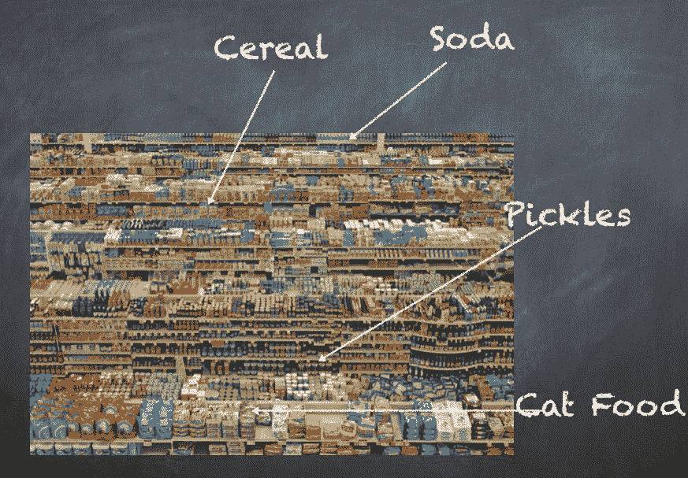

假设杂货店的所有销售数据都存储在某个数据库中，并且您可以访问过去 3 个月的数据。通常，企业会将数据存储多年，因为您需要足够长时间的数据来建立任何假设或观察任何模式。在这个例子中，我们的目标是根据顾客购买产品的方式更好地放置各种过道中的产品。一个假设是，顾客经常购买产品，这些产品既在视线范围内，又彼此靠近。例如，如果牛奶在商店的一个角落，酸奶在商店的另一个角落，一些顾客可能会选择牛奶或酸奶中的任何一种，然后离开商店，导致业务损失。更严重的影响可能导致顾客选择另一家产品摆放更好的商店，因为他们觉得*在这家商店很难找到东西*。一旦这种感觉产生，它也会传播给朋友和家人，最终导致不良的社交影响。这种现象在现实世界中并不罕见，导致一些企业成功，而其他企业失败，尽管它们在产品和价格上似乎非常相似。

有许多方法可以解决这个问题，从客户调查到专业统计学家再到机器学习科学家。我们的方法是仅从销售交易中了解我们可以得到什么。

以下是交易可能看起来像的一个例子：

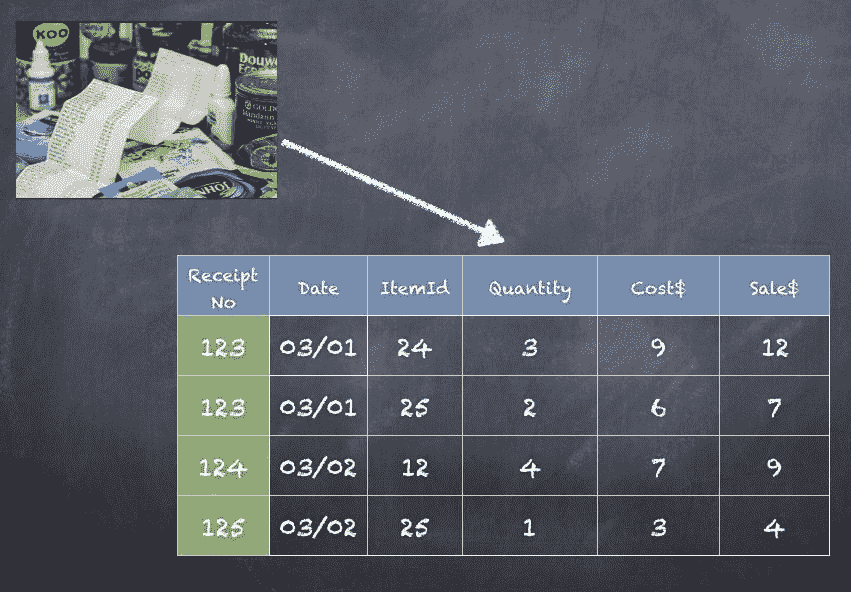

以下是您可以作为 EDA 的一部分遵循的步骤：

1.  计算*每天购买的产品平均数量=一天内所有售出的产品总数/当天的收据总数*。

1.  重复上一步骤，为过去 1 周、1 个月和 1 个季度。

1.  尝试了解周末和工作日之间以及一天中的时间（早上、中午和晚上）是否有差异

1.  对于每种产品，创建一个所有其他产品的列表，以查看通常一起购买哪些产品（同一张收据）

1.  重复上一步骤，为 1 天、1 周、1 个月和 1 个季度。

1.  尝试通过交易数量（按降序排列）确定哪些产品应该靠近放置。

完成了前面的 6 个步骤后，我们可以尝试得出一些 CDA 的结论。

假设这是我们得到的输出：

| **商品** | **星期几** | **数量** |
| --- | --- | --- |
| 牛奶 | 星期日 | 1244 |
| 面包 | 星期一 | 245 |
| 牛奶 | 星期一 | 190 |

在这种情况下，我们可以说**牛奶**在*周末*购买更多，因此最好在周末增加牛奶产品的数量和种类。看一下下表：

| **商品 1** | **商品 2** | **数量** |
| --- | --- | --- |
| 牛奶 | 鸡蛋 | 360 |
| 面包 | 奶酪 | 335 |
| 洋葱 | 西红柿 | 310 |

在这种情况下，我们可以说**牛奶**和**鸡蛋**在一次购买中被*更多*顾客购买，接着是**面包**和**奶酪**。因此，我们建议商店重新调整通道和货架，将**牛奶**和**鸡蛋***靠近*彼此。

我们得出的两个结论是：

+   **牛奶**在*周末*购买更多，因此最好在周末增加牛奶产品的数量和种类。

+   **牛奶**和**鸡蛋**在一次购买中被*更多*顾客购买，接着是**面包**和**奶酪**。因此，我们建议商店重新调整通道和货架，将**牛奶**和**鸡蛋***靠近*彼此。

结论通常会在一段时间内进行跟踪以评估收益。如果在采纳前述两项建议 6 个月后销售额没有显着影响，那么我们只是投资于无法给您良好投资回报率（ROI）的建议。

同样，您也可以进行一些关于利润率和定价优化的分析。这就是为什么您通常会看到单个商品的成本高于购买多个相同商品的平均成本。购买一瓶洗发水 7 美元，或者两瓶洗发水 12 美元。

考虑一下您可以探索和为杂货店推荐的其他方面。例如，您能否根据这些产品对任何特定产品都没有亲和力这一事实，猜测哪些产品应该靠近结账柜台--口香糖、杂志等。

数据分析举措支持各种各样的业务用途。例如，银行和信用卡公司分析取款和消费模式以防止欺诈和身份盗用。广告公司分析网站流量以确定有高转化可能性的潜在客户。百货商店分析客户数据，以确定更好的折扣是否有助于提高销售额。手机运营商可以制定定价策略。有线电视公司不断寻找可能会流失客户的客户，除非给予一些优惠或促销价格来留住他们的客户。医院和制药公司分析数据，以提出更好的产品，并检测处方药的问题或衡量处方药的表现。

# 在数据分析过程中

数据分析应用不仅涉及数据分析。在计划任何分析之前，还需要投入时间和精力来收集、整合和准备数据，检查数据的质量，然后开发、测试和修订分析方法。一旦数据被认为准备就绪，数据分析师和科学家可以使用统计方法（如 SAS）或使用 Spark ML 的机器学习模型来探索和分析数据。数据本身由数据工程团队准备，数据质量团队检查收集的数据。数据治理也成为一个因素，以确保数据的正确收集和保护。另一个不常为人所知的角色是数据监护人，他专门研究数据到字节的理解，确切地了解数据的来源，所有发生的转换，以及业务真正需要的数据列或字段。

企业中的各种实体可能以不同的方式处理地址，例如**123 N Main St**与**123 North Main Street**。但是，我们的分析取决于获取正确的地址字段；否则上述两个地址将被视为不同，我们的分析将无法达到相同的准确性。

分析过程始于根据分析师可能需要的数据仓库中收集数据，收集组织中各种类型的数据（销售、营销、员工、工资单、人力资源等）。数据监护人和治理团队在这里非常重要，以确保收集正确的数据，并且任何被视为机密或私人的信息都不会被意外地导出，即使最终用户都是员工。

社会安全号码或完整地址可能不适合包含在分析中，因为这可能会给组织带来很多问题。

必须建立数据质量流程，以确保收集和工程化的数据是正确的，并且能够满足数据科学家的需求。在这个阶段，主要目标是发现和修复可能影响分析需求准确性的数据质量问题。常见的技术包括对数据进行概要分析和清洗，以确保数据集中的信息是一致的，并且移除任何错误和重复记录。

来自不同来源系统的数据可能需要使用各种数据工程技术进行合并、转换和规范化，例如分布式计算或 MapReduce 编程、流处理或 SQL 查询，然后存储在 Amazon S3、Hadoop 集群、NAS 或 SAN 存储设备上，或者传统的数据仓库，如 Teradata。数据准备或工程工作涉及操纵和组织数据的技术，以满足计划中的分析需求。

一旦数据准备并经过质量检查，并且可供数据科学家或分析师使用，实际的分析工作就开始了。数据科学家现在可以使用预测建模工具和语言，如 SAS、Python、R、Scala、Spark、H2O 等来构建分析模型。模型最初针对部分数据集进行运行，以测试其在*训练阶段*的准确性。在任何分析项目中，训练阶段的多次迭代是常见且预期的。在模型层面进行调整后，或者有时需要到数据监护人那里获取或修复一些被收集或准备的数据，模型的输出往往会变得越来越好。最终，当进一步调整不会明显改变结果时，我们可以认为模型已经准备好投入生产使用。

现在，模型可以针对完整数据集运行，并根据我们训练模型的方式生成结果或成果。在构建分析时所做的选择，无论是统计还是机器学习，都直接影响模型的质量和目的。你不能仅仅通过杂货销售来判断亚洲人是否比墨西哥人购买更多的牛奶，因为这需要来自人口统计数据的额外元素。同样，如果我们的分析侧重于客户体验（产品退货或换货），那么它所基于的技术和模型与我们试图专注于收入或向客户推销产品时是不同的。

您将在后面的章节中看到各种机器学习技术。

因此，分析应用可以利用多种学科、团队和技能集来实现。分析应用可以用于生成报告，甚至自动触发业务行动。例如，你可以简单地创建每天早上 8 点给所有经理发送的每日销售报告。但是，你也可以与业务流程管理应用程序或一些定制的股票交易应用程序集成，以采取行动，如在股票市场上进行买卖或警报活动。你还可以考虑接收新闻文章或社交媒体信息，以进一步影响要做出的决策。

数据可视化是数据分析的重要组成部分，当你看着大量的指标和计算时，很难理解数字。相反，人们越来越依赖商业智能工具，如 Tableau、QlikView 等，来探索和分析数据。当然，像显示全国所有优步车辆或显示纽约市供水的热力图这样的大规模可视化需要构建更多定制应用程序或专门的工具。

在各行各业的许多不同规模的组织中，管理和分析数据一直是一个挑战。企业一直在努力寻找一个实用的方法来获取有关他们的客户、产品和服务的信息。当公司只有少数客户购买少量商品时，这并不困难。随着时间的推移，市场上的公司开始增长。事情变得更加复杂。现在，我们有品牌信息和社交媒体。我们有在互联网上销售和购买的商品。我们需要提出不同的解决方案。网站开发、组织、定价、社交网络和细分；我们处理的数据有很多不同的类型，这使得处理、管理、组织和尝试从数据中获得一些见解变得更加复杂。

# 大数据介绍

在前面的部分中可以看到，数据分析包括探索和分析数据的技术、工具和方法，以产生业务的可量化结果。结果可能是简单的选择商店外观的颜色，也可能是更复杂的客户行为预测。随着企业的发展，越来越多种类的分析出现在画面中。在 20 世纪 80 年代或 90 年代，我们所能得到的只是 SQL 数据仓库中可用的数据；如今，许多外部因素都在影响企业运营的方式。

Twitter、Facebook、亚马逊、Verizon、Macy's 和 Whole Foods 都是利用数据分析来经营业务并基于数据做出许多决策的公司。想想他们可能收集的数据类型、可能收集的数据量，以及他们可能如何使用这些数据。

让我们看一下之前提到的杂货店的例子。如果商店开始扩大业务，建立数百家店铺，那么销售交易将不可避免地需要以比单一店铺多数百倍的规模进行收集和存储。但是，现在没有任何企业是独立运作的。从当地新闻、推特、yelp 评论、客户投诉、调查活动、其他商店的竞争、人口构成的变化，以及当地经济等方面都有大量信息。所有这些额外的数据都可以帮助更好地理解客户行为和收入模型。

例如，如果我们发现关于商店停车设施的负面情绪在增加，那么我们可以分析这一点，并采取纠正措施，比如提供验证停车或与城市公共交通部门协商，提供更频繁的火车或公交车，以便更好地到达。

这种不断增加的数量和多样性的数据，虽然提供了更好的分析，但也给企业 IT 组织存储、处理和分析所有数据带来了挑战。事实上，看到 TB 级别的数据并不罕见。

每天，我们创造超过 2 百万亿字节的数据（2 艾字节），据估计，超过 90%的数据仅在过去几年内生成。

**1 KB = 1024 字节**

**1 MB = 1024 KB**

**1 GB = 1024 MB**

**1 TB = 1024 GB ~ 1,000,000 MB**

**1 PB = 1024 TB ~ 1,000,000 GB ~ 1,000,000,000 MB**

**1 EB = 1024 PB ~ 1,000,000 TB ~ 1,000,000,000 GB ~ 1,000,000,000,000 MB**

自 20 世纪 90 年代以来的大量数据以及理解和理解数据的需求，催生了“大数据”这个术语。

大数据这个跨越计算机科学和统计/计量经济学的术语，可能起源于 20 世纪 90 年代中期 Silicon Graphics 的午餐桌谈话，John Mashey 在其中扮演了重要角色。

2001 年，当时是咨询公司 Meta Group Inc（后来被 Gartner 收购）的分析师的 Doug Laney 提出了 3V（多样性、速度和数量）的概念。现在，我们提到 4 个 V，而不是 3 个 V，增加了数据的真实性到 3 个 V。

# 大数据的 4 个 V

以下是用于描述大数据属性的 4 个 V。

# 数据的多样性

数据可以来自气象传感器、汽车传感器、人口普查数据、Facebook 更新、推文、交易、销售和营销。数据格式既结构化又非结构化。数据类型也可以不同；二进制、文本、JSON 和 XML。

# 数据的速度

数据可以来自数据仓库、批处理文件存档、近实时更新，或者刚刚预订的 Uber 车程的即时实时更新。

# 数据量

数据可以收集和存储一小时、一天、一个月、一年或 10 年。对于许多公司来说，数据的大小正在增长到数百 TB。

# 数据的真实性

数据可以分析出可操作的见解，但由于来自各种数据源的大量数据被分析，确保正确性和准确性证明是非常困难的。

以下是大数据的 4 个 V：

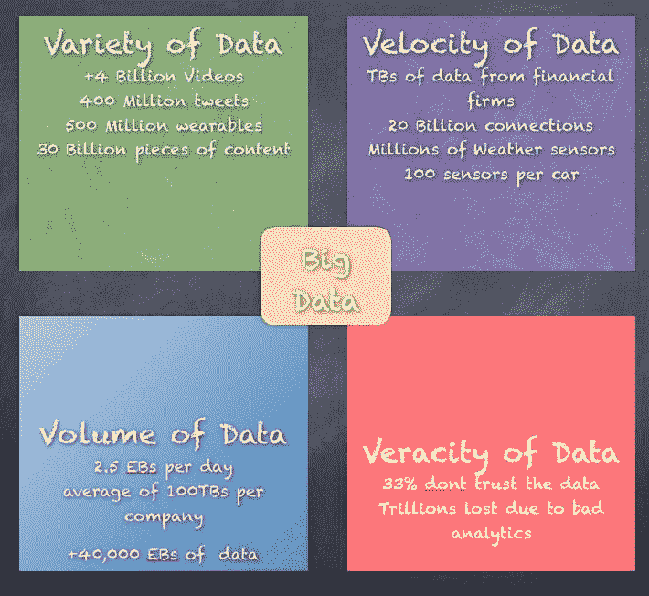

为了理解所有数据并将数据分析应用于大数据，我们需要扩展数据分析的概念，以在更大的规模上处理大数据的 4 个 V。这不仅改变了分析数据所使用的工具、技术和方法，还改变了我们处理问题的方式。如果在 1999 年业务中使用 SQL 数据库来处理数据，现在为了处理同一业务的数据，我们将需要一个可扩展和适应大数据空间细微差别的分布式 SQL 数据库。

大数据分析应用通常包括来自内部系统和外部来源的数据，例如天气数据或第三方信息服务提供商编制的有关消费者的人口统计数据。此外，流式分析应用在大数据环境中变得常见，因为用户希望对通过 Spark 的 Spark 流模块或其他开源流处理引擎（如 Flink 和 Storm）输入 Hadoop 系统的数据进行实时分析。

早期的大数据系统大多部署在大型组织的内部，这些组织正在收集、组织和分析大量数据。但云平台供应商，如亚马逊网络服务（AWS）和微软，已经让在云中设置和管理 Hadoop 集群变得更加容易，Hadoop 供应商，如 Cloudera 和 Hortonworks，也支持它们在 AWS 和微软 Azure 云上的大数据框架分发。用户现在可以在云中启动集群，运行所需的时间，然后将其下线，使用基于使用量的定价，无需持续的软件许可证。

在大数据分析项目中可能会遇到的潜在问题包括缺乏内部分析技能以及雇佣经验丰富的数据科学家和数据工程师的高成本来填补这些空缺。

通常涉及的数据量及其多样性可能会导致数据管理问题，包括数据质量、一致性和治理；此外，在大数据架构中使用不同平台和数据存储可能会导致数据孤立。此外，将 Hadoop、Spark 和其他大数据工具集成到满足组织大数据分析需求的统一架构中对许多 IT 和分析团队来说是一个具有挑战性的任务，他们必须确定合适的技术组合，然后将各个部分组合在一起。

# 使用 Apache Hadoop 进行分布式计算

我们的世界充满了各种设备，从智能冰箱、智能手表、手机、平板电脑、笔记本电脑、机场的信息亭、向您提供现金的 ATM 等等。我们能够做一些我们几年前无法想象的事情。Instagram、Snapchat、Gmail、Facebook、Twitter 和 Pinterest 是我们现在如此习惯的一些应用程序；很难想象一天没有访问这些应用程序。

随着云计算的出现，我们能够通过几次点击在 AWS、Azure（微软）或 Google Cloud 等平台上启动数百甚至数千台机器，并利用巨大的资源实现各种业务目标。

云计算为我们引入了 IaaS、PaaS 和 SaaS 的概念，使我们能够构建和运营满足各种用例和业务需求的可扩展基础设施。

**IaaS**（基础设施即服务）-提供可靠的托管硬件，无需数据中心、电源线、空调等。

**PaaS**（平台即服务）-在 IaaS 之上，提供 Windows、Linux、数据库等托管平台。

**SaaS**（软件即服务）-在 SaaS 之上，为每个人提供 SalesForce、[Kayak.com](https://www.kayak.co.in/?ispredir=true)等托管服务。

幕后是高度可扩展的分布式计算世界，这使得存储和处理 PB（百万亿字节）数据成为可能。

1 艾克萨字节=1024 百万亿字节（5000 万部蓝光电影）

1 PB=1024 TB（50,000 部蓝光电影）

1 TB=1024 GB（50 部蓝光电影）

电影蓝光光盘的平均大小约为 20 GB

现在，分布式计算范式并不是一个真正全新的话题，几十年来一直在研究机构以及一些商业产品公司主要进行研究和追求。**大规模并行处理**（MPP）是几十年前在海洋学、地震监测和太空探索等领域使用的一种范式。很多公司如 Teradata 也实施了 MPP 平台并提供商业产品和应用。最终，谷歌、亚马逊等科技公司推动了可扩展分布式计算这一小众领域的新阶段，最终导致了伯克利大学创建了 Apache Spark。

谷歌发表了关于**Map Reduce**（MR）以及**Google File System**（GFS）的论文，将分布式计算原理带给了每个人。当然，应该给予 Doug Cutting 应有的赞誉，他通过实施谷歌白皮书中的概念并向世界介绍 Hadoop，使这一切成为可能。

Apache Hadoop 框架是用 Java 编写的开源软件框架。框架提供的两个主要领域是存储和处理。对于存储，Apache Hadoop 框架使用基于 2003 年 10 月发布的 Google 文件系统论文的 Hadoop 分布式文件系统（HDFS）。对于处理或计算，该框架依赖于基于 2004 年 12 月发布的 Google 关于 MR 的论文的 MapReduce。

MapReduce 框架从 V1（基于作业跟踪器和任务跟踪器）发展到 V2（基于 YARN）。

# Hadoop 分布式文件系统（HDFS）

HDFS 是用 Java 实现的软件文件系统，位于本地文件系统之上。HDFS 背后的主要概念是将文件分成块（通常为 128 MB），而不是将整个文件处理。这允许许多功能，例如分布、复制、故障恢复，更重要的是使用多台机器对块进行分布式处理。

块大小可以是 64 MB、128 MB、256 MB 或 512 MB，适合任何目的。对于具有 128 MB 块的 1 GB 文件，将有 1024 MB / 128 MB = 8 个块。如果考虑复制因子为 3，这将使其成为 24 个块。

HDFS 提供了具有容错和故障恢复功能的分布式存储系统。HDFS 有两个主要组件：NameNode 和 DataNode。NameNode 包含文件系统所有内容的所有元数据。DataNode 连接到 NameNode，并依赖于 NameNode 提供有关文件系统内容的所有元数据信息。如果 NameNode 不知道任何信息，DataNode 将无法将其提供给任何想要读取/写入 HDFS 的客户端。

以下是 HDFS 架构：

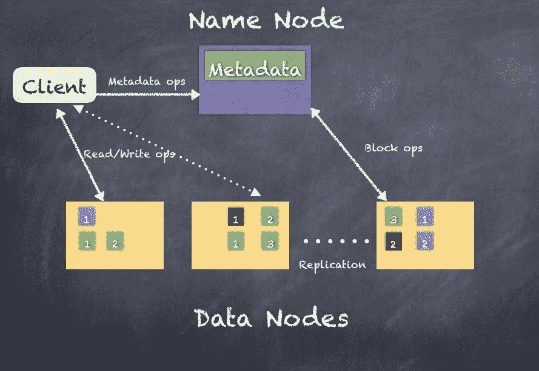

NameNode 和 DataNode 都是 JVM 进程，因此任何支持 Java 的机器都可以运行 NameNode 或 DataNode 进程。只有一个 NameNode（如果计算 HA 部署，则还会有第二个 NameNode），但有 100 个或 1000 个 DataNode。

不建议拥有 1000 个 DataNode，因为来自所有 DataNode 的所有操作都会倾向于在具有大量数据密集型应用程序的真实生产环境中压倒 NameNode。

在集群中存在一个 NameNode 极大地简化了系统的架构。NameNode 是 HDFS 元数据的仲裁者和存储库，任何想要读取/写入数据的客户端都首先与 NameNode 联系以获取元数据信息。数据永远不会直接流经 NameNode，这允许 1 个 NameNode 管理 100 个 DataNode（PB 级数据）。

HDFS 支持传统的分层文件组织，具有类似于大多数其他文件系统的目录和文件。您可以创建、移动和删除文件和目录。NameNode 维护文件系统命名空间，并记录文件系统的所有更改和状态。应用程序可以指定 HDFS 应该维护的文件副本数量，这些信息也由 NameNode 存储。

HDFS 旨在以分布式方式可靠存储非常大的文件，跨大型数据节点集群中的机器进行存储。为了处理复制、容错以及分布式计算，HDFS 将每个文件存储为一系列块。

NameNode 对块的复制做出所有决定。这主要取决于集群中每个 DataNode 定期在心跳间隔处接收的块报告。块报告包含 DataNode 上所有块的列表，然后 NameNode 将其存储在其元数据存储库中。

NameNode 将所有元数据存储在内存中，并为从/写入 HDFS 的客户端提供所有请求。但是，由于这是维护有关 HDFS 的所有元数据的主节点，因此维护一致且可靠的元数据信息至关重要。如果丢失此信息，则无法访问 HDFS 上的内容。

为此，HDFS NameNode 使用称为 EditLog 的事务日志，该日志持久记录文件系统元数据发生的每个更改。创建新文件会更新 EditLog，移动文件或重命名文件，或删除文件也会如此。整个文件系统命名空间，包括块到文件的映射和文件系统属性，都存储在一个名为`FsImage`的文件中。**NameNode**也将所有内容保存在内存中。当 NameNode 启动时，它加载 EditLog 和`FsImage`，并初始化自身以设置 HDFS。

然而，DataNodes 对于 HDFS 一无所知，完全依赖于存储的数据块。DataNodes 完全依赖于 NameNode 执行任何操作。即使客户端想要连接以读取文件或写入文件，也是 NameNode 告诉客户端要连接到哪里。

# HDFS 高可用性

HDFS 是一个主从集群，其中 NameNode 是主节点，而 DataNodes 是从节点，如果不是数百，就是数千个，由主节点管理。这在集群中引入了**单点故障**（**SPOF**），因为如果主 NameNode 因某种原因而崩溃，整个集群将无法使用。HDFS 1.0 支持另一个称为**Secondary NameNode**的附加主节点，以帮助恢复集群。这是通过维护文件系统的所有元数据的副本来完成的，绝不是一个需要手动干预和维护工作的高可用系统。HDFS 2.0 通过添加对完整**高可用性**（**HA**）的支持将其提升到下一个级别。

HA 通过将两个 NameNode 设置为主备模式来工作，其中一个 NameNode 是活动的，另一个是被动的。当主 NameNode 发生故障时，被动 NameNode 将接管主节点的角色。

以下图表显示了主备 NameNode 对的部署方式：

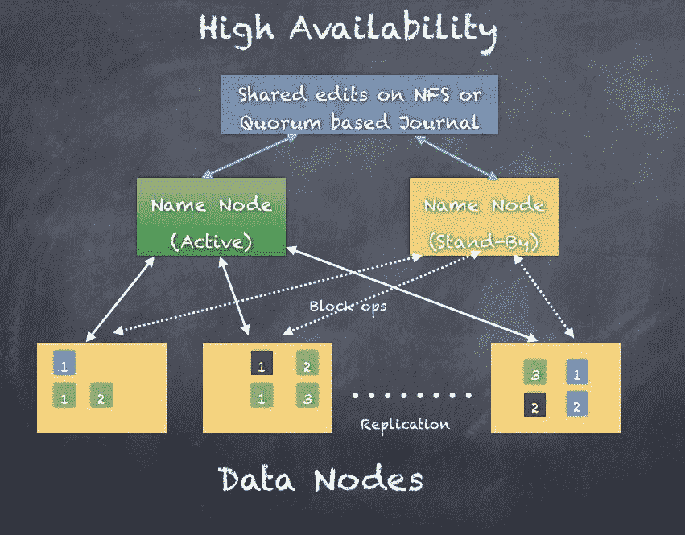

# HDFS 联邦

HDFS 联邦是使用多个名称节点来分布文件系统命名空间的一种方式。与最初的 HDFS 版本不同，最初的 HDFS 版本仅使用单个 NameNode 管理整个集群，随着集群规模的增长，这种方式并不那么可扩展，HDFS 联邦可以支持规模显著更大的集群，并且可以使用多个联邦名称节点水平扩展 NameNode 或名称服务。请看下面的图表：

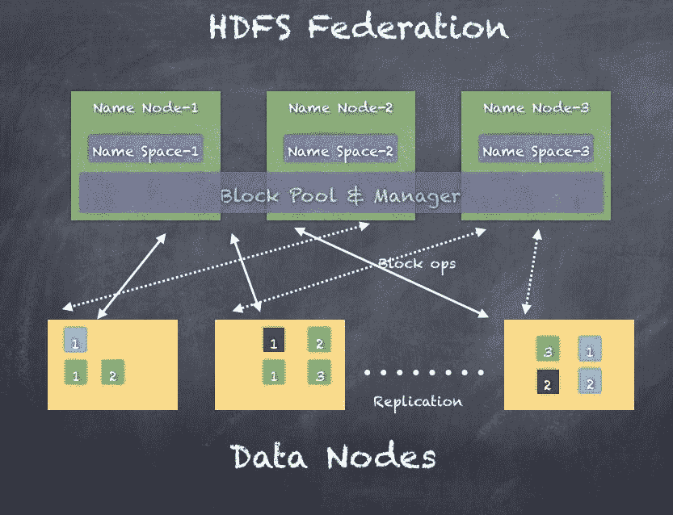

# HDFS 快照

Hadoop 2.0 还增加了一个新功能：对存储在数据节点上的文件系统（数据块）进行快照（只读副本和写时复制）。使用快照，可以使用 NameNode 的数据块元数据无缝地对目录进行快照。快照创建是瞬时的，不需要干预其他常规 HDFS 操作。

以下是快照在特定目录上的工作原理的示例：

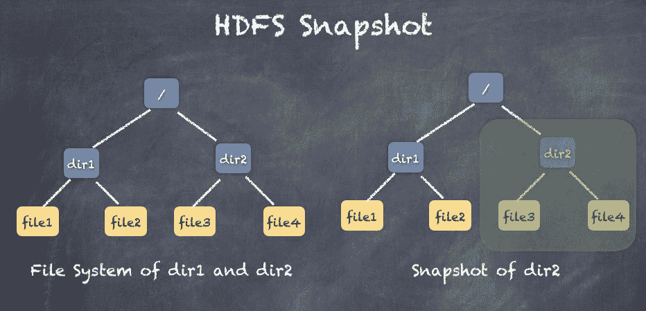

# HDFS 读取

客户端连接到 NameNode，并使用文件名询问文件。NameNode 查找文件的块位置并将其返回给客户端。然后客户端可以连接到 DataNodes 并读取所需的块。NameNode 不参与数据传输。

以下是客户端的读取请求流程。首先，客户端获取位置，然后从 DataNodes 拉取块。如果 DataNode 在中途失败，客户端将从另一个 DataNode 获取块的副本。

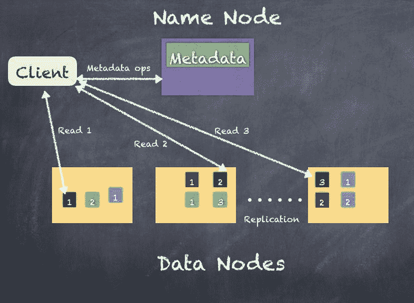

# HDFS 写入

客户端连接到 NameNode，并要求 NameNode 让其写入 HDFS。NameNode 查找信息并计划块、用于存储块的 Data Nodes 以及要使用的复制策略。NameNode 不处理任何数据，只告诉客户端在哪里写入。一旦第一个 DataNode 接收到块，根据复制策略，NameNode 告诉第一个 DataNode 在哪里复制。因此，从客户端接收的 DataNode 将块发送到第二个 DataNode（应该写入块的副本所在的地方），然后第二个 DataNode 将其发送到第三个 DataNode（如果复制因子为 3）。

以下是来自客户端的写入请求的流程。首先，客户端获取位置，然后写入第一个 DataNode。接收块的 DataNode 将块复制到应该保存块副本的 DataNodes。这对从客户端写入的所有块都是如此。如果一个 DataNode 在中间失败，那么块将根据 NameNode 确定的另一个 DataNode 进行复制。

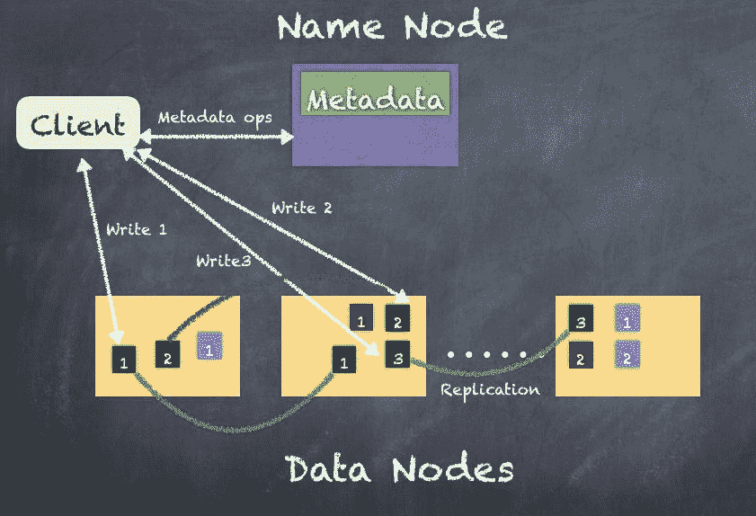

到目前为止，我们已经看到 HDFS 使用块、NameNode 和 DataNodes 提供了分布式文件系统。一旦数据存储在 PB 规模，实际处理数据以满足业务的各种用例也变得非常重要。

MapReduce 框架是在 Hadoop 框架中创建的，用于执行分布式计算。我们将在下一节中进一步讨论这个问题。

# MapReduce 框架

**MapReduce** (**MR**)框架使您能够编写分布式应用程序，以可靠和容错的方式处理来自文件系统（如 HDFS）的大量数据。当您想要使用 MapReduce 框架处理数据时，它通过创建一个作业来运行框架以执行所需的任务。

MapReduce 作业通常通过在多个工作节点上运行**Mapper**任务并行地分割输入数据来工作。此时，无论是在 HDFS 级别发生的任何故障，还是 Mapper 任务的故障，都会自动处理以实现容错。一旦 Mapper 完成，结果就会通过网络复制到运行**Reducer**任务的其他机器上。

理解这个概念的一个简单方法是想象你和你的朋友想要把一堆水果分成盒子。为此，你想要指派每个人的任务是去处理一个原始的水果篮子（全部混在一起），并将水果分成不同的盒子。然后每个人都用同样的方法处理这个水果篮子。

最后，你最终会得到很多盒子水果，都是来自你的朋友。然后，你可以指派一个小组将相同种类的水果放在一起放进一个盒子里，称重，封箱以便运输。

以下描述了将水果篮子拿来按水果类型分类的想法：

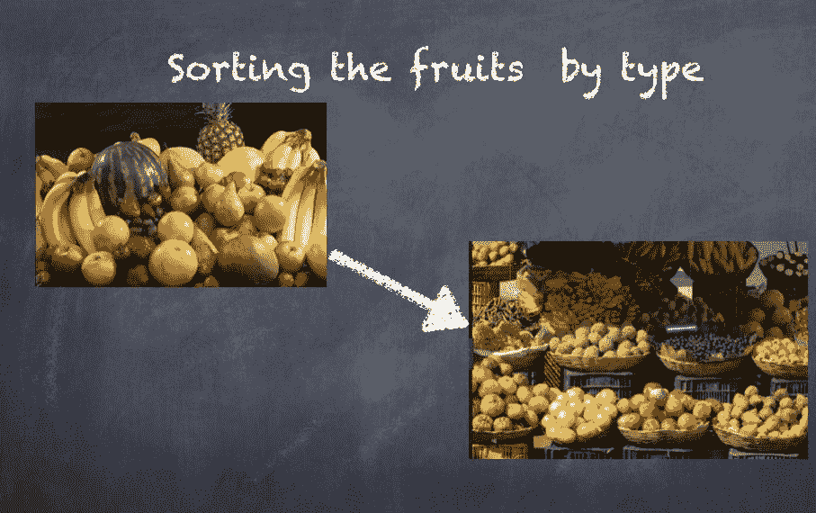

MapReduce 框架由一个资源管理器和多个节点管理器组成（通常节点管理器与 HDFS 的数据节点共存）。当应用程序想要运行时，客户端启动应用程序主管，然后与资源管理器协商以获取容器形式的集群资源。

容器表示分配给单个节点用于运行任务和进程的 CPU（核心）和内存。容器由节点管理器监督，并由资源管理器调度。

容器的示例：

1 核+4GB RAM

2 核+6GB RAM

4 核+20GB RAM

一些容器被分配为 Mappers，其他容器被分配为 Reducers；所有这些都由应用程序主管与资源管理器协调。这个框架被称为**Yet Another Resource Negotiator** (**YARN**)

以下是 YARN 的描述：

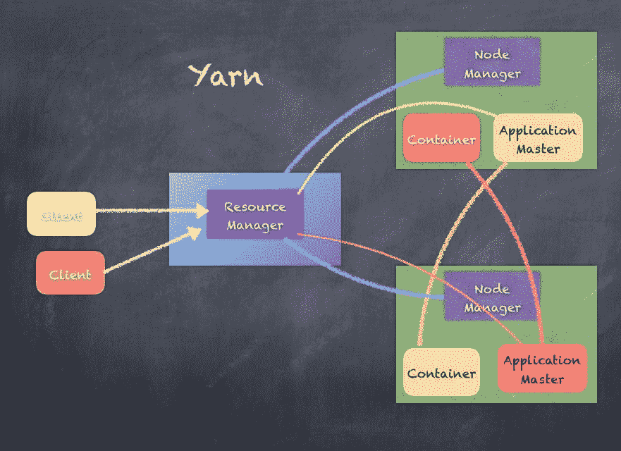

展示 MapReduce 框架工作的一个经典例子是单词计数示例。以下是处理输入数据的各个阶段，首先是将输入分割到多个工作节点，最后生成单词计数的输出：

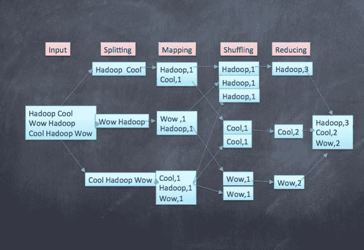

尽管 MapReduce 框架在全球范围内非常成功，并且已被大多数公司采用，但它确实遇到了问题，主要是因为它处理数据的方式。已经出现了几种技术来尝试使 MapReduce 更易于使用，例如 Hive 和 Pig，但复杂性仍然存在。

Hadoop MapReduce 有一些限制，例如：

+   由于基于磁盘的处理而导致性能瓶颈

+   批处理无法满足所有需求

+   编程可能冗长复杂

+   任务调度速度慢，因为资源的重复利用不多

+   没有很好的实时事件处理方式

+   机器学习太慢，因为通常 ML 涉及迭代处理，而 MR 对此太慢

Hive 是 Facebook 创建的 MR 的类似 SQL 接口。Pig 是 Yahoo 创建的 MR 的脚本接口。此外，还有一些增强功能，如 Tez（Hortonworks）和 LLAP（Hive2.x），它们利用内存优化来规避 MapReduce 的限制。

在下一节中，我们将看一下 Apache Spark，它已经解决了 Hadoop 技术的一些限制。

# Apache Spark 来了

Apache Spark 是一个统一的分布式计算引擎，可跨不同的工作负载和平台进行连接。Spark 可以连接到不同的平台，并使用各种范例处理不同的数据工作负载，如 Spark 流式处理、Spark ML、Spark SQL 和 Spark GraphX。

Apache Spark 是一个快速的内存数据处理引擎，具有优雅和富有表现力的开发 API，允许数据工作者高效执行流式机器学习或 SQL 工作负载，需要快速交互式访问数据集。Apache Spark 由 Spark 核心和一组库组成。核心是分布式执行引擎，Java、Scala 和 Python API 提供了分布式应用程序开发的平台。在核心之上构建的其他库允许流式、SQL、图处理和机器学习工作负载。例如，Spark ML 专为数据科学而设计，其抽象使数据科学更容易。

Spark 提供实时流式处理、查询、机器学习和图处理。在 Apache Spark 之前，我们必须使用不同的技术来处理不同类型的工作负载，一个用于批量分析，一个用于交互式查询，一个用于实时流处理，另一个用于机器学习算法。然而，Apache Spark 可以只使用 Apache Spark 来完成所有这些工作，而不是使用不一定总是集成的多种技术。

使用 Apache Spark，可以处理各种类型的工作负载，Spark 还支持 Scala、Java、R 和 Python 作为编写客户端程序的手段。

Apache Spark 是一个开源的分布式计算引擎，相对于 MapReduce 范式具有关键优势：

+   尽可能使用内存处理

+   通用引擎用于批处理、实时工作负载

+   与 YARN 和 Mesos 兼容

+   与 HBase、Cassandra、MongoDB、HDFS、Amazon S3 和其他文件系统和数据源良好集成

Spark 是 2009 年在伯克利创建的，是构建 Mesos 的项目的结果，Mesos 是一个支持不同类型的集群计算系统的集群管理框架。看一下下表：

| 版本 | 发布日期 | 里程碑 |
| --- | --- | --- |
| 0.5 | 2012-10-07 | 非生产使用的第一个可用版本 |
| 0.6 | 2013-02-07 | 各种更改的点版本发布 |
| 0.7 | 2013-07-16 | 各种更改的点版本发布 |
| 0.8 | 2013-12-19 | 各种更改的点版本发布 |
| 0.9 | 2014-07-23 | 各种更改的点版本发布 |
| 1.0 | 2014-08-05 | 第一个生产就绪，向后兼容的发布。Spark Batch，Streaming，Shark，MLLib，GraphX |
| 1.1 | 2014-11-26 | 各种变更的点发布 |
| 1.2 | 2015-04-17 | 结构化数据，SchemaRDD（后来演变为 DataFrames） |
| 1.3 | 2015-04-17 | 提供统一的 API 来从结构化和半结构化源读取的 API |
| 1.4 | 2015-07-15 | SparkR，DataFrame API，Tungsten 改进 |
| 1.5 | 2015-11-09 | 各种变更的点发布 |
| 1.6 | 2016-11-07 | 引入数据集 DSL |
| 2.0 | 2016-11-14 | DataFrames 和 Datasets API 作为机器学习、结构化流处理、SparkR 改进的基本层。 |
| 2.1 | 2017-05-02 | 事件时间水印，机器学习，GraphX 改进 |

2.2 已于 2017-07-11 发布，其中有几项改进，特别是结构化流处理现在是 GA。

Spark 是一个分布式计算平台，具有几个特点：

+   通过简单的 API 在多个节点上透明地处理数据

+   具有弹性处理故障

+   根据需要将数据溢出到磁盘，尽管主要使用内存

+   支持 Java，Scala，Python，R 和 SQL API

+   相同的 Spark 代码可以独立运行，在 Hadoop YARN，Mesos 和云中

Scala 的特性，如隐式，高阶函数，结构化类型等，使我们能够轻松构建 DSL，并将其与语言集成。

Apache Spark 不提供存储层，并依赖于 HDFS 或 Amazon S3 等。因此，即使将 Apache Hadoop 技术替换为 Apache Spark，仍然需要 HDFS 来提供可靠的存储层。

Apache Kudu 提供了 HDFS 的替代方案，Apache Spark 和 Kudu 存储层之间已经有集成，进一步解耦了 Apache Spark 和 Hadoop 生态系统。

Hadoop 和 Apache Spark 都是流行的大数据框架，但它们实际上并不提供相同的功能。虽然 Hadoop 提供了分布式存储和 MapReduce 分布式计算框架，但 Spark 则是一个在其他技术提供的分布式数据存储上运行的数据处理框架。

Spark 通常比 MapReduce 快得多，因为它处理数据的方式不同。MapReduce 使用磁盘操作来操作拆分，而 Spark 比 MapReduce 更有效地处理数据集，Apache Spark 性能改进的主要原因是高效的堆外内存处理，而不仅仅依赖于基于磁盘的计算。

如果您的数据操作和报告需求大部分是静态的，并且可以使用批处理来满足您的需求，那么 MapReduce 的处理方式可能足够了，但是如果您需要对流数据进行分析，或者您的处理需求需要多阶段处理逻辑，那么您可能会选择 Spark。

Spark 堆栈中有三层。底层是集群管理器，可以是独立的，YARN 或 Mesos。

使用本地模式，您不需要集群管理器来处理。

在集群管理器之上的中间层是 Spark 核心层，它提供了执行任务调度和与存储交互的所有基础 API。

顶部是在 Spark 核心之上运行的模块，如 Spark SQL 提供交互式查询，Spark streaming 用于实时分析，Spark ML 用于机器学习，Spark GraphX 用于图处理。

这三层分别是：

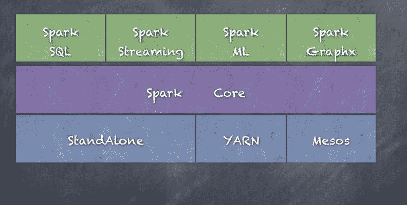

如前图所示，各种库（如 Spark SQL，Spark streaming，Spark ML 和 GraphX）都位于 Spark 核心之上，而 Spark 核心位于中间层。底层显示了各种集群管理器选项。

现在让我们简要地看一下每个组件：

# Spark 核心

Spark 核心是构建在其上的所有其他功能的基础通用执行引擎。Spark 核心包含运行作业所需的基本 Spark 功能，并且其他组件需要这些功能。它提供了内存计算和引用外部存储系统中的数据集，最重要的是**弹性分布式数据集**（**RDD**）。

此外，Spark 核心包含访问各种文件系统（如 HDFS、Amazon S3、HBase、Cassandra、关系数据库等）的逻辑。Spark 核心还提供了支持网络、安全、调度和数据洗牌的基本功能，以构建一个高可伸缩、容错的分布式计算平台。

我们在第六章 *开始使用 Spark - REPL*和 RDDs 以及第七章 *特殊 RDD 操作*中详细介绍了 Spark 核心。

在许多用例中，构建在 RDD 之上并由 Spark SQL 引入的 DataFrame 和数据集现在正在成为 RDD 的标准。就处理完全非结构化数据而言，RDD 仍然更灵活，但在未来，数据集 API 可能最终成为核心 API。

# Spark SQL

Spark SQL 是 Spark 核心之上的一个组件，引入了一个名为**SchemaRDD**的新数据抽象，它提供对结构化和半结构化数据的支持。Spark SQL 提供了用于操作大型分布式结构化数据集的函数，使用 Spark 和 Hive QL 支持的 SQL 子集。Spark SQL 通过 DataFrame 和数据集简化了对结构化数据的处理，作为 Tungsten 计划的一部分，它在更高的性能水平上运行。Spark SQL 还支持从各种结构化格式和数据源（文件、parquet、orc、关系数据库、Hive、HDFS、S3 等）读取和写入数据。Spark SQL 提供了一个名为**Catalyst**的查询优化框架，以优化所有操作以提高速度（与 RDD 相比，Spark SQL 快几倍）。Spark SQL 还包括一个 Thrift 服务器，可以被外部系统使用，通过经典的 JDBC 和 ODBC 协议通过 Spark SQL 查询数据。

我们在第八章 *引入一点结构 - Spark SQL*中详细介绍了 Spark SQL。

# Spark 流处理

Spark 流处理利用 Spark 核心的快速调度能力，通过从各种来源（如 HDFS、Kafka、Flume、Twitter、ZeroMQ、Kinesis 等）摄取实时流数据来执行流式分析。Spark 流处理使用数据的微批处理来处理数据，并且使用称为 DStreams 的概念，Spark 流处理可以在 RDD 上操作，将转换和操作应用于 Spark 核心 API 中的常规 RDD。Spark 流处理操作可以使用各种技术自动恢复失败。Spark 流处理可以与其他 Spark 组件结合在一个程序中，将实时处理与机器学习、SQL 和图操作统一起来。

我们在第九章 *Stream Me Up, Scotty - Spark Streaming*中详细介绍了 Spark 流处理。

此外，新的 Structured Streaming API 使得 Spark 流处理程序更类似于 Spark 批处理程序，并且还允许在流数据之上进行实时查询，这在 Spark 2.0+之前的 Spark 流处理库中是复杂的。

# Spark GraphX

GraphX 是在 Spark 之上的分布式图形处理框架。图形是由顶点和连接它们的边组成的数据结构。GraphX 提供了用于构建图形的函数，表示为图形 RDD。它提供了一个 API，用于表达可以使用 Pregel 抽象 API 模拟用户定义的图形的图形计算。它还为此抽象提供了优化的运行时。GraphX 还包含图论中最重要的算法的实现，例如 PageRank、连通组件、最短路径、SVD++等。

我们在第十章中详细介绍了 Spark Graphx，*一切都连接在一起-GraphX*。

一个名为 GraphFrames 的新模块正在开发中，它使使用基于 DataFrame 的图形处理变得更加容易。GraphX 对 RDDs 的作用类似于 GraphFrames 对 DataFrame/数据集的作用。此外，目前这与 GraphX 是分开的，并且预计在未来将支持 GraphX 的所有功能，届时可能会切换到 GraphFrames。

# Spark ML

MLlib 是在 Spark 核心之上的分布式机器学习框架，处理用于转换 RDD 形式的数据集的机器学习模型。Spark MLlib 是一个机器学习算法库，提供各种算法，如逻辑回归、朴素贝叶斯分类、支持向量机（SVMs）、决策树、随机森林、线性回归、交替最小二乘法（ALS）和 k 均值聚类。Spark ML 与 Spark 核心、Spark 流、Spark SQL 和 GraphX 集成非常好，提供了一个真正集成的平台，其中数据可以是实时的或批处理的。

我们在第十一章中详细介绍了 Spark ML，*学习机器学习-Spark MLlib 和 ML*。

此外，PySpark 和 SparkR 也可用作与 Spark 集群交互并使用 Python 和 R API 的手段。Python 和 R 的集成真正为数据科学家和机器学习建模者打开了 Spark，因为一般数据科学家使用的最常见的语言是 Python 和 R。这也是 Spark 支持 Python 集成和 R 集成的原因，以避免学习 Scala 这种新语言的成本。另一个原因是可能存在大量用 Python 和 R 编写的现有代码，如果我们可以利用其中的一些代码，那将提高团队的生产力，而不是从头开始构建所有内容。

越来越多的人开始使用 Jupyter 和 Zeppelin 等笔记本技术，这使得与 Spark 进行交互变得更加容易，特别是在 Spark ML 中，预计会有很多假设和分析。

# PySpark

PySpark 使用基于 Python 的`SparkContext`和 Python 脚本作为任务，然后使用套接字和管道来执行进程，以在基于 Java 的 Spark 集群和 Python 脚本之间进行通信。PySpark 还使用`Py4J`，这是一个在 PySpark 中集成的流行库，它让 Python 动态地与基于 Java 的 RDD 进行交互。

在运行 Spark 执行程序的所有工作节点上必须安装 Python。

以下是 PySpark 通过在 Java 进程和 Python 脚本之间进行通信的方式：

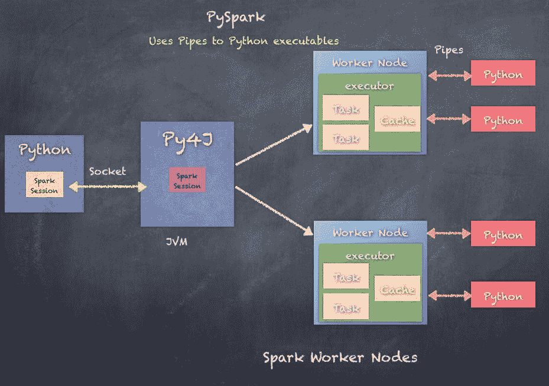

# SparkR

`SparkR`是一个 R 包，提供了一个轻量级的前端，用于从 R 中使用 Apache Spark。SparkR 提供了一个分布式数据框架实现，支持诸如选择、过滤、聚合等操作。SparkR 还支持使用 MLlib 进行分布式机器学习。SparkR 使用基于 R 的`SparkContext`和 R 脚本作为任务，然后使用 JNI 和管道来执行进程，以在基于 Java 的 Spark 集群和 R 脚本之间进行通信。

在运行 Spark 执行程序的所有工作节点上必须安装 R。

以下是 SparkR 通过在 Java 进程和 R 脚本之间进行通信的方式：

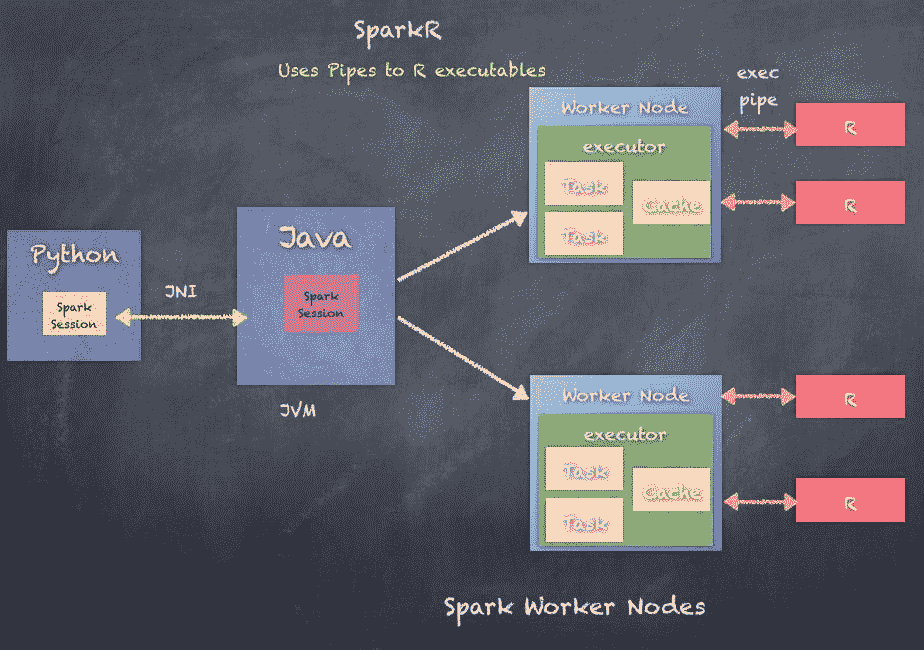

# 总结

我们探讨了 Hadoop 和 MapReduce 框架的演变，并讨论了 YARN、HDFS 概念、HDFS 读写、关键特性以及挑战。然后，我们讨论了 Apache Spark 的演变，为什么首次创建了 Apache Spark，以及它可以为大数据分析和处理的挑战带来的价值。

最后，我们还瞥见了 Apache Spark 中的各种组件，即 Spark 核心、Spark SQL、Spark 流处理、Spark GraphX 和 Spark ML，以及 PySpark 和 SparkR 作为将 Python 和 R 语言代码与 Apache Spark 集成的手段。

现在我们已经了解了大数据分析、Hadoop 分布式计算平台的空间和演变，以及 Apache Spark 的最终发展，以及 Apache Spark 如何解决一些挑战的高层概述，我们准备开始学习 Spark 以及如何在我们的用例中使用它。

在下一章中，我们将更深入地了解 Apache Spark，并开始深入了解它的工作原理，《第六章》*开始使用 Spark - REPL 和 RDDs*。
