# 第六章：开始使用 Spark - REPL 和 RDDs

“所有这些现代技术只是让人们试图一次做所有事情。”

- 比尔·沃特森

在本章中，您将了解 Spark 的工作原理；然后，您将介绍 RDDs，这是 Apache Spark 背后的基本抽象，并且您将了解它们只是暴露类似 Scala 的 API 的分布式集合。然后，您将看到如何下载 Spark 以及如何通过 Spark shell 在本地运行它。

简而言之，本章将涵盖以下主题：

+   深入了解 Apache Spark

+   Apache Spark 安装

+   介绍 RDDs

+   使用 Spark shell

+   操作和转换

+   缓存

+   加载和保存数据

# 深入了解 Apache Spark

Apache Spark 是一个快速的内存数据处理引擎，具有优雅和富有表现力的开发 API，允许数据工作者高效地执行流式机器学习或 SQL 工作负载，这些工作负载需要对数据集进行快速交互式访问。Apache Spark 由 Spark 核心和一组库组成。核心是分布式执行引擎，Java，Scala 和 Python API 提供了分布式应用程序开发的平台。

构建在核心之上的附加库允许流处理，SQL，图处理和机器学习的工作负载。例如，SparkML 专为数据科学而设计，其抽象使数据科学变得更容易。

为了计划和执行分布式计算，Spark 使用作业的概念，该作业在工作节点上使用阶段和任务执行。Spark 由驱动程序组成，该驱动程序在工作节点集群上协调执行。驱动程序还负责跟踪所有工作节点以及每个工作节点当前执行的工作。

让我们更深入地了解一下各个组件。关键组件是 Driver 和 Executors，它们都是 JVM 进程（Java 进程）：

+   **Driver**：Driver 程序包含应用程序，主程序。如果您使用 Spark shell，那就成为了 Driver 程序，并且 Driver 在整个集群中启动执行者，并且还控制任务的执行。

+   **Executor**：接下来是执行者，它们是在集群中的工作节点上运行的进程。在执行者内部，运行单个任务或计算。每个工作节点中可能有一个或多个执行者，同样，每个执行者内部可能有多个任务。当 Driver 连接到集群管理器时，集群管理器分配资源来运行执行者。

集群管理器可以是独立的集群管理器，YARN 或 Mesos。

**集群管理器**负责在形成集群的计算节点之间进行调度和资源分配。通常，这是通过具有了解和管理资源集群的管理进程来完成的，并将资源分配给请求进程，例如 Spark。我们将在接下来的章节中更深入地了解三种不同的集群管理器：独立，YARN 和 Mesos。

以下是 Spark 在高层次上的工作方式：

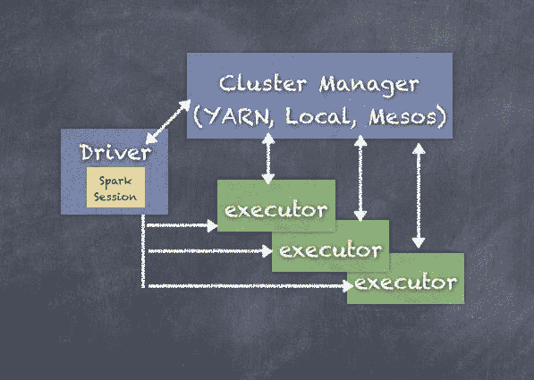

Spark 程序的主要入口点称为`SparkContext`。 `SparkContext`位于**Driver**组件内部，表示与集群的连接以及运行调度器和任务分发和编排的代码。

在 Spark 2.x 中，引入了一个名为`SparkSession`的新变量。 `SparkContext`，`SQLContext`和`HiveContext`现在是`SparkSession`的成员变量。

当启动**Driver**程序时，使用`SparkContext`向集群发出命令，然后**executors**将执行指令。执行完成后，**Driver**程序完成作业。此时，您可以发出更多命令并执行更多作业。

保持和重用`SparkContext`的能力是 Apache Spark 架构的一个关键优势，与 Hadoop 框架不同，Hadoop 框架中每个`MapReduce`作业或 Hive 查询或 Pig 脚本都需要从头开始进行整个处理，而且使用昂贵的磁盘而不是内存。

`SparkContext`可用于在集群上创建 RDD、累加器和广播变量。每个 JVM/Java 进程只能有一个活动的`SparkContext`。在创建新的`SparkContext`之前，必须`stop()`活动的`SparkContext`。

**Driver**解析代码，并将字节级代码序列化传输到执行者以执行。当我们进行任何计算时，实际上是每个节点在本地级别使用内存处理进行计算。

解析代码并规划执行的过程是由**Driver**进程实现的关键方面。

以下是 Spark **Driver**如何协调整个集群上的计算：

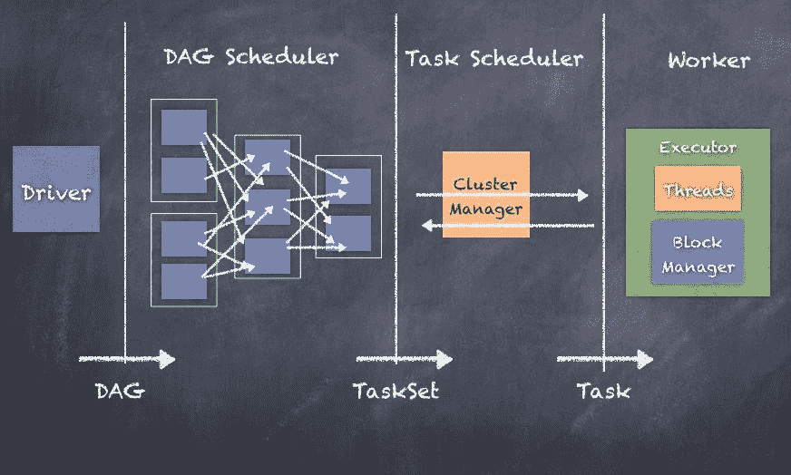

**有向无环图**（**DAG**）是 Spark 框架的秘密武器。**Driver**进程为您尝试使用分布式处理框架运行的代码创建任务的 DAG。然后，任务调度程序通过与**集群管理器**通信以获取资源来运行执行者，实际上按阶段和任务执行 DAG。DAG 代表一个作业，作业被分割成子集，也称为阶段，每个阶段使用一个核心作为任务执行。

一个简单作业的示例以及 DAG 如何分割成阶段和任务的示意图如下两个图示；第一个显示作业本身，第二个图表显示作业中的阶段和任务：

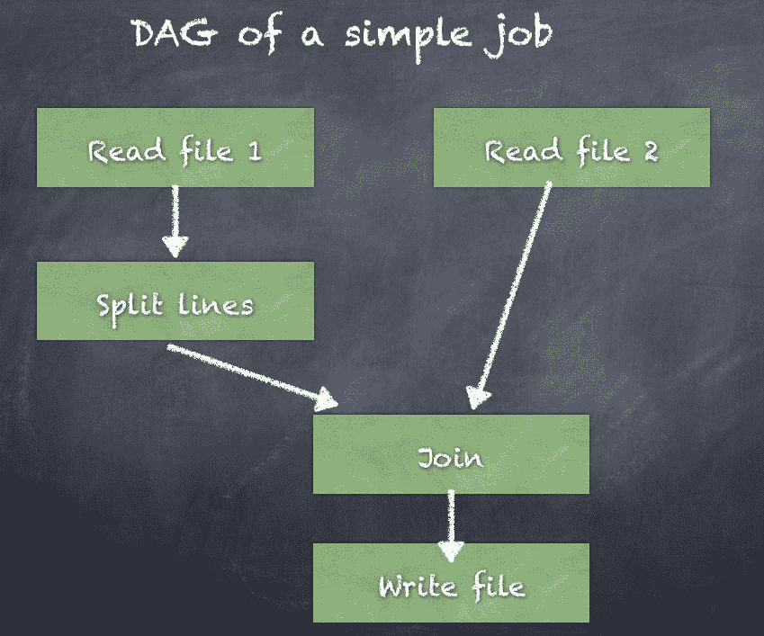

以下图表将作业/DAG 分解为阶段和任务：

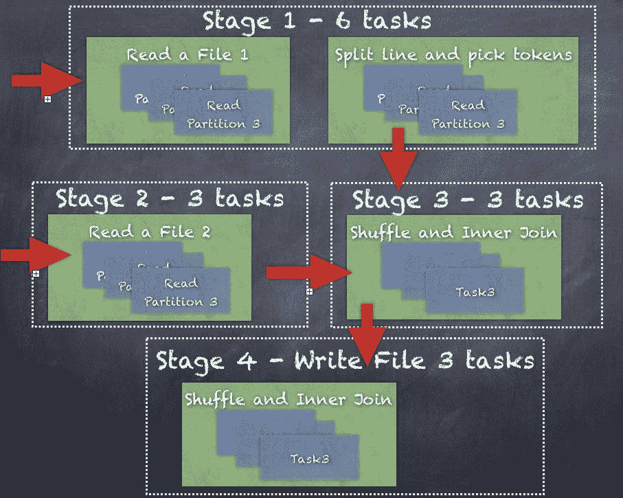

阶段的数量和阶段的内容取决于操作的类型。通常，任何转换都会进入与之前相同的阶段，但每个操作（如 reduce 或 shuffle）总是创建一个新的执行阶段。任务是阶段的一部分，与在执行者上执行操作的核心直接相关。

如果您使用 YARN 或 Mesos 作为集群管理器，可以使用动态 YARN 调度程序在需要执行更多工作时增加执行者的数量，以及终止空闲执行者。

因此，Driver 管理整个执行过程的容错。一旦 Driver 完成作业，输出可以写入文件、数据库，或者简单地输出到控制台。

请记住，Driver 程序本身的代码必须完全可序列化，包括所有变量和对象。

经常看到的异常是不可序列化异常，这是由于包含来自块外部的全局变量。

因此，Driver 进程负责整个执行过程，同时监视和管理使用的资源，如执行者、阶段和任务，确保一切按计划进行，并从故障中恢复，如执行者节点上的任务故障或整个执行者节点作为整体的故障。

# Apache Spark 安装

Apache Spark 是一个跨平台框架，可以部署在 Linux、Windows 和 Mac 机器上，只要我们在机器上安装了 Java。在本节中，我们将看看如何安装 Apache Spark。

Apache Spark 可以从[`spark.apache.org/downloads.html`](http://spark.apache.org/downloads.html)下载

首先，让我们看看机器上必须可用的先决条件：

+   Java 8+（作为所有 Spark 软件都作为 JVM 进程运行，因此是必需的）

+   Python 3.4+（可选，仅在使用 PySpark 时使用）

+   R 3.1+（可选，仅在使用 SparkR 时使用）

+   Scala 2.11+（可选，仅用于编写 Spark 程序）

Spark 可以部署在三种主要的部署模式中，我们将会看到：

+   Spark 独立

+   YARN 上的 Spark

+   Mesos 上的 Spark

# Spark 独立

Spark 独立模式使用内置调度程序，不依赖于任何外部调度程序，如 YARN 或 Mesos。要在独立模式下安装 Spark，你必须将 Spark 二进制安装包复制到集群中的所有机器上。

在独立模式下，客户端可以通过 spark-submit 或 Spark shell 与集群交互。在任何情况下，Driver 都会与 Spark 主节点通信，以获取可以为此应用程序启动的工作节点。

与集群交互的多个客户端在 Worker 节点上创建自己的执行器。此外，每个客户端都将有自己的 Driver 组件。

以下是使用主节点和工作节点的独立部署 Spark：

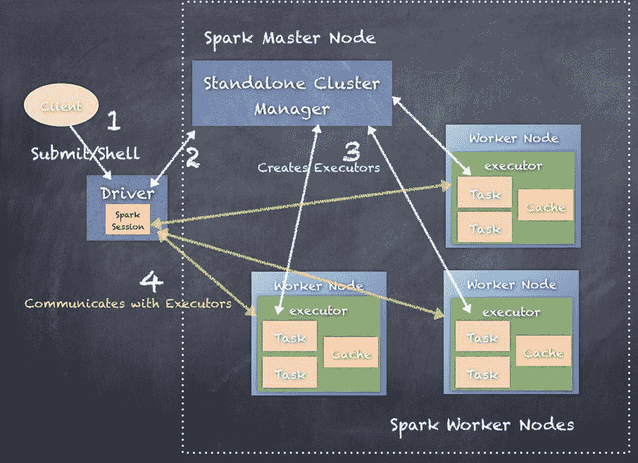

现在让我们下载并安装 Spark 在独立模式下使用 Linux/Mac：

1.  从链接[`spark.apache.org/downloads.html`](http://spark.apache.org/downloads.html)下载 Apache Spark：

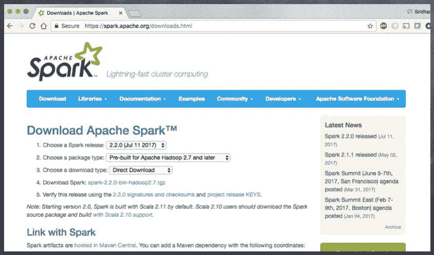

1.  在本地目录中解压包：

```scala
 tar -xvzf spark-2.2.0-bin-hadoop2.7.tgz

```

1.  切换到新创建的目录：

```scala
 cd spark-2.2.0-bin-hadoop2.7

```

1.  通过实施以下步骤设置`JAVA_HOME`和`SPARK_HOME`的环境变量：

1.  `JAVA_HOME`应该是你安装 Java 的地方。在我的 Mac 终端上，这是设置为：

```scala
 export JAVA_HOME=/Library/Java/JavaVirtualMachines/
                             jdk1.8.0_65.jdk/Contents/Home/

```

1.  1.  `SPARK_HOME`应该是新解压的文件夹。在我的 Mac 终端上，这是设置为：

```scala
 export SPARK_HOME= /Users/myuser/spark-2.2.0-bin-
                               hadoop2.7

```

1.  运行 Spark shell 来查看是否可以工作。如果不工作，检查`JAVA_HOME`和`SPARK_HOME`环境变量：`./bin/spark-shell`

1.  现在你将看到如下所示的 shell。

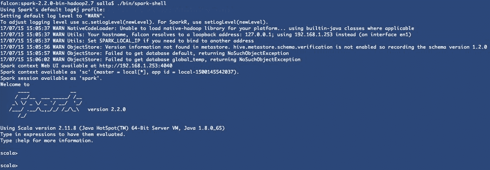

1.  你将在最后看到 Scala/Spark shell，现在你已经准备好与 Spark 集群交互了：

```scala
 scala>

```

现在，我们有一个连接到自动设置的本地集群运行 Spark 的 Spark-shell。这是在本地机器上启动 Spark 的最快方式。然而，你仍然可以控制工作节点/执行器，并连接到任何集群（独立/YARN/Mesos）。这就是 Spark 的强大之处，它使你能够快速从交互式测试转移到集群测试，随后在大型集群上部署你的作业。无缝集成提供了许多好处，这是你无法通过 Hadoop 和其他技术实现的。

如果你想了解所有设置，可以参考官方文档[`spark.apache.org/docs/latest/`](http://spark.apache.org/docs/latest/)。

有几种启动 Spark shell 的方式，如下面的代码片段所示。我们将在后面的部分中看到更多选项，更详细地展示 Spark shell：

+   在本地机器上自动选择本地机器作为主节点的默认 shell：

```scala
 ./bin/spark-shell

```

+   在本地机器上指定本地机器为主节点并使用`n`线程的默认 shell：

```scala
 ./bin/spark-shell --master local[n]

```

+   在本地机器上连接到指定的 spark 主节点的默认 shell：

```scala
 ./bin/spark-shell --master spark://<IP>:<Port>

```

+   在本地机器上使用客户端模式连接到 YARN 集群的默认 shell：

```scala
 ./bin/spark-shell --master yarn --deploy-mode client

```

+   在本地机器上连接到 YARN 集群使用集群模式的默认 shell：

```scala
 ./bin/spark-shell --master yarn --deploy-mode cluster

```

Spark Driver 也有一个 Web UI，可以帮助你了解关于 Spark 集群、正在运行的执行器、作业和任务、环境变量和缓存的一切。当然，最重要的用途是监视作业。

在`http://127.0.0.1:4040/jobs/`上启动本地 Spark 集群的 Web UI

Web UI 中的作业选项卡如下：

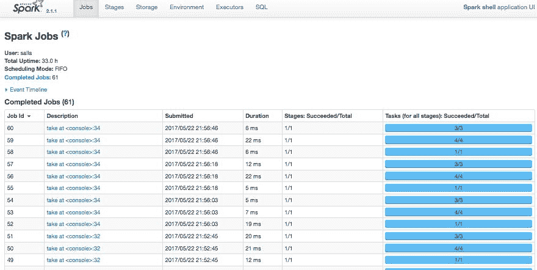

以下是显示集群所有执行器的选项卡：

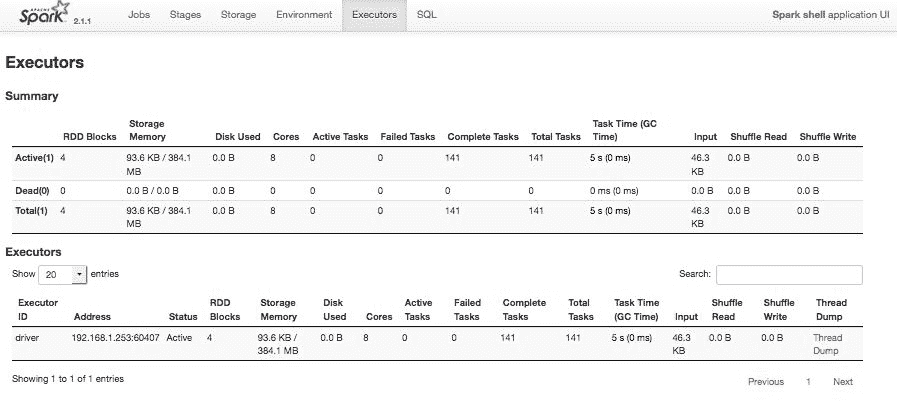

# Spark on YARN

在 YARN 模式下，客户端与 YARN 资源管理器通信，并获取容器来运行 Spark 执行。你可以把它看作是为你部署的一个迷你 Spark 集群。

与集群交互的多个客户端在集群节点（节点管理器）上创建自己的执行器。此外，每个客户端都将有自己的 Driver 组件。

在使用 YARN 时，Spark 可以在 YARN 客户端模式或 YARN 集群模式下运行。

# YARN 客户端模式

在 YARN 客户端模式中，驱动程序在集群外的节点上运行（通常是客户端所在的地方）。驱动程序首先联系资源管理器请求资源来运行 Spark 作业。资源管理器分配一个容器（容器零）并回应驱动程序。然后驱动程序在容器零中启动 Spark 应用程序主节点。Spark 应用程序主节点然后在资源管理器分配的容器上创建执行器。YARN 容器可以在由节点管理器控制的集群中的任何节点上。因此，所有分配都由资源管理器管理。

即使 Spark 应用程序主节点也需要与资源管理器通信，以获取后续容器来启动执行器。

以下是 Spark 的 YARN 客户端模式部署：

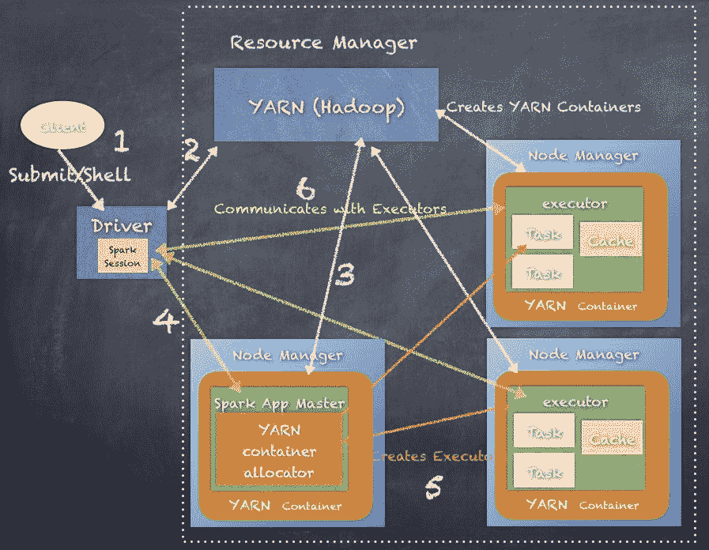

# YARN 集群模式

在 YARN 集群模式中，驱动程序在集群内的节点上运行（通常是应用程序主节点所在的地方）。客户端首先联系资源管理器请求资源来运行 Spark 作业。资源管理器分配一个容器（容器零）并回应客户端。然后客户端将代码提交到集群，然后在容器零中启动驱动程序和 Spark 应用程序主节点。驱动程序与应用程序主节点一起运行，然后在资源管理器分配的容器上创建执行器。YARN 容器可以在由节点管理器控制的集群中的任何节点上。因此，所有分配都由资源管理器管理。

即使 Spark 应用程序主节点也需要与资源管理器通信，以获取后续容器来启动执行器。

以下是 Spark 的 Yarn 集群模式部署：

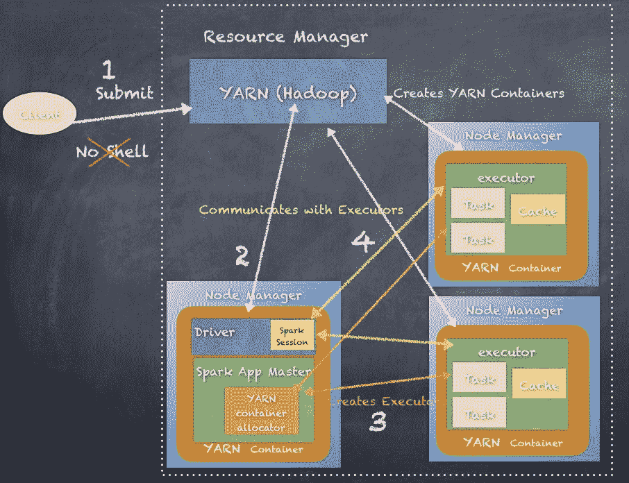

在 YARN 集群模式中没有 shell 模式，因为驱动程序本身正在 YARN 中运行。

# Mesos 上的 Spark

Mesos 部署类似于 Spark 独立模式，驱动程序与 Mesos 主节点通信，然后分配所需的资源来运行执行器。与独立模式一样，驱动程序然后与执行器通信以运行作业。因此，Mesos 部署中的驱动程序首先与主节点通信，然后在所有 Mesos 从节点上保证容器的请求。

当容器分配给 Spark 作业时，驱动程序然后启动执行器，然后在执行器中运行代码。当 Spark 作业完成并且驱动程序退出时，Mesos 主节点会收到通知，并且在 Mesos 从节点上以容器的形式的所有资源都会被回收。

与集群交互的多个客户端在从节点上创建自己的执行器。此外，每个客户端都将有自己的驱动程序组件。就像 YARN 模式一样，客户端模式和集群模式都是可能的

以下是基于 Mesos 的 Spark 部署，描述了**驱动程序**连接到**Mesos 主节点**，该主节点还具有所有 Mesos 从节点上所有资源的集群管理器：

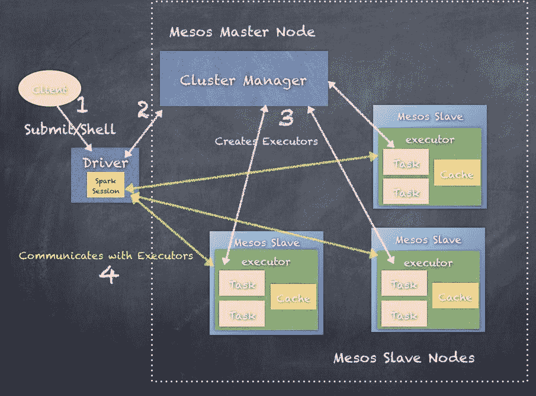

# RDD 介绍

**弹性分布式数据集**（**RDD**）是不可变的、分布式的对象集合。Spark RDD 是具有弹性或容错性的，这使得 Spark 能够在面对故障时恢复 RDD。一旦创建，不可变性使得 RDD 一旦创建就是只读的。转换允许对 RDD 进行操作以创建新的 RDD，但原始 RDD 一旦创建就不会被修改。这使得 RDD 免受竞争条件和其他同步问题的影响。

RDD 的分布式特性是因为 RDD 只包含对数据的引用，而实际数据包含在集群中的节点上的分区中。

在概念上，RDD 是分布在集群中多个节点上的元素的分布式集合。我们可以简化 RDD 以更好地理解，将 RDD 视为分布在机器上的大型整数数组。

RDD 实际上是一个数据集，已经在集群中进行了分区，分区的数据可能来自 HDFS（Hadoop 分布式文件系统）、HBase 表、Cassandra 表、Amazon S3。

在内部，每个 RDD 都具有五个主要属性：

+   分区列表

+   计算每个分区的函数

+   对其他 RDD 的依赖列表

+   可选地，用于键-值 RDD 的分区器（例如，指定 RDD 是哈希分区的）

+   可选地，计算每个分区的首选位置列表（例如，HDFS 文件的块位置）

看一下下面的图表：

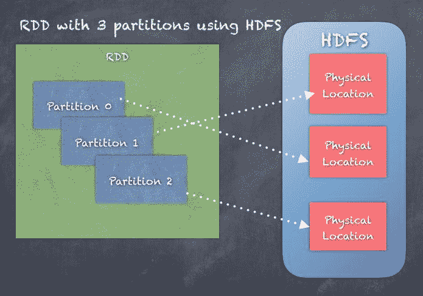

在你的程序中，驱动程序将 RDD 对象视为分布式数据的句柄。这类似于指向数据的指针，而不是实际使用的数据，当需要时用于访问实际数据。

RDD 默认使用哈希分区器在集群中对数据进行分区。分区的数量与集群中节点的数量无关。很可能集群中的单个节点有多个数据分区。存在的数据分区数量完全取决于集群中节点的数量和数据的大小。如果你看节点上任务的执行，那么在 worker 节点上执行的执行器上的任务可能会处理同一本地节点或远程节点上可用的数据。这被称为数据的局部性，执行任务会选择尽可能本地的数据。

局部性会显著影响作业的性能。默认情况下，局部性的优先顺序可以显示为

`PROCESS_LOCAL > NODE_LOCAL > NO_PREF > RACK_LOCAL > ANY`

节点可能会得到多少分区是没有保证的。这会影响任何执行器的处理效率，因为如果单个节点上有太多分区在处理多个分区，那么处理所有分区所需的时间也会增加，超载执行器上的核心，从而减慢整个处理阶段的速度，直接减慢整个作业的速度。实际上，分区是提高 Spark 作业性能的主要调优因素之一。参考以下命令：

```scala
class RDD[T: ClassTag]

```

让我们进一步了解当我们加载数据时 RDD 会是什么样子。以下是 Spark 如何使用不同的 worker 加载数据的示例：

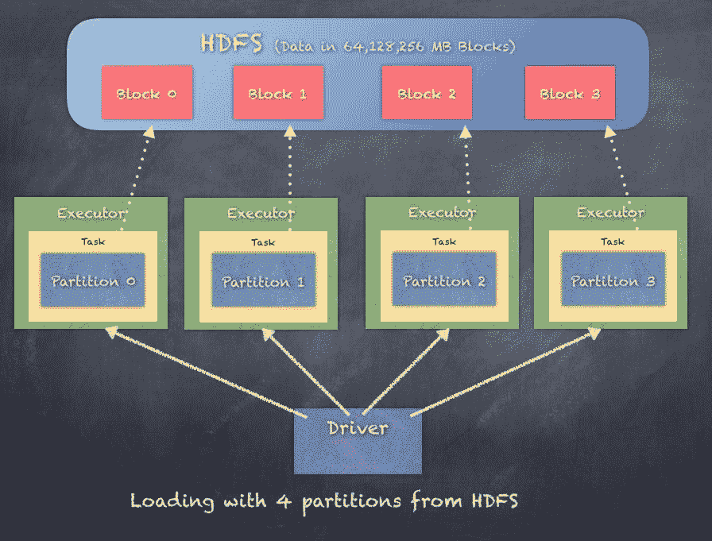

无论 RDD 是如何创建的，初始 RDD 通常被称为基础 RDD，而由各种操作创建的任何后续 RDD 都是 RDD 的血统的一部分。这是另一个非常重要的方面要记住，因为容错和恢复的秘密是**Driver**维护 RDD 的血统，并且可以执行血统来恢复任何丢失的 RDD 块。

以下是一个示例，显示了作为操作结果创建的多个 RDD。我们从**Base RDD**开始，它有 24 个项目，并派生另一个 RDD **carsRDD**，其中只包含与汽车匹配的项目（3）：

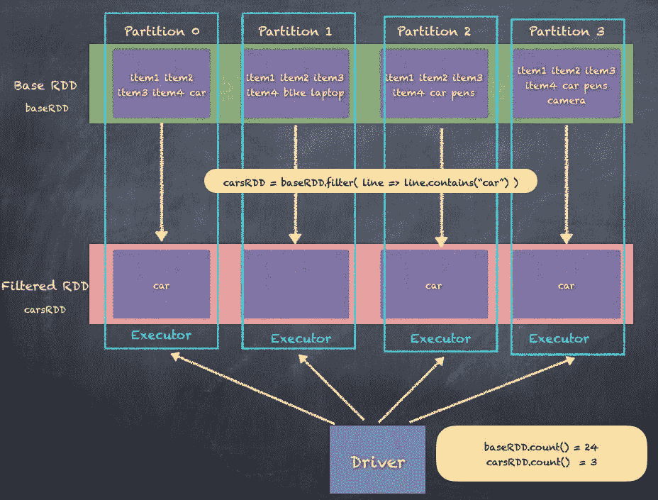

在这些操作期间，分区的数量不会改变，因为每个执行器都会在内存中应用过滤转换，生成与原始 RDD 分区对应的新 RDD 分区。

接下来，我们将看到如何创建 RDDs

# RDD 创建

RDD 是 Apache Spark 中使用的基本对象。它们是不可变的集合，代表数据集，并具有内置的可靠性和故障恢复能力。从本质上讲，RDD 在进行任何操作（如转换或动作）时会创建新的 RDD。RDD 还存储了用于从故障中恢复的血统。我们在上一章中也看到了有关如何创建 RDD 以及可以应用于 RDD 的操作的一些细节。

可以通过多种方式创建 RDD：

+   并行化集合

+   从外部源读取数据

+   现有 RDD 的转换

+   流式 API

# 并行化集合

通过在驱动程序内部的集合上调用`parallelize()`来并行化集合。当驱动程序尝试并行化集合时，它将集合分割成分区，并将数据分区分布到集群中。

以下是使用 SparkContext 和`parallelize()`函数从数字序列创建 RDD 的 RDD。`parallelize()`函数基本上将数字序列分割成分布式集合，也称为 RDD。

```scala
scala> val rdd_one = sc.parallelize(Seq(1,2,3))
rdd_one: org.apache.spark.rdd.RDD[Int] = ParallelCollectionRDD[0] at parallelize at <console>:24

scala> rdd_one.take(10)
res0: Array[Int] = Array(1, 2, 3)

```

# 从外部源读取数据

创建 RDD 的第二种方法是从外部分布式源（如 Amazon S3、Cassandra、HDFS 等）读取数据。例如，如果您从 HDFS 创建 RDD，则 Spark 集群中的各个节点都会读取 HDFS 中的分布式块。

Spark 集群中的每个节点基本上都在进行自己的输入输出操作，每个节点都独立地从 HDFS 块中读取一个或多个块。一般来说，Spark 会尽最大努力将尽可能多的 RDD 放入内存中。有能力通过在 Spark 集群中启用节点来缓存数据，以减少输入输出操作，避免重复读取操作，比如从可能远离 Spark 集群的 HDFS 块。在您的 Spark 程序中可以使用一整套缓存策略，我们将在缓存部分后面详细讨论。

以下是从文本文件加载的文本行 RDD，使用 Spark Context 和`textFile()`函数。`textFile`函数将输入数据加载为文本文件（每个换行符`\n`终止的部分成为 RDD 中的一个元素）。该函数调用还自动使用 HadoopRDD（在下一章中显示）来检测和加载所需的分区形式的数据，分布在集群中。

```scala
scala> val rdd_two = sc.textFile("wiki1.txt")
rdd_two: org.apache.spark.rdd.RDD[String] = wiki1.txt MapPartitionsRDD[8] at textFile at <console>:24

scala> rdd_two.count
res6: Long = 9

scala> rdd_two.first
res7: String = Apache Spark provides programmers with an application programming interface centered on a data structure called the resilient distributed dataset (RDD), a read-only multiset of data items distributed over a cluster of machines, that is maintained in a fault-tolerant way.

```

# 现有 RDD 的转换

RDD 本质上是不可变的；因此，可以通过对任何现有 RDD 应用转换来创建您的 RDD。过滤器是转换的一个典型例子。

以下是一个简单的整数`rdd`，通过将每个整数乘以`2`进行转换。同样，我们使用`SparkContext`和`parallelize`函数将整数序列分布为分区形式的 RDD。然后，我们使用`map()`函数将 RDD 转换为另一个 RDD，将每个数字乘以`2`。

```scala
scala> val rdd_one = sc.parallelize(Seq(1,2,3))
rdd_one: org.apache.spark.rdd.RDD[Int] = ParallelCollectionRDD[0] at parallelize at <console>:24

scala> rdd_one.take(10)
res0: Array[Int] = Array(1, 2, 3)

scala> val rdd_one_x2 = rdd_one.map(i => i * 2)
rdd_one_x2: org.apache.spark.rdd.RDD[Int] = MapPartitionsRDD[9] at map at <console>:26

scala> rdd_one_x2.take(10)
res9: Array[Int] = Array(2, 4, 6)

```

# 流式 API

RDD 也可以通过 spark streaming 创建。这些 RDD 称为离散流 RDD（DStream RDD）。

我们将在第九章中进一步讨论这个问题，*Stream Me Up, Scotty - Spark Streaming*。

在下一节中，我们将创建 RDD 并使用 Spark-Shell 探索一些操作。

# 使用 Spark shell

Spark shell 提供了一种简单的方式来执行数据的交互式分析。它还使您能够通过快速尝试各种 API 来学习 Spark API。此外，与 Scala shell 的相似性和对 Scala API 的支持还让您能够快速适应 Scala 语言构造，并更好地利用 Spark API。

Spark shell 实现了**读取-求值-打印-循环**（**REPL**）的概念，允许您通过键入要评估的代码与 shell 进行交互。然后在控制台上打印结果，无需编译即可构建可执行代码。

在安装 Spark 的目录中运行以下命令启动它：

```scala
./bin/spark-shell

```

Spark shell 启动时，会自动创建`SparkSession`和`SparkContext`对象。`SparkSession`可作为 Spark 使用，`SparkContext`可作为 sc 使用。

`spark-shell`可以通过以下片段中显示的几个选项启动（最重要的选项用粗体显示）：

```scala
./bin/spark-shell --help
Usage: ./bin/spark-shell [options]

Options:
 --master MASTER_URL spark://host:port, mesos://host:port, yarn, or local.
 --deploy-mode DEPLOY_MODE Whether to launch the driver program locally ("client") or
 on one of the worker machines inside the cluster ("cluster")
 (Default: client).
 --class CLASS_NAME Your application's main class (for Java / Scala apps).
 --name NAME A name of your application.
 --jars JARS Comma-separated list of local jars to include on the driver
 and executor classpaths.
 --packages Comma-separated list of maven coordinates of jars to include
 on the driver and executor classpaths. Will search the local
 maven repo, then maven central and any additional remote
 repositories given by --repositories. The format for the
 coordinates should be groupId:artifactId:version.
 --exclude-packages Comma-separated list of groupId:artifactId, to exclude while
 resolving the dependencies provided in --packages to avoid
 dependency conflicts.
 --repositories Comma-separated list of additional remote repositories to
 search for the maven coordinates given with --packages.
 --py-files PY_FILES Comma-separated list of .zip, .egg, or .py files to place
 on the PYTHONPATH for Python apps.
 --files FILES Comma-separated list of files to be placed in the working
 directory of each executor.

 --conf PROP=VALUE Arbitrary Spark configuration property.
 --properties-file FILE Path to a file from which to load extra properties. If not
 specified, this will look for conf/spark-defaults.conf.

 --driver-memory MEM Memory for driver (e.g. 1000M, 2G) (Default: 1024M).
 --driver-Java-options Extra Java options to pass to the driver.
 --driver-library-path Extra library path entries to pass to the driver.
 --driver-class-path Extra class path entries to pass to the driver. Note that
 jars added with --jars are automatically included in the
 classpath.

 --executor-memory MEM Memory per executor (e.g. 1000M, 2G) (Default: 1G).

 --proxy-user NAME User to impersonate when submitting the application.
 This argument does not work with --principal / --keytab.

 --help, -h Show this help message and exit.
 --verbose, -v Print additional debug output.
 --version, Print the version of current Spark.

 Spark standalone with cluster deploy mode only:
 --driver-cores NUM Cores for driver (Default: 1).

 Spark standalone or Mesos with cluster deploy mode only:
 --supervise If given, restarts the driver on failure.
 --kill SUBMISSION_ID If given, kills the driver specified.
 --status SUBMISSION_ID If given, requests the status of the driver specified.

 Spark standalone and Mesos only:
 --total-executor-cores NUM Total cores for all executors.

 Spark standalone and YARN only:
 --executor-cores NUM Number of cores per executor. (Default: 1 in YARN mode,
 or all available cores on the worker in standalone mode)

 YARN-only:
 --driver-cores NUM Number of cores used by the driver, only in cluster mode
 (Default: 1).
 --queue QUEUE_NAME The YARN queue to submit to (Default: "default").
 --num-executors NUM Number of executors to launch (Default: 2).
 If dynamic allocation is enabled, the initial number of
 executors will be at least NUM.
 --archives ARCHIVES Comma separated list of archives to be extracted into the
 working directory of each executor.
 --principal PRINCIPAL Principal to be used to login to KDC, while running on
 secure HDFS.
 --keytab KEYTAB The full path to the file that contains the keytab for the
 principal specified above. This keytab will be copied to
 the node running the Application Master via the Secure
 Distributed Cache, for renewing the login tickets and the
 delegation tokens periodically.

```

您还可以以可执行的 Java jar 的形式提交 Spark 代码，以便在集群中执行作业。通常，您在使用 shell 达到可行解决方案后才这样做。

在提交 Spark 作业到集群（本地、YARN 和 Mesos）时，请使用`./bin/spark-submit`。

以下是 Shell 命令（最重要的命令用粗体标出）：

```scala
scala> :help
All commands can be abbreviated, e.g., :he instead of :help.
:edit <id>|<line> edit history
:help [command] print this summary or command-specific help
:history [num] show the history (optional num is commands to show)
:h? <string> search the history
:imports [name name ...] show import history, identifying sources of names
:implicits [-v] show the implicits in scope
:javap <path|class> disassemble a file or class name
:line <id>|<line> place line(s) at the end of history
:load <path> interpret lines in a file
:paste [-raw] [path] enter paste mode or paste a file
:power enable power user mode
:quit exit the interpreter
:replay [options] reset the repl and replay all previous commands
:require <path> add a jar to the classpath
:reset [options] reset the repl to its initial state, forgetting all session entries
:save <path> save replayable session to a file
:sh <command line> run a shell command (result is implicitly => List[String])
:settings <options> update compiler options, if possible; see reset
:silent disable/enable automatic printing of results
:type [-v] <expr> display the type of an expression without evaluating it
:kind [-v] <expr> display the kind of expression's type
:warnings show the suppressed warnings from the most recent line which had any

```

使用 spark-shell，我们现在将一些数据加载为 RDD：

```scala
scala> val rdd_one = sc.parallelize(Seq(1,2,3))
rdd_one: org.apache.spark.rdd.RDD[Int] = ParallelCollectionRDD[0] at parallelize at <console>:24

scala> rdd_one.take(10)
res0: Array[Int] = Array(1, 2, 3)

```

如您所见，我们正在逐个运行命令。或者，我们也可以粘贴命令：

```scala
scala> :paste
// Entering paste mode (ctrl-D to finish)

val rdd_one = sc.parallelize(Seq(1,2,3))
rdd_one.take(10)

// Exiting paste mode, now interpreting.
rdd_one: org.apache.spark.rdd.RDD[Int] = ParallelCollectionRDD[10] at parallelize at <console>:26
res10: Array[Int] = Array(1, 2, 3)

```

在下一节中，我们将深入研究这些操作。

# 动作和转换

RDDs 是不可变的，每个操作都会创建一个新的 RDD。现在，你可以在 RDD 上执行的两个主要操作是**转换**和**动作**。

**转换**改变 RDD 中的元素，例如拆分输入元素、过滤元素和执行某种计算。可以按顺序执行多个转换；但是在规划期间不会执行任何操作。

对于转换，Spark 将它们添加到计算的 DAG 中，只有当驱动程序请求一些数据时，这个 DAG 才会实际执行。这被称为*延迟*评估。

延迟评估的原因是，Spark 可以查看所有的转换并计划执行，利用驱动程序对所有操作的理解。例如，如果筛选转换立即应用于其他一些转换之后，Spark 将优化执行，以便每个执行器有效地对数据的每个分区执行转换。现在，只有当 Spark 等待执行时才有可能。

**动作**是实际触发计算的操作。在遇到动作操作之前，Spark 程序内的执行计划以 DAG 的形式创建并且不执行任何操作。显然，在执行计划中可能有各种转换，但在执行动作之前什么也不会发生。

以下是对一些任意数据的各种操作的描述，我们只想删除所有的笔和自行车，只计算汽车的数量**。**每个打印语句都是一个动作，触发 DAG 执行计划中到那一点的所有转换步骤的执行，如下图所示：

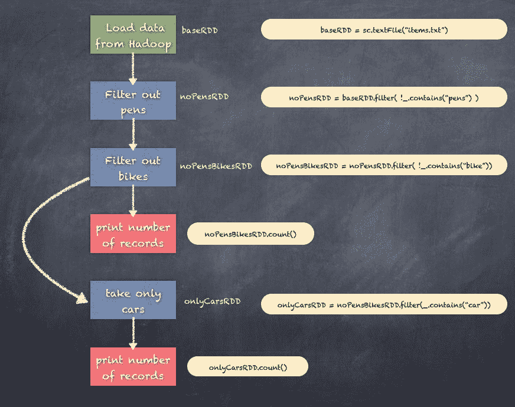

例如，对转换的有向无环图执行计数动作会触发执行直到基本 RDD 的所有转换。如果执行了另一个动作，那么可能会发生新的执行链。这清楚地说明了为什么在有向无环图的不同阶段可以进行任何缓存，这将极大地加快程序的下一次执行。另一种优化执行的方式是通过重用上一次执行的洗牌文件。

另一个例子是 collect 动作，它从所有节点收集或拉取所有数据到驱动程序。在调用 collect 时，您可以使用部分函数有选择地拉取数据。

# 转换

**转换**通过将转换逻辑应用于现有 RDD 中的每个元素，从现有 RDD 创建新的 RDD。一些转换函数涉及拆分元素、过滤元素和执行某种计算。可以按顺序执行多个转换。但是，在规划期间不会执行任何操作。

转换可以分为四类，如下所示。

# 通用转换

**通用转换**是处理大多数通用用例的转换函数，将转换逻辑应用于现有的 RDD 并生成新的 RDD。聚合、过滤等常见操作都称为通用转换。

通用转换函数的示例包括：

+   `map`

+   `filter`

+   `flatMap`

+   `groupByKey`

+   `sortByKey`

+   `combineByKey`

# 数学/统计转换

数学或统计转换是处理一些统计功能的转换函数，通常对现有的 RDD 应用一些数学或统计操作，生成一个新的 RDD。抽样是一个很好的例子，在 Spark 程序中经常使用。

此类转换的示例包括：

+   `sampleByKey`

+   ``randomSplit``

# 集合理论/关系转换

集合理论/关系转换是处理数据集的连接和其他关系代数功能（如`cogroup`）的转换函数。这些函数通过将转换逻辑应用于现有的 RDD 并生成新的 RDD 来工作。

此类转换的示例包括：

+   `cogroup`

+   `join`

+   `subtractByKey`

+   `fullOuterJoin`

+   `leftOuterJoin`

+   `rightOuterJoin`

# 基于数据结构的转换

基于数据结构的转换是操作 RDD 的基础数据结构，即 RDD 中的分区的转换函数。在这些函数中，您可以直接在分区上工作，而不直接触及 RDD 内部的元素/数据。这些在任何 Spark 程序中都是必不可少的，超出了简单程序的范围，您需要更多地控制分区和分区在集群中的分布。通常，通过根据集群状态和数据大小以及确切的用例要求重新分配数据分区，可以实现性能改进。

此类转换的示例包括：

+   `partitionBy`

+   `repartition`

+   `zipwithIndex`

+   `coalesce`

以下是最新 Spark 2.1.1 中可用的转换函数列表：

| 转换 | 意义 |
| --- | --- |
| `map(func)` | 通过将源数据的每个元素传递给函数`func`来返回一个新的分布式数据集。 |
| `filter(func)` | 返回一个由源数据集中 func 返回 true 的元素组成的新数据集。 |
| `flatMap(func)` | 类似于 map，但每个输入项可以映射到 0 个或多个输出项（因此`func`应返回`Seq`而不是单个项）。 |
| `mapPartitions(func)` | 类似于 map，但在 RDD 的每个分区（块）上单独运行，因此当在类型为`T`的 RDD 上运行时，`func`必须是`Iterator<T> => Iterator<U>`类型。 |
| `mapPartitionsWithIndex(func)` | 类似于`mapPartitions`，但还为`func`提供一个整数值，表示分区的索引，因此当在类型为`T`的 RDD 上运行时，`func`必须是`(Int, Iterator<T>) => Iterator<U>`类型。 |
| `sample(withReplacement, fraction, seed)` | 使用给定的随机数生成器种子，对数据的一部分进行抽样，可以有或没有替换。 |
| `union(otherDataset)` | 返回一个包含源数据集和参数中元素并集的新数据集。 |
| `intersection(otherDataset)` | 返回一个包含源数据集和参数中元素交集的新 RDD。 |
| `distinct([numTasks]))` | 返回一个包含源数据集的不同元素的新数据集。 |

| `groupByKey([numTasks])` | 当在`(K, V)`对的数据集上调用时，返回一个`(K, Iterable<V>)`对的数据集。注意：如果要对每个键执行聚合（例如求和或平均值），使用`reduceByKey`或`aggregateByKey`将获得更好的性能。

注意：默认情况下，输出中的并行级别取决于父 RDD 的分区数。您可以传递一个可选的`numTasks`参数来设置不同数量的任务。|

| reduceByKey(func, [numTasks]) | 当在`(K, V)`对的数据集上调用时，返回一个`(K, V)`对的数据集，其中每个键的值使用给定的`reduce`函数`func`进行聚合，`func`必须是`(V,V) => V`类型。与`groupByKey`一样，通过可选的第二个参数可以配置 reduce 任务的数量。 |
| --- | --- |
| `aggregateByKey(zeroValue)(seqOp, combOp, [numTasks])` | 当在`(K, V)`对的数据集上调用时，返回使用给定的组合函数和中性“零”值对每个键的值进行聚合的`(K, U)`对的数据集。允许聚合值类型与输入值类型不同，同时避免不必要的分配。与`groupByKey`一样，通过可选的第二个参数可以配置减少任务的数量。 |
| `sortByKey([ascending], [numTasks])` | 当在实现有序的`(K, V)`对的数据集上调用时，返回按键按升序或降序排序的`(K, V)`对的数据集，如布尔值升序参数中指定的那样。 |
| `join(otherDataset, [numTasks])` | 当在类型为`(K, V)`和`(K, W)`的数据集上调用时，返回每个键的所有元素对的`(K, (V, W))`对的数据集。通过`leftOuterJoin`、`rightOuterJoin`和`fullOuterJoin`支持外连接。 |
| `cogroup(otherDataset, [numTasks])` | 当在类型为`(K, V)`和`(K, W)`的数据集上调用时，返回`(K, (Iterable<V>, Iterable<W>))`元组的数据集。此操作也称为`groupWith`。 |
| `cartesian(otherDataset)` | 当在类型为`T`和`U`的数据集上调用时，返回`(T, U)`对的数据集（所有元素的所有对）。 |
| `pipe(command, [envVars])` | 将 RDD 的每个分区通过 shell 命令（例如 Perl 或 bash 脚本）进行管道传输。RDD 元素被写入进程的`stdin`，并且输出到其`stdout`的行将作为字符串的 RDD 返回。 |
| `coalesce(numPartitions)` | 将 RDD 中的分区数减少到`numPartitions`。在筛选大型数据集后更有效地运行操作时非常有用。 |
| `repartition(numPartitions)` | 随机重排 RDD 中的数据，以创建更多或更少的分区并在它们之间平衡。这总是通过网络洗牌所有数据。 |
| `repartitionAndSortWithinPartitions(partitioner)` | 根据给定的分区器重新分区 RDD，并在每个生成的分区内按其键对记录进行排序。这比调用`repartition`然后在每个分区内排序更有效，因为它可以将排序推入洗牌机制中。 |

我们将说明最常见的转换：

# map 函数

`map`将转换函数应用于输入分区，以生成输出 RDD 中的输出分区。

如下面的代码片段所示，这是我们如何将文本文件的 RDD 映射到文本行的长度的 RDD：

```scala
scala> val rdd_two = sc.textFile("wiki1.txt")
rdd_two: org.apache.spark.rdd.RDD[String] = wiki1.txt MapPartitionsRDD[8] at textFile at <console>:24

scala> rdd_two.count
res6: Long = 9

scala> rdd_two.first
res7: String = Apache Spark provides programmers with an application programming interface centered on a data structure called the resilient distributed dataset (RDD), a read-only multiset of data items distributed over a cluster of machines, that is maintained in a fault-tolerant way.

scala> val rdd_three = rdd_two.map(line => line.length)
res12: org.apache.spark.rdd.RDD[Int] = MapPartitionsRDD[11] at map at <console>:2

scala> rdd_three.take(10)
res13: Array[Int] = Array(271, 165, 146, 138, 231, 159, 159, 410, 281)

```

下图解释了`map()`的工作原理。您可以看到 RDD 的每个分区都会在新的 RDD 中产生一个新的分区，从而在 RDD 的所有元素上应用转换：

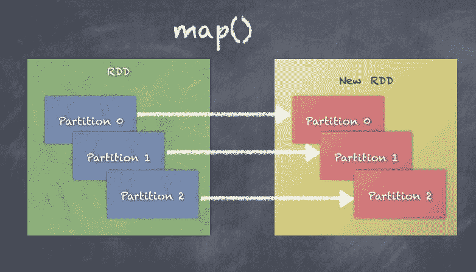

# flatMap 函数

`flatMap()`将转换函数应用于输入分区，以生成输出 RDD 中的输出分区，就像`map()`函数一样。但是，`flatMap()`还会展平输入 RDD 元素中的任何集合。

```scala
flatMap() on a RDD of a text file to convert the lines in the text to a RDD containing the individual words. We also show map() called on the same RDD before flatMap() is called just to show the difference in behavior:
```

```scala
scala> val rdd_two = sc.textFile("wiki1.txt")
rdd_two: org.apache.spark.rdd.RDD[String] = wiki1.txt MapPartitionsRDD[8] at textFile at <console>:24

scala> rdd_two.count
res6: Long = 9

scala> rdd_two.first
res7: String = Apache Spark provides programmers with an application programming interface centered on a data structure called the resilient distributed dataset (RDD), a read-only multiset of data items distributed over a cluster of machines, that is maintained in a fault-tolerant way.

scala> val rdd_three = rdd_two.map(line => line.split(" "))
rdd_three: org.apache.spark.rdd.RDD[Array[String]] = MapPartitionsRDD[16] at map at <console>:26

scala> rdd_three.take(1)
res18: Array[Array[String]] = Array(Array(Apache, Spark, provides, programmers, with, an, application, programming, interface, centered, on, a, data, structure, called, the, resilient, distributed, dataset, (RDD),, a, read-only, multiset, of, data, items, distributed, over, a, cluster, of, machines,, that, is, maintained, in, a, fault-tolerant, way.)

scala> val rdd_three = rdd_two.flatMap(line => line.split(" "))
rdd_three: org.apache.spark.rdd.RDD[String] = MapPartitionsRDD[17] at flatMap at <console>:26

scala> rdd_three.take(10)
res19: Array[String] = Array(Apache, Spark, provides, programmers, with, an, application, programming, interface, centered)

```

下图解释了`flatMap()`的工作原理。您可以看到 RDD 的每个分区都会在新的 RDD 中产生一个新的分区，从而在 RDD 的所有元素上应用转换：

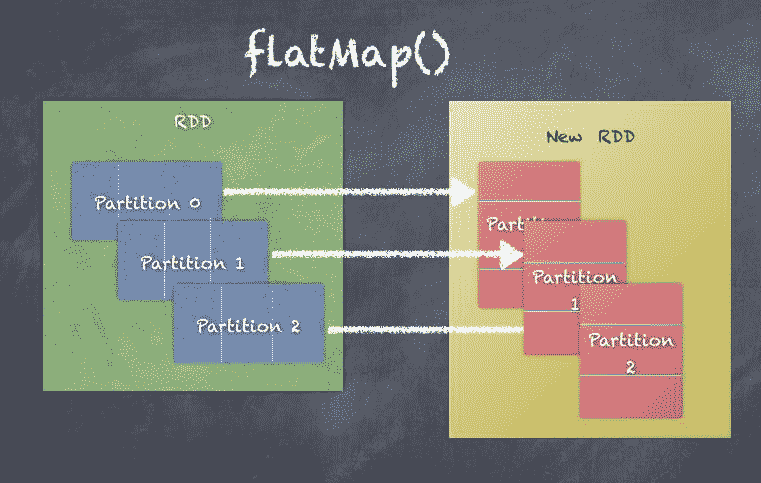

# filter 函数

`filter` 将转换函数应用于输入分区，以生成输出 RDD 中的过滤后的输出分区。

```scala
Spark:
```

```scala
scala> val rdd_two = sc.textFile("wiki1.txt")
rdd_two: org.apache.spark.rdd.RDD[String] = wiki1.txt MapPartitionsRDD[8] at textFile at <console>:24

scala> rdd_two.count
res6: Long = 9

scala> rdd_two.first
res7: String = Apache Spark provides programmers with an application programming interface centered on a data structure called the resilient distributed dataset (RDD), a read-only multiset of data items distributed over a cluster of machines, that is maintained in a fault-tolerant way.

scala> val rdd_three = rdd_two.filter(line => line.contains("Spark"))
rdd_three: org.apache.spark.rdd.RDD[String] = MapPartitionsRDD[20] at filter at <console>:26

scala>rdd_three.count
res20: Long = 5

```

下图解释了`filter`的工作原理。您可以看到 RDD 的每个分区都会在新的 RDD 中产生一个新的分区，从而在 RDD 的所有元素上应用过滤转换。

请注意，分区不会改变，应用筛选时有些分区可能也是空的

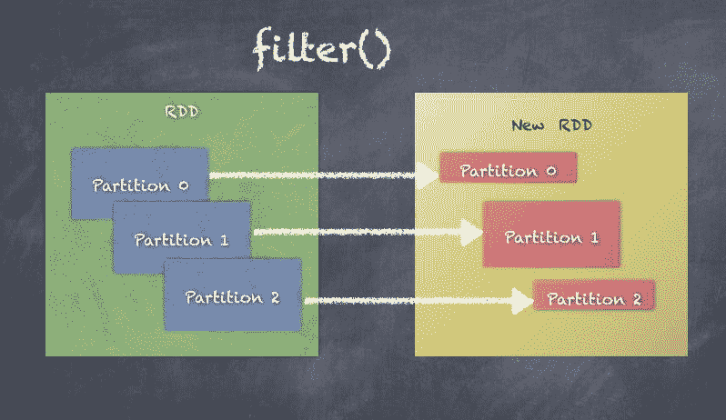

# coalesce

`coalesce`将转换函数应用于输入分区，以将输入分区合并为输出 RDD 中的较少分区。

如下面的代码片段所示，这是我们如何将所有分区合并为单个分区：

```scala
scala> val rdd_two = sc.textFile("wiki1.txt")
rdd_two: org.apache.spark.rdd.RDD[String] = wiki1.txt MapPartitionsRDD[8] at textFile at <console>:24

scala> rdd_two.partitions.length
res21: Int = 2

scala> val rdd_three = rdd_two.coalesce(1)
rdd_three: org.apache.spark.rdd.RDD[String] = CoalescedRDD[21] at coalesce at <console>:26

scala> rdd_three.partitions.length
res22: Int = 1

```

以下图表解释了`coalesce`的工作原理。您可以看到，从原始 RDD 创建了一个新的 RDD，基本上通过根据需要组合它们来减少分区的数量：

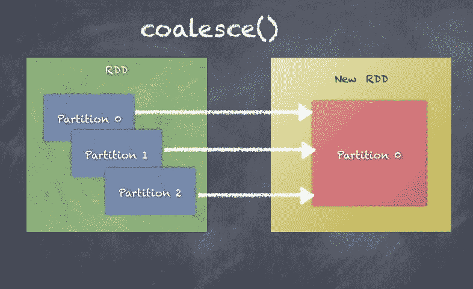

# 重新分区

`repartition`将`transformation`函数应用于输入分区，以将输入重新分区为输出 RDD 中的更少或更多的输出分区。

如下面的代码片段所示，这是我们如何将文本文件的 RDD 映射到具有更多分区的 RDD：

```scala
scala> val rdd_two = sc.textFile("wiki1.txt")
rdd_two: org.apache.spark.rdd.RDD[String] = wiki1.txt MapPartitionsRDD[8] at textFile at <console>:24

scala> rdd_two.partitions.length
res21: Int = 2

scala> val rdd_three = rdd_two.repartition(5)
rdd_three: org.apache.spark.rdd.RDD[String] = MapPartitionsRDD[25] at repartition at <console>:26

scala> rdd_three.partitions.length
res23: Int = 5

```

以下图表解释了`repartition`的工作原理。您可以看到，从原始 RDD 创建了一个新的 RDD，基本上通过根据需要组合/拆分分区来重新分配分区：

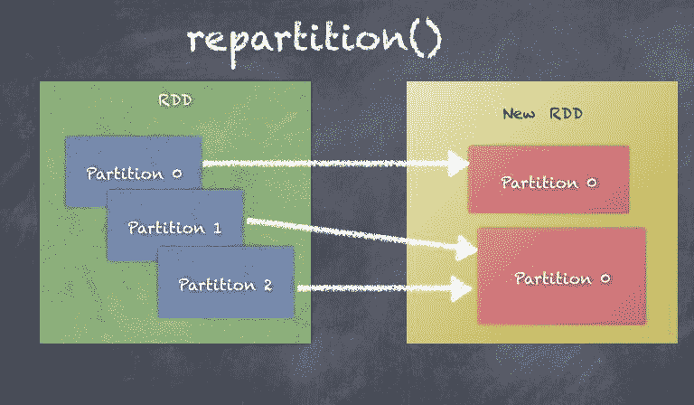

# 动作

动作触发到目前为止构建的所有转换的整个**DAG**（**有向无环图**）通过运行代码块和函数来实现。现在，所有操作都按照 DAG 指定的方式执行。

有两种类型的动作操作：

+   **驱动程序**：一种动作是驱动程序动作，例如收集计数、按键计数等。每个此类动作在远程执行器上执行一些计算，并将数据拉回驱动程序。

基于驱动程序的动作存在一个问题，即对大型数据集的操作可能会轻松地压倒驱动程序上可用的内存，从而使应用程序崩溃，因此应谨慎使用涉及驱动程序的动作

+   **分布式**：另一种动作是分布式动作，它在集群中的节点上执行。这种分布式动作的示例是`saveAsTextfile`。由于操作的理想分布式性质，这是最常见的动作操作。

以下是最新的 Spark 2.1.1 中可用的动作函数列表：

| 动作 | 意义 |
| --- | --- |
| `reduce(func)` | 使用函数`func`（接受两个参数并返回一个参数）聚合数据集的元素。该函数应该是可交换和可结合的，以便可以正确并行计算。 |
| `collect()` | 将数据集的所有元素作为数组返回到驱动程序。这通常在过滤或其他返回数据的操作之后非常有用，这些操作返回了数据的足够小的子集。 |
| `count()` | 返回数据集中元素的数量。 |
| `first()` | 返回数据集的第一个元素（类似于`take(1)`）。 |
| `take(n)` | 返回数据集的前`n`个元素的数组。 |
| `takeSample(withReplacement, num, [seed])` | 返回数据集的`num`个元素的随机样本数组，可替换或不可替换，可选择预先指定随机数生成器种子。 |
| `takeOrdered(n, [ordering])` | 使用它们的自然顺序或自定义比较器返回 RDD 的前`n`个元素。 |
| `saveAsTextFile(path)` | 将数据集的元素作为文本文件（或一组文本文件）写入本地文件系统、HDFS 或任何其他支持 Hadoop 的文件系统中的给定目录。Spark 将对每个元素调用`toString`以将其转换为文件中的文本行。 |
| `saveAsSequenceFile(path)`（Java 和 Scala） | 将数据集的元素作为 Hadoop SequenceFile 写入本地文件系统、HDFS 或任何其他支持 Hadoop 的文件系统中的给定路径。这适用于实现 Hadoop 的`Writable`接口的键值对 RDD。在 Scala 中，它也适用于隐式转换为`Writable`的类型（Spark 包括基本类型如`Int`、`Double`、`String`等的转换）。 |
| `saveAsObjectFile(path)`（Java 和 Scala） | 使用 Java 序列化以简单格式写入数据集的元素，然后可以使用`SparkContext.objectFile()`加载。 |
| `countByKey()` | 仅适用于类型为`(K, V)`的 RDD。返回一个`(K, Int)`对的哈希映射，其中包含每个键的计数。 |
| `foreach(func)` | 对数据集的每个元素运行函数`func`。这通常用于诸如更新累加器（[`spark.apache.org/docs/latest/programming-guide.html#accumulators`](http://spark.apache.org/docs/latest/programming-guide.html#accumulators)）或与外部存储系统交互等副作用。注意：在`foreach()`之外修改除累加器之外的变量可能导致未定义的行为。有关更多详细信息，请参见理解闭包（[`spark.apache.org/docs/latest/programming-guide.html#understanding-closures-a-nameclosureslinka`](http://spark.apache.org/docs/latest/programming-guide.html#understanding-closures-a-nameclosureslinka)）。 |

# reduce

`reduce()`将 reduce 函数应用于 RDD 中的所有元素，并将其发送到 Driver。

以下是一个示例代码，用于说明这一点。您可以使用`SparkContext`和 parallelize 函数从整数序列创建一个 RDD。然后，您可以使用 RDD 上的`reduce`函数将 RDD 中所有数字相加。

由于这是一个动作，所以一旦运行`reduce`函数，结果就会被打印出来。

下面显示了从一组小数字构建一个简单 RDD 的代码，然后在 RDD 上执行 reduce 操作：

```scala
scala> val rdd_one = sc.parallelize(Seq(1,2,3,4,5,6))
rdd_one: org.apache.spark.rdd.RDD[Int] = ParallelCollectionRDD[26] at parallelize at <console>:24

scala> rdd_one.take(10)
res28: Array[Int] = Array(1, 2, 3, 4, 5, 6)

scala> rdd_one.reduce((a,b) => a +b)
res29: Int = 21

```

以下图示是`reduce()`的说明。Driver 在执行器上运行 reduce 函数，并在最后收集结果。

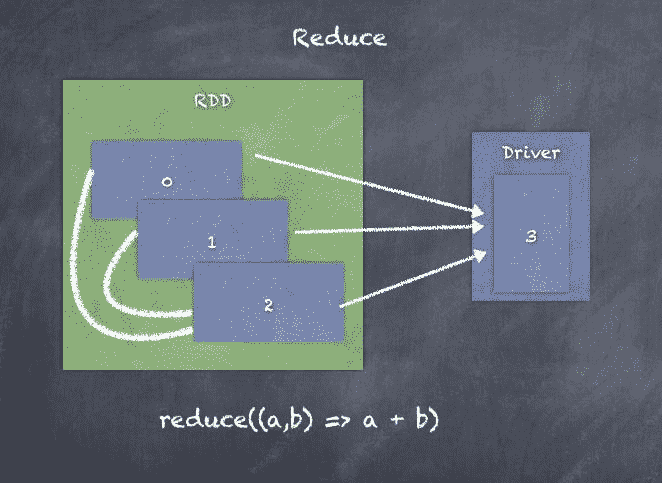

# count

`count()`简单地计算 RDD 中的元素数量并将其发送到 Driver。

以下是这个函数的一个例子。我们使用 SparkContext 和 parallelize 函数从整数序列创建了一个 RDD，然后调用 RDD 上的 count 函数来打印 RDD 中元素的数量。

```scala
scala> val rdd_one = sc.parallelize(Seq(1,2,3,4,5,6))
rdd_one: org.apache.spark.rdd.RDD[Int] = ParallelCollectionRDD[26] at parallelize at <console>:24

scala> rdd_one.count
res24: Long = 6

```

以下是`count()`的说明。Driver 要求每个执行器/任务计算任务处理的分区中元素的数量，然后在 Driver 级别将所有任务的计数相加。

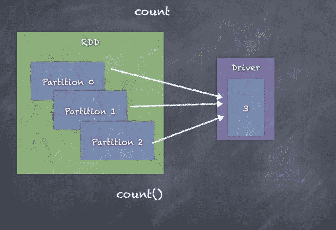

# collect

`collect()`简单地收集 RDD 中的所有元素并将其发送到 Driver。

这里展示了 collect 函数的一个例子。当你在 RDD 上调用 collect 时，Driver 会通过将 RDD 的所有元素拉到 Driver 上来收集它们。

在大型 RDD 上调用 collect 会导致 Driver 出现内存不足的问题。

下面显示了收集 RDD 的内容并显示它的代码：

```scala
scala> rdd_two.collect
res25: Array[String] = Array(Apache Spark provides programmers with an application programming interface centered on a data structure called the resilient distributed dataset (RDD), a read-only multiset of data items distributed over a cluster of machines, that is maintained in a fault-tolerant way., It was developed in response to limitations in the MapReduce cluster computing paradigm, which forces a particular linear dataflow structure on distributed programs., "MapReduce programs read input data from disk, map a function across the data, reduce the results of the map, and store reduction results on disk. ", Spark's RDDs function as a working set for distributed programs that offers a (deliberately) restricted form of distributed shared memory., The availability of RDDs facilitates t...

```

以下是`collect()`的说明。使用 collect，Driver 从所有分区中拉取 RDD 的所有元素。

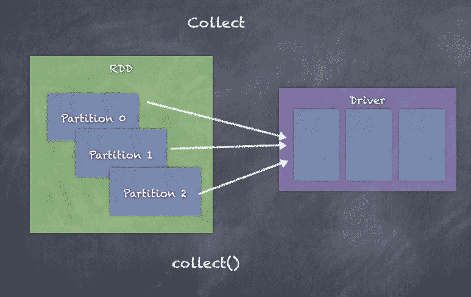

# 缓存

缓存使 Spark 能够在计算和操作之间持久保存数据。事实上，这是 Spark 中最重要的技术之一，可以加速计算，特别是在处理迭代计算时。

缓存通过尽可能多地将 RDD 存储在内存中来工作。如果内存不足，那么根据 LRU 策略会将当前存储中的数据清除。如果要缓存的数据大于可用内存，性能将下降，因为将使用磁盘而不是内存。

您可以使用`persist()`或`cache()`将 RDD 标记为已缓存

`cache()`只是`persist`(MEMORY_ONLY)的同义词

`persist`可以使用内存或磁盘或两者：

```scala
persist(newLevel: StorageLevel) 

```

以下是存储级别的可能值：

| 存储级别 | 含义 |
| --- | --- |
| `MEMORY_ONLY` | 将 RDD 存储为 JVM 中的反序列化 Java 对象。如果 RDD 不适合内存，则某些分区将不会被缓存，并且每次需要时都会在飞行中重新计算。这是默认级别。 |
| `MEMORY_AND_DISK` | 将 RDD 存储为 JVM 中的反序列化 Java 对象。如果 RDD 不适合内存，则将不适合内存的分区存储在磁盘上，并在需要时从磁盘中读取它们。 |
| `MEMORY_ONLY_SER`（Java 和 Scala） | 将 RDD 存储为序列化的 Java 对象（每个分区一个字节数组）。通常情况下，这比反序列化对象更节省空间，特别是在使用快速序列化器时，但读取时更消耗 CPU。 |
| `MEMORY_AND_DISK_SER`（Java 和 Scala） | 类似于`MEMORY_ONLY_SER`，但将不适合内存的分区溢出到磁盘，而不是每次需要时动态重新计算它们。 |
| `DISK_ONLY` | 仅将 RDD 分区存储在磁盘上。 |
| `MEMORY_ONLY_2`，`MEMORY_AND_DISK_2`等 | 与前面的级别相同，但在两个集群节点上复制每个分区。 |
| `OFF_HEAP`（实验性） | 类似于`MEMORY_ONLY_SER`，但将数据存储在堆外内存中。这需要启用堆外内存。 |

选择的存储级别取决于情况

+   如果 RDD 适合内存，则使用`MEMORY_ONLY`，因为这是执行性能最快的选项

+   尝试`MEMORY_ONLY_SER`，如果使用了可序列化对象，以使对象更小

+   除非您的计算成本很高，否则不应使用`DISK`。

+   如果可以承受额外的内存，使用复制存储以获得最佳的容错性。这将防止丢失分区的重新计算，以获得最佳的可用性。

`unpersist()`只是释放缓存的内容。

以下是使用不同类型的存储（内存或磁盘）调用`persist()`函数的示例：

```scala
scala> import org.apache.spark.storage.StorageLevel
import org.apache.spark.storage.StorageLevel

scala> rdd_one.persist(StorageLevel.MEMORY_ONLY)
res37: rdd_one.type = ParallelCollectionRDD[26] at parallelize at <console>:24

scala> rdd_one.unpersist()
res39: rdd_one.type = ParallelCollectionRDD[26] at parallelize at <console>:24

scala> rdd_one.persist(StorageLevel.DISK_ONLY)
res40: rdd_one.type = ParallelCollectionRDD[26] at parallelize at <console>:24

scala> rdd_one.unpersist()
res41: rdd_one.type = ParallelCollectionRDD[26] at parallelize at <console>:24

```

以下是缓存带来的性能改进的示例。

首先，我们将运行代码：

```scala
scala> val rdd_one = sc.parallelize(Seq(1,2,3,4,5,6))
rdd_one: org.apache.spark.rdd.RDD[Int] = ParallelCollectionRDD[0] at parallelize at <console>:24

scala> rdd_one.count
res0: Long = 6

scala> rdd_one.cache
res1: rdd_one.type = ParallelCollectionRDD[0] at parallelize at <console>:24

scala> rdd_one.count
res2: Long = 6

```

您可以使用 WebUI 查看所示的改进，如以下屏幕截图所示：

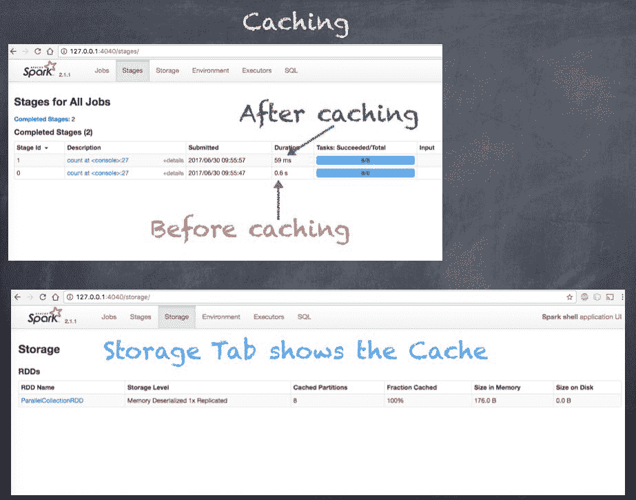

# 加载和保存数据

将数据加载到 RDD 和将 RDD 保存到输出系统都支持多种不同的方法。我们将在本节中介绍最常见的方法。

# 加载数据

通过使用`SparkContext`可以将数据加载到 RDD 中。一些最常见的方法是：

+   `textFile`

+   `wholeTextFiles`

+   从 JDBC 数据源加载

# textFile

`textFile()`可用于将 textFiles 加载到 RDD 中，每行成为 RDD 中的一个元素。

```scala
sc.textFile(name, minPartitions=None, use_unicode=True)

```

以下是使用`textFile()`将`textfile`加载到 RDD 中的示例：

```scala
scala> val rdd_two = sc.textFile("wiki1.txt")
rdd_two: org.apache.spark.rdd.RDD[String] = wiki1.txt MapPartitionsRDD[8] at textFile at <console>:24

scala> rdd_two.count
res6: Long = 9

```

# wholeTextFiles

`wholeTextFiles()`可用于将多个文本文件加载到包含对`<filename，textOfFile>`的配对 RDD 中，表示文件名和文件的整个内容。这在加载多个小文本文件时很有用，并且与`textFile` API 不同，因为使用整个`TextFiles()`时，文件的整个内容将作为单个记录加载：

```scala
sc.wholeTextFiles(path, minPartitions=None, use_unicode=True)

```

以下是使用`wholeTextFiles()`将`textfile`加载到 RDD 中的示例：

```scala
scala> val rdd_whole = sc.wholeTextFiles("wiki1.txt")
rdd_whole: org.apache.spark.rdd.RDD[(String, String)] = wiki1.txt MapPartitionsRDD[37] at wholeTextFiles at <console>:25

scala> rdd_whole.take(10)
res56: Array[(String, String)] =
Array((file:/Users/salla/spark-2.1.1-bin-hadoop2.7/wiki1.txt,Apache Spark provides programmers with an application programming interface centered on a data structure called the resilient distributed dataset (RDD), a read-only multiset of data 

```

# 从 JDBC 数据源加载

您可以从支持**Java 数据库连接**（**JDBC**）的外部数据源加载数据。使用 JDBC 驱动程序，您可以连接到关系数据库，如 Mysql，并将表的内容加载到 Spark 中，如下面的代码片段所示：

```scala
 sqlContext.load(path=None, source=None, schema=None, **options)

```

以下是从 JDBC 数据源加载的示例：

```scala
val dbContent = sqlContext.load(source="jdbc",  url="jdbc:mysql://localhost:3306/test",  dbtable="test",  partitionColumn="id")

```

# 保存 RDD

将数据从 RDD 保存到文件系统可以通过以下方式之一完成：

+   `saveAsTextFile`

+   `saveAsObjectFile`

以下是将 RDD 保存到文本文件的示例

```scala
scala> rdd_one.saveAsTextFile("out.txt")

```

在集成 HBase、Cassandra 等时，还有许多其他加载和保存数据的方法。

# 摘要

在本章中，我们讨论了 Apache Spark 的内部工作原理，RDD 是什么，DAG 和 RDD 的血统，转换和操作。我们还看了 Apache Spark 使用独立、YARN 和 Mesos 部署的各种部署模式。我们还在本地机器上进行了本地安装，然后看了 Spark shell 以及如何与 Spark 进行交互。

此外，我们还研究了将数据加载到 RDD 中以及将 RDD 保存到外部系统以及 Spark 卓越性能的秘密武器，缓存功能以及如何使用内存和/或磁盘来优化性能。

在下一章中，我们将深入研究 RDD API 以及它在《第七章》*特殊 RDD 操作*中的全部工作原理。
