# 第七章：特殊的 RDD 操作

“它应该是自动的，但实际上你必须按下这个按钮。”

- 约翰·布鲁纳

在本章中，您将了解如何根据不同的需求定制 RDD，以及这些 RDD 如何提供新的功能（和危险！）此外，我们还将研究 Spark 提供的其他有用对象，如广播变量和累加器。

简而言之，本章将涵盖以下主题：

+   RDD 的类型

+   聚合

+   分区和洗牌

+   广播变量

+   累加器

# RDD 的类型

**弹性分布式数据集**（**RDD**）是 Apache Spark 中使用的基本对象。RDD 是不可变的集合，代表数据集，并具有内置的可靠性和故障恢复能力。根据性质，RDD 在任何操作（如转换或动作）时创建新的 RDD。它们还存储血统，用于从故障中恢复。在上一章中，我们还看到了有关如何创建 RDD 以及可以应用于 RDD 的操作的一些详细信息。

以下是 RDD 血统的简单示例：

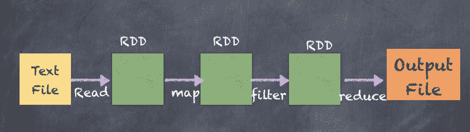

让我们再次从一系列数字创建最简单的 RDD 开始查看：

```scala
scala> val rdd_one = sc.parallelize(Seq(1,2,3,4,5,6))
rdd_one: org.apache.spark.rdd.RDD[Int] = ParallelCollectionRDD[28] at parallelize at <console>:25

scala> rdd_one.take(100)
res45: Array[Int] = Array(1, 2, 3, 4, 5, 6)

```

前面的示例显示了整数 RDD，对 RDD 进行的任何操作都会产生另一个 RDD。例如，如果我们将每个元素乘以`3`，结果将显示在以下片段中：

```scala
scala> val rdd_two = rdd_one.map(i => i * 3)
rdd_two: org.apache.spark.rdd.RDD[Int] = MapPartitionsRDD[29] at map at <console>:27

scala> rdd_two.take(10)
res46: Array[Int] = Array(3, 6, 9, 12, 15, 18)

```

让我们再做一个操作，将每个元素加`2`，并打印所有三个 RDD：

```scala
scala> val rdd_three = rdd_two.map(i => i+2)
rdd_three: org.apache.spark.rdd.RDD[Int] = MapPartitionsRDD[30] at map at <console>:29

scala> rdd_three.take(10)
res47: Array[Int] = Array(5, 8, 11, 14, 17, 20)

```

一个有趣的事情是使用`toDebugString`函数查看每个 RDD 的血统：

```scala
scala> rdd_one.toDebugString
res48: String = (8) ParallelCollectionRDD[28] at parallelize at <console>:25 []

scala> rdd_two.toDebugString
res49: String = (8) MapPartitionsRDD[29] at map at <console>:27 []
 | ParallelCollectionRDD[28] at parallelize at <console>:25 []

scala> rdd_three.toDebugString
res50: String = (8) MapPartitionsRDD[30] at map at <console>:29 []
 | MapPartitionsRDD[29] at map at <console>:27 []
 | ParallelCollectionRDD[28] at parallelize at <console>:25 []

```

以下是在 Spark web UI 中显示的血统：

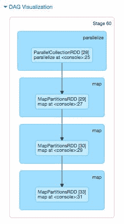

RDD 不需要与第一个 RDD（整数）相同的数据类型。以下是一个 RDD，它写入了一个不同数据类型的元组（字符串，整数）。

```scala
scala> val rdd_four = rdd_three.map(i => ("str"+(i+2).toString, i-2))
rdd_four: org.apache.spark.rdd.RDD[(String, Int)] = MapPartitionsRDD[33] at map at <console>:31

scala> rdd_four.take(10)
res53: Array[(String, Int)] = Array((str7,3), (str10,6), (str13,9), (str16,12), (str19,15), (str22,18))

```

以下是`StatePopulation`文件的 RDD，其中每个记录都转换为`upperCase`。

```scala
scala> val upperCaseRDD = statesPopulationRDD.map(_.toUpperCase)
upperCaseRDD: org.apache.spark.rdd.RDD[String] = MapPartitionsRDD[69] at map at <console>:27

scala> upperCaseRDD.take(10)
res86: Array[String] = Array(STATE,YEAR,POPULATION, ALABAMA,2010,4785492, ALASKA,2010,714031, ARIZONA,2010,6408312, ARKANSAS,2010,2921995, CALIFORNIA,2010,37332685, COLORADO,2010,5048644, DELAWARE,2010,899816, DISTRICT OF COLUMBIA,2010,605183, FLORIDA,2010,18849098)

```

以下是前述转换的图表：

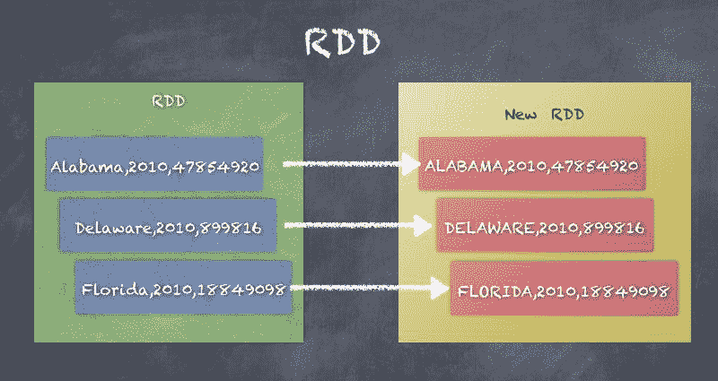

# Pair RDD

Pair RDD 是由键值元组组成的 RDD，适用于许多用例，如聚合、排序和连接数据。键和值可以是简单类型，如整数和字符串，也可以是更复杂的类型，如案例类、数组、列表和其他类型的集合。基于键值的可扩展数据模型提供了许多优势，并且是 MapReduce 范式背后的基本概念。

通过对任何 RDD 应用转换来轻松创建`PairRDD`，将 RDD 转换为键值对的 RDD。

让我们使用`SparkContext`将`statesPopulation.csv`读入 RDD，该`SparkContext`可用作`sc`。

以下是一个基本 RDD 的示例，显示了州人口以及相同 RDD 的`PairRDD`是什么样子，将记录拆分为州和人口的元组（对）：

```scala
scala> val statesPopulationRDD = sc.textFile("statesPopulation.csv") statesPopulationRDD: org.apache.spark.rdd.RDD[String] = statesPopulation.csv MapPartitionsRDD[47] at textFile at <console>:25
 scala> statesPopulationRDD.first
res4: String = State,Year,Population

scala> statesPopulationRDD.take(5)
res5: Array[String] = Array(State,Year,Population, Alabama,2010,4785492, Alaska,2010,714031, Arizona,2010,6408312, Arkansas,2010,2921995)

scala> val pairRDD = statesPopulationRDD.map(record => (record.split(",")(0), record.split(",")(2)))
pairRDD: org.apache.spark.rdd.RDD[(String, String)] = MapPartitionsRDD[48] at map at <console>:27

scala> pairRDD.take(10)
res59: Array[(String, String)] = Array((Alabama,4785492), (Alaska,714031), (Arizona,6408312), (Arkansas,2921995), (California,37332685), (Colorado,5048644), (Delaware,899816), (District of Columbia,605183), (Florida,18849098))

```

以下是前面示例的图表，显示了 RDD 元素如何转换为`(键 - 值)`对：

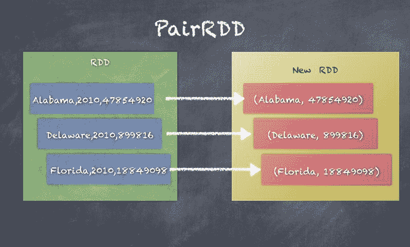

# DoubleRDD

DoubleRDD 是由一系列双精度值组成的 RDD。由于这个属性，许多统计函数可以与 DoubleRDD 一起使用。

以下是我们从一系列双精度数字创建 RDD 的 DoubleRDD 示例：

```scala
scala> val rdd_one = sc.parallelize(Seq(1.0,2.0,3.0))
rdd_one: org.apache.spark.rdd.RDD[Double] = ParallelCollectionRDD[52] at parallelize at <console>:25

scala> rdd_one.mean
res62: Double = 2.0

scala> rdd_one.min
res63: Double = 1.0

scala> rdd_one.max
res64: Double = 3.0

scala> rdd_one.stdev
res65: Double = 0.816496580927726

```

以下是 DoubleRDD 的图表，以及如何在 DoubleRDD 上运行`sum()`函数：

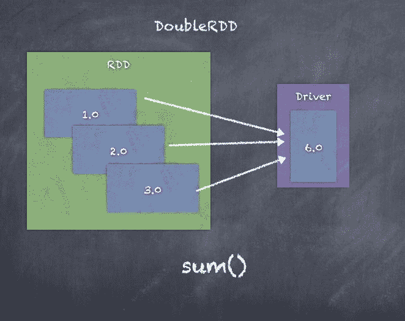

# SequenceFileRDD

`SequenceFileRDD`是从 Hadoop 文件系统中的`SequenceFile`创建的格式。`SequenceFile`可以是压缩或未压缩的。

Map Reduce 进程可以使用 SequenceFiles，这是键和值的对。键和值是 Hadoop 可写数据类型，如 Text、IntWritable 等。

以下是一个`SequenceFileRDD`的示例，显示了如何写入和读取`SequenceFile`：

```scala
scala> val pairRDD = statesPopulationRDD.map(record => (record.split(",")(0), record.split(",")(2)))
pairRDD: org.apache.spark.rdd.RDD[(String, String)] = MapPartitionsRDD[60] at map at <console>:27

scala> pairRDD.saveAsSequenceFile("seqfile")

scala> val seqRDD = sc.sequenceFileString, String
seqRDD: org.apache.spark.rdd.RDD[(String, String)] = MapPartitionsRDD[62] at sequenceFile at <console>:25

scala> seqRDD.take(10)
res76: Array[(String, String)] = Array((State,Population), (Alabama,4785492), (Alaska,714031), (Arizona,6408312), (Arkansas,2921995), (California,37332685), (Colorado,5048644), (Delaware,899816), (District of Columbia,605183), (Florida,18849098))

```

以下是在前面示例中看到的**SequenceFileRDD**的图表：

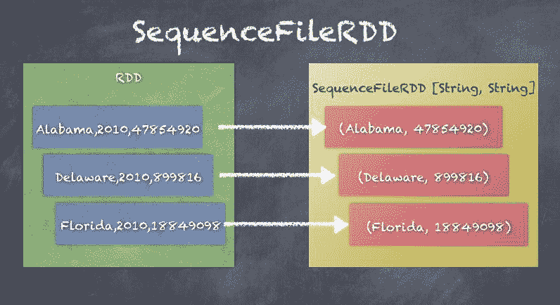

# CoGroupedRDD

`CoGroupedRDD`是一个 cogroup 其父级的 RDD。这个工作的两个父 RDD 都必须是 pairRDDs，因为 cogroup 实质上生成一个由来自两个父 RDD 的公共键和值列表组成的 pairRDD。看一下下面的代码片段：

```scala
class CoGroupedRDD[K] extends RDD[(K, Array[Iterable[_]])] 

```

以下是一个 CoGroupedRDD 的示例，我们在其中创建了两个 pairRDDs 的 cogroup，一个具有州、人口对，另一个具有州、年份对：

```scala
scala> val pairRDD = statesPopulationRDD.map(record => (record.split(",")(0), record.split(",")(2)))
pairRDD: org.apache.spark.rdd.RDD[(String, String)] = MapPartitionsRDD[60] at map at <console>:27

scala> val pairRDD2 = statesPopulationRDD.map(record => (record.split(",")(0), record.split(",")(1)))
pairRDD2: org.apache.spark.rdd.RDD[(String, String)] = MapPartitionsRDD[66] at map at <console>:27

scala> val cogroupRDD = pairRDD.cogroup(pairRDD2)
cogroupRDD: org.apache.spark.rdd.RDD[(String, (Iterable[String], Iterable[String]))] = MapPartitionsRDD[68] at cogroup at <console>:31

scala> cogroupRDD.take(10)
res82: Array[(String, (Iterable[String], Iterable[String]))] = Array((Montana,(CompactBuffer(990641, 997821, 1005196, 1014314, 1022867, 1032073, 1042520),CompactBuffer(2010, 2011, 2012, 2013, 2014, 2015, 2016))), (California,(CompactBuffer(37332685, 37676861, 38011074, 38335203, 38680810, 38993940, 39250017),CompactBuffer(2010, 2011, 2012, 2013, 2014, 2015, 2016))),

```

下面是通过为每个键创建值对的**pairRDD**和**pairRDD2**的 cogroup 的图表：

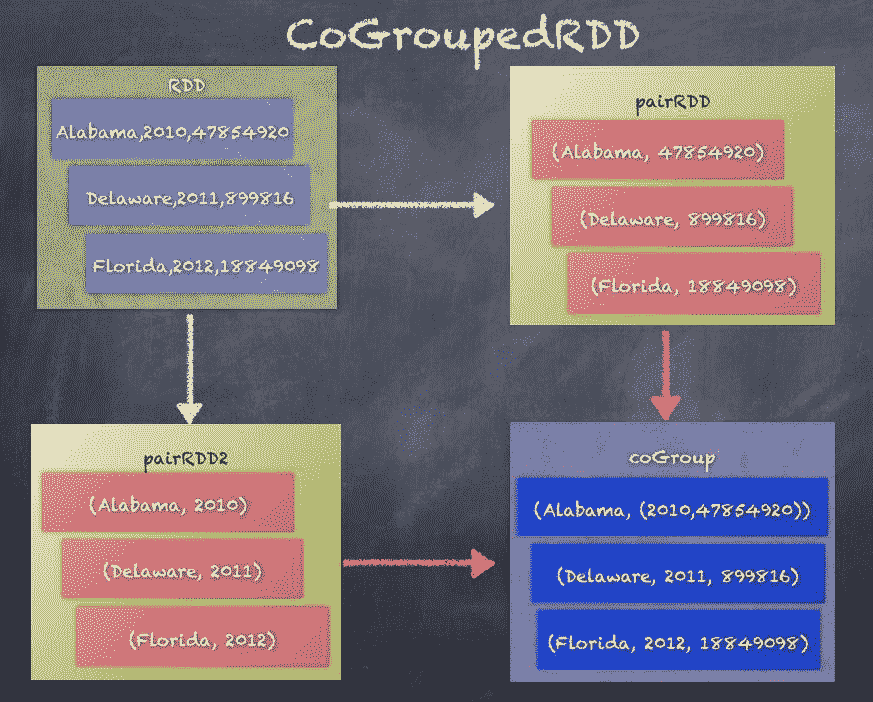

# ShuffledRDD

`ShuffledRDD`通过键对 RDD 元素进行洗牌，以便在同一个执行器上累积相同键的值，以允许聚合或组合逻辑。一个很好的例子是看看在 PairRDD 上调用`reduceByKey()`时会发生什么：

```scala
class ShuffledRDD[K, V, C] extends RDD[(K, C)] 

```

以下是对`pairRDD`进行`reduceByKey`操作，以按州聚合记录的示例：

```scala
scala> val pairRDD = statesPopulationRDD.map(record => (record.split(",")(0), 1))
pairRDD: org.apache.spark.rdd.RDD[(String, Int)] = MapPartitionsRDD[82] at map at <console>:27

scala> pairRDD.take(5)
res101: Array[(String, Int)] = Array((State,1), (Alabama,1), (Alaska,1), (Arizona,1), (Arkansas,1))

scala> val shuffledRDD = pairRDD.reduceByKey(_+_)
shuffledRDD: org.apache.spark.rdd.RDD[(String, Int)] = ShuffledRDD[83] at reduceByKey at <console>:29

scala> shuffledRDD.take(5)
res102: Array[(String, Int)] = Array((Montana,7), (California,7), (Washington,7), (Massachusetts,7), (Kentucky,7))

```

以下图表是按键进行洗牌以将相同键（州）的记录发送到相同分区的示例：

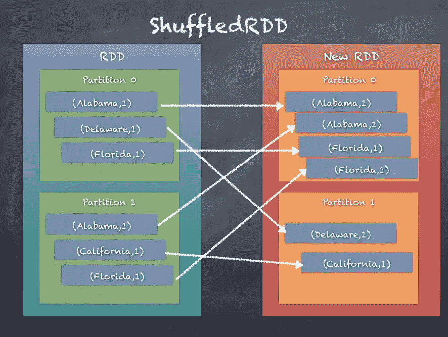

# UnionRDD

`UnionRDD`是两个 RDD 的并集操作的结果。Union 简单地创建一个包含来自两个 RDD 的元素的 RDD，如下面的代码片段所示：

```scala
class UnionRDDT: ClassTag extends RDDT

UnionRDD by combining the elements of the two RDDs:
```

```scala
scala> val rdd_one = sc.parallelize(Seq(1,2,3))
rdd_one: org.apache.spark.rdd.RDD[Int] = ParallelCollectionRDD[85] at parallelize at <console>:25

scala> val rdd_two = sc.parallelize(Seq(4,5,6))
rdd_two: org.apache.spark.rdd.RDD[Int] = ParallelCollectionRDD[86] at parallelize at <console>:25

scala> val rdd_one = sc.parallelize(Seq(1,2,3))
rdd_one: org.apache.spark.rdd.RDD[Int] = ParallelCollectionRDD[87] at parallelize at <console>:25

scala> rdd_one.take(10)
res103: Array[Int] = Array(1, 2, 3)

scala> val rdd_two = sc.parallelize(Seq(4,5,6))
rdd_two: org.apache.spark.rdd.RDD[Int] = ParallelCollectionRDD[88] at parallelize at <console>:25

scala> rdd_two.take(10)
res104: Array[Int] = Array(4, 5, 6)

scala> val unionRDD = rdd_one.union(rdd_two)
unionRDD: org.apache.spark.rdd.RDD[Int] = UnionRDD[89] at union at <console>:29

scala> unionRDD.take(10)
res105: Array[Int] = Array(1, 2, 3, 4, 5, 6)

```

下面的图表是两个 RDD 的并集的示例，其中来自**RDD 1**和**RDD 2**的元素被合并到一个新的 RDD **UnionRDD**中：

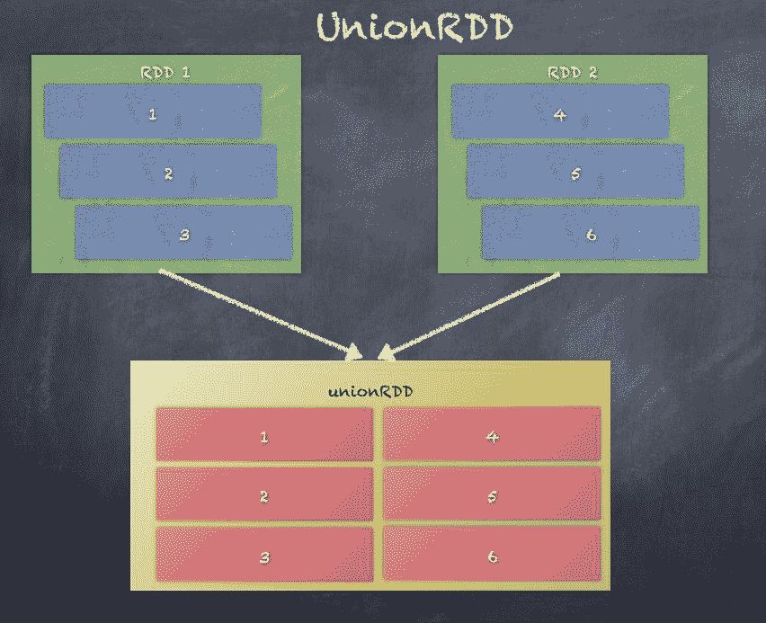

# HadoopRDD

`HadoopRDD`提供了使用 Hadoop 1.x 库的 MapReduce API 从 HDFS 中读取数据的核心功能。`HadoopRDD`是默认使用的，可以在从任何文件系统加载数据到 RDD 时看到：

```scala
class HadoopRDD[K, V] extends RDD[(K, V)]

```

当从 CSV 加载州人口记录时，底层基本 RDD 实际上是`HadoopRDD`，如下面的代码片段所示：

```scala
scala> val statesPopulationRDD = sc.textFile("statesPopulation.csv")
statesPopulationRDD: org.apache.spark.rdd.RDD[String] = statesPopulation.csv MapPartitionsRDD[93] at textFile at <console>:25

scala> statesPopulationRDD.toDebugString
res110: String =
(2) statesPopulation.csv MapPartitionsRDD[93] at textFile at <console>:25 []
 | statesPopulation.csv HadoopRDD[92] at textFile at <console>:25 []

```

下面的图表是通过将文本文件从文件系统加载到 RDD 中创建的**HadoopRDD**的示例：

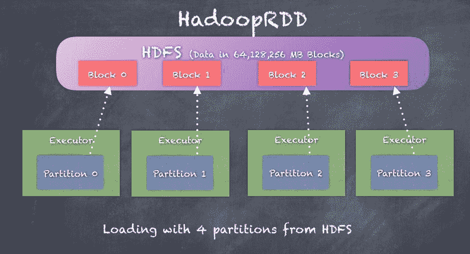

# NewHadoopRDD

`NewHadoopRDD`提供了使用 Hadoop 2.x 库的新 MapReduce API 从 HDFS、HBase 表、Amazon S3 中读取数据的核心功能。`NewHadoopRDD`可以从许多不同的格式中读取数据，因此用于与多个外部系统交互。

在`NewHadoopRDD`之前，`HadoopRDD`是唯一可用的选项，它使用了 Hadoop 1.x 的旧 MapReduce API

```scala
class NewHadoopRDDK, V
extends RDD[(K, V)]

NewHadoopRDD takes an input format class, a key class, and a value class. Let's look at examples of NewHadoopRDD.
```

最简单的例子是使用 SparkContext 的`wholeTextFiles`函数创建`WholeTextFileRDD`。现在，`WholeTextFileRDD`实际上扩展了`NewHadoopRDD`，如下面的代码片段所示：

```scala
scala> val rdd_whole = sc.wholeTextFiles("wiki1.txt")
rdd_whole: org.apache.spark.rdd.RDD[(String, String)] = wiki1.txt MapPartitionsRDD[3] at wholeTextFiles at <console>:31

scala> rdd_whole.toDebugString
res9: String =
(1) wiki1.txt MapPartitionsRDD[3] at wholeTextFiles at <console>:31 []
 | WholeTextFileRDD[2] at wholeTextFiles at <console>:31 []

```

让我们看另一个例子，我们将使用`SparkContext`的`newAPIHadoopFile`函数：

```scala
import org.apache.hadoop.mapreduce.lib.input.KeyValueTextInputFormat

import org.apache.hadoop.io.Text

val newHadoopRDD = sc.newAPIHadoopFile("statesPopulation.csv", classOf[KeyValueTextInputFormat], classOf[Text],classOf[Text])

```

# 聚合

聚合技术允许您以任意方式组合 RDD 中的元素以执行一些计算。事实上，聚合是大数据分析中最重要的部分。没有聚合，我们将无法生成报告和分析，比如*按人口排名的州*，这似乎是在给定过去 200 年所有州人口的数据集时提出的一个合乎逻辑的问题。另一个更简单的例子是只需计算 RDD 中元素的数量，这要求执行器计算每个分区中的元素数量并发送给 Driver，然后将子集相加以计算 RDD 中元素的总数。

在本节中，我们的主要重点是聚合函数，用于按键收集和组合数据。正如本章前面所看到的，PairRDD 是一个(key - value)对的 RDD，其中 key 和 value 是任意的，并且可以根据用例进行自定义。

在我们的州人口示例中，PairRDD 可以是`<State，<Population，Year>>`的对，这意味着`State`被视为键，元组`<Population，Year>`被视为值。通过这种方式分解键和值可以生成诸如*每个州人口最多的年份*之类的聚合。相反，如果我们的聚合是围绕年份进行的，比如*每年人口最多的州*，我们可以使用`<Year，<State，Population>>`的`pairRDD`。

以下是从`StatePopulation`数据集生成`pairRDD`的示例代码，其中`State`作为键，`Year`也作为键：

```scala
scala> val statesPopulationRDD = sc.textFile("statesPopulation.csv")
statesPopulationRDD: org.apache.spark.rdd.RDD[String] = statesPopulation.csv MapPartitionsRDD[157] at textFile at <console>:26

scala> statesPopulationRDD.take(5)
res226: Array[String] = Array(State,Year,Population, Alabama,2010,4785492, Alaska,2010,714031, Arizona,2010,6408312, Arkansas,2010,2921995)

```

接下来，我们可以生成一个`pairRDD`，使用`State`作为键，`<Year，Population>`元组作为值，如下面的代码片段所示：

```scala
scala> val pairRDD = statesPopulationRDD.map(record => record.split(",")).map(t => (t(0), (t(1), t(2))))
pairRDD: org.apache.spark.rdd.RDD[(String, (String, String))] = MapPartitionsRDD[160] at map at <console>:28

scala> pairRDD.take(5)
res228: Array[(String, (String, String))] = Array((State,(Year,Population)), (Alabama,(2010,4785492)), (Alaska,(2010,714031)), (Arizona,(2010,6408312)), (Arkansas,(2010,2921995)))

```

如前所述，我们还可以生成一个`PairRDD`，使用`Year`作为键，`<State，Population>`元组作为值，如下面的代码片段所示：

```scala
scala> val pairRDD = statesPopulationRDD.map(record => record.split(",")).map(t => (t(1), (t(0), t(2))))
pairRDD: org.apache.spark.rdd.RDD[(String, (String, String))] = MapPartitionsRDD[162] at map at <console>:28

scala> pairRDD.take(5)
res229: Array[(String, (String, String))] = Array((Year,(State,Population)), (2010,(Alabama,4785492)), (2010,(Alaska,714031)), (2010,(Arizona,6408312)), (2010,(Arkansas,2921995)))

```

现在我们将看看如何在`<State，<Year，Population>>`的`pairRDD`上使用常见的聚合函数：

+   `groupByKey`

+   `reduceByKey`

+   `aggregateByKey`

+   `combineByKey`

# groupByKey

`groupByKey`将 RDD 中每个键的值分组为单个序列。`groupByKey`还允许通过传递分区器来控制生成的键值对 RDD 的分区。默认情况下，使用`HashPartitioner`，但可以作为参数给出自定义分区器。每个组内元素的顺序不能保证，并且每次评估结果 RDD 时甚至可能不同。

`groupByKey`是一个昂贵的操作，因为需要所有的数据洗牌。`reduceByKey`或`aggregateByKey`提供了更好的性能。我们将在本节的后面进行讨论。

`groupByKey`可以使用自定义分区器调用，也可以只使用默认的`HashPartitioner`，如下面的代码片段所示：

```scala
def groupByKey(partitioner: Partitioner): RDD[(K, Iterable[V])] 

def groupByKey(numPartitions: Int): RDD[(K, Iterable[V])] 

```

目前实现的`groupByKey`必须能够在内存中保存任何键的所有键值对。如果一个键有太多的值，可能会导致`OutOfMemoryError`。

`groupByKey`通过将分区的所有元素发送到基于分区器的分区，以便将相同键的所有键值对收集到同一分区中。完成此操作后，可以轻松进行聚合操作。

这里显示了调用`groupByKey`时发生的情况的示例：

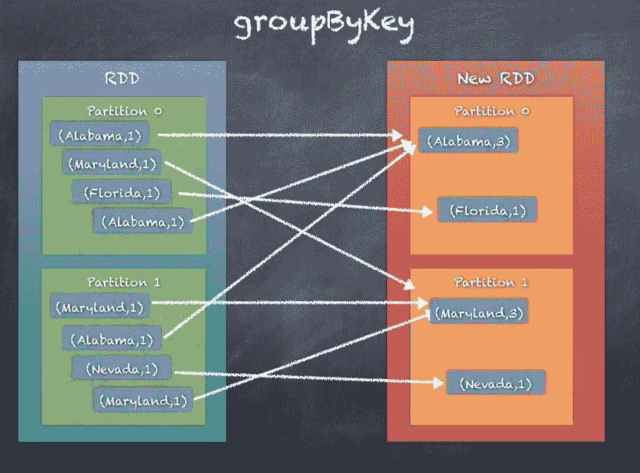

# reduceByKey

`groupByKey`涉及大量的数据洗牌，而`reduceByKey`倾向于通过不使用洗牌发送`PairRDD`的所有元素来提高性能，而是使用本地组合器首先在本地进行一些基本的聚合，然后像`groupByKey`一样发送结果元素。这大大减少了数据传输，因为我们不需要发送所有内容。`reduceBykey`通过使用关联和可交换的减少函数合并每个键的值。当然，首先这将

还可以在每个 mapper 上本地执行合并，然后将结果发送到 reducer。

如果您熟悉 Hadoop MapReduce，这与 MapReduce 编程中的组合器非常相似。

`reduceByKey`可以使用自定义分区器调用，也可以只使用默认的`HashPartitioner`，如下面的代码片段所示：

```scala
def reduceByKey(partitioner: Partitioner, func: (V, V) => V): RDD[(K, V)]

def reduceByKey(func: (V, V) => V, numPartitions: Int): RDD[(K, V)] 

def reduceByKey(func: (V, V) => V): RDD[(K, V)] 

```

`reduceByKey`通过将分区的所有元素发送到基于`partitioner`的分区，以便将相同键的所有键值对收集到同一分区中。但在洗牌之前，还进行本地聚合，减少要洗牌的数据。完成此操作后，可以在最终分区中轻松进行聚合操作。

下图是调用`reduceBykey`时发生的情况的示例：

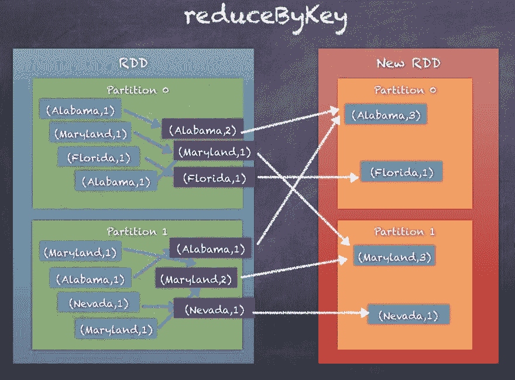

# aggregateByKey

`aggregateByKey`与`reduceByKey`非常相似，只是`aggregateByKey`允许更灵活和定制如何在分区内和分区之间进行聚合，以允许更复杂的用例，例如在一个函数调用中生成所有`<Year, Population>`对的列表以及每个州的总人口。

`aggregateByKey`通过使用给定的组合函数和中性初始/零值对每个键的值进行聚合。

这个函数可以返回一个不同的结果类型`U`，而不是这个 RDD`V`中的值的类型，这是最大的区别。因此，我们需要一个操作将`V`合并为`U`，以及一个操作将两个`U`合并。前一个操作用于在分区内合并值，后一个用于在分区之间合并值。为了避免内存分配，这两个函数都允许修改并返回它们的第一个参数，而不是创建一个新的`U`：

```scala
def aggregateByKeyU: ClassTag(seqOp: (U, V) => U,
 combOp: (U, U) => U): RDD[(K, U)] 

def aggregateByKeyU: ClassTag(seqOp: (U, V) => U,
 combOp: (U, U) => U): RDD[(K, U)] 

def aggregateByKeyU: ClassTag(seqOp: (U, V) => U,
 combOp: (U, U) => U): RDD[(K, U)] 

```

`aggregateByKey`通过在分区内对每个分区的所有元素进行聚合操作，然后在合并分区本身时应用另一个聚合逻辑来工作。最终，相同 Key 的所有（键-值）对都被收集在同一个分区中；然而，与`groupByKey`和`reduceByKey`中的固定输出不同，使用`aggregateByKey`时更灵活和可定制。

下图是调用`aggregateByKey`时发生的情况的示例。与`groupByKey`和`reduceByKey`中添加计数不同，这里我们为每个 Key 生成值列表：

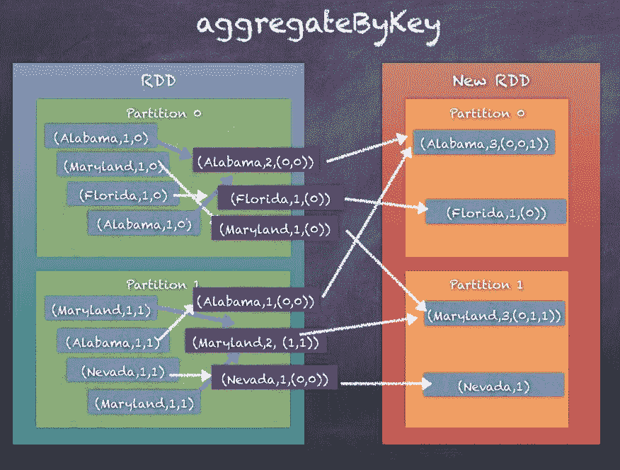

# combineByKey

`combineByKey`与`aggregateByKey`非常相似；实际上，`combineByKey`在内部调用`combineByKeyWithClassTag`，这也被`aggregateByKey`调用。与`aggregateByKey`一样，`combineByKey`也通过在每个分区内应用操作，然后在组合器之间工作。

`combineByKey`将`RDD[K,V]`转换为`RDD[K,C]`，其中`C`是在名称键`K`下收集或组合的 V 的列表。

调用 combineByKey 时期望有三个函数。

+   `createCombiner`，将`V`转换为`C`，这是一个元素列表

+   `mergeValue`将`V`合并到`C`中，将`V`附加到列表的末尾

+   `mergeCombiners`将两个 C 合并为一个

在`aggregateByKey`中，第一个参数只是一个零值，但在`combineByKey`中，我们提供了以当前值作为参数的初始函数。

`combineByKey`可以使用自定义分区器调用，也可以只使用默认的 HashPartitioner，如下面的代码片段所示：

```scala
def combineByKeyC => C, mergeCombiners: (C, C) => C, numPartitions: Int): RDD[(K, C)]

def combineByKeyC => C, mergeCombiners: (C, C) => C, partitioner: Partitioner, mapSideCombine: Boolean = true, serializer: Serializer = null): RDD[(K, C)]

```

`combineByKey`通过在分区内对每个分区的所有元素进行聚合操作，然后在合并分区本身时应用另一个聚合逻辑来工作。最终，相同 Key 的所有（键-值）对都被收集在同一个分区中，但是与`groupByKey`和`reduceByKey`中的固定输出不同，使用`combineByKey`时更灵活和可定制。

下图是调用`combineBykey`时发生的情况的示例：

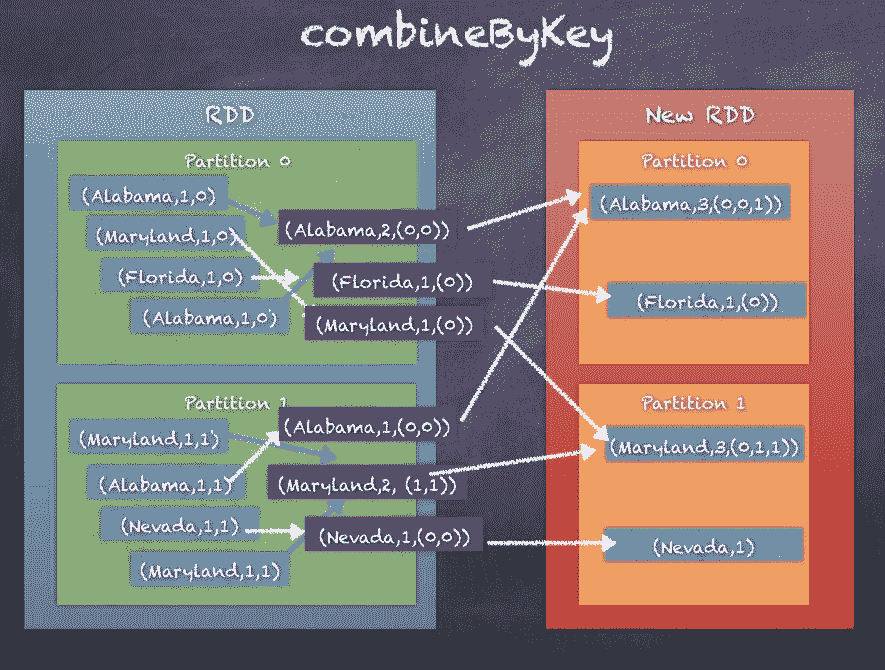

# groupByKey、reduceByKey、combineByKey 和 aggregateByKey 的比较

让我们考虑 StatePopulation RDD 生成一个`pairRDD`的例子，其中包含`<State, <Year, Population>>`。

`groupByKey`如前面的部分所示，将通过生成键的哈希码对`PairRDD`进行`HashPartitioning`，然后洗牌数据以在同一分区中收集每个键的值。这显然会导致过多的洗牌。

`reduceByKey`通过使用本地组合逻辑改进了`groupByKey`，以最小化在洗牌阶段发送的数据。结果与`groupByKey`相同，但性能更高。

`aggregateByKey`在工作方式上与`reduceByKey`非常相似，但有一个重大区别，这使它成为这三种方法中最强大的一个。`aggregateBykey`不需要在相同的数据类型上操作，并且可以在分区内进行不同的聚合，在分区之间进行不同的聚合。

`combineByKey`在性能上与`aggregateByKey`非常相似，除了用于创建组合器的初始函数。

要使用的函数取决于您的用例，但如果有疑问，只需参考本节关于*聚合*的部分，选择适合您用例的正确函数。此外，要特别关注下一节，因为*分区和洗牌*将在该部分中介绍。

以下是显示通过州计算总人口的四种方法的代码。

第 1 步。初始化 RDD：

```scala
scala> val statesPopulationRDD = sc.textFile("statesPopulation.csv").filter(_.split(",")(0) != "State") 
statesPopulationRDD: org.apache.spark.rdd.RDD[String] = statesPopulation.csv MapPartitionsRDD[1] at textFile at <console>:24

scala> statesPopulationRDD.take(10)
res27: Array[String] = Array(Alabama,2010,4785492, Alaska,2010,714031, Arizona,2010,6408312, Arkansas,2010,2921995, California,2010,37332685, Colorado,2010,5048644, Delaware,2010,899816, District of Columbia,2010,605183, Florida,2010,18849098, Georgia,2010,9713521)

```

第 2 步。转换为成对的 RDD：

```scala
scala> val pairRDD = statesPopulationRDD.map(record => record.split(",")).map(t => (t(0), (t(1).toInt, t(2).toInt)))
pairRDD: org.apache.spark.rdd.RDD[(String, (Int, Int))] = MapPartitionsRDD[26] at map at <console>:26

scala> pairRDD.take(10)
res15: Array[(String, (Int, Int))] = Array((Alabama,(2010,4785492)), (Alaska,(2010,714031)), (Arizona,(2010,6408312)), (Arkansas,(2010,2921995)), (California,(2010,37332685)), (Colorado,(2010,5048644)), (Delaware,(2010,899816)), (District of Columbia,(2010,605183)), (Florida,(2010,18849098)), (Georgia,(2010,9713521)))

```

第 3 步。groupByKey - 分组值，然后添加人口：

```scala
scala> val groupedRDD = pairRDD.groupByKey.map(x => {var sum=0; x._2.foreach(sum += _._2); (x._1, sum)})
groupedRDD: org.apache.spark.rdd.RDD[(String, Int)] = MapPartitionsRDD[38] at map at <console>:28

scala> groupedRDD.take(10)
res19: Array[(String, Int)] = Array((Montana,7105432), (California,268280590), (Washington,48931464), (Massachusetts,46888171), (Kentucky,30777934), (Pennsylvania,89376524), (Georgia,70021737), (Tennessee,45494345), (North Carolina,68914016), (Utah,20333580))

```

第 4 步。reduceByKey - 通过简单地添加人口来减少键的值：

```scala

scala> val reduceRDD = pairRDD.reduceByKey((x, y) => (x._1, x._2+y._2)).map(x => (x._1, x._2._2))
reduceRDD: org.apache.spark.rdd.RDD[(String, Int)] = MapPartitionsRDD[46] at map at <console>:28

scala> reduceRDD.take(10)
res26: Array[(String, Int)] = Array((Montana,7105432), (California,268280590), (Washington,48931464), (Massachusetts,46888171), (Kentucky,30777934), (Pennsylvania,89376524), (Georgia,70021737), (Tennessee,45494345), (North Carolina,68914016), (Utah,20333580))

```

第 5 步。按键聚合 - 聚合每个键下的人口并将它们相加：

```scala
Initialize the array
scala> val initialSet = 0
initialSet: Int = 0

provide function to add the populations within a partition
scala> val addToSet = (s: Int, v: (Int, Int)) => s+ v._2
addToSet: (Int, (Int, Int)) => Int = <function2>

provide funtion to add populations between partitions
scala> val mergePartitionSets = (p1: Int, p2: Int) => p1 + p2
mergePartitionSets: (Int, Int) => Int = <function2>

scala> val aggregatedRDD = pairRDD.aggregateByKey(initialSet)(addToSet, mergePartitionSets)
aggregatedRDD: org.apache.spark.rdd.RDD[(String, Int)] = ShuffledRDD[41] at aggregateByKey at <console>:34

scala> aggregatedRDD.take(10)
res24: Array[(String, Int)] = Array((Montana,7105432), (California,268280590), (Washington,48931464), (Massachusetts,46888171), (Kentucky,30777934), (Pennsylvania,89376524), (Georgia,70021737), (Tennessee,45494345), (North Carolina,68914016), (Utah,20333580))

```

第 6 步。combineByKey - 在分区内进行组合，然后合并组合器：

```scala
createcombiner function
scala> val createCombiner = (x:(Int,Int)) => x._2
createCombiner: ((Int, Int)) => Int = <function1>

function to add within partition
scala> val mergeValues = (c:Int, x:(Int, Int)) => c +x._2
mergeValues: (Int, (Int, Int)) => Int = <function2>

function to merge combiners
scala> val mergeCombiners = (c1:Int, c2:Int) => c1 + c2
mergeCombiners: (Int, Int) => Int = <function2>

scala> val combinedRDD = pairRDD.combineByKey(createCombiner, mergeValues, mergeCombiners)
combinedRDD: org.apache.spark.rdd.RDD[(String, Int)] = ShuffledRDD[42] at combineByKey at <console>:34

scala> combinedRDD.take(10)
res25: Array[(String, Int)] = Array((Montana,7105432), (California,268280590), (Washington,48931464), (Massachusetts,46888171), (Kentucky,30777934), (Pennsylvania,89376524), (Georgia,70021737), (Tennessee,45494345), (North Carolina,68914016), (Utah,20333580))

```

如您所见，所有四种聚合都产生相同的输出。只是它们的工作方式不同。

# 分区和洗牌

我们已经看到 Apache Spark 如何比 Hadoop 更好地处理分布式计算。我们还看到了内部工作，主要是基本数据结构，称为**弹性分布式数据集**（**RDD**）。RDD 是不可变的集合，代表数据集，并具有内置的可靠性和故障恢复能力。RDD 在数据上的操作不是作为单个数据块，而是在整个集群中分布的分区中管理和操作数据。因此，数据分区的概念对于 Apache Spark 作业的正常运行至关重要，并且可能对性能以及资源的利用方式产生重大影响。

RDD 由数据分区组成，所有操作都是在 RDD 的数据分区上执行的。诸如转换之类的几个操作是由执行器在正在操作的特定数据分区上执行的函数。然而，并非所有操作都可以通过在各自的执行器上对数据分区执行孤立的操作来完成。像聚合（在前面的部分中看到）这样的操作需要在整个集群中移动数据，这个阶段被称为**洗牌**。在本节中，我们将更深入地了解分区和洗牌的概念。

让我们通过执行以下代码来查看整数的简单 RDD。Spark 上下文的`parallelize`函数从整数序列创建 RDD。然后，使用`getNumPartitions()`函数，我们可以获取此 RDD 的分区数。

```scala
scala> val rdd_one = sc.parallelize(Seq(1,2,3))
rdd_one: org.apache.spark.rdd.RDD[Int] = ParallelCollectionRDD[120] at parallelize at <console>:25

scala> rdd_one.getNumPartitions
res202: Int = 8

```

RDD 可以如下图所示进行可视化，显示了 RDD 中的 8 个分区：

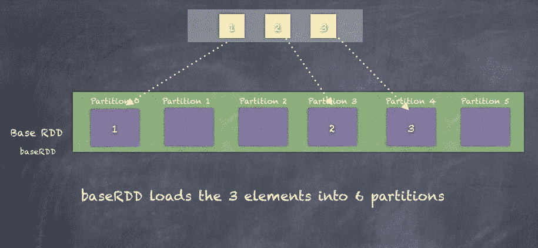

分区数很重要，因为这个数字直接影响将运行 RDD 转换的任务数量。如果分区数太小，那么我们将在大量数据上只使用少量 CPU/核心，从而导致性能较慢，并且使集群利用不足。另一方面，如果分区数太大，那么您将使用比实际需要更多的资源，在多租户环境中可能会导致为您或您团队中的其他作业运行的资源饥饿。

# 分区器

RDD 的分区是由分区器完成的。分区器为 RDD 中的元素分配分区索引。同一分区中的所有元素将具有相同的分区索引。

Spark 提供了两种分区器`HashPartitioner`和`RangePartitioner`。除此之外，您还可以实现自定义分区器。

# HashPartitioner

`HashPartitioner`是 Spark 中的默认分区器，它通过为 RDD 元素的每个键计算哈希值来工作。所有具有相同哈希码的元素最终都会进入同一个分区，如下面的代码片段所示：

```scala
partitionIndex = hashcode(key) % numPartitions

```

以下是 String `hashCode()`函数的示例，以及我们如何生成`partitionIndex`：

```scala
scala> val str = "hello"
str: String = hello

scala> str.hashCode
res206: Int = 99162322

scala> val numPartitions = 8
numPartitions: Int = 8

scala> val partitionIndex = str.hashCode % numPartitions
partitionIndex: Int = 2

```

默认分区数要么来自 Spark 配置参数`spark.default.parallelism`，要么来自集群中的核心数

以下图示说明了哈希分区的工作原理。我们有一个包含 3 个元素**a**、**b**和**e**的 RDD。使用 String 哈希码，我们可以根据设置的 6 个分区得到每个元素的`partitionIndex`：

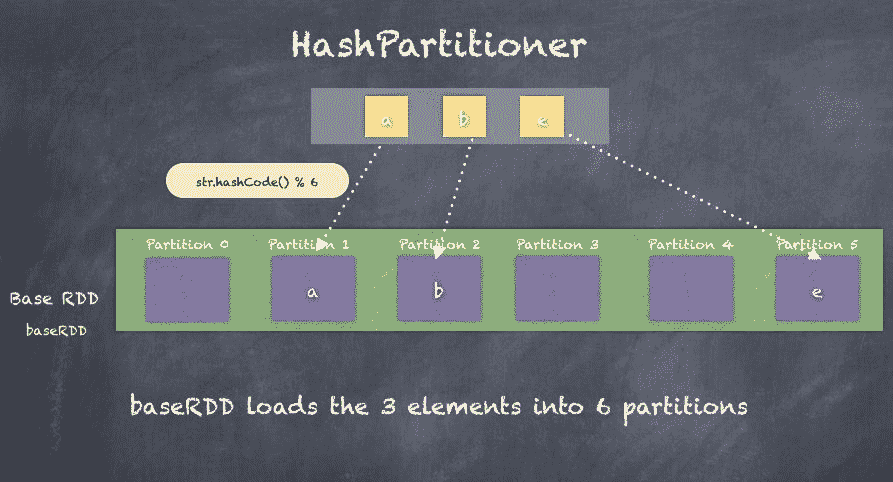

# RangePartitioner

`RangePartitioner`通过将 RDD 分区为大致相等的范围来工作。由于范围必须知道任何分区的起始和结束键，因此在使用`RangePartitioner`之前，RDD 需要首先进行排序。

`RangePartitioning` 首先需要根据 RDD 确定合理的分区边界，然后创建一个从键 K 到`partitionIndex`的函数，该函数确定元素所属的分区。最后，我们需要根据`RangePartitioner`重新分区 RDD，以便根据我们确定的范围正确分发 RDD 元素。

以下是我们如何使用`RangePartitioning`对`PairRDD`进行分区的示例。我们还可以看到在使用`RangePartitioner`重新分区 RDD 后分区发生了变化：

```scala
import org.apache.spark.RangePartitioner
scala> val statesPopulationRDD = sc.textFile("statesPopulation.csv")
statesPopulationRDD: org.apache.spark.rdd.RDD[String] = statesPopulation.csv MapPartitionsRDD[135] at textFile at <console>:26

scala> val pairRDD = statesPopulationRDD.map(record => (record.split(",")(0), 1))
pairRDD: org.apache.spark.rdd.RDD[(String, Int)] = MapPartitionsRDD[136] at map at <console>:28

scala> val rangePartitioner = new RangePartitioner(5, pairRDD)
rangePartitioner: org.apache.spark.RangePartitioner[String,Int] = org.apache.spark.RangePartitioner@c0839f25

scala> val rangePartitionedRDD = pairRDD.partitionBy(rangePartitioner)
rangePartitionedRDD: org.apache.spark.rdd.RDD[(String, Int)] = ShuffledRDD[130] at partitionBy at <console>:32

scala> pairRDD.mapPartitionsWithIndex((i,x) => Iterator(""+i + ":"+x.length)).take(10)
res215: Array[String] = Array(0:177, 1:174)

scala> rangePartitionedRDD.mapPartitionsWithIndex((i,x) => Iterator(""+i + ":"+x.length)).take(10)
res216: Array[String] = Array(0:70, 1:77, 2:70, 3:63, 4:71)

```

以下图示说明了`RangePartitioner`，就像在前面的示例中看到的那样：

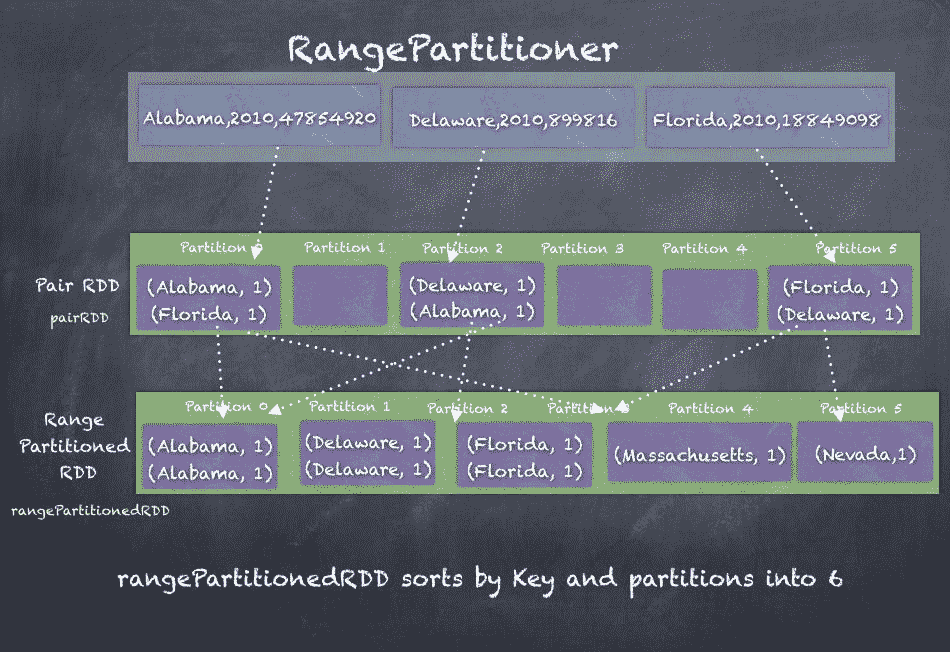

# 洗牌

无论使用何种分区器，许多操作都会导致 RDD 数据在分区之间进行重新分区。可以创建新分区，也可以合并/压缩多个分区。为了进行重新分区所需的所有数据移动都称为**shuffling**，这是编写 Spark 作业时需要理解的重要概念。洗牌可能会导致性能严重下降，因为计算不再在同一个执行器的内存中进行，而是执行器在网络上传输数据。

一个很好的例子是我们在*聚合*部分早些时候看到的`groupByKey()`的例子。显然，大量数据在执行器之间流动，以确保所有键的值都被收集到同一个执行器上执行`groupBy`操作。

Shuffling 还确定了 Spark 作业的执行过程，并影响作业如何分成阶段。正如我们在本章和上一章中所看到的，Spark 保存了 RDD 的 DAG，它代表了 RDD 的血统，因此 Spark 不仅使用血统来规划作业的执行，而且可以从中恢复任何执行器的丢失。当 RDD 正在进行转换时，会尝试确保操作在与数据相同的节点上执行。然而，通常我们使用连接操作、reduce、group 或聚合等操作，这些操作会有意或无意地导致重新分区。这种洗牌反过来又决定了处理中的特定阶段在哪里结束，新阶段从哪里开始。

以下图示说明了 Spark 作业如何分成阶段。此示例显示了对`pairRDD`进行过滤，使用 map 进行转换，然后调用`groupByKey`，最后使用`map()`进行最后一次转换：

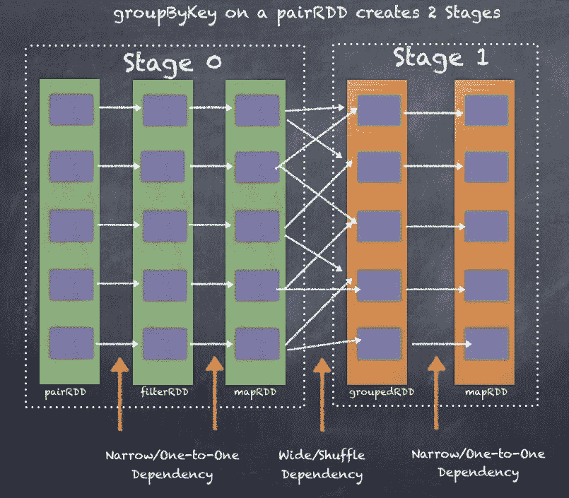

我们进行的洗牌越多，作业执行中就会出现越多的阶段，从而影响性能。Spark Driver 用于确定阶段的两个关键方面是定义 RDD 的两种依赖关系，即窄依赖和宽依赖。

# 窄依赖

当一个 RDD 可以通过简单的一对一转换（如`filter()`函数、`map()`函数、`flatMap()`函数等）从另一个 RDD 派生出来时，子 RDD 被认为是依赖于父 RDD 的一对一基础。这种依赖关系被称为窄依赖，因为数据可以在包含原始 RDD/父 RDD 分区的同一节点上进行转换，而无需在其他执行器之间进行任何数据传输。

窄依赖在作业执行的同一阶段中。

下图是一个窄依赖如何将一个 RDD 转换为另一个 RDD 的示例，对 RDD 元素进行一对一的转换：

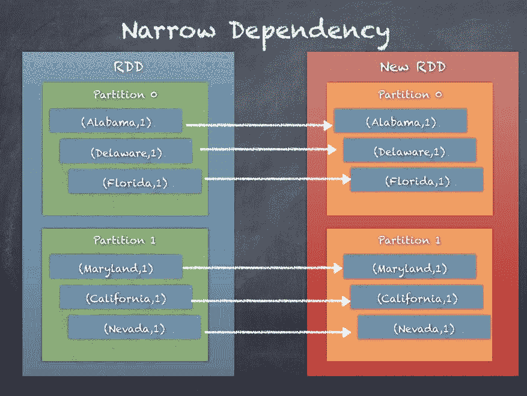

# 广泛依赖

当一个 RDD 可以通过在线传输数据或使用函数进行数据重分区或重新分发数据（如`aggregateByKey`、`reduceByKey`等）从一个或多个 RDD 派生出来时，子 RDD 被认为依赖于参与洗牌操作的父 RDD。这种依赖关系被称为广泛依赖，因为数据不能在包含原始 RDD/父 RDD 分区的同一节点上进行转换，因此需要在其他执行器之间通过网络传输数据。

广泛的依赖关系引入了作业执行中的新阶段。

下图是一个广泛依赖如何在执行器之间洗牌数据将一个 RDD 转换为另一个 RDD 的示例：

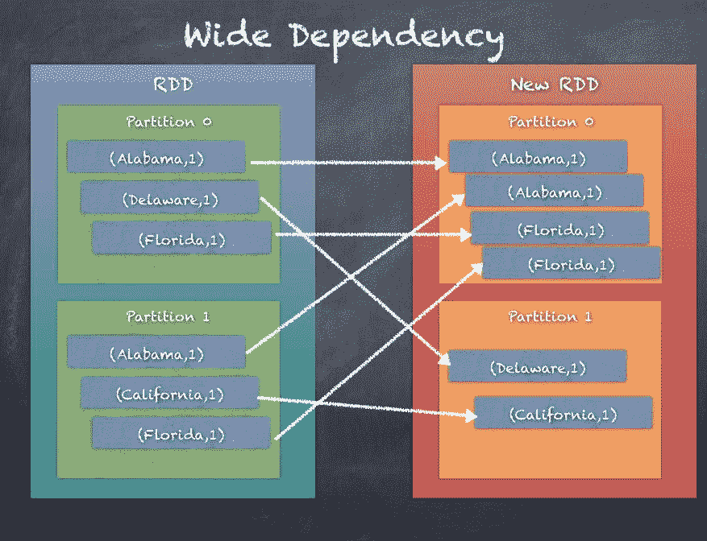

# 广播变量

广播变量是所有执行器共享的变量。广播变量在驱动程序中创建一次，然后在执行器上只读。虽然理解简单数据类型的广播，比如`Integer`，是很简单的，但广播在概念上比简单的变量要大得多。整个数据集可以在 Spark 集群中广播，以便执行器可以访问广播的数据。在执行器中运行的所有任务都可以访问广播变量。

广播使用各种优化方法使广播的数据对所有执行器都可访问。这是一个重要的挑战，因为如果广播的数据集的大小很大，你不能指望 100 个或 1000 个执行器连接到驱动程序并拉取数据集。相反，执行器通过 HTTP 连接拉取数据，还有一个类似于 BitTorrent 的最近添加的方法，其中数据集本身就像种子一样分布在集群中。这使得将广播变量分发给所有执行器的方法比每个执行器逐个从驱动程序拉取数据更具可伸缩性，这可能会导致驱动程序在有大量执行器时出现故障。

驱动程序只能广播它拥有的数据，你不能使用引用来广播 RDD。这是因为只有驱动程序知道如何解释 RDD，执行器只知道它们正在处理的数据的特定分区。

如果你深入研究广播的工作原理，你会发现这种机制首先由驱动程序将序列化对象分成小块，然后将这些块存储在驱动程序的 BlockManager 中。当代码被序列化以在执行器上运行时，每个执行器首先尝试从自己的内部 BlockManager 中获取对象。如果广播变量之前已经被获取过，它会找到并使用它。然而，如果它不存在，执行器将使用远程获取从驱动程序和/或其他可用的执行器中获取小块。一旦获取了这些块，它就会将这些块放入自己的 BlockManager 中，准备让其他执行器从中获取。这可以防止驱动程序成为发送广播数据的瓶颈（每个执行器一个副本）。

下图是一个 Spark 集群中广播工作的示例：

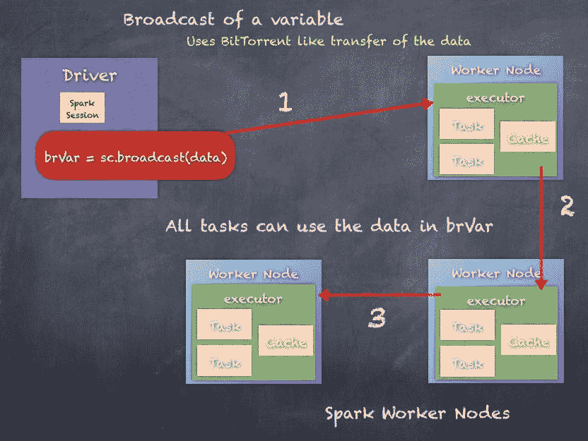

广播变量既可以创建也可以销毁。我们将研究广播变量的创建和销毁。还有一种方法可以从内存中删除广播变量，我们也将研究。

# 创建广播变量

可以使用 Spark 上下文的`broadcast()`函数在任何数据类型的任何数据上创建广播变量，前提是数据/变量是可序列化的。

让我们看看如何广播一个整数变量，然后在执行程序上执行转换操作时使用广播变量：

```scala
scala> val rdd_one = sc.parallelize(Seq(1,2,3))
rdd_one: org.apache.spark.rdd.RDD[Int] = ParallelCollectionRDD[101] at parallelize at <console>:25

scala> val i = 5
i: Int = 5

scala> val bi = sc.broadcast(i)
bi: org.apache.spark.broadcast.Broadcast[Int] = Broadcast(147)

scala> bi.value
res166: Int = 5

scala> rdd_one.take(5)
res164: Array[Int] = Array(1, 2, 3)

scala> rdd_one.map(j => j + bi.value).take(5)
res165: Array[Int] = Array(6, 7, 8)

```

广播变量也可以创建在不仅仅是原始数据类型上，如下一个示例所示，我们将从 Driver 广播一个`HashMap`。

以下是通过查找 HashMap 将整数 RDD 进行简单转换的示例，将 RDD 的 1,2,3 转换为 1 X 2，2 X 3，3 X 4 = 2,6,12：

```scala
scala> val rdd_one = sc.parallelize(Seq(1,2,3))
rdd_one: org.apache.spark.rdd.RDD[Int] = ParallelCollectionRDD[109] at parallelize at <console>:25

scala> val m = scala.collection.mutable.HashMap(1 -> 2, 2 -> 3, 3 -> 4)
m: scala.collection.mutable.HashMap[Int,Int] = Map(2 -> 3, 1 -> 2, 3 -> 4)

scala> val bm = sc.broadcast(m)
bm: org.apache.spark.broadcast.Broadcast[scala.collection.mutable.HashMap[Int,Int]] = Broadcast(178)

scala> rdd_one.map(j => j * bm.value(j)).take(5)
res191: Array[Int] = Array(2, 6, 12)

```

# 清理广播变量

广播变量在所有执行程序上占用内存，并且根据广播变量中包含的数据的大小，这可能会在某个时刻引起资源问题。有一种方法可以从所有执行程序的内存中删除广播变量。

在广播变量上调用`unpersist()`会从所有执行程序的内存缓存中删除广播变量的数据，以释放资源。如果再次使用变量，则数据将重新传输到执行程序，以便再次使用。但是，Driver 会保留内存，如果 Driver 没有数据，则广播变量将不再有效。

接下来我们将看看如何销毁广播变量。

以下是如何在广播变量上调用`unpersist()`。调用`unpersist`后，如果我们再次访问广播变量，则它会像往常一样工作，但在幕后，执行程序再次获取变量的数据。

```scala
scala> val rdd_one = sc.parallelize(Seq(1,2,3))
rdd_one: org.apache.spark.rdd.RDD[Int] = ParallelCollectionRDD[101] at parallelize at <console>:25

scala> val k = 5
k: Int = 5

scala> val bk = sc.broadcast(k)
bk: org.apache.spark.broadcast.Broadcast[Int] = Broadcast(163)

scala> rdd_one.map(j => j + bk.value).take(5)
res184: Array[Int] = Array(6, 7, 8)

scala> bk.unpersist

scala> rdd_one.map(j => j + bk.value).take(5)
res186: Array[Int] = Array(6, 7, 8)

```

# 销毁广播变量

您还可以销毁广播变量，将其从所有执行程序和 Driver 中完全删除，使其无法访问。这在跨集群有效地管理资源方面非常有帮助。

在广播变量上调用`destroy()`会销毁与指定广播变量相关的所有数据和元数据。一旦广播变量被销毁，就无法再次使用，必须重新创建。

以下是销毁广播变量的示例：

```scala
scala> val rdd_one = sc.parallelize(Seq(1,2,3))
rdd_one: org.apache.spark.rdd.RDD[Int] = ParallelCollectionRDD[101] at parallelize at <console>:25

scala> val k = 5
k: Int = 5

scala> val bk = sc.broadcast(k)
bk: org.apache.spark.broadcast.Broadcast[Int] = Broadcast(163)

scala> rdd_one.map(j => j + bk.value).take(5)
res184: Array[Int] = Array(6, 7, 8)

scala> bk.destroy

```

如果尝试使用已销毁的广播变量，则会抛出异常

以下是尝试重用已销毁的广播变量的示例：

```scala
scala> rdd_one.map(j => j + bk.value).take(5)
17/05/27 14:07:28 ERROR Utils: Exception encountered
org.apache.spark.SparkException: Attempted to use Broadcast(163) after it was destroyed (destroy at <console>:30)
 at org.apache.spark.broadcast.Broadcast.assertValid(Broadcast.scala:144)
 at org.apache.spark.broadcast.TorrentBroadcast$$anonfun$writeObject$1.apply$mcV$sp(TorrentBroadcast.scala:202)
 at org.apache.spark.broadcast.TorrentBroadcast$$anonfun$wri

```

因此，广播功能可以用于大大提高 Spark 作业的灵活性和性能。

# 累加器

累加器是跨执行程序共享的变量，通常用于向 Spark 程序添加计数器。如果您有一个 Spark 程序，并且想要知道错误或总记录数或两者，可以通过两种方式实现。一种方法是添加额外的逻辑来仅计算错误或总记录数，当处理所有可能的计算时变得复杂。另一种方法是保持逻辑和代码流相当完整，并添加累加器。

累加器只能通过将值添加到值来更新。

以下是使用 Spark 上下文和`longAccumulator`函数创建和使用长累加器的示例，以将新创建的累加器变量初始化为零。由于累加器在 map 转换内部使用，因此累加器会递增。操作结束时，累加器保持值为 351。

```scala
scala> val acc1 = sc.longAccumulator("acc1")
acc1: org.apache.spark.util.LongAccumulator = LongAccumulator(id: 10355, name: Some(acc1), value: 0)

scala> val someRDD = statesPopulationRDD.map(x => {acc1.add(1); x})
someRDD: org.apache.spark.rdd.RDD[String] = MapPartitionsRDD[99] at map at <console>:29

scala> acc1.value
res156: Long = 0  /*there has been no action on the RDD so accumulator did not get incremented*/

scala> someRDD.count
res157: Long = 351

scala> acc1.value
res158: Long = 351

scala> acc1
res145: org.apache.spark.util.LongAccumulator = LongAccumulator(id: 10355, name: Some(acc1), value: 351)

```

有内置的累加器可用于许多用例：

+   `LongAccumulator`：用于计算 64 位整数的总和、计数和平均值

+   `DoubleAccumulator`：用于计算双精度浮点数的总和、计数和平均值。

+   `CollectionAccumulator[T]`：用于收集元素列表

所有前面的累加器都是建立在`AccumulatorV2`类之上的。通过遵循相同的逻辑，我们可以潜在地构建非常复杂和定制的累加器来在我们的项目中使用。

我们可以通过扩展`AccumulatorV2`类来构建自定义累加器。以下是一个示例，显示了实现所需函数的必要性。在下面的代码中，`AccumulatorV2[Int, Int]`表示输入和输出都是整数类型：

```scala
class MyAccumulator extends AccumulatorV2[Int, Int] {
  //simple boolean check
 override def isZero: Boolean = ??? //function to copy one Accumulator and create another one override def copy(): AccumulatorV2[Int, Int] = ??? //to reset the value override def reset(): Unit = ??? //function to add a value to the accumulator override def add(v: Int): Unit = ??? //logic to merge two accumulators override def merge(other: AccumulatorV2[Int, Int]): Unit = ??? //the function which returns the value of the accumulator override def value: Int = ???
}

```

接下来，我们将看一个自定义累加器的实际例子。同样，我们将使用`statesPopulation` CSV 文件。我们的目标是在自定义累加器中累积年份的总和和人口的总和。

**步骤 1. 导入包含 AccumulatorV2 类的包：**

```scala
import org.apache.spark.util.AccumulatorV2

```

**步骤 2. 包含年份和人口的 Case 类：**

```scala
case class YearPopulation(year: Int, population: Long)

```

**步骤 3. StateAccumulator 类扩展 AccumulatorV2：**

```scala

class StateAccumulator extends AccumulatorV2[YearPopulation, YearPopulation] { 
      //declare the two variables one Int for year and Long for population
      private var year = 0 
 private var population:Long = 0L

      //return iszero if year and population are zero
      override def isZero: Boolean = year == 0 && population == 0L

      //copy accumulator and return a new accumulator
     override def copy(): StateAccumulator = { 
 val newAcc = new StateAccumulator 
 newAcc.year =     this.year 
 newAcc.population = this.population 
 newAcc 
 }

       //reset the year and population to zero 
       override def reset(): Unit = { year = 0 ; population = 0L }

       //add a value to the accumulator
       override def add(v: YearPopulation): Unit = { 
 year += v.year 
 population += v.population 
 }

       //merge two accumulators
      override def merge(other: AccumulatorV2[YearPopulation, YearPopulation]): Unit = { 
 other match { 
 case o: StateAccumulator => { 
 year += o.year 
 population += o.population 
 } 
 case _ => 
 } 
 }

       //function called by Spark to access the value of accumulator
       override def value: YearPopulation = YearPopulation(year, population)
}

```

**步骤 4. 创建一个新的 StateAccumulator 并在 SparkContext 中注册：**

```scala
val statePopAcc = new StateAccumulator

sc.register(statePopAcc, "statePopAcc")

```

**步骤 5. 将 statesPopulation.csv 作为 RDD 读取：**

```scala

val statesPopulationRDD = sc.textFile("statesPopulation.csv").filter(_.split(",")(0) != "State")

scala> statesPopulationRDD.take(10)
res1: Array[String] = Array(Alabama,2010,4785492, Alaska,2010,714031, Arizona,2010,6408312, Arkansas,2010,2921995, California,2010,37332685, Colorado,2010,5048644, Delaware,2010,899816, District of Columbia,2010,605183, Florida,2010,18849098, Georgia,2010,9713521)

```

**步骤 6. 使用 StateAccumulator：**

```scala
statesPopulationRDD.map(x => { 
 val toks = x.split(",") 
 val year = toks(1).toInt 
 val pop = toks(2).toLong 
 statePopAcc.add(YearPopulation(year, pop)) 
 x
}).count

```

**步骤 7. 现在，我们可以检查 StateAccumulator 的值：**

```scala
scala> statePopAcc
res2: StateAccumulator = StateAccumulator(id: 0, name: Some(statePopAcc), value: YearPopulation(704550,2188669780))

```

在这一部分，我们研究了累加器以及如何构建自定义累加器。因此，使用前面举例的例子，您可以创建复杂的累加器来满足您的需求。

# 总结

在这一章中，我们讨论了许多类型的 RDD，比如`shuffledRDD`，`pairRDD`，`sequenceFileRDD`，`HadoopRDD`等等。我们还看了三种主要的聚合类型，`groupByKey`，`reduceByKey`和`aggregateByKey`。我们研究了分区是如何工作的，以及为什么围绕分区需要一个合适的计划来提高性能。我们还研究了洗牌和窄依赖和宽依赖的概念，这些是 Spark 作业被分成阶段的基本原则。最后，我们看了广播变量和累加器的重要概念。

RDD 的灵活性使其易于适应大多数用例，并执行必要的操作以实现目标。

在下一章中，我们将转向 RDD 的更高抽象层，作为 Tungsten 计划的一部分添加到 RDD 中的 DataFrame 和 Spark SQL，以及它们如何在第八章 *引入一点结构 - Spark SQL*中结合在一起。
