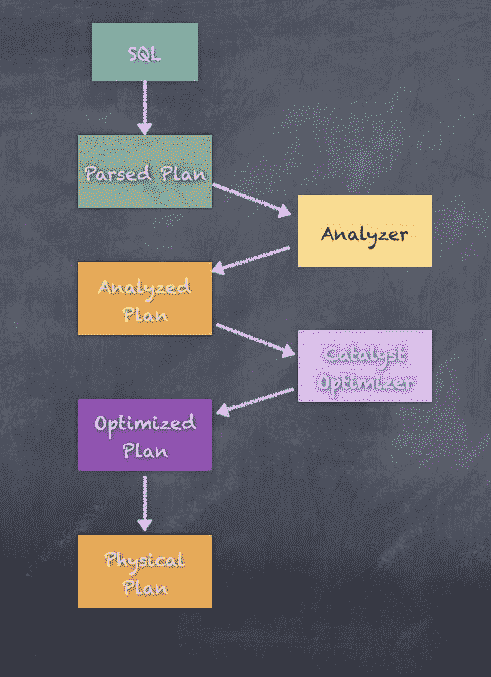
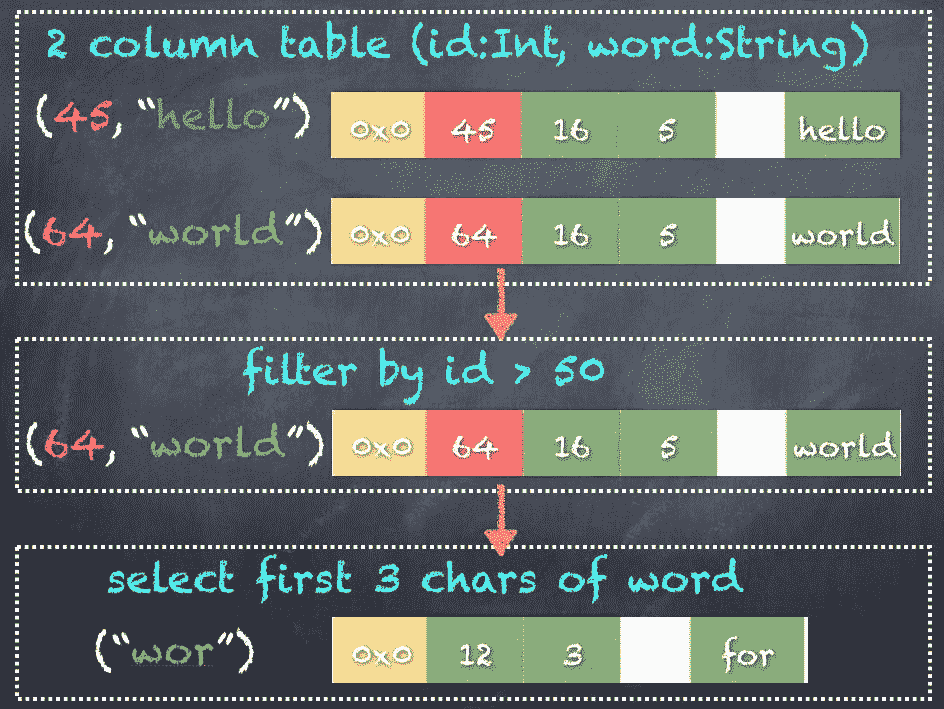
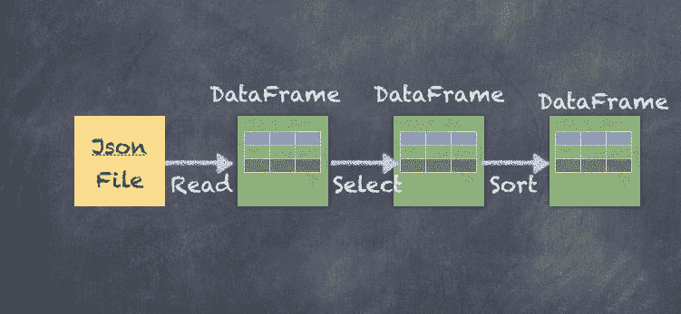
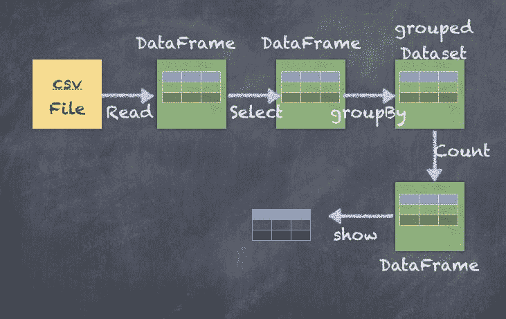
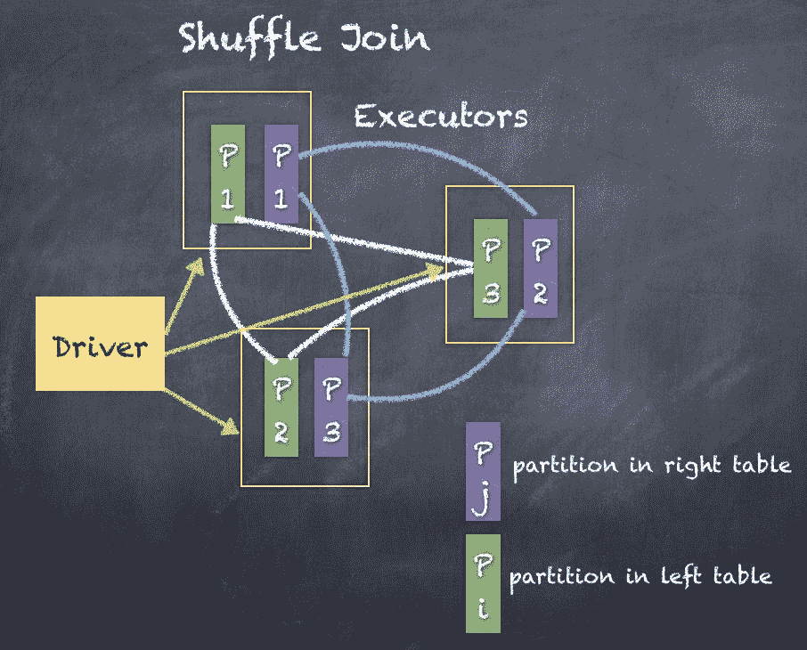
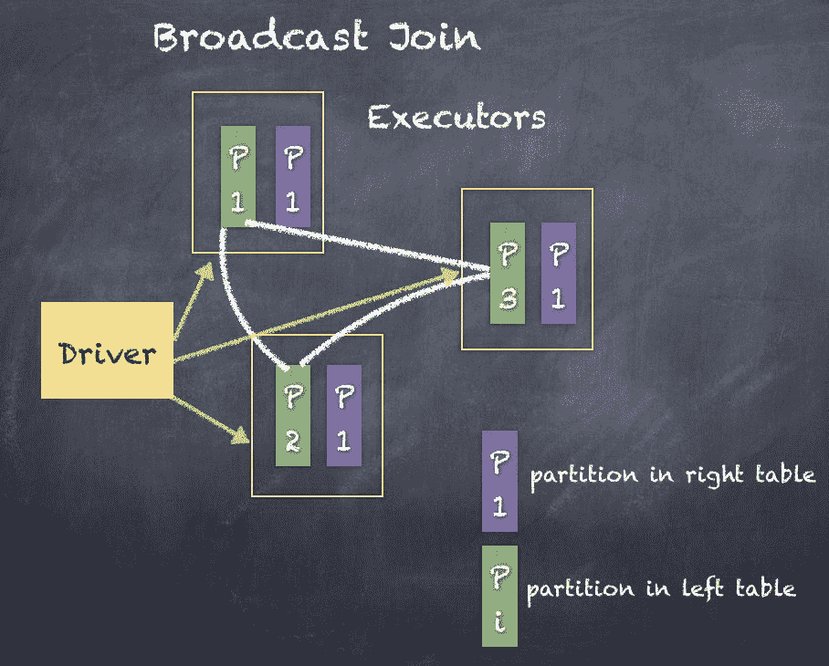

# 第八章：引入一点结构 - Spark SQL

“一台机器可以完成五十个普通人的工作。没有一台机器可以完成一个非凡人的工作。”

- Elbert Hubbard

在本章中，您将学习如何使用 Spark 分析结构化数据（非结构化数据，例如包含任意文本或其他格式的文档必须转换为结构化形式）；我们将看到 DataFrames/datasets 在这里是基石，以及 Spark SQL 的 API 如何使查询结构化数据变得简单而强大。此外，我们将介绍数据集，并看到数据集、DataFrames 和 RDD 之间的区别。简而言之，本章将涵盖以下主题：

+   Spark SQL 和 DataFrames

+   DataFrame 和 SQL API

+   DataFrame 模式

+   数据集和编码器

+   加载和保存数据

+   聚合

+   连接

# Spark SQL 和 DataFrames

在 Apache Spark 之前，每当有人想在大量数据上运行类似 SQL 的查询时，Apache Hive 都是首选技术。Apache Hive 基本上将 SQL 查询转换为类似 MapReduce 的逻辑，自动使得在大数据上执行许多种类的分析变得非常容易，而无需实际学习如何用 Java 和 Scala 编写复杂的代码。

随着 Apache Spark 的出现，我们在大数据规模上执行分析的方式发生了范式转变。Spark SQL 在 Apache Spark 的分布式计算能力之上提供了一个易于使用的类似 SQL 的层。事实上，Spark SQL 可以用作在线分析处理数据库。



Spark SQL 通过将类似 SQL 的语句解析为**抽象语法树**（**AST**）来工作，随后将该计划转换为逻辑计划，然后将逻辑计划优化为可以执行的物理计划。最终的执行使用底层的 DataFrame API，使任何人都可以通过简单地使用类似 SQL 的接口而不是学习所有内部细节来使用 DataFrame API。由于本书深入探讨了各种 API 的技术细节，我们将主要涵盖 DataFrame API，并在某些地方展示 Spark SQL API，以对比使用 API 的不同方式。

因此，DataFrame API 是 Spark SQL 下面的基础层。在本章中，我们将向您展示如何使用各种技术创建 DataFrames，包括 SQL 查询和对 DataFrames 执行操作。

DataFrame 是**弹性分布式数据集**（**RDD**）的抽象，处理使用 catalyst 优化器优化的更高级函数，并且通过 Tungsten 计划也非常高效。您可以将数据集视为具有经过高度优化的数据的 RDD 的有效表。使用编码器实现了数据的二进制表示，编码器将各种对象序列化为二进制结构，比 RDD 表示具有更好的性能。由于 DataFrames 内部使用 RDD，因此 DataFrame/数据集也像 RDD 一样分布，因此也是分布式数据集。显然，这也意味着数据集是不可变的。

以下是数据的二进制表示的示例：



数据集在 Spark 1.6 中添加，并在 DataFrames 之上提供了强类型的好处。事实上，自 Spark 2.0 以来，DataFrame 只是数据集的别名。

`org.apache.spark.sql`定义类型`DataFrame`为`dataset[Row]`，这意味着大多数 API 将与数据集和`DataFrames`一起很好地工作

**类型 DataFrame = dataset[Row]**

DataFrame 在概念上类似于关系数据库中的表。因此，DataFrame 包含数据行，每行由多个列组成。

我们需要牢记的第一件事就是，与 RDD 一样，DataFrames 是不可变的。DataFrames 具有不可变性的属性意味着每次转换或操作都会创建一个新的 DataFrame。



让我们更深入地了解 DataFrame 以及它们与 RDD 的不同之处。如前所述，RDD 代表 Apache Spark 中数据操作的低级 API。DataFrame 是在 RDD 的基础上创建的，以抽象出 RDD 的低级内部工作，并公开易于使用且提供大量功能的高级 API。DataFrame 是通过遵循 Python pandas 包、R 语言、Julia 语言等中发现的类似概念创建的。

正如我们之前提到的，DataFrame 将 SQL 代码和特定领域语言表达式转换为优化的执行计划，以在 Spark Core API 之上运行 SQL 语句执行各种操作。DataFrame 支持许多不同类型的输入数据源和许多类型的操作。这包括所有类型的 SQL 操作，例如连接、分组、聚合和窗口函数，就像大多数数据库一样。Spark SQL 也与 Hive 查询语言非常相似，由于 Spark 提供了与 Apache Hive 的自然适配器，因此在 Apache Hive 中工作的用户可以轻松将其知识转移到 Spark SQL 中，从而最小化过渡时间。

DataFrame 基本上依赖于表的概念，如前所述。表可以操作得非常类似于 Apache Hive 的工作方式。实际上，Apache Spark 中表的许多操作与 Apache Hive 处理表和对这些表进行操作的方式非常相似。一旦有了作为 DataFrame 的表，就可以将 DataFrame 注册为表，并且可以使用 Spark SQL 语句操作数据，而不是使用 DataFrame API。

DataFrame 依赖于催化剂优化器和 Tungsten 性能改进，因此让我们简要地了解一下催化剂优化器的工作原理。催化剂优化器从输入 SQL 创建解析的逻辑计划，然后通过查看 SQL 语句中使用的所有各种属性和列来分析逻辑计划。一旦创建了分析的逻辑计划，催化剂优化器进一步尝试通过组合多个操作和重新排列逻辑来优化计划以获得更好的性能。

为了理解催化剂优化器，可以将其视为一种常识逻辑优化器，可以重新排序操作，例如过滤和转换，有时将几个操作组合成一个，以便最小化在工作节点之间传输的数据量。例如，催化剂优化器可能决定在执行不同数据集之间的联接操作时广播较小的数据集。使用 explain 查看任何数据框的执行计划。催化剂优化器还计算 DataFrame 的列和分区的统计信息，提高执行速度。

例如，如果数据分区上有转换和过滤器，那么过滤数据和应用转换的顺序对操作的整体性能非常重要。由于所有优化的结果，生成了优化的逻辑计划，然后将其转换为物理计划。显然，有几种物理计划可以执行相同的 SQL 语句并生成相同的结果。成本优化逻辑根据成本优化和估算确定并选择一个良好的物理计划。

钨性能改进是 Spark 2.x 背后的秘密酱的另一个关键因素，与之前的版本（如 Spark 1.6 和更早版本）相比，它提供了卓越的性能改进。钨实现了对内存管理和其他性能改进的彻底改革。最重要的内存管理改进使用对象的二进制编码，并在堆外和堆内存中引用它们。因此，钨允许使用二进制编码机制来编码所有对象的堆外内存。二进制编码的对象占用的内存要少得多。Tungsten 项目还改进了洗牌性能。

数据通常通过`DataFrameReader`加载到 DataFrame 中，并且数据通过`DataFrameWriter`保存。

# DataFrame API 和 SQL API

可以通过多种方式创建 DataFrame：

+   通过执行 SQL 查询

+   加载 Parquet、JSON、CSV、文本、Hive、JDBC 等外部数据

+   将 RDD 转换为数据框

可以通过加载 CSV 文件来创建 DataFrame。我们将查看一个名为`statesPopulation.csv`的 CSV 文件，它被加载为 DataFrame。

CSV 文件具有 2010 年至 2016 年美国各州人口的以下格式。

| **州** | **年份** | **人口** |
| --- | --- | --- |
| 阿拉巴马州 | 2010 | 4785492 |
| 阿拉斯加州 | 2010 | 714031 |
| 亚利桑那州 | 2010 | 6408312 |
| 阿肯色州 | 2010 | 2921995 |
| 加利福尼亚州 | 2010 | 37332685 |

由于此 CSV 具有标题，因此我们可以使用它快速加载到具有隐式模式检测的 DataFrame 中。

```scala
scala> val statesDF = spark.read.option("header", "true").option("inferschema", "true").option("sep", ",").csv("statesPopulation.csv")
statesDF: org.apache.spark.sql.DataFrame = [State: string, Year: int ... 1 more field]

```

加载 DataFrame 后，可以检查其模式：

```scala
scala> statesDF.printSchema
root
 |-- State: string (nullable = true)
 |-- Year: integer (nullable = true)
 |-- Population: integer (nullable = true)

```

`option("header", "true").option("inferschema", "true").option("sep", ",")` 告诉 Spark CSV 文件有`header`；逗号分隔符用于分隔字段/列，还可以隐式推断模式。

DataFrame 通过解析逻辑计划、分析逻辑计划、优化计划，最后执行执行物理计划来工作。

使用 DataFrame 上的 explain 显示执行计划：

```scala
scala> statesDF.explain(true)
== Parsed Logical Plan ==
Relation[State#0,Year#1,Population#2] csv
== Analyzed Logical Plan ==
State: string, Year: int, Population: int
Relation[State#0,Year#1,Population#2] csv
== Optimized Logical Plan ==
Relation[State#0,Year#1,Population#2] csv
== Physical Plan ==
*FileScan csv [State#0,Year#1,Population#2] Batched: false, Format: CSV, Location: InMemoryFileIndex[file:/Users/salla/states.csv], PartitionFilters: [], PushedFilters: [], ReadSchema: struct<State:string,Year:int,Population:int>

```

DataFrame 还可以注册为表名（如下所示），然后您可以像关系数据库一样输入 SQL 语句。

```scala
scala> statesDF.createOrReplaceTempView("states")

```

一旦我们将 DataFrame 作为结构化 DataFrame 或表，我们可以运行命令来操作数据：

```scala
scala> statesDF.show(5)
scala> spark.sql("select * from states limit 5").show
+----------+----+----------+
| State|Year|Population|
+----------+----+----------+
| Alabama|2010| 4785492|
| Alaska|2010| 714031|
| Arizona|2010| 6408312|
| Arkansas|2010| 2921995|
|California|2010| 37332685|
+----------+----+----------+

```

如果您看到上述代码片段，我们已经编写了类似 SQL 的语句，并使用`spark.sql` API 执行了它。

请注意，Spark SQL 只是转换为 DataFrame API 以进行执行，SQL 只是用于方便使用的 DSL。

使用 DataFrame 上的`sort`操作，可以按任何列对 DataFrame 中的行进行排序。我们可以看到使用`Population`列进行降序`sort`的效果如下。行按人口数量降序排序。

```scala
scala> statesDF.sort(col("Population").desc).show(5)
scala> spark.sql("select * from states order by Population desc limit 5").show
+----------+----+----------+
| State|Year|Population|
+----------+----+----------+
|California|2016| 39250017|
|California|2015| 38993940|
|California|2014| 38680810|
|California|2013| 38335203|
|California|2012| 38011074|
+----------+----+----------+

```

使用`groupBy`可以按任何列对 DataFrame 进行分组。以下是按`State`分组行，然后对每个`State`的`Population`计数进行求和的代码。

```scala
scala> statesDF.groupBy("State").sum("Population").show(5)
scala> spark.sql("select State, sum(Population) from states group by State limit 5").show
+---------+---------------+
| State|sum(Population)|
+---------+---------------+
| Utah| 20333580|
| Hawaii| 9810173|
|Minnesota| 37914011|
| Ohio| 81020539|
| Arkansas| 20703849|
+---------+---------------+

```

使用`agg`操作，您可以对 DataFrame 的列执行许多不同的操作，例如查找列的`min`、`max`和`avg`。您还可以执行操作并同时重命名列，以适应您的用例。

```scala
scala> statesDF.groupBy("State").agg(sum("Population").alias("Total")).show(5)
scala> spark.sql("select State, sum(Population) as Total from states group by State limit 5").show
+---------+--------+
| State| Total|
+---------+--------+
| Utah|20333580|
| Hawaii| 9810173|
|Minnesota|37914011|
| Ohio|81020539|
| Arkansas|20703849|
+---------+--------+

```

自然，逻辑越复杂，执行计划也越复杂。让我们看看`groupBy`和`agg` API 调用的执行计划，以更好地了解底层发生了什么。以下是显示按`State`分组和人口总和的执行计划的代码：

```scala
scala> statesDF.groupBy("State").agg(sum("Population").alias("Total")).explain(true)
== Parsed Logical Plan ==
'Aggregate [State#0], [State#0, sum('Population) AS Total#31886]
+- Relation[State#0,Year#1,Population#2] csv

== Analyzed Logical Plan ==
State: string, Total: bigint
Aggregate [State#0], [State#0, sum(cast(Population#2 as bigint)) AS Total#31886L]
+- Relation[State#0,Year#1,Population#2] csv

== Optimized Logical Plan ==
Aggregate [State#0], [State#0, sum(cast(Population#2 as bigint)) AS Total#31886L]
+- Project [State#0, Population#2]
 +- Relation[State#0,Year#1,Population#2] csv

== Physical Plan ==
*HashAggregate(keys=[State#0], functions=[sum(cast(Population#2 as bigint))], output=[State#0, Total#31886L])
+- Exchange hashpartitioning(State#0, 200)
 +- *HashAggregate(keys=[State#0], functions=[partial_sum(cast(Population#2 as bigint))], output=[State#0, sum#31892L])
 +- *FileScan csv [State#0,Population#2] Batched: false, Format: CSV, Location: InMemoryFileIndex[file:/Users/salla/states.csv], PartitionFilters: [], PushedFilters: [], ReadSchema: struct<State:string,Population:int>

```

DataFrame 操作可以很好地链接在一起，以便执行可以利用成本优化（钨性能改进和催化剂优化器共同工作）。

我们还可以将操作链接在一条语句中，如下所示，我们不仅按`State`列对数据进行分组，然后对`Population`值进行求和，还对 DataFrame 进行排序：

```scala
scala> statesDF.groupBy("State").agg(sum("Population").alias("Total")).sort(col("Total").desc).show(5)
scala> spark.sql("select State, sum(Population) as Total from states group by State order by Total desc limit 5").show
+----------+---------+
| State| Total|
+----------+---------+
|California|268280590|
| Texas|185672865|
| Florida|137618322|
| New York|137409471|
| Illinois| 89960023|
+----------+---------+

```

前面的链式操作包括多个转换和操作，可以使用以下图表进行可视化：



也可以同时创建多个聚合，如下所示：

```scala
scala> statesDF.groupBy("State").agg(
             min("Population").alias("minTotal"), 
             max("Population").alias("maxTotal"),        
             avg("Population").alias("avgTotal"))
           .sort(col("minTotal").desc).show(5) 
scala> spark.sql("select State, min(Population) as minTotal, max(Population) as maxTotal, avg(Population) as avgTotal from states group by State order by minTotal desc limit 5").show
+----------+--------+--------+--------------------+
| State|minTotal|maxTotal| avgTotal|
+----------+--------+--------+--------------------+
|California|37332685|39250017|3.8325798571428575E7|
| Texas|25244310|27862596| 2.6524695E7|
| New York|19402640|19747183| 1.962992442857143E7|
| Florida|18849098|20612439|1.9659760285714287E7|
| Illinois|12801539|12879505|1.2851431857142856E7|
+----------+--------+--------+--------------------+

```

# 旋转

旋转是将表转换为不同视图的一种很好的方式，更适合进行许多汇总和聚合。这是通过取列的值并使每个值成为实际列来实现的。

为了更好地理解这一点，让我们通过`Year`来旋转 DataFrame 的行并检查结果，结果显示，现在，列`Year`通过将每个唯一值转换为实际列创建了几个新列。这样做的最终结果是，现在，我们不仅可以查看年份列，还可以使用按年份创建的列来进行汇总和聚合。

```scala
scala> statesDF.groupBy("State").pivot("Year").sum("Population").show(5)
+---------+--------+--------+--------+--------+--------+--------+--------+
| State| 2010| 2011| 2012| 2013| 2014| 2015| 2016|
+---------+--------+--------+--------+--------+--------+--------+--------+
| Utah| 2775326| 2816124| 2855782| 2902663| 2941836| 2990632| 3051217|
| Hawaii| 1363945| 1377864| 1391820| 1406481| 1416349| 1425157| 1428557|
|Minnesota| 5311147| 5348562| 5380285| 5418521| 5453109| 5482435| 5519952|
| Ohio|11540983|11544824|11550839|11570022|11594408|11605090|11614373|
| Arkansas| 2921995| 2939493| 2950685| 2958663| 2966912| 2977853| 2988248|
+---------+--------+--------+--------+--------+--------+--------+--------+

```

# 过滤器

DataFrame 还支持过滤器，可以用于快速过滤 DataFrame 行以生成新的 DataFrame。过滤器使得数据的重要转换变得非常重要，可以将 DataFrame 缩小到我们的用例。例如，如果您只想分析加利福尼亚州的情况，那么使用`filter` API 可以在每个数据分区上消除不匹配的行，从而提高操作的性能。

让我们查看过滤 DataFrame 以仅考虑加利福尼亚州的执行计划。

```scala
scala> statesDF.filter("State == 'California'").explain(true)

== Parsed Logical Plan ==
'Filter ('State = California)
+- Relation[State#0,Year#1,Population#2] csv

== Analyzed Logical Plan ==
State: string, Year: int, Population: int
Filter (State#0 = California)
+- Relation[State#0,Year#1,Population#2] csv

== Optimized Logical Plan ==
Filter (isnotnull(State#0) && (State#0 = California))
+- Relation[State#0,Year#1,Population#2] csv

== Physical Plan ==
*Project [State#0, Year#1, Population#2]
+- *Filter (isnotnull(State#0) && (State#0 = California))
 +- *FileScan csv [State#0,Year#1,Population#2] Batched: false, Format: CSV, Location: InMemoryFileIndex[file:/Users/salla/states.csv], PartitionFilters: [], PushedFilters: [IsNotNull(State), EqualTo(State,California)], ReadSchema: struct<State:string,Year:int,Population:int>

```

现在我们可以看到执行计划，让我们执行`filter`命令，如下所示：

```scala
scala> statesDF.filter("State == 'California'").show
+----------+----+----------+
| State|Year|Population|
+----------+----+----------+
|California|2010| 37332685|
|California|2011| 37676861|
|California|2012| 38011074|
|California|2013| 38335203|
|California|2014| 38680810|
|California|2015| 38993940|
|California|2016| 39250017|
+----------+----+----------+

```

# 用户定义函数（UDFs）

UDFs 定义了扩展 Spark SQL 功能的新基于列的函数。通常，Spark 提供的内置函数不能处理我们确切的需求。在这种情况下，Apache Spark 支持创建可以使用的 UDF。

`udf()`在内部调用一个案例类用户定义函数，它本身在内部调用 ScalaUDF。

让我们通过一个简单将 State 列值转换为大写的 UDF 示例来进行说明。

首先，我们在 Scala 中创建我们需要的函数。

```scala
import org.apache.spark.sql.functions._

scala> val toUpper: String => String = _.toUpperCase
toUpper: String => String = <function1>

```

然后，我们必须将创建的函数封装在`udf`中以创建 UDF。

```scala
scala> val toUpperUDF = udf(toUpper)
toUpperUDF: org.apache.spark.sql.expressions.UserDefinedFunction = UserDefinedFunction(<function1>,StringType,Some(List(StringType)))

```

现在我们已经创建了`udf`，我们可以使用它将 State 列转换为大写。

```scala
scala> statesDF.withColumn("StateUpperCase", toUpperUDF(col("State"))).show(5)
+----------+----+----------+--------------+
| State|Year|Population|StateUpperCase|
+----------+----+----------+--------------+
| Alabama|2010| 4785492| ALABAMA|
| Alaska|2010| 714031| ALASKA|
| Arizona|2010| 6408312| ARIZONA|
| Arkansas|2010| 2921995| ARKANSAS|
|California|2010| 37332685| CALIFORNIA|
+----------+----+----------+--------------+

```

# 数据的模式结构

模式是数据结构的描述，可以是隐式的或显式的。

由于 DataFrame 在内部基于 RDD，因此有两种将现有 RDD 转换为数据集的主要方法。可以使用反射将 RDD 转换为数据集，以推断 RDD 的模式。创建数据集的第二种方法是通过编程接口，使用该接口可以获取现有 RDD 并提供模式以将 RDD 转换为具有模式的数据集。

为了通过反射推断模式从 RDD 创建 DataFrame，Spark 的 Scala API 提供了可以用来定义表模式的案例类。DataFrame 是通过 RDD 以编程方式创建的，因为在所有情况下都不容易使用案例类。例如，在 1000 列表上创建案例类是耗时的。

# 隐式模式

让我们看一个将**CSV**（逗号分隔值）文件加载到 DataFrame 中的示例。每当文本文件包含标题时，读取 API 可以通过读取标题行来推断模式。我们还可以选择指定用于拆分文本文件行的分隔符。

我们从标题行推断模式读取`csv`并使用逗号（`,`）作为分隔符。我们还展示了`schema`命令和`printSchema`命令来验证输入文件的模式。

```scala
scala> val statesDF = spark.read.option("header", "true")
                                .option("inferschema", "true")
                                .option("sep", ",")
                                .csv("statesPopulation.csv")
statesDF: org.apache.spark.sql.DataFrame = [State: string, Year: int ... 1 more field]

scala> statesDF.schema
res92: org.apache.spark.sql.types.StructType = StructType(
                                                  StructField(State,StringType,true),
                                                  StructField(Year,IntegerType,true),
                                                  StructField(Population,IntegerType,true))
scala> statesDF.printSchema
root
 |-- State: string (nullable = true)
 |-- Year: integer (nullable = true)
 |-- Population: integer (nullable = true)

```

# 显式模式

使用`StructType`来描述模式，它是`StructField`对象的集合。

`StructType`和`StructField`属于`org.apache.spark.sql.types`包。

诸如`IntegerType`、`StringType`之类的数据类型也属于`org.apache.spark.sql.types`包。

使用这些导入，我们可以定义一个自定义的显式模式。

首先，导入必要的类：

```scala
scala> import org.apache.spark.sql.types.{StructType, IntegerType, StringType}
import org.apache.spark.sql.types.{StructType, IntegerType, StringType}

```

定义一个包含两列/字段的模式-一个`Integer`，后面是一个`String`：

```scala
scala> val schema = new StructType().add("i", IntegerType).add("s", StringType)
schema: org.apache.spark.sql.types.StructType = StructType(StructField(i,IntegerType,true), StructField(s,StringType,true))

```

打印新创建的`schema`很容易：

```scala
scala> schema.printTreeString
root
 |-- i: integer (nullable = true)
 |-- s: string (nullable = true)

```

还有一个选项可以打印 JSON，如下所示，使用`prettyJson`函数：

```scala
scala> schema.prettyJson
res85: String =
{
 "type" : "struct",
 "fields" : [ {
 "name" : "i",
 "type" : "integer",
 "nullable" : true,
 "metadata" : { }
 }, {
 "name" : "s",
 "type" : "string",
 "nullable" : true,
 "metadata" : { }
 } ]
}

```

Spark SQL 的所有数据类型都位于包`org.apache.spark.sql.types`中。您可以通过以下方式访问它们：

```scala
import org.apache.spark.sql.types._

```

# Encoders

Spark 2.x 支持一种不同的方式来定义复杂数据类型的模式。首先，让我们来看一个简单的例子。

为了使用 Encoders，必须使用 import 语句导入 Encoders：

```scala
import org.apache.spark.sql.Encoders 

```

让我们来看一个简单的例子，定义一个元组作为数据类型在数据集 API 中使用：

```scala

scala> Encoders.product[(Integer, String)].schema.printTreeString
root
 |-- _1: integer (nullable = true)
 |-- _2: string (nullable = true)

```

上述代码看起来在任何时候都很复杂，所以我们也可以为我们的需求定义一个案例类，然后使用它。我们可以定义一个名为`Record`的案例类，有两个字段-一个`Integer`和一个`String`：

```scala
scala> case class Record(i: Integer, s: String)
defined class Record

```

使用`Encoders`，我们可以轻松地在案例类之上创建一个`schema`，从而使我们能够轻松使用各种 API：

```scala
scala> Encoders.product[Record].schema.printTreeString
root
 |-- i: integer (nullable = true)
 |-- s: string (nullable = true)

```

Spark SQL 的所有数据类型都位于包**`org.apache.spark.sql.types`**中。您可以通过以下方式访问它们：

```scala
import org.apache.spark.sql.types._

```

您应该在代码中使用`DataTypes`对象来创建复杂的 Spark SQL 类型，如数组或映射，如下所示：

```scala
scala> import org.apache.spark.sql.types.DataTypes
import org.apache.spark.sql.types.DataTypes

scala> val arrayType = DataTypes.createArrayType(IntegerType)
arrayType: org.apache.spark.sql.types.ArrayType = ArrayType(IntegerType,true)

```

以下是 Spark SQL API 中支持的数据类型：

| **数据类型** | **Scala 中的值类型** | **访问或创建数据类型的 API** |
| --- | --- | --- |
| `ByteType` | `Byte` | `ByteType` |
| `ShortType` | `Short` | `ShortType` |
| `IntegerType` | `Int` | `IntegerType` |
| `LongType` | `Long` | `LongType` |
| `FloatType` | `Float` | `FloatType` |
| `DoubleType` | `Double` | `DoubleType` |
| `DecimalType` | `java.math.BigDecimal` | `DecimalType` |
| `StringType` | `String` | `StringType` |
| `BinaryType` | `Array[Byte]` | `BinaryType` |
| `BooleanType` | `Boolean` | `BooleanType` |
| `TimestampType` | `java.sql.Timestamp` | `TimestampType` |
| `DateType` | `java.sql.Date` | `DateType` |
| `ArrayType` | `scala.collection.Seq` | `ArrayType(elementType, [containsNull])` |
| `MapType` | `scala.collection.Map` | `MapType(keyType, valueType, [valueContainsNull])` 注意：`valueContainsNull`的默认值为`true`。 |
| `StructType` | `org.apache.spark.sql.Row` | `StructType(fields)` 注意：fields 是`StructFields`的`Seq`。另外，不允许有相同名称的两个字段。 |

# 加载和保存数据集

我们需要将数据读入集群作为输入和输出，或者将结果写回存储，以便对我们的代码进行任何实际操作。输入数据可以从各种数据集和来源中读取，如文件、Amazon S3 存储、数据库、NoSQL 和 Hive，输出也可以类似地保存到文件、S3、数据库、Hive 等。

几个系统通过连接器支持 Spark，并且随着更多系统接入 Spark 处理框架，这个数字正在日益增长。

# 加载数据集

Spark SQL 可以通过`DataFrameReader`接口从外部存储系统，如文件、Hive 表和 JDBC 数据库中读取数据。

API 调用的格式是`spark.read.inputtype`

+   Parquet

+   CSV

+   Hive 表

+   JDBC

+   ORC

+   文本

+   JSON

让我们来看一些简单的例子，将 CSV 文件读入 DataFrame 中：

```scala
scala> val statesPopulationDF = spark.read.option("header", "true").option("inferschema", "true").option("sep", ",").csv("statesPopulation.csv")
statesPopulationDF: org.apache.spark.sql.DataFrame = [State: string, Year: int ... 1 more field]

scala> val statesTaxRatesDF = spark.read.option("header", "true").option("inferschema", "true").option("sep", ",").csv("statesTaxRates.csv")
statesTaxRatesDF: org.apache.spark.sql.DataFrame = [State: string, TaxRate: double]

```

# 保存数据集

Spark SQL 可以将数据保存到外部存储系统，如文件、Hive 表和 JDBC 数据库，通过`DataFrameWriter`接口。

API 调用的格式是`dataframe``.write.outputtype`

+   Parquet

+   ORC

+   文本

+   Hive 表

+   JSON

+   CSV

+   JDBC

让我们来看一些将 DataFrame 写入或保存到 CSV 文件的例子：

```scala
scala> statesPopulationDF.write.option("header", "true").csv("statesPopulation_dup.csv")

scala> statesTaxRatesDF.write.option("header", "true").csv("statesTaxRates_dup.csv")

```

# 聚合

聚合是根据条件收集数据并对数据进行分析的方法。聚合对于理解各种规模的数据非常重要，因为仅仅拥有原始数据记录对于大多数用例来说并不那么有用。

例如，如果你看下面的表，然后看聚合视图，很明显，仅仅原始记录并不能帮助你理解数据。

想象一个包含世界上每个城市每天的一次温度测量的表，为期五年。

下面是一个包含每个城市每天平均温度记录的表：

| **城市** | **日期** | **温度** |
| --- | --- | --- |
| Boston | 12/23/2016 | 32 |
| New York | 12/24/2016 | 36 |
| Boston | 12/24/2016 | 30 |
| Philadelphia | 12/25/2016 | 34 |
| Boston | 12/25/2016 | 28 |

如果我们想要计算上表中我们有测量数据的所有天的每个城市的平均温度，我们可以看到类似以下表的结果：

| **城市** | **平均温度** |
| --- | --- |
| Boston | 30 - *(32 + 30 + 28)/3* |
| New York | 36 |
| Philadelphia | 34 |

# 聚合函数

大多数聚合可以使用`org.apache.spark.sql.functions`包中的函数来完成。此外，还可以创建自定义聚合函数，也称为**用户定义的聚合函数**（**UDAF**）。

每个分组操作都返回一个`RelationalGroupeddataset`，您可以在其中指定聚合。

我们将加载示例数据，以说明本节中所有不同类型的聚合函数：

```scala
val statesPopulationDF = spark.read.option("header", "true").option("inferschema", "true").option("sep", ",").csv("statesPopulation.csv")

```

# 计数

计数是最基本的聚合函数，它只是计算指定列的行数。扩展是`countDistinct`，它还可以消除重复项。

`count` API 有几种实现，如下所示。使用的确切 API 取决于特定的用例：

```scala
def count(columnName: String): TypedColumn[Any, Long]
Aggregate function: returns the number of items in a group.

def count(e: Column): Column
Aggregate function: returns the number of items in a group.

def countDistinct(columnName: String, columnNames: String*): Column
Aggregate function: returns the number of distinct items in a group.

def countDistinct(expr: Column, exprs: Column*): Column
Aggregate function: returns the number of distinct items in a group.

```

让我们看看如何在 DataFrame 上调用`count`和`countDistinct`来打印行计数：

```scala
import org.apache.spark.sql.functions._
scala> statesPopulationDF.select(col("*")).agg(count("State")).show
scala> statesPopulationDF.select(count("State")).show
+------------+
|count(State)|
+------------+
| 350|
+------------+

scala> statesPopulationDF.select(col("*")).agg(countDistinct("State")).show
scala> statesPopulationDF.select(countDistinct("State")).show
+---------------------+
|count(DISTINCT State)|
+---------------------+
| 50|

```

# 首先

获取`RelationalGroupeddataset`中的第一条记录。

`first` API 有几种实现，如下所示。使用的确切 API 取决于特定的用例：

```scala
def first(columnName: String): Column
Aggregate function: returns the first value of a column in a group.

def first(e: Column): Column
Aggregate function: returns the first value in a group.

def first(columnName: String, ignoreNulls: Boolean): Column
Aggregate function: returns the first value of a column in a group.

def first(e: Column, ignoreNulls: Boolean): Column
Aggregate function: returns the first value in a group.

```

让我们看一个在 DataFrame 上调用`first`来输出第一行的例子：

```scala
import org.apache.spark.sql.functions._
scala> statesPopulationDF.select(first("State")).show
+-------------------+
|first(State, false)|
+-------------------+
| Alabama|
+-------------------+

```

# 最后

获取`RelationalGroupeddataset`中的最后一条记录。

`last` API 有几种实现，如下所示。使用的确切 API 取决于特定的用例：

```scala
def last(columnName: String): Column
Aggregate function: returns the last value of the column in a group.

def last(e: Column): Column
Aggregate function: returns the last value in a group.

def last(columnName: String, ignoreNulls: Boolean): Column
Aggregate function: returns the last value of the column in a group.

def last(e: Column, ignoreNulls: Boolean): Column
Aggregate function: returns the last value in a group.

```

让我们看一个在 DataFrame 上调用`last`来输出最后一行的例子。

```scala
import org.apache.spark.sql.functions._
scala> statesPopulationDF.select(last("State")).show
+------------------+
|last(State, false)|
+------------------+
| Wyoming|
+------------------+

```

# approx_count_distinct

近似不同计数要快得多，它可以近似计算不同记录的数量，而不是进行精确计数，后者通常需要大量的洗牌和其他操作。虽然近似计数不是 100%准确，但许多用例即使没有精确计数也可以表现得同样好。

`approx_count_distinct` API 有几种实现，如下所示。使用的确切 API 取决于特定的用例。

```scala
def approx_count_distinct(columnName: String, rsd: Double): Column
Aggregate function: returns the approximate number of distinct items in a group.

def approx_count_distinct(e: Column, rsd: Double): Column
Aggregate function: returns the approximate number of distinct items in a group.

def approx_count_distinct(columnName: String): Column
Aggregate function: returns the approximate number of distinct items in a group.

def approx_count_distinct(e: Column): Column
Aggregate function: returns the approximate number of distinct items in a group.

```

让我们看一个在 DataFrame 上调用`approx_count_distinct`来打印 DataFrame 的近似计数的例子：

```scala
import org.apache.spark.sql.functions._
scala> statesPopulationDF.select(col("*")).agg(approx_count_distinct("State")).show
+----------------------------+
|approx_count_distinct(State)|
+----------------------------+
| 48|
+----------------------------+

scala> statesPopulationDF.select(approx_count_distinct("State", 0.2)).show
+----------------------------+
|approx_count_distinct(State)|
+----------------------------+
| 49|
+----------------------------+

```

# 最小

DataFrame 中某一列的最小值。例如，如果要查找城市的最低温度。

`min` API 有几种实现，如下所示。使用的确切 API 取决于特定的用例：

```scala
def min(columnName: String): Column
Aggregate function: returns the minimum value of the column in a group.

def min(e: Column): Column
Aggregate function: returns the minimum value of the expression in a group.

```

让我们看一个在 DataFrame 上调用`min`来打印最小人口的例子：

```scala
import org.apache.spark.sql.functions._
scala> statesPopulationDF.select(min("Population")).show
+---------------+
|min(Population)|
+---------------+
| 564513|
+---------------+

```

# 最大

DataFrame 中某一列的最大值。例如，如果要查找城市的最高温度。

`max` API 有几种实现，如下所示。使用的确切 API 取决于特定的用例。

```scala
def max(columnName: String): Column
Aggregate function: returns the maximum value of the column in a group.

def max(e: Column): Column
Aggregate function: returns the maximum value of the expression in a group.

```

让我们看一个在 DataFrame 上调用`max`来打印最大人口的例子：

```scala
import org.apache.spark.sql.functions._
scala> statesPopulationDF.select(max("Population")).show
+---------------+
|max(Population)|
+---------------+
| 39250017|
+---------------+

```

# 平均

值的平均数是通过将值相加并除以值的数量来计算的。

1,2,3 的平均值是(1 + 2 + 3) / 3 = 6/3 = 2

`avg` API 有几种实现，如下所示。使用的确切 API 取决于特定的用例：

```scala
def avg(columnName: String): Column
Aggregate function: returns the average of the values in a group.

def avg(e: Column): Column
Aggregate function: returns the average of the values in a group.

```

让我们看一个在 DataFrame 上调用`avg`来打印平均人口的例子：

```scala
import org.apache.spark.sql.functions._
scala> statesPopulationDF.select(avg("Population")).show
+-----------------+
| avg(Population)|
+-----------------+
|6253399.371428572|
+-----------------+

```

# 总和

计算列值的总和。可以选择使用`sumDistinct`仅添加不同的值。

`sum` API 有几种实现，如下所示。使用的确切 API 取决于特定的用例：

```scala
def sum(columnName: String): Column
Aggregate function: returns the sum of all values in the given column.

def sum(e: Column): Column
Aggregate function: returns the sum of all values in the expression.

def sumDistinct(columnName: String): Column
Aggregate function: returns the sum of distinct values in the expression

def sumDistinct(e: Column): Column
Aggregate function: returns the sum of distinct values in the expression.

```

让我们看一个在 DataFrame 上调用`sum`的例子，打印`Population`的总和。

```scala
import org.apache.spark.sql.functions._
scala> statesPopulationDF.select(sum("Population")).show
+---------------+
|sum(Population)|
+---------------+
| 2188689780|
+---------------+

```

# 峰度

峰度是量化分布形状差异的一种方式，这些分布在均值和方差方面可能看起来非常相似，但实际上是不同的。在这种情况下，峰度成为分布尾部的权重与分布中部的权重相比的一个很好的度量。

`kurtosis` API 有几种实现，具体使用的 API 取决于特定的用例。

```scala
def kurtosis(columnName: String): Column
Aggregate function: returns the kurtosis of the values in a group.

def kurtosis(e: Column): Column
Aggregate function: returns the kurtosis of the values in a group.

```

让我们看一个在 DataFrame 的`Population`列上调用`kurtosis`的例子：

```scala
import org.apache.spark.sql.functions._
scala> statesPopulationDF.select(kurtosis("Population")).show
+--------------------+
|kurtosis(Population)|
+--------------------+
| 7.727421920829375|
+--------------------+

```

# Skewness

Skewness 测量数据中值围绕平均值或均值的不对称性。

`skewness` API 有几种实现，具体使用的 API 取决于特定的用例。

```scala
def skewness(columnName: String): Column
Aggregate function: returns the skewness of the values in a group.

def skewness(e: Column): Column
Aggregate function: returns the skewness of the values in a group.

```

让我们看一个在人口列上调用`skewness`的 DataFrame 的例子：

```scala
import org.apache.spark.sql.functions._
scala> statesPopulationDF.select(skewness("Population")).show
+--------------------+
|skewness(Population)|
+--------------------+
| 2.5675329049100024|
+--------------------+

```

# 方差

方差是每个值与均值的差的平方的平均值。

`var` API 有几种实现，具体使用的 API 取决于特定的用例：

```scala
def var_pop(columnName: String): Column
Aggregate function: returns the population variance of the values in a group.

def var_pop(e: Column): Column
Aggregate function: returns the population variance of the values in a group.

def var_samp(columnName: String): Column
Aggregate function: returns the unbiased variance of the values in a group.

def var_samp(e: Column): Column
Aggregate function: returns the unbiased variance of the values in a group.

```

现在，让我们看一个在测量`Population`方差的 DataFrame 上调用`var_pop`的例子：

```scala
import org.apache.spark.sql.functions._
scala> statesPopulationDF.select(var_pop("Population")).show
+--------------------+
| var_pop(Population)|
+--------------------+
|4.948359064356177E13|
+--------------------+

```

# 标准差

标准差是方差的平方根（见前文）。

`stddev` API 有几种实现，具体使用的 API 取决于特定的用例：

```scala
def stddev(columnName: String): Column
Aggregate function: alias for stddev_samp.

def stddev(e: Column): Column
Aggregate function: alias for stddev_samp.

def stddev_pop(columnName: String): Column
Aggregate function: returns the population standard deviation of the expression in a group.

def stddev_pop(e: Column): Column
Aggregate function: returns the population standard deviation of the expression in a group.

def stddev_samp(columnName: String): Column
Aggregate function: returns the sample standard deviation of the expression in a group.

def stddev_samp(e: Column): Column
Aggregate function: returns the sample standard deviation of the expression in a group.

```

让我们看一个在 DataFrame 上调用`stddev`的例子，打印`Population`的标准差：

```scala
import org.apache.spark.sql.functions._
scala> statesPopulationDF.select(stddev("Population")).show
+-----------------------+
|stddev_samp(Population)|
+-----------------------+
| 7044528.191173398|
+-----------------------+

```

# 协方差

协方差是两个随机变量联合变异性的度量。如果一个变量的较大值主要对应于另一个变量的较大值，并且较小值也是如此，那么这些变量倾向于显示相似的行为，协方差是正的。如果相反是真的，并且一个变量的较大值对应于另一个变量的较小值，那么协方差是负的。

`covar` API 有几种实现，具体使用的 API 取决于特定的用例。

```scala
def covar_pop(columnName1: String, columnName2: String): Column
Aggregate function: returns the population covariance for two columns.

def covar_pop(column1: Column, column2: Column): Column
Aggregate function: returns the population covariance for two columns.

def covar_samp(columnName1: String, columnName2: String): Column
Aggregate function: returns the sample covariance for two columns.

def covar_samp(column1: Column, column2: Column): Column
Aggregate function: returns the sample covariance for two columns.

```

让我们看一个在 DataFrame 上调用`covar_pop`的例子，计算年份和人口列之间的协方差：

```scala
import org.apache.spark.sql.functions._
scala> statesPopulationDF.select(covar_pop("Year", "Population")).show
+---------------------------+
|covar_pop(Year, Population)|
+---------------------------+
| 183977.56000006935|
+---------------------------+

```

# groupBy

数据分析中常见的任务是将数据分组为分组类别，然后对结果数据组执行计算。

理解分组的一种快速方法是想象被要求迅速评估办公室所需的物品。您可以开始四处看看，并将不同类型的物品分组，例如笔、纸、订书机，并分析您拥有的和您需要的。

让我们在`DataFrame`上运行`groupBy`函数，打印每个州的聚合计数：

```scala
scala> statesPopulationDF.groupBy("State").count.show(5)
+---------+-----+
| State|count|
+---------+-----+
| Utah| 7|
| Hawaii| 7|
|Minnesota| 7|
| Ohio| 7|
| Arkansas| 7|
+---------+-----+

```

您还可以`groupBy`，然后应用先前看到的任何聚合函数，例如`min`、`max`、`avg`、`stddev`等：

```scala
import org.apache.spark.sql.functions._
scala> statesPopulationDF.groupBy("State").agg(min("Population"), avg("Population")).show(5)
+---------+---------------+--------------------+
| State|min(Population)| avg(Population)|
+---------+---------------+--------------------+
| Utah| 2775326| 2904797.1428571427|
| Hawaii| 1363945| 1401453.2857142857|
|Minnesota| 5311147| 5416287.285714285|
| Ohio| 11540983|1.1574362714285715E7|
| Arkansas| 2921995| 2957692.714285714|
+---------+---------------+--------------------+

```

# Rollup

Rollup 是用于执行分层或嵌套计算的多维聚合。例如，如果我们想显示每个州+年份组的记录数，以及每个州的记录数（聚合所有年份以给出每个`State`的总数，而不考虑`Year`），我们可以使用`rollup`如下：

```scala
scala> statesPopulationDF.rollup("State", "Year").count.show(5)
+------------+----+-----+
| State|Year|count|
+------------+----+-----+
|South Dakota|2010| 1|
| New York|2012| 1|
| California|2014| 1|
| Wyoming|2014| 1|
| Hawaii|null| 7|
+------------+----+-----+

```

`rollup`计算州和年份的计数，例如加利福尼亚+2014，以及加利福尼亚州（所有年份的总和）。

# Cube

Cube 是用于执行分层或嵌套计算的多维聚合，就像 rollup 一样，但不同之处在于 cube 对所有维度执行相同的操作。例如，如果我们想显示每个`State`和`Year`组的记录数，以及每个`State`的记录数（聚合所有年份以给出每个`State`的总数，而不考虑`Year`），我们可以使用 rollup 如下。此外，`cube`还显示每年的总数（不考虑`State`）：

```scala
scala> statesPopulationDF.cube("State", "Year").count.show(5)
+------------+----+-----+
| State|Year|count|
+------------+----+-----+
|South Dakota|2010| 1|
| New York|2012| 1|
| null|2014| 50|
| Wyoming|2014| 1|
| Hawaii|null| 7|
+------------+----+-----+

```

# 窗口函数

窗口函数允许您在数据窗口上执行聚合，而不是整个数据或一些经过筛选的数据。这些窗口函数的用例包括：

+   累积总和

+   与先前相同键的前一个值的增量

+   加权移动平均

理解窗口函数的最佳方法是想象一个滑动窗口覆盖整个数据集。您可以指定一个窗口，查看三行 T-1、T 和 T+1，并进行简单的计算。您还可以指定最新/最近的十个值的窗口：


窗口规范的 API 需要三个属性，`partitionBy()`，`orderBy()`和`rowsBetween()`。`partitionBy`将数据分成由`partitionBy()`指定的分区/组。`orderBy()`用于对数据进行排序，以便在每个数据分区内进行排序。

`rowsBetween()`指定了滑动窗口的窗口帧或跨度来执行计算。

要尝试窗口函数，需要某些包。您可以使用导入指令导入必要的包，如下所示：

```scala
import org.apache.spark.sql.expressions.Window
import org.apache.spark.sql.functions.col import org.apache.spark.sql.functions.max

```

现在，您已经准备好编写一些代码来了解窗口函数。让我们为按`Population`排序并按`State`分区的分区创建一个窗口规范。还要指定我们希望将当前行之前的所有行视为`Window`的一部分。

```scala
 val windowSpec = Window
 .partitionBy("State")
 .orderBy(col("Population").desc)
 .rowsBetween(Window.unboundedPreceding, Window.currentRow)

```

计算窗口规范上的`rank`。结果将是一个排名（行号）添加到每一行，只要它在指定的`Window`内。在这个例子中，我们选择按`State`进行分区，然后进一步按降序对每个`State`的行进行排序。因此，所有州的行都有自己的排名号码分配。

```scala
import org.apache.spark.sql.functions._
scala> statesPopulationDF.select(col("State"), col("Year"), max("Population").over(windowSpec), rank().over(windowSpec)).sort("State", "Year").show(10)
+-------+----+------------------------------------------------------------------------------------------------------------------------------+---------------------------------------------------------------------------------------------------------------------+
| State|Year|max(Population) OVER (PARTITION BY State ORDER BY Population DESC NULLS LAST ROWS BETWEEN UNBOUNDED PRECEDING AND CURRENT ROW)|RANK() OVER (PARTITION BY State ORDER BY Population DESC NULLS LAST ROWS BETWEEN UNBOUNDED PRECEDING AND CURRENT ROW)|
+-------+----+------------------------------------------------------------------------------------------------------------------------------+---------------------------------------------------------------------------------------------------------------------+
|Alabama|2010| 4863300| 6|
|Alabama|2011| 4863300| 7|
|Alabama|2012| 4863300| 5|
|Alabama|2013| 4863300| 4|
|Alabama|2014| 4863300| 3|

```

# ntiles

ntiles 是窗口上的一种常见聚合，通常用于将输入数据集分成 n 部分。例如，在预测分析中，通常使用十分位数（10 部分）首先对数据进行分组，然后将其分成 10 部分以获得数据的公平分布。这是窗口函数方法的自然功能，因此 ntiles 是窗口函数如何帮助的一个很好的例子。

例如，如果我们想要按`statesPopulationDF`按`State`进行分区（窗口规范如前所示），按人口排序，然后分成两部分，我们可以在`windowspec`上使用`ntile`：

```scala
import org.apache.spark.sql.functions._
scala> statesPopulationDF.select(col("State"), col("Year"), ntile(2).over(windowSpec), rank().over(windowSpec)).sort("State", "Year").show(10)
+-------+----+-----------------------------------------------------------------------------------------------------------------------+---------------------------------------------------------------------------------------------------------------------+
| State|Year|ntile(2) OVER (PARTITION BY State ORDER BY Population DESC NULLS LAST ROWS BETWEEN UNBOUNDED PRECEDING AND CURRENT ROW)|RANK() OVER (PARTITION BY State ORDER BY Population DESC NULLS LAST ROWS BETWEEN UNBOUNDED PRECEDING AND CURRENT ROW)|
+-------+----+-----------------------------------------------------------------------------------------------------------------------+---------------------------------------------------------------------------------------------------------------------+
|Alabama|2010| 2| 6|
|Alabama|2011| 2| 7|
|Alabama|2012| 2| 5|
|Alabama|2013| 1| 4|
|Alabama|2014| 1| 3|
|Alabama|2015| 1| 2|
|Alabama|2016| 1| 1|
| Alaska|2010| 2| 7|
| Alaska|2011| 2| 6|
| Alaska|2012| 2| 5|
+-------+----+-----------------------------------------------------------------------------------------------------------------------+------------------------------------------------------------------------------

```

如前所示，我们已经使用`Window`函数和`ntile()`一起将每个`State`的行分成两个相等的部分。

这个函数的一个常见用途是计算数据科学模型中使用的十分位数。

# 连接

在传统数据库中，连接用于将一个交易表与另一个查找表连接，以生成更完整的视图。例如，如果您有一个按客户 ID 分类的在线交易表，另一个包含客户城市和客户 ID 的表，您可以使用连接来生成有关按城市分类的交易的报告。

**交易表**：以下表有三列，**CustomerID**，**购买的物品**，以及客户为该物品支付了多少钱：

| **CustomerID** | **购买的物品** | **支付的价格** |
| --- | --- | --- |
| 1 | Headphone | 25.00 |
| 2 | 手表 | 100.00 |
| 3 | 键盘 | 20.00 |
| 1 | 鼠标 | 10.00 |
| 4 | 电缆 | 10.00 |
| 3 | Headphone | 30.00 |

**客户信息表**：以下表有两列，**CustomerID**和客户居住的**City**：

| **CustomerID** | **City** |
| --- | --- |
| 1 | 波士顿 |
| 2 | 纽约 |
| 3 | 费城 |
| 4 | 波士顿 |

将交易表与客户信息表连接将生成以下视图：

| **CustomerID** | **购买的物品** | **支付的价格** | **城市** |
| --- | --- | --- | --- |
| 1 | Headphone | 25.00 | 波士顿 |
| 2 | 手表 | 100.00 | 纽约 |
| 3 | 键盘 | 20.00 | 费城 |
| 1 | 鼠标 | 10.00 | 波士顿 |
| 4 | 电缆 | 10.00 | 波士顿 |
| 3 | Headphone | 30.00 | Philadelphia |

现在，我们可以使用这个连接的视图来生成**按城市**的**总销售价格**的报告：

| **城市** | **#物品** | **总销售价格** |
| --- | --- | --- |
| 波士顿 | 3 | 45.00 |
| Philadelphia | 2 | 50.00 |
| New York | 1 | 100.00 |

连接是 Spark SQL 的重要功能，因为它使您能够将两个数据集合并在一起，正如之前所见。当然，Spark 不仅仅是用来生成报告的，而是用来处理 PB 级别的数据，处理实时流处理用例，机器学习算法或纯粹的分析。为了实现这些目标，Spark 提供了所需的 API 函数。

两个数据集之间的典型连接是使用左侧和右侧数据集的一个或多个键进行的，然后对键集合上的条件表达式进行布尔表达式的评估。如果布尔表达式的结果为 true，则连接成功，否则连接的 DataFrame 将不包含相应的连接。

连接 API 有 6 种不同的实现：

```scala
join(right: dataset[_]): DataFrame
Condition-less inner join

join(right: dataset[_], usingColumn: String): DataFrame
Inner join with a single column

join(right: dataset[_], usingColumns: Seq[String]): DataFrame 
Inner join with multiple columns

join(right: dataset[_], usingColumns: Seq[String], joinType: String): DataFrame
Join with multiple columns and a join type (inner, outer,....)

join(right: dataset[_], joinExprs: Column): DataFrame
Inner Join using a join expression

join(right: dataset[_], joinExprs: Column, joinType: String): DataFrame 
Join using a Join expression and a join type (inner, outer, ...)

```

我们将使用其中一个 API 来了解如何使用连接 API；然而，您可以根据用例选择使用其他 API：

```scala
def   join(right: dataset[_], joinExprs: Column, joinType: String): DataFrame Join with another DataFrame using the given join expression

right: Right side of the join.
joinExprs: Join expression.
joinType : Type of join to perform. Default is *inner* join

// Scala:
import org.apache.spark.sql.functions._
import spark.implicits._
df1.join(df2, $"df1Key" === $"df2Key", "outer") 

```

请注意，连接将在接下来的几个部分中详细介绍。

# 连接的内部工作方式

连接通过使用多个执行器对 DataFrame 的分区进行操作。然而，实际操作和随后的性能取决于`join`的类型和被连接的数据集的性质。在下一节中，我们将看看连接的类型。

# Shuffle 连接

两个大数据集之间的连接涉及到分区连接，其中左侧和右侧数据集的分区被分布到执行器上。Shuffles 是昂贵的，重要的是要分析逻辑，以确保分区和 Shuffles 的分布是最优的。以下是内部展示 Shuffle 连接的示例：



# 广播连接

通过将较小的数据集广播到所有执行器，可以对一个大数据集和一个小数据集进行连接，其中左侧数据集的分区存在。以下是广播连接内部工作的示例：



# 连接类型

以下是不同类型连接的表格。这很重要，因为在连接两个数据集时所做的选择在输出和性能上都有很大的区别。

| **Join type** | **Description** |
| --- | --- |
| **inner** | 内连接将*left*中的每一行与*right*中的行进行比较，并仅在两者都具有非 NULL 值时才组合匹配的*left*和*right*数据集的行。 |
| **cross** | cross join 将*left*中的每一行与*right*中的每一行匹配，生成笛卡尔积。 |
| **outer, full, fullouter** | full outer Join 给出*left*和*right*中的所有行，如果只在*right*或*left*中，则填充 NULL。 |
| **leftanti** | leftanti Join 仅基于*right*一侧的不存在给出*left*中的行。 |
| **left, leftouter** | leftouter Join 给出*left*中的所有行以及*left*和*right*的公共行（内连接）。如果*right*中没有，则填充 NULL。 |
| **leftsemi** | leftsemi Join 仅基于*right*一侧的存在给出*left*中的行。不包括*right*一侧的值。 |
| **right, rightouter** | rightouter Join 给出*right*中的所有行以及*left*和*right*的公共行（内连接）。如果*left*中没有，则填充 NULL。 |

我们将使用示例数据集来研究不同连接类型的工作方式。

```scala
scala> val statesPopulationDF = spark.read.option("header", "true").option("inferschema", "true").option("sep", ",").csv("statesPopulation.csv")
statesPopulationDF: org.apache.spark.sql.DataFrame = [State: string, Year: int ... 1 more field]

scala> val statesTaxRatesDF = spark.read.option("header", "true").option("inferschema", "true").option("sep", ",").csv("statesTaxRates.csv")
statesTaxRatesDF: org.apache.spark.sql.DataFrame = [State: string, TaxRate: double]

scala> statesPopulationDF.count
res21: Long = 357

scala> statesTaxRatesDF.count
res32: Long = 47

%sql
statesPopulationDF.createOrReplaceTempView("statesPopulationDF")
statesTaxRatesDF.createOrReplaceTempView("statesTaxRatesDF")

```

# 内连接

当州在两个数据集中都不为 NULL 时，内连接会给出`statesPopulationDF`和`statesTaxRatesDF`的行。


通过州列连接两个数据集如下：

```scala
val joinDF = statesPopulationDF.join(statesTaxRatesDF, statesPopulationDF("State") === statesTaxRatesDF("State"), "inner")

%sql
val joinDF = spark.sql("SELECT * FROM statesPopulationDF INNER JOIN statesTaxRatesDF ON statesPopulationDF.State = statesTaxRatesDF.State")

scala> joinDF.count
res22: Long = 329

scala> joinDF.show
+--------------------+----+----------+--------------------+-------+
| State|Year|Population| State|TaxRate|
+--------------------+----+----------+--------------------+-------+
| Alabama|2010| 4785492| Alabama| 4.0|
| Arizona|2010| 6408312| Arizona| 5.6|
| Arkansas|2010| 2921995| Arkansas| 6.5|
| California|2010| 37332685| California| 7.5|
| Colorado|2010| 5048644| Colorado| 2.9|
| Connecticut|2010| 3579899| Connecticut| 6.35|

```

您可以在`joinDF`上运行`explain()`来查看执行计划：

```scala
scala> joinDF.explain
== Physical Plan ==
*BroadcastHashJoin [State#570], [State#577], Inner, BuildRight
:- *Project [State#570, Year#571, Population#572]
: +- *Filter isnotnull(State#570)
: +- *FileScan csv [State#570,Year#571,Population#572] Batched: false, Format: CSV, Location: InMemoryFileIndex[file:/Users/salla/spark-2.1.0-bin-hadoop2.7/statesPopulation.csv], PartitionFilters: [], PushedFilters: [IsNotNull(State)], ReadSchema: struct<State:string,Year:int,Population:int>
+- BroadcastExchange HashedRelationBroadcastMode(List(input[0, string, true]))
 +- *Project [State#577, TaxRate#578]
 +- *Filter isnotnull(State#577)
 +- *FileScan csv [State#577,TaxRate#578] Batched: false, Format: CSV, Location: InMemoryFileIndex[file:/Users/salla/spark-2.1.0-bin-hadoop2.7/statesTaxRates.csv], PartitionFilters: [], PushedFilters: [IsNotNull(State)], ReadSchema: struct<State:string,TaxRate:double>

```

# Left outer join

Left outer join 结果包括`statesPopulationDF`中的所有行，包括`statesPopulationDF`和`statesTaxRatesDF`中的任何公共行。


通过州列连接两个数据集，如下所示：

```scala
val joinDF = statesPopulationDF.join(statesTaxRatesDF, statesPopulationDF("State") === statesTaxRatesDF("State"), "leftouter")

%sql
val joinDF = spark.sql("SELECT * FROM statesPopulationDF LEFT OUTER JOIN statesTaxRatesDF ON statesPopulationDF.State = statesTaxRatesDF.State")

scala> joinDF.count
res22: Long = 357

scala> joinDF.show(5)
+----------+----+----------+----------+-------+
| State|Year|Population| State|TaxRate|
+----------+----+----------+----------+-------+
| Alabama|2010| 4785492| Alabama| 4.0|
| Alaska|2010| 714031| null| null|
| Arizona|2010| 6408312| Arizona| 5.6|
| Arkansas|2010| 2921995| Arkansas| 6.5|
|California|2010| 37332685|California| 7.5|
+----------+----+----------+----------+-------+

```

# Right outer join

Right outer join 结果包括`statesTaxRatesDF`中的所有行，包括`statesPopulationDF`和`statesTaxRatesDF`中的任何公共行。


按照`State`列连接两个数据集如下：

```scala
val joinDF = statesPopulationDF.join(statesTaxRatesDF, statesPopulationDF("State") === statesTaxRatesDF("State"), "rightouter")

%sql
val joinDF = spark.sql("SELECT * FROM statesPopulationDF RIGHT OUTER JOIN statesTaxRatesDF ON statesPopulationDF.State = statesTaxRatesDF.State")

scala> joinDF.count
res22: Long = 323

scala> joinDF.show
+--------------------+----+----------+--------------------+-------+
| State|Year|Population| State|TaxRate|
+--------------------+----+----------+--------------------+-------+
| Colorado|2011| 5118360| Colorado| 2.9|
| Colorado|2010| 5048644| Colorado| 2.9|
| null|null| null|Connecticut| 6.35|
| Florida|2016| 20612439| Florida| 6.0|
| Florida|2015| 20244914| Florida| 6.0|
| Florida|2014| 19888741| Florida| 6.0|

```

# 外连接

外连接结果包括`statesPopulationDF`和`statesTaxRatesDF`中的所有行。


按照`State`列连接两个数据集如下：

```scala
val joinDF = statesPopulationDF.join(statesTaxRatesDF, statesPopulationDF("State") === statesTaxRatesDF("State"), "fullouter")

%sql
val joinDF = spark.sql("SELECT * FROM statesPopulationDF FULL OUTER JOIN statesTaxRatesDF ON statesPopulationDF.State = statesTaxRatesDF.State")

scala> joinDF.count
res22: Long = 351

scala> joinDF.show
+--------------------+----+----------+--------------------+-------+
| State|Year|Population| State|TaxRate|
+--------------------+----+----------+--------------------+-------+
| Delaware|2010| 899816| null| null|
| Delaware|2011| 907924| null| null|
| West Virginia|2010| 1854230| West Virginia| 6.0|
| West Virginia|2011| 1854972| West Virginia| 6.0|
| Missouri|2010| 5996118| Missouri| 4.225|
| null|null| null|  Connecticut|   6.35|

```

# 左反连接

左反连接的结果只包括`statesPopulationDF`中的行，如果且仅如果在`statesTaxRatesDF`中没有相应的行。


按照以下方式通过`State`列连接两个数据集：

```scala
val joinDF = statesPopulationDF.join(statesTaxRatesDF, statesPopulationDF("State") === statesTaxRatesDF("State"), "leftanti")

%sql
val joinDF = spark.sql("SELECT * FROM statesPopulationDF LEFT ANTI JOIN statesTaxRatesDF ON statesPopulationDF.State = statesTaxRatesDF.State")

scala> joinDF.count
res22: Long = 28

scala> joinDF.show(5)
+--------+----+----------+
| State|Year|Population|
+--------+----+----------+
| Alaska|2010| 714031|
|Delaware|2010| 899816|
| Montana|2010| 990641|
| Oregon|2010| 3838048|
| Alaska|2011| 722713|
+--------+----+----------+

```

# 左半连接

左半连接的结果只包括`statesPopulationDF`中的行，如果且仅如果在`statesTaxRatesDF`中有相应的行。


按照州列连接两个数据集如下：

```scala
val joinDF = statesPopulationDF.join(statesTaxRatesDF, statesPopulationDF("State") === statesTaxRatesDF("State"), "leftsemi")

%sql
val joinDF = spark.sql("SELECT * FROM statesPopulationDF LEFT SEMI JOIN statesTaxRatesDF ON statesPopulationDF.State = statesTaxRatesDF.State")

scala> joinDF.count
res22: Long = 322

scala> joinDF.show(5)
+----------+----+----------+
| State|Year|Population|
+----------+----+----------+
| Alabama|2010| 4785492|
| Arizona|2010| 6408312|
| Arkansas|2010| 2921995|
|California|2010| 37332685|
| Colorado|2010| 5048644|
+----------+----+----------+

```

# 交叉连接

交叉连接将*left*中的每一行与*right*中的每一行进行匹配，生成笛卡尔乘积。


按照以下方式通过`State`列连接两个数据集：

```scala
scala> val joinDF=statesPopulationDF.crossJoin(statesTaxRatesDF)
joinDF: org.apache.spark.sql.DataFrame = [State: string, Year: int ... 3 more fields]

%sql
val joinDF = spark.sql("SELECT * FROM statesPopulationDF CROSS JOIN statesTaxRatesDF")

scala> joinDF.count
res46: Long = 16450

scala> joinDF.show(10)
+-------+----+----------+-----------+-------+
| State|Year|Population| State|TaxRate|
+-------+----+----------+-----------+-------+
|Alabama|2010| 4785492| Alabama| 4.0|
|Alabama|2010| 4785492| Arizona| 5.6|
|Alabama|2010| 4785492| Arkansas| 6.5|
|Alabama|2010| 4785492| California| 7.5|
|Alabama|2010| 4785492| Colorado| 2.9|
|Alabama|2010| 4785492|Connecticut| 6.35|
|Alabama|2010| 4785492| Florida| 6.0|
|Alabama|2010| 4785492| Georgia| 4.0|
|Alabama|2010| 4785492| Hawaii| 4.0|
|Alabama|2010| 4785492| Idaho| 6.0|
+-------+----+----------+-----------+-------+

```

您还可以使用交叉连接类型的连接，而不是调用交叉连接 API。`statesPopulationDF.join(statesTaxRatesDF, statesPopulationDF("State").isNotNull, "cross").count`。

# 连接的性能影响

选择的连接类型直接影响连接的性能。这是因为连接需要在执行任务之间对数据进行洗牌，因此在使用连接时需要考虑不同的连接，甚至连接的顺序。

以下是编写`Join`代码时可以参考的表：

| **连接类型** | **性能考虑和提示** |
| --- | --- |
| **inner** | 内连接要求左表和右表具有相同的列。如果左侧或右侧的键有重复或多个副本，连接将迅速膨胀成一种笛卡尔连接，完成时间比设计正确以最小化多个键的连接要长得多。 |
| **cross** | Cross Join 将*left*中的每一行与*right*中的每一行进行匹配，生成笛卡尔乘积。这需要谨慎使用，因为这是性能最差的连接，只能在特定用例中使用。 |
| **outer, full, fullouter** | Fullouter Join 给出*left*和*right*中的所有行，如果只在*right*或*left*中，则填充 NULL。如果在共同点很少的表上使用，可能导致非常大的结果，从而降低性能。 |
| **leftanti** | Leftanti Join 仅基于*right*一侧的不存在给出*left*中的行。性能非常好，因为只考虑一个表，另一个表只需检查连接条件。 |
| **left, leftouter** | Leftouter Join 给出*left*中的所有行以及*left*和*right*中的共同行（内连接）。如果*right*中没有，则填充 NULL。如果在共同点很少的表上使用，可能导致非常大的结果，从而降低性能。 |
| **leftsemi** | Leftsemi Join 仅基于*right*一侧的存在给出*left*中的行。不包括*right*一侧的值。性能非常好，因为只考虑一个表，另一个表只需检查连接条件。 |
| **right, rightouter** | Rightouter Join 给出*right*中的所有行以及*left*和*right*中的共同行（内连接）。如果*left*中没有，则填充 NULL。性能与上表中先前提到的 leftouter join 类似。 |

# 总结

在本章中，我们讨论了 DataFrame 的起源以及 Spark SQL 如何在 DataFrame 之上提供 SQL 接口。DataFrame 的强大之处在于，执行时间比原始基于 RDD 的计算减少了很多倍。拥有这样一个强大的层和一个简单的类似 SQL 的接口使它们变得更加强大。我们还研究了各种 API 来创建和操作 DataFrame，并深入挖掘了聚合的复杂特性，包括`groupBy`、`Window`、`rollup`和`cubes`。最后，我们还研究了连接数据集的概念以及可能的各种连接类型，如内连接、外连接、交叉连接等。

在下一章中，我们将探索实时数据处理和分析的激动人心的世界，即第九章，*Stream Me Up, Scotty - Spark Streaming*。
