# 第九章：Stream Me Up, Scotty - Spark Streaming

“我真的很喜欢流媒体服务。这是人们发现你的音乐的好方法。”

- Kygo

在本章中，我们将学习 Spark Streaming，并了解如何利用它来使用 Spark API 处理数据流。此外，在本章中，我们将通过一个实际的例子学习处理实时数据流的各种方法，以消费和处理来自 Twitter 的推文。简而言之，本章将涵盖以下主题：

+   流媒体的简要介绍

+   Spark Streaming

+   离散流

+   有状态/无状态转换

+   检查点

+   与流媒体平台的互操作性（Apache Kafka）

+   结构化流

# 流媒体的简要介绍

在当今互联设备和服务的世界中，很难一天中甚至只有几个小时不使用我们的智能手机来检查 Facebook，或者预订 Uber 出行，或者发推文关于你刚买的汉堡，或者查看你最喜欢的球队的最新新闻或体育更新。我们依赖手机和互联网，无论是完成工作，浏览，还是给朋友发电子邮件，都需要它们。这种现象是无法避免的，应用程序和服务的数量和种类只会随着时间的推移而增长。

因此，智能设备随处可见，它们一直在产生大量数据。这种现象，也广泛称为物联网，已经永久改变了数据处理的动态。每当你在 iPhone、Droid 或 Windows 手机上使用任何服务或应用时，实时数据处理都在发挥作用。由于很多东西都取决于应用的质量和价值，各种初创公司和成熟公司如何应对**SLA**（**服务级别协议**）的复杂挑战，以及数据的有用性和及时性都受到了很多关注。

组织和服务提供商正在研究和采用的范式之一是在非常尖端的平台或基础设施上构建非常可扩展的、接近实时或实时的处理框架。一切都必须快速，并且对变化和故障也要有反应。如果你的 Facebook 每小时只更新一次，或者你一天只收到一次电子邮件，你肯定不会喜欢；因此，数据流、处理和使用都尽可能接近实时是至关重要的。我们感兴趣监控或实施的许多系统产生了大量数据，作为一个无限持续的事件流。

与任何其他数据处理系统一样，我们面临着数据的收集、存储和处理的基本挑战。然而，额外的复杂性是由于平台的实时需求。为了收集这种无限的事件流，并随后处理所有这些事件以生成可操作的见解，我们需要使用高度可扩展的专门架构来处理巨大的事件速率。因此，多年来已经建立了许多系统，从 AMQ、RabbitMQ、Storm、Kafka、Spark、Flink、Gearpump、Apex 等等。

为了处理如此大量的流数据，现代系统采用了非常灵活和可扩展的技术，这些技术不仅非常高效，而且比以前更好地实现了业务目标。使用这些技术，可以从各种数据源中获取数据，然后几乎立即或在需要时在各种用例中使用它。

让我们来谈谈当你拿出手机预订 Uber 去机场的时候会发生什么。通过几次触摸屏幕，你可以选择一个地点，选择信用卡，付款，预订车辆。一旦交易完成，你就可以实时在手机地图上监控车辆的进度。当车辆向你靠近时，你可以准确地知道车辆的位置，也可以决定在等车的时候去当地的星巴克买咖啡。

你还可以通过查看车辆的预计到达时间来对车辆和随后的机场行程做出明智的决定。如果看起来车辆要花很长时间来接你，而且这可能对你即将要赶的航班构成风险，你可以取消预订并搭乘附近的出租车。另外，如果交通状况不允许你按时到达机场，从而对你即将要赶的航班构成风险，你也可以决定重新安排或取消你的航班。

现在，为了理解这样的实时流架构是如何提供如此宝贵的信息的，我们需要了解流架构的基本原则。一方面，实时流架构能够以非常高的速率消耗极大量的数据，另一方面，还要确保数据被摄入后也得到合理的处理。

下图显示了一个带有生产者将事件放入消息系统的通用流处理系统，而消费者正在从消息系统中读取事件：

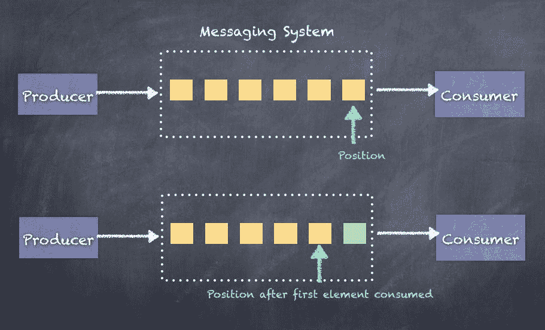

实时流数据的处理可以分为以下三种基本范式：

+   至少一次处理

+   至多一次处理

+   精确一次处理

让我们看看这三种流处理范式对我们的业务用例意味着什么。

虽然对于我们来说，实时事件的精确一次处理是最终的理想境界，但在不同的场景中总是实现这一目标非常困难。在那些保证的好处被实现的复杂性所压倒的情况下，我们不得不在精确一次处理的属性上做出妥协。

# 至少一次处理

至少一次处理范式涉及一种机制，即**只有在**事件实际处理并且结果被持久化之后才保存最后接收到的事件的位置，以便在发生故障并且消费者重新启动时，消费者将再次读取旧事件并处理它们。然而，由于无法保证接收到的事件根本没有被处理或部分处理，这会导致事件的潜在重复，因此事件至少被处理一次。

至少一次处理理想地适用于任何涉及更新瞬时标记或表盘以显示当前值的应用程序。任何累积总和、计数器或依赖于聚合的准确性（`sum`、`groupBy`等）都不适用于这种处理的用例，因为重复的事件会导致不正确的结果。

消费者的操作顺序如下：

1.  保存结果

1.  保存偏移量

下面是一个示例，说明了如果出现故障并且**消费者**重新启动会发生什么。由于事件已经被处理，但偏移量没有保存，消费者将从之前保存的偏移量读取，从而导致重复。在下图中，事件 0 被处理了两次：

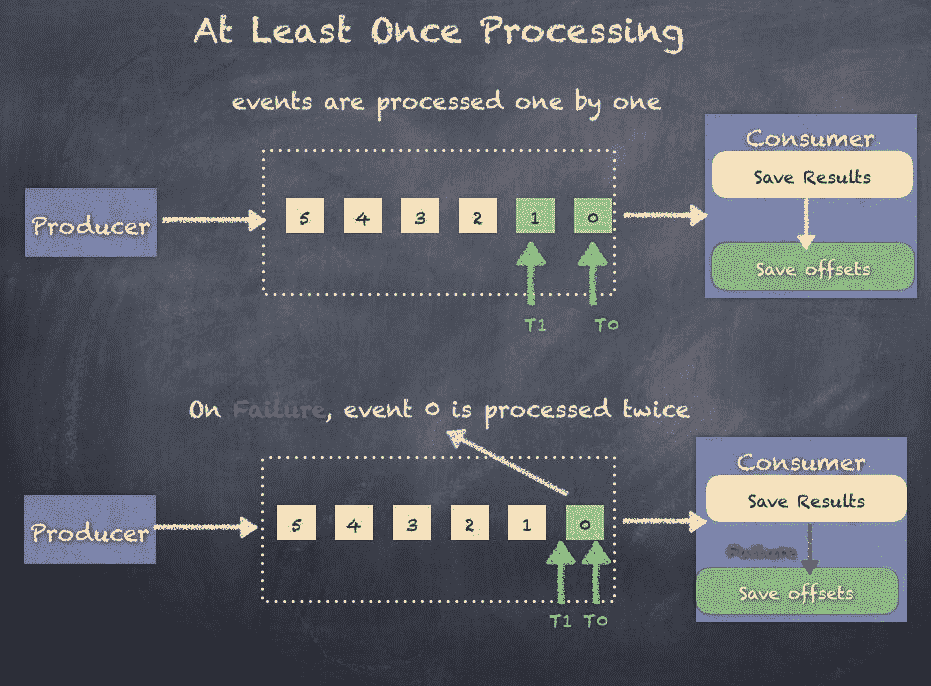

# 至多一次处理

至多一次处理范式涉及一种机制，在事件实际被处理并结果被持久化到某个地方之前，保存最后接收到的事件的位置，以便在发生故障并且消费者重新启动时，消费者不会尝试再次读取旧事件。然而，由于无法保证接收到的事件是否全部被处理，这可能导致事件的潜在丢失，因为它们永远不会再次被获取。这导致事件最多被处理一次或根本不被处理。

至多一次理想适用于任何需要更新一些即时标记或计量器以显示当前值的应用程序，以及任何累积总和、计数器或其他聚合，只要准确性不是必需的或应用程序绝对需要所有事件。任何丢失的事件都将导致不正确的结果或缺失的结果。

消费者的操作顺序如下：

1.  保存偏移量

1.  保存结果

以下是如果发生故障并且**消费者**重新启动时会发生的情况的示例。由于事件尚未被处理但偏移量已保存，消费者将从保存的偏移量读取，导致事件被消费时出现间隙。在以下图中，事件 0 从未被处理：

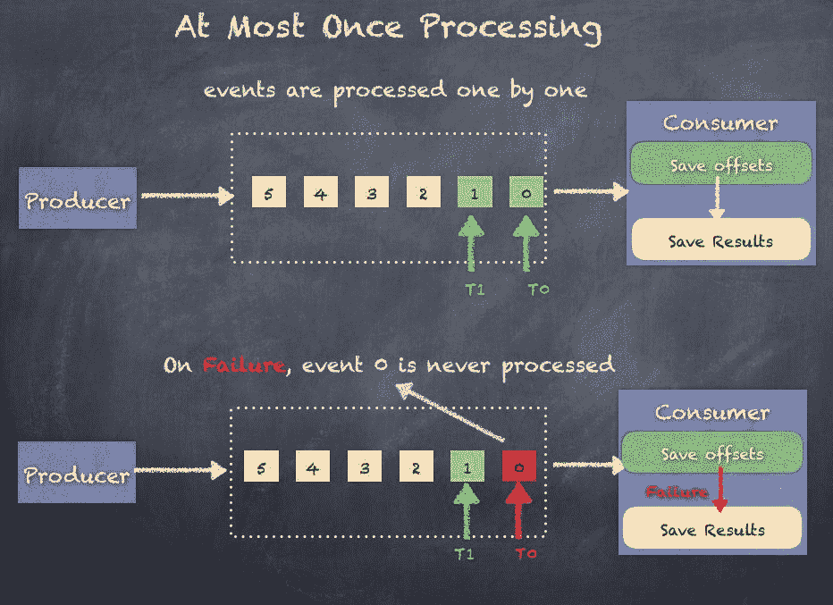

# 一次性处理

一次性处理范式类似于至少一次处理范式，并涉及一种机制，只有在事件实际被处理并且结果被持久化到某个地方后，才保存最后接收到的事件的位置，以便在发生故障并且消费者重新启动时，消费者将再次读取旧事件并处理它们。然而，由于无法保证接收到的事件是否根本未被处理或部分处理，这可能导致事件的潜在重复，因为它们会再次被获取。然而，与至少一次处理范式不同，重复的事件不会被处理，而是被丢弃，从而导致一次性处理范式。

一次性处理范式适用于任何需要准确计数器、聚合或一般需要每个事件仅被处理一次且绝对一次（无损失）的应用程序。

消费者的操作顺序如下：

1.  保存结果

1.  保存偏移量

以下是示例显示了如果发生故障并且**消费者**重新启动时会发生的情况。由于事件已经被处理但偏移量尚未保存，消费者将从先前保存的偏移量读取，从而导致重复。在以下图中，事件 0 仅被处理一次，因为**消费者**丢弃了重复的事件 0：

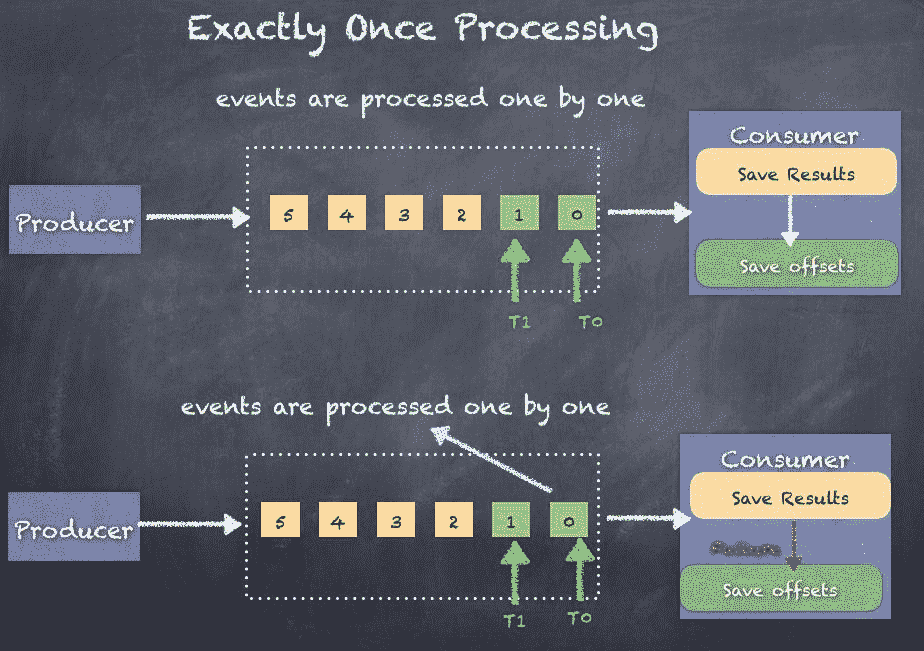

一次性范式如何丢弃重复项？这里有两种技术可以帮助：

1.  幂等更新

1.  事务更新

Spark Streaming 还在 Spark 2.0+中实现了结构化流处理，支持一次性处理。我们将在本章后面讨论结构化流处理。

幂等更新涉及基于生成的某个唯一 ID/键保存结果，以便如果有重复，生成的唯一 ID/键已经存在于结果中（例如，数据库），因此消费者可以丢弃重复项而不更新结果。这很复杂，因为并非总是可能或容易生成唯一键。它还需要在消费者端进行额外的处理。另一点是，数据库可以分开用于结果和偏移量。

事务更新以批量方式保存结果，其中包括事务开始和事务提交阶段，因此在提交发生时，我们知道事件已成功处理。因此，当接收到重复事件时，可以在不更新结果的情况下丢弃它们。这种技术比幂等更新复杂得多，因为现在我们需要一些事务性数据存储。另一点是，数据库必须用于结果和偏移量。

您应该研究您正在构建的用例，并查看至少一次处理或最多一次处理是否可以合理地广泛应用，并且仍然可以实现可接受的性能和准确性。

在接下来的章节中，我们将仔细研究 Spark Streaming 的范例，以及如何使用 Spark Streaming 并从 Apache Kafka 中消费事件。

# Spark Streaming

Spark Streaming 并不是第一个出现的流处理架构。 随着时间的推移，出现了几种技术来处理各种业务用例的实时处理需求。 Twitter Storm 是最早流行的流处理技术之一，并被许多组织使用，满足了许多企业的需求。

Apache Spark 配备了一个流处理库，它迅速发展成为最广泛使用的技术。 Spark Streaming 相对于其他技术具有一些明显的优势，首先是 Spark Streaming API 与 Spark 核心 API 之间的紧密集成，使得构建双重用途的实时和批量分析平台比以往更可行和高效。 Spark Streaming 还与 Spark ML 和 Spark SQL 以及 GraphX 集成，使其成为可以满足许多独特和复杂用例的最强大的流处理技术。 在本节中，我们将更深入地了解 Spark Streaming 的全部内容。

有关 Spark Streaming 的更多信息，您可以参考[`spark.apache.org/docs/2.1.0/streaming-programming-guide.html`](https://spark.apache.org/docs/2.1.0/streaming-programming-guide.html)。

Spark Streaming 支持多种输入源，并可以将结果写入多个接收器。

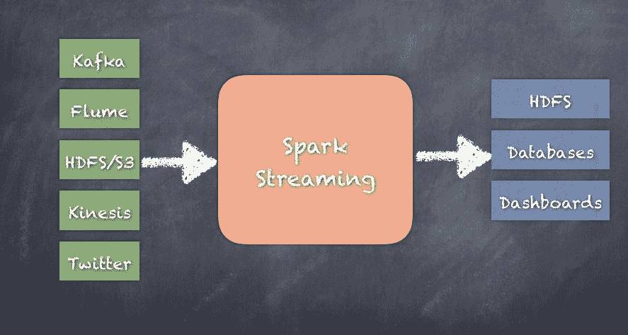

虽然 Flink、Heron（Twitter Storm 的继任者）、Samza 等都可以在收集事件时以最小的延迟处理事件，但 Spark Streaming 会消耗连续的数据流，然后以微批次的形式处理收集到的数据。 微批次的大小可以低至 500 毫秒，但通常不会低于这个值。

Apache Apex、Gear pump、Flink、Samza、Heron 或其他即将推出的技术在某些用例中与 Spark Streaming 竞争。 如果您需要真正的事件处理，那么 Spark Streaming 不适合您的用例。

流媒体的工作方式是根据配置定期创建事件批次，并在每个指定的时间间隔交付数据的微批次以进行进一步处理。

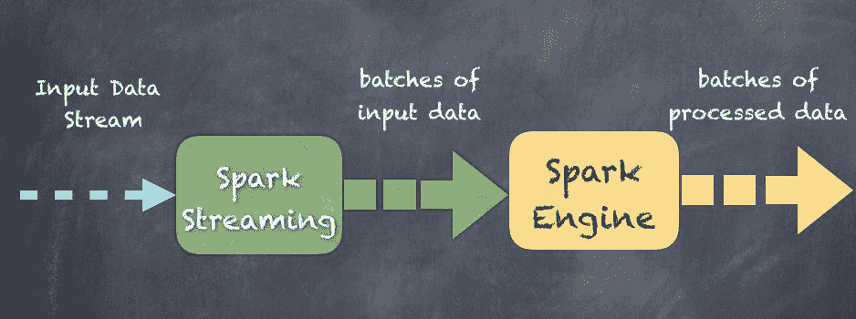

就像`SparkContext`一样，Spark Streaming 也有一个`StreamingContext`，它是流作业/应用程序的主要入口点。 `StreamingContext`依赖于`SparkContext`。 实际上，`SparkContext`可以直接在流作业中使用。 `StreamingContext`类似于`SparkContext`，只是`StreamingContext`还需要程序指定批处理间隔的时间间隔或持续时间，可以是毫秒或分钟。

请记住，`SparkContext`是入口点，任务调度和资源管理是`SparkContext`的一部分，因此`StreamingContext`重用了这一逻辑。

# StreamingContext

`StreamingContext`是流处理的主要入口点，基本上负责流处理应用程序，包括 DStreams 的检查点、转换和操作。

# 创建 StreamingContext

可以通过两种方式创建新的 StreamingContext：

1.  使用现有的`SparkContext`创建`StreamingContext`如下：

```scala
 StreamingContext(sparkContext: SparkContext, batchDuration: Duration) scala> val ssc = new StreamingContext(sc, Seconds(10))

```

1.  通过提供新的`SparkContext`所需的配置来创建`StreamingContext`如下：

```scala
 StreamingContext(conf: SparkConf, batchDuration: Duration) scala> val conf = new SparkConf().setMaster("local[1]")
                                       .setAppName("TextStreams")
      scala> val ssc = new StreamingContext(conf, Seconds(10))

```

1.  第三种方法是使用`getOrCreate()`，它用于从检查点数据重新创建`StreamingContext`，或创建一个新的`StreamingContext`。如果检查点数据存在于提供的`checkpointPath`中，则将从检查点数据重新创建`StreamingContext`。如果数据不存在，则将通过调用提供的`creatingFunc`创建`StreamingContext`：

```scala
        def getOrCreate(
          checkpointPath: String,
          creatingFunc: () => StreamingContext,
          hadoopConf: Configuration = SparkHadoopUtil.get.conf,
          createOnError: Boolean = false
        ): StreamingContext

```

# 开始 StreamingContext

`start()`方法启动使用`StreamingContext`定义的流的执行。这实质上启动了整个流应用程序：

```scala
def start(): Unit 

scala> ssc.start()

```

# 停止 StreamingContext

停止`StreamingContext`将停止所有处理，您将需要重新创建一个新的`StreamingContext`并在其上调用`start()`来重新启动应用程序。有两个有用的 API 用于停止流处理应用程序。

立即停止流的执行（不等待所有接收到的数据被处理）：

```scala
def stop(stopSparkContext: Boolean) scala> ssc.stop(false)

```

停止流的执行，并确保所有接收到的数据都已被处理：

```scala
def stop(stopSparkContext: Boolean, stopGracefully: Boolean) scala> ssc.stop(true, true)

```

# 输入流

有几种类型的输入流，如`receiverStream`和`fileStream`，可以使用`StreamingContext`创建，如下面的子节所示：

# receiverStream

使用任意用户实现的接收器创建一个输入流。它可以定制以满足用例。

在[`spark.apache.org/docs/latest/streaming-custom-receivers.html`](http://spark.apache.org/docs/latest/streaming-custom-receivers.html)找到更多细节。

以下是`receiverStream`的 API 声明：

```scala
 def receiverStreamT: ClassTag: ReceiverInputDStream[T]

```

# socketTextStream

这将从 TCP 源`hostname:port`创建一个输入流。使用 TCP 套接字接收数据，并将接收到的字节解释为 UTF8 编码的`\n`分隔行：

```scala
def socketTextStream(hostname: String, port: Int,
 storageLevel: StorageLevel = StorageLevel.MEMORY_AND_DISK_SER_2):
    ReceiverInputDStream[String]

```

# rawSocketStream

从网络源`hostname:port`创建一个输入流，其中数据作为序列化块（使用 Spark 的序列化器进行序列化）接收，可以直接推送到块管理器而无需对其进行反序列化。这是最有效的

接收数据的方法。

```scala
def rawSocketStreamT: ClassTag:
    ReceiverInputDStream[T]

```

# fileStream

创建一个输入流，监视 Hadoop 兼容文件系统以获取新文件，并使用给定的键值类型和输入格式进行读取。文件必须通过将它们从同一文件系统中的另一个位置移动到监视目录中来写入。以点（`.`）开头的文件名将被忽略，因此这是在监视目录中移动文件名的明显选择。使用原子文件重命名函数调用，以`.`开头的文件名现在可以重命名为实际可用的文件名，以便`fileStream`可以捡起它并让我们处理文件内容：

```scala
def fileStream[K: ClassTag, V: ClassTag, F <: NewInputFormat[K, V]: ClassTag] (directory: String): InputDStream[(K, V)]

```

# textFileStream

创建一个输入流，监视 Hadoop 兼容文件系统以获取新文件，并将它们作为文本文件读取（使用`LongWritable`作为键，Text 作为值，`TextInputFormat`作为输入格式）。文件必须通过将它们从同一文件系统中的另一个位置移动到监视目录中来写入。以`.`开头的文件名将被忽略：

```scala
def textFileStream(directory: String): DStream[String]

```

# binaryRecordsStream

创建一个输入流，监视 Hadoop 兼容文件系统以获取新文件，并将它们作为固定长度的二进制文件读取，生成每个记录的一个字节数组。文件必须通过将它们从同一文件系统中的另一个位置移动到监视目录中来写入。以`.`开头的文件名将被忽略：

```scala
def binaryRecordsStream(directory: String, recordLength: Int): DStream[Array[Byte]]

```

# queueStream

从 RDD 队列创建一个输入流。在每个批处理中，它将处理队列返回的一个或所有 RDD：

```scala
def queueStreamT: ClassTag: InputDStream[T]

```

# textFileStream 示例

以下是使用`textFileStream`的 Spark Streaming 的简单示例。在这个例子中，我们从 spark-shell 的`SparkContext`（`sc`）和一个间隔为 10 秒的时间间隔创建了一个`StreamingContext`。这将启动`textFileStream`，监视名为**streamfiles**的目录，并处理在目录中找到的任何新文件。在这个例子中，我们只是打印 RDD 中的元素数量：

```scala
scala> import org.apache.spark._
scala> import org.apache.spark.streaming._

scala> val ssc = new StreamingContext(sc, Seconds(10))

scala> val filestream = ssc.textFileStream("streamfiles")

scala> filestream.foreachRDD(rdd => {println(rdd.count())})

scala> ssc.start

```

# twitterStream 示例

让我们看另一个示例，说明我们如何使用 Spark Streaming 处理来自 Twitter 的推文：

1.  首先，打开一个终端并将目录更改为`spark-2.1.1-bin-hadoop2.7`。

1.  在您安装了 spark 的`spark-2.1.1-bin-hadoop2.7`文件夹下创建一个`streamouts`文件夹。当应用程序运行时，`streamouts`文件夹将收集推文到文本文件中。

1.  将以下 jar 文件下载到目录中：

+   [`central.maven.org/maven2/org/apache/bahir/spark-streaming-twitter_2.11/2.1.0/spark-streaming-twitter_2.11-2.1.0.jar`](http://central.maven.org/maven2/org/apache/bahir/spark-streaming-twitter_2.11/2.1.0/spark-streaming-twitter_2.11-2.1.0.jar)

+   [`central.maven.org/maven2/org/twitter4j/twitter4j-core/4.0.6/twitter4j-core-4.0.6.jar`](http://central.maven.org/maven2/org/twitter4j/twitter4j-core/4.0.6/twitter4j-core-4.0.6.jar)

+   [`central.maven.org/maven2/org/twitter4j/twitter4j-stream/4.0.6/twitter4j-stream-4.0.6.jar`](http://central.maven.org/maven2/org/twitter4j/twitter4j-stream/4.0.6/twitter4j-stream-4.0.6.jar)

1.  使用指定的 Twitter 集成所需的 jar 启动 spark-shell：

```scala
 ./bin/spark-shell --jars twitter4j-stream-4.0.6.jar,
                               twitter4j-core-4.0.6.jar,
                               spark-streaming-twitter_2.11-2.1.0.jar

```

1.  现在，我们可以编写一个示例代码。以下是用于测试 Twitter 事件处理的代码：

```scala
        import org.apache.spark._
        import org.apache.spark.streaming._
        import org.apache.spark.streaming.Twitter._
        import twitter4j.auth.OAuthAuthorization
        import twitter4j.conf.ConfigurationBuilder

        //you can replace the next 4 settings with your own Twitter
              account settings.
        System.setProperty("twitter4j.oauth.consumerKey",
                           "8wVysSpBc0LGzbwKMRh8hldSm") 
        System.setProperty("twitter4j.oauth.consumerSecret",
                  "FpV5MUDWliR6sInqIYIdkKMQEKaAUHdGJkEb4MVhDkh7dXtXPZ") 
        System.setProperty("twitter4j.oauth.accessToken",
                  "817207925756358656-yR0JR92VBdA2rBbgJaF7PYREbiV8VZq") 
        System.setProperty("twitter4j.oauth.accessTokenSecret",
                  "JsiVkUItwWCGyOLQEtnRpEhbXyZS9jNSzcMtycn68aBaS")

        val ssc = new StreamingContext(sc, Seconds(10))

        val twitterStream = TwitterUtils.createStream(ssc, None)

        twitterStream.saveAsTextFiles("streamouts/tweets", "txt")
        ssc.start()

        //wait for 30 seconds

        ss.stop(false)

```

您将看到`streamouts`文件夹中包含几个文本文件中的`tweets`输出。您现在可以打开`streamouts`目录并检查文件是否包含`tweets`。

# 离散流

Spark Streaming 是建立在一个称为**离散流**的抽象上的，称为**DStreams**。DStream 被表示为一系列 RDD，每个 RDD 在每个时间间隔创建。DStream 可以以类似于常规 RDD 的方式进行处理，使用类似的概念，如基于有向无环图的执行计划（有向无环图）。就像常规 RDD 处理一样，执行计划中的转换和操作也适用于 DStreams。

DStream 基本上将一个永无止境的数据流分成较小的块，称为微批处理，基于时间间隔，将每个单独的微批处理实现为一个 RDD，然后可以像常规 RDD 一样进行处理。每个这样的微批处理都是独立处理的，微批处理之间不保留状态，因此本质上是无状态的处理。假设批处理间隔为 5 秒，那么在事件被消耗时，每 5 秒间隔都会创建一个实时和微批处理，并将微批处理作为 RDD 交给进一步处理。Spark Streaming 的一个主要优势是用于处理事件微批处理的 API 调用与 spark 的 API 紧密集成，以提供与架构的其余部分无缝集成。当创建一个微批处理时，它会转换为一个 RDD，这使得使用 spark API 进行无缝处理成为可能。

`DStream`类在源代码中如下所示，显示了最重要的变量，即`HashMap[Time, RDD]`对：

```scala
class DStream[T: ClassTag] (var ssc: StreamingContext)

//hashmap of RDDs in the DStream
var generatedRDDs = new HashMap[Time, RDD[T]]()

```

以下是一个由每**T**秒创建的 RDD 组成的 DStream 的示例：

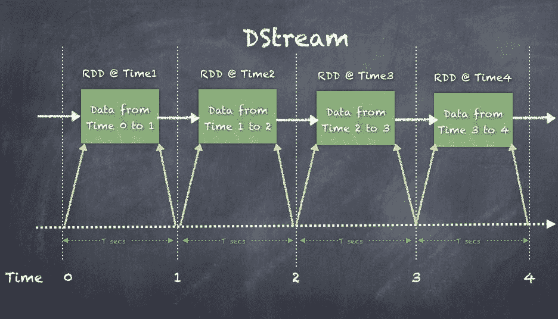

在以下示例中，创建了一个流上下文，以便每 5 秒创建一个微批处理，并创建一个 RDD，它就像 Spark 核心 API RDD 一样。DStream 中的 RDD 可以像任何其他 RDD 一样进行处理。

构建流应用程序涉及的步骤如下：

1.  从`SparkContext`创建一个`StreamingContext`。

1.  从`StreamingContext`创建一个`DStream`。

1.  提供可以应用于每个 RDD 的转换和操作。

1.  最后，通过在`StreamingContext`上调用`start()`来启动流应用程序。这将启动消费和处理实时事件的整个过程。

一旦 Spark Streaming 应用程序启动，就不能再添加其他操作了。停止的上下文无法重新启动，如果有这样的需要，您必须创建一个新的流上下文。

以下是一个访问 Twitter 的简单流作业的示例：

1.  从`SparkContext`创建`StreamingContext`：

```scala
 scala> val ssc = new StreamingContext(sc, Seconds(5))
      ssc: org.apache.spark.streaming.StreamingContext = 
 org.apache.spark.streaming.StreamingContext@8ea5756

```

1.  从`StreamingContext`创建`DStream`：

```scala
 scala> val twitterStream = TwitterUtils.createStream(ssc, None)
      twitterStream: org.apache.spark.streaming.dstream
 .ReceiverInputDStream[twitter4j.Status] = 
 org.apache.spark.streaming.Twitter.TwitterInputDStream@46219d14

```

1.  提供可应用于每个 RDD 的转换和操作：

```scala
 val aggStream = twitterStream
 .flatMap(x => x.getText.split(" ")).filter(_.startsWith("#"))
 .map(x => (x, 1))
 .reduceByKey(_ + _)

```

1.  最后，通过在`StreamingContext`上调用`start()`来启动流应用程序。这将启动整个实时事件的消费和处理过程：

```scala
 ssc.start()      //to stop just call stop on the StreamingContext
 ssc.stop(false)

```

1.  创建了一个`ReceiverInputDStream`类型的`DStream`，它被定义为定义任何必须在工作节点上启动接收器以接收外部数据的`InputDStream`的抽象类。在这里，我们从 Twitter 流接收：

```scala
        class InputDStreamT: ClassTag extends
                                        DStreamT

        class ReceiverInputDStreamT: ClassTag
                                  extends InputDStreamT

```

1.  如果在`twitterStream`上运行`flatMap()`转换，将得到一个`FlatMappedDStream`，如下所示：

```scala
 scala> val wordStream = twitterStream.flatMap(x => x.getText()
                                                          .split(" "))
      wordStream: org.apache.spark.streaming.dstream.DStream[String] = 
 org.apache.spark.streaming.dstream.FlatMappedDStream@1ed2dbd5

```

# 转换

DStream 上的转换类似于适用于 Spark 核心 RDD 的转换。由于 DStream 由 RDD 组成，因此转换也适用于每个 RDD，以生成转换后的 RDD，然后创建转换后的 DStream。每个转换都创建一个特定的`DStream`派生类。

以下图表显示了从父`DStream`类开始的`DStream`类的层次结构。我们还可以看到从父类继承的不同类：

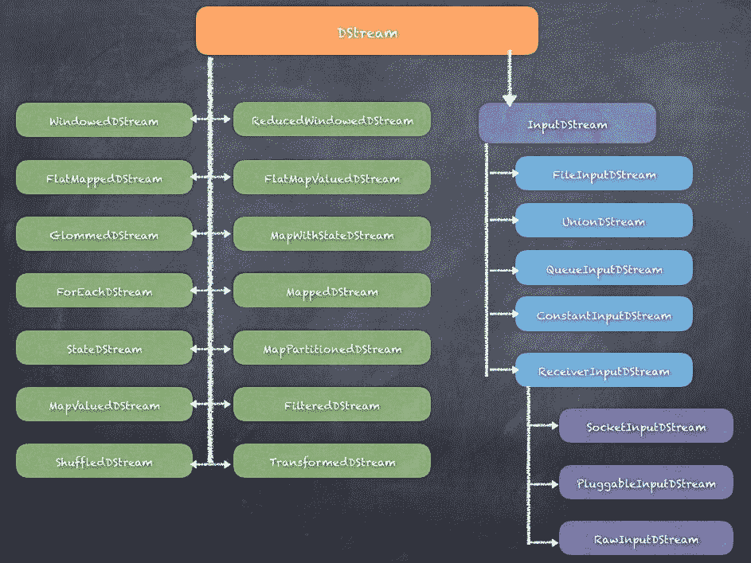

有很多`DStream`类是专门为功能而构建的。映射转换、窗口函数、减少操作和不同类型的输入流都是使用从`DStream`类派生的不同类来实现的。

以下是对基本 DStream 进行转换以生成过滤 DStream 的示例。同样，任何转换都适用于 DStream：

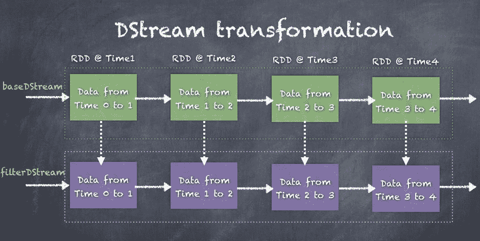

参考以下表格，了解可能的转换类型。

| 转换 | 意义 |
| --- | --- |
| `map(func)` | 将转换函数应用于 DStream 的每个元素，并返回一个新的 DStream。 |
| `flatMap(func)` | 这类似于 map；然而，就像 RDD 的`flatMap`与 map 一样，使用`flatMap`对每个元素进行操作并应用`flatMap`，从而为每个输入产生多个输出项。 |
| `filter(func)` | 这将过滤掉 DStream 的记录，返回一个新的 DStream。 |
| `repartition(numPartitions)` | 这将创建更多或更少的分区以重新分发数据以更改并行性。 |
| `union(otherStream)` | 这将合并两个源 DStream 中的元素，并返回一个新的 DStream。 |
| `count()` | 通过计算源 DStream 的每个 RDD 中的元素数量，返回一个新的 DStream。 |
| `reduce(func)` | 通过在源 DStream 的每个元素上应用`reduce`函数，返回一个新的 DStream。 |
| `countByValue()` | 这计算每个键的频率，并返回一个新的(key, long)对的 DStream。 |
| `reduceByKey(func, [numTasks])` | 这将按键聚合源 DStream 的 RDD，并返回一个新的(key, value)对的 DStream。 |
| `join(otherStream, [numTasks])` | 这将连接两个*(K, V)*和*(K, W)*对的 DStream，并返回一个新的*(K, (V, W))*对的 DStream，结合了两个 DStream 的值。 |
| `cogroup(otherStream, [numTasks])` | `cogroup()`在对*(K, V)*和*(K, W)*对的 DStream 调用时，将返回一个新的*(K, Seq[V], Seq[W])*元组的 DStream。 |
| `transform(func)` | 这在源 DStream 的每个 RDD 上应用转换函数，并返回一个新的 DStream。 |
| `updateStateByKey(func)` | 这通过在键的先前状态和键的新值上应用给定的函数来更新每个键的状态。通常用于维护状态机。 |

# 窗口操作

Spark Streaming 提供了窗口处理，允许您在事件的滑动窗口上应用转换。滑动窗口是在指定的间隔内创建的。每当窗口在源 DStream 上滑动时，窗口规范内的源 RDD 将被组合并操作以生成窗口化的 DStream。窗口需要指定两个参数：

+   **窗口长度：指定为窗口考虑的间隔长度**

+   滑动间隔：这是创建窗口的间隔

窗口长度和滑动间隔都必须是块间隔的倍数。

以下是一个示例，显示了具有滑动窗口操作的 DStream，显示了旧窗口（虚线矩形）如何在一个间隔内向右滑动到新窗口（实线矩形）：

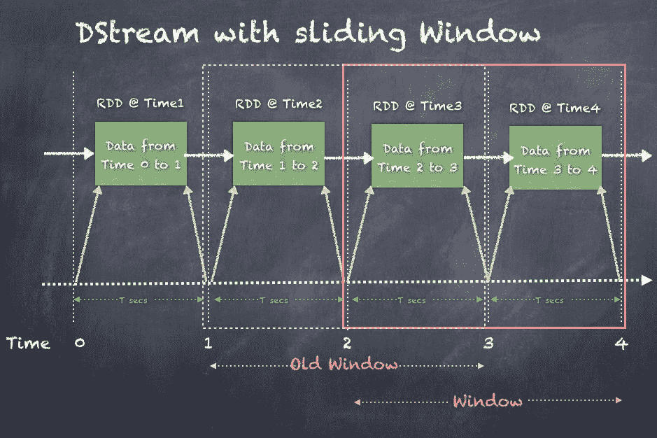

一些常见的窗口操作如下。

| 转换 | 意义 |
| --- | --- |
| `window(windowLength, slideInterval)` | 在源 DStream 上创建窗口，并返回一个新的 DStream。 |
| `countByWindow(windowLength, slideInterval)` | 通过应用滑动窗口返回 DStream 中元素的计数。 |
| `reduceByWindow(func, windowLength, slideInterval)` | 创建一个新的 DStream，通过在创建长度为`windowLength`的滑动窗口后，对源 DStream 的每个元素应用 reduce 函数来实现。 |
| `reduceByKeyAndWindow(func, windowLength, slideInterval, [numTasks])` | 在应用于源 DStream 的 RDD 的窗口中按键聚合数据，并返回新的（键，值）对的 DStream。计算由函数`func`提供。 |
| `reduceByKeyAndWindow(func, invFunc, windowLength, slideInterval, [numTasks])` | 在应用于源 DStream 的 RDD 的窗口中按键聚合数据，并返回新的（键，值）对的 DStream。与前一个函数的关键区别在于`invFunc`，它提供了在滑动窗口开始时要执行的计算。 |
| `countByValueAndWindow(windowLength, slideInterval, [numTasks])` | 这计算每个键的频率，并返回指定滑动窗口内的新 DStream 的（键，长）对。 |

让我们更详细地看一下 Twitter 流示例。我们的目标是每五秒打印流式传输的推文中使用的前五个单词，使用长度为 15 秒的窗口，每 10 秒滑动一次。因此，我们可以在 15 秒内获得前五个单词。

要运行此代码，请按照以下步骤操作：

1.  首先，打开终端并切换到`spark-2.1.1-bin-hadoop2.7`目录。

1.  在安装了 spark 的`spark-2.1.1-bin-hadoop2.7`文件夹下创建一个名为`streamouts`的文件夹。当应用程序运行时，`streamouts`文件夹将收集推文到文本文件中。

1.  将以下 jar 包下载到目录中：

+   [`central.maven.org/maven2/org/apache/bahir/spark-streaming-twitter_2.11/2.1.0/spark-streaming-twitter_2.11-2.1.0.jar`](http://central.maven.org/maven2/org/apache/bahir/spark-streaming-twitter_2.11/2.1.0/spark-streaming-twitter_2.11-2.1.0.jar)

+   [`central.maven.org/maven2/org/twitter4j/twitter4j-core/4.0.6/twitter4j-core-4.0.6.jar`](http://central.maven.org/maven2/org/twitter4j/twitter4j-core/4.0.6/twitter4j-core-4.0.6.jar)

+   [`central.maven.org/maven2/org/twitter4j/twitter4j-stream/4.0.6/twitter4j-stream-4.0.6.jar`](http://central.maven.org/maven2/org/twitter4j/twitter4j-stream/4.0.6/twitter4j-stream-4.0.6.jar)

1.  使用指定的 Twitter 集成所需的 jar 启动 spark-shell：

```scala
 ./bin/spark-shell --jars twitter4j-stream-4.0.6.jar,
                               twitter4j-core-4.0.6.jar,
                               spark-streaming-twitter_2.11-2.1.0.jar

```

1.  现在，我们可以编写代码。以下是用于测试 Twitter 事件处理的代码：

```scala
        import org.apache.log4j.Logger
        import org.apache.log4j.Level
        Logger.getLogger("org").setLevel(Level.OFF)

       import java.util.Date
       import org.apache.spark._
       import org.apache.spark.streaming._
       import org.apache.spark.streaming.Twitter._
       import twitter4j.auth.OAuthAuthorization
       import twitter4j.conf.ConfigurationBuilder

       System.setProperty("twitter4j.oauth.consumerKey",
                          "8wVysSpBc0LGzbwKMRh8hldSm")
       System.setProperty("twitter4j.oauth.consumerSecret",
                  "FpV5MUDWliR6sInqIYIdkKMQEKaAUHdGJkEb4MVhDkh7dXtXPZ")
       System.setProperty("twitter4j.oauth.accessToken",
                  "817207925756358656-yR0JR92VBdA2rBbgJaF7PYREbiV8VZq")
       System.setProperty("twitter4j.oauth.accessTokenSecret",
                  "JsiVkUItwWCGyOLQEtnRpEhbXyZS9jNSzcMtycn68aBaS")

       val ssc = new StreamingContext(sc, Seconds(5))

       val twitterStream = TwitterUtils.createStream(ssc, None)

       val aggStream = twitterStream
             .flatMap(x => x.getText.split(" "))
             .filter(_.startsWith("#"))
             .map(x => (x, 1))
             .reduceByKeyAndWindow(_ + _, _ - _, Seconds(15),
                                   Seconds(10), 5)

       ssc.checkpoint("checkpoints")
       aggStream.checkpoint(Seconds(10))

       aggStream.foreachRDD((rdd, time) => {
         val count = rdd.count()

         if (count > 0) {
           val dt = new Date(time.milliseconds)
           println(s"\n\n$dt rddCount = $count\nTop 5 words\n")
           val top5 = rdd.sortBy(_._2, ascending = false).take(5)
           top5.foreach {
             case (word, count) =>
             println(s"[$word] - $count")
           }
         }
       })

       ssc.start

       //wait 60 seconds
       ss.stop(false)

```

1.  输出每 15 秒在控制台上显示，并且看起来像下面这样：

```scala
 Mon May 29 02:44:50 EDT 2017 rddCount = 1453
 Top 5 words

 [#RT] - 64
 [#de] - 24
 [#a] - 15
 [#to] - 15
 [#the] - 13

 Mon May 29 02:45:00 EDT 2017 rddCount = 3312
 Top 5 words

 [#RT] - 161
 [#df] - 47
 [#a] - 35
 [#the] - 29
 [#to] - 29

```

# 有状态/无状态转换

如前所述，Spark Streaming 使用 DStreams 的概念，这些 DStreams 实质上是作为 RDDs 创建的微批数据。我们还看到了在 DStreams 上可能的转换类型。DStreams 上的转换可以分为两种类型：**无状态转换**和**有状态转换**。

在无状态转换中，每个微批处理的处理不依赖于先前的数据批处理。因此，这是一个无状态的转换，每个批处理都独立于此批处理之前发生的任何事情进行处理。

在有状态转换中，每个微批处理的处理取决于先前的数据批处理，完全或部分地。因此，这是一个有状态的转换，每个批处理都考虑了此批处理之前发生的事情，并在计算此批处理中的数据时使用这些信息。

# 无状态转换

无状态转换通过对 DStream 中的每个 RDD 应用转换来将一个 DStream 转换为另一个 DStream。诸如`map()`、`flatMap()`、`union()`、`join()`和`reduceByKey`等转换都是无状态转换的示例。

下面的示例显示了对`inputDStream`进行`map()`转换以生成新的`mapDstream`：

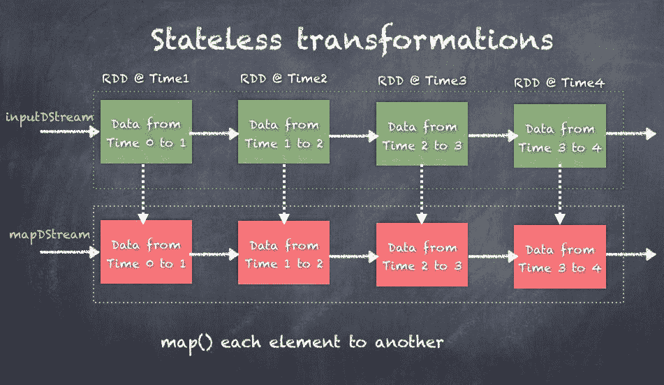

# 有状态转换

有状态转换在 DStream 上进行操作，但计算取决于先前的处理状态。诸如`countByValueAndWindow`、`reduceByKeyAndWindow`、`mapWithState`和`updateStateByKey`等操作都是有状态转换的示例。实际上，所有基于窗口的转换都是有状态的，因为根据窗口操作的定义，我们需要跟踪 DStream 的窗口长度和滑动间隔。

# 检查点

实时流应用程序旨在长时间运行并对各种故障具有弹性。Spark Streaming 实现了一个检查点机制，可以维护足够的信息以从故障中恢复。

需要检查点的两种数据类型：

+   元数据检查点

+   数据检查点

可以通过在`StreamingContext`上调用`checkpoint()`函数来启用检查点，如下所示：

```scala
def checkpoint(directory: String)

```

指定可靠存储检查点数据的目录。

请注意，这必须是像 HDFS 这样的容错文件系统。

一旦设置了检查点目录，任何 DStream 都可以根据指定的间隔检查点到该目录中。看看 Twitter 的例子，我们可以每 10 秒将每个 DStream 检查点到`checkpoints`目录中：

```scala
val ssc = new StreamingContext(sc, Seconds(5))

val twitterStream = TwitterUtils.createStream(ssc, None)

val wordStream = twitterStream.flatMap(x => x.getText().split(" "))

val aggStream = twitterStream
 .flatMap(x => x.getText.split(" ")).filter(_.startsWith("#"))
 .map(x => (x, 1))
 .reduceByKeyAndWindow(_ + _, _ - _, Seconds(15), Seconds(10), 5)

ssc.checkpoint("checkpoints")

aggStream.checkpoint(Seconds(10))

wordStream.checkpoint(Seconds(10))

```

几秒钟后，`checkpoints`目录看起来像下面这样，显示了元数据以及 RDDs，`logfiles`也作为检查点的一部分进行维护：

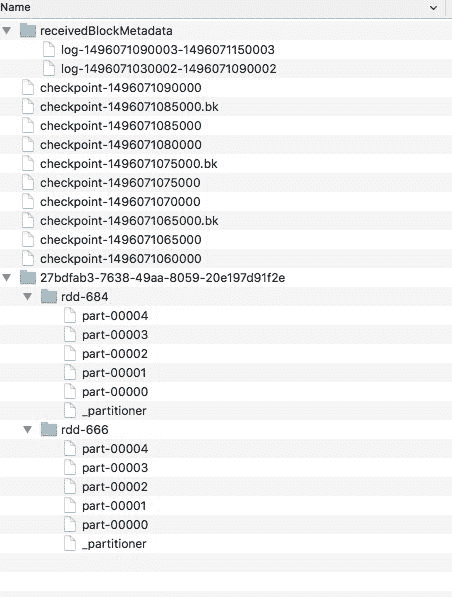

# 元数据检查点

**元数据检查点**保存定义流操作的信息，这些信息由**有向无环图**（**DAG**）表示到 HDFS。这可以用于在发生故障并且应用程序重新启动时恢复 DAG。驱动程序重新启动并从 HDFS 读取元数据，并重建 DAG 并恢复崩溃之前的所有操作状态。

元数据包括以下内容：

+   **配置**：用于创建流应用程序的配置

+   **DStream 操作**：定义流应用程序的 DStream 操作集

+   **不完整的批处理**：作业已排队但尚未完成的批处理

# 数据检查点

数据检查点将实际的 RDD 保存到 HDFS，以便如果流应用程序发生故障，应用程序可以恢复检查点的 RDD 并从中断的地方继续。虽然流应用程序恢复是数据检查点的一个很好的用例，但检查点还有助于在某些 RDD 由于缓存清理或执行器丢失而丢失时实例化生成的 RDD，而无需等待所有父 RDD 在血统（DAG）中重新计算。

对于具有以下任何要求的应用程序，必须启用检查点：

+   **使用有状态转换**：如果应用程序中使用了`updateStateByKey`或`reduceByKeyAndWindow`（带有逆函数），则必须提供检查点目录以允许定期 RDD 检查点。

+   **从运行应用程序的驱动程序的故障中恢复**：元数据检查点用于恢复进度信息。

如果您的流应用程序没有有状态的转换，则可以在不启用检查点的情况下运行应用程序。

您的流应用程序中可能会丢失已接收但尚未处理的数据。

请注意，RDD 的检查点会产生将每个 RDD 保存到存储的成本。这可能会导致 RDD 检查点的批次处理时间增加。因此，检查点的间隔需要谨慎设置，以免引起性能问题。在小批量大小（比如 1 秒）的情况下，每个小批量频繁检查点可能会显著降低操作吞吐量。相反，检查点太不频繁会导致血统和任务大小增长，这可能会导致处理延迟，因为要持久化的数据量很大。

对于需要 RDD 检查点的有状态转换，默认间隔是批处理间隔的倍数，至少为 10 秒。

一个 5 到 10 个滑动间隔的 DStream 的检查点间隔是一个很好的起点设置。

# 驱动程序故障恢复

使用`StreamingContext.getOrCreate()`可以实现驱动程序故障恢复，以初始化`StreamingContext`从现有检查点或创建新的 StreamingContext。

流应用程序启动时的两个条件如下：

+   当程序第一次启动时，需要从检查点目录中的检查点数据初始化一个新的`StreamingContext`，设置所有流，然后调用`start()`

+   在故障后重新启动程序时，需要从检查点目录中的检查点数据初始化一个`StreamingContext`，然后调用`start()`

我们将实现一个名为`createStreamContext()`的函数，它创建`StreamingContext`并设置各种 DStreams 来解析推文，并使用窗口每 15 秒生成前五个推文标签。但是，我们将调用`getOrCreate()`而不是调用`createStreamContext()`然后调用`ssc.start()`，这样如果`checkpointDirectory`存在，那么上下文将从检查点数据中重新创建。如果目录不存在（应用程序第一次运行），那么将调用函数`createStreamContext()`来创建一个新的上下文并设置 DStreams：

```scala
val ssc = StreamingContext.getOrCreate(checkpointDirectory,
                                       createStreamContext _)

```

以下是显示函数定义以及如何调用`getOrCreate()`的代码：

```scala
val checkpointDirectory = "checkpoints"

// Function to create and setup a new StreamingContext
def createStreamContext(): StreamingContext = {
  val ssc = new StreamingContext(sc, Seconds(5))

  val twitterStream = TwitterUtils.createStream(ssc, None)

  val wordStream = twitterStream.flatMap(x => x.getText().split(" "))

  val aggStream = twitterStream
    .flatMap(x => x.getText.split(" ")).filter(_.startsWith("#"))
    .map(x => (x, 1))
    .reduceByKeyAndWindow(_ + _, _ - _, Seconds(15), Seconds(10), 5)

  ssc.checkpoint(checkpointDirectory)

  aggStream.checkpoint(Seconds(10))

  wordStream.checkpoint(Seconds(10))

  aggStream.foreachRDD((rdd, time) => {
    val count = rdd.count()

    if (count > 0) {
      val dt = new Date(time.milliseconds)
      println(s"\n\n$dt rddCount = $count\nTop 5 words\n")
      val top10 = rdd.sortBy(_._2, ascending = false).take(5)
      top10.foreach {
        case (word, count) => println(s"[$word] - $count")
      }
    }
  })
  ssc
}

// Get StreamingContext from checkpoint data or create a new one
val ssc = StreamingContext.getOrCreate(checkpointDirectory, createStreamContext _)

```

# 与流平台（Apache Kafka）的互操作性

Spark Streaming 与 Apache Kafka 有非常好的集成，这是当前最流行的消息平台。Kafka 集成有几种方法，并且该机制随着时间的推移而不断发展，以提高性能和可靠性。

将 Spark Streaming 与 Kafka 集成有三种主要方法：

+   基于接收器的方法

+   直接流方法

+   结构化流

# 基于接收器的方法

基于接收器的方法是 Spark 和 Kafka 之间的第一个集成。在这种方法中，驱动程序在执行程序上启动接收器，使用高级 API 从 Kafka 代理中拉取数据。由于接收器从 Kafka 代理中拉取事件，接收器会将偏移量更新到 Zookeeper 中，这也被 Kafka 集群使用。关键之处在于使用**WAL**（预写式日志），接收器在从 Kafka 消耗数据时会不断写入。因此，当出现问题并且执行程序或接收器丢失或重新启动时，可以使用 WAL 来恢复事件并处理它们。因此，这种基于日志的设计既提供了耐用性又提供了一致性。

每个接收器都会从 Kafka 主题创建一个输入 DStream，同时查询 Zookeeper 以获取 Kafka 主题、代理、偏移量等。在此之后，我们在前几节中讨论过的 DStreams 就会发挥作用。

长时间运行的接收器使并行性变得复杂，因为随着应用程序的扩展，工作负载不会得到适当的分布。依赖 HDFS 也是一个问题，还有写操作的重复。至于一次性处理所需的可靠性，只有幂等方法才能起作用。接收器基于事务的方法无法起作用的原因是，无法从 HDFS 位置或 Zookeeper 访问偏移量范围。

基于接收器的方法适用于任何消息系统，因此更通用。

您可以通过调用`createStream()` API 创建基于接收器的流，如下所示：

```scala
def createStream(
 ssc: StreamingContext, // StreamingContext object
 zkQuorum: String, //Zookeeper quorum (hostname:port,hostname:port,..)
 groupId: String, //The group id for this consumer
 topics: Map[String, Int], //Map of (topic_name to numPartitions) to
                  consume. Each partition is consumed in its own thread
 storageLevel: StorageLevel = StorageLevel.MEMORY_AND_DISK_SER_2 
  Storage level to use for storing the received objects
  (default: StorageLevel.MEMORY_AND_DISK_SER_2)
): ReceiverInputDStream[(String, String)] //DStream of (Kafka message key, Kafka message value)

```

以下是创建基于接收器的流的示例，从 Kafka 代理中拉取消息：

```scala
val topicMap = topics.split(",").map((_, numThreads.toInt)).toMap
val lines = KafkaUtils.createStream(ssc, zkQuorum, group,
                                    topicMap).map(_._2)

```

以下是驱动程序如何在执行程序上启动接收器，使用高级 API 从 Kafka 中拉取数据的示例。接收器从 Kafka Zookeeper 集群中拉取主题偏移量范围，然后在从代理中拉取事件时也更新 Zookeeper：

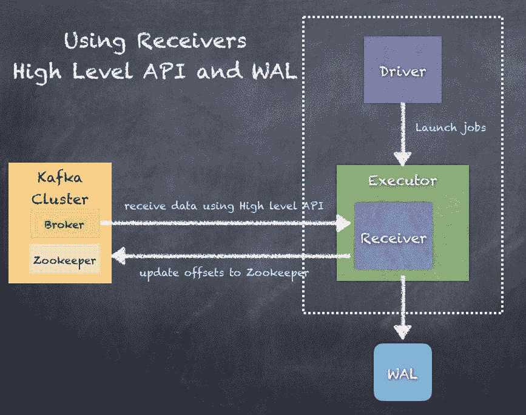

# 直接流

基于直接流的方法是相对于 Kafka 集成的较新方法，通过使用驱动程序直接连接到代理并拉取事件。关键之处在于使用直接流 API，Spark 任务在处理 Spark 分区到 Kafka 主题/分区时是一对一的比例。不依赖于 HDFS 或 WAL 使其灵活。此外，由于现在我们可以直接访问偏移量，我们可以使用幂等或事务性方法进行一次性处理。

创建一个直接从 Kafka 代理中拉取消息而不使用任何接收器的输入流。此流可以保证每条来自 Kafka 的消息在转换中被包含一次。

直接流的属性如下：

+   **没有接收器**：此流不使用任何接收器，而是直接查询 Kafka。

+   **偏移量**：这不使用 Zookeeper 来存储偏移量，而是由流本身跟踪消耗的偏移量。您可以从生成的 RDD 中访问每个批次使用的偏移量。

+   **故障恢复**：要从驱动程序故障中恢复，必须在`StreamingContext`中启用检查点。

+   **端到端语义**：此流确保每条记录被有效接收和转换一次，但不能保证转换后的数据是否被输出一次。

您可以使用 KafkaUtils 的`createDirectStream()` API 创建直接流，如下所示：

```scala
def createDirectStream[
 K: ClassTag, //K type of Kafka message key
 V: ClassTag, //V type of Kafka message value
 KD <: Decoder[K]: ClassTag, //KD type of Kafka message key decoder
 VD <: Decoder[V]: ClassTag, //VD type of Kafka message value decoder
 R: ClassTag //R type returned by messageHandler
](
 ssc: StreamingContext, //StreamingContext object
 KafkaParams: Map[String, String], 
  /*
  KafkaParams Kafka <a  href="http://Kafka.apache.org/documentation.html#configuration">
  configuration parameters</a>. Requires "metadata.broker.list" or   "bootstrap.servers"
to be set with Kafka broker(s) (NOT zookeeper servers) specified in
  host1:port1,host2:port2 form.
  */
 fromOffsets: Map[TopicAndPartition, Long], //fromOffsets Per- topic/partition Kafka offsets defining the (inclusive) starting point of the stream
 messageHandler: MessageAndMetadata[K, V] => R //messageHandler Function for translating each message and metadata into the desired type
): InputDStream[R] //DStream of R

```

以下是创建直接流的示例，从 Kafka 主题中拉取数据并创建 DStream：

```scala
val topicsSet = topics.split(",").toSet
val KafkaParams : Map[String, String] =
        Map("metadata.broker.list" -> brokers,
            "group.id" -> groupid )

val rawDstream = KafkaUtils.createDirectStreamString, String, StringDecoder, StringDecoder

```

直接流 API 只能与 Kafka 一起使用，因此这不是一种通用方法。

以下是驱动程序如何从 Zookeeper 中拉取偏移量信息，并指示执行程序根据驱动程序指定的偏移量范围启动任务从代理中拉取事件的示例：

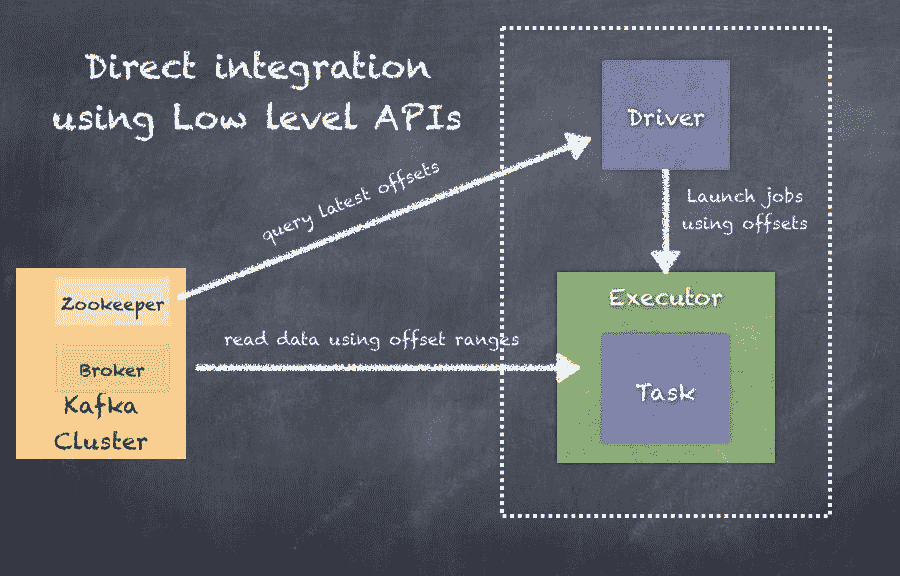

# 结构化流

结构化流是 Apache Spark 2.0+中的新功能，从 Spark 2.2 版本开始已经是 GA。您将在下一节中看到详细信息，以及如何使用结构化流的示例。

有关结构化流中 Kafka 集成的更多详细信息，请参阅[`spark.apache.org/docs/latest/structured-streaming-kafka-integration.html`](https://spark.apache.org/docs/latest/structured-streaming-kafka-integration.html)。

使用结构化流中的 Kafka 源流的示例如下：

```scala
val ds1 = spark
 .readStream
 .format("Kafka")
 .option("Kafka.bootstrap.servers", "host1:port1,host2:port2")
 .option("subscribe", "topic1")
 .load()

ds1.selectExpr("CAST(key AS STRING)", "CAST(value AS STRING)")
 .as[(String, String)]

```

使用 Kafka 源而不是源流的示例（如果您想要更多的批量分析方法）如下：

```scala
val ds1 = spark
 .read
 .format("Kafka")
 .option("Kafka.bootstrap.servers", "host1:port1,host2:port2")
 .option("subscribe", "topic1")
 .load()

ds1.selectExpr("CAST(key AS STRING)", "CAST(value AS STRING)")
 .as[(String, String)]

```

# 结构化流

结构化流是建立在 Spark SQL 引擎之上的可伸缩和容错的流处理引擎。这将流处理和计算更接近批处理，而不是 DStream 范式和当前时刻涉及的 Spark 流处理 API 的挑战。结构化流引擎解决了诸多挑战，如精确一次的流处理、处理结果的增量更新、聚合等。

结构化流 API 还提供了解决 Spark 流的一个重大挑战的手段，即，Spark 流以微批处理方式处理传入数据，并使用接收时间作为数据分割的手段，因此不考虑数据的实际事件时间。结构化流允许您在接收的数据中指定这样一个事件时间，以便自动处理任何延迟的数据。

结构化流在 Spark 2.2 中是 GA 的，API 已标记为 GA。请参阅[`spark.apache.org/docs/latest/structured-streaming-programming-guide.html`](https://spark.apache.org/docs/latest/structured-streaming-programming-guide.html)。

结构化流的关键思想是将实时数据流视为不断追加到的无界表，随着事件从流中处理，可以运行计算和 SQL 查询。例如，Spark SQL 查询将处理无界表：

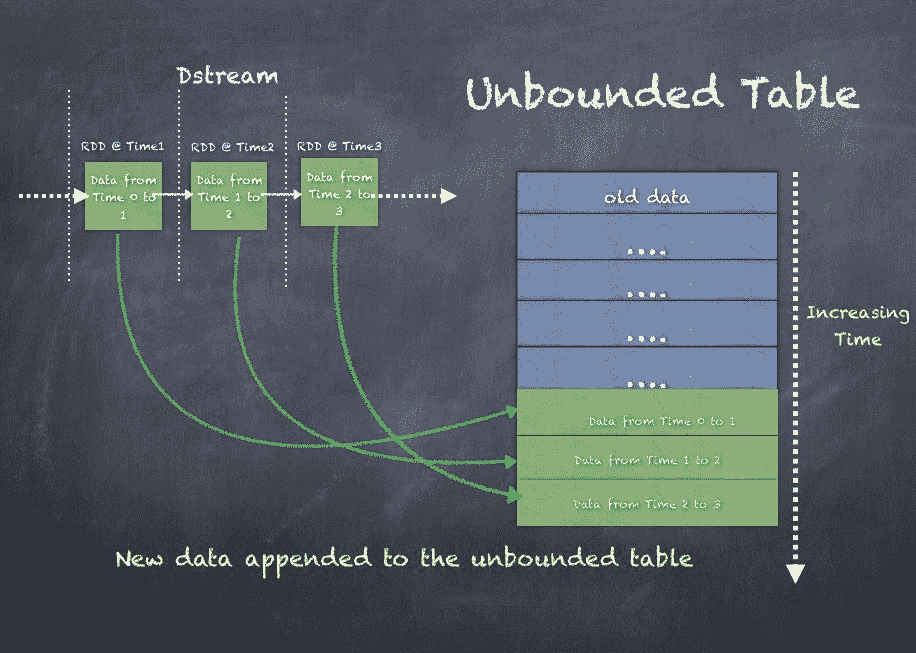

随着 DStream 随时间的变化，将处理更多的数据以生成结果。因此，无界输入表用于生成结果表。输出或结果表可以写入称为**输出**的外部接收器。

**输出**是写出的内容，可以以不同的模式定义：

+   **完整模式**：整个更新后的结果表将写入外部存储。由存储连接器决定如何处理整个表的写入。

+   **追加模式**：自上次触发以来附加到结果表的任何新行都将写入外部存储。这仅适用于查询，其中不希望更改结果表中的现有行。

+   **更新模式**：自上次触发以来更新的行将写入外部存储。请注意，这与完整模式不同，因为此模式仅输出自上次触发以来发生更改的行。如果查询不包含聚合，它将等同于追加模式。

下面是从无界表输出的示例：

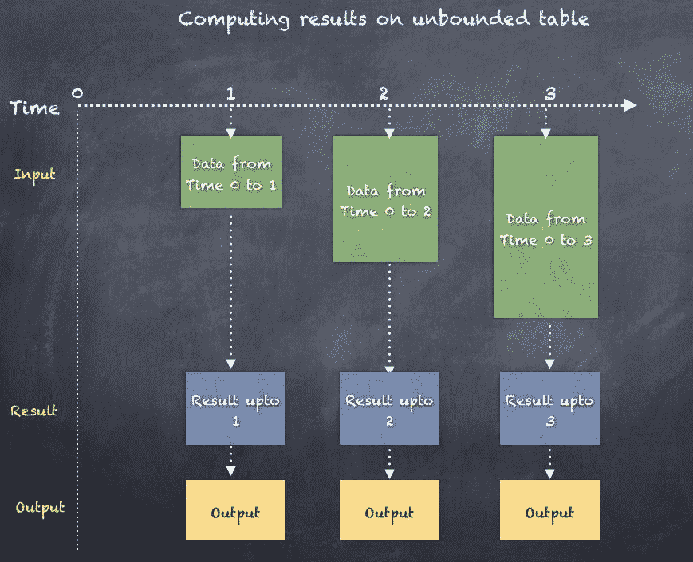

我们将展示一个示例，通过监听本地端口 9999 来创建一个结构化流查询。

如果使用 Linux 或 Mac，在端口 9999 上启动一个简单的服务器很容易：nc -lk 9999。

下面是一个示例，我们首先通过调用 SparkSession 的`readStream` API 创建一个`inputStream`，然后从行中提取单词。然后我们对单词进行分组和计数，最后将结果写入输出流：

```scala
//create stream reading from localhost 9999
val inputLines = spark.readStream
 .format("socket")
 .option("host", "localhost")
 .option("port", 9999)
 .load()
inputLines: org.apache.spark.sql.DataFrame = [value: string]

// Split the inputLines into words
val words = inputLines.as[String].flatMap(_.split(" "))
words: org.apache.spark.sql.Dataset[String] = [value: string]

// Generate running word count
val wordCounts = words.groupBy("value").count()
wordCounts: org.apache.spark.sql.DataFrame = [value: string, count: bigint]

val query = wordCounts.writeStream
 .outputMode("complete")
 .format("console")
query: org.apache.spark.sql.streaming.DataStreamWriter[org.apache.spark.sql.Row] = org.apache.spark.sql.streaming.DataStreamWriter@4823f4d0

query.start()

```

当您在终端中不断输入单词时，查询会不断更新并生成结果，这些结果将打印在控制台上：

```scala
scala> -------------------------------------------
Batch: 0
-------------------------------------------
+-----+-----+
|value|count|
+-----+-----+
| dog| 1|
+-----+-----+

-------------------------------------------
Batch: 1
-------------------------------------------
+-----+-----+
|value|count|
+-----+-----+
| dog| 1|
| cat| 1|
+-----+-----+

scala> -------------------------------------------
Batch: 2
-------------------------------------------
+-----+-----+
|value|count|
+-----+-----+
| dog| 2|
| cat| 1|
+-----+-----+

```

# 处理事件时间和延迟数据

**事件时间**是数据本身的时间。传统的 Spark 流处理只处理 DStream 目的的接收时间，但这对于许多需要事件时间的应用程序来说是不够的。例如，如果要每分钟获取推文中特定标签出现的次数，则应该使用生成数据时的时间，而不是 Spark 接收事件时的时间。通过将事件时间作为行/事件中的列来将事件时间纳入结构化流中是非常容易的。这允许基于窗口的聚合使用事件时间而不是接收时间运行。此外，该模型自然地处理了根据其事件时间到达的数据。由于 Spark 正在更新结果表，因此它可以完全控制在出现延迟数据时更新旧的聚合，以及清理旧的聚合以限制中间状态数据的大小。还支持为事件流设置水印，允许用户指定延迟数据的阈值，并允许引擎相应地清理旧状态。

水印使引擎能够跟踪当前事件时间，并通过检查数据的延迟阈值来确定是否需要处理事件或已经通过处理。例如，如果事件时间由`eventTime`表示，延迟到达数据的阈值间隔为`lateThreshold`，则通过检查`max(eventTime) - lateThreshold`的差异，并与从时间 T 开始的特定窗口进行比较，引擎可以确定是否可以在此窗口中考虑处理事件。

下面是对结构化流的前面示例的扩展，监听端口 9999。在这里，我们启用`Timestamp`作为输入数据的一部分，以便我们可以对无界表执行窗口操作以生成结果：

```scala
import java.sql.Timestamp import org.apache.spark.sql.SparkSession
import org.apache.spark.sql.functions._ // Create DataFrame representing the stream of input lines from connection to host:port
val inputLines = spark.readStream
 .format("socket")
 .option("host", "localhost")
 .option("port", 9999)
 .option("includeTimestamp", true)
 .load() // Split the lines into words, retaining timestamps
val words = inputLines.as[(String, Timestamp)].flatMap(line =>
 line._1.split(" ").map(word => (word, line._2))
).toDF("word", "timestamp") // Group the data by window and word and compute the count of each group
val windowedCounts = words.withWatermark("timestamp", "10 seconds")
.groupBy(
 window($"timestamp", "10 seconds", "10 seconds"), $"word"
).count().orderBy("window") // Start running the query that prints the windowed word counts to the console
val query = windowedCounts.writeStream
 .outputMode("complete")
 .format("console")
 .option("truncate", "false")

query.start()
query.awaitTermination()

```

# 容错语义

实现“端到端精确一次语义”是结构化流设计的关键目标之一，它实现了结构化流源、输出接收器和执行引擎，可可靠地跟踪处理的确切进度，以便能够通过重新启动和/或重新处理来处理任何类型的故障。假定每个流式源都有偏移量（类似于 Kafka 偏移量）来跟踪流中的读取位置。引擎使用检查点和预写日志来记录每个触发器中正在处理的数据的偏移量范围。流式输出接收器设计为幂等，以处理重新处理。通过使用可重放的源和幂等的接收器，结构化流可以确保在任何故障情况下实现端到端的精确一次语义。

请记住，传统流式处理中的范式更加复杂，需要使用一些外部数据库或存储来维护偏移量。

结构化流仍在不断发展，并且在被广泛使用之前需要克服一些挑战。其中一些挑战如下：

+   流式数据集上尚不支持多个流式聚合

+   流式数据集上不支持限制和获取前*N*行

+   流式数据集上不支持不同的操作

+   在执行聚合步骤之后，流式数据集上仅支持排序操作，而且仅在完整输出模式下才支持

+   目前还不支持任何两个流式数据集之间的连接操作。

+   只支持少数类型的接收器 - 文件接收器和每个接收器

# 总结

在本章中，我们讨论了流处理系统、Spark 流处理、Apache Spark 的 DStreams 概念、DStreams 是什么、DStreams 的 DAG 和血统、转换和操作。我们还研究了流处理的窗口概念。我们还看了使用 Spark 流处理从 Twitter 消费推文的实际示例。

此外，我们还研究了从 Kafka 消费数据的基于接收者和直接流的方法。最后，我们还研究了新的结构化流处理，它承诺解决许多挑战，如流上的容错和精确一次语义。我们还讨论了结构化流处理如何简化与 Kafka 或其他消息系统的集成。

在下一章中，我们将看一下图形处理以及它是如何运作的。
