# 第十章：一切都相连 - GraphX

“技术使大规模人口成为可能；大规模人口现在使技术成为必不可少。”

- Joseph Wood Krutch

在本章中，我们将学习如何使用图表对许多现实世界的问题进行建模（和解决）。我们看到 Apache Spark 自带了自己的图表库，你学到的关于 RDD 的知识也可以在这里使用（这次作为顶点和边的 RDD）。

简而言之，本章将涵盖以下主题：

+   图论简介

+   GraphX

+   VertexRDD 和 EdgeRDD

+   图操作符

+   Pregel API

+   PageRank

# 图论简介

为了更好地理解图表，让我们看看 Facebook 以及你通常如何使用 Facebook。每天你都在用智能手机在朋友的墙上发布消息或更新你的状态。你的朋友们都在发布自己的消息、照片和视频。

你有朋友，你的朋友有朋友，他们有朋友，依此类推。Facebook 有设置，让你添加新朋友或从朋友列表中删除朋友。Facebook 还有权限，可以对谁看到什么以及谁可以与谁交流进行细粒度控制。

现在，当你考虑到有十亿 Facebook 用户时，所有用户的朋友和朋友的朋友列表变得非常庞大和复杂。甚至很难理解和管理所有不同的关系或友谊。

因此，如果有人想找出你和另一个人*X*是否有任何关系，他们可以简单地从你所有的朋友和你所有朋友的朋友开始，依此类推，试图找到*X*。如果*X*是一个朋友的朋友，那么你和*X*是间接连接的。

在你的 Facebook 账户中搜索一两个名人，看看是否有人是你朋友的朋友。也许你可以尝试添加他们为朋友。

我们需要构建关于人和他们朋友的存储和检索，以便让我们能够回答诸如：

+   X 是 Y 的朋友吗？

+   X 和 Y 直接连接还是在两步之内连接？

+   X 有多少个朋友？

我们可以从尝试一个简单的数据结构开始，比如每个人都有一个朋友数组。现在，只需取数组的长度就可以回答 3。我们也可以扫描数组并快速回答 1。现在，问题 2 需要更多的工作，取*X*的朋友数组，对于每个这样的朋友扫描朋友数组。

我们通过使用专门的数据结构来解决了这个问题，如下例所示，我们创建了一个`Person`的案例类，然后添加朋友来建立这样的关系`john` | `ken` | `mary` | `dan`：

```scala
case class Person(name: String) {
 val friends = scala.collection.mutable.ArrayBuffer[Person]() 
 def numberOfFriends() = friends.length 
 def isFriend(other: Person) = friends.find(_.name == other.name) 
 def isConnectedWithin2Steps(other: Person) = {
 for {f <- friends} yield {f.name == other.name ||
                              f.isFriend(other).isDefined}
 }.find(_ == true).isDefined
 }

scala> val john = Person("John")
john: Person = Person(John)

scala> val ken = Person("Ken")
ken: Person = Person(Ken)

scala> val mary = Person("Mary")
mary: Person = Person(Mary)

scala> val dan = Person("Dan")
dan: Person = Person(Dan)

scala> john.numberOfFriends
res33: Int = 0

scala> john.friends += ken
res34: john.friends.type = ArrayBuffer(Person(Ken))     //john -> ken

scala> john.numberOfFriends
res35: Int = 1

scala> ken.friends += mary
res36: ken.friends.type = ArrayBuffer(Person(Mary))    //john -> ken -> mary

scala> ken.numberOfFriends
res37: Int = 1

scala> mary.friends += dan
res38: mary.friends.type = ArrayBuffer(Person(Dan))   //john -> ken -> mary -> dan

scala> mary.numberOfFriends
res39: Int = 1

scala> john.isFriend(ken)
res40: Option[Person] = Some(Person(Ken))         //Yes, ken is a friend of john

scala> john.isFriend(mary)
res41: Option[Person] = None        //No, mary is a friend of ken not john

scala> john.isFriend(dan)
res42: Option[Person] = None      //No, dan is a friend of mary not john

scala> john.isConnectedWithin2Steps(ken)
res43: Boolean = true     //Yes, ken is a friend of john

scala> john.isConnectedWithin2Steps(mary)
res44: Boolean = true     //Yes, mary is a friend of ken who is a friend of john

scala> john.isConnectedWithin2Steps(dan)
res45: Boolean = false    //No, dan is a friend of mary who is a friend of ken who is a friend of john

```

如果我们为所有 Facebook 用户构建`Person()`实例并像前面的代码所示将朋友添加到数组中，那么最终，我们将能够执行许多关于谁是朋友以及任何两个人之间的关系的查询。

以下图表显示了数据结构的`Person()`实例以及它们在逻辑上是如何相关的：

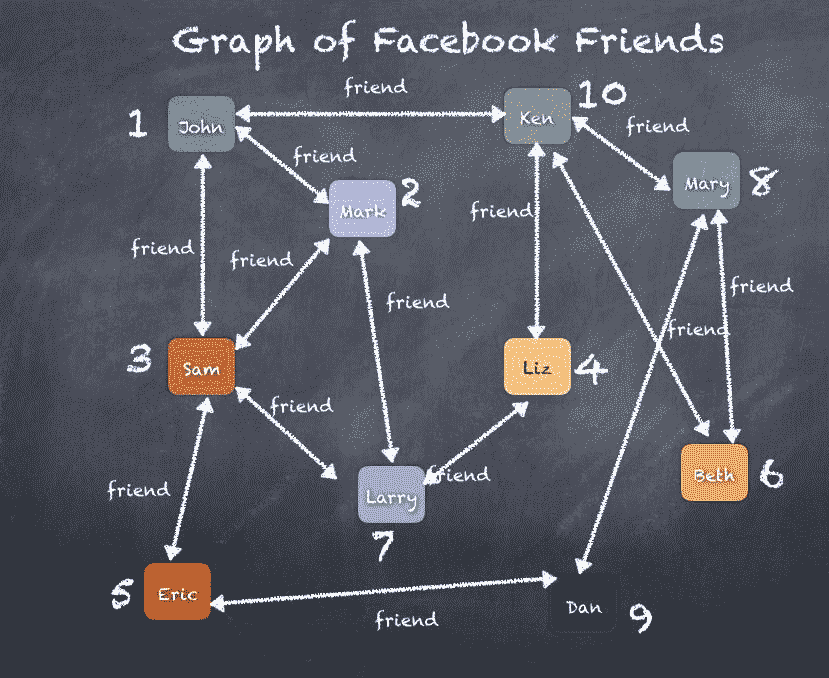

如果你想使用前面的图表，只需找出**John**的朋友，**John**的朋友的朋友等等，这样我们就可以快速找出直接朋友、间接朋友（朋友的朋友），以及第 3 级（朋友的朋友的朋友），你会看到类似以下图表：

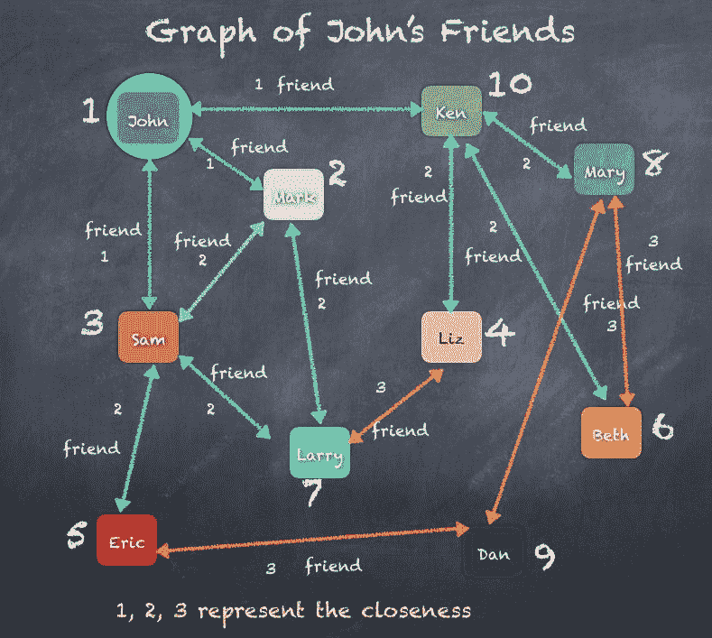

我们可以轻松地扩展`Person()`类并提供越来越多的功能来回答不同的问题。这不是重点，我们想要看的是前面的图表显示了`Person`和`Person`的朋友，以及如何绘制每个`Person`的所有朋友会产生人与人之间的关系网。

现在我们介绍图论，它源自数学领域。图论将图定义为由顶点、节点或点构成的结构，这些结构由边缘、弧和线连接。如果你将一组`Vertices`视为`V`，一组`Edges`视为`E`，那么`Graph G`可以被定义为`V`和`E`的有序对。

```scala
Graph G = (V, E)
V - set of Vertices
E - set of Edges

```

在我们的 Facebook 朋友绘图示例中，我们可以简单地将每个人视为顶点集中的一个顶点，然后将任意两个人之间的每个链接视为边缘集中的一条边。

按照这个逻辑，我们可以列出如下图中的**Vertices**和**Edges**：

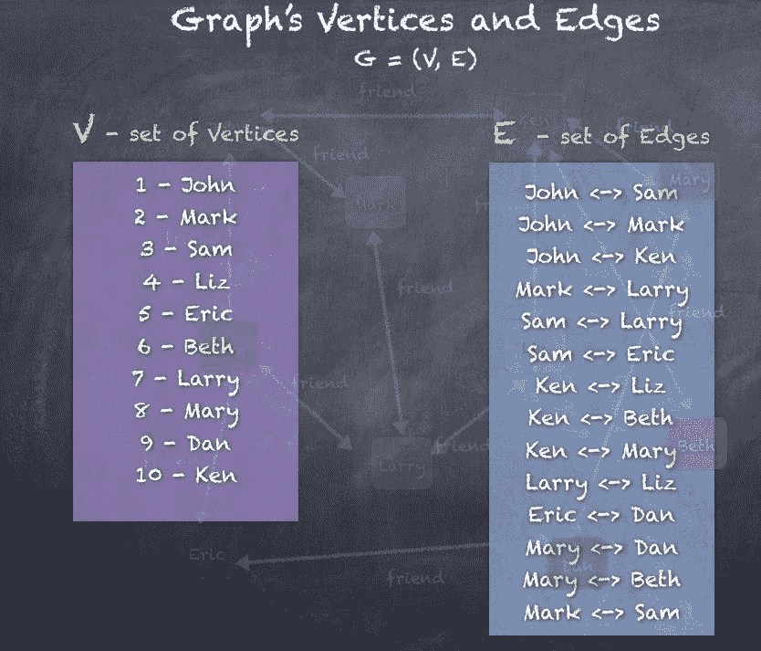

将这种数学图的描述转化为各种使用数学技术进行遍历和查询图的方法。当这些技术被应用于计算机科学，作为开发程序方法来执行必要的数学运算时，正式的方法当然是开发算法，以在可扩展高效的水平上实现数学规则。

我们已经尝试使用`Person`这个案例类来实现一个类似图的程序，但这只是最简单的用例，这应该让人明白，还有很多复杂的扩展可能，比如以下问题需要回答：

+   从 X 到 Y 的最佳方式是什么？这样一个问题的例子可以是你的车载 GPS 告诉你去杂货店的最佳路线。

+   识别可能导致图分区的关键边缘？这样一个问题的例子是确定连接州内各个城市的互联网服务/水管/电力线的关键链路。关键边缘会打破连接，并产生两个互相连接良好的子图，但两个子图之间不会有任何通信。

回答上述问题会产生一些算法，例如最小生成树、最短路径、页面排名、**ALS**（**交替最小二乘法**）和最大割最小流算法等，适用于广泛的用例。

其他的例子包括 LinkedIn 的个人资料和联系人、Twitter 的关注者、Google 的页面排名、航空公司的航班安排、你车上的 GPS 等等，你可以清楚地看到顶点和边的图。使用图算法，可以使用各种算法分析先前在 Facebook、LinkedIn、Google 示例中看到的图，以产生不同的商业用例。

下面是一些图的实际用例的示例，展示了图和图算法在一些实际用例中的使用，例如：

+   帮助确定机场之间的航班路线

+   规划如何布置本地所有家庭的水管道

+   让你的车载 GPS 规划驾驶到杂货店的路线

+   设计互联网流量如何从城市到城市、州到州、国家到国家的路由

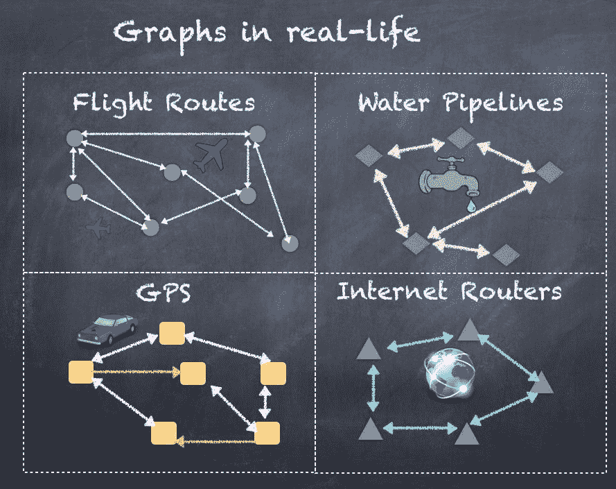

现在让我们深入了解如何使用 Spark GraphX。

# GraphX

正如前面的部分所示，我们可以将许多实际用例建模为具有一组顶点和一组连接顶点的边的图。我们还编写了简单的代码，试图实现一些基本的图操作和查询，比如* X 是 Y 的朋友吗*？然而，随着我们的探索，算法变得更加复杂，用例也更加复杂，图的规模远远大于一个机器可以处理的规模。

将十亿 Facebook 用户及其所有的友谊关系放入一个甚至几个机器中是不可能的。

我们需要做的是超越单台机器和几台机器的组合，而是开始考虑高度可扩展的架构，以实现复杂的图算法，可以处理数据的数量和数据元素的复杂相互关系。我们已经看到了 Spark 的介绍，Spark 如何解决分布式计算和大数据分析的一些挑战。我们还看到了实时流处理和 Spark SQL 以及 DataFrames 和 RDDs。我们是否也可以解决图算法的挑战？答案是 GraphX，它与 Apache Spark 一起提供，并且与其他库一样，位于 Spark Core 之上。

GraphX 通过在 RDD 概念之上提供图抽象来扩展 Spark RDD。GraphX 中的图是使用顶点或节点来表示对象，使用边或链接来描述对象之间的关系，并且 GraphX 提供了实现适合图处理范式的许多用例的手段。在本节中，我们将学习 GraphX，如何创建顶点、边和包含顶点和边的图。我们还将编写代码，通过示例学习围绕图算法和处理的一些技术。

要开始，您需要导入以下列出的一些包：

```scala
import org.apache.spark._
import org.apache.spark.graphx._
import org.apache.spark.rdd.RDD

import org.apache.spark.graphx.GraphLoader
import org.apache.spark.graphx.GraphOps

```

GraphX 的基本数据结构是图，它抽象地表示具有与顶点和边关联的任意对象的图。图提供了基本操作，用于访问和操作与顶点和边关联的数据，以及底层结构。与 Spark RDD 一样，图是一个功能性数据结构，其中变异操作返回新的图。`Graph`对象的不可变性使得可以进行大规模并行计算，而不会遇到同步问题的风险。

并发更新或修改对象是许多程序中进行复杂多线程编程的主要原因。

图定义了基本的数据结构，还有一个辅助类`GraphOps`，其中包含额外的便利操作和图算法。

图被定义为一个类模板，具有两个属性，指定构成图的两个部分的数据类型，即顶点和边：

```scala
class Graph[VD: ClassTag, ED: ClassTag] 

```

如我们已经讨论过的，图由顶点和边组成。顶点集合存储在称为`VertexRDD`的特殊数据结构中。同样，边的集合存储在称为`EdgeRDD`的特殊数据结构中。顶点和边一起形成图，所有后续操作都可以使用这两个数据结构进行。

因此，`Graph`类的声明如下：

```scala
class Graph[VD, ED] {
  //A RDD containing the vertices and their associated attributes.
  val vertices: VertexRDD[VD]

  //A RDD containing the edges and their associated attributes. 
    The entries in the RDD contain just the source id and target id
    along with the edge data.
  val edges: EdgeRDD[ED]

  //A RDD containing the edge triplets, which are edges along with the
    vertex data associated with the adjacent vertices.
  val triplets: RDD[EdgeTriplet[VD, ED]]
}

```

现在，让我们看看`Graph`类的两个主要组件，即`VertexRDD`和`EdgeRDD`。

# VertexRDD 和 EdgeRDD

`VertexRDD`包含一组顶点或节点，存储在特殊的数据结构中，而`EdgeRDD`包含一组边或链接，连接了节点/顶点，同样存储在特殊的数据结构中。`VertexRDD`和`EdgeRDD`都基于 RDD，并且`VertexRDD`处理图中的每个单个节点，而`EdgeRDD`包含所有节点之间的所有链接。在本节中，我们将看看如何创建`VertexRDD`和`EdgeRDD`，然后在构建图时使用这些对象。

# VertexRDD

如前所述，`VertexRDD`是一个包含顶点及其关联属性的 RDD。RDD 中的每个元素表示图中的一个顶点或节点。为了保持顶点的唯一性，我们需要一种方法为每个顶点分配一个唯一的 ID。为此，GraphX 定义了一个非常重要的标识符，称为`VertexId`。

`VertexId`被定义为一个 64 位的顶点标识符，用于唯一标识图中的顶点。它不需要遵循任何顺序或除唯一性之外的任何约束。

`VertexId`的声明如下，只是 64 位`Long`数字的别名：

```scala
type VertexId = Long

```

`VertexRDD`扩展了由`RDD[(VertexId, VD)]`表示的一对 VertexID 和顶点属性的 RDD。它还确保每个顶点只有一个条目，并通过预索引条目以进行快速、高效的连接。具有相同索引的两个 VertexRDD 可以有效地连接。

```scala
class VertexRDD[VD]() extends RDD[(VertexId, VD)]

```

`VertexRDD`还实现了许多函数，提供了与图操作相关的重要功能。每个函数通常接受由`VertexRDD`表示的顶点作为输入。

让我们将用户加载到`VertexRDD`中。为此，我们首先声明一个`User` case 类，如下所示：

```scala
case class User(name: String, occupation: String)

```

现在，使用文件`users.txt`，创建`VertexRDD`：

| **VertexID** | **Name** | **Occupation** |
| --- | --- | --- |
| 1 | John | 会计师 |
| 2 | Mark | 医生 |
| 3 | Sam | 律师 |
| 4 | Liz | 医生 |
| 5 | Eric | 会计师 |
| 6 | Beth | 会计师 |
| 7 | Larry | 工程师 |
| 8 | Marry | 收银员 |
| 9 | Dan | 医生 |
| 10 | Ken | 图书管理员 |

文件`users.txt`的每一行包含**VertexId**，**Name**和**Occupation**，因此我们可以在这里使用`String` split 函数：

```scala
scala> val users = sc.textFile("users.txt").map{ line =>
 val fields = line.split(",")
 (fields(0).toLong, User(fields(1), fields(2)))
}
users: org.apache.spark.rdd.RDD[(Long, User)] = MapPartitionsRDD[2645] at map at <console>:127

scala> users.take(10)
res103: Array[(Long, User)] = Array((1,User(John,Accountant)), (2,User(Mark,Doctor)), (3,User(Sam,Lawyer)), (4,User(Liz,Doctor)), (5,User(Eric,Accountant)), (6,User(Beth,Accountant)), (7,User(Larry,Engineer)), (8,User(Mary,Cashier)), (9,User(Dan,Doctor)), (10,User(Ken,Librarian)))

```

# EdgeRDD

`EdgeRDD`表示顶点之间的边的集合，并且是 Graph 类的成员，就像之前看到的那样。`EdgeRDD`和`VertexRDD`一样，都是从 RDD 扩展而来，并且都带有 Edge 属性和 Vertex 属性。

`EdgeRDD[ED, VD]`通过在每个分区上以列格式存储边缘来扩展`RDD[Edge[ED]]`，以提高性能。它还可以存储与每条边相关联的顶点属性，以提供三元组视图：

```scala
class EdgeRDD[ED]() extends RDD[Edge[ED]]

```

EdgeRDD 还实现了许多函数，提供了与图操作相关的重要功能。每个函数通常接受由 EdgeRDD 表示的边的输入。每个 Edge 包括源 vertexId、目标 vertexId 和边属性，例如`String`、`Integer`或任何 case 类。在下面的示例中，我们使用`String` friend 作为属性。在本章的后面，我们将使用英里数（`Integer`）作为属性。

我们可以通过读取一对 vertexIds 的文件来创建 EdgeRDD：

| **源顶点 ID** | **目标/目的地顶点 ID** | **英里数** |
| --- | --- | --- |
| 1 | 3 | 5 |
| 3 | 1 | 5 |
| 1 | 2 | 1 |
| 2 | 1 | 1 |
| 4 | 10 | 5 |
| 10 | 4 | 5 |
| 1 | 10 | 5 |
| 10 | 1 | 5 |
| 2 | 7 | 6 |
| 7 | 2 | 6 |
| 7 | 4 | 3 |
| 4 | 7 | 3 |
| 2 | 3 | 2 |

`friends.txt`文件的每一行包含源`vertexId`和目标`vertexId`，因此我们可以在这里使用`String` split 函数：

```scala
scala> val friends = sc.textFile("friends.txt").map{ line =>
 val fields = line.split(",")
 Edge(fields(0).toLong, fields(1).toLong, "friend")
}
friends: org.apache.spark.rdd.RDD[org.apache.spark.graphx.Edge[String]] = MapPartitionsRDD[2648] at map at <console>:125

scala> friends.take(10)
res109: Array[org.apache.spark.graphx.Edge[String]] = Array(Edge(1,3,friend), Edge(3,1,friend), Edge(1,2,friend), Edge(2,1,friend), Edge(4,10,friend), Edge(10,4,friend), Edge(1,10,friend), Edge(10,1,friend), Edge(2,7,friend), Edge(7,2,friend))

```

现在我们有了顶点和边缘，是时候将所有内容放在一起，探索如何从顶点和边缘列表构建`Graph`：

```scala
scala> val graph = Graph(users, friends)
graph: org.apache.spark.graphx.Graph[User,String] = org.apache.spark.graphx.impl.GraphImpl@327b69c8

scala> graph.vertices
res113: org.apache.spark.graphx.VertexRDD[User] = VertexRDDImpl[2658] at RDD at VertexRDD.scala:57

scala> graph.edges
res114: org.apache.spark.graphx.EdgeRDD[String] = EdgeRDDImpl[2660] at RDD at EdgeRDD.scala:41

```

使用`Graph`对象，我们可以使用`collect()`函数查看顶点和边，这将显示所有顶点和边。每个顶点的形式为（`VertexId`，`User`），每条边的形式为（`srcVertexId`，`dstVertexId`，`edgeAttribute`）。

```scala
scala> graph.vertices.collect
res111: Array[(org.apache.spark.graphx.VertexId, User)] = Array((4,User(Liz,Doctor)), (6,User(Beth,Accountant)), (8,User(Mary,Cashier)), (10,User(Ken,Librarian)), (2,User(Mark,Doctor)), (1,User(John,Accountant)), (3,User(Sam,Lawyer)), (7,User(Larry,Engineer)), (9,User(Dan,Doctor)), (5,User(Eric,Accountant)))

scala> graph.edges.collect
res112: Array[org.apache.spark.graphx.Edge[String]] = Array(Edge(1,2,friend), Edge(1,3,friend), Edge(1,10,friend), Edge(2,1,friend), Edge(2,3,friend), Edge(2,7,friend), Edge(3,1,friend), Edge(3,2,friend), Edge(3,10,friend), Edge(4,7,friend), Edge(4,10,friend), Edge(7,2,friend), Edge(7,4,friend), Edge(10,1,friend), Edge(10,4,friend), Edge(3,5,friend), Edge(5,3,friend), Edge(5,9,friend), Edge(6,8,friend), Edge(6,10,friend), Edge(8,6,friend), Edge(8,9,friend), Edge(8,10,friend), Edge(9,5,friend), Edge(9,8,friend), Edge(10,6,friend), Edge(10,8,friend))

```

现在我们创建了一个图，我们将在下一节中查看各种操作。 

# 图操作符

让我们从我们可以直接使用`Graph`对象执行的操作开始，例如根据对象的某个属性过滤图的顶点和边缘。我们还将看到`mapValues()`的示例，它可以将图转换为生成自定义 RDD。

首先，让我们使用前一节中创建的`Graph`对象检查顶点和边，然后查看一些图操作符。

```scala
scala> graph.vertices.collect
res111: Array[(org.apache.spark.graphx.VertexId, User)] = Array((4,User(Liz,Doctor)), (6,User(Beth,Accountant)), (8,User(Mary,Cashier)), (10,User(Ken,Librarian)), (2,User(Mark,Doctor)), (1,User(John,Accountant)), (3,User(Sam,Lawyer)), (7,User(Larry,Engineer)), (9,User(Dan,Doctor)), (5,User(Eric,Accountant)))

scala> graph.edges.collect
res112: Array[org.apache.spark.graphx.Edge[String]] = Array(Edge(1,2,friend), Edge(1,3,friend), Edge(1,10,friend), Edge(2,1,friend), Edge(2,3,friend), Edge(2,7,friend), Edge(3,1,friend), Edge(3,2,friend), Edge(3,10,friend), Edge(4,7,friend), Edge(4,10,friend), Edge(7,2,friend), Edge(7,4,friend), Edge(10,1,friend), Edge(10,4,friend), Edge(3,5,friend), Edge(5,3,friend), Edge(5,9,friend), Edge(6,8,friend), Edge(6,10,friend), Edge(8,6,friend), Edge(8,9,friend), Edge(8,10,friend), Edge(9,5,friend), Edge(9,8,friend), Edge(10,6,friend), Edge(10,8,friend))

```

# 过滤

对`filter()`的函数调用将顶点集限制为满足给定谓词的顶点集。此操作保留了用于与原始 RDD 进行高效连接的索引，并且在位掩码中设置位，而不是分配新内存：

```scala
def filter(pred: Tuple2[VertexId, VD] => Boolean): VertexRDD[VD] 

```

使用`filter`，我们可以过滤掉除了用户`Mark`的顶点之外的所有内容，可以使用顶点 ID 或`User.name`属性来完成。我们还可以过滤`User.occupation`属性。

以下是实现相同目的的代码：

```scala
scala> graph.vertices.filter(x => x._1 == 2).take(10)
res118: Array[(org.apache.spark.graphx.VertexId, User)] = Array((2,User(Mark,Doctor)))

scala> graph.vertices.filter(x => x._2.name == "Mark").take(10)
res119: Array[(org.apache.spark.graphx.VertexId, User)] = Array((2,User(Mark,Doctor)))

scala> graph.vertices.filter(x => x._2.occupation == "Doctor").take(10)
res120: Array[(org.apache.spark.graphx.VertexId, User)] = Array((4,User(Liz,Doctor)), (2,User(Mark,Doctor)), (9,User(Dan,Doctor)))

```

我们也可以对边进行`filter`操作，使用源顶点 ID 或目标顶点 ID。因此，我们可以过滤出仅显示从`John`（vertexId = 1）发出的边。

```scala
scala> graph.edges.filter(x => x.srcId == 1)
res123: org.apache.spark.rdd.RDD[org.apache.spark.graphx.Edge[String]] = MapPartitionsRDD[2672] at filter at <console>:134

scala> graph.edges.filter(x => x.srcId == 1).take(10)
res124: Array[org.apache.spark.graphx.Edge[String]] = Array(Edge(1,2,friend), Edge(1,3,friend), Edge(1,10,friend))

```

# MapValues

`mapValues()`映射每个顶点属性，保留索引以不改变 vertexId。改变 vertexId 会导致索引变化，从而导致后续操作失败，顶点将不再可达。因此，重要的是不要改变 vertexIds。

此函数的声明如下所示：

```scala
def mapValuesVD2: ClassTag: VertexRDD[VD2]
//A variant of the mapValues() function accepts a vertexId in addition  
  to the vertices.
def mapValuesVD2: ClassTag => VD2): VertexRDD[VD2]

```

`mapValues()`也可以在边上操作，并映射边分区中的值，保留结构但更改值：

```scala
def mapValuesED2: ClassTag: EdgeRDD[ED2]

```

以下是在顶点和边上调用`mapValues()`的示例代码。在顶点上的 MapValues 将顶点转换为（`vertexId`，`User.name`）对的列表。在边上的 MapValues 将边转换为（`srcId`，`dstId`，`string`）的三元组：

```scala
scala> graph.vertices.mapValues{(id, u) => u.name}.take(10)
res142: Array[(org.apache.spark.graphx.VertexId, String)] = Array((4,Liz), (6,Beth), (8,Mary), (10,Ken), (2,Mark), (1,John), (3,Sam), (7,Larry), (9,Dan), (5,Eric))

scala> graph.edges.mapValues(x => s"${x.srcId} -> ${x.dstId}").take(10)
7), Edge(3,1,3 -> 1), Edge(3,2,3 -> 2), Edge(3,10,3 -> 10), Edge(4,7,4 -> 7))

```

# aggregateMessages

GraphX 中的核心聚合操作是`aggregateMessages`，它对图中的每个边三元组应用用户定义的`sendMsg`函数，然后使用`mergeMsg`函数在目标顶点处聚合这些消息。`aggregateMessages`在许多图算法中使用，其中我们必须在顶点之间交换信息。

以下是此 API 的签名：

```scala
def aggregateMessagesMsg: ClassTag => Msg,
 tripletFields: TripletFields = TripletFields.All)
 : VertexRDD[Msg]

```

关键函数是`sendMsg`和`mergeMsg`，它们确定发送到边的源顶点或目标顶点的内容。然后，`mergeMsg`处理从所有边接收到的消息并执行计算或聚合。

以下是在`Graph`图上调用`aggregateMessages`的简单示例，我们向所有目标顶点发送消息。每个顶点的合并策略只是将接收到的所有消息相加：

```scala
scala> graph.aggregateMessagesInt, _ + _).collect
res207: Array[(org.apache.spark.graphx.VertexId, Int)] = Array((4,2), (6,2), (8,3), (10,4), (2,3), (1,3), (3,3), (7,2), (9,2), (5,2))

```

# TriangleCounting

如果一个顶点的两个邻居通过一条边相连，就会形成一个三角形。换句话说，用户将与彼此为朋友的两个朋友创建一个三角形。

图形具有一个名为`triangleCount()`的函数，用于计算图中的三角形。

以下是用于计算图中三角形数量的代码，首先调用`triangleCount`函数，然后通过将三角形与顶点（用户）连接来生成每个用户和用户所属的三角形的输出：

```scala
scala> val triangleCounts = graph.triangleCount.vertices
triangleCounts: org.apache.spark.graphx.VertexRDD[Int] = VertexRDDImpl[3365] at RDD at VertexRDD.scala:57

scala> triangleCounts.take(10)
res171: Array[(org.apache.spark.graphx.VertexId, Int)] = Array((4,0), (6,1), (8,1), (10,1), (2,1), (1,1), (3,1), (7,0), (9,0), (5,0))

scala> val triangleCountsPerUser = users.join(triangleCounts).map { case(id, (User(x,y), k)) => ((x,y), k) }
triangleCountsPerUser: org.apache.spark.rdd.RDD[((String, String), Int)] = MapPartitionsRDD[3371] at map at <console>:153

scala> triangleCountsPerUser.collect.mkString("\n")
res170: String =
((Liz,Doctor),0)
((Beth,Accountant),1)  *//1 count means this User is part of 1 triangle*
((Mary,Cashier),1)  *//1 count means this User is part of 1 triangle*
((Ken,Librarian),1)  *//1 count means this User is part of 1 triangle*
((Mark,Doctor),1)  * //1 count means this User is part of 1 triangle*
((John,Accountant),1)  *//1 count means this User is part of 1 triangle*
((Sam,Lawyer),1)   *//1 count means this User is part of 1 triangle*
((Larry,Engineer),0)
((Dan,Doctor),0)
((Eric,Accountant),0)

```

我们刚刚在前面的代码中计算的两个三角形的图示如下，(**John**, **Mark**, **Sam**)和(**Ken**, **Mary**, **Beth**)：

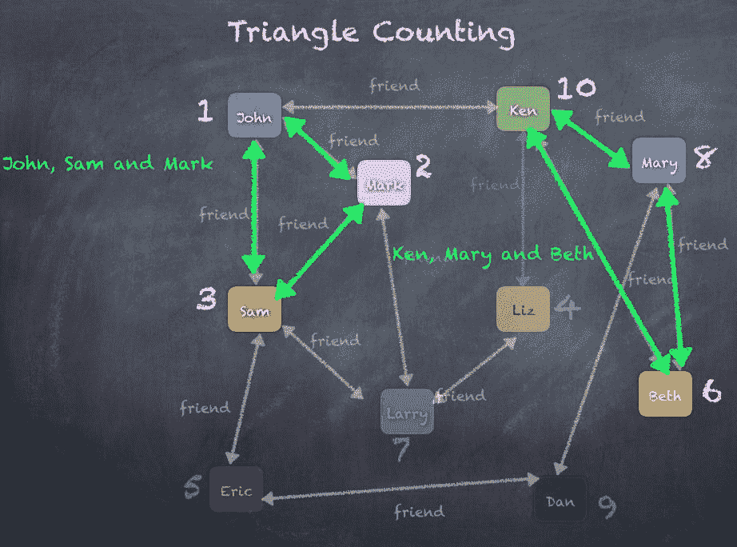

# Pregel API

图形本质上是递归数据结构，因为顶点的属性取决于其邻居的属性，而邻居的属性又取决于它们自己的邻居的属性。因此，许多重要的图算法会迭代地重新计算每个顶点的属性，直到达到固定点条件。已经提出了一系列图并行抽象来表达这些迭代算法。GraphX 公开了 Pregel API 的变体。

在高层次上，GraphX 中的 Pregel 运算符是一种受限于图的拓扑结构的批量同步并行消息传递抽象。Pregel 运算符在一系列步骤中执行，其中顶点接收来自上一个超级步骤的入站消息的总和，计算顶点属性的新值，然后在下一个超级步骤中向相邻顶点发送消息。使用 Pregel，消息并行计算作为边三元组的函数，并且消息计算可以访问源和目标顶点属性。在超级步骤中，不接收消息的顶点将被跳过。当没有剩余消息时，Pregel 运算符终止迭代并返回最终图。

使用 Pregel API 内置的一些算法如下：

+   ConnectedComponents

+   ShortestPaths

+   旅行推销员

+   PageRank（在下一节中介绍）

Pregel API 的签名如下所示，显示了所需的各种参数。确切的用法将在后续部分中显示，因此您可以参考此签名以进行澄清：

```scala
def pregel[A]
 (initialMsg: A, // the initial message to all vertices
 maxIter: Int = Int.MaxValue, // number of iterations
 activeDir: EdgeDirection = EdgeDirection.Out) // incoming or outgoing edges
 (vprog: (VertexId, VD, A) => VD,
 sendMsg: EdgeTriplet[VD, ED] => Iterator[(VertexId, A)], //send message function
 mergeMsg: (A, A) => A) //merge strategy
 : Graph[VD, ED] 

```

# ConnectedComponents

连接组件本质上是图中的子图，其中顶点以某种方式相互连接。这意味着同一组件中的每个顶点都与组件中的某个其他顶点有边相连。每当没有其他边存在以连接顶点到组件时，就会创建一个具有特定顶点的新组件。这将继续，直到所有顶点都在某个组件中。

图对象提供了一个`connectComponents()`函数来计算连接的组件。这使用 Pregel API 来计算顶点所属的组件。以下是计算图中连接组件的代码。显然，在这个例子中，我们只有一个连接的组件，所以它显示所有用户的组件编号为 1：

```scala
scala> graph.connectedComponents.vertices.collect res198: Array[(org.apache.spark.graphx.VertexId, org.apache.spark.graphx.VertexId)] = Array((4,1), (6,1), (8,1), (10,1), (2,1), (1,1), (3,1), (7,1), (9,1), (5,1))
 scala> graph.connectedComponents.vertices.join(users).take(10)
res197: Array[(org.apache.spark.graphx.VertexId, (org.apache.spark.graphx.VertexId, User))] = Array((4,(1,User(Liz,Doctor))), (6,(1,User(Beth,Accountant))), (8,(1,User(Mary,Cashier))), (10,(1,User(Ken,Librarian))), (2,(1,User(Mark,Doctor))), (1,(1,User(John,Accountant))), (3,(1,User(Sam,Lawyer))), (7,(1,User(Larry,Engineer))), (9,(1,User(Dan,Doctor))), (5,(1,User(Eric,Accountant))))

```

# 旅行推销员问题

旅行推销员问题试图在遍历每个顶点的无向图中找到最短路径，例如，用户 John 想要驾驶到每个其他用户，最小化总驾驶距离。随着顶点和边的数量增加，排列的数量也会多项式增加，以覆盖从顶点到顶点的所有可能路径。时间复杂度多项式增加到一个问题可能需要很长时间来解决。与其完全准确地解决它，不如使用一种称为**贪婪**算法的方法尽可能地解决问题。

为了解决旅行推销员问题，贪婪方法是快速选择最短边，知道这可能是一个非最优选择，如果我们继续更深层次地遍历。

下图显示了在用户和朋友图上的贪婪算法的图表，我们可以看到遍历每个顶点时选择最短加权边。还要注意，顶点**Larry**（**7**）和**Liz**（**4**）从未被访问：

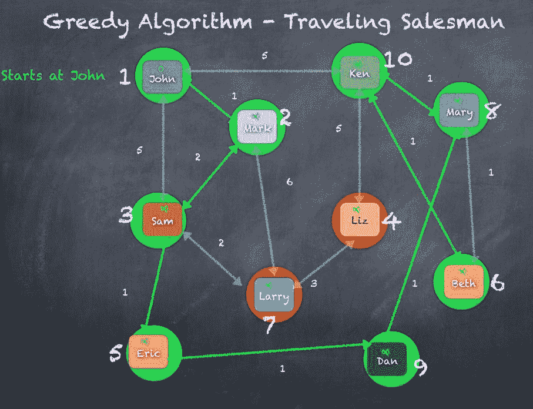

# ShortestPaths

最短路径算法通过从源顶点开始，然后遍历连接顶点到其他顶点的边，直到到达目标顶点，找到两个顶点之间的路径。最短路径算法通过在各个顶点之间交换消息来工作。此最短路径算法不是`Graph`或`GraphOps`对象的直接部分，而是必须使用`lib.ShortestPaths()`来调用：

```scala
scala> lib.ShortestPaths.run(graph,Array(1)).vertices.join(users).take(10)

res204: Array[(org.apache.spark.graphx.VertexId, (org.apache.spark.graphx.lib.ShortestPaths.SPMap, User))] = Array((4,(Map(1 -> 2),User(Liz,Doctor))), (6,(Map(1 -> 2),User(Beth,Accountant))), (8,(Map(1 -> 2),User(Mary,Cashier))), (10,(Map(1 -> 1),User(Ken,Librarian))), (2,(Map(1 -> 1),User(Mark,Doctor))), (1,(Map(1 -> 0),User(John,Accountant))), (3,(Map(1 -> 1),User(Sam,Lawyer))), (7,(Map(1 -> 2),User(Larry,Engineer))), (9,(Map(1 -> 3),User(Dan,Doctor))), (5,(Map(1 -> 2),User(Eric,Accountant))))

```

`ShortestPaths`选择两个顶点之间的最短路径，以跳数计算。以下图表显示了**John**到**Larry**有三种方式，其中两种路径长度为 2，一种长度为 3。从前面代码的结果来看，清楚地显示了从**Larry**到 John 选择的路径长度为 2。

在上面的代码块的输出中，显示了一个包含路径长度和节点的向量`(7,(Map(1 -> 2),User(Larry,Engineer)))`。

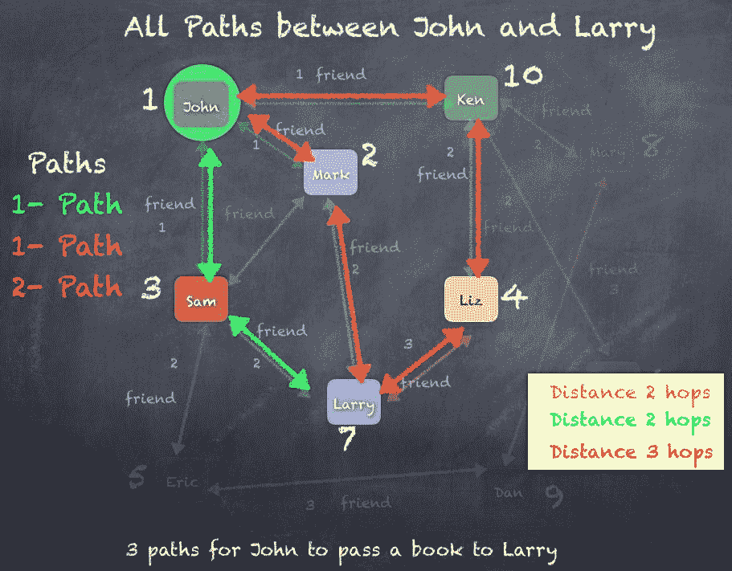

我们还可以使用加权边来计算最短路径，这意味着连接用户的每条边都不相同。例如，如果我们可以将边值/权重/属性视为每个用户所住地点之间的距离，我们就得到了一个加权图。在这种情况下，最短路径是通过英里数计算两个用户之间的距离：

```scala
scala> val srcId = 1 //vertex ID 1 is the user John
srcId: Int = 1

scala> val initGraph = graph.mapVertices((id, x) => if(id == srcId) 0.0 else Double.PositiveInfinity)
initGraph: org.apache.spark.graphx.Graph[Double,Long] = org.apache.spark.graphx.impl.GraphImpl@2b9b8608

scala> val weightedShortestPath = initGraph.pregel(Double.PositiveInfinity, 5)(
 | (id, dist, newDist) => math.min(dist, newDist),
 | triplet => {
 | if (triplet.srcAttr + triplet.attr < triplet.dstAttr) {
 | Iterator((triplet.dstId, triplet.srcAttr + triplet.attr))
 | }
 | else {
 | Iterator.empty
 | }
 | },
 | (a, b) => math.min(a, b)
 | )
weightedShortestPath: org.apache.spark.graphx.Graph[Double,Long] = org.apache.spark.graphx.impl.GraphImpl@1f87fdd3

scala> weightedShortestPath.vertices.take(10).mkString("\n")
res247: String =
(4,10.0)
(6,6.0)
(8,6.0)
(10,5.0)
(2,1.0)
(1,0.0)
(3,3.0)
(7,7.0)
(9,5.0)
(5,4.0)

```

以下是一个使用 Pregel API 从**John**到**Larry**计算**单源最短路径**的图表，从初始化开始，逐次迭代直到找到最佳路径。

通过将代表**John**的顶点的值设置为零，将所有其他顶点设置为正无穷来初始化图：

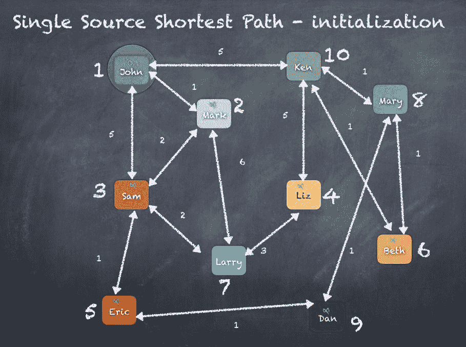

初始化完成后，我们将使用 Pregel 进行四次迭代来重新计算顶点的值。在每次迭代中，我们遍历所有顶点，并在每个顶点处检查是否有从源顶点到目标顶点的更好路径。如果有这样的边/路径，那么顶点的值将被更新。

让我们定义两个函数*distance(v)*和*distance(s, t)*，其中*distance(v)*给出一个顶点的值，*distance(s,t)*给出连接*s*到*t*的边的值。

在第一次迭代中，除了 John 之外的每个用户都被设置为无穷大，John 的值为 0，因为他是源顶点。现在，我们使用 Pregel 循环遍历顶点，并检查是否有比无穷大更好的路径。以 Ken 为例，我们将检查*distance("John") + distance("John", "Ken") < distance("Ken")*。

这相当于检查*0 + 5 < 无穷大*，结果是`true`；所以我们将 Ken 的距离更新为*5*。

同样，我们检查 Mary，*distance("Ken") + distance("Ken", "Mary") < distance("Mary")*，结果是`false`，因为那时 Ken 仍然是无穷大。因此，在第一次迭代中，我们只能更新与 John 相连的用户。

在下一次迭代中，Mary、Liz、Eric 等等，都会被更新，因为现在我们已经更新了 Ken、Mark 和 Sam 在第一次迭代中的数值。这将持续一段时间，具体次数由 Pregel API 调用中指定。

下面是在计算图上的单源最短路径时的各种迭代的示例：

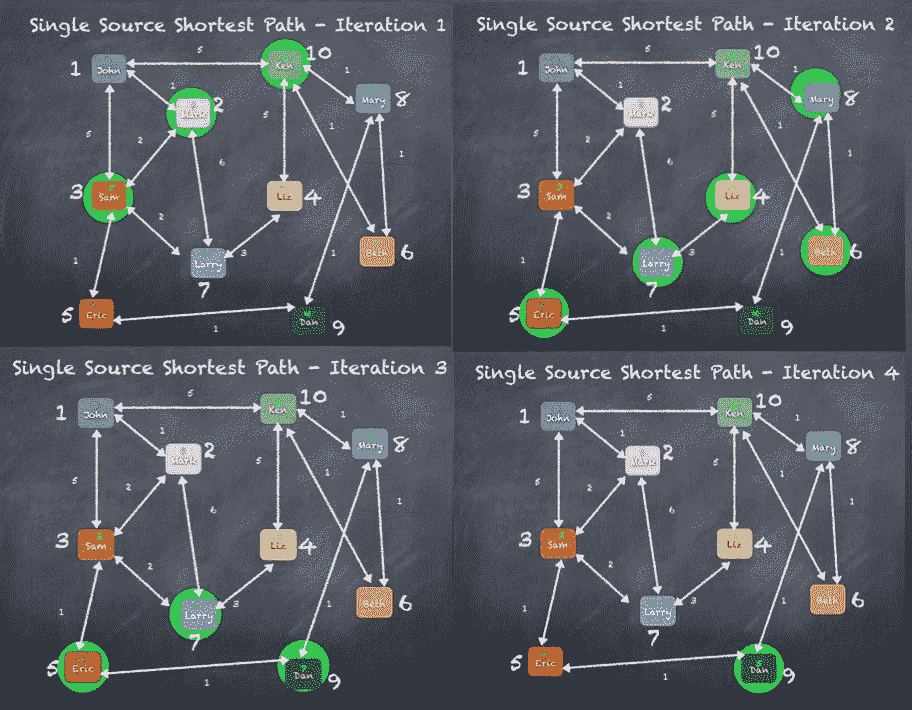

经过四次迭代后，从**John**到**Larry**的最短路径显示为五英里。从**John**到**Larry**的路径可以通过**John** | **Mark** | **Sam** | **Larry**来看到。

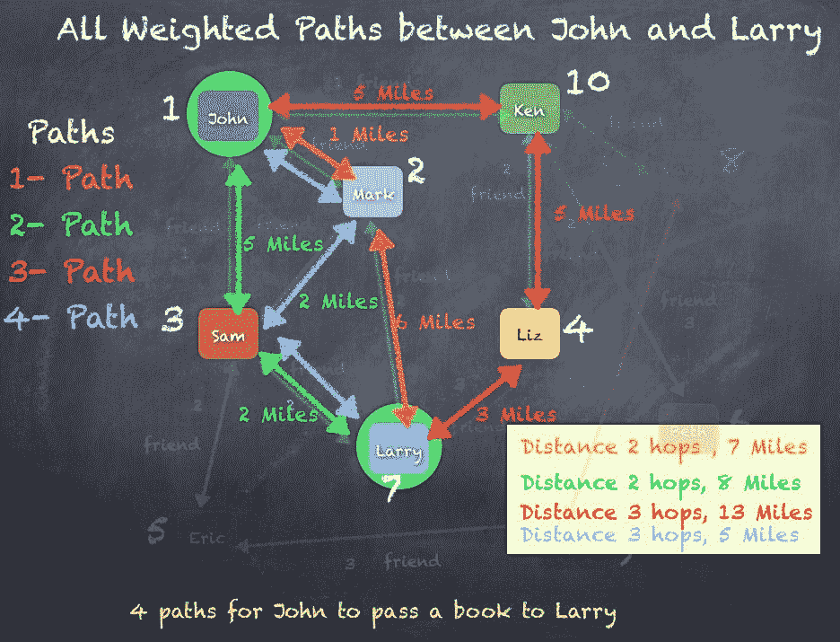

# PageRank

**PageRank**是图处理领域中最重要的算法之一。这个算法起源于谷歌，以谷歌创始人拉里·佩奇的名字命名，基于根据关系或边对顶点或节点进行排名的概念，已经发展成许多类型的用例。

Google PageRank 通过计算指向页面的链接数量和质量来确定网站的重要性的大致估计。基本假设是更重要的网站很可能会从其他网站获得更多的链接。有关更多信息，您可以阅读[`en.wikipedia.org/wiki/PageRank`](https://en.wikipedia.org/wiki/PageRank)中的描述。

以 Google PageRank 为例，您可以通过在其他流行网站和技术博客中推广网页来提高公司网站或博客上网页的相对重要性。使用这种方法，如果有很多第三方网站展示您的博客网站和内容，您的博客网站可能会在 Google 搜索结果中关于某篇文章的排名比其他类似网页更高。

**搜索引擎优化**（**SEO**）是营销世界中最大的行业之一，几乎每个网站都在投资这项技术。SEO 涉及各种技术和策略，基本上是为了提高你的网站在任何搜索引擎结果中出现的排名，当有人搜索相关词语时。这是基于 Google PageRank 的概念。

如果你把网页看作节点/顶点，网页之间的超链接看作边，我们实际上创建了一个图。现在，如果你可以把网页的排名看作指向它的超链接/边的数量，比如你的`myblog.com`网站在`cnn.com`或`msnbc.com`上有链接，这样用户就可以点击链接来到你的`myblog.com`页面。这可以作为代表`myblog.com`顶点重要性的因素。如果我们递归应用这个简单的逻辑，最终我们会得到每个顶点的排名，这是根据入边的数量和基于源顶点排名的 PageRank 计算得出的。一个被许多具有高 PageRank 的页面链接的页面本身也会获得高排名。让我们看看如何使用 Spark GraphX 解决大数据规模下的 PageRank 问题。正如我们所见，PageRank 衡量了图中每个顶点的重要性，假设从**a**到**b**的边代表了**b**由**a**提升的价值。例如，如果一个 Twitter 用户被许多其他用户关注，那么该用户将被高排名。

GraphX 提供了 PageRank 的静态和动态实现，作为`pageRank`对象的方法。静态 PageRank 运行固定次数的迭代，而动态 PageRank 则运行直到排名收敛。`GraphOps`允许直接调用这些算法作为图上的方法：

```scala
scala> val prVertices = graph.pageRank(0.0001).vertices
prVertices: org.apache.spark.graphx.VertexRDD[Double] = VertexRDDImpl[8245] at RDD at VertexRDD.scala:57

scala> prVertices.join(users).sortBy(_._2._1, false).take(10)
res190: Array[(org.apache.spark.graphx.VertexId, (Double, User))] = Array((10,(1.4600029149839906,User(Ken,Librarian))), (8,(1.1424200609462447,User(Mary,Cashier))), (3,(1.1279748817993318,User(Sam,Lawyer))), (2,(1.1253662371576425,User(Mark,Doctor))), (1,(1.0986118723393328,User(John,Accountant))), (9,(0.8215535923013982,User(Dan,Doctor))), (5,(0.8186673059832846,User(Eric,Accountant))), (7,(0.8107902215195832,User(Larry,Engineer))), (4,(0.8047583729877394,User(Liz,Doctor))), (6,(0.783902117150218,User(Beth,Accountant))))

```

PageRank 算法在图上的图表如下：

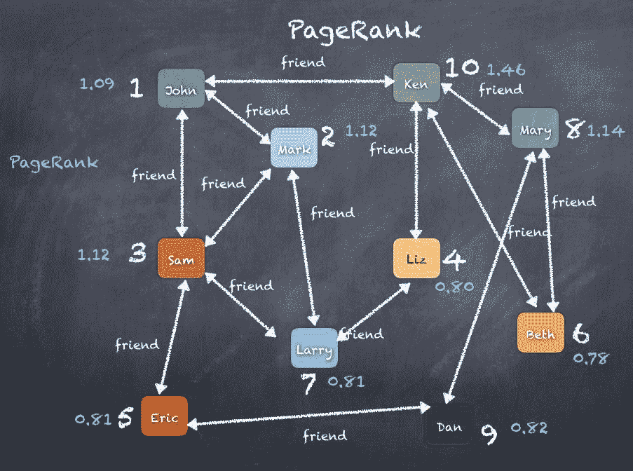

# 总结

在本章中，我们以 Facebook 为例介绍了图论；Apache Spark 的图处理库 GraphX，`VertexRDD`和 EdgeRDDs；图操作符，`aggregateMessages`，`TriangleCounting`和 Pregel API；以及 PageRank 算法等用例。我们还看到了旅行推销员问题和连通组件等。我们看到了 GraphX API 如何用于开发大规模图处理算法。

在第十一章中，*学习机器学习 - Spark MLlib 和 ML*，我们将探索 Apache Spark 的机器学习库的激动人心的世界。
