# 第十一章：学习机器学习- Spark MLlib 和 Spark ML

“我们每个人，实际上每个动物，都是数据科学家。我们从传感器中收集数据，然后处理数据，得到抽象规则来感知我们的环境，并控制我们在环境中的行为，以最大程度地减少痛苦和/或最大化快乐。我们有记忆来将这些规则存储在我们的大脑中，然后在需要时回忆和使用它们。学习是终身的；当规则不再适用或环境发生变化时，我们会忘记规则或修订规则。”

- Ethem Alpaydin，《机器学习：新人工智能》

本章的目的是为那些在典型的统计培训中可能不会接触到这些方法的人提供统计机器学习（ML）技术的概念介绍。本章还旨在通过几个步骤，将新手从对机器学习了解甚少，提升到成为了解的实践者。我们将以理论和实践的方式专注于 Spark 的机器学习 API，称为 Spark MLlib 和 ML。此外，我们将提供一些涵盖特征提取和转换、降维、回归和分类分析的示例。简而言之，本章将涵盖以下主题：

+   机器学习介绍

+   Spark 机器学习 API

+   特征提取和转换

+   使用 PCA 进行回归的降维

+   二元和多类分类

# 机器学习介绍

在本节中，我们将尝试从计算机科学、统计学和数据分析的角度定义机器学习。**机器学习（ML）**是计算机科学的一个分支，它使计算机能够在没有明确编程的情况下学习（1959 年 Arthur Samuel）。这一研究领域是从人工智能中的模式识别和计算学习理论中发展而来的。

更具体地说，ML 探索了可以从启发式学习并对数据进行预测的算法的研究和构建。这种算法通过从样本输入构建模型，克服了严格静态的程序指令，进行数据驱动的预测或决策。现在让我们从计算机科学的角度更明确和多样化地定义，来自 Tom M. Mitchell 教授的定义，解释了机器学习从计算机科学的角度真正意味着什么：

计算机程序被认为是在某类任务 T 和性能度量 P 方面从经验 E 中学习，如果它在 T 中的任务表现，根据 P 的度量，随着经验 E 的提高而改善。

根据这个定义，我们可以得出结论，计算机程序或机器可以：

+   从数据和历史中学习

+   通过经验改进

+   交互式地增强可以用来预测问题结果的模型

典型的机器学习任务包括概念学习、预测建模、聚类和发现有用的模式。最终目标是通过改进学习方式，使其变得自动化，以至于不再需要人类干预，或者尽可能减少人类干预的程度。尽管机器学习有时与**知识发现和数据挖掘**（**KDDM**）混淆，但 KDDM 更侧重于探索性数据分析，被称为无监督学习。典型的机器学习应用可以分为科学知识发现和更商业化的应用，从机器人技术或**人机交互**（**HCI**）到反垃圾邮件过滤和推荐系统。

# 典型的机器学习工作流程

典型的机器学习应用包括从输入、处理到输出的几个步骤，形成了一个科学工作流程，如*图 1*所示。典型的机器学习应用涉及以下步骤：

1.  加载样本数据。

1.  将数据解析成算法的输入格式。

1.  预处理数据和处理缺失值。

1.  将数据分成两组：用于构建模型的训练数据集和用于测试模型的验证数据集。

1.  运行算法来构建或训练您的 ML 模型。

1.  使用训练数据进行预测并观察结果。

1.  使用测试数据测试和评估模型，或者使用交叉验证技术使用第三个数据集（验证数据集）验证模型。

1.  调整模型以获得更好的性能和准确性。

1.  扩展模型，以便能够处理未来的大规模数据集。

1.  在商业化中部署 ML 模型。

**图 1**：机器学习工作流程

通常，机器学习算法有一些方法来处理数据集中的偏斜。这种偏斜有时候是巨大的。在步骤 4 中，实验数据集通常被随机分成训练集和测试集，这被称为抽样。训练数据集用于训练模型，而测试数据集用于评估最佳模型的性能。更好的做法是尽可能多地使用训练数据集来提高泛化性能。另一方面，建议只使用测试数据集一次，以避免在计算预测误差和相关指标时出现过拟合问题。

# 机器学习任务

根据学习系统可用的学习反馈的性质，ML 任务或过程通常分为三大类：监督学习、无监督学习和强化学习，如图 2 所示。此外，还有其他机器学习任务，例如降维、推荐系统、频繁模式挖掘等等。

**图 2**：机器学习任务

# 监督学习

监督学习应用是基于一组示例进行预测的，其目标是学习将输入映射到与现实世界一致的输出的一般规则。例如，用于垃圾邮件过滤的数据集通常包含垃圾邮件和非垃圾邮件。因此，我们能够知道训练集中的消息是垃圾邮件还是正常邮件。然而，我们可能有机会利用这些信息来训练我们的模型，以便对新的未见过的消息进行分类。下图显示了监督学习的示意图。算法找到所需的模式后，这些模式可以用于对未标记的测试数据进行预测。这是最流行和有用的机器学习任务类型，对 Spark 也不例外，那里的大多数算法都是监督学习技术：

**图 3**：监督学习实例

例如，分类和回归用于解决监督学习问题。我们将提供几个监督学习的例子，比如逻辑回归、随机森林、决策树、朴素贝叶斯、一对多等等。然而，为了让讨论更具体，本书只会讨论逻辑回归和随机森林，其他算法将在第十二章《高级机器学习最佳实践》中讨论，并附有一些实际例子。另一方面，线性回归将用于回归分析。

# 无监督学习

在无监督学习中，数据点没有与之相关的标签。因此，我们需要以算法方式对其进行标记，如下图所示。换句话说，在无监督学习中，训练数据集的正确类别是未知的。因此，类别必须从非结构化数据中推断出来，这意味着无监督学习算法的目标是通过描述其结构来对数据进行某种结构化的预处理。

为了克服无监督学习中的障碍，通常使用聚类技术根据某些相似性度量对未标记的样本进行分组。因此，这项任务还涉及挖掘隐藏模式以进行特征学习。聚类是智能地对数据集中的项目进行分类的过程。总体思想是，同一聚类中的两个项目比属于不同聚类的项目“更接近”。这是一般定义，留下了“接近”的解释。

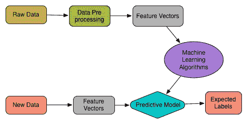**图 4**：无监督学习

示例包括聚类、频繁模式挖掘和降维以解决无监督学习问题（也可以应用于监督学习问题）。我们将在本书中提供几个无监督学习的例子，如 k 均值、二分 k 均值、高斯混合模型、**潜在狄利克雷分配**（**LDA**）等。我们还将展示如何通过回归分析在监督学习中使用降维算法，如**主成分分析**（**PCA**）或**奇异值分解**（**SVD**）。

**降维**（**DR**）：降维是一种在特定条件下减少随机变量数量的技术。这种技术用于监督学习和无监督学习。使用降维技术的典型优势如下：

+   它减少了机器学习任务所需的时间和存储空间

+   它有助于消除多重共线性，并提高机器学习模型的性能

+   数据可视化变得更容易，当降低到非常低的维度，如 2D 或 3D 时

# 强化学习

作为人类，你和我们也从过去的经验中学习。我们并不是偶然变得迷人的。多年来的积极赞美和负面批评都帮助塑造了我们今天的样子。通过与朋友、家人甚至陌生人的互动，你学会了如何让人们快乐，通过尝试不同的肌肉运动，你学会了如何骑自行车，直到顿悟。当你执行动作时，有时会立即得到奖励。例如，找到附近的购物中心可能会带来即时的满足感。其他时候，奖励不会立即出现，比如长途旅行找到一个特别好的吃饭地方。这些都是关于强化学习（RL）的。

因此，RL 是一种技术，模型本身从一系列行为或动作中学习。数据集的复杂性或样本复杂性对于强化学习需要的算法成功学习目标函数非常重要。此外，为了实现最终目标，与外部环境交互时应确保最大化奖励函数，如下图所示：

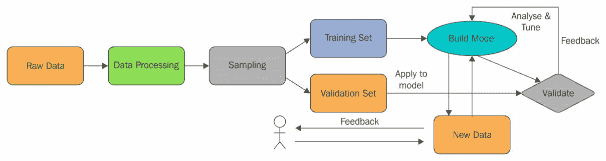**图 5**：强化学习

强化学习技术正在许多领域中使用。以下是一个非常简短的列表：

+   广告有助于学习排名，对新出现的项目使用一次性学习，新用户将带来更多的收入

+   教导机器人新任务，同时保留先前的知识

+   从国际象棋开局到交易策略推导复杂的分层方案

+   路由问题，例如，管理船队，分配卡车/司机到哪个货物

+   在机器人技术中，算法必须根据一组传感器读数选择机器人的下一个动作

+   它也是**物联网**（**IoT**）应用的自然选择，其中计算机程序与动态环境进行交互，必须在没有明确导师的情况下实现某个目标

+   最简单的强化学习问题之一被称为 n 臂老虎机。问题在于有 n 台老虎机，但每台的固定支付概率不同。目标是通过始终选择支付最佳的机器来最大化利润。

+   一个新兴的应用领域是股票市场交易。在这里，交易员就像一个强化学习代理，因为购买和出售（即行动）特定股票会通过产生利润或损失来改变交易员的状态，即奖励。

# 推荐系统

推荐系统是信息过滤系统的一个子类，旨在预测用户通常对物品提供的评分或偏好。推荐系统的概念近年来变得非常普遍，并随后被应用于不同的应用程序。

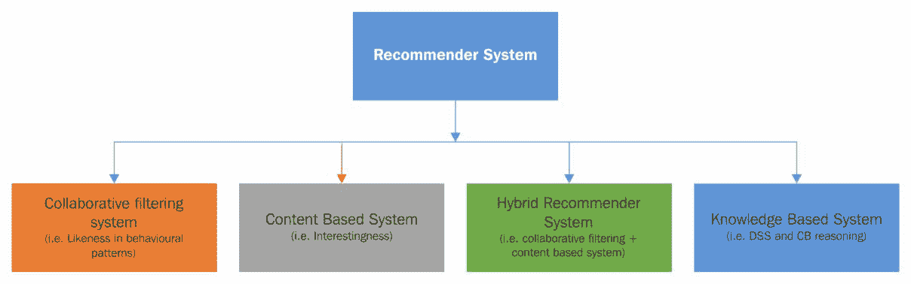**图 6**：不同的推荐系统

最流行的可能是产品（例如电影、音乐、书籍、研究文章、新闻、搜索查询、社交标签等）。推荐系统通常可以被分类为以下四类：

+   协同过滤，也称为社交过滤，通过使用其他人的推荐来过滤信息。问题在于过去对某些物品评价意见一致的人未来可能再次意见一致。因此，例如，想要观看电影的人可能会向朋友们寻求推荐。一旦他收到了一些有相似兴趣的朋友的推荐，这些推荐就比其他人的推荐更可信。这些信息被用于决定要观看哪部电影。

+   基于内容的过滤（也称为认知过滤），根据物品内容和用户个人资料之间的比较来推荐物品。每个物品的内容被表示为一组描述符或术语，通常是文档中出现的词语。用户个人资料也用相同的术语表示，并通过分析用户已经看过的物品的内容来构建。然而，在实施这些类型的推荐系统时，需要考虑以下问题：

+   首先，术语可以自动或手动分配。对于自动分配，必须选择一种方法，以便可以从物品列表中提取这些物品。其次，术语必须以一种方式表示，以便用户个人资料和物品可以进行有意义的比较。学习算法本身必须明智地选择，以便能够基于已观察到的（即已看到的）物品学习用户个人资料，并根据这个用户个人资料做出适当的推荐。基于内容的过滤系统主要用于文本文档，其中术语解析器用于从文档中选择单词。向量空间模型和潜在语义索引是使用这些术语将文档表示为多维空间中的向量的两种方法。此外，它还用于相关反馈、遗传算法、神经网络和贝叶斯分类器来学习用户个人资料。

+   混合推荐系统是最近的研究和混合方法（即，结合协同过滤和基于内容的过滤）。Netflix 就是这样一个推荐系统的很好的例子，它使用了**受限玻尔兹曼机**（**RBM**）和一种矩阵分解算法，用于像 IMDb 这样的大型电影数据库（详见[`pdfs.semanticscholar.org/789a/d4218d1e2e920b4d192023f840fe8246d746.pdf`](https://pdfs.semanticscholar.org/789a/d4218d1e2e920b4d192023f840fe8246d746.pdf)）。这种推荐系统通过比较相似用户的观看和搜索习惯来简单地推荐电影、剧集或流媒体，称为评分预测。

+   基于知识的系统，其中使用有关用户和产品的知识来推断满足用户需求的内容，使用感知树、决策支持系统和基于案例的推理。

在本章中，我们将讨论基于协同过滤的电影推荐系统。

# 半监督学习

在监督学习和无监督学习之间，半监督学习有一小部分空间。在这种情况下，ML 模型通常接收不完整的训练信号。更具体地说，ML 模型接收到一组带有一些目标输出缺失的训练集。半监督学习更多地是基于假设，并且通常使用三种假设算法作为未标记数据的学习算法。使用以下假设：平滑性、聚类和流形。换句话说，半监督学习还可以被称为弱监督或使用未标记示例的自举技术，以增强从少量标记数据中学习的隐藏财富。

如前所述，学习问题的标记数据的获取通常需要一个熟练的人类代理。因此，与标记过程相关的成本可能使得完全标记的训练集变得不可行，而未标记数据的获取相对廉价。

例如：转录音频片段，确定蛋白质的 3D 结构或确定特定位置是否存在石油，期望最小化和人类认知，以及传递性。在这种情况下，半监督学习可以具有很大的实际价值。

# Spark 机器学习 API

在本节中，我们将描述由 Spark 机器学习库（Spark MLlib 和 Spark ML）引入的两个关键概念，以及与我们在前几节中讨论的监督和无监督学习技术相一致的最常用的实现算法。

# Spark 机器学习库

如前所述，在 Spark 之前的时代，大数据建模者通常使用统计语言（如 R、STATA 和 SAS）构建他们的 ML 模型。然而，这种工作流程（即这些 ML 算法的执行流程）缺乏效率、可伸缩性和吞吐量，以及准确性，当然，执行时间也更长。

然后，数据工程师过去常常需要在 Java 中重新实现相同的模型，例如在 Hadoop 上部署。使用 Spark，相同的 ML 模型可以被重建、采用和部署，使整个工作流程更加高效、稳健和快速，从而使您能够提供实时见解以提高性能。此外，在 Hadoop 中实现这些算法意味着这些算法可以并行运行，而这是 R、STATA 和 SAS 等软件无法实现的。Spark 机器学习库分为两个包：Spark MLlib（`spark.mllib`）和 Spark ML（`spark.ml`）。

# Spark MLlib

MLlib 是 Spark 的可扩展机器学习库，是 Spark Core API 的扩展，提供了一系列易于使用的机器学习算法库。Spark 算法是用 Scala 实现的，然后暴露给 Java、Scala、Python 和 R 的 API。Spark 支持存储在单台机器上的本地向量和矩阵数据类型，以及由一个或多个 RDD 支持的分布式矩阵。Spark MLlib 的优点是多种多样的。例如，算法具有高度可扩展性，并利用 Spark 处理大量数据的能力。

+   它们是为并行计算而设计的快速前进，具有基于内存的操作，比 MapReduce 数据处理快 100 倍（它们还支持基于磁盘的操作，比 MapReduce 的普通数据处理快 10 倍）。

+   它们是不同的，因为它们涵盖了用于回归分析、分类、聚类、推荐系统、文本分析和频繁模式挖掘的常见机器学习算法，并且显然涵盖了构建可扩展机器学习应用程序所需的所有步骤。

# Spark ML

Spark ML 添加了一组新的机器学习 API，让用户可以快速在数据集上组装和配置实用的机器学习管道。Spark ML 旨在提供一组统一的高级 API，建立在 DataFrame 而不是 RDD 之上，帮助用户创建和调整实用的机器学习管道。Spark ML API 标准化了机器学习算法，使得将多个算法组合成单个管道或数据工作流程更容易，供数据科学家使用。Spark ML 使用 DataFrame 和 Datasets 的概念，这些概念是在 Spark 1.6 中引入的（作为实验性功能），然后在 Spark 2.0+中使用。

在 Scala 和 Java 中，DataFrame 和 Dataset 已经统一，也就是说，DataFrame 只是行数据集的类型别名。在 Python 和 R 中，由于缺乏类型安全性，DataFrame 是主要的编程接口。

数据集包含各种数据类型，例如存储文本、特征向量和数据的真实标签的列。除此之外，Spark ML 还使用转换器将一个 DataFrame 转换为另一个，或者反之亦然，其中估计器的概念用于拟合 DataFrame 以生成新的转换器。另一方面，管道 API 可以将多个转换器和估计器组合在一起，以指定一个 ML 数据工作流程。在开发 ML 应用程序时，参数的概念被引入，以便指定所有转换器和估计器在一个统一的 API 下共享。

# Spark MLlib 还是 Spark ML？

Spark ML 提供了一个基于 DataFrame 构建 ML 管道的高级 API。基本上，Spark ML 为你提供了一个工具集，用于在数据上构建不同的机器学习相关的转换管道。例如，它可以轻松地将特征提取、降维和分类器的训练链在一起，作为一个整体，后续可以用于分类。然而，MLlib 更老，开发时间更长，因此它具有更多的功能。因此，建议使用 Spark ML，因为其 API 更加灵活多样，适用于 DataFrame。

# 特征提取和转换

假设你要构建一个机器学习模型，用于预测信用卡交易是否欺诈。现在，基于可用的背景知识和数据分析，你可能会决定哪些数据字段（也就是特征）对于训练模型是重要的。例如，金额、客户姓名、购买公司名称和信用卡所有者的地址都值得提供给整个学习过程。这些都是重要考虑的因素，因为如果你只提供一个随机生成的交易 ID，那将不会携带任何信息，因此毫无用处。因此，一旦你决定在训练集中包括哪些特征，你就需要转换这些特征以便更好地训练模型。特征转换可以帮助你向训练数据添加额外的背景信息。这些信息使得机器学习模型最终能够从这种经验中受益。为了使前面的讨论更具体，假设你有一个客户的地址如下所示的字符串：

`"123 Main Street, Seattle, WA 98101"`

如果你看到上述地址，你会发现地址缺乏适当的语义。换句话说，该字符串的表达能力有限。例如，这个地址只对学习与数据库中的确切地址相关的地址模式有用。然而，将其分解为基本部分可以提供额外的特征，例如以下内容：

+   “地址”（123 Main Street）

+   "City" (Seattle)

+   "State" (WA)

+   "Zip" (98101)

如果您看到前面的模式，您的 ML 算法现在可以将更多不同的交易分组在一起，并发现更广泛的模式。这是正常的，因为一些客户的邮政编码比其他客户的邮政编码更容易产生欺诈活动。Spark 提供了几种用于特征提取和使转换更容易的算法。例如，当前版本提供了以下算法用于特征提取：

+   TF-IDF

+   Word2vec

+   CountVectorizer

另一方面，特征转换器是一个包括特征转换器和学习模型的抽象。从技术上讲，转换器实现了一个名为`transform()`的方法，它通过附加一个或多个列，将一个 DataFrame 转换为另一个 DataFrame。Spark 支持以下转换器到 RDD 或 DataFrame：

+   分词器

+   StopWordsRemover

+   n-gram

+   Binarizer

+   PCA

+   PolynomialExpansion

+   离散余弦变换（DCT）

+   StringIndexer

+   IndexToString

+   OneHotEncoder

+   VectorIndexer

+   Interaction

+   Normalizer

+   StandardScaler

+   MinMaxScaler

+   MaxAbsScaler

+   Bucketizer

+   ElementwiseProduct

+   SQLTransformer

+   VectorAssembler

+   QuantileDiscretizer

由于页面限制，我们无法描述所有内容。但我们将讨论一些广泛使用的算法，如`CountVectorizer`、`Tokenizer`、`StringIndexer`、`StopWordsRemover`、`OneHotEncoder`等。PCA，通常用于降维，将在下一节中讨论。

# CountVectorizer

`CountVectorizer`和`CountVectorizerModel`旨在帮助将一组文本文档转换为标记计数的向量。当先前的字典不可用时，`CountVectorizer`可以用作估计器来提取词汇表并生成`CountVectorizerModel`。该模型为文档在词汇表上生成了稀疏表示，然后可以传递给其他算法，如 LDA。

假设我们有以下文本语料库：

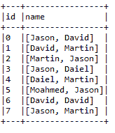**图 7**：仅包含名称的文本语料库

现在，如果我们想将前面的文本集合转换为标记计数的向量，Spark 提供了`CountVectorizer()`API 来实现。首先，让我们为前面的表创建一个简单的 DataFrame，如下所示：

```scala
val df = spark.createDataFrame(
Seq((0, Array("Jason", "David")),
(1, Array("David", "Martin")),
(2, Array("Martin", "Jason")),
(3, Array("Jason", "Daiel")),
(4, Array("Daiel", "Martin")),
(5, Array("Moahmed", "Jason")),
(6, Array("David", "David")),
(7, Array("Jason", "Martin")))).toDF("id", "name")
df.show(false)

```

在许多情况下，您可以使用`setInputCol`设置输入列。让我们看一个例子，并让我们从语料库中拟合一个`CountVectorizerModel`对象，如下所示：

```scala
val cvModel: CountVectorizerModel = new CountVectorizer()
                           .setInputCol("name")
                           .setOutputCol("features")
                           .setVocabSize(3)
                           .setMinDF(2)
                           .fit(df)

```

现在让我们使用提取器下游化向量化器，如下所示：

```scala
val feature = cvModel.transform(df)
spark.stop()

```

现在让我们检查一下，确保它正常工作：

```scala
feature.show(false)

```

上一行代码产生了以下输出：

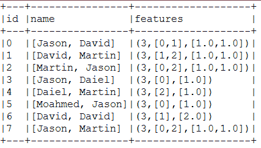**图 8**：名称文本语料库已被特征化

现在让我们转到特征转换器。最重要的转换器之一是分词器，它经常用于处理分类数据的机器学习任务。我们将在下一节中看到如何使用这个转换器。

# 分词器

标记化是从原始文本中提取重要组件（如单词和句子），并将原始文本分解为单个术语（也称为单词）的过程。如果您想对正则表达式匹配进行更高级的标记化，`RegexTokenizer`是一个很好的选择。默认情况下，参数*pattern*（regex，默认：`s+`）用作分隔符来分割输入文本。否则，您还可以将参数*gaps*设置为 false，表示正则表达式*pattern*表示*tokens*而不是分割间隙。这样，您可以找到所有匹配的出现作为标记化结果。

假设您有以下句子：

+   标记化，是从原始文本中提取单词的过程。

+   如果您想进行更高级的标记化，`RegexTokenizer`是一个不错的选择。

+   在这里，我们将提供一个示例，演示如何对句子进行标记化。

+   这样，您可以找到所有匹配的出现。

现在，您希望从前面的四个句子中对每个有意义的单词进行标记化。让我们从前面的句子中创建一个 DataFrame，如下所示：

```scala
val sentence = spark.createDataFrame(Seq(
 (0, "Tokenization,is the process of enchanting words,from the raw text"),
 (1, " If you want,to have more advance tokenization,RegexTokenizer,
       is a good option"),
 (2, " Here,will provide a sample example on how to tockenize sentences"),
 (3, "This way,you can find all matching occurrences"))).toDF("id",
                                                        "sentence")

```

现在，通过实例化`Tokenizer()`API 创建一个标记器，如下所示：

```scala
val tokenizer = new Tokenizer().setInputCol("sentence").setOutputCol("words") 

```

现在，使用 UDF 计算每个句子中的标记数，如下所示：`import org.apache.spark.sql.functions._`

```scala
val countTokens = udf { (words: Seq[String]) => words.length } 

```

现在对每个句子中的单词进行标记化，如下所示：

```scala
val tokenized = tokenizer.transform(sentence) 

```

最后，按如下方式显示每个原始句子的每个标记：

```scala
tokenized.select("sentence", "words")
.withColumn("tokens", countTokens(col("words")))
.show(false) 

```

上一行代码打印了一个从标记化的 DataFrame 中获取原始句子、词袋和标记数的快照：

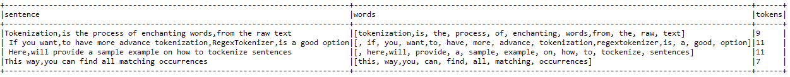**图 9：**从原始文本中标记化的单词

但是，如果您使用`RegexTokenizer`API，您将获得更好的结果。操作如下：

通过实例化`RegexTokenizer()`API 创建一个正则表达式标记器：

```scala
val regexTokenizer = new RegexTokenizer()
                     .setInputCol("sentence")
                     .setOutputCol("words")
                     .setPattern("\\W+")
                     .setGaps(true)

```

现在对每个句子中的单词进行标记化，如下所示：

```scala
val regexTokenized = regexTokenizer.transform(sentence) 
regexTokenized.select("sentence", "words") 
              .withColumn("tokens", countTokens(col("words")))
              .show(false)

```

上一行代码打印了一个使用 RegexTokenizer 包含原始句子、词袋和标记数的标记化 DataFrame 的快照：

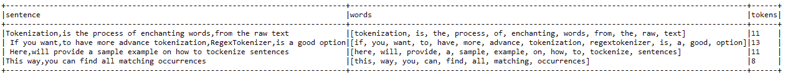**图 10：**使用 RegexTokenizer 更好的标记化

# StopWordsRemover

停用词是应该从输入中排除的单词，通常是因为这些单词频繁出现且没有太多含义。Spark 的`StopWordsRemover`接受一个字符串序列作为输入，该序列由`Tokenizer`或`RegexTokenizer`标记化。然后，它从输入序列中删除所有停用词。停用词列表由`stopWords`参数指定。`StopWordsRemover`API 的当前实现为丹麦语、荷兰语、芬兰语、法语、德语、匈牙利语、意大利语、挪威语、葡萄牙语、俄语、西班牙语、瑞典语、土耳其语和英语提供了选项。举个例子，我们可以简单地扩展上一节中的`Tokenizer`示例，因为它们已经被标记化。但是，对于此示例，我们将使用`RegexTokenizer`API。

首先，通过`StopWordsRemover()`API 创建一个停用词移除器实例，如下所示：

```scala
val remover = new StopWordsRemover()
             .setInputCol("words")
             .setOutputCol("filtered")

```

现在，让我们删除所有停用词并按如下方式打印结果：

```scala
val newDF = remover.transform(regexTokenized)
 newDF.select("id", "filtered").show(false)

```

上一行代码打印了一个从过滤后的 DataFrame 中排除停用词的快照：

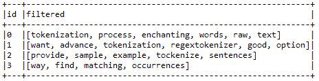**图 11：**过滤（即去除停用词）的标记

# StringIndexer

StringIndexer 将标签的字符串列编码为标签索引列。索引在`0，numLabels)`中，按标签频率排序，因此最常见的标签获得索引 0。如果输入列是数字，我们将其转换为字符串并索引字符串值。当下游管道组件（如估计器或转换器）使用此字符串索引标签时，您必须将组件的输入列设置为此字符串索引列名称。在许多情况下，您可以使用`setInputCol`设置输入列。假设您有以下格式的一些分类数据：


**图 12：**应用 String Indexer 的 DataFrame 

现在，我们想要对名称列进行索引，以便最常见的名称（在我们的案例中为 Jason）获得索引 0。为此，Spark 提供了`StringIndexer`API。对于我们的示例，可以按如下方式完成：首先，让我们为上表创建一个简单的 DataFrame：

```scala
val df = spark.createDataFrame( 
  Seq((0, "Jason", "Germany"), 
      (1, "David", "France"), 
      (2, "Martin", "Spain"), 
      (3, "Jason", "USA"), 
      (4, "Daiel", "UK"), 
      (5, "Moahmed", "Bangladesh"), 
      (6, "David", "Ireland"), 
      (7, "Jason", "Netherlands"))
).toDF("id", "name", "address")
```

现在让我们对名称列进行索引，如下所示：

```scala
val indexer = new StringIndexer() 
    .setInputCol("name") 
    .setOutputCol("label") 
    .fit(df)
```

现在让我们使用转换器下游索引器，如下所示：

```scala
val indexed = indexer.transform(df)
```

现在让我们检查一下是否它正常工作：

```scala
indexed.show(false)
```

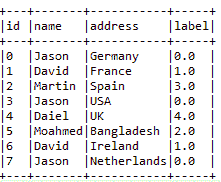

**图 13：**使用 StringIndexer 创建标签

另一个重要的转换器是 OneHotEncoder，在处理分类数据的机器学习任务中经常使用。我们将在下一节中看到如何使用这个转换器。

# OneHotEncoder

一种独热编码将标签索引列映射到具有最多一个值的二进制向量列。这种编码允许期望连续特征（例如逻辑回归）的算法使用分类特征。假设您有以下格式的一些分类数据（与我们在上一节中描述`StringIndexer`时使用的相同）：

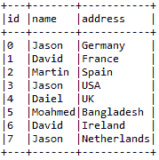**图 14：**应用 OneHotEncoder 的 DataFrame

现在，我们想要对名称列进行索引，以便数据集中最常见的名称（即我们的情况下的**Jason**）获得索引**0**。然而，仅仅对它们进行索引有什么用呢？换句话说，您可以进一步将它们向量化，然后可以轻松地将 DataFrame 提供给任何 ML 模型。由于我们已经在上一节中看到如何创建 DataFrame，在这里，我们将展示如何将它们编码为向量：

```scala
val indexer = new StringIndexer()
                  .setInputCol("name")
                  .setOutputCol("categoryIndex")
                  .fit(df)
val indexed = indexer.transform(df)
val encoder = new OneHotEncoder()
                  .setInputCol("categoryIndex")
                  .setOutputCol("categoryVec")

```

现在让我们使用`Transformer`将其转换为向量，然后查看内容，如下所示：

```scala
val encoded = encoder.transform(indexed)
encoded.show()

```

包含快照的结果 DataFrame 如下：

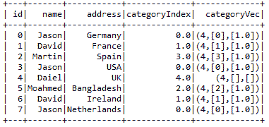**图 15**：使用 OneHotEncoder 创建类别索引和向量

现在您可以看到，结果 DataFrame 中添加了一个包含特征向量的新列。

# Spark ML 管道

MLlib 的目标是使实际机器学习（ML）可扩展且易于使用。Spark 引入了管道 API，用于轻松创建和调整实际的 ML 管道。如前所述，在 ML 管道创建中通过特征工程提取有意义的知识涉及一系列数据收集、预处理、特征提取、特征选择、模型拟合、验证和模型评估阶段。例如，对文本文档进行分类可能涉及文本分割和清理、提取特征以及使用交叉验证训练分类模型进行调整。大多数 ML 库都不是为分布式计算设计的，或者它们不提供管道创建和调整的本地支持。

# 数据集抽象

从另一种编程语言（例如 Java）运行 SQL 查询时，结果将作为 DataFrame 返回。DataFrame 是一种分布式的数据集合，组织成具有命名列的数据。另一方面，数据集是一个接口，试图提供 Spark SQL 中 RDD 的好处。数据集可以从一些 JVM 对象构造，例如原始类型（例如`String`、`Integer`和`Long`）、Scala case 类和 Java Beans。ML 管道涉及一系列数据集转换和模型。每个转换都接受一个输入数据集，并输出转换后的数据集，这成为下一阶段的输入。因此，数据导入和导出是 ML 管道的起点和终点。为了使这些更容易，Spark MLlib 和 Spark ML 提供了数据集、DataFrame、RDD 和模型的导入和导出工具，适用于几种特定应用类型，包括：

+   用于分类和回归的 LabeledPoint

+   用于交叉验证和潜在狄利克雷分配（LDA）的 LabeledDocument

+   协同过滤的评分和排名

然而，真实数据集通常包含多种类型，例如用户 ID、项目 ID、标签、时间戳和原始记录。不幸的是，Spark 实现的当前工具不能轻松处理由这些类型组成的数据集，特别是时间序列数据集。特征转换通常占据实际 ML 管道的大部分。特征转换可以被视为从现有列创建新列的附加或删除。

在下图中，您将看到文本标记器将文档分解为词袋。之后，TF-IDF 算法将词袋转换为特征向量。在转换过程中，标签需要保留以用于模型拟合阶段：

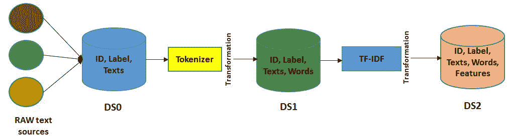**图 16**：用于机器学习模型的文本处理（DS 表示数据源）

在这里，ID、文本和单词在转换步骤中被让步。它们对于进行预测和模型检查是有用的。然而，它们实际上对于模型拟合来说是不必要的。如果预测数据集只包含预测标签，它们也不提供太多信息。因此，如果你想要检查预测指标，比如准确性、精确度、召回率、加权真阳性和加权假阳性，查看预测标签以及原始输入文本和标记化单词是非常有用的。相同的建议也适用于使用 Spark ML 和 Spark MLlib 的其他机器学习应用。

因此，RDD、数据集和 DataFrame 之间的简单转换已经成为可能，用于内存、磁盘或外部数据源，如 Hive 和 Avro。虽然使用用户定义的函数从现有列创建新列很容易，但数据集的显现是一种懒惰的操作。相反，数据集仅支持一些标准数据类型。然而，为了增加可用性并使其更适合机器学习模型，Spark 还添加了对`Vector`类型的支持，作为一种支持`mllib.linalg.DenseVector`和`mllib.linalg.Vector`下的稠密和稀疏特征向量的用户定义类型。

在 Spark 分发的`examples/src/main/`文件夹中可以找到 Java、Scala 和 Python 中的完整 DataFrame、数据集和 RDD 示例。感兴趣的读者可以参考 Spark SQL 的用户指南[`spark.apache.org/docs/latest/sql-programming-guide.html`](http://spark.apache.org/docs/latest/sql-programming-guide.html)来了解更多关于 DataFrame、数据集以及它们支持的操作。

# 创建一个简单的管道

Spark 在 Spark ML 下提供了管道 API。管道包括一系列由转换器和估计器组成的阶段。管道阶段有两种基本类型，称为转换器和估计器：

+   转换器将数据集作为输入，并产生增强的数据集作为输出，以便输出可以被传递到下一步。例如，**Tokenizer**和**HashingTF**是两个转换器。Tokenizer 将具有文本的数据集转换为具有标记化单词的数据集。另一方面，HashingTF 产生术语频率。标记化和 HashingTF 的概念通常用于文本挖掘和文本分析。

+   相反，估计器必须是输入数据集中的第一个，以产生模型。在这种情况下，模型本身将被用作转换器，将输入数据集转换为增强的输出数据集。例如，在拟合训练数据集与相应的标签和特征之后，可以将**逻辑回归**或线性回归用作估计器。

然后，它产生一个逻辑或线性回归模型，这意味着开发管道是简单而容易的。你所需要做的就是声明所需的阶段，然后配置相关阶段的参数；最后，将它们链接在一个管道对象中，如下图所示：

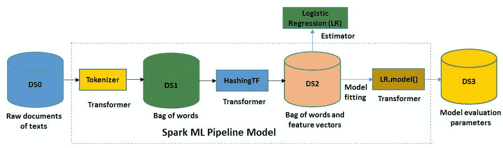**图 17**：使用逻辑回归估计器的 Spark ML 管道模型（DS 表示数据存储，在虚线内的步骤仅在管道拟合期间发生）

如果你看一下*图 17*，拟合的模型包括一个 Tokenizer，一个 HashingTF 特征提取器和一个拟合的逻辑回归模型。拟合的管道模型充当了一个转换器，可以用于预测、模型验证、模型检查，最后是模型部署。然而，为了提高预测准确性的性能，模型本身需要进行调整。

现在我们知道了 Spark MLlib 和 ML 中可用的算法，现在是时候在正式解决监督和无监督学习问题之前做好准备了。在下一节中，我们将开始进行特征提取和转换。

# 无监督机器学习

在本节中，为了使讨论更具体，将仅讨论使用 PCA 进行降维和用于文本聚类的 LDA 主题建模。其他无监督学习算法将在第十三章中讨论，*我的名字是贝叶斯，朴素贝叶斯*，并附有一些实际示例。

# 降维

降维是减少考虑的变量数量的过程。它可以用于从原始和嘈杂的特征中提取潜在特征，或者在保持结构的同时压缩数据。Spark MLlib 支持对`RowMatrix`类进行降维。用于降低数据维度的最常用算法是 PCA 和 SVD。然而，在本节中，我们将仅讨论 PCA 以使讨论更具体。

# PCA

PCA 是一种统计程序，它使用正交变换将可能相关的变量的一组观察转换为一组称为主成分的线性不相关变量的值。PCA 算法可以用来使用 PCA 将向量投影到低维空间。然后，基于降维后的特征向量，可以训练一个 ML 模型。以下示例显示了如何将 6D 特征向量投影到四维主成分中。假设你有一个特征向量如下：

```scala
val data = Array(
 Vectors.dense(3.5, 2.0, 5.0, 6.3, 5.60, 2.4),
 Vectors.dense(4.40, 0.10, 3.0, 9.0, 7.0, 8.75),
 Vectors.dense(3.20, 2.40, 0.0, 6.0, 7.4, 3.34) )

```

现在让我们从中创建一个 DataFrame，如下所示：

```scala
val df = spark.createDataFrame(data.map(Tuple1.apply)).toDF("features")
df.show(false)

```

上述代码生成了一个具有 6D 特征向量的特征 DataFrame 用于 PCA：

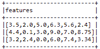**图 18**：创建一个特征 DataFrame（6 维特征向量）用于 PCA

现在让我们通过设置必要的参数来实例化 PCA 模型，如下所示：

```scala
val pca = new PCA()
 .setInputCol("features")
 .setOutputCol("pcaFeatures")
 .setK(4) 
 .fit(df)

```

现在，为了有所不同，我们使用`setOutputCol()`方法将输出列设置为`pcaFeatures`。然后，我们设置 PCA 的维度。最后，我们拟合 DataFrame 以进行转换。请注意，PCA 模型包括一个`explainedVariance`成员。可以从这样的旧数据加载模型，但`explainedVariance`将为空向量。现在让我们展示结果特征：

```scala
val result = pca.transform(df).select("pcaFeatures") 
result.show(false)

```

上述代码生成了一个使用 PCA 的主成分作为 4D 特征向量的特征 DataFrame：

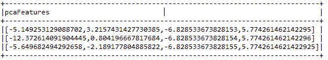**图 19**：四维主成分（PCA 特征）

# 使用 PCA

PCA 广泛用于降维，是一种帮助找到旋转矩阵的统计方法。例如，如果我们想检查第一个坐标是否具有最大可能的方差。它还有助于检查是否有任何后续坐标会产生最大可能的方差。

最终，PCA 模型计算这些参数并将它们作为旋转矩阵返回。旋转矩阵的列被称为主成分。Spark MLlib 支持对以行为导向格式存储的高瘦矩阵和任何向量进行 PCA。

# 回归分析 - PCA 的实际用途

在本节中，我们将首先探索将用于回归分析的**MSD**（**百万首歌数据集**）。然后我们将展示如何使用 PCA 来减少数据集的维度。最后，我们将评估回归质量的线性回归模型。

# 数据集收集和探索

在本节中，我们将描述非常著名的 MNIST 数据集。这个数据集将在本章中使用。手写数字的 MNIST 数据库（从[`www.csie.ntu.edu.tw/~cjlin/libsvmtools/datasets/multiclass.html`](https://www.csie.ntu.edu.tw/~cjlin/libsvmtools/datasets/multiclass.html)下载）有一个包含 60,000 个示例的训练集和一个包含 10,000 个示例的测试集。它是 NIST 提供的更大数据集的子集。这些数字已经被大小标准化并居中在固定大小的图像中。因此，对于那些试图在实际数据上学习技术和模式识别方法，同时在预处理和格式化上付出最少努力的人来说，这是一个非常好的示例数据集。来自 NIST 的原始黑白（双级）图像被大小标准化以适应 20 x 20 像素的框，同时保持它们的长宽比。

MNIST 数据库是从 NIST 的特殊数据库 3 和特殊数据库 1 构建的，其中包含手写数字的二进制图像。数据集的样本如下所示：

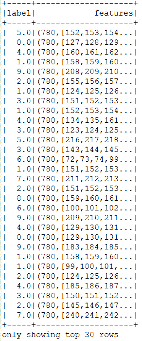**图 20**：MNIST 数据集的快照

您可以看到总共有 780 个特征。因此，有时许多机器学习算法会因数据集的高维特性而失败。因此，为了解决这个问题，在下一节中，我们将向您展示如何在不牺牲机器学习任务的质量的情况下减少维度。然而，在深入研究问题之前，让我们先了解一些关于回归分析的背景知识。

# 什么是回归分析？

线性回归属于回归算法家族。回归的目标是找到变量之间的关系和依赖性。它是使用线性函数对连续标量因变量*y*（也称为标签或目标，在机器学习术语中）和一个或多个（D 维向量）解释变量（也称为自变量、输入变量、特征、观察数据、观测、属性、维度、数据点等）*x*之间的关系进行建模。在回归分析中，目标是预测连续的目标变量，如下图所示：

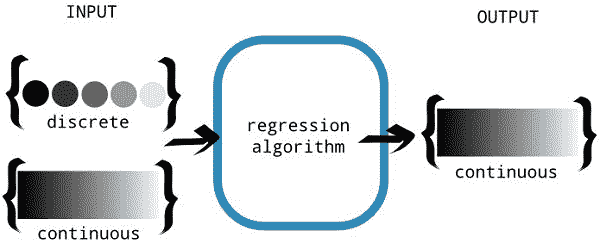

图 21：回归算法旨在产生连续输出。输入可以是

离散或连续（来源：Nishant Shukla，使用 TensorFlow 进行机器学习，Manning Publications co. 2017）

现在，您可能对分类和回归问题的基本区别有些困惑。以下信息框将使其更清晰：

**回归与分类：**另一方面，另一个领域称为分类，是关于从有限集合中预测标签，但具有离散值。这种区别很重要，因为离散值输出更适合分类，这将在接下来的部分中讨论。

涉及输入变量的多元回归模型采用以下形式：

y = ss[0] + ss[1]x[1] + ss[2]x[2] + ss[3]x[3] +..... + e

图 22 显示了一个简单线性回归的例子，其中有一个自变量（*x*轴）。模型（红线）是使用训练数据（蓝点）计算的，其中每个点都有一个已知的标签（*y*轴），以尽可能准确地拟合点，通过最小化所选损失函数的值。然后我们可以使用模型来预测未知的标签（我们只知道*x*值，想要预测*y*值）。

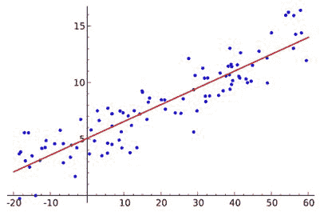

图 22：回归图分离数据点（点【.】指图中的数据点，红线指回归）

Spark 提供了基于 RDD 的线性回归算法实现。您可以使用随机梯度下降来训练无正则化的线性回归模型。这解决了最小二乘回归公式 *f (weights) = 1/n ||A weights-y||²*（即均方误差）。在这里，数据矩阵有*n*行，输入 RDD 保存了*A*的一组行，每个行都有其相应的右手边标签*y*。有关更多信息，请参阅[`github.com/apache/spark/blob/master/mllib/src/main/scala/org/apache/spark/mllib/regression/LinearRegression.scala`](https://github.com/apache/spark/blob/master/mllib/src/main/scala/org/apache/spark/mllib/regression/LinearRegression.scala)。

**步骤 1. 加载数据集并创建 RDD**

要以 LIBSVM 格式加载 MNIST 数据集，我们在这里使用了 Spark MLlib 的内置 API MLUtils：

```scala
val data = MLUtils.loadLibSVMFile(spark.sparkContext, "data/mnist.bz2") 

```

**步骤 2. 计算特征数以便更容易进行降维：**

```scala
val featureSize = data.first().features.size
println("Feature Size: " + featureSize)

```

这将导致以下输出：

```scala
Feature Size: 780

```

因此，数据集有 780 列 - 即特征，因此可以将其视为高维数据（特征）。因此，有时值得减少数据集的维度。

**步骤 3. 现在按以下方式准备训练和测试集：**

问题是我们将两次训练`LinearRegressionwithSGD`模型。首先，我们将使用原始特征的正常数据集，其次，使用一半的特征。对于原始数据集，训练和测试集的准备如下进行：

```scala
val splits = data.randomSplit(Array(0.75, 0.25), seed = 12345L)
val (training, test) = (splits(0), splits(1))

```

现在，对于减少的特征，训练如下进行：

```scala
val pca = new PCA(featureSize/2).fit(data.map(_.features))
val training_pca = training.map(p => p.copy(features = pca.transform(p.features)))
val test_pca = test.map(p => p.copy(features = pca.transform(p.features))) 

```

**步骤 4. 训练线性回归模型**

现在迭代 20 次，并分别对正常特征和减少特征进行`LinearRegressionWithSGD`训练，如下所示：

```scala
val numIterations = 20
val stepSize = 0.0001
val model = LinearRegressionWithSGD.train(training, numIterations)
val model_pca = LinearRegressionWithSGD.train(training_pca, numIterations)

```

注意！有时，`LinearRegressionWithSGD()`会返回`NaN`。在我看来，这种情况发生有两个原因：

+   如果`stepSize`很大。在这种情况下，您应该使用较小的值，例如 0.0001、0.001、0.01、0.03、0.1、0.3、1.0 等。

+   您的训练数据有`NaN`。如果是这样，结果可能会是`NaN`。因此，建议在训练模型之前删除空值。

**步骤 5. 评估两个模型**

在评估分类模型之前，首先让我们准备计算正常情况下的 MSE，以查看降维对原始预测的影响。显然，如果您想要一种正式的方法来量化模型的准确性，并可能增加精度并避免过拟合。尽管如此，您可以通过残差分析来做。还值得分析用于模型构建和评估的训练和测试集的选择。最后，选择技术可以帮助您描述模型的各种属性：

```scala
val valuesAndPreds = test.map { point =>
                      val score = model.predict(point.features)
                      (score, point.label)
                     }

```

现在按以下方式计算 PCA 的预测集：

```scala
val valuesAndPreds_pca = test_pca.map { point =>
                         val score = model_pca.predict(point.features)
                         (score, point.label)
                       }

```

现在按以下方式计算 MSE 并打印每种情况：

```scala
val MSE = valuesAndPreds.map { case (v, p) => math.pow(v - p 2) }.mean()
val MSE_pca = valuesAndPreds_pca.map { case (v, p) => math.pow(v - p, 2) }.mean()
println("Mean Squared Error = " + MSE)
println("PCA Mean Squared Error = " + MSE_pca)

```

您将得到以下输出：

```scala
Mean Squared Error = 2.9164359135973043E78
PCA Mean Squared Error = 2.9156682256149184E78

```

请注意，MSE 实际上是使用以下公式计算的：

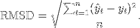

**步骤 6.** **观察两个模型的模型系数**

按以下方式计算模型系数：

```scala
println("Model coefficients:"+ model.toString())
println("Model with PCA coefficients:"+ model_pca.toString())

```

现在您应该在终端/控制台上观察以下输出：

```scala
Model coefficients: intercept = 0.0, numFeatures = 780
Model with PCA coefficients: intercept = 0.0, numFeatures = 390

```

# 二元和多类分类

二元分类器用于将给定数据集的元素分为两种可能的组（例如，欺诈或非欺诈），是多类分类的特例。大多数二元分类指标可以推广为多类分类指标。多类分类描述了一个分类问题，其中每个数据点有*M>2*个可能的标签（*M=2*的情况是二元分类问题）。

对于多类指标，正例和负例的概念略有不同。预测和标签仍然可以是正面或负面，但必须考虑特定类别的上下文。每个标签和预测都取多个类别中的一个值，因此它们被认为是其特定类别的正面，对于所有其他类别则是负面。因此，每当预测和标签匹配时，就会出现真正的正例，而当预测和标签都不取给定类别的值时，就会出现真负例。按照这个约定，对于给定的数据样本，可能会有多个真负例。从前面对正负标签的定义扩展出的假负例和假正例是直接的。

# 性能指标

虽然有许多不同类型的分类算法，但评估指标或多或少共享相似的原则。在监督分类问题中，每个数据点都存在真实输出和模型生成的预测输出。因此，每个数据点的结果可以分配到四个类别中的一个：

+   **真正例**（**TP**）：标签为正，预测也为正。

+   **真负例**（**TN**）：标签为负，预测也为负。

+   **假正例**（**FP**）：标签为负，但预测为正。

+   **假负例**（**FN**）：标签为正，但预测为负。

现在，为了更清楚地了解这些参数，请参考以下图：

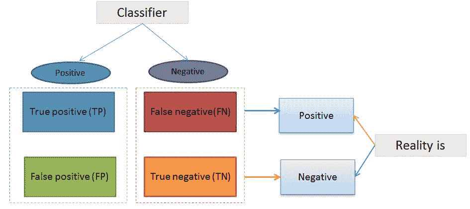**图 23**：预测分类器（即混淆矩阵）

TP、FP、TN、FN 是大多数分类器评估指标的基本组成部分。在考虑分类器评估时的一个基本观点是，纯粹的准确性（即预测是否正确或不正确）通常不是一个好的度量标准。这是因为数据集可能高度不平衡。例如，如果一个模型被设计为从一个数据集中预测欺诈，其中 95%的数据点不是欺诈，5%的数据点是欺诈。然后假设一个天真的分类器预测不是欺诈（不考虑输入）将有 95%的准确率。因此，通常使用精确度和召回率等指标，因为它们考虑了错误的类型。在大多数应用中，精确度和召回率之间存在一定的平衡，这可以通过将两者结合成一个单一指标来捕捉，称为**F-度量**。

精确度表示被正确分类的正例有多少是相关的。另一方面，召回率表示测试在检测阳性方面有多好？在二元分类中，召回率称为敏感性。重要的是要注意，精确度可能不会随着召回率而下降。召回率和精确度之间的关系可以在图中的阶梯区域中观察到：

+   接收器操作特性（ROC）

+   ROC 曲线下的面积

+   精确度-召回率曲线下的面积

这些曲线通常用于二元分类来研究分类器的输出。然而，有时结合精确度和召回率来选择两个模型是很好的。相比之下，使用多个数字评估指标的精确度和召回率使得比较算法变得更加困难。假设您有两个算法的表现如下：

| **分类器** | **精确度** | **召回率** |
| --- | --- | --- |
| X | 96% | 89% |
| Y | 99% | 84% |

在这里，没有一个分类器显然优于另一个，因此它并不能立即指导您选择最佳的分类器。但是使用 F1 分数，这是一个结合了精确度和召回率（即精确度和召回率的调和平均值）的度量，平衡了 F1 分数。让我们计算一下，并将其放在表中：

| **分类器** | **精确度** | **召回率** | **F1 分数** |
| --- | --- | --- | --- |
| X | 96% | 89% | 92.36% |
| Y | 99% | 84% | 90.885% |

因此，具有 F1 分数有助于从大量分类器中进行选择。它为所有分类器提供了清晰的偏好排名，因此为进展提供了明确的方向，即分类器**X**。

对于二元分类，可以计算前述性能指标如下：

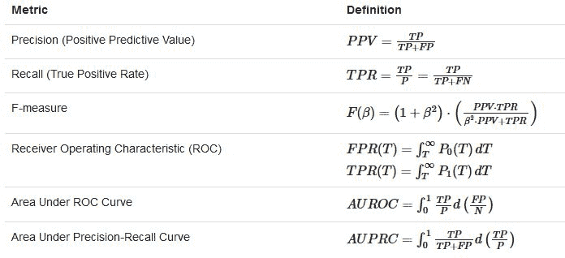**图 24**：计算二元分类器性能指标的数学公式（来源：[`spark.apache.org/docs/2.1.0/mllib-evaluation-metrics.html`](https://spark.apache.org/docs/2.1.0/mllib-evaluation-metrics.html)）

然而，在多类分类问题中，与两个预测标签相关联的情况下，计算先前的指标更加复杂，但可以使用以下数学方程进行计算：

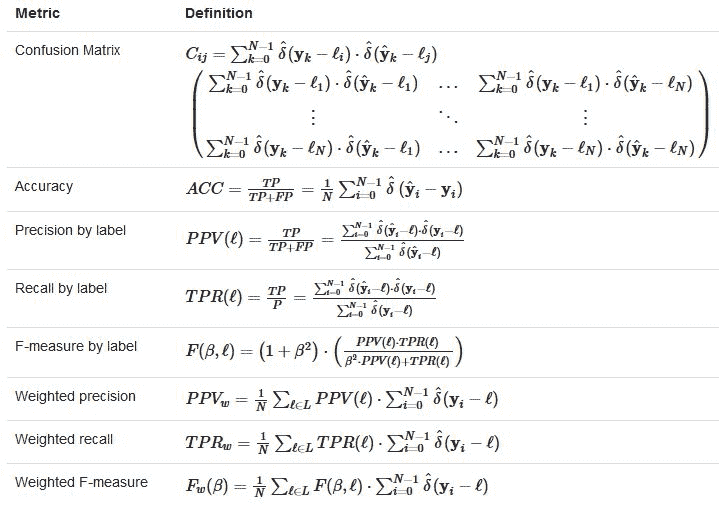**图 25**：计算多类分类器性能指标的数学公式

修改后的δ函数称为修改的δ函数，可以定义如下（来源：[`spark.apache.org/docs/2.1.0/mllib-evaluation-metrics.html`](https://spark.apache.org/docs/2.1.0/mllib-evaluation-metrics.html)）：

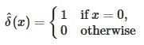

# 使用逻辑回归进行二元分类

逻辑回归广泛用于预测二元响应。这是一种可以用数学方式表示的线性方法：

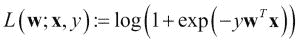

在上述方程中，*L(w; x, y)*是称为逻辑损失的损失函数。

对于二元分类问题，该算法将输出一个二元逻辑回归模型。给定一个新的数据点，用*x*表示，该模型通过应用逻辑函数进行预测：

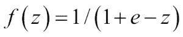

其中*z = w^Tx*，默认情况下，如果*f(w^Tx)>0.5*，结果为正，否则为负，尽管与线性支持向量机不同，逻辑回归模型的原始输出*f(z)*具有概率解释（即*x*为正的概率）。

**线性支持向量机**是最新的极快的机器学习（数据挖掘）算法，用于解决超大数据集的多类分类问题，实现了一个原始专有版本的线性支持向量机的切割平面算法（来源：[www.linearsvm.com/](http://www.linearsvm.com/)）。

# 使用 Spark ML 的逻辑回归进行乳腺癌预测

在本节中，我们将看看如何使用 Spark ML 开发癌症诊断管道。将使用真实数据集来预测乳腺癌的概率。更具体地说，将使用威斯康星乳腺癌数据集。

# 数据集收集

在这里，我们使用了更简单的数据集，这些数据集经过结构化和手动筛选，用于机器学习应用程序开发，当然，其中许多数据集显示出良好的分类准确性。来自 UCI 机器学习库的威斯康星乳腺癌数据集（[`archive.ics.uci.edu/ml/datasets/Breast+Cancer+Wisconsin+(Original)`](https://archive.ics.uci.edu/ml/datasets/Breast+Cancer+Wisconsin+(Original)）包含了由威斯康星大学的研究人员捐赠的数据，并包括来自乳腺肿块的细针抽吸的数字化图像的测量。这些值代表数字图像中细胞核的特征，如下一小节所述：

```scala
0\. Sample code number id number
1\. Clump Thickness 1 - 10
2\. Uniformity of Cell Size 1 - 10
3\. Uniformity of Cell Shape 1 - 10
4\. Marginal Adhesion 1 - 10
5\. Single Epithelial Cell Size 1 - 10
6\. Bare Nuclei 1 - 10
7\. Bland Chromatin 1 - 10
8\. Normal Nucleoli 1 - 10
9\. Mitoses 1 - 10
10\. Class: (2 for benign, 4 for malignant)

```

要了解更多关于威斯康星乳腺癌数据集的信息，请参阅作者的出版物：*用于乳腺肿瘤诊断的核特征提取*，*IS&T/SPIE* 1993 *国际电子成像研讨会：科学与技术*，卷 1905，第 861-870 页，作者为*W.N. Street*，*W.H. Wolberg*和*O.L. Mangasarian*，1993 年。

# 使用 Spark ML 开发管道

现在我们将向您展示如何通过逐步示例预测乳腺癌的可能性：

**步骤 1：加载和解析数据**

```scala
val rdd = spark.sparkContext.textFile("data/wbcd.csv") 
val cancerRDD = parseRDD(rdd).map(parseCancer) 

```

`parseRDD()`方法如下：

```scala
def parseRDD(rdd: RDD[String]): RDD[Array[Double]] = { 
  rdd.map(_.split(",")).filter(_(6) != "?").map(_.drop(1)).map(_.map(_.toDouble)) 
} 

```

`parseCancer()`方法如下：

```scala
def parseCancer(line: Array[Double]): Cancer = { 
  Cancer(if (line(9) == 4.0) 1 else 0, line(0), line(1), line(2), line(3), line(4), line(5), line(6), line(7), line(8)) 
}  

```

请注意，这里我们简化了数据集。对于值 4.0，我们已将其转换为 1.0，否则为 0.0。`Cancer`类是一个可以定义如下的案例类：

```scala
case class Cancer(cancer_class: Double, thickness: Double, size: Double, shape: Double, madh: Double, epsize: Double, bnuc: Double, bchrom: Double, nNuc: Double, mit: Double)

```

**步骤 2：将 RDD 转换为 ML 管道的 DataFrame**

```scala
import spark.sqlContext.implicits._
val cancerDF = cancerRDD.toDF().cache() 
cancerDF.show() 

```

DataFrame 如下所示：

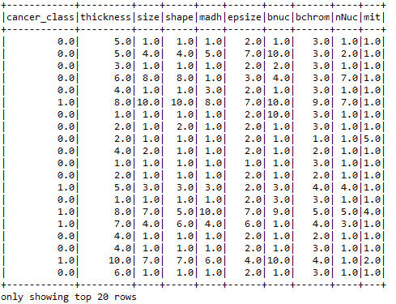**图 26：**癌症数据集的快照

**步骤 3：特征提取和转换**

首先，让我们选择特征列，如下所示：

```scala
val featureCols = Array("thickness", "size", "shape", "madh", "epsize", "bnuc", "bchrom", "nNuc", "mit") 

```

现在让我们将它们组装成一个特征向量，如下所示：

```scala
val assembler = new VectorAssembler().setInputCols(featureCols).setOutputCol("features") 

```

现在将它们转换为 DataFrame，如下所示：

```scala
val df2 = assembler.transform(cancerDF) 

```

让我们看一下转换后的 DataFrame 的结构：

```scala
df2.show() 

```

现在，您应该观察到一个包含基于左侧列计算的特征的 DataFrame：

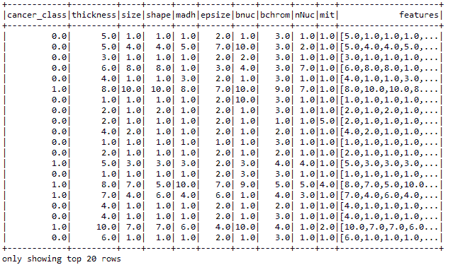**图 27：**包含特征的新 DataFrame

最后，让我们使用`StringIndexer`为训练数据集创建标签，如下所示：

```scala
val labelIndexer = new StringIndexer().setInputCol("cancer_class").setOutputCol("label")
val df3 = labelIndexer.fit(df2).transform(df2)
df3.show() 

```

现在，您应该观察到一个包含基于左侧列计算的特征和标签的 DataFrame：

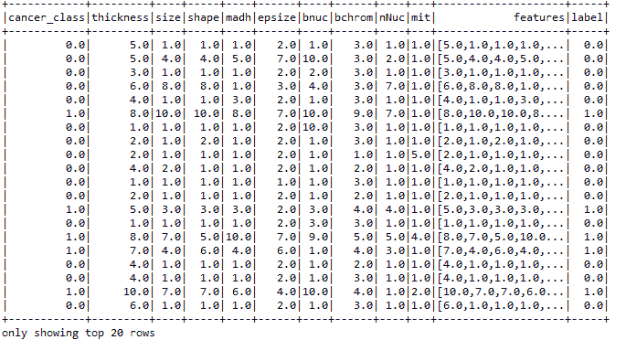**图 28：**包含用于训练 ML 模型的特征和标签的新 DataFrame

**步骤 4：创建测试和训练集**

```scala
val splitSeed = 1234567 
val Array(trainingData, testData) = df3.randomSplit(Array(0.7, 0.3), splitSeed)

```

**步骤 5：使用训练集创建估计器**

让我们使用带有`elasticNetParam`的逻辑回归创建管道的估计器。我们还指定最大迭代次数和回归参数，如下所示：

```scala
val lr = new LogisticRegression().setMaxIter(50).setRegParam(0.01).setElasticNetParam(0.01) 
val model = lr.fit(trainingData)  

```

**步骤 6：获取测试集的原始预测、概率和预测**

使用测试集转换模型以获取测试集的原始预测、概率和预测：

```scala
val predictions = model.transform(testData) 
predictions.show() 

```

生成的 DataFrame 如下所示：

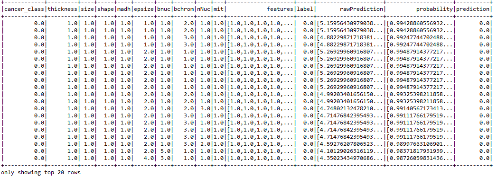**图 29：**包含每行的原始预测和实际预测的新 DataFrame

**步骤 7：生成训练的目标历史**

让我们生成模型在每次迭代中的目标历史，如下所示：

```scala
val trainingSummary = model.summary 
val objectiveHistory = trainingSummary.objectiveHistory 
objectiveHistory.foreach(loss => println(loss))

```

前面的代码段产生了以下关于训练损失的输出：

```scala
    0.6562291876496595
    0.6087867761081431
    0.538972588904556
    0.4928455913405332
    0.46269258074999386
    0.3527914819973198
    0.20206901337404978
    0.16459454874996993
    0.13783437051276512
    0.11478053164710095
    0.11420433621438157
    0.11138884788059378
    0.11041889032338036
    0.10849477236373875
    0.10818880537879513
    0.10682868640074723
    0.10641395229253267
    0.10555411704574749
    0.10505186414044905
    0.10470425580130915
    0.10376219754747162
    0.10331139609033112
    0.10276173290225406
    0.10245982201904923
    0.10198833366394071
    0.10168248313103552
    0.10163242551955443
    0.10162826209311404
    0.10162119367292953
    0.10161235376791203
    0.1016114803209495
    0.10161090505556039
    0.1016107261254795
    0.10161056082112738
    0.10161050381332608
    0.10161048515341387
    0.10161043900301985
    0.10161042057436288
    0.10161040971267737
    0.10161040846923354
    0.10161040625542347
    0.10161040595207525
    0.10161040575664354
    0.10161040565870835
    0.10161040519559975
    0.10161040489834573
    0.10161040445215266
    0.1016104043469577
    0.1016104042793553
    0.1016104042606048
    0.10161040423579716 

```

正如您所看到的，损失在后续迭代中逐渐减少。

**步骤 8：评估模型**

首先，我们必须确保我们使用的分类器来自二元逻辑回归摘要：

```scala
val binarySummary = trainingSummary.asInstanceOf[BinaryLogisticRegressionSummary]

```

现在让我们获取 ROC 作为`DataFrame`和`areaUnderROC`。接近 1.0 的值更好：

```scala
val roc = binarySummary.roc 
roc.show() 
println("Area Under ROC: " + binarySummary.areaUnderROC)

```

前面的行打印了`areaUnderROC`的值，如下所示：

```scala
Area Under ROC: 0.9959095884623509

```

这太棒了！现在让我们计算其他指标，如真阳性率、假阳性率、假阴性率、总计数以及正确和错误预测的实例数量，如下所示：

```scala
import org.apache.spark.sql.functions._

// Calculate the performance metrics
val lp = predictions.select("label", "prediction") 
val counttotal = predictions.count() 
val correct = lp.filter($"label" === $"prediction").count() 
val wrong = lp.filter(not($"label" === $"prediction")).count() 
val truep = lp.filter($"prediction" === 0.0).filter($"label" === $"prediction").count() 
val falseN = lp.filter($"prediction" === 0.0).filter(not($"label" === $"prediction")).count() 
val falseP = lp.filter($"prediction" === 1.0).filter(not($"label" === $"prediction")).count() 
val ratioWrong = wrong.toDouble / counttotal.toDouble 
val ratioCorrect = correct.toDouble / counttotal.toDouble 

println("Total Count: " + counttotal) 
println("Correctly Predicted: " + correct) 
println("Wrongly Identified: " + wrong) 
println("True Positive: " + truep) 
println("False Negative: " + falseN) 
println("False Positive: " + falseP) 
println("ratioWrong: " + ratioWrong) 
println("ratioCorrect: " + ratioCorrect) 

```

现在，您应该观察到前面代码的输出如下：

**总计数：209** **正确预测：202** **错误识别：7** **真阳性：140** **假阴性：4** **假阳性：3** **错误比率：0.03349282296650718** **正确比率：0.9665071770334929**

最后，让我们评估模型的准确性。但是，首先，我们需要将模型阈值设置为最大化`fMeasure`：

```scala
val fMeasure = binarySummary.fMeasureByThreshold 
val fm = fMeasure.col("F-Measure") 
val maxFMeasure = fMeasure.select(max("F-Measure")).head().getDouble(0) 
val bestThreshold = fMeasure.where($"F-Measure" === maxFMeasure).select("threshold").head().getDouble(0) 
model.setThreshold(bestThreshold) 

```

现在让我们计算准确性，如下所示：

```scala
val evaluator = new BinaryClassificationEvaluator().setLabelCol("label") 
val accuracy = evaluator.evaluate(predictions) 
println("Accuracy: " + accuracy)     

```

前面的代码产生了以下输出，几乎为 99.64%：

```scala
Accuracy: 0.9963975418520874

```

# 使用逻辑回归进行多类分类

二元逻辑回归可以推广为多项式逻辑回归，用于训练和预测多类分类问题。例如，对于*K*个可能的结果，可以选择其中一个结果作为枢轴，其他*K−1*个结果可以分别对枢轴结果进行回归。在`spark.mllib`中，选择第一个类 0 作为`pivot`类。

对于多类分类问题，算法将输出一个多项式逻辑回归模型，其中包含*k−1 个*二元逻辑回归模型，回归到第一个类。给定一个新的数据点，将运行*k−1 个模型，并选择具有最大概率的类作为预测类。在本节中，我们将通过使用带有 L-BFGS 的逻辑回归的分类示例来向您展示。

**步骤 1：在 LIVSVM 格式中加载和解析 MNIST 数据集**

```scala
// Load training data in LIBSVM format.
 val data = MLUtils.loadLibSVMFile(spark.sparkContext, "data/mnist.bz2")

```

**步骤 2. 准备训练和测试集**

将数据分割为训练集（75%）和测试集（25%），如下所示：

```scala
val splits = data.randomSplit(Array(0.75, 0.25), seed = 12345L)
val training = splits(0).cache()
val test = splits(1)

```

**步骤 3. 运行训练算法来构建模型**

运行训练算法，通过设置一定数量的类别（对于这个数据集为 10）来构建模型。为了获得更好的分类准确性，您还可以指定截距，并使用布尔值 true 来验证数据集，如下所示：

```scala
val model = new LogisticRegressionWithLBFGS()
           .setNumClasses(10)
           .setIntercept(true)
           .setValidateData(true)
           .run(training)

```

如果算法应该使用`setIntercept()`添加一个截距，则将截距设置为 true。如果您希望算法在模型构建之前验证训练集，您应该使用`setValidateData()`方法将值设置为 true。

**步骤 4. 清除默认阈值**

清除默认阈值，以便训练不使用默认设置进行，如下所示：

```scala
model.clearThreshold()

```

**步骤 5. 在测试集上计算原始分数**

在测试集上计算原始分数，以便我们可以使用上述性能指标评估模型，如下所示：

```scala
val scoreAndLabels = test.map { point =>
  val score = model.predict(point.features)
  (score, point.label)
}

```

**步骤 6. 实例化一个多类度量以进行评估**

```scala
val metrics = new MulticlassMetrics(scoreAndLabels)

```

**步骤 7. 构建混淆矩阵**

```scala
println("Confusion matrix:")
println(metrics.confusionMatrix)

```

在混淆矩阵中，矩阵的每一列代表预测类别中的实例，而每一行代表实际类别中的实例（反之亦然）。名称源自于这样一个事实，即它很容易看出系统是否混淆了两个类别。更多信息，请参阅矩阵（[`en.wikipedia.org/wiki/Confusion_matrix.Confusion`](https://en.wikipedia.org/wiki/Confusion_matrix.Confusion)）：

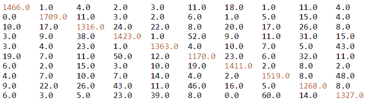**图 30：** 逻辑回归分类器生成的混淆矩阵

**步骤 8. 整体统计**

现在让我们计算整体统计数据来判断模型的性能：

```scala
val accuracy = metrics.accuracy
println("Summary Statistics")
println(s"Accuracy = $accuracy")
// Precision by label
val labels = metrics.labels
labels.foreach { l =>
  println(s"Precision($l) = " + metrics.precision(l))
}
// Recall by label
labels.foreach { l =>
  println(s"Recall($l) = " + metrics.recall(l))
}
// False positive rate by label
labels.foreach { l =>
  println(s"FPR($l) = " + metrics.falsePositiveRate(l))
}
// F-measure by label
labels.foreach { l =>
  println(s"F1-Score($l) = " + metrics.fMeasure(l))
}

```

前面的代码段产生了以下输出，包含一些性能指标，如准确度、精确度、召回率、真正率、假正率和 f1 分数：

```scala
Summary Statistics
 ----------------------
 Accuracy = 0.9203609775377116
 Precision(0.0) = 0.9606815203145478
 Precision(1.0) = 0.9595732734418866
 .
 .
 Precision(8.0) = 0.8942172073342737
 Precision(9.0) = 0.9027210884353741

 Recall(0.0) = 0.9638395792241946
 Recall(1.0) = 0.9732346241457859
 .
 .
 Recall(8.0) = 0.8720770288858322
 Recall(9.0) = 0.8936026936026936

 FPR(0.0) = 0.004392386530014641
 FPR(1.0) = 0.005363128491620112
 .
 .
 FPR(8.0) = 0.010927369417935456
 FPR(9.0) = 0.010441004672897197

 F1-Score(0.0) = 0.9622579586478502
 F1-Score(1.0) = 0.966355668645745
 .
 .
 F1-Score(9.0) = 0.8981387478849409

```

现在让我们计算整体统计数据，即总结统计数据：

```scala
println(s"Weighted precision: ${metrics.weightedPrecision}")
println(s"Weighted recall: ${metrics.weightedRecall}")
println(s"Weighted F1 score: ${metrics.weightedFMeasure}")
println(s"Weighted false positive rate: ${metrics.weightedFalsePositiveRate}") 

```

前面的代码段打印了包含加权精确度、召回率、f1 分数和假正率的以下输出：

```scala
Weighted precision: 0.920104303076327
 Weighted recall: 0.9203609775377117
 Weighted F1 score: 0.9201934861645358
 Weighted false positive rate: 0.008752250453215607

```

总体统计数据表明，模型的准确性超过 92%。然而，我们仍然可以通过使用更好的算法（如随机森林 RF）来改进。在下一节中，我们将看一下随机森林实现，以对同一模型进行分类。

# 使用随机森林提高分类准确性

随机森林（有时也称为随机决策森林）是决策树的集成。随机森林是分类和回归中最成功的机器学习模型之一。它们结合了许多决策树，以减少过拟合的风险。与决策树一样，随机森林处理分类特征，扩展到多类分类设置，不需要特征缩放，并且能够捕捉非线性和特征交互。RF 有许多优点。它们可以通过组合许多决策树来克服其训练数据集上的过拟合问题。

RF 或 RDF 中的森林通常由数十万棵树组成。这些树实际上是在同一训练集的不同部分上训练的。更技术上地说，生长得非常深的单个树往往会学习到高度不可预测的模式。树的这种性质会在训练集上产生过拟合问题。此外，低偏差使得分类器即使在特征质量良好的情况下也表现不佳。另一方面，RF 有助于通过计算案例之间的接近度将多个决策树平均在一起，以减少方差，以确保一致性。

然而，这会增加一些偏差或结果的可解释性的损失。但是，最终模型的性能会显著提高。在使用 RF 作为分类器时，以下是参数设置：

+   如果树的数量为 1，则根本不使用自举；但是，如果树的数量为*> 1*，则会进行自举。支持的值为`auto`、`all`、`sqrt`、`log2`和`onethird`。

+   支持的数值范围为*(0.0-1.0]*和*[1-n]*。但是，如果`featureSubsetStrategy`选择为`auto`，算法会自动选择最佳的特征子集策略。

+   如果`numTrees == 1`，则`featureSubsetStrategy`设置为`all`。但是，如果`numTrees > 1`（即森林），则`featureSubsetStrategy`设置为`sqrt`用于分类。

+   此外，如果在范围*(0, 1.0]*内设置了实际值*n*，将使用`n*number_of_features`。但是，如果在范围(1,特征数)内设置了整数值*n*，则只会交替使用`n`个特征。

+   `categoricalFeaturesInfo`参数是一个用于存储任意分类特征的映射。条目*(n -> k)*表示特征*n*是具有*k*个类别的分类特征，索引从*0: {0, 1,...,k-1}*。

+   仅用于信息增益计算的杂质标准。支持的值分别为*gini*和*variance*，用于分类和回归。

+   `maxDepth`是树的最大深度（例如，深度 0 表示 1 个叶节点，深度 1 表示 1 个内部节点+2 个叶节点，依此类推）。

+   `maxBins`表示用于分割特征的最大箱数，建议值为 100 以获得更好的结果。

+   最后，随机种子用于自举和选择特征子集，以避免结果的随机性。

如前所述，由于 RF 对大规模数据集的快速和可扩展性足够强，Spark 是实现 RF 以实现大规模可扩展性的合适技术。但是，如果计算了接近度，存储需求也会呈指数级增长。

# 使用随机森林对 MNIST 数据集进行分类

在本节中，我们将展示使用随机森林进行分类的示例。我们将逐步分解代码，以便您可以轻松理解解决方案。

**步骤 1. 加载和解析 LIVSVM 格式的 MNIST 数据集**

```scala
// Load training data in LIBSVM format.
 val data = MLUtils.loadLibSVMFile(spark.sparkContext, "data/mnist.bz2")

```

**步骤 2. 准备训练和测试集**

将数据分为训练集（75%）和测试集（25%），并设置种子以实现可重现性，如下所示：

```scala
val splits = data.randomSplit(Array(0.75, 0.25), seed = 12345L)
val training = splits(0).cache()
val test = splits(1)

```

**步骤 3. 运行训练算法来构建模型**

使用空的`categoricalFeaturesInfo`训练随机森林模型。这是必需的，因为数据集中的所有特征都是连续的：

```scala
val numClasses = 10 //number of classes in the MNIST dataset
val categoricalFeaturesInfo = Map[Int, Int]()
val numTrees = 50 // Use more in practice.More is better
val featureSubsetStrategy = "auto" // Let the algorithm choose.
val impurity = "gini" // see above notes on RandomForest for explanation
val maxDepth = 30 // More is better in practice
val maxBins = 32 // More is better in practice 
val model = RandomForest.trainClassifier(training, numClasses, categoricalFeaturesInfo, numTrees, featureSubsetStrategy, impurity, maxDepth, maxBins)

```

请注意，训练随机森林模型需要大量资源。因此，它将占用更多内存，所以要注意 OOM。我建议在运行此代码之前增加 Java 堆空间。

**步骤 4. 在测试集上计算原始分数**

在测试集上计算原始分数，以便我们可以使用上述性能指标评估模型，如下所示：

```scala
val scoreAndLabels = test.map { point =>
  val score = model.predict(point.features)
  (score, point.label)
}

```

**步骤 5. 实例化一个多类指标进行评估**

```scala
val metrics = new MulticlassMetrics(scoreAndLabels)

```

**步骤 6. 构建混淆矩阵**

```scala
println("Confusion matrix:")
println(metrics.confusionMatrix)

```

上述代码打印了我们分类的以下混淆矩阵：

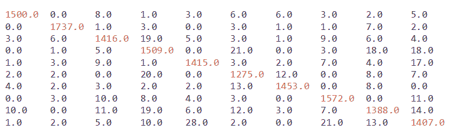**图 31：**由随机森林分类器生成的混淆矩阵

**步骤 7. 总体统计**

现在让我们计算总体统计数据，以评估模型的性能：

```scala
val accuracy = metrics.accuracy
println("Summary Statistics")
println(s"Accuracy = $accuracy")
// Precision by label
val labels = metrics.labels
labels.foreach { l =>
  println(s"Precision($l) = " + metrics.precision(l))
}
// Recall by label
labels.foreach { l =>
  println(s"Recall($l) = " + metrics.recall(l))
}
// False positive rate by label
labels.foreach { l =>
  println(s"FPR($l) = " + metrics.falsePositiveRate(l))
}
// F-measure by label
labels.foreach { l =>
  println(s"F1-Score($l) = " + metrics.fMeasure(l))
} 

```

上述代码段产生以下输出，包含一些性能指标，如准确度、精度、召回率、真正率、假正率和 F1 分数：

```scala
Summary Statistics:
 ------------------------------
 Precision(0.0) = 0.9861932938856016
 Precision(1.0) = 0.9891799544419134
 .
 .
 Precision(8.0) = 0.9546079779917469
 Precision(9.0) = 0.9474747474747475

 Recall(0.0) = 0.9778357235984355
 Recall(1.0) = 0.9897435897435898
 .
 .
 Recall(8.0) = 0.9442176870748299
 Recall(9.0) = 0.9449294828744124

 FPR(0.0) = 0.0015387997362057595
 FPR(1.0) = 0.0014151646059883808
 .
 .
 FPR(8.0) = 0.0048136532710962
 FPR(9.0) = 0.0056967572304995615

 F1-Score(0.0) = 0.9819967266775778
 F1-Score(1.0) = 0.9894616918256907
 .
 .
 F1-Score(8.0) = 0.9493844049247605
 F1-Score(9.0) = 0.9462004034969739

```

现在让我们计算总体统计数据，如下所示：

```scala
println(s"Weighted precision: ${metrics.weightedPrecision}")
println(s"Weighted recall: ${metrics.weightedRecall}")
println(s"Weighted F1 score: ${metrics.weightedFMeasure}")
println(s"Weighted false positive rate: ${metrics.weightedFalsePositiveRate}")
val testErr = labelAndPreds.filter(r => r._1 != r._2).count.toDouble / test.count()
println("Accuracy = " + (1-testErr) * 100 + " %")

```

上述代码段打印以下输出，包含加权精度、召回率、F1 分数和假正率：

```scala
Overall statistics
 ----------------------------
 Weighted precision: 0.966513107682512
 Weighted recall: 0.9664712469534286
 Weighted F1 score: 0.9664794711607312
 Weighted false positive rate: 0.003675328222679072
 Accuracy = 96.64712469534287 %

```

总体统计数据表明，模型的准确度超过 96%，比逻辑回归的准确度更高。但是，我们仍然可以通过更好的模型调整来改进它。

# 摘要

在本章中，我们简要介绍了这个主题，并掌握了简单但强大和常见的机器学习技术。最后，您学会了如何使用 Spark 构建自己的预测模型。您学会了如何构建分类模型，如何使用模型进行预测，最后，如何使用常见的机器学习技术，如降维和独热编码。

在后面的部分，您看到了如何将回归技术应用于高维数据集。然后，您看到了如何应用二元和多类分类算法进行预测分析。最后，您看到了如何使用随机森林算法实现出色的分类准确性。然而，我们还有其他机器学习的主题需要涵盖，例如推荐系统和模型调优，以获得更稳定的性能，然后再部署模型。

在下一章中，我们将涵盖一些 Spark 的高级主题。我们将提供机器学习模型调优的示例，以获得更好的性能，我们还将分别介绍电影推荐和文本聚类的两个示例。
