# 第十二章：高级机器学习最佳实践

“超参数优化或模型选择是选择学习算法的一组超参数[何时定义为？]的问题，通常目标是优化算法在独立数据集上的性能度量。”

- 机器学习模型调整报价

在本章中，我们将提供一些关于使用 Spark 进行机器学习（ML）的一些高级主题的理论和实践方面。我们将看到如何使用网格搜索、交叉验证和超参数调整来调整机器学习模型，以获得更好和优化的性能。在后面的部分，我们将介绍如何使用 ALS 开发可扩展的推荐系统，这是一个基于模型的推荐算法的示例。最后，将演示一种文本聚类技术作为主题建模应用。

简而言之，本章中我们将涵盖以下主题：

+   机器学习最佳实践

+   ML 模型的超参数调整

+   使用潜在狄利克雷分配（LDA）进行主题建模

+   使用协同过滤的推荐系统

# 机器学习最佳实践

有时，建议考虑错误率而不仅仅是准确性。例如，假设一个 ML 系统的准确率为 99%，错误率为 50%，比一个准确率为 90%，错误率为 25%的系统更差。到目前为止，我们已经讨论了以下机器学习主题：

+   **回归**：用于预测线性可分离的值

+   **异常检测**：用于发现异常数据点，通常使用聚类算法进行

+   **聚类**：用于发现数据集中同质数据点的隐藏结构

+   **二元分类**：用于预测两个类别

+   **多类分类**：用于预测三个或更多类别

好吧，我们也看到了一些适合这些任务的好算法。然而，选择适合您问题类型的正确算法是实现 ML 算法更高和更出色准确性的棘手任务。为此，我们需要通过从数据收集、特征工程、模型构建、评估、调整和部署的阶段采用一些良好的实践。考虑到这些，在本节中，我们将在使用 Spark 开发 ML 应用程序时提供一些建议。

# 注意过拟合和欠拟合

一条直线穿过一个弯曲的散点图将是欠拟合的一个很好的例子，正如我们在这里的图表中所看到的。然而，如果线条过于贴合数据，就会出现一个相反的问题，称为**过拟合**。当我们说一个模型过拟合了数据集，我们的意思是它可能在训练数据上有低错误率，但在整体数据中不能很好地泛化。

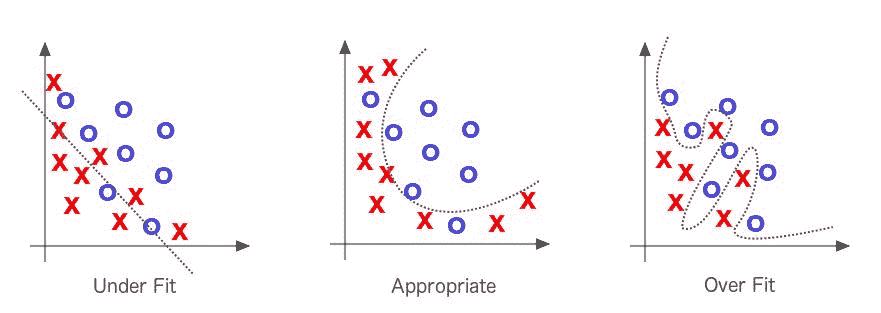**图 1**：过拟合-欠拟合权衡（来源：亚当吉布森，乔什帕特森的书《深度学习》）

更具体地说，如果您在训练数据上评估模型而不是测试或验证数据，您可能无法确定您的模型是否过拟合。常见的症状如下：

+   用于训练的数据的预测准确性可能过于准确（即有时甚至达到 100%）。

+   与随机预测相比，模型可能在新数据上表现更好。

+   我们喜欢将数据集拟合到分布中，因为如果数据集与分布相当接近，我们可以基于理论分布对我们如何处理数据进行假设。因此，数据中的正态分布使我们能够假设在指定条件下统计的抽样分布是正态分布的。正态分布由其均值和标准差定义，并且在所有变化中通常具有相同的形状。

**图 2**：数据中的正态分布有助于克服过度拟合和拟合不足（来源：Adam Gibson、Josh Patterson 的《深度学习》一书）

有时，ML 模型本身对特定调整或数据点拟合不足，这意味着模型变得过于简单。我们的建议（我们相信其他人也是如此）如下：

+   将数据集分为两组以检测过度拟合情况——第一组用于训练和模型选择的训练集，第二组是用于评估模型的测试集，开始替代 ML 工作流程部分。

+   或者，您还可以通过使用更简单的模型（例如，线性分类器而不是高斯核 SVM）或增加 ML 模型的正则化参数（如果可用）来避免过度拟合。

+   调整模型的正确数据值参数，以避免过度拟合和拟合不足。

+   因此，解决拟合不足是首要任务，但大多数机器学习从业者建议花更多时间和精力尝试不要过度拟合数据。另一方面，许多机器学习从业者建议将大规模数据集分为三组：训练集（50%）、验证集（25%）和测试集（25%）。他们还建议使用训练集构建模型，并使用验证集计算预测误差。测试集被推荐用于评估最终模型的泛化误差。然而，在监督学习期间，如果可用的标记数据量较小，则不建议拆分数据集。在这种情况下，使用交叉验证。更具体地说，将数据集分为大致相等的 10 个部分；然后，对这 10 个部分中的每一个，迭代训练分类器，并使用第 10 个部分来测试模型。

# 请继续关注 Spark MLlib 和 Spark ML

管道设计的第一步是创建构件块（作为由节点和边组成的有向或无向图），并在这些块之间建立联系。然而，作为一名数据科学家，您还应该专注于扩展和优化节点（原语），以便在后期处理大规模数据集时能够扩展应用程序，使您的 ML 管道能够持续执行。管道过程还将帮助您使模型适应新数据集。然而，其中一些原语可能会明确定义为特定领域和数据类型（例如文本、图像和视频、音频和时空）。

除了这些类型的数据之外，原语还应该适用于通用领域统计或数学。将您的 ML 模型转换为这些原语将使您的工作流程更加透明、可解释、可访问和可解释。

最近的一个例子是 ML-matrix，它是一个可以在 Spark 之上使用的分布式矩阵库。请参阅[JIRA 问题](https://issues.apache.org/jira/browse/SPARK-3434)。

**图 3**：保持关注并相互操作 ML 和 MLlib

正如我们在前一节中已经提到的，作为开发人员，您可以无缝地将 Spark MLlib 中的实现技术与 Spark ML、Spark SQL、GraphX 和 Spark Streaming 中开发的算法结合起来，作为 RDD、DataFrame 和数据集的混合或可互操作的 ML 应用程序，如*图 3*所示。因此，这里的建议是与您周围的最新技术保持同步，以改善您的 ML 应用程序。

# 为您的应用程序选择正确的算法

“我应该使用什么机器学习算法？”是一个非常常见的问题，但答案总是“这取决于”。更详细地说：

+   这取决于你要测试/使用的数据的数量、质量、复杂性和性质

+   这取决于外部环境和参数，比如你的计算系统配置或基础设施

+   这取决于你想要用答案做什么

+   这取决于算法的数学和统计公式如何被转化为计算机的机器指令

+   这取决于你有多少时间

事实上，即使是最有经验的数据科学家或数据工程师在尝试所有算法之前也无法直接推荐哪种机器学习算法会表现最好。大多数同意/不同意的陈述都以“这取决于...嗯...”开始。习惯上，你可能会想知道是否有机器学习算法的备忘单，如果有的话，你应该如何使用？一些数据科学家表示，找到最佳算法的唯一方法是尝试所有算法；因此，没有捷径！让我们更清楚地说明一下；假设你有一组数据，你想做一些聚类。从技术上讲，如果你的数据有标签，这可能是一个分类或回归问题。然而，如果你有一个无标签的数据集，你将使用聚类技术。现在，你脑海中出现的问题如下：

+   在选择适当的算法之前，我应该考虑哪些因素？还是应该随机选择一个算法？

+   我如何选择适用于我的数据的任何数据预处理算法或工具？

+   我应该使用什么样的特征工程技术来提取有用的特征？

+   什么因素可以提高我的机器学习模型的性能？

+   我如何适应新的数据类型？

+   我能否扩展我的机器学习应用以处理大规模数据集？等等。

在本节中，我们将尝试用我们有限的机器学习知识来回答这些问题。

# 选择算法时的考虑因素

我们在这里提供的建议或建议是给那些刚开始学习机器学习的新手数据科学家。这些对于试图选择一个最佳算法来开始使用 Spark ML API 的专家数据科学家也会有用。不用担心，我们会指导你的方向！我们还建议在选择算法时考虑以下算法属性：

+   **准确性**：是否达到最佳分数是目标，还是在精确度、召回率、f1 分数或 AUC 等方面进行权衡，得到一个近似解（足够好），同时避免过拟合。

+   **训练时间**：训练模型的可用时间（包括模型构建、评估和训练时间）。

+   **线性度**：模型复杂性的一个方面，涉及问题建模的方式。由于大多数非线性模型通常更复杂，难以理解和调整。

+   **参数数量**

+   **特征数量**：拥有的属性比实例多的问题，即*p>>n*问题。这通常需要专门处理或使用降维或更好的特征工程方法。

# 准确性

从你的机器学习应用中获得最准确的结果并非总是必不可少的。根据你想要使用它的情况，有时近似解就足够了。如果情况是这样的，你可以通过采用更好的估计方法大大减少处理时间。当你熟悉了 Spark 机器学习 API 的工作流程后，你将享受到更多的近似方法的优势，因为这些近似方法将自动避免你的机器学习模型的过拟合问题。现在，假设你有两个二元分类算法的表现如下：

| **分类器** | **精确度** | **召回率** |
| --- | --- | --- |
| X | 96% | 89% |
| Y | 99% | 84% |

在这里，没有一个分类器显然优于其他分类器，因此它不会立即指导您选择最佳的分类器。F1 分数是精确度和召回率的调和平均值，它可以帮助您。让我们计算一下，并将其放在表中：

| **分类器** | **精度** | **召回率** | **F1 分数** |
| --- | --- | --- | --- |
| X | 96% | 89% | 92.36% |
| Y | 99% | 84% | 90.885% |

因此，具有 F1 分数有助于从大量分类器中进行选择。它为所有分类器提供了清晰的偏好排序，因此也为进展提供了明确的方向--即分类器**X**。

# 训练时间

训练时间通常与模型训练和准确性密切相关。此外，通常您会发现，与其他算法相比，有些算法对数据点的数量更加难以捉摸。然而，当您的时间不足但训练集又很大且具有许多特征时，您可以选择最简单的算法。在这种情况下，您可能需要牺牲准确性。但至少它将满足您的最低要求。

# 线性

最近开发了许多利用线性的机器学习算法（也可在 Spark MLlib 和 Spark ML 中使用）。例如，线性分类算法假设类别可以通过绘制不同的直线或使用高维等价物来分离。另一方面，线性回归算法假设数据趋势简单地遵循一条直线。对于一些机器学习问题，这种假设并不天真；然而，在某些其他情况下，准确性可能会下降。尽管存在危险，线性算法在数据工程师和数据科学家中非常受欢迎，作为爆发的第一线。此外，这些算法还倾向于简单和快速，以在整个过程中训练您的模型。

# 在选择算法时检查您的数据

您将在 UC Irvine 机器学习库中找到许多机器学习数据集。以下数据属性也应该优先考虑：

+   参数数量

+   特征数量

+   训练数据集的大小

# 参数数量

参数或数据属性是数据科学家在设置算法时的抓手。它们是影响算法性能的数字，如误差容限或迭代次数，或者是算法行为变体之间的选项。算法的训练时间和准确性有时可能非常敏感，这使得难以找到正确的设置。通常，具有大量参数的算法需要更多的试错来找到最佳组合。

尽管这是跨越参数空间的一个很好的方法，但随着参数数量的增加，模型构建或训练时间呈指数增长。这既是一个困境，也是一个时间性能的权衡。积极的方面是：

+   具有许多参数特征性地表明了 ML 算法的更大灵活性

+   您的 ML 应用程序实现了更高的准确性

# 你的训练集有多大？

如果您的训练集较小，具有低方差的高偏差分类器，如朴素贝叶斯，比具有高方差的低偏差分类器（也可用于回归）如**k 最近邻算法**（**kNN**）更有优势。

**偏差、方差和 kNN 模型：**实际上，*增加 k*会*减少方差*，但会*增加偏差*。另一方面，*减少 k*会*增加方差*，*减少偏差*。随着*k*的增加，这种变异性减少。但如果我们增加*k*太多，那么我们就不再遵循真实的边界线，我们会观察到高偏差。这就是偏差-方差权衡的本质。

我们已经看到了过拟合和欠拟合的问题。现在，可以假设处理偏差和方差就像处理过拟合和欠拟合一样。随着模型复杂性的增加，偏差减小，方差增加。随着模型中添加更多参数，模型的复杂性增加，方差成为我们关注的主要问题，而偏差稳步下降。换句话说，偏差对模型复杂性的响应具有负的一阶导数，而方差具有正的斜率。请参考以下图表以更好地理解：

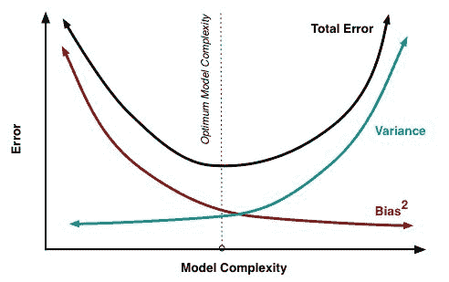**图 4：** 偏差和方差对总误差的影响

因此，后者会过拟合。但是低偏差高方差的分类器，在训练集线性或指数增长时，开始获胜，因为它们具有更低的渐近误差。高偏差分类器不足以提供准确的模型。

# 特征数

对于某些类型的实验数据集，提取的特征数量可能与数据点本身的数量相比非常大。这在基因组学、生物医学或文本数据中经常发生。大量的特征可能会淹没一些学习算法，使训练时间变得非常长。**支持向量机**（**SVM**）特别适用于这种情况，因为它具有高准确性，对过拟合有良好的理论保证，并且具有适当的核函数。

**支持向量机和核函数：** 任务是找到一组权重和偏差，使间隔最大化函数：

y = w*¥(x) +b,

其中*w*是权重，*¥*是特征向量，*b*是偏差。现在如果*y> 0*，那么我们将数据分类到类*1*，否则到类*0*，而特征向量*¥(x)*使数据线性可分。然而，使用核函数可以使计算过程更快、更容易，特别是当特征向量*¥*包含非常高维的数据时。让我们看一个具体的例子。假设我们有以下值*x*和*y*：*x = (x1, x2, x3)*和*y = (y1, y2, y3)*，那么对于函数*f(x) = (x1x1, x1x2, x1x3, x2x1, x2x2, x2x3, x3x1, x3x2, x3x3)*，核函数是*K(x, y ) = (<x, y>)²*。根据上述，如果*x* *= (1, 2, 3)*和*y = (4, 5, 6)*，那么我们有以下值：

f(x) = (1, 2, 3, 2, 4, 6, 3, 6, 9)

f(y) = (16, 20, 24, 20, 25, 30, 24, 30, 36)

<f(x), f(y)> = 16 + 40 + 72 + 40 + 100+ 180 + 72 + 180 + 324 = 1024

这是一个简单的线性代数，将一个 3 维空间映射到一个 9 维空间。另一方面，核函数是用于支持向量机的相似性度量。因此，建议根据对不变性的先验知识选择适当的核值。核和正则化参数的选择可以通过优化基于交叉验证的模型选择来自动化。

然而，自动选择核和核参数是一个棘手的问题，因为很容易过度拟合模型选择标准。这可能导致比开始时更糟糕的模型。现在，如果我们使用核函数*K(x, y)*，这将给出相同的值，但计算更简单 - 即(4 + 10 + 18) ² = 32² = 1024。

# 机器学习模型的超参数调整

调整算法只是一个过程，通过这个过程，使算法在运行时间和内存使用方面表现最佳。在贝叶斯统计中，超参数是先验分布的参数。在机器学习方面，超参数指的是那些不能直接从常规训练过程中学习到的参数。超参数通常在实际训练过程开始之前固定。这是通过为这些超参数设置不同的值，训练不同的模型，并通过测试来决定哪些模型效果最好来完成的。以下是一些典型的超参数示例：

+   叶子节点数、箱数或树的深度

+   迭代次数

+   矩阵分解中的潜在因子数量

+   学习率

+   深度神经网络中的隐藏层数量

+   k 均值聚类中的簇数量等。

在本节中，我们将讨论如何使用交叉验证技术和网格搜索进行超参数调整。

# 超参数调整

超参数调整是一种根据呈现数据的性能选择正确的超参数组合的技术。这是从实践中获得机器学习算法的有意义和准确结果的基本要求之一。下图显示了模型调整过程、考虑因素和工作流程：

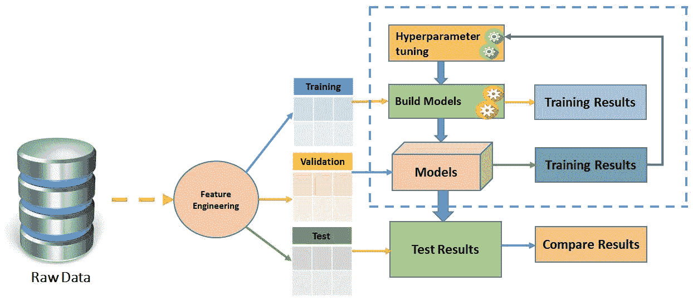**图 5**：模型调整过程、考虑因素和工作流程

例如，假设我们有两个要为管道调整的超参数，该管道在第十一章中的*图 17*中呈现，使用逻辑回归估计器的 Spark ML 管道模型（虚线只会在管道拟合期间出现）。我们可以看到我们为每个参数放置了三个候选值。因此，总共会有九种组合。但是，在图中只显示了四种，即 Tokenizer、HashingTF、Transformer 和 Logistic Regression（LR）。现在，我们要找到最终会导致具有最佳评估结果的模型。拟合的模型包括 Tokenizer、HashingTF 特征提取器和拟合的逻辑回归模型：

如果您回忆起第十一章中的*图 17*，*学习机器学习 - Spark MLlib 和 Spark ML*，虚线只会在管道拟合期间出现。正如前面提到的，拟合的管道模型是一个 Transformer。Transformer 可用于预测、模型验证和模型检查。此外，我们还认为 ML 算法的一个不幸的特点是，它们通常有许多需要调整以获得更好性能的超参数。例如，这些超参数中的正则化程度与 Spark MLlib 优化的模型参数有所不同。

因此，如果没有对数据和要使用的算法的专业知识，很难猜测或衡量最佳超参数组合。由于复杂数据集基于 ML 问题类型，管道的大小和超参数的数量可能会呈指数级增长（或线性增长）；即使对于 ML 专家来说，超参数调整也会变得繁琐，更不用说调整参数的结果可能会变得不可靠。

根据 Spark API 文档，用于指定 Spark ML 估计器和 Transformer 的是一个独特且统一的 API。`ParamMap`是一组(参数，值)对，其中 Param 是由 Spark 提供的具有自包含文档的命名参数。从技术上讲，有两种方法可以将参数传递给算法，如下所示：

+   **设置参数**：如果 LR 是逻辑回归的实例（即估计器），则可以调用`setMaxIter()`方法，如下所示：`LR.setMaxIter(5)`。它基本上将模型拟合到回归实例，如下所示：`LR.fit()`。在这个特定的例子中，最多会有五次迭代。

+   **第二个选项**：这涉及将`ParamMaps`传递给`fit()`或`transform()`（有关详细信息，请参见*图 5*）。在这种情况下，任何参数都将被先前通过 ML 应用程序特定代码或算法中的 setter 方法指定的`ParamMaps`覆盖。

# 网格搜索参数调整

假设您在必要的特征工程之后选择了您的超参数。在这方面，对超参数和特征空间进行完整的网格搜索计算量太大。因此，您需要执行 K 折交叉验证的折叠，而不是进行完整的网格搜索：

+   在折叠的训练集上使用交叉验证来调整所需的超参数，使用所有可用的特征

+   使用这些超参数选择所需的特征

+   对 K 中的每个折叠重复计算

+   最终模型是使用从每个 CV 折叠中选择的 N 个最常见特征构建的所有数据

有趣的是，超参数也将在交叉验证循环中再次进行调整。与完整的网格搜索相比，这种方法会有很大的不利因素吗？实质上，我在每个自由参数的维度上进行线性搜索（找到一个维度中的最佳值，将其保持恒定，然后找到下一个维度中的最佳值），而不是每个参数设置的所有组合。沿着单个参数搜索而不是一起优化它们的最重要的不利因素是，您忽略了相互作用。

例如，很常见的是，不止一个参数影响模型复杂性。在这种情况下，您需要查看它们的相互作用，以成功地优化超参数。根据您的数据集有多大以及您比较了多少个模型，返回最大观察性能的优化策略可能会遇到麻烦（这对网格搜索和您的策略都是如此）。

原因是在大量性能估计中寻找最大值会削弱性能估计的方差：您可能最终只得到一个模型和训练/测试分割组合，碰巧看起来不错。更糟糕的是，您可能会得到几个看起来完美的组合，然后优化无法知道选择哪个模型，因此变得不稳定。

# 交叉验证

交叉验证（也称为**旋转估计**（**RE**））是一种模型验证技术，用于评估统计分析和结果的质量。目标是使模型向独立测试集泛化。交叉验证技术的一个完美用途是从机器学习模型中进行预测。如果您想要估计在实践中部署为 ML 应用时预测模型的准确性，这将有所帮助。在交叉验证过程中，模型通常是使用已知类型的数据集进行训练的。相反，它是使用未知类型的数据集进行测试的。

在这方面，交叉验证有助于描述数据集，以便在训练阶段使用验证集测试模型。有两种类型的交叉验证，可以如下分类：

+   **穷举交叉验证**：这包括留 p-out 交叉验证和留一出交叉验证。

+   **非穷尽交叉验证**：这包括 K 折交叉验证和重复随机子采样交叉验证。

在大多数情况下，研究人员/数据科学家/数据工程师使用 10 折交叉验证，而不是在验证集上进行测试。这是最广泛使用的交叉验证技术，如下图所示：

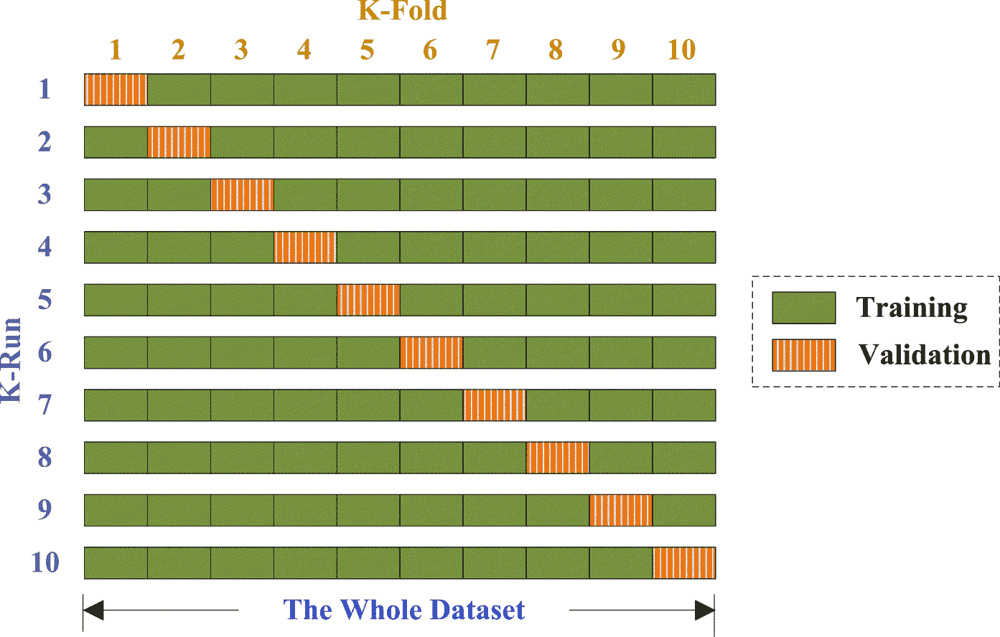**图 6：**交叉验证基本上将您的完整可用训练数据分成多个折叠。可以指定此参数。然后，整个流程对每个折叠运行一次，并为每个折叠训练一个机器学习模型。最后，通过分类器的投票方案或回归的平均值将获得的不同机器学习模型结合起来

此外，为了减少变异性，使用不同分区进行多次交叉验证迭代；最后，将验证结果在各轮上进行平均。下图显示了使用逻辑回归进行超参数调整的示例：

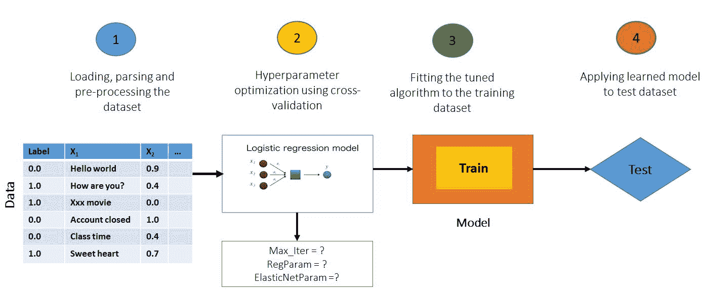**图 7：**使用逻辑回归进行超参数调整的示例

使用交叉验证而不是传统验证有以下两个主要优点：

+   首先，如果没有足够的数据可用于在单独的训练和测试集之间进行分区，就有可能失去重要的建模或测试能力。

+   其次，K 折交叉验证估计器的方差低于单个留出集估计器。这种低方差限制了变异性，如果可用数据量有限，这也是非常重要的。

在这些情况下，一个公平的方法来正确估计模型预测和相关性能是使用交叉验证作为模型选择和验证的强大通用技术。如果我们需要对模型调整进行手动特征和参数选择，然后，我们可以在整个数据集上进行 10 折交叉验证的模型评估。什么是最佳策略？我们建议您选择提供乐观分数的策略如下：

+   将数据集分为训练集（80%）和测试集（20%）或您选择的其他比例

+   在训练集上使用 K 折交叉验证来调整您的模型

+   重复 CV，直到找到优化并调整您的模型。

现在，使用您的模型在测试集上进行预测，以获得模型外误差的估计。

# 信用风险分析-超参数调整的一个例子

在本节中，我们将展示一个实际的机器学习超参数调整的示例，涉及网格搜索和交叉验证技术。更具体地说，首先，我们将开发一个信用风险管道，这在金融机构如银行和信用合作社中常用。随后，我们将看看如何通过超参数调整来提高预测准确性。在深入示例之前，让我们快速概述一下信用风险分析是什么，以及为什么它很重要？

# 什么是信用风险分析？为什么它很重要？

当申请人申请贷款并且银行收到该申请时，根据申请人的资料，银行必须决定是否批准贷款申请。在这方面，银行对贷款申请的决定存在两种风险：

+   **申请人是一个良好的信用风险**：这意味着客户或申请人更有可能偿还贷款。然后，如果贷款未获批准，银行可能会遭受业务损失。

+   **申请人是一个不良的信用风险**：这意味着客户或申请人很可能不会偿还贷款。在这种情况下，向客户批准贷款将导致银行的财务损失。

该机构表示第二个风险比第一个更高，因为银行有更高的机会无法收回借款金额。因此，大多数银行或信用合作社评估向客户、申请人或顾客放贷所涉及的风险。在业务分析中，最小化风险往往会最大化银行自身的利润。

换句话说，从财务角度来看，最大化利润和最小化损失是重要的。通常，银行根据申请人的不同因素和参数，如贷款申请的人口统计和社会经济状况，来决定是否批准贷款申请。

# 数据集探索

德国信用数据集是从 UCI 机器学习库[`archive.ics.uci.edu/ml/machine-learning-databases/statlog/german/`](https://archive.ics.uci.edu/ml/machine-learning-databases/statlog/german/)下载的。尽管链接中提供了数据集的详细描述，但我们在**表 3**中提供了一些简要的见解。数据包含 21 个变量的与信用相关的数据，以及对于 1000 个贷款申请人是否被认为是良好还是不良的信用风险的分类（即二元分类问题）。

以下表格显示了在将数据集提供在线之前考虑的每个变量的详细信息：

| **条目** | **变量** | **解释** |
| --- | --- | --- |
| 1 | creditability | 有能力偿还：值为 1.0 或 0.0 |
| 2 | balance | 当前余额 |
| 3 | duration | 申请贷款的期限 |
| 4 | history | 是否有不良贷款历史？ |
| 5 | purpose | 贷款目的 |
| 6 | amount | 申请金额 |
| 7 | savings | 每月储蓄 |
| 8 | employment | 就业状况 |
| 9 | instPercent | 利息百分比 |
| 10 | sexMarried | 性别和婚姻状况 |
| 11 | guarantors | 是否有担保人？ |
| 12 | residenceDuration | 目前地址的居住时间 |
| 13 | assets | 净资产 |
| 14 | age | 申请人年龄 |
| 15 | concCredit | 并发信用 |
| 16 | apartment | 住房状况 |
| 17 | credits | 当前信用 |
| 18 | occupation | 职业 |
| 19 | dependents | 受抚养人数 |
| 20 | hasPhone | 申请人是否使用电话 |
| 21 | foreign | 申请人是否是外国人 |

请注意，尽管*表 3*描述了具有相关标题的变量，但数据集中没有相关标题。在*表 3*中，我们展示了每个变量的变量、位置和相关重要性。

# 使用 Spark ML 的逐步示例

在这里，我们将提供使用随机森林分类器进行信用风险预测的逐步示例。步骤包括数据摄入、一些统计分析、训练集准备，最后是模型评估：

**步骤 1.** 加载并解析数据集为 RDD：

```scala
val creditRDD = parseRDD(sc.textFile("data/germancredit.csv")).map(parseCredit) 

```

对于前一行，`parseRDD()`方法用于使用`,`拆分条目，然后将它们全部转换为`Double`值（即数值）。该方法如下：

```scala
def parseRDD(rdd: RDD[String]): RDD[Array[Double]] = { 
rdd.map(_.split(",")).map(_.map(_.toDouble)) 
  } 

```

另一方面，`parseCredit()`方法用于基于`Credit` case 类解析数据集：

```scala
def parseCredit(line: Array[Double]): Credit = { 
Credit( 
line(0), line(1) - 1, line(2), line(3), line(4), line(5), 
line(6) - 1, line(7) - 1, line(8), line(9) - 1, line(10) - 1, 
line(11) - 1, line(12) - 1, line(13), line(14) - 1, line(15) - 1, 
line(16) - 1, line(17) - 1, line(18) - 1, line(19) - 1, line(20) - 1) 
  } 

```

`Credit` case 类如下所示：

```scala
case class Credit( 
creditability: Double, 
balance: Double, duration: Double, history: Double, purpose: Double, amount: Double, 
savings: Double, employment: Double, instPercent: Double, sexMarried: Double, guarantors: Double, 
residenceDuration: Double, assets: Double, age: Double, concCredit: Double, apartment: Double, 
credits: Double, occupation: Double, dependents: Double, hasPhone: Double, foreign: Double) 

```

**步骤 2.准备 ML 管道的 DataFrame** - 获取 ML 管道的 DataFrame

```scala
val sqlContext = new SQLContext(sc) 
import sqlContext._ 
import sqlContext.implicits._ 
val creditDF = creditRDD.toDF().cache() 

```

将它们保存为临时视图，以便更容易进行查询：

```scala
creditDF.createOrReplaceTempView("credit") 

```

让我们来看一下 DataFrame 的快照：

```scala
creditDF.show

```

前面的`show()`方法打印了信用 DataFrame：

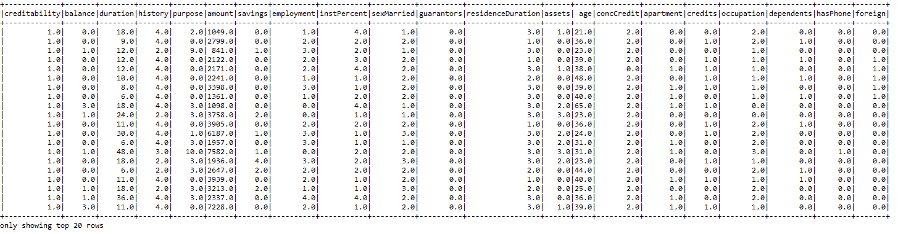**图 8：**信用数据集的快照

**步骤 3.观察相关统计数据** - 首先，让我们看一些聚合值：

```scala
sqlContext.sql("SELECT creditability, avg(balance) as avgbalance, avg(amount) as avgamt, avg(duration) as avgdur  FROM credit GROUP BY creditability ").show 

```

让我们看一下余额的统计信息：

```scala
creditDF.describe("balance").show 

```

现在，让我们看一下平均余额的信用性：

```scala
creditDF.groupBy("creditability").avg("balance").show 

```

三行的输出：

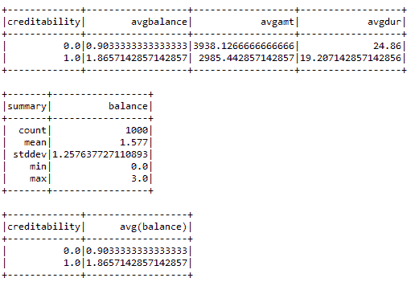**图 9：**数据集的一些统计信息

**步骤 4.特征向量和标签的创建** - 如您所见，可信度列是响应列，为了得到结果，我们需要创建不考虑此列的特征向量。现在，让我们创建特征列如下：

```scala
val featureCols = Array("balance", "duration", "history", "purpose", "amount", "savings", "employment", "instPercent", "sexMarried",
"guarantors", "residenceDuration", "assets", "age", "concCredit",
"apartment", "credits", "occupation", "dependents", "hasPhone",
"foreign") 

```

让我们使用`VectorAssembler()` API 组装这些选定列的所有特征：

```scala
val assembler = new VectorAssembler().setInputCols(featureCols).setOutputCol("features") 
val df2 = assembler.transform(creditDF) 

```

现在让我们看一下特征向量的样子：

```scala
df2.select("features").show

```

前一行显示了由 VectorAssembler 转换器创建的特征：

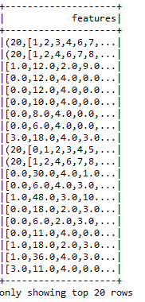**图 10：**使用 VectorAssembler 为 ML 模型生成特征

现在，让我们使用`StringIndexer`从旧的响应列 creditability 创建一个新的标签列，如下所示：

```scala
val labelIndexer = new StringIndexer().setInputCol("creditability").setOutputCol("label") 
val df3 = labelIndexer.fit(df2).transform(df2) 
df3.select("label", "features").show

```

前一行显示了`VectorAssembler`转换器创建的特征和标签：

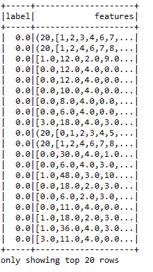**图 11：** 使用 VectorAssembler 的 ML 模型的相应标签和特征

**步骤 5.** 准备训练集和测试集：

```scala
val splitSeed = 5043 
val Array(trainingData, testData) = df3.randomSplit(Array(0.80, 0.20), splitSeed) 

```

**步骤 6. 训练随机森林模型** - 首先，实例化模型：

```scala
val classifier = new RandomForestClassifier() 
      .setImpurity("gini") 
      .setMaxDepth(30) 
      .setNumTrees(30) 
      .setFeatureSubsetStrategy("auto") 
      .setSeed(1234567) 
      .setMaxBins(40) 
      .setMinInfoGain(0.001) 

```

有关上述参数的解释，请参阅本章中的随机森林算法部分。现在，让我们使用训练集训练模型：

```scala
val model = classifier.fit(trainingData)

```

**步骤 7.** 计算测试集的原始预测：

```scala
val predictions = model.transform(testData) 

```

让我们看看这个 DataFrame 的前 20 行：

```scala
predictions.select("label","rawPrediction", "probability", "prediction").show()

```

前一行显示了包含标签、原始预测、概率和实际预测的 DataFrame：

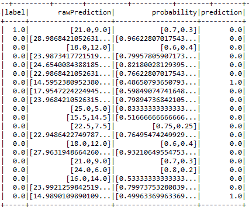**图 12：** 包含测试集的原始和实际预测的 DataFrame

现在，在看到最后一列的预测之后，银行可以对申请做出决定，决定是否接受申请。

**步骤 8. 模型调优前的模型评估** - 实例化二元评估器：

```scala
val binaryClassificationEvaluator = new BinaryClassificationEvaluator() 
      .setLabelCol("label") 
      .setRawPredictionCol("rawPrediction") 

```

计算测试集的预测准确率如下：

```scala
val accuracy = binaryClassificationEvaluator.evaluate(predictions) 
println("The accuracy before pipeline fitting: " + accuracy) 

```

管道拟合前的准确率：`0.751921784149243`

这一次，准确率是 75%，并不是很好。让我们计算二元分类器的其他重要性能指标，比如**接收器操作特征下面积**（**AUROC**）和**精确度召回曲线下面积**（**AUPRC**）：

```scala
println("Area Under ROC before tuning: " + printlnMetric("areaUnderROC"))         
println("Area Under PRC before tuning: "+  printlnMetric("areaUnderPR")) 
Area Under ROC before tuning: 0.8453079178885631 Area Under PRC before tuning: 0.751921784149243

```

`printlnMetric()` 方法如下：

```scala
def printlnMetric(metricName: String): Double = { 
  val metrics = binaryClassificationEvaluator.setMetricName(metricName)
                                             .evaluate(predictions) 
  metrics 
} 

```

最后，让我们使用训练过程中使用的随机森林模型的`RegressionMetrics()` API 计算一些额外的性能指标：

```scala
val rm = new RegressionMetrics( 
predictions.select("prediction", "label").rdd.map(x => 
        (x(0).asInstanceOf[Double], x(1).asInstanceOf[Double]))) 

```

现在，让我们看看我们的模型如何：

```scala
println("MSE: " + rm.meanSquaredError) 
println("MAE: " + rm.meanAbsoluteError) 
println("RMSE Squared: " + rm.rootMeanSquaredError) 
println("R Squared: " + rm.r2) 
println("Explained Variance: " + rm.explainedVariance + "\n") 

```

我们得到以下输出：

```scala
MSE: 0.2578947368421053
MAE: 0.2578947368421053
RMSE Squared: 0.5078333750770082
R Squared: -0.13758553274682295
Explained Variance: 0.16083102493074794

```

不算太糟！但也不尽如人意，对吧？让我们使用网格搜索和交叉验证技术调优模型。

**步骤 9. 使用网格搜索和交叉验证进行模型调优** - 首先，让我们使用`ParamGridBuilder` API 构建一个参数网格，搜索 20 到 70 棵树，`maxBins`在 25 到 30 之间，`maxDepth`在 5 到 10 之间，以及熵和基尼作为不纯度：

```scala
val paramGrid = new ParamGridBuilder()
                    .addGrid(classifier.maxBins, Array(25, 30))
                    .addGrid(classifier.maxDepth, Array(5, 10))
                    .addGrid(classifier.numTrees, Array(20, 70))
                    .addGrid(classifier.impurity, Array("entropy", "gini"))
                    .build()

```

让我们使用训练集训练交叉验证模型：

```scala
val cv = new CrossValidator()
             .setEstimator(pipeline)
             .setEvaluator(binaryClassificationEvaluator)
             .setEstimatorParamMaps(paramGrid)
             .setNumFolds(10)
val pipelineFittedModel = cv.fit(trainingData)

```

按以下方式计算测试集的原始预测：

```scala
val predictions2 = pipelineFittedModel.transform(testData) 

```

**步骤 10. 调优后模型的评估** - 让我们看看准确率：

```scala
val accuracy2 = binaryClassificationEvaluator.evaluate(predictions2)
println("The accuracy after pipeline fitting: " + accuracy2)

```

我们得到以下输出：

```scala
The accuracy after pipeline fitting: 0.8313782991202348

```

现在，准确率超过 83%。确实有很大的改进！让我们看看计算 AUROC 和 AUPRC 的另外两个指标：

```scala
def printlnMetricAfter(metricName: String): Double = { 
val metrics = binaryClassificationEvaluator.setMetricName(metricName).evaluate(predictions2) 
metrics 
    } 
println("Area Under ROC after tuning: " + printlnMetricAfter("areaUnderROC"))     
println("Area Under PRC after tuning: "+  printlnMetricAfter("areaUnderPR"))

```

我们得到以下输出：

```scala
Area Under ROC after tuning: 0.8313782991202345
 Area Under PRC after tuning: 0.7460301367852662

```

现在基于`RegressionMetrics` API，计算其他指标：

```scala
val rm2 = new RegressionMetrics(predictions2.select("prediction", "label").rdd.map(x => (x(0).asInstanceOf[Double], x(1).asInstanceOf[Double]))) 
 println("MSE: " + rm2.meanSquaredError) 
println("MAE: " + rm2.meanAbsoluteError) 
println("RMSE Squared: " + rm2.rootMeanSquaredError) 
println("R Squared: " + rm2.r2) 
println("Explained Variance: " + rm2.explainedVariance + "\n")  

```

我们得到以下输出：

```scala
MSE: 0.268421052631579
 MAE: 0.26842105263157895
 RMSE Squared: 0.5180936716768301
 R Squared: -0.18401759530791795
 Explained Variance: 0.16404432132963992

```

**步骤 11. 寻找最佳的交叉验证模型** - 最后，让我们找到最佳的交叉验证模型信息：

```scala
pipelineFittedModel 
      .bestModel.asInstanceOf[org.apache.spark.ml.PipelineModel] 
      .stages(0) 
      .extractParamMap 
println("The best fitted model:" + pipelineFittedModel.bestModel.asInstanceOf[org.apache.spark.ml.PipelineModel].stages(0)) 

```

我们得到以下输出：

```scala
The best fitted model:RandomForestClassificationModel (uid=rfc_1fcac012b37c) with 70 trees

```

# 使用 Spark 的推荐系统

推荐系统试图根据其他用户的历史来预测用户可能感兴趣的潜在项目。基于模型的协同过滤在许多公司中被广泛使用，如 Netflix。需要注意的是，Netflix 是一家美国娱乐公司，由里德·黑斯廷斯和马克·兰道夫于 1997 年 8 月 29 日在加利福尼亚州斯科茨谷成立。它专门提供流媒体和在线点播以及 DVD 邮寄服务。2013 年，Netflix 扩展到了电影和电视制作，以及在线发行。截至 2017 年，该公司总部位于加利福尼亚州洛斯加托斯（来源：维基百科）。Netflix 是一个实时电影推荐系统。在本节中，我们将看到一个完整的示例，说明它是如何为新用户推荐电影的。

# 使用 Spark 进行基于模型的推荐

Spark MLlib 中的实现支持基于模型的协同过滤。在基于模型的协同过滤技术中，用户和产品由一小组因子描述，也称为**潜在因子**（**LFs**）。从下图中，您可以对不同的推荐系统有一些了解。*图 13* 说明了为什么我们将在电影推荐示例中使用基于模型的协同过滤：

图 13：不同推荐系统的比较视图

然后使用 LFs 来预测缺失的条目。Spark API 提供了交替最小二乘（也称为 ALS 广泛）算法的实现，该算法通过考虑六个参数来学习这些潜在因素，包括：

+   *numBlocks*：这是用于并行计算的块数（设置为-1 以自动配置）。

+   *rank*：这是模型中潜在因素的数量。

+   *iterations*：这是运行 ALS 的迭代次数。ALS 通常在 20 次迭代或更少的情况下收敛到一个合理的解决方案。

+   *lambda*：这指定 ALS 中的正则化参数。

+   *implicitPrefs*：这指定是否使用*显式反馈*ALS 变体或适用于*隐式反馈*数据的变体。

+   *alpha*：这是适用于 ALS 隐式反馈变体的参数，它控制对偏好观察的*基线*置信度。

请注意，要使用默认参数构建 ALS 实例，您可以根据自己的需求设置值。默认值如下：`numBlocks: -1`，`rank: 10`，`iterations: 10`，`lambda: 0.01`，`implicitPrefs: false`，和`alpha: 1.0`。

# 数据探索

电影和相应的评分数据集是从 MovieLens 网站（[`movielens.org`](https://movielens.org)）下载的。根据 MovieLens 网站上的数据描述，所有评分都在`ratings.csv`文件中描述。该文件的每一行在标题之后表示一个用户对一部电影的评分。

CSV 数据集有以下列：**userId**，**movieId**，**rating**和**timestamp**，如*图 14*所示。行首先按**userId**排序，然后按**movieId**排序。评分是在五星级评分上进行的，可以增加半星（0.5 星至 5.0 星）。时间戳表示自 1970 年 1 月 1 日协调世界时（UTC）午夜以来的秒数，我们有来自 668 个用户对 10325 部电影的 105339 个评分：

图 14：评分数据集的快照

另一方面，电影信息包含在`movies.csv`文件中。除了标题信息之外，每一行代表一个包含列：movieId，title 和 genres 的电影（见*图 14*）。电影标题可以手动创建或插入，也可以从电影数据库网站[`www.themoviedb.org/`](https://www.themoviedb.org/)导入。然而，发行年份显示在括号中。由于电影标题是手动插入的，因此这些标题可能存在一些错误或不一致。因此，建议读者检查 IMDb 数据库（[`www.ibdb.com/`](https://www.ibdb.com/)）以确保没有不一致或不正确的标题与其对应的发行年份。

类型是一个分开的列表，可以从以下类型类别中选择：

+   动作，冒险，动画，儿童，喜剧，犯罪

+   纪录片，戏剧，奇幻，黑色电影，恐怖，音乐

+   神秘，浪漫，科幻，惊悚，西部，战争

图 15：前 20 部电影的标题和类型

# 使用 ALS 进行电影推荐

在本小节中，我们将通过从数据收集到电影推荐的逐步示例向您展示如何为其他用户推荐电影。

**步骤 1. 加载、解析和探索电影和评分数据集** - 以下是示例代码：

```scala
val ratigsFile = "data/ratings.csv"
val df1 = spark.read.format("com.databricks.spark.csv").option("header", true).load(ratigsFile)
val ratingsDF = df1.select(df1.col("userId"), df1.col("movieId"), df1.col("rating"), df1.col("timestamp"))
ratingsDF.show(false)

```

这段代码应该返回您的评分数据框。另一方面，以下代码段显示了电影的数据框：

```scala
val moviesFile = "data/movies.csv"
val df2 = spark.read.format("com.databricks.spark.csv").option("header", "true").load(moviesFile)
val moviesDF = df2.select(df2.col("movieId"), df2.col("title"), df2.col("genres"))

```

**步骤 2. 注册两个数据框为临时表，以便更轻松地查询** - 要注册两个数据集，我们可以使用以下代码：

```scala
ratingsDF.createOrReplaceTempView("ratings")
moviesDF.createOrReplaceTempView("movies")

```

这将通过在内存中创建一个临时视图作为表来加快内存中的查询速度。使用`createOrReplaceTempView()`方法创建的临时表的生命周期与用于创建此 DataFrame 的`[[SparkSession]]`相关联。

**步骤 3. 探索和查询相关统计数据** - 让我们检查与评分相关的统计数据。只需使用以下代码行：

```scala
val numRatings = ratingsDF.count()
val numUsers = ratingsDF.select(ratingsDF.col("userId")).distinct().count()
val numMovies = ratingsDF.select(ratingsDF.col("movieId")).distinct().count()
println("Got " + numRatings + " ratings from " + numUsers + " users on " + numMovies + " movies.")

```

你应该找到来自 668 个用户对 10325 部电影进行了 105339 次评分。现在，让我们获取最大和最小评分，以及对电影进行评分的用户数量。然而，你需要在我们在上一步中在内存中创建的评分表上执行 SQL 查询。在这里进行查询很简单，类似于从 MySQL 数据库或 RDBMS 进行查询。然而，如果你不熟悉基于 SQL 的查询，建议查看 SQL 查询规范，了解如何使用`SELECT`从特定表中进行选择，如何使用`ORDER`进行排序，以及如何使用`JOIN`关键字进行连接操作。

嗯，如果你知道 SQL 查询，你应该通过使用以下复杂的 SQL 查询来获得一个新的数据集：

```scala
// Get the max, min ratings along with the count of users who have rated a movie.
val results = spark.sql("select movies.title, movierates.maxr, movierates.minr, movierates.cntu "
       + "from(SELECT ratings.movieId,max(ratings.rating) as maxr,"
       + "min(ratings.rating) as minr,count(distinct userId) as cntu "
       + "FROM ratings group by ratings.movieId) movierates "
       + "join movies on movierates.movieId=movies.movieId "
       + "order by movierates.cntu desc") 
results.show(false) 

```

我们得到以下输出：

图 16：最大、最小评分以及对电影进行评分的用户数量

为了更深入地了解，我们需要了解更多关于用户和他们的评分。现在，让我们找出最活跃的用户以及他们对电影进行评分的次数：

```scala
// Show the top 10 mostactive users and how many times they rated a movie
val mostActiveUsersSchemaRDD = spark.sql("SELECT ratings.userId, count(*) as ct from ratings "
               + "group by ratings.userId order by ct desc limit 10")
mostActiveUsersSchemaRDD.show(false)

```

图 17：前 10 名最活跃用户以及他们对电影进行评分的次数

让我们看看一个特定的用户，并找出，比如说用户 668，对哪些电影进行了高于 4 的评分：

```scala
// Find the movies that user 668 rated higher than 4
val results2 = spark.sql(
"SELECT ratings.userId, ratings.movieId,"
         + "ratings.rating, movies.title FROM ratings JOIN movies"
         + "ON movies.movieId=ratings.movieId"
         + "where ratings.userId=668 and ratings.rating > 4")
results2.show(false)

```

图 18：用户 668 对评分高于 4 的电影

**步骤 4. 准备训练和测试评分数据并查看计数** - 以下代码将评分 RDD 分割为训练数据 RDD（75%）和测试数据 RDD（25%）。这里的种子是可选的，但是出于可重现性的目的是必需的：

```scala
// Split ratings RDD into training RDD (75%) & test RDD (25%)
val splits = ratingsDF.randomSplit(Array(0.75, 0.25), seed = 12345L)
val (trainingData, testData) = (splits(0), splits(1))
val numTraining = trainingData.count()
val numTest = testData.count()
println("Training: " + numTraining + " test: " + numTest)

```

你应该发现训练中有 78792 个评分，测试中有 26547 个评分

DataFrame。

**步骤 5. 准备数据以构建使用 ALS 的推荐模型** - ALS 算法使用训练目的的`Rating`的 RDD。以下代码说明了使用 API 构建推荐模型的过程：

```scala
val ratingsRDD = trainingData.rdd.map(row => {
  val userId = row.getString(0)
  val movieId = row.getString(1)
  val ratings = row.getString(2)
  Rating(userId.toInt, movieId.toInt, ratings.toDouble)
})

```

`ratingsRDD`是一个包含来自我们在上一步准备的训练数据集的`userId`、`movieId`和相应评分的评分的 RDD。另一方面，还需要一个测试 RDD 来评估模型。以下`testRDD`也包含了来自我们在上一步准备的测试 DataFrame 的相同信息：

```scala
val testRDD = testData.rdd.map(row => {
  val userId = row.getString(0)
  val movieId = row.getString(1)
  val ratings = row.getString(2)
  Rating(userId.toInt, movieId.toInt, ratings.toDouble)
}) 

```

**步骤 6. 构建 ALS 用户产品矩阵** - 基于`ratingsRDD`构建 ALS 用户矩阵模型，指定最大迭代次数、块数、alpha、rank、lambda、种子和`implicitPrefs`。基本上，这种技术根据其他用户对其他电影的评分来预测特定用户对特定电影的缺失评分。

```scala
val rank = 20
val numIterations = 15
val lambda = 0.10
val alpha = 1.00
val block = -1
val seed = 12345L
val implicitPrefs = false
val model = new ALS()
           .setIterations(numIterations)
           .setBlocks(block)
           .setAlpha(alpha)
           .setLambda(lambda)
           .setRank(rank)
           .setSeed(seed)
           .setImplicitPrefs(implicitPrefs)
           .run(ratingsRDD) 

```

最后，我们对模型进行了 15 次学习迭代。通过这个设置，我们得到了良好的预测准确性。建议读者对超参数进行调整，以了解这些参数的最佳值。此外，设置用户块和产品块的块数以将计算并行化为一次传递-1 以进行自动配置的块数。该值为-1。

**步骤 7. 进行预测** - 让我们为用户 668 获取前六部电影的预测。以下源代码可用于进行预测：

```scala
// Making Predictions. Get the top 6 movie predictions for user 668
println("Rating:(UserID, MovieID, Rating)")
println("----------------------------------")
val topRecsForUser = model.recommendProducts(668, 6)
for (rating <- topRecsForUser) {
  println(rating.toString())
}
println("----------------------------------")

```

前面的代码段产生了包含`UserID`、`MovieID`和相应`Rating`的评分预测的输出：

图 19：用户 668 的前六部电影预测

**第 8 步。评估模型** - 为了验证模型的质量，使用**均方根误差**（**RMSE**）来衡量模型预测值与实际观察值之间的差异。默认情况下，计算出的误差越小，模型越好。为了测试模型的质量，使用测试数据（在第 4 步中拆分）进行测试。根据许多机器学习从业者的说法，RMSE 是衡量准确性的一个很好的指标，但只能用于比较特定变量的不同模型的预测误差，而不能用于变量之间的比较，因为它依赖于比例。以下代码行计算了使用训练集训练的模型的 RMSE 值。

```scala
var rmseTest = computeRmse(model, testRDD, true)
println("Test RMSE: = " + rmseTest) //Less is better 

```

需要注意的是`computeRmse()`是一个 UDF，其步骤如下：

```scala
  def computeRmse(model: MatrixFactorizationModel, data: RDD[Rating], implicitPrefs: Boolean): Double = {
    val predictions: RDD[Rating] = model.predict(data.map(x => (x.user, x.product)))
    val predictionsAndRatings = predictions.map { x => ((x.user, x.product), x.rating)
  }.join(data.map(x => ((x.user, x.product), x.rating))).values
  if (implicitPrefs) {
    println("(Prediction, Rating)")
    println(predictionsAndRatings.take(5).mkString("\n"))
  }
  math.sqrt(predictionsAndRatings.map(x => (x._1 - x._2) * (x._1 - x._2)).mean())
}

```

前面的方法计算了 RMSE 以评估模型。RMSE 越小，模型及其预测能力就越好。

对于先前的设置，我们得到了以下输出：

```scala
Test RMSE: = 0.9019872589764073

```

我们相信前面模型的性能可以进一步提高。感兴趣的读者应该参考此网址，了解有关调整基于 ML 的 ALS 模型的更多信息[`spark.apache.org/docs/preview/ml-collaborative-filtering.html`](https://spark.apache.org/docs/preview/ml-collaborative-filtering.html)。

主题建模技术广泛用于从大量文档中挖掘文本的任务。然后可以使用这些主题来总结和组织包括主题术语及其相对权重的文档。在下一节中，我们将展示使用**潜在狄利克雷分配**（**LDA**）算法进行主题建模的示例。

# 主题建模-文本聚类的最佳实践

主题建模技术广泛用于从大量文档中挖掘文本的任务。然后可以使用这些主题来总结和组织包括主题术语及其相对权重的文档。将用于此示例的数据集只是以纯文本的形式存在，但是以非结构化格式存在。现在具有挑战性的部分是使用称为主题建模的 LDA 找到有关数据的有用模式。

# LDA 是如何工作的？

LDA 是一种主题模型，它从一系列文本文档中推断主题。LDA 可以被视为一种聚类算法，其中主题对应于簇中心，文档对应于数据集中的示例（行）。主题和文档都存在于特征空间中，其中特征向量是词频的向量（词袋）。LDA 不是使用传统距离来估计聚类，而是使用基于文本文档生成的统计模型的函数。

LDA 通过`setOptimizer`函数支持不同的推断算法。`EMLDAOptimizer`使用期望最大化来学习聚类，并产生全面的结果，而`OnlineLDAOptimizer`使用迭代小批量抽样进行在线变分推断，并且通常对内存友好。LDA 接受一系列文档作为词频向量以及以下参数（使用构建器模式设置）：

+   `k`：主题数（即，簇中心）。

+   `optimizer`：用于学习 LDA 模型的优化器，可以是`EMLDAOptimizer`或`OnlineLDAOptimizer`。

+   `docConcentration`：文档分布在主题上的 Dirichlet 先验参数。较大的值鼓励更平滑的推断分布。

+   `topicConcentration`：主题分布在术语（词）上的 Dirichlet 先验参数。较大的值鼓励更平滑的推断分布。

+   `maxIterations`：迭代次数上限。

+   `checkpointInterval`：如果使用检查点（在 Spark 配置中设置），此参数指定将创建检查点的频率。如果`maxIterations`很大，使用检查点可以帮助减少磁盘上的洗牌文件大小，并有助于故障恢复。

特别是，我们想讨论人们在大量文本中谈论的主题。自 Spark 1.3 发布以来，MLlib 支持 LDA，这是文本挖掘和**自然语言处理**（**NLP**）领域中最成功使用的主题建模技术之一。此外，LDA 也是第一个采用 Spark GraphX 的 MLlib 算法。

要了解 LDA 背后的理论如何工作的更多信息，请参考 David M. Blei，Andrew Y. Ng 和 Michael I. Jordan，Latent，Dirichlet Allocation，*Journal of Machine Learning Research 3*（2003）993-1022。

以下图显示了从随机生成的推文文本中的主题分布：

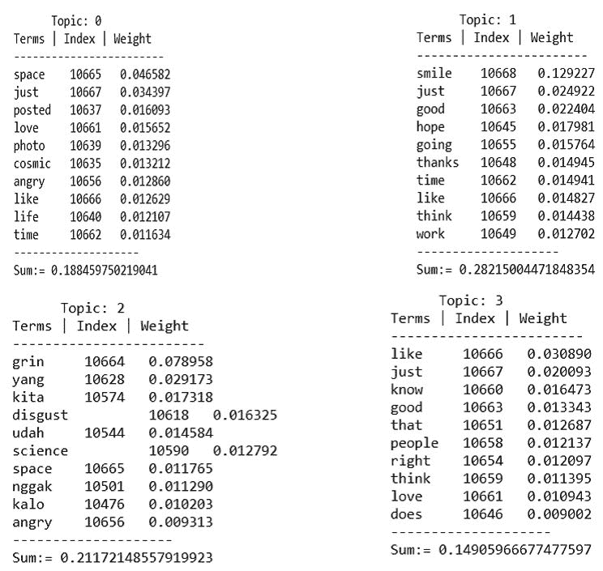

**图 20**：主题分布及其外观

在本节中，我们将看一个使用 Spark MLlib 的 LDA 算法对非结构化原始推文数据集进行主题建模的示例。请注意，这里我们使用了 LDA，这是最常用于文本挖掘的主题建模算法之一。我们可以使用更健壮的主题建模算法，如**概率潜在情感分析**（**pLSA**）、**赌博分配模型**（**PAM**）或**分层狄利克雷过程**（**HDP**）算法。

然而，pLSA 存在过拟合问题。另一方面，HDP 和 PAM 是更复杂的主题建模算法，用于复杂的文本挖掘，如从高维文本数据或非结构化文档中挖掘主题。此外，迄今为止，Spark 只实现了一个主题建模算法，即 LDA。因此，我们必须合理使用 LDA。

# 使用 Spark MLlib 进行主题建模

在这个小节中，我们使用 Spark 表示了一种半自动的主题建模技术。使用其他选项作为默认值，我们在从 GitHub URL 下载的数据集上训练 LDA，网址为[`github.com/minghui/Twitter-LDA/tree/master/data/Data4Model/test`](https://github.com/minghui/Twitter-LDA/tree/master/data/Data4Model/test)。以下步骤展示了从数据读取到打印主题及其词权重的主题建模过程。以下是主题建模流程的简要工作流程：

```scala
object topicModellingwithLDA {
  def main(args: Array[String]): Unit = {
    val lda = new LDAforTM() // actual computations are done here
    val defaultParams = Params().copy(input = "data/docs/") 
    // Loading the parameters
    lda.run(defaultParams) // Training the LDA model with the default
                              parameters.
  }
} 

```

主题建模的实际计算是在`LDAforTM`类中完成的。`Params`是一个案例类，用于加载参数以训练 LDA 模型。最后，我们使用`Params`类设置的参数来训练 LDA 模型。现在，我们将逐步解释每个步骤的源代码：

**步骤 1\. 创建一个 Spark 会话** - 让我们通过定义计算核心数量、SQL 仓库和应用程序名称来创建一个 Spark 会话，如下所示：

```scala
val spark = SparkSession
    .builder
    .master("local[*]")
    .config("spark.sql.warehouse.dir", "E:/Exp/")
    .appName("LDA for topic modelling")
    .getOrCreate() 

```

**步骤 2\. 创建词汇表，标记计数以在文本预处理后训练 LDA** - 首先，加载文档，并准备好 LDA，如下所示：

```scala
// Load documents, and prepare them for LDA.

val preprocessStart = System.nanoTime()
val (corpus, vocabArray, actualNumTokens) = preprocess(params.input, params.vocabSize, params.stopwordFile)  

```

预处理方法用于处理原始文本。首先，让我们使用`wholeTextFiles()`方法读取整个文本，如下所示：

```scala
val initialrdd = spark.sparkContext.wholeTextFiles(paths).map(_._2)
initialrdd.cache()  

```

在上述代码中，paths 是文本文件的路径。然后，我们需要根据词形文本准备一个形态学 RDD，如下所示：

```scala
val rdd = initialrdd.mapPartitions { partition =>
  val morphology = new Morphology()
  partition.map { value => helperForLDA.getLemmaText(value, morphology) }
}.map(helperForLDA.filterSpecialCharacters)

```

在这里，`helperForLDA`类中的`getLemmaText()`方法在使用`filterSpaecialChatacters()`方法过滤特殊字符（例如`("""[! @ # $ % ^ & * ( ) _ + - − , " ' ; : . ` ? --]`）后提供了词形文本。

需要注意的是，`Morphology()`类计算英语单词的基本形式，只删除屈折（不是派生形态）。也就是说，它只处理名词复数、代词格和动词词尾，而不处理比较级形容词或派生名词等。这来自于斯坦福 NLP 组。要使用这个，你应该在主类文件中包含以下导入：`edu.stanford.nlp.process.Morphology`。在`pom.xml`文件中，你将需要包含以下条目作为依赖项：

```scala
<dependency>
    <groupId>edu.stanford.nlp</groupId>
    <artifactId>stanford-corenlp</artifactId>
    <version>3.6.0</version>
</dependency>
<dependency>
    <groupId>edu.stanford.nlp</groupId>
    <artifactId>stanford-corenlp</artifactId>
    <version>3.6.0</version>
    <classifier>models</classifier>
</dependency>

```

方法如下：

```scala
def getLemmaText(document: String, morphology: Morphology) = {
  val string = new StringBuilder()
  val value = new Document(document).sentences().toList.flatMap { a =>
  val words = a.words().toList
  val tags = a.posTags().toList
  (words zip tags).toMap.map { a =>
    val newWord = morphology.lemma(a._1, a._2)
    val addedWoed = if (newWord.length > 3) {
      newWord
    } else { "" }
      string.append(addedWoed + " ")
    }
  }
  string.toString()
} 

```

`filterSpecialCharacters()`如下所示：

`def filterSpecialCharacters(document: String) = document.replaceAll("""[! @ # $ % ^ & * ( ) _ + - − , " ' ; : . ` ? --]""", " ")`。一旦我们手头有去除特殊字符的 RDD，我们就可以创建一个用于构建文本分析管道的 DataFrame：

```scala
rdd.cache()
initialrdd.unpersist()
val df = rdd.toDF("docs")
df.show() 

```

因此，DataFrame 仅包含文档标签。DataFrame 的快照如下：

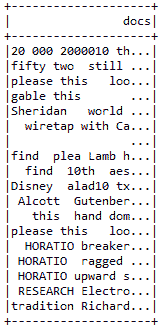**图 21**：原始文本

现在，如果您仔细检查前面的 DataFrame，您会发现我们仍然需要对项目进行标记。此外，在这样的 DataFrame 中还有停用词，因此我们也需要将它们删除。首先，让我们使用`RegexTokenizer` API 对它们进行标记如下：

```scala
val tokenizer = new RegexTokenizer().setInputCol("docs").setOutputCol("rawTokens") 

```

现在，让我们按如下方式删除所有停用词：

```scala
val stopWordsRemover = new StopWordsRemover().setInputCol("rawTokens").setOutputCol("tokens")
stopWordsRemover.setStopWords(stopWordsRemover.getStopWords ++ customizedStopWords)

```

此外，我们还需要应用计数胜利以仅从标记中找到重要特征。这将有助于使管道在管道阶段链接。让我们按如下方式做：

```scala
val countVectorizer = new CountVectorizer().setVocabSize(vocabSize).setInputCol("tokens").setOutputCol("features") 

```

现在，通过链接转换器（`tokenizer`、`stopWordsRemover`和`countVectorizer`）创建管道如下：

```scala
val pipeline = new Pipeline().setStages(Array(tokenizer, stopWordsRemover, countVectorizer))

```

让我们拟合和转换管道以适应词汇和标记数：

```scala
val model = pipeline.fit(df)
val documents = model.transform(df).select("features").rdd.map {
  case Row(features: MLVector) =>Vectors.fromML(features)
}.zipWithIndex().map(_.swap)

```

最后，返回词汇和标记计数对如下：

```scala
(documents, model.stages(2).asInstanceOf[CountVectorizerModel].vocabulary, documents.map(_._2.numActives).sum().toLong)

```

现在，让我们看看训练数据的统计信息：

```scala
println()
println("Training corpus summary:")
println("-------------------------------")
println("Training set size: " + actualCorpusSize + " documents")
println("Vocabulary size: " + actualVocabSize + " terms")
println("Number of tockens: " + actualNumTokens + " tokens")
println("Preprocessing time: " + preprocessElapsed + " sec")
println("-------------------------------")
println()

```

我们得到以下输出：

```scala
Training corpus summary:
 -------------------------------
 Training set size: 18 documents
 Vocabulary size: 21607 terms
 Number of tockens: 75758 tokens
 Preprocessing time: 39.768580981 sec
 **-------------------------------**

```

**步骤 4. 在训练之前实例化 LDA 模型**

```scala
val lda = new LDA()

```

步骤 5：设置 NLP 优化器

为了从 LDA 模型获得更好和优化的结果，我们需要为 LDA 模型设置优化器。这里我们使用`EMLDAOPtimizer`优化器。您还可以使用`OnlineLDAOptimizer()`优化器。但是，您需要将(1.0/actualCorpusSize)添加到`MiniBatchFraction`中，以使其在小型数据集上更加稳健。整个操作如下。首先，实例化`EMLDAOptimizer`如下：

```scala
val optimizer = params.algorithm.toLowerCase match {
  case "em" => new EMLDAOptimizer
  case "online" => new OnlineLDAOptimizer().setMiniBatchFraction(0.05 + 1.0 / actualCorpusSize)
  case _ => throw new IllegalArgumentException("Only em is supported, got ${params.algorithm}.")
}

```

现在使用 LDA API 的`setOptimizer()`方法设置优化器如下：

```scala
lda.setOptimizer(optimizer)
  .setK(params.k)
  .setMaxIterations(params.maxIterations)
  .setDocConcentration(params.docConcentration)
  .setTopicConcentration(params.topicConcentration)
  .setCheckpointInterval(params.checkpointInterval)

```

`Params` case 类用于定义训练 LDA 模型的参数。具体如下：

```scala
 //Setting the parameters before training the LDA model
case class Params(input: String = "",
                  k: Int = 5,
                  maxIterations: Int = 20,
                  docConcentration: Double = -1,
                  topicConcentration: Double = -1,
                  vocabSize: Int = 2900000,
                  stopwordFile: String = "data/stopWords.txt",
                  algorithm: String = "em",
                  checkpointDir: Option[String] = None,
                  checkpointInterval: Int = 10)

```

为了获得更好的结果，您可以以一种天真的方式设置这些参数。或者，您应该进行交叉验证以获得更好的性能。现在，如果您想要对当前参数进行检查点，请使用以下代码行：

```scala
if (params.checkpointDir.nonEmpty) {
  spark.sparkContext.setCheckpointDir(params.checkpointDir.get)
}

```

**步骤 6.** 训练 LDA 模型：

```scala
val startTime = System.nanoTime()
//Start training the LDA model using the training corpus 
val ldaModel = lda.run(corpus)
val elapsed = (System.nanoTime() - startTime) / 1e9
println(s"Finished training LDA model.  Summary:") 
println(s"t Training time: $elapsed sec")

```

对于我们拥有的文本，LDA 模型花费了 6.309715286 秒进行训练。请注意，这些时间代码是可选的。我们提供它们仅供参考，只是为了了解训练时间。

**步骤 7.** 测量数据的可能性 - 现在，为了获得有关数据的更多统计信息，如最大似然或对数似然，我们可以使用以下代码：

```scala
if (ldaModel.isInstanceOf[DistributedLDAModel]) {
  val distLDAModel = ldaModel.asInstanceOf[DistributedLDAModel]
  val avgLogLikelihood = distLDAModel.logLikelihood / actualCorpusSize.toDouble
  println("The average log likelihood of the training data: " +  avgLogLikelihood)
  println()
}

```

前面的代码计算了平均对数似然性，如果 LDA 模型是分布式版本的 LDA 模型的实例。我们得到以下输出：

```scala
The average log-likelihood of the training data: -208599.21351837728  

```

似然性在数据可用后用于描述给定结果的参数（或参数向量）的函数。这对于从一组统计数据中估计参数特别有帮助。有关似然性测量的更多信息，感兴趣的读者应参考[`en.wikipedia.org/wiki/Likelihood_function`](https://en.wikipedia.org/wiki/Likelihood_function)。

**步骤 8. 准备感兴趣的主题** - 准备前五个主题，每个主题有 10 个术语。包括术语及其相应的权重。

```scala
val topicIndices = ldaModel.describeTopics(maxTermsPerTopic = 10)
println(topicIndices.length)
val topics = topicIndices.map {case (terms, termWeights) => terms.zip(termWeights).map { case (term, weight) => (vocabArray(term.toInt), weight) } }

```

**步骤 9. 主题建模** - 打印前十个主题，显示每个主题的权重最高的术语。还包括每个主题的总权重如下：

```scala
var sum = 0.0
println(s"${params.k} topics:")
topics.zipWithIndex.foreach {
  case (topic, i) =>
  println(s"TOPIC $i")
  println("------------------------------")
  topic.foreach {
    case (term, weight) =>
    println(s"$termt$weight")
    sum = sum + weight
  }
  println("----------------------------")
  println("weight: " + sum)
  println()

```

现在，让我们看看我们的 LDA 模型对主题建模的输出：

```scala
    5 topics:
    TOPIC 0
    ------------------------------
    think 0.0105511077762379
    look  0.010393384083882656
    know  0.010121680765600402
    come  0.009999416569525854
    little      0.009880422850906338
    make  0.008982740529851225
    take  0.007061048216197747
    good  0.007040301924830752
    much  0.006273732732002744
    well  0.0062484438391950895
    ----------------------------
    weight: 0.0865522792882307

    TOPIC 1
    ------------------------------
    look  0.008658099588372216
    come  0.007972622171954474
    little      0.007596460821298818
    hand  0.0065409990798624565
    know  0.006314616294309573
    lorry 0.005843633203040061
    upon  0.005545300032552888
    make  0.005391780686824741
    take  0.00537353581562707
    time  0.005030870790464942
    ----------------------------
    weight: 0.15082019777253794

    TOPIC 2
    ------------------------------
    captain     0.006865463831587792
    nautilus    0.005175561004431676
    make  0.004910586984657019
    hepzibah    0.004378298053191463
    water 0.004063096964497903
    take  0.003959626037381751
    nemo  0.0037687537789531005
    phoebe      0.0037683642100062313
    pyncheon    0.003678496229955977
    seem  0.0034594205003318193
    ----------------------------
    weight: 0.19484786536753268

    TOPIC 3
    ------------------------------
    fogg  0.009552022075897986
    rodney      0.008705705501603078
    make  0.007016635545801613
    take  0.00676049232003675
    passepartout      0.006295907851484774
    leave 0.005565220660514245
    find  0.005077555215275536
    time  0.004852923943330551
    luke  0.004729546554304362
    upon  0.004707181805179265
    ----------------------------
    weight: 0.2581110568409608

    TOPIC 4
    ------------------------------
    dick  0.013754147765988699
    thus  0.006231933402776328
    ring  0.0052746290878481926
    bear  0.005181637978658836
    fate  0.004739983892853129
    shall 0.0046221874997173906
    hand  0.004610810387565958
    stand 0.004121100025638923
    name  0.0036093879729237
    trojan      0.0033792362039766505
    ----------------------------
    weight: 0.31363611105890865

```

从前面的输出中，我们可以看到输入文档的主题是主题 5，其权重最高为`0.31363611105890865`。该主题讨论了爱、长、海岸、淋浴、戒指、带来、承担等术语。现在，为了更好地理解流程，这是完整的源代码：

```scala
package com.chapter11.SparkMachineLearning

import edu.stanford.nlp.process.Morphology
import edu.stanford.nlp.simple.Document
import org.apache.log4j.{ Level, Logger }
import scala.collection.JavaConversions._
import org.apache.spark.{ SparkConf, SparkContext }
import org.apache.spark.ml.Pipeline
import org.apache.spark.ml.feature._
import org.apache.spark.ml.linalg.{ Vector => MLVector }
import org.apache.spark.mllib.clustering.{ DistributedLDAModel, EMLDAOptimizer, LDA, OnlineLDAOptimizer }
import org.apache.spark.mllib.linalg.{ Vector, Vectors }
import org.apache.spark.rdd.RDD
import org.apache.spark.sql.{ Row, SparkSession }

object topicModellingwithLDA {
  def main(args: Array[String]): Unit = {
    val lda = new LDAforTM() // actual computations are done here
    val defaultParams = Params().copy(input = "data/docs/") 
    // Loading the parameters to train the LDA model
    lda.run(defaultParams) // Training the LDA model with the default
                              parameters.
  }
}
//Setting the parameters before training the LDA model
caseclass Params(input: String = "",
                 k: Int = 5,
                 maxIterations: Int = 20,
                 docConcentration: Double = -1,
                 topicConcentration: Double = -1,
                 vocabSize: Int = 2900000,
                 stopwordFile: String = "data/docs/stopWords.txt",
                 algorithm: String = "em",
                 checkpointDir: Option[String] = None,
                 checkpointInterval: Int = 10)

// actual computations for topic modeling are done here
class LDAforTM() {
  val spark = SparkSession
              .builder
              .master("local[*]")
              .config("spark.sql.warehouse.dir", "E:/Exp/")
              .appName("LDA for topic modelling")
              .getOrCreate()

  def run(params: Params): Unit = {
    Logger.getRootLogger.setLevel(Level.WARN)
    // Load documents, and prepare them for LDA.
    val preprocessStart = System.nanoTime()
    val (corpus, vocabArray, actualNumTokens) = preprocess(params
                      .input, params.vocabSize, params.stopwordFile)
    val actualCorpusSize = corpus.count()
    val actualVocabSize = vocabArray.length
    val preprocessElapsed = (System.nanoTime() - preprocessStart) / 1e9
    corpus.cache() //will be reused later steps
    println()
    println("Training corpus summary:")
    println("-------------------------------")
    println("Training set size: " + actualCorpusSize + " documents")
    println("Vocabulary size: " + actualVocabSize + " terms")
    println("Number of tockens: " + actualNumTokens + " tokens")
    println("Preprocessing time: " + preprocessElapsed + " sec")
    println("-------------------------------")
    println()
    // Instantiate an LDA model
    val lda = new LDA()
    val optimizer = params.algorithm.toLowerCase match {
      case "em" => new EMLDAOptimizer
      // add (1.0 / actualCorpusSize) to MiniBatchFraction be more
         robust on tiny datasets.
     case "online" => new OnlineLDAOptimizer()
                  .setMiniBatchFraction(0.05 + 1.0 / actualCorpusSize)
      case _ => thrownew IllegalArgumentException("Only em, online are
                             supported but got ${params.algorithm}.")
    }
    lda.setOptimizer(optimizer)
      .setK(params.k)
      .setMaxIterations(params.maxIterations)
      .setDocConcentration(params.docConcentration)
      .setTopicConcentration(params.topicConcentration)
      .setCheckpointInterval(params.checkpointInterval)
    if (params.checkpointDir.nonEmpty) {
      spark.sparkContext.setCheckpointDir(params.checkpointDir.get)
    }
    val startTime = System.nanoTime()
    //Start training the LDA model using the training corpus
    val ldaModel = lda.run(corpus)
    val elapsed = (System.nanoTime() - startTime) / 1e9
    println("Finished training LDA model. Summary:")
    println("Training time: " + elapsed + " sec")
    if (ldaModel.isInstanceOf[DistributedLDAModel]) {
      val distLDAModel = ldaModel.asInstanceOf[DistributedLDAModel]
      val avgLogLikelihood = distLDAModel.logLikelihood /
                             actualCorpusSize.toDouble
      println("The average log likelihood of the training data: " +
              avgLogLikelihood)
      println()
    }
    // Print the topics, showing the top-weighted terms for each topic.
    val topicIndices = ldaModel.describeTopics(maxTermsPerTopic = 10)
    println(topicIndices.length)
    val topics = topicIndices.map {case (terms, termWeights) =>
                 terms.zip(termWeights).map { case (term, weight) =>
                 (vocabArray(term.toInt), weight) } }
    var sum = 0.0
    println(s"${params.k} topics:")
    topics.zipWithIndex.foreach {
      case (topic, i) =>
      println(s"TOPIC $i")
      println("------------------------------")
      topic.foreach {
        case (term, weight) =>
        term.replaceAll("\\s", "")
        println(s"$term\t$weight")
        sum = sum + weight
      }
      println("----------------------------")
      println("weight: " + sum)
      println()
    }
    spark.stop()
  }
  //Pre-processing of the raw texts
import org.apache.spark.sql.functions._
def preprocess(paths: String, vocabSize: Int, stopwordFile: String): (RDD[(Long, Vector)], Array[String], Long) = {
  import spark.implicits._
  //Reading the Whole Text Files
  val initialrdd = spark.sparkContext.wholeTextFiles(paths).map(_._2)
  initialrdd.cache()
  val rdd = initialrdd.mapPartitions { partition =>
    val morphology = new Morphology()
    partition.map {value => helperForLDA.getLemmaText(value,
                                                      morphology)}
  }.map(helperForLDA.filterSpecialCharacters)
    rdd.cache()
    initialrdd.unpersist()
    val df = rdd.toDF("docs")
    df.show()
    //Customizing the stop words
    val customizedStopWords: Array[String] = if(stopwordFile.isEmpty) {
      Array.empty[String]
    } else {
      val stopWordText = spark.sparkContext.textFile(stopwordFile)
                            .collect()
      stopWordText.flatMap(_.stripMargin.split(","))
    }
    //Tokenizing using the RegexTokenizer
    val tokenizer = new RegexTokenizer().setInputCol("docs")
                                       .setOutputCol("rawTokens")
    //Removing the Stop-words using the Stop Words remover
    val stopWordsRemover = new StopWordsRemover()
                       .setInputCol("rawTokens").setOutputCol("tokens")
    stopWordsRemover.setStopWords(stopWordsRemover.getStopWords ++
                                  customizedStopWords)
    //Converting the Tokens into the CountVector
    val countVectorizer = new CountVectorizer().setVocabSize(vocabSize)
                        .setInputCol("tokens").setOutputCol("features")
    val pipeline = new Pipeline().setStages(Array(tokenizer,
                                    stopWordsRemover, countVectorizer))
    val model = pipeline.fit(df)
    val documents = model.transform(df).select("features").rdd.map {
      case Row(features: MLVector) => Vectors.fromML(features)
    }.zipWithIndex().map(_.swap)
    //Returning the vocabulary and tocken count pairs
    (documents, model.stages(2).asInstanceOf[CountVectorizerModel]
     .vocabulary, documents.map(_._2.numActives).sum().toLong)
    }
  }
  object helperForLDA {
    def filterSpecialCharacters(document: String) = 
      document.replaceAll("""[! @ # $ % ^ & * ( ) _ + - − ,
                          " ' ; : . ` ? --]""", " ")
    def getLemmaText(document: String, morphology: Morphology) = {
      val string = new StringBuilder()
      val value =new Document(document).sentences().toList.flatMap{a =>
      val words = a.words().toList
      val tags = a.posTags().toList
      (words zip tags).toMap.map { a =>
        val newWord = morphology.lemma(a._1, a._2)
        val addedWoed = if (newWord.length > 3) {
          newWord
        } else { "" }
        string.append(addedWoed + " ")
      }
    }
    string.toString()
  }
}

```

# LDA 的可扩展性

前面的示例展示了如何使用 LDA 算法进行主题建模作为独立应用程序。LDA 的并行化并不直接，已经有许多研究论文提出了不同的策略。在这方面的关键障碍是所有方法都涉及大量的通信。根据 Databricks 网站上的博客([`databricks.com/blog/2015/03/25/topic-modeling-with-lda-mllib-meets-graphx.html`](https://databricks.com/blog/2015/03/25/topic-modeling-with-lda-mllib-meets-graphx.html))，以下是在实验过程中使用的数据集和相关训练和测试集的统计数据：

+   训练集大小：460 万个文档

+   词汇量：110 万个术语

+   训练集大小：110 亿个标记（~每个文档 239 个词）

+   100 个主题

+   16 个 worker 的 EC2 集群，例如 M4.large 或 M3.medium，具体取决于预算和要求

对于前述设置，平均每次迭代的时间结果为 176 秒/迭代，共进行了 10 次迭代。从这些统计数据可以清楚地看出，对于非常大量的语料库，LDA 是相当可扩展的。

# 摘要

在本章中，我们提供了有关 Spark 机器学习一些高级主题的理论和实践方面。我们还提供了一些关于机器学习最佳实践的建议。在此之后，我们已经看到如何使用网格搜索、交叉验证和超参数调整来调整机器学习模型，以获得更好和优化的性能。在后面的部分，我们看到了如何使用 ALS 开发可扩展的推荐系统，这是使用基于模型的协同过滤方法的基于模型的推荐系统的一个示例。最后，我们看到了如何开发主题建模应用作为文本聚类技术。

对于机器学习最佳实践的其他方面和主题，感兴趣的读者可以参考名为*Large Scale Machine Learning with Spark*的书籍[`www.packtpub.com/big-data-and-business-intelligence/large-scale-machine-learning-spark.`](https://www.packtpub.com/big-data-and-business-intelligence/large-scale-machine-learning-spark)

在下一章中，我们将进入更高级的 Spark 使用。虽然我们已经讨论并提供了关于二元和多类分类的比较分析，但我们将更多地了解 Spark 中的其他多项式分类算法，如朴素贝叶斯、决策树和一对多分类器。
