# 第十三章：我的名字是贝叶斯，朴素贝叶斯

“预测是非常困难的，尤其是关于未来的预测”

-尼尔斯·玻尔

**机器学习（ML）**与大数据的结合是一种革命性的组合，对学术界和工业界的研究产生了巨大影响。此外，许多研究领域也进入了大数据领域，因为数据集以前所未有的方式从各种来源和技术产生和生成，通常被称为**数据洪流**。这给机器学习、数据分析工具和算法带来了巨大挑战，以从大数据的诸如容量、速度和多样性等标准中找到真正的**价值**。然而，从这些庞大数据集中进行预测从来都不容易。

考虑到这一挑战，在本章中我们将深入探讨机器学习，并了解如何使用一种简单而强大的方法来构建可扩展的分类模型，甚至更多。简而言之，本章将涵盖以下主题：

+   多项式分类

+   贝叶斯推断

+   朴素贝叶斯

+   决策树

+   朴素贝叶斯与决策树

# 多项式分类

在机器学习中，多项式（也称为多类）分类是将数据对象或实例分类为两个以上类别的任务，即具有两个以上标签或类别。将数据对象或实例分类为两个类别称为二进制分类。更具体地说，在多项式分类中，每个训练实例属于 N 个不同类别中的一个，其中`N >=2`。目标是构建一个能够正确预测新实例所属类别的模型。可能存在许多情景，其中数据点属于多个类别。然而，如果给定点属于多个类别，这个问题可以轻松地分解为一组不相关的二进制问题，可以使用二进制分类算法自然地解决。

建议读者不要混淆多类分类和多标签分类，多标签分类是要为每个实例预测多个标签。对于基于 Spark 的多标签分类的实现，感兴趣的读者应参考[`spark.apache.org/docs/latest/mllib-evaluation-metrics.html#multilabel-classification`](https://spark.apache.org/docs/latest/mllib-evaluation-metrics.html#multilabel-classification)。

多类分类技术可以分为以下几类：

+   转换为二进制

+   从二进制扩展

+   分层分类

# 转换为二进制

使用转换为二进制的技术，多类分类问题可以转化为多个二进制分类问题的等效策略。换句话说，这种技术可以称为*问题转换技术*。从理论和实践角度进行详细讨论超出了本章的范围。因此，这里我们只讨论问题转换技术的一个例子，即代表这一类别的**一对多**（OVTR）算法。

# 使用一对多方法进行分类

在这一小节中，我们将通过将问题转化为等效的多个二进制分类问题，来描述使用 OVTR 算法进行多类分类的示例。OVTR 策略将问题分解，并针对每个类训练每个二进制分类器。换句话说，OVTR 分类器策略包括为每个类拟合一个二进制分类器。然后将当前类的所有样本视为正样本，因此其他分类器的样本被视为负样本。

毫无疑问，这是一种模块化的机器学习技术。然而，这种策略的缺点是需要来自多类家族的基本分类器。原因是分类器必须产生一个实值，也称为*置信分数*，而不是实际标签的预测。这种策略的第二个缺点是，如果数据集（也称为训练集）包含离散的类标签，这最终会导致模糊的预测结果。在这种情况下，一个样本可能被预测为多个类。为了使前面的讨论更清晰，现在让我们看一个例子。

假设我们有一组 50 个观察结果，分为三类。因此，我们将使用与之前相同的逻辑来选择负例。对于训练阶段，让我们有以下设置：

+   **分类器 1**有 30 个正例和 20 个负例

+   **分类器 2**有 36 个正例和 14 个负例

+   **分类器 3**有 14 个正例和 24 个负例

另一方面，在测试阶段，假设我有一个新实例需要分类到之前的某个类别中。当然，每个分类器都会产生一个关于估计的概率。这是一个实例属于分类器中的负面或正面示例的估计？在这种情况下，我们应该总是比较一个类中的正面概率与其他类。现在对于*N*个类，我们将有*N*个正面类的概率估计值。比较它们，无论哪个概率是*N*个概率中的最大值，都属于那个特定的类。Spark 提供了 OVTR 算法的多类到二进制的缩减，其中**逻辑回归**算法被用作基本分类器。

现在让我们看另一个真实数据集的例子，以演示 Spark 如何使用 OVTR 算法对所有特征进行分类。OVTR 分类器最终预测来自**光学字符识别**（OCR）数据集的手写字符。然而，在深入演示之前，让我们先探索 OCR 数据集，以了解数据的探索性质。需要注意的是，当 OCR 软件首次处理文档时，它将纸张或任何对象分成一个矩阵，以便网格中的每个单元格包含一个单一的字形（也称为不同的图形形状），这只是一种指代字母、符号、数字或来自纸张或对象的任何上下文信息的复杂方式。

为了演示 OCR 管道，假设文档只包含与 26 个大写字母中的一个匹配的英文 alpha 字符，即*A*到*Z*。我们将使用来自*UCI 机器学习数据存储库*的 OCR 字母数据集。该数据集由 W*. Frey*和*D. J. Slate.*标记。在探索数据集时，您应该观察到 20,000 个例子，其中包含 26 个英文大写字母。大写字母以 20 种不同的、随机重塑和扭曲的黑白字体作为不同形状的字形打印。简而言之，从 26 个字母中预测所有字符将问题本身转变为一个具有 26 个类的多类分类问题。因此，二元分类器将无法满足我们的目的。

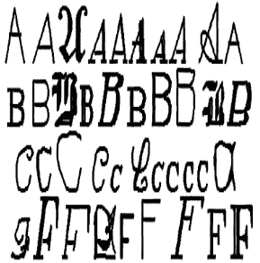**图 1：** 一些印刷字形（来源：使用 Holland 风格自适应分类器进行字母识别，ML，V. 6，p. 161-182，作者 W. Frey 和 D.J. Slate [1991])

前面的图显示了我之前解释过的图像。*数据集*提供了一些以这种方式扭曲的印刷字形的示例；因此，这些字母对计算机来说是具有挑战性的。然而，这些字形对人类来说很容易识别。下图显示了前 20 行的统计属性：

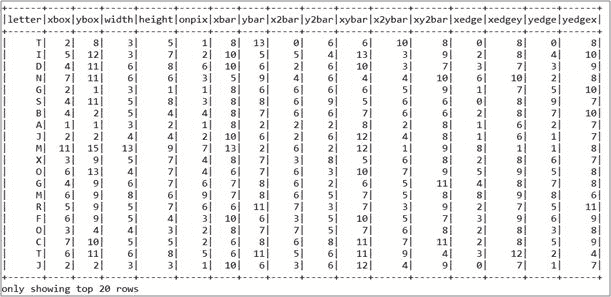**图 2：** 数据框架显示的数据集快照

# OCR 数据集的探索和准备

根据数据集描述，字形是使用 OCR 阅读器扫描到计算机上，然后它们自动转换为像素。因此，所有 16 个统计属性（在**图 2**中）也记录到计算机中。盒子各个区域的黑色像素的浓度提供了一种区分 26 个字母的方法，使用 OCR 或机器学习算法进行训练。

回想一下，**支持向量机**（**SVM**），逻辑回归，朴素贝叶斯分类器，或者任何其他分类器算法（以及它们关联的学习器）都要求所有特征都是数字。LIBSVM 允许您使用非常规格式的稀疏训练数据集。在将正常训练数据集转换为 LIBSVM 格式时，只有数据集中包含的非零值存储在稀疏数组/矩阵形式中。索引指定实例数据的列（特征索引）。但是，任何缺失的数据也被视为零值。索引用作区分特征/参数的一种方式。例如，对于三个特征，索引 1、2 和 3 分别对应于*x*、*y*和*z*坐标。不同数据实例的相同索引值之间的对应仅在构建超平面时是数学的；这些用作坐标。如果您在中间跳过任何索引，它应该被分配一个默认值为零。

在大多数实际情况下，我们可能需要对所有特征点进行数据归一化。简而言之，我们需要将当前的制表符分隔的 OCR 数据转换为 LIBSVM 格式，以使训练步骤更容易。因此，我假设您已经下载了数据并使用它们自己的脚本转换为 LIBSVM 格式。转换为 LIBSVM 格式的结果数据集包括标签和特征，如下图所示：

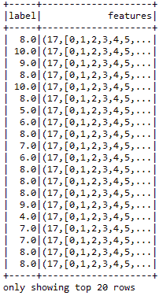**图 3：**LIBSVM 格式的 OCR 数据集的 20 行快照

感兴趣的读者可以参考以下研究文章以获得深入的知识：*Chih-Chung Chang*和*Chih-Jen Lin*，*LIBSVM：支持向量机库*，*ACM 智能系统与技术交易*，2:27:1--27:27，2011 年。您还可以参考我在 GitHub 存储库上提供的公共脚本，该脚本直接将 CSV 中的 OCR 数据转换为 LIBSVM 格式。我读取了所有字母的数据，并为每个字母分配了唯一的数值。您只需要显示输入和输出文件路径并运行脚本。

现在让我们来看一个例子。我将演示的例子包括 11 个步骤，包括数据解析、Spark 会话创建、模型构建和模型评估。

**步骤 1. 创建 Spark 会话** - 通过指定主 URL、Spark SQL 仓库和应用程序名称来创建 Spark 会话，如下所示：

```scala
val spark = SparkSession.builder
                     .master("local[*]") //change acordingly
                     .config("spark.sql.warehouse.dir", "/home/exp/")
                     .appName("OneVsRestExample") 
                     .getOrCreate()

```

**步骤 2. 加载、解析和创建数据框** - 从 HDFS 或本地磁盘加载数据文件，并创建数据框，最后显示数据框结构如下：

```scala
val inputData = spark.read.format("libsvm")
                     .load("data/Letterdata_libsvm.data")
inputData.show()

```

**步骤 3. 生成训练和测试集以训练模型** - 让我们通过将 70%用于训练和 30%用于测试来生成训练和测试集：

```scala
val Array(train, test) = inputData.randomSplit(Array(0.7, 0.3))

```

**步骤 4. 实例化基本分类器** - 这里基本分类器充当多类分类器。在这种情况下，可以通过指定最大迭代次数、容差、回归参数和弹性网参数来实例化逻辑回归算法。

请注意，当因变量是二元的时，逻辑回归是适当的回归分析。与所有回归分析一样，逻辑回归是一种预测性分析。逻辑回归用于描述数据并解释一个因变量二进制变量和一个或多个名义，有序，间隔或比率水平自变量之间的关系。

对于基于 Spark 的逻辑回归算法的实现，感兴趣的读者可以参考[`spark.apache.org/docs/latest/mllib-linear-methods.html#logistic-regression`](https://spark.apache.org/docs/latest/mllib-linear-methods.html#logistic-regression)。

简而言之，以下参数用于训练逻辑回归分类器：

+   `MaxIter`：这指定了最大迭代次数。一般来说，越多越好。

+   `Tol`：这是停止标准的公差。一般来说，越少越好，这有助于更加强烈地训练模型。默认值为 1E-4。

+   `FirIntercept`：这表示是否在生成概率解释时拦截决策函数。

+   `Standardization`：这表示一个布尔值，取决于是否要对训练进行标准化。

+   `AggregationDepth`：越多越好。

+   `RegParam`：这表示回归参数。在大多数情况下，越少越好。

+   `ElasticNetParam`：这表示更先进的回归参数。在大多数情况下，越少越好。

然而，您可以指定拟合拦截作为`Boolean`值，取决于您的问题类型和数据集属性：

```scala
 val classifier = new LogisticRegression()
                        .setMaxIter(500)          
                        .setTol(1E-4)                                                                                                  
                        .setFitIntercept(true)
                        .setStandardization(true) 
                        .setAggregationDepth(50) 
                        .setRegParam(0.0001) 
                        .setElasticNetParam(0.01)

```

第 5 步。 实例化 OVTR 分类器 - 现在实例化一个 OVTR 分类器，将多类分类问题转换为多个二进制分类问题如下：

```scala
val ovr = new OneVsRest().setClassifier(classifier)

```

这里`classifier`是逻辑回归估计器。现在是训练模型的时候了。

第 6 步。 训练多类模型 - 让我们使用训练集来训练模型如下：

```scala
val ovrModel = ovr.fit(train)

```

第 7 步。 在测试集上对模型进行评分 - 我们可以使用转换器（即`ovrModel`）对测试数据进行评分如下：

```scala
val predictions = ovrModel.transform(test)

```

第 8 步。 评估模型 - 在这一步中，我们将预测第一列中字符的标签。但在此之前，我们需要实例化一个`evaluator`来计算分类性能指标，如准确性，精确度，召回率和`f1`度量如下：

```scala
val evaluator = new MulticlassClassificationEvaluator()
                           .setLabelCol("label")
                           .setPredictionCol("prediction")    
val evaluator1 = evaluator.setMetricName("accuracy")
val evaluator2 = evaluator.setMetricName("weightedPrecision")
val evaluator3 = evaluator.setMetricName("weightedRecall")
val evaluator4 = evaluator.setMetricName("f1")

```

第 9 步。 计算性能指标 - 计算测试数据的分类准确性，精确度，召回率，`f1`度量和错误如下：

```scala
val accuracy = evaluator1.evaluate(predictions)
val precision = evaluator2.evaluate(predictions)
val recall = evaluator3.evaluate(predictions)
val f1 = evaluator4.evaluate(predictions)

```

第 10 步。 打印性能指标：

```scala
println("Accuracy = " + accuracy)
println("Precision = " + precision)
println("Recall = " + recall)
println("F1 = " + f1)
println(s"Test Error = ${1 - accuracy}")

```

您应该观察到以下值：

```scala
Accuracy = 0.5217246545696688
Precision = 0.488360500637862
Recall = 0.5217246545696688
F1 = 0.4695649096879411
Test Error = 0.47827534543033123

```

第 11 步。 停止 Spark 会话：

```scala
spark.stop() // Stop Spark session

```

通过这种方式，我们可以将多项分类问题转换为多个二进制分类问题，而不会牺牲问题类型。然而，从第 10 步可以观察到分类准确性并不好。这可能是由于多种原因，例如我们用来训练模型的数据集的性质。而且更重要的是，在训练逻辑回归模型时，我们没有调整超参数。此外，在执行转换时，OVTR 不得不牺牲一些准确性。

# 分层分类

在分层分类任务中，分类问题可以通过将输出空间划分为树来解决。在该树中，父节点被划分为多个子节点。该过程持续进行，直到每个子节点表示一个单一类别。基于分层分类技术提出了几种方法。计算机视觉是这样的领域的一个例子，其中识别图片或书面文本是使用分层处理的内容。本章对这个分类器的广泛讨论超出了范围。

# 从二进制扩展

这是一种将现有的二元分类器扩展为解决多类分类问题的技术。为了解决多类分类问题，基于神经网络、决策树、随机森林、k-最近邻、朴素贝叶斯和支持向量机等算法已经被提出和发展。在接下来的部分中，我们将讨论朴素贝叶斯和决策树算法作为这一类别的代表。

现在，在开始使用朴素贝叶斯算法解决多类分类问题之前，让我们在下一节简要概述贝叶斯推断。

# 贝叶斯推断

在本节中，我们将简要讨论**贝叶斯推断**（**BI**）及其基本理论。读者将从理论和计算的角度熟悉这个概念。

# 贝叶斯推断概述

贝叶斯推断是一种基于贝叶斯定理的统计方法。它用于更新假设的概率（作为强有力的统计证据），以便统计模型可以反复更新以实现更准确的学习。换句话说，在贝叶斯推断方法中，所有类型的不确定性都以统计概率的形式显现出来。这是理论统计学和数学统计学中的重要技术。我们将在后面的部分广泛讨论贝叶斯定理。

此外，贝叶斯更新在数据集序列的增量学习和动态分析中占据主导地位。例如，在时间序列分析、生物医学数据分析中的基因组测序、科学、工程、哲学和法律等领域，广泛使用贝叶斯推断。从哲学和决策理论的角度来看，贝叶斯推断与预测概率密切相关。然而，这个理论更正式地被称为**贝叶斯概率**。

# 什么是推断？

推断或模型评估是更新模型得出的结果的概率的过程。因此，所有的概率证据最终都会根据手头的观察结果得知，以便在使用贝叶斯模型进行分类分析时更新观察结果。随后，这些信息通过将一致性实例化到数据集中的所有观察结果中，被提取到贝叶斯模型中。被提取到模型中的规则被称为先验概率，其中在参考某些相关观察结果之前评估概率，特别是主观地或者假设所有可能的结果具有相同的概率。然后，当所有证据都已知时，信念就会被计算为后验概率。这些后验概率反映了基于更新的证据计算出的假设水平。

贝叶斯定理用于计算表示两个前提的结果的后验概率。基于这些前提，从统计模型中推导出先验概率和似然函数，用于新数据的模型适应性。我们将在后面的部分进一步讨论贝叶斯定理。

# 它是如何工作的？

在这里，我们讨论了统计推断问题的一般设置。首先，从数据中估计所需的数量，可能还有一些未知的数量，我们也想要估计。它可能只是一个响应变量或预测变量，一个类别，一个标签，或者只是一个数字。如果您熟悉*频率主义*方法，您可能知道在这种方法中，假设未知的数量θ被假定为一个固定的（非随机的）数量，它将由观察到的数据来估计。

然而，在贝叶斯框架中，一个未知的量θ被视为一个随机变量。更具体地说，假设我们对θ的分布有一个初始猜测，通常称为**先验分布**。现在，在观察到一些数据后，θ的分布被更新。通常使用贝叶斯定理来执行这一步骤（有关更多细节，请参阅下一节）。这就是为什么这种方法被称为贝叶斯方法。然而，简而言之，从先验分布中，我们可以计算未来观察的预测分布。

这种不矫揉造作的过程可以通过许多论据来证明是不确定推理的适当方法。然而，这些论据的合理性原则是保持一致的。尽管有这些强有力的数学证据，许多机器学习从业者对使用贝叶斯方法感到不舒服，有些不情愿。其背后的原因是他们经常认为选择后验概率或先验是任意和主观的；然而，实际上这是主观的但不是任意的。

不恰当地，许多贝叶斯派并不真正以真正的贝叶斯方式思考。因此，人们可以在文献中找到许多伪贝叶斯程序，其中使用的模型和先验不能被认真地看作是先验信念的表达。贝叶斯方法也可能存在计算困难。其中许多可以通过**马尔可夫链蒙特卡洛**方法来解决，这也是我研究的另一个主要焦点。随着您阅读本章，这种方法的细节将更加清晰。

# 朴素贝叶斯

在机器学习中，**朴素贝叶斯**（**NB**）是一个基于著名的贝叶斯定理和特征之间强独立假设的概率分类器的例子。我们将在本节详细讨论朴素贝叶斯。

# 贝叶斯定理概述

在概率论中，**贝叶斯定理**描述了基于与某一事件相关的先验条件的先验知识来计算该事件的概率。这是由托马斯·贝叶斯牧师最初陈述的概率定理。换句话说，它可以被看作是一种理解概率论如何受新信息影响的方式。例如，如果癌症与年龄有关，关于*年龄*的信息可以用来更准确地评估一个人可能患癌症的概率*。*

贝叶斯定理在数学上陈述如下方程：

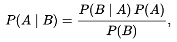

在上述方程中，*A*和*B*是具有*P (B) ≠ 0*的事件，其他项可以描述如下：

+   *P*(*A*)和*P*(*B*)是观察到*A*和*B*的概率，而不考虑彼此（即独立性）

+   *P*(*A* | *B*)是在*B*为真的情况下观察到事件*A*的条件概率

+   *P*(*B*| *A*)是在*A*为真的情况下观察到事件*B*的条件概率

您可能知道，一项著名的哈佛大学研究显示，只有 10%的快乐人群是富裕的。然而，您可能认为这个统计数据非常有说服力，但您可能对知道富裕人群中也真的很快乐的百分比感兴趣*。*贝叶斯定理可以帮助您计算这个逆转统计，使用两个额外线索：

1.  总体上快乐的人的百分比，即*P(A).*

1.  总体上富裕的人的百分比，即*P(B).*

贝叶斯定理背后的关键思想是逆转统计考虑整体比率**。**假设以下信息作为先验可用：

1.  40%的人是快乐的*=> P(A).*

1.  5%的人是富裕的*=> P(B).*

现在让我们假设哈佛大学的研究是正确的，即*P(B|A) = 10%*。现在富裕人群中快乐的人的比例，即*P(A | B),* 可以计算如下：

*P(A|B) = {P(A)* P(B| A)}/ P(B) = (40%*10%)/5% = 80%*

因此，大多数人也很高兴！很好。为了更清楚，现在让我们假设整个世界的人口为 1,000，以便简化。然后，根据我们的计算，存在两个事实：

+   事实 1：这告诉我们有 400 人很高兴，哈佛的研究告诉我们这些快乐的人中有 40 个也很富有。

+   事实 2：总共有 50 个富人，所以快乐的比例是 40/50 = 80%。

这证明了贝叶斯定理及其有效性。然而，更全面的例子可以在[`onlinecourses.science.psu.edu/stat414/node/43`](https://onlinecourses.science.psu.edu/stat414/node/43)找到。

# 我的名字是贝叶斯，朴素贝叶斯

我是贝叶斯，朴素贝叶斯（NB）。我是一个成功的分类器，基于**最大后验概率**（**MAP**）原理。作为一个分类器，我具有高度可扩展性，需要的参数数量与学习问题中的变量（特征/预测器）数量成正比。我有几个特性，例如，我在计算上更快，如果你雇佣我来分类一些东西，我很容易实现，并且我可以很好地处理高维数据集。此外，我可以处理数据集中的缺失值。然而，我是适应性的，因为模型可以通过新的训练数据进行修改而无需重建模型。

在贝叶斯统计学中，MAP 估计是未知数量的估计，等于后验分布的模。MAP 估计可用于根据经验数据获得未观察到的数量的点估计。

听起来有点像詹姆斯·邦德电影？好吧，你/我们可以把分类器看作是 007 特工，对吧？开玩笑。我相信我不像朴素贝叶斯分类器的参数，例如先验和条件概率是通过一组确定的步骤学习或确定的：这涉及两个非常微不足道的操作，在现代计算机上可以非常快速，即计数和除法。没有*迭代*。没有*时代*。没有*优化成本方程*（这可能是复杂的，平均为三次方或至少为二次方复杂度）。没有*错误反向传播*。没有涉及*解矩阵方程*的操作。这使得朴素贝叶斯及其整体训练更快。

然而，在雇佣这个代理之前，你/我们可以发现他的优缺点，这样我们才能像使用王牌一样利用它的优势。好吧，下面是总结这个代理的优缺点的表格：

| **代理** | **优点** | **缺点** | **擅长** |
| --- | --- | --- | --- |
| **朴素贝叶斯（NB）** | - 计算速度快- 实现简单- 在高维度下工作良好- 可处理缺失值- 需要少量数据来训练模型- 可扩展- 适应性强，因为模型可以通过新的训练数据进行修改而无需重建模型 | - 依赖独立假设，如果假设不成立则性能较差- 相对较低的准确性- 如果类标签和某个属性值没有出现在一起，则基于频率的概率估计将为零 | - 当数据有很多缺失值时- 当特征之间的依赖关系相似- 垃圾邮件过滤和分类- 对科技、政治、体育等新闻文章进行分类- 文本挖掘 |

**表 1：**朴素贝叶斯算法的优缺点

# 使用 NB 构建可扩展的分类器

在这一部分，我们将看到使用**朴素贝叶斯**（**NB**）算法的逐步示例。如前所述，NB 具有高度可扩展性，需要的参数数量与学习问题中的变量（特征/预测器）数量成正比。这种可扩展性使得 Spark 社区能够使用这种算法对大规模数据集进行预测分析。Spark MLlib 中 NB 的当前实现支持多项式 NB 和伯努利 NB。

如果特征向量是二进制的，伯努利 NB 是有用的。一个应用可能是使用词袋（BOW）方法进行文本分类。另一方面，多项式 NB 通常用于离散计数。例如，如果我们有一个文本分类问题，我们可以进一步采用伯努利试验的想法，而不是在文档中使用 BOW，我们可以使用文档中的频率计数。

在本节中，我们将看到如何通过整合 Spark 机器学习 API（包括 Spark MLlib、Spark ML 和 Spark SQL）来预测**基于笔的手写数字识别**数据集中的数字：

**步骤 1. 数据收集、预处理和探索** - 从 UCI 机器学习库[`www.csie.ntu.edu.tw/~cjlin/libsvmtools/datasets/multiclass/pendigits`](https://www.csie.ntu.edu.tw/~cjlin/libsvmtools/datasets/multiclass/pendigits)下载了基于笔的手写数字数据集。该数据集是在从 44 位作者那里收集了大约 250 个数字样本后生成的，这些数字样本与笔在 100 毫秒的固定时间间隔内的位置相关。然后，每个数字都写在一个 500 x 500 像素的框内。最后，这些图像被缩放到 0 到 100 之间的整数值，以创建每个观察之间的一致缩放。一个众所周知的空间重采样技术被用来获得弧轨迹上的 3 和 8 个等间距点。可以通过根据它们的（x，y）坐标绘制 3 或 8 个采样点来可视化一个样本图像以及点与点之间的线；它看起来像下表所示：

| 集合 | '0' | '1' | '2' | '3' | '4' | '5' | '6' | '7' | '8' | '9' | 总计 |
| --- | --- | --- | --- | --- | --- | --- | --- | --- | --- | --- | --- |
| 训练 | 780 | 779 | 780 | 719 | 780 | 720 | 720 | 778 | 718 | 719 | 7493 |
| 测试 | 363 | 364 | 364 | 336 | 364 | 335 | 336 | 364 | 335 | 336 | 3497 |

表 2：用于训练和测试集的数字数量

如前表所示，训练集由 30 位作者撰写的样本组成，测试集由 14 位作者撰写的样本组成。

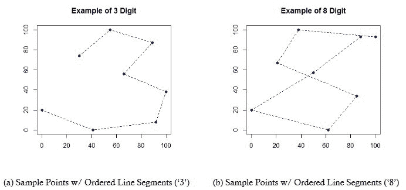

图 4：数字 3 和 8 的示例

有关该数据集的更多信息可以在[`archive.ics.uci.edu/ml/machine-learning-databases/pendigits/pendigits-orig.names`](http://archive.ics.uci.edu/ml/machine-learning-databases/pendigits/pendigits-orig.names)找到。数据集的一个样本快照的数字表示如下图所示：

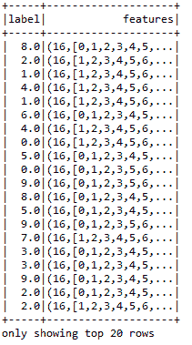

图 5：手写数字数据集的 20 行快照

现在，为了使用独立变量（即特征）预测因变量（即标签），我们需要训练一个多类分类器，因为如前所示，数据集现在有九个类别，即九个手写数字。对于预测，我们将使用朴素贝叶斯分类器并评估模型的性能。

**步骤 2.** 加载所需的库和包：

```scala
import org.apache.spark.ml.classification.NaiveBayes
import org.apache.spark.ml.evaluation
                                 .MulticlassClassificationEvaluator
import org.apache.spark.sql.SparkSession

```

**步骤 3.** 创建一个活跃的 Spark 会话：

```scala
val spark = SparkSession
              .builder
              .master("local[*]")
              .config("spark.sql.warehouse.dir", "/home/exp/")
              .appName(s"NaiveBayes")
              .getOrCreate()

```

请注意，这里的主 URL 已设置为`local[*]`，这意味着您的计算机的所有核心将用于处理 Spark 作业。您应该根据要求相应地设置 SQL 数据仓库和其他配置参数。

**步骤 4. 创建 DataFrame** - 将以 LIBSVM 格式存储的数据加载为 DataFrame：

```scala
val data = spark.read.format("libsvm")
                     .load("data/pendigits.data")

```

对于数字分类，输入特征向量通常是稀疏的，应该将稀疏向量作为输入以利用稀疏性。由于训练数据只使用一次，而且数据集的大小相对较小（即几 MB），如果您多次使用 DataFrame，可以将其缓存。

**步骤 5. 准备训练和测试集** - 将数据分割为训练集和测试集（25%用于测试）：

```scala
val Array(trainingData, testData) = data
                  .randomSplit(Array(0.75, 0.25), seed = 12345L)

```

**步骤 6. 训练朴素贝叶斯模型** - 使用训练集训练朴素贝叶斯模型如下：

```scala
val nb = new NaiveBayes()
val model = nb.fit(trainingData)

```

**步骤 7：** 计算测试集上的预测 - 使用模型变换器计算预测，最后显示针对每个标签的预测，如下所示：

```scala
val predictions = model.transform(testData)
predictions.show()

```

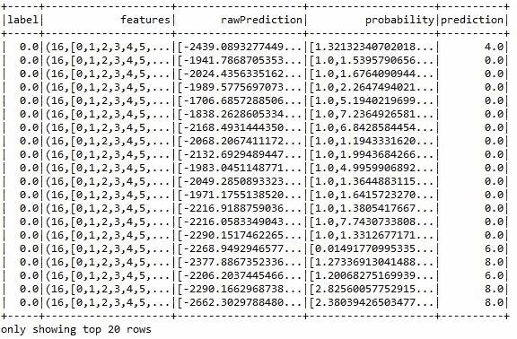**图 6：** 针对每个标签（即每个数字）的预测

如前图所示，一些标签被准确预测，而另一些标签则错误。再次，我们需要了解加权准确性、精确度、召回率和 F1 度量，而不是简单地评估模型。

**步骤 8：** 评估模型 - 选择预测和真实标签来计算测试错误和分类性能指标，如准确性、精确度、召回率和 F1 度量，如下所示：

```scala
val evaluator = new MulticlassClassificationEvaluator()
                           .setLabelCol("label")
                           .setPredictionCol("prediction")    
val evaluator1 = evaluator.setMetricName("accuracy")
val evaluator2 = evaluator.setMetricName("weightedPrecision")
val evaluator3 = evaluator.setMetricName("weightedRecall")
val evaluator4 = evaluator.setMetricName("f1")

```

**步骤 9：** 计算性能指标 - 计算测试数据的分类准确性、精确度、召回率、F1 度量和错误，如下所示：

```scala
val accuracy = evaluator1.evaluate(predictions)
val precision = evaluator2.evaluate(predictions)
val recall = evaluator3.evaluate(predictions)
val f1 = evaluator4.evaluate(predictions)

```

**步骤 10：** 打印性能指标：

```scala
println("Accuracy = " + accuracy)
println("Precision = " + precision)
println("Recall = " + recall)
println("F1 = " + f1)
println(s"Test Error = ${1 - accuracy}")

```

您应该观察到以下值：

```scala
Accuracy = 0.8284365162644282
Precision = 0.8361211320692463
Recall = 0.828436516264428
F1 = 0.8271828540349192
Test Error = 0.17156348373557184

```

性能并不是那么糟糕。但是，您仍然可以通过进行超参数调整来提高分类准确性。通过交叉验证和训练集拆分，可以进一步提高预测准确性，这将在下一节中讨论。

# 调整我！

您已经了解我的优缺点，我的一个缺点是，我的分类准确性相对较低。但是，如果您调整我，我可以表现得更好。好吧，我们应该相信朴素贝叶斯吗？如果是这样，我们不应该看看如何提高这家伙的预测性能吗？比如使用 WebSpam 数据集。首先，我们应该观察 NB 模型的性能，然后再看如何使用交叉验证技术提高性能。

从[`www.csie.ntu.edu.tw/~cjlin/libsvmtools/datasets/binary/webspam_wc_normalized_trigram.svm.bz2`](http://www.csie.ntu.edu.tw/~cjlin/libsvmtools/datasets/binary/webspam_wc_normalized_trigram.svm.bz2)下载的 WebSpam 数据集包含特征和相应的标签，即垃圾邮件或正常邮件。因此，这是一个监督式机器学习问题，这里的任务是预测给定消息是垃圾邮件还是正常邮件（即非垃圾邮件）。原始数据集大小为 23.5 GB，类别标签为+1 或-1（即二元分类问题）。后来，我们将-1 替换为 0.0，+1 替换为 1.0，因为朴素贝叶斯不允许使用有符号整数。修改后的数据集如下图所示：

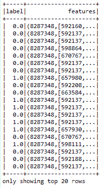**图 7：** WebSpam 数据集的 20 行快照

首先，我们需要导入必要的包，如下所示：

```scala
import org.apache.spark.ml.classification.NaiveBayes
import org.apache.spark.ml.evaluation.MulticlassClassificationEvaluator
import org.apache.spark.sql.SparkSession
import org.apache.spark.ml.Pipeline;
import org.apache.spark.ml.PipelineStage;
import org.apache.spark.ml.classification.LogisticRegression
import org.apache.spark.ml.evaluation.BinaryClassificationEvaluator
import org.apache.spark.ml.feature.{HashingTF, Tokenizer}
import org.apache.spark.ml.linalg.Vector
import org.apache.spark.ml.tuning.{CrossValidator, ParamGridBuilder}

```

现在创建 Spark 会话作为代码的入口点，如下所示：

```scala
val spark = SparkSession
      .builder
      .master("local[*]")
      .config("spark.sql.warehouse.dir", "/home/exp/")
      .appName("Tuned NaiveBayes")
      .getOrCreate()

```

让我们加载 WebSpam 数据集并准备训练集来训练朴素贝叶斯模型，如下所示：

```scala
// Load the data stored in LIBSVM format as a DataFrame.
 val data = spark.read.format("libsvm").load("hdfs://data/ webspam_wc_normalized_trigram.svm")
 // Split the data into training and test sets (30% held out for testing)
 val Array(trainingData, testData) = data.randomSplit(Array(0.75, 0.25), seed = 12345L)
 // Train a NaiveBayes model with using the training set
 val nb = new NaiveBayes().setSmoothing(0.00001)
 val model = nb.fit(trainingData)

```

在前面的代码中，设置种子是为了可重现性。现在让我们在验证集上进行预测，如下所示：

```scala
val predictions = model.transform(testData)
predictions.show()

```

现在让我们获取`evaluator`并计算分类性能指标，如准确性、精确度、召回率和`f1`度量，如下所示：

```scala
val evaluator = new MulticlassClassificationEvaluator()
                    .setLabelCol("label")
                    .setPredictionCol("prediction")    
val evaluator1 = evaluator.setMetricName("accuracy")
val evaluator2 = evaluator.setMetricName("weightedPrecision")
val evaluator3 = evaluator.setMetricName("weightedRecall")
val evaluator4 = evaluator.setMetricName("f1")

```

现在让我们计算并打印性能指标：

```scala
val accuracy = evaluator1.evaluate(predictions)
val precision = evaluator2.evaluate(predictions)
val recall = evaluator3.evaluate(predictions)
val f1 = evaluator4.evaluate(predictions)   
// Print the performance metrics
println("Accuracy = " + accuracy)
println("Precision = " + precision)
println("Recall = " + recall)
println("F1 = " + f1)
println(s"Test Error = ${1 - accuracy}")

```

您应该收到以下输出：

```scala
Accuracy = 0.8839357429715676
Precision = 0.86393574297188752
Recall = 0.8739357429718876
F1 = 0.8739357429718876
Test Error = 0.11606425702843237

```

尽管准确性达到了令人满意的水平，但我们可以通过应用交叉验证技术进一步提高它。该技术的步骤如下：

+   通过链接一个 NB 估计器作为管道的唯一阶段来创建管道

+   现在为调整准备参数网格

+   执行 10 折交叉验证

+   现在使用训练集拟合模型

+   计算验证集上的预测

诸如交叉验证之类的模型调整技术的第一步是创建管道。可以通过链接变换器、估计器和相关参数来创建管道。

**步骤 1：** 创建管道 - 让我们创建一个朴素贝叶斯估计器（在下面的情况中`nb`是一个估计器），并通过链接估计器来创建管道，如下所示：

```scala
val nb = new NaiveBayes().setSmoothing(00001)
val pipeline = new Pipeline().setStages(Array(nb))

```

管道可以被视为用于训练和预测的数据工作流系统。ML 管道提供了一组统一的高级 API，构建在[DataFrames](https://spark.apache.org/docs/latest/sql-programming-guide.html)之上，帮助用户创建和调整实用的机器学习管道。DataFrame、转换器、估计器、管道和参数是管道创建中最重要的五个组件。有兴趣的读者可以参考[`spark.apache.org/docs/latest/ml-pipeline.html`](https://spark.apache.org/docs/latest/ml-pipeline.html)了解更多关于管道的信息。

在早期情况下，我们管道中的唯一阶段是一个估计器，它是用于在 DataFrame 上拟合的算法，以产生一个转换器，以确保训练成功进行。

**步骤 2. 创建网格参数** - 让我们使用`ParamGridBuilder`构建一个参数网格进行搜索：

```scala
val paramGrid = new ParamGridBuilder()
              .addGrid(nb.smoothing, Array(0.001, 0.0001))
              .build()

```

**步骤 3. 执行 10 折交叉验证** - 现在我们将管道视为一个估计器，将其包装在一个交叉验证实例中。这将允许我们共同选择所有管道阶段的参数。`CrossValidator`需要一个估计器、一组估计器`ParamMaps`和一个评估器。请注意，这里的评估器是`BinaryClassificationEvaluator`，其默认指标是`areaUnderROC`。但是，如果您将评估器用作`MultiClassClassificationEvaluator`，您将能够使用其他性能指标：

```scala
val cv = new CrossValidator()
            .setEstimator(pipeline)
            .setEvaluator(new BinaryClassificationEvaluator)
            .setEstimatorParamMaps(paramGrid)
            .setNumFolds(10)  // Use 3+ in practice

```

**步骤 4.** 按以下方式使用训练集拟合交叉验证模型：

```scala
val model = cv.fit(trainingData)

```

**步骤 5.** 按以下方式计算性能：

```scala
val predictions = model.transform(validationData)
predictions.show()

```

**步骤 6.** 获取评估器，计算性能指标并显示结果。现在让我们获取`evaluator`并计算分类性能指标，如准确度、精确度、召回率和 f1 度量。这里将使用`MultiClassClassificationEvaluator`来计算准确度、精确度、召回率和 f1 度量：

```scala
val evaluator = new MulticlassClassificationEvaluator()
                            .setLabelCol("label")
                            .setPredictionCol("prediction")    
val evaluator1 = evaluator.setMetricName("accuracy")
val evaluator2 = evaluator.setMetricName("weightedPrecision")
val evaluator3 = evaluator.setMetricName("weightedRecall")
val evaluator4 = evaluator.setMetricName("f1")

```

现在按照以下步骤计算测试数据的分类准确度、精确度、召回率、f1 度量和错误：

```scala
val accuracy = evaluator1.evaluate(predictions)
val precision = evaluator2.evaluate(predictions)
val recall = evaluator3.evaluate(predictions)
val f1 = evaluator4.evaluate(predictions)

```

现在让我们打印性能指标：

```scala
println("Accuracy = " + accuracy)
println("Precision = " + precision)
println("Recall = " + recall)
println("F1 = " + f1)
println(s"Test Error = ${1 - accuracy}")

```

您现在应该收到以下结果：

```scala
Accuracy = 0.9678714859437751
Precision = 0.9686742518830365
Recall = 0.9678714859437751
F1 = 0.9676697179934564
Test Error = 0.032128514056224855

```

现在这比之前的好多了，对吧？请注意，由于数据集的随机分割和您的平台，您可能会收到略有不同的结果。

# 决策树

在本节中，我们将详细讨论决策树算法。还将讨论朴素贝叶斯和决策树的比较分析。决策树通常被认为是一种用于解决分类和回归任务的监督学习技术。决策树简单地说是一种决策支持工具，它使用树状图（或决策模型）及其可能的后果，包括机会事件结果、资源成本和效用。更技术性地说，决策树中的每个分支代表了一个可能的决策、发生或反应，以统计概率的形式。

与朴素贝叶斯相比，决策树是一种更加健壮的分类技术。原因在于决策树首先将特征分为训练集和测试集。然后它产生了一个很好的泛化来推断预测的标签或类。最有趣的是，决策树算法可以处理二元和多类分类问题。

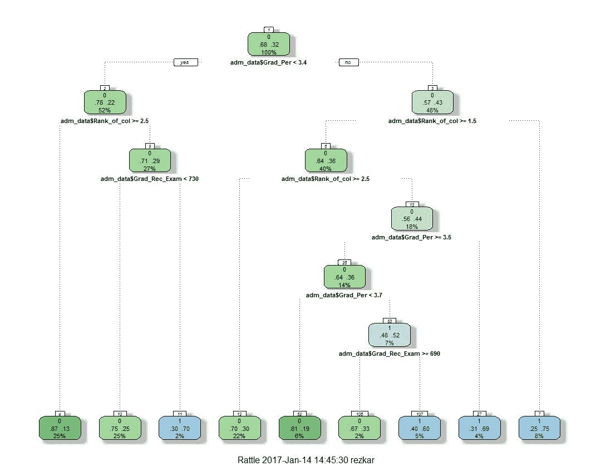**图 8：** 使用 Rattle 软件包在入学测试数据集上的一个样本决策树

例如，在前面的示例图中，决策树从入学数据中学习，用一组`if...else`决策规则来逼近正弦曲线。数据集包含每个申请入学的学生的记录，比如申请美国大学。每条记录包含研究生入学考试成绩、CGPA 成绩和列的排名。现在我们需要根据这三个特征（变量）来预测谁是胜任的。在训练决策树模型并修剪树的不需要的分支后，决策树可以用来解决这种问题。一般来说，树越深，决策规则越复杂，模型拟合得越好。因此，树越深，决策规则越复杂，模型拟合得越好。

如果你想绘制前面的图，只需运行我的 R 脚本，在 RStudio 上执行，并提供入学数据。脚本和数据集可以在我的 GitHub 存储库中找到[`github.com/rezacsedu/AdmissionUsingDecisionTree`](https://github.com/rezacsedu/AdmissionUsingDecisionTree)。

# 使用决策树的优缺点

在雇佣我之前，你可以从表 3 中了解我的优缺点以及我最擅长的工作时间，这样你就不会有任何迟来的后悔！

| **代理** | **优点** | **缺点** | **擅长** |
| --- | --- | --- | --- |
| **决策树（DTs）** | -简单实现、训练和解释-树可以可视化-准备数据很少-模型构建和预测时间少-可以处理数值和分类数据-可以使用统计测试验证模型-对噪声和缺失值很健壮-高准确性 | -大型和复杂树的解释很困难-同一子树内可能会出现重复-可能出现对角决策边界问题-DT 学习者可能会创建不能很好泛化数据的过于复杂的树-有时由于数据的微小变化，决策树可能不稳定-学习决策树本身是一个 NP 完全问题-如果某些类占主导地位，DT 学习者会创建有偏见的树 | -针对高准确性分类-医学诊断和预后-信用风险分析 |

**表 3：** 决策树的优缺点

# 决策树与朴素贝叶斯

如前表所述，由于其对训练数据的灵活性，决策树非常容易理解和调试。它们可以处理分类问题和回归问题。

如果你想要预测分类值或连续值，决策树都可以处理。因此，如果你只有表格数据，将其提供给决策树，它将构建模型以对数据进行分类，而无需任何额外的前期或手动干预。总之，决策树非常简单实现、训练和解释。准备数据很少，决策树就可以用更少的预测时间构建模型。正如前面所说，它们可以处理数值和分类数据，并且对噪声和缺失值非常健壮。使用统计测试非常容易验证模型。更有趣的是，构建的树可以可视化。总的来说，它们提供了非常高的准确性。

然而，决策树有时倾向于过拟合训练数据的问题。这意味着通常需要修剪树，并找到一个更好的分类或回归准确性的最佳树。此外，同一子树内可能会出现重复。有时它还会在对角决策边界问题上出现问题，导致过拟合和欠拟合。此外，DT 学习者可能会创建不能很好泛化数据的过于复杂的树，这使得整体解释很困难。由于数据的微小变化，决策树可能不稳定，因此学习决策树本身是一个 NP 完全问题。最后，如果某些类占主导地位，DT 学习者会创建有偏见的树。

建议读者参考*表 1*和*3*，以获得朴素贝叶斯和 DT 之间的比较摘要。

另一方面，在使用朴素贝叶斯时有一句话：*NB 需要您手动构建分类*。无法将大量表格数据输入其中，然后选择最佳的特征进行分类。然而，在这种情况下，选择正确的特征和重要的特征取决于用户，也就是您。另一方面，DT 将从表格数据中选择最佳的特征。鉴于这一事实，您可能需要将朴素贝叶斯与其他统计技术结合起来，以帮助进行最佳特征提取并稍后对其进行分类。或者，使用 DT 以获得更好的精度、召回率和 f1 度量的准确性。朴素贝叶斯的另一个优点是它将作为连续分类器进行回答。然而，缺点是它们更难调试和理解。当训练数据没有良好特征且数据量较小时，朴素贝叶斯表现得相当不错。

总之，如果您试图从这两者中选择更好的分类器，通常最好的方法是测试每个来解决问题。我的建议是使用您拥有的训练数据构建 DT 和朴素贝叶斯分类器，然后使用可用的性能指标比较性能，然后决定哪一个最适合解决您的问题，取决于数据集的性质。

# 使用 DT 算法构建可扩展分类器

正如您已经看到的，使用 OVTR 分类器，我们观察到 OCR 数据集上性能指标的以下值：

```scala
Accuracy = 0.5217246545696688
Precision = 0.488360500637862
Recall = 0.5217246545696688
F1 = 0.4695649096879411
Test Error = 0.47827534543033123

```

这表明该数据集上模型的准确性非常低。在本节中，我们将看到如何使用 DT 分类器来提高性能。将使用相同的 OCR 数据集展示 Spark 2.1.0 的示例。该示例将包括数据加载、解析、模型训练以及最终的模型评估等多个步骤。

由于我们将使用相同的数据集，为了避免冗余，我们将跳过数据集探索步骤，直接进入示例：

**步骤 1.** 加载所需的库和包如下：

```scala
import org.apache.spark.ml.Pipeline // for Pipeline creation
import org.apache.spark.ml.classification
                         .DecisionTreeClassificationModel 
import org.apache.spark.ml.classification.DecisionTreeClassifier 
import org.apache.spark.ml.evaluation
                         .MulticlassClassificationEvaluator 
import org.apache.spark.ml.feature
                         .{IndexToString, StringIndexer, VectorIndexer} 
import org.apache.spark.sql.SparkSession //For a Spark session

```

**步骤 2.** 创建一个活跃的 Spark 会话如下：

```scala
val spark = SparkSession
              .builder
              .master("local[*]")
              .config("spark.sql.warehouse.dir", "/home/exp/")
              .appName("DecisionTreeClassifier")
              .getOrCreate()

```

请注意，这里将主 URL 设置为`local[*]`，这意味着您的计算机的所有核心将用于处理 Spark 作业。您应该根据要求设置 SQL 仓库和其他配置参数。

**步骤 3.** 创建 DataFrame - 加载以 LIBSVM 格式存储的数据作为 DataFrame 如下：

```scala
val data = spark.read.format("libsvm").load("datab
                             /Letterdata_libsvm.data")

```

对于数字的分类，输入特征向量通常是稀疏的，应该提供稀疏向量作为输入以利用稀疏性。由于训练数据只使用一次，而且数据集的大小相对较小（即几 MB），如果您多次使用 DataFrame，可以将其缓存起来。

**步骤 4.** 标签索引 - 对标签进行索引，为标签列添加元数据。然后让我们在整个数据集上进行拟合，以包含索引中的所有标签：

```scala
val labelIndexer = new StringIndexer()
               .setInputCol("label")
               .setOutputCol("indexedLabel")
               .fit(data)

```

**步骤 5.** 识别分类特征 - 以下代码段自动识别分类特征并对其进行索引：

```scala
val featureIndexer = new VectorIndexer()
              .setInputCol("features")
              .setOutputCol("indexedFeatures")
              .setMaxCategories(4)
              .fit(data)

```

对于这种情况，如果特征的数量超过四个不同的值，它们将被视为连续的。

**步骤 6.** 准备训练和测试集 - 将数据分割为训练集和测试集（25%用于测试）：

```scala
val Array(trainingData, testData) = data.randomSplit
                                      (Array(0.75, 0.25), 12345L)

```

**步骤 7.** 训练 DT 模型如下：

```scala
val dt = new DecisionTreeClassifier()
                     .setLabelCol("indexedLabel")
                     .setFeaturesCol("indexedFeatures")

```

**步骤 8.** 将索引的标签转换回原始标签如下：

```scala
val labelConverter = new IndexToString()
                .setInputCol("prediction")
                .setOutputCol("predictedLabel")
                .setLabels(labelIndexer.labels)

```

**步骤 9.** 创建 DT 管道 - 让我们通过更改索引器、标签转换器和树来创建一个 DT 管道：

```scala
val pipeline = new Pipeline().setStages(Array(labelIndexer,
                              featureIndexer, dt, labelconverter))

```

**步骤 10.** 运行索引器 - 使用转换器训练模型并运行索引器：

```scala
val model = pipeline.fit(trainingData)

```

**步骤 11.** 计算测试集上的预测 - 使用模型转换器计算预测，最后显示每个标签的预测如下：

```scala
val predictions = model.transform(testData)
predictions.show()

```

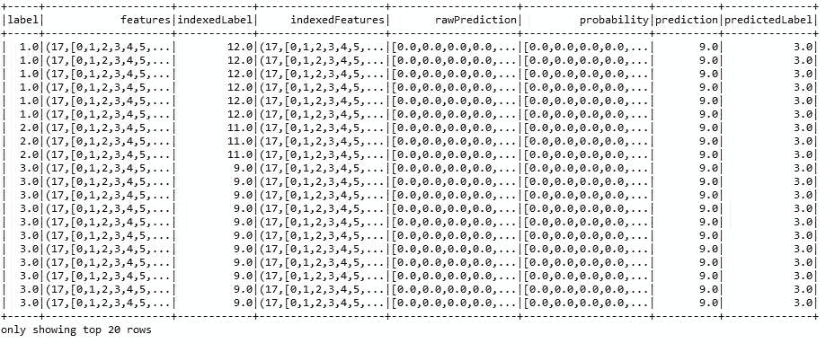**图 9：** 预测与每个标签（即每个字母）相对应

从上图可以看出，一些标签被准确预测，而另一些则被错误预测。然而，我们知道加权准确性、精确度、召回率和 f1 度量，但我们需要先评估模型。

**步骤 12. 评估模型** - 选择预测和真实标签来计算测试错误和分类性能指标，如准确性、精确度、召回率和 f1 度量，如下所示：

```scala
val evaluator = new MulticlassClassificationEvaluator()
                             .setLabelCol("label")
                             .setPredictionCol("prediction")    
val evaluator1 = evaluator.setMetricName("accuracy")
val evaluator2 = evaluator.setMetricName("weightedPrecision")
val evaluator3 = evaluator.setMetricName("weightedRecall")
val evaluator4 = evaluator.setMetricName("f1")

```

**步骤 13. 计算性能指标** - 计算测试数据的分类准确性、精确度、召回率、f1 度量和错误，如下所示：

```scala
val accuracy = evaluator1.evaluate(predictions)
val precision = evaluator2.evaluate(predictions)
val recall = evaluator3.evaluate(predictions)
val f1 = evaluator4.evaluate(predictions)

```

**步骤 14.** 打印性能指标：

```scala
println("Accuracy = " + accuracy)
println("Precision = " + precision)
println("Recall = " + recall)
println("F1 = " + f1)
println(s"Test Error = ${1 - accuracy}")

```

您应该按以下数值观察：

```scala
Accuracy = 0.994277821625888
Precision = 0.9904583933020722
Recall = 0.994277821625888
F1 = 0.9919966504321712
Test Error = 0.005722178374112041

```

现在性能很好，对吧？然而，您仍然可以通过执行超参数调整来提高分类准确性。通过交叉验证和训练集拆分，可以进一步提高预测准确性，选择适当的算法（即分类器或回归器）。

**步骤 15.** 打印决策树节点：

```scala
val treeModel = model.stages(2).asInstanceOf
                                [DecisionTreeClassificationModel]
println("Learned classification tree model:\n" + treeModel
                 .toDebugString)

```

最后，我们将打印决策树中的一些节点，如下图所示：

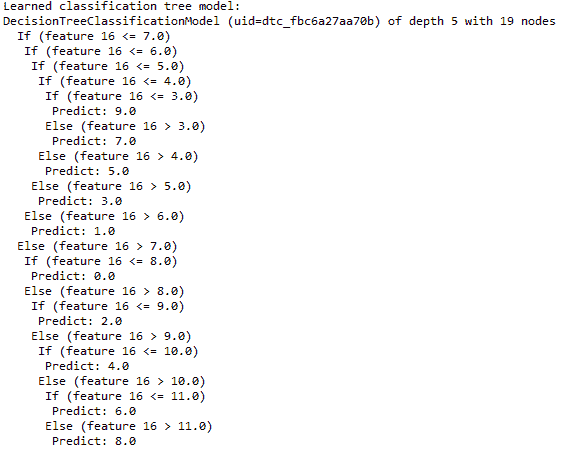**图 10：** 在模型构建过程中生成的一些决策树节点

# 总结

在本章中，我们讨论了一些机器学习中的高级算法，并发现了如何使用一种简单而强大的贝叶斯推断方法来构建另一种分类模型，即多项式分类算法。此外，从理论和技术角度广泛讨论了朴素贝叶斯算法。最后，讨论了决策树和朴素贝叶斯算法之间的比较分析，并提供了一些指导方针。

在下一章中，我们将更深入地研究机器学习，并找出如何利用机器学习来对属于无监督观测数据集的记录进行聚类。
