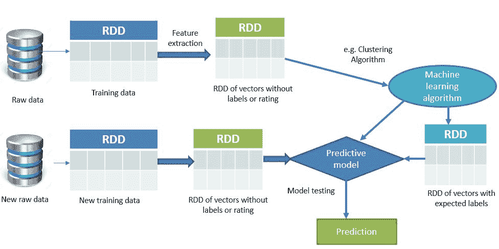
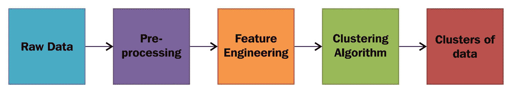
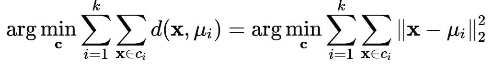
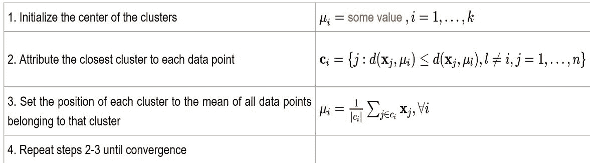
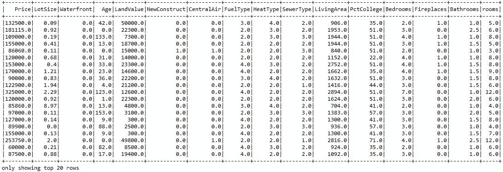
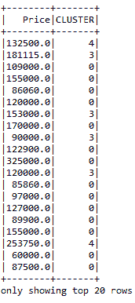
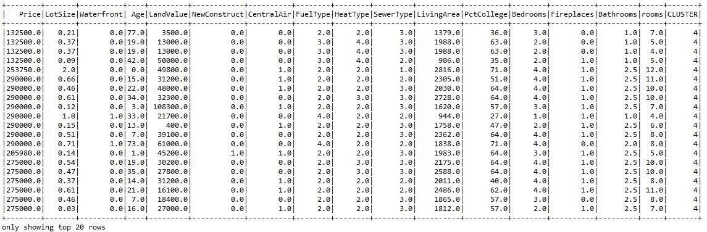
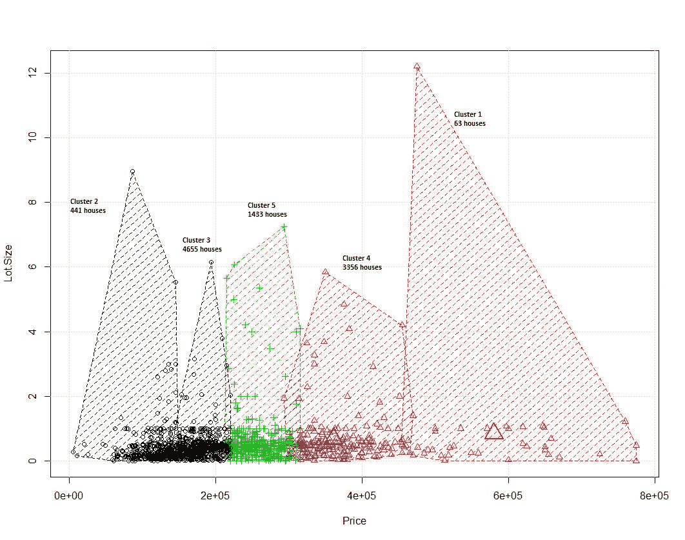
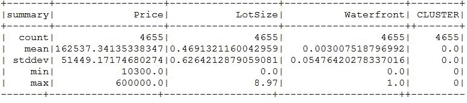
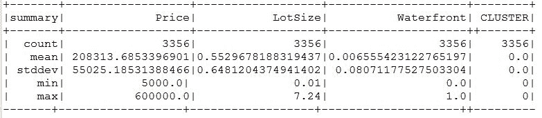

# 第十四章：是时候整理一下了-用 Spark MLlib 对数据进行聚类

*"如果你拿一个星系并试图让它变得更大，它就会成为一群星系，而不是一个星系。如果你试图让它变得比那小，它似乎会自己爆炸"*

- Jeremiah P. Ostriker

在本章中，我们将深入研究机器学习，并找出如何利用它来对无监督观测数据集中属于某一组或类的记录进行聚类。简而言之，本章将涵盖以下主题：

+   无监督学习

+   聚类技术

+   层次聚类（HC）

+   基于质心的聚类（CC）

+   基于分布的聚类（DC）

+   确定聚类数量

+   聚类算法之间的比较分析

+   在计算集群上提交作业

# 无监督学习

在本节中，我们将用适当的示例简要介绍无监督机器学习技术。让我们从一个实际例子开始讨论。假设你在硬盘上有一个拥挤而庞大的文件夹里有大量非盗版-完全合法的 mp3。现在，如果你可以建立一个预测模型，帮助自动将相似的歌曲分组并组织到你喜欢的类别中，比如乡村音乐、说唱、摇滚等。这种将项目分配到一个组中的行为，例如将 mp3 添加到相应的播放列表，是一种无监督的方式。在之前的章节中，我们假设你有一个正确标记数据的训练数据集。不幸的是，在现实世界中收集数据时，我们并不总是有这种奢侈。例如，假设我们想将大量音乐分成有趣的播放列表。如果我们没有直接访问它们的元数据，我们如何可能将歌曲分组在一起呢？一种可能的方法可能是混合各种机器学习技术，但聚类通常是解决方案的核心。

简而言之，在无监督机器学习问题中，训练数据集的正确类别不可用或未知。因此，类别必须从结构化或非结构化数据集中推导出来，如*图 1*所示。这基本上意味着这种算法的目标是以某种结构化的方式预处理数据。换句话说，无监督学习算法的主要目标是探索未标记的输入数据中的未知/隐藏模式。然而，无监督学习也包括其他技术，以探索性的方式解释数据的关键特征，以找到隐藏的模式。为了克服这一挑战，聚类技术被广泛使用，以无监督的方式基于某些相似性度量对未标记的数据点进行分组。

有关无监督算法工作原理的深入理论知识，请参考以下三本书：*Bousquet*，*O.；von Luxburg*，*U.；Raetsch*，*G.，编辑（2004）。*机器学习的高级讲座*。*Springer-Verlag*。ISBN 978-3540231226。或者*Duda*，*Richard O.*；*Hart*，*Peter E.*；*Stork*，*David G*。（2001）。*无监督学习和聚类*。*模式分类*（第 2 版）。*Wiley*。ISBN 0-471-05669-3 和*Jordan*，*Michael I.*；*Bishop*，*Christopher M*。（2004）*神经网络*。在*Allen B. Tucker* *计算机科学手册，第二版*（第 VII 部分：智能系统）。*博卡拉顿*，FL：查普曼和霍尔/ CRC 出版社。ISBN 1-58488-360-X。

**图 1：**使用 Spark 进行无监督学习

# 无监督学习示例

在聚类任务中，算法通过分析输入示例之间的相似性将相关特征分组到类别中，其中相似的特征被聚类并用圆圈标记。聚类的用途包括但不限于以下内容：搜索结果分组，如客户分组，用于发现可疑模式的异常检测，用于在文本中找到有用模式的文本分类，用于找到连贯群体的社交网络分析，用于将相关计算机放在一起的数据中心计算集群，用于基于相似特征识别社区的房地产数据分析。我们将展示一个基于 Spark MLlib 的解决方案，用于最后一种用例。

# 聚类技术

在本节中，我们将讨论聚类技术以及相关挑战和适当的示例。还将提供对层次聚类、基于质心的聚类和基于分布的聚类的简要概述。

# 无监督学习和聚类

聚类分析是关于将数据样本或数据点分成相应的同类或簇的过程。因此，聚类的一个简单定义可以被认为是将对象组织成成员在某种方式上相似的组。

因此，*簇*是一组对象，它们在彼此之间是*相似*的，并且与属于其他簇的对象是*不相似*的。如*图 2*所示，如果给定一组对象，聚类算法会根据相似性将这些对象放入一组中。例如，K 均值这样的聚类算法已经找到了数据点组的质心。然而，为了使聚类准确和有效，算法评估了每个点与簇的质心之间的距离。最终，聚类的目标是确定一组未标记数据中的内在分组。

**图 2：** 聚类原始数据

Spark 支持许多聚类算法，如**K 均值**，**高斯混合**，**幂迭代聚类**（**PIC**），**潜在狄利克雷分配**（**LDA**），**二分 K 均值**和**流式 K 均值**。LDA 用于文档分类和文本挖掘中常用的聚类。PIC 用于将具有成对相似性的图的顶点聚类为边属性。然而，为了使本章的目标更清晰和集中，我们将限制我们的讨论在 K 均值，二分 K 均值和高斯混合算法上。

# 层次聚类

层次聚类技术基于一个基本思想，即对象或特征与附近的对象比与远处的对象更相关。二分 K 均值就是这样一种层次聚类算法的例子，它根据它们的相应距离连接数据对象以形成簇。

在层次聚类技术中，一个簇可以通过连接簇的部分所需的最大距离来简单描述。因此，不同的簇将在不同的距离下形成。从图形上看，这些簇可以使用树状图来表示。有趣的是，常见的名字层次聚类来源于树状图的概念。

# 基于质心的聚类

在基于质心的聚类技术中，聚类由一个中心向量表示。然而，这个向量本身不一定是数据点的成员。在这种类型的学习中，必须在训练模型之前提供一些可能的聚类。K 均值是这种学习类型的一个非常著名的例子，如果将聚类的数量设置为一个固定的整数 K，K 均值算法提供了一个正式的定义作为一个优化问题，这是一个单独的问题，需要解决以找到 K 个聚类中心并将数据对象分配给最近的聚类中心。简而言之，这是一个优化问题，其目标是最小化聚类的平方距离。

# 基于分布的聚类

基于分布的聚类算法基于提供更方便的方式将相关数据对象聚类到相同分布的统计分布模型。尽管这些算法的理论基础非常健全，但它们大多数时候会受到过拟合的影响。然而，这种限制可以通过对模型复杂性加以约束来克服。

# 基于质心的聚类（CC）

在本节中，我们将讨论基于质心的聚类技术及其计算挑战。我们将展示使用 Spark MLlib 的 K 均值的示例，以更好地理解基于质心的聚类。

# CC 算法中的挑战

如前所述，在像 K 均值这样的基于质心的聚类算法中，设置聚类数量 K 的最佳值是一个优化问题。这个问题可以被描述为 NP-hard（即非确定性多项式时间难题），具有高算法复杂性，因此常见的方法是尝试只获得一个近似解。因此，解决这些优化问题会带来额外的负担，因此也会带来非平凡的缺点。此外，K 均值算法期望每个聚类的大小大致相似。换句话说，每个聚类中的数据点必须是均匀的，以获得更好的聚类性能。

这个算法的另一个主要缺点是，这个算法试图优化聚类中心，而不是聚类边界，这经常会导致不恰当地切割聚类之间的边界。然而，有时我们可以利用视觉检查的优势，这在超平面或多维数据上通常是不可用的。尽管如此，如何找到 K 的最佳值的完整部分将在本章后面讨论。

# K 均值算法是如何工作的？

假设我们有*n*个数据点*x[i]*，*i=1...n*，需要被分成*k*个聚类。现在目标是为每个数据点分配一个聚类。K 均值的目标是找到最小化数据点到聚类的距离的聚类位置*μ[i],i=1...k*。从数学上讲，K 均值算法试图通过解决以下方程来实现目标，即一个优化问题：



在上述方程中，*c[i]*是分配给聚类*i*的数据点集合，*d(x,μ[i]) =||x−μ[i]||²[2]*是要计算的欧几里德距离（我们将很快解释为什么我们应该使用这个距离测量）。因此，我们可以理解，使用 K 均值进行整体聚类操作不是一个平凡的问题，而是一个 NP-hard 的优化问题。这也意味着 K 均值算法不仅试图找到全局最小值，而且经常陷入不同的解决方案。

现在，让我们看看在将数据提供给 K 均值模型之前，我们如何制定算法。首先，我们需要事先决定试探性聚类的数量*k*。然后，通常情况下，您需要按照以下步骤进行：



这里的*|c|*是*c*中的元素数量。

使用 K-means 算法进行聚类的过程是通过将所有坐标初始化为质心开始的。在算法的每一次迭代中，根据某种距离度量，通常是*欧氏距离*，将每个点分配给其最近的质心。

**距离计算：**请注意，还有其他计算距离的方法，例如：

*切比雪夫距离*可用于仅考虑最显著维度的距离测量。

*Hamming 距离*算法可以识别两个字符串之间的差异。另一方面，为了使距离度量尺度无关，可以使用*马哈拉诺比斯距离*来规范化协方差矩阵。*曼哈顿距离*用于仅考虑轴对齐方向的距离。*闵可夫斯基距离*算法用于计算欧氏距离、曼哈顿距离和切比雪夫距离。*Haversine 距离*用于测量球面上两点之间的大圆距离，即经度和纬度。

考虑到这些距离测量算法，很明显，欧氏距离算法将是解决 K-means 算法中距离计算目的最合适的方法。然后，质心被更新为该迭代中分配给它的所有点的中心。这一过程重复，直到中心发生最小变化。简而言之，K-means 算法是一个迭代算法，分为两个步骤：

+   **聚类分配步骤**：K-means 遍历数据集中的每个 m 个数据点，将其分配给由 k 个质心中最接近的质心表示的聚类。对于每个点，然后计算到每个质心的距离，简单地选择最近的一个。

+   **更新步骤**：对于每个聚类，计算所有点的平均值作为新的聚类中心。从上一步，我们有一组分配给一个聚类的点。现在，对于每个这样的集合，我们计算一个平均值，宣布它为聚类的新中心。

# 使用 Spark MLlib 的 K-means 聚类的示例

为了进一步演示聚类示例，我们将使用从[`course1.winona.edu/bdeppa/Stat%20425/Datasets.html`](http://course1.winona.edu/bdeppa/Stat%20425/Datasets.html)下载的*Saratoga NY Homes*数据集作为使用 Spark MLlib 的无监督学习技术。该数据集包含纽约市郊区房屋的几个特征。例如，价格、地块大小、水景、年龄、土地价值、新建、中央空调、燃料类型、供暖类型、下水道类型、居住面积、大学百分比、卧室、壁炉、浴室和房间数。然而，以下表格中只显示了一些特征：

| **价格** | **地块大小** | **水景** | **年龄** | **土地价值** | **房间数** |
| --- | --- | --- | --- | --- | --- |
| 132,500 | 0.09 | 0 | 42 | 5,000 | 5 |
| 181,115 | 0.92 | 0 | 0 | 22,300 | 6 |
| 109,000 | 0.19 | 0 | 133 | 7,300 | 8 |
| 155,000 | 0.41 | 0 | 13 | 18,700 | 5 |
| 86,060 | 0.11 | 0 | 0 | 15,000 | 3 |
| 120,000 | 0.68 | 0 | 31 | 14,000 | 8 |
| 153,000 | 0.4 | 0 | 33 | 23,300 | 8 |
| 170,000 | 1.21 | 0 | 23 | 146,000 | 9 |
| 90,000 | 0.83 | 0 | 36 | 222,000 | 8 |
| 122,900 | 1.94 | 0 | 4 | 212,000 | 6 |
| 325,000 | 2.29 | 0 | 123 | 126,000 | 12 |

**表 1：**Saratoga NY Homes 数据集的样本数据

这里的聚类技术的目标是基于城市中每栋房屋的特征进行探索性分析，以找到可能的邻近区域。在执行特征提取之前，我们需要加载和解析 Saratoga NY Homes 数据集。这一步还包括加载包和相关依赖项，将数据集读取为 RDD，模型训练，预测，收集本地解析数据以及聚类比较。

**步骤 1**。导入相关的包：

```scala
package com.chapter13.Clustering
import org.apache.spark.{SparkConf, SparkContext}
import org.apache.spark.mllib.clustering.{KMeans, KMeansModel}
import org.apache.spark.mllib.linalg.Vectors
import org.apache.spark._
import org.apache.spark.rdd.RDD
import org.apache.spark.sql.functions._
import org.apache.spark.sql.types._
import org.apache.spark.sql._
import org.apache.spark.sql.SQLContext

```

**步骤 2.创建一个 Spark 会话 - 入口点** - 在这里，我们首先通过设置应用程序名称和主 URL 来设置 Spark 配置。为了简单起见，它是独立的，使用您机器上的所有核心：

```scala
val spark = SparkSession
                 .builder
                 .master("local[*]")
                 .config("spark.sql.warehouse.dir", "E:/Exp/")
                 .appName("KMeans")
                 .getOrCreate()

```

**步骤 3.加载和解析数据集** - 从数据集中读取、解析和创建 RDD 如下：

```scala
//Start parsing the dataset
val start = System.currentTimeMillis()
val dataPath = "data/Saratoga NY Homes.txt"
//val dataPath = args(0)
val landDF = parseRDD(spark.sparkContext.textFile(dataPath))
                                 .map(parseLand).toDF().cache()
landDF.show()

```

请注意，为了使前面的代码起作用，您应该导入以下包：

```scala
import spark.sqlContext.implicits._

```

您将得到以下输出：

**图 3：** Saratoga NY Homes 数据集的快照

以下是`parseLand`方法，用于从`Double`数组创建`Land`类如下：

```scala
// function to create a  Land class from an Array of Double
def parseLand(line: Array[Double]): Land = {
  Land(line(0), line(1), line(2), line(3), line(4), line(5),
   line(6), line(7), line(8), line(9), line(10),
   line(11), line(12), line(13), line(14), line(15)
  )
}

```

读取所有特征作为双精度的`Land`类如下：

```scala
case class Land(
  Price: Double, LotSize: Double, Waterfront: Double, Age: Double,
  LandValue: Double, NewConstruct: Double, CentralAir: Double, 
  FuelType: Double, HeatType: Double, SewerType: Double, 
  LivingArea: Double, PctCollege: Double, Bedrooms: Double,
  Fireplaces: Double, Bathrooms: Double, rooms: Double
)

```

正如您已经知道的，为了训练 K 均值模型，我们需要确保所有数据点和特征都是数字。因此，我们进一步需要将所有数据点转换为双精度，如下所示：

```scala
// method to transform an RDD of Strings into an RDD of Double
def parseRDD(rdd: RDD[String]): RDD[Array[Double]] = {
  rdd.map(_.split(",")).map(_.map(_.toDouble))
}

```

**步骤 4.准备训练集** - 首先，我们需要将数据框（即`landDF`）转换为双精度的 RDD，并缓存数据以创建一个新的数据框来链接集群编号如下：

```scala
val rowsRDD = landDF.rdd.map(r => (
  r.getDouble(0), r.getDouble(1), r.getDouble(2),
  r.getDouble(3), r.getDouble(4), r.getDouble(5),
  r.getDouble(6), r.getDouble(7), r.getDouble(8),
  r.getDouble(9), r.getDouble(10), r.getDouble(11),
  r.getDouble(12), r.getDouble(13), r.getDouble(14),
  r.getDouble(15))
)
rowsRDD.cache()

```

现在我们需要将前面的双精度 RDD 转换为密集向量的 RDD 如下：

```scala
// Get the prediction from the model with the ID so we can
   link them back to other information
val predictions = rowsRDD.map{r => (
  r._1, model.predict(Vectors.dense(
    r._2, r._3, r._4, r._5, r._6, r._7, r._8, r._9,
    r._10, r._11, r._12, r._13, r._14, r._15, r._16
  )
))}

```

**步骤 5.训练 K 均值模型** - 通过指定 10 个集群、20 次迭代和 10 次运行来训练模型如下：

```scala
val numClusters = 5
val numIterations = 20
val run = 10
val model = KMeans.train(numericHome, numClusters,numIterations, run,
                         KMeans.K_MEANS_PARALLEL)

```

基于 Spark 的 K 均值实现通过使用*K-means++*算法初始化一组集群中心开始工作，这是由*Bahmani 等人*在 2012 年的*可扩展 K-Means++*中提出的一种 K 均值++的变体。这是一种试图通过从随机中心开始，然后进行更多中心的选择的传递，选择概率与它们到当前集群集的平方距离成比例的方法来找到不同的集群中心。它导致对最佳聚类的可证近似。原始论文可以在[`theory.stanford.edu/~sergei/papers/vldb12-kmpar.pdf`](http://theory.stanford.edu/~sergei/papers/vldb12-kmpar.pdf)找到。

**步骤 6.评估模型的错误率** - 标准的 K 均值算法旨在最小化每个集合点之间的距离的平方和，即平方欧几里得距离，这是 WSSSE 的目标。K 均值算法旨在最小化每个集合点（即集群中心）之间的距离的平方和。然而，如果您真的想要最小化每个集合点之间的距离的平方和，您最终会得到一个模型，其中每个集群都是其自己的集群中心；在这种情况下，该度量将为 0。

因此，一旦您通过指定参数训练了模型，就可以使用**平方误差和**（**WSSE**）来评估结果。从技术上讲，它类似于可以计算如下的每个 K 簇中每个观察的距离之和：

```scala
// Evaluate clustering by computing Within Set Sum of Squared Errors
val WCSSS = model.computeCost(landRDD)
println("Within-Cluster Sum of Squares = " + WCSSS)

```

前面的模型训练集产生了 WCSSS 的值：

```scala
Within-Cluster Sum of Squares = 1.455560123603583E12 

```

**步骤 7.计算并打印集群中心** - 首先，我们从模型中获取带有 ID 的预测，以便我们可以将它们与与每栋房子相关的其他信息联系起来。请注意，我们将使用在步骤 4 中准备的行的 RDD*:* 

```scala
// Get the prediction from the model with the ID so we can link them
   back to other information
val predictions = rowsRDD.map{r => (
  r._1, model.predict(Vectors.dense(
    r._2, r._3, r._4, r._5, r._6, r._7, r._8, r._9, r._10,
    r._11, r._12, r._13, r._14, r._15, r._16
  )
))}

```

然而，当需要关于价格的预测时，应该提供如下：

```scala
val predictions = rowsRDD.map{r => (
  r._1, model.predict(Vectors.dense(
    r._1, r._2, r._3, r._4, r._5, r._6, r._7, r._8, r._9, r._10,
    r._11, r._12, r._13, r._14, r._15, r._16
  )
))}

```

为了更好地可见性和探索性分析，将 RDD 转换为数据框如下：

```scala
import spark.sqlContext.implicits._val predCluster = predictions.toDF("Price", "CLUSTER")
predCluster.show()

```

这应该产生以下图中显示的输出：

**图 4：** 预测集群的快照

由于数据集中没有可区分的 ID，我们表示`Price`字段以进行链接。从前面的图中，您可以了解到具有特定价格的房屋属于哪个集群。现在为了更好地可见性，让我们将预测数据框与原始数据框连接起来，以了解每栋房子的个体集群编号：

```scala
val newDF = landDF.join(predCluster, "Price") 
newDF.show()

```

您应该观察以下图中的输出：

**图 5：** 预测每个房屋所在集群的快照

为了进行分析，我们将输出转储到 RStudio 中，并生成*图 6*中显示的集群。R 脚本可以在我的 GitHub 存储库[`github.com/rezacsedu/ScalaAndSparkForBigDataAnalytics`](https://github.com/rezacsedu/ScalaAndSparkForBigDataAnalytics)上找到。或者，您可以编写自己的脚本，并相应地进行可视化。

**图 6：** 社区的集群

现在，为了进行更广泛的分析和可见性，我们可以观察每个集群的相关统计数据。例如，下面我分别打印了*图 8*和*图 9*中与集群 3 和 4 相关的统计数据：

```scala
newDF.filter("CLUSTER = 0").show() 
newDF.filter("CLUSTER = 1").show()
newDF.filter("CLUSTER = 2").show()
newDF.filter("CLUSTER = 3").show()
newDF.filter("CLUSTER = 4").show()

```

现在获取每个集群的描述性统计数据如下：

```scala
newDF.filter("CLUSTER = 0").describe().show()
newDF.filter("CLUSTER = 1").describe().show()
newDF.filter("CLUSTER = 2").describe().show()
newDF.filter("CLUSTER = 3").describe().show() 
newDF.filter("CLUSTER = 4").describe().show()

```

首先，让我们观察以下图中集群 3 的相关统计数据：

**图 7：** 集群 3 的统计数据

现在让我们观察以下图中集群 4 的相关统计数据：

**图 8：** 集群 4 的统计数据

请注意，由于原始截图太大，无法放入此页面，因此对原始图像进行了修改，并删除了包含房屋其他变量的列。

由于该算法的随机性质，每次成功迭代可能会得到不同的结果。但是，您可以通过以下方式设置种子来锁定该算法的随机性质：

```scala
val numClusters = 5 
val numIterations = 20 
val seed = 12345 
val model = KMeans.train(landRDD, numClusters, numIterations, seed)

```

**步骤 8. 停止 Spark 会话** - 最后，使用 stop 方法停止 Spark 会话：

```scala
spark.stop()

```

在前面的例子中，我们处理了一组非常小的特征；常识和视觉检查也会导致相同的结论。从上面使用 K 均值算法的例子中，我们可以理解这个算法的一些局限性。例如，很难预测 K 值，并且全局集群效果不佳。此外，不同的初始分区可能导致不同的最终集群，最后，它在不同大小和密度的集群中效果不佳。

为了克服这些局限性，本书中还有一些更健壮的算法，如 MCMC（马尔可夫链蒙特卡洛；也可参见[`en.wikipedia.org/wiki/Markov_chain_Monte_Carlo`](https://en.wikipedia.org/wiki/Markov_chain_Monte_Carlo)）在书中介绍：*Tribble*, *Seth D.*, **Markov chain Monte Carlo** algorithms using completely uniformly distributed driving sequences, Diss. Stanford University, 2007.

# 层次聚类（HC）

在本节中，我们将讨论层次聚类技术及其计算挑战。还将展示使用 Spark MLlib 的层次聚类的双分 K 均值算法的示例，以更好地理解层次聚类。

# HC 算法概述和挑战

层次聚类技术在计算上与基于质心的聚类有所不同，距离的计算方式也不同。这是最受欢迎和广泛使用的聚类分析技术之一，旨在构建一个集群的层次结构。由于一个集群通常包含多个对象，也会有其他候选对象来计算距离。因此，除了通常选择的距离函数之外，您还需要决定要使用的链接标准。简而言之，层次聚类有两种策略：

+   **自底向上方法**：在这种方法中，每个观察开始在自己的集群中。之后，将集群对合并在一起，然后向上移动层次结构。

+   **自顶向下方法**：在这种方法中，所有观察开始在一个集群中，递归地进行分裂，然后向下移动层次结构。

这些自底向上或自顶向下的方法基于**单链接聚类**（**SLINK**）技术，考虑最小对象距离，**完全链接聚类**（**CLINK**），考虑对象距离的最大值，以及**无权重对组平均法**（**UPGMA**）。后者也被称为**平均链接聚类**。从技术上讲，这些方法不会从数据集中产生唯一的分区（即不同的簇）。

关于这三种方法的比较分析可以在[`nlp.stanford.edu/IR-book/completelink.html`](https://nlp.stanford.edu/IR-book/completelink.html)找到。

然而，用户仍然需要从层次结构中选择适当的簇以获得更好的簇预测和分配。尽管像二分 K-means 这类的算法在计算上比 K-means 算法更快，但这种类型的算法有三个缺点：

+   首先，这些方法对异常值或包含噪声或缺失值的数据集不够稳健。这个缺点要么会导致额外的簇，要么甚至会导致其他簇合并。这个问题通常被称为链接现象，特别是对于单链接聚类。

+   其次，从算法分析来看，凝聚式聚类和分裂式聚类的复杂性分别为 O(n³)和 O(n²)，这使它们在处理大型数据集时过于缓慢。

+   第三，SLINK 和 CLINK 以前被广泛用于数据挖掘任务，作为聚类分析的理论基础，但现在被认为是过时的。

# 使用 Spark MLlib 的二分 K-means

二分 K-means 通常比常规 K-means 快得多，但通常会产生不同的聚类。二分 K-means 算法基于*Steinbach*、*Karypis*和*Kumar*的论文《文档聚类技术的比较》，并进行了修改以适应 Spark MLlib。

二分 K-means 是一种分裂算法，从包含所有数据点的单个簇开始。然后，它迭代地在底层找到所有可分的簇，并使用 K-means 将它们中的每一个二分，直到总共有 K 个叶簇或没有可分的叶簇。之后，将同一级别的簇分组在一起以增加并行性。换句话说，二分 K-means 在计算上比常规 K-means 算法更快。请注意，如果在底层二分所有可分的簇导致超过 K 个叶簇，较大的簇将始终优先考虑。

请注意，如果在底层二分所有可分的簇导致超过 K 个叶簇，较大的簇将始终优先考虑。Spark MLlib 实现中使用以下参数：

+   **K**：这是期望的叶簇的数量。然而，如果在计算过程中没有可分的叶簇，则实际数量可能会更小。默认值为 4。

+   **MaxIterations**：这是将簇分裂的 K-means 迭代的最大次数。默认值为 20。

+   **MinDivisibleClusterSize**：这是点的最小数量。默认值设置为 1。

+   **Seed**：这是一个随机种子，禁止随机聚类，并尝试在每次迭代中提供几乎相似的结果。但建议使用长种子值，如 12345 等。

# 使用 Spark MLlib 对邻域进行二分 K-means 聚类

在前一节中，我们看到如何将相似的房屋聚类在一起以确定邻域。二分 K-means 与常规 K-means 类似，只是模型训练采用不同的训练参数，如下所示：

```scala
// Cluster the data into two classes using KMeans 
val bkm = new BisectingKMeans() 
                 .setK(5) // Number of clusters of the similar houses
                 .setMaxIterations(20)// Number of max iteration
                 .setSeed(12345) // Setting seed to disallow randomness 
val model = bkm.run(landRDD)

```

您应该参考前面的示例，只需重复前面的步骤以获得训练数据。现在让我们通过计算 WSSSE 来评估聚类，如下所示：

```scala
val WCSSS = model.computeCost(landRDD)
println("Within-Cluster Sum of Squares = " + WCSSS) // Less is better    

```

您应该观察到以下输出：`Within-Cluster Sum of Squares = 2.096980212594632E11`。现在，要进行更多分析，请参考上一节的第 5 步。

# 基于分布的聚类（DC）

在本节中，我们将讨论基于分布的聚类技术及其计算挑战。将展示使用 Spark MLlib 进行**高斯混合模型**（**GMMs**）的示例，以更好地理解基于分布的聚类。

# DC 算法中的挑战

像 GMM 这样的基于分布的聚类算法是一种期望最大化算法。为了避免过拟合问题，GMM 通常使用固定数量的高斯分布对数据集进行建模。分布是随机初始化的，并且相关参数也经过迭代优化，以更好地适应训练数据集。这是 GMM 最健壮的特性，并有助于模型收敛到局部最优解。然而，多次运行该算法可能会产生不同的结果。

换句话说，与二分 K 均值算法和软聚类不同，GMM 针对硬聚类进行了优化，为了获得这种类型，对象通常被分配到高斯分布中。GMM 的另一个有利特性是，它通过捕获数据点和属性之间的所有必要相关性和依赖关系来产生复杂的聚类模型。

不利的一面是，GMM 对数据的格式和形状有一些假设，这给我们（即用户）增加了额外的负担。更具体地说，如果以下两个标准不满足，性能会急剧下降：

+   非高斯数据集：GMM 算法假设数据集具有潜在的高斯生成分布。然而，许多实际数据集不满足这一假设，这会导致低聚类性能。

+   如果簇的大小不均匀，小簇被大簇主导的可能性很高。

# 高斯混合模型是如何工作的？

使用 GMM 是一种流行的软聚类技术。GMM 试图将所有数据点建模为有限数量的高斯分布的混合物；计算每个点属于每个簇的概率以及与簇相关的统计数据，并表示一个混合分布：其中所有点都来自于*K*个高斯子分布之一，具有自己的概率。简而言之，GMM 的功能可以用三步伪代码来描述：

1.  **目标函数：**使用期望-最大化（EM）作为框架计算和最大化对数似然

1.  **EM 算法：**

+   **E 步：**计算成员的后验概率-即更接近的数据点

+   M 步：优化参数。

1.  分配：在步骤 E 期间执行软分配。

从技术上讲，当给定一个统计模型时，该模型的参数（即应用于数据集时）是使用**最大似然估计**（**MLE**）来估计的。另一方面，**EM**算法是一种找到最大似然的迭代过程。

由于 GMM 是一种无监督算法，GMM 模型取决于推断变量。然后 EM 迭代旋转以执行期望（E）和最大化（M）步骤。

Spark MLlib 实现使用期望最大化算法从给定的一组数据点中诱导最大似然模型。当前的实现使用以下参数：

+   **K**是要对数据点进行聚类的期望簇的数量

+   **ConvergenceTol**是我们认为达到收敛的对数似然的最大变化。

+   **MaxIterations**是在达到收敛点之前执行的最大迭代次数。

+   **InitialModel**是一个可选的起始点，从中开始 EM 算法。如果省略此参数，将从数据构造一个随机起始点。

# 使用 Spark MLlib 进行 GMM 聚类的示例

在前面的部分中，我们看到了如何将相似的房屋聚集在一起以确定邻域。使用 GMM，也可以将房屋聚类以找到邻域，除了模型训练，还需要不同的训练参数，如下所示：

```scala
val K = 5 
val maxIteration = 20 
val model = new GaussianMixture()
                .setK(K)// Number of desired clusters
                .setMaxIterations(maxIteration)//Maximum iterations
                .setConvergenceTol(0.05) // Convergence tolerance. 
                .setSeed(12345) // setting seed to disallow randomness
                .run(landRDD) // fit the model using the training set

```

您应该参考前面的示例，只需重复获取训练数据的先前步骤。现在，为了评估模型的性能，GMM 不提供任何性能指标，如 WCSS 作为成本函数。然而，GMM 提供一些性能指标，如 mu、sigma 和 weight。这些参数表示了不同簇（在我们的情况下为五个簇）之间的最大似然。这可以如下所示：

```scala
// output parameters of max-likelihood model
for (i <- 0 until model.K) {
  println("Cluster " + i)
  println("Weight=%f\nMU=%s\nSigma=\n%s\n" format(model.weights(i),   
           model.gaussians(i).mu, model.gaussians(i).sigma))
}

```

您应该观察以下输出：

图 9：聚类 1 图 10：聚类 2 图 11：聚类 3 图 12：聚类 4 图 13：聚类 5

簇 1 到 4 的权重表明，这些簇是同质的，并且与簇 5 相比显著不同。

# 确定聚类的数量

像 K 均值算法这样的聚类算法的美妙之处在于它可以对具有无限特征的数据进行聚类。当您有原始数据并想了解数据中的模式时，它是一个很好的工具。然而，在进行实验之前决定聚类的数量可能不成功，有时可能会导致过度拟合或拟合不足的问题。另一方面，所有三种算法（即 K 均值、二分 K 均值和高斯混合）的一个共同点是，聚类的数量必须事先确定并作为参数提供给算法。因此，非正式地说，确定聚类的数量是一个要解决的单独优化问题。

在本节中，我们将使用基于 Elbow 方法的一种启发式方法。我们从 K = 2 个簇开始，然后通过增加 K 并观察成本函数**簇内平方和**（**WCSS**）的值来运行相同数据集的 K 均值算法。在某个时候，可以观察到成本函数的大幅下降，但随着 K 值的增加，改进变得微不足道。正如聚类分析文献中建议的那样，我们可以选择 WCSS 的最后一个大幅下降后的 K 作为最佳值。

通过分析以下参数，您可以找出 K 均值的性能：

+   **内部性：**这是平方和之间也称为*簇内相似度*。

+   **内部性：**这是平方和之间也称为*簇内相似度*。

+   **Totwithinss：**这是所有簇的内部性之和，也称为*总簇内相似度*。

需要注意的是，一个健壮而准确的聚类模型将具有较低的内部性值和较高的内部性值。然而，这些值取决于聚类的数量，即在构建模型之前选择的 K。

现在让我们讨论如何利用 Elbow 方法来确定聚类的数量。如下所示，我们计算了作为 K 均值算法应用于所有特征的家庭数据的聚类数量的成本函数 WCSS。可以观察到当 K = 5 时有一个大幅下降。因此，我们选择了 5 个簇的数量，如*图 10*所示。基本上，这是最后一个大幅下降后的一个。

图 14：作为 WCSS 函数的聚类数量

# 聚类算法之间的比较分析

高斯混合主要用于期望最小化，这是优化算法的一个例子。比普通 K-means 更快的 bisecting K-means 也会产生略有不同的聚类结果。下面我们尝试比较这三种算法。我们将展示模型构建时间和每种算法的计算成本的性能比较。如下所示，我们可以计算 WCSS 的成本。以下代码行可用于计算 K-means 和**b**isecting 算法的 WCSS：

```scala
val WCSSS = model.computeCost(landRDD) // land RDD is the training set 
println("Within-Cluster Sum of Squares = " + WCSSS) // Less is better 

```

在本章中我们使用的数据集，我们得到了以下 WCSS 的值：

```scala
Within-Cluster Sum of Squares of Bisecting K-means = 2.096980212594632E11 
Within-Cluster Sum of Squares of K-means = 1.455560123603583E12

```

这意味着 K-means 在计算成本方面表现略好一些。不幸的是，我们没有 GMM 算法的 WCSS 等指标。现在让我们观察这三种算法的模型构建时间。我们可以在开始模型训练之前启动系统时钟，并在训练结束后立即停止，如下所示（对于 K-means）：

```scala
val start = System.currentTimeMillis() 
val numClusters = 5 
val numIterations = 20  
val seed = 12345 
val runs = 50 
val model = KMeans.train(landRDD, numClusters, numIterations, seed) 
val end = System.currentTimeMillis()
println("Model building and prediction time: "+ {end - start} + "ms")

```

在本章中我们使用的训练集，我们得到了以下模型构建时间的值：

```scala
Model building and prediction time for Bisecting K-means: 2680ms 
Model building and prediction time for Gaussian Mixture: 2193ms 
Model building and prediction time for K-means: 3741ms

```

在不同的研究文章中，已经发现，bisecting K-means 算法已经被证明可以更好地为数据点分配聚类。此外，与 K-means 相比，bisecting K-means 也更快地收敛到全局最小值。另一方面，K-means 会陷入局部最小值。换句话说，使用 bisecting K-means 算法，我们可以避免 K-means 可能遭受的局部最小值。

请注意，根据您的机器硬件配置和数据集的随机性质，您可能会观察到前述参数的不同值。

更详细的分析留给读者从理论角度来看。有兴趣的读者还应参考[`spark.apache.org/docs/latest/mllib-clustering.html`](https://spark.apache.org/docs/latest/mllib-clustering.html)中基于 Spark MLlib 的聚类技术，以获得更多见解。

# 提交 Spark 集群分析作业

本章中展示的示例可以扩展到更大的数据集，以满足不同的目的。您可以将所有三种聚类算法与所有必需的依赖项打包，并将它们作为 Spark 作业提交到集群。现在使用以下代码行提交您的 K-means 聚类的 Spark 作业，例如（对其他类使用类似的语法），用于 Saratoga NY Homes 数据集：

```scala
# Run application as standalone mode on 8 cores 
SPARK_HOME/bin/spark-submit \   
--class org.apache.spark.examples.KMeansDemo \   
--master local[8] \   
KMeansDemo-0.1-SNAPSHOT-jar-with-dependencies.jar \   
Saratoga_NY_Homes.txt

# Run on a YARN cluster 
export HADOOP_CONF_DIR=XXX 
SPARK_HOME/bin/spark-submit \   
--class org.apache.spark.examples.KMeansDemo \   
--master yarn \   
--deploy-mode cluster \  # can be client for client mode   
--executor-memory 20G \   
--num-executors 50 \   
KMeansDemo-0.1-SNAPSHOT-jar-with-dependencies.jar \   
Saratoga_NY_Homes.txt

# Run on a Mesos cluster in cluster deploy mode with supervising 
SPARK_HOME/bin/spark-submit \  
--class org.apache.spark.examples.KMeansDemo \  
--master mesos://207.184.161.138:7077 \ # Use your IP aadress   
--deploy-mode cluster \   
--supervise \   
--executor-memory 20G \   
--total-executor-cores 100 \   
KMeansDemo-0.1-SNAPSHOT-jar-with-dependencies.jar \   
Saratoga_NY_Homes.txt

```

# 总结

在本章中，我们更深入地研究了机器学习，并发现了如何利用机器学习来对无监督观测数据集中的记录进行聚类。因此，您学会了在可用数据上快速而有效地应用监督和无监督技术，以解决新问题的实际知识，这些知识是基于前几章的理解的一些广泛使用的示例。我们所说的示例将从 Spark 的角度进行演示。对于 K-means、bisecting K-means 和高斯混合算法中的任何一个，不能保证如果多次运行算法将产生相同的聚类。例如，我们观察到使用相同参数多次运行 K-means 算法会在每次运行时生成略有不同的结果。

有关 K-means 和高斯混合的性能比较，请参阅*Jung. et. al 和聚类分析*讲义。除了 K-means、bisecting K-means 和高斯混合外，MLlib 还提供了另外三种聚类算法的实现，即 PIC、LDA 和流式 K-means。还值得一提的是，为了对聚类分析进行微调，通常需要删除不需要的数据对象，称为离群值或异常值。但是使用基于距离的聚类很难识别这样的数据点。因此，除了欧几里得距离之外，还可以使用其他距离度量。然而，这些链接将是开始的好资源：

1.  [`mapr.com/ebooks/spark/08-unsupervised-anomaly-detection-apache-spark.html`](https://mapr.com/ebooks/spark/08-unsupervised-anomaly-detection-apache-spark.html)

1.  [`github.com/keiraqz/anomaly-detection`](https://github.com/keiraqz/anomaly-detection)

1.  [`www.dcc.fc.up.pt/~ltorgo/Papers/ODCM.pdf`](https://mapr.com/ebooks/spark/08-unsupervised-anomaly-detection-apache-spark.html)

在下一章中，我们将更深入地挖掘调优 Spark 应用程序以获得更好性能的方法。我们将看到一些优化 Spark 应用程序性能的最佳实践。
