# 第十五章：使用 Spark ML 进行文本分析

“程序必须为人们阅读而编写，只是偶然为机器执行。”

- Harold Abelson

在本章中，我们将讨论使用 Spark ML 进行文本分析的精彩领域。文本分析是机器学习中的一个广泛领域，在许多用例中非常有用，如情感分析、聊天机器人、电子邮件垃圾邮件检测和自然语言处理。我们将学习如何使用 Spark 进行文本分析，重点关注使用包含 1 万个 Twitter 数据样本的文本分类用例。

简而言之，本章将涵盖以下主题：

+   理解文本分析

+   转换器和估计器

+   标记器

+   StopWordsRemover

+   N-Grams

+   TF-IDF

+   Word2Vec

+   CountVectorizer

+   使用 LDA 进行主题建模

+   实施文本分类

# 理解文本分析

在过去的几章中，我们已经探索了机器学习的世界和 Apache Spark 对机器学习的支持。正如我们讨论的那样，机器学习有一个工作流程，下面解释了以下步骤：

1.  加载或摄取数据。

1.  清洗数据。

1.  从数据中提取特征。

1.  在数据上训练模型，以生成基于特征的期望结果。

1.  根据数据评估或预测某种结果。

典型管道的简化视图如下图所示：

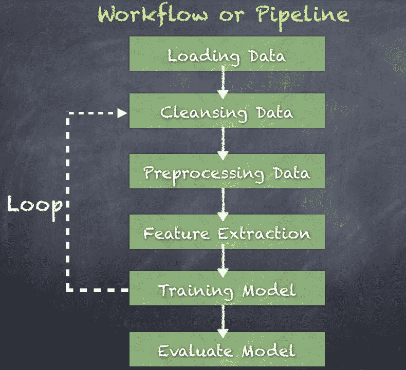

因此，在模型训练之前和随后部署之前，可能存在多个数据转换阶段。此外，我们应该期望特征和模型属性的改进。我们甚至可以探索完全不同的算法，重复整个任务序列作为新工作流的一部分。

可以使用多个转换步骤创建一个管道，并且为此目的，我们使用特定领域的语言（DSL）来定义节点（数据转换步骤）以创建节点的有向无环图（DAG）。因此，ML 管道是一系列转换器和估计器，用于将管道模型拟合到输入数据集。管道中的每个阶段称为*管道阶段*，列举如下：

+   估计器

+   模型

+   管道

+   变压器

+   预测器

当你看一行文本时，我们看到句子、短语、单词、名词、动词、标点等等，这些放在一起时有意义和目的。人类非常擅长理解句子、单词和俚语，以及注释或上下文。这来自多年的练习和学习如何阅读/写作、正确的语法、标点、感叹号等等。那么，我们如何编写计算机程序来尝试复制这种能力呢？

# 文本分析

文本分析是从一系列文本中解锁含义的方法。通过使用各种技术和算法来处理和分析文本数据，我们可以发现数据中的模式和主题。所有这些的目标是理解非结构化文本，以便推导出上下文的含义和关系。

文本分析利用了几种广泛的技术类别，接下来我们将介绍。

# 情感分析

分析人们在 Facebook、Twitter 和其他社交媒体上的政治观点是情感分析的一个很好的例子。同样，分析 Yelp 上餐厅的评论也是情感分析的另一个很好的例子。

自然语言处理（NLP）框架和库，如 OpenNLP 和 Stanford NLP，通常用于实现情感分析。

# 主题建模

主题建模是一种用于检测语料库中主题或主题的有用技术。这是一种无监督算法，可以在一组文档中找到主题。一个例子是检测新闻文章中涵盖的主题。另一个例子是检测专利申请中的想法。

潜在狄利克雷分配（LDA）是使用无监督算法的流行聚类模型，而潜在语义分析（LSA）使用共现数据的概率模型。

# TF-IDF（词项频率 - 逆文档频率）

TF-IDF 衡量单词在文档中出现的频率以及在文档集中的相对频率。这些信息可以用于构建分类器和预测模型。例如垃圾邮件分类、聊天对话等。

# 命名实体识别（NER）

命名实体识别检测句子中单词和名词的使用，以提取有关个人、组织、位置等信息。这提供了有关文档实际内容的重要上下文信息，而不仅仅将单词视为主要实体。

斯坦福 NLP 和 OpenNLP 都实现了 NER 算法。

# 事件提取

事件提取扩展了 NER，建立了围绕检测到的实体的关系。这可以用于推断两个实体之间的关系。因此，还有一个额外的语义理解层来理解文档内容。

# 变压器和估计器

**变压器**是一个函数对象，通过将变换逻辑（函数）应用于输入数据集，将一个数据集转换为另一个数据集。有两种类型的变压器，标准变压器和估计器变压器。

# 标准变压器

标准变压器将输入数据集显式地转换为输出数据集，应用变换函数到输入数据上。除了读取输入列并生成输出列之外，不依赖于输入数据。

这些变压器如下所示被调用：

```scala
*outputDF = transfomer.*transform*(inputDF)*

```

标准变压器的示例如下，并将在后续部分详细解释：

+   `Tokenizer`：这使用空格作为分隔符将句子分割成单词

+   `RegexTokenizer`：这使用正则表达式将句子分割成单词

+   `StopWordsRemover`：这从单词列表中移除常用的停用词

+   `Binarizer`：这将字符串转换为二进制数字 0/1

+   `NGram`：这从句子中创建 N 个词组

+   `HashingTF`：这使用哈希表创建词项频率计数以索引单词

+   `SQLTransformer`：这实现了由 SQL 语句定义的转换

+   `VectorAssembler`：这将给定的列列表合并成一个单独的向量列

标准变压器的图示如下，其中来自输入数据集的输入列被转换为生成输出数据集的输出列：

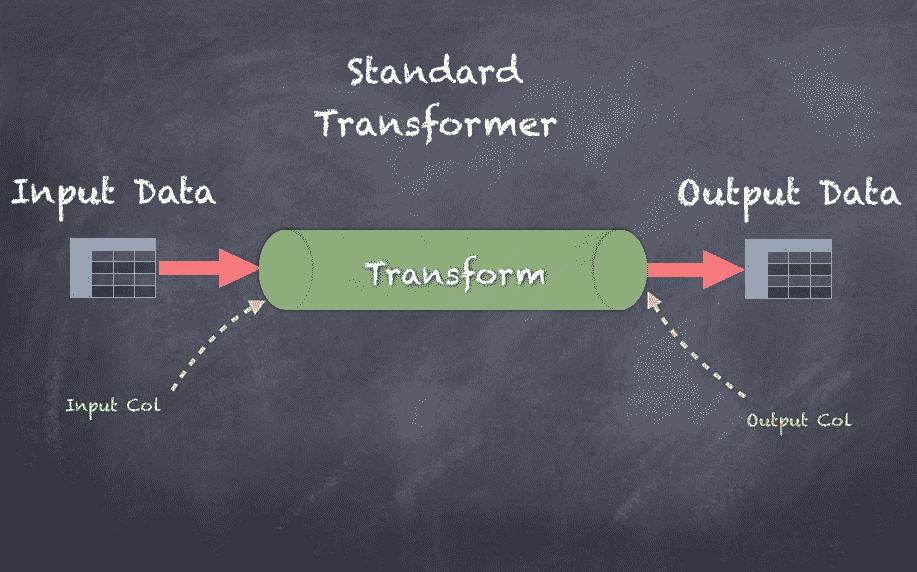

# 估计器变压器

估计器变压器通过首先基于输入数据集生成一个变压器，然后变压器处理输入数据，读取输入列并在输出数据集中生成输出列来将输入数据集转换为输出数据集。

这些变压器如下所示被调用：

```scala
*transformer = estimator.*fit*(inputDF)* *outputDF = transformer.*transform*(inputDF)*

```

估计器变压器的示例如下：

+   IDF

+   LDA

+   Word2Vec

估计器变压器的图示如下，其中来自输入数据集的输入列被转换为生成输出数据集的输出列：

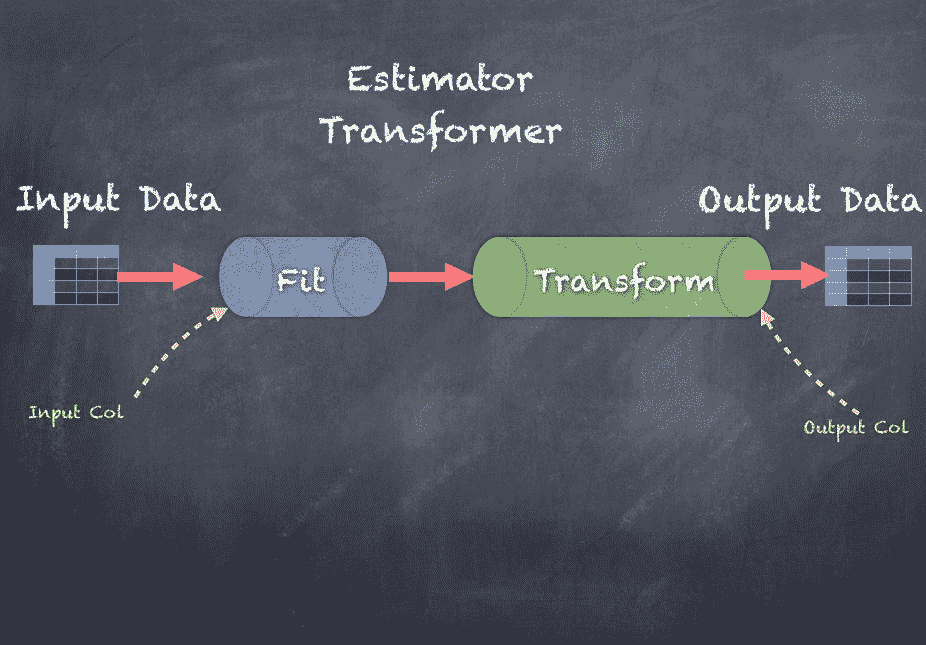

在接下来的几节中，我们将深入研究使用一个简单示例数据集进行文本分析，该数据集由文本行（句子）组成，如下截图所示：

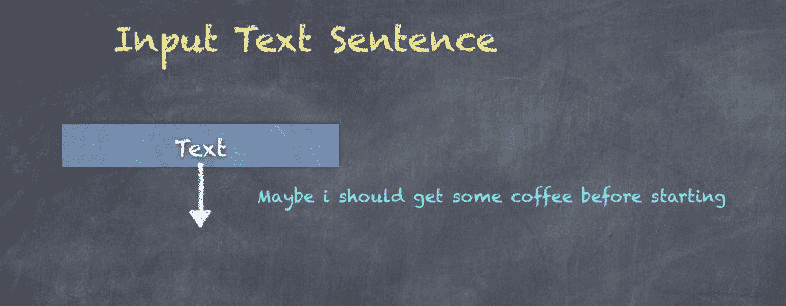

即将出现的代码用于将文本数据加载到输入数据集中。

使用下面显示的 ID 和文本对序列初始化一个名为 lines 的句子序列。

```scala
val lines = Seq(
 | (1, "Hello there, how do you like the book so far?"),
 | (2, "I am new to Machine Learning"),
 | (3, "Maybe i should get some coffee before starting"),
 | (4, "Coffee is best when you drink it hot"),
 | (5, "Book stores have coffee too so i should go to a book store")
 | )
lines: Seq[(Int, String)] = List((1,Hello there, how do you like the book so far?), (2,I am new to Machine Learning), (3,Maybe i should get some coffee before starting), (4,Coffee is best when you drink it hot), (5,Book stores have coffee too so i should go to a book store))

```

接下来，调用`createDataFrame()`函数从我们之前看到的句子序列创建一个 DataFrame。

```scala
scala> val sentenceDF = spark.createDataFrame(lines).toDF("id", "sentence")
sentenceDF: org.apache.spark.sql.DataFrame = [id: int, sentence: string]

```

现在您可以看到新创建的数据集，其中显示了包含两列 ID 和句子的句子 DataFrame。

```scala
scala> sentenceDF.show(false)
|id|sentence |
|1 |Hello there, how do you like the book so far? |
|2 |I am new to Machine Learning |
|3 |Maybe i should get some coffee before starting |
|4 |Coffee is best when you drink it hot |
|5 |Book stores have coffee too so i should go to a book store|

```

# 标记化

**Tokenizer**将输入字符串转换为小写，然后使用空格将字符串分割为单独的标记。给定的句子被分割成单词，可以使用默认的空格分隔符，也可以使用基于正则表达式的分词器。在任何情况下，输入列都会被转换为输出列。特别是，输入列通常是一个字符串，输出列是一个单词序列。

通过导入下面显示的两个包，可以使用分词器：`Tokenizer`和`RegexTokenize`：

```scala
import org.apache.spark.ml.feature.Tokenizer
import org.apache.spark.ml.feature.RegexTokenizer

```

首先，您需要初始化一个`Tokenizer`，指定输入列和输出列：

```scala
scala> val tokenizer = new Tokenizer().setInputCol("sentence").setOutputCol("words")
tokenizer: org.apache.spark.ml.feature.Tokenizer = tok_942c8332b9d8

```

接下来，在输入数据集上调用`transform()`函数会产生一个输出数据集：

```scala
scala> val wordsDF = tokenizer.transform(sentenceDF)
wordsDF: org.apache.spark.sql.DataFrame = [id: int, sentence: string ... 1 more field]

```

以下是输出数据集，显示了输入列 ID、句子和包含单词序列的输出列 words：

```scala
scala> wordsDF.show(false)
|id|sentence |words |
|1 |Hello there, how do you like the book so far? |[hello, there,, how, do, you, like, the, book, so, far?] |
|2 |I am new to Machine Learning |[i, am, new, to, machine, learning] |
|3 |Maybe i should get some coffee before starting |[maybe, i, should, get, some, coffee, before, starting] |
|4 |Coffee is best when you drink it hot |[coffee, is, best, when, you, drink, it, hot] |
|5 |Book stores have coffee too so i should go to a book store|[book, stores, have, coffee, too, so, i, should, go, to, a, book, store]|

```

另一方面，如果您想要设置基于正则表达式的`Tokenizer`，您需要使用`RegexTokenizer`而不是`Tokenizer`。为此，您需要初始化一个`RegexTokenizer`，指定输入列和输出列，以及要使用的正则表达式模式：

```scala
scala> val regexTokenizer = new RegexTokenizer().setInputCol("sentence").setOutputCol("regexWords").setPattern("\\W")
regexTokenizer: org.apache.spark.ml.feature.RegexTokenizer = regexTok_15045df8ce41

```

接下来，在输入数据集上调用`transform()`函数会产生一个输出数据集：

```scala
scala> val regexWordsDF = regexTokenizer.transform(sentenceDF)
regexWordsDF: org.apache.spark.sql.DataFrame = [id: int, sentence: string ... 1 more field]

```

以下是输出数据集，显示了输入列 ID、句子和包含单词序列的输出列`regexWordsDF`：

```scala
scala> regexWordsDF.show(false)
|id|sentence |regexWords |
|1 |Hello there, how do you like the book so far? |[hello, there, how, do, you, like, the, book, so, far] |
|2 |I am new to Machine Learning |[i, am, new, to, machine, learning] |
|3 |Maybe i should get some coffee before starting |[maybe, i, should, get, some, coffee, before, starting] |
|4 |Coffee is best when you drink it hot |[coffee, is, best, when, you, drink, it, hot] |
|5 |Book stores have coffee too so i should go to a book store|[book, stores, have, coffee, too, so, i, should, go, to, a, book, store]|

```

`Tokenizer`的图示如下，其中来自输入文本的句子使用空格分隔成单词：

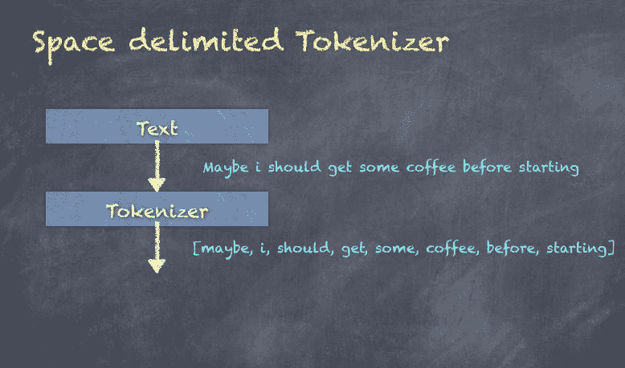

# StopWordsRemover

`StopWordsRemover`是一个转换器，它接受一个`String`数组的单词，并在删除所有定义的停用词后返回一个`String`数组。一些停用词的例子是 I，you，my，and，or 等，在英语中非常常用。您可以覆盖或扩展停用词集以适应用例的目的。如果没有进行这种清洗过程，后续的算法可能会因为常用单词而产生偏见。

为了调用`StopWordsRemover`，您需要导入以下包：

```scala
import org.apache.spark.ml.feature.StopWordsRemover

```

首先，您需要初始化一个`StopWordsRemover`，指定输入列和输出列。在这里，我们选择了`Tokenizer`创建的单词列，并生成了一个输出列，用于删除停用词后的过滤单词：

```scala
scala> val remover = new StopWordsRemover().setInputCol("words").setOutputCol("filteredWords")
remover: org.apache.spark.ml.feature.StopWordsRemover = stopWords_48d2cecd3011

```

接下来，在输入数据集上调用`transform()`函数会产生一个输出数据集：

```scala
scala> val noStopWordsDF = remover.transform(wordsDF)
noStopWordsDF: org.apache.spark.sql.DataFrame = [id: int, sentence: string ... 2 more fields]

```

以下是输出数据集，显示了输入列 ID、句子和包含单词序列的输出列`filteredWords`：

```scala
scala> noStopWordsDF.show(false)
|id|sentence |words |filteredWords |
|1 |Hello there, how do you like the book so far? |[hello, there,, how, do, you, like, the, book, so, far?] |[hello, there,, like, book, far?] |
|2 |I am new to Machine Learning |[i, am, new, to, machine, learning] |[new, machine, learning] |
|3 |Maybe i should get some coffee before starting |[maybe, i, should, get, some, coffee, before, starting] |[maybe, get, coffee, starting] |
|4 |Coffee is best when you drink it hot |[coffee, is, best, when, you, drink, it, hot] |[coffee, best, drink, hot] |
|5 |Book stores have coffee too so i should go to a book store|[book, stores, have, coffee, too, so, i, should, go, to, a, book, store]|[book, stores, coffee, go, book, store]|

```

以下是输出数据集，只显示了句子和`filteredWords`，其中包含过滤后的单词序列：

```scala

scala> noStopWordsDF.select("sentence", "filteredWords").show(5,false)
|sentence |filteredWords |
|Hello there, how do you like the book so far? |[hello, there,, like, book, far?] |
|I am new to Machine Learning |[new, machine, learning] |
|Maybe i should get some coffee before starting |[maybe, get, coffee, starting] |
|Coffee is best when you drink it hot |[coffee, best, drink, hot] |
|Book stores have coffee too so i should go to a book store|[book, stores, coffee, go, book, store]|

```

`StopWordsRemover`的图示如下，显示了过滤后的单词，删除了诸如 I，should，some 和 before 等停用词：

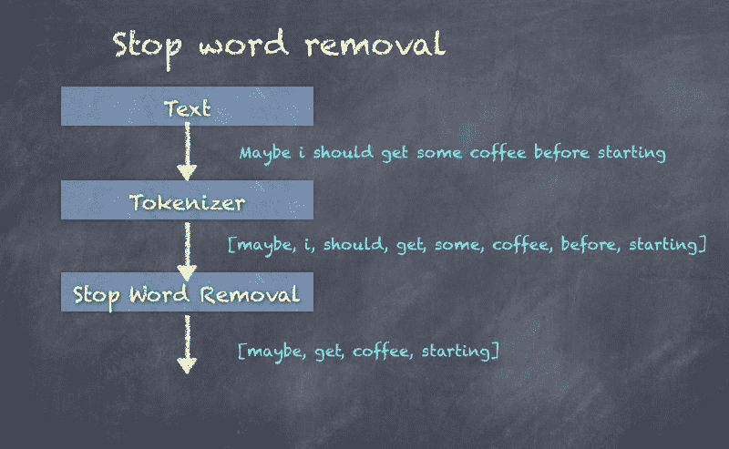

停用词默认设置，但可以非常容易地被覆盖或修改，如下面的代码片段所示，在这里我们将从过滤后的单词中删除 hello，将 hello 视为停用词：

```scala
scala> val noHello = Array("hello") ++ remover.getStopWords
noHello: Array[String] = Array(hello, i, me, my, myself, we, our, ours, ourselves, you, your, yours, yourself, yourselves, he, him, his, himself, she, her, hers, herself, it, its, itself, they, them, their, theirs, themselves, what, which, who, whom, this, that, these, those, am, is, are, was, were ...
scala>

//create new transfomer using the amended Stop Words list
scala> val removerCustom = new StopWordsRemover().setInputCol("words").setOutputCol("filteredWords").setStopWords(noHello)
removerCustom: org.apache.spark.ml.feature.StopWordsRemover = stopWords_908b488ac87f

//invoke transform function
scala> val noStopWordsDFCustom = removerCustom.transform(wordsDF)
noStopWordsDFCustom: org.apache.spark.sql.DataFrame = [id: int, sentence: string ... 2 more fields]

//output dataset showing only sentence and filtered words - now will not show hello
scala> noStopWordsDFCustom.select("sentence", "filteredWords").show(5,false)
+----------------------------------------------------------+---------------------------------------+
|sentence |filteredWords |
+----------------------------------------------------------+---------------------------------------+
|Hello there, how do you like the book so far? |[there,, like, book, far?] |
|I am new to Machine Learning |[new, machine, learning] |
|Maybe i should get some coffee before starting |[maybe, get, coffee, starting] |
|Coffee is best when you drink it hot |[coffee, best, drink, hot] |
|Book stores have coffee too so i should go to a book store|[book, stores, coffee, go, book, store]|
+----------------------------------------------------------+---------------------------------------+

```

# NGrams

NGrams 是由单词组合而成的单词序列。N 代表序列中的单词数。例如，2-gram 是两个单词在一起，3-gram 是三个单词在一起。`setN()`用于指定`N`的值。

为了生成 NGrams，您需要导入该包：

```scala
import org.apache.spark.ml.feature.NGram

```

首先，您需要初始化一个`NGram`生成器，指定输入列和输出列。在这里，我们选择了`StopWordsRemover`创建的过滤后的单词列，并生成了一个输出列，用于删除停用词后的过滤单词：

```scala
scala> val ngram = new NGram().setN(2).setInputCol("filteredWords").setOutputCol("ngrams")
ngram: org.apache.spark.ml.feature.NGram = ngram_e7a3d3ab6115

```

接下来，在输入数据集上调用`transform()`函数会产生一个输出数据集：

```scala
scala> val nGramDF = ngram.transform(noStopWordsDF)
nGramDF: org.apache.spark.sql.DataFrame = [id: int, sentence: string ... 3 more fields]

```

以下是输出数据集，显示了输入列 ID、句子和包含 n-gram 序列的输出列`ngram`：

```scala
scala> nGramDF.show(false)
|id|sentence |words |filteredWords |ngrams |
|1 |Hello there, how do you like the book so far? |[hello, there,, how, do, you, like, the, book, so, far?] |[hello, there,, like, book, far?] |[hello there,, there, like, like book, book far?] |
|2 |I am new to Machine Learning |[i, am, new, to, machine, learning] |[new, machine, learning] |[new machine, machine learning] |
|3 |Maybe i should get some coffee before starting |[maybe, i, should, get, some, coffee, before, starting] |[maybe, get, coffee, starting] |[maybe get, get coffee, coffee starting] |
|4 |Coffee is best when you drink it hot |[coffee, is, best, when, you, drink, it, hot] |[coffee, best, drink, hot] |[coffee best, best drink, drink hot] |
|5 |Book stores have coffee too so i should go to a book store|[book, stores, have, coffee, too, so, i, should, go, to, a, book, store]|[book, stores, coffee, go, book, store]|[book stores, stores coffee, coffee go, go book, book store]|

```

以下是输出数据集，显示了句子和 2-gram：

```scala
scala> nGramDF.select("sentence", "ngrams").show(5,false)
|sentence |ngrams |
|Hello there, how do you like the book so far? |[hello there,, there, like, like book, book far?] |
|I am new to Machine Learning |[new machine, machine learning] |
|Maybe i should get some coffee before starting |[maybe get, get coffee, coffee starting] |
|Coffee is best when you drink it hot |[coffee best, best drink, drink hot] |
|Book stores have coffee too so i should go to a book store|[book stores, stores coffee, coffee go, go book, book store]|

```

NGram 的图如下所示，显示了在分词和去除停用词后生成的 2-gram：

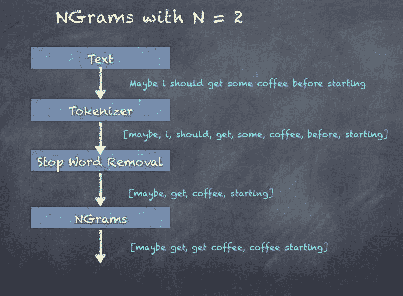

# TF-IDF

TF-IDF 代表词项频率-逆文档频率，它衡量了一个词在文档集合中对于一个文档的重要性。它在信息检索中被广泛使用，反映了词在文档中的权重。TF-IDF 值与词的出现次数成正比增加，也就是词频，由词频和逆文档频率两个关键元素组成。

TF 是词项频率，即文档中词/术语的频率。

对于一个术语*t*，*tf*衡量了术语*t*在文档*d*中出现的次数。*tf*在 Spark 中使用哈希实现，其中一个术语通过应用哈希函数映射到一个索引。

IDF 是逆文档频率，代表了一个术语提供的关于该术语在文档中出现倾向的信息。 IDF 是包含该术语的文档的对数缩放的逆函数：

IDF = 总文档数/包含该词的文档数

一旦我们有了*TF*和*IDF*，我们可以通过将它们相乘来计算*TF-IDF*值：

TF-IDF = TF * IDF

我们现在将看一下如何使用 Spark ML 中的 HashingTF Transformer 生成*TF*。

# HashingTF

**HashingTF**是一个 Transformer，它接受一组术语，并通过使用哈希函数对每个术语进行哈希，将它们转换为固定长度的向量。然后，使用哈希表的索引生成词项频率。

在 Spark 中，HashingTF 使用**MurmurHash3**算法对术语进行哈希。

为了使用`HashingTF`，你需要导入以下包：

```scala
import org.apache.spark.ml.feature.HashingTF

```

首先，你需要初始化一个`HashingTF`，指定输入列和输出列。在这里，我们选择了`StopWordsRemover` Transformer 创建的过滤词列，并生成一个输出列`rawFeaturesDF`。我们还选择了 100 个特征：

```scala
scala> val hashingTF = new HashingTF().setInputCol("filteredWords").setOutputCol("rawFeatures").setNumFeatures(100)
hashingTF: org.apache.spark.ml.feature.HashingTF = hashingTF_b05954cb9375

```

接下来，在输入数据集上调用`transform()`函数会产生一个输出数据集：

```scala
scala> val rawFeaturesDF = hashingTF.transform(noStopWordsDF)
rawFeaturesDF: org.apache.spark.sql.DataFrame = [id: int, sentence: string ... 3 more fields]

```

以下是输出数据集，显示了输入列 ID、句子和输出列`rawFeaturesDF`，其中包含由向量表示的特征：

```scala
scala> rawFeaturesDF.show(false)
|id |sentence |words |filteredWords |rawFeatures |
|1 |Hello there, how do you like the book so far? |[hello, there,, how, do, you, like, the, book, so, far?] |[hello, there,, like, book, far?] |(100,[30,48,70,93],[2.0,1.0,1.0,1.0]) |
|2 |I am new to Machine Learning |[i, am, new, to, machine, learning] |[new, machine, learning] |(100,[25,52,72],[1.0,1.0,1.0]) |
|3 |Maybe i should get some coffee before starting |[maybe, i, should, get, some, coffee, before, starting] |[maybe, get, coffee, starting] |(100,[16,51,59,99],[1.0,1.0,1.0,1.0]) |
|4 |Coffee is best when you drink it hot |[coffee, is, best, when, you, drink, it, hot] |[coffee, best, drink, hot] |(100,[31,51,63,72],[1.0,1.0,1.0,1.0]) |
|5 |Book stores have coffee too so i should go to a book store|[book, stores, have, coffee, too, so, i, should, go, to, a, book, store]|[book, stores, coffee, go, book, store]|(100,[43,48,51,77,93],[1.0,1.0,1.0,1.0,2.0])|

```

让我们看一下前面的输出，以便更好地理解。如果你只看`filteredWords`和`rawFeatures`两列，你会发现，

1.  单词数组`[hello, there, like, book, and far]`被转换为原始特征向量`(100,[30,48,70,93],[2.0,1.0,1.0,1.0])`。

1.  单词数组`(book, stores, coffee, go, book, and store)`被转换为原始特征向量`(100,[43,48,51,77,93],[1.0,1.0,1.0,1.0,2.0])`。

那么，这个向量代表什么呢？其基本逻辑是，每个单词被哈希成一个整数，并计算在单词数组中出现的次数。

Spark 在内部使用`mutable.HashMap.empty[Int, Double]`来存储每个单词的哈希值作为`Integer`键和出现次数作为 double 值。使用 Double 是为了能够与 IDF 一起使用（我们将在下一节讨论）。使用这个映射，数组`[book, stores, coffee, go, book, store]`可以看作是`[hashFunc(book), hashFunc(stores), hashFunc(coffee), hashFunc(go), hashFunc(book), hashFunc(store)]`，即`[43,48,51,77,93]`。然后，如果你也计算出现次数，即`book-2, coffee-1,go-1,store-1,stores-1`。

结合前面的信息，我们可以生成一个向量`(numFeatures, hashValues, Frequencies)`，在这种情况下将是`(100,[43,48,51,77,93],[1.0,1.0,1.0,1.0,2.0])`。

# 逆文档频率（IDF）

**逆文档频率**（**IDF**）是一个估计器，它适用于数据集，然后通过缩放输入特征生成特征。因此，IDF 作用于 HashingTF Transformer 的输出。

为了调用 IDF，您需要导入该包：

```scala
import org.apache.spark.ml.feature.IDF

```

首先，您需要初始化一个`IDF`，指定输入列和输出列。在这里，我们选择由 HashingTF 创建的`rawFeatures`单词列，并生成一个输出列特征：

```scala
scala> val idf = new IDF().setInputCol("rawFeatures").setOutputCol("features")
idf: org.apache.spark.ml.feature.IDF = idf_d8f9ab7e398e

```

接下来，在输入数据集上调用`fit()`函数会产生一个输出 Transformer：

```scala
scala> val idfModel = idf.fit(rawFeaturesDF)
idfModel: org.apache.spark.ml.feature.IDFModel = idf_d8f9ab7e398e

```

此外，在输入数据集上调用`transform()`函数会产生一个输出数据集：

```scala
scala> val featuresDF = idfModel.transform(rawFeaturesDF)
featuresDF: org.apache.spark.sql.DataFrame = [id: int, sentence: string ... 4 more fields]

```

以下是显示输入列 ID 和输出列特征的输出数据集，其中包含由前一个转换中的 HashingTF 生成的缩放特征的向量：

```scala
scala> featuresDF.select("id", "features").show(5, false)
|id|features |
|1 |(20,[8,10,13],[0.6931471805599453,3.295836866004329,0.6931471805599453]) |
|2 |(20,[5,12],[1.0986122886681098,1.3862943611198906]) |
|3 |(20,[11,16,19],[0.4054651081081644,1.0986122886681098,2.1972245773362196]) |
|4 |(20,[3,11,12],[0.6931471805599453,0.8109302162163288,0.6931471805599453]) |
|5 |(20,[3,8,11,13,17],[0.6931471805599453,0.6931471805599453,0.4054651081081644,1.3862943611198906,1.0986122886681098])|

```

以下是显示输入列 ID、句子、`rawFeatures`和输出列特征的输出数据集，其中包含由前一个转换中的 HashingTF 生成的缩放特征的向量：

```scala

scala> featuresDF.show(false)
|id|sentence |words |filteredWords |rawFeatures |features |
|1 |Hello there, how do you like the book so far? |[hello, there,, how, do, you, like, the, book, so, far?] |[hello, there,, like, book, far?] |(20,[8,10,13],[1.0,3.0,1.0]) |(20,[8,10,13],[0.6931471805599453,3.295836866004329,0.6931471805599453]) |
|2 |I am new to Machine Learning |[i, am, new, to, machine, learning] |[new, machine, learning] |(20,[5,12],[1.0,2.0]) |(20,[5,12],[1.0986122886681098,1.3862943611198906]) |
|3 |Maybe i should get some coffee before starting |[maybe, i, should, get, some, coffee, before, starting] |[maybe, get, coffee, starting] |(20,[11,16,19],[1.0,1.0,2.0]) |(20,[11,16,19],[0.4054651081081644,1.0986122886681098,2.1972245773362196]) |
|4 |Coffee is best when you drink it hot |[coffee, is, best, when, you, drink, it, hot] |[coffee, best, drink, hot] |(20,[3,11,12],[1.0,2.0,1.0]) |(20,[3,11,12],[0.6931471805599453,0.8109302162163288,0.6931471805599453]) |
|5 |Book stores have coffee too so i should go to a book store|[book, stores, have, coffee, too, so, i, should, go, to, a, book, store]|[book, stores, coffee, go, book, store]|(20,[3,8,11,13,17],[1.0,1.0,1.0,2.0,1.0])|(20,[3,8,11,13,17],[0.6931471805599453,0.6931471805599453,0.4054651081081644,1.3862943611198906,1.0986122886681098])|

```

TF-IDF 的图如下，显示了**TF-IDF 特征**的生成：

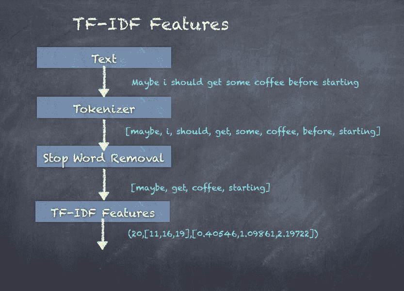

# Word2Vec

Word2Vec 是一种复杂的神经网络风格的自然语言处理工具，使用一种称为**skip-grams**的技术将单词句子转换为嵌入式向量表示。让我们看一个关于动物的句子集合的示例：

+   一只狗在吠叫

+   一些奶牛在吃草

+   狗通常会随机吠叫

+   牛喜欢草

使用具有隐藏层的神经网络（在许多无监督学习应用中使用的机器学习算法），我们可以学习（有足够的例子）*dog*和*barking*相关，*cow*和*grass*相关，它们经常一起出现，这是由概率来衡量的。`Word2vec`的输出是`Double`特征的向量。

为了调用`Word2vec`，您需要导入该包：

```scala
import org.apache.spark.ml.feature.Word2Vec

```

首先，您需要初始化一个`Word2vec` Transformer，指定输入列和输出列。在这里，我们选择由`Tokenizer`创建的单词列，并生成大小为 3 的单词向量输出列：

```scala
scala> val word2Vec = new Word2Vec().setInputCol("words").setOutputCol("wordvector").setVectorSize(3).setMinCount(0)
word2Vec: org.apache.spark.ml.feature.Word2Vec = w2v_fe9d488fdb69

```

接下来，在输入数据集上调用`fit()`函数会产生一个输出 Transformer：

```scala
scala> val word2VecModel = word2Vec.fit(noStopWordsDF)
word2VecModel: org.apache.spark.ml.feature.Word2VecModel = w2v_fe9d488fdb69

```

此外，在输入数据集上调用`transform()`函数会产生一个输出数据集：

```scala
scala> val word2VecDF = word2VecModel.transform(noStopWordsDF)
word2VecDF: org.apache.spark.sql.DataFrame = [id: int, sentence: string ... 3 more fields]

```

以下是显示输入列 ID、句子和输出列`wordvector`的输出数据集：

```scala
scala> word2VecDF.show(false)
|id|sentence |words |filteredWords |wordvector |
|1 |Hello there, how do you like the book so far? |[hello, there,, how, do, you, like, the, book, so, far?] |[hello, there,, like, book, far?] |[0.006875938177108765,-0.00819675214588642,0.0040686681866645815]|
|2 |I am new to Machine Learning |[i, am, new, to, machine, learning] |[new, machine, learning] |[0.026012470324834187,0.023195965060343344,-0.10863214979569116] |
|3 |Maybe i should get some coffee before starting |[maybe, i, should, get, some, coffee, before, starting] |[maybe, get, coffee, starting] |[-0.004304863978177309,-0.004591284319758415,0.02117823390290141]|
|4 |Coffee is best when you drink it hot |[coffee, is, best, when, you, drink, it, hot] |[coffee, best, drink, hot] |[0.054064739029854536,-0.003801364451646805,0.06522738828789443] |
|5 |Book stores have coffee too so i should go to a book store|[book, stores, have, coffee, too, so, i, should, go, to, a, book, store]|[book, stores, coffee, go, book, store]|[-0.05887459063281615,-0.07891856770341595,0.07510609552264214] |

```

**Word2Vec 特征**的图如下，显示了单词被转换为向量：

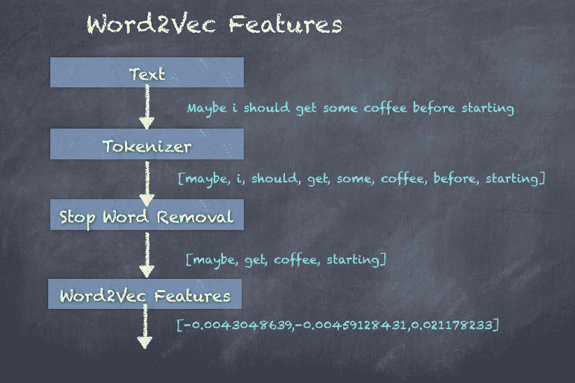

# CountVectorizer

`CountVectorizer`用于将一组文本文档转换为标记计数的向量，从本质上为文档生成稀疏表示。最终结果是一组特征向量，然后可以传递给其他算法。稍后，我们将看到如何在 LDA 算法中使用`CountVectorizer`的输出执行主题检测。

为了调用`CountVectorizer`，您需要导入该包：

```scala
import org.apache.spark.ml.feature.CountVectorizer

```

首先，您需要初始化一个`CountVectorizer` Transformer，指定输入列和输出列。在这里，我们选择由`StopWordRemover`创建的`filteredWords`列，并生成输出列特征：

```scala
scala> val countVectorizer = new CountVectorizer().setInputCol("filteredWords").setOutputCol("features")
countVectorizer: org.apache.spark.ml.feature.CountVectorizer = cntVec_555716178088

```

接下来，在输入数据集上调用`fit()`函数会产生一个输出 Transformer：

```scala
scala> val countVectorizerModel = countVectorizer.fit(noStopWordsDF)
countVectorizerModel: org.apache.spark.ml.feature.CountVectorizerModel = cntVec_555716178088

```

此外，在输入数据集上调用`transform()`函数会产生一个输出数据集。

```scala
scala> val countVectorizerDF = countVectorizerModel.transform(noStopWordsDF)
countVectorizerDF: org.apache.spark.sql.DataFrame = [id: int, sentence: string ... 3 more fields]

```

以下是显示输入列 ID、句子和输出列特征的输出数据集：

```scala
scala> countVectorizerDF.show(false)
|id |sentence |words |filteredWords |features |
|1 |Hello there, how do you like the book so far? |[hello, there,, how, do, you, like, the, book, so, far?] |[hello, there,, like, book, far?] |(18,[1,4,5,13,15],[1.0,1.0,1.0,1.0,1.0])|
|2 |I am new to Machine Learning |[i, am, new, to, machine, learning] |[new, machine, learning] |(18,[6,7,16],[1.0,1.0,1.0]) |
|3 |Maybe i should get some coffee before starting |[maybe, i, should, get, some, coffee, before, starting] |[maybe, get, coffee, starting] |(18,[0,8,9,14],[1.0,1.0,1.0,1.0]) |
|4 |Coffee is best when you drink it hot |[coffee, is, best, when, you, drink, it, hot] |[coffee, best, drink, hot] |(18,[0,3,10,12],[1.0,1.0,1.0,1.0]) |
|5 |Book stores have coffee too so i should go to a book store|[book, stores, have, coffee, too, so, i, should, go, to, a, book, store]|[book, stores, coffee, go, book, store]|(18,[0,1,2,11,17],[1.0,2.0,1.0,1.0,1.0])|

```

`CountVectorizer`的图如下，显示了从`StopWordsRemover`转换生成的特征：

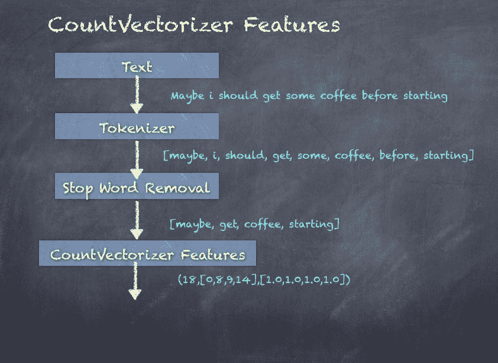

# 使用 LDA 进行主题建模

LDA 是一种主题模型，它从一组文本文档中推断主题。LDA 可以被视为一种无监督的聚类算法，如下所示：

+   主题对应于聚类中心，文档对应于数据集中的行

+   主题和文档都存在于特征空间中，特征向量是单词计数的向量

+   LDA 不是使用传统距离估计聚类，而是使用基于文本文档生成的统计模型的函数

为了调用 LDA，您需要导入该包：

```scala
import org.apache.spark.ml.clustering.LDA

```

**步骤 1.** 首先，您需要初始化一个设置 10 个主题和 10 次聚类的 LDA 模型：

```scala
scala> val lda = new LDA().setK(10).setMaxIter(10)
lda: org.apache.spark.ml.clustering.LDA = lda_18f248b08480

```

**步骤 2.** 在输入数据集上调用`fit()`函数会产生一个输出转换器：

```scala
scala> val ldaModel = lda.fit(countVectorizerDF)
ldaModel: org.apache.spark.ml.clustering.LDAModel = lda_18f248b08480

```

**步骤 3.** 提取`logLikelihood`，它计算了给定推断主题的文档的下限：

```scala
scala> val ll = ldaModel.logLikelihood(countVectorizerDF)
ll: Double = -275.3298948279124

```

**步骤 4.** 提取`logPerplexity`，它计算了给定推断主题的文档的困惑度的上限：

```scala
scala> val lp = ldaModel.logPerplexity(countVectorizerDF)
lp: Double = 12.512670220189033

```

**步骤 5.** 现在，我们可以使用`describeTopics()`来获取 LDA 生成的主题：

```scala
scala> val topics = ldaModel.describeTopics(10)
topics: org.apache.spark.sql.DataFrame = [topic: int, termIndices: array<int> ... 1 more field]

```

**步骤 6.** 以下是 LDA 模型计算的`topic`、`termIndices`和`termWeights`的输出数据集：

```scala
scala> topics.show(10, false)
|topic|termIndices |termWeights |
|0 |[2, 5, 7, 12, 17, 9, 13, 16, 4, 11] |[0.06403877783050851, 0.0638177222807826, 0.06296749987731722, 0.06129482302538905, 0.05906095287220612, 0.0583855194291998, 0.05794181263149175, 0.057342702589298085, 0.05638654243412251, 0.05601913313272188] |
|1 |[15, 5, 13, 8, 1, 6, 9, 16, 2, 14] |[0.06889315890755099, 0.06415969116685549, 0.058990446579892136, 0.05840283223031986, 0.05676844625413551, 0.0566842803396241, 0.05633554021408156, 0.05580861561950114, 0.055116582320533423, 0.05471754535803045] |
|2 |[17, 14, 1, 5, 12, 2, 4, 8, 11, 16] |[0.06230542516700517, 0.06207673834677118, 0.06089143673912089, 0.060721809302399316, 0.06020894045877178, 0.05953822260375286, 0.05897033457363252, 0.057504989644756616, 0.05586725037894327, 0.05562088924566989] |
|3 |[15, 2, 11, 16, 1, 7, 17, 8, 10, 3] |[0.06995373276880751, 0.06249041124300946, 0.061960612781077645, 0.05879695651399876, 0.05816564815895558, 0.05798721645705949, 0.05724374708387087, 0.056034215734402475, 0.05474217418082123, 0.05443850583761207] |
|4 |[16, 9, 5, 7, 1, 12, 14, 10, 13, 4] |[0.06739359010780331, 0.06716438619386095, 0.06391509491709904, 0.062049068666162915, 0.06050715515506004, 0.05925113958472128, 0.057946856127790804, 0.05594837087703049, 0.055000929117413805, 0.053537418286233956]|
|5 |[5, 15, 6, 17, 7, 8, 16, 11, 10, 2] |[0.061611492476326836, 0.06131944264846151, 0.06092975441932787, 0.059812552365763404, 0.05959889552537741, 0.05929123338151455, 0.05899808901872648, 0.05892061664356089, 0.05706951425713708, 0.05636134431063274] |
|6 |[15, 0, 4, 14, 2, 10, 13, 7, 6, 8] |[0.06669864676186414, 0.0613859230159798, 0.05902091745149218, 0.058507882633921676, 0.058373998449322555, 0.05740944364508325, 0.057039150886628136, 0.057021822698594314, 0.05677330199892444, 0.056741558062814376]|
|7 |[12, 9, 8, 15, 16, 4, 7, 13, 17, 10]|[0.06770789917351365, 0.06320078344027158, 0.06225712567900613, 0.058773135159638154, 0.05832535181576588, 0.057727684814461444, 0.056683575112703555, 0.05651178333610803, 0.056202395617563274, 0.05538103218174723]|
|8 |[14, 11, 10, 7, 12, 9, 13, 16, 5, 1]|[0.06757347958335463, 0.06362319365053591, 0.063359294927315, 0.06319462709331332, 0.05969320243218982, 0.058380063437908046, 0.057412693576813126, 0.056710451222381435, 0.056254581639201336, 0.054737785085167814] |
|9 |[3, 16, 5, 7, 0, 2, 10, 15, 1, 13] |[0.06603941595604573, 0.06312775362528278, 0.06248795574460503, 0.06240547032037694, 0.0613859713404773, 0.06017781222489122, 0.05945655694365531, 0.05910351349013983, 0.05751269894725456, 0.05605239791764803] |

```

LDA 的图如下所示，显示了从 TF-IDF 特征创建的主题：

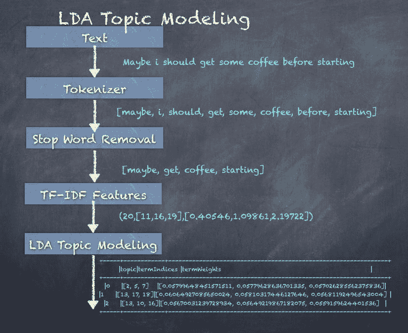

# 实施文本分类

文本分类是机器学习领域中最常用的范例之一，在垃圾邮件检测和电子邮件分类等用例中非常有用，就像任何其他机器学习算法一样，工作流程由转换器和算法构建。在文本处理领域，预处理步骤如去除停用词、词干提取、标记化、n-gram 提取、TF-IDF 特征加权等起着重要作用。一旦所需的处理完成，模型就会被训练来将文档分类为两个或更多类别。

二元分类是将输入分为两个输出类别，例如垃圾邮件/非垃圾邮件和给定的信用卡交易是否欺诈。多类分类可以生成多个输出类别，例如热、冷、冰冻和多雨。还有一种称为多标签分类的技术，可以从汽车特征的描述中生成多个标签，例如速度、安全性和燃油效率。

为此，我们将使用一个包含 10k 条推文的样本数据集，并在该数据集上使用前述技术。然后，我们将将文本行标记为单词，删除停用词，然后使用`CountVectorizer`构建单词（特征）的向量。

然后，我们将数据分为训练（80%）-测试（20%），并训练一个逻辑回归模型。最后，我们将根据测试数据进行评估，并查看其表现如何。

工作流程中的步骤如下图所示：

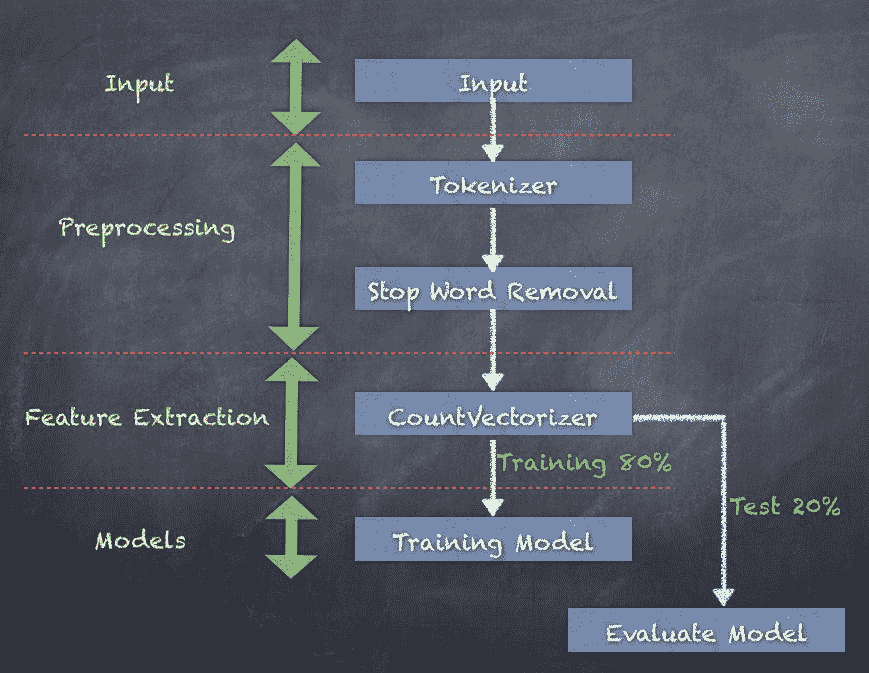

**步骤 1.** 加载包含 10k 条推文以及标签和 ID 的输入文本数据：

```scala
scala> val inputText = sc.textFile("Sentiment_Analysis_Dataset10k.csv")
inputText: org.apache.spark.rdd.RDD[String] = Sentiment_Analysis_Dataset10k.csv MapPartitionsRDD[1722] at textFile at <console>:77

```

**步骤 2.** 将输入行转换为 DataFrame：

```scala
scala> val sentenceDF = inputText.map(x => (x.split(",")(0), x.split(",")(1), x.split(",")(2))).toDF("id", "label", "sentence")
sentenceDF: org.apache.spark.sql.DataFrame = [id: string, label: string ... 1 more field]

```

**步骤 3.** 使用带有空格分隔符的`Tokenizer`将数据转换为单词：

```scala
scala> import org.apache.spark.ml.feature.Tokenizer
import org.apache.spark.ml.feature.Tokenizer

scala> val tokenizer = new Tokenizer().setInputCol("sentence").setOutputCol("words")
tokenizer: org.apache.spark.ml.feature.Tokenizer = tok_ebd4c89f166e

scala> val wordsDF = tokenizer.transform(sentenceDF)
wordsDF: org.apache.spark.sql.DataFrame = [id: string, label: string ... 2 more fields]

scala> wordsDF.show(5, true)
| id|label| sentence| words|
| 1| 0|is so sad for my ...|[is, so, sad, for...|
| 2| 0|I missed the New ...|[i, missed, the, ...|
| 3| 1| omg its already ...|[, omg, its, alre...|
| 4| 0| .. Omgaga. Im s...|[, , .., omgaga.,...|
| 5| 0|i think mi bf is ...|[i, think, mi, bf...|

```

**步骤 4.** 删除停用词并创建一个新的 DataFrame，其中包含过滤后的单词：

```scala
scala> import org.apache.spark.ml.feature.StopWordsRemover
import org.apache.spark.ml.feature.StopWordsRemover

scala> val remover = new StopWordsRemover().setInputCol("words").setOutputCol("filteredWords")
remover: org.apache.spark.ml.feature.StopWordsRemover = stopWords_d8dd48c9cdd0

scala> val noStopWordsDF = remover.transform(wordsDF)
noStopWordsDF: org.apache.spark.sql.DataFrame = [id: string, label: string ... 3 more fields]

scala> noStopWordsDF.show(5, true)
| id|label| sentence| words| filteredWords|
| 1| 0|is so sad for my ...|[is, so, sad, for...|[sad, apl, friend...|
| 2| 0|I missed the New ...|[i, missed, the, ...|[missed, new, moo...|
| 3| 1| omg its already ...|[, omg, its, alre...|[, omg, already, ...|
| 4| 0| .. Omgaga. Im s...|[, , .., omgaga.,...|[, , .., omgaga.,...|
| 5| 0|i think mi bf is ...|[i, think, mi, bf...|[think, mi, bf, c...|

```

**步骤 5.** 从过滤后的单词创建特征向量：

```scala
scala> import org.apache.spark.ml.feature.CountVectorizer
import org.apache.spark.ml.feature.CountVectorizer

scala> val countVectorizer = new CountVectorizer().setInputCol("filteredWords").setOutputCol("features")
countVectorizer: org.apache.spark.ml.feature.CountVectorizer = cntVec_fdf1512dfcbd

scala> val countVectorizerModel = countVectorizer.fit(noStopWordsDF)
countVectorizerModel: org.apache.spark.ml.feature.CountVectorizerModel = cntVec_fdf1512dfcbd

scala> val countVectorizerDF = countVectorizerModel.transform(noStopWordsDF)
countVectorizerDF: org.apache.spark.sql.DataFrame = [id: string, label: string ... 4 more fields]

scala> countVectorizerDF.show(5,true)
| id|label| sentence| words| filteredWords| features|
| 1| 0|is so sad for my ...|[is, so, sad, for...|[sad, apl, friend...|(23481,[35,9315,2...|
| 2| 0|I missed the New ...|[i, missed, the, ...|[missed, new, moo...|(23481,[23,175,97...|
| 3| 1| omg its already ...|[, omg, its, alre...|[, omg, already, ...|(23481,[0,143,686...|
| 4| 0| .. Omgaga. Im s...|[, , .., omgaga.,...|[, , .., omgaga.,...|(23481,[0,4,13,27...|
| 5| 0|i think mi bf is ...|[i, think, mi, bf...|[think, mi, bf, c...|(23481,[0,33,731,...|

```

**步骤 6.** 创建只有标签和特征的`inputData` DataFrame：

```scala

scala> val inputData=countVectorizerDF.select("label", "features").withColumn("label", col("label").cast("double"))
inputData: org.apache.spark.sql.DataFrame = [label: double, features: vector]

```

**步骤 7.** 使用随机拆分将数据拆分为 80%的训练数据集和 20%的测试数据集：

```scala
scala> val Array(trainingData, testData) = inputData.randomSplit(Array(0.8, 0.2))
trainingData: org.apache.spark.sql.Dataset[org.apache.spark.sql.Row] = [label: double, features: vector]
testData: org.apache.spark.sql.Dataset[org.apache.spark.sql.Row] = [label: double, features: vector]

```

**步骤 8.** 创建一个逻辑回归模型：

```scala
scala> import org.apache.spark.ml.classification.LogisticRegression
import org.apache.spark.ml.classification.LogisticRegression

scala> val lr = new LogisticRegression()
lr: org.apache.spark.ml.classification.LogisticRegression = logreg_a56accef5728

```

**步骤 9.** 通过拟合`trainingData`创建一个逻辑回归模型：

```scala
scala> var lrModel = lr.fit(trainingData)
lrModel: org.apache.spark.ml.classification.LogisticRegressionModel = logreg_a56accef5728

scala> lrModel.coefficients
res160: org.apache.spark.ml.linalg.Vector = [7.499178040193577,8.794520490564185,4.837543313917086,-5.995818019393418,1.1754740390468577,3.2104594489397584,1.7840290776286476,-1.8391923375331787,1.3427471762591,6.963032309971087,-6.92725055841986,-10.781468845891563,3.9752.836891070557657,3.8758544006087523,-11.760894935576934,-6.252988307540...

scala> lrModel.intercept
res161: Double = -5.397920610780994

```

**步骤 10.** 检查模型摘要，特别是`areaUnderROC`，对于一个好的模型应该是*> 0.90*：

```scala
scala> import org.apache.spark.ml.classification.BinaryLogisticRegressionSummary
import org.apache.spark.ml.classification.BinaryLogisticRegressionSummary

scala> val summary = lrModel.summary
summary: org.apache.spark.ml.classification.LogisticRegressionTrainingSummary = org.apache.spark.ml.classification.BinaryLogisticRegressionTrainingSummary@1dce712c

scala> val bSummary = summary.asInstanceOf[BinaryLogisticRegressionSummary]
bSummary: org.apache.spark.ml.classification.BinaryLogisticRegressionSummary = org.apache.spark.ml.classification.BinaryLogisticRegressionTrainingSummary@1dce712c

scala> bSummary.areaUnderROC
res166: Double = 0.9999231930196596

scala> bSummary.roc
res167: org.apache.spark.sql.DataFrame = [FPR: double, TPR: double]

scala> bSummary.pr.show()
| recall|precision|
| 0.0| 1.0|
| 0.2306543172990738| 1.0|
| 0.2596354944726621| 1.0|
| 0.2832387212429041| 1.0|
|0.30504929787869733| 1.0|
| 0.3304451747833881| 1.0|
|0.35255452644158947| 1.0|
| 0.3740663280549746| 1.0|
| 0.3952793546459516| 1.0|

```

**步骤 11.** 使用训练和测试数据集使用训练好的模型进行转换：

```scala
scala> val training = lrModel.transform(trainingData)
training: org.apache.spark.sql.DataFrame = [label: double, features: vector ... 3 more fields]

scala> val test = lrModel.transform(testData)
test: org.apache.spark.sql.DataFrame = [label: double, features: vector ... 3 more fields]

```

**步骤 12.** 计算具有匹配标签和预测列的记录数。它们应该匹配以进行正确的模型评估，否则它们将不匹配：

```scala
scala> training.filter("label == prediction").count
res162: Long = 8029

scala> training.filter("label != prediction").count
res163: Long = 19

scala> test.filter("label == prediction").count
res164: Long = 1334

scala> test.filter("label != prediction").count
res165: Long = 617

```

结果可以放入下表中：

| **数据集** | **总数** | **标签==预测** | **标签！=预测** |
| --- | --- | --- | --- |
| **训练** | 8048 | 8029 ( 99.76%) | 19 (0.24%) |
| **测试** | 1951 | 1334 (68.35%) | 617 (31.65%) |

虽然训练数据产生了很好的匹配，但测试数据只有 68.35%的匹配。因此，还有改进的空间，可以通过探索模型参数来实现。

逻辑回归是一种易于理解的方法，用于使用输入的线性组合和逻辑随机变量的随机噪声来预测二元结果。因此，可以使用多个参数来调整逻辑回归模型。（本章不涵盖调整此类逻辑回归模型的全部参数及方法。）

可以用于调整模型的一些参数是：

+   模型超参数包括以下参数：

+   `elasticNetParam`：此参数指定您希望如何混合 L1 和 L2 正则化

+   `regParam`：此参数确定输入在传递到模型之前应如何正则化

+   训练参数包括以下参数：

+   `maxIter`：这是停止之前的总交互次数

+   `weightCol`：这是用于对某些行进行加权的权重列的名称

+   预测参数包括以下参数：

+   `threshold`：这是用于二元预测的概率阈值。这决定了预测给定类别的最小概率。

我们现在已经了解了如何构建一个简单的分类模型，因此可以根据训练集对任何新的推文进行标记。逻辑回归只是可以使用的模型之一。

可以用于替代逻辑回归的其他模型如下：

+   决策树

+   随机森林

+   梯度提升树

+   多层感知器

# 摘要

在本章中，我们介绍了使用 Spark ML 进行文本分析的世界，重点是文本分类。我们了解了转换器和估计器。我们看到了如何使用分词器将句子分解为单词，如何去除停用词，并生成 n-gram。我们还看到了如何实现`HashingTF`和`IDF`来生成基于 TF-IDF 的特征。我们还研究了`Word2Vec`如何将单词序列转换为向量。

然后，我们还研究了 LDA，这是一种流行的技术，用于从文档中生成主题，而不需要了解实际文本。最后，我们在 Twitter 数据集的 10k 条推文集上实现了文本分类，以查看如何使用转换器、估计器和逻辑回归模型来执行二元分类。

在下一章中，我们将更深入地探讨调整 Spark 应用程序以获得更好性能。
