# 第十六章：Spark 调优

“竖琴手的 90%的时间都在调琴，10%的时间在弹走音。”

- 伊戈尔·斯特拉文斯基

在本章中，我们将深入了解 Apache Spark 的内部，并看到，虽然 Spark 在让我们感觉像是在使用另一个 Scala 集合方面做得很好，但我们不必忘记 Spark 实际上是在分布式系统中运行的。因此，需要额外小心。简而言之，本章将涵盖以下主题：

+   监视 Spark 作业

+   Spark 配置

+   Spark 应用程序开发中的常见错误

+   优化技术

# 监视 Spark 作业

Spark 为监视计算节点（驱动程序或执行程序）上运行或已完成的所有作业提供了 Web UI。在本节中，我们将简要讨论如何使用适当的示例使用 Spark Web UI 监视 Spark 作业的进度。我们将看到如何监视作业的进度（包括已提交、排队和运行的作业）。将简要讨论 Spark Web UI 中的所有选项卡。最后，我们将讨论 Spark 的日志记录过程，以便更好地进行调优。

# Spark Web 界面

Web UI（也称为 Spark UI）是用于在 Web 浏览器（如 Firefox 或 Google Chrome）上监视 Spark 应用程序的执行的 Web 界面。当 SparkContext 启动时，独立模式下将在端口 4040 上启动显示有关应用程序的有用信息的 Web UI。Spark Web UI 的可用性取决于应用程序是否仍在运行或已完成执行。

此外，您可以在应用程序完成执行后使用 Web UI，方法是使用`EventLoggingListener`持久化所有事件。但是，`EventLoggingListener`不能单独工作，需要结合 Spark 历史服务器。结合这两个功能，可以实现以下功能：

+   调度程序阶段和任务的列表

+   RDD 大小的摘要

+   内存使用情况

+   环境信息

+   有关正在运行的执行程序的信息

您可以在 Web 浏览器中访问 UI，网址为`http://<driver-node>:4040`。例如，以独立模式提交并运行的 Spark 作业可以在`http://localhost:4040`上访问。

请注意，如果同一主机上运行多个 SparkContext，则它们将绑定到从 4040 开始的连续端口，如 4040、4041、4042 等。默认情况下，此信息仅在您的 Spark 应用程序运行期间可用。这意味着当您的 Spark 作业完成执行时，绑定将不再有效或可访问。

只要作业正在运行，就可以在 Spark UI 上观察到阶段。但是，要在作业完成执行后查看 Web UI，可以尝试在提交 Spark 作业之前将`spark.eventLog.enabled`设置为 true。这将强制 Spark 记录所有已在存储中持久化的事件，以便在 UI 中显示。

在上一章中，我们看到如何将 Spark 作业提交到集群。让我们重用提交 k 均值聚类的命令之一，如下所示：

```scala
# Run application as standalone mode on 8 cores
SPARK_HOME/bin/spark-submit \
 --class org.apache.spark.examples.KMeansDemo \
 --master local[8] \
 KMeansDemo-0.1-SNAPSHOT-jar-with-dependencies.jar \
 Saratoga_NY_Homes.txt

```

如果使用上述命令提交作业，则将无法查看已完成执行的作业的状态，因此要使更改永久生效，请使用以下两个选项：

```scala
spark.eventLog.enabled=true 
spark.eventLog.dir=file:///home/username/log"

```

通过设置前两个配置变量，我们要求 Spark 驱动程序启用事件记录以保存在`file:///home/username/log`。

总之，通过以下更改，您的提交命令将如下所示：

```scala
# Run application as standalone mode on 8 cores
SPARK_HOME/bin/spark-submit \
 --conf "spark.eventLog.enabled=true" \
 --conf "spark.eventLog.dir=file:///tmp/test" \
 --class org.apache.spark.examples.KMeansDemo \
 --master local[8] \
 KMeansDemo-0.1-SNAPSHOT-jar-with-dependencies.jar \
 Saratoga_NY_Homes.txt

```

图 1：Spark Web UI

如前面的屏幕截图所示，Spark Web UI 提供以下选项卡：

+   作业

+   阶段

+   存储

+   环境

+   执行程序

+   SQL

需要注意的是，并非所有功能都可以一次性显示，因为它们是按需懒惰创建的，例如，在运行流式作业时。

# 作业

根据 SparkContext 的不同，作业选项卡显示了 Spark 应用程序中所有 Spark 作业的状态。当您在 Spark UI 上使用 Web 浏览器访问`http://localhost:4040`的作业选项卡（对于独立模式），您应该观察以下选项：

+   用户：显示已提交 Spark 作业的活跃用户

+   总正常运行时间：显示作业的总正常运行时间

+   调度模式：在大多数情况下，它是先进先出（FIFO）模式

+   活跃作业：显示活跃作业的数量

+   已完成的作业：显示已完成的作业数量

+   事件时间轴：显示已完成执行的作业的时间轴

在内部，作业选项卡由`JobsTab`类表示，它是一个带有作业前缀的自定义 SparkUI 选项卡。作业选项卡使用`JobProgressListener`来访问有关 Spark 作业的统计信息，以在页面上显示上述信息。请查看以下屏幕截图：

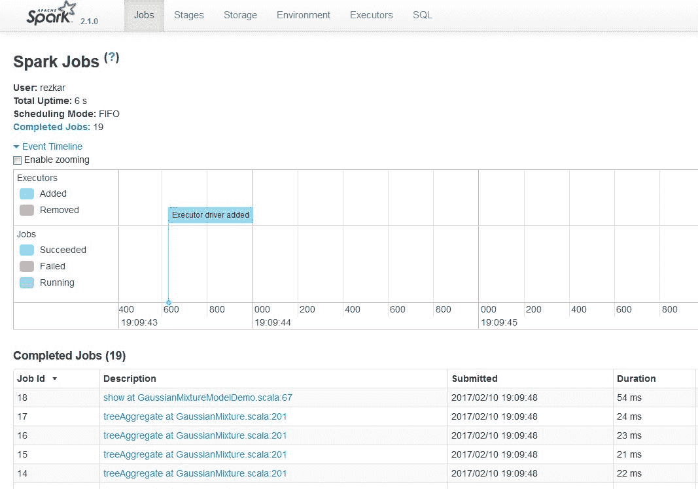**图 2：**Spark Web UI 中的作业选项卡

如果您在作业选项卡中进一步展开“Active Jobs”选项，您将能够看到执行计划、状态、已完成阶段的数量以及该特定作业的作业 ID，如下所示：

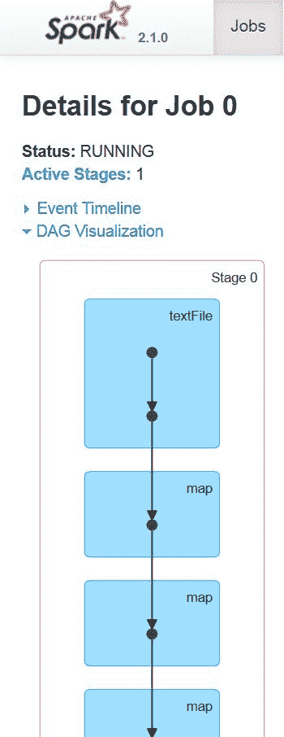**图 3：**Spark Web UI 中任务的 DAG 可视化（摘要）

当用户在 Spark 控制台（例如，Spark shell 或使用 Spark submit）中输入代码时，Spark Core 会创建一个操作符图。这基本上是当用户在特定节点上执行操作（例如，reduce、collect、count、first、take、countByKey、saveAsTextFile）或转换（例如，map、flatMap、filter、mapPartitions、sample、union、intersection、distinct）时发生的情况，这些操作是在 RDD 上进行的（它们是不可变对象）。

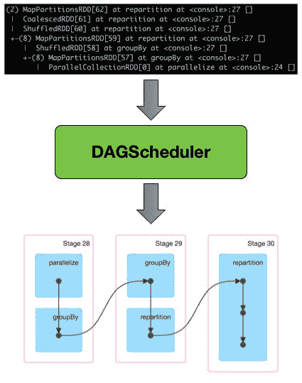**图 4：**DAG 调度程序将 RDD 谱系转换为阶段 DAG

在转换或操作期间，使用**有向无环图**（**DAG**）信息来将节点恢复到最后的转换和操作（参见*图 4*和*图 5*以获得更清晰的图像），以维护数据的弹性。最后，图被提交给 DAG 调度程序。

Spark 如何从 RDD 计算 DAG，然后执行任务？

在高层次上，当 RDD 上调用任何操作时，Spark 会创建 DAG 并将其提交给 DAG 调度程序。DAG 调度程序将操作符划分为任务阶段。一个阶段包括基于输入数据的分区的任务。DAG 调度程序将操作符进行流水线处理。例如，可以在单个阶段中安排多个 map 操作符。DAG 调度程序的最终结果是一组阶段。这些阶段被传递给任务调度程序。任务调度程序通过集群管理器（Spark Standalone/YARN/Mesos）启动任务。任务调度程序不知道阶段的依赖关系。工作节点在阶段上执行任务。

然后，DAG 调度程序跟踪阶段输出的 RDDs。然后，它找到运行作业的最小调度，并将相关的操作符划分为任务阶段。基于输入数据的分区，一个阶段包括多个任务。然后，操作符与 DAG 调度程序一起进行流水线处理。实际上，可以在单个阶段中安排多个 map 或 reduce 操作符（例如）。

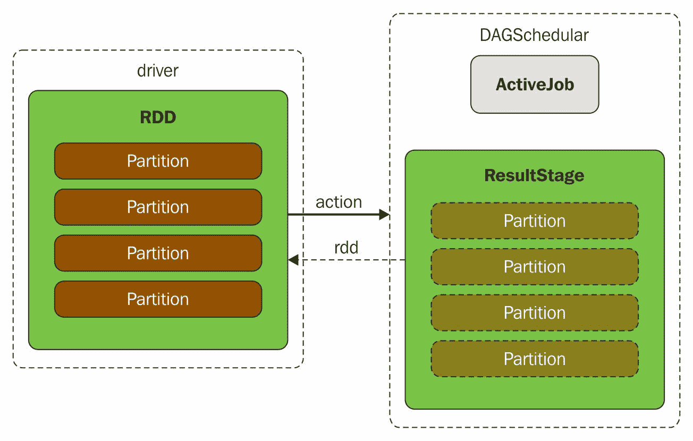**图 5：**执行操作导致 DAGScheduler 中的新 ResultStage 和 ActiveJob

DAG 调度程序中的两个基本概念是作业和阶段。因此，它必须通过内部注册表和计数器来跟踪它们。从技术上讲，DAG 调度程序是 SparkContext 初始化的一部分，它专门在驱动程序上工作（在任务调度程序和调度程序后端准备就绪后立即进行）。DAG 调度程序在 Spark 执行中负责三项主要任务。它计算作业的执行 DAG，即阶段的 DAG。它确定每个任务运行的首选节点，并处理由于丢失洗牌输出文件而导致的故障。

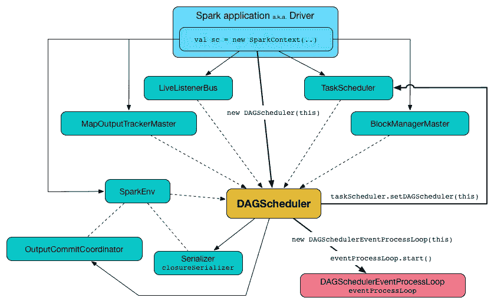**图 6：** 由 SparkContext 创建的 DAGScheduler 与其他服务

DAG 调度程序的最终结果是一组阶段。因此，大部分统计信息和作业的状态可以使用此可视化来查看，例如执行计划、状态、已完成阶段的数量以及该特定作业的作业 ID。

# 阶段

Spark UI 中的阶段选项卡显示了 Spark 应用程序中所有阶段的当前状态，包括任务和阶段的统计信息以及池详细信息的两个可选页面。请注意，此信息仅在应用程序以公平调度模式运行时才可用。您应该能够在`http://localhost:4040/stages`上访问阶段选项卡。请注意，当没有提交作业时，该选项卡除了标题外什么也不显示。阶段选项卡显示了 Spark 应用程序中的阶段。该选项卡中可以看到以下阶段：

+   活动阶段

+   待处理的阶段

+   已完成的阶段

例如，当您在本地提交一个 Spark 作业时，您应该能够看到以下状态：

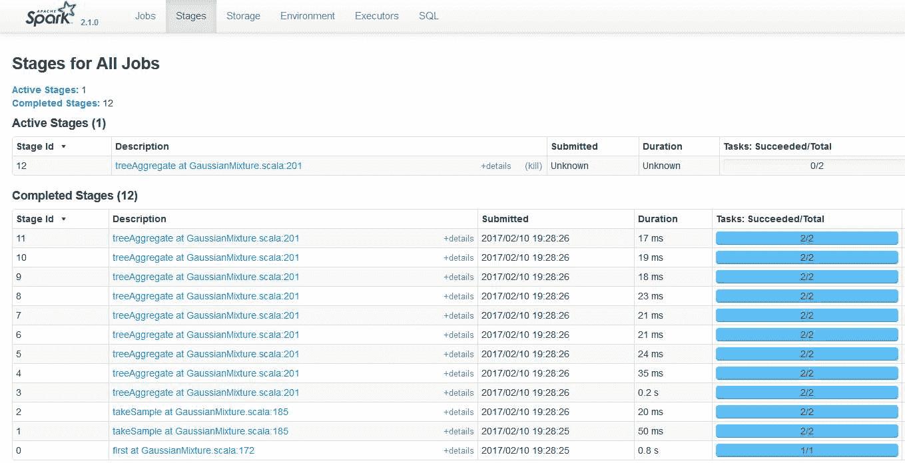**图 7：** Spark Web UI 中所有作业的阶段

在这种情况下，只有一个处于活动状态的阶段。然而，在接下来的章节中，当我们将 Spark 作业提交到 AWS EC2 集群时，我们将能够观察到其他阶段。

要进一步了解已完成作业的摘要，请单击描述列中包含的任何链接，您应该能够找到与执行时间相关的统计信息。在以下图中还可以看到指标的最小值、中位数、25th 百分位数、75th 百分位数和最大值：

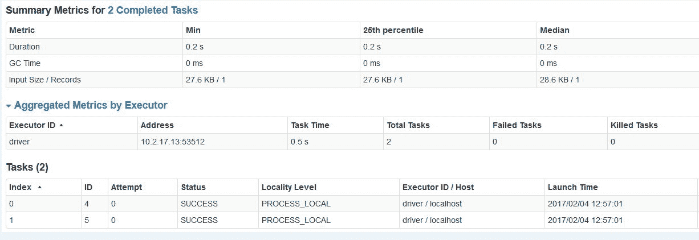**图 8：** Spark Web UI 上已完成作业的摘要

您的情况可能不同，因为在撰写本书期间，我只执行和提交了两个作业以进行演示。您还可以查看有关执行程序的其他统计信息。对于我的情况，我使用 8 个核心和 32GB 的 RAM 在独立模式下提交了这些作业。此外，还显示了与执行程序相关的信息，例如 ID、关联端口号的 IP 地址、任务完成时间、任务数量（包括失败任务、被杀任务和成功任务的数量）以及数据集每条记录的输入大小。

图像中的另一部分显示了与这两个任务相关的其他信息，例如索引、ID、尝试次数、状态、本地级别、主机信息、启动时间、持续时间，垃圾收集（GC）时间等。

# 存储

存储选项卡显示了每个 RDD、DataFrame 或 Dataset 的大小和内存使用情况。您应该能够看到 RDD、DataFrame 或 Dataset 的存储相关信息。以下图显示了存储元数据，如 RDD 名称、存储级别、缓存分区的数量、缓存的数据比例的百分比以及 RDD 在主内存中的大小：

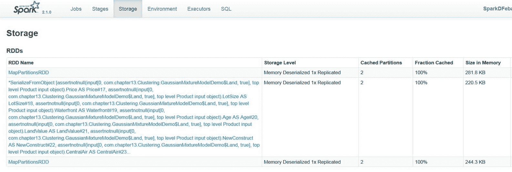**图 9：** 存储选项卡显示 RDD 在磁盘中消耗的空间

请注意，如果 RDD 无法缓存在主内存中，则将使用磁盘空间。本章的后续部分将进行更详细的讨论。

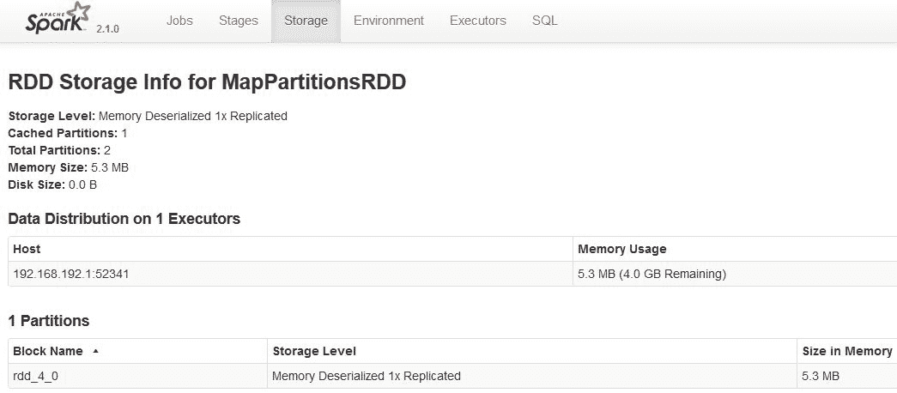**图 10：** 数据分布和 RDD 在磁盘中使用的存储

# 环境

环境选项卡显示了当前设置在您的机器（即驱动程序）上的环境变量。更具体地说，可以在运行时信息下看到 Java Home、Java Version 和 Scala Version 等运行时信息。还可以看到 Spark 属性，如 Spark 应用程序 ID、应用程序名称、驱动程序主机信息、驱动程序端口、执行程序 ID、主 URL 和调度模式。此外，还可以在系统属性下看到其他与系统相关的属性和作业属性，例如 AWT 工具包版本、文件编码类型（例如 UTF-8）和文件编码包信息（例如 sun.io）。

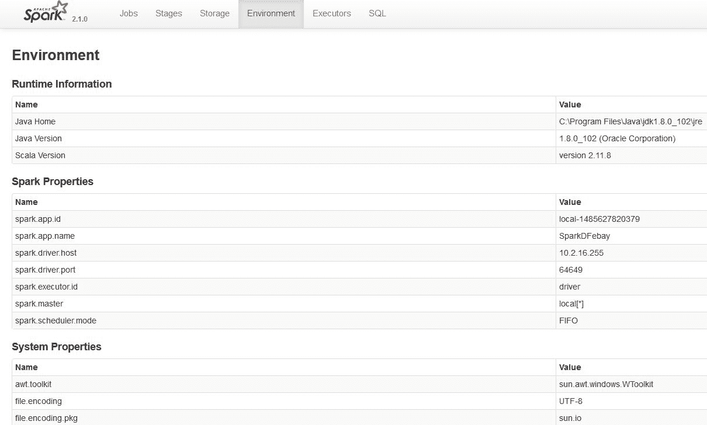**图 11：** Spark Web UI 上的环境选项卡

# 执行程序

执行器选项卡使用`ExecutorsListener`收集有关 Spark 应用程序的执行器信息。执行器是负责执行任务的分布式代理。执行器以不同的方式实例化。例如，当`CoarseGrainedExecutorBackend`接收到 Spark Standalone 和 YARN 的`RegisteredExecutor`消息时，它们可以被实例化。第二种情况是当 Spark 作业提交到 Mesos 时。Mesos 的`MesosExecutorBackend`会被注册。第三种情况是当您在本地运行 Spark 作业时，即创建`LocalEndpoint`。执行器通常在 Spark 应用程序的整个生命周期内运行，这称为执行器的静态分配，尽管您也可以选择动态分配。执行器后端专门管理计算节点或集群中的所有执行器。执行器定期向驱动程序的**HeartbeatReceiver** RPC 端点报告活动任务的心跳和部分指标，并将结果发送给驱动程序。它们还通过块管理器为用户程序缓存的 RDD 提供内存存储。有关此内容的更清晰的想法，请参考以下图：

图 12：Spark 驱动程序实例化一个执行器，负责处理 HeartbeatReceiver 的心跳消息处理程序

当执行器启动时，它首先向驱动程序注册，并直接通信以执行任务，如下图所示：

图 13：使用 TaskRunners 在执行器上启动任务

您应该能够在`http://localhost:4040/executors`访问执行器选项卡。

图 14：Spark Web UI 上的执行器选项卡

如前图所示，可以看到有关执行器的执行器 ID、地址、状态、RDD 块、存储内存、已使用磁盘、核心、活动任务、失败任务、完成任务、总任务、任务时间（GC 时间）、输入、Shuffle 读取、Shuffle 写入以及线程转储的信息。

# SQL

Spark UI 中的 SQL 选项卡显示每个操作符的所有累加器值。您应该能够在`http://localhost:4040/SQL/`访问 SQL 选项卡。它默认显示所有 SQL 查询执行和底层信息。但是，只有在选择查询后，SQL 选项卡才会显示 SQL 查询执行的详细信息。

关于 SQL 的详细讨论超出了本章的范围。感兴趣的读者应参考[`spark.apache.org/docs/latest/sql-programming-guide.html#sql`](http://spark.apache.org/docs/latest/sql-programming-guide.html#sql)了解如何提交 SQL 查询并查看其结果输出。

# 使用 Web UI 可视化 Spark 应用程序

当提交 Spark 作业进行执行时，将启动一个 Web 应用程序 UI，显示有关应用程序的有用信息。事件时间轴显示应用程序事件的相对顺序和交错。时间轴视图可在三个级别上使用：跨所有作业、在一个作业内以及在一个阶段内。时间轴还显示执行器的分配和释放。

图 15：Spark 作业在 Spark Web UI 上以 DAG 形式执行

# 观察正在运行和已完成的 Spark 作业

要访问和观察正在运行和已完成的 Spark 作业，请在 Web 浏览器中打开`http://spark_driver_host:4040`。请注意，您将需要相应地用 IP 地址或主机名替换`spark_driver_host`。

请注意，如果同一主机上运行多个 SparkContexts，它们将绑定到从 4040 开始的连续端口，4040、4041、4042 等。默认情况下，此信息仅在您的 Spark 应用程序运行期间可用。这意味着当您的 Spark 作业完成执行时，绑定将不再有效或可访问。

现在，要访问仍在执行的活动作业，请单击 Active Jobs 链接，您将看到这些作业的相关信息。另一方面，要访问已完成作业的状态，请单击 Completed Jobs，您将看到信息以 DAG 样式显示，如前一节所述。

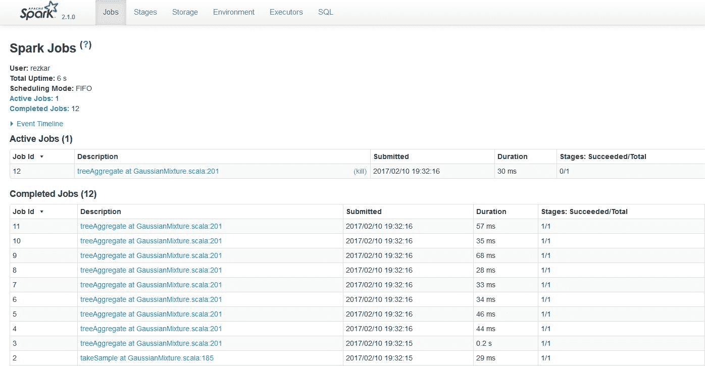**图 16：**观察正在运行和已完成的 Spark 作业

您可以通过单击 Active Jobs 或 Completed Jobs 下的作业描述链接来实现这些。

# 使用日志调试 Spark 应用程序

查看所有正在运行的 Spark 应用程序的信息取决于您使用的集群管理器。在调试 Spark 应用程序时，应遵循这些说明：

+   **Spark Standalone**：转到`http://master:18080`上的 Spark 主 UI。主节点和每个工作节点显示集群和相关作业统计信息。此外，每个作业的详细日志输出也写入到每个工作节点的工作目录中。我们将讨论如何使用`log4j`手动启用日志记录。

+   **YARN**：如果您的集群管理器是 YARN，并且假设您正在 Cloudera（或任何其他基于 YARN 的平台）上运行 Spark 作业，则转到 Cloudera Manager 管理控制台中的 YARN 应用程序页面。现在，要调试在 YARN 上运行的 Spark 应用程序，请查看 Node Manager 角色的日志。要实现这一点，打开日志事件查看器，然后过滤事件流以选择时间窗口和日志级别，并显示 Node Manager 源。您也可以通过命令访问日志。命令的格式如下：

```scala
 yarn logs -applicationId <application ID> [OPTIONS]

```

例如，以下是这些 ID 的有效命令：

```scala
 yarn logs -applicationId application_561453090098_0005 
 yarn logs -applicationId application_561453090070_0005 userid

```

请注意，用户 ID 是不同的。但是，只有在`yarn-site.xml`中的`yarn.log-aggregation-enable`为 true 并且应用程序已经完成执行时，才是真的。

# 使用 log4j 记录 Spark

Spark 使用`log4j`进行自身的日志记录。发生在后端的所有操作都会记录到 Spark shell 控制台（已配置为基础存储）。Spark 提供了`log4j`的属性文件模板，我们可以扩展和修改该文件以记录 Spark 中的日志。转到`SPARK_HOME/conf`目录，您应该看到`log4j.properties.template`文件。这可以作为我们自己日志系统的起点。

现在，让我们在运行 Spark 作业时创建自己的自定义日志系统。完成后，将文件重命名为`log4j.properties`并将其放在相同的目录（即项目树）下。文件的示例快照如下：

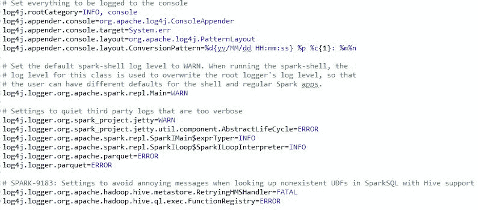**图 17：**log4j.properties 文件的快照

默认情况下，所有内容都会输出到控制台和文件。但是，如果您想将所有噪音日志绕过并记录到系统文件中，例如`/var/log/sparkU.log`，则可以在`log4j.properties`文件中设置这些属性如下：

```scala
log4j.logger.spark.storage=INFO, RollingAppender
log4j.additivity.spark.storage=false
log4j.logger.spark.scheduler=INFO, RollingAppender
log4j.additivity.spark.scheduler=false
log4j.logger.spark.CacheTracker=INFO, RollingAppender
log4j.additivity.spark.CacheTracker=false
log4j.logger.spark.CacheTrackerActor=INFO, RollingAppender
log4j.additivity.spark.CacheTrackerActor=false
log4j.logger.spark.MapOutputTrackerActor=INFO, RollingAppender
log4j.additivity.spark.MapOutputTrackerActor=false
log4j.logger.spark.MapOutputTracker=INFO, RollingAppender
log4j.additivty.spark.MapOutputTracker=false

```

基本上，我们希望隐藏 Spark 生成的所有日志，以便我们不必在 shell 中处理它们。我们将它们重定向到文件系统中进行记录。另一方面，我们希望我们自己的日志记录在 shell 和单独的文件中进行记录，以便它们不会与 Spark 的日志混在一起。从这里，我们将指向 Splunk 的文件，其中我们自己的日志记录，特别是`/var/log/sparkU.log`*.*

然后，当应用程序启动时，Spark 会读取`log4j.properties`文件，因此我们除了将其放在指定位置外，无需进行其他操作。

现在让我们看看如何创建我们自己的日志记录系统。看看以下代码，并尝试理解这里发生了什么：

```scala
import org.apache.spark.{SparkConf, SparkContext}
import org.apache.log4j.LogManager
import org.apache.log4j.Level
import org.apache.log4j.Logger

object MyLog {
 def main(args: Array[String]):Unit= {
   // Stting logger level as WARN
   val log = LogManager.getRootLogger
   log.setLevel(Level.WARN)

   // Creating Spark Context
   val conf = new SparkConf().setAppName("My App").setMaster("local[*]")
   val sc = new SparkContext(conf)

   //Started the computation and printing the logging information
   log.warn("Started")                        
   val data = sc.parallelize(1 to 100000)
   log.warn("Finished")
 }
}

```

前面的代码概念上仅记录警告消息。它首先打印警告消息，然后通过并行化从 1 到 100,000 的数字创建 RDD。一旦 RDD 作业完成，它会打印另一个警告日志。但是，我们尚未注意到先前代码段中的问题。

`org.apache.log4j.Logger`类的一个缺点是它不可序列化（有关更多详细信息，请参阅优化技术部分），这意味着我们不能在对 Spark API 的某些部分进行操作时在*闭包*内使用它。例如，如果尝试执行以下代码，则应该会遇到一个说任务不可序列化的异常：

```scala
object MyLog {
  def main(args: Array[String]):Unit= {
    // Stting logger level as WARN
    val log = LogManager.getRootLogger
    log.setLevel(Level.WARN)
    // Creating Spark Context
    val conf = new SparkConf().setAppName("My App").setMaster("local[*]")
    val sc = new SparkContext(conf)
    //Started the computation and printing the logging information
    log.warn("Started")
    val i = 0
    val data = sc.parallelize(i to 100000)
    data.foreach(i => log.info("My number"+ i))
    log.warn("Finished")
  }
}

```

解决这个问题也很容易；只需声明带有`extends Serializable`的 Scala 对象，现在代码看起来如下：

```scala
class MyMapper(n: Int) extends Serializable{
  @transient lazy val log = org.apache.log4j.LogManager.getLogger
                                ("myLogger")
  def MyMapperDosomething(rdd: RDD[Int]): RDD[String] =
   rdd.map{ i =>
    log.warn("mapping: " + i)
    (i + n).toString
  }
}

```

在前面的代码中发生的情况是，闭包无法整洁地分布到所有分区，因为它无法关闭记录器；因此，类型为`MyMapper`的整个实例分布到所有分区；一旦完成此操作，每个分区都会创建一个新的记录器并用于记录。

总之，以下是帮助我们摆脱这个问题的完整代码：

```scala
package com.example.Personal
import org.apache.log4j.{Level, LogManager, PropertyConfigurator}
import org.apache.spark._
import org.apache.spark.rdd.RDD

class MyMapper(n: Int) extends Serializable{
  @transient lazy val log = org.apache.log4j.LogManager.getLogger
                                ("myLogger")
  def MyMapperDosomething(rdd: RDD[Int]): RDD[String] =
   rdd.map{ i =>
    log.warn("Serialization of: " + i)
    (i + n).toString
  }
}

object MyMapper{
  def apply(n: Int): MyMapper = new MyMapper(n)
}

object MyLog {
  def main(args: Array[String]) {
    val log = LogManager.getRootLogger
    log.setLevel(Level.WARN)
    val conf = new SparkConf().setAppName("My App").setMaster("local[*]")
    val sc = new SparkContext(conf)
    log.warn("Started")
    val data = sc.parallelize(1 to 100000)
    val mapper = MyMapper(1)
    val other = mapper.MyMapperDosomething(data)
    other.collect()
    log.warn("Finished")
  }
}

```

输出如下：

```scala
17/04/29 15:33:43 WARN root: Started 
.
.
17/04/29 15:31:51 WARN myLogger: mapping: 1 
17/04/29 15:31:51 WARN myLogger: mapping: 49992
17/04/29 15:31:51 WARN myLogger: mapping: 49999
17/04/29 15:31:51 WARN myLogger: mapping: 50000 
.
. 
17/04/29 15:31:51 WARN root: Finished

```

我们将在下一节讨论 Spark 的内置日志记录。

# Spark 配置

有多种方法可以配置您的 Spark 作业。在本节中，我们将讨论这些方法。更具体地说，根据 Spark 2.x 版本，有三个位置可以配置系统：

+   Spark 属性

+   环境变量

+   日志记录

# Spark 属性

如前所述，Spark 属性控制大部分应用程序特定的参数，并且可以使用 Spark 的`SparkConf`对象进行设置。或者，这些参数可以通过 Java 系统属性进行设置。`SparkConf`允许您配置一些常见属性，如下所示：

```scala
setAppName() // App name 
setMaster() // Master URL 
setSparkHome() // Set the location where Spark is installed on worker nodes. 
setExecutorEnv() // Set single or multiple environment variables to be used when launching executors. 
setJars() // Set JAR files to distribute to the cluster. 
setAll() // Set multiple parameters together.

```

应用程序可以配置为使用计算机上的多个可用核心。例如，我们可以初始化一个具有两个线程的应用程序如下。请注意，我们使用`local [2]`运行，表示两个线程，这代表最小的并行性，并使用`local [*]`，它利用计算机上所有可用的核心。或者，您可以在提交 Spark 作业时使用以下 spark-submit 脚本指定执行程序的数量：

```scala
val conf = new SparkConf() 
             .setMaster("local[2]") 
             .setAppName("SampleApp") 
val sc = new SparkContext(conf)

```

可能会有一些特殊情况，您需要在需要时动态加载 Spark 属性。您可以在通过 spark-submit 脚本提交 Spark 作业时执行此操作。更具体地说，您可能希望避免在`SparkConf`中硬编码某些配置。

Apache Spark 优先级：

Spark 对提交的作业具有以下优先级：来自配置文件的配置具有最低优先级。来自实际代码的配置相对于来自配置文件的配置具有更高的优先级，而通过 Spark-submit 脚本通过 CLI 传递的配置具有更高的优先级。

例如，如果要使用不同的主节点、执行程序或不同数量的内存运行应用程序，Spark 允许您简单地创建一个空配置对象，如下所示：

```scala
val sc = new SparkContext(new SparkConf())

```

然后您可以在运行时为您的 Spark 作业提供配置，如下所示：

```scala
SPARK_HOME/bin/spark-submit 
 --name "SmapleApp" \
 --class org.apache.spark.examples.KMeansDemo \
 --master mesos://207.184.161.138:7077 \ # Use your IP address
 --conf spark.eventLog.enabled=false 
 --conf "spark.executor.extraJavaOptions=-XX:+PrintGCDetails" \ 
 --deploy-mode cluster \
 --supervise \
 --executor-memory 20G \
 myApp.jar

```

`SPARK_HOME/bin/spark-submit`还将从`SPARK_HOME /conf/spark-defaults.conf`中读取配置选项，其中每行由空格分隔的键和值组成。示例如下：

```scala
spark.master  spark://5.6.7.8:7077 
spark.executor.memor y   4g 
spark.eventLog.enabled true 
spark.serializer org.apache.spark.serializer.KryoSerializer

```

在属性文件中指定为标志的值将传递给应用程序，并与通过`SparkConf`指定的值合并。最后，如前所述，应用程序 Web UI 在`http://<driver>:4040`下的环境选项卡下列出所有 Spark 属性。

# 环境变量

环境变量可用于设置计算节点或机器设置中的设置。例如，IP 地址可以通过每个计算节点上的`conf/spark-env.sh`脚本进行设置。以下表列出了需要设置的环境变量的名称和功能：

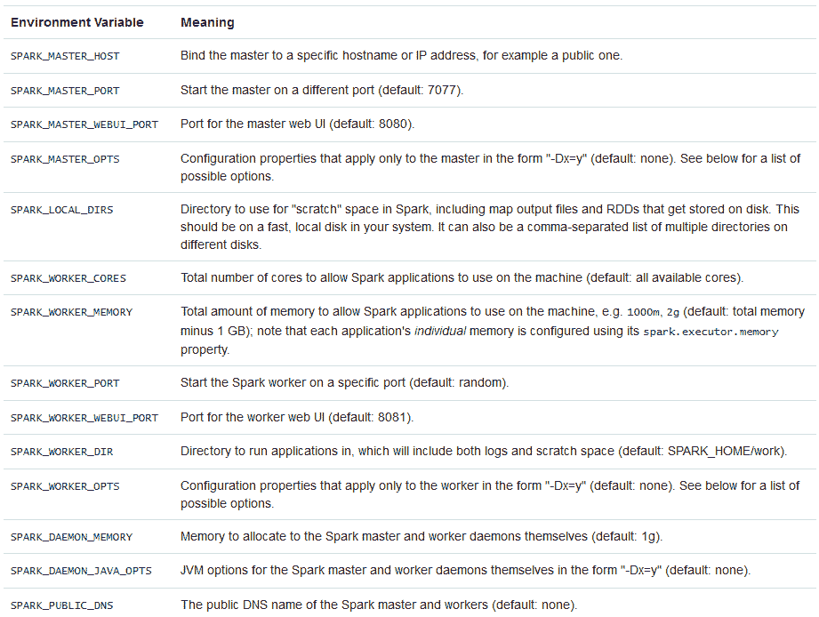**图 18：**环境变量及其含义

# 日志记录

最后，可以通过在 Spark 应用程序树下的`log4j.properties`文件中配置日志记录，如前一节所述。Spark 使用 log4j 进行日志记录。log4j 支持几个有效的日志记录级别，它们如下：

| **日志级别** | **用途** |
| --- | --- |
| OFF | 这是最具体的，完全不允许记录日志 |
| FATAL | 这是最具体的，显示了有很少数据的严重错误 |
| ERROR | 这只显示一般错误 |
| WARN | 这显示了建议修复但不是强制的警告 |
| INFO | 这显示了您的 Spark 作业所需的信息 |
| DEBUG | 在调试时，这些日志将被打印 |
| TRACE | 这提供了具有大量数据的最不具体的错误跟踪 |
| ALL | 具有所有数据的最不具体的消息 |

**表 1：** 使用 log4j 和 Spark 的日志级别

您可以在`conf/log4j.properties`中设置 Spark shell 的默认日志记录。在独立的 Spark 应用程序中或在 Spark Shell 会话中，可以使用`conf/log4j.properties.template`作为起点。在本章的前一节中，我们建议您在像 Eclipse 这样的基于 IDE 的环境中将`log4j.properties`文件放在项目目录下。但是，要完全禁用日志记录，您应该将以下`conf/log4j.properties.template`设置为`log4j.properties`。只需将`log4j.logger.org`标志设置为 OFF，如下所示：

```scala
log4j.logger.org=OFF

```

在下一节中，我们将讨论开发和提交 Spark 作业时开发人员或程序员常犯的一些常见错误。

# Spark 应用程序开发中的常见错误

经常发生的常见错误包括应用程序失败、由于多种因素而卡住的作业运行缓慢、聚合操作中的错误、动作或转换中的错误、主线程中的异常，当然还有**内存不足**（**OOM**）。

# 应用程序失败

大多数情况下，应用程序失败是因为一个或多个阶段最终失败。如本章前面所述，Spark 作业包括多个阶段。阶段不是独立执行的：例如，处理阶段无法在相关的输入读取阶段之前发生。因此，假设阶段 1 成功执行，但阶段 2 无法执行，整个应用程序最终将失败。可以如下所示：

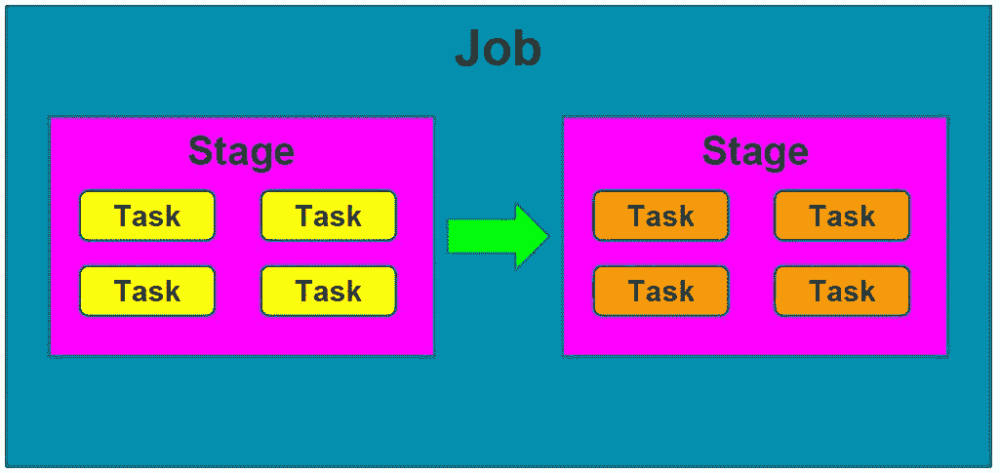**图 19：** 典型 Spark 作业中的两个阶段

举个例子，假设您有以下三个 RDD 操作作为阶段。可以将其可视化为*图 20*、*图 21*和*图 22*所示：

```scala
val rdd1 = sc.textFile(“hdfs://data/data.csv”)
                       .map(someMethod)
                       .filter(filterMethod)   

```

**图 20：** rdd1 的第 1 阶段

```scala
val rdd2 = sc.hadoopFile(“hdfs://data/data2.csv”)
                      .groupByKey()
                      .map(secondMapMethod)

```

从概念上讲，可以如*图 21*所示，首先使用`hadoopFile()`方法解析数据，然后使用`groupByKey()`方法对其进行分组，最后对其进行映射：

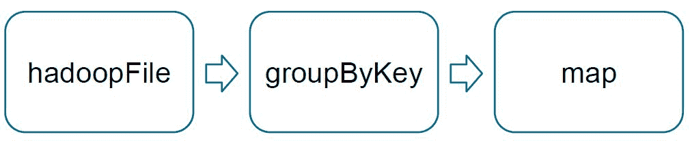**图 21：** rdd2 的第 2 阶段

```scala
val rdd3 = rdd1.join(rdd2).map(thirdMapMethod)

```

从概念上讲，可以如*图 22*所示，首先解析数据，然后将其连接，最后映射：

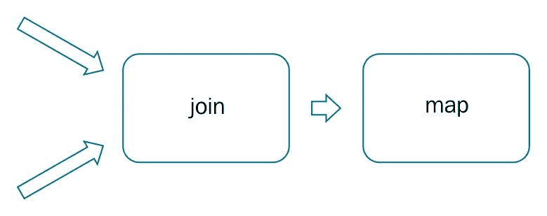**图 22：** rdd3 的第 3 阶段

现在，您可以执行聚合函数，例如 collect，如下所示：

```scala
rdd3.collect()

```

噢！您已经开发了一个包含三个阶段的 Spark 作业。从概念上讲，可以如下所示：

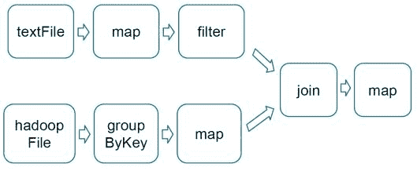**图 23：** rdd3.collect()操作的三个阶段

现在，如果其中一个阶段失败，您的作业最终将失败。因此，最终的`rdd3.collect()`语句将抛出有关阶段失败的异常。此外，您可能会遇到以下四个因素的问题：

+   聚合操作中的错误

+   主线程中的异常

+   OOP

+   使用`spark-submit`脚本提交作业时出现类找不到异常

+   Spark 核心库中一些 API/方法的误解

为了摆脱上述问题，我们的一般建议是确保在执行任何 map、flatMap 或 aggregate 操作时没有犯任何错误。其次，在使用 Java 或 Scala 开发应用程序的主方法中确保没有缺陷。有时您在代码中看不到任何语法错误，但重要的是您为应用程序开发了一些小的测试用例。主方法中最常见的异常如下：

+   `java.lang.noclassdeffounderror`

+   `java.lang.nullpointerexception`

+   `java.lang.arrayindexoutofboundsexception`

+   `java.lang.stackoverflowerror`

+   `java.lang.classnotfoundexception`

+   `java.util.inputmismatchexception`

通过谨慎编写 Spark 应用程序可以避免这些异常。或者，广泛使用 Eclipse（或任何其他 IDE）的代码调试功能来消除语义错误以避免异常。对于第三个问题，即 OOM，这是一个非常常见的问题。需要注意的是，Spark 至少需要 8GB 的主内存，并且独立模式下需要足够的磁盘空间。另一方面，为了获得完整的集群计算功能，这个要求通常很高。

准备一个包含所有依赖项的 JAR 文件来执行 Spark 作业非常重要。许多从业者使用谷歌的 Guava；它包含在大多数发行版中，但不能保证向后兼容。这意味着有时即使您明确提供了 Guava 类，您的 Spark 作业也找不到 Guava 类；这是因为 Guava 库的两个版本中的一个优先于另一个，而这个版本可能不包括所需的类。为了解决这个问题，通常会使用 shading。

确保如果您使用 IntelliJ、Vim、Eclipse、记事本等编码，已使用-Xmx 参数设置了 Java 堆空间，并设置了足够大的值。在集群模式下工作时，应在使用 Spark-submit 脚本提交 Spark 作业时指定执行器内存。假设您有一个要解析的 CSV 文件，并使用随机森林分类器进行一些预测分析，您可能需要指定正确的内存量，比如 20GB，如下所示：

```scala
--executor-memory 20G

```

即使收到 OOM 错误，您也可以将此金额增加到 32GB 或更多。由于随机森林计算密集，需要更大的内存，这只是随机森林的一个例子。您可能在仅解析数据时遇到类似的问题。甚至由于此 OOM 错误，特定阶段可能会失败。因此，请确保您知道这个错误。

对于`class not found exception`，请确保您已经在生成的 JAR 文件中包含了主类。JAR 文件应该准备好包含所有依赖项，以便在集群节点上执行您的 Spark 作业。我们将在第十七章中提供一份逐步的 JAR 准备指南，*时候去集群 - 在集群上部署 Spark*。

对于最后一个问题，我们可以提供一些关于 Spark Core 库的一些误解的例子。例如，当您使用`wholeTextFiles`方法从多个文件准备 RDDs 或 DataFrames 时，Spark 不会并行运行；在 YARN 的集群模式下，有时可能会耗尽内存。

有一次，我遇到了一个问题，首先我将六个文件从我的 S3 存储复制到 HDFS。然后，我尝试创建一个 RDD，如下所示：

```scala
sc.wholeTextFiles("/mnt/temp") // note the location of the data files is /mnt/temp/

```

然后，我尝试使用 UDF 逐行处理这些文件。当我查看我的计算节点时，我发现每个文件只有一个执行器在运行。然而，后来我收到了一条错误消息，说 YARN 已经耗尽了内存。为什么呢？原因如下：

+   `wholeTextFiles`的目标是每个要处理的文件只有一个执行器

+   如果您使用`.gz`文件，例如，您将每个文件只有一个执行器，最多

# 慢作业或无响应

有时，如果 SparkContext 无法连接到 Spark 独立主节点，那么驱动程序可能会显示以下错误：

```scala
02/05/17 12:44:45 ERROR AppClient$ClientActor: All masters are unresponsive! Giving up. 
02/05/17 12:45:31 ERROR SparkDeploySchedulerBackend: Application has been killed. Reason: All masters are unresponsive! Giving up. 
02/05/17 12:45:35 ERROR TaskSchedulerImpl: Exiting due to error from cluster scheduler: Spark cluster looks down

```

在其他时候，驱动程序能够连接到主节点，但主节点无法与驱动程序进行通信。然后，尝试多次连接，即使驱动程序会报告无法连接到主节点的日志目录。

此外，您可能经常会在 Spark 作业中经历非常缓慢的性能和进展。这是因为您的驱动程序程序计算速度不够快。正如前面讨论的，有时特定阶段可能需要比平常更长的时间，因为可能涉及洗牌、映射、连接或聚合操作。即使计算机的磁盘存储或主内存用尽，您也可能会遇到这些问题。例如，如果您的主节点没有响应，或者在一定时间内计算节点出现不响应，您可能会认为您的 Spark 作业在某个阶段停滞不前。

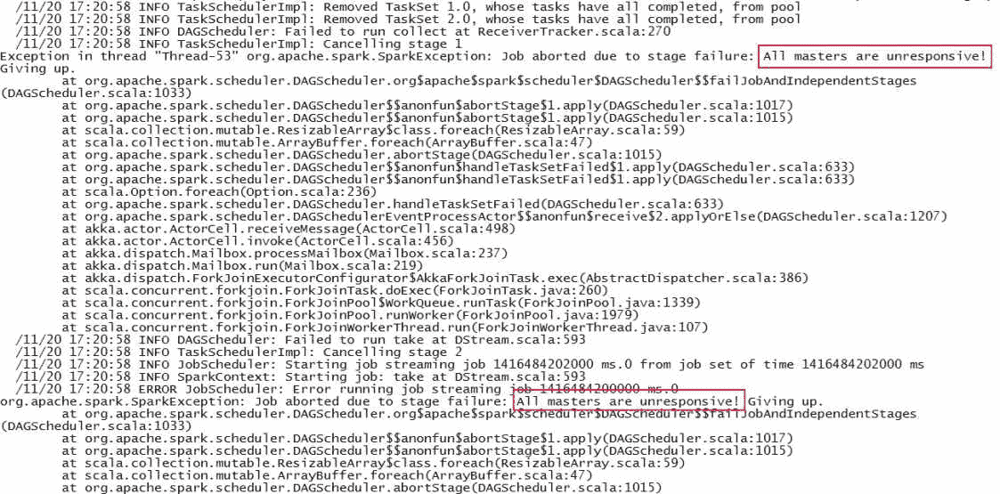**图 24：**执行器/驱动程序不响应的示例日志

可能的解决方案可能有几种，包括以下内容：

1.  请确保工作节点和驱动程序正确配置为连接到 Spark 主节点上的确切地址，该地址在 Spark 主节点 web UI/logs 中列出。然后，在启动 Spark shell 时明确提供 Spark 集群的主 URL：

```scala
 $ bin/spark-shell --master spark://master-ip:7077

```

1.  将`SPARK_LOCAL_IP`设置为驱动程序、主节点和工作进程的集群可寻址主机名。

有时，由于硬件故障，我们会遇到一些问题。例如，如果计算节点中的文件系统意外关闭，即 I/O 异常，您的 Spark 作业最终也会失败。这是显而易见的，因为您的 Spark 作业无法将生成的 RDD 或数据写入本地文件系统或 HDFS。这也意味着由于阶段失败，DAG 操作无法执行。

有时，这种 I/O 异常是由底层磁盘故障或其他硬件故障引起的。这通常会提供日志，如下所示：

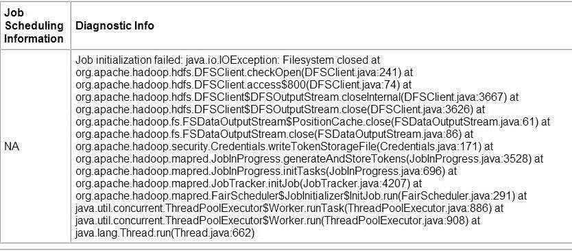**图 25：**文件系统关闭示例

然而，您经常会遇到作业计算性能较慢的问题，因为您的 Java GC 有些忙碌，或者无法快速进行 GC。例如，以下图显示了对于任务 0，完成 GC 花了 10 个小时！我在 2014 年遇到了这个问题，当时我刚开始使用 Spark。然而，这些问题的控制并不在我们手中。因此，我们的建议是您应该释放 JVM 并尝试重新提交作业。

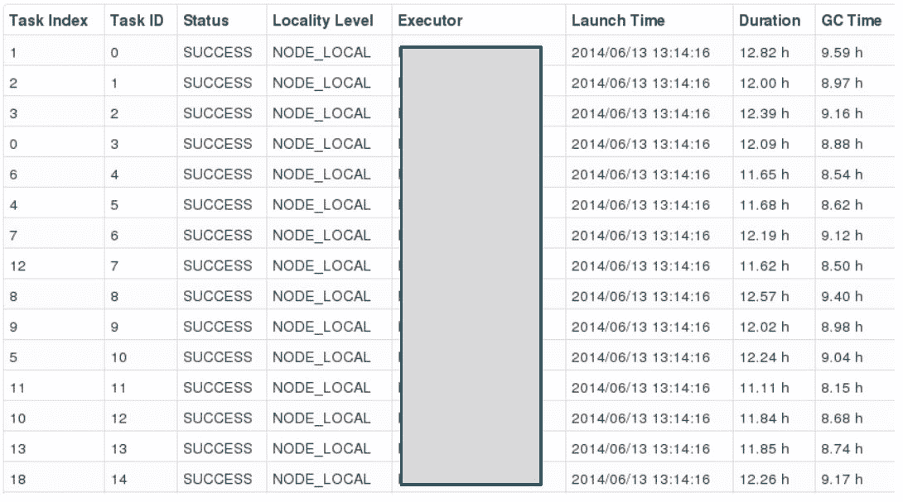**图 26：**GC 在中间停滞的示例

第四个因素可能是响应缓慢或作业性能较慢是由于数据序列化不足。这将在下一节中讨论。第五个因素可能是代码中的内存泄漏，这将导致应用程序消耗更多内存，使文件或逻辑设备保持打开状态。因此，请确保没有导致内存泄漏的选项。例如，通过调用`sc.stop()`或`spark.stop()`完成您的 Spark 应用程序是一个好习惯。这将确保一个 SparkContext 仍然是打开和活动的。否则，您可能会遇到不必要的异常或问题。第六个问题是我们经常保持太多的打开文件，有时会在洗牌或合并阶段中创建`FileNotFoundException`。

# 优化技术

有几个方面可以调整 Spark 应用程序以实现更好的优化技术。在本节中，我们将讨论如何通过调整主内存和更好的内存管理来进一步优化我们的 Spark 应用程序，通过应用数据序列化来优化性能。另一方面，通过在开发 Spark 应用程序时调整 Scala 代码中的数据结构，也可以优化性能。另外，通过利用序列化 RDD 存储，可以很好地维护存储。

最重要的一个方面是垃圾收集，以及如果您使用 Java 或 Scala 编写了 Spark 应用程序，则需要调整。我们将看看如何为优化性能调整这一点。对于分布式环境和基于集群的系统，必须确保一定程度的并行性和数据局部性。此外，通过使用广播变量，性能还可以进一步提高。

# 数据序列化

序列化是任何分布式计算环境中性能改进和优化的重要调整。Spark 也不例外，但 Spark 作业通常涉及数据和计算。因此，如果您的数据对象格式不好，那么您首先需要将它们转换为序列化数据对象。这需要大量的内存字节。最终，整个过程将严重减慢整个处理和计算的速度。

因此，您经常会发现计算节点的响应速度很慢。这意味着我们有时无法充分利用计算资源。事实上，Spark 试图在便利性和性能之间保持平衡。这也意味着数据序列化应该是 Spark 调整性能的第一步。

Spark 提供了两种数据序列化选项：Java 序列化和 Kryo 序列化库：

+   **Java 序列化：** Spark 使用 Java 的`ObjectOutputStream`框架对对象进行序列化。您可以通过创建任何实现`java.io.Serializable`的类来处理序列化。Java 序列化非常灵活，但通常相当慢，不适合大数据对象序列化。

+   **Kryo 序列化：** 您还可以使用 Kryo 库更快地序列化数据对象。与 Java 序列化相比，Kryo 序列化速度更快，速度提高了 10 倍，比 Java 更紧凑。但是，它有一个问题，即它不支持所有可序列化类型，但您需要要求您的类进行注册。

您可以通过初始化 Spark 作业并调用`conf.set(spark.serializer, org.apache.spark.serializer.KryoSerializer)`来开始使用 Kryo。要使用 Kryo 注册自定义类，请使用`registerKryoClasses`方法，如下所示：

```scala
val conf = new SparkConf()
               .setMaster(“local[*]”)
               .setAppName(“MyApp”)
conf.registerKryoClasses(Array(classOf[MyOwnClass1], classOf[MyOwnClass2]))
val sc = new SparkContext(conf)

```

如果您的对象很大，您可能还需要增加`spark.kryoserializer.buffer`配置。这个值需要足够大，以容纳您序列化的最大对象。最后，如果您没有注册自定义类，Kryo 仍然可以工作；但是，每个对象的完整类名都需要被存储，这实际上是浪费的。

例如，在监控 Spark 作业部分的日志子部分中，可以使用`Kryo`序列化来优化日志记录和计算。首先，只需创建`MyMapper`类作为普通类（即，不进行任何序列化），如下所示：

```scala
class MyMapper(n: Int) { // without any serialization
  @transient lazy val log = org.apache.log4j.LogManager.getLogger("myLogger")
  def MyMapperDosomething(rdd: RDD[Int]): RDD[String] = rdd.map { i =>
    log.warn("mapping: " + i)
    (i + n).toString
  }
}

```

现在，让我们将这个类注册为`Kyro`序列化类，然后设置`Kyro`序列化如下：

```scala
conf.registerKryoClasses(Array(classOf[MyMapper])) // register the class with Kyro
conf.set("spark.serializer", "org.apache.spark.serializer.KryoSerializer") // set Kayro serialization

```

这就是你需要的全部内容。此示例的完整源代码如下。您应该能够运行并观察相同的输出，但与上一个示例相比是优化的：

```scala
package com.chapter14.Serilazition
import org.apache.spark._
import org.apache.spark.rdd.RDD
class MyMapper(n: Int) { // without any serilization
  @transient lazy val log = org.apache.log4j.LogManager.getLogger
                                ("myLogger")
  def MyMapperDosomething(rdd: RDD[Int]): RDD[String] = rdd.map { i =>
    log.warn("mapping: " + i)
    (i + n).toString
  }
}
//Companion object
object MyMapper {
  def apply(n: Int): MyMapper = new MyMapper(n)
}
//Main object
object KyroRegistrationDemo {
  def main(args: Array[String]) {
    val log = LogManager.getRootLogger
    log.setLevel(Level.WARN)
    val conf = new SparkConf()
      .setAppName("My App")
      .setMaster("local[*]")
    conf.registerKryoClasses(Array(classOf[MyMapper2]))
     // register the class with Kyro
    conf.set("spark.serializer", "org.apache.spark.serializer
             .KryoSerializer") // set Kayro serilazation
    val sc = new SparkContext(conf)
    log.warn("Started")
    val data = sc.parallelize(1 to 100000)
    val mapper = MyMapper(1)
    val other = mapper.MyMapperDosomething(data)
    other.collect()
    log.warn("Finished")
  }
}

```

输出如下：

```scala
17/04/29 15:33:43 WARN root: Started 
.
.
17/04/29 15:31:51 WARN myLogger: mapping: 1 
17/04/29 15:31:51 WARN myLogger: mapping: 49992
17/04/29 15:31:51 WARN myLogger: mapping: 49999
17/04/29 15:31:51 WARN myLogger: mapping: 50000 
.
.                                                                                
17/04/29 15:31:51 WARN root: Finished

```

干得好！现在让我们快速看一下如何调整内存。我们将在下一节中看一些高级策略，以确保主内存的有效使用。

# 内存调整

在本节中，我们将讨论一些高级策略，用户可以使用这些策略来确保在执行 Spark 作业时对内存的有效使用。更具体地说，我们将展示如何计算对象的内存使用情况。我们将建议一些高级方法来通过优化数据结构或将数据对象转换为使用 Kryo 或 Java 序列化的序列化格式来改进它。最后，我们将看看如何调整 Spark 的 Java 堆大小、缓存大小和 Java 垃圾收集器。

调整内存使用时有三个考虑因素：

+   您的对象使用的内存量：甚至可能希望整个数据集都能放入内存中

+   访问这些对象的成本

+   垃圾收集的开销：如果对象的周转率很高

尽管 Java 对象访问速度足够快，但它们很容易消耗实际数据字段的 2 到 5 倍的空间。例如，每个不同的 Java 对象都有 16 字节的开销与对象头。例如，Java 字符串比原始字符串多出近 40 字节的额外开销。此外，还使用了 Java 集合类，如`Set`、`List`、`Queue`、`ArrayList`、`Vector`、`LinkedList`、`PriorityQueue`、`HashSet`、`LinkedHashSet`、`TreeSet`等。另一方面，链式数据结构过于复杂，占用了太多额外的空间，因为数据结构中的每个条目都有一个包装对象。最后，基本类型的集合经常将它们存储在内存中作为装箱对象，例如`java.lang.Double`和`java.lang.Integer`。

# 内存使用和管理

您的 Spark 应用程序和底层计算节点的内存使用可以分为执行和存储。执行内存用于合并、洗牌、连接、排序和聚合计算过程中。另一方面，存储内存用于在集群中缓存和传播内部数据。简而言之，这是由于网络上的大量 I/O。

从技术上讲，Spark 将网络数据缓存在本地。在使用 Spark 进行迭代或交互式工作时，缓存或持久化是 Spark 中的优化技术。这两种技术有助于保存中间部分结果，以便它们可以在后续阶段重复使用。然后这些中间结果（作为 RDD）可以保存在内存（默认）或更可靠的存储介质，如磁盘，并/或复制。此外，RDD 也可以使用缓存操作进行缓存。它们也可以使用持久化操作进行持久化。缓存和持久化操作之间的区别纯粹是语法上的。缓存是持久化或持久化（`MEMORY_ONLY`）的同义词，即缓存仅以默认存储级别`MEMORY_ONLY`进行持久化。

如果您在 Spark web UI 中转到存储选项卡，您应该观察 RDD、DataFrame 或 Dataset 对象使用的内存/存储，如*图 10*所示。尽管在 Spark 中有两个相关的内存调整配置，用户不需要重新调整它们。原因是配置文件中设置的默认值足以满足您的需求和工作负载。

spark.memory.fraction 是统一区域大小占(JVM 堆空间-300 MB)的比例（默认为 0.6）。其余空间（40%）用于用户数据结构、Spark 内部元数据和防止在稀疏和异常大记录的情况下发生 OOM 错误。另一方面，`spark.memory.storageFraction`表示 R 存储空间大小占统一区域的比例（默认为 0.5）。该参数的默认值是 Java 堆空间的 50%，即 300 MB。

有关内存使用和存储的更详细讨论，请参阅第十五章，*使用 Spark ML 进行文本分析*。

现在，您可能会想到一个问题：选择哪种存储级别？为了回答这个问题，Spark 存储级别为您提供了在内存使用和 CPU 效率之间的不同权衡。如果您的 RDD 与默认存储级别（MEMORY_ONLY）相适应，请让您的 Spark driver 或 master 使用它。这是最节省内存的选项，允许对 RDD 进行的操作尽可能快地运行。您应该让它使用这个选项，因为这是最节省内存的选项。这也允许对 RDD 进行的众多操作尽可能快地完成。

如果您的 RDD 不适合主内存，也就是说，如果`MEMORY_ONLY`不起作用，您应该尝试使用`MEMORY_ONLY_SER`。强烈建议不要将 RDD 溢出到磁盘，除非您的**UDF**（即为处理数据集定义的**用户定义函数**）太昂贵。如果您的 UDF 在执行阶段过滤了大量数据，也适用于此。在其他情况下，重新计算分区，即重新分区，可能更快地从磁盘读取数据对象。最后，如果您希望快速故障恢复，请使用复制的存储级别。

总之，在 Spark 2.x 中支持以下 StorageLevels：（名称中的数字 _2 表示 2 个副本）：

+   `DISK_ONLY`: 这是 RDD 的基于磁盘的操作

+   `DISK_ONLY_2`: 这是 RDD 的基于磁盘的操作，带有 2 个副本

+   `MEMORY_ONLY`: 这是 RDD 的内存缓存操作的默认值

+   `MEMORY_ONLY_2`: 这是 RDD 具有 2 个副本的内存缓存操作的默认值

+   `MEMORY_ONLY_SER`: 如果您的 RDD 不适合主内存，也就是说，如果`MEMORY_ONLY`不起作用，这个选项特别有助于以序列化形式存储数据对象

+   `MEMORY_ONLY_SER_2`: 如果您的 RDD 不适合主内存，也就是说，如果`MEMORY_ONLY`不适合 2 个副本，这个选项也有助于以序列化形式存储数据对象

+   `MEMORY_AND_DISK`: 基于内存和磁盘（也称为组合）的 RDD 持久性

+   `MEMORY_AND_DISK_2`: 基于内存和磁盘（也称为组合）的 RDD 持久性，带有 2 个副本

+   `MEMORY_AND_DISK_SER`: 如果`MEMORY_AND_DISK`不起作用，可以使用它

+   `MEMORY_AND_DISK_SER_2`: 如果`MEMORY_AND_DISK`不适用于 2 个副本，可以使用此选项

+   `OFF_HEAP`: 不允许写入 Java 堆空间

请注意，缓存是持久化的同义词（`MEMORY_ONLY`）。这意味着缓存仅使用默认存储级别，即`MEMORY_ONLY`。详细信息可以在[`jaceklaskowski.gitbooks.io/mastering-apache-spark/content/spark-rdd-StorageLevel.html`](https://jaceklaskowski.gitbooks.io/mastering-apache-spark/content/spark-rdd-StorageLevel.html)找到。

# 调整数据结构

减少额外内存使用的第一种方法是避免 Java 数据结构中的一些特性，这些特性会带来额外的开销。例如，基于指针的数据结构和包装对象会导致非常大的开销。为了调整您的源代码以使用更好的数据结构，我们在这里提供了一些建议，这可能会有所帮助。

首先，设计您的数据结构，以便更多地使用对象和基本类型的数组。因此，这也建议更频繁地使用标准的 Java 或 Scala 集合类，如`Set`，`List`，`Queue`，`ArrayList`，`Vector`，`LinkedList`，`PriorityQueue`，`HashSet`，`LinkedHashSet`和`TreeSet`。

其次，尽可能避免使用具有大量小对象和指针的嵌套结构，以使您的源代码更加优化和简洁。第三，尽可能考虑使用数字 ID，有时使用枚举对象而不是使用字符串作为键。这是因为，正如我们已经提到的，单个 Java 字符串对象会产生额外的 40 字节开销。最后，如果您的主内存（即 RAM）少于 32GB，请设置 JVM 标志`-XX:+UseCompressedOops`，以使指针为 4 字节而不是 8 字节。

早期的选项可以在`SPARK_HOME/conf/spark-env.sh.template`中设置。只需将文件重命名为`spark-env.sh`并立即设置值！

# 序列化 RDD 存储

正如前面讨论的，尽管有其他类型的内存调整，但当您的对象太大而无法有效地适应主内存或磁盘时，减少内存使用的一个更简单和更好的方法是以序列化形式存储它们。

这可以通过 RDD 持久性 API 中的序列化存储级别（如`MEMORY_ONLY_SER`）来实现。有关更多信息，请参阅前一节关于内存管理的内容，并开始探索可用的选项。

如果您指定使用`MEMORY_ONLY_SER`，Spark 将把每个 RDD 分区存储为一个大的字节数组。然而，这种方法的唯一缺点是它可能会减慢数据访问速度。这是合理的，也很明显；公平地说，没有办法避免它，因为每个对象都需要在重用时动态反序列化。

如前所述，我们强烈建议使用 Kryo 序列化而不是 Java 序列化，以使数据访问速度更快。

# 垃圾收集调优

尽管在您的 Java 或 Scala 程序中，只是顺序或随机读取 RDD 一次，然后对其执行大量操作并不是一个主要问题，但是如果您的驱动程序中存储了大量数据对象，就会导致**Java 虚拟机**（**JVM**）GC 变得棘手和复杂。当 JVM 需要从旧对象中删除过时和未使用的对象以为新对象腾出空间时，有必要识别它们并最终从内存中删除它们。然而，这在处理时间和存储方面是一项昂贵的操作。您可能会想到 GC 的成本与存储在主内存中的 Java 对象数量成正比。因此，我们强烈建议您调整数据结构。此外，建议减少存储在内存中的对象数量。

GC 调优的第一步是收集有关 JVM 在您的计算机上频繁进行垃圾收集的相关统计信息。在这方面需要的第二个统计数据是 JVM 在您的计算机或计算节点上花费在 GC 上的时间。这可以通过在您的 IDE（如 Eclipse）中的 JVM 启动参数中添加`-verbose:gc -XX:+PrintGCDetails -XX:+PrintGCTimeStamps`来实现，并指定 GC 日志文件的名称和位置，如下所示：

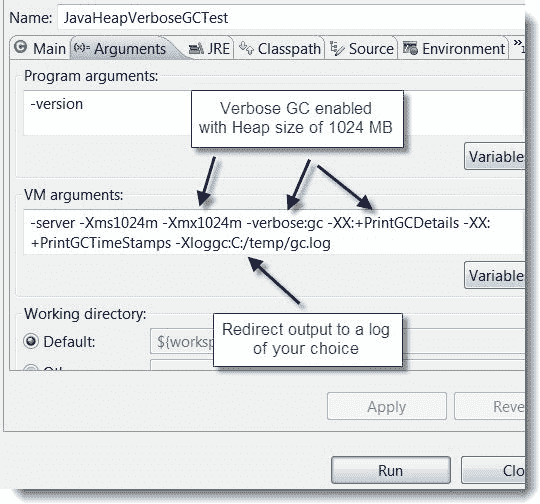**图 27：**在 Eclipse 上设置 GC 详细信息

或者，您可以在使用 Spark-submit 脚本提交 Spark 作业时指定`verbose:gc`，如下所示：

```scala
--conf “spark.executor.extraJavaOptions = -verbose:gc -XX:-PrintGCDetails -XX:+PrintGCTimeStamps"

```

简而言之，在为 Spark 指定 GC 选项时，您必须确定要在执行程序或驱动程序上指定 GC 选项。当您提交作业时，指定`--driver-java-options -XX:+PrintFlagsFinal -verbose:gc`等。对于执行程序，指定`--conf spark.executor.extraJavaOptions=-XX:+PrintFlagsFinal -verbose:gc`等。

现在，当执行您的 Spark 作业时，每次发生 GC 时，您都可以在工作节点的`/var/log/logs`中看到打印的日志和消息。这种方法的缺点是这些日志不会出现在您的驱动程序上，而是出现在集群的工作节点上。

需要注意的是，`verbose:gc`只会在每次 GC 收集后打印适当的消息或日志。相应地，它会打印有关内存的详细信息。但是，如果您对寻找更严重的问题（如内存泄漏）感兴趣，`verbose:gc`可能不够。在这种情况下，您可以使用一些可视化工具，如 jhat 和 VisualVM。您可以在[`databricks.com/blog/2015/05/28/tuning-java-garbage-collection-for-spark-applications.html`](https://databricks.com/blog/2015/05/28/tuning-java-garbage-collection-for-spark-applications.html)上阅读有关在 Spark 应用程序中进行更好的 GC 调优的信息。

# 并行级别

尽管您可以通过`SparkContext.text`文件的可选参数来控制要执行的映射任务的数量，但 Spark 会根据文件的大小自动设置每个文件的映射任务数量。此外，对于分布式的`reduce`操作，如`groupByKey`和`reduceByKey`，Spark 会使用最大父 RDD 的分区数。然而，有时我们会犯一个错误，即未充分利用计算集群中节点的全部计算资源。因此，除非您明确设置和指定 Spark 作业的并行级别，否则将无法充分利用全部计算资源。因此，您应该将并行级别设置为第二个参数。

有关此选项的更多信息，请参阅[`spark.apache.org/docs/latest/api/scala/index.html#org.apache.spark.rdd.PairRDDFunctions.`](https://spark.apache.org/docs/latest/api/scala/index.html#org.apache.spark.rdd.PairRDDFunctions)

或者，您可以通过设置配置属性 spark.default.parallelism 来更改默认设置。对于没有父 RDD 的并行操作，并行级别取决于集群管理器，即独立模式、Mesos 或 YARN。对于本地模式，将并行级别设置为本地机器上的核心数。对于 Mesos 或 YARN，将细粒度模式设置为 8。在其他情况下，所有执行程序节点上的总核心数或 2，以较大者为准，通常建议在集群中每个 CPU 核心使用 2-3 个任务。

# 广播

广播变量使 Spark 开发人员能够在每个驱动程序程序上缓存一个实例或类变量的只读副本，而不是将其自己的副本与依赖任务一起传输。但是，只有当多个阶段的任务需要以反序列化形式的相同数据时，显式创建广播变量才有用。

在 Spark 应用程序开发中，使用 SparkContext 的广播选项可以大大减小每个序列化任务的大小。这也有助于减少在集群中启动 Spark 作业的成本。如果您的 Spark 作业中有某个任务使用了驱动程序中的大对象，您应该将其转换为广播变量。

要在 Spark 应用程序中使用广播变量，可以使用`SparkContext.broadcast`进行实例化。然后，使用该类的 value 方法来访问共享值，如下所示：

```scala
val m = 5
val bv = sc.broadcast(m)

```

输出/日志：`bv: org.apache.spark.broadcast.Broadcast[Int] = Broadcast(0)`

```scala
bv.value()

```

输出/日志：`res0: Int = 1`

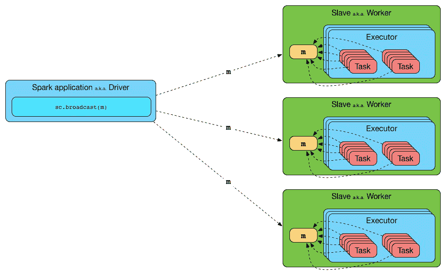**图 28：** 从驱动程序向执行程序广播一个值

Spark 的广播功能使用**SparkContext**创建广播值。之后，**BroadcastManager**和**ContextCleaner**用于控制它们的生命周期，如下图所示：

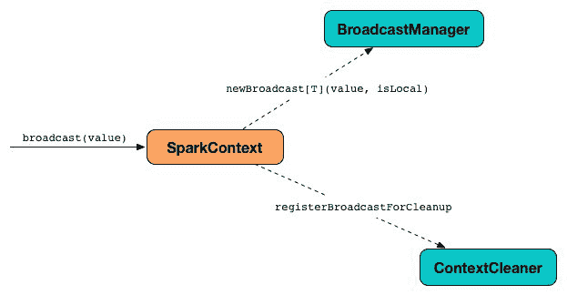**图 29：** SparkContext 使用 BroadcastManager 和 ContextCleaner 广播变量/值

驱动程序中的 Spark 应用程序会自动打印每个任务在驱动程序上的序列化大小。因此，您可以决定您的任务是否过大而无法并行。如果您的任务大于 20 KB，可能值得优化。

# 数据本地性

数据本地性意味着数据与要处理的代码的接近程度。从技术上讲，数据本地性对于在本地或集群模式下执行的 Spark 作业的性能可能会产生重大影响。因此，如果数据和要处理的代码是绑定在一起的，计算速度应该会更快。通常情况下，从驱动程序向执行程序发送序列化代码要快得多，因为代码大小比数据小得多。

在 Spark 应用程序开发和作业执行中，存在几个级别的本地性。从最接近到最远，级别取决于您需要处理的数据的当前位置：

| **数据本地性** | **含义** | **特殊说明** |
| --- | --- | --- |
| `PROCESS_LOCAL` | 数据和代码位于同一位置 | 最佳的位置可能 |
| `NODE_LOCAL` | 数据和代码位于同一节点上，例如，存储在 HDFS 上的数据 | 比`PROCESS_LOCAL`慢一点，因为数据必须在进程和网络之间传播 |
| `NO_PREF` | 数据可以从其他地方平等访问 | 没有位置偏好 |
| `RACK_LOCAL` | 数据位于同一机架上的服务器上 | 适用于大规模数据处理 |
| `ANY` | 数据在网络的其他地方，不在同一机架上 | 除非没有其他选择，否则不建议使用 |

**表 2：** 数据位置和 Spark

Spark 被开发成优先在最佳位置调度所有任务，但这并不是保证的，也并非总是可能的。因此，基于计算节点的情况，如果可用的计算资源过于繁忙，Spark 会切换到较低的位置级别。此外，如果您想要最佳的数据位置，有两种选择：

+   等待繁忙的 CPU 空闲下来，在同一台服务器或同一节点上启动任务

+   立即开始一个新的任务，需要将数据移动到那里

# 总结

在本章中，我们讨论了一些关于 Spark 的高级主题，以使您的 Spark 作业性能更好。我们讨论了一些调整 Spark 作业的基本技术。我们讨论了如何通过访问 Spark web UI 来监视您的作业。我们讨论了如何设置 Spark 配置参数。我们还讨论了一些 Spark 用户常见的错误，并提供了一些建议。最后，我们讨论了一些优化技术，帮助调整 Spark 应用程序。

在下一章中，您将看到如何测试 Spark 应用程序并调试以解决最常见的问题。
