# 第十七章：前往集群之地的时候——在集群上部署 Spark

"我看见月亮像一块剪下的银子。星星像镀金的蜜蜂一样围绕着她"

- 奥斯卡·王尔德

在前几章中，我们已经看到如何使用不同的 Spark API 开发实际应用程序。然而，在本章中，我们将看到 Spark 在集群模式下的工作方式及其底层架构。最后，我们将看到如何在集群上部署完整的 Spark 应用程序。简而言之，本章将涵盖以下主题：

+   集群中的 Spark 架构

+   Spark 生态系统和集群管理

+   在集群上部署 Spark

+   在独立集群上部署 Spark

+   在 Mesos 集群上部署 Spark

+   在 YARN 集群上部署 Spark

+   基于云的部署

+   在 AWS 上部署 Spark

# 集群中的 Spark 架构

基于 Hadoop 的 MapReduce 框架在过去几年被广泛使用；然而，它在 I/O、算法复杂性、低延迟流式作业和完全基于磁盘的操作方面存在一些问题。Hadoop 提供了 Hadoop 分布式文件系统（HDFS）来进行高效的计算和廉价存储大数据，但你只能使用基于 Hadoop 的 MapReduce 框架进行高延迟批处理模型或静态数据的计算。Spark 为我们带来的主要大数据范式是引入了内存计算和缓存抽象。这使得 Spark 非常适合大规模数据处理，并使计算节点能够通过访问相同的输入数据执行多个操作。

Spark 的弹性分布式数据集（RDD）模型可以做到 MapReduce 范式所能做的一切，甚至更多。然而，Spark 可以在规模上对数据集进行迭代计算。这个选项有助于以更快的速度执行机器学习、通用数据处理、图分析和结构化查询语言（SQL）算法，无论是否依赖于 Hadoop。因此，此时重振 Spark 生态系统是一个需求。

足够了解 Spark 的美丽和特性。此时，重振 Spark 生态系统是您了解 Spark 如何工作的需求。

# Spark 生态系统简介

为了为您提供更先进和额外的大数据处理能力，您的 Spark 作业可以在基于 Hadoop（又名 YARN）或基于 Mesos 的集群上运行。另一方面，Spark 中的核心 API 是用 Scala 编写的，使您能够使用多种编程语言（如 Java、Scala、Python 和 R）开发您的 Spark 应用程序。Spark 提供了几个库，这些库是 Spark 生态系统的一部分，用于通用数据处理和分析、图处理、大规模结构化 SQL 和机器学习（ML）领域的额外功能。Spark 生态系统包括以下组件：

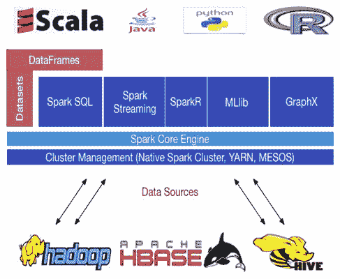**图 1：** Spark 生态系统（截至 Spark 2.1.0）

Spark 的核心引擎是用 Scala 编写的，但支持不同的语言来开发您的 Spark 应用程序，如 R、Java、Python 和 Scala。Spark 核心引擎中的主要组件/ API 如下：

1.  SparkSQL：这有助于无缝地将 SQL 查询与 Spark 程序混合在一起，以便在 Spark 程序内查询结构化数据。

1.  Spark Streaming：这是用于大规模流应用程序开发的，提供了与其他流数据源（如 Kafka、Flink 和 Twitter）无缝集成的 Spark。

1.  SparkMLlib 和 SparKML：这些是用于基于 RDD 和数据集/ DataFrame 的机器学习和管道创建。

1.  GraphX：这是用于大规模图计算和处理，使您的图数据对象完全连接。

1.  SparkR：R on Spark 有助于基本的统计计算和机器学习。

正如我们已经提到的，可以无缝地结合这些 API 来开发大规模的机器学习和数据分析应用程序。此外，Spark 作业可以通过 Hadoop YARN、Mesos 和独立的集群管理器提交和执行，也可以通过访问数据存储和源（如 HDFS、Cassandra、HBase、Amazon S3 甚至 RDBMS）在云中执行。然而，要充分利用 Spark 的功能，我们需要在计算集群上部署我们的 Spark 应用程序。

# 集群设计

Apache Spark 是一个分布式和并行处理系统，它还提供了内存计算能力。这种类型的计算范式需要一个关联的存储系统，以便您可以在大数据集群上部署您的应用程序。为了实现这一点，您将需要使用 HDFS、S3、HBase 和 Hive 等分布式存储系统。为了移动数据，您将需要其他技术，如 Sqoop、Kinesis、Twitter、Flume 和 Kafka。

在实践中，您可以很容易地配置一个小型的 Hadoop 集群。您只需要一个主节点和多个工作节点。在您的 Hadoop 集群中，通常一个主节点包括 NameNodes、DataNodes、JobTracker 和 TaskTracker。另一方面，工作节点可以配置为既作为 DataNode 又作为 TaskTracker。

出于安全原因，大多数大数据集群可能会设置在网络防火墙后，以便计算节点可以克服或至少减少防火墙造成的复杂性。否则，计算节点无法从网络外部访问，即外部网络。以下图片显示了一个常用的 Spark 简化大数据集群：

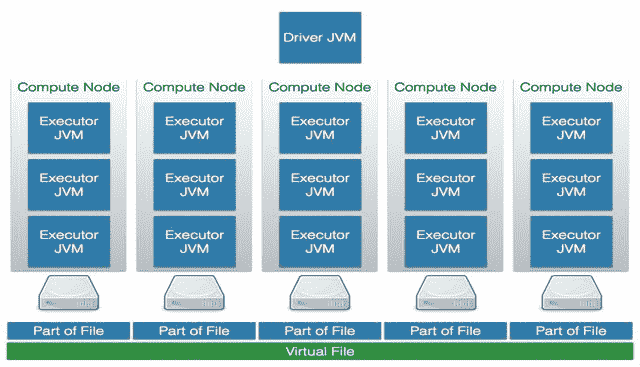**图 2：**带有 JVM 的大数据处理的一般架构

上图显示了一个由五个计算节点组成的集群。每个节点都有一个专用的执行器 JVM，每个 CPU 核心一个，以及位于集群外部的 Spark Driver JVM。磁盘直接连接到节点上，使用 JBOD（Just a bunch of disks）方法。非常大的文件被分区存储在磁盘上，而像 HDFS 这样的虚拟文件系统将这些块作为一个大的虚拟文件提供。以下简化的组件模型显示了位于集群外部的驱动程序 JVM。它与集群管理器（见图 4）通信，以获取在工作节点上调度任务的权限，因为集群管理器跟踪集群上运行的所有进程的资源分配情况。

如果您使用 Scala 或 Java 开发了您的 Spark 应用程序，这意味着您的作业是基于 JVM 的进程。对于基于 JVM 的进程，您可以通过指定以下两个参数来简单配置 Java 堆空间：

+   -Xmx：这个参数指定了 Java 堆空间的上限

+   -Xms：这个参数是 Java 堆空间的下限

一旦您提交了一个 Spark 作业，就需要为您的 Spark 作业分配堆内存。以下图片提供了一些关于如何分配堆内存的见解：

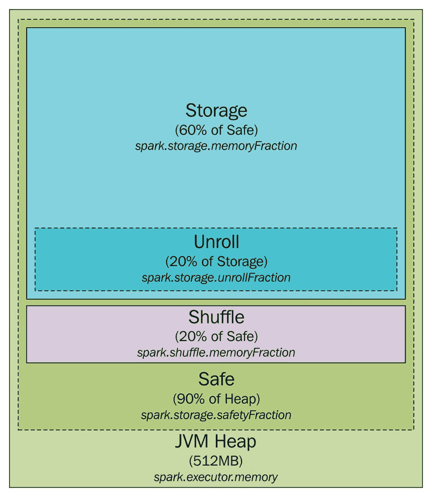**图 3：**JVM 内存管理

如前图所示，Spark 以 512MB 的 JVM 堆空间启动 Spark 作业。然而，为了保证 Spark 作业的不间断处理并避免内存不足（OOM）错误，Spark 允许计算节点仅利用堆的 90%（即约 461MB），这最终通过控制 Spark 环境中的`spark.storage.safetyFraction`参数来增加或减少。更加现实的情况是，JVM 可以被看作是存储（Java 堆的 60%）、执行（即 Shuffle 的堆的 20%）和其他存储的 20%的连接。

此外，Spark 是一种集群计算工具，试图同时利用内存和基于磁盘的计算，并允许用户将一些数据存储在内存中。实际上，Spark 仅利用主内存作为其 LRU 缓存。为了实现不间断的缓存机制，需要保留一小部分内存用于应用程序特定的数据处理。非正式地说，这大约占据了由`spark.memory.fraction`控制的 Java 堆空间的 60%。

因此，如果您想要查看或计算在您的 Spark 应用程序中可以缓存多少应用程序特定数据，您只需将所有执行程序使用的堆大小总和，并将其乘以`safetyFraction`和`spark.memory.fraction`。实际上，您可以允许 Spark 计算节点使用总堆大小的 54%（276.48 MB）。现在，洗牌内存的计算如下：

```scala
Shuffle memory= Heap Size * spark.shuffle.safetyFraction * spark.shuffle.memoryFraction

```

`spark.shuffle.safetyFraction`和`spark.shuffle.memoryFraction`的默认值分别为 80%和 20%。因此，在实际中，您可以使用*0.8*0.2 = 16%*的 JVM 堆用于洗牌。最后，展开内存是计算节点中可以被展开进程利用的主内存量。计算如下：

```scala
Unroll memory = spark.storage.unrollFraction * spark.storage.memoryFraction * spark.storage.safetyFraction

```

上述计算约占堆的 11%（0.2*0.6*0.9 = 10.8~11%），即 Java 堆空间的 56.32 MB。

更详细的讨论可以在[`spark.apache.org/docs/latest/configuration.html`](http://spark.apache.org/docs/latest/configuration.html)找到。

正如我们将在后面看到的，存在各种不同的集群管理器，其中一些还能够同时管理其他 Hadoop 工作负载或非 Hadoop 应用程序。请注意，执行程序和驱动程序始终具有双向通信，因此在网络方面它们也应该坐得很近。

**图 4：** Spark 集群中的驱动程序、主节点和工作节点架构

Spark 使用驱动程序（又称驱动程序）、主节点和工作节点架构（又称主机、从节点或计算节点）。驱动程序（或机器）与称为主节点的协调器进行通信。主节点实际上管理所有工作节点（又称从节点或计算节点），其中多个执行程序在集群中并行运行。需要注意的是，主节点也是一个具有大内存、存储、操作系统和底层计算资源的计算节点。从概念上讲，这种架构可以在**图 4**中显示。更多细节将在本节后面讨论。

在实际的集群模式中，集群管理器（又称资源管理器）管理集群中所有计算节点的所有资源。通常，防火墙在为集群增加安全性的同时也增加了复杂性。系统组件之间的端口需要打开，以便它们可以相互通信。例如，Zookeeper 被许多组件用于配置。Apache Kafka 是一个订阅消息系统，使用 Zookeeper 来配置其主题、组、消费者和生产者。因此，需要打开到 Zookeeper 的客户端端口，可能要穿过防火墙。

最后，需要考虑将系统分配给集群节点。例如，如果 Apache Spark 使用 Flume 或 Kafka，那么将使用内存通道。Apache Spark 不应该与其他 Apache 组件竞争内存使用。根据数据流和内存使用情况，可能需要在不同的集群节点上安装 Spark、Hadoop、Zookeeper、Flume 和其他工具。或者，也可以使用资源管理器，如 YARN、Mesos 或 Docker 等来解决这个问题。在标准的 Hadoop 环境中，很可能已经有 YARN 了。

作为工作节点或 Spark 主节点的计算节点将需要比防火墙内的集群处理节点更多的资源。当集群上部署了许多 Hadoop 生态系统组件时，所有这些组件都将需要主服务器上额外的内存。您应该监视工作节点的资源使用情况，并根据需要调整资源和/或应用程序位置。例如，YARN 正在处理这个问题。

本节简要介绍了 Apache Spark、Hadoop 和其他工具在大数据集群中的情况。然而，Apache Spark 集群本身在大数据集群中如何配置？例如，可能有许多类型的 Spark 集群管理器。下一节将对此进行探讨，并描述每种类型的 Apache Spark 集群管理器。

# 集群管理

Spark 上下文可以通过 Spark 配置对象（即`SparkConf`）和 Spark URL 来定义。首先，Spark 上下文的目的是连接 Spark 集群管理器，您的 Spark 作业将在其中运行。然后，集群或资源管理器会为您的应用程序在计算节点之间分配所需的资源。集群管理器的第二个任务是在集群工作节点之间分配执行程序，以便执行您的 Spark 作业。第三，资源管理器还会将驱动程序（也称为应用程序 JAR 文件、R 代码或 Python 脚本）复制到计算节点。最后，资源管理器将计算任务分配给计算节点。

以下小节描述了当前 Spark 版本（即本书撰写时的 Spark 2.1.0）提供的可能的 Apache Spark 集群管理器选项。要了解资源管理器（也称为集群管理器）的资源管理情况，以下内容显示了 YARN 如何管理其所有底层计算资源。但是，无论您使用的是哪种集群管理器（例如 Mesos 或 YARN），情况都是一样的：

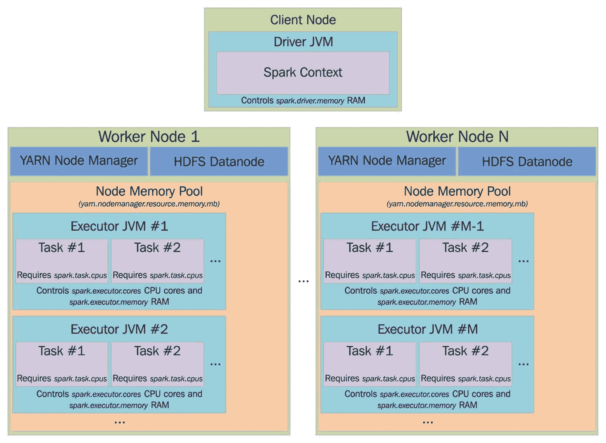**图 5：** 使用 YARN 进行资源管理

详细讨论可在[`spark.apache.org/docs/latest/cluster-overview.html#cluster-manager-types`](http://spark.apache.org/docs/latest/cluster-overview.html#cluster-manager-types)找到。

# 伪集群模式（也称为 Spark 本地）

正如您已经知道的，Spark 作业可以在本地模式下运行。有时这被称为伪集群执行模式。这也是一种非分布式和基于单个 JVM 的部署模式，其中 Spark 将所有执行组件（例如驱动程序、执行程序、LocalSchedulerBackend 和主节点）放入单个 JVM 中。这是唯一一种驱动程序本身被用作执行程序的模式。下图显示了提交 Spark 作业的本地模式的高级架构：

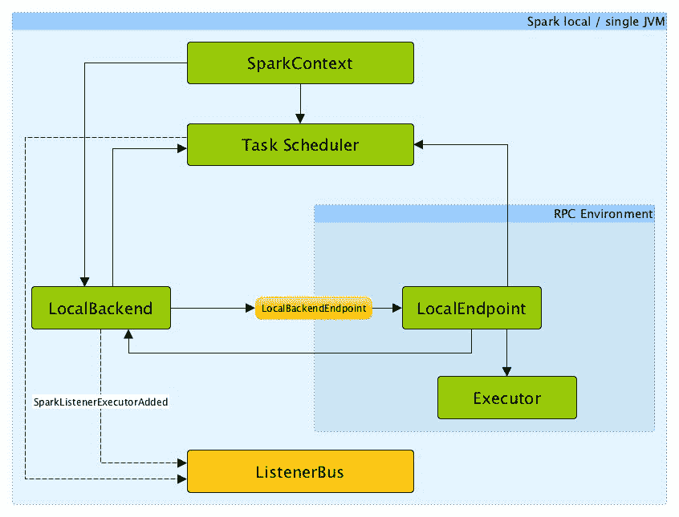**图 6：** Spark 作业本地模式的高级架构（来源：[`jaceklaskowski.gitbooks.io/mastering-apache-spark/content/spark-local.html`](https://jaceklaskowski.gitbooks.io/mastering-apache-spark/content/spark-local.html))

这太令人惊讶了吗？不，我想不是，因为您也可以实现某种并行性，其中默认并行性是在主 URL 中指定的线程数（也称为使用的核心），即 local [4]表示 4 个核心/线程，`local [*]`表示所有可用的线程。我们将在本章后面讨论这个话题。

# 独立

通过指定 Spark 配置本地 URL，可以使应用程序在本地运行。通过指定*local[n]*，可以让 Spark 使用*n*个线程在本地运行应用程序。这是一个有用的开发和测试选项，因为您还可以测试某种并行化场景，但将所有日志文件保留在单台机器上。独立模式使用了 Apache Spark 提供的基本集群管理器。Spark 主 URL 将如下所示：

```scala
spark://<hostname>:7077

```

在这里，`<hostname>`是运行 Spark 主的主机名。我指定了 7077 作为端口，这是默认值，但它是可配置的。这个简单的集群管理器目前只支持**FIFO**（先进先出）调度。您可以通过为每个应用程序设置资源配置选项来构想允许并发应用程序调度。例如，`spark.core.max`用于在应用程序之间共享处理器核心。本章后面将进行更详细的讨论。

# Apache YARN

如果将 Spark 主值设置为 YARN-cluster，则可以将应用程序提交到集群，然后终止。集群将负责分配资源和运行任务。然而，如果应用程序主作为 YARN-client 提交，则应用程序在处理的生命周期中保持活动，并从 YARN 请求资源。这在与 Hadoop YARN 集成时适用于更大规模。本章后面将提供逐步指南，以配置单节点 YARN 集群，以启动需要最少资源的 Spark 作业。

# Apache Mesos

Apache Mesos 是一个用于跨集群资源共享的开源系统。它允许多个框架通过管理和调度资源来共享集群。它是一个集群管理器，使用 Linux 容器提供隔离，允许多个系统（如 Hadoop、Spark、Kafka、Storm 等）安全地共享集群。这是一个基于主从的系统，使用 Zookeeper 进行配置管理。这样，您可以将 Spark 作业扩展到数千个节点。对于单个主节点 Mesos 集群，Spark 主 URL 将采用以下形式：

```scala
mesos://<hostname>:5050

```

通过专门使用 Mesos 提交 Spark 作业的后果可以在以下图中以可视化方式显示：

！[](img/00075.jpeg)**图 7：**Mesos 在操作中（图片来源：[`jaceklaskowski.gitbooks.io/mastering-apache-spark/content/spark-architecture.html`](https://jaceklaskowski.gitbooks.io/mastering-apache-spark/content/spark-architecture.html))

在前面的图中，`<hostname>`是 Mesos 主服务器的主机名，端口定义为 5050，这是默认的 Mesos 主端口（可配置）。如果在大规模高可用性 Mesos 集群中有多个 Mesos 主服务器，则 Spark 主 URL 将如下所示：

```scala
mesos://zk://<hostname>:2181

```

因此，Mesos 主服务器的选举将由 Zookeeper 控制。`<hostname>`将是 Zookeeper 群的主机名。此外，端口号 2181 是 Zookeeper 的默认主端口。

# 基于云的部署

云计算范式中有三种不同的抽象级别：

+   基础设施即服务（简称 IaaS）

+   平台即服务（简称 PaaS）

+   软件即服务（简称 SaaS）

IaaS 通过空虚拟机提供计算基础设施，用于运行作为 SaaS 的软件。这对于在 OpenStack 上的 Apache Spark 也是如此。

OpenStack 的优势在于它可以在多个不同的云提供商之间使用，因为它是一个开放标准，也是基于开源的。您甚至可以在本地数据中心使用 OpenStack，并在本地、专用和公共云数据中心之间透明动态地移动工作负载。

相比之下，PaaS 从您身上解除了安装和操作 Apache Spark 集群的负担，因为这是作为服务提供的。换句话说，您可以将其视为类似于操作系统的一层。

有时，甚至可以将 Spark 应用程序 Docker 化并以云平台独立方式部署。然而，关于 Docker 是 IaaS 还是 PaaS 正在进行讨论，但在我们看来，这只是一种轻量级预安装虚拟机的形式，更多的是 IaaS。

最后，SaaS 是云计算范式提供和管理的应用层。坦率地说，您不会看到或必须担心前两层（IaaS 和 PaaS）。

Google Cloud，Amazon AWS，Digital Ocean 和 Microsoft Azure 是提供这三个层作为服务的云计算服务的良好示例。我们将在本章后面展示如何在云顶部使用 Amazon AWS 部署您的 Spark 集群的示例。

# 在集群上部署 Spark 应用程序

在本节中，我们将讨论如何在计算集群上部署 Spark 作业。我们将看到如何在三种部署模式（独立，YARN 和 Mesos）中部署集群。以下图总结了本章中需要引用集群概念的术语：

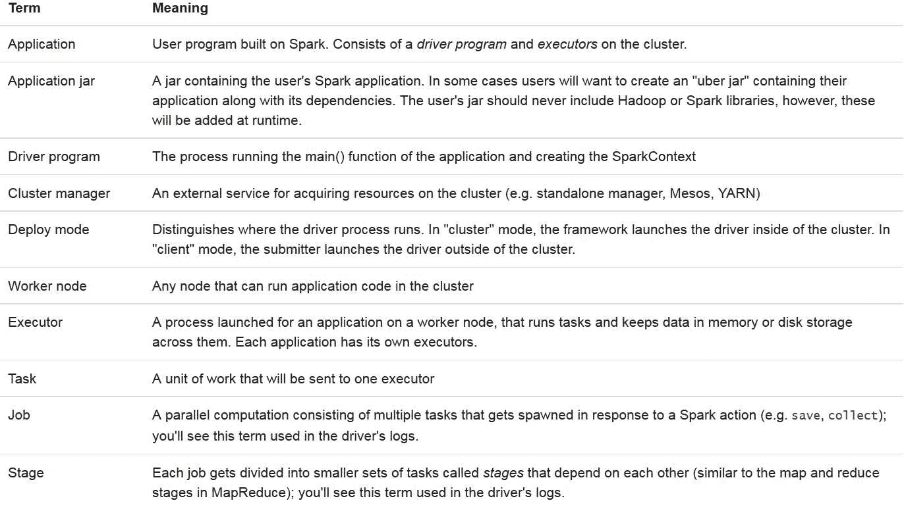**图 8：**需要引用集群概念的术语（来源：http://spark.apache.org/docs/latest/cluster-overview.html#glossary）

但是，在深入研究之前，我们需要了解如何一般提交 Spark 作业。

# 提交 Spark 作业

一旦将 Spark 应用程序打包为 jar 文件（用 Scala 或 Java 编写）或 Python 文件，就可以使用 Spark 分发（即`$SPARK_HOME/bin`下的 bin 目录中的 Spark-submit 脚本）提交。根据 Spark 网站提供的 API 文档（[`spark.apache.org/docs/latest/submitting-applications.html`](http://spark.apache.org/docs/latest/submitting-applications.html)），该脚本负责以下内容：

+   设置`JAVA_HOME`，`SCALA_HOME`与 Spark 的类路径

+   设置执行作业所需的所有依赖项

+   管理不同的集群管理器

+   最后，部署 Spark 支持的模型

简而言之，Spark 作业提交语法如下：

```scala
$ spark-submit [options] <app-jar | python-file> [app arguments]

```

在这里，`[options]`可以是：`--conf <configuration_parameters> --class <main-class> --master <master-url> --deploy-mode <deploy-mode> ... # other options`

+   `<main-class>`是主类名。这实际上是我们 Spark 应用程序的入口点。

+   `--conf`表示所有使用的 Spark 参数和配置属性。配置属性的格式是键=值格式。

+   `<master-url>`指定集群的主 URL（例如，`spark://HOST_NAME:PORT`*）*用于连接到 Spark 独立集群的主机，`local`用于在本地运行 Spark 作业。默认情况下，它只允许您使用一个工作线程，没有并行性。`local [k]`可用于在本地运行具有*K*工作线程的 Spark 作业。需要注意的是，K 是您计算机上的核心数。最后，如果您指定主机为`local[*]`以在本地运行 Spark 作业，您将允许`spark-submit`脚本利用计算机上所有工作线程（逻辑核心）。最后，您可以指定主机为`mesos://IP_ADDRESS:PORT`以连接到可用的 Mesos 集群。或者，您可以指定使用`yarn`在基于 YARN 的集群上运行 Spark 作业。

有关 Master URL 的其他选项，请参考以下图：

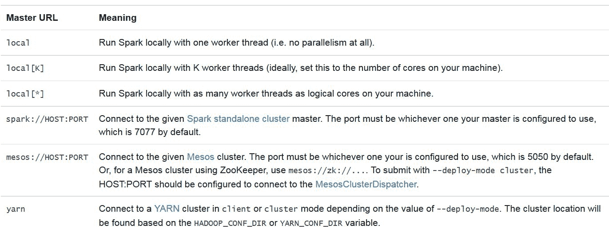**图 9：**Spark 支持的主 URL 的详细信息

+   `<deploy-mode>`如果要在 worker 节点（集群）上部署驱动程序，或者在外部客户端（客户端）上本地部署，必须指定。支持四种（4）模式：local，standalone，YARN 和 Mesos。

+   `<app-jar>`是您使用依赖项构建的 JAR 文件。在提交作业时，只需传递 JAR 文件。

+   `<python-file>`是使用 Python 编写的应用程序主要源代码。在提交作业时，只需传递`.py`文件。

+   `[app-arguments]`可以是应用程序开发人员指定的输入或输出参数。

在使用 spark-submit 脚本提交 Spark 作业时，可以使用`--jars`选项指定 Spark 应用程序的主要 jar（以及包括的其他相关 JAR 包）。然后所有的 JAR 包将被传输到集群。在`--jars`之后提供的 URL 必须用逗号分隔。

然而，如果您使用 URL 指定 jar 包，最好在`--jars`之后使用逗号分隔 JAR 包。Spark 使用以下 URL 方案来允许不同的 JAR 包传播策略：

+   **file:** 指定绝对路径和`file:/`

+   **hdfs****:**、**http****:**、**https:**、**ftp****:** JAR 包或任何其他文件将从您指定的 URL/URI 中按预期进行下载

+   **local:** 以`local:/`开头的 URI 可用于指向每个计算节点上的本地 jar 文件

需要注意的是，依赖的 JAR 包、R 代码、Python 脚本或任何其他相关的数据文件需要复制或复制到每个计算节点上的工作目录中。这有时会产生很大的开销，并且需要大量的磁盘空间。磁盘使用量会随时间增加。因此，在一定时间内，需要清理未使用的数据对象或相关的代码文件。然而，使用 YARN 可以很容易地实现这一点。YARN 会定期处理清理工作，并可以自动处理。例如，在 Spark 独立模式下，可以通过`spark.worker.cleanup.appDataTtl`属性配置自动清理提交 Spark 作业时。

在计算上，Spark 被设计为在作业提交时（使用`spark-submit`脚本），可以从属性文件加载默认的 Spark 配置值，并将其传播到 Spark 应用程序。主节点将从名为`spark-default.conf`的配置文件中读取指定的选项。确切的路径是您的 Spark 分发目录中的`SPARK_HOME/conf/spark-defaults.conf`。然而，如果您在命令行中指定了所有参数，这将获得更高的优先级，并且将相应地使用。

# 在本地和独立运行 Spark 作业

示例显示在第十三章，*我的名字是贝叶斯，朴素贝叶斯*，并且可以扩展到更大的数据集以解决不同的目的。您可以将这三个聚类算法与所有必需的依赖项打包，并将它们作为 Spark 作业提交到集群中。如果您不知道如何制作一个包并从 Scala 类创建 jar 文件，您可以使用 SBT 或 Maven 将应用程序与所有依赖项捆绑在一起。

根据 Spark 文档[`spark.apache.org/docs/latest/submitting-applications.html#advanced-dependency-management`](http://spark.apache.org/docs/latest/submitting-applications.html#advanced-dependency-management)，SBT 和 Maven 都有汇编插件，用于将您的 Spark 应用程序打包为一个 fat jar。如果您的应用程序已经捆绑了所有的依赖项，可以使用以下代码行提交您的 k-means 聚类 Spark 作业，例如（对其他类使用类似的语法），用于 Saratoga NY Homes 数据集。要在本地提交和运行 Spark 作业，请在 8 个核心上运行以下命令：

```scala
$ SPARK_HOME/bin/spark-submit 
 --class com.chapter15.Clustering.KMeansDemo 
 --master local[8] 
 KMeans-0.0.1-SNAPSHOT-jar-with-dependencies.jar 
 Saratoga_NY_Homes.txt

```

在上述代码中，`com.chapter15.KMeansDemo`是用 Scala 编写的主类文件。Local [8]是使用您机器的八个核心的主 URL。`KMeansDemo-0.1-SNAPSHOT-jar-with-dependencies.jar`是我们刚刚通过 Maven 项目生成的应用程序 JAR 文件；`Saratoga_NY_Homes.txt`是 Saratoga NY Homes 数据集的输入文本文件。如果应用程序成功执行，您将在下图中找到包括输出的消息（摘要）：

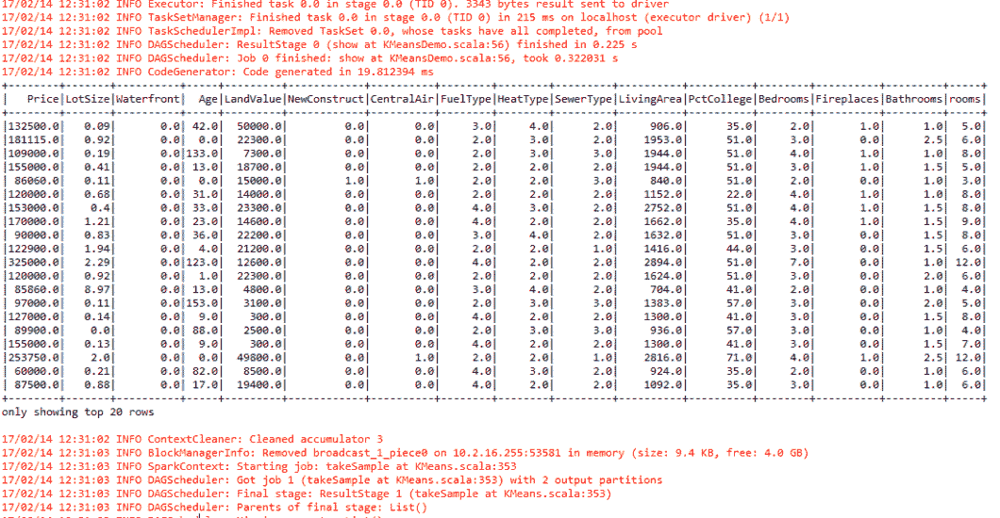**图 10:** 终端上的 Spark 作业输出[本地模式]

现在，让我们深入研究独立模式下的集群设置。要安装 Spark 独立模式，您应该在集群的每个节点上放置每个版本的预构建版本的 Spark。或者，您可以自己构建它，并根据[`spark.apache.org/docs/latest/building-spark.html`](http://spark.apache.org/docs/latest/building-spark.html)上的说明使用它。

要将环境配置为 Spark 独立模式，您将需要为集群的每个节点提供所需版本的预构建版本的 Spark。或者，您可以自己构建它，并根据[`spark.apache.org/docs/latest/building-spark.html`](http://spark.apache.org/docs/latest/building-spark.html)上的说明使用它。现在我们将看到如何手动启动独立集群。您可以通过执行以下命令启动独立主节点：

```scala
$ SPARK_HOME/sbin/start-master.sh

```

一旦启动，您应该在终端上观察以下日志：

```scala
Starting org.apache.spark.deploy.master.Master, logging to <SPARK_HOME>/logs/spark-asif-org.apache.spark.deploy.master.Master-1-ubuntu.out

```

您应该能够默认访问`http://localhost:8080`的 Spark Web UI。观察以下 UI，如下图所示：

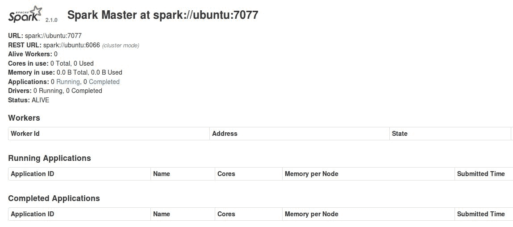**图 11：**Spark 主节点作为独立节点

您可以通过编辑以下参数更改端口号：

```scala
SPARK_MASTER_WEBUI_PORT=8080

```

在`SPARK_HOME/sbin/start-master.sh`中，只需更改端口号，然后应用以下命令：

```scala
$ sudo chmod +x SPARK_HOME/sbin/start-master.sh.

```

或者，您可以重新启动 Spark 主节点以实现前面的更改。但是，您将不得不在`SPARK_HOME/sbin/start-slave.sh`中进行类似的更改。

正如您在这里所看到的，没有与主节点关联的活动工作节点。现在，要创建一个从节点（也称为工作节点或计算节点），请创建工作节点并使用以下命令将其连接到主节点：

```scala
$ SPARK_HOME/sbin/start-slave.sh <master-spark-URL>

```

成功完成上述命令后，您应该在终端上观察以下日志：

```scala
Starting org.apache.spark.deploy.worker.Worker, logging to <SPARK_HOME>//logs/spark-asif-org.apache.spark.deploy.worker.Worker-1-ubuntu.out 

```

一旦您的一个工作节点启动，您可以在 Spark Web UI 的`http://localhost:8081`上查看其状态。但是，如果您启动另一个工作节点，您可以在连续的端口（即 8082、8083 等）上访问其状态。您还应该在那里看到新节点的列表，以及其 CPU 和内存的数量，如下图所示：

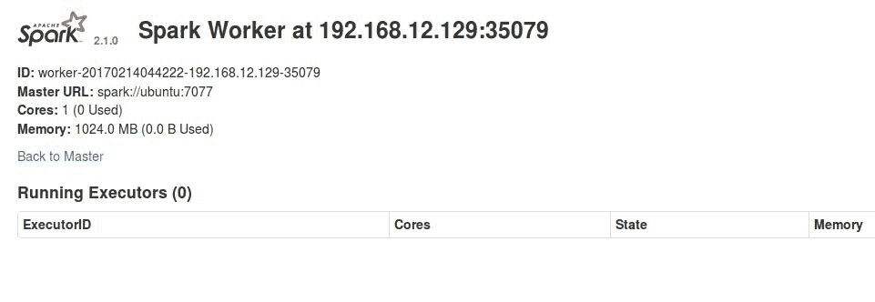**图 12：**Spark 工作节点作为独立节点

现在，如果您刷新`http://localhost:8080`，您应该看到与您的主节点关联的一个工作节点已添加，如下图所示：

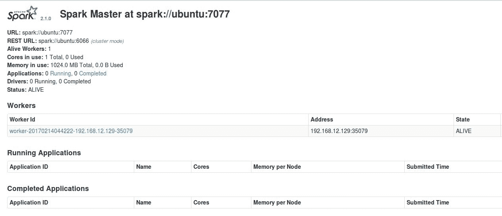**图 13：**Spark 主节点现在有一个独立的工作节点

最后，如下图所示，这些都是可以传递给主节点和工作节点的配置选项：

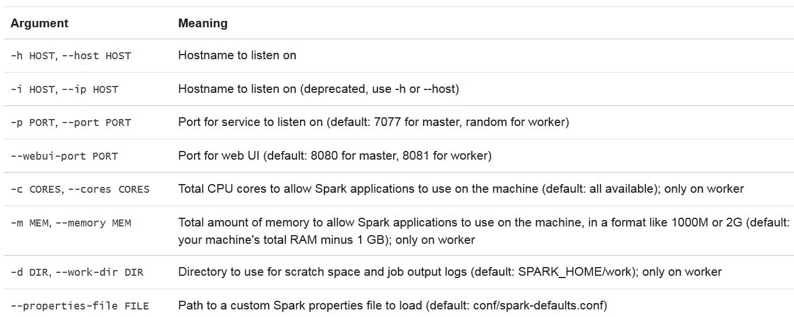**图 14：**可以传递给主节点和工作节点的配置选项（来源：[`spark.apache.org/docs/latest/spark-standalone.html#starting-a-cluster-manually`](http://spark.apache.org/docs/latest/spark-standalone.html#starting-a-cluster-manually))

现在您的一个主节点和一个工作节点正在读取和活动。最后，您可以提交与本地模式不同的独立模式下的相同 Spark 作业，使用以下命令：

```scala
$ SPARK_HOME/bin/spark-submit  
--class "com.chapter15.Clustering.KMeansDemo"  
--master spark://ubuntu:7077   
KMeans-0.0.1-SNAPSHOT-jar-with-dependencies.jar  
Saratoga_NY_Homes.txt

```

作业启动后，访问`http://localhost:80810`的 Spark Web UI 以查看主节点和`http://localhost:8081`的工作节点，您可以看到作业的进度，如第十四章中所讨论的那样，*Time to Put Some Order - Cluster Your Data with Spark MLlib*。

总结这一部分，我们想引导您查看下图（即**图 15**），显示了以下 shell 脚本用于启动或停止集群的用法：

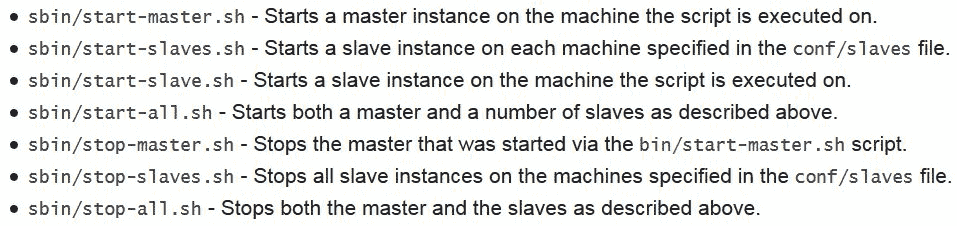**图 15：**用于启动或停止集群的 shell 脚本的用法

# Hadoop YARN

如前所述，Apache Hadoop YARN 有两个主要组件：调度程序和应用程序管理器，如下图所示：

**图 16：**Apache Hadoop YARN 架构（蓝色：系统组件；黄色和粉色：两个正在运行的应用程序）

现在使用调度程序和应用程序管理器，可以配置以下两种部署模式来在基于 YARN 的集群上启动 Spark 作业：

+   **集群模式**：在集群模式下，Spark 驱动程序在 YARN 的应用程序管理器管理的应用程序的主进程内工作。即使客户端在应用程序启动后被终止或断开连接，应用程序也可以继续运行。

+   **客户端模式**：在此模式下，Spark 驱动程序在客户端进程内运行。之后，Spark 主节点仅用于从 YARN（YARN 资源管理器）请求计算节点的计算资源。

在 Spark 独立模式和 Mesos 模式中，需要在`--master`参数中指定主节点（即地址）。然而，在 YARN 模式中，资源管理器的地址是从 Hadoop 配置文件中读取的。因此，`--master`参数是`yarn`。在提交 Spark 作业之前，您需要设置好 YARN 集群。下一小节将逐步展示如何操作。

# 配置单节点 YARN 集群

在本小节中，我们将看到如何在在 YARN 集群上运行 Spark 作业之前设置 YARN 集群。有几个步骤，所以请耐心按照以下步骤操作：

# 步骤 1：下载 Apache Hadoop

从 Hadoop 网站（[`hadoop.apache.org/`](http://hadoop.apache.org/)）下载最新的发行版。我在 Ubuntu 14.04 上使用了最新的稳定版本 2.7.3，如下所示：

```scala
$  cd /home
$  wget http://mirrors.ibiblio.org/apache/hadoop/common/hadoop-2.7.3/hadoop-2.7.3.tar.gz

```

接下来，按以下方式创建并提取包在`/opt/yarn`中：

```scala
$  mkdir –p /opt/yarn
$  cd /opt/yarn
$  tar xvzf /root/hadoop-2.7.3.tar.gz

```

# 步骤 2：设置 JAVA_HOME

有关详细信息，请参阅第一章中的 Java 设置部分，*Scala 简介*，并应用相同的更改。

# 步骤 3：创建用户和组

可以按以下方式创建`hadoop`组的`yarn`、`hdfs`和`mapred`用户帐户：

```scala
$  groupadd hadoop
$  useradd -g hadoop yarn
$  useradd -g hadoop hdfs
$  useradd -g hadoop mapred

```

# 步骤 4：创建数据和日志目录

要使用 Hadoop 运行 Spark 作业，需要具有具有各种权限的数据和日志目录。您可以使用以下命令：

```scala
$  mkdir -p /var/data/hadoop/hdfs/nn
$  mkdir -p /var/data/hadoop/hdfs/snn
$  mkdir -p /var/data/hadoop/hdfs/dn
$  chown hdfs:hadoop /var/data/hadoop/hdfs –R
$  mkdir -p /var/log/hadoop/yarn
$  chown yarn:hadoop /var/log/hadoop/yarn -R

```

现在您需要创建 YARN 安装的日志目录，然后按以下方式设置所有者和组：

```scala
$  cd /opt/yarn/hadoop-2.7.3
$  mkdir logs
$  chmod g+w logs
$  chown yarn:hadoop . -R

```

# 步骤 5：配置 core-site.xml

两个属性（即`fs.default.name`和`hadoop.http.staticuser.user`）需要设置到`etc/hadoop/core-site.xml`文件中。只需复制以下代码行：

```scala
<configuration>
       <property>
               <name>fs.default.name</name>
               <value>hdfs://localhost:9000</value>
       </property>
       <property>
               <name>hadoop.http.staticuser.user</name>
               <value>hdfs</value>
       </property>
</configuration>

```

# 步骤 6：配置 hdfs-site.xml

五个属性（即`dfs.replication`，`dfs.namenode.name.dir`，`fs.checkpoint.dir`，`fs.checkpoint.edits.dir`和`dfs.datanode.data.dir`）需要设置到`etc/hadoop/hdfs-site.xml`文件中。只需复制以下代码行：

```scala
<configuration>
 <property>
   <name>dfs.replication</name>
   <value>1</value>
 </property>
 <property>
   <name>dfs.namenode.name.dir</name>
   <value>file:/var/data/hadoop/hdfs/nn</value>
 </property>
 <property>
   <name>fs.checkpoint.dir</name>
   <value>file:/var/data/hadoop/hdfs/snn</value>
 </property>
 <property>
   <name>fs.checkpoint.edits.dir</name>
   <value>file:/var/data/hadoop/hdfs/snn</value>
 </property>
 <property>
   <name>dfs.datanode.data.dir</name>
   <value>file:/var/data/hadoop/hdfs/dn</value>
 </property>
</configuration>

```

# 步骤 7：配置 mapred-site.xml

有一个属性（即`mapreduce.framework.name`）需要设置到`etc/hadoop/mapred-site.xml`文件中。首先，将原始模板文件复制并替换为以下内容到`mapred-site.xml`中：

```scala
$  cp mapred-site.xml.template mapred-site.xml

```

现在，只需复制以下代码行：

```scala
<configuration>
<property>
   <name>mapreduce.framework.name</name>
   <value>yarn</value>
 </property>
</configuration>

```

# 步骤 8：配置 yarn-site.xml

两个属性（即`yarn.nodemanager.aux-services`和`yarn.nodemanager.aux-services.mapreduce.shuffle.class`）需要设置到`etc/hadoop/yarn-site.xml`文件中。只需复制以下代码行：

```scala
<configuration>
<property>
   <name>yarn.nodemanager.aux-services</name>
   <value>mapreduce_shuffle</value>
 </property>
 <property>
   <name>yarn.nodemanager.aux-services.mapreduce.shuffle.class</name>
   <value>org.apache.hadoop.mapred.ShuffleHandler</value>
 </property>
</configuration>

```

# 步骤 9：设置 Java 堆空间

要在基于 Hadoop 的 YARN 集群上运行 Spark 作业，需要为 JVM 指定足够的堆空间。您需要编辑`etc/hadoop/hadoop-env.sh`文件。启用以下属性：

```scala
HADOOP_HEAPSIZE="500"
HADOOP_NAMENODE_INIT_HEAPSIZE="500"

```

现在您还需要编辑`mapred-env.sh`文件，添加以下行：

```scala
HADOOP_JOB_HISTORYSERVER_HEAPSIZE=250

```

最后，请确保已编辑`yarn-env.sh`以使更改对 Hadoop YARN 永久生效：

```scala
JAVA_HEAP_MAX=-Xmx500m
YARN_HEAPSIZE=500

```

# 步骤 10：格式化 HDFS

如果要启动 HDFS NameNode，Hadoop 需要初始化一个目录，用于存储或持久化其用于跟踪文件系统所有元数据的数据。格式化将销毁所有内容并设置一个新的文件系统。然后它使用`etc/hadoop/hdfs-site.xml`中`dfs.namenode.name.dir`参数设置的值。要进行格式化，首先转到`bin`目录并执行以下命令：

```scala
$  su - hdfs
$ cd /opt/yarn/hadoop-2.7.3/bin
$ ./hdfs namenode -format

```

如果前面的命令执行成功，您应该在 Ubuntu 终端上看到以下内容：

```scala
INFO common.Storage: Storage directory /var/data/hadoop/hdfs/nn has been successfully formatted

```

# 第 11 步：启动 HDFS

在第 10 步的`bin`目录中，执行以下命令：

```scala
$ cd ../sbin
$ ./hadoop-daemon.sh start namenode

```

在执行前面的命令成功后，您应该在终端上看到以下内容：

```scala
starting namenode, logging to /opt/yarn/hadoop-2.7.3/logs/hadoop-hdfs-namenode-limulus.out

```

要启动`secondarynamenode`和`datanode`，您应该使用以下命令：

```scala
$ ./hadoop-daemon.sh start secondarynamenode

```

如果前面的命令成功，您应该在终端上收到以下消息：

```scala
Starting secondarynamenode, logging to /opt/yarn/hadoop-2.7.3/logs/hadoop-hdfs-secondarynamenode-limulus.out

```

然后使用以下命令启动数据节点：

```scala
$ ./hadoop-daemon.sh start datanode

```

如果前面的命令成功，您应该在终端上收到以下消息：

```scala
starting datanode, logging to /opt/yarn/hadoop-2.7.3/logs/hadoop-hdfs-datanode-limulus.out

```

现在确保检查所有与这些节点相关的服务是否正在运行，请使用以下命令：

```scala
$ jps

```

您应该观察到类似以下的内容：

```scala
35180 SecondaryNameNode
45915 NameNode
656335 Jps
75814 DataNode

```

# 第 12 步：启动 YARN

要使用 YARN，必须以用户 yarn 启动一个`resourcemanager`和一个节点管理器：

```scala
$  su - yarn
$ cd /opt/yarn/hadoop-2.7.3/sbin
$ ./yarn-daemon.sh start resourcemanager

```

如果前面的命令成功，您应该在终端上收到以下消息：

```scala
starting resourcemanager, logging to /opt/yarn/hadoop-2.7.3/logs/yarn-yarn-resourcemanager-limulus.out

```

然后执行以下命令启动节点管理器：

```scala
$ ./yarn-daemon.sh start nodemanager

```

如果前面的命令成功，您应该在终端上收到以下消息：

```scala
starting nodemanager, logging to /opt/yarn/hadoop-2.7.3/logs/yarn-yarn-nodemanager-limulus.out

```

如果要确保这些节点中的所有服务都在运行，应该使用`$jsp`命令。此外，如果要停止资源管理器或`nodemanager`，请使用以下`g`命令：

```scala
$ ./yarn-daemon.sh stop nodemanager
$ ./yarn-daemon.sh stop resourcemanager

```

# 第 13 步：在 Web UI 上进行验证

访问`http://localhost:50070`查看 NameNode 的状态，并在浏览器上访问`http://localhost:8088`查看资源管理器。

前面的步骤展示了如何配置基于 Hadoop 的 YARN 集群，只有几个节点。但是，如果您想要配置从几个节点到拥有数千个节点的极大集群的基于 Hadoop 的 YARN 集群，请参考[`hadoop.apache.org/docs/current/hadoop-project-dist/hadoop-common/ClusterSetup.html`](https://hadoop.apache.org/docs/current/hadoop-project-dist/hadoop-common/ClusterSetup.html)。

# 在 YARN 集群上提交 Spark 作业

现在，我们的 YARN 集群已经满足最低要求（用于执行一个小的 Spark 作业），要在 YARN 的集群模式下启动 Spark 应用程序，可以使用以下提交命令：

```scala
$ SPARK_HOME/bin/spark-submit --classpath.to.your.Class --master yarn --deploy-mode cluster [options] <app jar> [app options]

```

要运行我们的`KMeansDemo`，应该这样做：

```scala
$ SPARK_HOME/bin/spark-submit  
    --class "com.chapter15.Clustering.KMeansDemo"  
    --master yarn  
    --deploy-mode cluster  
    --driver-memory 16g  
    --executor-memory 4g  
    --executor-cores 4  
    --queue the_queue  
    KMeans-0.0.1-SNAPSHOT-jar-with-dependencies.jar  
    Saratoga_NY_Homes.txt

```

前面的`submit`命令以默认应用程序主节点启动 YARN 集群模式。然后`KMeansDemo`将作为应用程序主节点的子线程运行。为了获取状态更新并在控制台中显示它们，客户端将定期轮询应用程序主节点。当您的应用程序（即我们的情况下的`KMeansDemo`）执行完毕时，客户端将退出。

提交作业后，您可能希望使用 Spark web UI 或 Spark 历史服务器查看进度。此外，您应该参考第十八章，*测试和调试 Spark*）以了解如何分析驱动程序和执行程序日志。

要以客户端模式启动 Spark 应用程序，应该使用之前的命令，只是您将不得不将集群替换为客户端。对于想要使用 Spark shell 的人，请在客户端模式下使用以下命令：

```scala
$ SPARK_HOME/bin/spark-shell --master yarn --deploy-mode client

```

# 在 YARN 集群中进行高级作业提交

如果您选择更高级的方式将 Spark 作业提交到您的 YARN 集群中进行计算，您可以指定其他参数。例如，如果要启用动态资源分配，请将`spark.dynamicAllocation.enabled`参数设置为 true。但是，为了这样做，您还需要指定`minExecutors`，`maxExecutors`和`initialExecutors`，如下所述。另一方面，如果要启用洗牌服务，请将`spark.shuffle.service.enabled`设置为`true`。最后，您还可以尝试使用`spark.executor.instances`参数指定将运行多少执行程序实例。

现在，为了使前面的讨论更具体，您可以参考以下提交命令：

```scala
$ SPARK_HOME/bin/spark-submit   
    --class "com.chapter13.Clustering.KMeansDemo"  
    --master yarn  
    --deploy-mode cluster  
    --driver-memory 16g  
    --executor-memory 4g  
    --executor-cores 4  
    --queue the_queue  
    --conf spark.dynamicAllocation.enabled=true  
    --conf spark.shuffle.service.enabled=true  
    --conf spark.dynamicAllocation.minExecutors=1  
    --conf spark.dynamicAllocation.maxExecutors=4  
    --conf spark.dynamicAllocation.initialExecutors=4  
    --conf spark.executor.instances=4  
    KMeans-0.0.1-SNAPSHOT-jar-with-dependencies.jar  
    Saratoga_NY_Homes.txt

```

然而，前面的作业提交脚本的后果是复杂的，有时是不确定的。根据我的以往经验，如果您从代码中增加分区和执行程序的数量，那么应用程序将更快完成，这是可以接受的。但是，如果您只增加执行程序核心，完成时间是相同的。然而，您可能期望时间比初始时间更短。其次，如果您两次启动前面的代码，您可能期望两个作业都在 60 秒内完成，但这也可能不会发生。通常情况下，两个作业可能在 120 秒后才完成。这有点奇怪，不是吗？然而，下面是一个解释，可以帮助您理解这种情况。

假设您的机器上有 16 个核心和 8GB 内存。现在，如果您使用四个每个核心的执行程序，会发生什么？当您使用执行程序时，Spark 会从 YARN 中保留它，并且 YARN 会分配所需的核心数（例如，在我们的情况下为 1）和所需的内存。实际上，为了更快地处理，所需的内存要比您实际请求的更多。如果您请求 1GB，实际上它将分配几乎 1.5GB，其中包括 500MB 的开销。此外，它可能会为驱动程序分配一个执行程序，可能使用 1024MB 内存（即 1GB）。

有时，不管您的 Spark 作业需要多少内存，而是需要预留多少内存。在前面的例子中，它不会占用 50MB 的内存，而是大约 1.5GB（包括开销）每个执行程序。我们将在本章后面讨论如何在 AWS 上配置 Spark 集群。

# Apache Mesos

当使用 Mesos 时，Mesos 主节点通常会取代 Spark 主节点作为集群管理器（也称为资源管理器）。现在，当驱动程序创建一个 Spark 作业并开始分配相关任务进行调度时，Mesos 确定哪些计算节点处理哪些任务。我们假设您已经在您的机器上配置和安装了 Mesos。

要开始，以下链接可能有助于在您的机器上安装 Mesos。[`blog.madhukaraphatak.com/mesos-single-node-setup-ubuntu/,`](http://blog.madhukaraphatak.com/mesos-single-node-setup-ubuntu/) [`mesos.apache.org/gettingstarted/.`](https://mesos.apache.org/gettingstarted/)

根据硬件配置的不同，需要一段时间。在我的机器上（Ubuntu 14.04 64 位，带有 Core i7 和 32GB RAM），完成构建需要 1 小时。

要通过利用 Mesos 集群模式提交和计算您的 Spark 作业，请确保检查 Spark 二进制包是否可在 Mesos 可访问的位置。此外，请确保您的 Spark 驱动程序可以配置成自动连接到 Mesos。第二个选项是在与 Mesos 从属节点相同的位置安装 Spark。然后，您将需要配置`spark.mesos.executor.home`参数来指向 Spark 分发的位置。需要注意的是，可能指向的默认位置是`SPARK_HOME`。

当 Mesos 在 Mesos 工作节点（也称为计算节点）上首次执行 Spark 作业时，Spark 二进制包必须在该工作节点上可用。这将确保 Spark Mesos 执行程序在后台运行。

Spark 二进制包可以托管到 Hadoop 上，以便让它们可以被访问：

1. 通过`http://`使用 URI/URL（包括 HTTP），

2. 通过`s3n://`使用 Amazon S3，

3. 通过`hdfs://`使用 HDFS。

如果设置了`HADOOP_CONF_DIR`环境变量，参数通常设置为`hdfs://...`；否则为`file://`。

您可以按以下方式指定 Mesos 的主 URL：

1.  对于单主 Mesos 集群，使用`mesos://host:5050`，对于由 ZooKeeper 控制的多主 Mesos 集群，使用`mesos://zk://host1:2181,host2:2181,host3:2181/mesos`。

有关更详细的讨论，请参阅[`spark.apache.org/docs/latest/running-on-mesos.html`](http://spark.apache.org/docs/latest/running-on-mesos.html)。

# 客户端模式

在此模式下，Mesos 框架以这样的方式工作，即 Spark 作业直接在客户端机器上启动。然后等待计算结果，也称为驱动程序输出。然而，为了与 Mesos 正确交互，驱动程序期望在`SPARK_HOME/conf/spark-env.sh`中指定一些特定于应用程序的配置。为了实现这一点，在`$SPARK_HOME /conf`下修改`spark-env.sh.template`文件，并在使用此客户端模式之前，在您的`spark-env.sh`中设置以下环境变量：

```scala
$ export MESOS_NATIVE_JAVA_LIBRARY=<path to libmesos.so>

```

在 Ubuntu 上，此路径通常为`/usr/local /lib/libmesos.so`。另一方面，在 macOS X 上，相同的库称为`libmesos.dylib`，而不是`libmesos.so`：

```scala
$ export SPARK_EXECUTOR_URI=<URL of spark-2.1.0.tar.gz uploaded above>

```

现在，当提交和启动要在集群上执行的 Spark 应用程序时，您将需要将 Mesos `:// HOST:PORT`作为主 URL 传递。这通常是在 Spark 应用程序开发中创建`SparkContext`时完成的，如下所示：

```scala
val conf = new SparkConf()              
                   .setMaster("mesos://HOST:5050")  
                   .setAppName("My app")             
                  .set("spark.executor.uri", "<path to spark-2.1.0.tar.gz uploaded above>")
val sc = new SparkContext(conf)

```

另一种方法是使用`spark-submit`脚本，并在`SPARK_HOME/conf/spark-defaults.conf`文件中配置`spark.executor.uri`。在运行 shell 时，`spark.executor.uri`参数从`SPARK_EXECUTOR_URI`继承，因此不需要作为系统属性冗余传递。只需使用以下命令从您的 Spark shell 访问客户端模式：

```scala
$ SPARK_HOME/bin/spark-shell --master mesos://host:5050

```

# 集群模式

Mesos 上的 Spark 还支持集群模式。如果驱动程序已经启动了 Spark 作业（在集群上），并且计算也已经完成，客户端可以从 Mesos Web UI 访问（驱动程序的）结果。如果您通过`SPARK_HOME/sbin/start-mesos-dispatcher.sh`脚本在集群中启动了`MesosClusterDispatcher`，则可以使用集群模式。

同样，条件是在创建 Spark 应用程序的`SparkContext`时，您必须传递 Mesos 主 URL（例如，`mesos://host:5050`）。在集群模式下启动 Mesos 还会启动作为守护程序在主机上运行的`MesosClusterDispatcher`。

为了获得更灵活和高级的执行 Spark 作业，您还可以使用**Marathon**。使用 Marathon 的优点是可以使用 Marathon 运行`MesosClusterDispatcher`。如果这样做，请确保`MesosClusterDispatcher`在前台运行。

**Marathon**是 Mesos 的一个框架，旨在启动长时间运行的应用程序，在 Mesosphere 中，它作为传统 init 系统的替代品。它具有许多功能，简化了在集群环境中运行应用程序，如高可用性、节点约束、应用程序健康检查、用于脚本编写和服务发现的 API，以及易于使用的 Web 用户界面。它将其扩展和自我修复功能添加到 Mesosphere 功能集中。Marathon 可用于启动其他 Mesos 框架，还可以启动可以在常规 shell 中启动的任何进程。由于它设计用于长时间运行的应用程序，它将确保其启动的应用程序将继续运行，即使它们正在运行的从节点失败。有关在 Mesosphere 中使用 Marathon 的更多信息，请参考 GitHub 页面[`github.com/mesosphere/marathon`](https://github.com/mesosphere/marathon)。

更具体地说，从客户端，您可以使用`spark-submit`脚本提交 Spark 作业到您的 Mesos 集群，并指定主 URL 为`MesosClusterDispatcher`的 URL（例如，`mesos://dispatcher:7077`）。操作如下：

```scala
$ SPARK_HOME /bin/spark-class org.apache.spark.deploy.mesos.MesosClusterDispatcher

```

您可以在 Spark 集群 web UI 上查看驱动程序状态。例如，使用以下作业提交命令来执行：

```scala
$ SPARK_HOME/bin/spark-submit   
--class com.chapter13.Clustering.KMeansDemo   
--master mesos://207.184.161.138:7077    
--deploy-mode cluster   
--supervise   
--executor-memory 20G   
--total-executor-cores 100   
KMeans-0.0.1-SNAPSHOT-jar-with-dependencies.jar   
Saratoga_NY_Homes.txt

```

请注意，传递给 Spark-submit 的 JARS 或 Python 文件应该是 Mesos 从节点可以访问的 URI，因为 Spark 驱动程序不会自动上传本地 jar 文件。最后，Spark 可以在 Mesos 上以两种模式运行：*粗粒度*（默认）和*细粒度*（已弃用）。有关更多详细信息，请参考[`spark.apache.org/docs/latest/running-on-mesos.html`](http://spark.apache.org/docs/latest/running-on-mesos.html)。

在集群模式下，Spark 驱动程序在不同的机器上运行，也就是说，驱动程序、主节点和计算节点是不同的机器。因此，如果尝试使用`SparkContext.addJar`添加 JARS，这将不起作用。为了避免这个问题，请确保客户端上的 jar 文件也可以通过`SparkContext.addJar`使用启动命令中的`--jars`选项。

```scala
$ SPARK_HOME/bin/spark-submit --class my.main.Class    
     --master yarn    
     --deploy-mode cluster    
     --jars my-other-jar.jar, my-other-other-jar.jar    
     my-main-jar.jar    
     app_arg1 app_arg2

```

# 在 AWS 上部署

在前一节中，我们说明了如何在本地、独立或部署模式（YARN 和 Mesos）中提交 spark 作业。在这里，我们将展示如何在 AWS EC2 上的真实集群模式中运行 spark 应用程序。为了使我们的应用程序在 spark 集群模式下运行并实现更好的可扩展性，我们将考虑**Amazon 弹性计算云**（**EC2**）服务作为 IaaS 或**平台即服务**（**PaaS**）。有关定价和相关信息，请参考[`aws.amazon.com/ec2/pricing/`](https://aws.amazon.com/ec2/pricing/)。

# 步骤 1：密钥对和访问密钥配置

我们假设您已经创建了 EC2 账户。首先要求是创建 EC2 密钥对和 AWS 访问密钥。EC2 密钥对是您在通过 SSH 进行安全连接到 EC2 服务器或实例时需要的私钥。要创建密钥，您必须通过 AWS 控制台进行操作，网址为[`docs.aws.amazon.com/AWSEC2/latest/UserGuide/ec2-key-pairs.html#having-ec2-create-your-key-pair`](http://docs.aws.amazon.com/AWSEC2/latest/UserGuide/ec2-key-pairs.html#having-ec2-create-your-key-pair)。请参考以下图示，显示了 EC2 账户的密钥对创建页面：

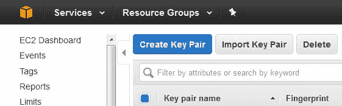**图 17:** AWS 密钥对生成窗口

下载后将其命名为`aws_key_pair.pem`并保存在本地计算机上。然后通过执行以下命令确保权限（出于安全目的，您应该将此文件存储在安全位置，例如`/usr/local/key`）：

```scala
$ sudo chmod 400 /usr/local/key/aws_key_pair.pem

```

现在您需要的是 AWS 访问密钥和您的帐户凭据。如果您希望使用`spark-ec2`脚本从本地机器提交 Spark 作业到计算节点，则需要这些内容。要生成并下载密钥，请登录到您的 AWS IAM 服务，网址为[`docs.aws.amazon.com/IAM/latest/UserGuide/id_credentials_access-keys.html#Using_CreateAccessKey`](http://docs.aws.amazon.com/IAM/latest/UserGuide/id_credentials_access-keys.html#Using_CreateAccessKey)。

下载完成后（即`/usr/local/key`），您需要在本地机器上设置两个环境变量。只需执行以下命令：

```scala
$ echo "export AWS_ACCESS_KEY_ID=<access_key_id>" >> ~/.bashrc 
$ echo " export AWS_SECRET_ACCESS_KEY=<secret_access_key_id>" >> ~/.bashrc 
$ source ~/.bashrc

```

# 第 2 步：在 EC2 上配置 Spark 集群

在 Spark 1.6.3 版本发布之前，Spark 分发（即`/SPARK_HOME/ec2`）提供了一个名为**spark-ec2**的 shell 脚本，用于从本地机器启动 EC2 实例中的 Spark 集群。这最终有助于在 AWS 上启动、管理和关闭您将在其中使用的 Spark 集群。然而，自 Spark 2.x 以来，相同的脚本已经移至 AMPLab，以便更容易修复错误并单独维护脚本本身。

该脚本可以从 GitHub 仓库[`github.com/amplab/spark-ec2`](https://github.com/amplab/spark-ec2)中访问和使用。

在 AWS 上启动和使用集群将会产生费用。因此，当计算完成时，停止或销毁集群始终是一个好习惯。否则，这将给您带来额外的费用。有关 AWS 定价的更多信息，请参阅[`aws.amazon.com/ec2/pricing/`](https://aws.amazon.com/ec2/pricing/)。

您还需要为您的 Amazon EC2 实例（控制台）创建 IAM 实例配置文件。有关详细信息，请参阅[`docs.aws.amazon.com/codedeploy/latest/userguide/getting-started-create-iam-instance-profile.html`](https://github.com/amplab/spark-ec2)。为简单起见，让我们下载脚本并将其放置在 Spark 主目录（`$SPARK_HOME/ec2`）下的一个名为`ec2`的目录中。一旦您执行以下命令启动一个新实例，它会自动在集群上设置 Spark、HDFS 和其他依赖项：

```scala
$ SPARK_HOME/spark-ec2 
--key-pair=<name_of_the_key_pair> 
--identity-file=<path_of_the key_pair>  
--instance-type=<AWS_instance_type > 
--region=<region> zone=<zone> 
--slaves=<number_of_slaves> 
--hadoop-major-version=<Hadoop_version> 
--spark-version=<spark_version> 
--instance-profile-name=<profile_name>
launch <cluster-name>

```

我们相信这些参数是不言自明的。或者，如需更多详细信息，请参阅[`github.com/amplab/spark-ec2#readme`](https://github.com/amplab/spark-ec2#readme)。

**如果您已经有一个 Hadoop 集群并希望在其上部署 spark：**如果您正在使用 Hadoop-YARN（甚至是 Apache Mesos），运行 spark 作业相对较容易。即使您不使用其中任何一个，Spark 也可以以独立模式运行。Spark 运行一个驱动程序，然后调用 spark 执行程序。这意味着您需要告诉 Spark 您希望您的 spark 守护程序在哪些节点上运行（以主/从的形式）。在您的`spark/conf`目录中，您可以看到一个名为`slaves`的文件。更新它以提及您想要使用的所有机器。您可以从源代码设置 spark，也可以从网站使用二进制文件。您应该始终为所有节点使用**完全限定域名**（**FQDN**），并确保这些机器中的每一台都可以从您的主节点无密码访问。

假设您已经创建并配置了一个实例配置文件。现在您已经准备好启动 EC2 集群。对于我们的情况，它可能类似于以下内容：

```scala
$ SPARK_HOME/spark-ec2 
 --key-pair=aws_key_pair 
 --identity-file=/usr/local/aws_key_pair.pem 
 --instance-type=m3.2xlarge 
--region=eu-west-1 --zone=eu-west-1a --slaves=2 
--hadoop-major-version=yarn 
--spark-version=2.1.0 
--instance-profile-name=rezacsedu_aws
launch ec2-spark-cluster-1

```

以下图显示了您在 AWS 上的 Spark 主目录：

图 18：AWS 上的集群主页

成功完成后，spark 集群将在您的 EC2 帐户上实例化两个工作节点（从节点）。然而，这个任务有时可能需要大约半个小时，具体取决于您的互联网速度和硬件配置。因此，您可能想要休息一下。在集群设置成功完成后，您将在终端上获得 Spark 集群的 URL。为了确保集群真的在运行，可以在浏览器上检查`https://<master-hostname>:8080`，其中`master-hostname`是您在终端上收到的 URL。如果一切正常，您将发现您的集群正在运行；请参见**图 18**中的集群主页。

# 第 3 步：在 AWS 集群上运行 Spark 作业

现在您的主节点和工作节点都是活动的并正在运行。这意味着您可以将 Spark 作业提交给它们进行计算。但在此之前，您需要使用 SSH 登录远程节点。为此，请执行以下命令以 SSH 远程 Spark 集群：

```scala
$ SPARK_HOME/spark-ec2 
--key-pair=<name_of_the_key_pair> 
--identity-file=<path_of_the _key_pair> 
--region=<region> 
--zone=<zone>
login <cluster-name> 

```

对于我们的情况，应该是以下内容：

```scala
$ SPARK_HOME/spark-ec2 
--key-pair=my-key-pair 
--identity-file=/usr/local/key/aws-key-pair.pem 
--region=eu-west-1 
--zone=eu-west-1
login ec2-spark-cluster-1

```

现在将您的应用程序，即 JAR 文件（或 python/R 脚本），复制到远程实例（在我们的情况下是`ec2-52-48-119-121.eu-west-1.compute.amazonaws.com`）中，通过执行以下命令（在新的终端中）：

```scala
$ scp -i /usr/local/key/aws-key-pair.pem /usr/local/code/KMeans-0.0.1-SNAPSHOT-jar-with-dependencies.jar ec2-user@ec2-52-18-252-59.eu-west-1.compute.amazonaws.com:/home/ec2-user/

```

然后，通过执行以下命令将您的数据（在我们的情况下是`/usr/local/data/Saratoga_NY_Homes.txt`）复制到同一远程实例：

```scala
$ scp -i /usr/local/key/aws-key-pair.pem /usr/local/data/Saratoga_NY_Homes.txt ec2-user@ec2-52-18-252-59.eu-west-1.compute.amazonaws.com:/home/ec2-user/

```

请注意，如果您已经在远程机器上配置了 HDFS 并放置了您的代码/数据文件，您就不需要将 JAR 和数据文件复制到从节点；主节点会自动执行这些操作。

干得好！您几乎完成了！现在，最后，您需要提交您的 Spark 作业以由从节点进行计算。要这样做，只需执行以下命令：

```scala
$SPARK_HOME/bin/spark-submit 
 --class com.chapter13.Clustering.KMeansDemo 
--master spark://ec2-52-48-119-121.eu-west-1.compute.amazonaws.com:7077 
file:///home/ec2-user/KMeans-0.0.1-SNAPSHOT-jar-with-dependencies.jar 
file:///home/ec2-user/Saratoga_NY_Homes.txt

```

如果您的机器上没有设置 HDFS，请将输入文件放在`file:///input.txt`下。

如果您已经将数据放在 HDFS 上，您应该发出类似以下命令的提交命令：

```scala
$SPARK_HOME/bin/spark-submit 
 --class com.chapter13.Clustering.KMeansDemo 
--master spark://ec2-52-48-119-121.eu-west-1.compute.amazonaws.com:7077 
hdfs://localhost:9000/KMeans-0.0.1-SNAPSHOT-jar-with-dependencies.jar 
hdfs://localhost:9000//Saratoga_NY_Homes.txt

```

在作业计算成功完成后，您应该在端口 8080 上看到作业的状态和相关统计信息。

# 第 4 步：暂停、重新启动和终止 Spark 集群

当您的计算完成后，最好停止您的集群以避免额外的成本。要停止您的集群，请从本地机器执行以下命令：

```scala
$ SPARK_HOME/ec2/spark-ec2 --region=<ec2-region> stop <cluster-name>

```

对于我们的情况，应该是以下内容：

```scala
$ SPARK_HOME/ec2/spark-ec2 --region=eu-west-1 stop ec2-spark-cluster-1

```

要在以后重新启动集群，请执行以下命令：

```scala
$ SPARK_HOME/ec2/spark-ec2 -i <key-file> --region=<ec2-region> start <cluster-name>

```

对于我们的情况，应该是以下内容：

```scala
$ SPARK_HOME/ec2/spark-ec2 --identity-file=/usr/local/key/-key-pair.pem --region=eu-west-1 start ec2-spark-cluster-1

```

最后，要在 AWS 上终止您的 Spark 集群，我们使用以下代码：

```scala
$ SPARK_HOME/ec2/spark-ec2 destroy <cluster-name>

```

在我们的情况下，应该是以下内容：

```scala
$ SPARK_HOME /spark-ec2 --region=eu-west-1 destroy ec2-spark-cluster-1

```

Spot 实例非常适合降低 AWS 成本，有时可以将实例成本降低一个数量级。使用这种设施的逐步指南可以在[`blog.insightdatalabs.com/spark-cluster-step-by-step/`](http://blog.insightdatalabs.com/spark-cluster-step-by-step/)上找到。

有时，移动大型数据集，比如 1TB 的原始数据文件，是困难的。在这种情况下，如果您希望您的应用程序能够扩展到更大规模的数据集，最快的方法是将它们从 Amazon S3 或 EBS 设备加载到节点上的 HDFS，并使用`hdfs://`指定数据文件路径。

数据文件或任何其他文件（数据、jar 包、脚本等）都可以托管在 HDFS 上，以使它们具有高度的可访问性：

1. 通过`http://`获取 URI/URL（包括 HTTP）

2. 通过`s3n://`使用 Amazon S3

3. 通过`hdfs://`使用 HDFS

如果设置了`HADOOP_CONF_DIR`环境变量，参数通常设置为`hdfs://...`；否则为`file://`。

# 摘要

在本章中，我们讨论了 Spark 在集群模式下的工作原理及其基础架构。您还看到了如何在集群上部署完整的 Spark 应用程序。您看到了如何在不同的集群模式（如本地、独立、YARN 和 Mesos）中部署集群以运行 Spark 应用程序。最后，您看到了如何使用 EC2 脚本在 AWS 上配置 Spark 集群。我们相信本章将帮助您对 Spark 有一些良好的理解。然而，由于页面限制，我们无法涵盖许多 API 及其底层功能。

如果您遇到任何问题，请不要忘记向 Spark 用户邮件列表`user@spark.apache.org`报告。在这样做之前，请确保您已经订阅了它。在下一章中，您将看到如何测试和调试 Spark 应用程序。
