# 第十八章：测试和调试 Spark

“每个人都知道调试比一开始编写程序要难两倍。所以，如果你在编写程序时尽可能聪明，那么你将如何调试它？”

- Brian W. Kernighan

在理想的世界中，我们编写完美的 Spark 代码，一切都完美运行，对吧？开个玩笑；实际上，我们知道处理大规模数据集几乎从来都不那么容易，必然会有一些数据点会暴露出代码的任何边缘情况。

因此，考虑到上述挑战，在本章中，我们将看到如果应用程序是分布式的，测试可能有多么困难；然后，我们将看到一些解决方法。简而言之，本章将涵盖以下主题：

+   在分布式环境中进行测试

+   测试 Spark 应用程序

+   调试 Spark 应用程序

# 在分布式环境中进行测试

莱斯利·兰波特（Leslie Lamport）对分布式系统的定义如下：

“分布式系统是指我无法完成任何工作，因为我从未听说过的某台机器已经崩溃了。”

通过**万维网**（又称**WWW**）进行资源共享，连接的计算机网络（又称集群），是分布式系统的一个很好的例子。这些分布式环境通常非常复杂，经常发生许多异构性。在这些异构环境中进行测试也是具有挑战性的。在本节中，首先我们将观察一些在使用这种系统时经常出现的常见问题。

# 分布式环境

有许多关于分布式系统的定义。让我们看一些定义，然后我们将尝试在之后将上述类别相关联。Coulouris 将分布式系统定义为*一个系统，其中位于网络计算机上的硬件或软件组件仅通过消息传递进行通信和协调*。另一方面，Tanenbaum 以多种方式定义这个术语：

+   *一组独立的计算机，对系统的用户来说，它们看起来像是一个单一的计算机。*

+   *由两个或两个以上独立计算机组成的系统，它们通过同步或异步消息传递来协调它们的处理。*

+   *分布式系统是由网络连接的自主计算机组成的集合，其软件旨在产生一个集成的计算设施。*

现在，根据前面的定义，分布式系统可以分为以下几类：

+   只有硬件和软件是分布式的：本地分布式系统通过局域网连接。

+   用户是分布式的，但是运行后端的计算和硬件资源，例如 WWW。

+   用户和硬件/软件都是分布式的：通过 WAN 连接的分布式计算集群。例如，您可以在使用 Amazon AWS、Microsoft Azure、Google Cloud 或 Digital Ocean 的 droplets 时获得这些类型的计算设施。

# 分布式系统中的问题

在这里，我们将讨论一些在软件和硬件测试过程中需要注意的主要问题，以便 Spark 作业在集群计算中顺利运行，这本质上是一个分布式计算环境。

请注意，所有这些问题都是不可避免的，但我们至少可以调整它们以获得更好的效果。您应该遵循上一章中给出的指示和建议。根据*Kamal Sheel Mishra*和*Anil Kumar Tripathi*在*国际计算机科学和信息技术杂志*第 5 卷（4），2014 年，4922-4925 页中的*分布式软件系统的一些问题、挑战和问题*，URL：[`pdfs.semanticscholar.org/4c6d/c4d739bad13bcd0398e5180c1513f18275d8.pdf`](https://pdfs.semanticscholar.org/4c6d/c4d739bad13bcd0398e5180c1513f18275d8.pdf)，在分布式环境中工作时需要解决几个问题：

+   可扩展性

+   异构语言、平台和架构

+   资源管理

+   安全和隐私

+   透明度

+   开放性

+   互操作性

+   服务质量

+   失败管理

+   同步

+   通信

+   软件架构

+   性能分析

+   生成测试数据

+   测试组件选择

+   测试顺序

+   测试系统的可伸缩性和性能

+   源代码的可用性

+   事件的可重现性

+   死锁和竞争条件

+   测试容错性

+   分布式系统的调度问题

+   分布式任务分配

+   测试分布式软件

+   从硬件抽象级别的监控和控制机制

的确，我们无法完全解决所有这些问题，但是，使用 Spark，我们至少可以控制一些与分布式系统相关的问题。例如，可伸缩性、资源管理、服务质量、故障管理、同步、通信、分布式系统的调度问题、分布式任务分配以及测试分布式软件中的监控和控制机制。其中大部分在前两章中已经讨论过。另一方面，我们可以解决一些与测试和软件相关的问题：如软件架构、性能分析、生成测试数据、测试组件选择、测试顺序、测试系统的可伸缩性和性能，以及源代码的可用性。这些问题至少在本章中将被明确或隐含地涵盖。

# 在分布式环境中软件测试的挑战

在敏捷软件开发中有一些常见的挑战，而在最终部署之前在分布式环境中测试软件时，这些挑战变得更加复杂。通常团队成员需要在错误不断增加后并行合并软件组件。然而，基于紧急性，合并通常发生在测试阶段之前。有时，许多利益相关者分布在不同的团队中。因此，存在误解的巨大潜力，团队经常在其中失去。

例如，Cloud Foundry（[`www.cloudfoundry.org/`](https://www.cloudfoundry.org/)）是一个开源的、高度分布式的 PaaS 软件系统，用于管理云中应用程序的部署和可伸缩性。它承诺不同的功能，如可伸缩性、可靠性和弹性，这些功能在 Cloud Foundry 上的部署中是内在的，需要底层分布式系统实施措施来确保健壮性、弹性和故障转移。

众所周知，软件测试的过程包括*单元测试*、*集成测试*、*烟雾测试*、*验收测试*、*可伸缩性测试*、*性能测试*和*服务质量测试*。在 Cloud Foundry 中，测试分布式系统的过程如下图所示：

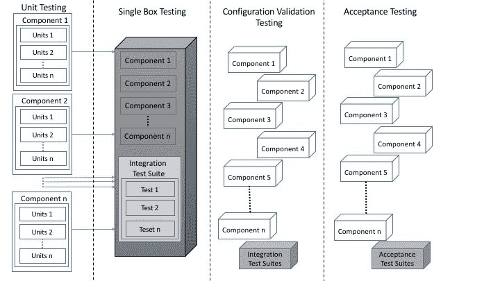**图 1：**像 Cloud 这样的分布式环境中软件测试的一个例子

如前图（第一列）所示，在像 Cloud 这样的分布式环境中进行测试的过程始于针对系统中最小的接口点运行单元测试。在所有单元测试成功执行后，运行集成测试来验证作为单一连贯软件系统的相互作用组件的行为（第二列），这些组件运行在单个盒子上（例如，一个虚拟机（VM）或裸机）。然而，虽然这些测试验证了系统作为单体的整体行为，但并不保证在分布式部署中系统的有效性。一旦集成测试通过，下一步（第三列）是验证系统的分布式部署并运行烟雾测试。

正如您所知，软件的成功配置和单元测试的执行使我们能够验证系统行为的可接受性。通过运行验收测试（第四列）来进行验证。现在，为了克服分布式环境中前面提到的问题和挑战，还有其他隐藏的挑战需要研究人员和大数据工程师来解决，但这些实际上超出了本书的范围。

现在我们知道了分布式环境中软件测试的真正挑战是什么，现在让我们开始对我们的 Spark 代码进行一些测试。下一节将专门讨论测试 Spark 应用程序。

# 测试 Spark 应用程序

有许多方法可以尝试测试您的 Spark 代码，具体取决于它是 Java（您可以进行基本的 JUnit 测试来测试非 Spark 部分）还是 ScalaTest 用于您的 Scala 代码。您还可以通过在本地或小型测试集群上运行 Spark 来进行完整的集成测试。Holden Karau 提供的另一个很棒的选择是使用 Spark-testing base。您可能知道目前还没有用于 Spark 的本机单元测试库。尽管如此，我们可以有以下两种替代方法来使用两个库：

+   ScalaTest

+   Spark 测试基础

但是，在开始测试用 Scala 编写的 Spark 应用程序之前，对单元测试和测试 Scala 方法的背景知识是必需的。

# 测试 Scala 方法

在这里，我们将看到一些测试 Scala 方法的简单技术。对于 Scala 用户来说，这是最熟悉的单元测试框架（您也可以用它来测试 Java 代码，很快也可以用于 JavaScript）。ScalaTest 支持多种不同的测试样式，每种样式都设计用于支持特定类型的测试需求。有关详细信息，请参阅 ScalaTest 用户指南[`www.scalatest.org/user_guide/selecting_a_style`](http://www.scalatest.org/user_guide/selecting_a_style)。尽管 ScalaTest 支持许多样式，但快速入门的一种方法是使用以下 ScalaTest 特质，并以**TDD**（测试驱动开发）风格编写测试：

1.  `FunSuite`

1.  `Assertions`

1.  `BeforeAndAfter`

随时浏览前述 URL 以了解有关这些特质的更多信息；这将使本教程的其余部分顺利进行。

需要注意的是 TDD 是一种开发软件的编程技术，它规定您应该从测试开始开发。因此，它不影响测试的编写方式，而是测试的编写时间。在`ScalaTest.FunSuite`中没有特质或测试样式来强制或鼓励 TDD，`Assertions`和`BeforeAndAfter`只是更类似于 xUnit 测试框架。

在任何样式特质中，ScalaTest 中有三种断言可用：

+   `assert`：这用于在您的 Scala 程序中进行一般断言。

+   `assertResult`：这有助于区分预期值和实际值。

+   `assertThrows`：这用于确保一小段代码抛出预期的异常。

ScalaTest 的断言是在特质`Assertions`中定义的，该特质进一步由`Suite`扩展。简而言之，`Suite`特质是所有样式特质的超级特质。根据 ScalaTest 文档[`www.scalatest.org/user_guide/using_assertions`](http://www.scalatest.org/user_guide/using_assertions)，`Assertions`特质还提供以下功能：

+   `assume`：有条件地取消测试

+   `fail`：无条件地使测试失败

+   `cancel`：无条件地取消测试

+   `succeed`：无条件使测试成功

+   `intercept`：确保一小段代码抛出预期的异常，然后对异常进行断言

+   `assertDoesNotCompile`：确保一小段代码不会编译

+   `assertCompiles`：确保一小段代码确实编译

+   `assertTypeError`：确保一小段代码由于类型（而不是解析）错误而无法编译

+   `withClue`：添加有关失败的更多信息

从前面的列表中，我们将展示其中的一些。在您的 Scala 程序中，您可以通过调用`assert`并传递`Boolean`表达式来编写断言。您可以简单地使用`Assertions`开始编写简单的单元测试用例。`Predef`是一个对象，其中定义了 assert 的行为。请注意，`Predef`的所有成员都会被导入到您的每个 Scala 源文件中。以下源代码将为以下情况打印`Assertion success`：

```scala
package com.chapter16.SparkTesting
object SimpleScalaTest {
  def main(args: Array[String]):Unit= {
    val a = 5
    val b = 5
    assert(a == b)
      println("Assertion success")       
  }
}

```

然而，如果您使`a = 2`和`b = 1`，例如，断言将失败，您将看到以下输出：

图 2：断言失败的一个示例

如果传递一个真表达式，assert 将正常返回。但是，如果提供的表达式为假，assert 将突然终止并出现断言错误。与`AssertionError`和`TestFailedException`形式不同，ScalaTest 的 assert 提供了更多信息，可以告诉您测试用例失败的确切行或表达式。因此，ScalaTest 的 assert 提供了比 Scala 的 assert 更好的错误消息。

例如，对于以下源代码，您应该会遇到`TestFailedException`，告诉您 5 不等于 4：

```scala
package com.chapter16.SparkTesting
import org.scalatest.Assertions._
object SimpleScalaTest {
  def main(args: Array[String]):Unit= {
    val a = 5
    val b = 4
    assert(a == b)
      println("Assertion success")       
  }
}

```

以下图显示了前面的 Scala 测试的输出：

图 3：TestFailedException 的一个示例

以下源代码解释了使用`assertResult`单元测试来测试方法的结果：

```scala
package com.chapter16.SparkTesting
import org.scalatest.Assertions._
object AssertResult {
  def main(args: Array[String]):Unit= {
    val x = 10
    val y = 6
    assertResult(3) {
      x - y
    }
  }
}

```

前面的断言将失败，Scala 将抛出异常`TestFailedException`并打印`Expected 3 but got 4`（*图 4*）：

图 4：TestFailedException 的另一个示例

现在，让我们看一个单元测试来显示预期的异常：

```scala
package com.chapter16.SparkTesting
import org.scalatest.Assertions._
object ExpectedException {
  def main(args: Array[String]):Unit= {
    val s = "Hello world!"
    try {
      s.charAt(0)
      fail()
    } catch {
      case _: IndexOutOfBoundsException => // Expected, so continue
    }
  }
}

```

如果尝试访问超出索引的数组元素，前面的代码将告诉您是否允许访问前面字符串`Hello world!`的第一个字符。如果您的 Scala 程序可以访问索引中的值，断言将失败。这也意味着测试用例失败了。因此，前面的测试用例自然会失败，因为第一个索引包含字符`H`，您应该看到以下错误消息（*图 5*）：

图 5：TestFailedException 的第三个示例

然而，现在让我们尝试访问位置为`-1`的索引，如下所示：

```scala
package com.chapter16.SparkTesting
import org.scalatest.Assertions._
object ExpectedException {
  def main(args: Array[String]):Unit= {
    val s = "Hello world!"
    try {
      s.charAt(-1)
      fail()
    } catch {
      case _: IndexOutOfBoundsException => // Expected, so continue
    }
  }
}

```

现在断言应该为真，因此测试用例将通过。最后，代码将正常终止。现在，让我们检查我们的代码片段是否会编译。很多时候，您可能希望确保代表出现的“用户错误”的代码的某种排序根本不会编译。目标是检查库对错误的强度，以阻止不需要的结果和行为。ScalaTest 的`Assertions` trait 包括以下语法：

```scala
assertDoesNotCompile("val a: String = 1")

```

如果您想确保一段代码由于类型错误（而不是语法错误）而无法编译，请使用以下方法：

```scala
assertTypeError("val a: String = 1")

```

语法错误仍会导致抛出`TestFailedException`。最后，如果您想要声明一段代码确实编译，可以使用以下方法更明显地表达：

```scala
assertCompiles("val a: Int = 1")

```

完整的示例如下所示：

```scala
package com.chapter16.SparkTesting
import org.scalatest.Assertions._ 
object CompileOrNot {
  def main(args: Array[String]):Unit= {
    assertDoesNotCompile("val a: String = 1")
    println("assertDoesNotCompile True")

    assertTypeError("val a: String = 1")
    println("assertTypeError True")

    assertCompiles("val a: Int = 1")
    println("assertCompiles True")

    assertDoesNotCompile("val a: Int = 1")
    println("assertDoesNotCompile True")
  }
}

```

前面代码的输出如下图所示：

图 6：多个测试一起

由于页面限制，我们现在想要结束基于 Scala 的单元测试。但是，对于其他单元测试用例，您可以参考 Scala 测试指南[`www.scalatest.org/user_guide`](http://www.scalatest.org/user_guide)。

# 单元测试

在软件工程中，通常会对源代码的单个单元进行测试，以确定它们是否适合使用。这种软件测试方法也称为单元测试。这种测试确保软件工程师或开发人员开发的源代码符合设计规范并按预期工作。

另一方面，单元测试的目标是以模块化的方式分离程序的每个部分。然后尝试观察所有单独部分是否正常工作。在任何软件系统中，单元测试有几个好处：

+   **早期发现问题：**它可以在开发周期的早期发现错误或规范的缺失部分。

+   **促进变更：**它有助于重构和升级，而不必担心破坏功能。

+   **简化集成：**它使集成测试更容易编写。

+   **文档：**它提供了系统的实时文档。

+   **设计：**它可以作为项目的正式设计。

# 测试 Spark 应用程序

我们已经看到如何使用 Scala 的内置`ScalaTest`包测试您的 Scala 代码。但是，在本小节中，我们将看到如何测试我们用 Scala 编写的 Spark 应用程序。将讨论以下三种方法：

+   **方法 1：**使用 JUnit 测试 Spark 应用程序

+   **方法 2：**使用`ScalaTest`包测试 Spark 应用程序

+   **方法 3：**使用 Spark 测试基础测试 Spark 应用程序

这里将讨论方法 1 和方法 2，并提供一些实际代码。但是，对方法 3 的详细讨论将在下一小节中提供。为了使理解简单易懂，我们将使用著名的单词计数应用程序来演示方法 1 和方法 2。

# 方法 1：使用 Scala JUnit 测试

假设您已经在 Scala 中编写了一个应用程序，可以告诉您文档或文本文件中有多少个单词，如下所示：

```scala
package com.chapter16.SparkTesting
import org.apache.spark._
import org.apache.spark.sql.SparkSession
class wordCounterTestDemo {
  val spark = SparkSession
    .builder
    .master("local[*]")
    .config("spark.sql.warehouse.dir", "E:/Exp/")
    .appName(s"OneVsRestExample")
    .getOrCreate()
  def myWordCounter(fileName: String): Long = {
    val input = spark.sparkContext.textFile(fileName)
    val counts = input.flatMap(_.split(" ")).distinct()
    val counter = counts.count()
    counter
  }
}

```

上述代码简单地解析文本文件，并通过简单地拆分单词执行`flatMap`操作。然后，它执行另一个操作，只考虑不同的单词。最后，`myWordCounter`方法计算有多少个单词，并返回计数器的值。

现在，在进行正式测试之前，让我们检查上述方法是否有效。只需添加主方法并创建一个对象，如下所示：

```scala
package com.chapter16.SparkTesting
import org.apache.spark._
import org.apache.spark.sql.SparkSession
object wordCounter {
  val spark = SparkSession
    .builder
    .master("local[*]")
    .config("spark.sql.warehouse.dir", "E:/Exp/")
    .appName("Testing")
    .getOrCreate()    
  val fileName = "data/words.txt";
  def myWordCounter(fileName: String): Long = {
    val input = spark.sparkContext.textFile(fileName)
    val counts = input.flatMap(_.split(" ")).distinct()
    val counter = counts.count()
    counter
  }
  def main(args: Array[String]): Unit = {
    val counter = myWordCounter(fileName)
    println("Number of words: " + counter)
  }
}

```

如果您执行上述代码，您应该观察到以下输出：`单词数量：214`。太棒了！它真的作为一个本地应用程序运行。现在，使用 Scala JUnit 测试用例测试上述测试用例。

```scala
package com.chapter16.SparkTesting
import org.scalatest.Assertions._
import org.junit.Test
import org.apache.spark.sql.SparkSession
class wordCountTest {
  val spark = SparkSession
    .builder
    .master("local[*]")
    .config("spark.sql.warehouse.dir", "E:/Exp/")
    .appName(s"OneVsRestExample")
    .getOrCreate()   
    @Test def test() {
      val fileName = "data/words.txt"
      val obj = new wordCounterTestDemo()
      assert(obj.myWordCounter(fileName) == 214)
           }
    spark.stop()
}

```

如果您仔细查看先前的代码，您会发现在`test()`方法之前我使用了`Test`注解。在`test()`方法内部，我调用了`assert()`方法，其中实际的测试发生。在这里，我们尝试检查`myWordCounter()`方法的返回值是否等于 214。现在将先前的代码作为 Scala 单元测试运行，如下所示（*图 7*）：

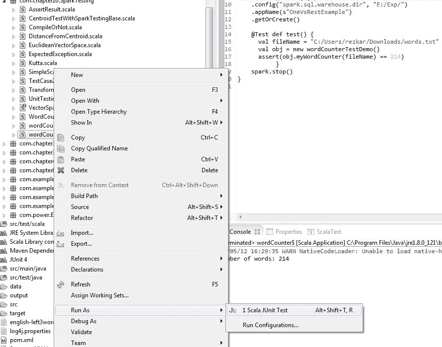**图 7：**将 Scala 代码作为 Scala JUnit 测试运行

现在，如果测试用例通过，您应该在 Eclipse IDE 上观察以下输出（*图 8*）：

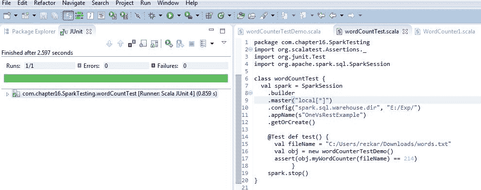**图 8：**单词计数测试用例通过

例如，尝试以以下方式断言：

```scala
assert(obj.myWordCounter(fileName) == 210)

```

如果上述测试用例失败，您应该观察到以下输出（*图 9*）：

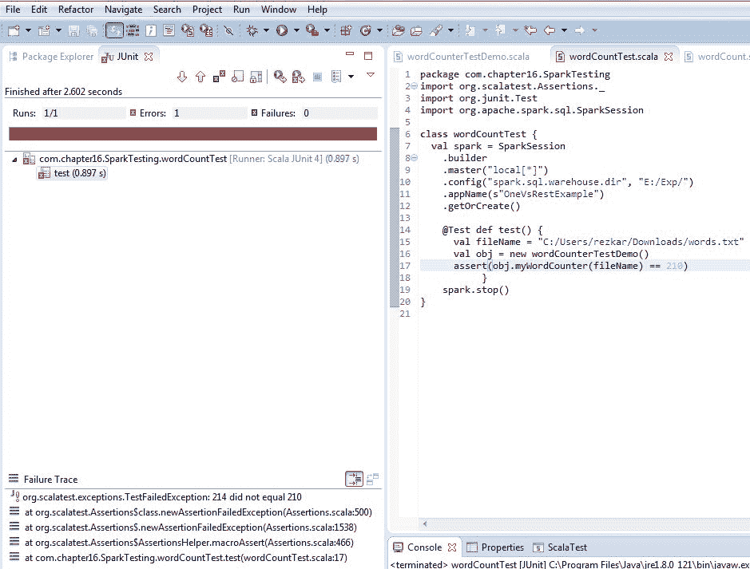**图 9：**测试用例失败

现在让我们看一下方法 2 以及它如何帮助我们改进。

# 方法 2：使用 FunSuite 测试 Scala 代码

现在，让我们通过仅返回文档中文本的 RDD 来重新设计上述测试用例，如下所示：

```scala
package com.chapter16.SparkTesting
import org.apache.spark._
import org.apache.spark.rdd.RDD
import org.apache.spark.sql.SparkSession
class wordCountRDD {
  def prepareWordCountRDD(file: String, spark: SparkSession): RDD[(String, Int)] = {
    val lines = spark.sparkContext.textFile(file)
    lines.flatMap(_.split(" ")).map((_, 1)).reduceByKey(_ + _)
  }
}

```

因此，上述类中的`prepareWordCountRDD()`方法返回一个字符串和整数值的 RDD。现在，如果我们想要测试`prepareWordCountRDD()`方法的功能，我们可以通过将测试类扩展为`ScalaTest`包的`FunSuite`和`BeforeAndAfterAll`来更明确地进行测试。测试以以下方式进行：

+   将测试类扩展为`ScalaTest`包的`FunSuite`和`BeforeAndAfterAll`

+   覆盖`beforeAll()`创建 Spark 上下文

+   使用`test()`方法执行测试，并在`test()`方法内部使用`assert()`方法

+   覆盖`afterAll()`方法停止 Spark 上下文

根据前面的步骤，让我们看一个用于测试前面的`prepareWordCountRDD()`方法的类：

```scala
package com.chapter16.SparkTesting
import org.scalatest.{ BeforeAndAfterAll, FunSuite }
import org.scalatest.Assertions._
import org.apache.spark.sql.SparkSession
import org.apache.spark.rdd.RDD
class wordCountTest2 extends FunSuite with BeforeAndAfterAll {
  var spark: SparkSession = null
  def tokenize(line: RDD[String]) = {
    line.map(x => x.split(' ')).collect()
  }
  override def beforeAll() {
    spark = SparkSession
      .builder
      .master("local[*]")
      .config("spark.sql.warehouse.dir", "E:/Exp/")
      .appName(s"OneVsRestExample")
      .getOrCreate()
  }  
  test("Test if two RDDs are equal") {
    val input = List("To be,", "or not to be:", "that is the question-", "William Shakespeare")
    val expected = Array(Array("To", "be,"), Array("or", "not", "to", "be:"), Array("that", "is", "the", "question-"), Array("William", "Shakespeare"))
    val transformed = tokenize(spark.sparkContext.parallelize(input))
    assert(transformed === expected)
  }  
  test("Test for word count RDD") {
    val fileName = "C:/Users/rezkar/Downloads/words.txt"
    val obj = new wordCountRDD
    val result = obj.prepareWordCountRDD(fileName, spark)    
    assert(result.count() === 214)
  }
  override def afterAll() {
    spark.stop()
  }
}

```

第一个测试说，如果两个 RDD 以两种不同的方式实现，内容应该是相同的。因此，第一个测试应该通过。我们将在下面的示例中看到这一点。现在，对于第二个测试，正如我们之前看到的，RDD 的单词计数为 214，但让我们假设它暂时未知。如果它恰好是 214，测试用例应该通过，这是预期的行为。

因此，我们期望两个测试都通过。现在，在 Eclipse 上，运行测试套件作为`ScalaTest-File`，如下图所示：

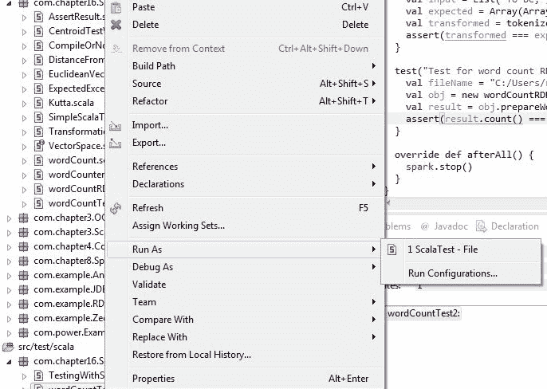 **图 10：**作为 ScalaTest-File 运行测试套件

现在您应该观察以下输出（*图 11*）。输出显示我们执行了多少个测试用例，其中有多少通过、失败、取消、忽略或挂起。它还显示了执行整体测试所需的时间。

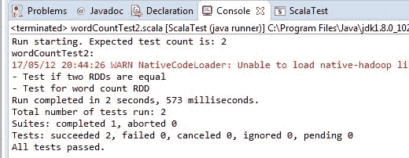**图 11：**运行两个测试套件作为 ScalaTest 文件的测试结果

太棒了！测试用例通过了。现在，让我们尝试使用`test()`方法在两个单独的测试中更改断言中的比较值，如下所示：

```scala
test("Test for word count RDD") { 
  val fileName = "data/words.txt"
  val obj = new wordCountRDD
  val result = obj.prepareWordCountRDD(fileName, spark)    
  assert(result.count() === 210)
}
test("Test if two RDDs are equal") {
  val input = List("To be", "or not to be:", "that is the question-", "William Shakespeare")
  val expected = Array(Array("To", "be,"), Array("or", "not", "to", "be:"), Array("that", "is", "the", "question-"), Array("William", "Shakespeare"))
  val transformed = tokenize(spark.sparkContext.parallelize(input))
  assert(transformed === expected)
}

```

现在，您应该期望测试用例将失败。现在运行之前的类作为`ScalaTest-File`（*图 12*）：

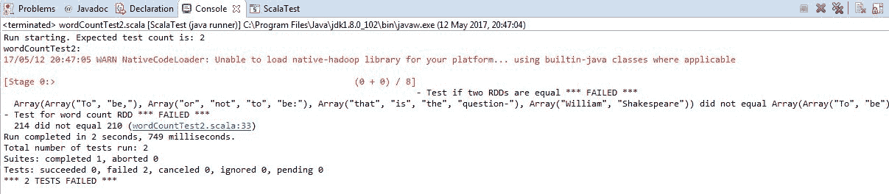**图 12：**运行前面的两个测试套件作为 ScalaTest-File 的测试结果

干得好！我们已经学会了如何使用 Scala 的 FunSuite 进行单元测试。然而，如果你仔细评估前面的方法，你会同意存在一些缺点。例如，您需要确保显式管理`SparkContext`的创建和销毁。作为开发人员或程序员，您必须编写更多的代码行来测试一个样本方法。有时，代码重复出现，因为*Before*和*After*步骤必须在所有测试套件中重复。然而，这是值得讨论的，因为通用代码可以放在一个共同的特性中。

现在的问题是我们如何改善我们的体验？我的建议是使用 Spark 测试基础使生活更轻松和更直接。我们将讨论如何使用 Spark 测试基础进行单元测试。

# 方法 3：使用 Spark 测试基础使生活更轻松

Spark 测试基础帮助您轻松测试大部分 Spark 代码。那么，这种方法的优点是什么呢？实际上有很多。例如，使用这种方法，代码不啰嗦，但我们可以得到非常简洁的代码。API 本身比 ScalaTest 或 JUnit 更丰富。多语言支持，例如 Scala、Java 和 Python。它支持内置的 RDD 比较器。您还可以用它来测试流应用程序。最后但最重要的是，它支持本地和集群模式的测试。这对于在分布式环境中进行测试非常重要。

GitHub 仓库位于[`github.com/holdenk/spark-testing-base`](https://github.com/holdenk/spark-testing-base)。

在使用 Spark 测试基础进行单元测试之前，您应该在 Maven 友好的`pom.xml`文件中包含以下依赖项，以便在 Spark 2.x 项目树中使用：

```scala
<dependency>
  <groupId>com.holdenkarau</groupId>
  <artifactId>spark-testing-base_2.10</artifactId>
  <version>2.0.0_0.6.0</version>
</dependency>

```

对于 SBT，您可以添加以下依赖项：

```scala
"com.holdenkarau" %% "spark-testing-base" % "2.0.0_0.6.0"

```

请注意，建议在 Maven 和 SBT 的情况下通过指定`<scope>test</scope>`将前面的依赖项添加到`test`范围中。除此之外，还有其他考虑因素，如内存需求和 OOM 以及禁用并行执行。SBT 测试中的默认 Java 选项太小，无法支持运行多个测试。有时，如果作业以本地模式提交，测试 Spark 代码会更加困难！现在您可以自然地理解在真正的集群模式下（即 YARN 或 Mesos）会有多么困难。

为了摆脱这个问题，您可以在项目树中的`build.sbt`文件中增加内存量。只需添加以下参数：

```scala
javaOptions ++= Seq("-Xms512M", "-Xmx2048M", "-XX:MaxPermSize=2048M", "-XX:+CMSClassUnloadingEnabled")

```

但是，如果您使用 Surefire，可以添加以下内容：

```scala
<argLine>-Xmx2048m -XX:MaxPermSize=2048m</argLine>

```

在基于 Maven 的构建中，您可以通过设置环境变量的值来实现。有关此问题的更多信息，请参阅[`maven.apache.org/configure.html`](https://maven.apache.org/configure.html)。

这只是一个运行 spark 测试基础自己测试的例子。因此，您可能需要设置更大的值。最后，请确保您已经通过添加以下代码行来禁用 SBT 中的并行执行：

```scala
parallelExecution in Test := false

```

另一方面，如果您使用 surefire，请确保`forkCount`和`reuseForks`分别设置为 1 和 true。让我们看一个使用 Spark 测试基础的例子。以下源代码有三个测试用例。第一个测试用例是一个比较，看看 1 是否等于 1，显然会通过。第二个测试用例计算句子中单词的数量，比如`Hello world! My name is Reza`，并比较是否有六个单词。最后一个测试用例尝试比较两个 RDD：

```scala
package com.chapter16.SparkTesting
import org.scalatest.Assertions._
import org.apache.spark.rdd.RDD
import com.holdenkarau.spark.testing.SharedSparkContext
import org.scalatest.FunSuite
class TransformationTestWithSparkTestingBase extends FunSuite with SharedSparkContext {
  def tokenize(line: RDD[String]) = {
    line.map(x => x.split(' ')).collect()
  }
  test("works, obviously!") {
    assert(1 == 1)
  }
  test("Words counting") {
    assert(sc.parallelize("Hello world My name is Reza".split("\\W")).map(_ + 1).count == 6)
  }
  test("Testing RDD transformations using a shared Spark Context") {
    val input = List("Testing", "RDD transformations", "using a shared", "Spark Context")
    val expected = Array(Array("Testing"), Array("RDD", "transformations"), Array("using", "a", "shared"), Array("Spark", "Context"))
    val transformed = tokenize(sc.parallelize(input))
    assert(transformed === expected)
  }
}

```

从前面的源代码中，我们可以看到我们可以使用 Spark 测试基础执行多个测试用例。成功执行后，您应该观察到以下输出（*图 13*）：

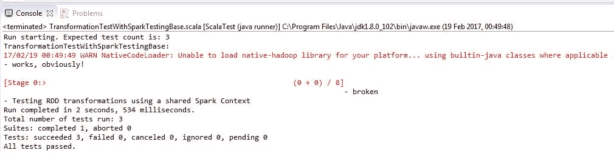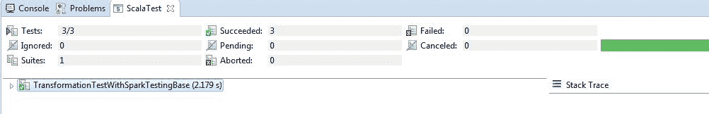**图 13：**使用 Spark 测试基础进行成功执行和通过测试的示例

# 在 Windows 上配置 Hadoop 运行时

我们已经看到如何在 Eclipse 或 IntelliJ 上测试用 Scala 编写的 Spark 应用程序，但还有一个潜在的问题不容忽视。尽管 Spark 可以在 Windows 上运行，但 Spark 是设计为在类 UNIX 操作系统上运行的。因此，如果您在 Windows 环境中工作，则需要额外小心。

在使用 Eclipse 或 IntelliJ 在 Windows 上开发用于解决数据分析、机器学习、数据科学或深度学习应用程序的 Spark 应用程序时，您可能会遇到 I/O 异常错误，您的应用程序可能无法成功编译或可能被中断。实际上，问题在于 Spark 期望在 Windows 上也有一个 Hadoop 的运行时环境。例如，如果您在 Eclipse 上首次运行 Spark 应用程序，比如`KMeansDemo.scala`，您将遇到一个 I/O 异常，内容如下：

```scala
17/02/26 13:22:00 ERROR Shell: Failed to locate the winutils binary in the hadoop binary path java.io.IOException: Could not locate executable null\bin\winutils.exe in the Hadoop binaries.

```

原因是默认情况下，Hadoop 是为 Linux 环境开发的，如果您在 Windows 平台上开发 Spark 应用程序，则需要一个桥梁，为 Spark 的 Hadoop 运行时提供一个正确执行的环境。I/O 异常的详细信息可以在下图中看到：

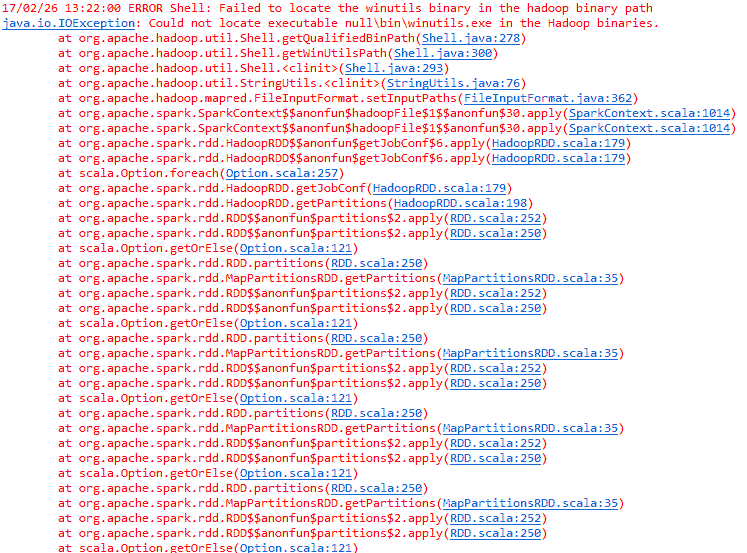**图 14：**由于未能在 Hadoop 二进制路径中找到 winutils 二进制而发生的 I/O 异常

那么，如何解决这个问题呢？解决方案很简单。正如错误消息所说，我们需要一个可执行文件，即`winutils.exe`。现在从[`github.com/steveloughran/winutils/tree/master/hadoop-2.7.1/bin`](https://github.com/steveloughran/winutils/tree/master/hadoop-2.7.1/bin)下载`winutils.exe`文件，将其粘贴到 Spark 分发目录中，并配置 Eclipse。更具体地说，假设您的包含 Hadoop 的 Spark 分发位于`C:/Users/spark-2.1.0-bin-hadoop2.7`。在 Spark 分发中，有一个名为 bin 的目录。现在，将可执行文件粘贴到那里（即`路径=C:/Users/spark-2.1.0-binhadoop2.7/bin/`）。

解决方案的第二阶段是转到 Eclipse，然后选择主类（即本例中的`KMeansDemo.scala`），然后转到运行菜单。从运行菜单中，转到运行配置选项，然后从中选择环境选项卡，如下图所示：

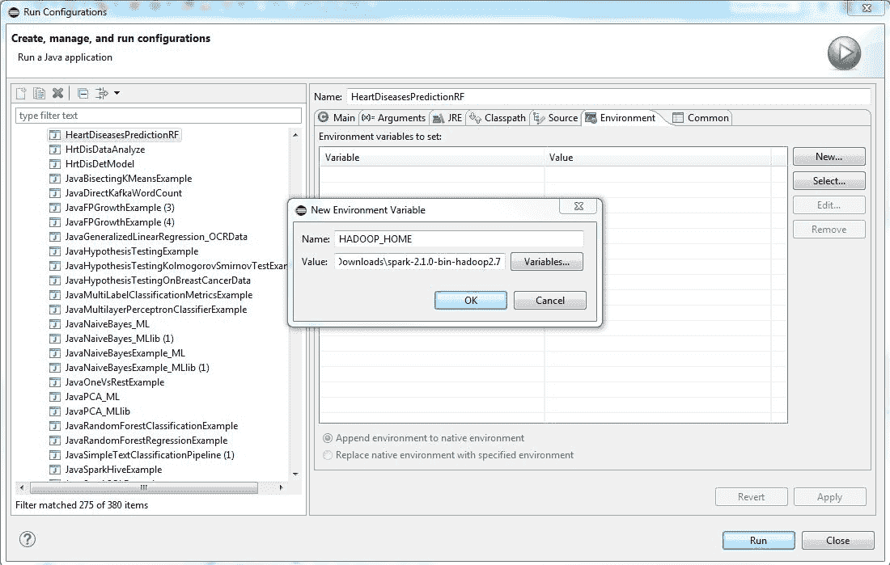**图 15：**由于 Hadoop 二进制路径中缺少 winutils 二进制而发生的 I/O 异常的解决方案

如果您选择该选项卡，您将有选项为 Eclipse 使用 JVM 创建新的环境变量。现在创建一个名为`HADOOP_HOME`的新环境变量，并将值设置为`C:/Users/spark-2.1.0-bin-hadoop2.7/`。现在点击“应用”按钮并重新运行您的应用程序，您的问题应该得到解决。

需要注意的是，在 Windows 上使用 PySpark 时，也需要`winutils.exe`文件。有关 PySpark 的参考，请参阅第十九章，*PySpark 和 SparkR*。

请注意，前面的解决方案也适用于调试您的应用程序。有时，即使出现前面的错误，您的 Spark 应用程序也会正常运行。但是，如果数据集的大小很大，前面的错误很可能会发生。

# 调试 Spark 应用程序

在本节中，我们将看到如何调试在 Eclipse 或 IntelliJ 上本地运行（独立或集群模式在 YARN 或 Mesos 中）的 Spark 应用程序。然而，在深入讨论之前，有必要了解 Spark 应用程序中的日志记录。

# 使用 log4j 记录 Spark 回顾

我们已经在第十四章，*使用 Spark MLlib 对数据进行集群化*中讨论过这个话题。然而，让我们重复相同的内容，以使您的思维与当前讨论*调试 Spark 应用程序*保持一致。如前所述，Spark 使用 log4j 进行自身的日志记录。如果您正确配置了 Spark，Spark 会将所有操作记录到 shell 控制台。以下是文件的样本快照：

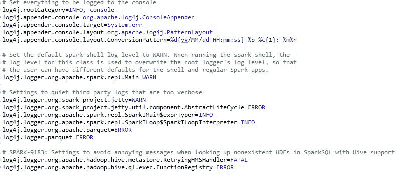**图 16：** log4j.properties 文件的快照

将默认的 spark-shell 日志级别设置为 WARN。运行 spark-shell 时，此类的日志级别用于覆盖根记录器的日志级别，以便用户可以为 shell 和常规 Spark 应用程序设置不同的默认值。当启动由执行器执行并由驱动程序管理的作业时，我们还需要附加 JVM 参数。为此，您应该编辑`conf/spark-defaults.conf`。简而言之，可以添加以下选项：

```scala
spark.executor.extraJavaOptions=-Dlog4j.configuration=file:/usr/local/spark-2.1.1/conf/log4j.properties spark.driver.extraJavaOptions=-Dlog4j.configuration=file:/usr/local/spark-2.1.1/conf/log4j.properties

```

为了使讨论更清晰，我们需要隐藏 Spark 生成的所有日志。然后我们可以将它们重定向到文件系统中进行记录。另一方面，我们希望我们自己的日志被记录在 shell 和单独的文件中，这样它们就不会与 Spark 的日志混在一起。从这里开始，我们将指向 Spark 的文件，其中我们自己的日志所在，特别是`/var/log/sparkU.log`。这个`log4j.properties`文件在应用程序启动时被 Spark 接管，因此我们除了将其放在指定的位置之外，不需要做任何事情：

```scala
package com.chapter14.Serilazition
import org.apache.log4j.LogManager
import org.apache.log4j.Level
import org.apache.spark.sql.SparkSession
object myCustomLog {
  def main(args: Array[String]): Unit = {   
    val log = LogManager.getRootLogger    
    //Everything is printed as INFO once the log level is set to INFO untill you set the level to new level for example WARN. 
    log.setLevel(Level.INFO)
    log.info("Let's get started!")    
    // Setting logger level as WARN: after that nothing prints other than WARN
    log.setLevel(Level.WARN)    
    // Creating Spark Session
    val spark = SparkSession
      .builder
      .master("local[*]")
      .config("spark.sql.warehouse.dir", "E:/Exp/")
      .appName("Logging")
      .getOrCreate()
    // These will note be printed!
    log.info("Get prepared!")
    log.trace("Show if there is any ERROR!")
    //Started the computation and printing the logging information
    log.warn("Started")
    spark.sparkContext.parallelize(1 to 20).foreach(println)
    log.warn("Finished")
  }
}

```

在上述代码中，一旦将日志级别设置为`INFO`，则所有内容都将以 INFO 打印，直到将级别设置为新级别，例如`WARN`。然而，在那之后，不会打印任何信息或跟踪等，不会被打印。除此之外，log4j 与 Spark 支持几个有效的日志记录级别。前面的代码成功执行应该生成以下输出：

```scala
17/05/13 16:39:14 INFO root: Let's get started!
17/05/13 16:39:15 WARN root: Started
4 
1 
2 
5 
3 
17/05/13 16:39:16 WARN root: Finished

```

您还可以在`conf/log4j.properties`中设置 Spark shell 的默认日志记录。Spark 提供了 log4j 的模板作为属性文件，我们可以扩展和修改该文件以记录 Spark 的日志。转到`SPARK_HOME/conf`目录，您应该看到`log4j.properties.template`文件。将其重命名为`log4j.properties`后，您应该使用以下`conf/log4j.properties.template`。在开发 Spark 应用程序时，您可以将`log4j.properties`文件放在项目目录下，例如在 Eclipse 等基于 IDE 的环境中工作。但是，要完全禁用日志记录，只需将`log4j.logger.org`标志设置为`OFF`，如下所示：

```scala
log4j.logger.org=OFF

```

到目前为止，一切都很容易。然而，在前面的代码段中，我们还没有注意到一个问题。`org.apache.log4j.Logger`类的一个缺点是它不可序列化，这意味着我们不能在对 Spark API 的某些部分进行操作时在闭包内使用它。例如，假设我们在我们的 Spark 代码中执行以下操作：

```scala
object myCustomLogger {
  def main(args: Array[String]):Unit= {
    // Setting logger level as WARN
    val log = LogManager.getRootLogger
    log.setLevel(Level.WARN)
    // Creating Spark Context
    val conf = new SparkConf().setAppName("My App").setMaster("local[*]")
    val sc = new SparkContext(conf)
    //Started the computation and printing the logging information
    //log.warn("Started")
    val i = 0
    val data = sc.parallelize(i to 100000)
    data.map{number =>
      log.info(“My number”+ i)
      number.toString
    }
    //log.warn("Finished")
  }
}

```

您应该会遇到一个异常，显示“任务”不可序列化，如下所示：

```scala
org.apache.spark.SparkException: Job aborted due to stage failure: Task not serializable: java.io.NotSerializableException: ...
Exception in thread "main" org.apache.spark.SparkException: Task not serializable 
Caused by: java.io.NotSerializableException: org.apache.log4j.spi.RootLogger
Serialization stack: object not serializable

```

首先，我们可以尝试以一种天真的方式解决这个问题。您可以做的是使执行实际操作的 Scala 类（使用`extends Serializable`）可序列化。例如，代码如下所示：

```scala
class MyMapper(n: Int) extends Serializable {
  @transient lazy val log = org.apache.log4j.LogManager.getLogger("myLogger")
  def logMapper(rdd: RDD[Int]): RDD[String] =
    rdd.map { i =>
      log.warn("mapping: " + i)
      (i + n).toString
    }
  }

```

本节旨在讨论日志记录。然而，我们借此机会使其更具通用性，适用于 Spark 编程和问题。为了更有效地克服“任务不可序列化”错误，编译器将尝试通过使其可序列化并强制 SPark 接受整个对象（而不仅仅是 lambda）来发送整个对象。然而，这会显著增加洗牌，特别是对于大对象！其他方法包括使整个类`Serializable`或仅在 map 操作中传递的 lambda 函数内声明实例。有时，跨节点保留不可序列化的对象也可以起作用。最后，使用`forEachPartition()`或`mapPartitions()`而不仅仅是`map()`并创建不可序列化的对象。总之，这些是解决该问题的方法：

+   使类可序列化

+   仅在 map 中传递的 lambda 函数内声明实例

+   将 NotSerializable 对象设置为静态，并在每台机器上创建一次

+   调用`forEachPartition()`或`mapPartitions()`而不是`map()`并创建 NotSerializable 对象

在前面的代码中，我们使用了`@transient lazy`注解，将`Logger`类标记为非持久化。另一方面，包含`apply`方法（即`MyMapperObject`）的对象，它实例化了`MyMapper`类的对象如下：

```scala
//Companion object 
object MyMapper {
  def apply(n: Int): MyMapper = new MyMapper(n)
}

```

最后，包含`main()`方法的对象如下：

```scala
//Main object
object myCustomLogwithClosureSerializable {
  def main(args: Array[String]) {
    val log = LogManager.getRootLogger
    log.setLevel(Level.WARN)
    val spark = SparkSession
      .builder
      .master("local[*]")
      .config("spark.sql.warehouse.dir", "E:/Exp/")
      .appName("Testing")
      .getOrCreate()
    log.warn("Started")
    val data = spark.sparkContext.parallelize(1 to 100000)
    val mapper = MyMapper(1)
    val other = mapper.logMapper(data)
    other.collect()
    log.warn("Finished")
  }

```

现在，让我们看另一个例子，它提供了更好的洞察力，以继续解决我们正在讨论的问题。假设我们有一个计算两个整数乘法的类如下：

```scala
class MultiplicaitonOfTwoNumber {
  def multiply(a: Int, b: Int): Int = {
    val product = a * b
    product
  }
}

```

现在，如果您尝试在 lambda 闭包中使用此类来计算乘法，您将得到我们之前描述的“任务不可序列化”错误。现在我们可以简单地使用`foreachPartition()`和 lambda，如下所示：

```scala
val myRDD = spark.sparkContext.parallelize(0 to 1000)
    myRDD.foreachPartition(s => {
      val notSerializable = new MultiplicaitonOfTwoNumber
      println(notSerializable.multiply(s.next(), s.next()))
    })

```

现在，如果您编译它，应该返回所需的结果。为了方便起见，包含`main()`方法的完整代码如下：

```scala
package com.chapter16.SparkTesting
import org.apache.spark.sql.SparkSession
class MultiplicaitonOfTwoNumber {
  def multiply(a: Int, b: Int): Int = {
    val product = a * b
    product
  }
}
object MakingTaskSerilazible {
  def main(args: Array[String]): Unit = {
    val spark = SparkSession
      .builder
      .master("local[*]")
      .config("spark.sql.warehouse.dir", "E:/Exp/")
      .appName("MakingTaskSerilazible")
      .getOrCreate()
 val myRDD = spark.sparkContext.parallelize(0 to 1000)
    myRDD.foreachPartition(s => {
      val notSerializable = new MultiplicaitonOfTwoNumber
      println(notSerializable.multiply(s.next(), s.next()))
    })
  }
}

```

输出如下：

```scala
0
5700
1406
156
4032
7832
2550
650

```

# 调试 Spark 应用程序

在本节中，我们将讨论如何在 Eclipse 或 IntelliJ 上本地运行或以 YARN 或 Mesos 的独立或集群模式运行的 Spark 应用程序进行调试。在开始之前，您还可以阅读[https://hortonworks.com/hadoop-tutorial/setting-spark-development-environment-scala/](https://hortonworks.com/hadoop-tutorial/setting-spark-development-environment-scala/)上的调试文档。

# 在 Eclipse 上调试 Spark 应用程序作为 Scala 调试

为了实现这一点，只需将您的 Eclipse 配置为调试您的 Spark 应用程序，就像调试常规的 Scala 代码一样。要配置，请选择 Run | Debug Configuration | Scala Application，如下图所示：

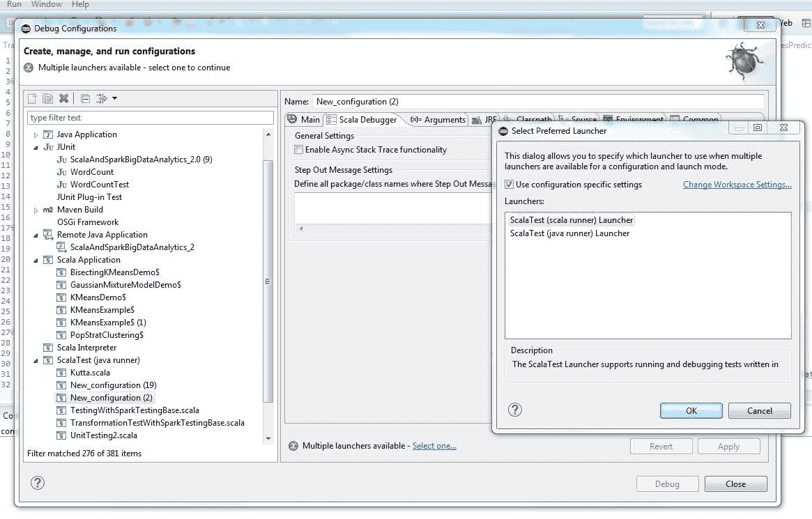**图 17：**配置 Eclipse 以调试 Spark 应用程序，作为常规的 Scala 代码调试

假设我们想要调试我们的`KMeansDemo.scala`并要求 Eclipse（您也可以在 InteliJ IDE 上有类似的选项）从第 56 行开始执行，并在第 95 行设置断点。要这样做，运行您的 Scala 代码进行调试，您应该在 Eclipse 上观察到以下情景：

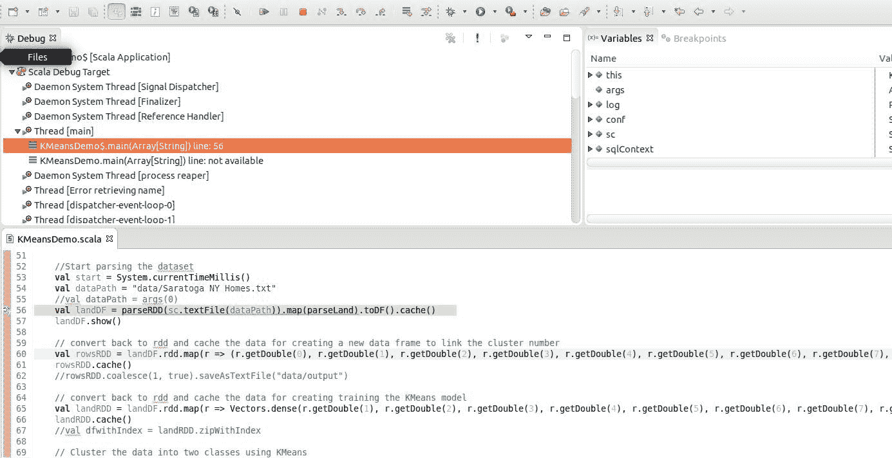**图 18：**在 Eclipse 上调试 Spark 应用程序

然后，Eclipse 将在你要求它在第 95 行停止执行时暂停，如下面的截图所示：

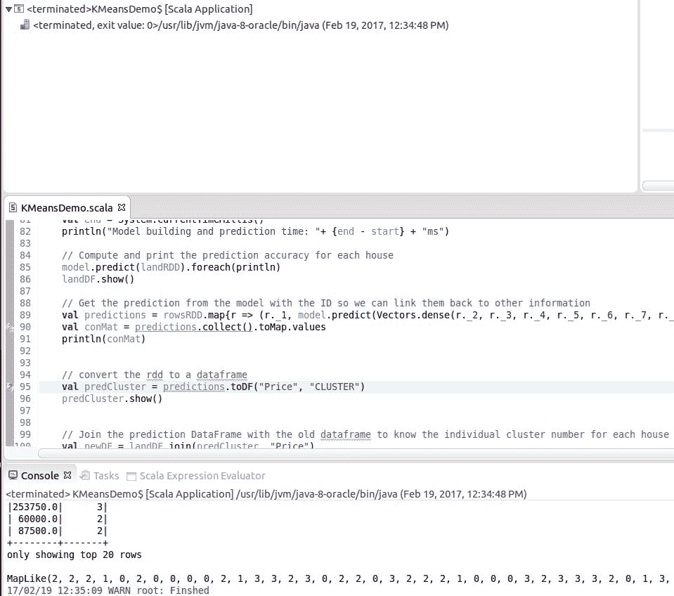**图 19：**在 Eclipse 上调试 Spark 应用程序（断点）

总之，为了简化上面的例子，如果在第 56 行和第 95 行之间有任何错误，Eclipse 将显示错误实际发生的位置。否则，如果没有中断，它将按照正常的工作流程进行。

# 在本地和独立模式下运行 Spark 作业的调试

在本地或独立模式下调试你的 Spark 应用程序时，你应该知道调试驱动程序程序和调试执行程序之间是不同的，因为使用这两种类型的节点需要传递不同的提交参数给`spark-submit`。在本节中，我将使用端口 4000 作为地址。例如，如果你想调试驱动程序程序，你可以将以下内容添加到你的`spark-submit`命令中：

```scala
--driver-java-options -agentlib:jdwp=transport=dt_socket,server=y,suspend=y,address=4000

```

之后，你应该设置你的远程调试器连接到你提交驱动程序的节点。对于前面的情况，指定了端口号 4000。然而，如果某些东西（即其他 Spark 作业、其他应用程序或服务等）已经在该端口上运行，你可能还需要自定义该端口，即更改端口号。

另一方面，连接到执行程序与前面的选项类似，除了地址选项。更具体地说，你需要用你本地机器的地址（IP 地址或带有端口号的主机名）替换地址。然而，测试你是否可以从实际计算发生的 Spark 集群访问你的本地机器是一种良好的实践和建议。例如，你可以使用以下选项使调试环境对你的`spark-submit`命令启用：

```scala
--num-executors 1\
--executor-cores 1 \
--conf "spark.executor.extraJavaOptions=-agentlib:jdwp=transport=dt_socket,server=n,address=localhost:4000,suspend=n"

```

总之，使用以下命令提交你的 Spark 作业（在这种情况下是`KMeansDemo`应用程序）：

```scala
$ SPARK_HOME/bin/spark-submit \
--class "com.chapter13.Clustering.KMeansDemo" \
--master spark://ubuntu:7077 \
--num-executors 1\
--executor-cores 1 \
--conf "spark.executor.extraJavaOptions=-agentlib:jdwp=transport=dt_socket,server=n,address= host_name_to_your_computer.org:5005,suspend=n" \
--driver-java-options -agentlib:jdwp=transport=dt_socket,server=y,suspend=y,address=4000 \
 KMeans-0.0.1-SNAPSHOT-jar-with-dependencies.jar \
Saratoga_NY_Homes.txt

```

现在，启动你的本地调试器处于监听模式，并启动你的 Spark 程序。最后，等待执行程序连接到你的调试器。你将在你的终端上看到以下消息：

```scala
Listening for transport dt_socket at address: 4000 

```

重要的是要知道，你只需要将执行程序的数量设置为 1。设置多个执行程序将尝试连接到你的调试器，并最终创建一些奇怪的问题。需要注意的是，有时设置`SPARK_JAVA_OPTS`有助于调试在本地或独立模式下运行的 Spark 应用程序。命令如下：

```scala
$ export SPARK_JAVA_OPTS=-agentlib:jdwp=transport=dt_socket,server=y,address=4000,suspend=y,onuncaught=n

```

然而，自 Spark 1.0.0 发布以来，`SPARK_JAVA_OPTS`已被弃用，并由`spark-defaults.conf`和传递给 Spark-submit 或 Spark-shell 的命令行参数取代。需要注意的是，在`spark-defaults.conf`中设置`spark.driver.extraJavaOptions`和`spark.executor.extraJavaOptions`并不是`SPARK_JAVA_OPTS`的替代。但坦率地说，`SPARK_JAVA_OPTS`仍然运行得很好，你也可以尝试一下。

# 在 YARN 或 Mesos 集群上调试 Spark 应用程序

在 YARN 上运行 Spark 应用程序时，有一个选项可以通过修改`yarn-env.sh`来启用：

```scala
YARN_OPTS="-agentlib:jdwp=transport=dt_socket,server=y,suspend=n,address=4000 $YARN_OPTS"

```

现在，远程调试将通过 Eclipse 或 IntelliJ IDE 上的端口 4000 可用。第二个选项是通过设置`SPARK_SUBMIT_OPTS`。你可以使用 Eclipse 或 IntelliJ 开发你的 Spark 应用程序，然后将其提交以在远程多节点 YARN 集群上执行。我在 Eclipse 或 IntelliJ 上创建一个 Maven 项目，并将我的 Java 或 Scala 应用程序打包为一个 jar 文件，然后将其提交为一个 Spark 作业。然而，为了将你的 IDE（如 Eclipse 或 IntelliJ）调试器连接到你的 Spark 应用程序，你可以使用`SPARK_SUBMIT_OPTS`环境变量定义所有的提交参数，如下所示：

```scala
$ export SPARK_SUBMIT_OPTS=-agentlib:jdwp=transport=dt_socket,server=y,suspend=y,address=4000

```

然后按照以下方式提交你的 Spark 作业（请根据你的需求和设置相应地更改值）：

```scala
$ SPARK_HOME/bin/spark-submit \
--class "com.chapter13.Clustering.KMeansDemo" \
--master yarn \
--deploy-mode cluster \
--driver-memory 16g \
--executor-memory 4g \
--executor-cores 4 \
--queue the_queue \
--num-executors 1\
--executor-cores 1 \
--conf "spark.executor.extraJavaOptions=-agentlib:jdwp=transport=dt_socket,server=n,address= host_name_to_your_computer.org:4000,suspend=n" \
--driver-java-options -agentlib:jdwp=transport=dt_socket,server=y,suspend=y,address=4000 \
 KMeans-0.0.1-SNAPSHOT-jar-with-dependencies.jar \
Saratoga_NY_Homes.txt

```

运行上述命令后，它将等待您连接调试器，如下所示：`Listening for transport dt_socket at address: 4000`。现在，您可以在 IntelliJ 调试器上配置您的 Java 远程应用程序（Scala 应用程序也可以），如下截图所示：

图 20：在 IntelliJ 上配置远程调试器

对于上述情况，10.200.1.101 是远程计算节点的 IP 地址，您的 Spark 作业基本上是在该节点上运行的。最后，您将需要通过在 IntelliJ 的运行菜单下单击“调试”来启动调试器。然后，如果调试器连接到您的远程 Spark 应用程序，您将在 IntelliJ 的应用程序控制台中看到日志信息。现在，如果您可以设置断点，其他操作都是正常的调试。下图显示了在 IntelliJ 上暂停具有断点的 Spark 作业时的示例：

图 21：在 IntelliJ 上暂停 Spark 作业并设置断点时的示例

尽管它运行良好，但有时我发现在 Eclipse 甚至 IntelliJ 上使用`SPARK_JAVA_OPTS`并不会对调试过程有太大帮助。相反，当在真实集群（YARN、Mesos 或 AWS）上运行 Spark 作业时，请使用和导出`SPARK_WORKER_OPTS`和`SPARK_MASTER_OPTS`，如下所示：

```scala
$ export SPARK_WORKER_OPTS="-Xdebug -Xrunjdwp:server=y,transport=dt_socket,address=4000,suspend=n"
$ export SPARK_MASTER_OPTS="-Xdebug -Xrunjdwp:server=y,transport=dt_socket,address=4000,suspend=n"

```

然后按以下方式启动您的 Master 节点：

```scala
$ SPARKH_HOME/sbin/start-master.sh

```

现在打开一个 SSH 连接到实际运行 Spark 作业的远程机器，并将您的本地主机映射到`host_name_to_your_computer.org:5000`的 4000 端口（即`localhost:4000`），假设集群位于`host_name_to_your_computer.org:5000`并在端口 5000 上监听。现在，您的 Eclipse 将认为您只是在调试本地 Spark 应用程序或进程。但是，要实现这一点，您将需要在 Eclipse 上配置远程调试器，如下图所示：

图 22：在 Eclipse 上连接远程主机以调试 Spark 应用程序

就是这样！现在您可以像在桌面上一样在您的实时集群上进行调试。上述示例是在将 Spark Master 设置为 YARN-client 模式下运行时的。但是，当在 Mesos 集群上运行时，它也应该起作用。如果您使用 YARN-cluster 模式运行，您可能需要将驱动程序设置为连接到调试器，而不是将调试器附加到驱动程序，因为您不一定会预先知道驱动程序将在哪种模式下执行。

# 使用 SBT 调试 Spark 应用程序

上述设置在大多数情况下适用于使用 Maven 项目的 Eclipse 或 IntelliJ。假设您已经完成了应用程序，并且正在使用您喜欢的 IDE（如 IntelliJ 或 Eclipse）进行工作，如下所示：

```scala
object DebugTestSBT {
  def main(args: Array[String]): Unit = {
    val spark = SparkSession
      .builder
      .master("local[*]")
      .config("spark.sql.warehouse.dir", "C:/Exp/")
      .appName("Logging")
      .getOrCreate()      
    spark.sparkContext.setCheckpointDir("C:/Exp/")
    println("-------------Attach debugger now!--------------")
    Thread.sleep(8000)
    // code goes here, with breakpoints set on the lines you want to pause
  }
}

```

现在，如果您想将此作业提交到本地集群（独立运行），第一步是将应用程序及其所有依赖项打包成一个 fat JAR。为此，请使用以下命令：

```scala
$ sbt assembly

```

这将生成 fat JAR。现在的任务是将 Spark 作业提交到本地集群。您需要在系统的某个地方有 spark-submit 脚本：

```scala
$ export SPARK_JAVA_OPTS=-agentlib:jdwp=transport=dt_socket,server=y,suspend=n,address=5005

```

上述命令导出一个 Java 参数，该参数将用于启动带有调试器的 Spark：

```scala
$ SPARK_HOME/bin/spark-submit --class Test --master local[*] --driver-memory 4G --executor-memory 4G /path/project-assembly-0.0.1.jar

```

在上述命令中，`--class`需要指向作业的完全限定类路径。成功执行此命令后，您的 Spark 作业将在不中断断点的情况下执行。现在，要在您的 IDE（比如 IntelliJ）上获得调试功能，您需要配置连接到集群。有关官方 IDEA 文档的更多详细信息，请参考[`stackoverflow.com/questions/21114066/attach-intellij-idea-debugger-to-a-running-java-process`](http://stackoverflow.com/questions/21114066/attach-intellij-idea-debugger-to-a-running-java-process)。

需要注意的是，如果您只创建一个默认的远程运行/调试配置并保留默认端口 5005，它应该可以正常工作。现在，当您提交下一次作业并看到附加调试器的消息时，您有八秒钟切换到 IntelliJ IDEA 并触发此运行配置。程序将继续执行并在您定义的任何断点处暂停。然后，您可以像任何普通的 Scala/Java 程序一样逐步执行它。您甚至可以进入 Spark 函数以查看它在幕后做了什么。

# 总结

在本章中，您看到了测试和调试 Spark 应用程序有多么困难。在分布式环境中，这甚至可能更加关键。我们还讨论了一些解决这些问题的高级方法。总之，您学会了在分布式环境中进行测试的方法。然后，您学会了更好地测试您的 Spark 应用程序。最后，我们讨论了一些调试 Spark 应用程序的高级方法。

我们相信这本书将帮助您对 Spark 有一些很好的理解。然而，由于页面限制，我们无法涵盖许多 API 及其基本功能。如果您遇到任何问题，请不要忘记向 Spark 用户邮件列表`user@spark.apache.org`报告。在这样做之前，请确保您已经订阅了它。

这更多或多少是我们在 Spark 高级主题上的小旅程的结束。现在，我们对您作为读者的一般建议是，如果您对数据科学、数据分析、机器学习、Scala 或 Spark 相对较新，您应该首先尝试了解您想要执行的分析类型。更具体地说，例如，如果您的问题是一个机器学习问题，尝试猜测哪种类型的学习算法应该是最合适的，即分类、聚类、回归、推荐或频繁模式挖掘。然后定义和规划问题，之后，您应该基于我们之前讨论过的 Spark 的特征工程概念生成或下载适当的数据。另一方面，如果您认为您可以使用深度学习算法或 API 解决问题，您应该使用其他第三方算法并与 Spark 集成并立即工作。

我们最后的建议是，读者定期浏览 Spark 网站（[`spark.apache.org/`](http://spark.apache.org/)）以获取更新，并尝试将常规提供的 Spark API 与其他第三方应用程序或工具结合起来，以获得合作的最佳结果。
