# 第十九章：PySpark 和 SparkR

在本章中，我们将讨论另外两个流行的 API：PySpark 和 SparkR，分别用于使用 Python 和 R 编程语言编写 Spark 代码。本章的第一部分将涵盖在使用 PySpark 时的一些技术方面。然后我们将转向 SparkR，并看看如何轻松使用它。本章将在整个过程中讨论以下主题：

+   PySpark 介绍

+   安装和开始使用 PySpark

+   与 DataFrame API 交互

+   使用 PySpark 的 UDFs

+   使用 PySpark 进行数据分析

+   SparkR 介绍

+   为什么要使用 SparkR？

+   安装和开始使用 SparkR

+   数据处理和操作

+   使用 SparkR 处理 RDD 和 DataFrame

+   使用 SparkR 进行数据可视化

# PySpark 介绍

Python 是最受欢迎的通用编程语言之一，具有许多令人兴奋的特性，可用于数据处理和机器学习任务。为了从 Python 中使用 Spark，最初开发了 PySpark 作为 Python 到 Apache Spark 的轻量级前端，并使用 Spark 的分布式计算引擎。在本章中，我们将讨论使用 Python IDE（如 PyCharm）从 Python 中使用 Spark 的一些技术方面。

许多数据科学家使用 Python，因为它具有丰富的数值库，具有统计、机器学习或优化的重点。然而，在 Python 中处理大规模数据集通常很麻烦，因为运行时是单线程的。因此，只能处理适合主内存的数据。考虑到这一限制，并为了在 Python 中获得 Spark 的全部功能，PySpark 最初被开发为 Python 到 Apache Spark 的轻量级前端，并使用 Spark 的分布式计算引擎。这样，Spark 提供了非 JVM 语言（如 Python）的 API。

这个 PySpark 部分的目的是提供使用 PySpark 的基本分布式算法。请注意，PySpark 是用于基本测试和调试的交互式 shell，不应该用于生产环境。

# 安装和配置

有许多安装和配置 PySpark 在 Python IDEs 如 PyCharm，Spider 等的方法。或者，如果您已经安装了 Spark 并配置了`SPARK_HOME`，您可以使用 PySpark。第三，您也可以从 Python shell 使用 PySpark。接下来我们将看到如何配置 PySpark 来运行独立的作业。

# 通过设置 SPARK_HOME

首先，下载并将 Spark 分发放在您喜欢的位置，比如`/home/asif/Spark`。现在让我们设置`SPARK_HOME`如下：

```scala
echo "export SPARK_HOME=/home/asif/Spark" >> ~/.bashrc

```

现在让我们设置`PYTHONPATH`如下：

```scala
echo "export PYTHONPATH=$SPARK_HOME/python/" >> ~/.bashrc
echo "export PYTHONPATH=$SPARK_HOME/python/lib/py4j-0.10.1-src.zip" >> ~/.bashrc

```

现在我们需要将以下两个路径添加到环境路径中：

```scala
echo "export PATH=$PATH:$SPARK_HOME" >> ~/.bashrc
echo "export PATH=$PATH:$PYTHONPATH" >> ~/.bashrc

```

最后，让我们刷新当前终端，以便使用新修改的`PATH`变量：

```scala
source ~/.bashrc

```

PySpark 依赖于`py4j` Python 包。它帮助 Python 解释器动态访问来自 JVM 的 Spark 对象。可以在 Ubuntu 上安装此软件包，方法如下：

```scala
$ sudo pip install py4j

```

或者，也可以使用默认的`py4j`，它已经包含在 Spark 中（`$SPARK_HOME/python/lib`）。

# 使用 Python shell

与 Scala 交互式 shell 一样，Python 也有一个交互式 shell。您可以从 Spark 根文件夹执行 Python 代码，如下所示：

```scala
$ cd $SPARK_HOME
$ ./bin/pyspark

```

如果命令执行正常，您应该在终端（Ubuntu）上观察到以下屏幕：

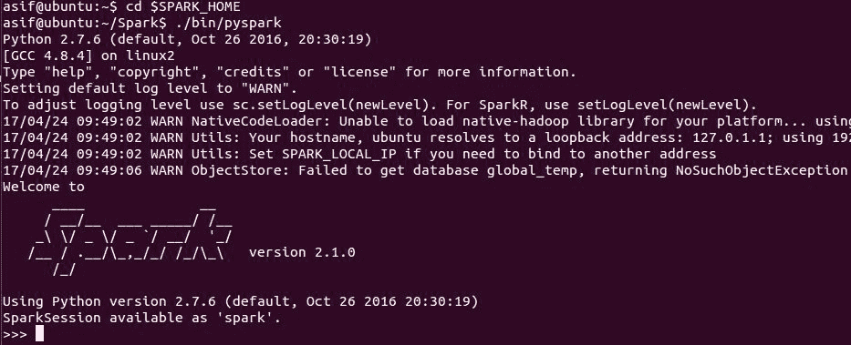**图 1**：使用 PySpark shell 入门

现在您可以使用 Python 交互式 shell 来使用 Spark。这个 shell 可能足够用于实验和开发。但是，对于生产级别，您应该使用独立的应用程序。

PySpark 现在应该在系统路径中可用。编写 Python 代码后，可以简单地使用 Python 命令运行代码，然后它将在本地 Spark 实例中以默认配置运行：

```scala
$ python <python_file.py>

```

请注意，当前版本的 Spark 仅兼容 Python 2.7+。因此，我们将严格遵守这一点。

此外，如果您想在运行时传递配置值，最好使用`spark-submit`脚本。该命令与 Scala 的命令非常相似：

```scala
$ cd $SPARK_HOME
$ ./bin/spark-submit  --master local[*] <python_file.py>

```

配置值可以在运行时传递，或者可以在`conf/spark-defaults.conf`文件中进行更改。在配置 Spark 配置文件之后，运行 PySpark 应用程序时，这些更改也会反映出来，只需使用简单的 Python 命令。

然而，不幸的是，在撰写本文时，使用 PySpark 没有 pip 安装优势。但预计在 Spark 2.2.0 版本中将可用（有关更多信息，请参阅[`issues.apache.org/jira/browse/SPARK-1267`](https://issues.apache.org/jira/browse/SPARK-1267)）。为什么 PySpark 没有 pip 安装的原因可以在 JIRA 票证[`issues.apache.org/jira/browse/SPARK-1267`](https://issues.apache.org/jira/browse/SPARK-1267)中找到。

# 通过在 Python IDEs 上设置 PySpark

我们还可以在 Python IDEs（如 PyCharm）中配置和运行 PySpark。在本节中，我们将展示如何操作。如果您是学生，您可以在[`www.jetbrains.com/student/`](https://www.jetbrains.com/student/)上使用您的大学/学院/研究所电子邮件地址注册后获得 PyCharm 的免费许可副本。此外，PyCharm 还有一个社区（即免费）版本，因此您不需要是学生才能使用它。

最近，PySpark 已经发布了 Spark 2.2.0 PyPI（请参阅[`pypi.python.org/pypi/pyspark`](https://pypi.python.org/pypi/pyspark)）。这是一个漫长的过程（以前的版本包括 pip 可安装的构件，由于各种原因无法发布到 PyPI）。因此，如果您（或您的朋友）希望能够在笔记本电脑上本地使用 PySpark，您可以更容易地开始，只需执行以下命令：

```scala
$ sudo pip install pyspark # for python 2.7 
$ sudo pip3 install pyspark # for python 3.3+

```

然而，如果您使用的是 Windos 7、8 或 10，您应该手动安装 pyspark。例如，使用 PyCharm，您可以按照以下步骤操作：

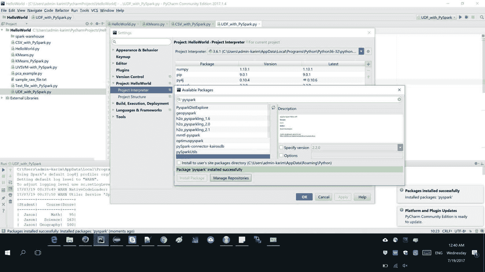**图 2**：在 Windows 10 上的 Pycharm IDE 上安装 PySpark

首先，您应该创建一个带有项目解释器的 Python 脚本，解释器为 Python 2.7+。然后，您可以按照以下方式导入 pyspark 以及其他所需的模块：

```scala
import os
import sys
import pyspark

```

现在，如果您是 Windows 用户，Python 还需要具有 Hadoop 运行时；您应该将`winutils.exe`文件放在`SPARK_HOME/bin`文件夹中。然后按以下方式创建环境变量：

选择您的 python 文件 | 运行 | 编辑配置 | 创建一个环境变量，其键为`HADOOP_HOME`，值为`PYTHON_PATH`，例如对于我的情况，它是`C:\Users\admin-karim\Downloads\spark-2.1.0-bin-hadoop2.7`。最后，按下 OK，然后您就完成了：

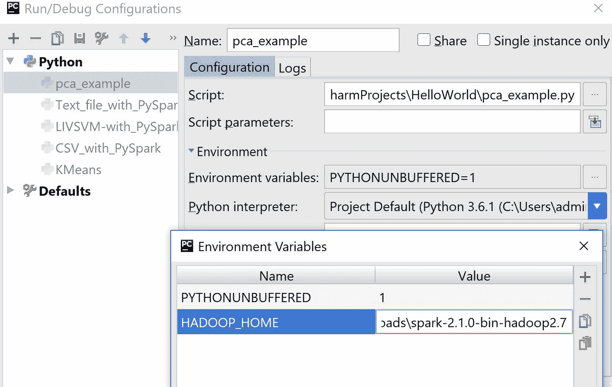**图 3**：在 Windows 10 上的 Pycharm IDE 上设置 Hadoop 运行时环境

这就是您需要的全部。现在，如果您开始编写 Spark 代码，您应该首先将导入放在`try`块中，如下所示（仅供参考）：

```scala
try: 
    from pyspark.ml.featureimport PCA
    from pyspark.ml.linalgimport Vectors
    from pyspark.sqlimport SparkSession
    print ("Successfully imported Spark Modules")

```

`catch`块可以放在以下位置：

```scala
ExceptImportErroras e: 
    print("Can not import Spark Modules", e)
    sys.exit(1)

```

请参考以下图，显示在 PySpark shell 中导入和放置 Spark 包：

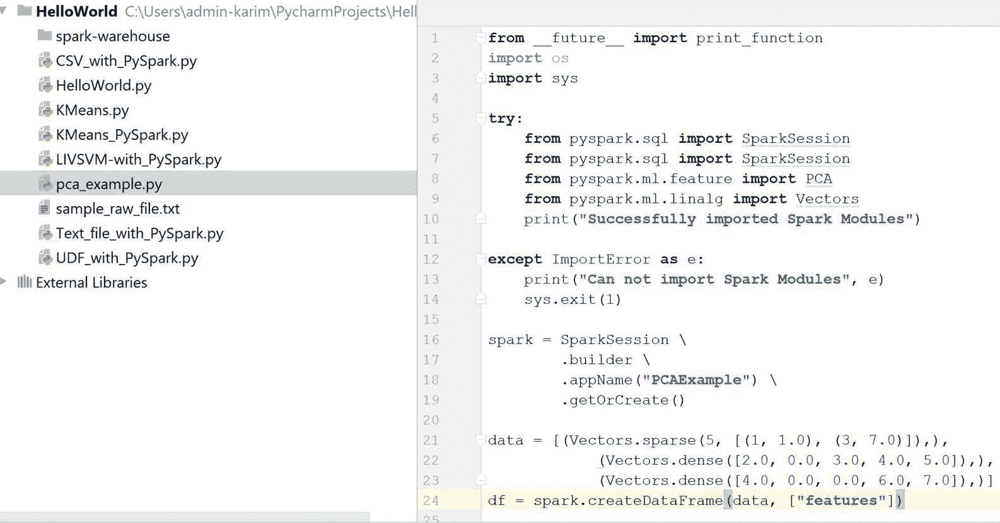**图 4**：在 PySpark shell 中导入和放置 Spark 包

如果这些块成功执行，您应该在控制台上观察到以下消息：

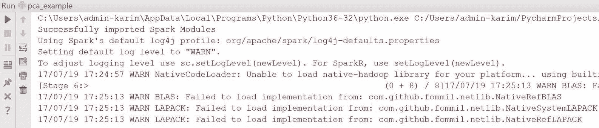**图 5**：PySpark 包已成功导入

# 开始使用 PySpark

在深入之前，首先我们需要看一下如何创建 Spark 会话。可以按照以下步骤完成：

```scala
spark = SparkSession\
         .builder\
         .appName("PCAExample")\
         .getOrCreate()

```

现在在这个代码块下，您应该放置您的代码，例如：

```scala
data = [(Vectors.sparse(5, [(1, 1.0), (3, 7.0)]),),
         (Vectors.dense([2.0, 0.0, 3.0, 4.0, 5.0]),),
         (Vectors.dense([4.0, 0.0, 0.0, 6.0, 7.0]),)]
 df = spark.createDataFrame(data, ["features"])

 pca = PCA(k=3, inputCol="features", outputCol="pcaFeatures")
 model = pca.fit(df)

 result = model.transform(df).select("pcaFeatures")
 result.show(truncate=False)

```

上述代码演示了如何在 RowMatrix 上计算主要成分，并将它们用于将向量投影到低维空间。为了更清晰地了解情况，请参考以下代码，该代码显示了如何在 PySpark 上使用 PCA 算法：

```scala
import os
import sys

try:
from pyspark.sql import SparkSession
from pyspark.ml.feature import PCA
from pyspark.ml.linalg import Vectors
print ("Successfully imported Spark Modules")

except ImportErrorase:
print ("Can not import Spark Modules", e)
 sys.exit(1)

spark = SparkSession\
   .builder\
   .appName("PCAExample")\
   .getOrCreate()

data = [(Vectors.sparse(5, [(1, 1.0), (3, 7.0)]),),
    (Vectors.dense([2.0, 0.0, 3.0, 4.0, 5.0]),),
    (Vectors.dense([4.0, 0.0, 0.0, 6.0, 7.0]),)]
df = spark.createDataFrame(data, ["features"])

pca = PCA(k=3, inputCol="features", outputCol="pcaFeatures")
model = pca.fit(df)

result = model.transform(df).select("pcaFeatures")
result.show(truncate=False)

spark.stop()

```

输出如下：

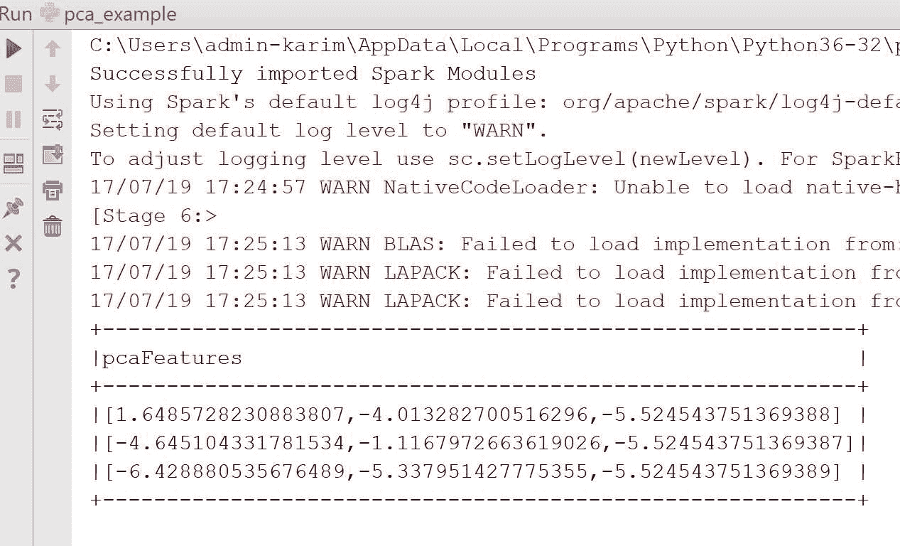**图 6**：Python 脚本成功执行后的 PCA 结果

# 使用 DataFrames 和 RDDs

SparkDataFrame 是具有命名列的分布式行集合。从技术上讲，它可以被视为具有列标题的关系数据库中的表。此外，PySpark DataFrame 类似于 Python pandas。但是，它还与 RDD 共享一些相同的特征：

+   不可变：就像 RDD 一样，一旦创建了 DataFrame，就无法更改。在应用转换后，我们可以将 DataFrame 转换为 RDD，反之亦然。

+   **惰性评估**：其性质是惰性评估。换句话说，任务直到执行操作才会被执行。

+   分布式：RDD 和 DataFrame 都具有分布式特性。

与 Java/Scala 的 DataFrame 一样，PySpark DataFrame 专为处理大量结构化数据而设计；甚至可以处理 PB 级数据。表格结构帮助我们了解 DataFrame 的模式，这也有助于优化 SQL 查询的执行计划。此外，它具有广泛的数据格式和来源。

您可以使用 PySpark 以多种方式创建 RDD、数据集和 DataFrame。在接下来的小节中，我们将展示一些示例。

# 以 Libsvm 格式读取数据集

让我们看看如何使用读取 API 和`load()`方法以指定数据格式（即`libsvm`）来以 LIBSVM 格式读取数据：

```scala
# Creating DataFrame from libsvm dataset
 myDF = spark.read.format("libsvm").load("C:/Exp//mnist.bz2")

```

可以从[`www.csie.ntu.edu.tw/~cjlin/libsvmtools/datasets/multiclass/mnist.bz2`](https://www.csie.ntu.edu.tw/~cjlin/libsvmtools/datasets/multiclass/mnist.bz2)下载前述的 MNIST 数据集。这将返回一个 DataFrame，可以通过调用`show()`方法查看内容如下：

```scala
myDF.show() 

```

输出如下：

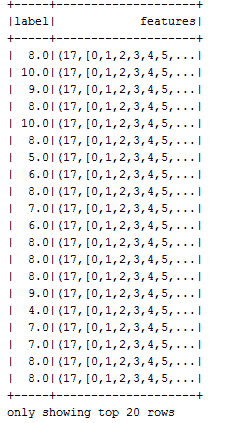**图 7**：LIBSVM 格式手写数据集的快照

您还可以指定其他选项，例如原始数据集中要给 DataFrame 的特征数量如下：

```scala
myDF= spark.read.format("libsvm")
           .option("numFeatures", "780")
           .load("data/Letterdata_libsvm.data")

```

现在，如果您想从相同的数据集创建 RDD，可以使用`pyspark.mllib.util`中的 MLUtils API 如下：

```scala
*Creating RDD from the libsvm data file* myRDD = MLUtils.loadLibSVMFile(spark.sparkContext, "data/Letterdata_libsvm.data")

```

现在，您可以按以下方式将 RDD 保存在首选位置：

```scala
myRDD.saveAsTextFile("data/myRDD")

```

# 读取 CSV 文件

让我们从加载、解析和查看简单的航班数据开始。首先，从[`s3-us-west-2.amazonaws.com/sparkr-data/nycflights13.csv`](https://s3-us-west-2.amazonaws.com/sparkr-data/nycflights13.csv)下载 NYC 航班数据集作为 CSV。现在让我们使用 PySpark 的`read.csv()` API 加载和解析数据集：

```scala
# Creating DataFrame from data file in CSV formatdf = spark.read.format("com.databricks.spark.csv")
          .option("header", "true")
          .load("data/nycflights13.csv")

```

这与读取 libsvm 格式非常相似。现在您可以查看生成的 DataFrame 的结构如下：

```scala
df.printSchema() 

```

输出如下：

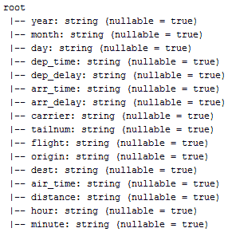**图 8**：NYC 航班数据集的模式

现在让我们使用`show()`方法查看数据集的快照如下：

```scala
df.show() 

```

现在让我们查看数据的样本如下：

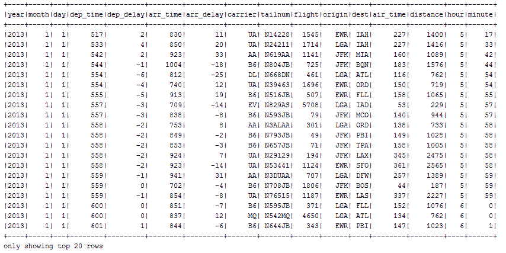**图 9**：NYC 航班数据集的样本

# 读取和操作原始文本文件

您可以使用`textFile()`方法读取原始文本数据文件。假设您有一些购买的日志：

```scala
number\tproduct_name\ttransaction_id\twebsite\tprice\tdate0\tjeans\t30160906182001\tebay.com\t100\t12-02-20161\tcamera\t70151231120504\tamazon.com\t450\t09-08-20172\tlaptop\t90151231120504\tebay.ie\t1500\t07--5-20163\tbook\t80151231120506\tpackt.com\t45\t03-12-20164\tdrone\t8876531120508\talibaba.com\t120\t01-05-2017

```

现在，使用`textFile()`方法读取和创建 RDD 非常简单如下：

```scala
myRDD = spark.sparkContext.textFile("sample_raw_file.txt")
$cd myRDD
$ cat part-00000  
number\tproduct_name\ttransaction_id\twebsite\tprice\tdate  0\tjeans\t30160906182001\tebay.com\t100\t12-02-20161\tcamera\t70151231120504\tamazon.com\t450\t09-08-2017

```

如您所见，结构并不那么可读。因此，我们可以考虑通过将文本转换为 DataFrame 来提供更好的结构。首先，我们需要收集标题信息如下：

```scala
header = myRDD.first() 

```

现在过滤掉标题，并确保其余部分看起来正确如下：

```scala
textRDD = myRDD.filter(lambda line: line != header)
newRDD = textRDD.map(lambda k: k.split("\\t"))

```

我们仍然有 RDD，但数据结构稍微好一些。但是，将其转换为 DataFrame 将提供更好的事务数据视图。

以下代码通过指定`header.split`来创建 DataFrame，提供列的名称：

```scala
 textDF = newRDD.toDF(header.split("\\t"))
 textDF.show()

```

输出如下：

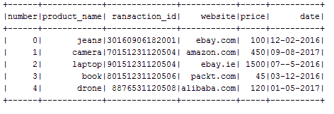**图 10**：事务数据的样本

现在，您可以将此 DataFrame 保存为视图并进行 SQL 查询。现在让我们对此 DataFrame 进行查询：

```scala
textDF.createOrReplaceTempView("transactions")
spark.sql("SELECT *** FROM transactions").show()
spark.sql("SELECT product_name, price FROM transactions WHERE price >=500 ").show()
spark.sql("SELECT product_name, price FROM transactions ORDER BY price DESC").show()

```

输出如下：

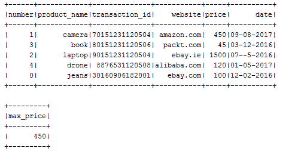**图 11**：使用 Spark SQL 对事务数据进行查询的结果

# 在 PySpark 上编写 UDF

与 Scala 和 Java 一样，您也可以在 PySpark 上使用**用户定义的函数**（也称为**UDF**）。让我们在下面看一个例子。假设我们想要根据一些在大学上课程的学生的分数来查看成绩分布。

我们可以将它们存储在两个单独的数组中，如下所示：

```scala
# Let's generate somerandom lists
 students = ['Jason', 'John', 'Geroge', 'David']
 courses = ['Math', 'Science', 'Geography', 'History', 'IT', 'Statistics']

```

现在让我们声明一个空数组，用于存储有关课程和学生的数据，以便稍后可以将两者都附加到此数组中，如下所示：

```scala
rawData = []
for (student, course) in itertools.product(students, courses):
    rawData.append((student, course, random.randint(0, 200)))

```

请注意，为了使前面的代码工作，请在文件开头导入以下内容：

```scala
import itertools
import random

```

现在让我们从这两个对象创建一个 DataFrame，以便将相应的成绩转换为每个成绩的分数。为此，我们需要定义一个显式模式。假设在您计划的 DataFrame 中，将有三列名为`Student`，`Course`和`Score`。

首先，让我们导入必要的模块：

```scala
from pyspark.sql.types
import StructType, StructField, IntegerType, StringType

```

现在模式可以定义如下：

```scala
schema = StructType([StructField("Student", StringType(), nullable=False),
                     StructField("Course", StringType(), nullable=False),
                     StructField("Score", IntegerType(), nullable=False)])

```

现在让我们从原始数据创建一个 RDD，如下所示：

```scala
courseRDD = spark.sparkContext.parallelize(rawData)

```

现在让我们将 RDD 转换为 DataFrame，如下所示：

```scala
courseDF = spark.createDataFrame(courseRDD, schema) 
coursedDF.show() 

```

输出如下：

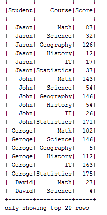**图 12**：随机生成的学科学生分数样本

好了，现在我们有了三列。但是，我们需要将分数转换为等级。假设您有以下分级模式：

+   *90~100=> A*

+   *80~89 => B*

+   *60~79 => C*

+   *0~59 => D*

为此，我们可以创建自己的 UDF，使其将数字分数转换为等级。可以用几种方法来做。以下是一个这样做的例子：

```scala
# Define udfdef scoreToCategory(grade):
 if grade >= 90:
 return 'A'
 elif grade >= 80:
 return 'B'
 elif grade >= 60:
 return 'C'
 else:
 return 'D'

```

现在我们可以有自己的 UDF 如下：

```scala
from pyspark.sql.functions
import udf
udfScoreToCategory = udf(scoreToCategory, StringType())

```

`udf()`方法中的第二个参数是方法的返回类型（即`scoreToCategory`）。现在您可以调用此 UDF 以一种非常直接的方式将分数转换为等级。让我们看一个例子：

```scala
courseDF.withColumn("Grade", udfScoreToCategory("Score")).show(100)

```

前一行将接受分数作为所有条目的输入，并将分数转换为等级。此外，将添加一个名为`Grade`的新 DataFrame 列。

输出如下：

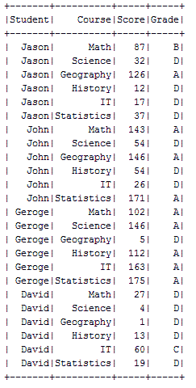**图 13**：分配的成绩

现在我们也可以在 SQL 语句中使用 UDF。但是，为此，我们需要将此 UDF 注册如下：

```scala
spark.udf.register("udfScoreToCategory", scoreToCategory, StringType()) 

```

前一行将默认情况下在数据库中将 UDF 注册为临时函数。现在我们需要创建一个团队视图，以允许执行 SQL 查询：

```scala
courseDF.createOrReplaceTempView("score")

```

现在让我们对视图`score`执行 SQL 查询，如下所示：

```scala
spark.sql("SELECT Student, Score, udfScoreToCategory(Score) as Grade FROM score").show() 

```

输出如下：

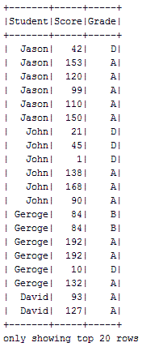**图 14**：关于学生分数和相应成绩的查询

此示例的完整源代码如下：

```scala
import os
import sys
import itertools
import random

from pyspark.sql import SparkSession
from pyspark.sql.types import StructType, StructField, IntegerType, StringType
from pyspark.sql.functions import udf

spark = SparkSession \
        .builder \
        .appName("PCAExample") \
        .getOrCreate()

# Generate Random RDD
students = ['Jason', 'John', 'Geroge', 'David']
courses = ['Math', 'Science', 'Geography', 'History', 'IT', 'Statistics']
rawData = []
for (student, course) in itertools.product(students, courses):
    rawData.append((student, course, random.randint(0, 200)))

# Create Schema Object
schema = StructType([
    StructField("Student", StringType(), nullable=False),
    StructField("Course", StringType(), nullable=False),
    StructField("Score", IntegerType(), nullable=False)
])

courseRDD = spark.sparkContext.parallelize(rawData)
courseDF = spark.createDataFrame(courseRDD, schema)
courseDF.show()

# Define udf
def scoreToCategory(grade):
    if grade >= 90:
        return 'A'
    elif grade >= 80:
        return 'B'
    elif grade >= 60:
        return 'C'
    else:
        return 'D'

udfScoreToCategory = udf(scoreToCategory, StringType())
courseDF.withColumn("Grade", udfScoreToCategory("Score")).show(100)

spark.udf.register("udfScoreToCategory", scoreToCategory, StringType())
courseDF.createOrReplaceTempView("score")
spark.sql("SELECT Student, Score, udfScoreToCategory(Score) as Grade FROM score").show()

spark.stop()

```

关于使用 UDF 的更详细讨论可以在[`jaceklaskowski.gitbooks.io/mastering-apache-spark/content/spark-sql-udfs.html`](https://jaceklaskowski.gitbooks.io/mastering-apache-spark/content/spark-sql-udfs.html)找到。

现在让我们在 PySpark 上进行一些分析任务。在下一节中，我们将展示使用 k-means 算法进行聚类任务的示例。

# 让我们使用 k-means 聚类进行一些分析

异常数据是指与正态分布不同寻常的数据。因此，检测异常是网络安全的重要任务，异常的数据包或请求可能被标记为错误或潜在攻击。

在此示例中，我们将使用 KDD-99 数据集（可以在此处下载：[`kdd.ics.uci.edu/databases/kddcup99/kddcup99.html`](http://kdd.ics.uci.edu/databases/kddcup99/kddcup99.html)）。将根据数据点的某些标准过滤出许多列。这将帮助我们理解示例。其次，对于无监督任务；我们将不得不删除标记的数据。让我们将数据集加载并解析为简单的文本。然后让我们看看数据集中有多少行：

```scala
INPUT = "C:/Users/rezkar/Downloads/kddcup.data" spark = SparkSession\
         .builder\
         .appName("PCAExample")\
         .getOrCreate()

 kddcup_data = spark.sparkContext.textFile(INPUT)

```

这本质上返回一个 RDD。让我们看看数据集中有多少行，使用`count()`方法如下所示：

```scala
count = kddcup_data.count()
print(count)>>4898431

```

所以，数据集非常大，具有许多特征。由于我们已将数据集解析为简单文本，因此不应期望看到数据集的更好结构。因此，让我们朝着将 RDD 转换为 DataFrame 的方向努力：

```scala
kdd = kddcup_data.map(lambda l: l.split(","))
from pyspark.sql import SQLContext
sqlContext = SQLContext(spark)
df = sqlContext.createDataFrame(kdd)

```

然后让我们看一下 DataFrame 中的一些选定列：

```scala
df.select("_1", "_2", "_3", "_4", "_42").show(5)

```

输出如下：

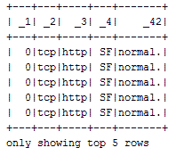**图 15**：KKD 杯 99 数据集样本

因此，这个数据集已经被标记。这意味着恶意网络行为的类型已被分配到标签为最后一列（即`_42`）的行中。DataFrame 的前五行被标记为正常。这意味着这些数据点是正常的。现在是我们需要确定整个数据集中每种标签的计数的时候了：

```scala
#Identifying the labels for unsupervised tasklabels = kddcup_data.map(lambda line: line.strip().split(",")[-1])
from time import time
start_label_count = time()
label_counts = labels.countByValue()
label_count_time = time()-start_label_count

from collections import OrderedDict
sorted_labels = OrderedDict(sorted(label_counts.items(), key=lambda t: t[1], reverse=True))
for label, count in sorted_labels.items():
 print label, count

```

输出如下：

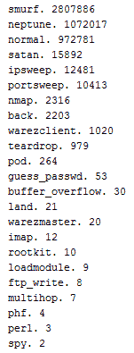**图 16**：KDD 杯数据集中可用的标签（攻击类型）

我们可以看到有 23 个不同的标签（数据对象的行为）。大多数数据点属于 Smurf。这是一种异常行为，也称为 DoS 数据包洪水。Neptune 是第二高的异常行为。*正常*事件是数据集中第三种最常发生的事件类型。然而，在真实的网络数据集中，你不会看到任何这样的标签。

此外，正常流量将远远高于任何异常流量。因此，从大规模未标记的数据中识别异常攻击或异常将是费时的。为简单起见，让我们忽略最后一列（即标签），并认为这个数据集也是未标记的。在这种情况下，唯一可以概念化异常检测的方法是使用无监督学习算法，如 k-means 进行聚类。

现在让我们开始对数据点进行聚类。关于 K-means 的一个重要事项是，它只接受数值值进行建模。然而，我们的数据集还包含一些分类特征。现在我们可以根据它们是否为*TCP*，为分类特征分配二进制值 1 或 0。可以按如下方式完成：

```scala
from numpy import array
def parse_interaction(line):
     line_split = line.split(",")
     clean_line_split = [line_split[0]]+line_split[4:-1]
     return (line_split[-1], array([float(x) for x in clean_line_split]))

 parsed_data = kddcup_data.map(parse_interaction)
 pd_values = parsed_data.values().cache()

```

因此，我们的数据集几乎准备好了。现在我们可以准备我们的训练集和测试集，轻松地训练 k-means 模型：

```scala
 kdd_train = pd_values.sample(False, .75, 12345)
 kdd_test = pd_values.sample(False, .25, 12345)
 print("Training set feature count: " + str(kdd_train.count()))
 print("Test set feature count: " + str(kdd_test.count()))

```

输出如下：

```scala
Training set feature count: 3674823 Test set feature count: 1225499

```

然而，由于我们将一些分类特征转换为数值特征，因此还需要进行一些标准化。标准化可以提高优化过程中的收敛速度，还可以防止具有非常大方差的特征在模型训练过程中产生影响。

现在我们将使用 StandardScaler，这是一个特征转换器。它通过将特征缩放到单位方差来帮助我们标准化特征。然后使用训练集样本中的列汇总统计将均值设置为零：

```scala
standardizer = StandardScaler(True, True) 

```

现在让我们通过拟合前面的转换器来计算汇总统计信息：

```scala
standardizer_model = standardizer.fit(kdd_train) 

```

现在问题是，我们用于训练 k-means 的数据没有正态分布。因此，我们需要对训练集中的每个特征进行标准化，使其具有单位标准差。为实现这一点，我们需要进一步转换前面的标准化模型，如下所示：

```scala
data_for_cluster = standardizer_model.transform(kdd_train) 

```

干得好！现在训练集终于准备好训练 k-means 模型了。正如我们在聚类章节中讨论的那样，聚类算法中最棘手的事情是通过设置 K 的值找到最佳聚类数，使数据对象能够自动聚类。

一个天真的方法是采用蛮力法，设置`K=2`并观察结果，直到获得最佳结果。然而，一个更好的方法是肘部法，我们可以不断增加`K`的值，并计算**集合内平方误差和**（**WSSSE**）作为聚类成本。简而言之，我们将寻找最小化 WSSSE 的最佳`K`值。每当观察到急剧下降时，我们将知道最佳的`K`值：

```scala
import numpy
our_k = numpy.arange(10, 31, 10)
metrics = []
def computeError(point):
 center = clusters.centers[clusters.predict(point)]
 denseCenter = DenseVector(numpy.ndarray.tolist(center))
return sqrt(sum([x**2 for x in (DenseVector(point.toArray()) - denseCenter)]))
for k in our_k:
      clusters = KMeans.train(data_for_cluster, k, maxIterations=4, initializationMode="random")
      WSSSE = data_for_cluster.map(lambda point: computeError(point)).reduce(lambda x, y: x + y)
      results = (k, WSSSE)
 metrics.append(results)
print(metrics)

```

输出如下：

```scala
[(10, 3364364.5203123973), (20, 3047748.5040717563), (30, 2503185.5418753517)]

```

在这种情况下，30 是 k 的最佳值。让我们检查每个数据点的簇分配，当我们有 30 个簇时。下一个测试将是运行`k`值为 30、35 和 40。三个 k 值不是您在单次运行中测试的最多值，但仅用于此示例：

```scala
modelk30 = KMeans.train(data_for_cluster, 30, maxIterations=4, initializationMode="random")
 cluster_membership = data_for_cluster.map(lambda x: modelk30.predict(x))
 cluster_idx = cluster_membership.zipWithIndex()
 cluster_idx.take(20)
 print("Final centers: " + str(modelk30.clusterCenters))

```

输出如下：

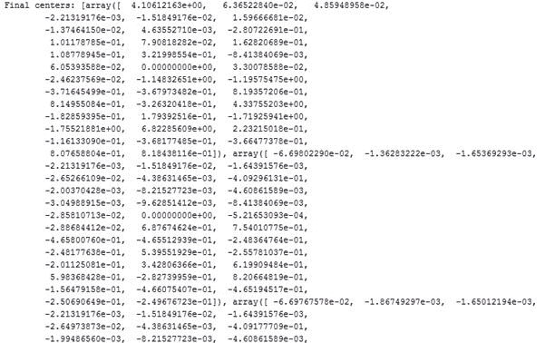**图 17：**每种攻击类型的最终簇中心（摘要）

现在让我们计算并打印整体聚类的总成本如下：

```scala
print("Total Cost: " + str(modelk30.computeCost(data_for_cluster)))

```

输出如下：

```scala
Total Cost: 68313502.459

```

最后，我们的 k 均值模型的 WSSSE 可以计算并打印如下：

```scala
WSSSE = data_for_cluster.map(lambda point: computeError
(point)).reduce(lambda x, y: x + y)
 print("WSSSE: " + str(WSSSE))

```

输出如下：

```scala
WSSSE: 2503185.54188

```

您的结果可能略有不同。这是由于在我们首次开始聚类算法时，质心的随机放置。多次执行可以让您看到数据中的点如何改变其 k 值或保持不变。此解决方案的完整源代码如下所示：

```scala
import os
import sys
import numpy as np
from collections import OrderedDict

try:
    from collections import OrderedDict
    from numpy import array
    from math import sqrt
    import numpy
    import urllib
    import pyspark
    from pyspark.sql import SparkSession
    from pyspark.mllib.feature import StandardScaler
    from pyspark.mllib.clustering import KMeans, KMeansModel
    from pyspark.mllib.linalg import DenseVector
    from pyspark.mllib.linalg import SparseVector
    from collections import OrderedDict
    from time import time
    from pyspark.sql.types import *
    from pyspark.sql import DataFrame
    from pyspark.sql import SQLContext
    from pyspark.sql import Row
    print("Successfully imported Spark Modules")

except ImportError as e:
    print ("Can not import Spark Modules", e)
    sys.exit(1)

spark = SparkSession\
        .builder\
        .appName("PCAExample")\
        .getOrCreate()

INPUT = "C:/Exp/kddcup.data.corrected"
kddcup_data = spark.sparkContext.textFile(INPUT)
count = kddcup_data.count()
print(count)
kddcup_data.take(5)
kdd = kddcup_data.map(lambda l: l.split(","))
sqlContext = SQLContext(spark)
df = sqlContext.createDataFrame(kdd)
df.select("_1", "_2", "_3", "_4", "_42").show(5)

#Identifying the leabels for unsupervised task
labels = kddcup_data.map(lambda line: line.strip().split(",")[-1])
start_label_count = time()
label_counts = labels.countByValue()
label_count_time = time()-start_label_count

sorted_labels = OrderedDict(sorted(label_counts.items(), key=lambda t: t[1], reverse=True))
for label, count in sorted_labels.items():
    print(label, count)

def parse_interaction(line):
    line_split = line.split(",")
    clean_line_split = [line_split[0]]+line_split[4:-1]
    return (line_split[-1], array([float(x) for x in clean_line_split]))

parsed_data = kddcup_data.map(parse_interaction)
pd_values = parsed_data.values().cache()

kdd_train = pd_values.sample(False, .75, 12345)
kdd_test = pd_values.sample(False, .25, 12345)
print("Training set feature count: " + str(kdd_train.count()))
print("Test set feature count: " + str(kdd_test.count()))

standardizer = StandardScaler(True, True)
standardizer_model = standardizer.fit(kdd_train)
data_for_cluster = standardizer_model.transform(kdd_train)

initializationMode="random"

our_k = numpy.arange(10, 31, 10)
metrics = []

def computeError(point):
    center = clusters.centers[clusters.predict(point)]
    denseCenter = DenseVector(numpy.ndarray.tolist(center))
    return sqrt(sum([x**2 for x in (DenseVector(point.toArray()) - denseCenter)]))

for k in our_k:
     clusters = KMeans.train(data_for_cluster, k, maxIterations=4, initializationMode="random")
     WSSSE = data_for_cluster.map(lambda point: computeError(point)).reduce(lambda x, y: x + y)
     results = (k, WSSSE)
     metrics.append(results)
print(metrics)

modelk30 = KMeans.train(data_for_cluster, 30, maxIterations=4, initializationMode="random")
cluster_membership = data_for_cluster.map(lambda x: modelk30.predict(x))
cluster_idx = cluster_membership.zipWithIndex()
cluster_idx.take(20)
print("Final centers: " + str(modelk30.clusterCenters))
print("Total Cost: " + str(modelk30.computeCost(data_for_cluster)))
WSSSE = data_for_cluster.map(lambda point: computeError(point)).reduce(lambda x, y: x + y)
print("WSSSE" + str(WSSSE))

```

有关此主题的更全面讨论，请参阅[`github.com/jadianes/kdd-cup-99-spark`](https://github.com/jadianes/kdd-cup-99-spark)。此外，感兴趣的读者可以参考 PySpark API 的主要和最新文档，网址为[`spark.apache.org/docs/latest/api/python/`](http://spark.apache.org/docs/latest/api/python/)。

现在是时候转向 SparkR，这是另一个与名为 R 的流行统计编程语言一起使用的 Spark API。

# SparkR 简介

R 是最流行的统计编程语言之一，具有许多令人兴奋的功能，支持统计计算、数据处理和机器学习任务。然而，在 R 中处理大规模数据集通常很繁琐，因为运行时是单线程的。因此，只有适合机器内存的数据集才能被处理。考虑到这一限制，并为了充分体验 R 中 Spark 的功能，SparkR 最初在 AMPLab 开发，作为 R 到 Apache Spark 的轻量级前端，并使用 Spark 的分布式计算引擎。

这样可以使 R 程序员从 RStudio 使用 Spark 进行大规模数据分析。在 Spark 2.1.0 中，SparkR 提供了一个支持选择、过滤和聚合等操作的分布式数据框实现。这与 R 数据框（如`dplyr`）有些类似，但可以扩展到大规模数据集。

# 为什么选择 SparkR？

您也可以使用 SparkR 编写支持 MLlib 的分布式机器学习的 Spark 代码。总之，SparkR 从与 Spark 紧密集成中继承了许多好处，包括以下内容：

+   **支持各种数据源 API**：SparkR 可以用于从各种来源读取数据，包括 Hive 表、JSON 文件、关系型数据库和 Parquet 文件。

+   数据框优化：SparkR 数据框也继承了计算引擎的所有优化，包括代码生成、内存管理等。从下图可以观察到，Spark 的优化引擎使得 SparkR 能够与 Scala 和 Python 竞争力十足：

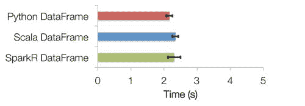**图 18：**SparkR 数据框与 Scala/Python 数据框

+   **可扩展性：**在 SparkR 数据框上执行的操作会自动分布到 Spark 集群上所有可用的核心和机器上。因此，SparkR 数据框可以用于大量数据，并在具有数千台机器的集群上运行。

# 安装和入门

使用 SparkR 的最佳方式是从 RStudio 开始。您可以使用 R shell、Rescript 或其他 R IDE 将您的 R 程序连接到 Spark 集群。

**选项 1.** 在环境中设置`SPARK_HOME`（您可以查看[`stat.ethz.ch/R-manual/R-devel/library/base/html/Sys.getenv.html`](https://stat.ethz.ch/R-manual/R-devel/library/base/html/Sys.getenv.html)），加载 SparkR 包，并调用`sparkR.session`如下。它将检查 Spark 安装，如果找不到，将自动下载和缓存：

```scala
if (nchar(Sys.getenv("SPARK_HOME")) < 1) { 
Sys.setenv(SPARK_HOME = "/home/spark") 
} 
library(SparkR, lib.loc = c(file.path(Sys.getenv("SPARK_HOME"), "R", "lib"))) 

```

**选项 2.** 您还可以在 RStudio 上手动配置 SparkR。为此，请在 R 脚本中执行以下 R 代码行：

```scala
SPARK_HOME = "spark-2.1.0-bin-hadoop2.7/R/lib" 
HADOOP_HOME= "spark-2.1.0-bin-hadoop2.7/bin" 
Sys.setenv(SPARK_MEM = "2g") 
Sys.setenv(SPARK_HOME = "spark-2.1.0-bin-hadoop2.7") 
.libPaths(c(file.path(Sys.getenv("SPARK_HOME"), "R", "lib"), .libPaths())) 

```

现在加载 SparkR 库如下：

```scala
library(SparkR, lib.loc = SPARK_HOME)

```

现在，就像 Scala/Java/PySpark 一样，您的 SparkR 程序的入口点是通过调用`sparkR.session`创建的 SparkR 会话，如下所示：

```scala
sparkR.session(appName = "Hello, Spark!", master = "local[*]")

```

此外，如果您愿意，还可以指定特定的 Spark 驱动程序属性。通常，这些应用程序属性和运行时环境无法以编程方式设置，因为驱动程序 JVM 进程已经启动；在这种情况下，SparkR 会为您处理这些设置。要设置它们，将它们传递给`sparkR.session()`的`sparkConfig`参数，如下所示：

```scala
sparkR.session(master = "local[*]", sparkConfig = list(spark.driver.memory = "2g")) 

```

此外，以下 Spark 驱动程序属性可以在 RStudio 中使用`sparkConfig`和`sparkR.session`进行设置：

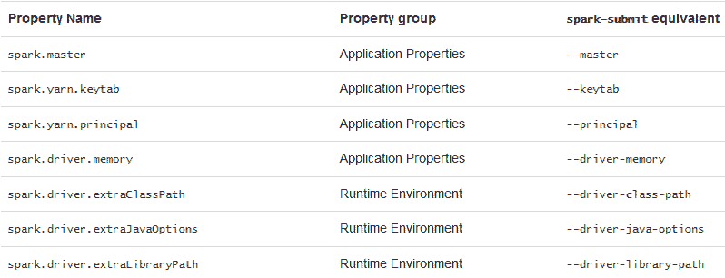**图 19**：可以在 RStudio 中使用`sparkConfig`和`sparkR.session`设置 Spark 驱动程序属性

# 入门

让我们从加载、解析和查看简单的航班数据开始。首先，从[`s3-us-west-2.amazonaws.com/sparkr-data/nycflights13.csv`](https://s3-us-west-2.amazonaws.com/sparkr-data/nycflights13.csv)下载 NY 航班数据集作为 CSV。现在让我们使用 R 的`read.csv()` API 加载和解析数据集：

```scala
#Creating R data frame
dataPath<- "C:/Exp/nycflights13.csv"
df<- read.csv(file = dataPath, header = T, sep =",")

```

现在让我们使用 R 的`View()`方法查看数据集的结构如下：

```scala
View(df)

```

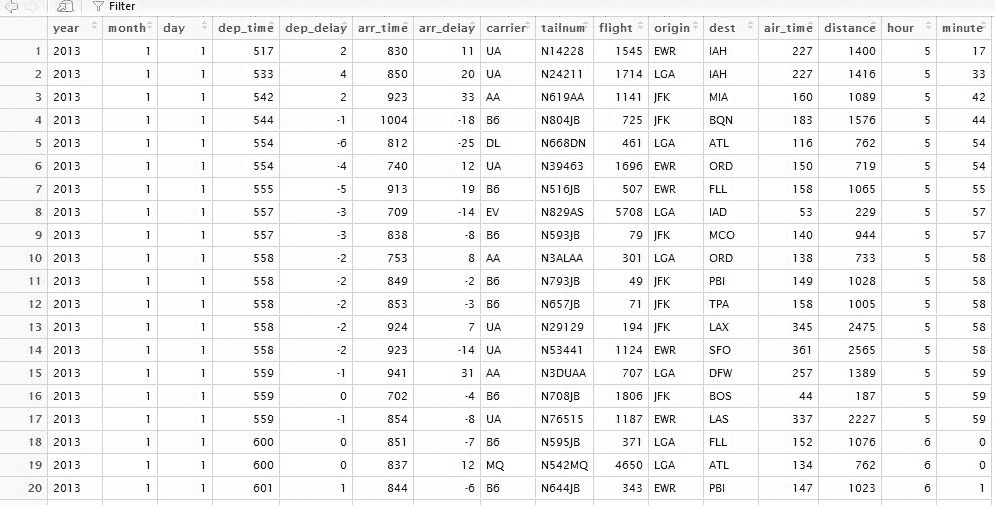**图 20**：NYC 航班数据集的快照

现在让我们从 R DataFrame 创建 Spark DataFrame 如下：

```scala
##Converting Spark DataFrame 
 flightDF<- as.DataFrame(df)

```

让我们通过探索 DataFrame 的模式来查看结构：

```scala
printSchema(flightDF)

```

输出如下：

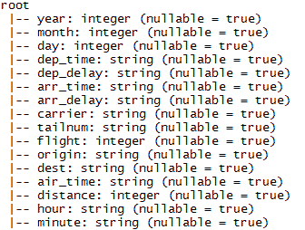**图 21**：NYC 航班数据集的模式

现在让我们看 DataFrame 的前 10 行：

```scala
showDF(flightDF, numRows = 10)

```

输出如下：

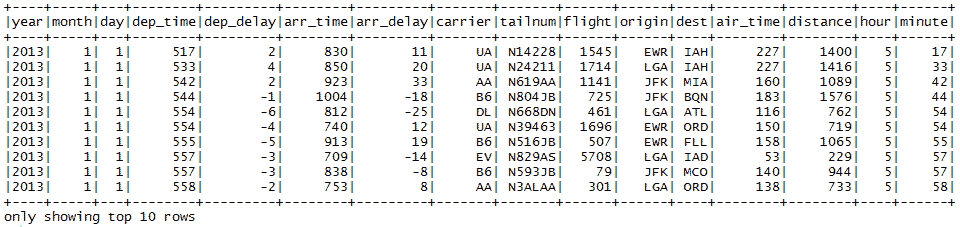**图 22**：NYC 航班数据集的前 10 行

因此，您可以看到相同的结构。但是，这不可扩展，因为我们使用标准 R API 加载了 CSV 文件。为了使其更快速和可扩展，就像在 Scala 中一样，我们可以使用外部数据源 API。

# 使用外部数据源 API

如前所述，我们也可以使用外部数据源 API 来创建 DataFrame。在以下示例中，我们使用`com.databricks.spark.csv` API 如下：

```scala
flightDF<- read.df(dataPath,  
header='true',  
source = "com.databricks.spark.csv",  
inferSchema='true') 

```

让我们通过探索 DataFrame 的模式来查看结构：

```scala
printSchema(flightDF)

```

输出如下：

**图 23**：使用外部数据源 API 查看 NYC 航班数据集的相同模式

现在让我们看看 DataFrame 的前 10 行：

```scala
showDF(flightDF, numRows = 10)

```

输出如下：

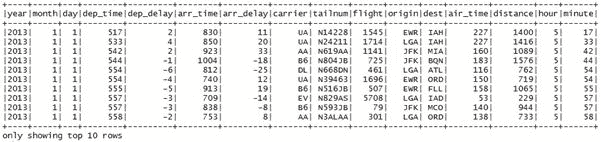**图 24**：使用外部数据源 API 的 NYC 航班数据集的相同样本数据

因此，您可以看到相同的结构。干得好！现在是时候探索更多内容了，比如使用 SparkR 进行数据操作。

# 数据操作

显示 SparkDataFrame 中的列名如下：

```scala
columns(flightDF)
[1] "year" "month" "day" "dep_time" "dep_delay" "arr_time" "arr_delay" "carrier" "tailnum" "flight" "origin" "dest" 
[13] "air_time" "distance" "hour" "minute" 

```

显示 SparkDataFrame 中的行数如下：

```scala
count(flightDF)
[1] 336776

```

过滤目的地仅为迈阿密的航班数据，并显示前六个条目如下：

```scala
 showDF(flightDF[flightDF$dest == "MIA", ], numRows = 10)

```

输出如下：

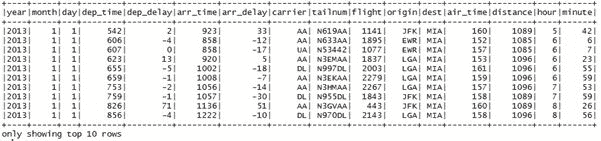**图 25**：目的地仅为迈阿密的航班

选择特定列。例如，让我们选择所有前往爱荷华州的延误航班。还包括起飞机场名称：

```scala
delay_destination_DF<- select(flightDF, "flight", "dep_delay", "origin", "dest") 
 delay_IAH_DF<- filter(delay_destination_DF, delay_destination_DF$dest == "IAH") showDF(delay_IAH_DF, numRows = 10)

```

输出如下：

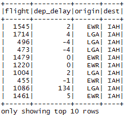**图 26**：所有前往爱荷华州的延误航班

我们甚至可以使用它来链接数据框操作。举个例子，首先按日期分组航班，然后找到平均每日延误。最后，将结果写入 SparkDataFrame 如下：

```scala
install.packages(c("magrittr")) 
library(magrittr) 
groupBy(flightDF, flightDF$day) %>% summarize(avg(flightDF$dep_delay), avg(flightDF$arr_delay)) ->dailyDelayDF 

```

现在打印计算出的 DataFrame：

```scala
head(dailyDelayDF)

```

输出如下：

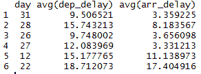**图 27**：按日期分组航班，然后找到平均每日延误

让我们看另一个示例，对整个目的地机场的平均到达延误进行聚合：

```scala
avg_arr_delay<- collect(select(flightDF, avg(flightDF$arr_delay))) 
 head(avg_arr_delay)
avg(arr_delay)
 1 6.895377

```

还可以执行更复杂的聚合。例如，以下代码对每个目的地机场的平均、最大和最小延误进行了聚合。它还显示了降落在这些机场的航班数量：

```scala
flight_avg_arrival_delay_by_destination<- collect(agg( 
 groupBy(flightDF, "dest"), 
 NUM_FLIGHTS=n(flightDF$dest), 
 AVG_DELAY = avg(flightDF$arr_delay), 
 MAX_DELAY=max(flightDF$arr_delay), 
 MIN_DELAY=min(flightDF$arr_delay) 
 ))
head(flight_avg_arrival_delay_by_destination)

```

输出如下：

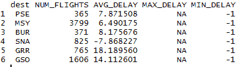**图 28**：每个目的地机场的最大和最小延误

# 查询 SparkR DataFrame

与 Scala 类似，一旦将 DataFrame 保存为`TempView`，我们就可以对其执行 SQL 查询，使用`createOrReplaceTempView()`方法。让我们看一个例子。首先，让我们保存航班 DataFrame（即`flightDF`）如下：

```scala
# First, register the flights SparkDataFrame as a table
createOrReplaceTempView(flightDF, "flight")

```

现在让我们选择所有航班的目的地和目的地的承运人信息如下：

```scala
destDF<- sql("SELECT dest, origin, carrier FROM flight") 
 showDF(destDF, numRows=10)

```

输出如下：

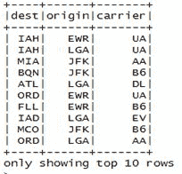**图 29**：所有航班的目的地和承运人信息

现在让我们使 SQL 复杂一些，比如找到所有至少延误 120 分钟的航班的目的地机场如下：

```scala
selected_flight_SQL<- sql("SELECT dest, origin, arr_delay FROM flight WHERE arr_delay>= 120")
showDF(selected_flight_SQL, numRows = 10)

```

前面的代码段查询并显示了所有至少延误 2 小时的航班的机场名称：

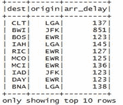**图 30**：所有至少延误 2 小时的航班的目的地机场

现在让我们进行更复杂的查询。让我们找到所有飞往爱荷华的航班的起点，至少延误 2 小时。最后，按到达延误排序，并将计数限制为 20 如下：

```scala
selected_flight_SQL_complex<- sql("SELECT origin, dest, arr_delay FROM flight WHERE dest='IAH' AND arr_delay>= 120 ORDER BY arr_delay DESC LIMIT 20")
showDF(selected_flight_SQL_complex, numRows=20)

```

前面的代码段查询并显示了所有至少延误 2 小时到爱荷华的航班的机场名称：

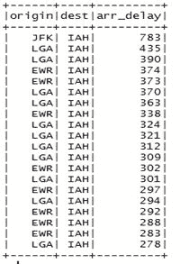**图 31**：所有航班的起点都至少延误 2 小时，目的地是爱荷华

# 在 RStudio 上可视化您的数据

在前一节中，我们已经看到了如何加载、解析、操作和查询 DataFrame。现在如果我们能够展示数据以便更好地看到就更好了。例如，对航空公司可以做些什么？我的意思是，是否可能从图表中找到最频繁的航空公司？让我们试试`ggplot2`。首先，加载相同的库：

```scala
library(ggplot2) 

```

现在我们已经有了 SparkDataFrame。如果我们直接尝试在`ggplot2`中使用我们的 SparkSQL DataFrame 类会怎么样？

```scala
my_plot<- ggplot(data=flightDF, aes(x=factor(carrier)))
>>
ERROR: ggplot2 doesn't know how to deal with data of class SparkDataFrame.

```

显然，这样是行不通的，因为`ggplot2`函数不知道如何处理这些类型的分布式数据框架（Spark 的数据框架）。相反，我们需要在本地收集数据并将其转换回传统的 R 数据框架如下：

```scala
flight_local_df<- collect(select(flightDF,"carrier"))

```

现在让我们使用`str()`方法查看我们得到了什么：

```scala
str(flight_local_df)

```

输出如下：

```scala
'data.frame':  336776 obs. of 1 variable: $ carrier: chr "UA" "UA" "AA" "B6" ...

```

这很好，因为当我们从 SparkSQL DataFrame 中收集结果时，我们得到一个常规的 R `data.frame`。这也非常方便，因为我们可以根据需要对其进行操作。现在我们准备创建`ggplot2`对象如下：

```scala
my_plot<- ggplot(data=flight_local_df, aes(x=factor(carrier)))

```

最后，让我们给图表一个适当的表示，作为条形图如下：

```scala
my_plot + geom_bar() + xlab("Carrier")

```

输出如下：

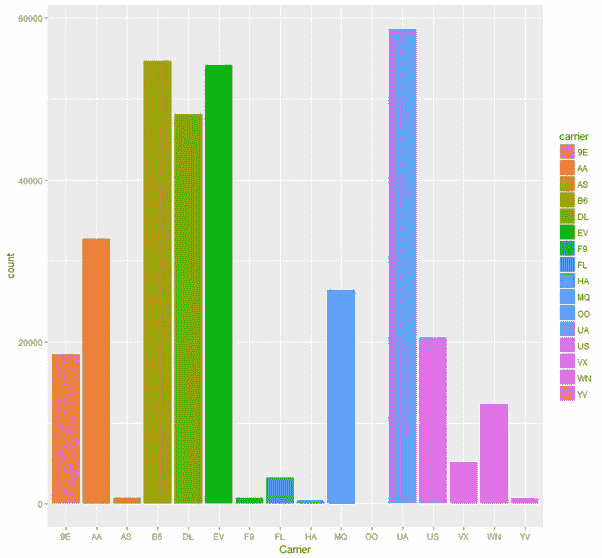**图 32**：最频繁的航空公司是 UA、B6、EV 和 DL

从图表中可以清楚地看出，最频繁的航空公司是 UA、B6、EV 和 DL。这在 R 中的以下代码行中更清晰：

```scala
carrierDF = sql("SELECT carrier, COUNT(*) as cnt FROM flight GROUP BY carrier ORDER BY cnt DESC")
showDF(carrierDF)

```

输出如下：

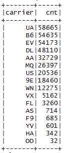**图 33**：最频繁的航空公司是 UA、B6、EV 和 DL

前面分析的完整源代码如下，以了解代码的流程：

```scala
#Configure SparkR
SPARK_HOME = "C:/Users/rezkar/Downloads/spark-2.1.0-bin-hadoop2.7/R/lib"
HADOOP_HOME= "C:/Users/rezkar/Downloads/spark-2.1.0-bin-hadoop2.7/bin"
Sys.setenv(SPARK_MEM = "2g")
Sys.setenv(SPARK_HOME = "C:/Users/rezkar/Downloads/spark-2.1.0-bin-hadoop2.7")
.libPaths(c(file.path(Sys.getenv("SPARK_HOME"), "R", "lib"), .libPaths()))

#Load SparkR
library(SparkR, lib.loc = SPARK_HOME)

# Initialize SparkSession
sparkR.session(appName = "Example", master = "local[*]", sparkConfig = list(spark.driver.memory = "8g"))
# Point the data file path:
dataPath<- "C:/Exp/nycflights13.csv"

#Creating DataFrame using external data source API
flightDF<- read.df(dataPath,
header='true',
source = "com.databricks.spark.csv",
inferSchema='true')
printSchema(flightDF)
showDF(flightDF, numRows = 10)
# Using SQL to select columns of data

# First, register the flights SparkDataFrame as a table
createOrReplaceTempView(flightDF, "flight")
destDF<- sql("SELECT dest, origin, carrier FROM flight")
showDF(destDF, numRows=10)

#And then we can use SparkR sql function using condition as follows:
selected_flight_SQL<- sql("SELECT dest, origin, arr_delay FROM flight WHERE arr_delay>= 120")
showDF(selected_flight_SQL, numRows = 10)

#Bit complex query: Let's find the origins of all the flights that are at least 2 hours delayed where the destiantionn is Iowa. Finally, sort them by arrival delay and limit the count upto 20 and the destinations
selected_flight_SQL_complex<- sql("SELECT origin, dest, arr_delay FROM flight WHERE dest='IAH' AND arr_delay>= 120 ORDER BY arr_delay DESC LIMIT 20")
showDF(selected_flight_SQL_complex)

# Stop the SparkSession now
sparkR.session.stop()

```

# 摘要

在本章中，我们展示了如何在 Python 和 R 中编写您的 Spark 代码的一些示例。这些是数据科学家社区中最流行的编程语言。

我们讨论了使用 PySpark 和 SparkR 进行大数据分析的动机，几乎与 Java 和 Scala 同样简单。我们讨论了如何在流行的 IDE（如 PyCharm 和 RStudio）上安装这些 API。我们还展示了如何从这些 IDE 中使用 DataFrames 和 RDDs。此外，我们还讨论了如何从 PySpark 和 SparkR 中执行 Spark SQL 查询。然后，我们还讨论了如何对数据集进行可视化分析。最后，我们看到了如何使用 UDFs 来进行 PySpark 的示例。

因此，我们讨论了两个 Spark 的 API：PySpark 和 SparkR 的几个方面。还有更多内容可以探索。感兴趣的读者应该参考它们的网站获取更多信息。

+   PySpark: [`spark.apache.org/docs/latest/api/python/`](http://spark.apache.org/docs/latest/api/python/)

+   SparkR: [`spark.apache.org/docs/latest/sparkr.html`](https://spark.apache.org/docs/latest/sparkr.html)
