# 第二十章：使用 Alluxio 加速 Spark

“显而易见，我们的技术已经超出了我们的人性。”

- 阿尔伯特·爱因斯坦

在这里，您将学习如何使用 Alluxio 与 Spark 加速处理速度。Alluxio 是一个开源的分布式内存存储系统，可用于加速跨平台的许多应用程序的速度，包括 Apache Spark。

简而言之，本章将涵盖以下主题：

+   对 Alluxio 的需求

+   开始使用 Alluxio

+   与 YARN 集成

+   在 Spark 中使用 Alluxio

# 对 Alluxio 的需求

我们已经了解了 Apache Spark 以及围绕 Spark 核心、流式处理、GraphX、Spark SQL 和 Spark 机器学习的各种功能。我们还看了许多围绕数据操作和处理的用例和操作。任何处理任务中的关键步骤是数据输入、数据处理和数据输出。

这里显示了一个 Spark 作业的示例：


如图所示，作业的输入和输出通常依赖于基于磁盘的较慢存储选项，而处理通常是使用内存/RAM 完成的。由于内存比磁盘访问快 100 倍，如果我们可以减少磁盘使用并更多地使用内存，作业的性能显然可以显著提高。在任何作业中，不需要甚至不可能完全不使用任何磁盘；相反，我们只是打算尽可能多地使用内存。

首先，我们可以尝试尽可能多地在内存中缓存数据，以加速使用执行器进行处理。虽然这对某些作业可能有效，但对于在运行 Spark 的分布式集群中运行的大型作业来说，不可能拥有如此多的 GB 或 TB 内存。此外，即使您的使用环境中有一个大型集群，也会有许多用户，因此很难为所有作业使用如此多的资源。

我们知道分布式存储系统，如 HDFS、S3 和 NFS。同样，如果我们有一个分布式内存系统，我们可以将其用作所有作业的存储系统，以减少作业或管道中的中间作业所需的 I/O。Alluxio 正是通过实现分布式内存文件系统来提供这一点，Spark 可以使用它来满足所有输入/输出需求。

# 开始使用 Alluxio

Alluxio，以前称为 Tachyon，统一了数据访问并桥接了计算框架和底层存储系统。Alluxio 的内存为中心的架构使得数据访问比现有解决方案快几个数量级。Alluxio 也与 Hadoop 兼容，因此可以无缝集成到现有基础设施中。现有的数据分析应用程序，如 Spark 和 MapReduce 程序，可以在 Alluxio 之上运行，而无需进行任何代码更改，这意味着过渡时间微不足道，而性能更好：

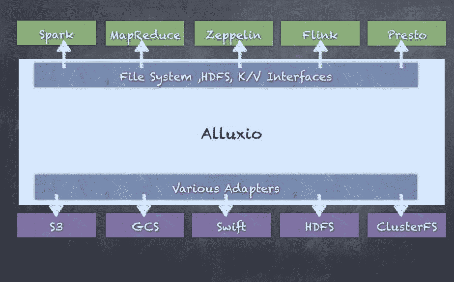

# 下载 Alluxio

您可以通过在[`www.alluxio.org/download`](http://www.alluxio.org/download)网站上注册您的姓名和电子邮件地址来下载 Alluxio：

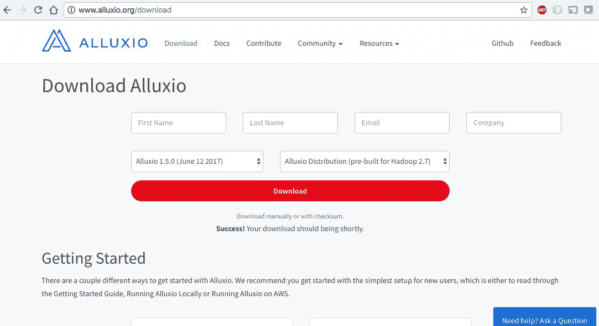

或者，您也可以直接转到[`downloads.alluxio.org/downloads/files`](http://downloads.alluxio.org/downloads/files)并下载最新版本：

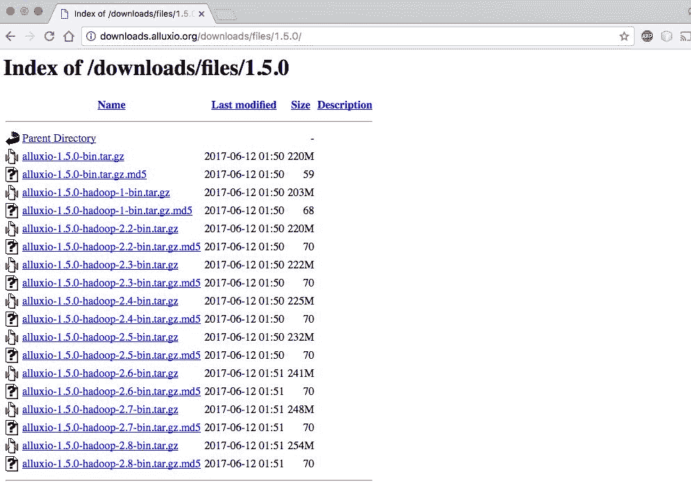

# 安装和在本地运行 Alluxio

我们将在本地安装和运行 1.5.0。您可以使用任何其他版本进行相同操作。如果您下载了版本 1.5.0，您将看到一个名为`alluxio-1.5.0-hadoop2.7-bin.tar.gz`的文件。

使用 Alluxio 的先决条件是已安装 JDK 7 或更高版本。

解压下载的`alluxio-1.5.0-hadoop2.7-bin.tar.gz`文件：

```scala
tar -xvzf alluxio-1.5.0-hadoop2.7-bin.tar.gz
cd alluxio-1.5.0-hadoop-2.7

```

此外，如果在本地运行，Alluxio 将需要一个环境变量才能正确绑定到主机，因此运行以下命令：

```scala
export ALLUXIO_MASTER_HOSTNAME=localhost

```

使用`/bin/alluxio`命令格式化 Alluxio 文件系统。

只有在首次运行 Alluxio 时才需要此步骤，运行时，Alluxio 文件系统中以前存储的所有数据和元数据将被删除。

运行`/bin/alluxio`格式命令来格式化文件系统：

```scala
falcon:alluxio-1.5.0-hadoop-2.7 salla$ ./bin/alluxio format
Waiting for tasks to finish...
All tasks finished, please analyze the log at /Users/salla/alluxio-1.5.0-hadoop-2.7/bin/../logs/task.log.
Formatting Alluxio Master @ falcon

```

在本地启动 Alluxio 文件系统：

```scala
falcon:alluxio-1.5.0-hadoop-2.7 salla$ ./bin/alluxio-start.sh local
Waiting for tasks to finish...
All tasks finished, please analyze the log at /Users/salla/alluxio-1.5.0-hadoop-2.7/bin/../logs/task.log.
Waiting for tasks to finish...
All tasks finished, please analyze the log at /Users/salla/alluxio-1.5.0-hadoop-2.7/bin/../logs/task.log.
Killed 0 processes on falcon
Killed 0 processes on falcon
Starting master @ falcon. Logging to /Users/salla/alluxio-1.5.0-hadoop-2.7/logs
Formatting RamFS: ramdisk 2142792 sectors (1gb).
Started erase on disk2
Unmounting disk
Erasing
Initialized /dev/rdisk2 as a 1 GB case-insensitive HFS Plus volume
Mounting disk
Finished erase on disk2 ramdisk
Starting worker @ falcon. Logging to /Users/salla/alluxio-1.5.0-hadoop-2.7/logs
Starting proxy @ falcon. Logging to /Users/salla/alluxio-1.5.0-hadoop-2.7/logs

```

您可以使用类似的语法停止 Alluxio。

您可以通过在本地运行`./bin/alluxio-stop.sh`来停止 Alluxio。

通过使用`runTests`参数运行 Alluxio 脚本来验证 Alluxio 是否正在运行：

```scala
falcon:alluxio-1.5.0-hadoop-2.7 salla$ ./bin/alluxio runTests
2017-06-11 10:31:13,997 INFO type (MetricsSystem.java:startSinksFromConfig) - Starting sinks with config: {}.
2017-06-11 10:31:14,256 INFO type (AbstractClient.java:connect) - Alluxio client (version 1.5.0) is trying to connect with FileSystemMasterClient master @ localhost/127.0.0.1:19998
2017-06-11 10:31:14,280 INFO type (AbstractClient.java:connect) - Client registered with FileSystemMasterClient master @ localhost/127.0.0.1:19998
runTest Basic CACHE_PROMOTE MUST_CACHE
2017-06-11 10:31:14,585 INFO type (AbstractClient.java:connect) - Alluxio client (version 1.5.0) is trying to connect with BlockMasterClient master @ localhost/127.0.0.1:19998
2017-06-11 10:31:14,587 INFO type (AbstractClient.java:connect) - Client registered with BlockMasterClient master @ localhost/127.0.0.1:19998
2017-06-11 10:31:14,633 INFO type (ThriftClientPool.java:createNewResource) - Created a new thrift client alluxio.thrift.BlockWorkerClientService$Client@36b4cef0
2017-06-11 10:31:14,651 INFO type (ThriftClientPool.java:createNewResource) - Created a new thrift client alluxio.thrift.BlockWorkerClientService$Client@4eb7f003
2017-06-11 10:31:14,779 INFO type (BasicOperations.java:writeFile) - writeFile to file /default_tests_files/Basic_CACHE_PROMOTE_MUST_CACHE took 411 ms.
2017-06-11 10:31:14,852 INFO type (BasicOperations.java:readFile) - readFile file /default_tests_files/Basic_CACHE_PROMOTE_MUST_CACHE took 73 ms.
Passed the test!

```

有关其他选项和详细信息，请参阅[`www.alluxio.org/docs/master/en/Running-Alluxio-Locally.html`](http://www.alluxio.org/docs/master/en/Running-Alluxio-Locally.html)。

您还可以使用 Web UI 来查看 Alluxio 进程，方法是打开浏览器并输入`http://localhost:19999/`。

# 概述

概述选项卡显示摘要信息，例如主地址、运行的工作节点、版本和集群的正常运行时间。还显示了集群使用摘要，显示了工作节点的容量和文件系统 UnderFS 容量。然后，还可以看到存储使用摘要，显示了空间容量和已使用空间：

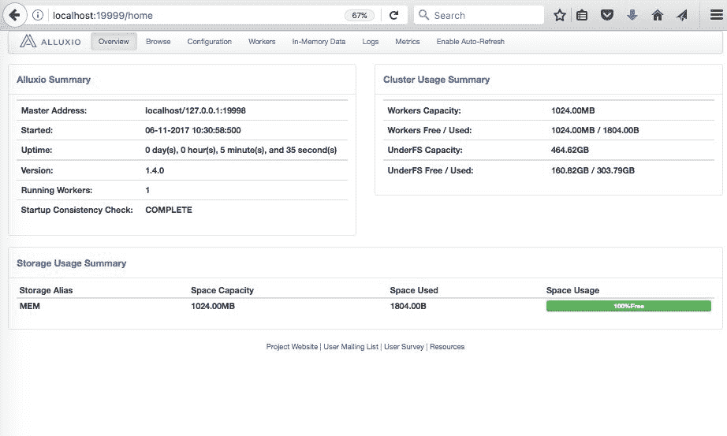

# 浏览

浏览选项卡允许您查看内存文件系统的当前内容。此选项卡显示文件系统中的内容，文件的名称、大小和块大小，我们是否将数据加载到内存中，以及文件的 ACL 和权限，指定谁可以访问它并执行读写等操作。您将在浏览选项卡中看到 Alluxio 中管理的所有文件：

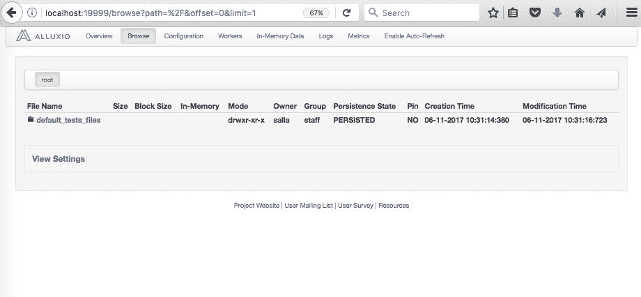

# 配置

配置选项卡显示使用的所有配置参数。一些最重要的参数是使用的配置目录、主节点和工作节点的 CPU 资源和内存资源分配。还可以看到文件系统名称、路径、JDK 设置等。所有这些都可以被覆盖以定制 Alluxio 以适应您的用例。这里的任何更改也将需要重新启动集群。

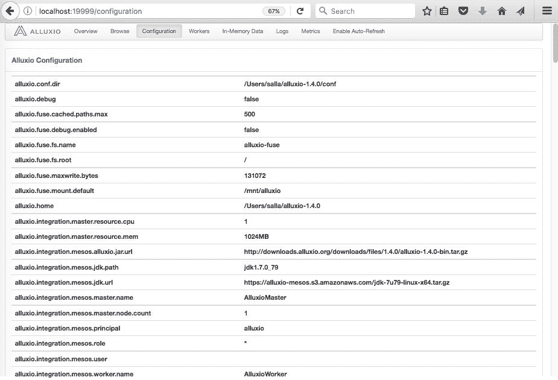

# 工作者

Workers 选项卡只是显示 Alluxio 集群中的工作节点。在我们的本地设置中，这只会显示本地机器，但在典型的许多工作节点的集群中，您将看到所有工作节点以及节点的状态，工作节点的容量，已使用的空间和最后接收到的心跳，这显示了工作节点是否存活并参与集群操作：

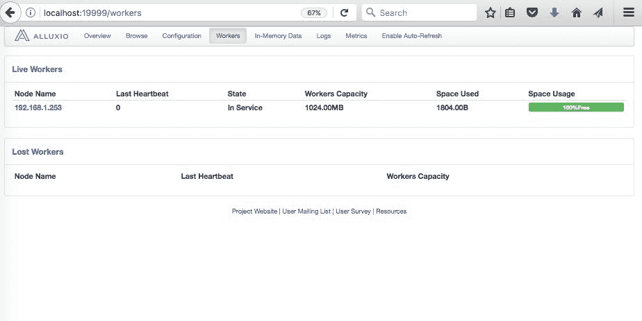

# 内存数据

内存数据选项卡显示 Alluxio 文件系统内存中的当前数据。这显示了集群内存中的内容。内存中每个数据集显示的典型信息包括权限、所有权、创建和修改时间：

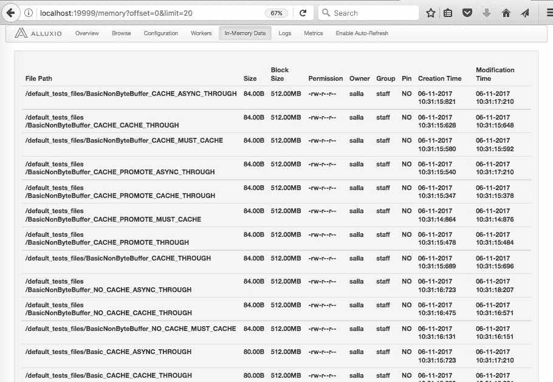

# 日志

日志选项卡允许您查看各种日志文件，用于调试和监视目的。您将看到名为`master.log`的主节点的日志文件，名为`worker.log`的工作节点的日志文件，`task.log`，`proxy.log`以及用户日志。每个日志文件都会独立增长，并且在诊断问题或仅监视集群的健康状况方面非常有用：

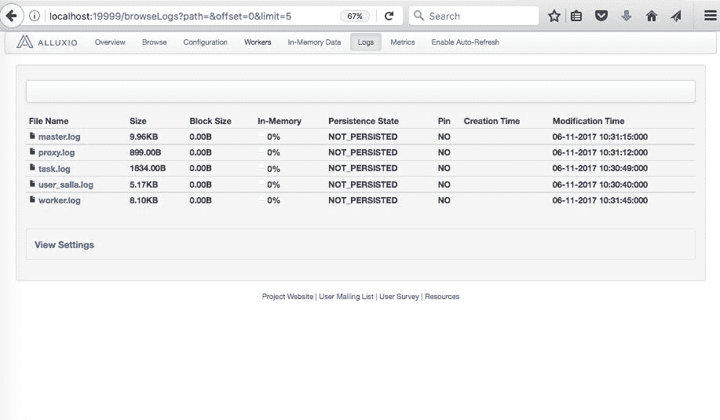

# 指标

指标选项卡显示有用的指标，用于监视 Alluxio 文件系统的当前状态。这里的主要信息包括主节点和文件系统容量。还显示了各种操作的计数器，例如文件创建和删除的逻辑操作，以及目录创建和删除。另一部分显示了 RPC 调用，您可以使用它来监视 CreateFile、DeleteFile 和 GetFileBlockInfo 等操作：

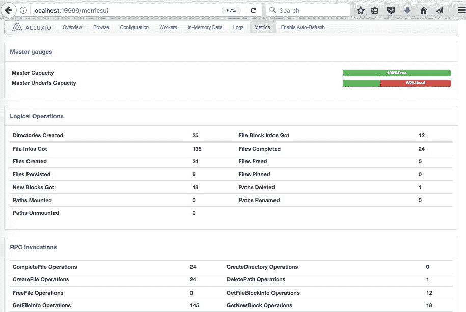

# 当前功能

正如前面所看到的，Alluxio 提供了许多功能，以支持高速内存文件系统，显着加速 Spark 或许多其他计算系统。当前版本具有许多功能，以下是一些主要功能的描述：

+   **灵活的文件 API**提供了与 Hadoop 兼容的文件系统，允许 Hadoop MapReduce 和 Spark 使用 Alluxio。

+   **可插拔的底层存储**将内存中的数据检查点到底层存储系统，支持 Amazon S3、Google Cloud Storage、OpenStack Swift、HDFS 等。

+   **分层存储**可以管理 SSD 和 HDD，除了内存，还允许将更大的数据集存储在 Alluxio 中。

+   **统一命名空间**通过挂载功能在不同存储系统之间实现有效的数据管理。此外，透明命名确保在将这些对象持久化到底层存储系统时，Alluxio 中创建的对象的文件名和目录层次结构得以保留。

+   **血统**可以通过血统实现高吞吐量写入，而不会影响容错性，其中丢失的输出通过重新执行创建输出的作业来恢复，就像 Apache Spark 中的 DAG 一样。

+   **Web UI 和命令行**允许用户通过 Web UI 轻松浏览文件系统。在调试模式下，管理员可以查看每个文件的详细信息，包括位置和检查点路径。用户还可以使用`./bin/alluxio fs`与 Alluxio 进行交互，例如，复制数据进出文件系统。

有关最新功能和更多最新信息，请参阅[`www.alluxio.org/`](http://www.alluxio.org/)。

这已经足够让 Alluxio 在本地启动了。接下来，我们将看到如何与集群管理器（如 YARN）集成。

# 与 YARN 集成

YARN 是最常用的集群管理器之一，其次是 Mesos。如果您还记得第五章中的内容，*处理大数据 - Spark 加入派对*，YARN 可以管理 Hadoop 集群的资源，并允许数百个应用程序共享集群资源。我们可以使用 YARN 和 Spark 集成来运行长时间运行的 Spark 作业，以处理实时信用卡交易，例如。

但是，不建议尝试将 Alluxio 作为 YARN 应用程序运行；相反，应该将 Alluxio 作为独立集群与 YARN 一起运行。Alluxio 应该与 YARN 一起运行，以便所有 YARN 节点都可以访问本地的 Alluxio worker。为了使 YARN 和 Alluxio 共存，我们必须通知 YARN 有关 Alluxio 使用的资源。例如，YARN 需要知道为 Alluxio 留下多少内存和 CPU。

# Alluxio worker 内存

Alluxio worker 需要一些内存用于其 JVM 进程和一些内存用于其 RAM 磁盘；通常 1GB 对于 JVM 内存来说是足够的，因为这些内存仅用于缓冲和元数据。

RAM 磁盘内存可以通过设置`alluxio.worker.memory.size`进行配置。

存储在非内存层中的数据，如 SSD 或 HDD，不需要包括在内存大小计算中。

# Alluxio master 内存

Alluxio master 存储有关 Alluxio 中每个文件的元数据，因此对于更大的集群部署，它应该至少为 1GB，最多为 32GB。

# CPU vcores

每个 Alluxio worker 至少应该有一个 vcore，生产部署中 Alluxio master 可以使用至少一个到四个 vcores。

要通知 YARN 在每个节点上为 Alluxio 保留的资源，请修改`yarn-site.xml`中的 YARN 配置参数。

将`yarn.nodemanager.resource.memory-mb`更改为为 Alluxio worker 保留一些内存。

确定在节点上为 Alluxio 分配多少内存后，从`yarn.nodemanager.resource.memory-mb`中减去这个值，并使用新值更新参数。

将`yarn.nodemanager.resource.cpu-vcores`更改为为 Alluxio worker 保留 CPU vcores。

确定在节点上为 Alluxio 分配多少内存后，从`yarn.nodemanager.resource.cpu-vcores`中减去这个值，并使用新值更新参数。

更新 YARN 配置后，重新启动 YARN 以使其应用更改。

# 使用 Alluxio 与 Spark

为了在 Spark 中使用 Alluxio，您将需要一些依赖的 JAR 文件。这是为了使 Spark 能够连接到 Alluxio 文件系统并读取/写入数据。一旦我们启动具有 Alluxio 集成的 Spark，大部分 Spark 代码仍然保持完全相同，只有代码的读取和写入部分发生了变化，因为现在您必须使用`alluxio://`来表示 Alluxio 文件系统。

然而，一旦设置了 Alluxio 集群，Spark 作业（执行器）将连接到 Alluxio 主服务器以获取元数据，并连接到 Alluxio 工作节点进行实际数据读取/写入操作。

这里显示了从 Spark 作业中使用的 Alluxio 集群的示例： 

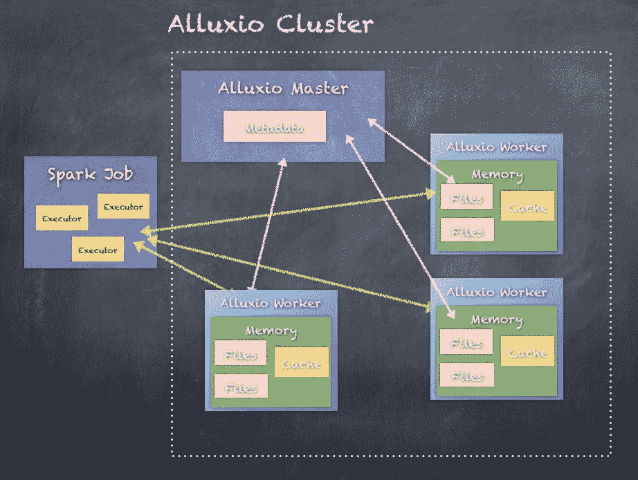

以下是如何使用 Alluxio 启动 Spark-shell 并运行一些代码的步骤：

**第 1 步**，将目录更改为提取 Spark 的目录：

```scala
 cd spark-2.2.0-bin-hadoop2.7

```

**第 2 步**，将 JAR 文件从 Alluxio 复制到 Spark：

```scala
cp ../alluxio-1.5.0-hadoop-2.7/core/common/target/alluxio-core-common-1.5.0.jar .
cp ../alluxio-1.5.0-hadoop-2.7/core/client/hdfs/target/alluxio-core-client-hdfs-1.5.0.jar .
cp ../alluxio-1.5.0-hadoop-2.7/core/client/fs/target/alluxio-core-client-fs-1.5.0.jar .
cp ../alluxio-1.5.0-hadoop-2.7/core/protobuf/target/alluxio-core-protobuf-1.5.0.jar . 

```

**第 3 步**，使用 Alluxio JAR 文件启动 Spark-shell：

```scala
./bin/spark-shell --master local[2] --jars alluxio-core-common-1.5.0.jar,alluxio-core-client-fs-1.5.0.jar,alluxio-core-client-hdfs-1.5.0.jar,alluxio-otobuf-1.5.0.jar

```

第 4 步，将样本数据集复制到 Alluxio 文件系统中：

```scala
$ ./bin/alluxio fs copyFromLocal ../spark-2.1.1-bin-hadoop2.7/Sentiment_Analysis_Dataset10k.csv /Sentiment_Analysis_Dataset10k.csv
Copied ../spark-2.1.1-bin-hadoop2.7/Sentiment_Analysis_Dataset10k.csv to /Sentiment_Analysis_Dataset10k.csv

```

您可以使用浏览选项卡在 Alluxio 中验证文件；它是大小为 801.29KB 的 Sentiment_Analysis_Dataset10k.csv 文件：

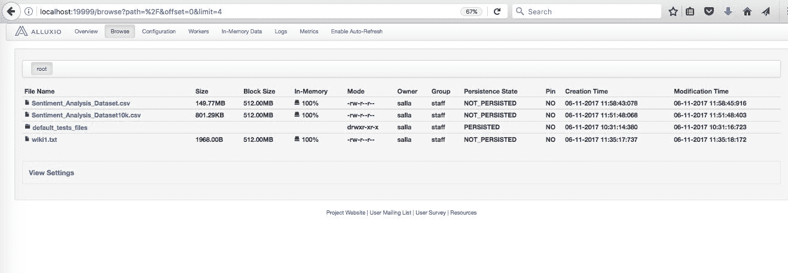

第 4 步。访问带有和不带有 Alluxio 的文件。

首先，在 shell 中设置 Alluxio 文件系统配置：

```scala
scala> sc.hadoopConfiguration.set("fs.alluxio.impl", "alluxio.hadoop.FileSystem")

```

从 Alluxio 加载文本文件：

```scala
scala> val alluxioFile = sc.textFile("alluxio://localhost:19998/Sentiment_Analysis_Dataset10k.csv")
alluxioFile: org.apache.spark.rdd.RDD[String] = alluxio://localhost:19998/Sentiment_Analysis_Dataset10k.csv MapPartitionsRDD[39] at textFile at <console>:24

scala> alluxioFile.count
res24: Long = 9999

```

从本地文件系统加载相同的文本文件：

```scala
scala> val localFile = sc.textFile("Sentiment_Analysis_Dataset10k.csv")
localFile: org.apache.spark.rdd.RDD[String] = Sentiment_Analysis_Dataset10k.csv MapPartitionsRDD[41] at textFile at <console>:24

scala> localFile.count
res23: Long = 9999

```

如果您可以加载大量数据到 Alluxio 中，Alluxio 集成将提供更高的性能，而无需缓存数据。这带来了几个优势，包括消除了每个使用 Spark 集群的用户缓存大型数据集的需要。

# 摘要

在本附录中，我们探讨了使用 Alluxio 作为加速 Spark 应用程序的一种方式，利用了 Alluxio 的内存文件系统功能。这带来了几个优势，包括消除了每个使用 Spark 集群的用户缓存大型数据集的需要。

在下一个附录中，我们将探讨如何使用 Apache Zeppelin，一个基于 Web 的笔记本，进行交互式数据分析。
