# 第二十一章：使用 Apache Zeppelin 进行交互式数据分析

从数据科学的角度来看，交互式可视化数据分析也很重要。Apache Zeppelin 是一个基于 Web 的笔记本，用于交互式和大规模数据分析，具有多个后端和解释器，如 Spark、Scala、Python、JDBC、Flink、Hive、Angular、Livy、Alluxio、PostgreSQL、Ignite、Lens、Cassandra、Kylin、Elasticsearch、JDBC、HBase、BigQuery、Pig、Markdown、Shell 等等。

毫无疑问，Spark 有能力以可扩展和快速的方式处理大规模数据集。但是，Spark 中缺少一件事--它没有实时或交互式的可视化支持。考虑到 Zeppelin 的上述令人兴奋的功能，在本章中，我们将讨论如何使用 Apache Zeppelin 进行大规模数据分析，使用 Spark 作为后端的解释器。总之，将涵盖以下主题：

+   Apache Zeppelin 简介

+   安装和入门

+   数据摄入

+   数据分析

+   数据可视化

+   数据协作

# Apache Zeppelin 简介

Apache Zeppelin 是一个基于 Web 的笔记本，可以让您以交互方式进行数据分析。使用 Zeppelin，您可以使用 SQL、Scala 等制作美丽的数据驱动、交互式和协作文档。Apache Zeppelin 解释器概念允许将任何语言/数据处理后端插入 Zeppelin。目前，Apache Zeppelin 支持许多解释器，如 Apache Spark、Python、JDBC、Markdown 和 Shell。Apache Zeppelin 是 Apache 软件基金会的一个相对较新的技术，它使数据科学家、工程师和从业者能够利用数据探索、可视化、共享和协作功能。

# 安装和入门

由于使用其他解释器不是本书的目标，而是在 Zeppelin 上使用 Spark，所有代码都将使用 Scala 编写。因此，在本节中，我们将展示如何使用仅包含 Spark 解释器的二进制包配置 Zeppelin。Apache Zeppelin 官方支持并在以下环境上进行了测试：

| **要求** | **值/版本** | **其他要求** |
| --- | --- | --- |
| Oracle JDK | 1.7 或更高版本 | 设置`JAVA_HOME` |

| 操作系统 | macOS 10.X+ Ubuntu 14.X+

CentOS 6.X+

Windows 7 Pro SP1+ | - |

# 安装和配置

如前表所示，要在 Zeppelin 上执行 Spark 代码，需要 Java。因此，如果尚未设置，请在上述任何平台上安装和设置 Java。或者，您可以参考第一章，*Scala 简介*，了解如何在计算机上设置 Java。

可以从[`zeppelin.apache.org/download.html`](https://zeppelin.apache.org/download.html)下载最新版本的 Apache Zeppelin。每个版本都有三个选项：

1.  **带有所有解释器的二进制包**：它包含对许多解释器的支持。例如，Spark、JDBC、Pig、Beam、Scio、BigQuery、Python、Livy、HDFS、Alluxio、Hbase、Scalding、Elasticsearch、Angular、Markdown、Shell、Flink、Hive、Tajo、Cassandra、Geode、Ignite、Kylin、Lens、Phoenix 和 PostgreSQL 目前在 Zeppelin 中得到支持。

1.  **带有 Spark 解释器的二进制包**：通常只包含 Spark 解释器。它还包含解释器的网络安装脚本。

1.  **源代码**：您还可以从 GitHub 存储库构建 Zeppelin（更多内容将在后续介绍）。

为了展示如何安装和配置 Zeppelin，我们从以下站点镜像下载了二进制包：

[`www.apache.org/dyn/closer.cgi/zeppelin/zeppelin-0.7.1/zeppelin-0.7.1-bin-netinst.tgz`](http://www.apache.org/dyn/closer.cgi/zeppelin/zeppelin-0.7.1/zeppelin-0.7.1-bin-netinst.tgz)

下载后，在计算机上的某个位置解压缩它。假设您解压缩文件的路径是`/home/Zeppelin/`。

# 从源代码构建

您还可以从 GitHub 存储库中构建所有最新更改的 Zeppelin。如果要从源代码构建，必须首先安装以下工具：

+   Git：任何版本

+   Maven：3.1.x 或更高版本

+   JDK：1.7 或更高版本

+   npm：最新版本

+   libfontconfig：最新版本

如果您尚未安装 Git 和 Maven，请从[`zeppelin.apache.org/docs/0.8.0-SNAPSHOT/install/build.html#build-requirements`](http://zeppelin.apache.org/docs/0.8.0-SNAPSHOT/install/build.html#build-requirements)检查构建要求说明。但是，由于页面限制，我们没有详细讨论所有步骤。如果您感兴趣，可以参考此 URL 获取更多详细信息：[`zeppelin.apache.org/docs/snapshot/install/build.html`](http://zeppelin.apache.org/docs/snapshot/install/build.html)。

# 启动和停止 Apache Zeppelin

在所有类 Unix 平台（例如 Ubuntu、macOS 等）上，使用以下命令：

```scala
$ bin/zeppelin-daemon.sh start

```

如果前面的命令成功执行，您应该在终端上看到以下日志：

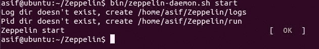**图 1**：从 Ubuntu 终端启动 Zeppelin

如果您使用 Windows，使用以下命令：

```scala
$ bin\zeppelin.cmd

```

Zeppelin 成功启动后，使用您的网络浏览器转到`http://localhost:8080`，您将看到 Zeppelin 正在运行。更具体地说，您将在浏览器上看到以下视图：

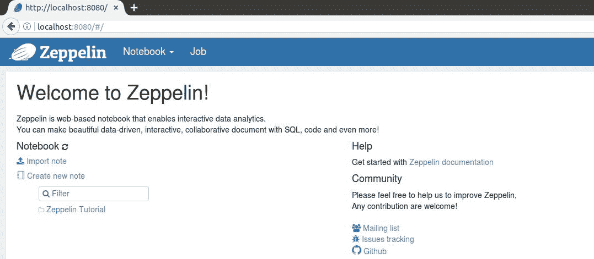**图 2**：Zeppelin 正在 http://localhost:8080 上运行

恭喜！您已成功安装了 Apache Zeppelin！现在，让我们继续使用 Zeppelin，并在配置了首选解释器后开始我们的数据分析。

现在，要从命令行停止 Zeppelin，请发出以下命令：

```scala
$ bin/zeppelin-daemon.sh stop

```

# 创建笔记本

一旦您在`http://localhost:8080/`上，您可以探索不同的选项和菜单，以帮助您了解如何熟悉 Zeppelin。您可以在[`zeppelin.apache.org/docs/0.7.1/quickstart/explorezeppelinui.html`](https://zeppelin.apache.org/docs/0.7.1/quickstart/explorezeppelinui.html)上找到更多关于 Zeppelin 及其用户友好的 UI 的信息（您也可以根据可用版本参考最新的快速入门文档）。

现在，让我们首先创建一个示例笔记本并开始。如下图所示，您可以通过单击“创建新笔记”选项来创建一个新的笔记本：

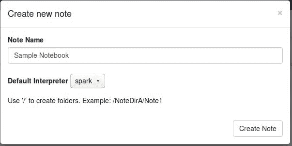**图 3**：创建一个示例 Zeppelin 笔记本

如前图所示，默认解释器选择为 Spark。在下拉列表中，您还将只看到 Spark，因为我们已经为 Zeppelin 下载了仅包含 Spark 的二进制包。

# 配置解释器

每个解释器都属于一个解释器组。解释器组是启动/停止解释器的单位。默认情况下，每个解释器属于一个单一组，但该组可能包含更多的解释器。例如，Spark 解释器组包括 Spark 支持、pySpark、Spark SQL 和依赖项加载器。如果您想在 Zeppelin 上执行 SQL 语句，应该使用`%`符号指定解释器类型；例如，要使用 SQL，应该使用`%sql`；要使用标记，使用`%md`，依此类推。

有关更多信息，请参考以下图片：

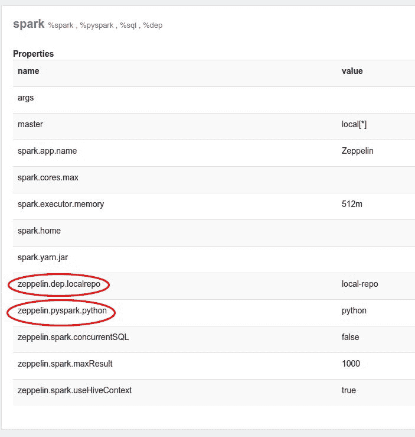**图 4**：在 Zeppelin 上使用 Spark 的解释器属性数据摄入

好了，一旦您创建了笔记本，就可以直接在代码部分编写 Spark 代码。对于这个简单的例子，我们将使用银行数据集，该数据集可供研究使用，并可从[`archive.ics.uci.edu/ml/machine-learning-databases/00222/`](https://archive.ics.uci.edu/ml/machine-learning-databases/00222/)下载，由 S. Moro、R. Laureano 和 P. Cortez 提供，使用数据挖掘进行银行直接营销：CRISP-DM 方法的应用。数据集包含诸如年龄、职业头衔、婚姻状况、教育、是否为违约者、银行余额、住房、是否从银行借款等客户的信息，以 CSV 格式提供。以下是数据集的样本：

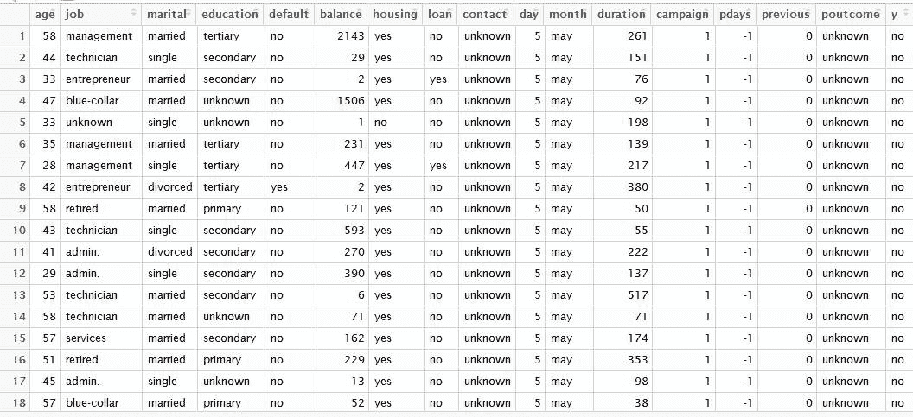**图 5**：银行数据集样本

现在，让我们首先在 Zeppelin 笔记本上加载数据：

```scala
valbankText = sc.textFile("/home/asif/bank/bank-full.csv")

```

执行此代码行后，创建一个新的段落，并将其命名为数据摄入段落：

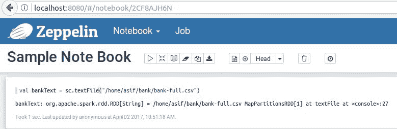**图 6**：数据摄入段落

如果您仔细观察前面的图像，代码已经运行，我们不需要定义 Spark 上下文。原因是它已经在那里定义为`sc`。甚至不需要隐式定义 Scala。稍后我们将看到一个例子。

# 数据处理和可视化

现在，让我们创建一个案例类，告诉我们如何从数据集中选择所需的字段：

```scala
case class Bank(age:Int, job:String, marital : String, education : String, balance : Integer)

```

现在，将每行拆分，过滤掉标题（以`age`开头），并将其映射到`Bank`案例类中，如下所示：

```scala
val bank = bankText.map(s=>s.split(";")).filter(s => (s.size)>5).filter(s=>s(0)!="\"age\"").map( 
  s=>Bank(s(0).toInt,  
  s(1).replaceAll("\"", ""), 
  s(2).replaceAll("\"", ""), 
  s(3).replaceAll("\"", ""), 
  s(5).replaceAll("\"", "").toInt 
        ) 
) 

```

最后，转换为 DataFrame 并创建临时表：

```scala
bank.toDF().createOrReplaceTempView("bank")

```

以下截图显示所有代码片段都成功执行，没有显示任何错误：

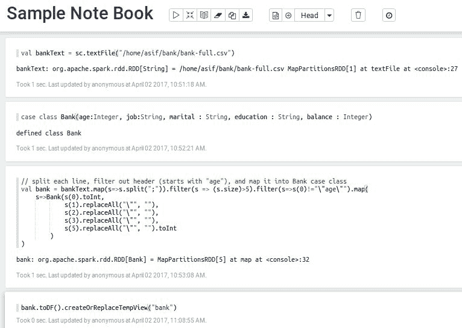**图 7**：数据处理段落

为了更加透明，让我们在代码执行后查看标记为绿色的状态（在图像右上角），如下所示：

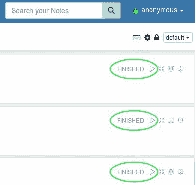**图 8**：每个段落中 Spark 代码的成功执行

现在让我们加载一些数据，以便使用以下 SQL 命令进行操作：

```scala
%sql select age, count(1) from bank where age >= 45 group by age order by age

```

请注意，上述代码行是一个纯 SQL 语句，用于选择年龄大于或等于 45 岁的所有客户的姓名（即年龄分布）。最后，它计算了同一客户组的数量。

现在让我们看看前面的 SQL 语句在临时视图（即`bank`）上是如何工作的：

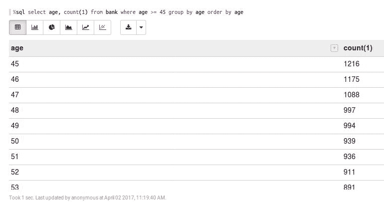**图 9**：选择所有年龄分布的客户姓名的 SQL 查询[表格]

现在您可以从结果部分附近的选项卡中选择图形选项，例如直方图、饼图、条形图等。例如，使用直方图，您可以看到`年龄组>=45`的相应计数。

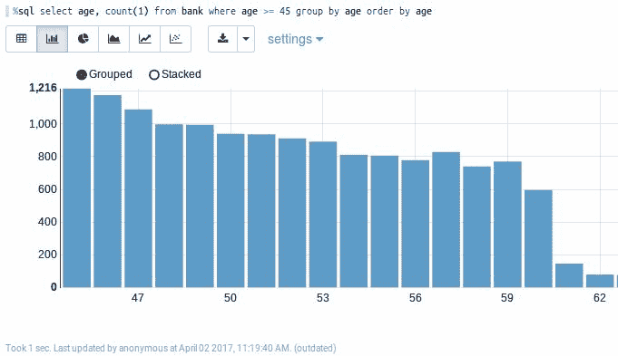**图 10**：选择所有年龄分布的客户姓名的 SQL 查询[直方图]

这是使用饼图的效果：

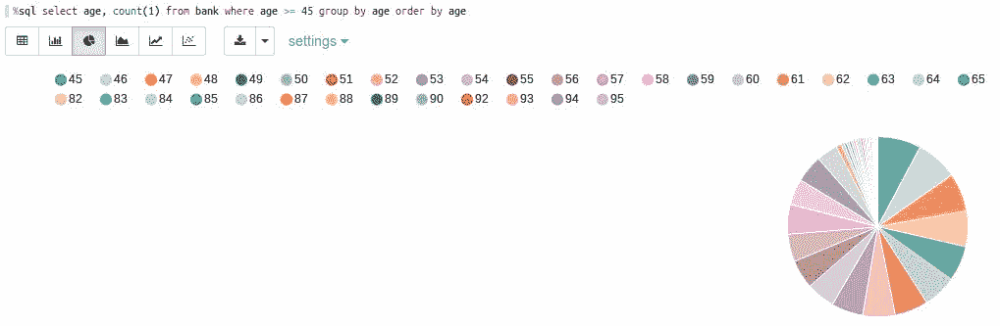**图 11**：选择所有年龄分布的客户姓名的 SQL 查询[饼图]

太棒了！现在我们几乎可以使用 Zeppelin 进行更复杂的数据分析问题了。

# 使用 Zeppelin 进行复杂数据分析

在本节中，我们将看到如何使用 Zeppelin 执行更复杂的分析。首先，我们将明确问题，然后将探索将要使用的数据集。最后，我们将应用一些可视化分析和机器学习技术。

# 问题定义

在本节中，我们将构建一个垃圾邮件分类器，用于将原始文本分类为垃圾邮件或正常邮件。我们还将展示如何评估这样的模型。我们将尝试专注于使用和处理 DataFrame API。最终，垃圾邮件分类器模型将帮助您区分垃圾邮件和正常邮件。以下图像显示了两条消息的概念视图（分别为垃圾邮件和正常邮件）：

**图 12**：垃圾邮件和正常邮件示例

我们使用一些基本的机器学习技术来构建和评估这种类型问题的分类器。具体来说，逻辑回归算法将用于解决这个问题。

# 数据集描述和探索

我们从[`archive.ics.uci.edu/ml/datasets/SMS+Spam+Collection`](https://archive.ics.uci.edu/ml/datasets/SMS+Spam+Collection)下载的垃圾数据集包含 5,564 条短信，已经被手动分类为正常或垃圾。这些短信中只有 13.4%是垃圾短信。这意味着数据集存在偏斜，并且只提供了少量垃圾短信的示例。这是需要记住的一点，因为它可能在训练模型时引入偏差：

**图 13**：短信数据集的快照

那么，这些数据是什么样子的呢？您可能已经看到，社交媒体文本可能会非常肮脏，包含俚语、拼写错误、缺少空格、缩写词，比如*u*、*urs*、*yrs*等等，通常违反语法规则。有时甚至包含消息中的琐碎词语。因此，我们需要处理这些问题。在接下来的步骤中，我们将遇到这些问题，以更好地解释分析结果。

第 1 步。在 Zeppelin 上加载所需的包和 API - 让我们加载所需的包和 API，并在 Zeppelin 上创建第一个段落，然后再将数据集导入：

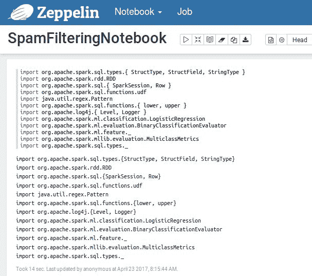**图 14**：包/ API 加载段落

第 2 步。加载和解析数据集 - 我们将使用 Databricks 的 CSV 解析库（即`com.databricks.spark.csv`）将数据读入 DataFrame：

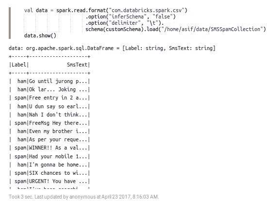**图 15**：数据摄取/加载段落

第 3 步。使用`StringIndexer`创建数字标签 - 由于原始 DataFrame 中的标签是分类的，我们需要将它们转换回来，以便在机器学习模型中使用：

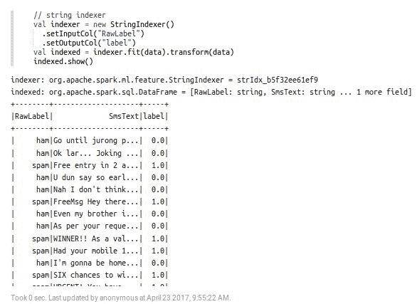**图 16**：StringIndexer 段落，输出显示原始标签、原始文本和相应标签。

第 4 步。使用`RegexTokenizer`创建词袋 - 我们将使用`RegexTokenizer`去除不需要的单词并创建一个词袋：

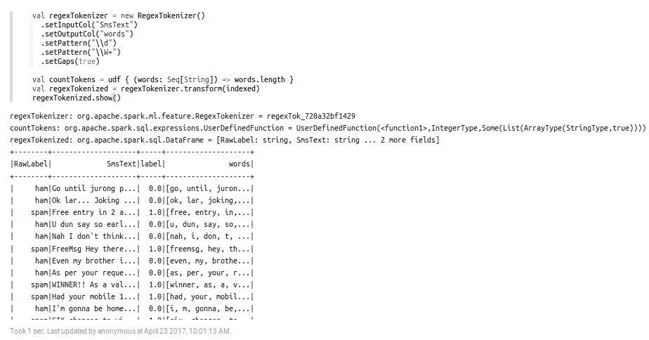**图 17**：RegexTokenizer 段落，输出显示原始标签、原始文本、相应标签和标记

第 5 步。删除停用词并创建一个经过筛选的 DataFrame - 我们将删除停用词并创建一个经过筛选的 DataFrame 以进行可视化分析。最后，我们展示 DataFrame：

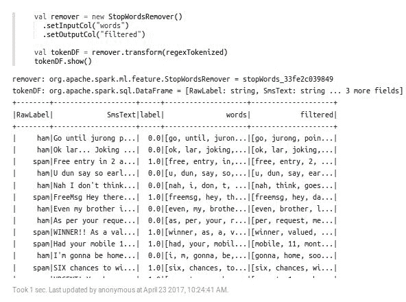**图 18**：StopWordsRemover 段落，输出显示原始标签、原始文本、相应标签、标记和去除停用词的筛选标记

第 6 步。查找垃圾消息/单词及其频率 - 让我们尝试创建一个仅包含垃圾单词及其相应频率的 DataFrame，以了解数据集中消息的上下文。我们可以在 Zeppelin 上创建一个段落：

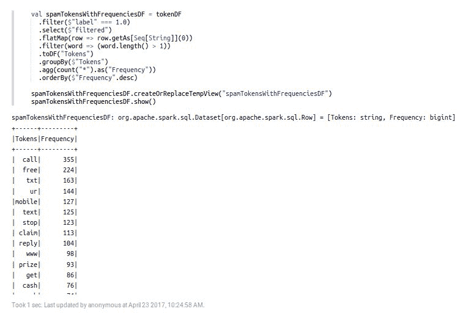**图 19**：带有频率段落的垃圾邮件标记

现在，让我们通过 SQL 查询在图表中查看它们。以下查询选择所有频率超过 100 的标记。然后，我们按照它们的频率降序排序标记。最后，我们使用动态表单来限制记录的数量。第一个是原始表格格式：

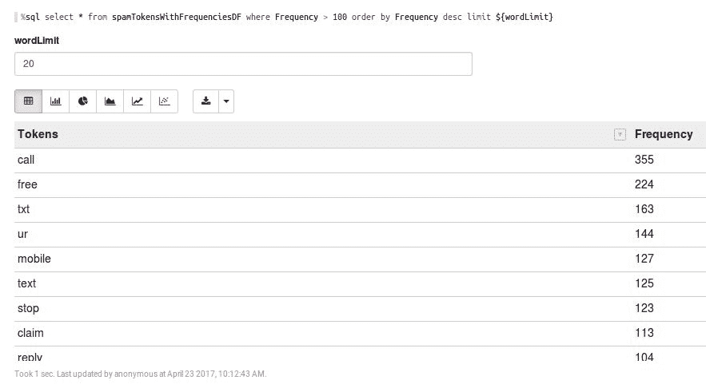**图 20**：带有频率可视化段落的垃圾邮件标记[表格]

然后，我们将使用条形图，这提供了更多的视觉洞察。现在我们可以看到，垃圾短信中最频繁出现的单词是 call 和 free，分别出现了 355 次和 224 次：

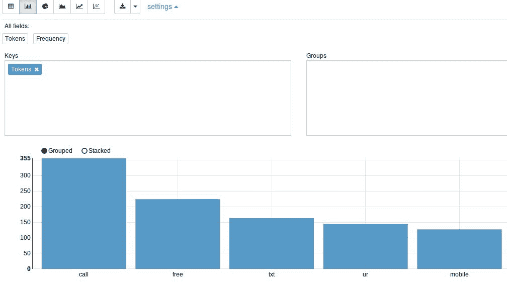**图 21**：带有频率可视化段落的垃圾邮件标记[直方图]

最后，使用饼图提供了更好更广泛的可见性，特别是如果您指定了列范围：

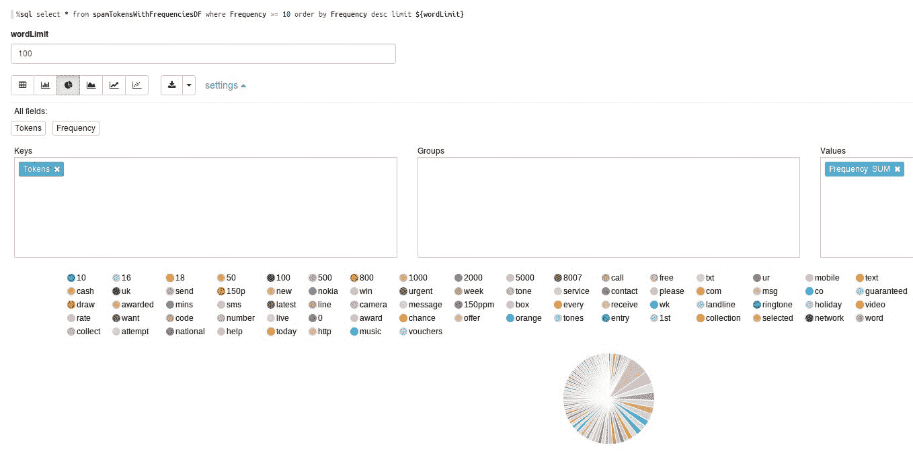**图 22**：带有频率可视化段落的垃圾邮件标记[饼图]

第 7 步。使用 HashingTF 进行词频- 使用`HashingTF`生成每个过滤标记的词频，如下所示：

图 23：HashingTF 段落，输出显示原始标签、原始文本、相应标签、标记、过滤后的标记和每行的相应词频

第 8 步。使用 IDF 进行词频-逆文档频率（TF-IDF）- TF-IDF 是一种在文本挖掘中广泛使用的特征向量化方法，用于反映术语对语料库中文档的重要性：

图 24：IDF 段落，输出显示原始标签、原始文本、相应标签、标记、过滤后的标记、词频和每行的相应 IDF

词袋：词袋为句子中每个单词的出现赋予值`1`。这可能不是理想的，因为句子的每个类别很可能具有相同的*the*、*and*等词的频率；而*viagra*和*sale*等词可能在确定文本是否为垃圾邮件方面应该具有更高的重要性。

TF-IDF：这是文本频率-逆文档频率的缩写。这个术语本质上是每个词的文本频率和逆文档频率的乘积。这在 NLP 或文本分析中的词袋方法中常用。

使用 TF-IDF：让我们来看看词频。在这里，我们考虑单个条目中单词的频率，即术语。计算文本频率（TF）的目的是找到在每个条目中似乎重要的术语。然而，诸如“the”和“and”之类的词在每个条目中可能出现得非常频繁。我们希望降低这些词的重要性，因此我们可以想象将前述 TF 乘以整个文档频率的倒数可能有助于找到重要的词。然而，由于文本集合（语料库）可能相当大，通常会取逆文档频率的对数。简而言之，我们可以想象 TF-IDF 的高值可能表示对确定文档内容非常重要的词。创建 TF-IDF 向量需要我们将所有文本加载到内存中，并在开始训练模型之前计算每个单词的出现次数。

第 9 步。使用 VectorAssembler 生成 Spark ML 管道的原始特征- 正如您在上一步中看到的，我们只有过滤后的标记、标签、TF 和 IDF。然而，没有任何可以输入任何 ML 模型的相关特征。因此，我们需要使用 Spark VectorAssembler API 根据前一个 DataFrame 中的属性创建特征，如下所示：

图 25：VectorAssembler 段落，显示使用 VectorAssembler 进行特征创建

第 10 步。准备训练和测试集- 现在我们需要准备训练和测试集。训练集将用于在第 11 步中训练逻辑回归模型，测试集将用于在第 12 步中评估模型。在这里，我将其设置为 75%用于训练，25%用于测试。您可以根据需要进行调整：

图 26：准备训练/测试集段落

第 11 步。训练二元逻辑回归模型- 由于问题本身是一个二元分类问题，我们可以使用二元逻辑回归分类器，如下所示：

图 27：LogisticRegression 段落，显示如何使用必要的标签、特征、回归参数、弹性网参数和最大迭代次数训练逻辑回归分类器

请注意，为了获得更好的结果，我们已经迭代了 200 次的训练。我们已经将回归参数和弹性网参数设置得非常低-即 0.0001，以使训练更加密集。

**步骤 12. 模型评估** - 让我们计算测试集的原始预测。然后，我们使用二元分类器评估器来实例化原始预测，如下所示：

**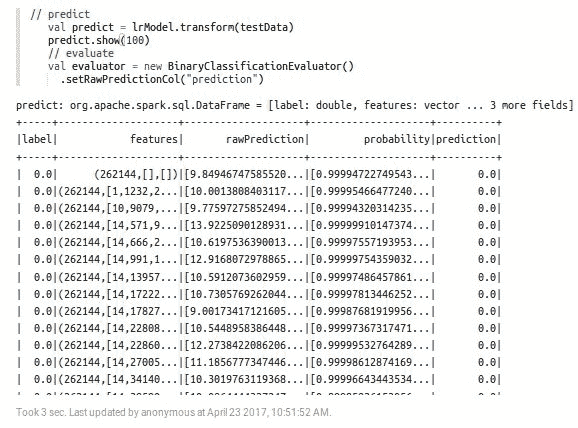****图 28**: 模型评估段落

现在让我们计算模型在测试集上的准确性，如下所示：

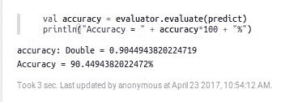**图 29**: 准确性计算段落

这相当令人印象深刻。然而，如果您选择使用交叉验证进行模型调优，例如，您可能会获得更高的准确性。最后，我们将计算混淆矩阵以获得更多见解：

图 30: 混淆段落显示了正确和错误预测的数量，以计数值总结，并按每个类别进行了分解

# 数据和结果协作

此外，Apache Zeppelin 提供了一个功能，用于发布您的笔记本段落结果。使用此功能，您可以在自己的网站上展示 Zeppelin 笔记本段落结果。非常简单；只需在您的页面上使用`<iframe>`标签。如果您想分享 Zeppelin 笔记本的链接，发布段落结果的第一步是复制段落链接。在 Zeppelin 笔记本中运行段落后，单击位于右侧的齿轮按钮。然后，在菜单中单击链接此段落，如下图所示：

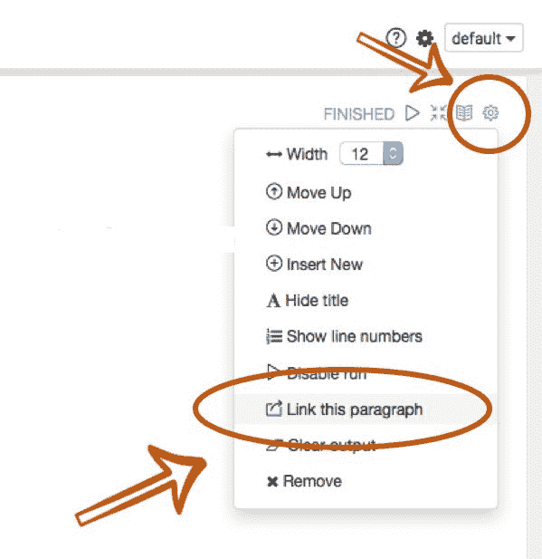**图 31**: 链接段落

然后，只需复制提供的链接，如下所示：

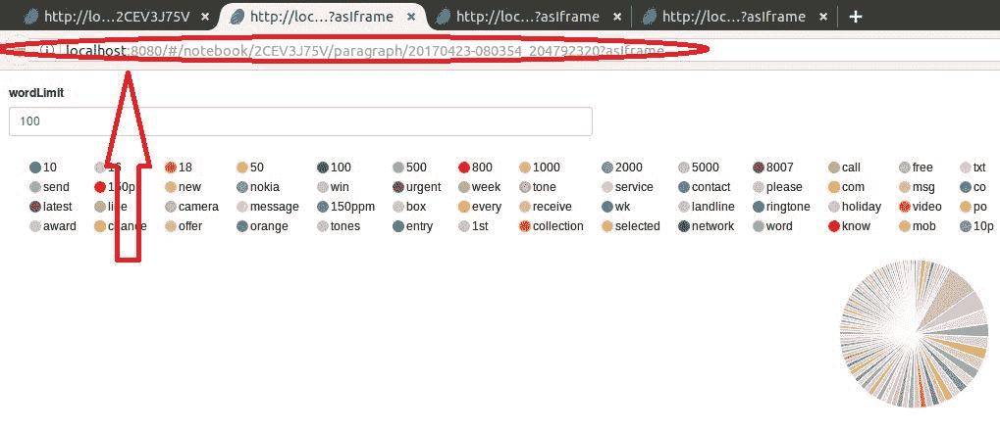**图 32**: 获取与协作者共享段落的链接

现在，即使您想发布复制的段落，您也可以在您的网站上使用`<iframe>`标签。这是一个例子：

```scala
<iframe src="img/...?asIframe" height="" width="" ></iframe>

```

现在，您可以在您的网站上展示您美丽的可视化结果。这更多或少是我们使用 Apache Zeppelin 进行数据分析旅程的结束。有关更多信息和相关更新，您应该访问 Apache Zeppelin 的官方网站[`zeppelin.apache.org/`](https://zeppelin.apache.org/)；您甚至可以订阅 Zeppelin 用户 users-subscribe@zeppelin.apache.org。

# 摘要

Apache Zeppelin 是一个基于 Web 的笔记本，可以让您以交互方式进行数据分析。使用 Zeppelin，您可以使用 SQL、Scala 等制作美丽的数据驱动、交互式和协作文档。它正在日益受到欢迎，因为最近的版本中添加了更多功能。然而，由于页面限制，并且为了让您更专注于仅使用 Spark，我们展示了仅适用于使用 Scala 的 Spark 的示例。但是，您可以用 Python 编写您的 Spark 代码，并以类似的轻松方式测试您的笔记本。

在本章中，我们讨论了如何使用 Apache Zeppelin 进行后端使用 Spark 进行大规模数据分析。我们看到了如何安装和开始使用 Zeppelin。然后，我们看到了如何摄取您的数据并解析和分析以获得更好的可见性。然后，我们看到了如何将其可视化以获得更好的见解。最后，我们看到了如何与协作者共享 Zeppelin 笔记本。
