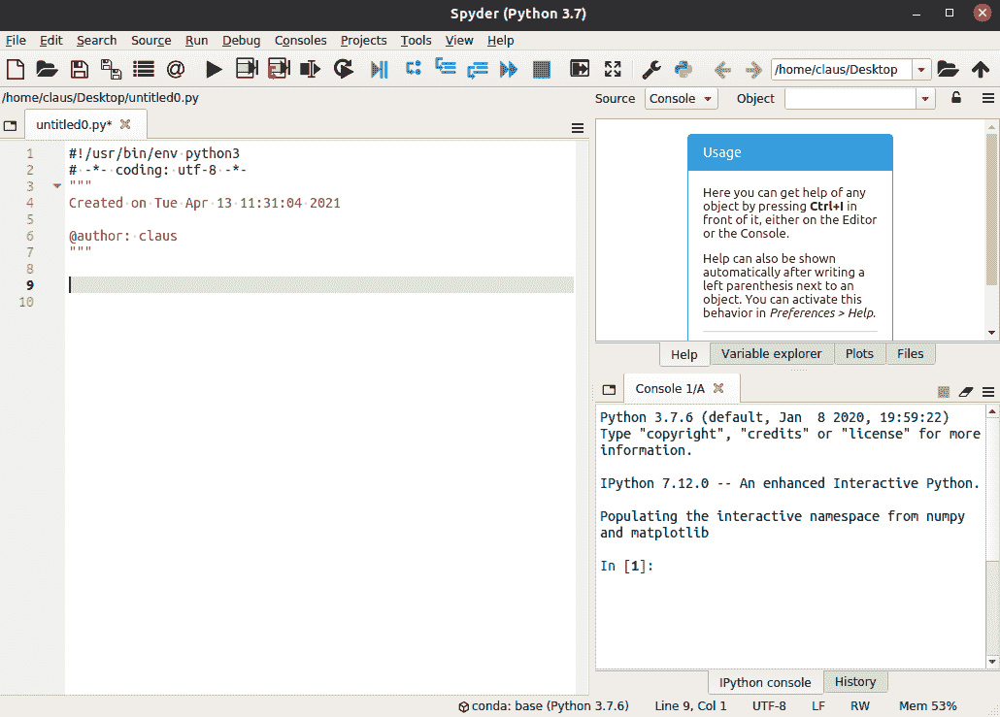
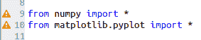
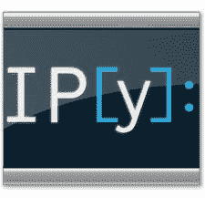
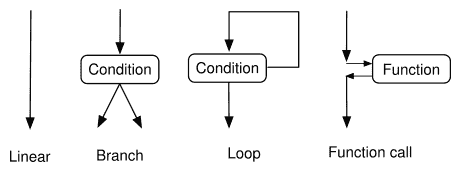
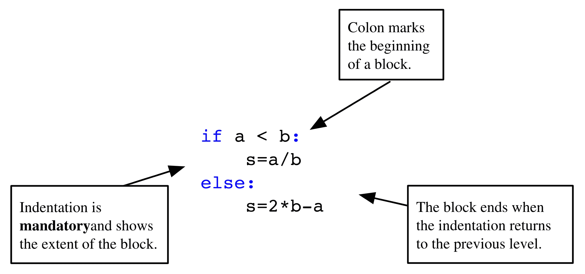
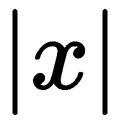
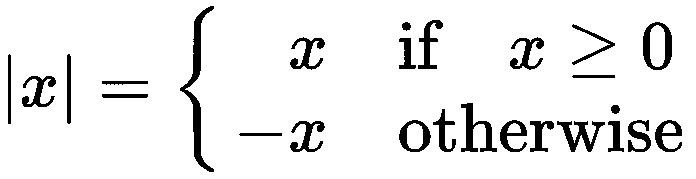
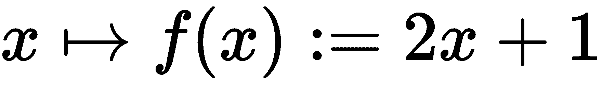
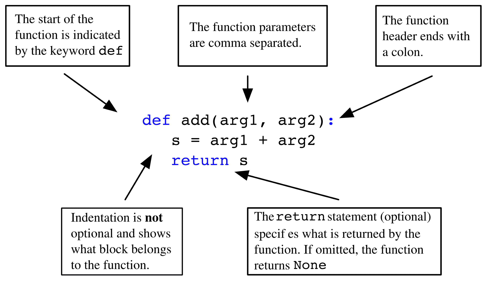

开始使用

在本章中，我们将简要概述 Python 的主要语法元素。本章旨在引导刚开始学习编程的读者。每个主题都以 *如何做* 的方式呈现，并将在本书后续部分以更深入的概念性方式解释，并结合许多应用和扩展。

对于那些已经熟悉其他编程语言的读者，本章将介绍 Python 方式的经典语言构造。这将为他们提供快速入门 Python 编程的机会。

无论哪种类型的读者，都可以将本章作为参考指南，在阅读本书时随时查看。不过，在开始之前，我们需要确保一切准备就绪，确保你已安装正确版本的 Python，并配备好用于科学计算和工具的主要模块，例如一个好的编辑器和 Shell，这些工具有助于代码开发和测试。

在本章中，我们将介绍以下主题：

+   安装和配置说明

+   程序和程序流程

+   Python 中的基本数据类型

+   使用循环重复语句

+   条件语句

+   使用函数封装代码

+   理解脚本和模块

+   Python 解释器

即使你的计算机上已经安装了 Python，仍然建议阅读以下部分。你可能需要对环境进行调整，以符合本书中的工作环境。

# 第二章：1.1 安装和配置说明

在深入研究本书的主题之前，你应该已经在计算机上安装了所有相关工具。我们提供一些建议，并推荐你可能希望使用的工具。我们只描述公共领域和免费的工具。

## 1.1.1 安装

目前有两个主要版本的 Python：*2.x* 分支和新的 *3.x* 分支。两个分支之间存在语言不兼容性，你需要知道该使用哪个版本。本书基于 *3.x* 分支，考虑到语言已发布到 *3.7* 版本。

本书中，你需要安装以下内容：

+   解释器：Python *3.7*（或更高版本）

+   用于科学计算的模块：SciPy 与 NumPy

+   用于数学结果图形表示的模块：matplotlib

+   Shell：IPython

+   与 Python 相关的编辑器：最好使用 Spyder（见 *图 1.1*）。

这些工具的安装通过所谓的发行包来简化。我们建议你使用 Anaconda。

## 1.1.2 Anaconda

即使你的计算机上已经预安装了 Python，我们仍然建议你创建个人的 Python 环境，这样你可以在不冒险影响计算机功能所依赖的软件的情况下进行工作。通过使用虚拟环境（例如 Anaconda），你可以自由地更改语言版本并安装软件包，而不会产生意外的副作用。

如果最糟糕的情况发生，并且你完全弄乱了，只需删除 Anaconda 目录并重新开始。运行 Anaconda 安装程序将安装 Python、Python 开发环境和编辑器（Spyder）、shell（IPython）以及最重要的数值计算包：SciPy、NumPy 和 matplotlib。

你可以通过在 Anaconda 创建的虚拟环境中使用`conda install`安装额外的包（另见官方文档*）。

## 1.1.3 Spyder

Spyder 的默认屏幕包括左侧的编辑器窗口，右下角的控制台窗口，它提供对 IPython shell 的访问，以及右上角的帮助窗口，如下图所示：



图 1.1：Spyder 的默认屏幕

## 1.1.4 配置

大多数 Python 代码会保存在文件中。我们建议你在所有 Python 文件中使用以下头部：

```py
from numpy import *
from matplotlib.pyplot import *
```

通过这个，你可以确保本书中用于科学计算的所有基本数据类型和函数都已经导入。没有这个步骤，本书中的大多数示例都会抛出错误。

Spyder 会提供语法警告和语法错误指示。警告由黄色三角形标记；参见*图 1.2*。

语法警告表示语句是正确的，但由于某些原因，不建议使用它。前述语句`from`就会引发这样的警告。我们将在本书后面讨论这种警告的原因。在这种特定情况下，我们忽略此警告。



图 1.2：Spyder 中的警告三角形

许多编辑器，如 Spyder，提供为你的文件创建模板的功能。查找此功能并将前述头部放入模板中。

## 1.1.5 Python shell

Python shell 很好，但对于交互式脚本编写来说并不最优。因此，我们建议使用 IPython [[25]](12bddbb5-edd0-46c6-8f7a-9475aaf01a9d.xhtml)。

IPython 可以通过不同的方式启动：

+   在终端 shell 中运行以下命令：`ipython`

+   直接点击名为 Jupyter QT Console 的图标：



+   在使用 Spyder 时，应该使用 IPython 控制台（参见*图 1.1*）。

## 1.1.6 执行脚本

你经常需要执行文件的内容。根据文件在计算机上的位置，执行文件内容之前，必须导航到正确的位置：

+   在 IPython 中使用命令`cd`，以便切换到文件所在的目录。

+   要执行名为`myfile.py`的文件内容，只需在 IPython shell 中运行以下命令：

```py
run myfile
```

## 1.1.7 获取帮助

以下是一些使用 IPython 的提示：

+   要获取有关某个对象的帮助，只需在对象的名称后面键入`?`，然后按下*回车*键。

+   使用箭头键来*重复*上次执行的命令。

+   你可以使用*Tab*键进行补全（即你输入一个变量或方法的首字母，IPython 会展示一个包含所有可能补全项的菜单）。

+   使用*Ctrl+D*退出。

+   使用 IPython 的魔法函数。你可以通过在命令提示符下输入 `%%magic` 来查看函数列表和说明。

你可以在 IPython 的在线文档中了解更多信息。

## 1.1.8 Jupyter – Python notebook

Jupyter notebook 是一个非常棒的工具，用于展示你的工作。学生可能希望用它来制作和记录作业和练习，而老师则可以用它来准备讲座，甚至是幻灯片和网页。

如果你通过 Anaconda 安装了 Python，你已经具备了 Jupyter 所需的一切。你可以通过在终端窗口中运行以下命令来启动 notebook：

```py
jupyter notebook
```

一个浏览器窗口将会打开，你可以通过网页浏览器与 Python 进行交互。

# 1.2 程序与程序流程

程序是一个按自上而下顺序执行的语句序列。这个线性执行顺序有一些重要的例外：

+   可能会有条件执行替代语句组（代码块），我们称之为分支。

+   有些代码块会被重复执行，这叫做循环（见*图 1.3*）。

+   有一些函数调用，它们是指向另一个代码片段的引用，该代码片段在主程序流程恢复之前被执行。函数调用打断了线性执行，并暂停程序单元的执行，同时将控制权传递给另一个单元——一个函数。当该函数执行完成后，控制权会返回给调用单元。



图 1.3：程序流程

Python 使用特殊的语法来标记语句块：一个关键字，一个冒号，以及一个缩进的语句序列，这些语句属于该代码块（见*图 1.4*）。



图 1.4：代码块命令

## 1.2.1 注释

如果程序中的一行包含符号 `#`，那么该行后面的内容会被视为注释：

```py
# This is a comment of the following statement
a = 3  # ... which might get a further comment here  
```

## 1.2.2 行连接

行末的反斜杠 `\` 表示下一行是续行，即*显式行连接*。如果一行结束时所有括号没有闭合，下一行将自动被识别为续行，即*隐式行连接*。

# 1.3 Python 中的基本数据类型

让我们来看看你在 Python 中会遇到的基本数据类型。

## 1.3.1 数字

一个数字可以是整数、实数或复数。常见的运算如下：

+   加法和减法，`+` 和 `-`

+   乘法和除法，`*` 和 `/`

+   幂运算，`**`

这里是一个示例：

```py
2 ** (2 + 2) # 16
1j ** 2 # -1
1\. + 3.0j
```

符号 `j` 表示复数的虚部。它是一个语法元素，不应与变量的乘法混淆。

## 1.3.2 字符串

字符串是由字符组成的序列，用单引号或双引号括起来：

```py
'valid string'
"string with double quotes"
"you shouldn't forget comments"
'these are double quotes: ".." '
```

你还可以使用三引号来表示多行字符串：

```py
"""This is
 a long,
 long string"""
```

## 1.3.3 变量

变量是对对象的引用。一个对象可以有多个引用。你使用赋值运算符`=`将值赋给一个变量：

```py
x = [3, 4] # a list object is created
y = x # this object now has two labels: x and y
del x # we delete one of the labels
del y # both labels are removed: the object is deleted
```

可以通过`print`函数显示变量的值：

```py
x = [3, 4] # a list object is created
print(x)
```

## 1.3.4 列表

列表是非常有用的结构，是 Python 的基本类型之一。Python 中的列表是由方括号包围的有序对象列表。你可以使用基于零的索引通过方括号访问列表的元素：

```py
L1 = [5, 6]
L1[0] # 5
L1[1] # 6
L1[2] # raises IndexError
L2 = ['a', 1, [3, 4]]
L2[0] # 'a'
L2[2][0] # 3
L2[-1] # last element: [3,4]
L2[-2] # second to last: 1
```

元素的索引从零开始。你可以将任何类型的对象放入列表中，甚至是其他列表。一些基本的列表函数如下：

+   `list(range(n))}`创建一个包含`n`个元素的列表，元素从零开始：

```py
      print(list(range(5))) # returns [0, 1, 2, 3, 4]
```

+   `len`返回列表的长度：

```py
      len(['a', 1, 2, 34]) # returns 4
      len(['a',[1,2]]) # returns 2
```

+   `append`用于向列表添加元素：

```py
      L = ['a', 'b', 'c']
      L[-1] # 'c'
      L.append('d')
      L # L is now ['a', 'b', 'c', 'd']
      L[-1] # 'd'
```

### 列表操作

+   运算符`+`用于连接两个列表：

```py
      L1 = [1, 2]
      L2 = [3, 4]
      L = L1 + L2 # [1, 2, 3, 4]
```

+   正如你所预期的，使用整数乘以列表会将该列表与自身连接多次：

`n*L`等同于进行*n*次添加操作：

```py
      L = [1, 2]
      3 * L # [1, 2, 1, 2, 1, 2]
```

## 1.3.6 布尔表达式

布尔表达式是一个值为`True`或`False`的表达式。一些常见的返回条件表达式的运算符如下：

+   相等：`==`

+   不等于：`!=`

+   严格小于、小于或等于：`<`、`<=`

+   严格大于、大于或等于：`>`、`>=`

你可以使用`or`和`and`将不同的布尔值组合在一起。关键字`not`对其后的表达式进行逻辑取反。比较可以链式连接，例如，`x < y < z`等同于`x < y and y < z`。不同之处在于，第一个例子中`y`只会被计算一次。在这两种情况中，当第一个条件`x < y`为`False`时，`z`根本不会被计算：

```py
2 >= 4 # False 
2 < 3 < 4 # True 
2 < 3 and 3 < 2 # False 
2 != 3 < 4 or False # True 
2 <= 2 and 2 >= 2 # True 
not 2 == 3 # True 
not False or True and False # True!
```

二元运算符`<`、`>`、`<=`、`>=`、`!=`和`==`的优先级高于一元运算符`not`。运算符`and`和`or`的优先级最低。优先级高的运算符会在优先级低的运算符之前被计算。

# 1.4 使用循环重复语句

循环用于重复执行一系列语句，同时在每次迭代时改变一个变量的值。这个变量被称为索引变量。它依次被赋值为列表的元素：

```py
L = [1, 2, 10]
for s in L:
    print(s * 2) # output: 2 4 20
```

`for`循环中需要重复的部分必须正确缩进：

```py
my_list = [...] # define a list
for elt in my_list:
    ...   #do_something
    ...   #something_else
print("loop finished") # outside the for block
```

## 1.4.1 重复任务

`for`循环的一个典型用法是重复执行某个任务固定次数：

```py
n = 30
for iteration in range(n):
    ... # a statement here  gets executed n times
```

## 1.4.2 break 和 else

`for`语句有两个重要的关键字：`break`和`else`。关键字`break`可以在迭代列表未结束时退出`for`循环：

```py
x_values=[0.5, 0.7, 1.2]
threshold = 0.75
for x in x_values:
    if x > threshold:
        break
    print(x)
```

最后的`else`检查`for`循环是否通过`break`关键字被中断。如果没有被中断，那么`else`后面的代码块会被执行：

```py
x_values=[0.5, 0.7]
threshold = 0.75
for x in x_values:
    if x > threshold:
       break
else:
    print("all the x are below the threshold")
```

# 1.5 条件语句

本节内容介绍如何使用条件语句进行分支、跳出或以其他方式控制代码。

条件语句定义了一个代码块，如果条件为真则执行。一个可选的以关键字`else`开始的代码块将在条件未满足时执行（见*图 1.4*）。我们通过打印来演示这一点，，即的绝对值：



Python 等效代码如下：

```py
x = ...
if x >= 0:
    print(x)
else:
    print(-x)
```

任何对象都可以测试其布尔值，用于`if`或`while`语句。如何获得布尔值的规则在第 2.3.2 节中有说明，*布尔转换**。*

# 1.6 使用函数封装代码

函数对于将相似的代码片段聚集在一起非常有用。考虑以下的数学函数：



Python 等效代码如下：

```py
def f(x):
    return 2*x + 1
```

在*图 1.5*中，函数块的各个元素已被解释：

+   关键字`def`告诉 Python 我们正在定义一个函数。

+   `f`是函数的名称。

+   `x`是函数的参数或输入。

+   `return`后面的部分被称为函数的输出。



图 1.5：函数的结构

一旦函数定义完成，就可以使用以下代码调用它：

```py
f(2) # 5 
f(1) # 3
```

# 1.7 理解脚本和模块

一组语句保存在一个文件中（通常该文件具有`py`扩展名），称为脚本。假设我们将以下代码的内容放入名为`smartscript.py`的文件中：

```py
def f(x):
    return 2*x + 1
z = []
for x in range(10):
    if f(x) > pi:
        z.append(x)
    else:
        z.append(-1)
print(z)
```

在 Python 或 IPython shell 中，打开并读取文件后，可以使用`exec`命令执行这样的脚本。写成一行代码如下：

```py
exec(open('smartscript.py').read())
```

IPython shell 提供了魔法命令`%run`，作为执行脚本的便捷替代方法：

```py
%run smartscript
```

## 1.7.1 简单模块 - 收集函数

通常，你会在脚本中收集函数。这将创建一个具有额外 Python 功能的模块。为了演示这一点，我们通过将函数收集到一个文件中创建一个模块，例如，`smartfunctions.py`：

```py
def f(x): 
    return 2*x + 1 
def g(x): 
    return x**2 + 4*x - 5 
def h(x): 
    return 1/f(x)
```

+   这些函数现在可以被任何外部脚本或直接在 IPython 环境中使用。

+   模块内的函数可以相互依赖。

+   将具有共同主题或目的的函数组合在一起，能够生成可共享和供他人使用的模块。

再次说明，命令`exec(open('smartfunctions.py').read())`使这些函数可以在你的 IPython 环境中使用（注意，IPython 还提供了魔法命令`run`）。在 Python 术语中，你可以说这些函数被放入了实际的命名空间中。

## 1.7.2 使用模块和命名空间

另外，也可以通过命令`import`导入模块。这将创建一个以文件名命名的命名空间*.*。命令`from`将函数导入到全局命名空间，而不创建单独的命名空间：

```py
import smartfunctions
print(smartfunctions.f(2))      # 5

from smartfunctions import g    #import just this function
print(g(1)) # 0

from smartfunctions import *    #import all
print(h(2)*f(2))                # 1.0
```

导入命令`import`和`from`。仅将函数导入到相应的命名空间中。导入后更改函数对当前的 Python 会话没有影响。

# 1.8 Python 解释器

Python 解释器执行以下步骤：

1.  首先，它检查语法。

1.  然后，它逐行执行代码。

1.  函数或类声明中的代码*不会*被执行，但其语法会被检查：

```py
      def f(x):
          return y**2  
      a = 3   # here both a and f are defined
```

你可以运行前面的程序，因为没有语法错误。只有在调用函数`f`时才会出现错误。

在这种情况下，我们说的是*运行时错误*：

```py
f(2) # error, y is not defined
```

# 总结

在本章中，我们简要介绍了 Python 的主要语言元素，而没有深入讨论。你现在应该能够开始玩一些小代码片段并测试不同的程序构造。所有这些都是为接下来的章节做的预热，我们将在那里为你提供细节、示例、练习以及更多的背景信息。
