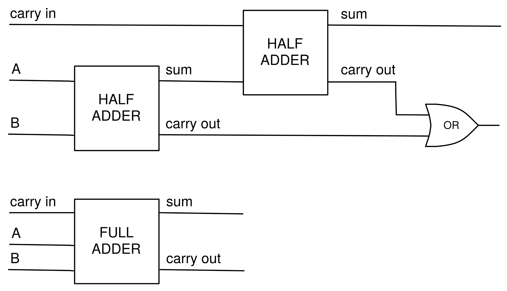

变量和基本类型

在本章中，我们将介绍 Python 中最重要和最基本的类型。什么是类型？它是由数据内容、其表示以及所有可能的操作组成的集合。在本书的后续部分，当我们在第八章：*类*中介绍类的概念时，我们将更精确地定义这一概念。

在本章中，我们将涵盖以下主题：

+   变量

+   数字类型

+   布尔值

+   字符串

# 第三章：2.1 变量

变量是 Python 对象的引用。它们通过赋值创建，例如：

```py
a = 1
diameter = 3.
height = 5.
cylinder = [diameter, height] # reference to a list
```

变量的名称可以由大写字母、小写字母、下划线`_`和数字组成。变量名不能以数字开头。请注意，变量名是区分大小写的。良好的变量命名是文档化工作的重要部分，因此我们建议使用具有描述性的变量名。

Python 有 33 个*保留关键字*，不能作为变量名使用（见*表 2.1*）。如果尝试将这些关键字作为变量名，将会引发语法错误：


表 2.1：保留的 Python 关键字

与其他编程语言不同，Python 中的变量不需要声明类型。类型是自动推导的：

```py
x = 3 # integer (int)
y = 'sunny' # string (str)
```

你可以通过多重赋值语句创建多个变量：

```py
a = b = c = 1 # a, b and c get the same value 1
```

变量在定义后也可以被修改：

```py
a = 1 
a = a + 1 # a gets the value 2 
a = 3 * a # a gets the value 6
```

最后两个语句可以通过结合这两种操作与赋值操作直接使用增量运算符来编写：

```py
a += 1 # same as a = a + 1 
a *= 3 # same as a = 3 * a
```

# 2.2 数字类型

在某些情况下，你将不得不处理数字，因此我们首先考虑 Python 中不同的数字类型形式。在数学中，我们区分自然数（ℕ）、整数（ℤ）、有理数（ℚ）、实数（ℝ）和复数（ℂ）。这些是无限集合。不同集合之间的运算有所不同，有时甚至没有定义。例如，通常在 ℤ 中进行除法操作可能不会得到一个整数——在 ℤ 中没有定义。

在 Python 中，像许多其他计算机语言一样，我们有数字类型：

+   数字类型`int`，它至少在理论上是整个 ℤ

+   数字类型`float`，它是 ℝ 的一个有限子集

+   数字类型`complex`，这是 ℂ 的一个有限子集

有限集合有最小值和最大值，并且两个数字之间有最小间隔；有关更多细节，请参见第 2.2.2 节，*浮点数*。

## 2.2.1 整数

最简单的数字类型是整数类型`int`。

### 整数

语句`k = 3`将变量`k`赋值为一个整数。

对整数应用`+`、`-`或`*`等运算符会返回一个整数。除法运算符`//`返回一个整数，而`/`返回一个`float`：

```py
6 // 2  # 3  an integer value
7 // 2  # 3
7 / 2   # 3.5  a float value
```

Python 中的整数集合是无限的；没有最大的整数。这里的限制是计算机的内存，而不是语言给出的固定值。

如果在前面的示例中，除法运算符（`/`）返回 3，则说明你没有安装正确的 Python 版本。

## 2.2.2 浮动点数

如果你在 Python 中执行语句`a = 3.0`，你创建了一个浮动点数（Python 类型：`float`）。这些数字形成有理数的有限子集，ℚ。

另外，常量也可以用指数表示法给出，如 `a = 30.0e-1` 或简写为 `a = 30.e-1`。符号 `e` 将指数与尾数分开，该表达式在数学表示中读作 。*浮动点数* 这个名称指的是这些数字的内部表示，并反映了在考虑广泛范围内的数字时，小数点的浮动位置。

对两个浮动点数，或一个整数与一个浮动点数应用基本的数学运算，如 `+`、`-`、`*` 和 `/`，将返回一个浮动点数。

浮动点数之间的运算很少会返回与有理数运算中预期的精确结果：

```py
0.4 - 0.3 # returns 0.10000000000000003
```

这个事实在比较浮动点数时非常重要：

```py
0.4 - 0.3 == 0.1 # returns False
```

这背后的原因可以通过查看浮动点数的内部表示来显现；另请参见第 15.2.6 节，*浮动点比较*。

### 浮动点表示

一个浮动点数由三个量表示：符号、尾数和指数：


其中* ![]* 和 *![]*。

*![*]被称为尾数，![]是基数，*e* 是指数，且![]。被称为尾数长度。条件![]使得表示是唯一的，并在二进制情况下（![]）节省了一个位。

存在两个浮动点零，![] 和 ![]，它们都由尾数  表示。

在典型的英特尔处理器上，![]。为了表示一个`float`类型的数字，使用 64 位，即 1 位用于符号，位用于尾数，位用于指数。因此，指数的上限是![]。

对于此数据，最小的可表示正数是

^(![)]，并且最大的 ^(![)]*.*

请注意，浮点数在  中并非等间隔分布。特别地，零附近有一个间隙（另见 [29]）。在  和第一个正数之间的距离是 **，而第一个和第二个之间的距离则较小，缩小了一个因子 。这种由标准化 ** 引起的效应在 *图 2.1* 中得到了可视化：


图 2.1：零处的浮点间隙。这里是 

这个间隙被等距填充，使用的是 *非规范化* 浮点数，并将此类结果四舍五入为这些数。非规范化浮点数具有最小的指数，并且不遵循标准化惯例 **。

### 无限和非数字

总共有  个浮点数。有时，数值算法计算的浮点数超出了这个范围。

这会导致数字溢出或下溢。在 NumPy 中，溢出结果会被赋值为特殊的浮点数 `inf`：

```py
exp(1000.) # inf 
a = inf
3 - a # -inf
3 + a # inf
```

使用 `inf` 可能会导致数学上未定义的结果。Python 会通过将结果赋值给另一个特殊的浮点数 `nan` 来表示这一点。`nan` 代表 *非数字*，即数学运算的未定义结果。为证明这一点，我们继续前面的例子：

```py
a + a # inf
a - a # nan 
a / a # nan
```

对于与 `nan` 和 `inf` 的操作，有一些特殊规则。例如，`nan` 与任何数（甚至是它自己）比较时，总是返回 `False`：

```py
x = nan 
x < 0 # False
x > 0 # False
x == x # False
```

请参见 *练习 4*，它展示了 `nan` 永远不等于它自身的某些令人惊讶的后果。

浮点数 `inf` 的行为更符合预期：

```py
0 < inf     # True 
inf <= inf  # True 
inf == inf  # True 
-inf < inf  # True 
inf - inf   # nan 
exp(-inf)   # 0 
exp(1 / inf)  # 1
```

检查 `nan` 和 `inf` 的一种方法是使用 `isnan` 和 `isinf` 函数。通常，当变量的值为 `nan` 或 `inf` 时，您希望直接作出反应。可以通过使用 NumPy 命令 `seterr` 来实现这一点。以下命令

```py
seterr(all = 'raise')
```

如果一个计算返回其中的某个值，则会引发 `FloatingPointError` 错误。

### 下溢 - 机器精度

下溢发生在操作结果是一个落入零附近间隙的有理数时；见 *图 2.1*。

*机器精度*，或称舍入单位，是使得  的最大数字，这样 。

请注意， 在当今大多数计算机上是这样的。您当前运行代码的机器上适用的值可以使用以下命令访问：

```py
import sys 
sys.float_info.epsilon # 2.220446049250313e-16 
```

变量`sys.float_info`包含关于浮动点类型在你机器上内部表示的更多信息。

函数`float`将其他类型转换为浮动点数（如果可能）。这个函数在将适当的字符串转换为数字时特别有用：

```py
a = float('1.356')
```

### NumPy 中的其他浮动点类型：

NumPy 还提供了其他浮动点类型，这些类型在其他编程语言中被称为双精度和单精度数字，分别是`float64`和`float32`：

```py
a = pi            # returns 3.141592653589793 
a1 = float64(a)   # returns 3.141592653589793
a2 = float32(a)   # returns 3.1415927 
a - a1            # returns 0.0 
a - a2            # returns -8.7422780126189537e-08
```

倒数第二行演示了`a`和`a1`在精度上没有差别。`a`与它的单精度对应物`a2`之间存在精度差异。

NumPy 函数`finfo`可以用来显示这些浮动点类型的信息：

```py
f32 = finfo(float32) 
f32.precision   # 6 (decimal digits) 
f64 = finfo(float64) 
f64.precision   # 15 (decimal digits) 
f = finfo(float) 
f.precision     # 15 (decimal digits) 
f64.max         # 1.7976931348623157e+308 (largest number) 
f32.max         # 3.4028235e+38 (largest number) 
help(finfo)     # Check for more options
```

## 2.2.3 复数：

复数是实数的扩展，广泛应用于许多科学和工程领域。

### 数学中的复数：

复数由两个浮动点数组成，一个是该数的实部 ，另一个是它的虚部 。在数学中，复数写作 ，其中 由 定义，称为*虚数单位*。共轭复数对 是 。

如果实部 为零，则该数字称为虚数。

### j 表示法：

在 Python 中，虚数通过在浮动点数后添加字母`j`来表示，例如，`z = 5.2j`。复数是由一个实数和一个虚数组成的，例如，`z = 3.5 + 5.2j`。

虽然在数学中，虚部表示为实数*b*与虚数单位 的乘积，但在 Python 中表示虚数并不是一个乘积：`j`只是一个后缀，用来表示该数是虚数。

这通过以下小实验展示：

```py
b = 5.2 
z = bj # returns a NameError 
z = b*j # returns a NameError
z = b*1j # is correct
```

方法`conjugate`返回`z`的共轭：

```py
z = 3.2 + 5.2j 
z.conjugate() # returns (3.2-5.2j)
```

### 实部和虚部：

你可以使用`real`和`imag`属性访问复数 的实部和虚部。这些属性是只读的；换句话说，它们不能被改变：

```py
z = 1j 
z.real # 0.0 
z.imag # 1.0 
z.imag = 2 # AttributeError: readonly attribute
```

不可能将复数转换为实数：

```py
z = 1 + 0j 
z == 1 # True 
float(z) # TypeError
```

有趣的是，`real`和`imag`属性以及共轭方法对复数数组同样适用；参见第 4.3.1 节，*数组属性*。我们通过计算*第 N 次*单位根来展示这一点，这些单位根是![]，即方程的解：

```py
from matplotlib.pyplot import *
N = 10
# the following vector contains the Nth roots of unity: 
unity_roots = array([exp(1j*2*pi*k/N) for k in range(N)])
# access all the real or imaginary parts with real or imag:
axes(aspect='equal')
plot(unity_roots.real, unity_roots.imag, 'o')
allclose(unity_roots**N, 1) # True
```

结果图显示了 10 个单位根。在*图 2.2*中，它通过标题和坐标轴标签进行补充，并与单位圆一起显示。（有关如何绘制图表的更多细节，请参见第六章：*绘图*。）


图 2.2：单位根与单位圆

当然，也可以混合使用前述方法，如以下示例所示：

```py
z = 3.2+5.2j 
(z + z.conjugate()) / 2\. # returns (3.2+0j) 
((z + z.conjugate()) / 2.).real # returns 3.2 
(z - z.conjugate()) / 2\. # returns 5.2j 
((z - z.conjugate()) / 2.).imag # returns 5.2 
sqrt(z * z.conjugate()) # returns (6.1057350089894991+0j)
```

# 2.3 布尔值

布尔值是一种数据类型，得名于*乔治·布尔*（1815-1864）。布尔变量只能取两个值，`True`或`False`。这种类型的主要用途是在逻辑表达式中。以下是一些示例：

```py
a = True 
b = 30 > 45 # b gets the value False
```

布尔表达式常常与`if`语句结合使用：

```py
x= 5
if x > 0:
 print("positive")
else:
 print("nonpositive")
```

## 2.3.1 布尔运算符

布尔操作通过关键字`and`、`or`和`not`来执行：

```py
True and False # False
False or True # True
(30 > 45) or (27 < 30) # True
not True # False
not (3 > 4) # True
```

运算符遵循一些优先级规则（参见第 1.3.5 节，*布尔表达式*），这些规则使得第三行和最后一行的括号变得不必要。然而，无论如何，使用括号是一种良好的实践，可以提高代码的可读性。

请注意，`and`运算符在以下布尔表达式中是隐式链式连接的：

```py
a < b < c     # same as: a < b and b < c 
a < b <= c    # same as: a < b and b <= c (less or equal)
a == b == c   # same as: a == b and b == c
```

## 2.3.2 布尔类型转换

大多数 Python 对象都可以转换为布尔值；这称为*布尔类型转换*。内置函数`bool`执行这种转换。需要注意的是，大多数对象都会转换为`True`，除了`0`、空元组、空列表、空字符串或空数组，这些都转换为`False`。


表 2.2：布尔值的类型转换规则

除非数组不含元素或仅包含一个元素，否则*不*可能将数组转换为布尔值；这一点在第 5.2.1 节，*布尔数组*中有进一步的解释。前面的表格（参见表 2.2：*布尔值类型转换规则*）总结了布尔类型转换的规则。

我们通过一些使用示例来演示这一点：

```py
bool([]) # False 
bool(0) # False 
bool(' ') # True 
bool('') # False 
bool('hello') # True 
bool(1.2) # True 
bool(array([1])) # True 
bool(array([1,2])) # Exception raised!
```

### 自动布尔类型转换

使用`if`语句时，如果是非布尔类型，将会自动将其转换为布尔值。换句话说，以下两个语句始终是等效的：

```py
if a:
 ...
if bool(a): # exactly the same as above
 ...
```

一个典型的例子是测试列表是否为空：

```py
# L is a list
if L:
    print("list not empty")
else:
    print("list is empty")
```

一个空列表或元组将返回`False`。

你也可以在`if`语句中使用变量，例如一个整数：

```py
# n is an integer
if n % 2:         # the modulo operator
    print("n is odd")
else:
    print("n is even")
```

请注意，我们使用了`%`进行*取模运算*，它返回整数除法后的余数。在这种情况下，它返回`0`或`1`作为除以 2 后的余数。

在这个最后的例子中，值`0`或`1`会被转换为`bool`；也请参见第 2.3.4 节，*布尔值和整数*。

布尔运算符`or`、`and`和`not`也会隐式地将其一些参数转换为布尔值。

## 2.3.3 `and`和`or`的返回值

请注意，运算符`and`和`or`并不一定会产生布尔值。这可以通过以下等式来解释：`*x* and *y*`等价于：

```py
def and_as_function(x,y):
    if not x:
        return x
    else:
        return y
```

相应地，表达式`x or y`等价于：

```py
def or_as_function(x,y):
    if x:
        return x
    else:
        return y
```

有趣的是，这意味着当执行语句`True or x`时，变量`x`甚至不需要被定义！`False and x`同样适用。

请注意，与数学逻辑中的对应运算符不同，这些运算符在 Python 中不再是交换律的。事实上，以下表达式并不等价：

```py
1 or 'a' # produces 1 
'a' or 1 # produces 'a'
```

## 2.3.4 布尔值和整数

实际上，布尔值和整数是相同的。唯一的区别在于`0`和`1`的字符串表示形式，在布尔值中，它们分别是`False`和`True`。这使得可以构造如下：

```py
def print_ispositive(x):
    possibilities = ['nonpositive or zero', 'positive']
    return f"x is {possibilities[x>0]}"
```

这个例子中的最后一行使用了字符串格式化，具体解释见第 2.4.3 节，*字符串格式化*。

我们指出，对于已经熟悉子类概念的读者，`bool`类型是`int`类型的子类（请参见第八章：*类*）。实际上，所有四个查询——`isinstance(True, bool)`、`isinstance(False, bool)`、`isinstance(True, int)`和`isinstance(False, int)`都返回值`True`（请参见第 3.7 节，*检查变量的类型*）。

即使是像`True+13`这样很少使用的语句也是正确的。

# 2.4 字符串

`string`类型是用于文本的类型：

```py
name = 'Johan Carlsson'
child = "Åsa is Johan Carlsson's daughter"
book = """Aunt Julia 
       and the Scriptwriter"""
```

字符串可以由单引号或双引号括起来。如果字符串包含多行，则必须用三个双引号`"""`或三个单引号`'''`括起来。

字符串可以通过简单的索引或切片来索引（请参见第三章：*容器类型*，了解关于切片的详细说明）：

```py
book[-1] # returns 'r' 
book[-12:] # returns 'Scriptwriter'
```

字符串是不可变的；也就是说，项不能被更改。它们与元组共享这个特性。命令**`book[1] = 'a'`**返回：

```py
TypeError: 'str' object does not support item assignment
```

## 2.4.1 转义序列和原始字符串

字符串`'\n'`用于插入换行符，`'\t'`用于在字符串中插入水平制表符（TAB）以对齐多行：

```py
print('Temperature\t20\tC\nPressure\t5\tPa')
```

这些字符串是*转义序列*的例子。转义序列总是以反斜杠`\`开始。多行字符串会自动包含转义序列：

```py
a=""" 
A multi-line 
example""" 
a # returns '\nA multi-line \nexample'
```

一个特殊的转义序列是`"\\"`，它表示文本中的反斜杠符号：

```py
latexfontsize="\\tiny"
print(latexfontsize) # prints \tiny
```

同样的结果可以通过使用*原始字符串*来实现：

```py
latexfs=r"\tiny" # returns "\tiny"
latexfontsize == latexfs # returns True
```

请注意，在原始字符串中，反斜杠保持在字符串中并用于转义某些特殊字符：

```py
print(r"\"") # returns \"
print(r"\\") # returns \
print(r"\") # returns an error (why?)
```

原始字符串是一种方便的工具，用于以可读的方式构建字符串。结果是相同的：

```py
r"\"" == '\\"'
r"She: \"I am my dad's girl\"" == 'She: \\"I am my dad\'s girl\\"'
```

## 2.4.2 字符串操作和字符串方法

多个字符串的相加会导致它们的连接：

```py
last_name = 'Carlsson'
first_name = 'Johanna'
full_name = first_name + ' ' + last_name
  # returns 'Johanna Carlsson'
```

因此，整数的乘法是重复加法：

```py
game = 2 * 'Yo' # returns 'YoYo'
```

对浮点数或复数的乘法未定义，并会导致`TypeError`。

当字符串进行比较时，采用字典顺序，大写形式排在相同字母的小写形式之前：

```py
'Anna' > 'Arvi' # returns false 
'ANNA' < 'anna'  # returns true 
'10B' < '11A'    # returns true
```

在众多字符串方法中，我们这里只提及最重要的几种：

+   **分割字符串**：该方法通过使用一个或多个空格作为分隔符生成一个列表。或者，可以通过指定特定的子字符串作为分隔符来传递一个参数：

```py
text = 'quod erat demonstrandum'
text.split() # returns ['quod', 'erat', 'demonstrandum']
table = 'Johan;Carlsson;19890327'
table.split(';') # returns ['Johan','Carlsson','19890327']
king = 'CarlXVIGustaf'
king.split('XVI')  # returns ['Carl','Gustaf']
```

+   **将列表连接到字符串**：这是分割操作的反向操作：

```py
sep = ';'
sep.join(['Johan','Carlsson','19890327'])   
# returns 'Johan;Carlsson;19890327'
```

+   **在字符串中搜索**：该方法返回字符串中给定搜索子字符串开始的第一个索引位置：

```py
birthday = '20101210'
birthday.find('10') # returns 2
```

如果搜索字符串未找到，方法的返回值是`-1`。

+   **字符串格式化**：该方法将变量的值或表达式的结果插入字符串中。它非常重要，以至于我们将以下小节专门讨论它。

## 2.4.3 字符串格式化

字符串格式化是将值插入给定字符串并确定其显示方式的过程。这可以通过多种方式实现。我们首先描述相关的字符串方法`format`，以及更现代的替代方法——所谓的*f-string*。

下面是一个关于使用 format 方法的例子：

```py
course_code = "NUMA01"
print("Course code: {}".format(course_code))    # Course code: NUMA01

```

这里是使用*f-string*的变体例子：

```py
course_code = "NUMA01"
print(f"Course code: {course_code}")            # Course code: NUMA01
```

`format`函数是一个字符串方法；它扫描字符串以查找占位符，这些占位符由花括号括起来。这些占位符根据`format`方法的参数以指定的方式进行替换。它们如何被替换，取决于每个`{}`对中定义的格式规范。格式规范由冒号`":"`作为前缀表示。

format 方法提供了一系列的可能性，根据对象的类型定制其格式化方式。在科学计算中，`float`类型的格式化说明符尤为重要。你可以选择标准的定点表示法`{:f}`或指数表示法`{:e}`：

```py
quantity = 33.45
print("{:f}".format(quantity)) # 33.450000
print("{:1.1f}".format(quantity)) # 33.5
print("{:.2e}".format(quantity)) # 3.35e+01
```

类似地，格式说明符也可以在 f-string 中使用：

```py
quantity = 33.45
print(f"{quantity:1.1f}")         # 33.5
```

格式说明符允许指定四舍五入精度（表示中小数点后的位数）。此外，还可以设置表示数字的符号总数，包括前导空格。

在这个例子中，获取其值的对象名称作为参数传递给`format`方法。第一个`{}`对会被第一个参数替换，后续的`{}`对会被后续的参数替换。或者，使用键值对语法也可能很方便：

```py
print("{name} {value:.1f}".format(name="quantity",value=quantity))
# prints "quantity 33.5"
```

这里处理了两个值——一个没有格式说明符的字符串`name`，和一个浮点数`value`，它以固定点格式打印，保留小数点后一位。（详细内容请参考完整的字符串格式化文档。）

**字符串中的大括号**

有时候，一个字符串可能包含一对大括号，但不应被视为`format`方法的占位符。在这种情况下，使用双大括号：

`r"we {} in LaTeX \begin{{equation}}".format('like')`

这将返回以下字符串：`'we like in LaTeX \\begin{equation}'`。

# 2.5 小结

在本章中，你了解了 Python 中的基本数据类型，并看到了相应的语法元素。我们将主要处理整数、浮点数和复数等数值类型。

布尔值在设置条件时是必需的，且通过使用字符串，我们常常传达结果和消息。

# 2.6 练习

**例 1：** 检查！[](img/454aa923-95fe-4033-881c-b68b24473d7c.png) 是否是该函数的零点：

**

**例 2：** 根据德摩根公式，以下公式成立：


选择数字*n*和*x*并在 Python 中验证公式。

**例 3：** 复数。以同样的方式验证欧拉公式：


**例 4：** 假设我们正试图检查一个发散序列的收敛性（这里，序列由递归关系定义： 和 ）：

```py
u = 1.0 # you have to use a float here!
uold = 10\. 
for iteration in range(2000):
   if not abs(u-uold) > 1.e-8:
      print('Convergence')
      break # sequence has converged
   uold = u
   u = 2*u
else:
   print('No convergence')
```

1.  由于序列不收敛，代码应打印

    `No convergence`消息。执行它来看看会发生什么。

1.  如果你替换掉这一行会发生什么？

```py
      if not abs(u-uold) > 1.e-8:
```

使用

```py
      if abs(u-uold) < 1.e-8:
```

它应该给出完全相同的结果，不是吗？再次运行代码查看会发生什么。

1.  如果你将`u=1.0`替换为`u=1`（没有小数点），会发生什么？运行代码来验证你的预测。

1.  解释这个代码的意外行为。

**例 5：** 一个蕴含式 *C = (A ⇒ B)* 是一个布尔表达式，定义如下：

+   *C*当*A*为`False`或*A*和*B*都为`True`时是`True`

+   *C*在其他情况下是`False`

编写一个 Python 函数`implication(A, B)`。

**例 6：** 这个练习是用来训练布尔运算的。两个二进制数字（位）通过一个称为**半加器**的逻辑装置相加。它生成一个进位位（下一个更高位的数字）和根据下表定义的和，半加器电路：

| **p** | **q** | **sum** | **carry** |
| --- | --- | --- | --- |
| 1 | 1 | 0 | 1 |
| 1 | 0 | 1 | 0 |
| 0 | 1 | 1 | 0 |
| 0 | 0 | 0 | 0 |

半加器操作的定义：


图 2.3：半加法器电路

全加法器由两个半加法器组成，它可以对两个二进制位和一个额外的进位位进行求和（另请参见下图）：



图 2.4：全加法器电路

编写一个实现半加法器的函数，并编写另一个实现全加法器的函数。测试这些函数。
