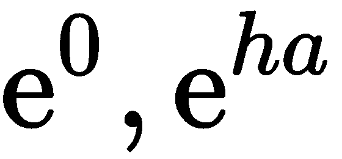

容器类型

容器类型用于将对象组合在一起。不同容器类型之间的主要区别在于如何访问单个元素以及如何定义操作。在本章中，我们讨论了诸如列表、元组、字典和集合等容器类型以及相关的概念，如索引技巧。更专业的容器，如 pandas DataFrame，将在第四章：*线性代数–数组*、第五章：*高级数组概念*，以及第十章：*序列和数据框*中介绍。

特别地，我们将涵盖以下主题：

+   列表

+   数组

+   元组

+   字典

+   集合

# 第四章：3.1 列表

在本节中，我们介绍列表——Python 中最常用的容器数据类型。使用列表，我们可以将多个甚至完全不同的 Python 对象放在一起。

列表，顾名思义，是由任何类型的对象组成的列表：

```py
L = ['a', 20.0, 5]
M = [3,['a', -3.0, 5]]
```

本例中的第一个列表包含一个字符串、一个浮动数和一个整数对象。第二个列表`M`包含另一个列表作为它的第二个元素。

每个对象通过分配给每个元素一个索引来进行枚举。列表中的第一个元素获得索引 0。这种*零基础索引*在数学表示法中经常使用。以零基础索引为例，考虑多项式系数的常规索引。

索引使我们可以访问在前面示例中定义的两个列表中的以下对象：

```py
L[1] # returns 20.0
L[0] # returns 'a'
M[1] # returns ['a',-3.0,5]
M[1][2] # returns 5
```

这里的括号表示法对应于数学公式中使用下标的方式。`L`是一个简单的列表，而`M`本身包含一个列表，因此你需要两个索引才能访问内列表的一个元素。

一个包含连续整数的列表可以通过命令`range`轻松生成：

```py
L=list(range(4)) 
# generates a list with four elements: [0, 1, 2 ,3]
```

更一般的用法是为该命令提供起始、停止和步长参数：

```py
L=list(range(17,29,4))  
# generates [17, 21, 25]
```

命令`len`返回列表的长度：

```py
len(L) # returns 3
```

## 3.1.1 切片

就像从一条面包中切下一片，列表也可以被切分成切片。将列表在`i`和`j`之间切割会创建一个新列表，其中包含从索引`i`开始、在`j`之前结束的元素。

对于切片，必须给出一个索引范围。`L[i:j]`意味着通过从`L[i]`开始到`L[j-1]`为止，创建一个新列表。换句话说，新列表是通过从`L`中删除前`i`个元素并取下一个`j-i`个元素来得到的。

这里，`L[i:]`表示移除第一个元素，`L[:i]`表示仅取前`i`个元素：

```py
L = ['C', 'l', 'o', 'u', 'd', 's']
L[1:5] # remove one element and take four from there:
# returns ['l', 'o', 'u', 'd']
```

你可以省略切片的第一个或最后一个界限：

```py
L = ['C', 'l', 'o', 'u', 'd', 's']
L[1:] # ['l', 'o', 'u', 'd', 's']
L[:5] # ['C', 'l', 'o', 'u', 'd']
L[:] # the entire list
```

Python 允许使用负数索引从右侧计数。特别地，元素`L[-1]`是列表`L`中的最后一个元素。类似地，`L[:-i]`表示移除最后***i***个元素，`L[-i:]`表示只取最后***i***个元素。这可以结合使用，如`L[i:-j]`表示移除前***i***个元素和最后***j***个元素。

这里是一个例子：

```py
L = ['C', 'l', 'o', 'u', 'd', 's']
L[-2:] # ['d', 's']
L[:-2] # ['C', 'l', 'o', 'u']
```

在范围中省略一个索引对应于ℝ中的半开区间。半开区间(∞, *a*)表示取所有严格小于*a*的数；这类似于语法`L[:j]`；更多示例请参见*图 3.1*：


图 3.1：一些典型的切片情况

请注意，*越界切片*时，你永远不会遇到索引错误。可能你会得到空列表：

```py
L = list(range(4)) # [0, 1, 2, 3]
L[4] # IndexError: list index out of range
L[1:100] # same as L[1:]
L[-100:-1] # same as L[:-1]
L[-100:100] # same as L[:]
L[5:0] # empty list []
L[-2:2] # empty list []
```

当使用可能变成负数的变量进行索引时要小心，因为这会完全改变切片。这可能导致意外的结果：

```py
a = [1,2,3]
for iteration in range(4): 
    print(sum(a[0:iteration-1]))
```

结果是`3`，`0`，`1`，`3`，而你期望的结果是`0`，`0`，`1`，`3`。

让我们总结一下切片的使用：

+   `L[i:]`表示取所有元素，除了前*i*个。

+   `L[:i]`表示取前*i*个元素。

+   `L[-i:]`表示取列表的最后*i*个元素。

+   `L[:-i]`表示取所有元素，除了最后*i*个。

### 步长

在计算切片时，你也可以指定步长，即从一个索引到另一个索引的步长。默认步长为`1`。

这里是一个例子：

```py
L = list(range(100))
L[:10:2] # [0, 2, 4, 6, 8]
L[::20] # [0, 20, 40, 60, 80]
L[10:20:3] # [10, 13, 16, 19]
```

请注意，步长也可以是负数：

```py
L[20:10:-3] # [20, 17, 14, 11]
```

也可以创建一个反转的新列表，使用负步长：

```py
L = [1, 2, 3]
R = L[::-1] # L is not modified
R # [3, 2, 1]
```

另外，你也可以使用方法`reverse`，该方法在第 3.1.4 节：*列表方法*中有详细说明。

## 3.1.2 修改列表

列表的典型操作是插入和删除元素以及列表连接。使用切片表示法，列表的插入和删除变得非常直观；删除就是用空列表`[]`替换列表的一部分：

```py
L = ['a', 1, 2, 3, 4]
L[2:3] = [] # ['a', 1, 3, 4]
L[3:] = [] # ['a', 1, 3]
```

插入意味着用要插入的列表替换空切片：

```py
L[1:1] = [1000, 2000] # ['a', 1000, 2000, 1, 3]
```

两个列表通过加法运算符`+`连接：

```py
L = [1, -17]
M = [-23.5, 18.3, 5.0]
L + M # gives [1, -17, 23.5, 18.3, 5.0]
```

将列表`n`次与自身连接，激发了使用乘法运算符`*`的需求：

```py
n = 3
n * [1.,17,3] # gives [1., 17, 3, 1., 17, 3, 1., 17, 3]
[0] * 5 # gives [0,0,0,0,0]
```

列表上没有算术运算，比如逐元素求和或除法。对于这些操作，我们使用数组；请参见第 3.2 节：数组概念简览。

## 3.1.3 属于列表

你可以使用关键字`in`和`not in`来确定一个元素是否属于列表，这类似于数学中的和：

```py
L = ['a', 1, 'b', 2]
'a' in L # True
3 in L # False
4 not in L # True
```

## 3.1.4 列表方法

一些有用的`list`类型方法汇集在以下*表 3.1*中：

| **命令** | **操作** |
| --- | --- |
| `list.append(x)` | 将`x`添加到列表的末尾。 |
| `list.extend(L)` | 将列表`L`的元素添加到列表末尾。 |
| `list.insert(i,x)` | 将`x`插入到位置`i`。 |
| `list.remove(x)` | 移除列表中第一个值为`x`的元素。 |
| `list.sort()` | 对列表项进行排序。 |
| `list.reverse()` | 反转列表中的元素。 |
| `list.pop()` | 移除列表中的最后一个元素。 |

表 3.1：列表数据类型的原地方法

这些方法是原地操作，即它们直接修改列表。

其他方法，如*表 3.2*中给出的那些，不会修改列表，而是返回一些信息或创建一个新列表对象：

| **命令** | **操作** |
| --- | --- |
| `list.count(x)` | 计算`x`在列表中出现的次数。 |
| `list.copy()` | 创建列表的副本。 |

表 3.2：返回新对象的列表数据类型方法

### 原地操作

大多数生成列表的方法都是原地操作。这些操作直接改变 Python 对象，而不会创建相同类型的新对象。通过查看以下示例`reverse`可以最清楚地理解：

```py
L = [1, 2, 3]
L.reverse() # the list L is now reversed
L # [3, 2, 1]
```

注意原地操作。你可能会忍不住写出以下代码：

```py
L=[3, 4, 4, 5]
newL = L.sort()
```

这是正确的 Python 代码。但原地操作会返回`None`，并改变列表。因此，例如，像使用`newL`作为（排序后的）列表那样，

```py
print(newL[0])
```

会导致错误：

```py
TypeError: 'NoneType' object is not subscriptable
```

在这里，我们展示了原地列表操作：

```py
L = [0, 1, 2, 3, 4]
L.append(5) # [0, 1, 2, 3, 4, 5]
L.reverse() # [5, 4, 3, 2, 1, 0]
L.sort() # [0, 1, 2, 3, 4, 5]
L.remove(0) # [1, 2, 3, 4, 5]
L.pop() # [1, 2, 3, 4]
L.pop() # [1, 2, 3]
L.extend(['a','b','c']) # [1, 2, 3, 'a', 'b', 'c']
```

`L` 被修改。方法`count`是一个生成新对象的示例：

```py
L.count(2) # returns 1
```

## 3.1.5 合并列表 – zip

一个特别有用的列表函数是`zip`。它可以将两个给定的列表通过配对原列表中的元素合并成一个新列表。结果是一个元组列表（请参见第 3.3 节：*元组*）：

```py
ind = [0,1,2,3,4]
color = ["red", "green", "blue", "alpha"]
list(zip(color,ind)) 
# gives [('red', 0), ('green', 1), ('blue', 2), ('alpha', 3)]
```

本例还展示了如果列表长度不一致会发生什么：压缩后的列表长度是两个输入列表中较短的那个。

函数`zip`创建一个特殊的可迭代对象，可以通过应用`list`函数将其转化为列表，如前面的示例所示。有关可迭代对象的更多细节，请参见第 9.3 节：*可迭代对象*。

## 3.1.6 列表推导式

构建列表的便捷方法是使用列表推导式，可能还带有条件。列表推导式的语法如下：

```py
[<expr> for <variable> in <list>]
```

或者更普遍地：

```py
[<expr> for <variable> in <list> if <condition>]
```

以下是一些示例：

```py
L = [2, 3, 10, 1, 5]
L2 = [x*2 for x in L] # [4, 6, 20, 2, 10]
L3 = [x*2 for x in L if 4 < x <= 10] # [20, 10]
```

可以在列表推导式中包含多个`for`循环：

```py
M = [[1,2,3],[4,5,6]]
flat = [M[i][j] for i in range(2) for j in range(3)] 
# returns [1, 2, 3, 4, 5, 6]
```

这在处理数组时尤其重要；详见第 3.2 节：*快速了解数组概念*。

列表推导式与集合的数学表示法紧密相关。比较![]和`L2 = [2*x for x in L]`。不过一个很大的区别是，列表是有序的，而集合不是；详见第 3.5 节：*集合*。

在完成对列表的理解后，我们将继续下一节，学习数组的相关内容。

# 3.2 快速了解数组的概念

NumPy 包提供了数组，它们是用于操作数学中的向量、矩阵或甚至更高阶张量的容器结构。在本节中，我们指出了数组与列表之间的相似性。但数组值得更广泛的介绍，这将在第四章：*线性代数——数组*，以及第五章：*高级数组概念*中详细讲解。

数组是通过函数`array`从列表构造的：

```py
v = array([1.,2.,3.])
A = array([[1.,2.,3.],[4.,5.,6.]])
```

要访问向量的元素，我们需要一个索引，而访问矩阵的元素需要两个索引：

```py
v[2]     # returns 3.0
A[1,2]   # returns 6.0
```

初看，数组与列表相似，但请注意，它们在一个基本方面是不同的，可以通过以下几点来解释：

+   对数组数据的访问与列表相似，使用方括号和切片。但对于表示矩阵的数组，使用双重索引。赋值给数组切片的列表可以用来修改数组：

```py
M = array([[1.,2.],[3.,4.]])
v = array([1., 2., 3.])
v[0] # 1
v[:2] # array([1.,2.])
M[0,1] # 2
v[:2] = [10, 20] # v is now array([10., 20., 3.])
```

+   获取向量中的元素数量，或矩阵的行数，可以使用函数`len`：

```py
len(v) # 3
```

+   数组只存储相同数值类型的元素（通常是`float`或`complex`，也可以是`int`）。

+   运算符`+`、`*`、`/`和`-`都是逐元素操作。函数`dot`以及在 Python 版本≥3.5 中，使用中缀运算符`@`来进行标量积和相应的矩阵操作。

+   与列表不同，数组没有`append`方法。尽管如此，有一些特殊方法可以通过堆叠较小的数组来构造数组；参见第 4.7 节：*堆叠*。一个相关的点是，数组不像列表那样具有弹性；你不能使用切片来改变它们的长度。

+   向量切片是视图，即它们可以用来修改原始数组；参见第 5.1 节：*数组视图与副本*。

在本节中，我们快速了解了容器类型`array`。它在科学计算中非常重要，以至于我们将专门用两章内容来详细讲解，它还将涉及更多的方面；参见第四章：*线性代数——数组*，以及第五章：*高级数组概念*。

# 3.3 元组

元组是不可变的列表。不可变意味着它不能被修改。元组是由逗号分隔的对象序列（没有括号的列表）。为了增加可读性，通常将元组括在一对圆括号中：

```py
my_tuple = 1, 2, 3     # our first tuple
my_tuple = (1, 2, 3)   # the same
my_tuple = 1, 2, 3,    # again the same
len(my_tuple) # 3, same as for lists
my_tuple[0] = 'a'   # error! tuples are immutable
```

省略圆括号可能会产生副作用；请看下面的示例：

```py
1, 2 == 3, 4 # returns (1, False, 4) 
(1, 2) == (3, 4) # returns False
```

逗号表示该对象是一个元组：

```py
singleton = 1,   # note the comma
len(singleton)   # 1
singleton = (1,) # this creates the same tuple
```

元组在一组值需要一起使用时很有用；例如，它们用于从函数返回多个值。参见第 7.3 节：*返回值*。

## 3.3.1 打包与解包变量

你可以通过解包列表或元组来一次性赋值多个变量：

```py
a, b = 0, 1 # a gets 0 and b gets 1
a, b = [0, 1] # exactly the same effect
(a, b) = 0, 1 # same
[a,b] = [0,1] # same thing
```

使用打包和解包来交换两个变量的内容：

```py
a, b = b, a
```

# 3.4 字典

列表、元组和数组是有序的对象集合。单独的对象根据它们在列表中的位置被插入、访问和处理。另一方面，字典是无序的键值对集合。你通过键来访问字典数据。

## 3.4.1 创建和修改字典

例如，我们可以创建一个包含机械学中刚体数据的字典，如下所示：

```py
truck_wheel = {'name':'wheel','mass':5.7,
               'Ix':20.0,'Iy':1.,'Iz':17.,
               'center of mass':[0.,0.,0.]}
```

键/值对由冒号`:`表示。这些对通过逗号分隔，并列在一对大括号`{}`内。

单个元素通过它们的键进行访问：

```py
truck_wheel['name']   # returns 'wheel'
truck_wheel['mass']   # returns 5.7
```

新对象通过创建新键被添加到字典中：

```py
truck_wheel['Ixy'] = 0.0
```

字典也用于向函数提供参数（更多信息请参见第七章，*函数*中的第 7.2 节：*参数和实参*）。

字典中的键可以是字符串、函数、包含不可变元素的元组以及类等。键**不能**是列表或数组。

`dict`命令从包含键/值对的列表中生成字典：

```py
truck_wheel = dict([('name','wheel'),('mass',5.7),       
                    ('Ix',20.0), ('Iy',1.), ('Iz',17.), 
                    ('center of mass',[0.,0.,0.])])
```

`zip`函数在此情况下可能会很有用；见第 3.15 节：*合并列表–zip*。

## 3.4.2 遍历字典

遍历字典的方式主要有三种：

+   通过键：

```py
for key in truck_wheel.keys():
    print(key) # prints (in any order) 'Ix', 'Iy', 'name',...
```

或者等效地：

```py
for key in truck_wheel:
    print(key) # prints (in any order) 'Ix', 'Iy', 'name',...
```

+   通过值：

```py
for value in truck_wheel.values():
    print(value) 
    # prints (in any order) 1.0, 20.0, 17.0, 'wheel', ...
```

+   通过项目，即键/值对：

```py
for item in truck_wheel.items():
    print(item) 
    # prints (in any order) ('Iy', 1.0), ('Ix, 20.0),...
```

请参阅第 14.4 节：*架子*，了解用于文件访问的特殊字典对象。

# 3.5 集合

本节介绍的最后一个容器对象由数据类型`set`定义。

集合是与数学集合共享属性和操作的容器。数学集合是由不同对象组成的集合。就像数学中一样，在 Python 中，集合的元素也被列在一对大括号内。

这里有一些数学集合表达式：


这里是它们的 Python 对应项：

```py
A = {1,2,3,4}
B = {5}
C = A.union(B)   # returns{1,2,3,4,5}
D = A.intersection(C)   # returns {1,2,3,4}
E = C.difference(A)   # returns {5}
5 in C   # returns True
```

集合中只能包含一个元素，这与上述定义一致：

```py
A = {1,2,3,3,3}
B = {1,2,3}
A == B # returns True
```

此外，集合是无序的；也就是说，集合中元素的顺序是未定义的：

```py
A = {1,2,3}
B = {1,3,2}
A == B # returns True
```

Python 中的集合可以包含所有类型的不可变对象，即数字对象、字符串和布尔值。

存在`union`和`intersection`方法，分别对应数学中的并集和交集操作：

```py
A={1,2,3,4}
A.union({5})
A.intersection({2,4,6}) # returns {2, 4}
```

此外，集合可以使用`issubset`和`issuperset`方法进行比较：

```py
{2,4}.issubset({1,2,3,4,5}) # returns True
{1,2,3,4,5}.issuperset({2,4}) # returns True
```

空集合在 Python 中通过`empty_set=set([])`定义，而不是通过`{}`，后者会定义一个空字典！

# 3.6 容器转换

我们在以下*表 3.3*中总结了迄今为止介绍的容器类型的最重要属性。（数组将在第四章：*线性代数–数组*中单独讨论）：

| **类型** | **访问方式** | **顺序** | **重复值** | **可变性** |
| --- | --- | --- | --- | --- |
| 列表 | 通过索引 | 是 | 是 | 是 |
| 元组 | 通过索引 | 是 | 是 | 否 |
| 字典 | 通过键 | 否 | 是 | 是 |
| 集合 | 否 | 否 | 否 | 是 |

表 3.3: 容器类型

正如你在前面的表格中看到的，访问容器元素的方式是有区别的，集合和字典是无序的。

由于各种容器类型的属性不同，我们经常将一种类型转换为另一种类型（见 *表 3.4*）：

| **容器类型** | **语法** |
| --- | --- |
| 列表 → 元组 | `tuple([1, 2, 3])` |
| 元组 → 列表 | `list((1, 2, 3))` |
| 列表，元组 → 集合 | `set([1, 2]), set((1, ))` |
| 集合 → 列表 | `list({1, 2 ,3})` |
| 字典 → 列表 | `{'a':4}.values()` |
| 列表 → 字典 | - |

表 3.4: 容器类型转换规则

在本节中，我们了解了如何转换容器类型。在第二章：*变量与基本类型*，我们了解了如何转换更基础的数据类型，例如数字。所以，现在是时候考虑如何实际检查一个变量的数据类型，这将是下一节的主题。

# 3.7 检查变量类型

查看变量类型的直接方式是使用命令 `type`：

```py
label = 'local error'
type(label) # returns str
x = [1, 2] # list
type(x) # returns list
```

然而，如果你想检查一个变量是否属于某种类型，应该使用 `isinstance`（而不是使用 `type` 比较类型）：

```py
isinstance(x, list) # True
```

使用 `isinstance` 的理由在阅读过第 8.5 节：*子类化与继承*后变得更加明显。简而言之，不同的类型往往与某个基础类型共享一些共同的属性。经典的例子是 `bool` 类型，它是通过从更通用的 `int` 类型继承得到的。在这种情况下，我们看到如何更通用地使用 `isinstance` 命令：

```py
test = True
isinstance(test, bool) # True
isinstance(test, int) # True
type(test) == int # False
type(test) == bool # True
```

因此，为了确保变量 `test` 可以像整数一样使用——尽管具体类型可能无关紧要——你应该检查它是否是 `int` 的实例：

```py
if isinstance(test, int): print("The variable is an integer")
```

Python 不是一种强类型语言。这意味着对象的识别依据其功能，而不是其类型。例如，如果你有一个字符串操作函数，该函数通过使用 `len` 方法作用于一个对象，那么你的函数可能对任何实现了 `len` 方法的对象都有效。

到目前为止，我们已经遇到了不同的数据类型：`float`，`int`，`bool`，`complex`，`list`，`tuple`，`module`，`function`，`str`，`dict` 和 `array`。

# 3.8 总结

在这一章中，你学习了如何使用容器类型，主要是列表。了解如何填充这些容器以及如何访问和管理其中的内容非常重要。我们看到，访问方式可以是通过位置或通过关键字。

我们将在下一章的数组部分再次遇到切片这一重要概念。这些是专门为数学运算设计的容器。

# 3.9 练习

**例 1：** 执行以下语句：

```py
L = [1, 2]
L3 = 3*L
```

1.  `L3` 的内容是什么？

1.  尝试预测以下命令的结果：

```py
L3[0]
L3[-1]
L3[10]
```

1.  以下命令的作用是什么？

```py
L4 = [k**2 for k in L3]
```

1.  将 `L3` 和 `L4` 连接成一个新的列表 `L5`。

**Ex. 2:** 使用 `range` 命令和列表推导式生成一个包含 100 个等距值的列表，范围从 0 到 1。

**Ex. 3:** 假设以下信号存储在一个列表中：

```py
L = [0,1,2,1,0,-1,-2,-1,0]
```

以下结果是什么？

```py
L[0]
L[-1]
L[:-1]
L + L[1:-1] + L
L[2:2] = [-3]
L[3:4] = []
L[2:5] = [-5]
```

仅通过检查来做这个练习，也就是说，不使用 Python shell。

**Ex. 4:** 考虑以下 Python 语句：

```py
L = [n-m/2 for n in range(m)]
ans = 1 + L[0] + L[-1]
```

并假设变量 `m` 已经被赋值为一个整数。`ans` 的值是多少？在不执行 Python 语句的情况下回答这个问题。

**Ex. 5:** 考虑递归公式：


1.  创建一个列表 `u`。将其前面三个元素分别存储为三个值  和 。这些值表示给定公式中的起始值  和 。根据递归公式构建完整的列表。

1.  构建第二个列表 `td`，将值存储为 **，其中 。绘制 `td` 与 `u` 的图（见 第 6.1 节：*绘制图表*）。再绘制第二张图，展示差异，即 ，其中  表示 `td` 向量中的值。设置轴标签和标题。

递归是一个多步公式，用于求解具有初始值  的微分方程 。

![] 近似于 ![]。

**Ex. 6:** 假设  和  是集合。集合  被称为这两个集合的对称差。编写一个函数来执行此操作。将你的结果与以下命令的结果进行比较：

```py
A.symmetric_difference(B).
```

**Ex. 7:** 在 Python 中验证空集合是任何集合的子集这一说法。

**Ex. 8:** 研究集合的其他操作。你可以使用 `IPython` 的命令自动补全功能找到这些操作的完整列表。特别是，研究 `update` 和 `intersection_update` 方法。`intersection` 和 `intersection_update` 有什么区别？
