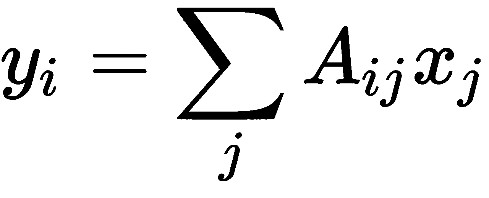
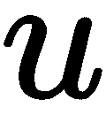

线性代数 - 数组

线性代数是计算数学中的一个基本组成部分。线性代数的对象是向量和矩阵。NumPy 包包含了处理这些对象所需的所有工具。

第一个任务是构建矩阵和向量，或通过切片修改现有的矩阵和向量。另一个主要任务是点积运算，它包含了大多数线性代数运算（标量积、矩阵-向量积和矩阵-矩阵积）。最后，提供了多种方法来解决线性问题。

本章节将涵盖以下主题：

+   数组类型概述

+   数学预备知识

+   数组类型

+   访问数组元素

+   构造数组的函数

+   访问和更改形状

+   堆叠

+   对数组进行操作的函数

+   SciPy 中的线性代数方法

# 第五章：4.1 数组类型概述

对于急于了解的读者，以下是如何使用数组的简要介绍。不过需要注意的是，数组的行为一开始可能会让人感到惊讶，因此我们建议在阅读完本介绍部分后继续阅读。

再次提醒，本章节的呈现方式假设你已经导入了 NumPy 模块，正如本书其他地方所假设的那样：

```py
from numpy import *
```

通过导入 NumPy，我们可以访问数据类型`ndarray`，将在接下来的章节中进行描述。

## 4.1.1 向量和矩阵

创建向量就像使用`array`函数将一个列表转换为数组一样简单：

```py
v = array([1.,2.,3.])
```

对象`v`现在是一个向量，表现得很像线性代数中的向量。我们已经在第 3.2 节中强调了它与 Python 中的列表对象的区别：*快速了解数组的概念*。

这里是一些对向量进行基本线性代数运算的示例：

```py
# two vectors with three components
v1 = array([1., 2., 3.])
v2 = array([2, 0, 1.])

# scalar multiplications/divisions
2*v1 # array([2., 4., 6.])
v1/2 # array([0.5, 1., 1.5])

# linear combinations
3*v1 # array([ 3., 6., 9.])
3*v1 + 2*v2 # array([ 7., 6., 11.])

# norm
from numpy.linalg import norm
norm(v1) # 3.7416573867739413
# scalar product
dot(v1, v2) # 5.0
v1 @ v2 # 5.0 ; alternative formulation
```

请注意，所有基本算术操作都是按元素进行的：

```py
# elementwise operations:
v1 * v2 # array([2., 0., 3.])
v2 / v1 # array([2.,0.,.333333])
v1 - v2 # array([-1., 2., 2.])/
v1 + v2 # array([ 3., 2., 4.])
```

还有一些函数也按元素对数组进行操作：

```py
cos(v1) # cosine, elementwise: array([ 0.5403, -0.4161, -0.9899])
```

本主题将在第 4.8 节中讲解：*对数组进行操作的函数*。

矩阵的创建与向量类似，只是它是从列表的列表中创建的：

```py
M = array([[1.,2],[0.,1]])
```

请注意，向量并不是列矩阵或行矩阵。一个向量、一个，以及一个矩阵是三种不同的对象，即使它们包含相同的数据。

要创建一个行矩阵，包含与向量`v = array([1., 2., 1.])`相同的数据，我们应用`reshape`方法：

```py
R = v.reshape((1,3))
shape(R)                # (1,3): this is a row matrix
```

对应的列矩阵通过`reshape`以相应的方式获得：

```py
C = v.reshape((3, 1))
shape(C) # (3,1): this is a column matrix
```

在学习了如何创建数组并看到基本的数组操作后，我们现在将学习如何通过索引和切片来访问数组元素和子数组。

## 4.1.2 索引和切片

索引和切片与列表中的对应操作类似。主要区别在于，当数组是矩阵时，可能会有多个索引或切片。该主题将在第 4.4.1 节：*基本数组切片*中深入讨论；在这里，我们仅提供一些索引和切片的示例：

```py
v = array([1., 2., 3])
M = array([[1., 2],[3., 4]])

v[0] # works as for lists
v[1:] # array([2., 3.])

M[0, 0] # 1.
M[1:] # returns the matrix array([[3., 4]])
M[1] # returns the vector array([3., 4.])

# access
v[0] # 1.
v[0] = 10

# slices
v[:2] # array([10., 2.])
v[:2] = [0, 1] # now v == array([0., 1., 3.])
v[:2] = [1, 2, 3] # error!
```

由于数组是所有计算线性代数任务的基本数据类型，本文本节将展示一些示例、点积及线性方程组的解法。

## 4.1.3 线性代数操作

执行大多数常见线性代数操作的关键运算符是 Python 函数`dot`。它用于矩阵-向量乘法（有关详细信息，请参阅第 4.2.4 节：*点积操作*）：

```py
dot(M, v) # matrix vector multiplication; returns a vector
M @ v # alternative formulation
```

它可以用来计算两个向量之间的标量积：

```py
dot(v, w) 
# scalar product; the result is a scalar
v @ w # alternative formulation
```

最后，它用于计算矩阵-矩阵乘积：

```py
dot(M, N) # results in a matrix
M @ N # alternative formulation
```

### 求解线性系统

如果![]是矩阵，![]是向量，你可以求解线性方程组


使用线性代数子模块`numpy.linalg`中的`solve`函数：

```py
from numpy.linalg import solve
x = solve(A, b)
```

例如，求解


执行以下 Python 语句：

```py
from numpy.linalg import solve
A = array([[1., 2.], [3., 4.]])
b = array([1., 4.])
x = solve(A, b)
allclose(dot(A, x), b) # True
allclose(A @ x, b) # alternative formulation
```

命令`allclose`用于比较两个向量。如果它们足够接近，该命令返回`True`。可以选择设置容差值。有关与线性方程组相关的更多方法，请参阅第 4.9 节：*SciPy 中的线性代数方法*。

现在，你已经看到了在 Python 中使用数组的第一种基本方式。在接下来的章节中，我们将向你展示更多细节及其基本原理。

# 4.2 数学基础

为了理解数组在 NumPy 中的工作原理，了解通过索引访问张量（矩阵和向量）元素与通过提供参数评估数学函数之间的数学关系非常有用。我们还将在本节中介绍点积作为归约算子的推广。

## 4.2.1 将数组视为函数

数组可以从多个不同的角度进行考虑。如果你希望从数学角度理解这一概念，可能会通过将数组类比为多个变量的函数来获益。这个视角将在后续讲解广播概念时再次提到，第 5.5 节：*广播*。

例如，选择给定向量中的一个分量，在中可能被视为从到的函数，其中我们定义集合：


在这里，集合  有 *n* 个元素。Python 函数 `range` 生成 *![*]。

另一方面，选择一个给定矩阵的元素是一个有两个参数的函数，其值域为 。从一个 ** 矩阵中选择特定元素，因此可以看作是一个从  到  的函数。

## 4.2.2 操作是逐元素的

NumPy 数组本质上被当作数学函数来处理。特别是对于操作来说是这样。考虑两个定义在同一域并且取实值的函数， 和 。这两个函数的乘积  被定义为逐点乘积，即：


请注意，这种构造对于两个函数之间的任何操作都是可能的。对于一个在两个标量之间定义的任意操作，我们这里用  表示，可以将  定义如下：


这一看似无害的言论让我们理解了 NumPy 对操作的立场；所有操作在数组中都是逐元素的。例如，两个矩阵之间的乘积， 和 ，就像函数一样，其定义如下：


## 4.2.3 形状和维度数

这里有一个明确的区分：

+   *标量*：没有参数的函数

+   *向量*：一个具有一个参数的函数

+   *矩阵*：具有两个参数的函数

+   *高阶张量*：具有两个以上参数的函数

以下内容中，维度数是一个函数的参数个数。形状本质上对应于一个函数的定义域。

例如，一个大小为 *n* 的向量是一个从集合  到  的函数。因此，它的定义域是 。它的形状定义为单例 (*n*,)。类似地，大小为  的矩阵是一个定义在  上的函数。相应的形状就是一对 (*m*, *n*)。数组的形状由函数 `numpy.shape` 获取，维度数由函数 `numpy.ndim` 获取；请参见 第 4.6 节：*访问和更改形状*。

## 4.2.4 点积操作

将数组视为函数，虽然非常强大，但完全忽略了我们熟悉的线性代数结构，即矩阵-向量和矩阵-矩阵操作。幸运的是，这些线性代数操作可以都写成类似的统一形式：

向量-向量操作：


矩阵-向量操作：



矩阵-矩阵操作：


向量-矩阵操作：


本质的数学概念是“约简”（reduction）。对于矩阵-向量操作，约简由以下公式给出：


通常情况下，在两个张量之间定义的约简操作，分别是  和 ，它们的维度分别是  和 ，可以定义为：


显然，张量的形状必须与该操作兼容才能产生

这要求对于矩阵-矩阵乘法也很熟悉。乘法 

矩阵  和 ** 之间的操作，只有当  的列数等于 ** 的行数时才有意义。

约简操作的另一个结果是它生成了一个具有  维度的新张量。在*表 4.1*中，我们收集了涉及矩阵和向量的约简操作输出：

| **** | **** | **** |
| --- | --- | --- |
|  |  |  |
|  |  |  |
|  |  |  |
|  |  |  |

​表 4.1：涉及矩阵和向量的约简操作输出

在 Python 中，所有的约简操作都可以通过 `dot` 函数或 `@` 操作符来执行：

```py
angle = pi/3
M = array([[cos(angle), -sin(angle)], 
           [sin(angle), cos(angle)]])
v = array([1., 0.])
y = dot(M, v)
```

在 Python 3.5 及更高版本中，点积可以用其运算符形式`dot(M, v)`表示，或者使用中缀符号表示`M @ v`。从现在起，我们将坚持使用更方便的中缀符号；如果需要其他形式，您可以修改示例。然而，我们需要注意的是，`dot`会在其参数类型为其他可以转换为数组的类型（如列表或浮点数）时执行类型转换。而中缀运算符`@`则不具有这个特性。

乘法运算符`*`始终是逐元素的。它与点积操作无关。即使**是矩阵，且*是向量，`A*v`仍然是合法的操作。这将在第 5.5 节中解释：*广播*。

在本节中，我们介绍了在数学中使用数组与矩阵和向量的结合，并解释了相关的操作。特别地，我们解释了科学计算中最核心的操作——点积。接下来，我们将转向数组数据类型`ndarray`及其更一般的方法。

# 4.3 数组类型

用于操作向量、矩阵以及更一般张量的对象在 NumPy 中被称为 ndarray，简称数组。在本节中，我们将探讨它们的基本属性、如何创建它们以及如何访问其信息。

## 4.3.1 数组属性

数组本质上由三个属性来表征，这些属性在*表 4.2*中进行了描述。

| **名称** | **描述** |
| --- | --- |
| `shape` | 该属性描述数据应如何解释，例如作为向量、矩阵或更高阶张量，并给出相应的维度。可以通过`shape`属性访问该值。 |
| `dtype` | 该属性给出基础数据的类型（如浮点数、复数、整数等）。 |
| `strides` | 此属性指定数据应该如何读取。例如，一个矩阵可以按照列顺序（FORTRAN 约定）或行顺序（C 约定）连续存储在内存中。该属性是一个元组，包含到达下一行和下一列时需要跳过的字节数。它甚至允许对内存中的数据进行更灵活的解释，这也使得数组视图成为可能。 |

表 4.2：数组的三个特征属性

例如，考虑以下数组：

```py
A = array([[1, 2, 3], [3, 4, 6]])
A.shape   # (2, 3)
A.dtype   # dtype('int64')
A.strides # (24, 8)
```

它的元素类型为`'int64'`，即它们在内存中占用 64 位或 8 个字节。整个数组按行存储在内存中。从`A[0, 0]`到下一行第一个元素`A[1,0]`的内存距离是 24 个字节（即三个矩阵元素）。相应地，`A[0,0]`和`A[0,1]`之间的内存距离是 8 个字节（即一个矩阵元素）。这些值存储在`strides`属性中。

## 4.3.2 从列表创建数组

创建数组的一般方法是使用 `array` 函数。创建实值向量的语法如下：

```py
V = array([1., 2., 1.], dtype=float)
```

要创建一个具有相同数据的复数向量，可以使用：

```py
V = array([1., 2., 1.], dtype=complex)
```

如果未指定类型，则会猜测类型。`array` 函数会选择允许存储所有指定值的类型：

```py
V = array([1, 2]) # [1, 2] is a list of integers
V.dtype # int64
V = array([1., 2]) # [1., 2] mix float/integer
V.dtype # float64
V = array([1\. + 0j, 2.]) # mix float/complex
V.dtype # complex128
```

NumPy 会默默地将浮点数转换为整数，这可能会导致意外的结果：

```py
a = array([1, 2, 3])
a[0] = 0.5
a # now: array([0, 2, 3])
```

同样，常见的、通常是意外的数组类型转换发生在从 `complex` 到 `float` 之间。

### **数组和 Python 括号**

如我们在 第 1.2.2 节：*行连接* 中注意到，Python 允许在某些括号或圆括号没有关闭时换行。这为数组创建提供了方便的语法，使其更加符合人眼的审美：

```py
# the identity matrix in 2D
Id = array([[1., 0.], [0., 1.]])
# Python allows this:
Id = array([[1., 0.],
            [0., 1.]])
# which is more readable
```

到目前为止，你已经看到数组和列表在定义和使用上的许多区别。相比之下，访问数组元素似乎与访问列表元素非常相似。但尤其是多个索引的使用以及切片操作结果的对象，需要我们更加详细地研究这些问题。

# 4.4 访问数组条目

数组条目通过索引访问。与向量系数不同，访问矩阵系数需要两个索引。这些索引放在一对括号中。这使得数组语法与列表的列表有所区别。在后者中，需要两对括号来访问元素。

```py
M = array([[1., 2.],[3., 4.]])
M[0, 0] # first row, first column: 1.0
M[-1, 0] # last row, first column: 3.0
```

现在我们更详细地来看一下双重索引和切片的使用。

## 4.4.1 基本数组切片

切片与列表的切片类似（另见 第 3.1.1 节：*切片*），不过它们现在可能存在多个维度：

+   `M[i,:]` 是由行  填充的向量，来自 *.*

+   `M[:,j]` 是由列填充的向量  来自 *.*

+   `M[2:4,:]` 是对行的 `2:4` 切片。

+   `M[2:4,1:4]` 是行和列的切片。

矩阵切片的结果见 *图 4.1*：


图 4.1：矩阵切片的结果

如果省略索引或切片，NumPy 会假定你只是在取行。`M[3]` 是一个向量，它是对 M 的第三行的视图，而 `M[1:3]` 是一个矩阵，它是对 M 的第二行和第三行的视图：

修改切片的元素会影响整个数组（另见 第 5.1 节：*数组视图和副本*）：

```py
v = array([1., 2., 3.])
v1 = v[:2] # v1 is array([1., 2.])
v1[0] = 0\. # if v1 is changed ...
v # ... v is changed too: array([0., 2., 3.])
```

一般切片规则见 *表 4.3*：

| **访问** | **ndim** | **类型** |
| --- | --- | --- |
| 索引, 索引 | 0 | 标量 |
| 切片, 索引 | 1 | 向量 |
| 索引, 切片 | 1 | 向量 |
| 切片, 切片 | 2 | 矩阵 |

表 4.3：一般切片规则

数组 `M` 的切片操作结果（形状为 *(4, 4)*）见 *表 4.4*：

| **访问** | **形状** | **维度** | **类型** |
| --- | --- | --- | --- |
| `M[:2, 1:-1]` | (2,2) | 2 | 矩阵 |
| `M[1,:]` | (4,) | 1 | 向量 |
| `M[1,1]` | () | 0 | 标量 |
| `M[1:2,:]` | (1,4) | 2 | 矩阵 |
| `M[1:2, 1:2]` | (1,1) | 2 | 矩阵 |

表 4.4：形状为 (4,4) 的数组 M 的切片操作结果

## 4.4.2 使用切片更改数组

你可以使用切片或直接访问来更改数组。以下示例仅更改一个元素，位于  矩阵  中：

```py
M[1, 2] = 2.0 # scalar
```

同样，我们也可以更改矩阵中的一整行：

```py
M[2, :] = [1., 2., 3.] # vector
```

同样，我们也可以替换整个子矩阵：

```py
M[1:3, :] = array([[1., 2., 3.],[-1.,-2., -3.]])
```

列矩阵和向量之间是有区别的。以下使用列矩阵的赋值不会报错：

```py
M[1:4, 1:2] = array([[1.],[0.],[-1.0]]) 
```

而使用向量赋值时会返回 `ValueError`：

```py
M[1:4, 1:2] = array([1., 0., -1.0]) #  error
```

一般的切片规则如 *表 4.3* 所示。前面的矩阵和向量必须具有适当的大小，以适应矩阵 。你还可以使用广播规则（参见 第 5.5 节：*广播*）来确定替换数组的允许大小。如果替换数组的形状不正确，将引发 `ValueError` 异常。

我们已经看到如何通过切片从其他数组中构造数组。在下一节中，我们将考虑一些直接创建和初始化数组的特殊 NumPy 函数。

# 4.5 构造数组的函数

设置数组的常见方法是通过列表。但也有一些方便的方法用于生成特殊数组，这些方法在 *表 4.5* 中给出：

| **方法** | **形状** | **生成的结果** |
| --- | --- | --- |
| `zeros((n,m))` | *(n,m)* | 填充了 0 的矩阵 |
| `ones((n,m))` | *(n,m)* | 填充了 1 的矩阵 |
| `full((n,m),q)` | *(n,m)* | 填充了  的矩阵 |
| `diag(v,k)` | *(n,n)* | 来自向量的（下、上）对角矩阵  |
| `random.rand(n,m)` | *(n,m)* | 填充了均匀分布的随机数（在 `(0,1)` 之间）的矩阵 |
| `arange(n)` | *(n,)* | 前 n 个整数  |
| `linspace(a,b,n)` | *(n,)* | 向量，包含在  和  之间均匀分布的 n 个点 |

表 4.5：创建数组的命令

这些命令可能会接受额外的参数。特别地，命令 `zeros`、`ones`、`full` 和 `arange` 接受 `dtype` 作为可选参数。默认类型是 `float`，但 `arange` 除外。也有一些方法，如 `zeros_like` 和 `ones_like`，它们是前述命令的轻微变体。例如，命令 `zeros_like(A)` 等价于 `zeros(shape(A))`。

函数 `identity` 用于构造给定大小的单位矩阵：

```py
I = identity(3)
```

该命令与以下命令相同：

```py
I = array([[ 1., 0., 0.],
           [ 0., 1., 0.],
           [ 0., 0., 1.]])
```

# 4.6 访问和改变形状

维度数是区分向量和矩阵的标志。*形状* 是区分不同大小的向量或矩阵的标志。在这一节中，我们将研究如何获取和改变数组的形状。

## 4.6.1 `shape` 函数

矩阵的形状是其维度的元组。一个  矩阵的形状是元组 `(n, m)`。可以通过 `shape` 函数获得：

```py
M = identity(3)
shape(M) # (3, 3)
```

或者，通过其属性来简单获取

```py
M.shape  # (3, 3)
```

然而，使用 `shape` 作为函数而不是属性的优点在于，函数也可以用于标量和列表。这在代码需要同时处理标量和数组时非常有用：

```py
shape(1.) # ()
shape([1,2]) # (2,)
shape([[1,2]]) # (1,2)
```

对于一个向量，形状是一个包含该向量长度的单一元素：

```py
v = array([1., 2., 1., 4.])
shape(v) # (4,) <- singleton (1-tuple)
```

## 4.6.2 维度数

数组的维度可以通过 `ndim` 函数或数组的 `ndim` 属性来获得：

```py
ndim(A) # 2
A.ndim # 2
```

注意，给定张量 `T`（向量、矩阵或更高阶张量）的维度数是由 `ndim` 函数给出的，并且总是等于其形状的长度：

```py
T = zeros((2,2,3)) # tensor of shape (2,2,3); three dimensions
ndim(T) # 3
len(shape(T)) # 3
```

## 4.6.3 重新塑形

方法 `reshape` 为数组提供了一个新的视图，具有新形状，而不复制数据：

```py
v = array([0,1,2,3,4,5])
M = v.reshape(2,3)
shape(M) # returns (2,3)
M[0,0] = 10 # now v[0] is 10
```

`reshape` 对由 `arange(6)` 定义的数组的各种影响如 *图 4.2* 所示：


图 4.2：`reshape` 对数组的各种影响

`reshape` 不会创建一个新数组。它只是为现有数组提供一个新的视图。在前面的示例中，修改 `M` 的一个元素会自动导致 `v` 中相应元素的变化。当这种行为不可接受时，你需要复制数据，如在第 5.1 节中解释的那样：*数组视图与副本*。

如果你尝试重新塑形一个数组，而其形状不能与原始形状相乘，则会抛出错误：

```py
 ValueError: total size of new array must be unchanged.
```

有时候，指定一个 `shape` 参数并让 Python 自动计算出另一个参数，使得它们的乘积等于原始形状是很方便的。这可以通过将自由的 `shape` 参数设置为 `-1` 来实现：

```py
v = array([1, 2, 3, 4, 5, 6, 7, 8])
M = v.reshape(2, -1)
shape(M) # returns (2, 4)
M = v.reshape(-1, 2)
shape(M) # returns (4,2 )
M = v.reshape(3,- 1) # returns error
```

### 转置

重新塑形的一种特殊形式是 *转置*。它仅交换矩阵的两个形状元素。矩阵  的转置是矩阵 ，使得


这将通过以下方式解决：

```py
A = ...
shape(A) # (3,4)

B = A.T  # A transpose
shape(B) # (4,3)
```

`transpose` 不会复制：转置与重新塑形非常相似，尤其是它也不复制数据，而是仅返回同一数组的视图：

```py
A= array([[ 1., 2.],[ 3., 4.]]) 
B=A.T 
A[1,1]=5\. 
B[1,1] # 5.0
```

转置一个向量没有意义，因为向量是一个一维的张量，也就是一个单变量的函数——索引。然而，NumPy 会执行转置并返回完全相同的对象：

```py
v = array([1., 2., 3.])
v.T # exactly the same vector!
```

当你想转置一个向量时，你可能是想创建一个行矩阵或列矩阵。这可以通过`reshape`来实现：

```py
v.reshape(-1, 1) # column matrix containing v
v.reshape(1, -1) # row matrix containing v
```

# 4.7 堆叠

从一对（匹配的）子矩阵构建矩阵的通用方法是`concatenate`。它的语法是：

```py
concatenate((a1, a2, ...), axis = 0)
```

当指定`axis=0`时，这个命令会将子矩阵垂直堆叠（一个在另一个之上）。使用`axis=1`参数时，它们会水平堆叠，这个操作会根据更高维度的数组进行泛化。这个函数通过多个方便的函数来调用，如下所示：

+   `hstack`：用于水平堆叠数组

+   `vstack`：用于垂直堆叠数组

+   `columnstack`：用于将向量堆叠成列

## 4.7.1 向量堆叠

你可以使用`vstack`和`column_stack`按行或按列堆叠向量，如*图 4.3*所示：


图 4.3：vstack 和 column_stack 的区别

注意，`hstack`将会产生`v1`和`v2`的拼接。

让我们以辛普森排列为向量堆叠的例子：我们有一个大小为的向量。我们想对具有偶数个分量的向量执行辛普森变换，即将向量的前半部分与后半部分交换，并且改变符号：


这个操作在 Python 中是这样解决的：

```py
# v is supposed to have an even length.
def symp(v):
    n = len(v) // 2 # use the integer division //
    return hstack([v[-n:], -v[:n]])
```

# 4.8 对数组的函数

数组上有不同类型的函数。有些是逐元素作用的，它们返回一个形状相同的数组，这些被称为*通用函数*。其他数组函数返回形状不同的数组。在本节中，我们将接触这两种类型的函数，并学习如何将标量函数转换为*通用函数*。

## 4.8.1 通用函数

通用函数是对数组逐元素作用的函数。因此，它们的输出数组与输入数组具有相同的形状。这些函数允许我们一次性计算标量函数在整个数组上的结果。

### 内建通用函数

一个典型的例子是`cos`函数（由 NumPy 提供）：

```py
cos(pi) # -1
cos(array([[0, pi/2, pi]])) # array([[1, 0, -1]])
```

注意，通用函数是逐分量作用于数组的。操作符，如乘法或指数，也遵循这个规则：

```py
2 * array([2, 4]) # array([4, 8])
array([1, 2]) * array([1, 8]) # array([1, 16])
array([1, 2])**2 # array([1, 4])
2**array([1, 2]) # array([2, 4])
array([1, 2])**array([1, 2]) # array([1, 4])
```

### 创建通用函数

如果你在函数中只使用通用函数，那么你的函数会自动变成通用函数。然而，如果你的函数使用了非通用函数，当你试图将它们应用于数组时，可能会得到标量结果，甚至出现错误：

```py
def const(x):
    return 1
const(array([0, 2])) # returns 1 instead of array([1, 1])
```

另一个例子如下：

```py
def heaviside(x):
    if x >= 0:
        return 1.
    else: 
        return 0.

heaviside(array([-1, 2])) # error
```

预期的行为是，将 `heaviside` 函数应用于一个向量 `[a, b]` 时，应该返回 `[heaviside(*a*), heaviside(*b*)]`。遗憾的是，这并不奏效，因为该函数总是返回一个标量，无论输入参数的大小如何。此外，使用数组输入时，`if` 语句会引发异常，具体细节可参见 第 5.2.1 节：*布尔数组*。

NumPy 函数 `vectorize` 使我们能够快速解决这个问题：

```py
vheaviside = vectorize(heaviside)
vheaviside(array([-1, 2])) # array([0, 1]) as expected
```

该方法的典型应用是用于绘制函数时：

```py
xvals = linspace(-1, 1, 100)
plot(xvals, vectorize(heaviside)(xvals))
axis([-1.5, 1.5, -0.5, 1.5])
```

*图 4.4* 显示了结果图：


图 4.4：Heaviside 函数

函数 `vectorize` 提供了一种方便的方式，可以快速地将一个函数转换，使其逐元素作用于列表和数组。

`vectorize` 也可以作为装饰器使用：

```py
@vectorize 
def heaviside(x): 
    if x >= 0: 
       return 1\. 
    else:  
       return 0\. 
# and a call of this results in:
heaviside(array([-1, 2])) # array([0, 1])
```

装饰器将在 第 7.8 节 中介绍：*作为装饰器的函数*。

## 4.8.2 数组函数

有一些作用于数组的函数，并不是逐元素作用的。这些函数的例子包括 `max`、`min` 和 `sum`。这些函数可以作用于整个矩阵、按行作用或按列作用。当没有提供参数时，它们会作用于整个矩阵。

假设：


对该矩阵应用的 `sum` 函数返回一个标量：

```py
sum(A) # 36
```

该命令有一个可选参数 `axis`。它允许我们选择沿哪个轴执行操作。例如，如果轴是 ，意味着应该沿第一个轴计算和。沿轴  对形状为  的数组求和，将得到一个长度为  的向量。

假设我们计算 `A` 沿轴  的和：

```py
sum(A, axis=0) # array([ 6, 8, 10, 12])
```

这相当于计算列上的和：


结果是一个向量：


现在假设我们计算沿轴 *1* 的和：

```py
A.sum(axis=1) # array([10, 26])
```

这相当于计算行上的和：


结果是一个向量：


在本节中，我们已经介绍了作用于数组的函数，接下来我们将转向解决基础科学计算任务的函数。我们通过考虑一些线性代数中的标准任务来举例说明。

# 4.9 SciPy 中的线性代数方法

SciPy 提供了一系列数值线性代数方法，这些方法在其模块 `scipy.linalg` 中。许多这些方法是 Python 包装的 `LAPACK` 程序，LAPACK 是一组广泛认可的 FORTRAN 子程序，用于解决线性方程组和特征值问题，详见 [[5]](12bddbb5-edd0-46c6-8f7a-9475aaf01a9d.xhtml)。线性代数方法是科学计算中任何方法的核心，SciPy 使用包装器而非纯 Python 代码使得这些核心方法极其快速。我们在这里详细展示了如何通过 Scipy 解决两个线性代数问题，旨在让你对该模块有所了解。

你之前接触过一些来自 `numpy.linalg` 模块的线性代数函数。NumPy 和 SciPy 两个包是兼容的，但 Scipy 更侧重于科学计算方法，并且功能更加全面，而 NumPy 更侧重于数组数据类型，仅提供了一些便捷的线性代数方法。

## 4.9.1 使用 LU 解多个线性方程组

设  是一个 ** 矩阵，且  是一系列  向量。我们考虑求解问题，找到  向量 ，使得：


我们假设向量  不是同时已知的。特别地，通常情况下，必须先解决 ^(th) 问题，然后才能获得 ，例如在简化的牛顿迭代法中，详见 [[24]](12bddbb5-edd0-46c6-8f7a-9475aaf01a9d.xhtml)。

 因式分解是一种组织经典高斯消元法的方法，能够将计算分为两步进行：

+   矩阵的因式分解步骤 ，目的是将矩阵转换为三角形形式

+   一种相对廉价的向后和向前消元步骤，作用于  的实例，并且受益于更耗时的因式分解步骤

该方法还利用了这样一个事实：如果  是一个置换矩阵，使得  是原矩阵的行经过置换后的矩阵，那么两个系统  和  具有相同的解。

 因式分解找到一个置换矩阵 ，一个下三角矩阵 ，以及一个上三角矩阵 ，使得：

 或等价地 。

这种因式分解总是存在的。此外， 可以以 ** 的方式确定。因此，来自  的核心数据必须存储为 ，同时  被保留。于是，** 和  可以存储在一个  数组中，而关于置换矩阵  的信息只需要一个  整数向量——即主元向量。

在 SciPy 中，有两种方法可以计算 LU 因式分解。标准的方法是 `scipy.linalg.lu`，它返回三个矩阵 `L`、`U` 和 `P`。另一种方法是 `lu_factor`。我们在这里描述的是这种方法，因为它将方便地与 `lu_solve` 结合使用：

```py
import scipy.linalg as sl
[LU,piv] = sl.lu_factor(A)
```

在这里，矩阵 `A` 被分解，并返回一个包含 `L` 和 `U` 信息的数组，同时返回主元向量。有了这些信息，通过根据主元向量中的信息对向量 ** 进行行交换，再通过使用 ** 的回代替换，最后使用  的前代替换，即可求解系统。这在 Python 中被打包为 `lu_solve` 方法。下面的代码片段展示了如何在执行 LU 因式分解并将其结果存储在元组 (LU, piv) 中后，解决系统 ：

```py
import scipy.linalg as sl
xi = sl.lu_solve((LU, piv), bi)
```

## 4.9.2 使用 SVD 求解最小二乘问题

一个线性方程组 ，其中  为 ** 矩阵，**，称为过度确定的线性系统。通常，它没有经典解，你需要寻找一个向量 ，满足以下性质：


这里， 表示欧几里得向量范数 。

这个问题被称为最小二乘问题。解决此问题的稳定方法是基于对 *,* 进行分解，其中  是一个  正交矩阵， 是一个  正交矩阵，而  是一个具有属性  的矩阵，对于所有的 。这种分解被称为 **奇异值分解**（**SVD**）。

我们写作：


使用对角线 ** 矩阵 。如果我们假设  是满秩的，那么 *![*] 是可逆的，并且可以证明：


成立。

如果我们将  分割，其中  是一个  子矩阵，那么前面的方程可以简化为：


SciPy 提供了一个名为 `svd` 的函数，我们用它来解决这个任务：

```py
import scipy.linalg as sl 
[U1, Sigma_1, VT] = sl.svd(A, full_matrices = False,
                              compute_uv = True) 
xast = dot(VT.T, dot(U1.T, b) / Sigma_1)
r = dot(A, xast) - b # computes the residual
nr = sl.norm(r, 2) # computes the Euclidean norm of r
```

关键字 `full_matrices` 指示是计算完整矩阵  还是仅计算其子矩阵 **。由于你经常使用 `svd` 只计算奇异值，，在我们的情况下，我们需要明确要求计算  和 ，这可以通过使用关键字 `compute_uv` 来实现。

SciPy 函数 `scipy.linalg.lstsq` 通过内部使用 SVD 来直接求解最小二乘问题。

## 4.9.3 更多方法

到目前为止的例子中，你遇到了一些用于线性代数计算任务的方法，例如 `solve`。执行命令 `import scipy.linalg as sl` 后，可以使用更多的方法。最常用的方法列在 *表 4.6* 中：

| **方法** | **描述** |
| --- | --- |
| `sl.det` | 矩阵的行列式 |
| `sl.eig` | 矩阵的特征值和特征向量 |
| `sl.inv` | 矩阵的逆 |
| `sl.pinv` | 矩阵伪逆 |
| `sl.norm` | 矩阵或向量的范数 |
| `sl.svd` | 奇异值分解 |
| `sl.lu` | LU 分解 |
| `sl.qr` | QR 分解 |
| `sl.cholesky` | Cholesky 分解 |
| `sl.solve` | 一般或对称线性系统的解：*Ax = b* |
| `sl.solve.banded` | 带状矩阵的解法 |
| `sl.lstsq` | 最小二乘解 |

表 4.6：scipy.linalg 模块的线性代数函数

首先执行 `import scipy.linalg as sl`。

# 4.10 总结

在本章中，我们处理了线性代数中最重要的对象——向量和矩阵。为此，我们学习了如何定义数组，并掌握了重要的数组方法。一个较小的部分展示了如何使用 `scipy.linalg` 中的模块来解决线性代数中的核心任务。

在接下来的一章中，我们将考虑数组的更高级和特殊方面。

# 4.11 练习

**Ex. 1:** 考虑一个  矩阵：


1.  使用函数 `array` 在 Python 中构造此矩阵。

1.  使用函数 `arange` 和适当的 `reshape` 构造相同的矩阵。

1.  表达式 `M[2,:]` 的结果是什么？类似表达式 `M[2:]` 的结果是什么？

**Ex. 2:** 给定一个向量 *x*，用 Python 构造如下矩阵：


这里， 是向量  的分量（从零开始编号）。给定向量 ，用 Python 解决线性方程组 。让  的分量用 ** 表示。编写一个函数 `poly`，其输入为  和 ，计算多项式：


绘制该多项式，并在同一图中将点  表示为小星号。使用以下向量测试你的代码：


**Ex. 3:** 矩阵  在 *Ex. 2* 中称为*范德蒙矩阵*。可以直接使用命令 `vander` 在 Python 中设置它。用 Python 命令 `polyval` 评估由系数向量定义的多项式。使用这些命令重复 *Ex. 2*。

**Ex. 4:** 设  是一个一维数组。构造另一个数组 ，其值为 。在统计学中，这个数组被称为 *移动平均值*。在逼近理论中，它扮演了三次样条函数的 Greville 点的角色。尝试在你的脚本中避免使用`for`循环。

**Ex. 5:**

1.  从矩阵  （见*Ex. 2*）构造一个矩阵 ，删除其中  的第一列。

1.  形成矩阵。

1.  计算，并使用*Ex. 2*中的*y*。

1.  使用和`polyval`绘制由定义的多项式。再次在同一图中绘制点。

**例 6：** *例 5* 描述了最小二乘法。重复该练习，但改用 SciPy 的`scipy.linalg.lstsq`方法。

**例 7：** 设是一个向量，以其坐标形式写成矩阵。构造投影矩阵：

和

实验表明，是矩阵和的特征向量。相应的特征值是多少？

**例 8：** 在数值线性代数中，**矩阵具有以下性质


被用作极端增长因子的例子，在执行 LU 分解时，见[[36, p. 165]](12bddbb5-edd0-46c6-8f7a-9475aaf01a9d.xhtml)。

在 Python 中设置这个矩阵，对于不同的值，使用命令`scipy.linalg.lu`计算其 LU 分解，并通过实验得出关于增长因子的陈述。


关于。
