高级数组概念

在本章中，我们将解释一些数组的高级概念。首先，我们将介绍数组视图的概念——这是每个 NumPy 程序员必须了解的，以避免难以调试的编程错误。然后将介绍布尔数组及比较数组的方法。此外，我们还将简要描述索引和向量化，解释一些特殊话题，比如广播和稀疏矩阵。

在本章中，我们将覆盖以下主题：

+   数组视图与副本

+   比较数组

+   数组索引

+   性能与向量化

+   广播

+   稀疏矩阵

# 第六章：5.1 数组视图与副本

为了精确控制内存的使用，NumPy 提供了数组视图的概念。视图是共享同一数据的大数组的较小数组。这就像是一个对单一对象的引用。

## 5.1.1 数组视图

最简单的视图示例是通过数组切片获得的：

```py
M = array([[1.,2.],[3.,4.]])
v = M[0,:] # first row of M
```

前面的切片 `v` 是 `M` 的视图。它与 `M` 共享相同的数据。修改 `v` 将同时修改 `M`：

```py
v[-1] = 0.
v # array([[1.,0.]])
M # array([[1.,0.],[3.,4.]]) # M is modified as well
```

可以通过数组属性 `base` 访问拥有数据的对象：

```py
v.base # array([[1.,0.],[3.,4.]])
v.base is M # True
```

如果一个数组拥有其数据，那么属性 base 的值为 `None`：

```py
M.base # None
```

## 5.1.2 切片作为视图

关于哪些切片返回视图，哪些切片返回副本，有明确的规则。只有基本切片（主要是使用 `:` 的索引表达式）返回视图，而任何高级选择（如用布尔值切片）都会返回数据的副本。例如，可以通过索引列表（或数组）来创建新的矩阵：

```py
a = arange(4) # array([0.,1.,2.,3.])
b = a[[2,3]] # the index is a list [2,3]
b # array([2.,3.])
b.base is None # True, the data was copied
c = a[1:3] 
c.base is None # False, this is just a view
```

在前面的例子中，数组 `b` 不是视图，而通过更简单的切片获得的数组 `c` 是视图。

有一种特别简单的数组切片，它返回整个数组的视图：

```py
N = M[:] # this is a view of the whole array M
```

## 5.1.3 通过转置和重塑生成视图

其他一些重要操作也会返回视图。例如，转置一个数组返回的是一个视图：

```py
M = random.random_sample((3,3))
N = M.T
N.base is M # True
```

同样的规则适用于所有的重塑操作：

```py
v = arange(10)
C = v.reshape(-1,1) # column matrix
C.base is v # True
```

## 5.1.4 数组副本

有时需要显式地请求复制数据。这可以通过 NumPy 的 `array` 函数轻松实现：

```py
M = array([[1.,2.],[3.,4.]])
N = array(M.T) # copy of M.T
```

我们可以验证数据确实已被复制：

```py
N.base is None # True
```

在本节中，你了解了数组视图的概念。NumPy 通过使用视图而不是数组副本来节省内存，尤其对于大型数组来说，这一点至关重要。另一方面，无意中使用视图可能会导致难以调试的编程错误。

# 5.2 比较数组

比较两个数组并不像看起来那么简单。考虑以下代码，它旨在检查两个矩阵是否相近：

```py
A = array([0.,0.])
B = array([0.,0.])
if abs(B-A) < 1e-10: # an exception is raised here
    print("The two arrays are close enough")
```

这段代码在执行 `if` 语句时会引发以下异常：

```py
ValueError: The truth value of an array with more than one element is ambiguous. Use a.any() or a.all()
```

在本节中，我们将解释为什么会这样，以及如何解决这种情况。

## 5.2.1 布尔数组

布尔数组对于高级数组索引非常有用（另见第 5.3.1 节：使用布尔数组索引）。布尔数组就是条目类型为`bool`的数组：

```py
A = array([True,False]) # Boolean array
A.dtype # dtype('bool')
```

任何作用于数组的比较运算符都会生成一个布尔数组，而不是一个简单的布尔值：

```py
M = array([[2, 3],
           [1, 4]])
M > 2 # array([[False, True],
             # [False, True]])
M == 0 # array([[False, False],
             # [False, False]])
N = array([[2, 3],
           [0, 0]])
M == N # array([[True, True],
       # [False, False]])
```

注意，由于数组比较会创建布尔数组，因此不能直接在条件语句中使用数组比较，例如`if`语句。解决方法是使用`all`和`any`方法来创建一个简单的`True`或`False`：

```py
A = array([[1,2],[3,4]])
B = array([[1,2],[3,3]])
A == B # creates array([[True, True], [True, False]]) 
(A == B).all() # False
(A != B).any() # True
if (abs(B-A) < 1e-10).all():
    print("The two arrays are close enough")
```

在这里，使用`all`和`any`方法之一将导致一个“标量”布尔值，这现在允许在`if`语句中进行数组比较。

## 5.2.2 数组相等性检查

检查两个浮动数组的相等性并不简单，因为两个浮点数可能非常接近，但不完全相等。在 NumPy 中，可以通过`allclose`来检查相等性。这个函数检查两个数组在给定精度范围内的相等性：

```py
data = random.rand(2)*1e-3
small_error = random.rand(2)*1e-16
data == data + small_error # False
allclose(data, data + small_error, rtol=1.e-5, atol=1.e-8)   # True
```

容差是通过相对容差界限`rtol`和绝对误差界限`atol`来给定的。命令`allclose`是以下内容的简写：

```py
(abs(A-B) < atol+rtol*abs(B)).all()
```

注意，`allclose`也可以应用于标量：

```py
data = 1e-3
error = 1e-16
data == data + error # False
allclose(data, data + error, rtol=1.e-5, atol=1.e-8)  #True
```

## 5.2.3 数组上的布尔操作

不能在布尔数组上使用`and`、`or`和`not`。实际上，这些运算符会强制将数组转换为布尔值，这是不允许的。相反，我们可以使用表 5.1 中给出的运算符来对布尔数组执行逐元素的逻辑操作：

| **逻辑运算符** | **布尔数组的替代方法** |
| --- | --- |
| `A and B` | `A & B` |
| `A or B` | `A &#124; B` |
| `not A` | `~ A` |

表 5.1：按元素逻辑数组操作的逻辑运算符

这是使用布尔数组进行逻辑运算符的示例：

```py
A = array([True, True, False, False])
B = array([True, False, True, False])
A and B # error!
A & B # array([True, False, False, False])
A | B # array([True, True, True, False])
~A # array([False, False, True, True])
```

假设我们有一系列数据，受到一些测量误差的影响。进一步假设我们进行回归分析，并且它给出了每个值的偏差。我们希望获得所有异常值和所有偏差小于给定阈值的值：

```py
data = linspace(1,100,100) # data 
deviation = random.normal(size=100) # the deviations
data = data + deviation 
# do not forget the parentheses in the next statement! 
exceptional = data[(deviation<-0.5)|(deviation>0.5)] 
exceptional = data[abs(deviation)>0.5] # same result 
small = data[(abs(deviation)<0.1)&(data<5.)] # small deviation and data
```

在这个示例中，我们首先创建了一个数据向量，然后用一些从正态分布随机数中抽样的偏差对其进行扰动。我们展示了两种替代方法，用于找到具有大扰动绝对值的数据元素，最后，我们收集了仅对小扰动的小数据值。在这里，我们在处理数组`data`时使用了布尔数组，而不是索引。这一技术将在下一节中进行解释。

# 5.3 数组索引

我们已经看到，我们可以使用切片和整数的组合来索引数组——这是一种基本的切片技术。然而，还有许多其他可能性，可以通过多种方式访问和修改数组元素。

## 5.3.1 使用布尔数组索引

根据数组的值，通常有必要仅访问和修改数组的部分内容。例如，你可能想要访问数组中所有的正元素。实际上，这是通过布尔数组实现的，布尔数组像掩码一样，仅选择数组中的部分元素。这样的索引结果*总是*一个向量。例如，考虑以下示例：

```py
B = array([[True, False],
           [False, True]])
M = array([[2, 3],
           [1, 4]])
M[B] # array([2,4]), a vector
```

事实上，命令`M[B]`等同于`M[B].flatten()`。你可以用另一个向量替换结果向量。例如，你可以用零替换所有元素：

```py
M[B] = 0
M # [[0, 3], [1, 0]]
```

或者，你可以用其他值替换所有选中的值：

```py
M[B] = 10, 20
M # [[10, 3], [1, 20]]
```

通过结合布尔数组的创建（`M > 2`）、智能索引（使用布尔数组索引）和广播，你可以使用以下优雅的语法：

```py
M[M>2] = 0    # all the elements > 2 are replaced by 0
```

这里提到的广播表达式是指标量`0`被巧妙地转换为适当形状的向量（另见第 5.5 节：*广播*）。

## 5.3.2 使用`where`命令

命令`where`提供了一个有用的构造，可以将布尔数组作为条件，返回满足条件的数组元素的索引，或者根据布尔数组中的值返回不同的值。

基本结构是：

```py
where(condition, a, b)
```

当条件为`True`时，这将返回来自`a`的值，而当条件为`False`时，返回来自`b`的值。

例如，考虑一个*海维赛德*函数：

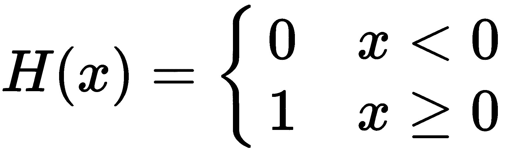

以及它与`where`命令的实现：

```py
def H(x):
    return where(x < 0, 0, 1)
x = linspace(-1,1,11)  # [-1\. -0.8 -0.6 -0.4 -0.2 0\. 0.2 0.4 0.6 0.8 1\. ]
print(H(x))            # [0 0 0 0 0 1 1 1 1 1 1]
```

第二个和第三个参数可以是与条件（布尔数组）相同大小的数组，也可以是标量。我们将给出两个示例，以演示如何根据条件操作数组元素或标量：

```py
x = linspace(-4,4,5)
# [-4\. -2\.  0\.  2\.  4.]

print(where(x < 0, -x, x))
# [ 4., 2., 0, 2., 4.] ]
print(where(x > 0, 1, -1)) # [-1 -1 -1  1  1]
```

如果省略第二个和第三个参数，则返回一个元组，其中包含满足条件的元素的索引。

例如，考虑在以下代码中仅使用一个参数的`where`：

```py
a = arange(9)
b = a.reshape((3,3))

print(where(a > 5))   # (array([6, 7, 8]),)
print(where(b > 5))   # (array([2, 2, 2]), array([0, 1, 2]))
```

这个示例演示了如何找出布尔数组中值为`True`的元素的索引。命令`where`是一个非常实用的工具，用于在数组中查找满足给定条件的元素。

在本节中，你看到了布尔数组的各种使用场景。每当你的代码中包含基于条件和数组操作的`for`循环时，检查是否可以使用布尔数组的概念来帮助去除不必要的`for`循环，并至少提高代码的可读性。

# 5.4 性能与向量化

当谈到 Python 代码的性能时，它通常归结为解释型代码与编译型代码之间的差异。Python 是一种解释型编程语言，基本的 Python 代码是直接执行的，不需要经过中间的机器代码编译。而在编译型语言中，代码在执行前需要被转换成机器指令。

解释型语言有许多优点，但解释型代码在速度上无法与编译型代码竞争。为了加速代码，可以将某些部分用 FORTRAN、C 或 C++ 等编译语言编写。这正是 NumPy 和 SciPy 的做法。

因此，最好在可能的情况下使用 NumPy 和 SciPy 中的函数，而不是使用解释型版本。NumPy 数组操作，如矩阵乘法、矩阵-向量乘法、矩阵分解、标量积等，比任何纯 Python 等价物都要快得多。以标量积为例，标量积比编译后的 NumPy 函数`dot(a,b)`要慢得多（对于大约有 100 个元素的数组，它的速度慢超过 100 倍）：

```py
def my_prod(a,b):
    val = 0
    for aa, bb in zip(a,b):
        val += aa*bb
    return val
```

测量函数的速度是科学计算中的一个重要方面。有关测量执行时间的详细信息，请参见第 15.3 节：*测量执行时间*。

## 5.4.1 向量化

为了提高性能，通常需要将代码向量化。用 NumPy 的切片、操作和函数替代`for`循环和其他较慢的代码部分，能够显著提升性能。

例如，通过遍历元素将标量加到向量上的简单操作非常慢：

```py
for i in range(len(v)):
    w[i] = v[i] + 5
```

但使用 NumPy 的加法运算要快得多：

```py
w = v + 5
```

使用 NumPy 的切片操作也能显著提高性能，优于使用`for`循环进行迭代。为了演示这一点，假设我们需要在一个二维数组中计算邻居的平均值：

```py
def my_avg(A):
    m,n = A.shape
    B = A.copy()
    for i in range(1,m-1):
        for j in range(1,n-1):
            B[i,j] = (A[i-1,j] + A[i+1,j] + A[i,j-1] + A[i,j+1])/4
    return B

def slicing_avg(A):
    A[1:-1,1:-1] = (A[:-2,1:-1] + A[2:,1:-1] +
                    A[1:-1,:-2] + A[1:-1,2:])/4
    return A
```

这两个函数都将每个元素的值设为其四个邻居的平均值。使用切片的第二个版本速度要快得多。

除了用 NumPy 函数替换`for`循环和其他较慢的构造外，还有一个有用的函数叫做`vectorized`（参见第 4.8 节：*作用于数组的函数*）。它接收一个函数，并创建一个向量化版本，该版本使用函数对数组中的所有元素进行操作，尽可能使用函数。

考虑以下函数，我们将用它来演示如何将函数向量化：

```py
def my_func(x):
    y = x**3 - 2*x + 5
    if y>0.5:
        return y-0.5
    else:
        return 0def my_func(x):
    y = x**3 - 2*x + 5
    if y>0.5:
        return y-0.5
    else:
        return 0
```

以非向量化的方式在一个包含 100 个元素的向量上应用此函数！[](img/4586f943-368a-4d03-9422-88fe5ca55f9a.png)：

```py
[my_func(vk) for vk in v]
```

使用向量化方式时，它的速度几乎是传统方式的三倍：

```py
vectorize(my_func)(v)
```

在本节中，我们展示了几个使用 NumPy 数组进行计算向量化的例子。强烈推荐积极使用这一概念，这不仅能加速代码的执行，还能提高代码的可读性。

# 5.5 广播

在 NumPy 中，广播指的是能够推测两个数组之间的共同兼容形状。例如，当向量（单维数组）和标量（零维数组）相加时，标量会被扩展为一个向量，以便进行加法操作。这个一般机制叫做广播。我们首先从数学角度回顾这一机制，然后给出 NumPy 中广播的精确规则。数学视角可能让受过数学训练的读者更容易理解广播，而其他读者可能想跳过数学细节，直接继续阅读 第 5.5.2 节： *广播数组*。

## 5.5.1 数学视角

广播在数学中经常进行，通常是隐式的。例如，表达式如 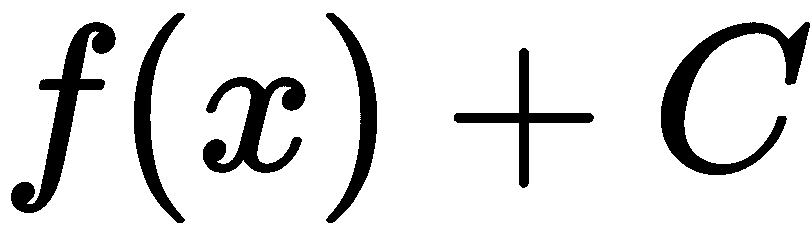 或 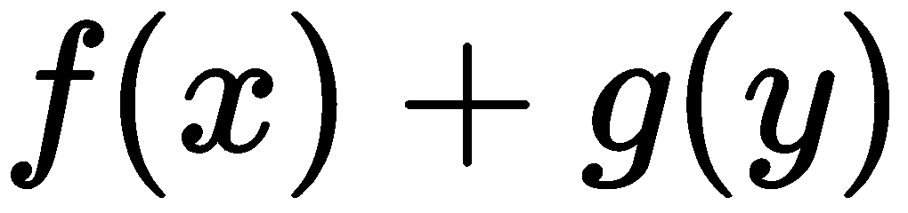 就是广播的应用。我们将在这一节中详细描述该技术。

我们牢记函数与 NumPy 数组之间的密切关系，如 第 4.2.1 节所描述： *数组作为函数*。

### 常数函数

广播的一个最常见的例子是函数与常数相加；如果 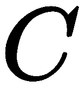 是一个标量，我们通常写作：

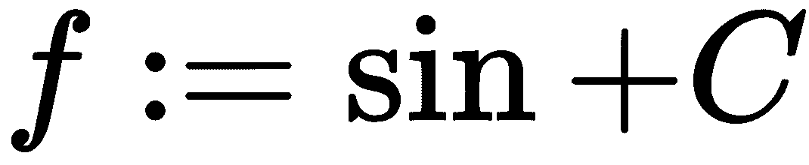

这是一种符号滥用，因为你不应该能将函数和常数相加。然而，常数会隐式地广播到函数。常数  的广播版本是函数 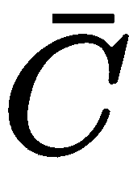，由以下公式定义：

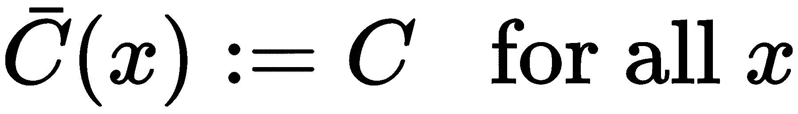

现在，将两个函数相加是有意义的：

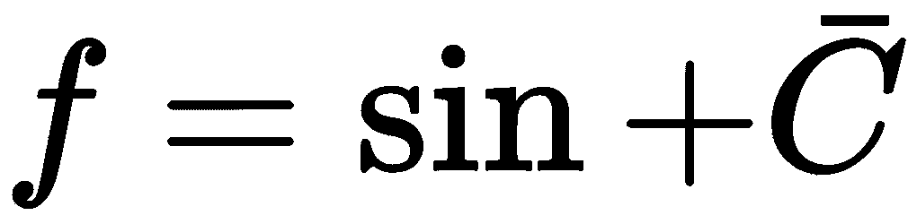

我们并不是为了矫揉造作，而是因为数组也可能出现类似的情况，如下方的代码所示：

```py
vector = arange(4) # array([0.,1.,2.,3.])
vector + 1\.        # array([1.,2.,3.,4.])
```

在这个例子中，一切的发生就像标量 `1.` 被转换成与 `vector` 相同长度的数组，即 `array([1.,1.,1.,1.])`，然后再与 `vector` 相加。

这个例子极为简单，因此我们将展示一些不那么明显的情况。

### 多变量函数

当构建多个变量的函数时，会出现一个更为复杂的广播示例。例如，假设我们有两个单变量函数， 和 **，我们希望根据以下公式构造一个新的函数， *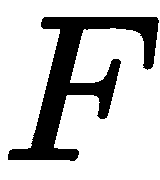*：

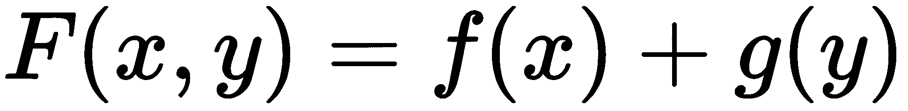

这显然是一个有效的数学定义。我们希望将这个定义表示为两个变量的函数之和，定义为：

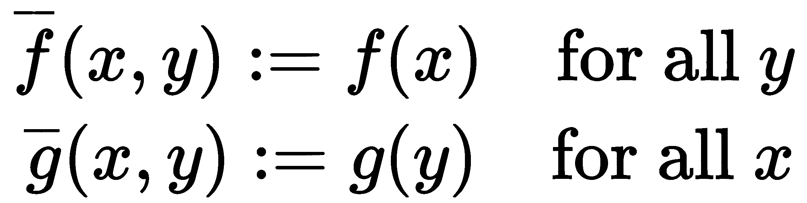。

现在我们可以简单地写成：

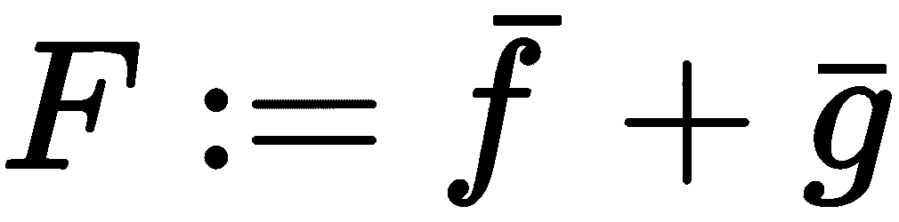

这种情况类似于添加列矩阵和行矩阵时的情况：

```py
C = arange(2).reshape(-1,1) # column
R = arange(2).reshape(1,-1) # row
C + R                       # valid addition: array([[0.,1.],[1.,2.]])
```

这在采样两个变量的函数时尤其有用，正如 5.5.3 节所示：*典型示例*。

### 通用机制

我们已经看到了如何将函数与标量相加，以及如何从两个单变量函数构建一个双变量函数。现在，让我们聚焦于使这一切成为可能的通用机制。这个通用机制包括两个步骤：*重塑*和*扩展*。

首先，函数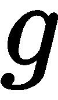被*重塑*为函数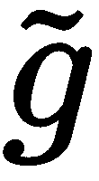，它接受两个参数。其中一个参数是虚拟参数，我们约定将其视为零：

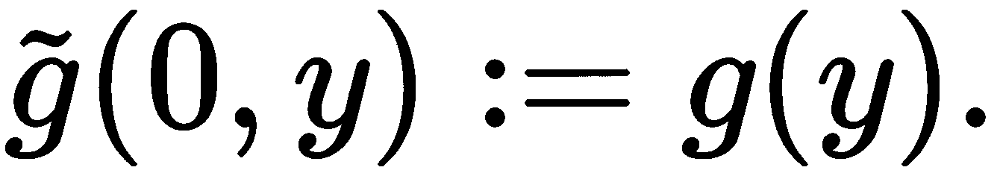

从数学角度看，的定义域现在是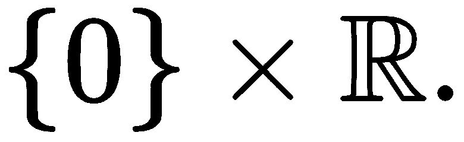。然后，函数以类似于下述方式*重塑*：

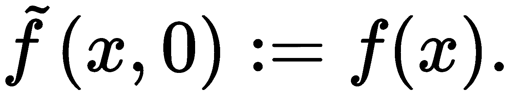

现在，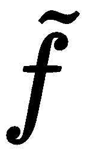和都接受两个参数，尽管其中一个始终是零。接下来我们进行*扩展*步骤。这与将常数转化为常数函数的步骤相同。

函数被*扩展*为：

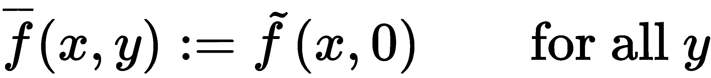

函数被扩展为：

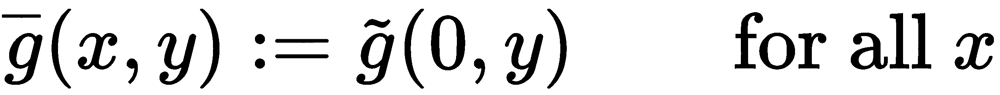

现在，两个变量的函数，，它由粗略定义，可以在不参考其参数的情况下定义：


例如，让我们描述之前的机制在常数情况下的表现。常数是标量，也就是零参数的函数。因此，*重塑步骤*是定义一个（一空）变量的函数：

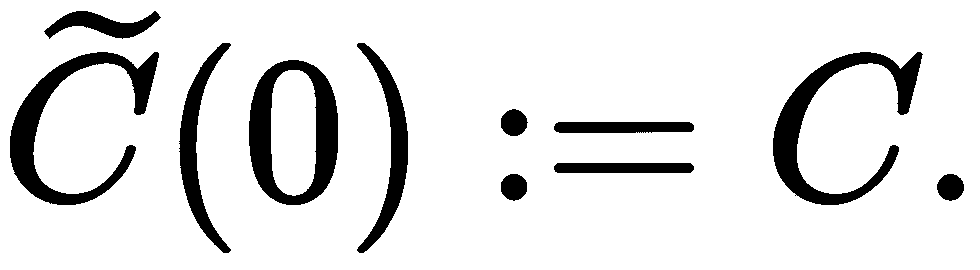

现在，*扩展步骤*简单地进行如下：

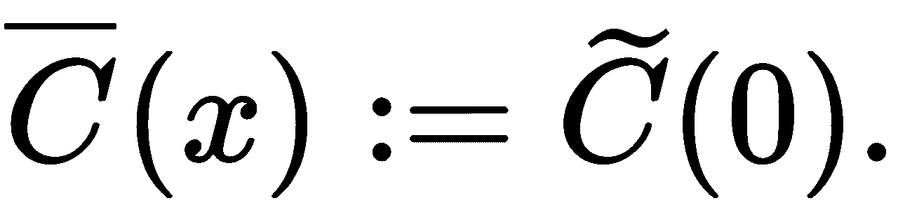

### 约定

最后一个要素是关于如何将额外参数添加到函数中的约定，也就是如何自动执行重塑。根据约定，函数会通过在左边添加零来自动重塑。

例如，如果一个有两个参数的函数需要重塑为三个参数，则新函数将由以下方式定义：

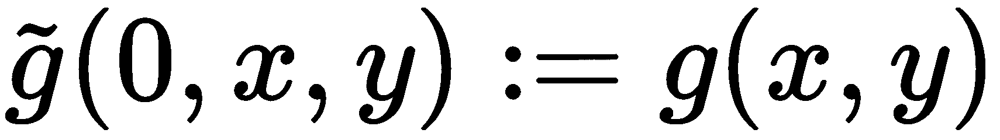

在看过广播的更数学化动机之后，我们现在展示它如何应用于 NumPy 数组。

## 5.5.2 广播数组

我们现在将重复观察，数组只是几个变量的函数（见第 4.2 节：*数学基础*）。因此，数组广播完全遵循上述为数学函数所解释的相同程序。广播在 NumPy 中是自动完成的。

在图 5.1 中，我们展示了将形状为(4, 3)的矩阵加到形状为(1, 3)的矩阵时发生了什么。结果矩阵的形状是(4, 3)：

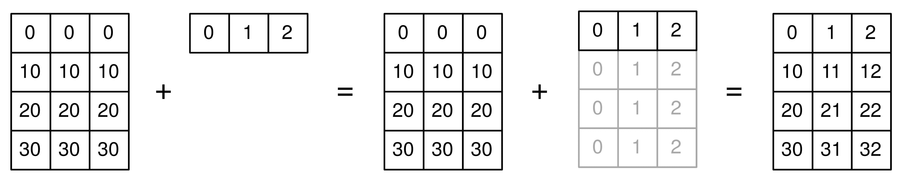

图 5.1：矩阵与向量之间的广播

### 广播问题

当 NumPy 给定两个形状不同的数组，并要求执行需要这两个形状相同的操作时，两个数组会广播到一个共同的形状。

假设两个数组的形状分别为！[](img/f5574319-181a-4f32-aba0-71d06d7ba0de.png)和！[](img/5b47ea61-2df0-4ea2-a664-f16987b19b1a.png)。广播由以下两步组成：

1.  如果形状！[](img/c3046fe0-1e71-44e6-9b37-66789ee79b95.png)比形状！[](img/30589aa2-56ff-41ea-a6a0-670c80e814e1.png)短，即`len(s1) < len(s2)`，那么在形状！[](img/00af5683-394d-4b11-b526-a0d661fd1445.png)的左侧会添加 1。这就是重塑。

1.  当形状长度相同时，第一个数组会扩展以匹配形状*s[2]*（如果可能的话）。

假设我们想将一个形状为！[](img/c3a599e3-145d-4a1b-9155-a668ffca988f.png)的向量加到一个形状为！[](img/cd2275cc-e7d9-4129-b18d-4fba55afaea3.png)的矩阵中。该向量需要广播。第一个操作是重塑；将向量的形状从(3,)转换为(1, 3)。第二个操作是扩展；将形状从(1, 3)转换为(4, 3)。

例如，假设一个大小为*n*的向量！[](img/25dcaa7c-1ab6-48ef-8f60-2d002c90f591.png)需要广播到形状(*m, n*)：

1.  会自动重塑为(1, *n*)。

1.  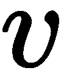被扩展到(*m*, *n*)。

为了演示这一点，我们考虑由以下定义的矩阵：

```py
M = array([[11, 12, 13, 14],
           [21, 22, 23, 24],
           [31, 32, 33, 34]])
```

和一个向量给定：

```py
v = array([100, 200, 300, 400])
```

现在我们可以直接将`M`和`v`相加：

```py
M + v # works directly
```

结果是这个矩阵：

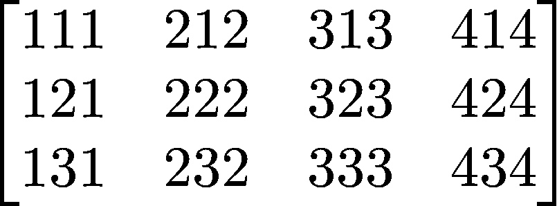

### 形状不匹配

不能自动将长度为`n`的向量`v`广播到形状`(n, m)`。这一点在*图 5.2*中有所说明。

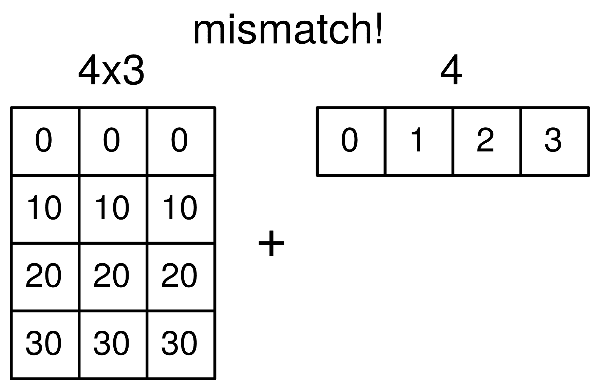

图 5.2：由于形状不匹配导致广播失败

广播失败，因为形状`(n,)`可能无法自动广播到形状`(m, n)`。解决方案是手动将`v`重塑为形状`(n, 1)`。广播现在会像往常一样工作（仅通过扩展）：

```py
M + v.reshape(-1,1)
```

这通过以下示例来说明。

定义一个矩阵：

```py
M = array([[11, 12, 13, 14],
           [21, 22, 23, 24],
           [31, 32, 33, 34]])
```

和一个向量：

```py
v = array([100, 200, 300])
```

现在自动广播将失败，因为自动重塑不起作用：

```py
M + v # shape mismatch error
```

因此，解决方案是手动处理重塑。我们想要在这种情况下右侧加 1，即将向量转换为列矩阵。然后，广播将直接起作用：

```py
M + v.reshape(-1,1)
```

（关于形状参数`-1`，请参见第 4.6.3 节：*重塑*。）结果是这个矩阵：

```py
array([[111, 112, 113, 114],  
       [221, 222, 223, 224], 
       [331, 332, 333, 334]])
```

## 5.5.3 典型示例

让我们看看一些典型示例，在这些示例中，广播可能会派上用场。

### 重标定行

假设`M`是一个*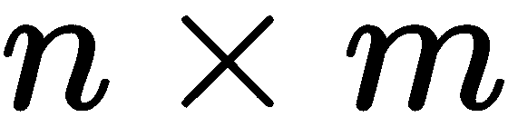*矩阵，我们希望将每行乘以一个系数。系数存储在长度为*n*的向量`coeff`中。在这种情况下，自动重塑将不起作用，我们必须执行：

```py
rescaled = M*coeff.reshape(-1,1)
```

### 重标定列

这里的设置相同，但我们希望使用存储在长度为*m*的向量`coeff`中的系数来重新标定每一列。在这种情况下，自动重塑将起作用：

```py
rescaled = M*coeff
```

显然，我们也可以手动进行重塑，并通过以下方式达到相同的结果：

```py
rescaled = M*coeff.reshape(1,-1)
```

### 两个变量的函数

假设！[](img/1c262619-1c75-4291-970a-1daad2e23f1b.png)和！[](img/d304100a-0ec4-4653-8315-abc1a427de3a.png)是向量，我们希望形成矩阵！[](img/52654bb6-2f26-451d-8b06-9d16eb84a766.png)，其中的元素是！[](img/e082400a-96c1-4e39-9567-2b20d7548b88.png)。这对应于函数！[](img/44feaca2-8d65-40cf-86ee-4f32300f2b0b.png)。矩阵！[](img/6d1d25c9-5da6-4eb1-95e0-2f78f4318103.png)仅由以下方式定义：

```py
W=u.reshape(-1,1) + v
```

如果向量**和！[](img/a8a0819d-b28c-415e-aa33-3a8748d54267.png)分别是！[](img/5abfef87-142c-4971-801d-95e0dfa50d20.png)和！[](img/e875b9e9-c719-4c4c-beb9-7a506626e90d.png)，那么结果是：

```py
array([[2, 3, 4],
       [3, 4, 5]])
```

更一般地，假设我们希望采样函数！[](img/514d009e-f785-4285-8728-cf6a0e8ae6d9.png)。假设向量！[](img/ca628e79-cf1c-413b-94b4-d13cdef8c319.png)和！[](img/6146f5d4-8840-4353-8999-f0bc24d15203.png)已经定义，采样值的矩阵！[](img/0c41556d-bccb-4901-9eac-0370087b4249.png)可以通过以下方式获得：

```py
W = cos(x).reshape(-1,1) + sin(2*y)
```

请注意，这通常与`ogrid`结合使用。从`ogrid`获得的向量已经便于广播。这允许以下优雅的函数采样！[](img/e25a91bf-92cb-4797-8317-39708a208778.png)：

```py
x,y = ogrid[0:1:3j,0:1:3j] 
# x,y are vectors with the contents of linspace(0,1,3)
w = cos(x) + sin(2*y)
```

`ogrid`的语法需要一些解释：首先，`ogrid`不是一个函数。它是一个类的实例，具有`__getitem__`方法（参见第 8.1.5 节：*特殊方法*）。因此，它是用方括号而不是圆括号来使用的。

这两个命令是等效的：

```py
x,y = ogrid[0:1:3j, 0:1:3j]
x,y = ogrid.__getitem__((slice(0, 1, 3j),slice(0, 1, 3j)))
```

前面示例中的步长参数是一个复数。这表明它是步数而不是步长。步长参数的规则乍一看可能令人困惑：

+   如果步长是实数，则它定义了起始和结束之间的步伐大小，并且结束值不包括在列表中。

+   如果步幅是一个复数`s`，那么`s.imag`的整数部分定义了从开始到结束的步数，并且结束值包括在列表中。

`ogrid`的输出是一个包含两个数组的元组，可以用于广播：

```py
x,y = ogrid[0:1:3j, 0:1:3j]
```

这给出的是：

```py
array([[ 0\. ],
       [ 0.5],
       [ 1\. ]])
array([[ 0\. ,  0.5,  1\. ]])
```

这等同于：

```py
x,y = ogrid[0:1.5:.5, 0:1.5:.5]
```

# 5.6 稀疏矩阵

非零元素较少的矩阵称为*sparse matrices*（稀疏矩阵）。稀疏矩阵通常出现在科学计算中，例如在数值求解偏微分方程时，用于描述离散的微分算子。

稀疏矩阵通常具有较大的维度，有时大到整个矩阵（包含零元素）甚至无法放入可用内存。这是为稀疏矩阵设计特殊数据类型的一个动机。另一个动机是能够避免零矩阵元素，从而提高操作的性能。

对于一般的非结构化稀疏矩阵，在线性代数中只有极少数的算法可用。大多数算法是迭代型的，基于稀疏矩阵的矩阵-向量乘法的高效实现。

稀疏矩阵的例子包括对角矩阵或带状矩阵。这些矩阵的简单模式使得存储策略变得直接；主对角线以及上下对角线存储在一维数组中。从稀疏表示转换为经典数组类型以及反向转换，可以通过 NumPy 命令`diag`完成。

一般来说，稀疏矩阵并没有如此简单的结构，因此描述稀疏矩阵需要特殊的技术和标准。

这种矩阵的例子如图 5.3 所示。在该图中，像素表示在 1250 × 1250 矩阵中的非零元素。

在本节中，我们介绍了两种稀疏矩阵的行和列导向类型，这两者都可以通过模块`scipy.sparse`使用。

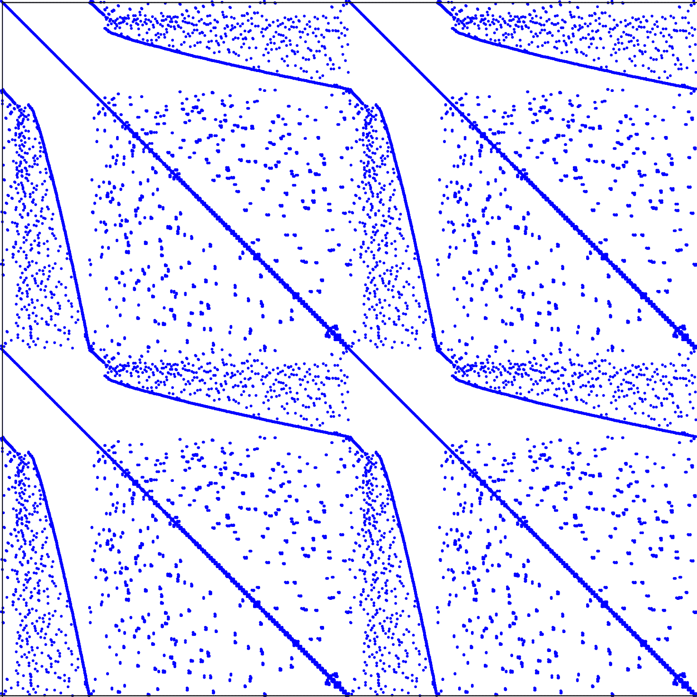

图 5.3：来自弹性板有限元模型的刚度矩阵。

## 5.6.1 稀疏矩阵格式

模块`scipy.sparse`提供了多种不同的稀疏矩阵存储格式。在这里，我们只描述最重要的几种：CSR、CSC 和 LIL。LIL 格式应当用于生成和修改稀疏矩阵；CSR 和 CSC 是矩阵-矩阵和矩阵-向量运算的高效格式。

### 压缩稀疏行格式（CSR）

**压缩稀疏行**（**CSR**）格式使用三个数组：`data`、`indptr`和`indices`：

+   一维数组`data`按顺序存储所有非零值。它的元素数量等于非零元素的数量，通常用变量`nnz`表示。

+   一维数组`indptr`包含整数，`indptr[i]`是`data`中元素的索引，表示第*i*行的第一个非零元素。如果整行*i*都是零，那么`indptr[i]==indptr[i+1]`。如果原始矩阵有*m*行，那么`len(indptr)==m+1`。

+   1D 数组 `indices` 包含列索引信息，使得 `indices[indptr[i]:indptr[i+1]]` 是一个整数数组，包含第 *i* 行非零元素的列索引。显然，`len(indices)==len(data)==nnz`。

让我们来看一个例子：

矩阵的 CSR 格式：

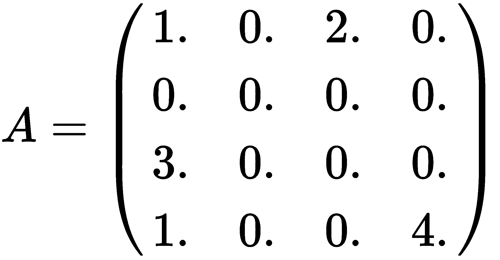

由以下三个数组给出：

```py
data = array([1., 2., 3., 1., 4.])
indptr = array([0, 2, 2, 3, 5])
indices = array([0, 2, 0, 0, 3]
```

模块 `scipy.sparse` 提供了一种类型 `csr_matrix`，并提供了一个构造函数，可以通过以下方式使用：

+   使用二维数组作为参数

+   使用 `scipy.sparse` 中的其他稀疏格式之一的矩阵

+   使用形状参数 `(m,n)` 来生成 CSR 格式的零矩阵

+   通过一个 1D 数组 `data` 和一个形状为 `(2,len(data))` 的整数数组 `ij`，其中 `ij[0,k]` 是行索引，`ij[1,k]` 是矩阵中 `data[k]` 的列索引

+   三个参数 `data`、`indptr` 和 `indices` 可以直接传递给构造函数

前两个选项用于转换目的，而最后两个选项直接定义稀疏矩阵。

考虑上面的示例；在 Python 中，它看起来是这样的：

```py
import scipy.sparse as sp
A = array([[1,0,2,0],[0,0,0,0],[3.,0.,0.,0.],[1.,0.,0.,4.]])
AS = sp.csr_matrix(A)
```

其中包括以下属性：

```py
AS.data      # returns array([ 1., 2., 3., 1., 4.]) 
AS.indptr    # returns array([0, 2, 2, 3, 5])
AS.indices   # returns array([0, 2, 0, 0, 3])
AS.nnz       # returns 5
```

### 压缩稀疏列格式（CSC）

CSR 格式有一个列导向的对应物——**压缩稀疏列**（**CSC**）格式。与 CSR 格式相比，它唯一的不同是 `indptr` 和 `indices` 数组的定义，现在它们与列相关。CSC 格式的类型是 `csc_matrix`，它的使用方式与之前在本小节中解释的 `csr_matrix` 相同。

继续使用 CSC 格式的相同示例：

```py
import scipy.sparse as sp
A = array([[1,0,2,0],[0,0,0,0],[3.,0.,0.,0.],[1.,0.,0.,4.]])
AS = sp.csc_matrix(A)
AS.data         # returns array([ 1., 3., 1., 2., 4.]) 
AS.indptr       # returns array([0, 3, 3, 4, 5])
AS.indices      # returns array([0, 2, 3, 0, 3])
AS.nnz          # returns 5
```

### 基于行的链表格式（LIL）

链表稀疏格式按行存储非零矩阵项，存储在一个列表 `data` 中，使得 `data[k]` 是第 *k* 行的非零项列表。如果该行的所有项均为 0，则该列表为空。

第二个列表 `rows` 在位置 *k* 处包含第 *k* 行中非零元素的列索引。以下是基于行的**链表**（**LIL**）格式的示例：

```py
import scipy.sparse as sp
A = array([[1,0,2,0],[0,0,0,0], [3.,0.,0.,0.], [1.,0.,0.,4.]]) 
AS = sp.lil_matrix(A)
AS.data     # returns array([[1.0, 2.0], [], [3.0], [1.0, 4.0]], dtype=object)
AS.rows     # returns array([[0, 2], [], [0], [0, 3]], dtype=object)
AS.nnz      # returns 5
```

### 修改和切片 LIL 格式的矩阵

LIL 格式最适合切片，即提取 LIL 格式的子矩阵，并通过插入非零元素来改变稀疏模式。切片操作通过以下示例演示：

```py
BS = AS[1:3,0:2]
BS.data     # returns array([[], [3.0]], dtype=object)
BS.rows     # returns array([[], [0]], dtype=object)
```

插入新的非零元素会自动更新属性：

```py
AS[0,1] = 17 
AS.data # returns array([[1.0, 17.0, 2.0], [], [3.0], [1.0, 4.0]])
AS.rows              # returns array([[0, 1, 2], [], [0], [0, 3]])
AS.nnz               # returns 6
```

这些操作在其他稀疏矩阵格式中不建议使用，因为它们非常低效。

## 5.6.2 生成稀疏矩阵

NumPy 命令 `eye`、`identity`、`diag` 和 `rand` 都有它们的稀疏版本。它们需要一个额外的参数，指定结果矩阵的稀疏矩阵格式。

以下命令生成单位矩阵，但采用不同的稀疏矩阵格式：

```py
import scipy.sparse as sp
sp.eye(20,20,format = 'lil') 
sp.spdiags(ones((20,)),0,20,20, format = 'csr') 
sp.identity(20,format ='csc')
```

命令 `sp.rand` 采用一个额外的参数，用于描述生成随机矩阵的密度。密集矩阵的密度为 1，而零矩阵的密度为 0：

```py
import scipy.sparse as sp 
AS=sp.rand(20,200,density=0.1,format='csr')
AS.nnz # returns 400
```

没有与 NumPy 命令`zeroes`直接对应的命令。完全填充零的矩阵可以通过实例化相应类型，并将形状参数作为构造参数来生成：

```py
import scipy.sparse as sp
Z=sp.csr_matrix((20,200))
Z.nnz    # returns 0
```

在研究了不同的稀疏矩阵格式之后，我们现在转向稀疏矩阵的特殊方法，主要是转换方法。

## 5.6.3 稀疏矩阵方法

有方法可以将一种稀疏类型转换为另一种类型或数组：

```py
AS.toarray # converts sparse formats to a numpy array 
AS.tocsr
AS.tocsc
AS.tolil
```

可以通过方法`issparse`、`isspmatrix_lil`、`isspmatrix_csr`和`isspmatrix_csc`来检查稀疏矩阵的类型。

稀疏矩阵上的逐元素操作`+`、`*`、`/`和`**`的定义与 NumPy 数组相同。无论操作数的稀疏矩阵格式如何，结果始终是`csr_matrix`。将逐元素操作函数应用于稀疏矩阵时，首先需要将其转换为 CSR 或 CSC 格式，并对其`data`属性应用函数，如下例所示。

稀疏矩阵的逐元素正弦可以通过对其`data`属性进行操作来定义：

```py
import scipy.sparse as sp
def sparse_sin(A):
    if not (sp.isspmatrix_csr(A) or sp.isspmatrix_csc(A)):
        A = A.tocsr()
    A.data = sin(A.data)
    return A
```

对于矩阵-矩阵或矩阵-向量乘法，有一个稀疏矩阵方法`dot`。它返回一个`csr_matrix`或一个 1D 的 NumPy`array`：

考虑以下函数，我们将在此展示如何向量化一个函数：

```py
import scipy.sparse as sp
A = array([[1,0,2,0],[0,0,0,0],[3.,0.,0.,0.],[1.,0.,0.,4.]])
AS = sp.csr_matrix(A)
b = array([1,2,3,4])
c = AS.dot(b)      # returns array([ 7., 0., 3., 17.]) 
C = AS.dot(AS)     # returns  csr_matrix
d = dot(AS,b)      # does not return the expected result! 
```

避免在稀疏矩阵上使用 NumPy 的`dot`命令，因为这可能会导致意外结果。应使用来自`scipy.sparse`的`dot`命令。

其他线性代数操作，如系统求解、最小二乘法、特征值和奇异值，由模块`scipy.sparse.linalg`提供。

# 5.7 小结

视图的概念是本章你应该学习的重要主题之一。缺少这一主题会使你在调试代码时遇到困难。布尔数组在本书的多个地方出现。它们是避免冗长的`if`语句和循环处理数组时的简洁工具。在几乎所有大型计算项目中，稀疏矩阵都会成为一个问题。你已经看到如何处理它们以及可用的相关方法。
