绘图

在 Python 中，绘图可以通过 `matplotlib` 模块的 `pyplot` 部分来完成。使用 `matplotlib`，你可以创建高质量的图形和图表，并可视化你的结果。Matplotlib 是开源的、免费的软件。Matplotlib 网站还包含了优秀的文档和示例，详见 35。在本节中，我们将展示如何使用最常见的功能。接下来的示例假设你已经导入了该模块：

```py
from matplotlib.pyplot import *
```

如果你希望在 IPython 中使用绘图命令，建议在启动 IPython shell 后立即运行 *magic command* ` %matplotlib`。这将为 IPython 准备好交互式绘图功能。

# 第七章：6.1 使用基本绘图命令绘制图形

本节中，我们将通过基本命令创建图形。这是学习如何使用 Python 绘制数学对象和数据图形的入门点。

## 6.1.1 使用 `plot` 命令及其一些变体

标准的绘图函数是 `plot`。调用 `plot(x,y)` 会创建一个图形窗口，并绘制出  作为 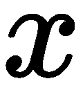 的函数图像。输入参数是等长的数组（或列表）。也可以使用 `plot(y)`，在这种情况下，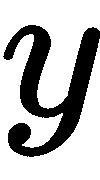 中的值将会根据其索引绘制，也就是说，`plot(y)` 是 `plot(range(len(y)),y)` 的简写。

下面是一个示例，展示如何使用 200 个样本点和每隔四个点设置标记来绘制 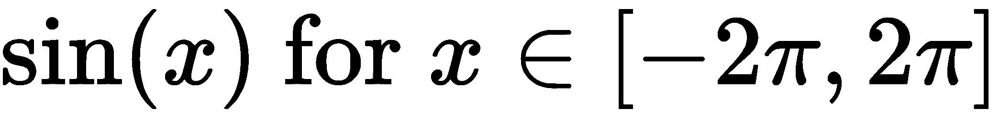：

```py
# plot sin(x) for some interval
x = linspace(-2*pi,2*pi,200)
plot(x,sin(x))

# plot marker for every 4th point
samples = x[::4]
plot(samples,sin(samples),'r*')

# add title and grid lines
title('Function sin(x) and some points plotted')
grid()
```

结果显示在下图中（*图 6.1*）：

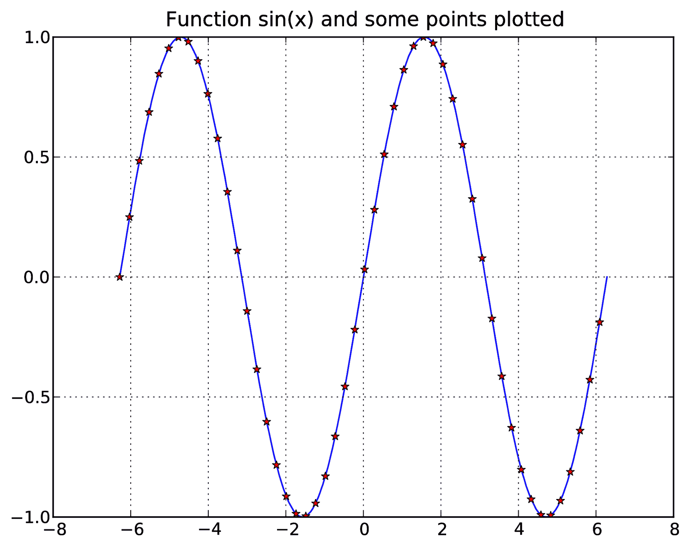

图 6.1：绘制函数 sin(x) 的图像，并显示网格线

如你所见，标准的绘图是一条实心的蓝色曲线。每个坐标轴都会自动缩放以适应数值，但也可以手动设置。颜色和绘图选项可以在前两个输入参数后提供。在这里，`r*` 表示红色星形标记。格式设置将在下一节中详细讨论。命令 `title` 在绘图区域上方添加标题文本字符串。

多次调用 `plot` 命令将会在同一窗口中叠加图形。若要获得一个新的干净的图形窗口，可以使用 `figure()`。命令 `figure` 可能包含一个整数，例如，`figure(2)`，用于在图形窗口之间切换。如果没有该编号的图形窗口，将会创建一个新的窗口，否则该窗口将被激活进行绘制，所有后续的绘图命令都将应用于该窗口。

可以通过使用 `legend` 函数并为每个绘图调用添加标签来解释多个图形。以下示例使用 `polyfit` 和 `polyval` 命令拟合多项式并绘制结果，同时添加图例：

```py
# —Polyfit example—
x = range(5)
y = [1,2,1,3,5]
p2 = polyfit(x,y,2) # coefficients of degree 2 polynomial
p4 = polyfit(x,y,4) # coefficients of degree 4 polynomial 

# plot the two polynomials and points
xx = linspace(-1,5,200) 
plot(xx, polyval(p2, xx), label='fitting polynomial of degree 2')
plot(xx, polyval(p4, xx),
                label='interpolating polynomial of degree 4') 
plot(x,y,'*')

# set the axis and legend
axis([-1,5,0,6])
legend(loc='upper left', fontsize='small')
```

在这里，你还可以看到如何使用`axis([xmin,xmax,ymin,ymax])`手动设置坐标轴的范围。命令`legend`接受关于位置和格式的可选参数；在这种情况下，图例被放置在左上角，并以小字体显示，如下图所示（*图 6.2*）：

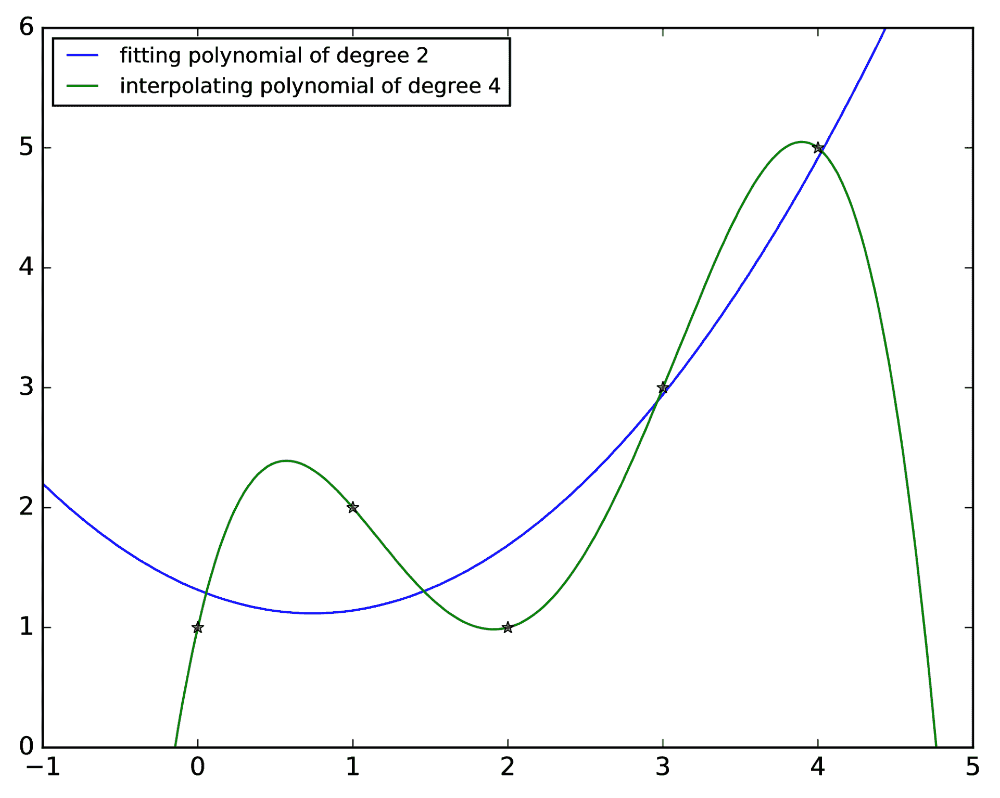

图 6.2：两个多项式拟合同一点集

作为基础绘图的最终示例，我们演示了如何绘制散点图和二维对数图。

这是一个二维点散点图的示例：

```py
# create random 2D points
import numpy
x1 = 2*numpy.random.standard_normal((2,100))
x2 = 0.8*numpy.random.standard_normal((2,100)) + array([[6],[2]])
plot(x1[0],x1[1],'*')
plot(x2[0],x2[1],'r*')
title('2D scatter plot')
```

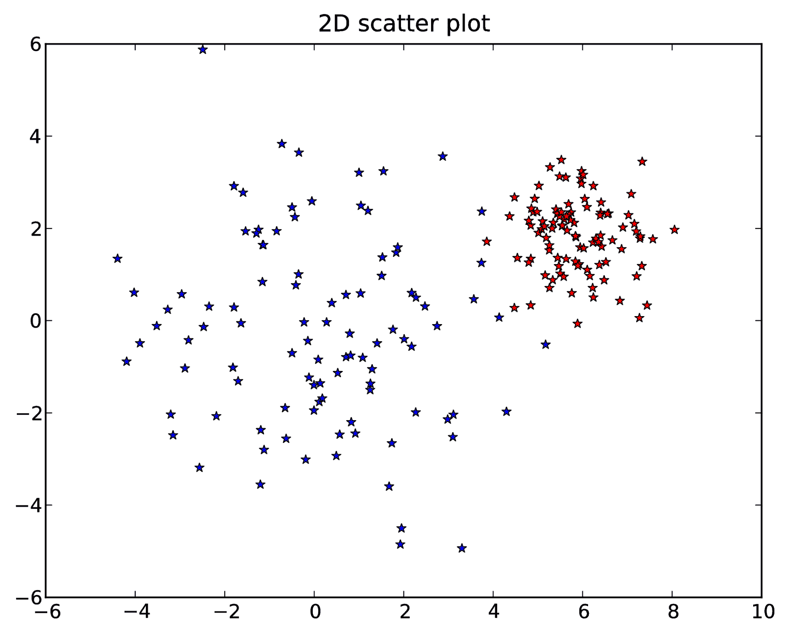

图 6.3(a)：一个散点图示例

以下代码是使用`loglog`进行对数绘图的示例：

```py
# log both x and y axis 
x = linspace(0,10,200) 
loglog(x,2*x**2, label = 'quadratic polynomial',
                            linestyle = '-', linewidth = 3)
loglog(x,4*x**4, label = '4th degree polynomial',
                            linestyle = '-.', linewidth = 3)
loglog(x,5*exp(x), label = 'exponential function', linewidth = 3)
title('Logarithmic plots')
legend(loc = 'best')
```

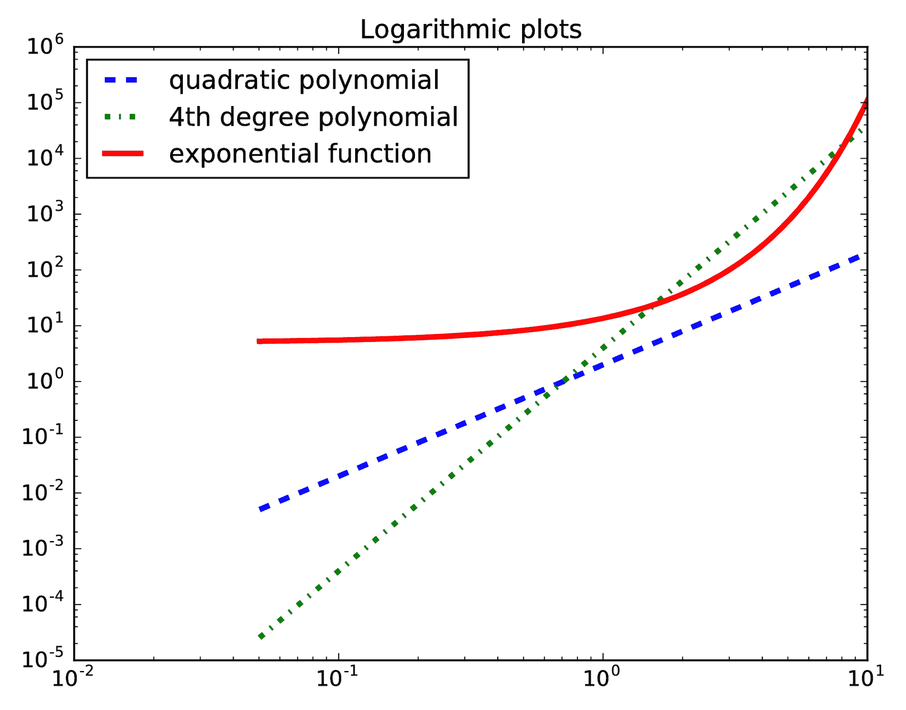

图 6.3(b)：一个带有对数 *x* 和 *y* 坐标轴的图形示例

前面图中展示的示例（*图 6.3(a)* 和 *图 6.3(b)*) 使用了`plot`和`loglog`的一些参数，这些参数允许特殊的格式化。在下一节中，我们将更详细地解释这些参数。

## 6.1.2 格式设置

图形和绘图的外观可以通过样式和定制设置为你想要的效果。一些重要的变量包括`linewidth`（控制绘图线条的粗细），`xlabel`和`ylabel`（设置坐标轴标签），`color`（设置绘图颜色），以及`transparent`（设置透明度）。

本节将告诉你如何使用其中的一些变量。以下是一个包含更多关键词的示例：

```py
k = 0.2
x = [sin(2*n*k) for n in range(20)]
plot(x, color='green', linestyle='dashed', marker='o', 
                       markerfacecolor='blue', markersize=12, linewidth=6)
```

如果只需要进行基本样式修改，例如设置颜色和线型，可以使用简短的命令。下表（*表 6.1*）展示了这些格式化命令的一些示例。你可以使用简洁的字符串语法`plot(...,'ro-')`，或者使用更明确的语法`plot(..., marker='o', color='r', linestyle='-')`。

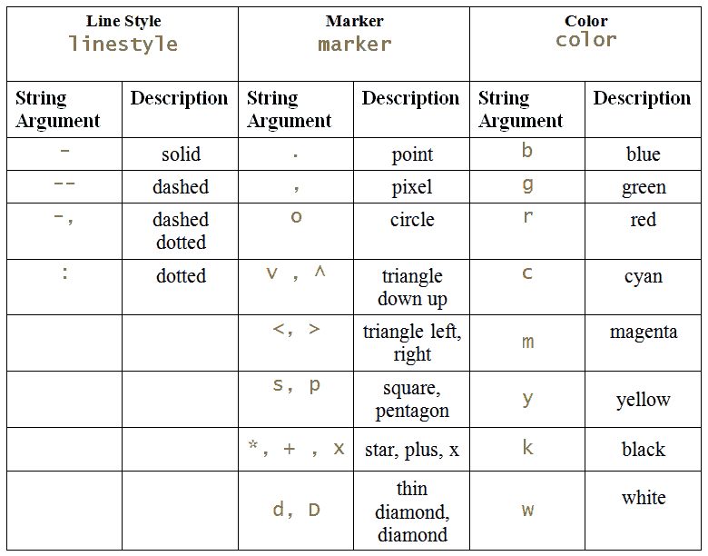

表 6.1：一些常见的绘图格式化参数

要将颜色设置为绿色并使用标记`'o'`，我们写下如下代码：

```py
plot(x,'go')
```

要绘制直方图而非常规图形，使用命令`hist`：

```py
# random vector with normal distribution
sigma, mu = 2, 10
x = sigma*numpy.random.standard_normal(10000)+mu 
hist(x,50,density=True)
z = linspace(0,20,200)
plot(z, (1/sqrt(2*pi*sigma**2))*exp(-(z-mu)**2/(2*sigma**2)),'g')
# title with LaTeX formatting 
title(fr'Histogram with $\mu={mu}, \sigma={sigma}')
```

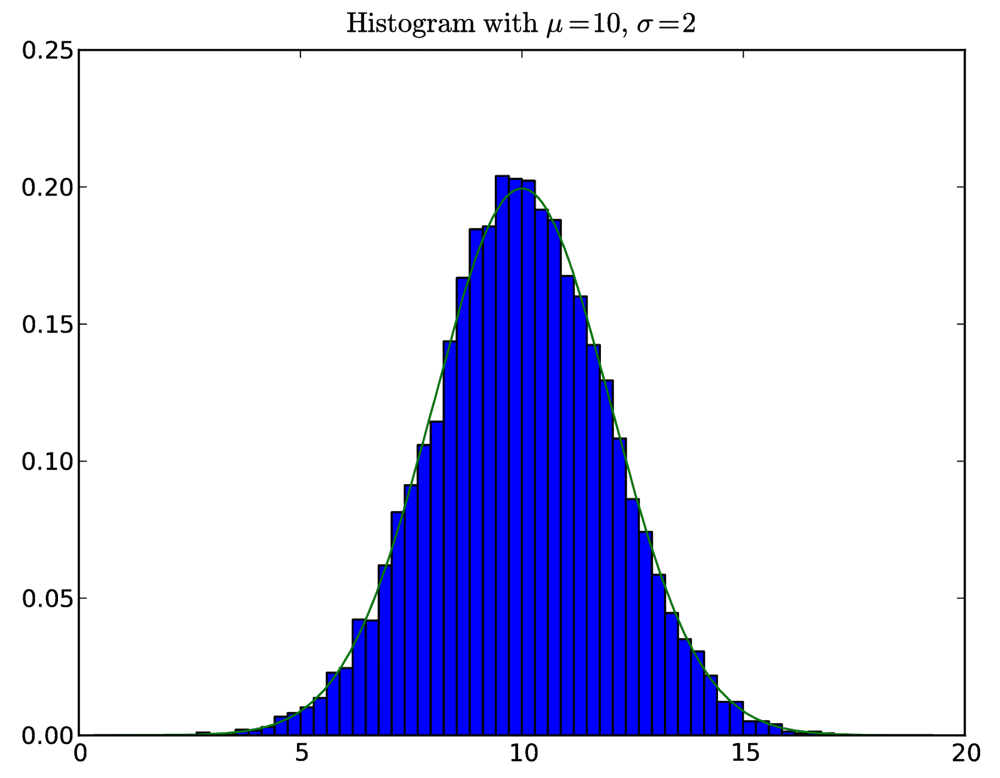

图 6.4：具有 50 个区间的正态分布图，绿色曲线表示真实分布

结果图形看起来与*图 6.4*类似。标题以及其他任何文本都可以使用 LaTeX 格式化来显示数学公式。LaTeX 格式化被包含在一对`$`符号之间。另请注意，使用`format`方法进行的字符串格式化；参见第 2.4.3 节，*字符串格式化*。

有时，字符串格式化的括号会与 LaTeX 的括号环境发生冲突。如果发生这种情况，可以用双括号替换 LaTeX 括号；例如，`x_{1}`应该替换为`x_{{1}}`。文本中可能包含与字符串转义序列重叠的序列，例如，`\tau`会被解释为制表符字符`\t`。一种简单的解决方法是在字符串前添加`r`，例如，`r'\tau'`。这会将其转换为原始字符串。

将多个图放置在一个图形窗口中，可以使用命令`subplot`。考虑以下示例，该示例逐步平均掉正弦曲线上的噪声。

```py
def avg(x):
    """ simple running average """
    return (roll(x,1) + x + roll(x,-1)) / 3
# sine function with noise
x = linspace(-2*pi, 2*pi,200)
y = sin(x) + 0.4*numpy.random.standard_normal(200)

# make successive subplots
for iteration in range(3):
    subplot(3, 1, iteration + 1)
    plot(x,y, label = '{:d} average{}'.format(iteration, 's' if iteration > 1 else ''))
    yticks([])
    legend(loc = 'lower left', frameon = False)
    y = avg(y) #apply running average 
subplots_adjust(hspace = 0.7)
```

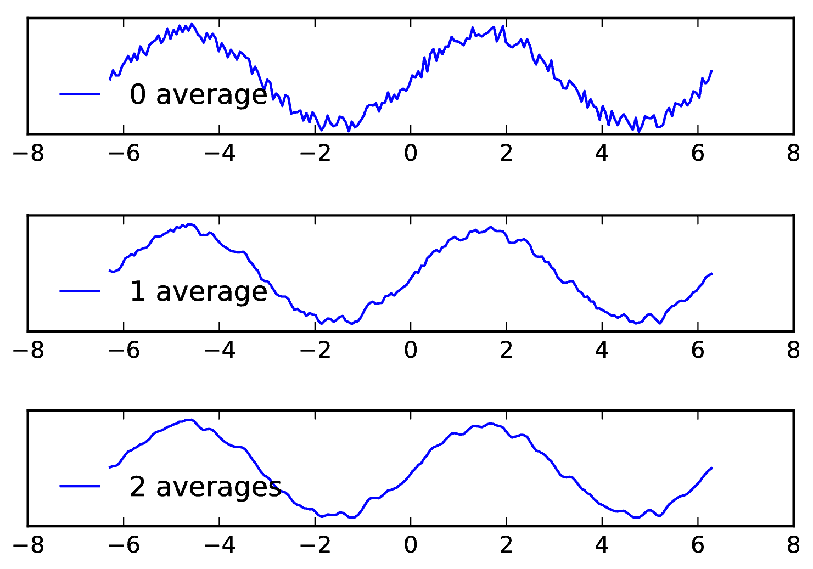

图 6.5：在同一图形窗口中绘制多个子图的示例

函数`avg`使用 NumPy 的`roll`函数来平移数组中的所有值。`subplot`需要三个参数：竖直子图的数量，水平子图的数量，以及表示绘制位置的索引（按行计数）。请注意，我们使用了命令`subplots_adjust`来添加额外的空间，以调整子图之间的距离。

一个有用的命令是`savefig`，它允许你将图形保存为图像（也可以通过图形窗口完成）。此命令支持多种图像和文件格式，它们通过文件名的扩展名来指定：

```py
savefig('test.pdf')  # save to pdf
```

或者

```py
savefig('test.svg')  # save to svg (editable format)
```

你可以将图像放置在非白色背景上，例如网页。为此，可以设置参数`transparent`，使得图形的背景透明：

```py
savefig('test.pdf', transparent=True)
```

如果你打算将图形嵌入到 LaTeX 文档中，建议通过设置图形的边界框为紧密围绕绘图的方式来减少周围的空白，如下所示：

```py
savefig('test.pdf', bbox_inches='tight')
```

## 6.1.3 使用 meshgrid 和等高线

一个常见的任务是对矩形区域内的标量函数进行图形化表示：

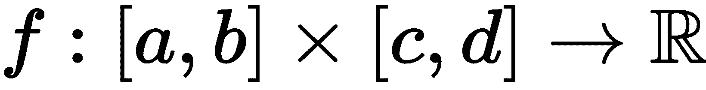

为此，我们首先需要在矩形上生成一个网格！[](img/b8fbb3cc-da62-4469-b2e1-8882e423bac6.png)。这是通过命令`meshgrid`来实现的：

```py
n = ... # number of discretization points along the x-axis
m = ... # number of discretization points along the x-axis 
X,Y = meshgrid(linspace(a,b,n), linspace(c,d,m))
```

`X`和`Y`是形状为`(n,m)`的数组，其中`X[i,j]`和`Y[i,j]`包含网格点的坐标![]，如*图 6.6*所示：

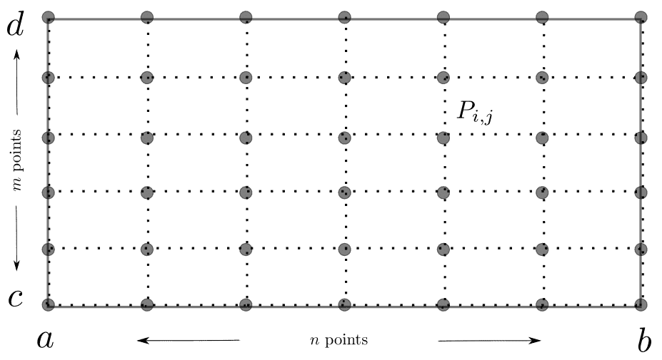

图 6.6：一个由 meshgrid 离散化的矩形。

一个由`meshgrid`离散化的矩形将在下一节中用于可视化迭代过程，而我们将在这里用它绘制函数的等高线。这是通过命令`contour`来完成的。

作为示例，我们选择了罗森布鲁克香蕉函数：

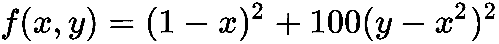

它用于挑战优化方法，见[[27]](12bddbb5-edd0-46c6-8f7a-9475aaf01a9d.xhtml)。函数值向着一个香蕉形的山谷下降，该山谷本身慢慢下降，最终到达函数的全局最小值(1, 1)。

首先，我们使用`contour`显示等高线：

```py
rosenbrockfunction = lambda x,y: (1-x)**2+100*(y-x**2)**2 
X,Y = meshgrid(linspace(-.5,2.,100), linspace(-1.5,4.,100))
Z = rosenbrockfunction(X,Y) 
contour(X,Y,Z,logspace(-0.5,3.5,20,base=10),cmap='gray') 
title('Rosenbrock Function: ')
xlabel('x')
ylabel('y')
```

这将绘制由第四个参数给定的级别的等高线，并使用颜色映射`gray`。此外，我们使用了从 10^(0.5)到 10³的对数间隔步长，使用函数`logscale`来定义级别，见*图 6.7*。

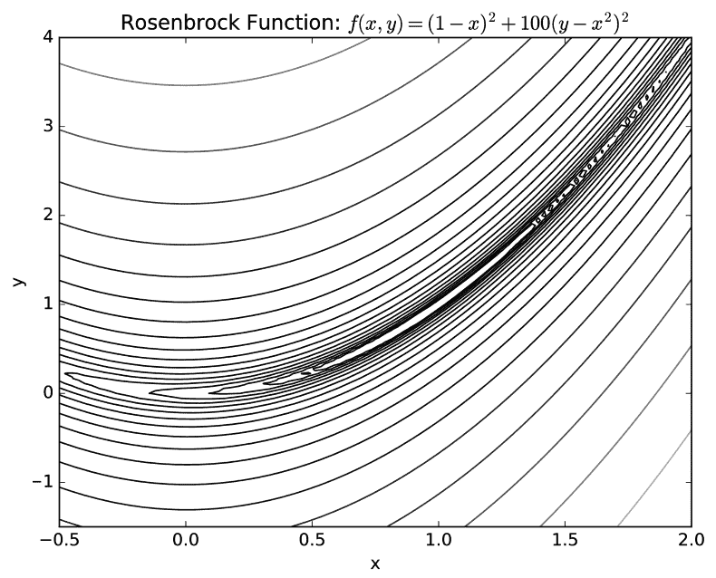

图 6.7：罗森布鲁克函数的等高线图

在前面的示例中，使用了`lambda`关键字表示的匿名函数来保持代码简洁。匿名函数的解释见第 7.7 节，*匿名函数*。如果未将级别作为参数传递给`contour`，该函数会自动选择合适的级别。

`contourf`函数执行与`contour`相同的任务，但根据不同的级别填充颜色。等高线图非常适合可视化数值方法的行为。我们通过展示优化方法的迭代过程来说明这一点。

我们继续前面的示例，并描绘了通过 Powell 方法生成的罗森布鲁克函数最小值的步骤，我们将应用该方法来找到罗森布鲁克函数的最小值：

```py
import scipy.optimize as so
rosenbrockfunction = lambda x,y: (1-x)**2+100*(y-x**2)**2
X,Y=meshgrid(linspace(-.5,2.,100),linspace(-1.5,4.,100))
Z=rosenbrockfunction(X,Y)
cs=contour(X,Y,Z,logspace(0,3.5,7,base=10),cmap='gray')
rosen=lambda x: rosenbrockfunction(x[0],x[1])
solution, iterates = so.fmin_powell(rosen,x0=array([0,-0.7]),retall=True)
x,y=zip(*iterates)
plot(x,y,'ko') # plot black bullets
plot(x,y,'k:',linewidth=1) # plot black dotted lines
title("Steps of Powell's method to compute a minimum")
clabel(cs)
```

迭代方法`fmin_powell`应用 Powell 方法找到最小值。通过给定的起始值*![]*启动，并在选项`retall=True`时报告所有迭代结果。经过 16 次迭代后，找到了解决方案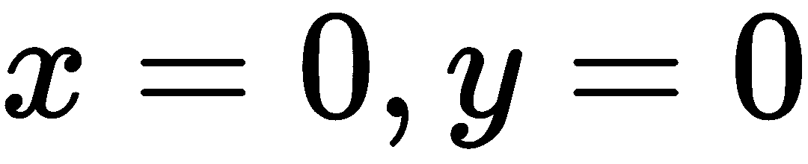。迭代过程在等高线图中以子弹点表示；见*图 6.8*。

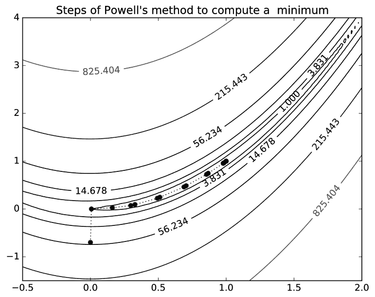

图 6.8：罗森布鲁克函数的等高线图，展示了优化方法的搜索路径

`contour`函数还创建了一个轮廓集对象，我们将其赋值给变量`cs`。然后，`clabel`用来标注相应函数值的级别，如*图 6.8*所示。

## 6.1.4 生成图像和轮廓

让我们看一些将数组可视化为图像的示例。以下函数将为曼德尔布罗特分形创建一个颜色值矩阵，另见[[20]](12bddbb5-edd0-46c6-8f7a-9475aaf01a9d.xhtml)。这里，我们考虑一个依赖于复数参数的固定点迭代，：

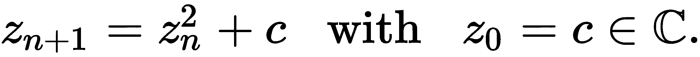

根据此参数的选择，它可能会或可能不会创建一个有界的复数值序列，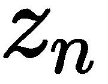。

对于每个的值，我们检查![]是否超过了预定的界限。如果在`maxit`次迭代内仍然低于该界限，则认为序列是有界的。

请注意，在以下代码片段中，`meshgrid`用于生成一个复数参数值矩阵，**：

```py
def mandelbrot(h,w, maxit=20):
    X,Y = meshgrid(linspace(-2, 0.8, w), linspace(-1.4, 1.4, h))
    c = X + Y*1j
    z = c
    exceeds = zeros(z.shape, dtype=bool)

    for iteration in range(maxit):
        z  = z**2 + c
        exceeded = abs(z) > 4
        exceeds_now = exceeded & (logical_not(exceeds))  
        exceeds[exceeds_now] = True        
        z[exceeded] = 2  # limit the values to avoid overflow
    return exceeds

imshow(mandelbrot(400,400),cmap='gray')
axis('off')
```

命令 `imshow` 将矩阵显示为图像。选定的颜色图显示了序列在白色区域的无界部分，其他部分为黑色。在这里，我们使用了 `axis('off')` 来关闭坐标轴，因为这对于图像来说可能不太有用。

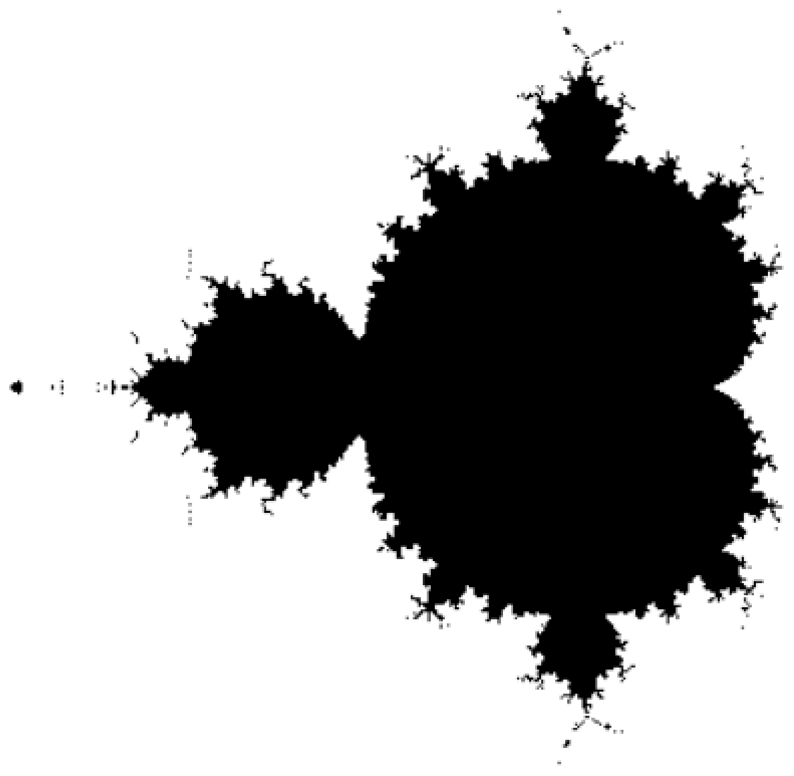

图 6.9：使用 imshow 将矩阵可视化为图像的示例

默认情况下，`imshow` 使用插值来使图像看起来更漂亮。当矩阵较小时，这一点尤为明显。下图显示了使用以下方法的区别：

```py
imshow(mandelbrot(40,40),cmap='gray')
```

和

```py
imshow(mandelbrot(40,40), interpolation='nearest', cmap='gray')
```

在第二个示例中，像素值只是被复制了，见 [[30]](12bddbb5-edd0-46c6-8f7a-9475aaf01a9d.xhtml)。

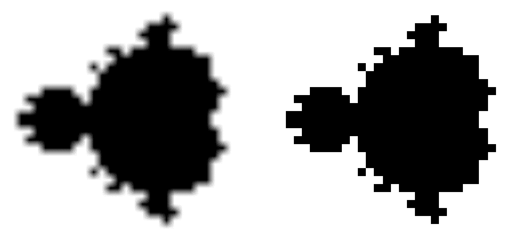

图 6.10：使用 `imshow` 的线性插值与使用最近邻插值的区别

有关使用 Python 处理和绘制图像的更多详细信息。

在了解了如何以“命令方式”制作图表之后，我们将在接下来的部分中考虑一种更面向对象的方法。虽然稍微复杂一些，但它打开了广泛的应用范围。

# 6.2 直接使用 Matplotlib 对象

到目前为止，我们一直在使用 matplotlib 的 `pyplot` 模块。这个模块使我们可以直接使用最重要的绘图命令。通常，我们感兴趣的是创建一个图形并立即显示它。然而，有时我们希望生成一个图形，稍后可以通过更改某些属性来修改它。这要求我们以面向对象的方式与图形对象进行交互。在这一节中，我们将介绍修改图形的一些基本步骤。要了解 Python 中更复杂的面向对象绘图方法，您需要离开 `pyplot`，直接进入 `matplotlib`，并参考其广泛的文档。

## 6.2.1 创建坐标轴对象

当创建一个需要稍后修改的图表时，我们需要引用一个图形和一个坐标轴对象。为此，我们必须先创建一个图形，然后定义一些坐标轴及其在图形中的位置，并且我们不能忘记将这些对象分配给一个变量：

```py
fig = figure()
ax = subplot(111)
```

一幅图可以有多个坐标轴对象，具体取决于是否使用了 `subplot`。在第二步中，图表与给定的坐标轴对象相关联：

```py
fig = figure(1) 
ax = subplot(111) 
x = linspace(0,2*pi,100) # We set up a function that modulates the 
                         # amplitude of the sin function 
amod_sin = lambda x: (1.-0.1*sin(25*x))*sin(x) 
# and plot both... 
ax.plot(x,sin(x),label = 'sin') 
ax.plot(x, amod_sin(x), label = 'modsin')
```

在这里，我们使用了由关键字 `lambda` 表示的匿名函数。我们将在 第 7.7 节 中解释这个构造，*匿名函数*。实际上，这两个绘图命令将列表 `ax.lines` 填充了两个 `Lines2D` 对象：

```py
ax.lines #[<matplotlib.lines.Line2D at ...>, <matplotlib.lines.Line2D at ...>]
```

使用标签是一个好习惯，这样我们可以稍后轻松地识别对象：

```py
for il,line in enumerate(ax.lines):
    if line.get_label() == 'sin':
       break
```

我们现在已经将设置完成，以便进行进一步的修改。到目前为止我们得到的图如 *图 6.11（左图）* 所示。

## 6.2.2 修改线条属性

我们刚刚通过标签标识了一个特定的线条对象。它是列表 `ax.lines` 中的一个元素，索引为 `il`。它的所有属性都被收集在一个字典中：

```py
dict_keys(['marker', 'markeredgewidth', 'data', 'clip_box', 'solid_capstyle', 'clip_on', 'rasterized', 'dash_capstyle', 'path', 'ydata', 'markeredgecolor', 'xdata', 'label', 'alpha', 'linestyle', 'antialiased', 'snap', 'transform', 'url', 'transformed_clip_path_and_affine', 'clip_path', 'path_effects', 'animated', 'contains', 'fillstyle', 'sketch_params', 'xydata', 'drawstyle', 'markersize', 'linewidth', 'figure', 'markerfacecolor', 'pickradius', 'agg_filter', 'dash_joinstyle', 'color', 'solid_joinstyle', 'picker', 'markevery', 'axes', 'children', 'gid', 'zorder', 'visible', 'markerfacecoloralt'])
```

这可以通过以下命令获得：

```py
ax.lines[il].properties()
```

它们可以通过相应的 setter 方法进行修改。现在我们来改变正弦曲线的线条样式：

```py
ax.lines[il].set_linestyle('-.')
ax.lines[il].set_linewidth(2)
```

我们甚至可以修改数据，如下所示：

```py
ydata=ax.lines[il].get_ydata()
ydata[-1]=-0.5
ax.lines[il].set_ydata(ydata)
```

结果如*图 6.11，（右）*所示：

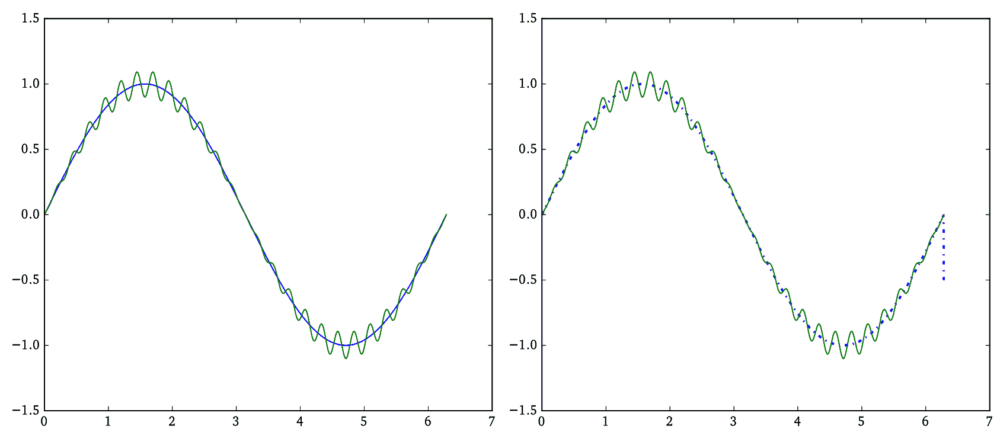

图 6.11：幅度调制正弦函数（左）和数据点被破坏的曲线（右）

## 6.2.3 制作注释

一个有用的坐标轴方法是`annotate`。它可以在给定位置设置注释，并用箭头指向图中的另一个位置。箭头可以通过字典来指定属性：

```py
annot1=ax.annotate('amplitude modulated\n curve', (2.1,1.0),(3.2,0.5),
       arrowprops={'width':2,'color':'k', 
                   'connectionstyle':'arc3,rad=+0.5', 
                   'shrink':0.05},
       verticalalignment='bottom', horizontalalignment='left',fontsize=15, 
                   bbox={'facecolor':'gray', 'alpha':0.1, 'pad':10})
annot2=ax.annotate('corrupted data', (6.3,-0.5),(6.1,-1.1),
       arrowprops={'width':0.5,'color':'k','shrink':0.1},
       horizontalalignment='center', fontsize=12)
```

在上面的第一个注释示例中，箭头指向坐标为(*2.1, 1.0*)的点，文本的左下坐标为(*3.2, 0.5*)。如果没有特别指定，坐标是以方便的数据坐标系给出的，即用于生成图形的数据坐标系。

此外，我们展示了通过字典`arrowprop`指定的几个箭头属性。你可以通过键`shrink`来缩放箭头。设置`'shrink':0.05`会将箭头大小减少 5%，以保持与其指向的曲线之间的距离。你还可以使用键`connectionstyle`让箭头呈现为样条曲线或其他形状。

文本属性，甚至是围绕文本的边框框，可以通过额外的关键字参数传递给`annotate`方法，见*图 6.12，（左）*。

尝试注释有时需要多次尝试，我们需要丢弃其中的一些。因此，我们将注释对象赋值给一个变量，这样就可以通过其`remove`方法移除注释：

```py
annot1.remove()
```

## 6.2.4 填充曲线之间的区域

填充是一个理想的工具，用于突出曲线之间的差异，例如预期数据上的噪声和近似函数与精确函数之间的差异。

填充是通过坐标轴方法`fill_between`完成的：

```py
ax.fill_between(x,y1,y2)
```

对于下一个图，我们使用了以下命令：

```py
axf = ax.fill_between(x, sin(x), amod_sin(x), facecolor='gray')
```

在上一章中，我们已经了解了 NumPy 方法`where`。在这里的上下文中，`where`是一个非常方便的参数，需要一个布尔数组来指定额外的填充条件：

```py
axf = ax.fill_between(x, sin(x), amod_sin(x),where=amod_sin(x)-sin(x) > 0, facecolor=’gray’)
```

选择要填充的区域的布尔数组由条件`amod_sin(x)-sin(x) > 0`给出。

下一个图显示了带有两种填充区域变体的曲线：

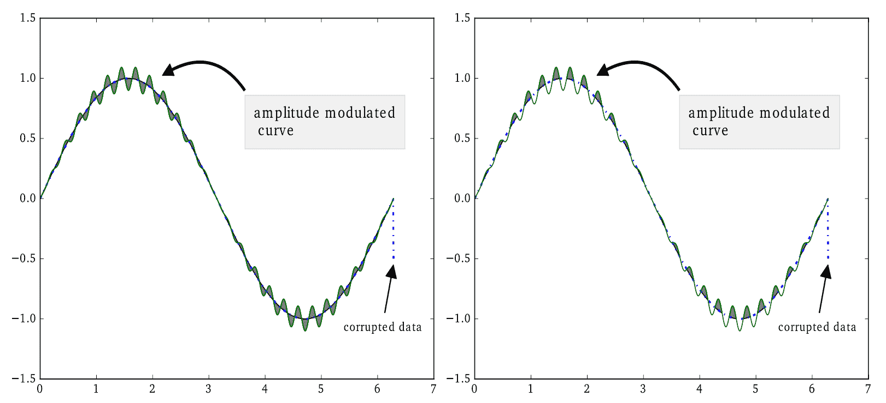

图 6.12：带有注释和填充区域的幅度调制正弦函数（左），以及仅通过使用`where`参数部分填充区域的修改图（右）

如果你自己测试这些命令，记得在尝试部分填充之前移除完整填充，否则你将看不到任何变化：

```py
axf.remove()
```

相关的填充命令是`fill`用于填充多边形，`fill_betweenx`用于填充水平方向的区域。

## 6.2.5 定义刻度和刻度标签

在演讲、海报和出版物中的图形，如果没有过多不必要的信息，看起来会更美观。你希望引导观众关注那些包含信息的部分。在我们的例子中，我们通过去除*x*轴和*y*轴的刻度，并引入与问题相关的刻度标签来清理图像：

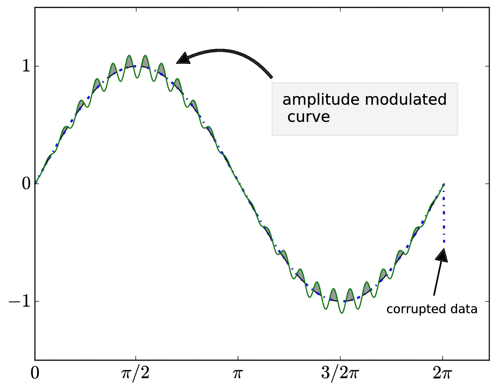

图 6.13：完成的振幅调制正弦函数示例，带有注释和填充区域，以及修改过的刻度和刻度标签

*图 6.13*中的刻度线是通过以下命令设置的。注意使用 LaTeX 方式设置带有希腊字母的标签：

```py
ax.set_xticks(array([0,pi/2,pi,3/2*pi,2*pi]))
ax.set_xticklabels(('$0$','$\pi/2$','$\pi$','$3/2 \pi$','$2 \pi$'),fontsize=18)
ax.set_yticks(array([-1.,0.,1]))
ax.set_yticklabels(('$-1$','$0$','$1$'),fontsize=18)
```

请注意，我们在字符串中使用了 LaTeX 格式来表示希腊字母、正确设置公式并使用 LaTeX 字体。增加字体大小也是一个好习惯，这样生成的图形可以缩小到文本文档中而不影响坐标轴的可读性。本指导示例的最终结果如*图 6.13*所示。

## 6.2.6 设置脊柱使你的图更具启发性——一个综合示例

脊柱是显示坐标的带有刻度和标签的线条。如果不采取特别措施，Matplotlib 会将它们放置为四条线——底部、右侧、顶部和左侧，形成由坐标轴参数定义的框架。

通常，图像在没有框架时看起来更好，而且脊柱有时可以放置在更具教学意义的位置。在这一节中，我们展示了改变脊柱位置的不同方法。

让我们从一个指导示例开始，见*图* 6.14。

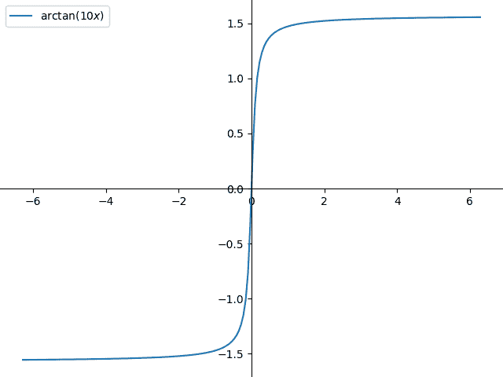

图 6.14：一个 Matplotlib 图，具有非自动的脊柱位置设置

在这个例子中，我们选择只显示四个脊柱中的两个。

我们通过使用`set_visible`方法取消选择了顶部和右侧的脊柱，并通过使用`set_position`方法将左侧和底部的脊柱放置在数据坐标中：

```py

fig = figure(1)
ax = fig.add_axes((0.,0.,1,1))
ax.spines["left"].set_position(('data',0.))
ax.spines["bottom"].set_position(("data",0.))
ax.spines["top"].set_visible(False)
ax.spines["right"].set_visible(False)
x=linspace(-2*pi,2*pi,200)
ax.plot(x,arctan(10*x), label=r'$\arctan(10 x)$')
ax.legend()
```

脊柱携带刻度和刻度标签。通常，它们是自动设置的，但手动设置它们往往更有优势。

在以下示例中，我们甚至利用了两组刻度线的可能性，并且设置了不同的放置参数。Matplotlib 将这两组刻度线分别称为'*minor*'和'*major*'。其中一组用于水平对齐*y*轴左侧的刻度标签：

```py
ax.set_xticks([-2*pi,-pi,pi,2*pi])
ax.set_xticklabels([r"$-2\pi$",r"$-\pi$",r"$\pi$", r"$2\pi$"])
ax.set_yticks([pi/4,pi/2], minor=True)
ax.set_yticklabels([r"$\pi/4$", r"$\pi/2$"], minor=True)
ax.set_yticks([-pi/4,-pi/2], minor=False,)
ax.set_yticklabels([r"$-\pi/4$", r"$-\pi/2$"], minor=False) # major label set
ax.tick_params(axis='both', which='major', labelsize=12)
ax.tick_params(axis='y', which='major',pad=-35) # move labels to the right
ax.tick_params(axis='both', which='minor', labelsize=12)
```

结果如图 6.15 所示。

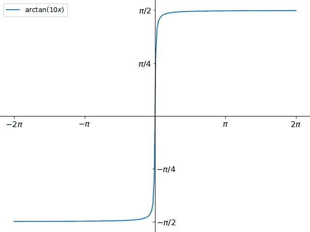

图 6.15：改变刻度和标签的位置

这个例子可以通过添加更多的轴和注释来进一步展开。我们参考了*练习 7*和*图 6.20*。

到目前为止，我们考虑的是二维图。接下来，我们将在下一节讨论三维数学对象的可视化。

# 6.3 制作三维图

有一些有用的`matplotlib`工具包和模块，可以用于各种特殊目的。在这一节中，我们描述了一种生成三维图的方法。

工具包 `mplot3d` 提供了三维点、线、等高线、表面及其他基本组件的绘制功能，还支持三维旋转和缩放。通过向坐标轴对象添加关键字 `projection='3d'` 可以生成三维图，如下示例所示：

```py
from mpl_toolkits.mplot3d import axes3d

fig = figure()
ax = fig.gca(projection='3d')
# plot points in 3D
class1 = 0.6 * random.standard_normal((200,3))
ax.plot(class1[:,0],class1[:,1],class1[:,2],'o')
class2 = 1.2 * random.standard_normal((200,3)) + array([5,4,0])
ax.plot(class2[:,0],class2[:,1],class2[:,2],'o')
class3 = 0.3 * random.standard_normal((200,3)) + array([0,3,2])
ax.plot(class3[:,0],class3[:,1],class3[:,2],'o')
```

如你所见，你需要从 `mplot3d` 导入 `axes3D` 类型。生成的图展示了散点三维数据，这可以在 *图 6.16* 中看到。

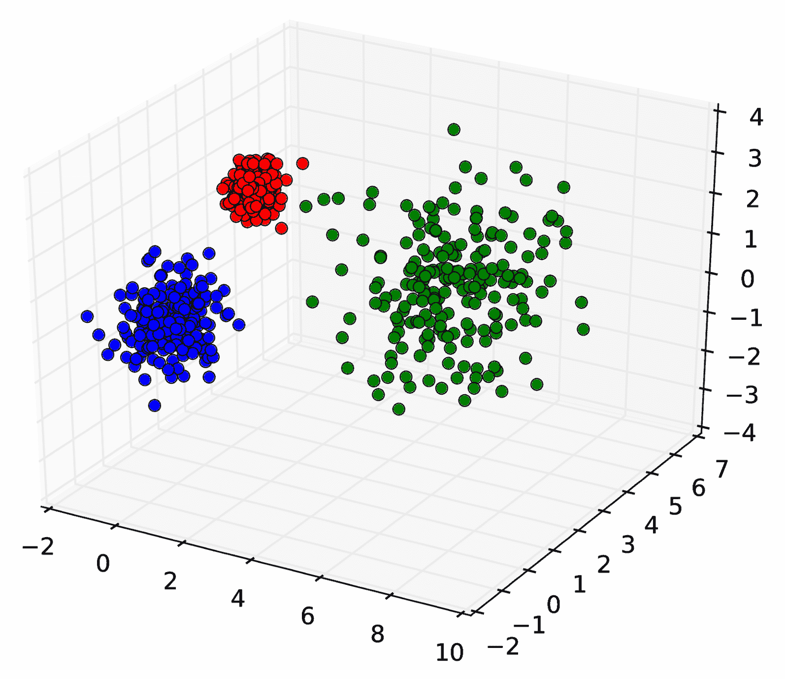

图 6.16：使用 mplot3d 工具包绘制三维数据

绘制表面同样简单。以下示例使用内建函数 `get_test_data` 创建样本数据，用于绘制表面。考虑以下具有透明度的表面图示例：

```py
X,Y,Z = axes3d.get_test_data(0.05)

fig = figure()
ax = fig.gca(projection='3d')
# surface plot with transparency 0.5 
ax.plot_surface(X,Y,Z,alpha=0.5)
```

*alpha* 值设置透明度。表面图如*图 6.17*所示。

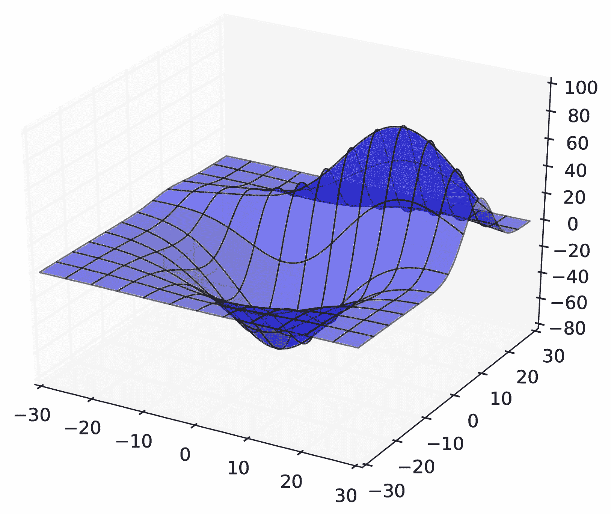

图 6.17：绘制表面网格的示例

你还可以在任意坐标投影中绘制等高线，如以下示例所示：

```py
fig = figure()
ax = fig.gca(projection = '3d')
ax.plot_wireframe(X,Y,Z,rstride = 5,cstride = 5)

# plot contour projection on each axis plane
ax.contour(X,Y,Z, zdir='z',offset = -100)
ax.contour(X,Y,Z, zdir='x',offset = -40)
ax.contour(X,Y,Z, zdir='y',offset = 40)

# set axis limits
ax.set_xlim3d(-40,40)
ax.set_ylim3d(-40,40)
ax.set_zlim3d(-100,100)

# set labels
ax.set_xlabel('X axis')
ax.set_ylabel('Y axis')
ax.set_zlabel('Z axis')
```

注意设置坐标轴范围的命令。设置坐标轴范围的标准 `matplotlib` 命令是 `axis([-40, 40, -40, 40])`。该命令适用于二维图。然而，`axis([-40,40,-40,40,-40,40])` 则无效。对于三维图，你需要使用面向对象的命令版本 `ax.set_xlim3d(-40,40)`。同样，设置坐标轴标签时也有类似的命令。对于二维图，你可以使用 `xlabel('X axis')` 和 `ylabel('Y axis')`，但没有 `zlabel` 命令。对于三维图，你需要使用 `ax.set_xlabel('X axis')` 和类似的命令设置其他标签，如前面的示例所示。

这段代码生成的图形如下：

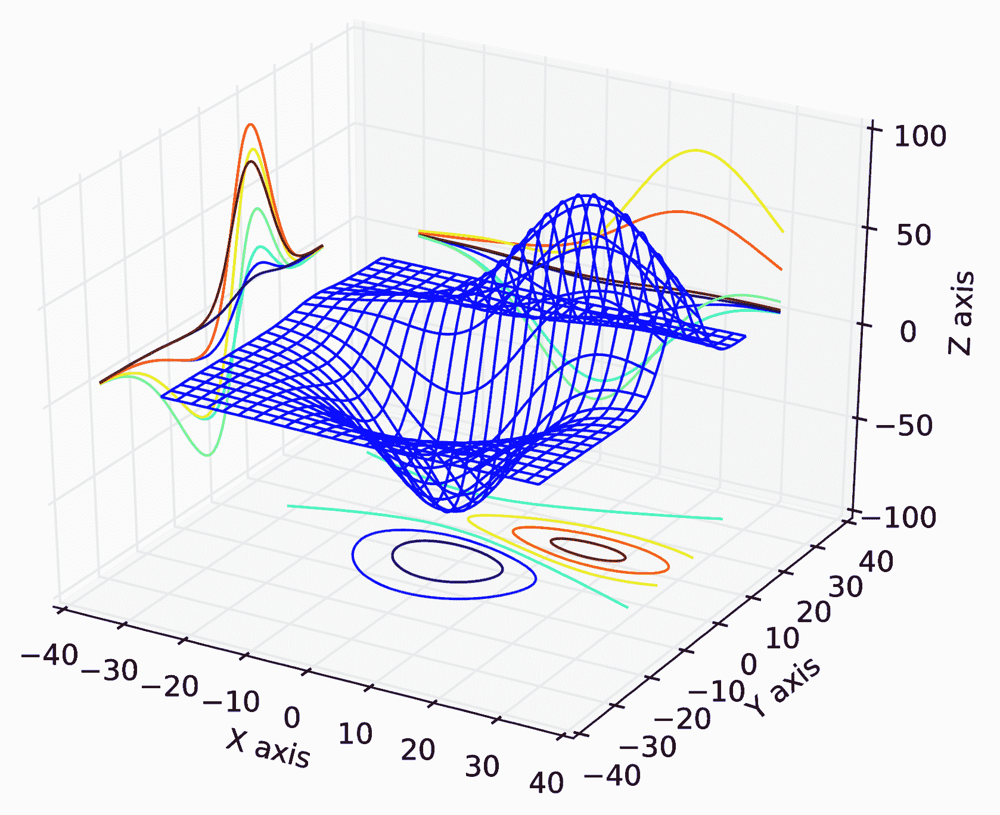

图 6.18：带有额外等高线图的三维图，在三个坐标投影中展示

有许多选项可供设置图形的外观，包括颜色和表面透明度。`mplot3d` 文档网站 [[23]](12bddbb5-edd0-46c6-8f7a-9475aaf01a9d.xhtml) 中有详细信息。

数学对象有时通过一系列图片甚至电影来动态可视化效果更佳。这是下一节的主题。

# 6.4 从图形生成电影

如果你有演变的数据，可能希望将其保存为电影，并在图形窗口中显示，类似于命令 `savefig`。一种方法是使用模块 `visvis`，请参阅 [37]。

这里是一个使用隐式表示演变圆形的简单示例。令圆形由一个函数的零水平表示，

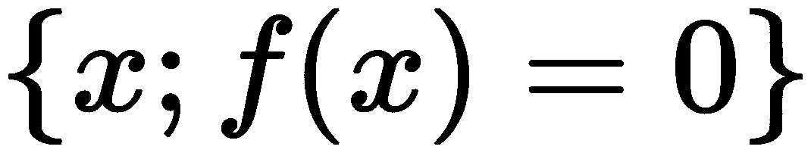 一个函数 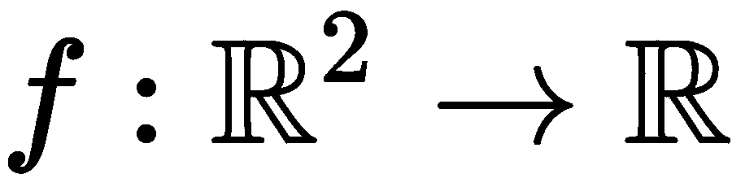 的零水平。

另外，考虑到盘面 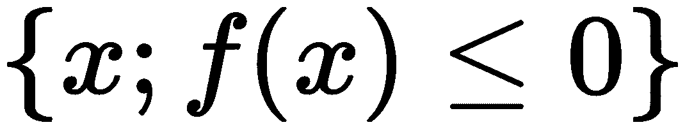 在 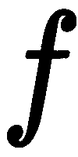 的零集内。如果  的值以速率 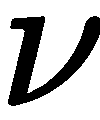 递减，则圆圈将以速率 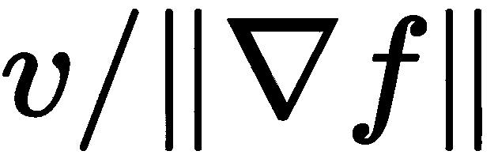 向外移动。

这可以实现为：

```py
import visvis.vvmovie as vv

# create initial function values
x = linspace(-255,255,511)
X,Y = meshgrid(x,x)
f = sqrt(X*X+Y*Y) - 40 #radius 40

# evolve and store in a list
imlist = []
for iteration in range(200):
    imlist.append((f>0)*255)
    f -= 1 # move outwards one pixel
vv.images2swf.writeSwf('circle_evolution.swf',imlist)
```

结果是一个黑色圆圈逐渐扩大的动画（`*.swf` 文件），如 *图 6.19* 所示。

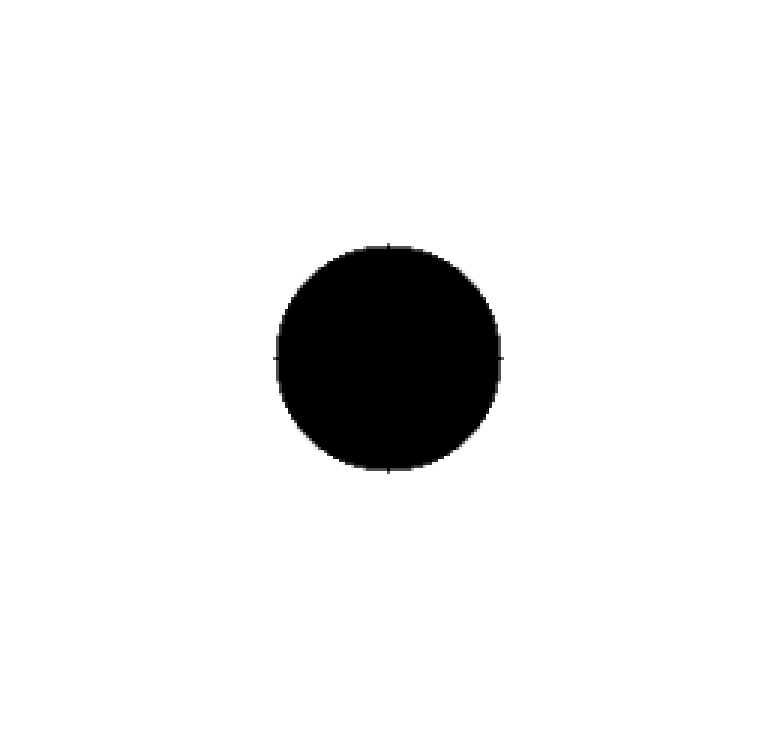   

图 6.19：演变圆圈的示例

在这个示例中，使用了一组数组来创建动画。模块 `visvis` 也可以保存 GIF 动画，并且在某些平台上，可以生成 AVI 动画（`*.gif` 和 `*.avi` 文件）。此外，还可以直接从图形窗口捕捉电影帧。然而，这些选项要求系统安装更多的包（例如，`PyOpenGL` 和 `PIL`，即 Python 图像库）。有关更多细节，请参阅 `visvis` 官方网页上的文档。

另一种选择是使用 `savefig` 创建图像，为每一帧生成一张图像。以下代码示例创建了一系列 200 张图片文件，这些文件可以合并成一个视频：

```py
# create initial function values
x = linspace(-255,255,511)
X,Y = meshgrid(x,x)
f = sqrt(X*X+Y*Y) - 40 #radius 40
for iteration in range(200):
    imshow((f>0)*255, aspect='auto')
    gray()
    axis('off')
    savefig('circle_evolution_{:d}.png'.format(iteration))
    f -= 1
```

这些图像可以使用标准视频编辑软件进行合并，例如 Mencoder 或 ImageMagick。该方法的优点是你可以通过保存高分辨率图像来制作高分辨率视频。

# 6.5 小结

图形表示是展示数学结果或算法行为最紧凑的形式。本章为你提供了绘图的基本工具，并介绍了一种更精细的面向对象的图形对象工作方式，例如图形、坐标轴和线条。

在本章中，你学习了如何绘制图形，不仅是经典的 *x/y* 图，还有 3D 图和直方图。我们还为你提供了制作影片的前菜。你还看到了如何修改图形，视其为图形对象，并使用相关的方法和属性进行设置、删除或修改。

# 6.6 练习

**示例 1：** 编写一个函数，给定椭圆的中心坐标 (*x,y*)，半轴 *a* 和 *b* 以及旋转角度，绘制椭圆 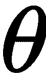。

**示例 2：** 编写一个简短的程序，接受一个二维数组，例如前面的曼德尔布罗特轮廓图，并迭代地将每个值替换为其邻居的平均值。在图形窗口中更新数组的轮廓图，以动画形式展示轮廓的演变。解释其行为。

**示例 3：** 考虑一个 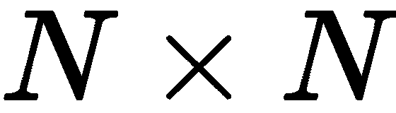 矩阵或整数值图像。映射

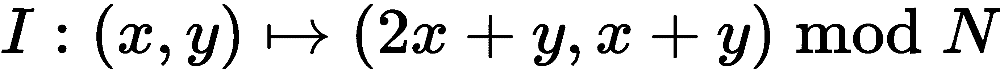

是一个点阵网格映射到自身的示例。这个方法有一个有趣的特性，它通过剪切然后使用模函数`mod`将超出图像的部分移回图像内，进而使图像随机化，最终恢复到原始图像。依照以下顺序实施，

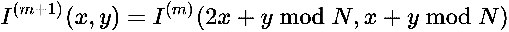,

并将前几个步骤！[](img/324ad186-7011-4d4f-8639-4ce386dfdc15.png)保存为文件或绘制到图形窗口中。

作为示例图像，你可以使用经典的 512*×*512 Lena 测试图像，该图像来自`scipy.misc`：

```py
from scipy.misc import lena
I = lena()
```

结果应该如下所示：

|  | 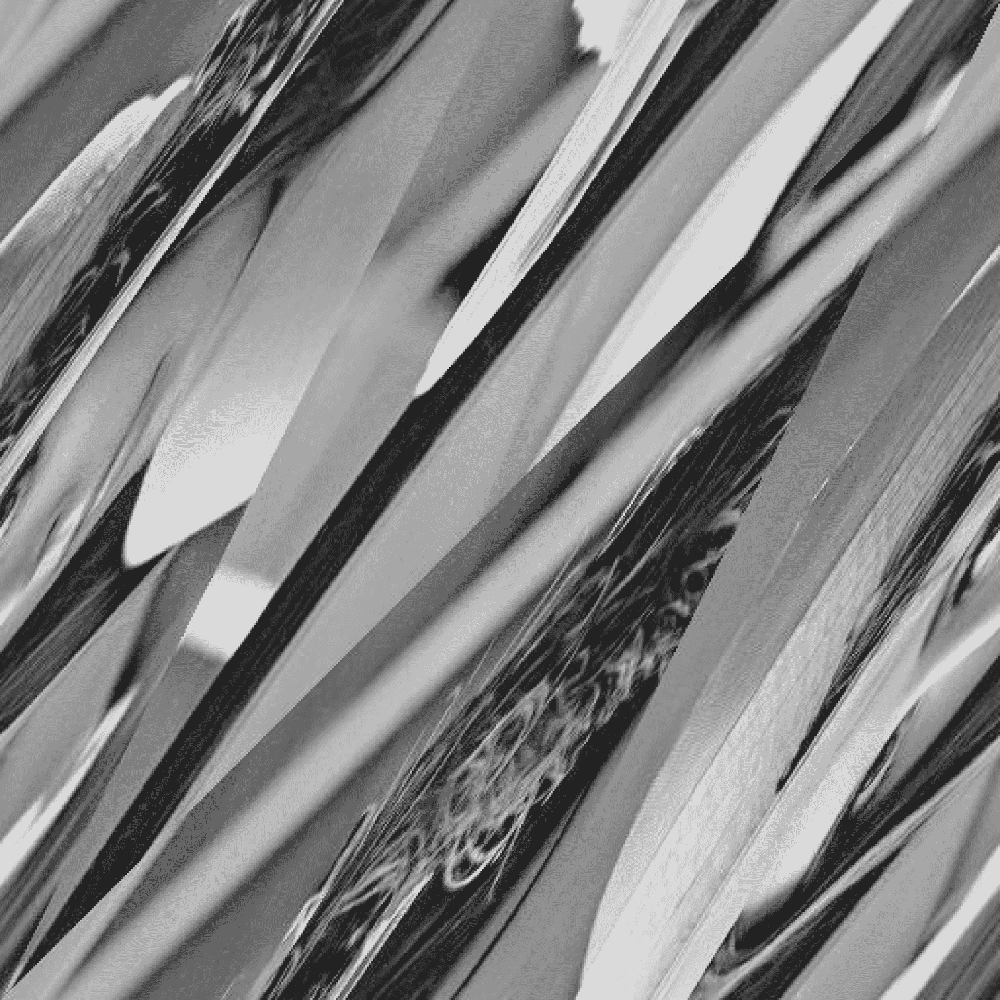 | … | 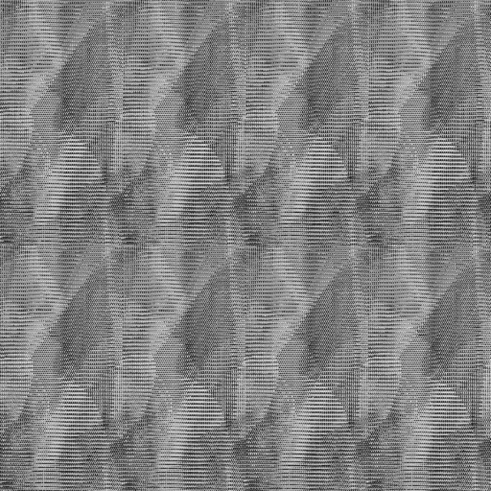 | … | 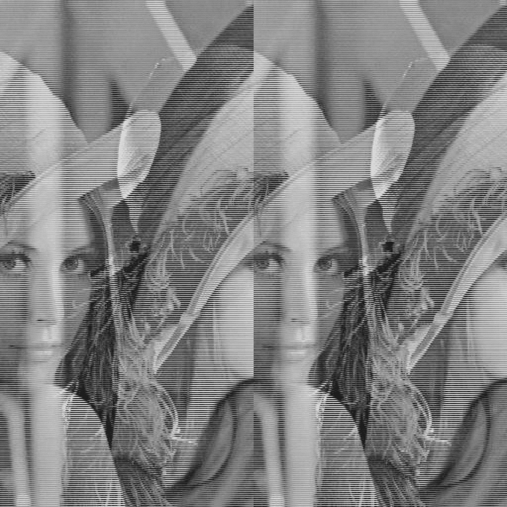 | … |  |  |
| --- | --- | --- | --- | --- | --- | --- | --- | --- |
| 0 | 1 |   | 128 |   | 256 |   | 511 | 512 |

计算*x*和*y*映射，并使用数组索引（参见第 5.3 节：*数组索引*）来复制像素值。

**Ex. 4:** 读取并绘制图像。SciPy 提供了`imread`函数（位于`scipy.misc`模块中）来读取图像（参见第 14.6 节: *读取和写入图像*）。编写一个简短的程序，从文件中读取图像，并在原始图像上叠加给定灰度值的图像轮廓。你可以通过像这样平均颜色通道来获得图像的灰度版本：`mean(im,axis=2)`

**Ex. 5:** 图像边缘。二维拉普拉斯算子的零交叉是图像边缘的一个很好指示。修改前一个练习中的程序，使用`scipy.ndimage`模块中的`gaussian_laplace`或`laplace`函数来计算二维拉普拉斯算子，并将边缘叠加到图像上。

**Ex. 6:** 通过使用`orgid`代替`meshgrid`，重新编写曼德博集合分形示例第 6.1.4 节：*生成图像和轮廓*。参见第 5.5.3 节对`ogrid`的解释，*典型示例*。`orgid`、`mgrid`和`meshgrid`之间有什么区别？

**Ex. 7:** 在*图*6.20 中，研究了使用反正切函数来近似跳跃函数（Heaviside 函数）。该曲线的一部分被放大以可视化近似的质量。通过你自己的代码重现这张图。

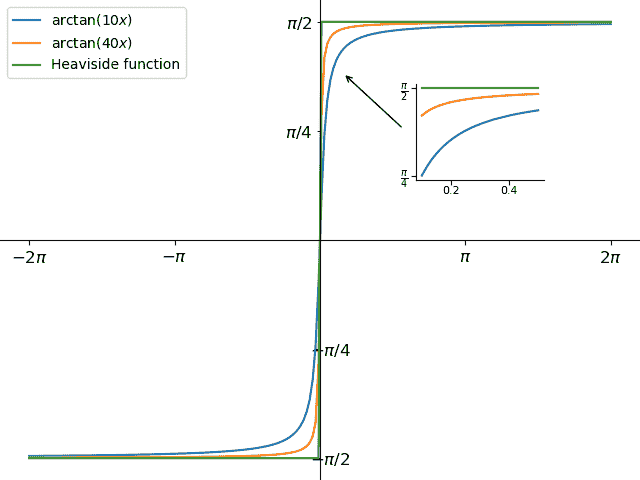

图 6.20：使用反正切函数近似 Heaviside 函数（跳跃函数）
