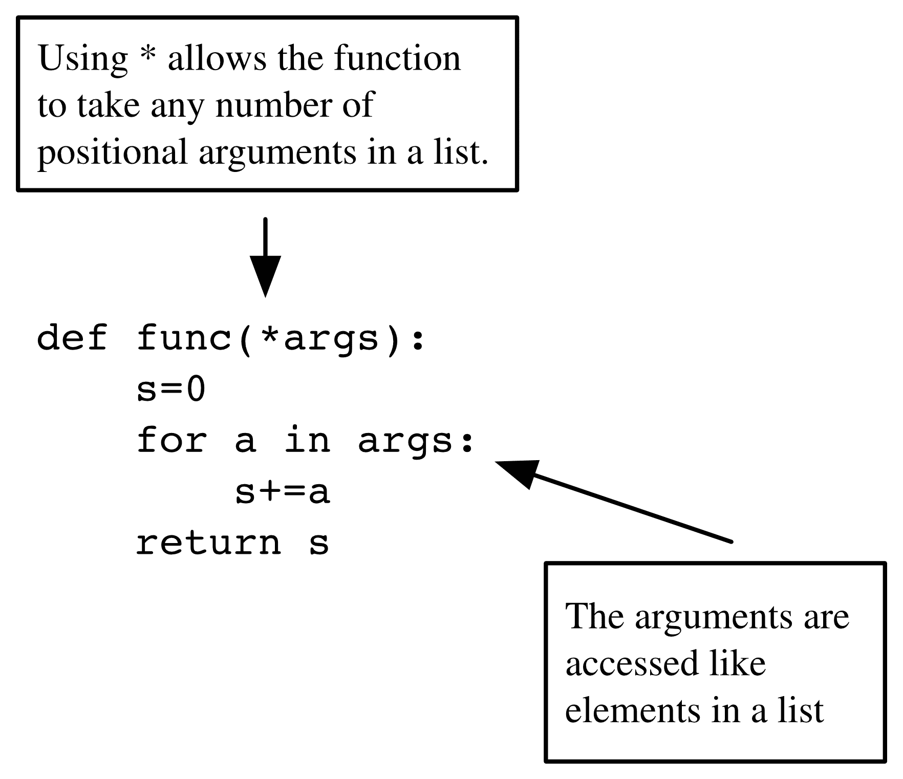
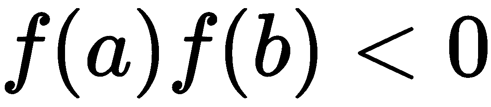
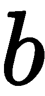

函数

本章介绍了函数，这是编程中的一个基本构建块。我们展示了如何定义函数、如何处理输入和输出、如何正确使用它们以及如何将它们视为对象。

本章将涉及以下主题：

+   数学中的函数与 Python 中的函数

+   参数和参数值

+   返回值

+   递归函数

+   函数文档

+   函数是对象

+   匿名函数 – 关键字`lambda`

+   函数作为装饰器

# 第八章：7.1 数学中的函数与 Python 中的函数

在数学中，函数表示为一个映射，它唯一地将域*！[](img/15cf5f8d-54c0-4464-8e43-130804048db7.png)*中的每个元素*！[](img/89f426e0-adb7-4ef9-b912-278993b26f35.png)*与范围*！[](img/196ecfe6-b8c8-4550-9f29-9b136a555cc7.png)*中的对应元素*！[](img/d900968b-92f1-4fdb-9c1c-438c64794e2b.png)*相联系。

这通过*！[](img/89d0dd79-9ade-4d44-b0eb-0626c808e581.png)*来表示。

或者，在考虑特定元素*！[](img/e2fc557d-295f-4e14-88df-711e26a8f84f.png)*和*！[](img/632e9af1-ad40-45a1-ab58-0e09997f0262.png)*时，可以写成*！[](img/5f74a00c-0ba1-4bf4-9ea2-6ba4bc30ac39.png)*。

这里，*！[](img/56d5d832-f148-4f4b-a6e1-e1f0fcc2652a.png)*被称为函数的名称，而*！[](img/3588ed47-5f38-428e-acf2-876c76dd8d16.png)*是其应用于*！[](img/a5117bc4-e31a-4d05-9465-f5b747caea99.png)*时的值。这里，*！[](img/3435f1a2-4591-43ed-b9af-99edeb63de74.png)*有时被称为*！[](img/ab2f2260-ab84-4410-9a3e-8902931eb19a.png)*的参数。在考虑 Python 中的函数之前，让我们先看一个示例。

例如，*！[](img/31802895-c824-49de-9a09-bf24daaa65fb.png)*和*！[](img/f7efefb7-81ad-4118-9f5d-30133e021096.png)*。这个函数将两个实数映射到它们的差值。

在数学中，函数可以接受数字、向量、矩阵，甚至其他函数作为参数。下面是一个带有混合参数的函数示例：

*！[](img/f736ebec-686e-4796-b4a9-f0d3d54ac072.png)*

在这种情况下，返回的是一个实数。在处理函数时，我们需要区分两个不同的步骤：

+   函数的定义

+   函数的求值，也就是计算给定值的*！[](img/c1ac1058-17b6-4c2d-ba2f-f8ce7303bde3.png)*对于*！[](img/7bbf122b-e48d-4395-96df-d601e8dee3dc.png)*

第一步只需要执行一次，而第二步可以针对不同的参数执行多次。

编程语言中的函数遵循类似的概念，并将其应用于各种类型的输入参数，例如字符串、列表、浮动数或任何对象。我们通过再次考虑给定的示例来演示函数的定义：

```py
def subtract(x1, x2):
    return x1 - x2
```

关键字`def`表示我们将定义一个函数。`subtract`是函数的名称，`x1`和`x2`是它的参数。冒号表示我们正在使用一个代码块。函数返回的值跟在关键字`return`后面。

现在，我们可以评估这个函数。该函数在其参数被输入参数替代后被调用：

```py
r = subtract(5.0, 4.3)
```

结果`0.7`被计算并赋值给变量`r`。

# 7.2 参数和参数值

在定义函数时，其输入变量称为函数的*参数*。在执行函数时使用的输入称为其*参数值*。

## 7.2.1 传递参数——通过位置和关键字

我们将再次考虑之前的例子，其中函数有两个参数，分别是`x1`和`x2`。

它们的名字用于区分这两个数，这两个数在此情况下不能互换，否则会改变结果。第一个参数定义了从中减去第二个参数的数字。当`subtract`函数被调用时，每个参数都被替换为一个参数值。参数的顺序很重要；参数可以是任何对象。例如，我们可以调用如下：

```py
z = 3 
e = subtract(5,z)
```

除了这种标准的调用函数方式，即通过位置传递参数，有时使用关键字传递参数可能会更方便。参数的名称就是关键字；考虑以下示例：

```py
z = 3 
e = subtract(x2 = z, x1 = 5)
```

在这里，参数是通过名称分配给参数的，而不是通过调用中的位置。两种调用函数的方式可以结合使用，使得位置参数排在前面，关键字参数排在后面。我们通过使用函数`plot`来演示这种方式，`plot`函数在第 6.1 节：*基本绘图*中有描述：

```py
plot(xp, yp, linewidth = 2, label = 'y-values')
```

## 7.2.2 改变参数值

参数的目的是为函数提供必要的输入数据。在函数内部改变参数的值通常不会影响函数外部的值：

```py
def subtract(x1, x2):
    z = x1 - x2
    x2 = 50.
    return z
a = 20.
b = subtract(10, a)    # returns -10
a    # still has the value 20
```

这适用于所有不可变参数，如字符串、数字和元组。如果更改的是可变参数，如列表或字典，情况就不同了。

例如，将可变输入参数传递给函数，并在函数内更改它们，可能会改变函数外的值：

```py
def subtract(x):
    z = x[0] - x[1]
    x[1] = 50.
    return z
a = [10,20]
b = subtract(a)    # returns -10
a    # is now [10, 50.0]
```

这样的函数错误地使用其参数来返回结果。我们强烈劝阻使用这种构造，并建议你在函数内部不要更改输入参数（有关更多信息，请参见第 7.2.4 节：*默认参数*）。

## 7.2.3 访问定义在局部命名空间外的变量

Python 允许函数访问其任何封闭程序单元中定义的变量。这些变量称为全局变量，与局部变量相对。局部变量只能在函数内部访问。例如，考虑以下代码：

```py
import numpy as np # here the variable np is defined
def sqrt(x):
    return np.sqrt(x) # we use np inside the function
```

不应滥用此特性。以下代码是一个不该使用这种方式的示例：

```py
a = 3
def multiply(x):
    return a * x # bad style: access to the variable a defined outside
```

当修改变量`a`时，函数`multiply`默默地改变了其行为：

```py
a=3
multiply(4)  # returns 12
a=4  
multiply(4)  # returns 16
```

在这种情况下，更好的做法是通过参数列表提供该变量：

```py
def multiply(x, a):
    return a * x
```

全局变量在处理闭包时非常有用；请参见第 7.7 节中的相关示例：*匿名函数——* *关键字* *lambda**。

## 7.2.4 默认参数

有些函数可能有很多参数，其中一些参数可能只在非标准情况下才有意义。如果参数可以自动设置为标准（默认）值，那将是非常实用的。

我们通过查看模块`scipy.linalg`中的命令`norm`来演示默认参数的使用。它计算矩阵和向量的各种范数。更多关于矩阵范数的信息，请参见[[10 ,§2.3]](12bddbb5-edd0-46c6-8f7a-9475aaf01a9d.xhtml)。

以下用于计算 Frobenius **范数**的调用是等效的：  

```py
import scipy.linalg as sl
sl.norm(identity(3))
sl.norm(identity(3), ord = 'fro')
sl.norm(identity(3), 'fro')
```

请注意，在第一次调用时，并没有提供关键字`ord`的任何信息。Python 是如何知道应该计算 Frobenius 范数而不是其他范数，比如欧几里得 2 范数的呢？

上一个问题的答案就是使用默认值。默认值是函数定义时已经给定的值。如果调用函数时没有提供该参数，Python 将使用函数定义时程序员提供的值。

假设我们调用`subtract`函数并只提供一个参数；我们将得到一个错误消息：

```py
TypeError: subtract() takes exactly 2 arguments (1 given)
```

为了允许省略参数`x2`，函数的定义必须提供一个*默认值*，例如：

```py
def subtract(x1, x2 = 0): 
    return x1 - x2
```

默认参数是在函数定义时，通过为参数赋值来指定的。

总结来说，参数可以作为位置参数和关键字参数提供。所有位置参数必须先给出。只要被省略的参数在函数定义中有默认值，就不需要提供所有的关键字参数。

### 小心可变的默认参数

默认参数是在函数定义时设置的。在函数内部修改可变参数会对使用默认值时产生副作用，例如：

```py
def my_list(x1, x2 = []):
    x2.append(x1)
    return x2
my_list(1)  # returns [1]
my_list(2)  # returns [1,2]
```

回想一下，列表是可变对象。

## 7.2.5 可变数量的参数

列表和字典可以用来定义或调用具有可变数量参数的函数。我们可以定义一个列表和一个字典，如下所示：

```py
data = [[1,2],[3,4]]    
style = dict({'linewidth':3,'marker':'o','color':'green'})
```

然后我们可以使用星号（`*`）参数调用`plot`函数：

```py
plot(*data,**style)
```

以`*`开头的变量名，例如前面示例中的`*data`，意味着将一个列表解包以向函数提供其参数。通过这种方式，列表生成位置参数。类似地，带有`**`前缀的变量名，例如示例中的`**style`，将解包一个字典为关键字参数；见 *图 7.1*：


图 7.1：函数调用中的星号参数

你也可能想要使用反向过程，在这种情况下，所有给定的位置参数会被打包成一个列表，所有的关键字参数会被打包成一个字典并传递给函数。在函数定义中，这通过分别以`*`和`**`作为前缀的参数来表示。你经常会在代码文档中看到`*args`和`**kwargs`这两个参数；参见*图 7.2*。



图 7.2：函数定义中的星号参数

# 7.3 返回值

Python 中的函数总是返回一个单一的对象。如果一个函数必须返回多个对象，它们会被打包并作为一个单一的元组对象返回。

例如，下面的函数接受一个复数！[](img/0bac0f3d-d6ac-4268-a99e-0f971194689b.png)，并返回其极坐标表示形式，包含幅度！[](img/5530f0e2-5dac-46e6-9980-2221beb32362.png)和角度！[](img/7414aca2-5855-4e3b-9c08-d2f13de7acc3.png)：

```py
def complex_to_polar(z):
    r = sqrt(z.real ** 2 + z.imag ** 2)
    phi = arctan2(z.imag, z.real)
    return (r,phi)  # here the return object is formedcite
```

（另请参见欧拉公式，）。

在这里，我们使用了 NumPy 函数`sqrt(x)`来计算数字`x`的平方根，并使用`arctan2(x, y)`来表示。

让我们试一下我们的函数：

```py
z = 3 + 5j  # here we define a complex number
a = complex_to_polar(z)
r = a[0]
phi = a[1]
```

下面的三条语句可以在一行中更优雅地写出来：

```py
r,phi = complex_to_polar(z)
```

我们可以通过调用在*练习*部分的*练习 1*中定义的`polar_to_comp`函数来测试我们的函数。

如果一个函数没有`return`语句，它将返回值`None`。有很多情况，函数不需要返回任何值。这可能是因为传递给函数的变量可能会被修改。例如，考虑下面的函数：

```py
def append_to_list(L, x):
    L.append(x)
```

前面的函数不返回任何内容，因为它修改了作为可变参数传递的一个对象。有很多方法的行为也是如此。仅列举列表方法，`append`、`extend`、`reverse`和`sort`这些方法都不返回任何内容（即它们返回`None`）。当一个对象通过这种方式被方法修改时，称为*就地*修改。很难知道一个方法是否会改变一个对象，除非查看代码或文档。

函数或方法不返回任何内容的另一个原因是，当它打印出一条信息或写入文件时。

执行会在第一个出现的`return`语句处停止。该语句之后的行是死代码，永远不会被执行：

```py
def function_with_dead_code(x):
    return 2 * x
    y = x ** 2 # these two lines ...
    return y   # ... are never executed!
```

# 7.4 递归函数

在数学中，许多函数是递归定义的。在本节中，我们将展示如何在编写函数时使用这个概念。这使得程序与其数学对应物之间的关系变得非常清晰，这可能有助于提高程序的可读性。

然而，我们建议谨慎使用这种编程技巧，尤其是在科学计算中。在大多数应用中，更直接的迭代方法通常更高效。通过以下示例，这一点将立刻变得清晰。

切比雪夫多项式由三项递归定义：


这种递归需要初始化，即 *![]*。

在 Python 中，这种 *三项递归* 可以通过以下函数定义来实现：

```py
def chebyshev(n, x):
    if n == 0:
        return 1.
    elif n == 1:
        return x
    else:
        return 2\. * x * chebyshev(n - 1, x) \
                      - chebyshev(n - 2 ,x)
```

要计算 ，函数可以像这样调用：

```py
chebyshev(5, 0.52) # returns 0.39616645119999994
```

这个示例还展示了浪费计算时间的巨大风险。随着递归层级的增加，函数评估的数量呈指数增长，而且这些评估中的大多数只是先前计算的重复结果。虽然使用递归程序来展示代码与数学定义之间的紧密关系可能很诱人，但生产代码通常会避免使用这种编程技巧（参见*练习*6 *节中的练习*部分）。我们还提到了一种叫做记忆化（memoization）的技巧，它将递归编程与缓存技术相结合，以保存重复的函数评估，详见[[22]](12bddbb5-edd0-46c6-8f7a-9475aaf01a9d.xhtml)。

递归函数通常有一个级别参数。在前面的例子中，它是 `n`*.* 它用来控制函数的两个主要部分：

+   基本情况；这里是前两个 `if` 分支

+   递归主体，在这个主体中，函数本身会使用较小级别的参数一次或多次被调用

执行递归函数时经过的层数称为递归深度。这个值不应过大，否则计算可能变得低效，并且在极端情况下，会抛出以下错误：

```py
RuntimeError: maximum recursion depth exceeded
```

最大的递归深度取决于你使用的计算机的内存。这个错误也会在函数定义缺少初始化步骤时发生。我们鼓励仅在非常小的递归深度下使用递归程序（更多信息，请参见第 9.7.2 节：*递归*）。

# 7.5 函数文档

你应该在函数开始时使用一个字符串来记录文档，这个字符串叫做 *文档字符串*：

```py
def newton(f, x0):
    """
    Newton's method for computing a zero of a function
    on input:
    f  (function) given function f(x)
    x0 (float) initial guess 
    on return:
    y  (float) the approximated zero of f
    """
    ...
```

当调用 `help(newton)` 时，你会看到这个文档字符串与函数调用一起显示出来：

```py
Help on function newton in module __main__:

newton(f, x0)
     Newton's method for computing a zero of a function
     on input:
     f  (function) given function f(x)
     x0 (float) initial guess
     on return:
     y  (float) the approximated zero of f
```

文档字符串被内部保存为给定函数的一个属性，`__doc__`。在这个例子中，它是 `newton.__doc__`。你应该在文档字符串中提供的最基本信息是函数的目的以及输入和输出对象的描述。有一些工具可以通过收集程序中的所有文档字符串来自动生成完整的代码文档（更多信息，请参见 Sphinx 的文档，[[32]](12bddbb5-edd0-46c6-8f7a-9475aaf01a9d.xhtml)）。

# 7.6 函数是对象

函数是对象，就像 Python 中的其他一切。你可以将函数作为参数传递、修改其名称或删除它们。例如：

```py
def square(x):
    """
    Return the square of x
    """
    return x ** 2
square(4) # 16
sq = square # now sq is the same as square
sq(4) # 16
del square # square doesn't exist anymore
print(newton(sq, .2)) # passing as argument
```

在科学计算中，传递函数作为参数是非常常见的。当应用算法时，`scipy.optimize`中的函数`fsolve`用于计算给定函数的零点，或者`scipy.integrate`中的`quad`用于计算积分，都是典型的例子。

一个函数本身可以具有不同数量和类型的参数。所以，当你将函数`f`作为参数传递给另一个函数`g`时，请确保`f`的形式与`g`的文档字符串中描述的完全一致。

`fsolve`的文档字符串提供了关于其参数`func`的信息：

```py
 fun c -- A Python function or method which takes at least one
               (possibly vector) argument.
```

## 7.6.1 部分应用

让我们从一个具有两个变量的函数例子开始。

函数  可以看作是一个双变量的函数。通常，你会把  视为一个固定的参数，而不是一个自由变量，属于一族函数 **：

**

这个解释将一个双变量函数简化为一个单变量函数 ，其中固定了一个参数值 **。通过固定（冻结）函数的一个或多个参数来定义一个新函数的过程称为部分应用。

使用 Python 模块`functools`可以轻松创建部分应用，它提供了一个名为`partial`的函数，专门用于这个目的。我们通过构造一个返回给定频率的正弦函数来说明这一点：

```py
import functools 
def sin_omega(t, freq):
    return sin(2 * pi * freq * t)

def make_sine(frequency):
    return functools.partial(sin_omega, freq = frequency)

fomega=make_sine(0.25)
fomega(3) # returns -1.0
```

在最后一行，新的函数在  被求值。

## 7.6.2 使用闭包

从函数是对象的角度出发，可以通过编写一个函数来实现部分应用，这个函数本身返回一个新的函数，并且输入参数的数量减少。例如，函数`make_sine`可以定义如下：

```py
def make_sine(freq):
    "Make a sine function with frequency freq"
    def mysine(t):
        return sin_omega(t, freq)
    return mysine
```

在这个例子中，内嵌函数`mysine`可以访问变量`freq`；它既不是该函数的局部变量，也没有通过参数列表传递给它。Python 允许这样的构造，参见章节 13.1，*命名空间*。

# 7.7 匿名函数 —— 关键字 lambda

关键字`lambda`在 Python 中用于定义匿名函数，也就是没有名字、由单一表达式描述的函数。你可能只想对一个可以通过简单表达式表示的函数执行某个操作，而不需要给这个函数命名，也不需要通过冗长的`def`块来定义它。

名字*lambda*源自微积分和数学逻辑的一个特殊分支，即 -微积分。

我们通过数值评估以下积分来演示`lambda`函数的使用：


我们使用 SciPy 的`quad`函数，它的第一个参数是要积分的函数，接下来的两个参数是积分区间。这里，待积分的函数只是一个简单的一行代码，我们使用`lambda`关键字来定义它：

```py
import scipy.integrate as si
si.quad(lambda x: x ** 2 + 5, 0, 1)
```

语法如下：

```py
lambda parameter_list: expression
```

`lambda`函数的定义只能由一个单一的表达式组成，特别的是，不能包含循环。`lambda`函数与其他函数一样，都是对象，可以赋值给变量：

```py
parabola = lambda x: x ** 2 + 5
parabola(3) # gives 14
```

## 7.7.1 `lambda`构造总是可以替换的

需要注意的是，`lambda`构造只是 Python 中的语法糖。任何`lambda`构造都可以被显式的函数定义所替代：

```py
parabola = lambda x: x**2+5 
# the following code is equivalent
def parabola(x):
    return x ** 2 + 5
```

使用这种构造的主要原因是对于非常简单的函数来说，完整的函数定义会显得过于繁琐。

`lambda`函数提供了创建闭包的第三种方式，正如我们通过继续前面的例子![]所演示的那样。

我们使用第 7.6.1 节中的`sin_omega`函数，*部分应用*，来计算不同频率下正弦函数的积分：

```py
import scipy.integrate as si
for iteration in range(3):
    print(si.quad(lambda x: sin_omega(x, iteration*pi), 0, pi/2.) )
```

# 7.8 函数作为装饰器

在第 7.6.1 节：*部分应用*中，我们看到如何使用一个函数来修改另一个函数。*装饰器*是 Python 中的一个语法元素，它方便地允许我们改变函数的行为，而无需修改函数本身的定义。让我们从以下情况开始。

假设我们有一个函数用来确定矩阵的稀疏度：

```py
def how_sparse(A):
    return len(A.reshape(-1).nonzero()[0])
```

如果未以数组对象作为输入调用此函数，则会返回一个错误。更准确地说，它将无法与没有实现`reshape`方法的对象一起工作。例如，`how_sparse`函数无法与列表一起工作，因为列表没有`reshape`方法。以下辅助函数修改任何具有一个输入参数的函数，以便尝试将其类型转换为数组：

```py
def cast2array(f):
    def new_function(obj):
        fA = f(array(obj))
        return fA
    return new_function
```

因此，修改后的函数`how_sparse = cast2array(how_sparse)`可以应用于任何可以转换为数组的对象。如果`how_sparse`的定义用这个类型转换函数进行装饰，也可以实现相同的功能：

```py
@cast2array def how_sparse(A): return len(A.reshape(-1).nonzero()[0])
```

要定义一个装饰器，你需要一个可调用的对象，例如一个修改被装饰函数定义的函数。其主要目的包括：

+   通过将不直接服务于函数功能的部分分离来增加代码可读性（例如，记忆化）

+   将一组类似函数的公共前言和尾部部分放在一个共同的地方（例如，类型检查）

+   为了能够方便地开关函数的附加功能（例如，测试打印或追踪）

还建议考虑使用`functools.wraps`，详情请见[[8]](12bddbb5-edd0-46c6-8f7a-9475aaf01a9d.xhtml)。

# 7.9 小结

函数不仅是使程序模块化的理想工具，还能反映出数学思维。你已经学习了函数定义的语法，并了解如何区分定义函数和调用函数。

我们将函数视为可以被其他函数修改的对象。在处理函数时，了解变量的作用域以及如何通过参数将信息传递到函数中是非常重要的。

有时，定义所谓的匿名函数非常方便。为此，我们引入了关键字`lambda`。

# 7.10 练习

**例 1**：编写一个函数 `polar_to_comp`，该函数接收两个参数  和 ，并返回复数 。使用 NumPy 函数 `exp` 来计算指数函数。

**例 2**：在 Python 模块 `functools` 的描述中[[8]](12bddbb5-edd0-46c6-8f7a-9475aaf01a9d.xhtml)，你会找到以下 Python 函数：

```py
def partial(func, *args, **keywords):
    def newfunc(*fargs, **fkeywords):
        newkeywords = keywords.copy()
        newkeywords.update(fkeywords)
        return func(*(args + fargs), **newkeywords)
    newfunc.func = func
    newfunc.args = args
    newfunc.keywords = keywords
    return newfunc
```

解释并测试此函数。

**例 3**：为函数 `how_sparse` 编写一个装饰器，该装饰器通过将小于 `1.e-16` 的元素设置为零来清理输入矩阵 `A`（参考 第 7.8 节：*作为装饰器的函数*）。

**例 4**：一个连续函数 ，其  在区间  内改变符号，并且在该区间内至少有一个根（零）。可以通过*二分法*找到此根。该方法从给定区间开始，接着检查子区间中的符号变化。

 和 。

如果第一个子区间内符号发生变化，则  将重新定义为：


否则，它将以相同的方式重新定义为：


该过程会重复进行，直到区间的长度  小于给定的容差。

+   将此方法实现为一个函数，接收以下参数：

+   函数 

+   初始区间 

+   容差

+   此函数`bisec`应返回最终的区间及其中点。

+   使用函数`arctan`测试该方法，并在区间![]内，以及在![]内，测试多项式*![*]。

**例 5**：可以使用*欧几里得算法*计算两个整数的最大公约数，该算法通过以下递归实现：


编写一个函数，用于计算两个整数的最大公约数。再编写一个函数，利用以下关系计算这两个数的最小公倍数：


**例 6**：研究切比雪夫多项式的递归实现。参考第 7.4 节中的示例：*递归函数*。将程序改写为非递归形式，并研究计算时间与多项式次数的关系（另见`timeit`模块）。
