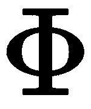
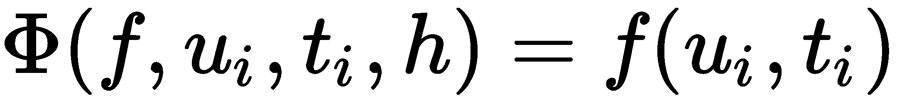

类

在数学中，当我们写  时，我们指的是一个数学对象，对于这个对象，我们知道很多初等微积分的方法。例如：

+   我们可能想在 ![] 处评估 ![]，即计算 ，其结果为一个实数。

+   我们可能想计算它的导数，这会给我们另一个数学对象，**cos**。

+   我们可能想计算其泰勒多项式的前三个系数。

这些方法不仅适用于 **sin**，还适用于其他足够光滑的函数。然而，也有其他数学对象，例如数字 *5*，对于这些对象，这些方法是没有意义的。

具有相同方法的对象被归为抽象类，例如函数。可以应用于函数的每个语句和方法，特别适用于 **sin** 或 **cos**。

此类的其他例子可能是有理数，存在分母和分子方法；区间，具有左边界和右边界方法；无限序列，我们可以询问它是否有极限，等等。

在这种情况下， 被称为*实例*。数学表达式 *设 g 为一个函数...* 在这种情况下被称为**实例化**。这里， 是函数的名称，这是可以分配给它的众多*属性*之一。另一个属性可能是它的定义域。

数学对象 ![] 就像正弦函数。每个函数方法都适用于 ，但我们也可以为  定义特殊的方法。例如，我们可能会要求 *'*s 的系数。这些方法可以用来定义多项式类。由于多项式是函数，它们还*继承*了函数类的所有方法。

在数学中，我们经常使用相同的运算符符号来表示完全不同的运算。例如，在  和  中，运算符符号 `+` 的含义是不同的。通过使用相同的符号，强调了与对应数学运算的相似性。我们通过将这些术语从面向对象编程引入数学示例中，来应用它们，如类、实例和实例化、继承、方法、属性以及运算符重载。

具体来说，在本章中，我们将涵盖以下主题：

+   类的简介

+   绑定方法和非绑定方法

+   类属性和类方法

+   子类和继承

+   封装

+   类作为装饰器

本章将展示这些概念如何在 Python 中使用，并从一些基础知识开始。

# 第九章：8.1 类简介

本节介绍了类的最常见术语及其在 Python 中的实现。

首先，我们设置一个指导性示例。

## 8.1.1 一个指导性示例：有理数

我们将通过有理数的示例来说明类的概念，即形如  的数字，其中  和  是整数。

以下图示给出了一个类声明的示例：


图 8.1：类声明示例

在这里，我们仅使用有理数作为类概念的示例。若要在 Python 中进行有理数运算，请使用 Python 模块 `fractions`。

## 8.1.2 定义类并创建实例

类的定义是通过一个块命令来完成的，该命令使用 `class` 关键字、类名以及块中的一些语句（见 *图 8.1*）：

```py
class RationalNumber: 
    pass
```

通过 `r = RationalNumber()` 创建该类的实例（或换句话说，创建一个 `RationalNumber` 类型的对象），并且查询 `type(r)` 返回的结果是 `<class'__main__.RationalNumber'>`。如果我们想检查一个对象是否是该类的实例，可以使用以下代码：

```py
if isinstance(r, RationalNumber):
    print('Indeed, it belongs to the class RationalNumber')  
```

到目前为止，我们已经生成了一个类型为 `RationalNumber` 的对象，但该对象尚未包含任何数据。此外，尚未定义任何方法来对这些对象进行操作。接下来的章节将讨论这一主题。

## 8.1.3 `__init__` 方法

现在，我们为示例类提供一些属性，即我们为其定义数据。在我们的例子中，这些数据将是分子和分母的值。为此，我们需要定义一个方法 `__init__`，用来使用这些值初始化类：

```py
class RationalNumber:
    def __init__(self, numerator, denominator):
        self.numerator = numerator
        self.denominator = denominator
```

在我们解释添加到类中的特殊函数 `__init__` 之前，我们先演示 `RationalNumber` 对象的实例化：

```py
q = RationalNumber(10, 20)    # Defines a new object
q.numerator                   # returns 10
q.denominator                 # returns 20
```

通过将类名作为函数使用，可以创建一个新的 `RationalNumber` 类型的对象。这条语句做了两件事：

1.  它首先创建一个空对象 `q`。

1.  然后，它应用 `__init__` 函数；也就是说，执行 `q.__init__(10, 20)`。

`__init__` 的第一个参数指的是新对象本身。在函数调用时，这个第一个参数被对象的实例替代。这适用于类的所有方法，而不仅仅是特殊方法 `__init__`。这个第一个参数的特殊作用体现在约定中，通常将其命名为 `self`。

在前面的示例中，`__init__` 函数定义了新对象的两个属性，`numerator` 和 `denominator`。

## 8.1.4 属性和方法

使用类的一个主要原因是可以将对象归为一组并绑定到一个共同的对象上。当我们查看有理数时就看到了这一点；`denominator` 和 `numerator` 是两个我们绑定到 `RationalNumber` 类实例的对象。它们被称为**实例的属性**。一个对象作为类实例的属性这一事实，通过它们的引用方式变得显而易见，我们之前已经默契地使用过这种方式：

```py
​_<object>.attribute
```

下面是一些实例化和属性引用的示例：

```py
q = RationalNumber(3, 5) # instantiation
q.numerator              # attribute access
q.denominator

a = array([1, 2])        # instantiation
a.shape

z = 5 + 4j               # instantiation*step*z.imag
```

一旦实例定义好，我们就可以设置、更改或删除该实例的属性。语法与普通变量相同：

```py
q = RationalNumber(3, 5) 
r = RationalNumber(7, 3)
q.numerator = 17
del r.denominator
```

更改或删除属性可能会产生不希望出现的副作用，甚至可能导致对象失效。我们将在第 8.2 节中学习更多内容：*相互依赖的属性*。由于函数也是对象，我们也可以将函数作为属性使用；它们被称为实例的方法：

```py
<object>.method(<arguments...>)
```

例如，让我们向 `RationalNumber` 类添加一个方法，将数字转换为浮点数：

```py
class RationalNumber:
...
    def convert2float(self):
        return float(self.numerator) / float(self.denominator)
```

同样，这个方法将 `self` 作为第一个（也是唯一的）参数，`self` 是对对象本身的引用。我们使用这个方法时像调用普通函数一样：

```py
q = RationalNumber(10, 20)    # Defines a new object
q.convert2float() # returns 0.5   
```

这等价于以下调用：

```py
RationalNumber.convert2float(q)
```

再次注意，对象实例作为函数的第一个参数插入。这种第一个参数的使用解释了如果该方法带有附加参数时所产生的错误消息。调用 `q.convert2float(15)` 会引发以下错误消息：

```py
TypeError: convert2float() takes exactly 1 argument (2 given)
```

之所以不起作用，是因为 `q.convert2float(15)` 正好等同于 `RationalNumber.convert2float(q,15)`，而这失败了，因为 `RationalNumber.convert2float` 只接受一个参数。

## 8.1.5 特殊方法

特殊方法 `__repr__` 使我们能够定义对象在 Python 解释器中的表现方式。对于有理数，这个方法的可能定义如下：

```py
class RationalNumber:
    ...
    def __repr__(self): 
        return f'{self.numerator} / {self.denominator}'
```

定义了这个方法后，只需输入 `q` 就会返回 `10 / 20`。

我们希望有一个方法能执行两个有理数的加法。第一次尝试可能会得到如下方法：

```py
class RationalNumber:
    ...
    def add(self, other): 
        p1, q1 = self.numerator, self.denominator 
        if isinstance(other, int):        
            p2, q2 = other, 1 
        else: 
            p2, q2 = other.numerator, other.denominator 
        return RationalNumber(p1 * q2 + p2 * q1, q1 * q2)
```

调用此方法的形式如下：

```py
q = RationalNumber(1, 2)
p = RationalNumber(1, 3)
q.add(p)   # returns the RationalNumber for 5/6
```

如果我们能够写成 `q + p` 会更好。但到目前为止，加号对 `RationalNumber` 类型还没有定义。这是通过使用特殊方法 `__add__` 来完成的。因此，只需将 `add` 重命名为 `__add__`，就可以对有理数使用加号：

```py
q = RationalNumber(1, 2)
p = RationalNumber(1, 3)
q + p # RationalNumber(5, 6)
```

表达式 `q + p` 实际上是 `q.__add__(p)` 表达式的别名。在*表 8.1* 中，你可以找到二元运算符（如 `+`、`-` 或 `*`）的特殊方法：

| **运算符** | **方法** | **运算符** | **方法** |
| --- | --- | --- | --- |
| `+` | `__add__` | `+=` | `__iadd__` |
| `*` | `__mul__` | `*=` | `__imul__` |
| `-` | `__sub__` | `-=` | `__isub__` |
| `/` | `__truediv__` | `/=` | `__itruediv__` |
| `//` | `__floordiv__` | `//=` | `__ifloordiv__` |
| `**` | `__pow__` |  |  |
| `==` | `__eq__` | `!=` | `qD__ne__` |
| `<=` | `__le__` | `<` | `__lt__` |
| `>=` | `__ge__` | `>` | `__gt__` |
| `()` | `__call__` | `[]` | `__getitem__` |

表 8.1：一些 Python 运算符及其对应的类方法

为新类实现这些运算符被称为**运算符重载**。运算符重载的另一个示例是一个方法，用于检查两个有理数是否相等：

```py
class RationalNumber:
...
    def __eq__(self, other):
        return self.denominator * other.numerator == \
            self.numerator * other.denominator
```

它的使用方式如下：

```py
p = RationalNumber(1, 2) # instantiation
q = RationalNumber(2, 4) # instantiation
p == q # True
```

不同类之间的操作需要特别注意：

```py
p = RationalNumber(1, 2) # instantiation
p + 5  # corresponds to p.__add__(5)  
5 + p  # returns an error
```

默认情况下，运算符`+`会调用左侧操作数的方法`__add__`。我们编写了代码，使其支持`int`类型和`RationalNumber`类型的对象。在语句`5+p`中，操作数会被交换，调用内建类型`int`的`__add__`方法。由于该方法不知道如何处理有理数，因此会返回错误。这个问题可以通过`__radd__`方法解决，我们现在将其添加到`RationalNumber`类中。方法`__radd__`被称为**反向加法**。

### 反向操作

如果对两个不同类型的操作数应用如`+`这样的操作，首先调用左侧操作数的相应方法（在此情况下为`__add__`）。如果此方法引发异常，则调用右侧操作数的反向方法（这里是`__radd__`）。如果该方法不存在，则会引发`TypeError`异常。

为了实现操作![]，其中![]是`RationalNumber`的一个实例，我们将`__radd__`定义为：

```py
class RationalNumber:
   ....
    def __radd__(self, other):
        return self + other
```

注意，`__radd__`会交换参数的顺序；`self`是`RationalNumber`类型的对象，而`other`是必须转换的对象。

### 模拟函数调用和可迭代对象的方法

使用类实例和括号或中括号`()`或`[]`，调用的是特殊方法`__call__`或`__getitem__`，使得该实例表现得像函数或可迭代对象；另见*表 8.1*。

```py
class Polynomial:
    ...
    def __call__(self, x):
        return self.eval(x)
```

现在可以按如下方式使用：

```py
p = Polynomial(...)    # Creating a polynomial object
p(3.) # value of p at 3.
```

特殊方法`__getitem__`是有意义的，如果类提供了迭代器（建议你在考虑以下示例之前，回顾第 9.2.1 节：*生成器*）。

递归![]被称为**三项递归**。它在应用数学中扮演着重要角色，尤其是在构造正交多项式时。我们可以通过以下方式将三项递归设置为一个类：

```py
import itertools

class  Recursion3Term:
    def __init__(self, a0, a1, u0, u1):
        self.coeff = [a1, a0]
        self.initial = [u1, u0]
    def __iter__(self):
        u1, u0 = self.initial
        yield u0  # (see also Iterators section in Chapter 9) 
        yield u1
        a1, a0 = self.coeff
        while True :
            u1, u0 = a1 * u1 + a0 * u0, u1
            yield u1
    def __getitem__(self, k):
        return list(itertools.islice(self, k, k + 1))[0]
```

这里，方法`__iter__`定义了一个生成器对象，使得我们可以将类的实例作为迭代器使用：

```py
r3 = Recursion3Term(-0.35, 1.2, 1, 1)
for i, r in enumerate(r3):
    if i == 7:
        print(r)  # returns 0.194167
        break
```

方法`__getitem__`使我们能够像访问列表一样直接访问迭代结果，假设`r3`是一个列表：

```py
r3[7] # returns 0.194167
```

请注意，在编写`__getitem__`时，我们使用了`itertools.islice`（有关更多信息，请参见第 9.3.2 节：“迭代器工具”）。

## 8.2 彼此依赖的属性

实例的属性可以通过简单地为其赋值来修改（或创建）。然而，如果其他属性依赖于刚刚改变的属性，最好同时修改它们。

为了证明这一点，我们考虑一个例子：假设我们定义一个类，该类通过三个给定点来定义平面三角形对象。第一次尝试建立这样一个类可能是如下所示：

```py
class Triangle:
    def __init__(self,  A, B, C):
        self.A = array(A)
        self.B = array(B)
        self.C = array(C)
        self.a = self.C - self.B
        self.b = self.C - self.A
        self.c = self.B - self.A
    def area(self):
        return abs(cross(self.b, self.c)) / 2
```

这个三角形的实例通过以下方式创建：

```py
tr = Triangle([0., 0.], [1., 0.], [0., 1.])
```

然后通过调用相应的方法计算其面积：

```py
tr.area() # returns 0.5
```

如果我们改变一个属性，比如点*B*，对应的边*a*和*c*不会自动更新，计算出的面积也会出错：

```py
tr.B = [12., 0.]
tr.area() # still returns 0.5, should be 6 instead.
```

一种解决方法是定义一个方法，该方法在属性改变时执行；这样的一个方法称为**设置器方法**。相应地，你可能需要一个在请求属性值时执行的方法；这样的一个方法称为**获取器方法**。我们现在将解释这两种方法是如何定义的。

## 8.2.1 函数属性

特殊函数`property`将属性与获取器、设置器和删除器方法关联。它也可以用来为属性分配文档字符串：

```py
attribute = property(fget = get_attr, fset = set_attr, 
                     fdel = del_attr, doc = string)
```

我们继续之前的例子，使用设置器方法，再次考虑`Triangle`类。如果在该类的定义中包括以下语句，那么命令`tr.B = <某些值>`会调用设置器方法`set_B`：

```py
B = property(fget = get_B, fset = set_B, fdel = del_B, 
             doc = ’The point B of a triangle’)
```

让我们相应地修改`Triangle`类：

```py
class Triangle:
    def __init__(self, A, B, C):
        self._A = array(A)
        self._B = array(B)
        self._C = array(C)
        self._a = self._C - self._B
        self._b = self._C - self._A
        self._c = self._B - self._A
    def area(self):
        return abs(cross(self._c, self._b)) / 2.
    def set_B(self, B):
        self._B = B
        self._a = self._C - self._B
        self._c = self._B - self._A
    def get_B(self):
        return self._B
    def del_Pt(self):
        raise Exception('A triangle point cannot be deleted')
    B = property(fget = get_B, fset = set_B, fdel = del_Pt)
```

如果属性`B`被改变，那么`set_B`方法会将新值存储到内部属性`_B`中，并改变所有依赖的属性：

```py
tr.B = [12., 0.]
tr.area() # returns 6.0
```

这里使用删除器方法的方式是为了防止删除属性：

```py
del tr.B # raises an exception
```

使用下划线作为属性名的前缀是一种约定，用来表示这些属性不打算被直接访问。它们用于存储由设置器和获取器处理的属性的数据。这些属性并不像其他编程语言中的私有属性那样真正私密，它们只是没有直接访问的设计意图。

# 8.3 绑定与未绑定的方法

现在我们将更详细地查看作为方法的属性。我们来看一个例子：

```py
class A:
    def func(self,arg):
        pass
```

稍微检查一下，我们可以发现创建实例后，`func`的性质发生了变化：

```py
A.func  # <unbound method A.func>
instA = A()  # we create an instance
instA.func  #  <bound method A.func of ... >
```

例如，调用`A.func(3)`会导致类似这样的错误信息：

```py
TypeError: func() missing 1 required positional argument: 'arg'
```

`instA.func(3)`按预期执行。在实例创建时，方法`func`绑定到该实例。参数`self`被分配为实例的值。将方法绑定到实例上，使得该方法可以作为函数使用。在此之前，它没有任何用途。类方法（我们将在第 8.4.2 节：“类方法”中讨论）在这一点上与之不同。

# 8.4 类属性和类方法

到目前为止，我们已经看到了绑定到类实例上的属性和方法。在这一节中，我们介绍类属性和类方法。它们允许在实例创建之前访问方法和数据。

## 8.4.1 类属性

在类声明中指定的属性称为**类属性**。考虑以下示例：

```py
class Newton:
    tol = 1e-8 # this is a class attribute
    def __init__(self,f):
        self.f = f # this is not a class attribute
    ...
```

类属性对于模拟默认值非常有用，如果需要重置值时可以使用：

```py
N1 = Newton(f)
N2 = Newton(g)
```

两个实例都有一个属性 `tol`，其值在类定义中初始化：

```py
N1.tol # 1e-8
N2.tol # 1e-8
```

修改类属性会自动影响所有实例的相应属性：

```py
Newton.tol = 1e-10
N1.tol # 1e-10
N2.tol # 1e-10
```

修改一个实例的 `tol` 不会影响另一个实例：

```py
N2.tol = 1.e-4
N1.tol  # still 1.e-10
```

但现在，`N2.tol` 已从类属性中分离出来。更改 `Newton.tol` 不再对 `N2.tol` 产生任何影响：

```py
Newton.tol = 1e-5 
# now all instances of the Newton classes have tol=1e-5
N1.tol # 1.e-5
N2.tol # 1.e-4 
# N2.tol is now detached and therefore not altered
```

## 8.4.2 类方法

我们在第 8.3 节中看到过：*绑定和未绑定的方法*，方法要么绑定到类的实例，要么保持未绑定的方法状态。类方法则不同，它们始终是绑定方法。它们绑定到类本身。

我们将首先描述语法细节，然后给出一些示例，展示这些方法的用途。

为了表明一个方法是类方法，装饰器行应当出现在方法定义之前：

```py
@classmethod
```

标准方法通过其第一个参数引用实例，而类方法的第一个参数引用的是类本身。按照约定，标准方法的第一个参数称为 `self`，类方法的第一个参数称为 `cls`。

以下是标准情况的示例：

```py
class A:
    def func(self,*args):
         <...>
```

这与 `classmethod` 的示例对比：

```py
class B:
    @classmethod
    def func(cls,*args):
         <...>
```

实际上，类方法可能用于在创建实例之前执行命令，例如在预处理步骤中。请参阅以下示例。

在这个示例中，我们展示了如何使用类方法在创建实例之前准备数据：

```py
class Polynomial:
    def __init__(self, coeff):
        self.coeff = array(coeff)
    @classmethod
    def by_points(cls, x, y):
        degree = x.shape[0] - 1
        coeff = polyfit(x, y, degree)
        return cls(coeff) 
    def __eq__(self, other):
        return allclose(self.coeff, other.coeff)
```

该类的设计使得通过指定系数可以创建一个多项式对象。或者，类方法 `by_points` 允许我们通过插值点定义一个多项式。

即使没有 `Polynomial` 的实例，我们也可以将插值数据转化为多项式系数：

```py
p1 = Polynomial.by_points(array([0., 1.]), array([0., 1.]))
p2 = Polynomial([1., 0.])

print(p1 == p2)  # prints True
```

第 8.7 节中展示了类方法的另一个示例：*类作为装饰器*。在那里，类方法用于访问与该类的多个（或所有）实例相关的信息。

# 8.5 子类和继承

在这一节中，我们介绍一些面向对象编程中的核心概念：**抽象类**、**子类**和**继承**。为了帮助你理解这些概念，我们考虑了另一个数学示例：求解微分方程的单步方法。

普通初值问题的通用形式如下：


数据包括右侧函数 ，初始值 ，以及感兴趣的区间 。

该问题的解是一个函数![]。一个数值算法将这个解表示为一个离散值的向量 ，这些离散值  是对![]的近似值。在这里，![] 和 ![] 是独立变量  的离散化值，在物理模型中，通常表示时间。

一步法通过递归步骤构造解的值 ：


在这里，是一个步进函数，用于描述各个方法，详情请参见[[28]](12bddbb5-edd0-46c6-8f7a-9475aaf01a9d.xhtml)：

+   显式欧拉法: _

+   中点法则：

+   龙格-库塔 4 法：与 

我们在这里所做的，是描述数学算法的典型方式。我们首先通过其思想描述了一种方法，以抽象的方式给出了步骤。要实际使用它，我们必须填写具体方法的参数，在这个例子中，就是函数![]。这也是面向对象编程中常见的解释方式。首先，我们设定一个类，提供方法的抽象描述：

```py
class OneStepMethod:
    def __init__(self, f, x0, interval, N):
        self.f = f
        self.x0 = x0
        self.interval = [t0, te] = interval
        self.grid = linspace(t0, te, N)
        self.h = (te - t0) / N

    def generate(self):
        ti, ui = self.grid[0], self.x0
        yield ti, ui
        for t in self.grid[1:]:
            ui = ui + self.h * self.step(self.f, ui, ti)
            ti = t
            yield ti, ui

    def solve(self):
        self.solution = array(list(self.generate()))

    def plot(self):
        plot(self.solution[:, 0], self.solution[:, 1])

    def step(self, f, u, t):
        raise NotImplementedError()
```

这个抽象类及其方法被用作个别方法的模板：

```py
class ExplicitEuler(OneStepMethod):
    def step(self, f, u, t):
        return f(u, t)

class MidPointRule(OneStepMethod):
    def step(self, f, u, t):
        return f(u + self.h / 2 * f(u, t), t + self.h / 2)
```

请注意，在类定义中，我们作为模板使用的抽象类名称`OneStepMethod`被作为一个额外的参数给出：

```py
class ExplicitEuler(OneStepMethod)
```

这个类被称为**父类**。父类的所有方法和属性都可以被子类继承，前提是这些方法没有被重写。如果在子类中重新定义了这些方法，就会覆盖父类中的方法。方法`step`在子类中被重写，而方法`generate`则是整个家族通用的，因此从父类继承。

在考虑进一步的细节之前，我们将演示如何使用这三种类：

```py
def f(x, t):
    return -0.5 * x

euler = ExplicitEuler(f, 15., [0., 10.], 20)
euler.solve()
euler.plot()
hold(True)
midpoint = MidPointRule(f, 15., [0., 10.], 20)

midpoint.solve()
midpoint.plot()
```

你可以通过使用星号操作符避免重复编写常见的参数列表（有关更多细节，请参见第 7.2.5 节: *可变参数数量*)：

```py
...
argument_list = [f, 15., [0., 10.], 20]
euler = ExplicitEuler(*argument_list)
...
midpoint = MidPointRule(*argument_list)
...
```

注意，抽象类从未被用来创建实例。由于方法`step`没有完全定义，调用它会引发类型为`NotImplementedError`的异常。

有时你需要访问父类的方法或属性。这可以通过命令`super`来实现。当子类使用自己的`__init__`方法扩展父类的`__init__`方法时，这非常有用。

例如，假设我们想给每个求解器类提供一个包含求解器名称的字符串变量。为此，我们为求解器提供一个`__init__`方法，以覆盖父类的`__init__`方法。如果两者都需要使用，我们必须通过命令`super`来引用父类的方法：

```py
class ExplicitEuler(OneStepMethod):
    def __init__(self,*args, **kwargs):
        self.name='Explicit Euler Method'
        super(ExplicitEuler, self).__init__(*args,**kwargs)
    def step(self, f, u, t):
        return f(u, t)
```

注意，你本可以明确地使用父类的名称。使用`super`则允许我们在不更改所有父类引用的情况下更改父类的名称。

# 8.6 封装

有时使用继承是不实际的，甚至是不可能的。这促使我们使用封装。

我们将通过考虑 Python 函数来解释封装的概念，即我们将 Python 类型`function`的对象封装到一个新的类`Function`中，并为其提供一些相关的方法：

```py
class Function:
    def __init__(self, f):
        self.f = f
    def __call__(self, x):
        return self.f(x)
    def __add__(self, g):
        def sum(x):
            return self(x) + g(x)
        return type(self)(sum) 
    def __mul__(self, g): 
        def prod(x):
            return self.f(x) * g(x)
        return type(self)(prod)
    def __radd__(self, g):
        return self + g
    def __rmul__(self, g):
        return self * g
```

注意，操作`__add__`和`__mul__`应该返回相同类的实例。这是通过语句`return type(self)(sum)`来实现的，在这种情况下，这比写`return Function(sum)`更为通用。我们现在可以通过继承来派生子类。

以切比雪夫多项式为例。它们可以在区间![]内计算：

![]

我们将切比雪夫多项式构建为`Function`类的一个实例：

```py
T5 = Function(lambda x: cos(5 * arccos(x)))
T6 = Function(lambda x: cos(6 * arccos(x)))
```

切比雪夫多项式是正交的，意思是：


这可以通过这种构造轻松检查：

```py
import scipy.integrate as sci

weight = Function(lambda x: 1 / sqrt((1 - x ** 2)))
[integral, errorestimate] = \
        sci.quad(weight * T5 * T6, -1, 1) 
# (6.510878470473995e-17, 1.3237018925525037e-14)
```

如果没有封装，像写`weight * T5 * T6`这样的乘法函数是不可能实现的。

# 8.7 类作为装饰器

在第 7.8 节：*函数作为装饰器*中，我们看到了如何通过将另一个函数作为装饰器来修改函数。在第 8.1.5 节：*特殊方法*中，我们看到只要类提供了`__call__`方法，类就可以像函数一样工作。我们将在这里使用这个方法来展示如何将类用作装饰器。

假设我们想改变某些函数的行为，使得在调用函数之前，所有的输入参数都被打印出来。这对于调试非常有用。我们以这个情况为例，来解释装饰器类的使用：

```py
class echo:
    text = 'Input parameters of {name}\n'+\
        'Positional parameters {args}\n'+\
        'Keyword parameters {kwargs}\n'
    def __init__(self, f):
        self.f = f
    def __call__(self, *args, **kwargs):
        print(self.text.format(name = self.f.__name__,
              args = args, kwargs = kwargs))
        return self.f(*args, **kwargs)
```

我们使用这个类来装饰函数定义：

```py
@echo
def line(m, b, x):
    return m * x + b
```

然后，像往常一样调用函数：

```py
line(2., 5., 3.)
line(2., 5., x=3.)
```

在第二次调用时，我们得到以下输出：

```py
Input parameters of line
Positional parameters (2.0, 5.0)
Keyword parameters {'x': 3.0}

11.0
```

这个例子表明，类和函数都可以用作装饰器。类提供了更多的可能性，因为它们还可以用来收集数据。

确实，我们观察到：

+   每个被装饰的函数都会创建一个新的装饰器类实例。

+   一个实例收集的数据可以通过类属性保存，并使另一个实例能够访问；请参见章节 8.4：*类* *属性和类方法*。

最后一项强调了函数装饰器之间的区别。我们现在通过一个装饰器来展示，它能够计数函数调用次数，并将结果存储在一个以函数为键的字典中。

为了分析算法的性能，可能有用的是计算特定函数的调用次数。我们可以在不改变函数定义的情况下获取计数器信息：

```py
class CountCalls:
    """
    Decorator that keeps track of the number of times 
    a function is called.
    """
    instances = {} 
    def __init__(self, f):
        self.f = f
        self.numcalls = 0
        self.instances[f] = self
    def __call__(self, *args, **kwargs):
        self.numcalls += 1
        return self.f(*args, **kwargs)
    @classmethod
    def counts(cls):
        """
        Return a dict of {function: # of calls} for all 
        registered functions.
        """
        return dict([(f.__name__, cls.instances[f].numcalls) 
                                    for f in cls.instances])
```

在这里，我们使用类属性`CountCalls.instances`来存储每个实例的计数器。

让我们看看这个装饰器是如何工作的：

```py
@CountCalls
def line(m, b, x):
    return m * x + b
@CountCalls 
def parabola(a, b, c, x):_
    return a * x ** 2 + b * x + c
line(3., -1., 1.)
parabola(4., 5., -1., 2.)

CountCalls.counts() # returns {'line': 1, 'parabola': 1}
parabola.numcalls # returns 1
```

# 8.8 总结

现代计算机科学中最重要的编程概念之一是面向对象编程。在本章中，我们学习了如何将对象定义为类的实例，并为其提供方法和属性。方法的第一个参数，通常表示为`self`，在其中扮演着重要且特殊的角色。你会看到一些方法，它们可以用来为自定义类定义基本运算，比如`+`和`*`。

虽然在其他编程语言中，属性和方法可以防止被意外使用，但 Python 允许一种技巧来隐藏属性，并通过特殊的 getter 和 setter 方法访问这些隐藏的属性。为此，你会遇到一个重要的函数`property`。

# 8.9 练习

1.  为`RationalNumber`类编写一个` simplify`方法。该方法应返回该分数的简化版本，形式为一个元组。

1.  为了提供带有置信区间的结果，数值数学中引入了一种特殊的计算方法，称为区间算术。定义一个名为`Interval`的类，并为其提供加法、减法、除法、乘法和幂运算（仅限正整数）的相关方法。这些运算遵循以下规则：


为这个类提供方法，使得可以进行`a + I, a I, I + a, I a`类型的运算，其中`I`是一个区间，`a`是整数或浮点数。首先，将整数或浮点数转换为区间`[a,a]`。（提示：你可能想使用函数装饰器来实现这一点；请参见章节 7.8：*函数作为装饰器*。）此外，实现`__contains__`方法，它使你能够使用`x in I`语法检查某个数字是否属于区间`I`，其中`I`是`Interval`类型的对象。通过将多项式`f=lambda x: 25*x**2-4*x+1`应用于一个区间来测试你的类。

1.  考虑第 8.7 节中的示例：*类作为装饰器*。扩展这个示例，创建一个*函数装饰器*，用于统计某个函数被调用的次数；另见第 7.8 节：*函数作为装饰器*。

1.  比较两种在`RationalNumber`类中实现反向加法`__radd__`的方法：一种是第 8.1.5 节中的示例：*特殊方法*，另一种是此处给出的实现：

```py
class RationalNumber:
    ....
    def __radd__(self, other):
        return other + self
```

你预期这个版本会出错吗？错误是什么，你如何解释它？通过执行以下代码测试你的答案：

```py
q = RationalNumber(10, 15)
5 + q
```

1.  考虑装饰器类`CountCalls`，如第 8.7 节中的示例：*类作为装饰器*。为这个类提供一个方法`reset`，该方法将字典`CountCalls.instances`中所有函数的计数器重置为`0`。如果将字典替换为空字典，会发生什么？
