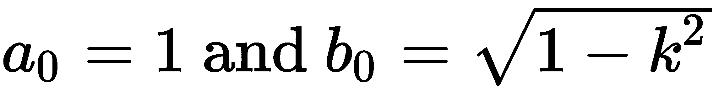

迭代

在本章中，我们将展示使用循环和迭代器进行迭代的示例。我们将展示如何在列表和生成器中使用它们。迭代是计算机的基本操作之一。传统上，通过 `for` 循环实现迭代。`for` 循环是对一组指令块的重复执行。在循环内部，你可以访问一个循环变量，其中存储了迭代的次数。

Python 中的 `for` 循环主要设计用于枚举一个列表，也就是对该列表的每个元素重复相同的命令序列。如果你使用包含前 ![] 个整数的列表，效果类似于刚刚描述的重复效果。

`for` 循环一次只需要列表的一个元素。因此，最好使用能够按需生成这些元素的对象，而不是提供一个完整列表。这就是 Python 中迭代器的作用。

本章涵盖以下主题：

+   `for` 语句

+   控制循环内部的流程

+   可迭代对象

+   填充列表的模式

+   当迭代器像列表一样工作时

+   迭代器对象

+   无限迭代

# 第十章：9.1 `for` 语句

`for` 语句的主要目的是遍历一个列表，也就是对给定列表的每个元素应用相同的一系列命令：

```py
for s in ['a', 'b', 'c']:
    print(s) # a b c
```

在此示例中，循环变量 `s` 依次赋值为列表的每个元素。请注意，循环结束后仍然可以访问循环变量。有时这可能很有用；例如，参见第 9.2 节：*控制循环内部的流程*。

`for` 循环最常见的用途之一是重复，也就是对给定列表的每个元素应用相同的一系列命令：使用函数 `range`，详见第 1.3.1 节：*列表*。

```py
for iteration in range(n): # repeat the following code n times
    ...
```

如果循环的目的是遍历一个列表，许多语言（包括 Python）提供了以下模式：

```py
for k in range(...):
    ...
    element = my_list[k]
```

如果该代码的目的是遍历列表 `my_list`，那么前面的代码就不是很清晰。因此，更好的表达方式如下：

```py
for element in my_list:
    ...
```

现在一眼就能看出前面的代码是在遍历列表 `my_list`。请注意，如果确实需要索引变量 ![]，你可以用这段代码替换前面的代码（另见第 9.3.3 节：*迭代器工具*）：

```py
for k, element in enumerate(my_list):
    ...
```

此段代码的意图是在遍历 `my_list` 的同时保持索引变量 `k` 可用。对数组而言，类似的构造是使用命令 `ndenumerate`：

```py
a=ones((3,5))
for k,el in ndenumerate(a):
    print(k,el)       
# prints something like this:  (1, 3) 1.0
```

# 9.2 在循环内部控制流程

有时需要跳出循环或直接进入下一个循环迭代。这两个操作通过 `break` 和 `continue` 命令来执行。

`break` 关键字用于在循环完全执行之前终止循环——它打破了循环。

在包含 **`break`** 语句的循环中可能会发生两种情况：

+   循环被完全执行。

+   当到达 `break` 时，循环在没有完全执行之前被跳出。

对于第一种情况，可以在 `else` 块中定义特殊操作，当整个列表遍历完毕时执行。如果 `for` 循环的目的是找到某个元素并停止，这在一般情况下很有用。例如，搜索一个满足特定属性的元素。如果没有找到这样的元素，则执行 `else` 块。

这里是科学计算中的常见用法：我们经常使用一个不保证成功的迭代算法。在这种情况下，最好使用一个（大）有限循环，以防程序陷入无限循环。`for`/`else` 结构可以实现这种方式：

```py
maxIteration = 10000
for iteration in range(maxIteration):
    residual = compute() # some computation
    if residual < tolerance:
        break
else: # only executed if the for loop is not broken
    raise Exception("The algorithm did not converge")
print(f"The algorithm converged in {iteration + 1} steps")
```

# 9.3 可迭代对象

`for` 循环主要用于遍历一个列表，但它一次处理列表中的一个元素。特别是，循环正常工作时并不需要将整个列表存储在内存中。使 `for` 循环在没有列表的情况下仍能工作的机制就是迭代器。

一个可迭代对象会生成要传递给循环的对象。这样的对象可以像列表一样在循环中使用：

```py
for element in obj:
    ...
```

可迭代对象的概念从而扩展了列表的思想。

最简单的可迭代对象示例是列表。产生的对象就是存储在列表中的对象：

```py
L = ['A', 'B', 'C']
for element in L:
    print(element)
```

一个可迭代对象不一定要产生已存在的对象。相反，对象可以在需要时即时产生。

一个典型的可迭代对象是 `range` 函数返回的对象。这个函数看起来好像会生成一个整数列表，但实际上是按需即时生成连续的整数：

```py
for iteration in range(100000000):
    # Note: the 100000000 integers are not created at once
    if iteration > 10:
        break
```

如果你真的需要一个包含从 0 到 100,000,000 之间所有整数的列表，那么必须显式地构造它：

```py
l=list(range(100000000))
```

可迭代对象有一个名为 `__iter__` 的方法。这就是你可以检查某个对象是否是可迭代对象的方法。

到目前为止，我们已经遇到以下数据类型，它们是可迭代对象：

+   `lists`

+   `tuples`

+   `strings`

+   `range` 对象

+   `dictionaries`

+   `arrays`

+   `enumerate` 和 `ndenumerate` 对象

通过在可迭代对象上执行 `__iter__` 方法，可以创建一个迭代器。当调用 `for` 循环时，这一操作是默认执行的。迭代器有一个 `__next__` 方法，用来返回序列中的下一个元素：

```py
l=[1,2] 
li=l.__iter__() 
li.__next__() # returns 1 
li.__next__() # returns 2 
li.__next__() # raises StopIteration exception 
```

## 9.3.1 生成器

你可以通过使用 `yield` 关键字创建自己的迭代器。例如，定义一个生成小于  的奇数的生成器：

```py
def odd_numbers(n): 
    "generator for odd numbers less than n" 
    for k in range(n): 
        if k % 2 == 1: 
           yield k
```

然后你可以像这样使用它：

```py
g = odd_numbers(10)
for k in g:
    ...    # do something with k
```

甚至像这样：

```py
for k in odd_numbers(10):
    ... # do something with k
```

## 9.3.2 迭代器是一次性的

迭代器的一个显著特点是它们只能使用一次。为了再次使用迭代器，你必须创建一个新的迭代器对象。请注意，可迭代对象可以根据需要创建新的迭代器。让我们来看一个列表的例子：

```py
L = ['a', 'b', 'c']
iterator = iter(L)
list(iterator) # ['a', 'b', 'c']
list(iterator) # [] empty list, because the iterator is exhausted

new_iterator = iter(L) # new iterator, ready to be used
list(new_iterator) # ['a', 'b', 'c']
```

每次调用生成器对象时，它会创建一个新的迭代器。因此，当该迭代器耗尽时，你必须再次调用生成器以获得新的迭代器：

```py
g = odd_numbers(10)
for k in g:
    ... # do something with k

# now the iterator is exhausted:
for k in g: # nothing will happen!!
    ...

# to loop through it again, create a new one:
g = odd_numbers(10)
for k in g:
    ...
```

## 9.3.3 迭代器工具

现在，我们将介绍几个常用的迭代器工具：

+   `enumerate` 用于枚举另一个迭代器。它生成一个新的迭代器，返回一个（`迭代`，元素）对，其中 `迭代` 存储迭代的索引：

```py
A = ['a', 'b', 'c']
for iteration, x in enumerate(A):
    print(iteration, x)     # result: (0, 'a') (1, 'b') (2, 'c')
```

+   `reversed` 通过倒序遍历列表来创建迭代器。注意，这与创建一个反转的列表不同：

```py
A = [0, 1, 2]
for elt in reversed(A):
    print(elt)      # result: 2 1 0
```

+   `itertools.count` 是一个可能无限的整数迭代器：

```py
for iteration in itertools.count():
    if iteration > 100:
       break # without this, the loop goes on forever
       print(f'integer: {iteration}')
       # prints the 100 first integer
```

+   `intertools.islice` 使用熟悉的 `slicing` 语法截断迭代器；请参见 第 3.1.1 节：*切片*。一个应用是从无限迭代器创建有限迭代器：

```py
from itertools import count, islice
for iteration in islice(count(), 10): 
     # same effect as range(10)
          ...
```

例如，结合 `islice` 与无限生成器，我们可以找出一些奇数。首先，我们修改奇数生成器，使其成为无限生成器：

```py
def odd_numbers():
    k=-1
    while True:  # this makes it an infinite generator
        k+=1
        if k%2==1:
           yield k
```

然后，我们使用 `islice` 获取一些奇数的列表：

```py
list(itertools.islice(odd_numbers(),10,30,8)) 
# returns [21, 37, 53]
```

这个命令从假设的所有奇数列表中提取，从索引 10 到索引 29，以步长 8 递增的数值。

## 9.3.4 递归序列的生成器

假设某个序列是由归纳公式给定的。例如，考虑斐波那契数列，它由递归公式定义：

。

该序列依赖于两个初始值，即 ![] 和 ![]，尽管对于标准斐波那契数列，这两个数分别取值为 0 和 1。生成这样一个序列的巧妙方法是使用生成器，如下所示：

```py
def fibonacci(u0, u1):
    """
    Infinite generator of the Fibonacci sequence.
    """
    yield u0
    yield u1
    while True:
        u0, u1 = u1, u1 + u0  
        # we shifted the elements and compute the new one
        yield u1
```

然后，可以像这样使用它：

```py
# sequence of the 100 first Fibonacci numbers:
list(itertools.islice(fibonacci(0, 1), 100))
```

## 9.3.5 数学中迭代器的示例

### 算术几何平均数

一个更复杂的生成器示例是它在迭代计算算术和几何平均数时的使用——即所谓的 **AGM 迭代法**，参见 [[1]](12bddbb5-edd0-46c6-8f7a-9475aaf01a9d.xhtml)：


我们在计算椭圆积分以确定数学摆的周期时，在这里演示了这个迭代过程。

当开始时使用值 ，AGM 迭代生成具有以下（惊人）特性的数字序列：


右侧的积分被称为第一类完全椭圆积分。我们现在将继续计算这个椭圆积分。我们使用一个生成器来描述迭代：

```py
def arithmetic_geometric_mean(a, b):
    """
    Generator for the arithmetic and geometric mean
    a, b initial values
    """ 
    while True:    # infinite loop
         a, b = (a+b)/2, sqrt(a*b)
         yield a, b
```

当序列 ![] 收敛到相同的值时，序列 ![] 由 ![] 定义，并且收敛到零——这一事实将在程序中用于终止迭代以计算椭圆积分：

```py
def elliptic_integral(k, tolerance=1.e-5):
    """
    Compute an elliptic integral of the first kind.
    """
    a_0, b_0 = 1., sqrt(1-k**2)
    for a, b in arithmetic_geometric_mean(a_0, b_0):
        if abs(a-b) < tolerance:
            return pi/(2*a)
```

我们必须确保算法停止。请注意，这段代码完全依赖于算术几何平均迭代收敛（快速）的数学声明。在实际计算中，我们在应用理论结果时必须小心，因为在有限精度算术中，它们可能不再有效。确保前述代码安全的正确方法是使用 `itertools.islice`。安全代码如下：

```py
from itertools import islice
def elliptic_integral(k, tolerance=1e-5, maxiter=100):
    """
    Compute an elliptic integral of the first kind.
    """
    a_0, b_0 = 1., sqrt(1-k**2)
    for a, b in islice(arithmetic_geometric_mean(a_0, b_0), maxiter):
        if abs(a-b) < tolerance:
            return pi/(2*a)
    else:
        raise Exception("Algorithm did not converge")
```

作为应用，椭圆积分可以用来计算长度为 ![] 的摆钟的周期 ![]，该摆钟从角度 ![] 开始，使用以下公式：

。

使用此公式，摆钟的周期可以轻松得到，见 [[18]](12bddbb5-edd0-46c6-8f7a-9475aaf01a9d.xhtml)：

```py
def pendulum_period(L, theta, g=9.81):
    return 4*sqrt(L/g)*elliptic_integral(sin(theta/2))
```

### 收敛加速

我们将给出一个生成器加速收敛的应用示例。此演示紧密跟随 [[9]](12bddbb5-edd0-46c6-8f7a-9475aaf01a9d.xhtml) 中给出的例子。

请注意，生成器可以将另一个生成器作为输入参数。例如，假设我们定义了一个生成器来生成一个收敛序列的元素。然后，可以通过加速技术来改善收敛，该技术源于 *欧拉* 和 *艾特金*，通常称为艾特金的 Δ² 方法，见 [[33]](12bddbb5-edd0-46c6-8f7a-9475aaf01a9d.xhtml)*。* 它通过定义将序列 ![] 转换为另一个序列。


两个序列有相同的极限，但序列 ![] 收敛得更快。一种可能的实现如下：

```py
def Euler_accelerate(sequence):
    """
    Accelerate the iterator in the variable `sequence`.
    """
    s0 = sequence.__next__() # Si
    s1 = sequence.__next__() # Si+1
    s2 = sequence.__next__() # Si+2
    while True:
        yield s0 - ((s1 - s0)**2)/(s2 - 2*s1 + s0)
  s0, s1, s2 = s1, s2, sequence.__next__()
```

作为一个例子，我们使用序列 **，它收敛于 **。

我们在以下代码中实现这个序列作为生成器：

```py
def pi_series():
    sum = 0.
    j = 1
    for i in itertools.cycle([1, -1]):
        yield sum
        sum += i/j
        j += 2
```

我们现在可以使用加速版本的该序列：

```py
Euler_accelerate(pi_series())
```

因此，加速序列的前*N*个元素可以通过以下公式得到：

```py
list(itertools.islice(Euler_accelerate(pi_series()), N))
```

请注意，这里我们堆叠了三个生成器：`pi_series`、`Euler_accelerate` 和 `itertools.islice`。

*图 9.1* 显示了使用前述公式定义的标准版本序列及其加速版本的误差对数收敛速度：


图 9.1：序列与其加速版本的比较

# 9.4 列表填充模式

在这一节中，我们将比较不同的列表填充方法。它们在计算效率和代码可读性上有所不同。

## 9.4.1 使用 append 方法填充列表

一个普遍的编程模式是计算元素并将其存储在列表中：

```py
L = []
for k in range(n):
    # call various functions here
    # that compute "result"
    L.append(result)
```

这种方法有一些缺点：

+   迭代次数是预先决定的。如果有`break`指令，前面的代码会处理生成值和决定何时停止的问题。这是不可取的，并且缺乏灵活性。

+   它假设用户想要计算的整个历史记录，涵盖所有迭代。假设我们只对所有计算值的总和感兴趣。如果有很多计算值，存储它们没有意义，因为逐个相加效率更高。

## 9.4.2 来自迭代器的列表

迭代器为我们提供了一个优雅的解决方案来解决之前讨论的问题：

```py
def result_iterator():
    for k in itertools.count(): # infinite iterator
        # call various functions here
        # that t lists compute "result"
        ...
        yield result
```

使用迭代器时，我们将生成计算值的任务与停止条件和存储分开处理。

+   如果该代码的用户想要存储![]的第一个值，可以使用`list`构造器轻松完成：

```py
L = list(itertools.islice(result_iterator(), n)) # no append needed!
```

+   如果用户想要前*n*个生成值的总和，推荐使用这种构造：

```py
# make sure that you do not use numpy.sum here
s = sum(itertools.islice(result_iterator(), n))
```

+   如果用户希望生成所有元素直到满足某个条件，可以使用函数`itertools.takewhile`：

```py
L=list(itertools.takewhile(lambda x: abs(x) > 1.e-8, result_iterator()))
```

函数`takewhile`的第一个参数是一个返回布尔值的函数。第二个参数是一个生成器。只要该函数的返回值为`True`，生成器就会继续迭代。

我们在这里做的事情是将元素的生成与元素的存储分开处理。

+   如果目标确实是构建一个列表，并且每一步的结果不依赖于先前计算的元素，可以使用列表推导语法（参见第 3.1.6 节：*列表推导*）：

```py
L = [some_function(k) for k in range(n)]
```

当迭代计算依赖于先前计算的值时，列表推导无法提供帮助。

## 9.4.3 存储生成的值

使用迭代器来填充列表通常能很好地工作，但当计算新值的算法可能抛出异常时，这种模式会有一些复杂性；如果迭代器在过程中抛出异常，列表将无法使用！下面的示例展示了这个问题。

假设我们生成了由![]定义的递归序列。如果初始数据![]大于 1，这个序列会迅速发散到无穷大。让我们用生成器来生成它：

```py
import itertools
def power_sequence(u0):
    u = u0
    while True:
        yield u
        u = u**2
```

如果你尝试通过执行以下操作来获取序列的前*20*个元素（由![]初始化）：

```py
list(itertools.islice(power_sequence(2.), 20))
```

如果发生`OverflowError`异常，将会抛出异常，并且无法获取任何列表，甚至不能获取异常抛出之前的元素列表。目前没有方法从可能有问题的生成器中获取部分填充的列表。唯一的解决办法是使用`append`方法，并将其包装在一个捕获异常的代码块中（参见第 12.1 节：*什么是异常？*，获取更多细节）：

```py
generator = power_sequence(2.)
L = []
for iteration in range(20):
    try:
        L.append(next(generator))
    except Exception:
        break
```

# 9.5 当迭代器表现得像列表一样

一些列表操作也可以在迭代器上使用。我们现在将探讨*列表推导*和*列表合并*的等效操作（参见第 3.1.6 节：*列表推导*，以及第 3.1.5 节：*合并列表*）。

## 9.5.1 生成器表达式

生成器有一个等效于列表推导的方式。这样的构造被称为生成器表达式：

```py
g = (n for n in range(1000) if not n % 100)
# generator for  100, 200, ... , 900
```

这对于计算和积累求和或求积特别有用，因为这些操作是递增的；它们每次只需要一个元素：

```py
sum(n for n in range(1000) if not n % 100) 
# returns 4500 (sum is here the built-in function)
```

在这段代码中，你会注意到`sum`函数只接收了一个参数，这个参数是一个生成器表达式。请注意，Python 语法允许我们省略生成器外部的圆括号，当生成器作为函数的*唯一*参数时。

让我们计算黎曼 zeta 函数![]，其表达式为


使用生成器表达式，我们可以在一行中计算该序列的部分和：

```py
sum(1/n**s for n in itertools.islice(itertools.count(1), N))
```

请注意，我们也可以像下面这样定义序列![]的生成器：

```py
def generate_zeta(s):
    for n in itertools.count(1):
        yield 1/n**s
```

然后我们简单地通过以下方法获得前*N*项的和：

```py
def zeta(N, s):
    # make sure that you do not use the scipy.sum here
    return sum(itertools.islice(generate_zeta(s), N))
```

我们指出，我们使用这种方式计算 zeta 函数（）是为了演示生成器的优雅使用方式。它肯定不是评估该函数最准确和计算效率最高的方式。

## 9.5.2 迭代器合并

我们在第 3.1.5 节：*合并列表*中看到，确实可以通过将两个或更多列表合并来创建一个新的列表。对迭代器来说，也有类似的操作：

```py
xg = x_iterator()  # some iterator
yg = y_iterator()  # another iterator

for x, y in zip(xg, yg):
    print(x, y)
```

一旦其中一个迭代器耗尽，合并的迭代器就会停止。这与列表上的 zip 操作行为相同。

# 9.6 迭代器对象

正如我们之前提到的，`for`循环只需要一个可迭代对象。特别地，列表是可迭代对象。这意味着列表能够从其内容创建一个迭代器。事实上，这对任何对象（不仅仅是列表）都成立：任何对象都可以是可迭代的。

这是通过`__iter__`方法实现的，该方法应该返回一个迭代器。这里我们给出一个例子，其中`__iter__`方法是一个生成器：

```py
class OdeStore:
    """
    Class to store results of ode computations
    """
    def __init__(self, data):
        "data is a list of the form [[t0, u0], [t1, u1],...]"
        self.data = data

    def __iter__(self):
        "By default, we iterate on the values u0, u1,..."
        for t, u in self.data:
            yield u

store = OdeStore([[0, 1], [0.1, 1.1], [0.2, 1.3]])
for u in store:
    print(u)
# result: 1, 1.1, 1.3
list(store) # [1, 1.1, 1.3]
```

如果你尝试使用迭代器的功能处理一个不可迭代的对象，将会引发异常：

```py
>>> list(3)
TypeError: 'int' object is not iterable
```

在这个例子中，函数 list 尝试通过调用方法 `__iter__` 遍历对象 *3*。但是这个方法并没有为整数实现，因此引发了异常。如果我们尝试遍历一个不可迭代的对象，也会发生相同的情况：

```py
>>> for iteration in 3: pass
TypeError: 'int' object is not iterable
```

# 9.7 无限迭代

无限迭代通过无限迭代器、`while` 循环或递归得到。显然，在实际情况下，某些条件会停止迭代。与有限迭代的不同之处在于，无法通过粗略查看代码判断迭代是否会停止。

## 9.7.1 while 循环

`while` 循环可用于重复执行代码块，直到满足某个条件：

```py
while condition:
    <code>
```

`while` 循环等价于以下代码：

```py
for iteration in itertools.count():
    if not condition:
        break
    <code>
```

所以，`while` 循环用于重复执行代码块，直到满足某个条件时，它等价于一个无限迭代器，可能会在条件满足时停止。此类结构的危险显而易见：如果条件永远不会满足，代码可能会陷入无限循环。

科学计算中的问题是，你不能总是确定一个算法是否会收敛。例如，牛顿迭代法可能根本不收敛。如果该算法被实现为 `while` 循环，那么对于某些初始条件的选择，相应的代码可能会陷入无限循环。

因此，我们建议在这种任务中，有限迭代器通常更为合适。以下结构通常可以更好地替代 `while` 循环的使用：

```py
maxit = 100
for nb_iterations in range(maxit):
    ...
else:
    raise Exception(f"No convergence in {maxit} iterations")
```

第一个优点是，无论发生什么，代码都能保证在有限的时间内执行完毕。第二个优点是，变量 `nb_iterations` 存储了算法收敛所需的迭代次数。

## 9.7.2 递归

递归发生在一个函数调用自身时（参见第 7.4 节：*递归函数*）。

在进行递归时，限制计算机的因素是递归深度，也就是迭代的次数。我们通过考虑一个简单的递归来展示这一点，实际上这个递归没有任何计算操作。它仅仅将零赋值给迭代变量：

```py
def f(N):
    if N == 0: 
        return 0
    return f(N-1)
```

根据你的系统，程序可能会因为  而卡住。结果是 Python 解释器崩溃，而不会抛出进一步的异常。Python 提供了一种机制，当检测到过高的递归深度时，能够引发异常。这个最大递归深度可以通过执行以下命令来改变：

```py
import sys 
sys.setrecursionlimit(1000)
```

但请注意，选择过高的数值可能会危及代码的稳定性，因为 Python 可能会在达到最大深度之前崩溃。因此，通常明智的做法是保持递归限制不变。实际的递归限制值可以通过 `sys.getrecursionlimit()` 获得。

相比之下，以下非递归程序可以无问题地运行数千万次迭代：

```py
for iteration in range(10000000):
    pass
```

我们主张在 Python 中，如果可能的话，避免使用递归。当然，这仅适用于有合适替代的迭代算法。第一个原因是深度为 ***N*** 的递归涉及同时进行 ***N*** 次函数调用，这可能会导致显著的开销。第二个原因是递归是一个无限迭代，即很难给出完成递归所需步骤数的上限。

请注意，在某些特殊情况下（树遍历），递归是不可避免的。此外，在某些情况下（递归深度较小），由于可读性，可能更倾向于使用递归程序。

# 9.8 小结

在本章中，我们研究了迭代器，这是一种与迭代方法的数学描述非常接近的编程构造。你看到了关键字 `yield`，并接触了有限和无限迭代器。

我们展示了迭代器可以被耗尽。更多特殊的方面，如迭代器推导和递归迭代器，也通过示例进行了介绍和演示。

# 9.9 练习

**例 1：** 计算求和的值：


**例 2：** 创建一个生成器，计算由关系定义的序列：


**例 3：** 生成所有偶数。

**例 4：** 设 ![]。在微积分中，已证明 ![]。实验确定最小的数字 ，使得 ![]。使用生成器来完成此任务。

**例 5：** 生成小于给定整数的所有质数。使用称为 *厄拉多塞筛法* 的算法。

**例 6：** 通过应用显式欧拉法解微分方程 ![] 结果得到递归：


编写一个生成器，计算给定初始值  和给定时间步长值  的解值 。

**例 7：** 使用以下公式计算 π：


该积分可以使用复合梯形法则进行近似，即使用以下公式：


其中 。

编写一个 *生成器* 用于计算值 ![]，并通过逐项相加来评估公式。将结果与 SciPy 的 `quad` 函数进行比较。

**习题 8：** 设 `x = [1, 2, 3]` 和 `y = [-1, -2, -3]`。代码 `zip(*zip(x, y))` 有什么作用？请解释其原理。

**习题 9：** 完全椭圆积分可以通过 `scipy.special.ellipk` 函数计算。编写一个函数，通过 AGM 迭代来计算所需的迭代次数，直到结果在给定的容差内与实际结果一致（注意，在 `ellipk` 中输入参数 *m* 对应于 第 9.3.5 节中的 ：*数学中迭代器的例子*）。

**习题 10：** 考虑由以下式子定义的序列 ：


它单调收敛到零：。通过分部积分，我们可以证明序列  满足以下递推关系：


使用合适的生成器计算递推的前 20 项，并将结果与通过 `scipy.integrate.quad` 进行的数值积分结果进行比较。反转递推关系后进行相同的操作：


使用函数 `exp` 来计算指数函数。你观察到了什么？你有什么解释吗？请参见 [[29]](12bddbb5-edd0-46c6-8f7a-9475aaf01a9d.xhtml)。


图 9.2：一个关于逼近函数的收敛性研究 ![]

**习题 11：** 由于欧拉公式，正弦函数可以表示为：


编写一个生成器，生成函数值 ***Pk***。设定 `x=linspace(-1,3.5*pi,200)`，并通过图示展示在 *图 9.2* 中，如何随着 *k* 增大，***Pk*** 如何逼近 **sin**。可以参考 [[11]](12bddbb5-edd0-46c6-8f7a-9475aaf01a9d.xhtml) 中的定理 5.2，第 65 页。
