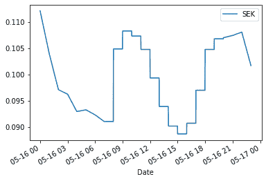
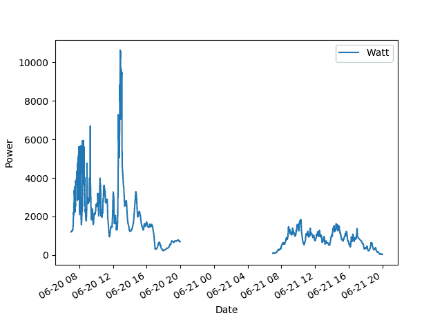
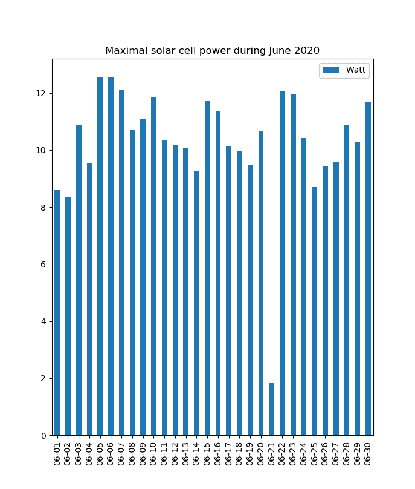
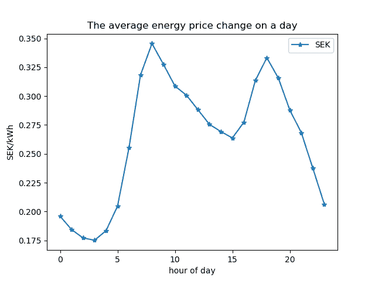
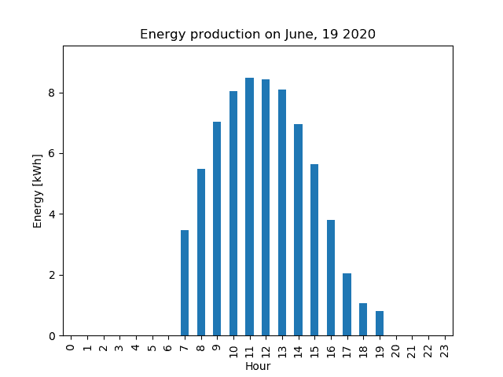

Series 和 Dataframes - 使用 Pandas

在本章中，我们简要介绍 pandas——Python 中用于数据分析和数据处理的核心工具。你将学习如何在 Python 中使用各种时间序列，了解数据框的概念，并学习如何访问和可视化数据。你还会看到一些示例，展示了 pandas 如何与本书中的其他核心模块（即 NumPy 和 Matplotlib）顺畅地互动。

但请注意，本章内容在本书的范围内只能作为*开胃菜*。它的目的是为你提供基本概念。pandas 中全套的可视化、数据分析和数据转换工具非常强大。

pandas 提供了许多导入数据的方法。本章将介绍其中的一些方法，并提供指导性示例。

本章将涵盖以下主题：

+   一个指导性示例：太阳能电池

+   NumPy 数组和 pandas 数据框

+   创建和修改数据框

+   使用数据框

# 第十一章：10.1 一个指导性示例：太阳能电池

为了最好地描述 pandas，我们需要数据。因此，在本章中，我们将使用瑞典南部一座私人住宅屋顶上太阳能电池板的生产数据。

在文件`solarWatts.dat`中，包含了每分钟的电力生产数据（单位：瓦特）。使用分号作为数据分隔符，文件的第一行是标题行，解释了数据列的内容：

```py
Date;Watt
           :
2019-10-20 08:22:00 ; 44.0
2019-10-20 08:23:00 ; 61.0
2019-10-20 08:24:00 ; 42.0
           :
```

在另一个文件`price.dat`中，我们找到每小时电力生产价格（单位：瑞典克朗）。文件的结构与之前相同：

```py
Date;SEK
2019-10-20 01:00 ; 0.32
2019-10-20 02:00 ; 0.28
2019-10-20 03:00 ; 0.29
       :
```

最后，在第三个文件`rates.dat`中，我们找到了从瑞典克朗到欧元（€）的每日汇率：

```py
Date;Euro_SEK
2019-10-21 ; 10.7311
2019-10-22 ; 10.7303
2019-10-23 ; 10.7385
       :
```

我们希望从这些数据中提取每天的最大和最小产量、每月的日照小时数、迄今为止最阳光明媚的一天、日出和日落时间以及一些经济信息。我们还打算以图形方式呈现数据。

请注意，数据不是在相同的时间点收集的，可能会有缺失数据。

每个文件包含一个所谓的时间序列，也就是依赖于时间的数据或时间依赖函数的离散采样。

我们现在介绍 pandas 中的数据框概念，并将其与 NumPy 数组进行比较。

# 10.2 NumPy 数组和 pandas 数据框

让我们从仅仅看一个![]的 NumPy 数组示例开始：

```py
A=array( [[ 1., 2., 3.],
          [4., 5., 6.]])
```

它显示为：

```py
[[1\. 2\. 3.]
 [4\. 5\. 6.]]
```

它的元素可以通过简单地按行和列计数生成的索引进行访问，例如，`A[0,1]`。

这个矩阵可以通过保持相同的数据和顺序，但以不同的方式表示和访问，转换为 pandas 的数据类型`DataFrame`：

```py
import pandas as pd
A=array( [[ 1., 2., 3.],
          [ 4., 5., 6.]] )
AF = pd.DataFrame(A)
```

这个`DataFrame`对象，我们将在本章中更详细地解释，显示为：

```py

      0   1  2
 0   1.0 2.0 3.0
 1   4.0 5.0 6.0
```

我们看到，pandas 数据框有额外的行和列标签，称为*index*（索引）和*columns*（列）。这些是数据框的元数据。

在这里，它们与 NumPy 的索引方法一致，但并非总是如此。索引和列元数据使得 pandas 数据框能够以传统表格设计中已知的方式标记数据：

```py
AF.columns = ['C1','C2','C3']     
AF.index = ['R1', 'R2']
```

这给出了如下输出：

```py
    C1 C2 C3
R1 1.0 2.0 3.0
R2 4.0 5.0 6.0
```

现在我们将看到如何使用这些标签来访问子框架或数据框中的单个值。

## 10.2.1 索引规则

类似于字典通过键访问值的方式，pandas 数据框通过行标签——数据框索引——和列标签来访问单个值：

```py
AF.loc['R1', 'C2']      # this returns 2.0 
```

或者生成一个子框架：

```py
AF.loc[['R1','R2'],['C1','C2']]
```

结果为：

```py
   C1   C2
R1  1  2.0
R2  4  5.0
```

你也可以通过使用索引标签来访问完整的行：

```py
AF.loc['R1']
```

这将返回一个 pandas `Series`对象：

```py
C1    1.0
C2    2.0
C3    3.0
Name: R1, dtype: float64
```

如果`loc`或`iloc`使用列表参数或切片调用，结果将是一个数据框。

以这种方式，单个数据框元素也可以如下访问：

```py
AF.loc['R1'].loc['C1']    # returns 1.0
```

可以通过以下方式直接访问整列：

```py
AF['C1']
```

这又会返回一个 pandas `Series`对象：

```py
R1    1.0
R2    4.0
Name: C1, dtype: float64
```

另外，列标签可以作为属性使用，`AF.C1`。

单列是 pandas 数据类型`Series`的一个实例。

```py
type(AF.C1) == pd.Series # True 
```

注意，pandas 系列没有列标签。它只是对应于单一类型测量数据的单列。

仍然可以通过应用数据框方法`iloc`使用经典索引：

```py
AF.iloc[[0],[1]]
```

这将返回：

```py
    C2
 R1 2.0
```

如果`loc`或`iloc`使用列表参数或切片调用，结果将是一个数据框：

```py
AF.loc['R1':,'C2':] 
```

或者等效地：

```py
AF.loc[['R1','R2'], ['C2','C2']]
```

当使用一对单一标签进行调用时，只会返回数据框中的一个元素：

```py
AF.loc['R1','C2'] # returns 2.0
```

这与 NumPy 处理数组索引的方式完全一致。回想一下，使用切片索引返回一个数组，而使用单个整数索引返回被索引数组的单个元素。

需要注意的是，`loc`和`iloc`不是数据框方法。它们是具有`__getitem__`方法的属性；参见第 8.1.5 节：*特殊方法*。这解释了为什么使用方括号而不是圆括号。

# 10.3 创建和修改数据框

现在我们回到太阳能电池数据，并解释如何从数据文件创建数据框。给定数据的文件格式为 CSV。文件中的每一行包含一条数据记录，数据分隔符是逗号或其他字符字符串。这里，我们使用分号作为分隔符，因为在许多国家，逗号用于表示小数点。

## 10.3.1 从导入数据创建数据框

我们希望以这样的方式组织数据框，即使用日期作为数据框的索引。为了更好地操作日期，我们还希望数据导入过程能自动将日期字符串转换为 pandas `Timestamp`对象。最后，你可能已经注意到，数据文件中日期的书写方式是 ISO 格式`YY-MM-DD`，而不是美国的`MM-DD-YY`格式或欧洲的`DD-MM-YY`格式。我们可以把它列入愿望清单，期望 pandas 能够自动识别日期格式并执行正确的转换：

```py
solarWatts = pd.read_csv("solarWatts.dat", 
                         sep=';',
                         index_col='Date',
                         parse_dates=[0], infer_datetime_format=True)
```

pandas 命令 `read_csv` 是中心工具。它具有比我们在此处使用的更多参数，并仔细研究它们的功能可以节省大量编程工作。

现在我们有一个包含超过 200,000 条数据记录的 pandas 数据帧 `solarWatts`。让我们直接检查第一个：

```py
solarWatts.iloc[0] 
```

这将返回以下输出：

```py
Watt    7893.0
Name: 2019-10-06 13:23:00, dtype: float64
```

我们还可以询问最后一个日期。为此，我们使用数据帧的 `index` 属性：

```py
solarWatts.index[-1]   # asking for the last index
```

这返回一个 pandas `Timestamp` 对象 `Timestamp('2020-06-27 17:54:00')`。可以使用该对象或其字符串表示进行索引。

`Timestamp` 对象使得在处理日期时能够轻松进行计算、定义时间范围以及比较日期。我们可以检查测量之间经过了多少时间：

```py
# returns: Timedelta('0 days 00:01:00')
solarWatts.index[1]-solarWatts.index[0]
```

生成的 `Timedelta` 对象告诉我们，第一条和第二条记录之间经过了一分钟。

但是所有数据都是每分钟收集的吗？由于 pandas 兼容 NumPy，我们可以应用 NumPy 的 `diff` 命令，它返回一个带有 `timedelta64[ns]` 数据类型的数组，即差异以纳秒显示。我们直接将结果转换为分钟，并查询最大差异：

```py
max(numpy.diff(solarWatts.index).astype('timedelta64[m]'))
```

使用 `numpy.argmax`，我们找到了对应的日期：

```py
solarWatts.iloc[np.argmax(np.diff(solarWatts.index))
```

在这段代码中，我们首先形成一个时间差数组 (`timedelta`)。我们将其用作索引来定位 pandas 数据帧中的数据记录。

## 10.3.2 设置索引

数据帧的默认索引是行号。当创建数据帧且未指定索引时，这些索引将自动生成。这里是一个例子。

我们从一个列表列表创建一个数据帧：

```py
towns=[['Stockholm', 'Sweden', 188,975904],
       ['Malmö', 'Sweden', 322, 316588],
       ['Oslo', 'Norway', 481, 693491],
       ['Bergen', 'Norway', 464, 28392]]
town=pd.DataFrame(towns, columns=['City','Country','area','population'])
```

这将生成一个带有按其行号标记的行的数据帧：

```py
        City Country  area  population
0  Stockholm  Sweden   188      975904
1      Malmö  Sweden   322      316588
2       Oslo  Norway   481      693491
3     Bergen  Norway   464      28392
```

通过选择一个列作为索引来更改此行为。该列可以复制，一个用作索引，另一个属于数据部分的数据帧，或者将其移动以替换默认索引列：

```py
town.set_index('City', drop=False)      # duplicating
# droping the column and making an index out of it
town.set_index('City', drop=True)
```

当 `drop` 参数设置为 `True`（默认）时，生成一个*新的*数据帧，其外观如下：

```py
          Country  area  population
City                               
Stockholm  Sweden   188      975904
Malmö      Sweden   322      316588
Oslo       Norway   481      693491
Bergen     Norway   464      283929
Trondheim  Norway   322      199039
```

附加参数 `inplace` 允许直接更改数据帧，即*原地*，而不生成新对象。

pandas 不仅限于单一索引；事实上，可以选择多个列作为索引。这种多重索引打开了 pandas 的**分层索引**特性，我们将在 第 10.4.3 节 中再次遇到它：*数据分组*。

通过列列表指定多个索引：

```py
town.set_index(['Country','City'], inplace=True)
```

这给出了以下输出：

```py
                   area  population
Country City                       
Sweden  Stockholm   188      975904
        Malmö       322      316588
Norway  Oslo        481      693491
```

注意数据帧当前的显示方式：第一个索引 `Country` 被视为比第二个索引 `City` 更高的层次。

我们可以像这样处理数据帧中的所有瑞典城镇：

```py
town.loc['Sweden']
```

我们甚至可以针对特定的索引进行操作：

```py
town.loc[('Sweden','Malmö')]
```

## 10.3.3 删除条目

数据帧中的条目通过 `drop` 方法删除。

再次使用前一节的数据帧：

```py
town=pd.DataFrame(towns, columns=['City','Country','area','population'])
town.set_index('City', inplace=True)
```

通过以下方法删除整行：

```py
town.drop('Bergen', axis=0)
```

参数`axis`在此指定我们查找的是一行。删除一行需要列标签和正确的参数`axis`：

```py
town.drop('area', axis=1)
```

## 10.3.4 合并数据框

从我们为本章提供的三个数据文件中，我们使用第一个文件`solarwatts.dat`来建立数据框`solarWatts`；参见第 10.3.1 节，*从导入数据创建数据框*。以类似的方式，我们可以从其他两个文件中创建数据框`price`和`rates`。

现在我们展示如何将这三个数据框合并成一个，并处理结果数据框中缺失数据的行。

首先，我们将`solarWatts`与`price`合并。为此，我们使用 pandas 命令`merge`：

```py
solar_all=pd.merge(solarWatts, price, how='outer', sort=True, on='Date')
solar_all=pd.merge(solar_all, rates, how='outer', sort=True, on='Date')
```

它将两个数据框中都存在的列`Date`设置为新数据框的索引。参数`how`定义了如何设置新的索引列。通过指定`outer`，我们选择了两个索引列的并集。最后，我们希望对索引进行排序。

由于`solarWatts`的数据是每分钟都有的，而价格是每小时变化一次，我们将在新的数据框中获得如下行：

```py
                       Watt  SEK  Euro_SEK
Date                                      
2019-10-06 15:03:00  4145.0  NaN       NaN
2019-10-06 15:04:00  5784.0  NaN       NaN
```

缺失数据会自动填充为`NaN`（意味着*不是数字*；参见第 2.2 节：*数值类型*）。

现在我们将研究如何处理缺失数据。

## 10.3.5 数据框中的缺失数据

我们在上一节中看到，缺失数据通常由`NaN`表示。缺失数据的表示方式取决于列的数据类型。缺失的时间戳由 pandas 对象`NaT`表示，而缺失的其他非数值类型数据则由`None`表示。

数据框方法`isnull`返回一个布尔型数据框，在所有缺失数据的地方显示`True`。

我们将在返回到太阳能电池数据示例之前，研究处理缺失数据的各种方法。

让我们在一个小数据框上演示这些方法：

```py
frame = pd.DataFrame(array([[1., -5.,  3., NaN], 
                            [3.,  4., NaN, 17.], 
                            [6.,  8., 11.,  7.]]), 
                     columns=['a','b','c','d'])
```

该数据框显示如下：

```py
     a    b    c     d
0  1.0 -5.0  3.0   NaN
1  3.0  4.0  NaN  17.0
2  6.0  8.0 11.0   7.0
```

可以通过不同方式处理包含缺失数据的数据框：

+   删除所有包含缺失数据的行，`frame.dropna(axis=0)`：

```py
     a    b     c    d
2  6.0  8.0  11.0  7.0
```

+   删除所有包含缺失数据的列，`frame.dropna(axis=1)`：

```py
   a    b
0  1.0 -5.0
1  3.0  4.0
2  6.0  8.0
```

+   通过使用前一行的数据填充缺失数据，`frame.fillna(method='pad', axis=0)`：

```py
    a    b     c     d
0  1.0 -5.0   3.0   NaN
1  3.0  4.0   3.0  17.0
2  6.0  8.0  11.0   7.0  
```

在这种情况下，如果没有可用的数据进行填充，则`NaN`将保持不变。

+   按列插值数值数据，`frame.interpolate(axis=0, method='linear')`：

```py
  a    b     c     
0  1.0 -5.0   3.0   NaN
1  3.0  4.0   7.0  17.0
2  6.0  8.0  11.0   7.0
```

再次强调，无法通过插值计算的值将保持为`NaN`。

我们使用插值方法的方式假设数据是在等距网格上收集的。如果索引是数字或日期时间对象，它可以作为-轴来使用。例如，使用参数值`method='polynomial'`即可实现这一点。

通过使用`inplace`参数，可以在不同的列上使用不同的方法：

```py
frame['c'].fillna(method='pad', inplace=True)
frame['d'].fillna(method='bfill',inplace=True)
```

现在我们回到太阳能电池的例子。电价按小时变化，货币汇率按日变化，而太阳能电池板的能量生产则在白天时段每分钟记录一次。这就是数据框合并步骤引入许多 NaN 值的原因（参见第 10.3.4 节，合并数据框）。

我们通过填充来替换这些缺失值：

```py
solar_all['SEK'].fillna(method='pad', axis=0, inplace=True)
solar_all['Euro_SEK'].fillna(method='pad', axis=0, inplace=True)
```

表中仍然存在`NaN`值。太阳能电池仅在白天有足够光照时产生能量。在这些时段之外，Watt 列的值为`NaN`。

在下一节中，我们将使用 pandas 的 dataframe 绘图功能来可视化数据，并且我们会看到`NaN`值在图中被简单地忽略。

# 10.4 使用 dataframe

到目前为止，我们已经看到了如何创建和修改 dataframe。现在，我们转向数据解释部分。我们将查看可视化的示例，展示如何进行简单的计算，并看到如何对数据进行分组。这些都是进入 pandas 世界的垫脚石。这个模块的强大之处在于其广泛的统计工具。我们将这些工具的介绍留给实用统计学教材，而在这里我们关注 pandas 编程的基本原则。我们不追求完整性。再一次，让我们先品尝一下开胃菜。

## 10.4.1 从 dataframe 绘图

为了演示绘图功能，我们绘制了 2020 年 5 月 16 日的能源价格变化。为此，我们从那一天的数据中构建了一个子数据框：

```py
solar_all.loc['2020-05-16'].plot(y='SEK')
```

你可以看到，我们这里使用的是完整的日期索引。这是切片的简短形式：

```py
solar_all.loc['2020-05-16 00:00':'2020-05-16 23:59']
```

结果图（图 10.1）展示了电价在典型一年中的小时变化，单位为瑞典克朗。



图 10.1：绘制 dataframe 的一列；2020 年 5 月 16 日每千瓦时的瑞典克朗（SEK）每小时价格

pandas 的绘图命令是基于 matplotlib.pyplot 模块的 plot 函数构建的，我们在第六章，绘图中见过它。

它接受相同的参数，例如，线型或标记。

x 轴的数据来自 dataframe 的索引，除非另有指定。或者，你可以绘制一个 dataframe 列与另一个列的关系。

折线图在数据缺失的地方会留下空白。你可以在下图中看到这一点，该图展示了 2020 年 6 月第一周太阳能电池的功率。由于在白天时段外没有太阳能电池数据，图中会有空白。见图 10.2。



图 10.2：具有缺失数据（`NaN`）的数据序列图：2020 年 6 月第一周太阳能电池的瓦特功率。你可以清楚地看到没有能量产生的时段。

我们用来绘制此图的命令如下：

```py
ax1=solar_all.loc['2020-06-20':'2020-06-21'].plot(None,'Watt')
ax1.set_ylabel('Power')
```

在这里，你可以看到使用轴对象（在本例中为 ax1）的优势。这使得我们可以修改轴标签或图例，例如，ax1.legend(['功率 [W]））。

在接下来的章节中，我们将提供更多的绘图示例，展示如何在数据框内进行一些计算，以及如何对数据进行分组。

## 10.4.2 数据框内的计算

我们可以通过对数据框列中的每个元素应用函数来进行简单的计算，即对函数的元素逐一应用。这些函数可以是内置的 Python 函数、NumPy 函数或用户定义的函数，如 lambda 函数（请参见 第 7.7 节，匿名函数）。

最简单的方式是直接对列进行操作。在以下示例中，我们将瓦特转换为千瓦，并使用当天的汇率将瑞典克朗（SEK）转换为欧元：

```py
solar_converted=pd.DataFrame()
solar_converted['kW']=solar_all['Watt']/1000
solar_converted['Euro']=solar_all['SEK']/solar_all['Euro_SEK']
```

默契地，我们还调整了列标签以符合转换后的单位。

命令`solar_converted.loc['2020-07-01 7:00':'2020-07-01 7:04']`然后返回了 2020 年 7 月 1 日的数据：

```py
                      kW      Euro
Date                                   
2020-07-01 07:00:00  2.254  0.037147
2020-07-01 07:01:00  1.420  0.037147
2020-07-01 07:02:00  2.364  0.037147
2020-07-01 07:03:00  0.762  0.037147
2020-07-01 07:04:00  2.568  0.037147
```

我们还可以将 NumPy 的（通用）函数应用于整个行或列。以下示例计算了太阳能电池板提供的最大功率：

```py
import numpy as np
​np.max(solar_all['Watt']) # returns 12574
```

为了打印对应的日期，我们使用了函数 argmax：

```py
print(solar_all.index[np.argmax(solar_all['Watt'])])
```

打印的日期是：

```py
 2020-05-16 10:54:00
```

从前面的示例中可以看出，缺失数据用 NaN 标记，实际上它被视为缺失数据，也就是说，仿佛它根本不存在。由于并非所有计算方法都具备这个特性，因此在这些情况下，将 NaN 替换为 0 可能更为安全：

```py
solar_all['Watt'].fillna(value=0., inplace=True)
```

对于应用通用的用户定义函数，有一个数据框方法 apply。它对整个数据框进行按行或按列的操作。

## 10.4.3 数据分组

数据分组的能力是 pandas 数据框的基本功能之一。在太阳能电池板示例中，您看到我们有每分钟一次的测量频率。如果您想按小时或按日报告数据怎么办？我们只需将数据分成组，并以规定的方式对数据进行聚合。

以下示例形成了一个新的数据框，包含标记为 Watt 和 SEK 的两列，分别报告了每日太阳能电池板的峰值功率和平均价格（以 SEK 为单位）：

```py
solar_day=solar_all.groupby(solar_all.index.date).agg({'Watt':'max', 
                                                       'SEK':'mean'})
```

同样，我们可以使用数据框方法 plot 来可视化结果：

```py
solar_day.index=pd.to_datetime(solar_day.index,format='%Y-%m-%d')
ax=solar_day.loc['2020-06-01':'2020-06-30'].plot.bar('Watt')
```

注意，我们创建了一个轴对象 ax，以便更改  轴上的刻度标签：

```py
ax.set_xticklabels([tf.strftime("%m-%d") 
                    for tf in solarday.loc['2020-06-01':'2020-06-30'].index])
```

这产生了图 10.3：



图 10.3：2020 年 6 月每日太阳能电池板的峰值功率

在这里，我们将一个月内的所有天数进行了分组。

我们还可以在分组时跳过层级：在前面的示例中，我们按月分组了天数，但我们也可以按月内的小时进行分组，甚至可以从整个数据集中进行分组。例如，若要查看电能价格是否通常每天有两个峰值，我们可以按小时对数据进行分组并计算平均值：

```py
solar_hour=solar_all.groupby(solar_all.index.hour).agg({'SEK':mean})
ax=solar_hour.plot()
ax=solar_hour.plot(marker='*')
ax.set_title('The average energy price change on a day')
ax.set_xlabel('hour of day')
ax.set_ylabel('SEK/kWh')
```

这些命令产生了图 10.4：



图 10.4：按小时分组的数据结果

数据分组通常是解决需要对分组数据进行计算步骤的特殊问题的起点。例如，在我们的示例中，我们有太阳能电池的逐分钟功率（以瓦特为单位），但这个系统的每小时能量输出（以千瓦时为单位）是多少？要回答这个问题，我们必须：

+   以层次化的方式按小时对数据进行分组。

+   形成基于 60 分钟间隔的离散数据积分。

+   将其存储在一个新的数据框或序列对象中。

对于第一个任务，我们利用 pandas 的层次索引功能。我们按年份、月份、日期和小时进行层次分组：

```py
grouping_list=[solar_all.index.year, solar_all.index.month, 
               solar_all.index.day, solar_all.index.hour]
solar_hour=solar_all.groupby(grouping_list)
```

在这种情况下可以进行积分，因为我们从每分钟数据开始，只需对数据进行求和：

```py
# integrating by summing up the data
solar_hour=solar_hour.agg({'Watt':sum}) 

solar_hour=solar_hour/(1000*60) # Conversion from Wmin to kWh
```

然后我们以常规方式可视化结果：

```py
ax=solar_hour['Watt'].loc[(2020,6,19)].plot.bar()
ax.set_title('Energy production on June, 19 2020')
ax.set_xlabel('Hour')
ax.set_ylabel('Energy [kWh]')
```

这将给我们带来图 10.5：



图 10.5：通过层次分组生成的数据框示例图

或者，我们也可以使用命令 `scipy.integrate.simps` 来对离散数据进行积分，将其作为聚合方法 agg 的一个参数。由于此函数不处理缺失数据，因此在第 10.4.2 节中的备注——数据框中的计算——适用，我们需要在开始之前将所有 NaN 值替换为 0。

# 10.5 小结

在这一章中，你简要了解了 pandas，并看到了 NumPy 数组概念如何扩展到数据框。我们没有对数据框的所有可能性进行详尽的解释，而是通过一个太阳能电池能量数据的示例，带你完成了使用 pandas 的第一步：从文件中设置数据框、合并数据框、分组数据并进行计算。
