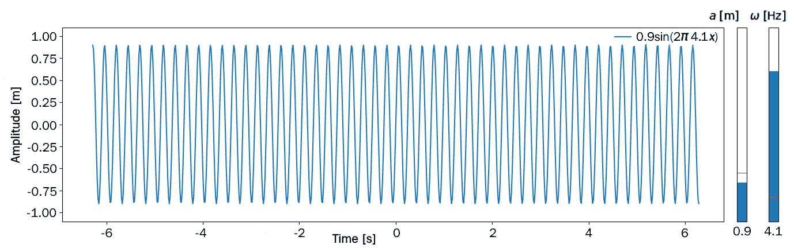

通过图形用户界面进行通信

**图形用户界面（GUIs）** 是一种便捷的工具，用于将用户数据输入到 Python 程序中。很可能，你已经使用过诸如 *选择列表*、*单选按钮* 或 *滑块* 等工具与应用程序进行交互。在本章中，我们将展示如何将这些工具添加到程序中。本章基于 **Matplotlib** 模块提供的工具，我们已经在 第 6.2 节：“直接操作 Matplotlib 对象”中见过它们。

尽管有像 **Tkinter** 这样的替代模块可以用来设计更复杂的图形用户界面（GUI），但 Matplotlib 作为一种理想的入门工具，门槛较低，是与代码进行交互的一种便捷方式。

本章的目的是演示 Matplotlib 中 GUI 编程的基本原理。解释事件、滑块动作或鼠标点击及其与所谓回调函数的交互，并提供一些示例。

显然，我们并不追求完整性。在理解了基本原理之后，Matplotlib 文档是一个关于各种小部件及其参数的详细信息宝库。

本章将涵盖以下主要主题：

+   一个指导小部件的示例

+   按钮小部件和鼠标事件

# 第十二章：11.1 小部件的指导示例

本节中，我们展示了 **小部件** 的基本组件 11.1 小部件指导示例及其在 **Python** 中的对应部分。我们通过以下图示的指导示例来实现这一点：


图 11.1：一个小部件，用于显示用户给定频率的  

在这个图形中，我们可以看到顶部有一个滑块条。使用计算机鼠标，可以将蓝色条从左到右移动，右侧会显示一个值，范围在 1 到 5 之间，表示 。

相应地，显示在绘图窗口中的正弦波频率发生变化。

该小部件由三个部分组成：

+   一个包含坐标轴对象和绘图的图形对象

+   包含滑块对象的坐标轴对象

+   一个回调函数，用于在滑块值变化时更新绘图

我们在 第 6.2 节 中讨论了如何编写第一部分：“直接操作 Matplotlib 对象”。

在下面的代码片段中，我们首先创建一个指定大小的图形，然后创建一个足够大的坐标轴对象，并将其放置到图形中，使得坐标轴的左下角与图形坐标  对齐。然后，要求用户输入一个介于 1 到 5 之间的浮动数字，用于表示频率 ：

```py
from matplotlib.pyplot import *
fig = figure(figsize = (4,2))
ax = axes([0.1, 0.15, 0.8, 0.7]) # axes for the plot
omega=float(input('Give a value for $\omega$ between 1 and 5:\n'))
x = linspace(-2*pi, 2*pi, 800)
ax.set_ylim(-1.2, 1.2)
lines, = ax.plot(x, sin(2.*pi*omega*x))
```

现在，在下一步中，我们添加了第二个轴对象，并在其中放入一个滑块：

```py
from matplotlib.widgets import Slider
sld_ax = axes([0.2, 0.9, 0.6, 0.05]) # axes for slider
sld = Slider(sld_ax, '$\omega$ [Hz]', 1., 5., valinit=1.)
omega=sld.val
```

滑块的轴对象`sld_ax`是通过给定其尺寸和左下角点在图形坐标系统中的位置来定义的。

新的构建元素是`Slider`对象。它的构造函数使用滑块轴、标签以及显示在滑块左侧和右侧的最大值和最小值。滑块对象有一个属性`val`，它包含由滑块位置给出的值。

最初，滑块的位置设置为`valinit`。

最后部分是程序的核心部分——回调函数和更新图表的操作，每当滑块值发生变化时：

```py
def update_frequency(omega):
 lines.set_ydata(np.sin(2.*pi*omega*x))

sld.on_changed(update_frequency) 
```

回调函数是指在滑块（或其他小部件对象）发生变化时被调用的函数。在我们的例子中，它是函数`update_frequency`。滑块方法`on_changed`定义了每当滑块值发生变化时要执行的操作。在这里，`update_frequency`函数被调用，传入滑块值`val`作为其唯一参数。

我们将通过将各个部分结合起来来结束本节介绍。注意，已经不再需要最初使用的输入函数，因为我们现在使用了更为优雅的 GUI 方法来输入值。我们还为图表提供了一个图例，用以显示滑块值的使用情况。注意字符串格式化和 LaTeX 命令是如何结合使用的：

```py
from matplotlib.pyplot import *
from matplotlib.widgets import Slider

fig = figure(figsize = (4,2))
sld_ax = axes([0.2, 0.9, 0.6, 0.05]) # axes for slider
ax = axes([0.1, 0.15, 0.8, 0.7]) # axes for the plot
ax.xaxis.set_label_text('Time [s]')
ax.yaxis.set_label_text('Amplitude [m]')
sld = Slider(sld_ax, '$\omega$ [Hz]', 1., 5., valinit=1.5)
omega=sld.val
x = linspace(-2*pi, 2*pi, 800)
ax.set_ylim(-1.2, 1.2)
# Plot of the initial curve
# Note, how LaTeX commands and string formatting is combined in the 
# next command
lines, = ax.plot(x, sin(2.*pi*omega*x), label=f'$\sin(2\pi\; {omega} x)$ ')
ax.legend()

def update_frequency(omega):
 lines.set_ydata(np.sin(2.*pi*omega*x))
 # A legend is updated by p text box widget set_varroviding tuples 
 # with line objects and tuples with labels
 ax.legend((lines,),(f'$\sin(2\pi\; {omega} x)$',)) 

sld.on_changed(update_frequency)
```

在本节中，我们展示了使用小部件进行用户输入的方法。这是一种用户友好的方式来请求参数并显示相关结果。

## 11.1.1 使用滑块条改变值

在上一节中，我们介绍了滑块的使用。滑块最重要的属性是其值，`val`。这个值会传递给回调函数。

其他属性包括滑块值的限制`valmin`和`valmax`，以及一个步进功能`valstep`，使得值的变化变得离散。格式化属性`valfmt`允许我们指定如何显示`valmin`和`valmax`。

在下一个示例中，我们修改了上面的滑块定义，并为它提供了这些更具体的属性：

```py
sld = Slider(sld_ax, label='$\omega$ [Hz]', valmin=1., valmax=5., 
             valinit=1.5, valfmt='%1.1f', valstep=0.1)
```

在这个例子中，格式化参数`%1.1f`表示值应作为浮动小数显示，左侧有一位数字，右侧也有一位数字。

### 一个包含两个滑块的示例

我们通过提供两个滑块来扩展前面的示例，一个用于振幅，另一个用于频率，并将滑块设置为垂直模式。

首先，我们定义了两个滑块轴：

```py
sldo_ax = axes([0.95, 0.15, 0.01, 0.6]) # axes for frequency slider
slda_ax = axes([0.85, 0.15, 0.01, 0.6]) # axes for amplitude slider
```

然后，我们定义了两个滑块，分别具有不同的最小值和最大值，以及一个方向参数：

```py
sld_omega = Slider(sldo_ax, label='$\omega$ [Hz]', valmin=1., 
                   valmax=5., valinit=1.5, valfmt='%1.1f', 
                   valstep=0.1, orientation='vertical')
sld_amp = Slider(slda_ax, label='$a$ [m]', valmin=0.5, 
                 valmax=2.5, valinit=1.0, valfmt='%1.1f', 
                 valstep=0.1, orientation='vertical')
```

两个滑块有不同的回调函数。它们使用相关滑块的值作为参数，并将另一个滑块的值作为全局变量：

```py
def update_frequency(omega):
    lines.set_ydata(sld_amp.val*sin(2.*pi*omega*x))
    ax.legend((lines,),(f'${sld_amp.val} \sin(2\pi\; {omega} x)$',)) 

def update_amplitude(amp):
    lines.set_ydata(amp*sin(2.*pi*sld_omega.val*x))
    ax.legend((lines,),(f'${amp} \sin(2\pi\; {sld_omega.val} x)$',)) 
    ax.set_ylim(-(amp+0.2), amp+0.2)

sld_omega.on_changed(update_frequency)     
sld_amp.on_changed(update_amplitude) 
```

在下图中，显示了 GUI：


图 11.2：由两个垂直滑块给定的曲线参数

一些操作要求用户等待，直到看到变化的结果。通常，将更改收集起来后再进行更新会更加方便和用户友好。可以通过一个特殊的按钮小部件来实现这一点，接下来的部分将介绍它。

# 11.2 按钮小部件与鼠标事件

按钮小部件是一个简单的小工具，具有广泛的实用应用。我们通过继续前一个例子并向 GUI 添加一个更新按钮来介绍它。然后我们使用按钮从曲线中提取数据。

## 11.2.1 使用按钮更新曲线参数

到目前为止，我们已经在滑块值改变时更新了曲线，并使用了`on_changed`方法。复杂的图形输出可能需要一些计算时间来更新。在这种情况下，您希望设计 GUI，使得首先通过滑块设置曲线参数，然后按下一个按钮以启动曲线更新。

这可以通过`Button`小部件实现：

```py
from matplotlib.widgets import Button
button_ax = axes([0.85, 0.01, 0.05, 0.05]) # axes for update button
btn = Button(button_ax, 'Update', hovercolor='red')
```

在这个例子中，坐标设置的方式使得按钮位于两个滑块下方。按钮上标有“更新”字样，当鼠标悬停在按钮上时，按钮的颜色会变为红色。

这个小部件有一个方法，`on_clicked`，它代替了滑块方法`on_changed`：

```py
def update(event):
    lines.set_ydata(sld_amp.val*sin(2.*pi*sld_omega.val*x))
    ax.legend((lines,),
              (f'${sld_amp.val:1.1f} \sin(2\pi\; \
              {sld_omega.val:1.1f} x)$',)) 

btn.on_clicked(update)
```

回调函数有一个参数，`event`。在这个例子中没有使用它。它可以用来根据鼠标点击的方式（单击、双击、右键点击或左键点击）为按钮分配不同的操作。我们将在下一节更详细地讨论事件。

## 11.2.2 鼠标事件与文本框

在上一个例子中，我们遇到了按钮小部件的鼠标事件。我们也可以在不使用按钮的情况下捕捉鼠标事件。为此，我们需要将一个普通的按钮点击事件连接到回调函数。

为了演示这一点，我们再次考虑之前生成的正弦波图，并通过鼠标点击选取点，显示其坐标在图中的文本框中。如果右键点击，我们还通过一个红色圆圈在图中显示所选的点。

首先，我们准备一个文本框小部件。我们已经知道，首先必须通过定义一个坐标轴对象来定位小部件，然后为小部件提供所需的属性：

```py
from matplotlib.widgets import TextBox
textbox_ax=axes([0.85,0.6,0.1,0.15])
txtbx=TextBox(textbox_ax, label='', initial='Clicked on:\nx=--\ny=--')
```

我们为文本框提供了没有标签但有一些初始文本的框。文本框有一个包含文本的`val`属性。现在我们将根据鼠标点击的位置改变这个属性：

```py
points, = ax.plot([], [], 'ro')

def onclick(event):
    if event.inaxes == ax:
       txtbx.set_val(
           f'clicked on:\nx={event.xdata:1.1f}\ny={event.ydata:1.1f}')
       if event.button==3:  # Mouse button right
          points.set_xdata([event.xdata])
          points.set_ydata([event.ydata])
    else:
           txtbx.set_val(f'clicked on:\noutside axes\n area')
    fig.canvas.draw_idle() 
cid = fig.canvas.mpl_connect('button_press_event', onclick)
```

由于没有像按钮小部件那样的控件，我们必须将事件与回调函数关联。通过画布方法`mpl_connect`实现这一点。回调函数`onclick`响应鼠标点击的位置。通过事件属性`inaxes`，我们知道鼠标点击发生在哪个坐标轴对象上。通过这个，我们甚至可以获取关于按下的按钮的信息，并且鼠标点击的精确坐标也能获得。回调函数使用了一个`Line2D`对象，`points`，在回调函数首次使用之前，它已用空数据列表进行初始化。这个初始化定义了绘图样式，在这个例子中是红色圆圈：



图 11.3：通过鼠标点击在曲线上显示一个值

# 11.3 总结

在本章中，我们学习了 Matplotlib 中 GUI 编程的基本原理。我们还考虑了一个示例，帮助我们更好地理解小部件。在下一章中，我们将学习错误和异常处理。
