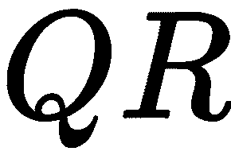
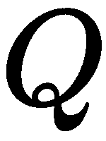
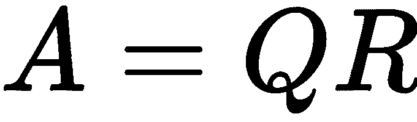
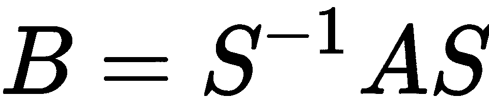
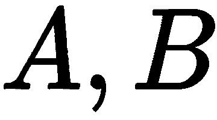
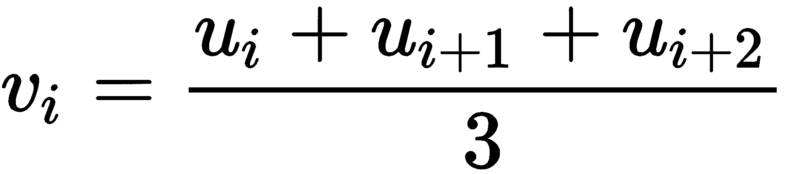

测试

在本章中，我们将重点讨论科学编程中的两个方面的测试。第一个方面是科学计算中经常遇到的*测试什么*的问题。第二个方面涉及*如何测试*的问题。我们将区分手动测试和自动化测试。手动测试是每个程序员用来快速检查程序是否按预期工作的方式。自动化测试则是这一概念的精细化和自动化版本。我们将介绍一些适用于自动化测试的工具，并特别关注科学计算中的应用。

# 第十六章：15.1 手动测试

在代码开发过程中，你会做很多小的测试，以测试其功能。这可以称为手动测试。通常，你会通过在交互式环境中手动测试函数，来验证给定的函数是否做了它应该做的事。例如，假设你实现了二分法算法。它是一个找到标量非线性函数零点（根）的方法。为了启动该算法，必须给定一个区间，且该区间的边界上的函数值具有不同符号（详情见第 7.10 节：习题，了解更多信息）。

然后，你将测试该算法的实现，通常是通过检查：

+   当函数在区间边界处具有不同符号时，问题就得到了解决。

+   当函数在区间边界处具有相同符号时，是否抛出异常。

手动测试，尽管它看起来是必要的，但并不令人满意。一旦你确信代码做了它应该做的事，你会编写相对较少的示范示例来说服他人代码的质量。在那个阶段，你通常会对开发过程中进行的测试失去兴趣，它们可能会被遗忘或甚至删除。每当你更改了某个细节，导致事情不再正常工作时，你可能会后悔之前的测试已经不再可用。

# 15.2 自动化测试

开发任何代码的正确方法是使用自动化测试。其优势在于：

+   每次代码重构后，以及在发布任何新版本之前，自动化地重复大量测试。

+   对代码使用的静默文档记录。

+   记录代码的测试覆盖率：在更改之前，事情是否正常工作？某个特定方面是否从未经过测试？

程序中的变化，特别是其结构上的变化，但不影响其功能，称为代码重构。

我们建议在编码的同时开发测试。良好的测试设计本身就是一门艺术，而且很少有投资能像投资于良好测试那样，保证在开发时间节省方面获得如此好的回报。

现在，我们将通过考虑自动化测试方法来实现一个简单的算法。

## 15.2.1 测试二分法算法

让我们来研究一下二分法算法的自动化测试。通过该算法，可以找到一个实值函数的零点。它在第 7.10 节的*练习 4*中有所描述：*练习*。该算法的实现可以具有以下形式：

```py
def bisect(f, a, b, tol=1.e-8):
    """
    Implementation of the bisection algorithm 
    f real valued function
    a,b interval boundaries (float) with the property 
    f(a) * f(b) <= 0
    tol tolerance (float)
    """
    if f(a) * f(b)> 0:
        raise ValueError("Incorrect initial interval [a, b]") 
    for i in range(100):
        c = (a + b) / 2.
        if f(a) * f(c) <= 0:
            b = c
        else:
            a = c
        if abs(a - b) < tol:
            return (a + b) / 2
    raise Exception('No root found within the given tolerance {tol}')
```

我们假设该内容存储在名为`bisection.py`的文件中。作为第一个测试用例，我们测试该函数的零点是否能够找到！[](img/73d8d9ce-c997-4f58-b10d-293373566190.png)。

```py
def test_identity(): 
   result = bisect(lambda x: x, -1., 1.) 
   expected = 0\. 
   assert allclose(result, expected),'expected zero not found' 
test_identity()
```

在这段代码中，您第一次接触到 Python 关键字`assert`。如果它的第一个参数返回`False`，它将引发`AssertionError`异常。它的可选第二个参数是一个包含附加信息的字符串。我们使用`allclose`函数来测试浮点数的相等性。

让我们对测试函数的某些特性进行评论。我们使用断言来确保如果代码没有按预期行为执行，异常将被抛出。我们必须手动运行测试，在`test_identity()`这一行中。

有许多工具可以自动化这种调用；我们将在第 15.2.2 节中看到其中的一种：*使用 unittest 模块*。

现在我们设置第二个测试，检查当函数在区间两端具有相同符号时，`bisect`是否会抛出异常。现在，我们假设抛出的异常是`ValueError`。在以下示例中，我们将检查初始区间！[](img/94594833-3513-47cc-922c-b6e7d33b41bb.png)。对于二分法算法，它应该满足符号条件：

```py
def test_badinput():
    try:
        bisect(lambda x: x,0.5,1)
    except ValueError:
        pass
    else:
        raise AssertionError()

test_badinput()
```

在这种情况下，如果抛出的异常不是`ValueError`类型，将引发`AssertionError`。有一些工具可以简化之前的构造，以检查是否抛出了异常。

另一个有用的测试是边界情况测试。在这里，我们测试可能会产生数学上未定义的情况或程序员未预见的程序状态的参数或用户输入。例如，如果两个边界相等，会发生什么？如果！[](img/d002cedc-dd50-438b-ba03-6b7658b83e07.png)，会发生什么？

以下代码是此类边界测试的示例：

```py
def test_equal_boundaries():
    result = bisect(lambda x: x, 0., 0.)
    expected = 0.
    assert allclose(result, expected), \
                   'test equal interval bounds failed'

def test_reverse_boundaries():
    result = bisect(lambda x: x, 1., -1.)
    expected = 0.
    assert allclose(result, expected),\
                 'test reverse int_erval bounds failed'

test_equal_boundaries()
test_reverse_boundaries()

```

测试检查程序单元是否符合其规范的要求。在前面的例子中，我们假设规范要求在情况下！[](img/093d5afe-63f2-4229-ab93-0aa2be3c9dae.png)，这两个值应该默默地交换。并且这就是我们测试的内容。另一种方式是指定这种情况被视为错误输入，用户必须进行修正。在这种情况下，我们将测试是否抛出了适当的异常，例如`ValueError`。

## 15.2.2 使用 unittest 模块

Python 模块`unittest`大大简化了自动化测试。该模块要求我们重写之前的测试以保持兼容性。

第一个测试需要重写成一个`class`，如下所示：

```py
from bisection import bisect
import unittest

class TestIdentity(unittest.TestCase):
    def test(self):
        result = bisect(lambda x: x, -1.2, 1.,tol=1.e-8)
        expected = 0.
        self.assertAlmostEqual(result, expected)

if __name__=='__main__':
    unittest.main()
```

让我们看看与之前实现的区别。首先，测试现在是一个方法，并且是类的一部分。类必须继承自 `unittest.TestCase`。测试方法的名称必须以 `test` 开头。请注意，我们现在可以使用 `unittest` 包中的一个断言工具，即 `assertAlmostEqual`。最后，使用 `unittest.main` 运行测试。我们建议将测试写在与要测试的代码分开的文件中。因此，它以 `import` 开头。测试通过并返回如下：

```py
Ran 1 test in 0.002s

OK
```

如果我们使用一个宽松的容差参数，例如 `1.e-3`，测试失败时将会报告：

```py
F
======================================================================
FAIL: test (__main__.TestIdentity)
----------------------------------------------------------------------
Traceback (most recent call last):
  File "<ipython-input-11-e44778304d6f>", line 5, in test
    self.assertAlmostEqual(result, expected)
AssertionError: 0.00017089843750002018 != 0.0 within 7 places
----------------------------------------------------------------------
Ran 1 test in 0.004s
FAILED (failures=1)
```

测试可以并且应该作为测试类的方法进行分组，如下例所示：

```py
import unittest
from bisection import bisect

class TestIdentity(unittest.TestCase):
    def identity_fcn(self,x):
        return x
    def test_functionality(self):
        result = bisect(self.identity_fcn, -1.2, 1.,tol=1.e-8)
        expected = 0.
        self.assertAlmostEqual(result, expected)
    def test_reverse_boundaries(self):
        result = bisect(self.identity_fcn, 1., -1.)
        expected = 0.
        self.assertAlmostEqual(result, expected)
    def test_exceeded_tolerance(self):
        tol=1.e-80
        self.assertRaises(Exception, bisect, self.identity_fcn,
                                               -1.2, 1.,tol)
if __name__=='__main__':
    unittest.main()
```

在这里，在最后一个测试中我们使用了 `unittest.TestCase.assertRaises` 方法。它测试是否正确引发了异常。它的第一个参数是异常类型，例如 `ValueError`、`Exception`，第二个参数是预期引发异常的函数的名称。其余的参数是该函数的参数。

命令 `unittest.main()` 创建了一个 `TestIdentity` 类的实例，并执行那些以 `test` 开头的方法。

## 15.2.3 测试的 setUp 和 tearDown 方法

`unittest.TestCase` 类提供了两个特殊方法：`setUp` 和 `tearDown`，它们在每次调用测试方法之前和之后执行。这在测试生成器时很有用，因为生成器在每次测试后会被消耗完。我们通过测试一个程序来演示这一点，该程序检查文件中给定字符串首次出现的行：

```py
class StringNotFoundException(Exception):
    pass

def find_string(file, string):
    for i,lines in enumerate(file.readlines()):
        if string in lines:
            return i
    raise StringNotFoundException(
          f'String {string} not found in File {file.name}.')
```

我们假设这段代码保存在名为 `find_in_file.py` 的文件中。

一个测试必须准备一个文件，打开并在测试后删除，如下例所示：

```py
import unittest
import os # used for, for example, deleting files

from find_in_file import find_string, StringNotFoundException

class TestFindInFile(unittest.TestCase):
    def setUp(self):
        file = open('test_file.txt', 'w')
        file.write('bird')
        file.close()
        self.file = open('test_file.txt', 'r')
    def tearDown(self):
        self.file.close()
        os.remove(self.file.name)
    def test_exists(self):
        line_no=find_string(self.file, 'bird')
        self.assertEqual(line_no, 0)
    def test_not_exists(self):
        self.assertRaises(StringNotFoundException, find_string,
                                              self.file, 'tiger')

if __name__=='__main__':
    unittest.main()
```

在每个测试之前执行 `setUp`，在每个测试之后执行 `tearDown`。

### 在创建测试用例时设置测试数据

方法 `setUp` 和 `tearDown` 在每个测试方法的前后执行。这在测试方法会改变数据时是必需的。它们保证在执行下一个测试之前，测试数据能够恢复到原始状态。

然而，也经常会有一种情况，测试不改变测试数据，你希望通过仅一次设置数据来节省时间。这可以通过类方法 `setUpClass` 来完成。

以下代码块简要说明了 `setUpClass` 方法的使用。你也许想再次查看 第 8.4 节：*类属性和类方法*。

```py
import unittest

class TestExample(unittest.Testcase):
     @classmethod
     def setUpClass(cls):
         cls.A=....
     def Test1(self):
         A=self.A
         # assert something
         ....
     def Test2(self):
         A=self.A
         # assert something else
```

## 15.2.4 测试参数化

我们经常希望用不同的数据集重复相同的测试。当使用 `unittest` 功能时，这要求我们自动生成带有相应方法注入的测试用例。

为此，我们首先构建一个测试用例，其中包含一个或多个将在后续设置测试方法时使用的方法。我们将再次考虑二分法，并检查它返回的值是否真的是给定函数的零点。

我们首先构建测试用例和将用于测试的方法，如下所示：

```py
class Tests(unittest.TestCase):
    def checkifzero(self,fcn_with_zero,interval):
        result = bisect(fcn_with_zero,*interval,tol=1.e-8)
        function_value=fcn_with_zero(result)
        expected=0.
        self.assertAlmostEqual(function_value, expected)
```

然后，我们动态创建测试函数作为该类的属性：

```py
test_data=[
           {'name':'identity', 'function':lambda x: x,
                                     'interval' : [-1.2, 1.]},
           {'name':'parabola', 'function':lambda x: x**2-1,
                                        'interval' :[0, 10.]},
           {'name':'cubic', 'function':lambda x: x**3-2*x**2,
                                       'interval':[0.1, 5.]},
               ] 
def make_test_function(dic):
    return lambda self :\
        self.checkifzero(dic['function'],dic['interval'])
for data in test_data:
    setattr(Tests, f"test_{data['name']}", make_test_function(data))

if __name__=='__main__': 
    unittest.main()
```

在此示例中，数据以字典列表的形式提供。函数`make_test_function`动态生成一个测试函数，使用特定的数据字典与之前定义的`checkifzero`方法进行测试。最后，使用命令`setattr`将这些测试函数作为`Tests`类的方法。

## 15.2.5 断言工具

在本节中，我们收集了用于引发`AssertionError`的最重要工具。我们看到了命令`assert`和`unittest`中的三个工具，分别是`assertAlmostEqual`、`assertEqual`和`assertRaises`。以下表格（表 15.1）总结了最重要的断言工具及相关模块：

| **断言工具和应用示例** | **模块** |
| --- | --- |
| `assert 5 == 5` | – |
| `assertEqual(5.27, 5.27)` | `unittest.TestCase` |
| `assertAlmostEqual(5.24, 5.2, places = 1)` | `unittest.TestCase` |
| `assertTrue(5 > 2)` | `unittest.TestCase` |
| `assertFalse(2 < 5)` | `unittest.TestCase` |
| `assertRaises(ZeroDivisionError, lambda x: 1/x, 0.)` | `unittest.TestCase` |
| `assertIn(3, {3, 4})` | `unittest.TestCase` |
| `assert_array_equal(A, B)` | `numpy.testing` |
| `assert_array_almost_equal(A, B, decimal=5)` | `numpy.testing` |
| `assert_allclose(A, B, rtol=1.e-3, atol=1.e-5)` | `numpy.testing` |

表 15.1：Python、unittest 和 NumPy 中的断言工具

## 15.2.6 浮点数比较

两个浮点数不应使用`==`运算符进行比较，因为计算结果通常由于舍入误差略有偏差。为测试目的，存在许多用于测试浮点数相等性的工具。

首先，`allclose`检查两个数组是否几乎相等。它可以在测试函数中使用，如下所示：

```py
self.assertTrue(allclose(computed, expected))
```

这里，`self`指的是一个`unittest.Testcase`实例。`numpy`包中的`testing`模块也有测试工具。可以通过以下方式导入：

```py
import numpy.testing
```

测试两个标量或两个数组是否相等，可以使用`numpy.testing.assert_array_allmost_equal`或`numpy.testing.assert_allclose`。这两种方法在描述所需精度的方式上有所不同，如上表*表 15.1*所示。

因式分解将给定矩阵分解为一个正交矩阵和一个上三角矩阵，如下所示的例子所示：

```py
import scipy.linalg as sl
A=rand(10,10)
[Q,R]=sl.qr(A)
```

方法应用是否正确？我们可以通过验证确实是一个正交矩阵来检查：

```py
import numpy.testing as npt 
npt.assert_allclose(
               Q.T @ self.Q,identity(Q.shape[0]),atol=1.e-12)
```

此外，我们可能会通过检查是否进行了一项**基本检查**来执行一个合理性测试，方法是检查 ：

```py
import numpy.testing as npt
npt.assert_allclose(Q @ R,A))
```

所有这些可以通过如下方式汇总到测试用例`unittest`中：

```py
import unittest
import numpy.testing as npt
from scipy.linalg import qr
from scipy import *

class TestQR(unittest.TestCase):
    def setUp(self):
        self.A=rand(10,10)
        [self.Q,self.R]=qr(self.A)
    def test_orthogonal(self):
        npt.assert_allclose(
            self.Q.T @ self.Q,identity(self.Q.shape[0]),
            atol=1.e-12)
    def test_sanity(self):
            npt.assert_allclose(self.Q @ self.R,self.A)

if __name__=='__main__':
    unittest.main()
```

请注意，`assert_allclose`中的参数`atol`默认为零，这在处理具有小元素的矩阵时常常会导致问题。

## 15.2.7 单元测试与功能性测试

到目前为止，我们只使用了功能性测试。功能性测试检查功能是否正确。对于二分法算法，当存在零时，该算法实际上会找到它。在这个简单的例子中，什么是单元测试并不完全清楚。虽然看起来有点牵强，但仍然可以为二分法算法编写单元测试。它将展示单元测试如何通常导致更具模块化的实现。

因此，在二分法方法中，我们想要检查，例如，在每一步是否正确选择了区间。如何做到这一点呢？请注意，由于当前实现将算法隐藏在函数内部，这实际上是不可能的。一个可能的解决方法是仅运行一次二分法算法的步骤。由于所有步骤相似，我们可以认为我们已经测试了所有可能的步骤。我们还需要能够检查算法当前步骤中的当前边界`a`和`b`。因此，我们必须将要运行的步骤数作为参数添加，并改变函数的返回接口。我们将按如下方式进行：

```py
def bisect(f,a,b,n=100):
  ...
  for iteration in range(n):
    ...
  return a,b
```

注意，我们必须更改现有的单元测试以适应这一变化。现在我们可以添加一个单元测试，如下所示：

```py
def test_midpoint(self):
  a,b = bisect(identity,-2.,1.,1)
  self.assertAlmostEqual(a,-0.5)
  self.assertAlmostEqual(b,1.)
```

## 15.2.8 调试

在测试时，有时需要调试，特别是当不能立即明确为何某个测试未通过时。在这种情况下，能够在交互式会话中调试特定测试是非常有用的。然而，由于`unittest.TestCase`类的设计，这使得测试用例对象的实例化变得不容易。解决方案是只为调试目的创建一个特殊实例。

假设在之前的`TestIdentity`类的示例中，我们想要测试`test_functionality`方法。可以按如下方式实现：

```py
test_case = TestIdentity(methodName='test_functionality')
```

现在这个测试可以单独运行，命令是：

```py
test_case.debug()
```

这将运行这个单独的测试，并允许进行调试。

## 15.2.9 测试发现

如果你编写一个 Python 包，多个测试可能分散在包的各个部分。模块`discover`会找到、导入并运行这些测试用例。命令行中的基本调用方式是：

```py
python -m unittest discover
```

它开始在当前目录查找测试用例，并递归目录树向下查找名称中包含`'test'`字符串的 Python 对象。该命令接受可选参数。最重要的参数是`-s`来修改起始目录，`-p`来定义识别测试的模式：

```py
python -m unittest discover -s '.' -p 'Test*.py'
```

# 15.3 测量执行时间

为了做出代码优化决策，通常需要比较几种代码替代方案，并根据执行时间决定优先使用哪种代码。此外，在比较不同算法时，讨论执行时间是一个重要问题。在本节中，我们展示了一种简单易用的计时方法。

## 15.3.1 使用魔法函数进行计时

测量单个语句的执行时间最简单的方法是使用 IPython 的魔法函数 `%timeit`。

IPython 外壳为标准 Python 添加了额外的功能。这些额外的功能被称为魔法函数。

由于单个语句的执行时间可能非常短，因此将语句放入循环中并执行多次。通过取最小的测量时间，确保计算机上其他任务不会对测量结果产生过多影响。

让我们考虑提取数组中非零元素的四种替代方法，如下所示：

```py
A=zeros((1000,1000))
A[53,67]=10

def find_elements_1(A):
    b = []
    n, m = A.shape
    for i in range(n):
        for j in range(m):
            if abs(A[i, j]) > 1.e-10:
                b.append(A[i, j])
    return b

def find_elements_2(A):
    return [a for a in A.reshape((-1, )) if abs(a) > 1.e-10]

def find_elements_3(A):
    return [a for a in A.flatten() if abs(a) > 1.e-10]

def find_elements_4(A):
    return A[where(0.0 != A)]
```

使用 IPython 的魔法函数 `%timeit` 测量时间的结果如下：

```py
In [50]: %timeit -n 50 -r 3 find_elements_1(A)
50 loops, best of 3: 585 ms per loop

In [51]: %timeit -n 50 -r 3 find_elements_2(A)
50 loops, best of 3: 514 ms per loop

In [52]: %timeit -n 50 -r 3 find_elements_3(A)
50 loops, best of 3: 519 ms per loop

In [53]: %timeit -n 50 -r 3 find_elements_4(A)
50 loops, best of 3: 7.29 ms per loop
```

参数 `-n` 控制在计时前语句执行的次数，`-r` 参数控制重复次数。

## 15.3.2 使用 Python 模块 timeit 进行计时

Python 提供了 `timeit` 模块，可用于测量执行时间。它要求首先构造一个时间对象。该对象是通过两个字符串构造的：一个包含设置命令的字符串和一个包含要执行命令的字符串。

我们采用与前面示例中相同的四种替代方案。现在，数组和函数的定义写入一个名为 `setup_statements` 的字符串，并按照如下方式构造四个计时对象：

```py
import timeit
setup_statements="""
from scipy import zeros
from numpy import where
A=zeros((1000,1000))
A[57,63]=10.

def find_elements_1(A):
    b = []
    n, m = A.shape
    for i in range(n):
        for j in range(m):
            if abs(A[i, j]) > 1.e-10:
               b.append(A[i, j])
    return b

def find_elements_2(A):
    return [a for a in A.reshape((-1,)) if abs(a) > 1.e-10]

def find_elements_3(A):
    return [a for a in A.flatten() if abs(a) > 1.e-10]

def find_elements_4(A):
    return A[where( 0.0 != A)]
"""
experiment_1 = timeit.Timer(stmt = 'find_elements_1(A)',
                            setup = setup_statements)
experiment_2 = timeit.Timer(stmt = 'find_elements_2(A)',
                            setup = setup_statements)
experiment_3 = timeit.Timer(stmt = 'find_elements_3(A)',
                            setup = setup_statements)
experiment_4 = timeit.Timer(stmt = 'find_elements_4(A)',
                            setup = setup_statements)
```

定时器对象有一个 `repeat` 方法。它接受两个参数 `repeat` 和 `number`。该方法在一个循环中执行定时器对象的语句，测量时间，并根据 `repeat` 参数重复该实验。

我们继续前面的示例，并按照如下方式测量执行时间：

```py
t1 = experiment_1.repeat(3,5) 
t2 = experiment_2.repeat(3,5) 
t3 = experiment_3.repeat(3,5) 
t4 = experiment_4.repeat(3,5) 
# Results per loop in ms
min(t1)*1000/5 # 615 ms
min(t2)*1000/5 # 543 ms
min(t3)*1000/5 # 546 ms
min(t4)*1000/5 # 7.26 ms
```

与使用 `timeit` 方法的示例不同，我们获取了所有测量结果的列表。由于计算时间可能根据计算机的整体负载而有所不同，因此该列表中的最小值可以视为执行语句所需计算时间的良好近似。

## 15.3.3 使用上下文管理器进行计时

最后，我们介绍第三种方法。它展示了上下文管理器的另一种应用。我们首先构造一个用于测量经过时间的上下文管理器对象，如下所示：

```py
import time
class Timer:
    def __enter__(self):
        self.start = time.time()
        # return self
    def __exit__(self, ty, val, tb):
        end = time.time()
        self.elapsed=end-self.start
        print(f'Time elapsed {self.elapsed} seconds') 
        return False
```

回顾一下，`__enter__` 和 `__exit__` 方法使得这个类成为一个上下文管理器。`__exit__` 方法的参数 `ty`、`val` 和 `tb` 在正常情况下为 `None`。如果在执行过程中抛出异常，它们将分别包含异常类型、异常值和追踪信息。返回值 `False` 表示异常尚未被捕获。

我们将展示如何使用上下文管理器来测量前一个例子中四种方法的执行时间：

```py
with Timer(): find_elements_1(A)
```

这样将显示类似 `Time elapsed 15.0129795074 ms` 的消息。

如果需要将计时结果存储在变量中，`enter` 方法必须返回 `Timer` 实例（取消注释 `return` 语句），并且必须使用 `with ... as ...` 结构：

```py
with Timer() as t1:
    find_elements_1(A)
t1.elapsed # contains the result
```

# 15.4 总结

没有测试就没有程序开发！我们展示了组织良好且有文档的测试的重要性。一些专业人士甚至通过首先指定测试来开始开发。一个有用的自动测试工具是 `unittest` 模块，我们已详细解释。虽然测试可以提高代码的可靠性，但性能提升需要通过分析代码的瓶颈来实现。不同的编码方法可能导致性能差异很大。我们展示了如何测量计算时间以及如何定位代码中的瓶颈。

# 15.5 习题

**例 1：** 如果存在一个矩阵 ，使得 ，则两个矩阵  被称为相似。矩阵  和 ** 具有相同的特征值。编写一个测试，检查两个矩阵是否相似，通过比较它们的特征值。这个是功能测试还是单元测试？

**例 2：** 创建两个大维度的向量。比较计算它们点积的不同方法的执行时间：

+   SciPy 函数：`v @ w`

+   生成器和求和： `sum((x*y for x,y in zip(v,w)))`

+   综合列表和求和： `sum([x*y for x,y in zip(v,w)])`

**例 3：** 设！[](img/3526771a-a59b-41d5-83c6-f33e83a0e3cb.png)为一个向量。该向量 的分量为



被称为 的移动平均。确定计算 的两个方法中哪个更快：

```py
v = (u[:-2] + u[1:-1] + u[2:]) / 3
```

或者

```py
v = array([(u[i] + u[i + 1] + u[i + 2]) / 3
  for i in range(len(u)-3)])
```
