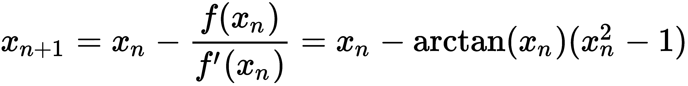
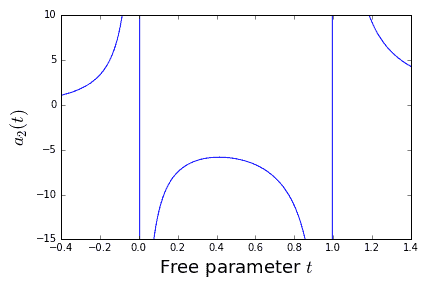

符号计算 - SymPy

本章将简要介绍如何使用 Python 进行符号计算。市场上有许多强大的软件可以执行符号计算，例如 Maple™或 Mathematica™。但有时，可能更倾向于在自己熟悉的语言或框架中进行符号计算。在本书的这一阶段，我们假设这种语言是 Python，因此我们寻找一个 Python 工具——模块 SymPy。

对 SymPy 的完整描述，如果有可能的话，将填满整本书，而这并非本章的目的。相反，我们将通过一些指导性示例来为您指明通向该工具的道路，展示其作为 NumPy 和 SciPy 的补充工具的潜力。

# 第十七章：16.1 什么是符号计算？

迄今为止，本书中所有的计算都属于所谓的数值计算。这些是主要基于浮动点数的一系列操作。数值计算的特点是，结果是精确解的近似值。

符号计算通过对公式或符号进行变换，像代数或微积分中所教的那样，将其转化为其他公式。这些变换的最后一步可能需要插入数字并进行数值计算。

我们通过计算这个定积分来说明两者之间的区别：


从符号上看，通过考虑被积函数的原始函数，可以对这个表达式进行变换：


我们现在通过插入积分界限来获得定积分的公式：


这被称为积分的封闭形式表达式。极少数数学问题有解可以用封闭形式表达式表示。这是积分的精确值，没有任何近似。此外，通过将实数表示为浮动点数，也不会引入误差，否则会产生舍入误差。

近似和舍入误差在最后一刻发挥作用，当需要对这个表达式进行求值时。平方根和*arctan*只能通过数值方法近似求值。这样的求值给出的是最终结果，精度达到某个特定的（通常是未知的）程度：


另一方面，数值计算会直接通过某种近似方法（例如辛普森法则）来近似定积分，并给出数值结果，通常还会给出误差估计。在 Python 中，这可以通过以下命令完成：

```py
from scipy.integrate import quad
quad(lambda x : 1/(x**2+x+1),a=0, b=4)   
```

它们返回值![]和误差边界的估计![]*。

以下图（*图 16.1*）展示了数值和符号近似的比较：


图 16.1：符号和数值求积

## 16.1.1 在 SymPy 中展开一个示例

首先，我们将展开之前的示例，并解释步骤。

首先，我们必须导入模块：

```py
from sympy import *
init_printing()
```

第二个命令确保公式如果可能的话以图形方式呈现。接着，我们生成一个符号并定义被积函数：

```py
x = symbols('x')
f = Lambda(x, 1/(x**2 + x + 1))
```

`x` 现在是一个类型为 `Symbol` 的 Python 对象，`f` 是一个 SymPy `Lambda` 函数（注意命令以大写字母开头）。

现在我们开始进行积分的符号计算：

```py
integrate(f(x),x)    
```

根据你的工作环境，结果的呈现方式不同；见下图 (*图 16.2*)，展示了在不同环境下 SymPy 公式的两种不同结果：


图 16.2：在两种不同环境下，SymPy 公式的两张截图

我们可以通过微分来检查结果是否正确。为此，我们为原始函数分配一个名称，并对其关于  进行微分：

```py
pf = Lambda(x, integrate(f(x),x))
diff(pf(x),x)    
```

获得的结果如下：


这可以通过以下命令进行简化：

```py
simplify(diff(pf(x),x))    
```

到


这是我们预期的结果。

定积分通过以下命令获得：

```py
pf(4) - pf(0)     
```

简化后通过 `simplify` 命令得到的输出是：


为了获得数值结果，我们最终将这个表达式求值为一个浮动点数：

```py
(pf(4)-pf(0)).evalf() # returns 0.9896614396123
```

# 16.2 SymPy 的基本元素

在这里，我们介绍了 SymPy 的基本元素。你会发现，如果已经熟悉 Python 中的类和数据类型，会更有利于理解。

## 16.2.1 符号 – 所有公式的基础

在 SymPy 中构建公式的基本构建元素是符号。正如我们在引言示例中看到的，符号是通过命令 `symbols` 创建的。这个 SymPy 命令通过给定的字符串生成符号对象：

```py
x, y, mass, torque = symbols('x y mass torque')
```

这实际上是以下命令的简写：

```py
symbol_list=[symbols(l) for l in 'x y mass torque'.split()]
```

然后进行解包操作以获取变量：

```py
 x, y, mass, torque = symbol_list
```

命令的参数定义了符号的字符串表示形式。所选符号的变量名通常与其字符串表示相同，但这并不是语言要求的：

```py
row_index=symbols('i',integer=True)
print(row_index**2)  # returns i**2
```

在这里，我们也定义了符号假定为整数。

可以通过非常紧凑的方式定义一整套符号：

```py
integervariables = symbols('i:l', integer=True)
dimensions = symbols('m:n', integer=True)
realvariables = symbols('x:z', real=True)
```

类似地，可以通过以下方式定义索引变量的符号：

```py
A = symbols('A1:3(1:4)')
```

这给出了一个符号元组：


索引的范围规则是我们在本书中使用切片时看到的规则（参见第 3.1.1 节：*切片**，了解更多详细信息）。

## 16.2.2 数字

Python 直接对数字进行运算，并且引入了不可避免的舍入误差。这些误差会妨碍所有的符号计算。通过`sympify`数字可以避免这一问题：

```py
1/3  # returns 0.3333333333333333
sympify(1)/sympify(3)  # returns '1/3'
```

`sympify`命令将整数转换为类型为`sympy.core.numbers.Integer`的对象。

代替将**1/3**写作两个整数的运算，它也可以通过`Rational(1,3)`直接表示为一个有理数。

## 16.2.3 函数

SymPy 区分已定义函数和未定义函数。未定义函数（这一术语可能有些误导）指的是那些没有特殊性质的通用函数，虽然它们是已定义的 Python 对象。

一个具有特殊性质的函数例子是`atan`或本章入门示例中使用的`Lambda`函数。

请注意，同一数学函数的不同实现有不同的名称：`sympy.atan`和`scipy.arctan`。

### 未定义函数

通过给`symbols`命令一个额外的类参数，可以创建未定义函数的符号：

```py
f, g = symbols('f g', cls=Function)
```

同样的效果可以通过使用构造函数`Function`来实现：

```py
f = Function('f')
g = Function('g')
```

对于未定义的函数，我们可以评估微积分的通用规则。

例如，让我们评估以下表达式：


这是通过以下命令在 Python 中符号计算得到的：

```py
x = symbols('x')
f, g = symbols('f g', cls=Function)
diff(f(x*g(x)),x)
```

执行时，前面的代码返回以下输出：


这个例子展示了如何应用乘积法则和链式法则。

我们甚至可以使用一个未定义的函数作为多个变量的函数，例如：

```py
x = symbols('x:3')
f(*x)
```

这将返回以下输出：


请注意使用星号操作符来解包元组以形成带有参数的*f*；请参见第 7.2.5 节：*可变数量的参数*。

通过列表推导，我们可以构造一个包含所有偏导数的列表![]：

```py
 [diff(f(*x),xx) for xx in x]
```

这将返回一个列表，包含![]（的梯度）：


该命令也可以通过使用`Function`对象的`diff`方法来重写：

```py
[f(*x).diff(xx) for xx in x]
```

另一种方法是泰勒级数展开：

```py
x = symbols('x')
f(x).series(x,0,n=4)
```

这将返回泰勒公式，并且包含通过兰道符号表示的余项：


## 16.2.4 基本函数

SymPy 中的基本函数例子包括三角函数及其反函数。以下例子展示了`simplify`如何作用于包含基本函数的表达式：

```py
x = symbols('x')
simplify(cos(x)**2 + sin(x)**2)  # returns 1
```

这是另一个使用基本函数的例子：

```py
atan(x).diff(x) - 1./(x**2+1)  # returns 0
```

如果你同时使用 SciPy 和 SymPy，我们强烈建议你将它们放在不同的命名空间中：

```py
import numpy as np
import sympy as sym
# working with numbers
x=3
y=np.sin(x)
# working with symbols
x=sym.symbols('x')
y=sym.sin(x)   
```

## 16.2.5 Lambda 函数

在第 7.7 节：*匿名函数*中，我们看到如何在 Python 中定义所谓的匿名函数。SymPy 的对应命令是`Lambda`。请注意两者的区别；`lambda`是一个关键字，而`Lambda`是一个构造函数。

命令`Lambda`接受两个参数，一个是函数的自变量符号，另一个是用于求值的 SymPy 表达式。

这里有一个示例，定义了空气阻力（也叫做拖力）作为速度的函数：

```py
C,rho,A,v=symbols('C rho A v')
# C drag coefficient, A coss-sectional area, rho density
# v speed
f_drag = Lambda(v,-Rational(1,2)*C*rho*A*v**2)
```

`f_drag`以图形表达式的形式显示：


这个函数可以通过提供一个参数来以常规方式进行求值：

```py
x = symbols('x')
f_drag(2)
f_drag(x/3)
```

这将得到以下表达式：


还可以通过仅提供`Lambda`的第一个参数为一个元组，来创建多个变量的函数，例如如下所示：

```py
x,y=symbols('x y')
t=Lambda((x,y),sin(x) + cos(2*y))
```

调用这个函数有两种方式，可以通过直接提供多个参数来完成：

```py
t(pi,pi/2)  # returns -1
```

或者通过解包元组或列表：

```py
p=(pi,pi/2)
t(*p)   # returns -1
```

SymPy 中的矩阵对象甚至使我们能够定义向量值函数：

```py
F=Lambda((x,y),Matrix([sin(x) + cos(2*y), sin(x)*cos(y)]))
```

这使得我们能够计算雅可比矩阵：

```py
F(x,y).jacobian((x,y))
```

这将输出以下表达式：


如果有更多变量，使用更紧凑的形式来定义函数会更加方便：

```py
x=symbols('x:2')
F=Lambda(x,Matrix([sin(x[0]) + cos(2*x[1]),sin(x[0])*cos(x[1])]))  
F(*x).jacobian(x)
```

# 16.3 符号线性代数

符号线性代数由 SymPy 的`matrix`数据类型支持，我们将首先介绍它。然后我们将展示一些线性代数方法，作为符号计算在这一领域广泛应用的示例。

## 16.3.1 符号矩阵

我们在讨论向量值函数时简要介绍了`matrix`数据类型。在那里，我们看到了它最简单的形式，能够将一个列表的列表转换为矩阵。为了举个例子，让我们构造一个旋转矩阵：

```py
phi=symbols('phi')
rotation=Matrix([[cos(phi), -sin(phi)],
                 [sin(phi), cos(phi)]])
```

在使用 SymPy 矩阵时，我们需要注意，操作符`*`执行的是矩阵乘法，而不是像 NumPy 数组那样的逐元素乘法。

之前定义的旋转矩阵可以通过使用矩阵乘法和矩阵的转置来检查其正交性：

```py
simplify(rotation.T*rotation -eye(2))  # returns a 2 x 2 zero matrix
```

前面的示例展示了如何转置一个矩阵以及如何创建单位矩阵。或者，我们本可以检查其逆矩阵是否为其转置，方法如下：

```py
simplify(rotation.T - rotation.inv())
```

设置矩阵的另一种方法是通过提供符号列表和形状：

```py
M = Matrix(3,3, symbols('M:3(:3)'))
```

这将创建以下矩阵：


创建矩阵的第三种方法是通过给定函数生成其条目。语法如下：

```py
Matrix(number of rows,number of colums, function)
```

我们通过考虑一个 Toeplitz 矩阵来举例说明前面的矩阵。它是一个具有常数对角线的矩阵。给定一个![]数据向量！[](img/296cf8da-ce9c-4a65-85c5-6acd0ae169c0.png)，其元素定义为：


在 SymPy 中，可以直接使用此定义来定义矩阵：

```py
def toeplitz(n):
    a = symbols('a:'+str(2*n))
    f = lambda i,j: a[i-j+n-1]
    return Matrix(n,n,f)
```

执行前面的代码会得到`toeplitz(5)`：

。

我们可以清楚地看到所需的结构；所有沿副对角线和超对角线的元素都相同。我们可以根据 Python 语法（见第 3.1.1 节：*切片*）通过索引和切片访问矩阵元素：

```py
M[0,2]=0  # changes one element
M[1,:]=Matrix(1,3,[1,2,3]) # changes an entire row
```

## 16.3.2 SymPy 中线性代数方法的示例

线性代数中的基本任务是求解线性方程组：


让我们用符号方法处理一个  矩阵：

```py
A = Matrix(3,3,symbols('A1:4(1:4)'))
b = Matrix(3,1,symbols('b1:4'))
x = A.LUsolve(b)
```

这个相对较小问题的输出已经只是可读的，我们可以在以下的图形表达式中看到：


同样，使用`simplify`命令有助于我们检测抵消项并收集公共因子：

```py
simplify(x)
```

这将导致以下输出，结果看起来更好：


当矩阵维度增加时，符号计算变得非常慢。对于大于 15 的维度，甚至可能出现内存问题。

下一幅图（*图 16.3*）展示了符号求解和数值求解线性系统之间 CPU 时间的差异：


图 16.3：数值和符号求解线性系统的 CPU 时间

# 16.4 替代

我们首先考虑一个简单的符号表达式：

```py
x, a = symbols('x a')
b = x + a
```

如果我们设置 `x = 0` 会发生什么？我们观察到 `b` 并没有改变。我们所做的是改变了 Python 变量 `x`，它现在不再引用符号对象，而是引用了整数对象 `0`。由字符串 `'x'` 表示的符号保持不变，`b` 也没有变化。

另一方面，通过将符号替换为数字、其他符号或表达式，来改变表达式是通过一种特殊的替代方法完成的，以下代码展示了这一点：

```py
x, a = symbols('x a')
b = x + a
c = b.subs(x,0)   
d = c.subs(a,2*a)  
print(c, d)   # returns (a, 2a)
```

此方法接受一个或两个参数。以下两个语句是等价的：

```py
b.subs(x,0)
b.subs({x:0})  # a dictionary as argument
```

将字典作为参数允许我们一步完成多个替代：

```py
b.subs({x:0, a:2*a})  # several substitutions in one
```

由于字典中的项目没有固定顺序——我们永远无法知道哪个是第一个——因此需要确保对项目的排列不会影响替代结果。因此，在 SymPy 中，替代操作首先在字典中进行，然后再在表达式中进行。以下示例演示了这一点：

```py
x, a, y = symbols('x a y')
b = x + a
b.subs({a:a*y, x:2*x, y:a/y})
b.subs({y:a/y, a:a*y, x:2*x})
```

两种替代方法返回相同的结果：

![]

定义多个替代的第三种方法是使用旧值/新值对的列表：

```py
 b.subs([(y,a/y), (a,a*y), (x,2*x)]) 
```

也可以将整个表达式替换为其他表达式：

```py
n, alpha = symbols('n alpha')
b = cos(n*alpha)
b.subs(cos(n*alpha), 2*cos(alpha)*cos((n-1)*alpha)-cos((n-2)*alpha))
```

为了说明矩阵元素的替代，我们再次取  Toeplitz 矩阵：


考虑替换`T.subs(T[0,2],0)`。它改变了位置`[0, 2]`处的符号对象，即符号。它还出现在其他两个地方，这些地方会被这个替换自动影响。

给定的表达式是结果矩阵：


或者，我们可以为该符号创建一个变量并在替换中使用它：

```py
a2 = symbols('a2')
T.subs(a2,0)
```

作为一个更复杂的替换示例，让我们考虑如何将 Toeplitz 矩阵转换为三对角 Toeplitz 矩阵*.* 这可以通过以下方式完成：

首先，我们生成一个符号列表，选择我们要替换的符号；然后使用`zip`命令生成一对对的列表。最后，我们通过给出旧值/新值对的列表进行替换，如前所述：

```py
symbs = [symbols('a'+str(i)) for i in range(19) if i < 3 or i > 5]
substitutions=list(zip(symbs,len(symbs)*[0]))
T.subs(substitutions)
```

这会得到以下矩阵作为结果：


# 16\.5 评估符号表达式

在科学计算中，通常需要先进行符号运算，然后将符号结果转换为浮点数。

评估符号表达式的核心工具是`evalf`。它通过使用以下方法将符号表达式转换为浮点数：

```py
pi.evalf()   # returns 3.14159265358979
```

结果对象的数据类型是`Float`（注意大写），这是一个 SymPy 数据类型，允许使用任意位数（任意精度）的浮点数。

默认精度对应于 15 位数字，但可以通过给`evalf`一个额外的正整数参数来改变它。

通过指定所需精度的数字位数：

```py
pi.evalf(30)   # returns  3.14159265358979323846264338328
```

使用任意精度的一个结果是，数字可以非常小，也就是说，打破了经典浮点数表示的限制；请参见第 2.2.2 节：*浮点数*。

有趣的是，用`Float`类型的输入来评估 SymPy 函数会返回一个与输入精度相同的`Float`。我们将在一个来自数值分析的更复杂示例中演示这一事实的使用。

## 16.5.1 示例：牛顿法收敛阶的研究

一个迭代方法，如果迭代*![*]，被称为以阶数收敛，并且存在一个正的常数，使得：


牛顿法，当从一个好的初值开始时，其收敛阶为，对于某些问题，甚至可以达到。应用牛顿法解决问题时，给出以下迭代方案：



该过程的收敛速度是立方收敛；也就是说，*q* = 3。

这意味着正确数字的数量会随着每次迭代从上一轮迭代中三倍增加。为了演示立方收敛并数值求解常数，![]使用标准的 16 位数字`float`数据类型几乎无法实现。

以下代码使用 SymPy 并结合高精度求值，将立方收敛研究推向极致：

```py
import sympy as sym
x = sym.Rational(1,2)
xns=[x]

for i in range(1,9):
    x = (x - sym.atan(x)*(1+x**2)).evalf(3000)
    xns.append(x)
```

结果如下图所示（*图 16.4*），显示了每次迭代正确数字的数量是如何从上一轮迭代中三倍增加的：


图 16.4：对应用于的牛顿法收敛性的研究

这种极高精度要求（3,000 位数字！）使我们能够以如下方式评估前面序列的七项，从而演示立方收敛：

```py
import numpy as np
# Test for cubic convergence
print(np.array(np.abs(np.diff(xns[1:]))/np.abs(np.diff(xns[:-1]))**3,
               dtype=np.float64))
```

结果是一个包含七项的列表，让我们假设！[](img/7282e682-14f4-42f1-b2da-f22d4a0db8bb.png)：

```py
[ 0.41041618, 0.65747717, 0.6666665,  0.66666667, 0.66666667, 0.66666667, 0.66666667]}
```

## 16.5.2 将符号表达式转换为数值函数

正如我们所见，符号表达式的数值求解分为三个步骤：首先，我们进行一些符号计算，然后通过数字替换变量，最后使用`evalf`进行浮动点数的求值。

进行符号计算的原因通常是我们希望进行参数研究。这要求在给定的参数范围内修改参数。这要求符号表达式最终被转换为数值函数。

### 对多项式系数的参数依赖性研究

我们通过一个插值示例展示了符号/数值参数研究，以介绍 SymPy 命令`lambdify`。

让我们考虑任务，即对数据 和 进行插值。在这里，是一个自由参数，我们将在区间上变化。

二次插值多项式具有依赖于该参数的系数：


使用 SymPy 和*练习 3*中描述的单项式方法，如第 4.11 节中的*练习*给出了这些系数的封闭公式：

```py
t=symbols('t')
x=[0,t,1]
# The Vandermonde Matrix
V = Matrix([[0, 0, 1], [t**2, t, 1], [1, 1,1]])
y = Matrix([0,1,-1]) # the data vector
a = simplify(V.LUsolve(y)) # the coefficients
# the leading coefficient as a function of the parameter
a2 = Lambda(t,a[0])
```

我们为插值多项式的主系数![]获得了一个符号函数：


现在是将表达式转换为数值函数的时候了，例如，为了生成一个图形。这是通过`lamdify`函数完成的。该函数接受两个参数，一个是自变量，另一个是 SymPy 函数。

在我们的 Python 示例中，我们可以编写：

```py
leading_coefficient = lambdify(t,a2(t))
```

现在可以通过以下命令绘制该函数，例如：

```py
import numpy as np
import matplotlib.pyplot as mp
t_list= np.linspace(-0.4,1.4,200)
ax=mp.subplot(111)
lc_list = [leading_coefficient(t) for t in t_list]
ax.plot(t_list, lc_list)
ax.axis([-.4,1.4,-15,10])
ax.set_xlabel('Free parameter $t$')
ax.set_ylabel('$a_2(t)$')

```

*图 16.5* 是此参数研究的结果，我们可以清楚地看到由于多个插值点（这里在  或 ）而产生的奇点：



图 16.5：多项式系数依赖于插值点位置的关系

# 16.6 小结

在本章中，你初步了解了符号计算的世界，并领略了 SymPy 的强大功能。通过学习这些例子，你掌握了如何设置符号表达式、如何操作符号矩阵，并学习了如何进行简化处理。通过处理符号函数并将其转化为数值计算，你最终建立了与科学计算和浮点结果之间的联系。你体验了 SymPy 的强大，它通过与 Python 的完美集成，提供了强大的构造和易读的语法。

将最后一章视为开胃菜，而非完整菜单。我们希望你对未来在科学计算和数学中的精彩编程挑战产生兴趣。
