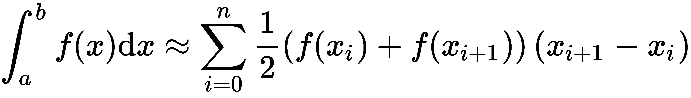
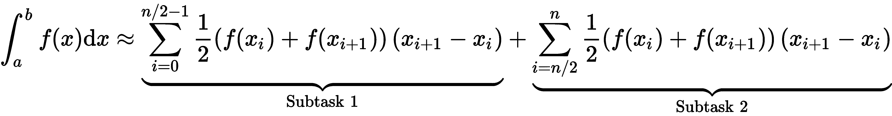
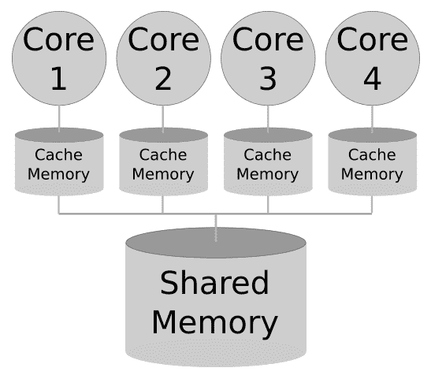
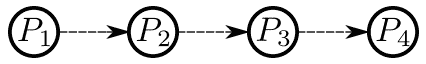
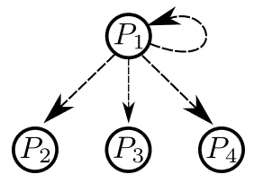
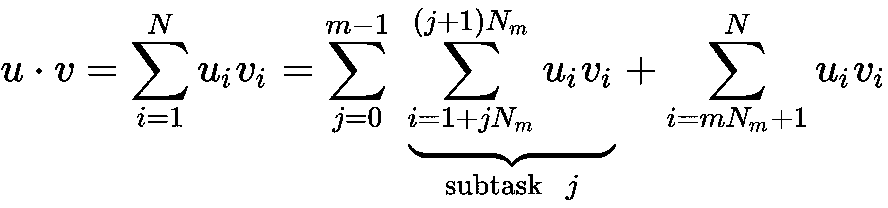
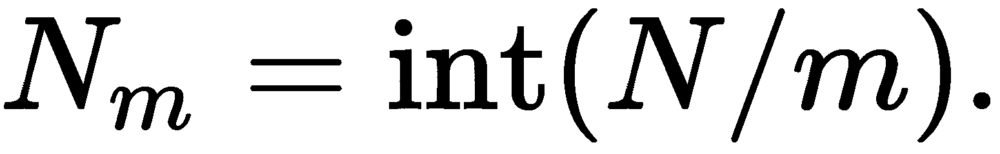

用于并行计算的 Python

本章涉及并行计算和模块`mpi4py`。复杂且耗时的计算任务通常可以拆分为子任务，如果有足够的计算能力，这些子任务可以同时执行。当这些子任务彼此独立时，进行并行计算尤其高效。需要等待另一个子任务完成的情况则不太适合并行计算。

考虑通过求积法则计算一个函数的积分任务：



使用![]。如果评估![]非常耗时，且![]很大，那么将问题拆分为两个或多个较小的子任务会更有利：



我们可以使用几台计算机，并将必要的信息提供给每台计算机，使其能够执行各自的子任务，或者我们可以使用一台带有所谓多核架构的计算机。

一旦子任务完成，结果会传送给控制整个过程并执行最终加法的计算机或处理器。

我们将在本章中以此为指导示例，涵盖以下主题：

+   多核计算机和计算机集群

+   消息传递接口（MPI）

# 第十九章：18.1 多核计算机和计算机集群

大多数现代计算机都是多核计算机。例如，本书写作时使用的笔记本电脑配备了 Intel® i7-8565U 处理器，具有四个核心，每个核心有两个线程。

这意味着什么？处理器上的四个核心允许并行执行四个计算任务。四个核心，每个核心有两个线程，通常被系统监视器计为八个 CPU。在本章中，只有核心数量才是重要的。

这些核心共享一个公共内存——你的笔记本的 RAM——并且每个核心有独立的缓存内存：



图 18.1：具有共享和本地缓存内存的多核架构

缓存内存由核心最优使用，并以高速访问，而共享内存可以被一个 CPU 的所有核心访问。在其上方是计算机的 RAM 内存，最后是硬盘，也是共享内存。

在下一部分，我们将看到如何将计算任务分配到各个核心，以及如何接收结果并进一步处理，例如，存储到文件中。

另一种并行计算的设置是使用计算机集群。在这里，一个任务被划分为可以并行化的子任务，这些子任务被发送到不同的计算机，有时甚至跨越长距离。在这种情况下，通信时间可能会非常重要。只有当处理子任务的时间相对于通信时间较长时，使用计算机集群才有意义。

# 18.2 消息传递接口（MPI）

在多核计算机或分布式内存的计算机集群上编程需要特殊的技术。我们在这里描述了*消息传递*以及 MPI 标准化的相关工具。这些工具在不同的编程语言中相似，例如 C、C++和 FORTRAN，并通过`mpi4py`模块在 Python 中实现。

## 18.2.1 前提条件

你需要先通过在终端窗口执行以下命令来安装此模块：

```py
conda install mpi4py
```

可以通过在你的 Python 脚本中添加以下一行来导入该模块：

```py
import mpi4py as mpi
```

并行化代码的执行是通过终端使用命令`mpiexec`完成的。假设你的代码存储在文件`script.py`中，在一台具有四核 CPU 的计算机上执行此代码，可以在终端窗口通过运行以下命令来实现：

```py
mpiexec -n 4 python script.py
```

或者，为了在一个包含两台计算机的集群上执行相同的脚本，可以在终端窗口运行以下命令：

```py
mpiexec --hostfile=hosts.txt python script.py
```

你需要提供一个文件`hosts.txt`，其中包含你想绑定到集群的计算机的名称或 IP 地址，以及它们的核心数：

```py
# Content of hosts.txt
192.168.1.25 :4 # master computer with 4 cores
192.168.1.101:2 # worker computer with 2 cores
```

Python 脚本（这里是`script.py`）必须被复制到集群中的所有计算机上。

# 18.3 将任务分配到不同的核心

当在多核计算机上执行时，我们可以认为`mpiexec`将给定的 Python 脚本复制到相应数量的核心上，并运行每个副本。例如，考虑一下包含命令`print("Hello it's me")`的单行脚本`print_me.py`，当通过`mpiexec -n 4 print_me.py`执行时，它会在屏幕上显示相同的消息四次，每次来自不同的核心。

为了能够在不同的核心上执行不同的任务，我们必须能够在脚本中区分这些核心。

为此，我们创建了一个所谓的通信实例，它组织了*世界*之间的通信，即输入输出单元，如屏幕、键盘或文件，与各个核心之间的通信。此外，每个核心都会被分配一个标识编号，称为 rank：

```py
from mpi4py import MPI
comm=MPI.COMM_WORLD  # making a communicator instance
rank=comm.Get_rank() # querrying for the numeric identifyer of the core 
size=comm.Get_size() # the total number of cores assigned
```

通信器属性 size 指的是在`mpiexec`语句中指定的进程总数。

现在我们可以为每个核心分配一个独立的计算任务，就像在下一个脚本中那样，我们可以称之为`basicoperations.py`：

```py

from mpi4py import MPI
comm=MPI.COMM_WORLD # making a communicator instance
rank=comm.Get_rank() # querrying for the numeric identifyer of the core 
size=comm.Get_size() # the total number of cores assigned 
a=15
b=2
if rank==0:
    print(f'Core {rank} computes {a}+{b}={a+b}')
if rank==1:
    print(f'Core {rank} computes {a}*{b}={a*b}')
if rank==2:
    print(f'Core {rank} computes {a}**{b}={a**b}')
```

这个脚本可以通过在终端输入以下命令来执行：

```py
mpiexec -n 3 python basicoperations.py
```

我们得到三个消息：

```py
Core 0 computes 15+2=17
Core 2 computes 15**2=225
Core 1 computes 15*2=3
```

所有三个进程都有各自的任务，并且是并行执行的。显然，将结果打印到屏幕上是一个瓶颈，因为屏幕是所有三个进程共享的。

在下一节中，我们将看到进程间是如何进行通信的。

## 18.3.1 进程间信息交换

进程间有不同的发送和接收信息的方法：

+   点对点通信

+   单对多和多对单

+   多对多

在本节中，我们将介绍点对点、单对多和多对单通信。

向邻居讲话并让信息沿街道传递，这是前面列出的第一种通信类型的日常生活示例，而第二种可以通过新闻广播来说明，一人讲话并广播给一大群听众。单对多和多对单通信

                    

图 18.2：点对点通信和单对多通信

在接下来的子节中，我们将研究这些不同的通信类型在计算上下文中的应用。

## 18.3.2 点对点通信

点对点通信将信息流从一个进程引导到指定的接收进程。我们首先通过考虑乒乓情况和电话链情况来描述方法和特点，并解释阻塞的概念。

点对点通信应用于科学计算，例如在分布域上的随机游走或粒子追踪应用，这些域被划分为多个子域，每个子域对应一个可以并行执行的进程数。

在这个乒乓示例中，我们假设有两个处理器相互发送一个整数，并将其值增加一。

我们从创建一个通信对象并检查是否有两个可用的进程开始：

```py
from mpi4py import MPI
comm=MPI.COMM_WORLD # making a communicator instance
rank=comm.Get_rank() # querying for the numeric identifier of the core 
size=comm.Get_size() # the total number of cores assigned 
if not (size==2):
    raise Exception(f"This examples requires two processes. \
                    {size} processes given.")
```

然后我们在两个进程之间来回发送信息：

```py
count = 0
text=['Ping','Pong']
print(f"Rank {rank} activities:\n==================")
while count < 5:
    if rank == count%2:
        print(f"In round {count}: Rank {rank} says {text[count%2]}""
               "and sends the ball to rank {(rank+1)%2}")
        count += 1
        comm.send(count, dest=(rank+1)%2)
    elif rank == (count+1)%2:
        count = comm.recv(source=(rank+1)%2)
```

信息通过通信器的`send`方法发送。在这里，我们提供了要发送的信息以及目的地。通信器确保将目的地信息转换为硬件地址；可以是你计算机的一个 CPU 核心，或主机的一个 CPU 核心。

另一台机器通过通信方法`comm.recv`接收信息。它需要知道信息来自哪里。在后台，它通过释放数据通道上的信息缓冲区，告诉发送方信息已经被接收。发送方在继续操作之前，需要等待此信号。

两个语句`if rank == count%2`和`elif rank == (count+1)%2`确保处理器交替进行发送和接收任务。

这是我们保存为`pingpong.py`文件并使用以下命令执行的短脚本输出：

```py
mpiexec -n 2 python pingpong.py 
```

在终端中，这会生成以下输出：

```py
Rank 0 activities:
==================
In round 0: Rank 0 says Ping and sends the ball to rank 1
In round 2: Rank 0 says Ping and sends the ball to rank 1
In round 4: Rank 0 says Ping and sends the ball to rank 1
Rank 1 activities:
==================
In round 1: Rank 1 says Pong and sends the ball to rank 0
In round 3: Rank 1 says Pong and sends the ball to rank 0
```

可以发送或接收什么类型的数据？由于命令 `send` 和 `recv` 以二进制形式传递数据，因此它们首先会将数据进行 `pickle`（参见 第 14.3 节：*Pickling*）。大多数 Python 对象都可以被 pickled，但例如 `lambda` 函数不能。也可以 pickle 缓冲数据，例如 NumPy 数组，但直接发送缓冲数据更高效，正如我们将在下一小节中看到的那样。

请注意，在进程之间发送和接收函数可能有其原因。由于方法 `send` 和 `recv` 仅传递对函数的引用，因此这些引用必须在发送和接收的处理器上存在。因此，以下 Python 脚本会返回一个错误：

```py
from mpi4py import MPI
comm=MPI.COMM_WORLD # making a communicator instance
rank=comm.Get_rank() # querying for the numeric identifier of the core
size=comm.Get_size() # the total number of cores assigned

if rank==0:
    def func():
        return 'Function called'
    comm.send(func, dest=1)
if rank==1:
    f=comm.recv(source=0)    # <<<<<< This line reports an error
    print(f())One-to-all and all-to-one communication
```

由语句 `recv` 抛出的错误信息是 `AttributeError: Can't get attribute 'func'`。这是由于 `f` 引用了 `func` 函数，而该函数在秩为 1 的处理器上没有定义。正确的做法是为两个处理器都定义该函数：

```py
from mpi4py import MPI
comm=MPI.COMM_WORLD # making a communicator instance
rank=comm.Get_rank() # querying for the numeric identifier of the core
size=comm.Get_size() # the total number of cores assigned

def func():
    return 'Function called'
if rank==0:
    comm.send(func, dest=1)
if rank==1:
    f=comm.recv(source=0) 
    print(f())
```

## 18.3.3 发送 NumPy 数组

命令 `send` 和 `recv` 是高级命令。这意味着它们在幕后执行工作，节省了程序员的时间并避免了可能的错误。它们会在内部推导出数据类型和所需通信缓冲区数据量后分配内存。这是在较低层次上基于 C 结构完成的。

NumPy 数组是对象，它们本身利用了类似 C 缓冲区的对象，因此在发送和接收 NumPy 数组时，可以通过在底层通信对等方 `Send` 和 `Recv` 中使用它们来提高效率（注意大小写！）。

在以下示例中，我们从一个处理器发送数组到另一个处理器：

```py
from mpi4py import MPI
comm=MPI.COMM_WORLD # making a communicator instance
rank=comm.Get_rank() # querying for the numeric identifier of the core
size=comm.Get_size() # the total number of cores assigned
import numpy as np

if rank==0:
    A = np.arange(700)
    comm.Send(A, dest=1)
if rank==1:
    A = np.empty(700, dtype=int)  # This is needed for memory allocation 
                                  # of the buffer on Processor 1
    comm.Recv(A, source=0)        # Note, the difference to recv in 
                                  # providing the data.
    print(f'An array received with last element {A[-1]}')

```

需要注意的是，在两个处理器上，必须分配缓冲区的内存。在这里，通过在处理器 0 上创建一个包含数据的数组以及在处理器 1 上创建一个具有相同大小和数据类型但包含任意数据的数组来完成这项工作。

此外，我们可以看到命令 `recv` 在输出中的区别。命令 `Recv` 通过第一个参数返回缓冲区。这是可能的，因为 NumPy 数组是可变的。

### 18.3.4 阻塞和非阻塞通信

命令 `send` 和 `recv` 及其缓冲区对应的 `Send` 和 `Recv` 是所谓的阻塞命令。这意味着，当相应的发送缓冲区被释放时，命令 `send` 才算完成。释放的时机取决于多个因素，例如系统的特定通信架构和要传输的数据量。最终，命令 `send` 在相应的命令 `recv` 接收到所有信息后才被认为是已释放的。如果没有这样的命令 `recv`，它将永远等待。这就形成了死锁情况。

以下脚本演示了可能发生死锁的情况。两个进程同时发送。如果要传输的数据量太大，无法存储，命令 `send` 就会等待相应的 `recv` 来清空管道，但由于等待状态，`recv` 永远不会被调用。这就是死锁。

```py
from mpi4py import MPI
comm=MPI.COMM_WORLD # making a communicator instance
rank=comm.Get_rank() # querrying for the numeric identifier of the core
size=comm.Get_size() # the total number of cores assigned

if rank==0:
    msg=['Message from rank 0',list(range(101000))]
    comm.send(msg, dest=1)
    print(f'Process {rank} sent its message')
    s=comm.recv(source=1)
    print(f'I am rank {rank} and got a {s[0]} with a list of \
          length {len(s[1])}')
if rank==1:
    msg=['Message from rank 1',list(range(-101000,1))]
    comm.send(msg,dest=0)
    print(f'Process {rank} sent its message')
    s=comm.recv(source=0)
    print(f'I am rank {rank} and got a {s[0]} with a list of \
          length {len(s[1])}')
```

注意，执行这段代码可能不会导致你的计算机死锁，因为要通信的数据量非常小。

在这种情况下，避免死锁的直接解决办法是交换命令 `recv` 和 `send` 在 *一个* 处理器上的执行顺序：

```py
from mpi4py import MPI
comm=MPI.COMM_WORLD # making a communicator instance
rank=comm.Get_rank() # querrying for the numeric identifier of the core
size=comm.Get_size() # the total number of cores assigned

if rank==0:
    msg=['Message from rank 0',list(range(101000))]
    comm.send(msg, dest=1)
    print(f'Process {rank} sent its message')
    s=comm.recv(source=1)
    print(f'I am rank {rank} and got a {s[0]} with a list of \
          length {len(s[1])}')
if rank==1:
    s=comm.recv(source=0)
    print(f'I am rank {rank} and got a {s[0]} with a list of \
          length {len(s[1])}')
 msg=['Message from rank 1',list(range(-101000,1))]
    comm.send(msg,dest=0)
    print(f'Process {rank} sent its message')
    print(f'I am rank {rank} and got a {s[0]} with a list of \
          length {len(s[1])}')
```

## 18.3.5 一对多与多对一通信

当一个依赖于大量数据的复杂任务被分解为子任务时，数据也必须分成与相关子任务相关的部分，并且结果必须汇总并处理成最终结果。

以两个向量的标量积为例，考虑将其划分为！[](img/386ea4fe-1822-4d43-b6e6-60222a9b9311.png)的子任务：



使用  所有子任务在初始数据的各个部分上执行相同的操作，结果必须汇总，并可能执行剩余的操作。

我们需要执行以下步骤：

1.  创建向量 `u` 和 `v`

1.  将它们分成 *m* 个子向量，且每个子向量的元素个数平衡，即当 `N` 能被 `m` 整除时，每个子向量包含 ![] 元素，否则一些子向量会包含更多元素。

1.  将每个子向量传递给 "它的" 处理器

1.  在每个处理器上执行子向量的标量积

1.  收集所有结果

1.  汇总结果

*步骤 1*、*2* 和 *6* 在一个处理器上运行，即所谓的 *根* 处理器。在以下示例代码中，我们选择排名为 0 的处理器来执行这些任务。*步骤 3、4* 和 *5* 在所有处理器上执行，包括根处理器。对于步骤 *3* 中的通信，`mpi4py` 提供了命令 `scatter`，而用于收集结果的命令是 `gather`。

### 准备通信数据

首先，我们来看看步骤 *2*。编写一个脚本，将一个向量分成 *m* 个平衡元素的部分，是一个不错的练习。这里有一个建议的脚本实现，当然还有很多其他的实现方式：

```py
def split_array(vector, n_processors):
 # splits an array into a number of subarrays 
 # vector one dimensional ndarray or a list
 # n_processors integer, the number of subarrays to be formed

    n=len(vector)
    n_portions, rest = divmod(n,n_processors) # division with remainder
    # get the amount of data per processor and distribute the res on
    # the first processors so that the load is more or less equally 
    # distributed
    # Construction of the indexes needed for the splitting
    counts = [0]+ [n_portions + 1 \
                 if p < rest else n_portions for p in range(n_processors)]
    counts=numpy.cumsum(counts)
    start_end=zip(counts[:-1],counts[1:]) # a generator
    slice_list=(slice(*sl) for sl in start_end) # a generator comprehension
    return [vector[sl] for sl in slice_list] # a list of subarrays
```

由于本章是本书中的最后几章之一，我们已经看到很多可以用于这段代码的工具。我们使用了 NumPy 的累积和 `cumsum`。我们使用了生成器 `zip`，通过运算符 `*` 解包参数，以及生成器推导式。我们还默默地引入了数据类型 `slice`，它允许我们在最后一行以非常简洁的方式执行分割步骤。

### 命令——scatter 和 gather

现在我们已经准备好查看整个脚本，来解决我们的演示问题——标量积：

```py
from mpi4py import MPI
import numpy as np

comm = MPI.COMM_WORLD
rank = comm.Get_rank()
nprocessors = comm.Get_size()
import splitarray as spa 

if rank == 0:
    # Here we generate data for the example
    n = 150
    u = 0.1*np.arange(n)
    v = - u
    u_split = spa.split_array(u, nprocessors)
    v_split = spa.split_array(v, nprocessors)
else:
    # On all processor we need variables with these names,
    # otherwise we would get an Exception "Variable not defined" in 
    # the scatter command below
    u_split = None
    v_split = None
# These commands run now on all processors
u_split = comm.scatter(u_split, root=0) # the data is portion wise 
                                        # distributed from root
v_split = comm.scatter(v_split, root=0)
# Each processor computes its part of the scalar product
partial_dot = u_split@v_split
# Each processor reports its result back to the root
partial_dot = comm.gather(partial_dot,root=0)

if rank==0:
    # partial_dot is a list of all collected results
    total_dot=np.sum(partial_dot)
    print(f'The parallel scalar product of u and v'
        f'on {nprocessors} processors is {total_dot}.\n'
        f'The difference to the serial computation is \
        {abs(total_dot-u@v)}')
```

如果此脚本存储在文件`parallel_dot.py`中，使用五个处理器执行的命令如下：

```py
mexec -n 5 python parallel_dot.py
```

在这种情况下，结果如下：

```py
The parallel scalar product of u and v on 5 processors is -11137.75.
The difference to the serial computation is 0.0
```

本示例演示了使用`scatter`将特定信息发送到每个处理器。要使用此命令，根处理器必须提供一个包含与可用处理器数量相同元素的列表。每个元素包含要传送到某个处理器的数据，包括根处理器本身。

反向过程是`gather`。当所有处理器完成此命令时，根处理器将得到一个包含与可用处理器数量相同元素的列表，每个元素包含其对应处理器的结果数据。

在最后一步，根处理器再次独自工作，后处理此结果列表。上面的示例将所有列表元素求和并显示结果。

并行编程的艺术在于避免瓶颈。理想情况下，所有处理器都应保持忙碌，并且应该同时开始和结束。这就是为什么我们前面描述的脚本`splitarray`将工作负载大致平均分配给处理器的原因。此外，代码应以这样的方式组织，即根处理器独自工作的开始和结束阶段，相对于所有处理器同时执行的计算密集型部分来说是很短的。

### 最终数据归约操作——命令 reduce

并行标量积示例是许多其他任务的典型示例，展示了结果处理方式：来自所有处理器的数据量在最后一步被归约为一个单一的数字。在这里，根处理器将所有处理器的部分结果相加。命令`reduce`可以有效地用于此任务。我们通过让`reduce`在一步中完成聚集和求和来修改之前的代码。以下是修改后的前几行代码：

```py
......... modification of the script above .....
# Each processor reports its result back to the root
# and these results are summed up
total_dot = comm.reduce(partial_dot, op=MPI.SUM, root=0)

if rank==0:
   print(f'The parallel scalar product of u and v'
         f' on {nprocessors} processors is {total_dot}.\n'
         f'The difference to the serial computation \
         is {abs(total_dot-u@v)}') 
```

其他常用的归约操作有：

+   `MPI.MAX`或`MPI.MIN`：部分结果的最大值或最小值

+   `MPI.MAXLOC`或`MPI.MINLOC`：部分结果的最大值位置或最小值位置

+   `MPI.PROD`：部分结果的乘积

+   `MPI.LAND`或`MPI.LOR`：部分结果的逻辑与/逻辑或

### 向所有处理器发送相同的消息

另一个集体命令是广播命令`bcast`。与`scatter`不同，它用于将相同的数据发送到所有处理器。它的调用方式与`scatter`类似：

```py
data = comm.bcast(data, root=0)
```

但是，发送的是总数据，而不是分割数据的列表。同样，根处理器可以是任何处理器。它是准备广播数据的处理器。

### 缓冲数据

类似地，`mpi4py`为类似 NumPy 数组的缓冲数据提供了相应的集体命令，通过大写命令来实现：`scatter`/`Scatter`、`gather`/`Gather`、`reduce`/`Reduce`、`bcast`/`Bcast`。

# 18.4 总结

在本章中，我们了解了如何在不同的处理器上并行执行相同脚本的副本。消息传递允许这些不同进程之间进行通信。我们看到了*点对点*通信，以及两种不同的分布式集体通信类型：*一对多*和*多对一*。本章中展示的命令是由 Python 模块`mpi4py`提供的，这是一个 Python 封装器，用于实现 C 语言中的 MPI 标准。

经过本章的学习后，你现在能够编写自己的并行编程脚本，并且你会发现我们这里只描述了最基本的命令和概念。进程分组和信息标记只是我们遗漏的两个概念。许多这些概念对于特殊和具有挑战性的应用非常重要，但它们对于本介绍来说过于具体。
