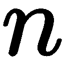

综合示例

在本章中，我们将提供一些综合性和较长的示例，并简要介绍理论背景以及示例的完整实现。在这里，我们希望向您展示本书中定义的概念如何在实践中应用。

本章将涵盖以下主题：

+   多项式

+   多项式类

+   谱聚类

+   求解初值问题

# 第二十章：19.1 多项式

首先，我们将通过设计一个多项式类来展示迄今为止所介绍的 Python 构造的强大功能。

注意，这个类在概念上与类 `numpy.poly1d` 不同。

我们将提供一些理论背景，这将引导我们列出需求，然后给出代码并附带一些注释。

## 19.1.1 理论背景

多项式 ![] 由其阶数、表示法和系数定义。前面方程中展示的多项式表示法称为*单项式表示法*。在这种表示法中，多项式作为单项式的线性组合书写 。

或者，可以将多项式写成：

+   带有系数的*牛顿表示法* ![] 和 ![] 点，：


+   带有系数的*拉格朗日表示* ![] 和 ![] 点，：


使用基函数：


有无穷多种表示方法，但我们这里只限制于这三种典型表示。

多项式可以通过插值条件确定：


给定不同的值  和任意值  作为输入。在拉格朗日公式中，插值多项式是直接可用的，因为其系数即为插值数据。牛顿表示法中的插值多项式系数可以通过递推公式获得，称为分差公式：


和


然后我们通过  获得系数。

单项式表示法中插值多项式的系数通过解线性系统获得：


一个具有给定多项式（或其倍数）作为特征多项式的矩阵被称为*伴随矩阵*。伴随矩阵的特征值即为多项式的零点（根）。通过先建立其伴随矩阵，再使用`scipy.linalg.eig`计算特征值，可以构建一个计算零点的算法。牛顿表示下的多项式的伴随矩阵如下所示：


## 19.1.2 任务

我们现在可以制定一些编程任务：

1.  编写一个名为`PolyNomial`的类，具有`points`、`degree`、`coeff`和`basis`属性，其中：

+   `points` 是一个元组列表！[](img/4afd74eb-4a3f-4f69-bb79-76ec30fe0648.png)。

+   `degree` 是相应插值多项式的阶数。

+   `coeff` 包含多项式的系数。

+   `basis` 是一个字符串，指明所使用的表示形式。

1.  为类提供一个方法，用于在给定点上评估多项式。

1.  为类提供一个名为`plot`的方法，用于在给定区间内绘制多项式。

1.  编写一个名为`__add__`的方法，返回两个多项式的和。需要注意的是，只有在单项式情况下，才能通过简单地将系数相加来计算和。

1.  编写一个方法，计算表示为单项式形式的多项式的系数。

1.  编写一个方法，计算多项式的伴随矩阵。

1.  编写一个方法，通过计算伴随矩阵的特征值来计算多项式的零点。

1.  编写一个方法，计算给定多项式的^(th) 导数。

1.  编写一个方法，检查两个多项式是否相等。可以通过比较所有系数来检查相等性（零的首项系数不应影响结果）。

# 19.1.3 多项式类

现在我们基于单项式形式设计一个多项式基类。多项式可以通过给定其相对于单项式基的系数，或通过给定插值点列表来初始化，如下所示：

```py
import scipy.linalg as sl
import matplotlib.pyplot as mp

class PolyNomial:
    base='monomial'
    def __init__(self,**args):
        if 'points' in args:
            self.points = array(args['points'])
            self.xi = self.points[:,0]
            self.coeff = self.point_2_coeff()
            self.degree = len(self.coeff)-1
        elif 'coeff' in args:
            self.coeff = array(args['coeff'])
            self.degree = len(self.coeff)-1
            self.points = self.coeff_2_point()
        else:
            self.points = array([[0,0]])
            self.xi = array([1.])
            self.coeff = self.point_2_coeff()
            self.degree = 0
```

新类的`__init__`方法使用了构造`**args`，如第 7.2.5 节中讨论的：*可变参数个数*。如果没有给定参数，则默认假定为零多项式。如果多项式由插值点给出，计算系数的方法是通过求解范德蒙矩阵系统，方法如下：

```py
def point_2_coeff(self):
    return sl.solve(vander(self.x),self.y)
```

从![] 给定的系数，![] 插值点由以下方式构造：

```py
def coeff_2_point(self):
    points = [[x,self(x)] for x in linspace(0,1,self.degree+1)]
    return array(points)
```

命令`self(x)`进行多项式评估，这通过提供`__call__`方法来实现：

```py
def __call__(self,x):
    return polyval(self.coeff,x)
```

（参见第 8.1.5 节中的`__call__`方法示例：*特殊方法*。）这里，该方法使用了 NumPy 命令`polyval`。接下来的步骤，我们只需为了方便添加两个方法，并用`property`装饰器装饰它们（参见第 7.8 节：*作为装饰器的函数**)*：

```py
@property
def x(self):
    return self.points[:,0]
@property
def y(self):
    return self.points[:,1]
```

让我们解释一下这里发生了什么。我们定义了一个方法来提取定义多项式时使用的数据的 值。类似地，也定义了一个提取数据 值的方法。通过`property`装饰器，调用该方法的结果呈现得就像它是多项式的一个属性一样。这里有两种编码选择：

1.  我们使用方法调用：

```py
def x(self):
    return self.points[:,0]
```

这通过调用：`p.x()`提供对 值的访问。

1.  我们使用`property`装饰器。它允许我们通过以下语句轻松访问 值：`p.x`。我们在这里选择第二种变体。

定义`__repr__`方法始终是一个好习惯（参见第 8.1.5 节：*特殊方法*）。至少对于快速检查结果，这个方法非常有用：

```py
def __repr__(self):
    txt  = f'Polynomial of degree {self.degree} \n'
    txt += f'with coefficients {self.coeff} \n in {self.base} basis.'
    return txt
```

现在，我们提供一个用于绘制多项式的方法，如下所示：

```py
margin = .05
plotres = 500
def plot(self,ab=None,plotinterp=True):
    if ab is None: # guess a and b
       x = self.x
       a, b = x.min(), x.max()
       h = b-a
       a -= self.margin*h
       b += self.margin*h
    else:
       a,b = ab
    x = linspace(a,b,self.plotres)
    y = vectorize(self.__call__)(x)
    mp.plot(x,y)
    mp.xlabel('$x$')
    mp.ylabel('$p(x)$')
    if plotinterp:
        mp.plot(self.x, self.y, 'ro')
```

请注意使用`vectorize`命令（参见第 4.8 节：*作用于数组的函数*）。`__call__`方法是特定于单项式表示的，如果多项式以其他方式表示，则必须进行更改。这对于计算多项式的伴随矩阵也是如此：

```py
def companion(self):
    companion = eye(self.degree, k=-1)
    companion[0,:] -= self.coeff[1:]/self.coeff[0]
    return companion
```

一旦伴随矩阵可用，给定多项式的零点就是它的特征值：

```py
def zeros(self):
    companion = self.companion()
    return sl.eigvals(companion)
```

为此，必须首先导入模块`scipy.linalg`，并命名为`sl`。

## 19.1.4 多项式类的使用示例

让我们给出一些使用示例。

首先，我们从给定的插值点创建一个多项式实例：

```py
p = PolyNomial(points=[(1,0),(2,3),(3,8)])
```

相对于单项式基，多项式的系数作为`p`的一个属性提供：

```py
p.coeff # returns array([ 1., 0., -1.]) (rounded)
```

这对应于多项式  。通过`p.plot((-3.5,3.5))`获得的多项式默认图形如下所示（*图 19.1*）：


图 19.1：多项式绘图方法的结果

最后，我们计算多项式的零点，在此案例中是两个实数：

```py
pz = p.zeros() # returns array([-1.+0.j, 1.+0.j])
```

结果可以通过在这些点处评估多项式来验证：

```py
p(pz) # returns array([0.+0.j, 0.+0.j])
```

## 19.1.5 牛顿多项式

类 `NewtonPolyNomial` 定义了一个基于牛顿基的多项式。我们通过使用命令 `super` 让它继承自多项式基类的一些常用方法，例如 `polynomial.plot`、`polynomial.zeros`，甚至 `__init__` 方法的部分内容（参见 第 8.5 节：*子类与继承*）：

```py
class NewtonPolynomial(PolyNomial):
    base = 'Newton'
    def __init__(self,**args):
        if 'coeff' in args:
            try:
                self.xi = array(args['xi'])
            except KeyError: 
                raise ValueError('Coefficients need to be given'
                'together with abscissae values xi')
        super(NewtonPolynomial, self).__init__(**args)
```

一旦给定插值点，系数的计算就通过以下方式进行：

```py
def point_2_coeff(self):
    return array(list(self.divdiff()))
```

我们使用了分割差分来计算多项式的牛顿表示，这里编程为生成器（参见 第 9.3.1 节：*生成器* 和 第 9.4 节：*列表填充模式*）：

```py
def divdiff(self): 
    xi = self.xi
    row = self.y
    yield row[0]
    for level in range(1,len(xi)):
        row = (row[1:] - row[:-1])/(xi[level:] - xi[:-level])
        if allclose(row,0): # check: elements of row nearly zero
           self.degree = level-1
           break
        yield row[0]
```

让我们简单检查一下这个是如何工作的：

```py
# here we define the interpolation data: (x,y) pairs
pts = array([[0.,0],[.5,1],[1.,0],[2,0.]]) 

pN = NewtonPolynomial(points=pts) # this creates an instance of the
                                  # polynomial class
pN.coeff # returns the coefficients array([0\. , 2\. , -4\. , 2.66666667])
print(pN)
```

函数 `print` 执行基类的 `__repr__` 方法并返回以下文本：

```py
Polynomial of degree 3
 with coefficients [ 0\.     2\.    -4\.      2.66666667]
 in Newton basis.
```

多项式评估与基类的相应方法不同。方法 `NewtonPolyNomial.__call__` 需要重写 `Polynomial.__call__`：

```py
def __call__(self,x):
    # first compute the sequence 1, (x-x_1), (x-x_1)(x-x_2),...
    nps = hstack([1., cumprod(x-self.xi[:self.degree])])
    return self.coeff@nps
```

最后，我们给出了伴随矩阵的代码，该代码重写了父类的相应方法，如下所示：

```py
def companion(self):
    degree = self.degree
    companion = eye(degree, k=-1)
    diagonal = identity(degree,dtype=bool)
    companion[diagonal] = self.x[:degree]
    companion[:,-1] -= self.coeff[:degree]/self.coeff[degree]
    return companion
```

请注意布尔数组的使用。练习将进一步在此基础上构建。

# 19.2 谱聚类

特征向量的一个有趣应用是用于数据聚类。通过使用由距离矩阵导出的矩阵的特征向量，可以将未标记的数据分成不同的组。谱聚类方法因使用该矩阵的谱而得名。对于  元素（例如，数据点之间的成对距离）的距离矩阵是一个  对称矩阵。给定这样的  距离矩阵 ，具有距离值 ![]，我们可以按以下方式创建数据点的拉普拉斯矩阵：


这里， 是单位矩阵， 是包含  行和列和的对角矩阵：


数据聚类是通过 *L* 的特征向量得到的。在只有两类数据点的最简单情况下，第一个特征向量（即对应最大特征值的那个）通常足以将数据分开。

这是一个简单的二类聚类示例。以下代码创建了一些二维数据点，并基于拉普拉斯矩阵的第一个特征向量对其进行聚类：

```py
import scipy.linalg as sl

# create some data points
n = 100
x1 = 1.2 * random.randn(n, 2)
x2 = 0.8 * random.randn(n, 2) + tile([7, 0],(n, 1))
x = vstack((x1, x2))

# pairwise distance matrix
M = array([[ sqrt(sum((x[i] - x[j])**2)) 
             for i in range(2*n)]
             for j in range(2 * n)])

# create the Laplacian matrix
D = diag(1 / sqrt( M.sum(axis = 0) ))
L = identity(2 * n) - dot(D, dot(M, D))

# compute eigenvectors of L
S, V = sl.eig(L)
# As L is symmetric the imaginary parts
# in the eigenvalues are only due to negligible numerical errors S=S.real
V=V.real
```

对应最大特征值的特征向量给出了分组（例如，通过在  处进行阈值化）并可以通过以下方式展示：

```py
largest=abs(S).argmax()
plot(V[:,largest])
```

以下图 (*图 19.2*) 显示了简单两类数据集的谱聚类结果：


图 19.2：简单两类聚类的结果

对于更难的数据集和更多的类别，通常会采用与最大特征值对应的  特征向量，然后使用其他方法对数据进行聚类，但使用的是特征向量而不是原始数据点。常见的选择是 -均值聚类算法，这是下一个示例的主题。

特征向量作为输入用于 -均值聚类，如下所示：

```py
import scipy.linalg as sl
import scipy.cluster.vq as sc
# simple 4 class data
x = random.rand(1000,2)
ndx = ((x[:,0] < 0.4) | (x[:,0] > 0.6)) & \
                     ((x[:,1] < 0.4) | (x[:,1] > 0.6))
x = x[ndx]
n = x.shape[0]

# pairwise distance matrix
M = array([[ sqrt(sum((x[i]-x[j])**2)) for i in range(n) ]
           for j in range(n)])

# create the Laplacian matrix
D = diag(1 / sqrt( M.sum(axis=0) ))
L = identity(n) - dot(D, dot(M, D))

# compute eigenvectors of L
_,_,V = sl.svd(L)

k = 4
# take k first eigenvectors
eigv = V[:k,:].T

# k-means
centroids,dist = sc.kmeans(eigv,k)
clust_id = sc.vq(eigv,centroids)[0]
```

请注意，我们在此使用奇异值分解 `sl.svd` 计算了特征向量。由于 ***L*** 是对称的，结果与使用 `sl.eig` 得到的结果相同，但 `svd` 已经按照特征值的顺序给出了特征向量。我们还使用了临时变量。`svd` 返回一个包含三个数组的列表：左奇异向量 `U`、右奇异向量 `V` 和奇异值 `S`，如下所示：

```py
U, S, V = sl.svd(L)
```

由于我们在这里不需要 `U` 和 `S`，因此可以在解包 `svd` 返回值时丢弃它们：

```py
_, _, V = sl.svd(L)
```

结果可以通过以下方式绘制：

```py
for i in range(k):
    ndx = where(clust_id == i)[0]
    plot(x[ndx, 0], x[ndx, 1],'o')
axis('equal')
```

以下图显示了简单 *多类数据集* 的谱聚类结果：


图 19.3：简单四类数据集的谱聚类示例

# 19.3 求解初值问题

在本节中，我们将考虑数值求解给定初值的常微分方程组的数学任务：

*。*

该问题的解是一个函数 。数值方法在离散的通信点  计算近似值，，位于感兴趣的区间  内。我们将描述问题的数据收集到一个类中，如下所示：

```py
class IV_Problem:
    """
    Initial value problem (IVP) class
    """
    def __init__(self, rhs, y0, interval, name='IVP'):
        """
        rhs 'right hand side' function of the ordinary differential
                                                   equation f(t,y)
        y0 array with initial values
        interval start and end value of the interval of independent
        variables often initial and end time
        name descriptive name of the problem
        """
        self.rhs = rhs
        self.y0 = y0
        self.t0, self.tend = interval
        self.name = name
```

微分方程：


描述了一个数学摆；* ![] *是其相对于竖直轴的角度，***g*** 是重力常数，***l*** 是摆长。初始角度是 ，初始角速度为零。

摆锤问题成为问题类的一个实例，如下所示：

```py
def rhs(t,y):
    g = 9.81
    l = 1.
    yprime = array([y[1], g / l * sin(y[0])])
    return yprime

pendulum = IV_Problem(rhs, array([pi / 2, 0.]), [0., 10.] ,
                      'mathem. pendulum')
```

对当前问题可能会有不同的看法，这会导致不同的类设计。例如，有人可能希望将自变量的区间视为解过程的一部分，而不是问题定义的一部分。考虑初值时也是如此。我们在这里将其视为数学问题的一部分，而其他作者可能希望将初值作为解过程的一部分，从而允许初值的变化。

解决过程被建模为另一个类：

```py
class IVPsolver:
    """
    IVP solver class for explicit one-step discretization methods
    with constant step size
    """
    def __init__(self, problem, discretization, stepsize):
        self.problem = problem
        self.discretization = discretization
        self.stepsize = stepsize
    def one_stepper(self):
        yield self.problem.t0, self.problem.y0
        ys = self.problem.y0
        ts = self.problem.t0
        while ts <= self.problem.tend:
            ts, ys = self.discretization(self.problem.rhs, ts, ys,
                                         self.stepsize)
            yield ts, ys
    def solve(self):
        return list(self.one_stepper())
```

我们接下来首先定义两个离散化方案：

+   *显式欧拉方法*：

```py
def expliciteuler(rhs, ts, ys, h):
    return ts + h, ys + h * rhs(ts, ys)
```

+   *经典龙格-库塔四阶法（RK4）*：

```py
def rungekutta4(rhs, ts, ys, h):
    k1 = h * rhs(ts, ys)
    k2 = h * rhs(ts + h/2., ys + k1/2.) 
    k3 = h * rhs(ts + h/2., ys + k2/2.)
    k4 = h * rhs(ts + h, ys + k3)
    return ts + h, ys + (k1 + 2*k2 + 2*k3 + k4)/6.
```

使用这些工具，我们可以创建实例以获得相应的摆锤常微分方程的离散化版本：

```py
pendulum_Euler = IVPsolver(pendulum, expliciteuler, 0.001) 
pendulum_RK4 = IVPsolver(pendulum, rungekutta4, 0.001)
```

我们可以解决这两个离散模型并绘制解与角度差：

```py
sol_Euler = pendulum_Euler.solve()
sol_RK4 = pendulum_RK4.solve()
tEuler, yEuler = zip(*sol_Euler)
tRK4, yRK4 = zip(*sol_RK4)
subplot(1,2,1), plot(tEuler,yEuler),\
        title('Pendulum result with Explicit Euler'),\
        xlabel('Time'), ylabel('Angle and angular velocity')
subplot(1,2,2), plot(tRK4,abs(array(yRK4)-array(yEuler))),\
        title('Difference between both methods'),\
        xlabel('Time'), ylabel('Angle and angular velocity')
```


图 19.4：使用显式欧拉方法的摆锤模拟，并与更精确的龙格-库塔四阶法的结果进行比较

讨论替代的类设计是值得的。什么应该放在独立的类中，什么应该归并到同一个类中？

+   我们严格将数学问题与数值方法分开。初值应该放在哪里？它们应该是问题的一部分还是解算器的一部分？或者它们应该作为解算器实例的求解方法的输入参数？甚至可以设计程序，允许多种可能性。选择使用这些替代方案之一取决于未来程序的使用。像参数识别中的各种初值循环，留初值作为求解方法的输入参数会更方便。另一方面，模拟具有相同初值的不同模型变体时，将初值与问题绑定起来会更为合理。

+   为简化起见，我们仅展示了使用常定步长的求解器。`IVPsolver`类的设计是否适用于未来扩展自适应方法，其中给定的是容差而非步长？

+   我们之前建议使用生成器构造来实现步进机制。自适应方法需要时不时地拒绝某些步长。这种需求是否与`IVPsolver.onestepper`中步进机制的设计冲突？

+   我们鼓励你检查两个 SciPy 工具的设计，这些工具用于解决初值问题，分别是`scipy.integrate.ode`和`scipy.integrate.odeint`。

# 19.4 小结

本书中大部分内容已经整合到本章的三个较长示例中。这些示例模拟了代码开发并提供了原型，鼓励你根据自己的想法进行修改和对比。

你会发现，科学计算中的代码因其与数学定义的算法有着紧密关系，往往具有其独特风格，并且通常明智的做法是保持代码与公式之间的关系可见。Python 提供了实现这一点的技巧，正如你所看到的。

# 19.5 练习

**例 1：** 实现一个方法 `__add__`，通过将两个给定的多项式  和  相加，构造一个新的多项式 。在单项式形式中，多项式的相加只是将系数相加，而在牛顿形式中，系数依赖于插值点的横坐标 。在相加两个多项式的系数之前，多项式  必须获得新的插值点，这些插值点的横坐标  必须与  的横坐标一致，并且必须提供方法 `__changepoints__` 来实现这一点。该方法应更改插值点，并返回一组新的系数。

**例 2：** 编写转换方法，将一个多项式从牛顿形式转换为单项式形式，反之亦然。

**例 3：** 编写一个名为 `add_point` 的方法，该方法接受一个多项式 *q* 和一个元组 ![] 作为参数，并返回一个新的多项式，该多项式插值 `self.points` 和 ![]。

**例 4：** 编写一个名为 `LagrangePolynomial` 的类，该类实现拉格朗日形式的多项式，并尽可能多地继承多项式基类。

**例 5：** 编写多项式类的测试。
