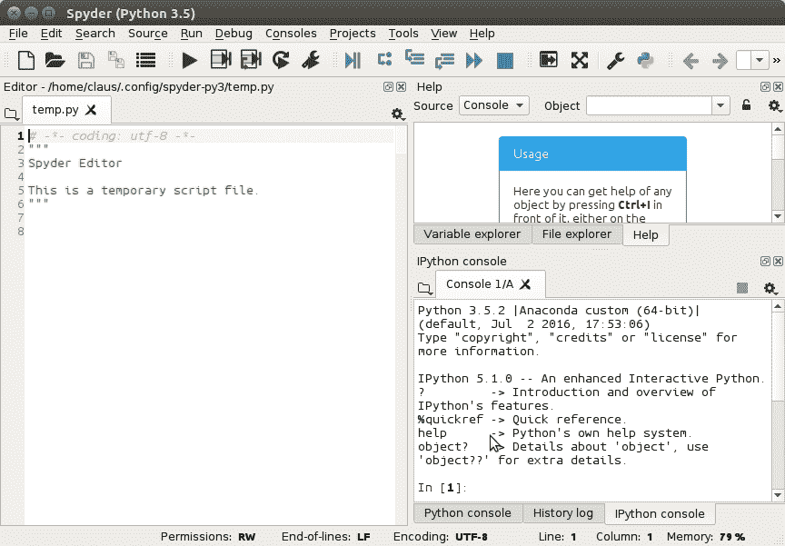
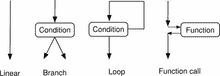
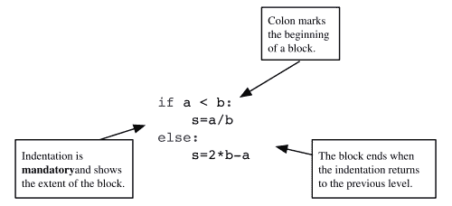
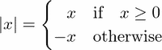
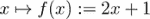
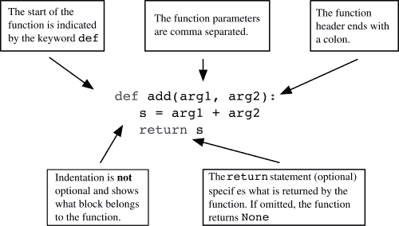

# 一、入门指南

在本章中，我们将简要概述 Python 的主要语法元素。刚开始学习编程的读者可以在本章的书中得到指导。每个主题都以*操作方法*的方式呈现在这里，并将在本书后面以更深入的概念方式进行解释，并且还将通过许多应用和扩展得到丰富。

已经熟悉另一种编程语言的读者会在本章中遇到 Python 处理经典语言构造的方式。它为他们提供了 Python 编程的快速入门。

两种类型的读者都被鼓励在曲折地阅读这本书时，把这一章作为一个简短的指南。然而，在我们开始之前，我们必须确保一切就绪，并且您已经安装了正确版本的 Python 以及科学计算的主要模块和工具，例如一个好的编辑器和一个外壳，这有助于代码开发和测试。

阅读以下部分，即使您已经可以访问安装了 Python 的计算机。你可能想调整一下，让工作环境符合这本书的介绍。

# 安装和配置说明

在深入研究这本书的主题之前，你应该在电脑上安装所有相关的工具。我们将为您提供一些建议，并推荐您可能想要使用的工具。我们只描述公共领域和免费工具。

## 安装

Python 目前有两个主要版本； *2.x* 分公司和新的 *3.x* 分公司。这些分支之间存在语言不兼容，你必须知道使用哪一个。本书基于 *3.x* 分支，考虑到语言直到发布 *3.5* 。

对于本书，您需要安装以下内容:

*   解释器:Python *3.5* (或更高版本)
*   科学计算的模块:科学与数字
*   数学结果的图形表示模块:matplotlib
*   外壳:IPython
*   一个 Python 相关的编辑器:Spyder(参考下面的*图 1.1* ， *Spyder* ，Geany

所谓的分发包方便了这些设备的安装。我们建议您使用 Anaconda。Spyder 的默认屏幕由左侧的编辑器窗口、右下角的控制台窗口(可访问 IPython shell)和右上角的帮助窗口组成，如下图所示:



图 1.1:Spyder 的默认屏幕由左侧的编辑器窗口、右下角的控制台窗口(可以访问 IPython shell)和右上角的帮助窗口组成。

## 蟒蛇

即使您的计算机上预装了 Python，我们也建议您创建一个个人 Python 环境，让您在工作时不会有意外影响计算机功能可能依赖的软件的风险。有了虚拟环境，比如 Anaconda，您可以自由地更改语言版本和安装软件包，而不会产生意想不到的副作用。

如果最坏的情况发生了，你把事情完全搞砸了，只需要删除 Anaconda 目录，然后重新开始。运行 Anaconda 安装程序将安装 Python、Python 开发环境和编辑器(Spyder)、shell IPython 以及最重要的数值计算软件包，例如 SciPy、NumPy 和 matplotlib。

您可以在 Anaconda 创建的虚拟环境中安装带有`conda install`的附加软件包(请参考[【2】](16.html "Appendix . References")的官方文档)。

## 配置

大多数 Python 代码将收集在文件中。我们建议您在所有 Python 文件中使用以下标题:

```py
from scipy import *
from matplotlib.pyplot import *
```

这样，您就可以确保本书中使用的所有标准模块和函数(如 SciPy)都是导入的。没有这一步，书中的大多数例子都会出现错误。许多编辑器，如 Spyder，提供了为您的文件创建模板的可能性。寻找这个特性，并将前面的标题放入模板中。

## 蟒蛇壳

Python 外壳很好，但对于交互式脚本来说不是最佳的。因此，我们建议改用 IPython(官方文档请参考[【26】](16.html "Appendix . References"))。IPython 可以通过不同的方式启动:

*   在终端外壳中运行以下命令:`ipython`
*   通过直接点击一个名为 Jupyter QT 控制台的图标


*   使用 Spyder 时，您应该使用 IPython 控制台(参见*图 1.1* 、 *Spyder* )。

## 执行脚本

您通常希望执行文件的内容。根据文件在计算机上的位置，在执行文件内容之前，有必要导航到正确的位置。

*   使用 IPython 中的命令`cd`移动到文件所在的目录。
*   要执行名为`myfile.py`的文件的内容，只需在 IPython shell 中运行以下命令

```py
 run myfile

```

## 获得帮助

以下是一些关于如何使用 IPython 的提示:

*   要获得对象的帮助，只需在对象名称后键入`?`，然后键入`return`。
*   使用箭头键重复使用最后执行的命令。
*   您可以使用*选项卡*键完成(也就是说，您编写一个变量或方法的第一个字母，IPython 向您显示一个包含所有可能完成的菜单)。
*   使用 *Ctrl+D* 退出。
*   使用 IPython 的神奇功能。在命令提示符下应用`%magic`可以找到列表和解释。

### 型式

你可以在 IPython 的在线文档中找到更多关于 IPython 的信息，[【15】](16.html "Appendix . References")*。*

## jupyter–python 笔记本电脑

Jupyter 笔记本是展示你作品的绝佳工具。学生可能想用它来制作和记录作业和练习，老师可以用它来准备讲座，甚至幻灯片和网页。

如果您已经通过 Anaconda 安装了 Python，那么您已经为 Jupyter 准备好了一切。您可以通过在终端窗口中运行以下命令来调用笔记本:

```py
jupyter notebook

```

浏览器窗口将会打开，您可以通过网络浏览器与 Python 进行交互。

# 程序和程序流程

程序是以自上而下的顺序执行的一系列语句。这种线性执行顺序有一些重要的例外:

*   可能会有替代语句组(块)的条件执行，我们称之为分支。
*   有重复执行的块，称为循环(参见下面的*图 1.2* ，*程序流程*)。
*   有些函数调用是对另一段代码的引用，它在主程序流恢复之前执行。函数调用中断线性执行并暂停程序单元的执行，同时将控制传递给另一个单元-函数。当这完成时，它的控制被返回到调用单元。



图 1.2:程序流程

Python 使用一种特殊的语法来标记语句块:一个关键字、一个冒号和一个缩进的语句序列，它们都属于语句块(参见下面的*图 1.3* 、 *Block 命令*)。



图 1.3:阻止命令

## 评论

如果程序中的一行包含符号`#`，同一行中的所有内容都被视为注释:

```py
# This is a comment of the following statement
a = 3  # ... which might get a further comment here  
```

## 线连接

行尾的反斜杠`\`将下一行标记为延续行，即显式行连接。如果该行在所有圆括号都关闭之前结束，下面的行将自动被识别为延续行，即隐式行连接。

# 基本类型

让我们回顾一下您将在 Python 中遇到的基本数据类型。

## 数字

数字可以是整数、实数或复数。通常的操作是:

*   加减，`+`和`-`
*   乘法和除法，`*`和`/`
*   动力，`**`

这里有一个例子:

```py
2 ** (2 + 2) # 16
1j ** 2 # -1
1\. + 3.0j
```

### 注

**复数符号**

`j`是表示复数虚部的符号。它是一个语法元素，不应该与变量相乘相混淆。关于复数的更多信息可以在[第二章](02.html "Chapter 2. Variables and Basic Types")*变量和基本类型*的*数值类型*一节中找到。

## 字符串

字符串是字符序列，用单引号或双引号括起来:

```py
'valid string'
"string with double quotes"
"you shouldn't forget comments"
'these are double quotes: ".." '
```

您也可以对多行字符串使用三重引号:

```py
"""This is
 a long,
 long string"""
```

## 变量

变量是对对象的引用。一个对象可能有多个引用。使用赋值运算符`=`为变量赋值:

```py
x = [3, 4] # a list object is created
y = x # this object now has two labels: x and y
del x # we delete one of the labels
del y # both labels are removed: the object is deleted
```

变量的值可以通过`print`功能显示:

```py
x = [3, 4] # a list object is created
print(x)
```

## 列表

列表是非常有用的构造，也是 Python 中的基本类型之一。Python 列表是用方括号括起来的有序对象列表。可以使用方括号内从零开始的索引来访问列表的元素:

```py
L1 = [5, 6]
L1[0] # 5
L1[1] # 6
L1[2] # raises IndexError
L2 = ['a', 1, [3, 4]]
L2[0] # 'a'
L2[2][0] # 3
L2[-1] # last element: [3,4]
L2[-2] # second to last: 1
```

元素的索引从零开始。可以将任何类型的对象放入列表，甚至其他列表。一些基本列表功能如下:

*   `list(range(n))}`用`n`元素创建一个列表，从零开始:

```py
      print(list(range(5))) # returns [0, 1, 2, 3, 4]
```

*   `len`给出列表的长度:

```py
      len(['a', 1, 2, 34]) # returns 4
```

*   `append`用于将元素添加到列表中:

```py
      L = ['a', 'b', 'c']
      L[-1] # 'c'
      L.append('d')
      L # L is now ['a', 'b', 'c', 'd']
      L[-1] # 'd'
```

## 列表操作

*   运算符`+`连接两个列表:

    ```py
          L1 = [1, 2]
          L2 = [3, 4]
          L = L1 + L2 # [1, 2, 3, 4]
    ```

*   As one might expect, multiplying a list with an integer concatenates the list with itself several times:

    `n*L`相当于做 *n* 的加法。

    ```py
          L = [1, 2]
          3 * L # [1, 2, 1, 2, 1, 2]
    ```

## 布尔表达式

布尔表达式是可能具有值`True`或`False`的表达式。产生条件表达式的一些常见运算符如下:

*   相等，`==`
*   不相等，`!=`
*   小于、小于或等于、`<`、`<=`
*   大于、大于或等于、`>`、`>=`

一种是将不同的布尔值与`or`和`and`组合在一起。关键字`not`，给出了下面表达式的逻辑否定。比较可以连锁，例如`x < y < z`相当于`x < y and y < z`。不同的是`y`在第一个例子中只评估一次。在这两种情况下，当第一个条件`x < y`评估为`False`时，根本不评估`z`:

```py
2 >= 4  # False
2 < 3 < 4 # True
2 < 3 and 3 < 2 # False
2 != 3 < 4 or False # True
2 <= 2 and 2 >= 2 # True
not 2 == 3 # True
not False or True and False # True!
```

### 注

**优先规则**

`<`、`>`、`<=`、`>=`、`!=`、`==`运算符的优先级高于`not.`运算符`and`、`or`运算符的优先级最低。优先级规则较高的运算符在优先级规则较低的运算符之前计算。

# 循环重复语句

循环用于重复执行一系列语句，同时在每次迭代之间更改变量。这个变量被称为索引变量。它被依次分配给列表的元素(参见[第 9 章](09.html "Chapter 9. Iterating")、*迭代)*:

```py
L = [1, 2, 10]
for s in L:
    print(s * 2) # output: 2 4 20
```

在`for`循环中重复的部分必须适当缩进:

```py
for elt in my_list:
    do_something
    something_else
print("loop finished") # outside the for block
```

## 重复任务

`for`循环的一个典型用途是将某项任务重复固定次数:

```py
n = 30
for iteration in range(n):
    do_something # this gets executed n times
```

## 休息，否则

`for`语句有两个重要的关键词:`break`和`else`。`break`退出`for`循环，即使我们正在迭代的列表没有用完:

```py
for x in x_values:
   if x > threshold:
     break
   print(x)
```

定案`else`检查`for`循环是否是带有`break`关键字的`broken`。如果没有被破坏，则执行`else`关键字后面的块:

```py
for x in x_values:
    if x > threshold:
       break
else:
    print("all the x are below the threshold")
```

# 条件语句

本节介绍如何使用条件来分支、中断或控制代码。条件语句限定了一个块，如果条件为真，将执行该块。如果不满足条件，将执行以关键字`else`开始的可选块(参见*图 1.3* 、*块命令*图)。我们通过打印`|x|`、 *x* 的绝对值来演示这一点:



Python 的等价物如下:

```py
x = ...
if x >= 0:
    print(x)
else:
    print(-x)
```

可以测试任何对象的真值，用于`if`或`while`语句。如何获得真值的规则在[第二章](02.html "Chapter 2. Variables and Basic Types")、*变量和基本类型*的布尔部分进行了解释。

# 用函数封装代码

函数对于在一个地方收集相似的代码片段很有用。考虑以下数学函数:



Python 的等价物如下:

```py
def f(x):
    return 2*x + 1
```

在图 1.4 *中，解释了功能块的元素。*

*   关键字`def`告诉 Python 我们正在定义一个函数。
*   `f`是函数的名称。
*   `x`是函数的参数或输入。
*   `return`之后的部分称为函数的输出。



图 1.4:功能解剖

定义函数后，可以使用以下代码调用它:

```py
f(2) # 5
f(1) # 3
```

# 脚本和模块

文件中的语句集合(通常扩展名为`py`)称为脚本。假设我们将以下代码的内容放入名为`smartscript.py`的文件中:

```py
def f(x):
    return 2*x + 1
z = []
for x in range(10):
    if f(x) > pi:
        z.append(x)
    else:
        z.append(-1)
print(z)
```

在 Python 或 IPython shell 中，这样的脚本可以在打开和读取文件后用`exec`命令执行。写成一行字，上面写着:

```py
exec(open('smartscript.py').read())
```

IPython shell 提供了神奇的命令`%run`作为执行脚本的便捷替代方式:

```py
%run smartscript

```

## 简单模块-采集功能

人们经常在脚本中收集函数。这将创建一个具有附加 Python 功能的模块。为了演示这一点，我们通过收集单个文件中的函数来创建一个模块，例如`smartfunctions.py`:

```py
def f(x):
    return 2*x + 1
def g(x):
    return x**2 + 4*x - 5
def h(x):
    return 1/f(x)
```

*   这些函数现在可以由任何外部脚本使用，或者直接在 IPython 环境中使用。
*   模块内的功能可以相互依赖。
*   将具有共同主题或目的的功能分组，给出了可以被其他人共享和使用的模块。

同样，命令`exec(open('smartfunctions.py').read())`使这些功能对你的 IPython 外壳可用(注意还有 IPython 魔法功能`run`)。在 Python 术语中，有人说它们被放入实际的命名空间中。

## 使用模块和名称空间

或者，可以通过命令`import`导入模块。它创建了一个命名空间*。*命令`from`将函数放入通用名称空间:

```py
import smartfunctions
print(smartfunctions.f(2))      # 5

from smartfunctions import g    #import just this function
print(g(1)) # 0

from smartfunctions import *    #import all
print(h(2)*f(2))                # 1.0
```

### 型式

**导入**

命令`import`和`from`只将函数导入各自的名称空间一次。导入后更改函数对当前 Python 会话没有影响。关于模块的更多信息可以在[第 11 章](11.html "Chapter 11. Namespaces, Scopes, and Modules")、*名称空间、范围和模块的*模块*部分找到。*

# 翻译

Python 解释器执行以下步骤:

*   首先，运行语法。
*   然后一行一行地执行代码。
*   函数或类声明中的代码是*而不是*执行的(但检查语法)。

```py
      def f(x):
          return y**2  
      a = 3   # here both a and f are defined
```

您可以运行前面的程序，因为没有语法错误。只有在调用函数`f`时才会出现错误。

```py
f(2) # error, y is not defined
```

# 总结

在本章中，我们简要介绍了 Python 的主要语言元素，但没有详细介绍。现在，您应该能够开始处理小部分代码，并测试不同的程序结构。所有这些都是为了在接下来的章节中作为开胃菜，在这些章节中，我们将为您提供细节、示例、练习和更多的背景信息。