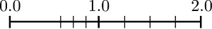
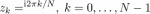
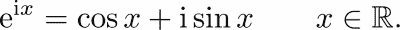

# 二、变量和基本类型

在本章中，我们将介绍 Python 中最重要和最基本的类型。什么是类型？它是由数据内容、其表示和所有可能的操作组成的集合。在本书的后面，当我们在[第 8 章](08.html "Chapter 8. Classes")、*类*中介绍一个类的概念时，我们将使这个定义更加精确。

# 变量

变量是对 Python 对象的引用。它们由分配创建，例如:

```py
a = 1 
diameter = 3.
height = 5.
cylinder = [diameter, height] # reference to a list
```

变量的名称由大写字母和小写字母的任意组合、下划线`_` 和数字组成。变量名不能以数字开头。请注意，变量名区分大小写。变量的良好命名是记录工作的重要部分，因此我们建议您使用描述性变量名。

Python 有一些*保留关键字*，不能作为变量名(参考下表，*表 2.1* )。试图使用这样的关键字作为变量名会引发语法错误。


表 2.1:保留的 Python 关键字。

与其他编程语言相反，变量不需要类型声明。您可以使用多重赋值语句创建几个变量:

```py
a = b = c = 1   # a, b and c get the same value 1
```

变量也可以在定义后更改:

```py
a = 1 
a = a + 1 # a gets the value 2 
a = 3 * a   # a gets the value 6
```

最后两个语句可以通过使用增量运算符将这两个操作与赋值直接结合起来来编写:

```py
a += 1  # same as a = a + 1 
a *= 3  # same as a = 3 * a
```

# 数字类型

在某些时候，您将不得不处理数字，所以我们从考虑 Python 中不同形式的数字类型开始。在数学中，我们区分自然数(ℕ)、整数(ℤ)、有理数(ℚ)、实数(ℝ)和复数(ℂ).这些是无限组数字。这些集合之间的操作不同，甚至可能没有定义。例如，在ℤ通常将两个数字相除可能不会得到一个整数——它在ℤ.没有定义

在 Python 中，像许多其他计算机语言一样，我们有数字类型:

*   数字类型`int`，至少理论上是整个ℤ
*   数字类型`float`，它是ℝ和的有限子集
*   数字类型`complex`，它是ℂ的有限子集

有限集合有一个最小数和一个最大数，两个数之间有一个最小间距；更多细节请参考*浮点表示*部分。

## 整数

最简单的数字类型是整数类型。

### 普通整数

语句`k = 3`将变量`k`赋给一个整数。

将类型为`+`、`-`或`*`的运算应用于整数将返回一个整数。除法运算符`//`返回整数，`/`可能返回`float:`

```py
6 // 2  # 3
7 // 2  # 3
7 / 2   # 3.5
```

Python 中的整数集合是无界的；没有最大的整数。这里的限制是计算机的内存，而不是语言给出的任何固定值。

### 型式

如果示例中的除法运算符(`/`)返回 3，则您可能没有安装正确的 Python 版本。

## 浮点数

如果在 Python 中执行语句`a = 3.0`，则创建一个浮点数(Python 类型:`float`)。这些数字构成有理数的子集，ℚ.

或者，常数可以用指数表示法给出`a = 30.0e-1`或简单地给出`a = 30.e-1`。符号`e`将指数和尾数分开，表达式为数学符号*a = 30.0×10<sup>1</sup>*。*浮点数*这个名称是指这些数字的内部表示，反映了在大范围考虑数字时小数点的浮动位置。

将初等数学运算`+`、`-`、`*`和`/`应用于两个浮点数或一个整数和一个浮点数会返回一个浮点数。浮点数之间的运算很少返回有理数运算的精确结果:

```py
0.4 - 0.3 # returns 0.10000000000000003
```

当比较浮点数时，这些事实很重要:

```py
0.4 - 0.3 == 0.1 # returns False
```

### 浮点表示

在内部，浮点数由四个量表示:符号、尾数、指数符号和指数:


带 *β* ϵ *ℕ* 和*x<sub>0</sub>T7】0，0 ≤ *x <sub>i</sub> ≤ β**

*x* <sub>0</sub> ...x <sub>t-1</sub> 称为尾数， *β* 为基数， *e* 为指数 *|e| ≤ U* 。 *t* 称为尾数长度。条件 *x* <sub>0</sub> ≠ 0 使表示唯一，并在二进制情况下( *β* = 2)保存一位。

存在两个浮点零+0 和-0，两者都由尾数 0 表示。

在典型的英特尔处理器上， *β* = 2。为了在`float`类型中表示一个数字，使用了 64 位，即 2 位用于符号， *t* = 52 位用于尾数，10 位用于指数`|e|`。指数的上限 *U* 因此为 2<sup>10</sup>-1*=*102*3*。

有了这些数据，最小的正可表示数是

fl<sub>min</sub>= 1.0*×*2<sup>-1023</sup>≈10<sup>-308</sup>，最大 fl <sub>max</sub> = 1.111...1*×*2<sup>1023</sup>≈10<sup>308</sup>*。*

请注意，浮点数在[0，fl <sub>max</sub> 中的间距并不相等。尤其是在零点有一个间隙(参见[【29】](16.html "Appendix . References"))。0 与第一个正数之间的距离为 2 <sup>-1023</sup> ，而第一个与第二个之间的距离小一个因子*2*<sup>-52</sup>*≈2.2**×*10<sup>-16</sup>。此效果由归一化*x*<sub>0</sub>*≠0*引起，在*图 2.1* 中可视化。

这个间隙用次正规浮点数等距填充，这样的结果被四舍五入。次正规浮点数具有最小的可能指数，并且不遵循前导数字 *x <sub>0</sub>* 必须不同于零的惯例；参见[【13】](16.html "Appendix . References")。

### 无限而不是一个数

总共有个浮点数。有时数字算法会计算这个范围之外的浮点数。

这会产生数字上溢或下溢。在 SciPy 中，特殊的浮点数`inf`被分配给溢出结果:

```py
exp(1000.) # inf 
a = inf
3 - a   # -inf
3 + a   # inf
```

使用`inf`可能会导致数学上未定义的结果。这在 Python 中通过给结果分配另一个特殊的浮点数`nan`来表示。这代表非数字，即数学运算的未定义结果:

```py
a + a # inf
a - a # nan 
a / a # nan
```

对于`nan`和`inf`的操作有特殊规定。例如，`nan`相比任何东西(甚至是它自己)总是返回`False`:

```py
x = nan 
x < 0 # False
x > 0 # False
x == x # False
```

参见*练习 4* 了解`nan`永远不等于它自己这一事实的一些令人惊讶的后果。

浮子`inf`的表现比预期的要好得多:

```py
0 < inf     # True 
inf <= inf  # True 
inf == inf  # True 
-inf < inf  # True 
inf - inf   # nan 
exp(-inf)   # 0 
exp(1 / inf)  # 1
```

检查`nan`和`inf`的一种方法是使用`isnan`和`isinf`功能。通常，当一个变量得到值`nan`或`inf`时，人们希望直接做出反应。这可以通过使用 NumPy 命令`seterr`来实现。以下命令

```py
seterr(all = 'raise')
```

如果计算返回其中一个值，将会引发错误。

### 底流-机器ε

当一个操作导致一个有理数落入零处的间隙时，就会发生下溢；参见*图 2.1* 。



图 2.1:零点的浮点间隙，这里 t = 3，U = 1

*机器ε*或舍入单位是最大的数字 *ε* ，这样浮动 *(* 1.0 *+ ε) =* 1.0。

注意*ε*∑*β*<sup>1-t</sup>/2 = 1.1102×10<sup>-16</sup>在今天的大部分电脑上。使用以下命令可以访问在运行代码的实际计算机上有效的值:

```py
import sys 
sys.float_info.epsilon # 2.220446049250313e-16 (something like that)
```

变量`sys.float_info`包含更多关于机器上浮点类型内部表示的信息。

函数`float`将其他类型转换成浮点数——如果可能的话。当将适当的字符串转换为数字时，此函数特别有用:

```py
a = float('1.356')
```

### NumPy 中的其他浮点类型

NumPy 还提供其他浮点类型，从其他编程语言中称为双精度和单精度数字，即`float64`和`float32`:

```py
a = pi            # returns 3.141592653589793 
a1 = float64(a)   # returns 3.1415926535897931 
a2 = float32(a)   # returns 3.1415927 
a - a1            # returns 0.0 
a - a2            # returns -8.7422780126189537e-08
```

第二个最后一行证明`a`和`a1`在精度上没有区别。在前两行中，它们仅在显示方式上有所不同。精度上的真正差异是在`a`和它的单精度对应物`a2`之间。

NumPy 函数`finfo`可用于显示这些浮点类型的信息:

```py
f32 = finfo(float32) 
f32.precision   # 6 (decimal digits) 
f64 = finfo(float64) 
f64.precision   # 15 (decimal digits) 
f = finfo(float) 
f.precision     # 15 (decimal digits) 
f64.max         # 1.7976931348623157e+308 (largest number) 
f32.max         # 3.4028235e+38 (largest number) 
help(finfo)     # Check for more options
```

## 复数

复数是在许多科学和工程领域中经常使用的实数的扩展。

### 数学中的复数

复数由两个浮点数组成，实数部分 *a* 和虚数部分 *b* 。在数学中，复数写成 *z=a+b* i，其中 I 由 i *<sup>2</sup> =* 定义-1 是虚单位。 *z* 的共轭复数对应物是。

如果实部 *a* 为零，则该数称为虚数。

### j 符号

在 Python 中，虚数的特征是在浮点数后面加上字母`j`，例如`z = 5.2j`。一个复数是由一个浮点数和一个虚数之和构成的，例如`z = 3.5 + 5.2j`。

而在数学中，虚数部分表示为实数 *b* 与虚数单位 I 的乘积，Python 表示虚数的方式不是乘积:`j`只是一个后缀，表示该数是虚数。

下面的小实验证明了这一点:

```py
b = 5.2 
z = bj   # returns a NameError 
z = b*j  # returns a NameError
z = b*1j # is correct
```

方法`conjugate`返回`z`的共轭:

```py
z = 3.2 + 5.2j 
z.conjugate() # returns (3.2-5.2j)
```

### 实部和虚部

可以使用`real`和`imag`属性访问复数的实数和虚数部分 *z* 。这些属性是只读的:

```py
z = 1j 
z.real       # 0.0 
z.imag       # 1.0 
z.imag = 2   # AttributeError: readonly attribute
```

无法将复数转换为实数:

```py
z = 1 + 0j 
z == 1     # True 
float(z)   # TypeError
```

有趣的是，`real`和`imag`属性以及共轭方法对于复杂数组 *( [第 4 章](04.html "Chapter 4. Linear Algebra – Arrays")* 、*线性代数–数组)*同样有效。我们通过计算的 *N* <sup>次</sup>个单位根来证明这一点，即方程的 *N* 个解:

```py
N = 10
# the following vector contains the Nth roots of unity: 
unity_roots = array([exp(1j*2*pi*k/N) for k in range(N)])
# access all the real or imaginary parts with real or imag:
axes(aspect='equal')
plot(unity_roots.real, unity_roots.imag, 'o')
allclose(unity_roots**N, 1) # True
```

结果图(*图 2.2* )显示了单位圆的根。(关于如何制作剧情的更多细节，请参考[第六章](06.html "Chapter 6. Plotting")、*剧情。*)


图 2.2:单位圆的单位根

当然可以混合使用前面的方法，如以下示例所示:

```py
z = 3.2+5.2j 
(z + z.conjugate()) / 2\.   # returns (3.2+0j) 
((z + z.conjugate()) / 2.).real   # returns 3.2 
(z - z.conjugate()) / 2\.   # returns 5.2j 
((z - z.conjugate()) / 2.).imag   # returns 5.2 
sqrt(z * z.conjugate())   # returns (6.1057350089894991+0j)
```

# 布尔人

布尔是以*乔治·布尔* (1815-1864)命名的数据类型。一个布尔变量只能取两个值，`True`或`False`。这种类型主要用于逻辑表达式。以下是一些例子:

```py
a = True 
b = 30 > 45   # b gets the value False
```

布尔表达式经常与`if`语句结合使用:

```py
if x > 0:
   print("positive")
else:
   print("nonpositive)
```

## 布尔运算符

使用 Python 中的`and`、`or`和`not`关键字执行布尔运算:

```py
True and False # False
False or True # True
(30 > 45) or (27 < 30) # True
not True # False
not (3 > 4) # True
```

操作符遵循一些优先规则(参见[第 1 章](01.html "Chapter 1. Getting Started")、*入门*中的*执行脚本*一节)，这将使第三行和最后一行中的括号过时(无论如何使用它们来增加代码的可读性是一个很好的做法)。请注意，`and`运算符隐式链接在以下布尔表达式中:

```py
a < b < c     # same as: a < b and b < c 
a == b == c   # same as: a == b and b == c
```

转换为布尔值的规则:


表 2.2:转换为布尔值的规则

## 布尔铸造

大多数 Python 对象可能会转换为布尔值；这叫*布尔铸造*。内置函数`bool`执行该转换。请注意，除了`0`、空元组、空列表、空字符串或空数组之外，大多数对象都被强制转换为`True`。这些都是投给`False`的。

除非数组不包含或只包含一个元素，否则不可能将数组转换为布尔值。这将在[第 5 章](05.html "Chapter 5. Advanced Array Concepts")、*高级阵概念*中进一步解释。上表包含布尔转换的总结规则。一些用法示例:

```py
bool([])   # False 
bool(0)   # False 
bool(' ')   # True 
bool('')   # False 
bool('hello')   # True 
bool(1.2)   # True 
bool(array([1]))   # True 
bool(array([1,2]))   # Exception raised!
```

## 自动布尔铸造

使用非布尔类型的`if`语句会将其转换为布尔类型。换句话说，以下两种说法总是等价的:

```py
if a:
   ...
if bool(a): # exactly the same as above
   ...
```

一个典型的例子是测试列表是否为空:

```py
# L is a list
if L:
    print("list not empty")
else:
    print("list is empty")
```

空数组、列表或元组将返回`False`。您也可以在`if`语句中使用变量，例如整数:

```py
# n is an integer
if n % 2:
    print("n is odd")
else:
    print("n is even")
```

注意，我们使用`%`进行模运算，它返回整数除法的余数。在这种情况下，它返回`0`或`1`作为模`2`后的余数。

在最后这个例子中，值`0`或`1`被转换为`bool`。布尔运算符`or`、`and`和`not`也将隐式地将它们的一些参数转换为布尔值。

## 和与或的返回值

请注意，运算符`and`和`or`不一定会产生布尔值。 `*x* and *y*` 这个表达相当于:

```py
def and_as_function(x,y):
    if not x:
        return x
    else:
        return y
```

而表达式`x or y`相当于:

```py
def or_as_function(x,y):
    if x:
        return x
    else:
        return y
```

有趣的是，这意味着在执行语句`True or x`时，甚至不需要定义变量`x`！`False and x`也是如此。

请注意，与数学逻辑中的对应运算符不同，这些运算符在 Python 中不再是可交换的。事实上，以下表达式并不等价:

```py
[1] or 'a' # produces [1] 
'a' or [1] # produces 'a'
```

## 布尔和整数

事实上，布尔值和整数是一样的。唯一的区别是 0 和 1 的字符串表示，布尔人`False`和`True`的情况分别如此。这允许这样的构造(格式方法参见*字符串格式*一节):

```py
def print_ispositive(x):
    possibilities = ['nonpositive', 'positive']
    return "x is {}".format(possibilities[x>0])
```

对于已经熟悉子类概念的读者，我们注意到类型`bool`是类型`int`的子类(参考[第 8 章](08.html "Chapter 8. Classes")、*类*)。事实上，所有四个查询`isinstance(True, bool)`、`isinstance(False, bool)`、`isinstance(True, int)`和`isinstance(False, int)`都返回值`True`(参考[第 3 章](03.html "Chapter 3. Container Types")、*集装箱类型*中的*类型检查*部分)。

甚至像`True+13`这样很少使用的语句在句法上也是正确的。

# 字符串

类型`string`是用于文本的类型:

```py
name = 'Johan Carlsson'
child = "Åsa is Johan Carlsson's daughter"
book = """Aunt Julia 
       and the Scriptwriter"""
```

字符串用单引号或双引号括起来。如果一个字符串包含几行，必须用三个双引号`"""`或三个单引号`'''`括起来。

字符串可以用简单的索引或切片进行索引(关于切片的全面说明，请参考[第 3 章](03.html "Chapter 3. Container Types")、*容器类型*):

```py
book[-1] # returns 'r' 
book[-12:] # returns 'Scriptwriter'
```

字符串是不可变的；也就是说，项目不能被更改。他们与元组共享这个属性。 **`book[1] = 'a'`** 命令返回:

```py
TypeError: 'str' object does not support item assignment
```

字符串`'\n'`用于插入一个换行符，`'t'`在字符串中插入一个水平制表器(TAB)来对齐几行:

```py
print('Temperature:\t20\tC\nPressure:\t5\tPa')
```

这些字符串是*转义序列*的例子。转义序列总是以反斜杠`\`开头。多行字符串自动包含转义序列:

```py
a=""" 
A multiline 
example""" 
a #  returns '\nA multiline \nexample'
```

一个特殊的转义序列是`""`，表示文本中的反斜杠符号:

```py
latexfontsize="\\tiny"
```

通过使用原始字符串可以实现同样的效果:

```py
latexfs=r"\tiny"   # returns "\tiny"
latexfontsize == latexfs  # returns True
```

请注意，在原始字符串中，反斜杠保留在字符串中，用于转义一些特殊字符:

```py
r"\"\"   # returns  '\\"'
r"\\"   # returns  '\\\\'
r"\"    # returns an error
```

## 对字符串和字符串方法的操作

字符串的添加意味着串联:

```py
last_name = 'Carlsson'
first_name = 'Johanna'
full_name = first_name + ' ' + last_name
                              # returns 'Johanna Carlsson'
```

乘法只是重复加法:

```py
game = 2 * 'Yo' # returns 'YoYo'
```

当比较字符串时，将应用字典顺序，并且大写形式在小写形式之前的相同字母:

```py
'Anna' > 'Arvi' # returns false 
'ANNA' < 'anna'  # returns true 
'10B' < '11A'    # returns true
```

在各种各样的字符串方法中，我们这里只提到最重要的:

*   **拆分字符串**:该方法通过使用一个或多个空格作为分隔符，从字符串中生成一个列表。或者，可以通过指定特定字符串作为分隔符来给出参数:

    ```py
          text = 'quod erat    demonstrandum'
          text.split() # returns ['quod', 'erat', 'demonstrandum']
          table = 'Johan;Carlsson;19890327'
          table.split(';') # returns ['Johan','Carlsson','19890327']
          king = 'CarlXVIGustaf'
          king.split('XVI')  # returns ['Carl','Gustaf']

    ```

*   **将列表加入字符串**:这是拆分的反向操作:

    ```py
          sep = ';'
          sep.join(['Johan','Carlsson','19890327']) 
          # returns 'Johan;Carlsson;19890327'

    ```

*   **Searching in a string**: This method returns the first index in the string, where a given search substring starts:

    ```py
          birthday = '20101210'
          birthday.find('10') # returns 2 
    ```

    如果没有找到搜索字符串，则该方法的返回值为-1。

### 字符串格式

字符串格式化使用`format`方法完成:

```py
course_code = "NUMA21"
print("This course's name is {}".format(course_code)) 
# This course's name is NUMA21
```

函数`format`是一个字符串方法；它扫描字符串以查找占位符，占位符用花括号括起来。这些占位符以 format 方法的参数指定的方式被替换。如何替换取决于每个`{}`对中定义的格式规范。格式规范以冒号(`":"`)作为前缀。

format 方法提供了一系列可能性来根据对象的类型自定义对象的格式。科学计算中特别有用的是`float`类型的格式说明符。可以选择带有`{:f}`的标准或带有`{:e}`的指数符号:

```py
quantity = 33.45
print("{:f}".format(quantity)) # 33.450000
print("{:1.1f}".format(quantity)) # 33.5
print("{:.2e}".format(quantity)) # 3.35e+01
```

格式说明符允许指定舍入精度(表示形式中小数点后的数字)。还可以设置包括前导空格在内的符号总数来表示数字。

在本例中，插入其值的对象的名称作为 format 方法的参数给出。第一对`{}`由第一个参数代替，后面的对由后面的参数代替。或者，使用键值语法可能也很方便:

```py
print("{name} {value:.1f}".format(name="quantity",value=quantity))
# prints "quantity 33.5"
```

这里，处理两个值，一个没有格式说明符的字符串`name`和一个以小数点后一位数字的定点记数法打印的浮点数`value`。(有关*字符串格式*、[【34】](16.html "Appendix . References")的更多详细信息，请参考完整的参考文档)。

### 型式

**绳子上的大括号**

有时，一个字符串可能包含一对大括号，这不应该被认为是`format`方法的占位符。在这种情况下，使用双括号:

`r"we {} in LaTeX \begin{{equation}}".format('like')`

这将返回以下字符串:`'we like in LaTeX \\begin{equation}'`。

# 总结

在本章中，您遇到了 Python 中的基本数据类型，并看到了相应的语法元素。我们将主要处理数字类型，如整数、浮点数和复数。

布尔函数是设置条件所必需的，通过使用字符串，我们经常会传递结果和消息。

# 练习

**Ex。1** →检查 *x =* 2.3 是否为零的功能:


**Ex。2 →** 根据德·莫伊弗公式，以下成立:


选择数字 *n* 和 *x* ，用 Python 验证该公式。

**Ex。3 →** 复数。用同样的方法验证欧拉公式:



**Ex。4 →** 假设我们试图检查一个发散序列的收敛性(此处序列由递归关系*u<sub>n</sub>T5<sub xmlns:epub="http://www.idpf.org/2007/ops" xmlns:m="http://www.w3.org/1998/Math/MathML" xmlns:pls="http://www.w3.org/2005/01/pronunciation-lexicon" xmlns:ssml="http://www.w3.org/2001/10/synthesis">+1</sub>= 2*u<sub>n</sub>T11】和 u <sub xmlns:epub="http://www.idpf.org/2007/ops" xmlns:m="http://www.w3.org/1998/Math/MathML" xmlns:pls="http://www.w3.org/2005/01/pronunciation-lexicon" xmlns:ssml="http://www.w3.org/2001/10/synthesis">0</sub> = 1.0 定义):**

```py
u = 1.0 # you have to use a float here!
uold = 10\. 
for iteration in range(2000):
    if not abs(u-uold) > 1.e-8:
         print('Convergence')
         break # sequence has converged
    uold = u
    u = 2*u
else:
    print('No convergence')
```

1.  由于序列不收敛，代码应打印`No convergence`信息。执行它，看看会发生什么。
2.  What happens if you replace the line:

    ```py
          if not abs(u-uold) > 1.e-8
    ```

    与:

    ```py
          if abs(u-uold) < 1.e-8
    ```

    它应该给出完全相同的结果，不是吗？再次运行代码，看看会发生什么。

3.  如果把 *u=1.0* 换成 *u=1* (没有小数点)会怎么样。运行代码来检查您的预测。
4.  解释这段代码的意外行为。理解发生了什么的关键是`inf`的求值结果为`nan`，而`nan`与其他任何东西的比较结果是始终返回值 `False`。

**Ex。5 →** 一个含义*C =(A B)*是一个布尔表达式，定义为

*   *C* 是`True`如果 *A* 是`False`或者 *A* 和 *B* 都是`True`
*   *C* is `False` otherwise

    写一个 Python 函数`implication(A, B)`。

**Ex。6 →** 本练习是训练布尔运算。两个二进制数字(位)通过一种叫做**半加法器**的逻辑装置相加。它产生一个进位位(下一个较高值的数字)和下表定义的和，以及半加法器电路。

<colgroup><col> <col> <col> <col></colgroup> 
| **p** | **q** | **总和** | **携带** |
| one | one | Zero | one |
| one | Zero | one | Zero |
| Zero | one | one | Zero |
| Zero | Zero | Zero | Zero |

半加法器操作的定义


图 2.3:半加法器电路

全加器由两个半加法器组成，对输入端的两位和一个附加进位进行求和(参见下图):


图 2.4:全加器电路

写一个实现半加法器的函数和另一个实现全加器的函数。测试这些功能。