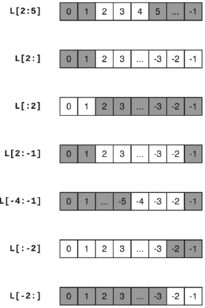
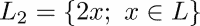
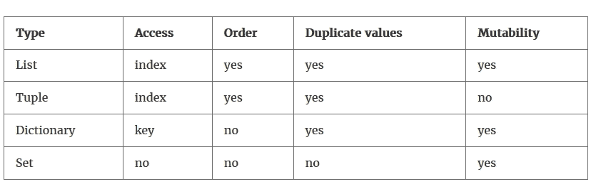
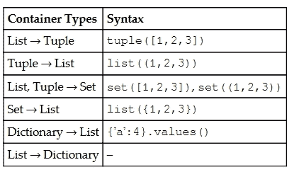
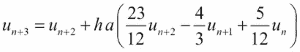

# 三、容器类型

容器类型用于将对象分组在一起。不同容器类型之间的主要区别在于访问单个元素的方式以及操作的定义方式。

# 列表

顾名思义，列表是任何类型的对象的列表:

```py
L = ['a' 20.0, 5]
M = [3,['a', -3.0, 5]]
```

通过为每个元素分配一个索引来枚举各个对象。列表中的第一个元素获取索引 0。这种从零开始的索引常用于数学符号。考虑多项式系数的通常索引。

该索引允许我们访问以下对象:

```py
L[1] # returns 20.0
L[0] # returns 'a'
M[1] # returns ['a',-3.0,5]
M[1][2] # returns 5
```

这里的括号符号对应于数学公式中下标的使用。`L`是一个简单的列表，而`M`本身包含一个列表，因此需要两个索引来访问内部列表的一个元素。

通过`range`命令可以很容易地生成包含后续整数的列表:

```py
L=list(range(4)) # generates a list with four elements: [0, 1, 2 ,3]
```

更一般的用法是为该命令提供启动、停止和步进参数:

```py
L=list(range(17,29,4)) # generates [17, 21, 25]
```

命令`len`返回列表的长度:

```py
len(L) # returns 3
```

## 切片

在`i`和`j`之间分割一个列表会创建一个包含从`index i`开始到`j`之前结束的元素的新列表。

对于切片，必须给出一个索引范围。`L[i:j]`是指从`L[i]`开始到`L[j-1]`的所有元素创建一个列表。换句话说，新列表是通过从`L`中移除第一个`i`元素并获取下一个`j-i`元素(对于 *j* > *i* ≥ 0)而获得的。更多示例见下图(*图 3.1* ):



图 3.1:一些典型的切片情况

这里，`L[i:]`表示去掉第一个 *i* 元素，`L[:i]`表示只取第一个 *i* 元素，同样，`L[:-i]`表示去掉最后一个 *i* 元素，`L[-i:]`表示只取最后一个 *i* 元素。这可以在`L[i:-j]`中合并，删除第一个 *i* 和最后一个 *j* 元素:

```py
L = ['C', 'l', 'o', 'u', 'd', 's']
L[1:5] # remove one element and take four from there:
# returns ['l', 'o', 'u', 'd']
```

可以省略切片的第一个或最后一个界限:

```py
L = ['C', 'l', 'o', 'u','d', 's']
L[1:] # ['l', 'o', 'u', 'd','s']
L[:5] # ['C', 'l', 'o','u','d']
L[:] # the entire list
```

Python 允许使用负索引从右边开始计数。特别是元素`L[-1]`是列表`L`中的最后一个元素。

一些列表索引描述:

*   `L[i:]`相当于除了第一个 *i* 之外的所有元素
*   `L[:i]`等于取第一 *i* 元素
*   `L[-i:]`等于取最后的 *i* 元素
*   `L[:-i]`相当于除了最后一个 *i* 之外的所有元素

这里有一个例子:

```py
L = ['C', 'l', 'o', 'u', 'd', 's']
L[-2:] # ['d', 's']
L[:-2] # ['C', 'l', 'o','u']
```

在这个范围内省略一个指数相当于ℝ.的半开区间半开区间(∞， *a* 表示，取所有严格低于 *a* 的数字；这类似于语法`L[:j]`。

### 注

**出界切片**

请注意，对于超出界限的切片，您永远不会得到索引错误。你可能会得到空的列表。

这里有一个例子:

```py
L = list(range(4)) # [0, 1, 2, 3]
L[4] # IndexError: list index out of range
L[1:100] # same as L[1:]
L[-100:-1] # same as L[:-1]
L[-100:100] # same as L[:]
L[5:0] # empty list []
L[-2:2] # empty list []
```

在索引中使用可能变成负数的变量时要小心，因为这会完全改变切片。这可能会导致意想不到的结果:

```py
a = [1,2,3]
 for iteration in range(4): 
     print(sum(a[0:iteration-1]))
```

结果是`3`、`0`、`1`、`3`，而人们期望的是`0`、`0`、`1`、`3`。

## 大步

在计算切片时，还可以指定步幅，即从一个索引到另一个索引的步长。默认步幅为 1。这里有一个例子:

```py
L = list(range(100))
L[:10:2] # [0, 2, 4, 6, 8]
L[::20] # [0, 20, 40, 60, 80]
L[10:20:3] # [10, 13, 16, 19]
```

请注意，步幅也可能是负的:

```py
L[20:10:-3] # [20, 17, 14, 11]
```

也可以使用负步幅创建一个反向的新列表(在*就地操作*部分找到关于反向的方法):

```py
L = [1, 2, 3]
R = L[::-1] # L is not modified
R # [3, 2, 1]
```

## 更改列表

对列表的典型操作是插入和删除元素以及列表连接。有了切片符号，列表的插入和删除变得显而易见；删除只是将列表的一部分替换为一个空列表`[]`:

```py
L = ['a', 1, 2, 3, 4]
L[2:3] = [] # ['a', 1, 3, 4]
L[3:] = [] # ['a', 1, 3]
```

插入意味着用要插入的列表替换空切片:

```py
L[1:1] = [1000, 2000] # ['a', 1000, 2000, 1, 3]
```

两个列表通过加号运算符`+`连接在一起:

```py
L = [1, -17]
M = [-23.5, 18.3, 5.0]
L + M # gives [1, -17, 23.5, 18.3, 5.0]
```

将一个列表`n`与其自身连接起来会激发乘法运算符`*`的使用:

```py
n = 3
n * [1.,17,3] # gives [1., 17, 3, 1., 17, 3, 1., 17, 3]
[0] * 5 # gives [0,0,0,0,0]
```

列表上没有算术运算，如元素求和或除法。对于这样的操作，我们使用数组(参见*数组*一节)。

## 属于一个列表

可以使用关键字`in`和`not in`来确定一个元素是否属于列表，这类似于数学中的和:

```py
L = ['a', 1, 'b', 2]
'a' in L # True
3 in L # False
4 not in L # True
```

## 列出方法

一些有用的`list`类型的方法收集在下面的 T *表 3.1* 中:

<colgroup><col> <col></colgroup> 
| **命令** | **动作** |
| `list.append(x)` | 在列表末尾添加`x`。 |
| `list.expand(L)` | 通过列表`L`的元素展开列表。 |
| `list.insert(i,x)` | 在`i`位置插入`x`。 |
| `list.remove(x)` | 从列表中删除值为`x`的第一项。 |
| `list.count(x)` | `x`在列表中出现的次数。 |
| `list.sort()` | 对列表中的项目进行适当的排序。 |
| `list.reverse()` | 将列表中的元素颠倒过来。 |
| `list.pop()` | 就地删除列表的最后一个元素。 |

表 3.1:数据类型列表的方法

列表方法有两种作用方式:

*   他们可以直接修改列表，也就是就地操作。
*   他们产生了一个新的物体。

## 就地操作

产生列表的所有方法都是原位操作方法，例如`reverse`:

```py
L = [1, 2, 3]
L.reverse() # the list
L is now reversed
L # [3, 2, 1]
```

注意就地操作。人们可能会想写道:

```py
L=[3, 4, 4, 5]
newL = L.sort()
```

这是正确的 Python。但这可能会导致值为“T2”的变量“T1”中的“T0”发生意外变化。原因是`sort`运行到位。

在这里，我们演示就地操作方法:

```py
L = [0, 1, 2, 3, 4]
L.append(5) # [0, 1, 2, 3, 4, 5]
L.reverse() # [5, 4, 3, 2, 1, 0]
L.sort() # [0, 1, 2, 3, 4, 5]
L.remove(0) # [1, 2, 3, 4, 5]
L.pop() # [1, 2, 3, 4]
L.pop() # [1, 2, 3]
L.extend(['a','b','c']) # [1, 2, 3, 'a', 'b', 'c']
```

`L`被改动。`count`方法是生成新对象的方法示例:

```py
L.count(2) # returns 1
```

## 合并列表–压缩

列表的一个特别有用的功能是`zip`。它可以通过配对原始列表的元素来将两个给定列表合并成一个新列表。结果是元组列表(有关更多信息，请参考章节*元组*:

```py
ind = [0,1,2,3,4]
color = ["red", "green", "blue", "alpha"]
list(zip(color,ind)) # gives [('red', 0), ('green', 1), 
                                          ('blue', 2), ('alpha', 3)]
```

此示例还演示了如果列表长度不同会发生什么。压缩列表的长度是两个输入列表中较短的一个。`zip`创建一个特殊的可迭代对象，该对象可以通过应用`list`函数变成一个列表，就像前面的例子一样。有关可迭代对象的更多详细信息，请参考第 9 章、*迭代*中的*迭代器*一节。

## 列表理解

建立列表的一个方便的方法是使用列表理解结构，里面可能有一个条件。列表理解的语法是:

```py
[<expr> for <variable> in <list>]
```

或者更一般地说:

```py
[<expr> for <variable> in <list> if <condition>]
```

这里有一个例子:

```py
L = [2, 3, 10, 1, 5]
L2 = [x*2 for x in L] # [4, 6, 20, 2, 10]
L3 = [x*2 for x in L if 4 < x <= 10] # [20, 10]
```

列表理解中可能有几个`for`循环:

```py
M = [[1,2,3],[4,5,6]]
flat = [M[i][j] for i in range(2) for j in range(3)] 
# returns [1, 2, 3, 4, 5, 6]
```

这在处理数组时特别有意义。

### 型式

**设置符号**

列表理解与集合的数学符号密切相关。比较:和`L2 = [2*x for x in L]`。

一个很大的区别是列表是有序的，而集合不是有序的(更多信息请参考*集合*一节)。

# 数组

NumPy 包提供数组，数组是用于操作向量、矩阵甚至数学中的高阶张量的容器结构。在本节中，我们指出了数组和列表之间的相似之处。但是数组值得更广泛的介绍，将在[第 4 章](04.html "Chapter 4. Linear Algebra – Arrays")、*线性代数-数组*和[第 5 章](05.html "Chapter 5. Advanced Array Concepts")、*高级数组概念*中给出。

数组通过函数`array`从列表中构建:

```py
v = array([1.,2.,3.])
A = array([[1.,2.,3.],[4.,5.,6.]])
```

要访问向量的一个元素，我们需要一个索引，而矩阵的一个元素由两个索引寻址:

```py
v[2]     # returns 3.0
A[1,2]   # returns 6.0
```

乍一看，数组类似于列表，但请注意它们在根本上是不同的，这可以通过以下几点来解释:

*   使用方括号和切片对数组数据的访问对应于对列表的访问。它们也可以用来改变数组:

    ```py
            M = array([[1.,2.],[3.,4.]])
            v = array([1., 2., 3.])
            v[0] # 1
            v[:2] # array([1.,2.])
            M[0,1] # 2
            v[:2] = [10, 20] # v is now array([10., 20., 3.])
    ```

*   向量中元素的数量，或者矩阵的行数，是通过函数`len` :

    ```py
            len(v) # 3
    ```

    得到的
*   数组只存储相同数字类型的元素(通常是`float`或`complex`，但也有`int`)。有关更多信息，请参考第 4 章、*线性代数–数组*中的*数组属性*一节。
*   操作`+`、`*`、`/`和`-`都是元素级的。`dot`函数以及在 Python 版本≥ 3.5 中，中缀运算符`@`用于标量积和相应的矩阵运算。
*   与列表不同，数组没有`append`方法。然而，通过堆叠更小尺寸的数组来构造数组有特殊的方法(更多信息，请参考[第 4 章](04.html "Chapter 4. Linear Algebra – Arrays")、*线性代数-数组*中的*堆叠*一节)。).一个相关的观点是数组不像列表那样有弹性；人们不能用切片来改变它们的长度。
*   矢量切片是视图；也就是说，它们可以用来修改原始数组。更多信息请参考[第五章](05.html "Chapter 5. Advanced Array Concepts")、*高级数组概念*中的*数组视图和副本*部分。

# 元组

元组是不可变的列表。不可变意味着不能修改。元组只是一个逗号分隔的对象序列(没有括号的列表)。为了增加可读性，人们通常在一对括号中包含一个元组:

```py
my_tuple = 1, 2, 3     # our first tuple
my_tuple = (1, 2, 3)   # the same
my_tuple = 1, 2, 3,    # again the same
len(my_tuple) # 3, same as for lists
my_tuple[0] = 'a'   # error! tuples are immutable
```

逗号表示对象是一个元组:

```py
singleton = 1,   # note the comma
len(singleton)   # 1
```

当一组值放在一起时，元组是有用的；例如，它们用于从函数中返回多个值(参见[第 7 章](07.html "Chapter 7. Functions")、*函数*中的*返回值*一节)。通过解包一个列表或元组，可以一次分配几个变量:

```py
a, b = 0, 1 # a gets 0 and b gets 1
a, b = [0, 1] # exactly the same effect
(a, b) = 0, 1 # same
[a,b] = [0,1] # same thing
```

### 型式

**交换技巧**

使用打包和解包来交换两个变量的内容:`a, b = b, a`

总结一下:

*   元组只不过是不可变的列表，带有不带括号的符号。
*   在大多数情况下，可以使用列表代替元组。
*   不带括号的符号很方便，但很危险。当您不确定时，应该使用括号:

```py
      a, b = b, a # the swap trick; equivalent to:
      (a, b) = (b, a)
      # but
      1, 2 == 3, 4 # returns (1, False, 4) 
      (1, 2) == (3, 4) # returns False
```

# 词典

列表、元组和数组是有序的对象集。根据单个对象在列表中的位置来插入、访问和处理它们。另一方面，字典是无序的成对集合。人们通过键来访问字典数据。

## 创建和修改词典

例如，我们可以创建一个包含力学中刚体数据的字典，如下所示:

```py
truck_wheel = {'name':'wheel','mass':5.7,
               'Ix':20.0,'Iy':1.,'Iz':17.,
               'center of mass':[0.,0.,0.]}
```

键/数据对由冒号“`:`”表示。这些对以逗号分隔，列在一对花括号`{}`中。

单个元素通过它们的键来访问:

```py
truck_wheel['name']   # returns 'wheel'
truck_wheel['mass']   # returns 5.7
```

通过创建新关键字，新对象被添加到字典中:

```py
truck_wheel['Ixy'] = 0.0
```

字典也用于为函数提供参数(更多信息，请参考[第 7 章](07.html "Chapter 7. Functions")、*函数*中的*参数和参数*部分)。字典中的键可以是字符串、函数、具有不可变元素的元组和类。键不能是列表或数组。命令`dict`从具有键/值对的列表中生成字典:

```py
truck_wheel = dict([('name','wheel'),('mass',5.7),('Ix',20.0), 
                    ('Iy',1.), ('Iz',17.), 
                    ('center of mass',[0.,0.,0.])])
```

在这种情况下`zip`功能可能会派上用场(参考*合并列表*部分)。

## 遍历字典

主要有三种方式来循环字典:

*   按键:

```py
        for key in truck_wheel.keys():
            print(key) # prints (in any order) 'Ix', 'Iy', 'name',...
```

或者等效地:

```py
        for key in truck_wheel:
            print(key) # prints (in any order) 'Ix', 'Iy', 'name',...
```

*   按值:

```py
        for value in truck_wheel.value():
            print(value) 
               # prints (in any order) 1.0, 20.0, 17.0, 'wheel', ...
```

*   按项目，即键/值对:

```py
        for item in truck_wheel.items():
            print(item) 
               # prints (in any order) ('Iy', 1.0), ('Ix, 20.0),...
```

文件访问专用字典对象请参考[第十二章](12.html "Chapter 12. Input and Output")、*输入输出*章节*货架*。

# 套

集合是与数学中的集合共享属性和运算的容器。数学集合是不同对象的集合。以下是一些数学集合表达式:


以及它们的 Python 对应物:

```py
A = {1,2,3,4}
B = {5}
C = A.union(B)   # returns set([1,2,3,4,5])
D = A.intersection(C)   # returns set([1,2,3,4])
E = C.difference(A)   # returns set([5])
5 in C   # returns True
```

集合只包含一个元素一次，对应于前面提到的定义:

```py
A = {1,2,3,3,3}
B = {1,2,3}
A == B # returns True
```

一个集合是无序的；也就是说，没有定义集合中元素的顺序:

```py
A = {1,2,3}
B = {1,3,2}
A == B # returns True
```

Python 中的集合可以包含所有类型的 hashable 对象，即数字对象、字符串和布尔值。

有`union`和`intersection`两种方法:

```py
A={1,2,3,4}
A.union({5})
A.intersection({2,4,6}) # returns set([2, 4])
```

另外，可以使用方法`issubset`和`issuperset`来比较集合:

```py
{2,4}.issubset({1,2,3,4,5}) # returns True
{1,2,3,4,5}.issuperset({2,4}) # returns True
```

### 型式

**空套**

空集合在 Python 中是由`empty_set=set([])`定义的，而不是由`{}`定义的，后者会定义一个空字典！

# 容器转换

我们在下面的*表 3.2* 中总结了到目前为止呈现的容器类型的最重要的属性。数组将在[第四章](04.html "Chapter 4. Linear Algebra – Arrays")、*线性代数-数组*中讨论。



表 3.2:容器类型

从上表中可以看出，访问容器元素是有区别的，集合和字典是没有顺序的。

由于各种容器类型的不同属性，我们经常将一种类型转换为另一种类型:



# 类型检查

查看变量类型的直接方法是使用`type`命令:

```py
label = 'local error'
type(label) # returns str
x = [1, 2] # list
type(x) # returns list
```

但是，如果您想测试某个变量是否是某个类型，您应该使用`isinstance`(而不是将类型与`type`进行比较):

```py
isinstance(x, list) # True
```

在阅读了[第 8 章](08.html "Chapter 8. Classes")、*类、*后，使用`isinstance`的原因变得显而易见，尤其是[第 8 章](08.html "Chapter 8. Classes")、*类*中*子类化和继承*一节中的子类化和继承的概念。简而言之，通常不同的类型与一些基本类型共享一些共同的属性。经典的例子是类型`bool`，它是从更一般的类型`int`子类化而来的。在这种情况下，我们看到命令`isinstance`如何以更通用的方式使用:

```py
test = True
isinstance(test, bool) # True
isinstance(test, int) # True
type(test) == int # False
type(test) == bool # True
```

因此，为了确保变量`test`和整数一样好(具体类型可能无关)，您应该检查它是否是`integer`的实例:

```py
if isinstance(test, int):
    print("The variable is an integer")
```

### 注

**类型检查**

Python 不是类型化语言。这意味着对象是由它们能做什么而不是它们是什么来识别的。例如，如果您有一个通过使用`len`方法作用于对象的字符串操作函数，那么您的函数可能对实现该方法的任何对象都有用。

到目前为止，我们已经遇到了不同的类型:`float`、`int`、`bool`、`complex`、`list`、`tuple`、`module`、`function`、`str`、`dict`和`array`。

# 总结

在本章中，您学习了如何处理容器类型，主要是列表。了解如何填充这些容器以及如何访问它们的内容非常重要。我们看到，可以通过位置或关键字进行访问。

我们将在下一章的数组中再次遇到切片的重要概念。这些是专门为数学运算设计的容器。

# 练习

**Ex。1** →执行以下语句:

```py
    L = [1, 2]
    L3 = 3*L
```

1.  `L3`的内容是什么？
2.  尝试预测以下命令的结果:

    ```py
          L3[0]
          L3[-1]
          L3[10]
    ```

3.  下面的命令是做什么的？

    ```py
           L4 = [k**2 for k in L3]
    ```

4.  将`L3`和`L4`连接到新列表`L5`。

**Ex。2** →使用`range`命令和列表理解生成一个列表，其中 100 个等距值在 0 和 1 之间。

**Ex。3** →假设以下信号存储在列表中:

```py
    L = [0,1,2,1,0,-1,-2,-1,0]
```

结果是什么:

```py
L[0]
L[-1]
L[:-1]
L + L[1:-1] + L
L[2:2] = [-3]
L[3:4] = []
L[2:5] = [-5]
```

只通过检查来做这个练习，也就是说，不使用您的 Python Shell。

**Ex。4** →考虑 Python 语句:

```py
L = [n-m/2 for n in range(m)]
ans = 1 + L[0] + L[-1]
```

并且假设变量`m`先前已经被分配了整数值。`ans`有什么价值？回答这个问题，不要执行 Python 中的语句。

**Ex。5** →考虑递归公式:



随着 *n* = 0，...，1000， *h* = 1/1000， *a* = -0.5。

1.  创建列表`u`。存储在其前三个元素*e<sup>0</sup>**e<sup>ha</sup>T8】和*e<sup>2ha</sup>T12】中。这些代表给定公式中的起始值 *u* <sub xmlns:epub="http://www.idpf.org/2007/ops" xmlns:m="http://www.w3.org/1998/Math/MathML" xmlns:pls="http://www.w3.org/2005/01/pronunciation-lexicon" xmlns:ssml="http://www.w3.org/2001/10/synthesis">0</sub> 、 *u* <sub xmlns:epub="http://www.idpf.org/2007/ops" xmlns:m="http://www.w3.org/1998/Math/MathML" xmlns:pls="http://www.w3.org/2005/01/pronunciation-lexicon" xmlns:ssml="http://www.w3.org/2001/10/synthesis">1</sub> 和 *u* <sub xmlns:epub="http://www.idpf.org/2007/ops" xmlns:m="http://www.w3.org/1998/Math/MathML" xmlns:pls="http://www.w3.org/2005/01/pronunciation-lexicon" xmlns:ssml="http://www.w3.org/2001/10/synthesis">2</sub> 。根据递归公式建立完整的列表。**
2.  构建第二个列表`td`，在其中存储数值 *nh* ，其中 *n* = 0，..., 1000.绘图`td`对`u`(更多信息请参考[第 6 章](06.html "Chapter 6. Plotting")、*绘图*中的*基本绘图*一节)。制作第二个标绘差的标绘，即 *|e <sup>在<sub>n</sub></sup>-u<sub>n</sub>|*，其中 *t <sub>n</sub>* 代表向量`td`内的值。设置轴标签和标题。

递归是求解微分方程*u’= au*的多步公式，初始值为 *u(0) = u <sub>0</sub> = 1* 。 *u <sub>n</sub>* 近似于*u(NH)= e<sup>Anh</sup>u*<sub>0</sub>。

**Ex。6** →设置 *A* 和 *B* 。集合(A \ B)∞(B \ A)称为两个集合的对称差。编写一个执行此操作的函数。将您的结果与命令的结果进行比较:

```py
A.symmetric_difference(B).
```

**Ex。7** →在 Python 中验证空集合是任意集合的子集的说法。

**Ex。8** →学习器械包上的其他操作。您可以使用`IPython`的命令完成功能找到这些命令的完整列表。特别要学习`update`和`intersection_update`的方法。`intersection`和`intersection_update`有什么区别？