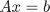
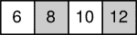
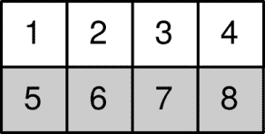
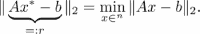

# 四、线性代数——数组

线性代数是计算数学的基本构件之一。线性代数的对象是向量和矩阵。NumPy 包包含了操作这些对象的所有必要工具。

第一个任务是建立矩阵和向量，或者通过切片来改变现有的矩阵和向量。另一个主要任务是`dot`运算，它体现了大部分线性代数运算(标量积、矩阵向量积、矩阵矩阵积)。最后，有各种方法可以用来解决线性问题。

# 数组类型概述

对于不耐烦的人来说，这里简单介绍一下如何使用数组。请注意，数组的行为起初可能令人惊讶，因此我们鼓励您在这一介绍部分之后继续阅读。

## 向量和矩阵

创建向量就像使用函数`array`将列表转换为数组一样简单:

```py
v = array([1.,2.,3.])
```

物体`v`现在是一个向量，它的行为很像线性代数中的向量。我们已经强调了与 Python 中列表对象的区别(参见[第 3 章](03.html "Chapter 3. Container Types")*容器类型*中的*数组*一节)。下面是一些关于向量的基本线性代数运算的例子:

```py
# two vectors with three components
v1 = array([1., 2., 3.])
v2 = array([2, 0, 1.])

# scalar multiplications/divisions
2*v1 # array([2., 4., 6.])
v1/2 # array([0.5, 1., 1.5])

# linear combinations
3*v1 # array([ 3., 6., 9.])
3*v1 + 2*v2 # array([ 7., 6., 11.])

# norm
from scipy.linalg import norm
norm(v1) # 3.7416573867739413
# scalar product
dot(v1, v2) # 5.
v1 @ v2 # 5 ; alternative formulation
```

请注意，所有基本算术运算都是按元素执行的:

```py
# elementwise operations:
v1 * v2 # array([2., 0., 3.])
v2 / v1 # array([2.,0.,.333333])
v1 - v2 # array([-1., 2., 2.])
v1 + v2 # array([ 3., 2., 4.])
```

一些函数在元素上也作用于数组:

```py
cos(v1) # cosine, elementwise: array([ 0.5403,
                                 -0.4161, -0.9899])
```

这个主题将在作用于数组的*函数一节中讨论。*

矩阵的创建方式类似于向量，但却是从列表中创建的:

```py
M = array([[1.,2],[0.,1]])
```

### 注

**向量是无列无行矩阵**

*n* 向量、 *n* × 1 和 1 × n 矩阵是三个不同的对象，即使它们包含相同的数据。

为了创建包含与向量`v = array([1., 2., 1.])`相同数据的行矩阵，我们这样做:

```py
R = array([[1.,2.,1.]]) # notice the double brackets: 
                        # this is a matrix
shape(R)                # (1,3): this is a row matrix
```

相应的列矩阵通过`reshape`方法得到:

```py
C = array([1., 2., 1.]).reshape(3, 1)
shape(C) # (3,1): this is a column matrix
```

## 索引和切片

索引和切片类似于列表。主要区别在于，当数组是矩阵时，可能有几个索引或切片。主题将在*数组索引一节中深入讨论；*这里，我们只给出一些索引和切片的示例:

```py
v = array([1., 2., 3])
M = array([[1., 2],[3., 4]])

v[0] # works as for lists
v[1:] # array([2., 3.])

M[0, 0] # 1.
M[1:] # returns the matrix array([[3., 4]])
M[1] # returns the vector array([3., 4.])

# access
v[0] # 1.
v[0] = 10

# slices
v[:2] # array([10., 2.])
v[:2] = [0, 1] # now v == array([0., 1., 3.])
v[:2] = [1, 2, 3] # error!
```

## 线性代数运算

执行大多数线性代数常规操作的基本运算符是 Python 函数`dot`。它用于矩阵向量乘法:

```py
dot(M, v) # matrix vector multiplication; returns a vector
M @ v # alternative formulation
```

它可以用来计算两个向量之间的标量积:

```py
dot(v, w) # scalar product; the result is a scalar
v @ w # alternative formulation
```

最后，它用于计算矩阵-矩阵乘积:

```py
dot(M, N) # results in a matrix
M @ N # alternative formulation
```

### 求解线性系统

如果 *A* 是矩阵， *b* 是向量，可以解出线性方程:



使用`solve`方法，其语法如下:

```py
from scipy.linalg import solve
x = solve(A, b)
```

例如，我们想解决:


以下是上述方程的解:

```py
from scipy.linalg import solve
A = array([[1., 2.], [3., 4.]])
b = array([1., 4.])
x = solve(A, b)
allclose(dot(A, x), b) # True
allclose(A @ x, b) # alternative formulation
```

这里使用命令`allclose`来比较两个向量。如果它们彼此足够靠近，该命令返回`True`。可选地，可以设置公差值。有关线性方程组的更多方法，请参考 SciPy 中的*线性代数方法一节。*

# 数学预赛

为了理解数组在 NumPy 中是如何工作的，理解通过索引访问张量(矩阵和向量)元素和通过提供参数评估数学函数之间的数学并行是有用的。在这一节中，我们还讨论了点积作为约简算子的推广。

## 数组作为函数

可以从几个不同的角度来考虑数组。我们认为，为了理解数组，最有成果的是几个变量的函数。

例如，在 *ℝ* <sup>*n*</sup> 中选择给定向量的一个分量可能只是被认为是从ℕ <sub>*n*</sub> 集合到ℝ的一个函数，在这里我们定义集合:


这里设定ℕ <sub>n</sub> 有 *n* 元素。Python 函数`range`生成ℕ <sub>*n*</sub> 。

另一方面，选择给定矩阵的元素是两个参数的函数，取其在ℝ.中的值因此，挑选一个*m*×n*n*矩阵的特定元素可以被认为是从ℕ<sub xmlns:epub="http://www.idpf.org/2007/ops" xmlns:m="http://www.w3.org/1998/Math/MathML" xmlns:pls="http://www.w3.org/2005/01/pronunciation-lexicon" xmlns:ssml="http://www.w3.org/2001/10/synthesis">t5】mT7】×ℕ<sub xmlns:epub="http://www.idpf.org/2007/ops" xmlns:m="http://www.w3.org/1998/Math/MathML" xmlns:pls="http://www.w3.org/2005/01/pronunciation-lexicon" xmlns:ssml="http://www.w3.org/2001/10/synthesis">T9】nt11】到ℝ.的函数</sub></sub>

## 操作是元素级的

NumPy 数组本质上被视为数学函数。对于操作来说尤其如此。考虑两个函数， *f* 和 *g* ，定义在同一个域上，取实值。这两个函数的乘积 *f g* 定义为逐点乘积，即:


请注意，这种结构对于两种功能之间的任何操作都是可能的。对于在两个标量上定义的任意操作，我们在这里用表示，我们可以定义如下:


这句无关痛痒的话让我们理解了 NumPy 在运营上的立场；所有操作在数组中都是元素式的。例如，两个矩阵 *m* 和 *n* 之间的乘积定义为函数，如下所示:


## 形状和尺寸数量

有一个明显的区别:

*   **标量**:无参数函数
*   **向量**:带一个参数的函数
*   **矩阵**:双参数函数
*   **高阶张量**:具有两个以上参数的函数

在接下来的内容中，维数是函数的参数数量。形状本质上对应于函数的定义范围。

例如，大小为 *n* 的向量是从集合ℕ<sub xmlns:epub="http://www.idpf.org/2007/ops" xmlns:m="http://www.w3.org/1998/Math/MathML" xmlns:pls="http://www.w3.org/2005/01/pronunciation-lexicon" xmlns:ssml="http://www.w3.org/2001/10/synthesis">t5】nT7】到ℝ.的函数因此，其域的定义是ℕ <sub xmlns:epub="http://www.idpf.org/2007/ops" xmlns:m="http://www.w3.org/1998/Math/MathML" xmlns:pls="http://www.w3.org/2005/01/pronunciation-lexicon" xmlns:ssml="http://www.w3.org/2001/10/synthesis">*n*</sub> 。它的形状被定义为单例( *n，*)。类似地，大小为 *m* × *n* 的矩阵是在ℕ<sub xmlns:epub="http://www.idpf.org/2007/ops" xmlns:m="http://www.w3.org/1998/Math/MathML" xmlns:pls="http://www.w3.org/2005/01/pronunciation-lexicon" xmlns:ssml="http://www.w3.org/2001/10/synthesis">×t19】m×ℕ<sub xmlns:epub="http://www.idpf.org/2007/ops" xmlns:m="http://www.w3.org/1998/Math/MathML" xmlns:pls="http://www.w3.org/2005/01/pronunciation-lexicon" xmlns:ssml="http://www.w3.org/2001/10/synthesis">×t23】m×T25】上定义的函数。对应的形状就是简单的那对( *m* ， *n* )。数组的形状由`numpy.shape`函数获得，维数由`numpy.ndim`函数获得。</sub></sub></sub>

## 点操作

把数组当作函数，虽然很强大，却完全忽略了我们熟悉的线性代数结构，即矩阵-向量和矩阵-矩阵运算。幸运的是，这些线性代数运算可能都是以类似的统一形式编写的:

向量-向量运算:


矩阵向量运算:


矩阵-矩阵运算:


向量矩阵运算:


基本的数学概念是归约。对于矩阵向量运算，简化公式如下:


一般来说，在尺寸数量分别为 *m* 和 *n* 的两个张量 *T* 和 *U* 之间定义的归约运算可以定义为:


显然，张量的形状必须是相容的，这样运算才有意义。这个要求对于矩阵-矩阵乘法来说很熟悉。矩阵 *M* 和 *N* 的乘法 *M N* 只有在 *M* 的列数等于 *N* 的行数时才有意义。

归约运算的另一个结果是它产生了一个新的张量，其维度为 *m + n - 2* 。在下表中，我们收集了涉及矩阵和向量的常见情况的约简操作的输出:


表 4.1:涉及矩阵和向量的常见情况的归约运算的输出

在 Python 中，所有归约操作都是使用`dot`函数执行的:

```py
angle = pi/3
M = array([[cos(angle), -sin(angle)], 
           [sin(angle), cos(angle)]])
v = array([1., 0.])
y = dot(M, v)
```

就像在数学教科书中一样，也是在现代 Python(3.5 版及更高版本)中，点积有时更倾向于以其运算符形式`dot(M, v)`编写，或者使用更方便的中缀符号`M @ v`。从现在开始我们坚持运算符形式；如果首选其他形式，您可以修改示例。

### 注

**元素对矩阵乘法**

乘法运算符`*`总是元素式的。与点运算无关。即使 *A* 是矩阵， *v* 是向量， *A*v* 依然是合法操作。

使用`dot`函数执行矩阵向量乘法。更多信息请参考[第五章](05.html "Chapter 5. Advanced Array Concepts")*高级阵概念*的*广播*部分。

# 数组类型

在 NumPy 中用于操作向量、矩阵和更一般的张量的对象称为数组。在本节中，我们将研究它们的基本属性，如何创建它们，以及如何访问它们的信息。

## 数组属性

数组本质上有三个特性，如下表所示(*表 4.2* ):

<colgroup><col> <col></colgroup> 
| **名称** | **描述** |
| `shape` | 它描述了应该如何将数据解释为向量、矩阵或高阶张量，并给出了相应的维数。使用`shape`属性访问。 |
| `dtype` | 它给出了底层数据的类型(浮点、复数、整数等)。 |
| `strides` | 该属性指定数据的读取顺序。例如，矩阵可以一列一列(FORTRAN 惯例)或一行一行(C 惯例)连续存储在内存中。该属性是一个元组，其字节数必须在内存中跳过才能到达下一行，字节数必须跳过才能到达下一列。`strides`属性甚至允许对内存中的数据进行更灵活的解释，这使得数组视图成为可能。 |

表 4.2:数组的属性

考虑以下数组:

```py
A = array([[1, 2, 3], [3, 4, 6]])
A.shape   # (2, 3)
A.dtype   # dtype('int64')
A.strides # (24, 8)
```

其元素有`'int64'`型；也就是说，它们在内存中使用 64 位或 8 字节。完整的数组以行的方式存储在内存中。因此从`A[0, 0]`到下一行`A[1,0]`中第一个元素的距离在内存中是 24 字节(三个矩阵元素)。相应地，`A[0,0]`和`A[0,1]`在内存中的距离是 8 字节(一个矩阵元素)。这些值存储在属性`strides`中。

## 从列表创建数组

创建数组的一般语法是函数`array`。创建真实向量的语法是:

```py
V = array([1., 2., 1.], dtype=float)
```

要创建具有相同数据的复杂向量:

```py
V = array([1., 2., 1.], dtype=complex)
```

当没有指定类型时，类型被猜测。`array`功能选择允许存储所有指定值的类型:

```py
V = array([1, 2]) # [1, 2] is a list of integers
V.dtype # int
V = array([1., 2]) # [1., 2] mix float/integer
V.dtype # float
V = array([1\. + 0j, 2.]) # mix float/complex
V.dtype # complex
```

**静默类型转换** NumPy 静默地将浮点转换为整数，这可能会产生意想不到的结果:

```py
a = array([1, 2, 3])
a[0] = 0.5
a # now: array([0, 2, 3])
```

从复杂到浮点，经常会发生同样的意外数组类型转换。

**数组和 Python 括号**

正如我们在[第一章](01.html "Chapter 1. Getting Started")、*入门*的*程序和程序流程*一节中所注意到的，当某些左大括号或括号没有关闭时，Python 允许换行。这为数组创建提供了一种方便的语法，使其更符合人眼的感受:

```py
 # the identity matrix in 2D
 Id = array([[1., 0.], [0., 1.]])
 # Python allows this:
 Id = array([[1., 0.],
             [0., 1.]])
 # which is more readable
```

# 访问数组条目

数组条目由索引访问。与向量系数相反，需要两个索引来访问矩阵系数。这些在一对括号中给出。这将数组语法与列表区分开来。在那里，需要两对括号来访问元素。

```py
M = array([[1., 2.],[3., 4.]])
M[0, 0] # first row, first column: 1.
M[-1, 0] # last row, first column: 3.
```

## 基本数组切片

切片类似于列表的切片，只是现在可能有多个维度:

*   `M[i,:]`是由 *M.* 的行 *i* 填充的向量
*   `M[:,j]`是由 *M.* 的 *i* 列填充的向量
*   `M[2:4,:]`只是行上`2:4`的一部分。
*   `M[2:4,1:4]`是行和列上的切片。

矩阵切片的结果如下图所示(*图 4.1* ):


图 4.1:矩阵切片的结果

### 注

**省略一个尺寸**

如果省略索引或切片，NumPy 会假设您只接受行。`M[3]`是一个向量，它是第三行 *M* 上的视图，`M[1:3]`是一个矩阵，它是第二行和第三行*M*上的视图

更改切片的元素会影响整个数组:

```py
v = array([1., 2., 3.])
v1 = v[:2] # v1 is array([1., 2.])
v1[0] = 0\. # if v1 is changed ...
v # ... v is changed too: array([0., 2., 3.])
```

一般切片规则见下表(*表 4.3)* :


表 4.3:一般切片规则

形状为 *(4，4)* 的数组`M`的切片操作结果如下表所示(*表 4.4* ):


表 4.4:形状为(4，4)的数组 M 的切片操作结果

## 使用切片改变数组

您可以使用切片或直接访问来更改数组。以下仅改变 5 × 3 矩阵`M`中的一个元素:

```py
M[1, 3] = 2.0 # scalar
```

但是我们可以改变矩阵的一整行:

```py
M[2, :] = [1., 2., 3.] # vector
```

我们也可以替换一个完整的子矩阵:

```py
M[1:3, :] = array([[1., 2., 3.],[-1.,-2., -3.]])
```

### 注

列矩阵和向量是有区别的。以下带有列矩阵的赋值不返回错误`M[1:4, 2:3] = array([[1.],[0.],[-1.0]])`，而带有向量的赋值返回`Value Error` `M[1:4, 2:3] = array([1., 0., -1.0]) #  error`

一般切片规则见*表 4.2* 。前面例子中的矩阵和向量必须有合适的大小以适合矩阵 *M* 。您也可以利用广播规则(有关更多信息，请参考第 5 章、*高级数组概念*的*广播*部分)来确定替换数组的允许大小。如果替换数组没有正确的形状，将引发`ValueError`异常。

# 构造数组的函数

设置数组的常用方法是通过列表。但是也有一些生成特殊数组的简便方法，如下表所示(*表 4.5* ):

<colgroup><col> <col> <col></colgroup> 
| **方法** | **形状** | **生成** |
| `zeros((n,m))` | *(n，m)* | 用零填充的矩阵 |
| `ones((n,m)) ` | *(n，m)* | 用 1 填充的矩阵 |
| `diag(v,k) ` | *(n，n)* | 向量 *v* 的(亚，超)对角矩阵 |
| `random.rand(n,m) ` | *(n，m)* | (0，1)中均匀分布随机数填充的矩阵 |
| `arange(n)` | *(n)，* | 第一 *n* 个整数 |
| `linspace(a,b,n) ` | *(n)，* | 在 *a* 和 *b* 之间等间距点的向量 |

表 4.5:创建数组的命令

这些命令可能需要额外的参数。特别是`zeros`、`ones`、`arange`命令将`dtype`作为可选参数。默认类型为`float`，除了`arange`。还有`zeros_like``ones_like`等方法，都是前面方法的轻微变形。比如`zeros_like(A)`法相当于`zeros(shape(A))`。

这里是`identity`函数，它构造一个给定大小的单位矩阵:

```py
I = identity(3)
```

该命令与以下命令相同:

```py
I = array([[ 1., 0., 0.],
           [ 0., 1., 0.],
           [ 0., 0., 1.]])
```

# 访问和更改形状

维数是向量和矩阵的区别。**形状**是区分不同大小的向量或不同大小的矩阵的东西。在本节中，我们将研究如何获取和更改数组的形状。

## 形状函数

矩阵的形状是其维度的元组。n × m 矩阵的形状是元组`(n, m)`。可以通过`shape`功能获得:

```py
M = identity(3)
shape(M) # (3, 3)
```

对于向量，形状是包含向量长度的单例:

```py
v = array([1., 2., 1., 4.])
shape(v) # (4,) <- singleton (1-tuple)
```

另一种方法是使用数组属性`shape`，它给出了相同的结果:

```py
M = array([[1.,2.]])
shape(M) # (1,2)
M.shape # (1,2)
```

然而，使用`shape`作为函数的优点是这个函数也可以用在标量和列表上。当代码应该同时使用标量和数组时，这可能会派上用场:

```py
shape(1.) # ()
shape([1,2]) # (2,)
shape([[1,2]]) # (1,2)
```

## 维数

数组的维数通过函数`numpy.ndim`或使用数组属性`ndarray.ndim`获得:

```py
ndim(A) # 2
A.ndim # 2
```

请注意，张量`T`(向量、矩阵或高阶张量)的函数`ndim`给出的维数始终等于其形状的长度:

```py
T = zeros((2,2,3)) # tensor of shape (2,2,3); three dimensions
ndim(T) # 3
len(shape(T)) # 3
```

## 重塑

方法`reshape`在不复制数据的情况下，以新的形状给出数组的新视图:

```py
v = array([0,1,2,3,4,5])
M = v.reshape(2,3)
shape(M) # returns (2,3)
M[0,0] = 10 # now v[0] is 10
```

### 型式

**重塑不复制**

重塑不会创建新数组。相反，它给出了现有数组的新视图。在前面的例子中，改变`M`的一个元素会自动导致`v`中相应元素的改变。当这种行为不可接受时，您需要复制数据。

`reshape`方法对由`arange(6)`定义的数组的各种影响如下图所示:


图 4.2:整形方法对由 arange(6)定义的数组的各种影响

如果试图用不与原始形状相乘的形状来重塑数组，则会出现错误:

```py
 ValueError: total size of new array must be unchanged.
```

有时，只指定一个形状参数，并让 Python 以乘以原始形状的方式确定另一个形状参数会很方便。这通过设置自由形状参数`-1`来完成:

```py
v = array([1, 2, 3, 4, 5, 6, 7, 8])
M = v.reshape(2, -1)
shape(M) # returns (2, 4)
M = v.reshape(-1, 2)
shape(M) # returns (4,2 )
M = v.reshape(3,- 1) # returns error
```

### 转置

一种特殊的重塑形式是换位。它只是切换了矩阵的两个形状元素。矩阵 *A* 的转置是矩阵 *B* ，这样:


这可以通过以下方式解决:

```py
A = ...
shape(A) # 3,4

B = A.T # A transpose
shape(B) # 4,3
```

### 型式

**转置不复制**

换位和重塑非常相似。特别是，它也不复制数据，只返回同一数组上的视图:

```py
A= array([[ 1., 2.],[ 3., 4.]])
B=A.T
A[1,1]=5.
B[1,1] # 5
```

由于向量是一维的张量，也就是一个变量的函数，所以变换向量没有意义。但是，NumPy 将遵守并返回完全相同的对象:

```py
v = array([1., 2., 3.])
v.T # exactly the same vector!
```

当你想转置一个向量时，你想到的可能是创建一个行或列矩阵。这是使用`reshape`完成的:

```py
v.reshape(-1, 1) # column matrix containing v
v.reshape(1, -1) # row matrix containing v
```

# 堆垛

从几个(匹配的)子矩阵构建矩阵的通用方法是`concatenate`。它的语法是:

```py
concatenate((a1, a2, ...), axis = 0)
```

当指定`axis=0`时，该命令垂直堆叠子矩阵(一个在另一个之上)。通过`axis=1`参数，它们被水平堆叠，这根据更多维度的数组进行了推广。这个函数由几个方便的函数调用，如下所示:

*   `hstack`:用于水平堆叠矩阵
*   `vstack`:用于垂直堆叠矩阵
*   `columnstack`:用于在列中堆叠向量

## 叠加向量

可以使用`vstack`和`column_stack`逐行或逐列堆叠向量，如下图所示:


### 型式

`hstack`将产生 v1 和 v2 的连接。

让我们考虑辛排列作为向量叠加的例子:我们有一个大小为 2 *n* 的向量。我们要对一个有偶数个分量的向量进行辛变换，也就是用符号变化的向量的后半部分交换前半部分:


该操作在 Python 中的解析如下:

```py
# v is supposed to have an even length.
def symp(v):
    n = len(v) // 2 # use the integer division //
    return hstack([v[-n:], -v[:n]])
```

# 作用于数组的函数

作用于数组的函数有不同的类型。有些是元素行为，它们返回一个相同形状的数组。这些被称为通用函数。其他数组函数返回不同形状的数组。

## 通用功能

通用函数是作用于数组元素的函数。因此，它们具有与输入数组形状相同的输出数组。这些函数允许我们一次计算一个标量函数在整个数组上的结果。

### 内置通用功能

一个典型的例子是`cos`功能(NumPy 提供的功能):

```py
cos(pi) # -1
cos(array([[0, pi/2, pi]])) # array([[1, 0, -1]])
```

请注意，通用函数以组件方式在数组上工作。对于运算符也是如此，例如乘法或指数:

```py
2 * array([2, 4]) # array([4, 8])
array([1, 2]) * array([1, 8]) # array([1, 16])
array([1, 2])**2 # array([1, 4])
2**array([1, 2]) # array([1, 4])
array([1, 2])**array([1, 2]) # array([1, 4])
```

### 创建通用函数

如果您在其中仅使用通用函数，您的函数将自动通用。但是，如果您的函数使用的函数不是通用的，那么当您试图将标量结果应用于数组时，可能会得到标量结果，甚至会出现错误:

```py
def const(x):
    return 1
const(array([0, 2])) # returns 1 instead of array([1, 1])
```

另一个例子如下:

```py
def heaviside(x):
    if x >= 0:
        return 1.
    else: 
        return 0.

heaviside(array([-1, 2])) # error
```

预期的行为是应用于向量的`heaviside`函数将返回`[heaviside(*a*), heaviside(*b*)]`。唉，这不起作用，因为函数总是返回一个标量，不管输入参数的大小如何。此外，将函数用于数组输入会引发异常。NumPy 功能`vectorize`可以让我们快速解决这个问题:

```py
vheaviside = vectorize(heaviside)
vheaviside(array([-1, 2])) # array([0, 1]) as expected
```

该方法的典型应用是在绘制函数时使用:

```py
xvals = linspace(-1, 1, 100)
plot(xvals, vectorize(heaviside)(xvals))
axis([-1.5, 1.5, -0.5, 1.5])
```

下图显示了 heaviside 函数:


### 型式

`vectorize`功能并不能提高*的性能。*它只提供了一种快速转换函数的便捷方式，因此它可以对列表和数组进行元素操作。

## 数组函数

有许多作用于数组的函数在组件上不起作用。这种功能的例子有`max`、`min`和`sum`。这些函数可以对整个矩阵、行或列进行操作。当没有提供参数时，它们作用于整个矩阵。假设`A`为以下矩阵:


作用于该矩阵的`sum`函数返回一个标量:

```py
sum(A) # 36
```

该命令有一个可选参数`axis`。它允许我们选择沿哪个轴执行操作。例如，如果轴是 *0* ，这意味着总和应该沿着第一个轴计算。形状数组( *m* ， *n* )沿轴 *0* 的和将是长度向量 *n* 。

假设我们沿着轴 0 计算`A`的和:

```py
sum(A, axis=0) # array([ 6, 8, 10, 12])
```

这相当于计算各列的总和:


结果是一个向量:



现在假设我们沿着轴 *1* 计算总和:

```py
A.sum(axis=1) # array([10, 26])
```

这相当于计算行的总和:



结果是一个向量:


# SciPy 中的线性代数方法

SciPy 在其`scipy.linalg`模块中提供了大量的数值线性代数方法。这些方法中有许多是来自`LAPACK`的 Python 包装程序，T1 是一个公认的 FORTRAN 子程序的集合，用于解决线性方程系统和特征值问题。线性代数方法是科学计算中任何方法的核心，SciPy 使用包装器而不是纯 Python 代码的事实使得这些中心方法速度极快。我们在这里详细介绍了如何用 SciPy 解决两个线性代数问题，让你对这个模块有所了解。

## 用 LU 求解几个线性方程组

让 *A* 成为 *n × n* 矩阵，*b<sub>1</sub>**b<sub>2</sub>*，...， *b <sub>k</sub>* 是 *n* 的序列-向量。我们考虑问题找到 *n* 向量 *x <sub>i</sub>* 这样:


我们假设向量*b<sub>I</sub>T3】不是同时已知的。特别是 *i* <sup xmlns:epub="http://www.idpf.org/2007/ops" xmlns:m="http://www.w3.org/1998/Math/MathML" xmlns:pls="http://www.w3.org/2005/01/pronunciation-lexicon" xmlns:ssml="http://www.w3.org/2001/10/synthesis">第</sup>个问题必须在 *b <sub>i+1</sub>* 可用之前解决，这种情况相当普遍。*

LU 分解是一种组织经典高斯消元法的方法，其计算分两步进行:

*   矩阵的因式分解步骤 *A* 以获得三角形形式的矩阵
*   一个相对便宜的向后和向前淘汰步骤，适用于*b<sub>I</sub>T3】，并受益于更耗时的因子分解步骤*

该方法还利用了这样的事实:如果 *P* 是置换矩阵，使得 *PA* 是其行被置换的原始矩阵。

两个系统


有相同的解决方案。

*LU* 因式分解找到排列矩阵 *P* 、下三角矩阵 *L、*和上三角矩阵 *U* ，使得:

。

这样的因式分解一直存在。此外， *L* 可以这样确定: *L <sub>ii</sub> = 1* 。因此，必须存储的来自 *L* 的基本数据是 *L <sub>ij</sub>* 和 *i > j* 。因此， *L* 和 *U* 可以一起存储在一个 *n* × *n* 数组中，而关于置换矩阵 *P* 的信息只需要一个 *n* 整数向量——旋转向量。

在 SciPy 中，有两种方法来计算 *LU* 因子分解。标准的是`scipy.linalg.lu`，返回三个矩阵`L`、`U`和`P`。另一种方法是`lu_factor.`这就是我们在这里描述的方法，因为它将在以后与`lu_solve`结合使用时非常方便:

```py
import scipy.linalg as sl
[LU,piv] = sl.lu_factor(A)
```

在这里，`A`矩阵被分解，并且带有关于`L`和`U`的信息的数组连同枢轴向量一起被返回。有了这个信息，系统就可以根据枢轴向量中存储的信息进行向量 *b <sub>i</sub>* 的行互换，使用 *U、*进行后向替换，最后使用 *L* 进行前向替换来求解。这在 Python 中捆绑在`lu_solve`方法中。下面的代码片段显示了一旦执行 *LU* 因式分解并且其结果存储在元组`(LU, piv)`中，系统*Ax<sub>I</sub>= b<sub>I</sub>T18】是如何求解的:*

```py
import scipy.linalg as sl
xi = sl.lu_solve((LU, piv), bi)
```

## 用奇异值分解求解最小二乘问题

一个线性方程组 *Ax = b* ，其中 *A* 为 *m* × *n* 矩阵，*m*T19*n*，称为超定线性方程组。一般来说，它没有经典解，人们寻找一个向量*x **ℝ<sup>*n*</sup>，其性质为:



这里，表示欧几里德向量范数。

这个问题叫做最小二乘问题。一个稳定的解决方法是基于因子分解*A = U*σ*V<sup>T</sup>*，其中 *U* 为一个 *m* × *m* 正交矩阵，*V*A*n*×*n*正交矩阵，σ=(σ<sub xmlns:epub="http://www.idpf.org/2007/ops" xmlns:m="http://www.w3.org/1998/Math/MathML" xmlns:pls="http://www.w3.org/2005/01/pronunciation-lexicon" xmlns:ssml="http://www.w3.org/2001/10/synthesis">×T19】ij</sub>)an【t2t 这种分解称为**奇异值分解** ( **SVD** )。

我们写作，


用对角线 *n* × *n* 矩阵σ<sub xmlns:epub="http://www.idpf.org/2007/ops" xmlns:m="http://www.w3.org/1998/Math/MathML" xmlns:pls="http://www.w3.org/2005/01/pronunciation-lexicon" xmlns:ssml="http://www.w3.org/2001/10/synthesis">T5】1T7】。如果我们假设 *A* 有满秩，那么σ<sub xmlns:epub="http://www.idpf.org/2007/ops" xmlns:m="http://www.w3.org/1998/Math/MathML" xmlns:pls="http://www.w3.org/2005/01/pronunciation-lexicon" xmlns:ssml="http://www.w3.org/2001/10/synthesis">*1*</sub>是可逆的，可以看出，。如果我们将*U*=[*U<sub>1</sub>U<sub>2</sub>*]与 *U <sub> 1 </sub>* 同为一个 *m* × *n* 子矩阵，那么前面的方程可以简化为。</sub>

SciPy 提供了一个名为`svd`的函数，我们用它来解决这个任务:

```py
import scipy.linalg as sl 
[U1, Sigma_1, VT] = sl.svd(A, full_matrices = False,
                              compute_uv = True) 
xast = dot(VT.T, dot(U1.T, b) / Sigma_1)
r = dot(A, xast) - b # computes the residual
nr = sl.norm(r, 2) # computes the Euclidean norm of r
```

关键字`full_matrices`表示只需要计算 *U* 的部分 *U <sub>1</sub>* 。由于人们经常使用`svd`只计算奇异值，σ <sub>*ii*</sub> ，我们不得不使用关键字`compute_uv`明确要求计算 *U* 和 *V* 。SciPy 函数`scipy.linalg.lstsq`通过使用奇异值分解类似地解决最小二乘问题。

## 更多方法

在到目前为止的例子中，你遇到了线性代数中计算任务的几种方法，例如`solve`。最常见的方法是在执行`import scipy.linalg as sl`命令后。我们参考了他们的文档以获得进一步的参考。`scipy.linalg`模块的一些线性代数函数如下表所示(*表 4.6* ):

<colgroup><col> <col></colgroup> 
| **方法** | **描述(矩阵方法)** |
| `sl.det` | 矩阵的行列式 |
| `sl.eig` | 矩阵的特征值和特征向量 |
| `sl.inv` | 矩阵求逆 |
| `sl.pinv` | 矩阵伪逆 |
| `sl.norm` | 矩阵或向量范数 |
| `sl.svd` | 奇异值分解 |
| `sl.lu` | 逻辑单元分解 |
| `sl.qr` | QR 分解 |
| `sl.cholesky` | 乔莱斯基分解 |
| `sl.solve` | 一般或对称线性系统的解: *Ax = b* |
| `sl.solve.banded` | 带状矩阵也是如此 |
| `sl.lstsq` | 最小二乘解 |

表 4.6:**scipy . linalg**模块的线性代数函数

先执行`import scipy.linalg as sl`。

# 总结

在这一章中，我们研究了线性代数中最重要的对象——向量和矩阵。为此，我们学习了如何定义数组，并遇到了重要的数组方法。一小部分演示了如何使用`scipy.linalg`中的模块来解决线性代数中的中心任务。

# 练习

**Ex。1** →考虑 4 × 3 矩阵 *M* :


1.  使用函数`array`在 Python 中构造这个矩阵。
2.  使用函数`arange`构建相同的矩阵，然后进行适当的整形。
3.  表达式`M[2,:]`的结果是什么？类似的表述`M[2:]`的结果是什么？

**Ex。2** →给定一个向量 *x* ，用 Python 构造以下矩阵:


这里， *x <sub>i</sub>* 是向量 *x* 的分量(从零开始编号)。给定一个向量 *y* ，用 Python 求解线性方程组 *Va = y* 。让 *a* 的分量用 *a <sub>i</sub> 表示，i = 0，...，5* 。编写一个函数`poly`，该函数以 *a* 和 *z* 为输入，并计算多项式:


画出这个多项式，在同一个图中把点( *x <sub>i</sub>* 、 *y <sub>i</sub>* )描绘成小星星。用向量试试你的代码:

*   *x = (0.0，0.5，1.o，1.5，2.0，2.5)*
*   *y = (-2.0，0.5，-2.0，1.0，-0.5，1.0)*

**Ex。3** →矩阵 *V* 在 *Ex。2* 叫做范德蒙矩阵。可以通过`vander`命令直接在 Python 中设置。评估由系数向量定义的多项式可以通过 Python 命令`polyval`来完成。重复 *Ex。2* 通过使用这些命令。

**Ex。4** →让 *u* 成为一维数组。用值ξ*T5【I】T6 =(u<sub>1</sub>+u<sub>I+1</sub>+u<sub>I+2</sub>)/3*构造另一个数组ξ。在统计学上，这个数组叫做 *u* 的移动平均线。在近似理论中，它扮演着三次样条的格雷维尔横坐标的角色。尽量避免在脚本中使用 for 循环。

**前。5** →。

1.  根据*例中给出的矩阵 *V* 构建。2* 矩阵 *A* 通过删除 *V* 的第一列。
2.  组成矩阵*B =(A<sup>T</sup>A)<sup>-1</sup>A<sup>T</sup>T7】。*
3.  使用来自 *Ex 的 *y* 计算 *c = B y* 。2* 。
4.  使用 *c* 和`polyval`绘制 *c* 定义的多项式。再在同一幅图中画出各点(*x<sub>I</sub>T8、 *y <sub>i</sub>* )。*

**Ex。6** → *Ex。5* 描述最小二乘法。重复该练习，但使用 SciPy 的`scipy.linalg.lstsq`方法代替。

**Ex。7** →让 *v* 是以 3 × 1 矩阵[1 -1 1] *<sup>T</sup>* 的坐标形式写成的向量。构建投影矩阵:

。

通过实验证明 *v* 是两个矩阵 *P* 和 *Q* 的特征向量。对应的特征值是什么？

**Ex。8** →在数值线性代数中 *m* × *m* 矩阵 *A* 具有以下性质


在执行 *LU* 因子分解时，用作极端生长因子的示例。

在 Python 中为各种 *m* 建立该矩阵，使用命令`scipy.linalg.lu`计算其 *LU* 因子分解，并通过实验得出关于生长因子的陈述


关于 m。